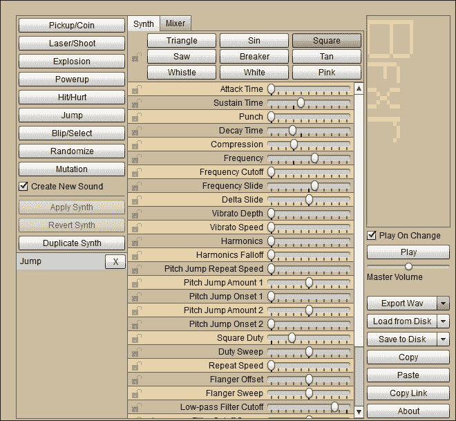
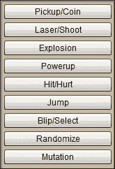

# 四、TappyDefender——回家

我们在第一场比赛中就取得了胜利。在本章中，我们将绘制一个 HUD 来显示玩家游戏中的信息，并执行游戏规则，以便玩家能够赢、输，并获得最快的时间。

之后，我们将制作一个暂停屏幕，这样玩家就可以在他们输赢后欣赏他们的成就(或不成就)。

在本章中，我们还将生成自己的声音 FX，然后将其添加到游戏中。接下来，我们将使玩家能够节省他们最快的时间，最后我们将添加一大堆小改进，包括基于玩家安卓设备屏幕分辨率的一点难度平衡。

# 显示抬头显示器

我们需要开始让我们的游戏更加全面。游戏有分数，或者，在我们的例子中，有时间，还有其他规则。为了让玩家持续查看他们的进度，我们需要显示游戏的统计数据。

在这里，我们将快速设置一个 HUD，当玩家躲避敌人时，它会在屏幕上向玩家显示他们需要知道的一切。我们还将声明和初始化向抬头显示器提供数据所需的变量。在下一节*实现规则*中，我们可以开始操纵变量，比如，护盾，时间，最快时间等等。

我们可以从给`TDView`类添加一些成员变量开始。我们为`distanceRemaining`变量使用一个浮点值，因为我们将使用伪公里和公里分数来表示在我们的英雄到达她的母星之前的剩余距离。对于`timeTaken`、`timeStarted`和`fastestTime`变量，我们将使用**长的**类型，因为时间以毫秒为单位表示，值变得非常大。在`TDView`类声明后添加该代码:

```java
private float distanceRemaining;
private long timeTaken;
private long timeStarted;
private long fastestTime;
```

现在，我们将只保留这些变量的默认值，并专注于在我们的平视显示器中显示它们。我们将在下一节*实现规则*中使它们变得有用和有意义。

现在，我们可以继续并绘制我们的 HUD 来显示玩家在玩的时候可能想知道的所有数据。像往常一样，我们将使用我们通用的`Paint`类对象`paint`来完成大部分工作。这一次，我们使用`drawText`方法向屏幕添加文本，`setTextAlign`方法调整文本大小，`setTextSize`调整文本大小。

我们现在可以将这段代码添加到我们`TDView`类的`draw`方法中。添加它作为最后一个要绘制的东西，就在调用`unlockCanvasAndPost()`之前，如突出显示的代码所示:

```java
// Draw the hud
paint.setTextAlign(Paint.Align.LEFT);
paint.setColor(Color.argb(255, 255, 255, 255));
paint.setTextSize(25);
canvas.drawText("Fastest:"+ fastestTime + "s", 10, 20, paint);
canvas.drawText("Time:" + timeTaken + "s", screenX / 2, 20, paint);
canvas.drawText("Distance:" + 
 distanceRemaining / 1000 + 
 " KM", screenX / 3, screenY - 20, paint);

canvas.drawText("Shield:" + 
 player.getShieldStrength(), 10, screenY - 20, paint);

canvas.drawText("Speed:" + 
 player.getSpeed() * 60 + 
 " MPS", (screenX /3 ) * 2, screenY - 20, paint);

// Unlock and draw the scene
ourHolder.unlockCanvasAndPost(canvas);
```

输入这段代码后，我们有一些错误，可能还有一些问题。

首先，我们将处理这些问题。我们将在下一节*实施规则*中更仔细地观察我们正在对`fastestTime`、`timeTaken`、`distanceRemaining`和`getSpeed`返回的值做什么。简而言之，它们是距离和时间的表示，用来给玩家一种他们正在做什么的感觉。它们不是距离的真实模拟，尽管时间是准确的。

我们要处理的第一个错误是由调用不存在的方法`player.getShieldStrength`引起的。将成员变量`shieldStrength`添加到`PlayerShip`类:

```java
private int shieldStrength;
```

在`PlayerShip`构造函数中初始化为`2`:

```java
 shieldStrength = 2;
```

在`PlayerShip`类中实现您缺少的 getter 方法:

```java
public int getShieldStrength() {
  return shieldStrength;
}
```

最终误差由未声明的变量`screenX`和`screenY`引起。现在很明显，我们需要这部分代码的屏幕分辨率。处理这个问题最快的方法是制造一些新的类变量，称为`screenX`和`screenY`。申报这些现在就在`TDView`类申报之后:

```java
private int screenX;
private int screenY;
```

正如我们将会看到的，知道屏幕坐标在许多地方是有用的，所以这样做是有意义的。

现在，在`TDView`构造函数中，用`GameActivity`类传入的解析初始化`screenX`和`screenY`。在构造函数开始时执行此操作:

```java
screenX = x;
screenY = y;
```

我们现在可以运行游戏，并看到我们的平视显示器。我们的平视显示器中唯一有意义数据的部分是**盾牌**和**速度**标签。速度是 MPS 的伪测量值(米/秒)。当然，它与现实没有关系，但它与飞驰的星星、接近的敌人的速度有关，很快，与玩家的目标“家”的距离越来越小:


# 执行规则

现在，我们应该暂停一下，思考一下我们需要在项目后期做什么，因为这会影响我们在执行规则时做什么。当玩家的船被摧毁或者玩家达到目标时，游戏就会结束。这意味着游戏需要重启。我们不想每次都退出回到主屏幕，所以我们需要一种从`TDView`类内部重启游戏的方法。

为了促进这一点，我们将在我们的`TDView`类中实现一个`startGame`方法。构造函数将能够调用它，我们的游戏循环也将能够在必要时调用它。

还需要将构造函数当前执行的一些任务传递给新的`startGame`方法，以便它可以正确地完成工作。此外，我们将使用`startGame`来初始化我们的游戏规则和平视显示器所需的一些变量。

为了完成我们讨论的内容，`startGame()`将需要应用程序的`Context`对象的副本。因此，就像我们对`startX`和`startY`所做的那样，我们现在将使`context`成为`TDView`的成员。`TDView`类申报后申报:

```java
private Context context;
```

在调用`super()`后立即在构造函数中初始化它，如下所示:

```java
super(context);
this.context  = context;

```

我们现在可以实施新的`startGame`方法。大部分代码只是从构造函数中移出。注意细微但重要的区别，比如使用类版本的屏幕坐标`screenX`和`screenY`代替构造器参数 *x* 和 *y* 。另外，我们初始化`distanceRemaining`、`timeTaken`和`timeStarted`。

```java
private void startGame(){
    //Initialize game objects
        player = new PlayerShip(context, screenX, screenY);
        enemy1 = new EnemyShip(context, screenX, screenY);
        enemy2 = new EnemyShip(context, screenX, screenY);
        enemy3 = new EnemyShip(context, screenX, screenY);

        int numSpecs = 40;
        for (int i = 0; i < numSpecs; i++) {
            // Where will the dust spawn?
            SpaceDust spec = new SpaceDust(screenX, screenY);
            dustList.add(spec);
        }

        // Reset time and distance
        distanceRemaining = 10000;// 10 km
        timeTaken = 0;

        // Get start time
        timeStarted = System.currentTimeMillis();
}
```

### 注

你想知道`timeStarted`初始化是怎么回事吗？我们使用`System`类`currentTimeMillis`的方法初始化了`startTime`。现在，`startTime`保存了自 1970 年 1 月 1 日以来的毫秒数。我们将在即将到来的部分*中看到这是如何使用的，结束游戏*。`System`类有很多用途。这里，我们用它来得到自 1970 年 1 月 1 日以来的毫秒数。这是计算机中测量时间的常用系统。它被称为 Unix 时间，1970 年 1 月 1 日第一毫秒之前的时刻被称为 Unix 纪元。

现在，注释掉或者删除`TDView`构造函数中现在不必要的代码，但是代之以对`startGame()`的调用:

```java
// Initialize our player ship
//player = new PlayerShip(context, x, y);
//enemy1 = new EnemyShip(context, x, y);
//enemy2 = new EnemyShip(context, x, y);
//enemy3 = new EnemyShip(context, x, y);

//int numSpecs = 40;

//for (int i = 0; i < numSpecs; i++) {
      // Where will the dust spawn?
      //SpaceDust spec = new SpaceDust(x, y);
      //dustList.add(spec);
//}

startGame();

```

接下来，我们要创建一个减少`PlayerShip`护盾强度的方法。这是为了当我们检测到碰撞时，我们可以每次减少一个。将这个简单的方法添加到`PlayerShip`类中:

```java
public void reduceShieldStrength(){
  shieldStrength --;
}
```

现在，我们可以跳到`TDView`类的`update` 方法，并添加代码来进一步实现我们的游戏规则。就在我们进行所有碰撞检测之前，我们将添加一个布尔变量`hitDetected`。在每个检测到命中的`if`模块中，我们可以将`hitDetected`设置为`true`。

然后，在所有碰撞检测代码后，我们可以看到是否检测到了命中，并相应地降低玩家的护盾强度。这是`TDView`类的`update`方法的顶部，新代码行高亮显示:

```java
// Collision detection on new positions
// Before move because we are testing last frames
// position which has just been drawn
boolean hitDetected = false;
if(Rect.intersects(player.getHitbox(), enemy1.getHitbox())){
 hitDetected = true;
    enemy1.setX(-100);
}

if(Rect.intersects(player.getHitbox(), enemy2.getHitbox())){
 hitDetected = true;
    enemy2.setX(-100);
}

if(Rect.intersects(player.getHitbox(), enemy3.getHitbox())){
 hitDetected = true;
    enemy3.setX(-100);
}

if(hitDetected) {
 player.reduceShieldStrength();
 if (player.getShieldStrength() < 0) {
 //game over so do something
 }
}

```

注意调用`player.reduceShieldStrength`后的嵌套 if 语句。这将检测玩家何时失去所有护盾并失败。我们很快就会处理这里发生的事情。

我们真的快要完成我们的游戏规则了。我们只需要相对玩家的速度降低`distanceRemaining`。这是为了让我们知道玩家何时成功。我们还需要更新`timeTaken`变量，这样每次调用我们的绘制方法时，HUD 都会更新。这可能看起来不重要，但是稍微提前考虑一下，我们可以预见游戏结束的时间，要么是因为玩家失败了，要么是因为玩家赢了。让我们谈谈游戏的结局。

# 结束游戏

如果游戏没有结束，游戏正在进行，如果玩家刚刚死亡或获胜，则游戏结束。我们需要知道游戏何时结束，何时开始。让我们创建一个新的成员变量`gameEnded`，并在`TDView`类声明之后声明它:

```java
private boolean gameEnded;
```

现在，我们可以在`startGame`方法中初始化`gameEnded`。输入此代码作为方法的最后一行。

```java
gameEnded = false;
```

现在，我们可以完成游戏规则逻辑的最后几行，但是用测试来包装它们，看看游戏是否已经结束。添加以下代码来有条件地更新我们的游戏规则逻辑，就在`TDView`类的`update`方法的末尾:

```java
if(!gameEnded) {
            //subtract distance to home planet based on current speed
            distanceRemaining -= player.getSpeed();

            //How long has the player been flying
            timeTaken = System.currentTimeMillis() - timeStarted;
}
```

我们的平视显示器现在将有准确的数据，让玩家准确地了解他们的情况。我们还可以检测玩家何时到家并获胜，因为`distanceRemaining`将过零。另外，当剩余距离小于零时，我们可以测试一下`timeTaken`是否小于`fastestTime`，如果小于则更新`fastestTime`。我们也可以将`gameEnded`设置为`true`。在`TDView`类的`update`方法中，将该代码直接添加到最后一段代码之后:

```java
//Completed the game!
if(distanceRemaining < 0){
  //check for new fastest time
  if(timeTaken < fastestTime) {
    fastestTime = timeTaken;
  }

  // avoid ugly negative numbers
  // in the HUD
  distanceRemaining = 0;

  // Now end the game
  gameEnded = true;
}
```

当玩家获胜时，我们结束了游戏；现在，添加下一行代码，当玩家失去所有护盾时结束游戏。在`TDView`类的`update`方法中更新该代码。新的代码行突出显示:

```java
if(hitDetected) {
  player.reduceShieldStrength();
  if (player.getShieldStrength() < 0) {
 gameEnded = true;
 }
}
```

现在，我们只需要在`gameEnded`设置为真时，让一些事情真正发生。

一种方法是根据`gameEnded`布尔是真还是假来交替我们如何绘制平视显示器。在`draw`方法中识别抬头显示器绘图代码，此处再次显示以便参考:

```java
// Draw the HUD
paint.setTextAlign(Paint.Align.LEFT);
paint.setColor(Color.argb(255, 255, 255, 255));
paint.setTextSize(25);
canvas.drawText("Fastest:"+ fastestTime + "s", 10, 20, paint);
canvas.drawText("Time:" + timeTaken + "s", screenX / 2, 20, paint);

canvas.drawText("Distance:" + 
  distanceRemaining / 1000 + 
  " KM", screenX / 3, screenY - 20, paint);

canvas.drawText("Shield:" + 
  player.getShieldStrength(), 10, screenY - 20, paint);

canvas.drawText("Speed:" + 
  player.getSpeed() * 60 +
  " MPS", (screenX /3 ) * 2, screenY - 20, paint);
```

我们想把代码包装在一个`if` - `else`块中。如果游戏没有结束，画正常的平视显示器，否则画一个替代品。像这样包装抬头显示器绘图代码:

```java
if(!gameEnded){
  // Draw the hud
  paint.setTextAlign(Paint.Align.LEFT);
  paint.setColor(Color.argb(255, 255, 255, 255));
  paint.setTextSize(25);
  canvas.drawText("Fastest:"+ fastestTime + "s", 10, 20, paint);

  canvas.drawText("Time:" + 
    timeTaken + 
    "s", screenX / 2, 20,   paint);

  canvas.drawText("Distance:" + 
    distanceRemaining / 1000 + 
    " KM", screenX / 3, screenY - 20, paint);

  canvas.drawText("Shield:" + 
    player.getShieldStrength(), 10, screenY - 20, paint);

  canvas.drawText("Speed:" + 
    player.getSpeed() * 60 +
    " MPS", (screenX /3 ) * 2, screenY - 20, paint);

}else{
 //this happens when the game is ended
}

```

现在，让我们来处理`else`区块，游戏结束后我们将执行该区块。我们要做的是在上画一个大的**游戏，并从平视显示器上显示游戏结束的统计数据。线程继续运行，但抬头显示器停止更新。在`else`框中输入该代码:**

```java
// Show pause screen
paint.setTextSize(80);
paint.setTextAlign(Paint.Align.CENTER);
canvas.drawText("Game Over", screenX/2, 100, paint);
paint.setTextSize(25);
canvas.drawText("Fastest:"+ 
  fastestTime + "s", screenX/2, 160, paint);

canvas.drawText("Time:" + timeTaken + 
  "s", screenX / 2, 200, paint);

canvas.drawText("Distance remaining:" + 
  distanceRemaining/1000 + " KM",screenX/2, 240, paint);

paint.setTextSize(80);
canvas.drawText("Tap to replay!", screenX/2, 350, paint);
```

请注意，我们使用`setTextSize()`切换文本大小，并使用`setTextAlign()`对齐屏幕中心的所有文本。这就是你运行游戏时的样子。我们只需要在游戏结束后重启游戏的方法:


## 重启游戏

为了让玩家在游戏结束后重启，我们只需要听一听触摸并呼叫`startGame()`。让我们编辑我们的`onTouchListener()`代码来实现这一点。案例`MotionEvent.ACTION_DOWN:`是我们有兴趣修改的案例。我们可以简单地在这里添加条件，如果游戏结束时屏幕被触摸，重启。要添加到案例`MotionEvent.ACTION_DOWN:`的新代码突出显示:

```java
// Has the player touched the screen?
case MotionEvent.ACTION_DOWN:
    player.setBoosting();
 // If we are currently on the pause screen, start a new game
 if(gameEnded){
 startGame();
 }
   break;
```

试试看。您现在可以通过点击屏幕从暂停菜单中重新开始游戏。是只有我还是这里有点安静？

# 添加声音 FX

在安卓中添加音效真的很简单。首先，让我们看看我们可以从哪里获得我们的声音效果。如果你只是想继续编码，可以使用`Chapter4/assets`文件夹中的我的声音 FX。

## 生成外汇

我们的 Tappy Defender 游戏需要四种音效:

*   当我们的玩家撞上外星人时的声音，我们称之为`bump.ogg`。
*   玩家毁灭时的声音，我们称之为`destroyed.ogg`。
*   游戏刚开始时的有趣声音，我们称之为`start.ogg`。
*   最后是胜利的呐喊声，我们称之为`win.ogg`。

这里有一个使用 BFXR 制作这些声音效果的快速指南。从[www.bfxr.net](http://www.bfxr.net)抢一份免费的 BFXR 。

按照网站上的简单说明进行设置。试着做一些这样的事情，让我们的声音听起来很酷。

### 注

这是一个非常精简的教程。你可以用 BFXR 做这么多。要了解更多信息，请阅读网站上的提示，网址为。

1.  Run `bfxr.exe`.

    

2.  Try out all the preset types, which generate a random sound of the type you are working on. When you have a sound that is close to what you want, move to the next step:

    

3.  Use the sliders to fine-tune the pitch, duration, and other aspects of your new sound:

    

4.  Save your sound by clicking on the **Export Wav** button. Despite the name of this button, as we will see we can save in formats other than `.wav` too.

    

5.  安卓喜欢处理 OGG 格式的声音，所以当被要求给你的文件命名时，在文件名的末尾使用`.ogg`扩展名。请记住，我们需要创建`bump.ogg`、`destroyed.ogg`、`start.ogg`和`win.ogg`。
6.  重复步骤 2 到 5，创建我们讨论过的四种声音 FX。
7.  右键点击安卓工作室的`app`文件夹。从弹出菜单中，导航至**新建** | **安卓资源目录**。
8.  在**目录名称**字段中，键入`assets`。点击**确定**创建`assets`文件夹。
9.  使用您的操作系统的文件管理器将一个名为`assets`的文件夹添加到项目的主文件夹中，然后将这四个声音文件添加到项目的新资产文件夹中。

## 音池类

为了播放我们的声音，我们将使用课程。我们正在使用`SoundPool`构造函数的弃用版本，因为新版本需要 API 21 或更新版本，并且很可能许多读者将使用早期版本的 Android。我们可以动态获取安卓版本，并为 21 级 API 前后提供不同版本的代码，但是旧的构造函数满足了我们的需求。

## 对声音 FX 进行编码

声明一个`SoundPool`对象和一些整数来表示各个声音。在`TDView`类声明后添加该代码:

```java
private SoundPool soundPool;
    int start = -1;
    int bump = -1;
    int destroyed = -1;
    int win = -1;
```

接下来，我们可以初始化我们的`SoundPool`对象和我们的整数声音标识。我们根据需要将代码包装在`try` - `catch`块中。

请注意，对`load()`的调用启动了将我们的`.ogg`文件转换为原始声音数据的过程。如果在呼叫`playSound()`时该过程没有结束，则声音不会播放。对`load()`的调用按照它们被用来最小化这种可能性的可能顺序。如图所示，在我们的`TDView`类的构造函数中输入该代码。新代码突出显示:

```java
TDView(Context context, int x, int y) {
  super(context);
  this.context  = context;

 // This SoundPool is deprecated but don't worry
 soundPool = new SoundPool(10, AudioManager.STREAM_MUSIC,0);
 try{
 //Create objects of the 2 required classes
 AssetManager assetManager = context.getAssets();
 AssetFileDescriptor descriptor;

 //create our three fx in memory ready for use
 descriptor = assetManager.openFd("start.ogg");
 start = soundPool.load(descriptor, 0);

 descriptor = assetManager.openFd("win.ogg");
 win = soundPool.load(descriptor, 0);

 descriptor = assetManager.openFd("bump.ogg");
 bump = soundPool.load(descriptor, 0);

 descriptor = assetManager.openFd("destroyed.ogg");
 destroyed = soundPool.load(descriptor, 0);

 }catch(IOException e){
 //Print an error message to the console
 Log.e("error", "failed to load sound files");
 }

```

在我们的代码中代表游戏中适当事件的点上，使用适当的引用添加对`playSound()`的调用。我们有四种声音，所以将向`playSound()`发出四个呼叫。

第一个是`startGame()`方法的末尾:

```java
soundPool.play(start, 1, 1, 0, 0, 1);
```

接下来的两个在`if(hitDetected)`框中突出显示:

```java
if(hitDetected) {
 soundPool.play(bump, 1, 1, 0, 0, 1);
  player.reduceShieldStrength();
  if (player.getShieldStrength() < 0) {
 soundPool.play(destroyed, 1, 1, 0, 0, 1);
      paused = true;
  }
}
```

最后一个在`if(distanceRemaining < 0)`块，高亮显示:

```java
//Completed the game!
if(distanceRemaining < 0){
 soundPool.play(win, 1, 1, 0, 0, 1);
     //check for new fastest time
     if(timeTaken < fastestTime) {
         fastestTime = timeTaken;
     }

     // avoid ugly negative numbers
     // in the HUD
     distanceRemaining = 0;

     // Now end the game
     gameEnded = true;
}
```

现在是时候运行 Tappy Defender，并听到声音在行动。

我们将看看如何保存我们的球员的高分，当他们达到时将其保存到一个文件中，并在TappyDefender开始时再次将其加载回。

# 添加持久性

你可能已经注意到了，目前最快的时间是零，因此永远不可能被打败。另一个问题是，每次玩家退出游戏，高分都会丢失。现在，我们将从文件中加载一个默认的高分。当获得新的高分时，将其保存到文件中。玩家退出游戏甚至关掉手机都无所谓；他们的高分将保持不变。

首先我们需要两个新对象。在`TDView`类声明之后，声明他们为`TDView`类的成员。第一个是`SharedPreferences`对象，第二个是`Editor`对象，它实际上为我们写入文件:

```java
private SharedPreferences prefs;
private SharedPreferences.Editor editor;
```

我们首先使用`prefs`，因为我们只是想尝试加载一个高分(如果有的话)。我们也将初始化`editor`为我们保存高分做好准备。我们在`TDView`构造器中这样做:

```java
// Get a reference to a file called HiScores. 
// If id doesn't exist one is created
prefs = context.getSharedPreferences("HiScores", 
  context.MODE_PRIVATE);

// Initialize the editor ready
editor = prefs.edit();

// Load fastest time from a entry in the file
//  labeled "fastestTime"
// if not available highscore = 1000000
fastestTime = prefs.getLong("fastestTime", 1000000);
```

适当的时候，让我们使用`Editor`对象将任何新的最快时间写入`HiScores`文件。添加额外突出显示的行，将建议的更改添加到我们的文件中，首先添加到缓冲区，然后提交更改:

```java
//Completed the game!
if(distanceRemaining < 0){
 soundPool.play(win, 1, 1, 0, 0, 1);
     //check for new fastest time
     if(timeTaken < fastestTime) {
         // Save high score
         editor.putLong("fastestTime", timeTaken);
         editor.commit();
         fastestTime = timeTaken;
     }

     // avoid ugly negative numbers
     // in the HUD
     distanceRemaining = 0;

     // Now end the game
     gameEnded = true;
}
```

我们需要做的最后一件事是让主屏幕以最快的时间加载并显示给玩家。我们将以与我们在`TDView`构造函数中完全相同的方式加载最快的时间。我们还将通过其 ID `textHighScore`获得对我们的`TextView`的引用，该 ID 是我们在[第 2 章](02.html "Chapter 2. Tappy Defender – First Step")、*Tappy卫士–第一步*开始时分配的。然后我们使用`setText`方法将其显示给玩家。

打开`MainActivity.java`并将高亮显示的代码添加到`onCreate`方法中，以实现我们刚才讨论的内容:

```java
// This is the entry point to our game
@Override
protected void onCreate(Bundle savedInstanceState) {
  super.onCreate(savedInstanceState);

  //Here we set our UI layout as the view
  setContentView(R.layout.activity_main);

 // Prepare to load fastest time
 SharedPreferences prefs;
 SharedPreferences.Editor editor;
 prefs = getSharedPreferences("HiScores", MODE_PRIVATE);

  // Get a reference to the button in our layout
  final Button buttonPlay =
    (Button)findViewById(R.id.buttonPlay);

 // Get a reference to the TextView in our layout
 final TextView textFastestTime = 
 (TextView)findViewById(R.id.textHighScore);

  // Listen for clicks
  buttonPlay.setOnClickListener(this);

 // Load fastest time
 // if not available our high score = 1000000
 long fastestTime = prefs.getLong("fastestTime", 1000000);

 // Put the high score in our TextView
 textFastestTime.setText("Fastest Time:" + fastestTime);

}
```

现在，我们有一个完整的工作游戏。然而，它是还没有真正完成。为了让游戏真正具有可玩性和趣味性，我们必须改进、提炼、测试和迭代。

# 迭代

如何让我们的游戏更好玩？让我们看一看的可能性数量，然后开始实施它们。

## 多个不同的敌人图形

让我们通过给游戏增加一些图形来让敌人更有趣一点。首先，我们需要向项目中添加额外的图形。将下载包的`Chapter4/drawables`文件夹中的`enemy2.png`和`enemy3.png`复制粘贴到安卓工作室的`drawables`文件夹中。


敌人 2 和敌人 3

现在，我们只需要修改`EnemyShip`构造函数。这段代码生成一个介于 0 和 2 之间的随机数，然后相应地切换到加载不同的敌人位图。我们完整的构造函数现在如下所示:

```java
// Constructor
public EnemyShip(Context context, int screenX, int screenY){
 Random generator = new Random();
 int whichBitmap = generator.nextInt(3);
 switch (whichBitmap){
 case 0:
 bitmap = BitmapFactory.decodeResource
 (context.getResources(), R.drawable.enemy3);
 break;

 case 1:
 bitmap = BitmapFactory.decodeResource
 (context.getResources(), R.drawable.enemy2);
 break;

 case 2:
 bitmap = BitmapFactory.decodeResource
 (context.getResources(), R.drawable.enemy);
 break;
 }

    maxX = screenX;
    maxY = screenY;
    minX = 0;
    minY = 0;

    speed = generator.nextInt(6)+10;
    x = screenX;
    y = generator.nextInt(maxY) - bitmap.getHeight();

    // Initialize the hit box
    hitBox = new Rect(x, y, bitmap.getWidth(),  bitmap.getHeight());

}
```

注意我们只需要将`Random generator = new Random();`行代码移动到构造函数的顶部，这样我们就可以像往常一样在构造函数中选择位图以及生成随机高度。

## 平衡练习

游戏中最大的可玩性问题可能是在中/高分辨率屏幕上与在低分辨率屏幕上玩时的难度差异。例如，我的一个测试设备是三星 Galaxy S2。现在几年了，在横屏位置握持时屏幕分辨率为 800 x 480 像素。作为对比，我在三星 Galaxy S4 上测试了这款游戏，它在横向模式下的像素为 1920 x 1080。这是 S2 决议的两倍多。

在 S4 号上，玩家似乎毫不费力地在几乎无足轻重的敌人之间滑行，而在 S2 号上，玩家面临着一堵几乎无法穿透的外星钢铁墙。

这个问题的真正解决方案是在伪真实世界坐标上绘制游戏对象，然后将这些坐标以相同的比例映射回设备，而不考虑分辨率。这样，游戏在 S2 和 S4 上看起来和玩起来都一样。在下一个项目中，我们将构建一个更高级的游戏引擎来实现这一点。

当然，我们仍然会考虑实际的物理屏幕尺寸，使玩家的体验多样化，但这是游戏玩家更容易接受的情况。

作为快速和肮脏的解决方案，我们将改变船只的大小和敌人的数量。所以在低分辨率下，我们会有三个敌人，但是我们会缩小他们的尺寸。在更高的分辨率下，我们会逐渐增加敌人的数量。

在`EnemyShip`类中，在将我们的敌人图形加载到我们的`Bitmap`对象中的`switch`块之后，添加高亮显示的行来调用我们即将编写的新方法`scaleBitmap()`:

```java
switch (whichBitmap){
    case 0:
          bitmap = BitmapFactory.decodeResource(context.getResources(),           
          R.drawable.enemy3);
          break;

    case 1:
          bitmap = BitmapFactory.decodeResource(context.getResources(),           
          R.drawable.enemy2);
          break;

   case 2:
          bitmap = BitmapFactory.decodeResource(context.getResources(),           
          R.drawable.enemy);
          break;
}

scaleBitmap(screenX);

```

现在，我们将编写我们的新`scaleBitmap`方法。这个简单的助手方法只需要一个参数，正如我们所看到的，就是屏幕的水平分辨率。然后，我们使用分辨率和静态`createScaledBitmap`方法，根据屏幕的分辨率，以 2 或 3 的比例缩小我们的`Bitmap`对象。将新的`scaleBitmap`方法添加到`EnemyShip`类中:

```java
public void scaleBitmap(int x){

  if(x < 1000) {
       bitmap = Bitmap.createScaledBitmap(bitmap,
       bitmap.getWidth() / 3,
       bitmap.getHeight() / 3,
       false);
  }else if(x < 1200){
       bitmap = Bitmap.createScaledBitmap(bitmap,
       bitmap.getWidth() / 2,
       bitmap.getHeight() / 2,
       false);
   }
}
```

敌人将在低分辨率屏幕上缩小尺寸。现在，让我们为更高的分辨率增加敌人的数量。

为此，我们将向`TDView`类添加代码，为更高分辨率的屏幕添加额外的敌人。

### 注

警告！这段代码很糟糕，但它很有效，它向我们展示了我们可以在下一个项目中进行改进的地方。在规划游戏时，好的设计和简单性之间总是有一个折衷。通过从一开始就让事情有条不紊，我们可以在接近尾声时逃脱一些黑客攻击。是的，我们可以重新设计我们生成和存储游戏对象的方式，如果 Tappy Defender 是一个正在进行的项目，那么这将是值得的。

在前三个对象后再添加两个敌船对象，如图:

```java
// Game objects
private PlayerShip player;
public EnemyShip enemy1;
public EnemyShip enemy2;
public EnemyShip enemy3;
public EnemyShip enemy4;
public EnemyShip enemy5;

```

现在，在`startGame`方法中添加代码来有条件地初始化这两个新对象:

```java
enemy1 = new EnemyShip(context, screenX, screenY);
enemy2 = new EnemyShip(context, screenX, screenY);
enemy3 = new EnemyShip(context, screenX, screenY);

if(screenX > 1000){
 enemy4 = new EnemyShip(context, screenX, screenY);
}

if(screenX > 1200){
 enemy5 = new EnemyShip(context, screenX, screenY);
}

```

在`update`方法中添加代码来更新我们的第四个和第五个敌人，并检查碰撞:

```java
// Collision detection on new positions
// Before move because we are testing last frames
// position which has just been drawn
boolean hitDetected = false;
if(Rect.intersects(player.getHitbox(), enemy1.getHitbox())){
  hitDetected = true;
  enemy1.setX(-100);
}

if(Rect.intersects(player.getHitbox(), enemy2.getHitbox())){
  hitDetected = true;
  enemy2.setX(-100);        
}

if(Rect.intersects(player.getHitbox(), enemy3.getHitbox())){
  hitDetected = true;
  enemy3.setX(-100);       
}

if(screenX > 1000){
 if(Rect.intersects(player.getHitbox(), enemy4.getHitbox())){
 hitDetected = true;
 enemy4.setX(-100); 
 }
}

if(screenX > 1200){
 if(Rect.intersects(player.getHitbox(), enemy5.getHitbox())){
 hitDetected = true;
 enemy5.setX(-100);
 }
}

if(hitDetected) {
soundPool.play(bump, 1, 1, 0, 0, 1);
            player.reduceShieldStrength();
            if (player.getShieldStrength() < 0) {
                soundPool.play(destroyed, 1, 1, 0, 0, 1);
                gameEnded = true;
            }
}

// Update the player
player.update();
// Update the enemies
enemy1.update(player.getSpeed());
enemy2.update(player.getSpeed());
enemy3.update(player.getSpeed());

if(screenX > 1000) {
 enemy4.update(player.getSpeed());
}
if(screenX > 1200) {
 enemy5.update(player.getSpeed());
}

```

最后，在`draw`方法中，在适当的时候画出我们额外的敌人:

```java
// Draw the player
canvas.drawBitmap(player.getBitmap(), player.getX(), player.getY(), paint);
canvas.drawBitmap(enemy1.getBitmap(),
  enemy1.getX(), enemy1.getY(), paint);
canvas.drawBitmap(enemy2.getBitmap(),
  enemy2.getX(), enemy2.getY(), paint);
canvas.drawBitmap(enemy3.getBitmap(),
  enemy3.getX(), enemy3.getY(), paint);

if(screenX > 1000) {
 canvas.drawBitmap(enemy4.getBitmap(),
 enemy4.getX(), enemy4.getY(), paint);
}
if(screenX > 1200) {
 canvas.drawBitmap(enemy5.getBitmap(),
 enemy5.getX(), enemy5.getY(), paint);
}

```

当然，我们现在意识到我们可能也喜欢缩放玩家。这清楚地表明，也许我们需要一个`Ship`类，从中我们可以导出`PlayerShip`和`EnemyShip`。

除此之外，我们为更高分辨率的屏幕增加额外敌人的繁琐方式和一个更加多态的解决方案可能是值得的。我们将在下一个项目中看到我们如何能够认真地改进我们游戏引擎的这一方面以及几乎所有其他方面。

## 格式化时间

看看时间是如何在玩家的 HUD 中格式化的:


恶心！让我们编写一个简单的助手方法，让它看起来更好。我们将向`TDView`类添加一个名为`formatTime()`的新方法。该方法使用游戏中经过的毫秒数(`timeTaken`)并将它们重新组织成秒和几分之一秒。它在适当的地方用零填充分数，并将结果作为准备在`TDView`类的`draw`方法中绘制的`String`返回。该方法采用参数而不仅仅使用成员变量`timeTaken`的原因是，我们可以在一分钟内重用这些代码。

```java
private String formatTime(long time){
    long seconds = (time) / 1000;
    long thousandths = (time) - (seconds * 1000);
    String strThousandths = "" + thousandths;
    if (thousandths < 100){strThousandths = "0" + thousandths;}
    if (thousandths < 10){strThousandths = "0" + strThousandths;}
    String stringTime = "" + seconds + "." + strThousandths;
    return stringTime;
}
```

我们修改在玩家 HUD 中绘制时间的线条。对于上下文，在下一段代码中，我已经注释掉了原始行的全部内容，并提供了新行，其中包括我们对`formatTime()`的调用，并突出显示了它:

```java
//canvas.drawText("Time:" + timeTaken + "s", screenX / 2, 20, paint);
canvas.drawText("Time:" + 
 formatTime(timeTaken) + 
 "s", screenX / 2, 20, paint);

```

此外，只要稍加改动，我们就可以在平视显示器的**最快:**标签上使用这种格式。同样，旧行被注释掉，新行被突出显示。在`TDView`类的`draw`方法中找到并修改代码:

```java
//canvas.drawText("Fastest:" + fastestTime + "s", 10, 20, paint);
canvas.drawText("Fastest:" + 
 formatTime(fastestTime) + 
 "s", 10, 20, paint);

```

我们还应该更新暂停屏幕上的时间格式。要更改的行被注释掉，要添加的新行被突出显示:

```java
// Show pause screen
paint.setTextSize(80);
paint.setTextAlign(Paint.Align.CENTER);
canvas.drawText("Game Over", screenX/2, 100, paint);
paint.setTextSize(25);

// canvas.drawText("Fastest:"
  + fastestTime + "s", screenX/2, 160, paint);
canvas.drawText("Fastest:"+ 
 formatTime(fastestTime) + "s", screenX/2, 160, paint);

// canvas.drawText("Time:" + 
  timeTaken + "s", screenX / 2, 200, paint);
canvas.drawText("Time:" 
 + formatTime(timeTaken) + "s", screenX / 2, 200, paint);

canvas.drawText("Distance remaining:" +
  distanceRemaining/1000 + " KM",screenX/2, 240, paint);
paint.setTextSize(80);
canvas.drawText("Tap to replay!", screenX/2, 350, paint);
```

**最快:**现在在游戏内 HUD 和暂停屏幕 HUD 上的格式与**时间:**相同。现在来看看我们的时间格式:


## 按下后退按钮

我们将快速添加一小段代码来处理当玩家按下安卓设备上的后退按钮时会发生什么。将此新方法添加到`GameActivity`和`MainActivity`类中。我们只需检查是否按下了返回按钮，如果是，则调用`finish()`让操作系统知道我们完成了此活动。

```java
// If the player hits the back button, quit the app
public boolean onKeyDown(int keyCode, KeyEvent event) {
  if (keyCode == KeyEvent.KEYCODE_BACK) {
       finish();
       return true;
  }
  return false;
}
```

# 游戏结束

最后，如果你遵循的是理论而不是实际，这里是一个高分辨率屏幕上的成品`GameActivity`，有几百颗额外的恒星和护盾:


# 总结

我们已经实现了一个基本游戏引擎的组成部分。我们可以做得更多。当然，一款现代手机游戏会比我们的有更多的内容。当有更多的游戏对象时，我们将如何处理碰撞？我们不能稍微收紧一下我们的班级等级吗，因为我们的`PlayerShip`和`EnemyShip`班级之间有很多相似之处？我们如何在不混淆代码结构的情况下添加复杂的内部角色动画，如果我们想要聪明的敌人，能够真正思考的敌人呢？

我们需要现实的背景、次要目标、动力和接机。我们想要一个有真实世界坐标的游戏世界，无论屏幕分辨率如何，都可以准确地映射回来。

我们需要一个更智能的游戏循环，它以相同的速度运行游戏，而不管它是在哪个中央处理器上处理的。最重要的是，我们真正需要的，比这些东西更重要的，是一把肮脏的大机枪。让我们构建一个经典的平台游戏。