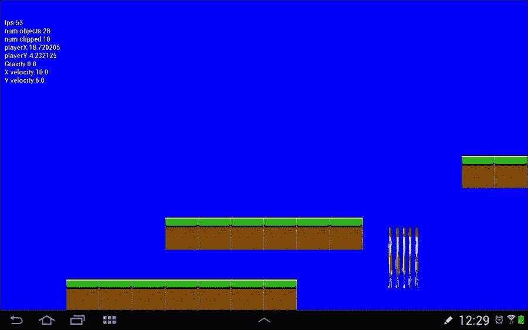
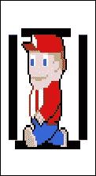
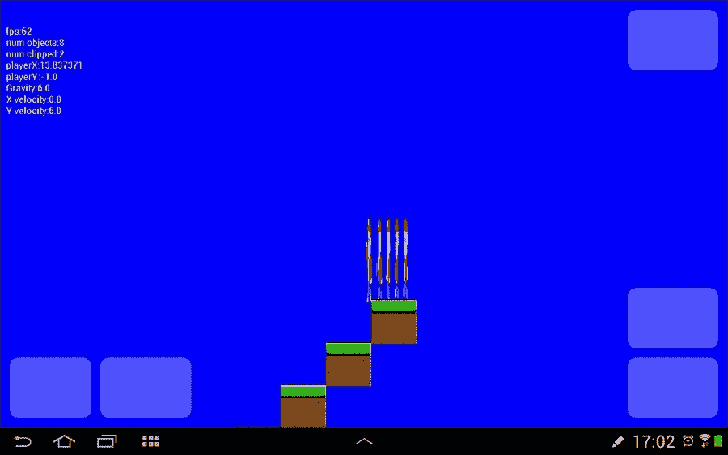
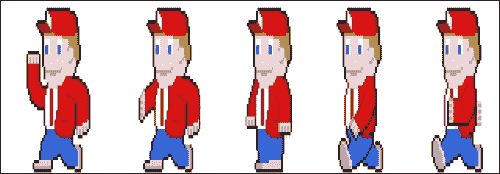

# 六、Platformer——哔哔哔

现在我们的基本游戏引擎已经建立，我们可以开始取得一些快速的进展。在本章中，我们将快速添加一个`SoundManager`类，我们将使用它随时随地发出噪音。之后，我们将在 Bob 的骨头上放一些肉，实现我们在`Player`类中需要的核心功能。然后，我们可以处理我们的多相碰撞检测的第二阶段(裁剪后)，并赋予鲍勃能够站在平台上的有用技能。

在我们完成这一重大壮举后，我们将通过实现`InputController`类将鲍勃的控制权移交给玩家。鲍勃终于能跑来跑去，跳起来了。在这一章的最后，我们将动画鲍勃的精灵表，使他实际上似乎运行，而不是到处滑动。

# 声音管理器类

在接下来的几章中，我们将为各种事件添加音效。有时这些声音会在主`PlatformView`类中直接触发，但其他时候，它们需要在代码中更偏远的角落被触发，比如`InputController`类，甚至在`GameObject`类中。我们将快速制作一个简单的`SoundManager`类，当需要嘟嘟声时，可以根据需要传递和使用。

创建一个新的 Java 类，并将其称为`SoundManager`。这门课有三个主要部分。在第一部分中，我们简单地声明一个`SoundPool`对象和一堆`int`变量来保存对每个音效的引用。输入代码的第一部分、声明和成员:

```java
import android.content.Context;
import android.content.res.AssetFileDescriptor;
import android.content.res.AssetManager;
import android.media.AudioManager;
import android.media.SoundPool;
import android.util.Log;

import java.io.IOException;

public class SoundManager {
    private SoundPool soundPool;
    int shoot = -1;
    int jump = -1;
    int teleport = -1;
    int coin_pickup = -1;
    int gun_upgrade = -1;
    int player_burn = -1;
    int ricochet = -1;
    int hit_guard = -1;
    int explode = -1;
    int extra_life = -1;
```

该类的第二部分是`loadSound`方法，不出所料，它将所有声音加载到内存中，准备播放。一旦我们在`PlatformView`构造函数中初始化了一个`SoundManager`对象，我们就会调用这个函数。接下来输入该代码:

```java
public void loadSound(Context context){
    soundPool = new SoundPool(10, AudioManager.STREAM_MUSIC,0);
    try{
        //Create objects of the 2 required classes
        AssetManager assetManager = context.getAssets();
        AssetFileDescriptor descriptor;

        //create our fx
        descriptor = assetManager.openFd("shoot.ogg");
        shoot = soundPool.load(descriptor, 0);

        descriptor = assetManager.openFd("jump.ogg");
        jump = soundPool.load(descriptor, 0);

        descriptor = assetManager.openFd("teleport.ogg");
        teleport = soundPool.load(descriptor, 0);

        descriptor = assetManager.openFd("coin_pickup.ogg");
        coin_pickup = soundPool.load(descriptor, 0);

        descriptor = assetManager.openFd("gun_upgrade.ogg");
        gun_upgrade = soundPool.load(descriptor, 0);

        descriptor = assetManager.openFd("player_burn.ogg");
        player_burn = soundPool.load(descriptor, 0);

        descriptor = assetManager.openFd("ricochet.ogg");
        ricochet = soundPool.load(descriptor, 0);

        descriptor = assetManager.openFd("hit_guard.ogg");
        hit_guard = soundPool.load(descriptor, 0);

        descriptor = assetManager.openFd("explode.ogg");
        explode = soundPool.load(descriptor, 0);

        descriptor = assetManager.openFd("extra_life.ogg");
        extra_life = soundPool.load(descriptor, 0);

    }catch(IOException e){
        //Print an error message to the console
        Log.e("error", "failed to load sound files");

    }

}
```

最后是我们的课，我们需要能够播放任何我们喜欢的声音。这个`playSound`方法只是打开一个作为参数传入的字符串。当我们有一个`SoundManager`对象时，我们可以用一个适当的字符串参数来调用`playSound()`:

```java
public void playSound(String sound){
        switch (sound){
            case "shoot":
                soundPool.play(shoot, 1, 1, 0, 0, 1);
                break;

            case "jump":
                soundPool.play(jump, 1, 1, 0, 0, 1);
                break;

            case "teleport":
                soundPool.play(teleport, 1, 1, 0, 0, 1);
                break;

            case "coin_pickup":
                soundPool.play(coin_pickup, 1, 1, 0, 0, 1);
                break;

            case "gun_upgrade":
                soundPool.play(gun_upgrade, 1, 1, 0, 0, 1);
                break;

            case "player_burn":
                soundPool.play(player_burn, 1, 1, 0, 0, 1);
                break;

            case "ricochet":
                soundPool.play(ricochet, 1, 1, 0, 0, 1);
                break;

            case "hit_guard":
                soundPool.play(hit_guard, 1, 1, 0, 0, 1);
                break;

            case "explode":
                soundPool.play(explode, 1, 1, 0, 0, 1);
                break;

            case "extra_life":
                soundPool.play(extra_life, 1, 1, 0, 0, 1);
                break;

        }

    }
}// End SoundManager
```

在前一章的新游戏引擎类之后，在`PlatformView`类声明之后声明一个类型为`SoundManager`的新对象。

```java
// Our new engine classes
private LevelManager lm;
private Viewport vp;
InputController ic;
SoundManager sm;

```

接下来，初始化`SoundManager`对象，并在`PlatformView`构造函数中调用`loadSound()`，如图所示:

```java
// Initialize the viewport
vp = new Viewport(screenWidth, screenHeight);

sm = new SoundManager();
sm.loadSound(context);

loadLevel("LevelCave", 15, 2);
```

你可以使用 BFXR创建所有你自己的声音，或者直接从`Chapter6/assets`文件夹复制我的声音。将所有声音复制到安卓工作室项目中的`assets`文件夹。在项目的`src/main`文件夹中创建一个`assets`文件夹，以便在该文件夹尚不存在的情况下实现这一点。

现在，我们可以在任何我们喜欢的地方播放音效。是时候让我们的英雄鲍勃复活了。

# 介绍鲍勃

在这里，我们可以把的肉加到你`Player`类的骨头上。不过，这一节不会是我们最后一次重温`Player`课。现在，我们将添加必要的功能来允许鲍勃移动。完成后，我们将立即添加代码，以允许玩家使用即将到来的碰撞检测代码和`Animation`类。

首先需要给`Player`类增加一些成员。`Player`类需要知道它能移动多快，当玩家按下左或右控制时，以及它是下降还是跳跃。另外，`Player`班需要知道自己跳了多久，应该跳多久。

下一段代码为我们监控所有这些事情提供了变量。我们很快就会看到，我们如何利用它们让鲍勃做我们想做的事情。

现在，我们知道变量是干什么的了。我们可以在类声明之后添加这段代码，如下所示:

```java
public class Player extends GameObject {

 final float MAX_X_VELOCITY = 10;
 boolean isPressingRight = false;
 boolean isPressingLeft = false;

 public boolean isFalling;
 private boolean isJumping;
 private long jumpTime;
 private long maxJumpTime = 700;// jump 7 10ths of second

```

此外，我们还需要跟踪一些其他与运动相关的情况，但它们在其他课程中也会很有用。因此，我们将它们作为成员添加到`GameObject`类中。我们将使用以下变量跟踪当前的水平和垂直速度、对象面对的方向以及对象是否可以移动。将这些添加到`GameObject`类:

```java
private float xVelocity;
private float yVelocity;
final int LEFT = -1;
final int RIGHT = 1;
private int facing;
private boolean moves = false;
```

现在，在`GameObject`类中，我们将添加一个`move`方法。这种方法只是检查任意一个轴上的速度不为零，如果为零，则通过改变其`worldLocation`对象来移动对象。该方法使用速度(或`xVelocity`或`yVelocity`)除以每秒当前帧来计算移动每帧的距离。这确保了无论当前每秒帧数如何，移动都是准确无误的。不管我们的游戏执行是否流畅或者有一点波动，也不管安卓设备中的 CPU 有多强大或者多弱小。我们将很快从`Player`类的`update`方法中调用这个`move`方法。在项目的后面，我们也将从其他类中调用它。

```java
void move(long fps){
        if(xVelocity != 0) {
            this.worldLocation.x += xVelocity / fps;
        }

        if(yVelocity != 0) {
            this.worldLocation.y += yVelocity / fps;
        }
    }
```

接下来，在`GameObject`类中，我们有一堆之前添加的新变量的获取器和设置器。唯一需要注意的是，两个速度变量(`setxVelocity`和`setyVelocity`)的设置器在实际赋值之前会检查`if(moves)`。将这些新的吸气剂和沉降剂添加到`GameObject`类中。

```java
public int getFacing() {
  return facing;
}

public void setFacing(int facing) {
  this.facing = facing;
}

public float getxVelocity() {
  return xVelocity;
}

public void setxVelocity(float xVelocity) {
  // Only allow for objects that can move
  if(moves) {
    this.xVelocity = xVelocity;
  }
}

public float getyVelocity() {
  return yVelocity;
}

public void setyVelocity(float yVelocity) {
  // Only allow for objects that can move
  if(moves) {
    this.yVelocity = yVelocity;
  }
}

public boolean isMoves() {
  return moves;
}

public void setMoves(boolean moves) {
  this.moves = moves;
}

public void setActive(boolean active) {
  this.active = active;
}
```

现在，回到`Player`类构造器，我们可以在创建时使用这些新方法来设置对象。将高亮显示的代码添加到`Player`构造函数中:

```java
setHeight(HEIGHT); // 2 metre tall
setWidth(WIDTH); // 1 metre wide

// Standing still to start with
setxVelocity(0);
setyVelocity(0);
setFacing(LEFT);
isFalling = false;

// Now for the player's other attributes
// Our game engine will use these
setMoves(true);
setActive(true);
setVisible(true);
//...

```

最后，我们可以在`Player`类的`update`方法中实际使用所有这些新代码。

首先，我们处理`isPressingRight`或`isPressingLeft`为真时发生的事情。当然，我们仍然需要能够通过触摸屏幕来设置这些变量。很简单，如果`isPressingRight`为真，下一个代码块将水平速度设置为`MAX_X_VELOCITY`，如果`isPressingLeft`为真，则设置为`-MAX_X_VELOCITY`。如果两者都不是真的，它将水平速度设置为零，这是静止的。

```java
public void update(long fps, float gravity) {
 if (isPressingRight) {
 this.setxVelocity(MAX_X_VELOCITY);
 } else if (isPressingLeft) {
 this.setxVelocity(-MAX_X_VELOCITY);
 } else {
 this.setxVelocity(0);
 }

```

接下来，我们检查玩家移动的方向，并以`RIGHT`或`LEFT`作为参数调用`setFacing()`。

```java
//which way is player facing?
if (this.getxVelocity() > 0) {
  //facing right
  setFacing(RIGHT);
} else if (this.getxVelocity() < 0) {
  //facing left
  setFacing(LEFT);
}//if 0 then unchanged
```

现在，我们可以处理跳跃。当玩家按下跳转按钮时，如果成功，`isJumping`将被设置为真，`jumpTime`将被设置为当前系统时间。因此，我们可以在每一帧进入`if(isJumping)`块，测试鲍勃已经跳了多长时间，如果他没有超过`maxJumpTime`，采取两个可能的动作之一。

行动一是；如果我们跳了不到一半，则 *y* 速度被设置为`-gravity`(上升)。行动二是；如果鲍勃跳了一半以上，他的 *y* 速度被设置为`gravity`(下降)。

当超过`maxJumpTime`时，`isJumping`被设置回假，直到下一次玩家点击跳转按钮。以下代码中的最后一个`else`子句在`isJumping`为假时执行，并将玩家的`y`速度设置为`gravity`。请注意将`isFalling`设置为`true`的附加代码行。正如我们将看到的，这个变量被用来控制当玩家最初试图跳跃时会发生什么，在我们的碰撞检测代码中也是如此。它基本上阻止了玩家在半空中跳跃。

```java
// Jumping and gravity
if (isJumping) {
  long timeJumping = System.currentTimeMillis() - jumpTime;
  if (timeJumping < maxJumpTime) {
    if (timeJumping < maxJumpTime / 2) {
      this.setyVelocity(-gravity);//on the way up
       } else if (timeJumping > maxJumpTime / 2) {
          this.setyVelocity(gravity);//going down
       }
  } else {
    isJumping = false;
  }
} else {
      this.setyVelocity(gravity);
      // Read Me!
      // Remove this next line to make the game easier
      // it means the long jumps are less punishing
      // because the player can take off just after the platform
      // They will also be able to cheat by jumping in thin air
      isFalling = true;
}
```

处理跳跃后，我们立即调用`move()`更新 *x* 和 *y* 坐标，如果它们已经改变的话。

```java
 // Let's go!
 this.move(fps);
}// end update()
```

这是有点满嘴，但除了实际的控制，这只是我们需要让玩家移动的一切。我们只需要每一帧从我们`PlatformView`类的`update`方法中调用一次`update`()方法，我们的玩家角色就会跃入行动。

在`PlatformView`类的`update`方法中，添加如下高亮显示的代码:

```java
// Set visible flag to true
go.setVisible(true);

if (lm.isPlaying()) {
 // Run any un-clipped updates
 go.update(fps, lm.gravity);
}

} else {
  // Set visible flag to false
  //...
```

接下来，我们可以看看是怎么回事。让我们在`PlatformView`的`draw`方法中给`if(debugging)`块添加更多的文本输出。添加新的突出显示的代码，如下所示:

```java
canvas.drawText("playerY:" +   lm.gameObjects.get(lm.playerIndex).getWorldLocation().y,
  10, 140, paint);

canvas.drawText("Gravity:" + 
 lm.gravity, 10, 160, paint);

canvas.drawText("X velocity:" +   lm.gameObjects.get(lm.playerIndex).getxVelocity(), 
 10, 180, paint);

canvas.drawText("Y velocity:" +   lm.gameObjects.get(lm.playerIndex).getyVelocity(), 
 10, 200, paint);

//for reset the number of clipped objects each frame
```

为什么不现在运行游戏？你可能已经注意到下一个问题是玩家已经不在了。


这是因为我们现在有重力，并且调用`update()`的线程会随着应用程序的启动而立即运行，甚至在我们的级别和玩家角色完成设置之前。

我们需要做两件事。首先，我们只希望`LevelManager`类完成工作后`update()`运行。其次，我们需要在每一帧更新`Viewport`类的焦点，这样即使玩家死亡(他会经常死亡)，屏幕也会以他为中心，这样我们就可以看到他的死亡。

让我们以暂停模式开始游戏，这样玩家就不会失踪。首先，我们将为我们的`LevelManager`类添加一个方法，该方法将在玩和不玩之间切换播放状态。好的名字可能是`switchPlayingStatus()`。将新方法添加到`LevelManager`中，如下所示:

```java
public void switchPlayingStatus() {
        playing = !playing;
        if (playing) {
            gravity = 6;
        } else {
            gravity = 0;
        }
    }
```

现在，只需删除或注释掉将`playing`设置为`true`的`LevelManager`构造函数中的代码行。很快，这将通过屏幕触摸和我们刚才写的方法来处理:

```java
// Load all the GameObjects and Bitmaps
loadMapData(context, pixelsPerMetre, px, py);

//playing = true;
//..
```

我们将写一点点临时代码，就一点点。我们已经知道，我们最终将把监控玩家输入的责任委托给我们新的`InputController`类。被覆盖的`onTouchEvent`方法中的这一点点代码是非常值得的，因为我们现在将能够使用暂停特性。

该代码将使用我们每次触摸屏幕时刚刚编写的方法切换播放状态。将被覆盖的方法添加到`PlatformView`类中。我们最终将在本章的后面部分替换这些代码。

```java
@Override
public boolean onTouchEvent(MotionEvent motionEvent) {
  switch (motionEvent.getAction() & MotionEvent.ACTION_MASK) {
    case MotionEvent.ACTION_DOWN:
         lm.switchPlayingStatus();
         break;
   }
return true;
}
```

您可以将`Player`类中的`isPressingRight`设置为真，之后您可以运行游戏并点击屏幕。然后，我们将看到玩家像幽灵一样从底部坠落，同时移动到屏幕右侧:



现在，让我们更新每帧的视口，以保持玩家为中心。将这段高亮显示的代码添加到`PlatformView`类中`update`方法的末尾:

```java
if (lm.isPlaying()) {
    //Reset the players location as the centre of the viewport
    vp.setWorldCentre(lm.gameObjects.get(lm.playerIndex)
        .getWorldLocation().x,
        lm.gameObjects.get(lm.playerIndex)
        .getWorldLocation().y);}
}// End of update()
```

如果你现在运行游戏，虽然玩家仍然会倒向他的末日和右边，但至少屏幕会一直聚焦在他身上，看着它发生。

我们将处理持续下跌的问题。

# 多相碰撞检测

我们已经看到，我们的玩家角色只是穿越了这个世界，被遗忘了。当然，我们需要玩家能够站在平台上。以下是我们将要做的。

我们将为每个重要的对象提供一个命中框，因为我们可以在`Player`类中提供方法来测试一个命中框是否与玩家有过接触。每帧一次，我们将把所有没有被视口剪辑的 hitboxes 发送到这个新的方法，在那里可以测试碰撞。

我们这样做有两个主要原因。首先，通过只发送未夹紧的撞击盒进行碰撞测试，我们大大减少了检查的次数，如[第 3 章](03.html "Chapter 3. Tappy Defender – Taking Flight")、*Tappy卫士-乘坐航班*一节*发生碰撞的东西-碰撞检测*中所述。其次，通过处理`Player`类内的检查，我们可以给玩家多个不同的命中框，并根据命中哪一个做出稍微不同的反应。

让我们为 hitbox 创建自己的类，这样我们就可以按照我们想要的方式制作它。它需要使用浮点坐标，它需要一个`intersects`方法以及一堆获取器和设置器。创建一个新的类，并将其称为`RectHitbox`。

在这里，我们看到`RectHitbox`只是有一堆不言自明的获取者和设定者。它还有`intersects`方法，如果传入的`RectHitbox`与自身相交，则返回`true`。有关`intersects()`代码如何工作的解释，请参见[第 3 章](03.html "Chapter 3. Tappy Defender – Taking Flight")、*Tappy卫士-乘坐航班*。在新类中输入以下代码:

```java
public class RectHitbox {
    float top;
    float left;
    float bottom;
    float right;
    float height;

    boolean intersects(RectHitbox rectHitbox){
        boolean hit = false;

        if(this.right > rectHitbox.left
                && this.left < rectHitbox.right ){
            // Intersecting on x axis

            if(this.top < rectHitbox.bottom
                    && this.bottom > rectHitbox.top ){
                // Intersecting on y as well
                // Collision
                hit = true;
            }
        }

        return hit;
    }

    public void setTop(float top) {
        this.top = top;
    }

    public float getLeft() {
        return left;
    }

    public void setLeft(float left) {
        this.left = left;
    }

    public void setBottom(float bottom) {
        this.bottom = bottom;
    }

    public float getRight() {
        return right;
    }

    public void setRight(float right) {
        this.right = right;
    }

    public float getHeight() {
        return height;
    }

    public void setHeight(float height) {
        this.height = height;
    }
}
```

现在，我们可以添加一个`RectHitbox`类作为`GameObject`的成员。将其添加到类声明之后。

```java
private RectHitbox rectHitbox = new RectHitbox();
```

然后，我们添加一个方法来初始化 hitbox 和一个方法，这样我们就可以在需要时获取它的副本。将这两种方法加入`GameObject`:

```java
public void setRectHitbox() {
   rectHitbox.setTop(worldLocation.y);
   rectHitbox.setLeft(worldLocation.x);
   rectHitbox.setBottom(worldLocation.y + height);
   rectHitbox.setRight(worldLocation.x + width);
}

RectHitbox getHitbox(){
  return rectHitbox;
}
```

现在对于我们的`Grass`对象，我们给`setRectHitbox()`添加一个调用，然后我们可以开始碰到它。在`Grass`类的构造函数末尾添加这一行高亮显示的代码。对`setRectHitbox()`的调用必须在对`setWorldLocation()`的调用之后，否则命中框将不会缠绕在草块上。

```java
// Where does the tile start
// X and y locations from constructor parameters
setWorldLocation(worldStartX, worldStartY, 0);
setRectHitbox();
}// End of Grass constructor
```

在我们开始理解将进行碰撞检查的代码之前，我们需要`Player`类有自己的一组 hitboxes。我们需要知道以下关于玩家角色的事情:

*   当头部碰到上面的东西时
*   当脚落在下面的平台上时
*   当玩家走到东西的两边时

为此，我们将创建四个 hitboxes 一个用于头部，一个用于脚部，左侧和右侧各一个。由于它们是玩家独有的，我们将在`Player`类中创建命中框。

在`Player`类声明之后，将四个命中框声明为成员:

```java
RectHitbox rectHitboxFeet;
RectHitbox rectHitboxHead;
RectHitbox rectHitboxLeft;
RectHitbox rectHitboxRight;
```

现在在构造器中，我们调用 new `RectHitbox()`来准备它们。请注意，我们没有为 hitboxes 赋值。我们将很快看到如何做到这一点。在`Player`构造函数的末尾添加对`new()`的四个调用，如下所示:

```java
rectHitboxFeet = new RectHitbox();
rectHitboxHead = new RectHitbox();
rectHitboxLeft = new RectHitbox();
rectHitboxRight = new RectHitbox();
```

我们将看到我们将正确初始化它们。下面代码中的 hitbox 值是根据字符实际形状在代表字符每一帧的矩形内所占的空间手动估算的。如果您使用不同的字符图形，您可能需要调整您使用的精确值。

该图显示了每个命中框将位于的位置的近似图形表示。左右点击框明显缺乏紧密度，是因为动画的不同帧比这个略宽。这是一种妥协。



代码必须放在调用`Player`类中`update`方法内的`move()`之后。这样，每次玩家位置改变时，命中框都会更新。将高亮显示的代码添加到所示的位置，这样我们就离开始插入东西又近了一步。

```java
// Let's go!
this.move(fps);

// Update all the hitboxes to the new location
// Get the current world location of the player
// and save them as local variables we will use next
Vector2Point5D location = getWorldLocation();
float lx = location.x;
float ly = location.y;

//update the player feet hitbox
rectHitboxFeet.top = ly + getHeight() * .95f;
rectHitboxFeet.left = lx + getWidth() * .2f;
rectHitboxFeet.bottom = ly + getHeight() * .98f;
rectHitboxFeet.right = lx + getWidth() * .8f;

// Update player head hitbox
rectHitboxHead.top = ly;
rectHitboxHead.left = lx + getWidth() * .4f;
rectHitboxHead.bottom = ly + getHeight() * .2f;
rectHitboxHead.right = lx + getWidth() * .6f;

// Update player left hitbox
rectHitboxLeft.top = ly + getHeight() * .2f;
rectHitboxLeft.left = lx + getWidth() * .2f;
rectHitboxLeft.bottom = ly + getHeight() * .8f;
rectHitboxLeft.right = lx + getWidth() * .3f;

// Update player right hitbox
rectHitboxRight.top = ly + getHeight() * .2f;
rectHitboxRight.left = lx + getWidth() * .8f;
rectHitboxRight.bottom = ly + getHeight() * .8f;
rectHitboxRight.right = lx + getWidth() * .7f;

}// End update()
```

在下一阶段，我们可以探测一些碰撞并对它们做出反应。只与玩家有关的碰撞，如摔倒、撞到头或试图穿过墙壁，在下一个方法中直接处理，在`Player`类中。请注意，该方法还返回一个`int`值来表示是否发生了碰撞，以及碰撞发生在玩家身上的什么地方，以便可以在类外处理与皮卡或火坑等物体的其他碰撞。

新的`checkCollisions`方法接收一个`RectHitbox`作为参数。这将是我们目前正在检查碰撞的任何物体的`RectHitbox`。将`checkCollisions`方法添加到`Player`类中。

```java
public int checkCollisions(RectHitbox rectHitbox) {
    int collided = 0;// No collision

    // The left
    if (this.rectHitboxLeft.intersects(rectHitbox)) {
        // Left has collided
        // Move player just to right of current hitbox
        this.setWorldLocationX(rectHitbox.right - getWidth() * .2f);
        collided = 1;
    }

    // The right
    if (this.rectHitboxRight.intersects(rectHitbox)) {
        // Right has collided
        // Move player just to left of current hitbox
        this.setWorldLocationX(rectHitbox.left - getWidth() * .8f);
        collided = 1;
    }

    // The feet
    if (this.rectHitboxFeet.intersects(rectHitbox)) {
        // Feet have collided
        // Move feet to just above current hitbox
        this.setWorldLocationY(rectHitbox.top - getHeight());
        collided = 2;
    }

    // Now the head
    if (this.rectHitboxHead.intersects(rectHitbox)) {
        // Head has collided. Ouch!
        // Move head to just below current hitbox bottom
        this.setWorldLocationY(rectHitbox.bottom);
        collided = 3;
    }

    return collided;
}
```

正如前面的代码所暗示的，我们需要给`GameObject`类添加一些 setter 方法，以便在检测到碰撞时可以更改 *x* 和 *y* 世界坐标。将以下两种方法添加到`GameObject`类中:

```java
public void setWorldLocationY(float y) {
  this.worldLocation.y = y;
}

public void setWorldLocationX(float x) {
  this.worldLocation.x = x;
}
```

最后一步是选择所有相关物体并测试碰撞。我们在`PlatformView`类的`update`方法中这样做，在此之后，我们切换到基于哪个身体部位与什么对象类型碰撞来采取进一步的动作。我们的开关块将只有一个默认情况开始，因为我们只有一个可能的对象类型与草平台碰撞。请注意，当检测到与脚的碰撞时，我们将`isFalling`变量设置为`false`，使玩家能够跳跃。在显示的地方输入高亮显示的代码:

```java
// Set visible flag to true
go.setVisible(true);

// check collisions with player
int hit = lm.player.checkCollisions(go.getHitbox());
if (hit > 0) {
 //collision! Now deal with different types
 switch (go.getType()) {

 default:// Probably a regular tile
 if (hit == 1) {// Left or right
 lm.player.setxVelocity(0);
 lm.player.setPressingRight(false);
 }

 if (hit == 2) {// Feet
 lm.player.isFalling = false;
 }

 break;
 }
}

```

### 注

随着项目的进展，我们将更多地利用存储在`hit`中的值来进行进一步的基于冲突的决策。

让我们真正的控制玩家。

# 玩家输入

首先，让我们在`Player`类中添加一些我们的输入控制器能够调用的方法，然后操纵`Player`类的`update`方法用来移动的变量。

我们已经玩过`isPressingRight`变量，也有一个`isPressingLeft`变量。此外，我们希望能够跳跃。如果你看看`Player`类的`update`方法，我们已经有了处理这些情况的代码。我们只需要玩家能够通过触摸屏幕来启动动作。

我们之前的按钮布局设计和我们到目前为止编写的代码，建议了一个向左走的方法，一个向右走的方法，以及一个跳转的方法。

你还会注意到我们把`SoundManager`的副本传到了`startJump`方法中，如果跳跃尝试成功的话，可以让我们打出一个整齐复古的跳跃声。将这三种新方法添加到`Player`类中:

```java
public void setPressingRight(boolean isPressingRight) {
        this.isPressingRight = isPressingRight;
    }

    public void setPressingLeft(boolean isPressingLeft) {
        this.isPressingLeft = isPressingLeft;
    }

    public void startJump(SoundManager sm) {
        if (!isFalling) {//can't jump if falling
            if (!isJumping) {//not already jumping
                isJumping = true;
                jumpTime = System.currentTimeMillis();
                sm.playSound("jump");
            }
        }
    }
```

现在，我们可以专注于`InputController`课。让我们将控制从`onTouchEvent`方法传递给我们的`InputController`类。将`onTouchEvent`方法中的代码更改为`PlatformView`类中的以下代码:

```java
@Override
    public boolean onTouchEvent(MotionEvent motionEvent) {
        if (lm != null) {
            ic.handleInput(motionEvent, lm, sm, vp);
        }
        //invalidate();
        return true;
    }
```

我们的新方法有一个错误。这仅仅是因为我们已经调用了`handleInput`方法，但是还没有实现。我们现在就去做。

### 注

如果你想知道是否`lm != null`的检查，那是因为`onTouchEvent`方法是从安卓用户界面线程触发的，不在我们的控制范围内。如果我们传入`lm`并开始尝试用它做事，当它没有初始化时，游戏将会崩溃。

我们现在可以在`InputController`类中完成所有我们需要完成的事情。现在开始上课，我们会计划我们要做什么。

我们需要一个向左的按钮，一个向右的按钮，一个跳跃的按钮，一个切换暂停的按钮，之后我们还需要一个发射机枪的按钮。因此，我们确实需要突出显示屏幕的不同区域来表示这些任务中的每一项。

为此，我们将声明四个`Rect`对象，每个任务一个。然后在构造器中，我们将根据玩家的屏幕分辨率进行一些简单的计算来定义这四个`Rect`对象的点。

我们根据设备的屏幕分辨率定义了一些方便的变量，`buttonWidth`、`buttonHeight`和`buttonPadding`，以帮助我们整齐地排列我们的`Rect`坐标。输入以下成员和`InputController`构造函数，如下所示:

```java
import android.graphics.Rect;
import android.view.MotionEvent;
import java.util.ArrayList;

public class InputController {

    Rect left;
    Rect right;
    Rect jump;
    Rect shoot;
    Rect pause;

    InputController(int screenWidth, int screenHeight) {

        //Configure the player buttons
        int buttonWidth = screenWidth / 8;
        int buttonHeight = screenHeight / 7;
        int buttonPadding = screenWidth / 80;

        left = new Rect(buttonPadding,
            screenHeight - buttonHeight - buttonPadding,
            buttonWidth,
            screenHeight - buttonPadding);

        right = new Rect(buttonWidth + buttonPadding,
            screenHeight - buttonHeight - buttonPadding,
            buttonWidth + buttonPadding + buttonWidth,
            screenHeight - buttonPadding);

        jump = new Rect(screenWidth - buttonWidth - buttonPadding,
            screenHeight - buttonHeight - buttonPadding -                           
            buttonHeight - buttonPadding,
            screenWidth - buttonPadding,
            screenHeight - buttonPadding - buttonHeight -                           
            buttonPadding);

        shoot = new Rect(screenWidth - buttonWidth - buttonPadding,
            screenHeight - buttonHeight - buttonPadding,
            screenWidth - buttonPadding,
            screenHeight - buttonPadding);

        pause = new Rect(screenWidth - buttonPadding -                          
            buttonWidth,
            buttonPadding,
            screenWidth - buttonPadding,
            buttonPadding + buttonHeight);

    }
```

我们将使用四个`Rect`对象在屏幕上绘制按钮。`draw`方法需要一份副本。输入`getButtons`方法的代码以实现此目的:

```java
public ArrayList getButtons(){
   //create an array of buttons for the draw method
   ArrayList<Rect> currentButtonList = new ArrayList<>();
   currentButtonList.add(left);
   currentButtonList.add(right);
   currentButtonList.add(jump);
   currentButtonList.add(shoot);
   currentButtonList.add(pause);
   return  currentButtonList;
}
```

我们现在可以处理实际的玩家输入。这个项目不同于上一个项目，因为有许多不同的可能的玩家行为需要监控和响应，有时是同时进行的。正如您所料，安卓应用编程接口具有尽可能让我们轻松完成这项工作的功能。

`MotionEvent`类隐藏的数据比我们目前看到的要多得多。之前，我们只是检查了`ACTION_DOWN`和`ACTION_UP`事件。现在，我们需要更深入地挖掘，以获取更多的事件数据。

为了在屏幕上记录和传递多个手指触摸、离开和移动的细节，`MotionEvent`类将它们全部存储在一个数组中。当玩家的第一根手指触摸屏幕时，细节、坐标等都存储在零位置。随后，后续操作将存储在数组中。

阵列中与任何此类手指活动相关的位置不一致。在某些情况下，例如检测特定手势，这可能是一个问题，程序员需要捕获、记住和响应手指的标识，也在`MotionEvent`类中。

幸运的是，在这种情况下，我们有清晰定义的屏幕区域来代表我们的按钮，我们最需要知道的是手指是否在这些预定义的区域之一内按压或释放了屏幕。

我们只需要通过调用`motionEvent.getPointerCount()`，找出有多少个手指引起了事件，并因此存储在数组中。然后我们循环这些事件，同时提供一个`switch`块来处理它们，无论屏幕的哪个区域出现了`ACTION_DOWN`或`ACTION_UP`。我们的事件存储在数组的哪个位置并不重要，只要我们检测到它并对它做出响应。

我们唯一需要知道的另一件事情是，在我们可以编码我们的解决方案之前，数组中的后续动作被存储为`ACTION_POINTER_DOWN`和`ACTION_POINTER_UP`；因此，对于我们将很快编码的每个循环，我们需要检查和处理`ACTION_DOWN`和`ACTION_POINTER_DOWN`。

说了这么多，下面是我们的`handleInput`方法，每次触摸或释放屏幕时都会被调用:

```java
public void handleInput(MotionEvent motionEvent,LevelManager l,     
  SoundManager sound, Viewport vp){

    int pointerCount = motionEvent.getPointerCount();

    for (int i = 0; i < pointerCount; i++) {

        int x = (int) motionEvent.getX(i);
        int y = (int) motionEvent.getY(i);

        if(l.isPlaying()) {
            switch  (motionEvent.getAction() &
            MotionEvent.ACTION_MASK) {

            case MotionEvent.ACTION_DOWN:
                    if (right.contains(x, y)) {
                    l.player.setPressingRight(true);
                    l.player.setPressingLeft(false);

                    } else if (left.contains(x, y)) {
                    l.player.setPressingLeft(true);
                    l.player.setPressingRight(false);

                    } else if (jump.contains(x, y)) {
                    l.player.startJump(sound);

                    } else if (shoot.contains(x, y)) {

                    } else if (pause.contains(x, y)) {
                    l.switchPlayingStatus();
                    }

                break;

                case MotionEvent.ACTION_UP:
                    if (right.contains(x, y)) {
                    l.player.setPressingRight(false);

                    } else if (left.contains(x, y)) {
                    l.player.setPressingLeft(false);
                }

                break;

                case MotionEvent.ACTION_POINTER_DOWN:
                if (right.contains(x, y)) {
                    l.player.setPressingRight(true);
                    l.player.setPressingLeft(false);

                    } else if (left.contains(x, y)) {
                    l.player.setPressingLeft(true);
                        l.player.setPressingRight(false);

                    } else if (jump.contains(x, y)) {
                    l.player.startJump(sound);

                    } else if (shoot.contains(x, y)) {
                    //Handle shooting here

                    } else if (pause.contains(x, y)) {
                    l.switchPlayingStatus();
                }

                    break;

                case MotionEvent.ACTION_POINTER_UP:
                    if (right.contains(x, y)) {
                    l.player.setPressingRight(false);
                   //Log.w("rightP:", "up" );

                    } else if (left.contains(x, y)) {
                    l.player.setPressingLeft(false);
                   //Log.w("leftP:", "up" );

                    } else if (shoot.contains(x, y)) {
                    //Handle shooting here
                    } else if (jump.contains(x, y)) {
                   //Handle more jumping stuff here later
                }

                break;
}// End if(l.playing)

}else {// Not playing
    //Move the viewport around to explore the map
    switch (motionEvent.getAction() & MotionEvent.ACTION_MASK) {

    case MotionEvent.ACTION_DOWN:

        if (pause.contains(x, y)) {
            l.switchPlayingStatus();
            //Log.w("pause:", "DOWN" );
        }

      break;
            }
        }
    }
}
}
```

### 注

如果你想知道我们为什么要费心设置两套控制代码，一套用于玩，一套用于不玩，那是因为在[第 8 章](08.html "Chapter 8. Platformer – Putting It All Together")、*将所有的东西放在一起*中，我们会在游戏暂停时为它添加一个很酷的新功能。当然`togglePlayingStatus`方法不需要这样做，不需要测试播放状态就可以很好的工作。这只是省去了我们以后对代码做一些小的复杂的修改。

现在我们需要做的就是打开`PlatformView`类，抓取一个包含所有控制按钮的数组副本，并将其绘制到屏幕上。我们使用`drawRoundRect`方法绘制整齐的弯曲角矩形来表示屏幕上响应玩家触摸的区域。在调用`unlockCanvasAndPost()`之前，在`draw`方法中输入该代码:

```java
//draw buttons
paint.setColor(Color.argb(80, 255, 255, 255));
ArrayList<Rect> buttonsToDraw;
buttonsToDraw = ic.getButtons();

for (Rect rect : buttonsToDraw) {
  RectF rf = new RectF(rect.left, rect.top, 
    rect.right, rect.bottom);

    canvas.drawRoundRect(rf, 15f, 15f, paint);
}
```

另外，就在我们调用`unlockCanvasAndPost()`之前，让我们画一个简单的暂停屏幕，以便我们知道游戏何时暂停或正在玩。

```java
//draw paused text
if (!this.lm.isPlaying()) {
    paint.setTextAlign(Paint.Align.CENTER);
    paint.setColor(Color.argb(255, 255, 255, 255));

    paint.setTextSize(120);
    canvas.drawText("Paused", vp.getScreenWidth() / 2,                       
    vp.getScreenHeight() / 2, paint);
}
```

你现在可以到处跳来跳去，还能听到一种复古的跳跃声。为什么不通过编辑`LevelCave`和用几个`1`字符替换几个句号字符(`.`)来给场景增加一些草呢。下一张截图显示，玩家一直在跳来跳去，还有用于控制的按钮:



### 注

我们将设计一些真实可玩的关卡，并在[第 8 章](08.html "Chapter 8. Platformer – Putting It All Together")、*将它们连接在一起*。现在，只要做任何看起来有趣的事情。

现在，我们可以去掉那个丑陋的被压扁的玩家图形，用它制作一个整洁的小动画。

# 激活鲍勃

精灵工作表动画通过快速改变绘制到屏幕上的图像来工作。就像一个孩子会在书的角上画出一个手杖人移动的阶段，然后快速地翻阅它，让它看起来好像在移动。

鲍勃动画的帧已经包含在我们用来表现他的`player.png`文件中。



我们所需要做的就是在玩家移动的时候一次循环一个。

这很容易实现。我们将制作一个简单的动画类，处理保持时间的功能，并在需要时返回精灵表的适当部分。然后我们可以为任何需要动画的`GameObject`初始化一个新的动画对象。另外，当它们在`PlatformView`的`draw`方法中绘制时，如果对象是动画的，我们会稍微处理不同。

在这一节中，我们还将看到如何使用 face 变量来跟踪玩家面对的方向。它将使我们能够根据玩家(或任何未来的动画对象)前进的方向来反转精灵表。

让我们从制作动画类开始。创建一个新的 Java 类，并将其称为`Animation`。接下来的代码将声明保存要操作的位图的变量、位图的名称和一个`rect`参数来定义子画面的区域，该区域是当前相关动画帧的坐标。

此外，我们还有`frameCount`、`currentFrame`、`frameTicker`和`framePeriod`来保存和控制可用帧数、当前帧数和帧变化的时间。如你所料，我们还需要知道一帧动画的宽度和高度，这些由`frameWidth`和`frameHeight`掌握。

再者，`Animation`类会定期参考每米的像素数；因此，将这个值保存在成员变量中是有意义的。

输入我们在`Animation`课中讨论过的这些成员变量:

```java
import android.content.Context;
import android.graphics.Bitmap;
import android.graphics.Rect;

public class Animation {
    Bitmap bitmapSheet;
    String bitmapName;
    private Rect sourceRect;
    private int frameCount;
    private int currentFrame;
    private long frameTicker;
    private int framePeriod;
    private int frameWidth;
    private int frameHeight;
    int pixelsPerMetre;
```

接下来，我们有构造器来准备我们的动画对象以供使用。我们将很快看到我们如何准备实际的动画。请注意，签名中有相当多的参数表明动画是可配置的。只需注意，本文中的 FPS 指的不是游戏的帧率，而是动画的帧率。

```java
Animation(Context context, 
  String bitmapName, float frameHeight, 
  float frameWidth, int animFps, 
  int frameCount, int pixelsPerMetre){

   this.currentFrame = 0;
   this.frameCount = frameCount;
   this.frameWidth = (int)frameWidth * pixelsPerMetre;
   this.frameHeight = (int)frameHeight * pixelsPerMetre;
   sourceRect = new Rect(0, 0, this.frameWidth, this.frameHeight);

   framePeriod = 1000 / animFps;
   frameTicker = 0l;
   this.bitmapName = "" + bitmapName;
   this.pixelsPerMetre = pixelsPerMetre;
}
```

我们可以处理类的真正功能。`getCurrentFrame`方法首先检查物体是否在移动或者是否能够移动。在这个阶段，这可能看起来有点奇怪，因为这个方法只会被一个动画的`GameObject`类调用。因此，奇怪的检查是确定此时是否需要新的帧。

如果一个物体移动了(比如 Bob)，但却是静止不动的，那么我们就不需要改变动画的帧。然而，如果动画对象从来没有速度，就像一个咆哮的火，那么我们需要一直动画它。它永远不会有任何速度，所以`moves`变量将是`false`，但是该方法将继续。

然后，该方法使用`time`、`frameTicker`和`framePeriod`，来确定是否到了显示下一帧动画的时间，以及是否增加要显示的帧数。然后，如果动画在最后一帧，它会回到第一帧。

最后，计算代表包含所需帧的子画面部分的精确的左侧和右侧位置，并返回给调用代码。

```java
public Rect getCurrentFrame(long time, 
    float xVelocity, boolean moves){

    if(xVelocity!=0 || moves == false) {
    // Only animate if the object is moving 
    // or it is an object which doesn't move
    // but is still animated (like fire)

        if (time > frameTicker + framePeriod) {
            frameTicker = time;
            currentFrame++;
            if (currentFrame >= frameCount) {
                currentFrame = 0;
            }
        }
    }

    //update the left and right values of the source of
    //the next frame on the spritesheet
    this.sourceRect.left = currentFrame * frameWidth;
    this.sourceRect.right = this.sourceRect.left + frameWidth;

    return sourceRect;

}

}// End of Animation class
```

接下来，我们可以给`GameObject`类添加一些成员。

```java
// Most objects only have 1 frame
// And don't need to bother with these
private Animation anim = null;
private boolean animated;
private int animFps = 1;
```

一些与我们的`Animation`类交互的方法，这些方法设置和获取变量，使动画工作，并通知`draw`方法对象是否动画化。

```java
public void setAnimFps(int animFps) {
  this.animFps = animFps;
}

public void setAnimFrameCount(int animFrameCount) {
  this.animFrameCount = animFrameCount;
}

public boolean isAnimated() {
  return animated;
}
```

最后在`GameObject`中，有一种方法，需要动画的对象可以用它来设置整个动画对象。注意就是这个`setAnimated`方法在一个新的动画对象上调用`new()`。

```java
public void setAnimated(Context context, int pixelsPerMetre,  
  boolean animated){

 this.animated = animated;
 this.anim = new Animation(context, bitmapName,
     height,
     width,
     animFps,
     animFrameCount,
     pixelsPerMetre );
}
```

下一个方法充当`PlatformView`类的`draw`方法和`Animation`类的`getRectToDraw`方法之间的中介。

```java
public Rect getRectToDraw(long deltaTime){
  return anim.getCurrentFrame(
    deltaTime, 
    xVelocity, 
    isMoves());
}
```

然后，我们需要更新`Player`类，以便根据它自己特定的所需帧数和每秒帧数来初始化它的动画对象。`Player`类中的新代码突出显示:

```java
setBitmapName("player");

final int ANIMATION_FPS = 16;
final int ANIMATION_FRAME_COUNT = 5;

// Set this object up to be animated
setAnimFps(ANIMATION_FPS);
setAnimFrameCount(ANIMATION_FRAME_COUNT);
setAnimated(context, pixelsPerMetre, true);

// X and y locations from constructor parameters
setWorldLocation(worldStartX, worldStartY, 0);
```

我们可以使用所有这个来自`draw`方法的新代码来实现我们的动画。下一个代码块检查当前的`GameObject`是否被绘制`isAnimated()`。如果是，它通过`GameObject`类的`getRectToDraw`方法使用`getNextRect()`方法从精灵表中获取适当的矩形。

请注意，最初调用`drawBitmap()`的`draw`方法的下一个代码清单现在被包装在新代码末尾的`else`子句中。基本上，逻辑是这样的。如果是动画，执行新的代码，否则就按通常的方式执行。

除了我们知道的动画代码，我们还检查`if(go.getFacing() == 1)`并使用`Matrix`类在需要时翻转位图，方法是在 *x* 轴上将其缩放-1。

这里是所有的新代码，包括原来的`drawBitmap()`调用在末尾用一个`else`子句包装:

```java
toScreen2d.set(vp.worldToScreen
  go.getWorldLocation().x,
  go.getWorldLocation().y,
  go.getWidth(),
  go.getHeight()));

if (go.isAnimated()) {
 // Get the next frame of the bitmap
 // Rotate if necessary
 if (go.getFacing() == 1) {
 // Rotate
 Matrix flipper = new Matrix();
 flipper.preScale(-1, 1);
 Rect r = go.getRectToDraw(System.currentTimeMillis());
 Bitmap b = Bitmap.createBitmap(
 lm.bitmapsArray[lm.getBitmapIndex(go.getType())],
 r.left,
 r.top,
 r.width(),
 r.height(),
 flipper,
 true);
 canvas.drawBitmap(b, toScreen2d.left, toScreen2d.top, paint);
} else {
 // draw it the regular way round
 canvas.drawBitmap(
 lm.bitmapsArray[lm.getBitmapIndex(go.getType())],
 go.getRectToDraw(System.currentTimeMillis()),
 toScreen2d, paint);
}
} else { // Just draw the whole bitmap
 canvas.drawBitmap(
 lm.bitmapsArray[lm.getBitmapIndex(go.getType())],
 toScreen2d.left,
 toScreen2d.top, paint);
}

```

现在，你可以运行游戏，看到鲍勃在他所有的动画荣耀中。截图不能显示他的动作，但你可以看到他现在已经完美成型:


# 总结

我们的比赛正在稳步进行。在这个阶段，我们可以在`LevelCave`建立一个巨大的关卡设计，到处跑跳。然而，我们将节省延迟尝试使游戏可玩，直到我们添加了一个更整洁的功能负荷。

这些整洁的功能将包括一把机枪，可以通过可收集的皮卡和鲍勃可以射击的一些敌人来升级。我们将在下一章继续讨论这个问题。