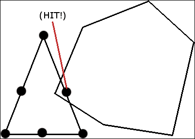
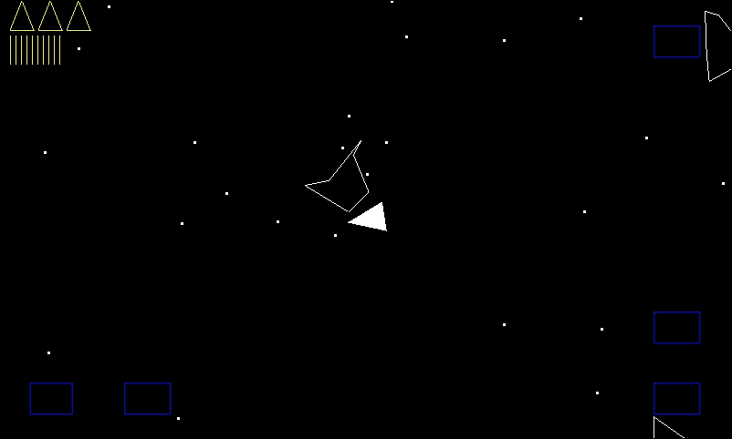

# 第十一章。遇到困难的事情——第二部分

这个游戏中的碰撞检测比前两个复杂得多。由于这个原因，代码将被大量注释。有时候评论会解释得更详细一点，或者用稍微不同的方式。

然而，这并不意味着它需要努力工作。我们需要做的是花点时间考虑一个对我们有用的策略。

希望这种方法将意味着在本章结束时，我们的碰撞检测解决方案将变得简单明了。

# 碰撞检测规划

我们试图实现的可以分为以下两类:

*   我们想要什么样的边界:
    *   小行星、子弹和飞船需要知道它们何时与边界相撞
    *   当小行星接触到边界时，它们应该反转并返回游戏区
    *   一颗子弹应该会在边界复位
    *   飞船应该减去一个生命，然后在中心重生
*   我们对小行星的期望。我们需要知道并在以下情况下做出回应:
    *   这艘船碰到了一颗小行星
    *   当子弹碰到小行星时
    *   和最初的小行星游戏一样，我们不会对小行星相撞做出反应

虽然我们不会在小行星碰撞中探测到小行星，但你会看到，当我们的碰撞探测接近完成时，实现小行星碰撞探测不会带来太大的额外挑战。然而，它会给设备的中央处理器带来额外的压力。

我们知道我们有边界上的物体碰撞要检测，小行星上的物体碰撞要检测。

## 与边界相撞

这听起来可能很明显，但边界只是四条静态直线。这使得边界碰撞成为与小行星碰撞不同的问题。

我们感兴趣的所有对象都有顶点(或者在项目符号的情况下有一个顶点)。这可能首先表明，我们可以简单地从存储在`worldLocation`中的模型空间和物体中心计算每个顶点的世界位置。我们可以，但这忽略了小行星和飞船旋转的事实，这不断导致所有顶点的实际世界位置的变化。

我们将需要平移和旋转模型空间顶点，然后测试它们中是否有任何一个接触到边界。我们可以在对象的`update`方法中为每一帧做这个，但是我们只是偶尔需要旋转的坐标，当对象非常接近边界时。

### 边界碰撞检测的第一阶段

这表明初步的检查，碰撞检测的第一阶段，更加有效。这意味着顶点的平移和旋转需要在对象本身之外进行。

我们将根据对象的中心及其宽度和高度使用简单的矩形相交检查。如果这个便宜的方法返回命中，我们将旋转和平移每个顶点，并对照边界的位置分别检查它们的真实坐标。

一旦计算出顶点的旋转游戏世界位置，碰撞检测就很简单了。

```java
if (any point falls outside the border){collision has occurred}
```

正如我们将看到的，两阶段解决方案也适用于小行星探测。此外，还涉及旋转和平移，但这远不重要。

## 与小行星相撞

测试与小行星的碰撞在某些方面是相似的。我们需要找出飞船上的任何一个顶点或一颗子弹是否穿过了小行星顶点所包含的空间。

第一个问题是小行星不仅是一个移动的目标，而且是一个旋转的目标。我们不仅要旋转和平移物体的所有顶点，还要旋转和平移小行星。

我们还需要计算小行星上每对顶点之间的连线。幸运的是，在这一点上，我们可以依靠一个比我伟大得多的数学家设计和改进的聪明算法。我们将使用交叉数算法。这就是它的工作原理。

### 道口号

我们计算由一对顶点组成的直线，并使用交叉数算法来查看来自被测试对象的特定顶点是否穿过该直线。如果是的话，我们将变量从 0 增加到 1。

我们用小行星上每个顶点对形成的每条线来测试同一个点，每次都递增我们的变量。如果用交叉数算法测试每条线的顶点后，我们的变量是奇数，我们就成功了。如果是偶数，则没有发生碰撞。

当然，如果没有发生碰撞，我们必须对照小行星上由顶点对形成的每一条线来测试被测物体的每一个顶点。

这是一个运行中的交叉数算法的可视化表示。


当然，随着所有这些复杂计算的进行，我们肯定会想做一个简单的第一阶段测试，看看在做复杂测试之前是否有可能发生碰撞。

### 小行星碰撞探测第一阶段及概述

半径重叠测试在测试单个顶点时非常合适，比如是一颗子弹，一个像船一样旋转的三角形，或者一颗旋转的小行星。

这是我们将用于测试小行星碰撞的整个过程的概述:

1.  被测物体的半径是否与小行星的半径重叠？
2.  如果是，物体的第一个顶点是否越过了小行星的第一条线？
3.  如果是，`crossingNumber ++`。
4.  对对象上的每一行重复步骤 2。
5.  如果`crossingNumber`为奇数，则返回真以调用代码，因为发生了冲突。
6.  如果`crossingNumber`为偶数，则没有碰撞发生(还没有)，重复步骤 2、3 和 4，测试对象的下一个顶点。
7.  如果所有顶点都经过测试，并且我们到达了这里，那么就没有发生碰撞。

我们将用两种静态方法建立一个名为`CD`的碰撞检测类。`detect`方法将测试与小行星的碰撞，并针对每一帧中的每一颗小行星调用每一颗子弹和船只。

`contain`方法将检查每颗小行星、子弹和船只与边界的碰撞。

在对象本身之外进行计算意味着我们需要一大堆我们将要测试的对象的数据，以及新的`CD`类方法可以访问的数据。

## 碰撞包类

我们知道我们需要一定的数据来正确地进行检测。下一个类将保存我们的碰撞检测类的方法完成工作所需的所有数据，我们需要检测碰撞的每个对象都将有一个。

当需要将所有点旋转到它们的真实位置时，我们的碰撞包需要知道物体面向哪个方向。我们有一个叫做`facingAngle`的彩车。

我们显然需要模型空间顶点的副本。与旋转位置一样，我们不会经历更新每一帧的麻烦，并且只有在碰撞检测的第一阶段显示有可能发生碰撞之后才会这样做。

我们还将保存保存这些顶点的数组长度的预计算值。它可以潜在地节省碰撞检测过程中的时间。

因此，我们还需要物体的世界坐标。这一点，我们会更新每一帧。

每个对象都有一个预计算的`radius`变量，即对象从其中心到最远顶点的大小。这将在我们的`detect`方法中用于半径重叠，第一阶段检测。

我们还将有一对对象、`currentPoint`和`currentPoint2,`，它们只是方便的对象，可以避免我们在这两种碰撞检测方法的密集部分调用垃圾收集器。

创建一个新类，称之为`CollisionPackage`，实现我们刚才讨论的成员:

```java
// All objects which can collide have a collision package.
// Asteroids, ship, bullets. The structure seems like slight
// overkill for bullets but it keeps the code generic,
// and the use of vertexListLength means there isn't any
// actual speed overhead. Also if we wanted line, triangle or
// even spinning bullets the code wouldn't need to change.

public class CollisionPackage {

    // All the members are public to avoid multiple calls
    // to getters and setters.

    // The facing angle allows us to calculate the
    // current world coordinates of each vertex using
    // the model-space coordinates in vertexList.
    public float facingAngle;

    // The model-space coordinates
    public PointF[] vertexList;

    /* 
    The number of vertices in vertexList
    is kept in this next int because it is pre-calculated
    and we can use it in our loops instead of
    continually calling vertexList.length.
   */
    public int vertexListLength;

    // Where is the centre of the object?
    public PointF worldLocation;

    /* 
    This next float will be used to detect if the circle shaped
    hitboxes collide. It represents the furthest point
    from the centre of any given object.
    Each object will set this slightly differently.
    The ship will use height/2 an asteroid will use 25
    To allow for a max length rotated coordinate.
   */
    public float radius;

    // A couple of points to store results and avoid creating new
    // objects during intensive collision detection
    public PointF currentPoint = new PointF();
    public PointF currentPoint2 = new PointF();
```

接下来，我们有一个简单的构造器，它将在每个对象的构造器的末尾从每个对象接收所有必要的数据。如下图所示实现`CollisionPackage`构造函数:

```java
public CollisionPackage(PointF[] vertexList, PointF worldLocation, 
  float radius, float facingAngle){ 

        vertexListLength = vertexList.length;
        this.vertexList = new PointF[vertexListLength];
        // Make a copy of the array

        for (int i = 0; i < vertexListLength; i++) {
            this.vertexList[i] = new PointF();
            this.vertexList[i].x = vertexList[i].x;
            this.vertexList[i].y = vertexList[i].y;
        }

        this.worldLocation = new PointF();
        this.worldLocation = worldLocation;

        this.radius = radius;

        this.facingAngle = facingAngle;

    }

}
```

这就是我们高级碰撞检测所需的全部数据。

### 向对象添加碰撞包并使其可访问

现在，我们有了我们的`CollisionPackage`课。我们将看到如何为我们需要监控的每个对象添加一个。

#### 向子弹类添加碰撞包

打开`Bullet`类，我们将看到如何在最简单的情况下使用我们的`CollisionPackage`构造器(只是一个点)。为碰撞包添加新成员。

向`Bullet`类添加类型为`CollisionPackage`的新成员:

```java
CollisionPackage cp;
```

现在，我们创建一个结构传递给我们的`CollisionPackage`构造函数，并初始化碰撞包。请注意，我们发送了一个模型空间坐标为 0，0，0 的单元素数组。然后，我们发送世界位置，1，子弹的半径和角度。在`Bullet`类的构造函数末尾输入以下代码:

```java
// Initialize the collision package
// (the object space vertex list, x any world location
// the largest possible radius, facingAngle)

// First, build a one element array
PointF point = new PointF(0,0);
PointF[] points = new PointF[1];
points[0] = point;

// 1.0f is an approximate representation 
//of the size of a bullet
cp = new CollisionPackage(points, getWorldLocation(),
1.0f, getFacingAngle());
```

最后对于`Bullet`类，我们通过将这个代码添加到`Bullet`类的`update`方法的末尾来更新每个帧中的碰撞包:

```java
        move(fps);

 // Update the collision package
 cp.facingAngle = getFacingAngle();
 cp.worldLocation = getWorldLocation();

```

现在，我们的子弹都准备好了。

#### 给宇宙飞船类添加碰撞包

打开`SpaceShip`类并添加这些成员。然后我们将看到如何在`SpaceShip`构造器中使用它们:

```java
CollisionPackage cp;

// Next, a 2d representation using PointF of
// the vertices. Used to build shipVertices
// and to pass to the CollisionPackage constructor
PointF[] points;
```

在这里，我们做了一些与`Bullet`类相比额外的事情。我们再添加三个模型空间坐标。OpenGL 不会知道这些，也不需要。它们位于三条线的中间，构成了这艘船。我们这样做是为了让小行星的顶点更难在飞船内部漂移，而飞船的顶点不会在小行星内部。这是我们正在解决的问题的可视化表示。船的顶点被重点强调以突出问题。参考下图:


我们可以完全解决这个问题，通过测试所有的小行星顶点对所有的船的线，以及我们计划做什么；对照所有小行星线测试飞船的所有顶点。然而，仅仅在船上增加几个额外的点确实会产生接近完美的检测，如下所示:



现在，就在调用中的`setVertices()`之后，`SpaceShip`构造函数实现了我们刚刚讨论的代码:

```java
setVertices(shipVertices);

// Initialize the collision package
// (the object space vertex list, x any world location
// the largest possible radius, facingAngle)

points = new PointF[6];
points[0] = new PointF(- halfW, - halfL);

points[2] = new PointF(halfW, - halfL);
points[4] = new PointF(0, 0 + halfL);

// To make collision detection more accurate we will define some
// more points on the midpoints of all our sides.
// It is possible that the point of an asteroid will pass through
// the side of the ship and we do not test for this!
// We only test for the point of a ship 
// passing through the side of an asteroid!!
// This is computationally cheaper than running both tests.
// Although not as accurate we will see it is very close.
// We can think of this visually as 
// adding extra sensors on the sides of our ship
// Here we use an equation to find the midpoint 
// of a line which you can find an explanation of
// on most good high school math web sites.

points[1] = new PointF(points[0].x + 
 points[2].x/2,(points[0].y + points[2].y)/2);

points[3] = new PointF((points[2].x + points[4].x)/2,
 (points[2].y + points[4].y)/2);

points[5] = new PointF((points[4].x + points[0].x)/2,
 (points[4].y + points[0].y)/2);

cp = new CollisionPackage(points, getWorldLocation(), 
 length/2, getFacingAngle());

}// End SpaceShip constructor
```

接下来，正如我们对`Bullet`类所做的，我们在`SpaceShip`类的`update`方法中同步碰撞包的每一帧。在调用`move()`更新了船的坐标之后，我们在方法的最后进行这个操作。

```java
move(fps);

 // Update the collision package
 cp.facingAngle = getFacingAngle();
 cp.worldLocation = getWorldLocation();

}// End SpaceShip update()
```

最后，我们将为小行星添加一个碰撞包。

#### 给小行星等级增加碰撞包

打开的`Asteroid`类，添加一个`CollisionPackage`成员:

```java
CollisionPackage cp;
```

在`Asteroid`构造函数的末尾，就在调用`generatePoints()`之后，我们初始化`CollisionPackage`对象:

```java
// Define a random asteroid shape
// Then call the parent setVertices()
generatePoints();

// Initialize the collision package
// (the object space vertex list, x any world location
// the largest possible radius, facingAngle)
cp = new CollisionPackage
 (points, getWorldLocation(), 25, getFacingAngle());

```

接下来，我们添加一个辅助方法，当探测到碰撞时，反转的行进方向，*将小行星弹回几个像素。当我们检测到与边界的碰撞时，我们将调用这个方法。将`bounce`方法添加到`Asteroid`类中:*

```java
public void bounce(){

  // Reverse the travelling angle
    if(getTravellingAngle() >= 180){
      setTravellingAngle(getTravellingAngle()-180);
     }else{
      setTravellingAngle(getTravellingAngle() + 180);
    }

    // Reverse velocity because occasionally they get stuck
    setWorldLocation((getWorldLocation().x + -getxVelocity()/3), (getWorldLocation().y + -getyVelocity()/3));

    // Speed up by 10%
    setSpeed(getSpeed() * 1.1f);

    // Not too fast though
    if(getSpeed() > getMaxSpeed()){
      setSpeed(getMaxSpeed());

}
```

与`SpaceShip`和`Bullet`类一样，我们将在`update`方法的末尾调用`move`后更新`update`方法中的碰撞包:

```java
move(fps);

// Update the collision package
cp.facingAngle = getFacingAngle();
cp.worldLocation = getWorldLocation();

}
```

现在，我们需要做一些其他课程不需要做的事情。我们的交叉数算法使用的是线而不是顶点，所以我们需要通过将最后一个顶点与第一个顶点连接起来，在最后一个顶点上画一条线。由于碰撞数据代码的工作方式，我们不需要在`SpaceShip`类中这样做。碰撞数据代码将测试子弹和飞船与小行星线的碰撞点。不是反过来。

这是要添加到`generatePoints`方法第七点的额外代码。在下面的代码中，我在新的突出显示的代码的两边都包含了现有的代码:

```java
// left below 0
points[5] = new PointF();
i = -(r.nextInt(14)+11);
points[5].x =  i;
i = -(r.nextInt(12)+1);

points[5].y = i;

// We add on an extra point that we won't use in asteroidVertices[].
// The point is the same as the first. 
// This is because the last vertex
// links back to the first to create a line. 
// This line will need to be
// used in calculations when we do our collision detection.

// Here is the extra vertex- same as the first.
points[6] = new PointF();
points[6].x = points[0].x;
points[6].x = points[0].x;

// Now use these points to draw our asteroid
float[] asteroidVertices = new float[]{
// First point to second point
points[0].x, points[0].y, 0,
points[1].x, points[1].y, 0,
```

现在，我们可以谈论构建碰撞检测类本身。

## 光盘类大纲

我们现在将实施第一阶段的碰撞检测。如上所述，我们将使用的算法计算量很大，我们只希望在发生碰撞的可能性很大时使用它们。

因此，我们将使用[第 3 章](03.html "Chapter 3. Tappy Defender – Taking Flight")、*塔皮保卫者-乘坐航班*中讨论的半径重叠方法，对照每颗小行星检查每颗子弹和飞船。我们将使用一种简化的矩形交叉方法来检查小行星、飞船和子弹的边界。

在接下来的两个部分之后，您将实际上能够玩游戏，但是您将会看到，我们到目前为止使用的基本碰撞检测对于这种类型的游戏来说还不够令人满意。

这些第一次检查将决定我们是否继续进行更精确和计算成本更高的检查。

我们将在*与边界*的精确碰撞检测和*与小行星*的精确碰撞检测部分实施这些第二阶段检查，这将使用更先进的算法，并充分利用我们碰撞包中的数据。

首先，创建一个新类并将其称为`CD`。添加成员`PointF`对象并初始化。我们将使用它来避免在代码的关键部分创建新的对象。

```java
private static PointF rotatedPoint = new PointF();
```

现在，让我们讨论一下方法。

### 实现小行星和舰船的半径重叠

让我们将第一种方法添加到`CD`类中，以探测子弹和小行星以及飞船和小行星之间的碰撞。正如我们所讨论的，我们目前只实现了这个方法的第一部分。这里是半径重叠代码的实现。

代码的工作原理是制作一个缺边的假设三角形，然后用毕达哥拉斯定理计算出缺边，即两个物体中心点之间的距离。如果两个物体的半径之和大于两个物体中心之间的距离，我们就有重叠。

添加半径重叠码的`detect`方法。注意，如果半径重叠，我们返回`true`。这一行代码将在本章后面被更精确的检测所取代。

```java
public static boolean detect(CollisionPackage cp1, 
    CollisionPackage cp2) {

    boolean collided = false;

   // Check circle collision between the two objects

   // Get the distance of the two objects from
   // the centre of the circles on the x axis
   float distanceX = (cp1.worldLocation.x)
        - (cp2.worldLocation.x);

   // Get the distance of the two objects from
   // the centre of the circles on the y axis
   float distanceY = (cp1.worldLocation.y)
        - (cp2.worldLocation.y);

        // Calculate the distance between the center of each circle
        double distance = Math.sqrt
            (distanceX * distanceX + distanceY * distanceY);

        // Finally see if the two circles overlap
        // If they do it is worth doing the more intensive
        // and accurate check.
        if (distance < cp1.radius + cp2.radius) {

         // Log.e("Circle collision:","true");
         // todo  Eventually we will add the 
         // more accurate code here
         // todo and delete the line below.

            collided = true;
        }

        return collided;
    }
```

现在，让我们来讨论一下边界。

### 实现边框的矩形相交

我们将看看是否有任何小行星、子弹或飞船需要在边境内牵制。如前所述，我们将执行一个简单的矩形相交测试，如果检测到则返回`true`。稍后，我们将删除返回`true`并添加更复杂的代码。

执行`contain`方法，如下图:

```java
// Check if anything hits the border
public static boolean contain(float mapWidth, float mapHeight,                                              
  CollisionPackage cp) {

   boolean possibleCollision = false;

    // Check if any corner of a virtual rectangle
    // around the centre of the object is out of bounds.
    // Rectangle is best because we are testing 
    // against straight sides (the border)
    // If it is we have a possible collision.

    if (cp.worldLocation.x - cp.radius < 0) {
            possibleCollision = true;
        } else if (cp.worldLocation.x + cp.radius > mapWidth) {
            possibleCollision = true;
        } else if (cp.worldLocation.y - cp.radius < 0) {
            possibleCollision = true;
        } else if (cp.worldLocation.y + cp.radius > mapHeight) {
            possibleCollision = true;
        }

        if (possibleCollision) {
            // todo For now we return true
            return true;
        }

        return false; // No collision
}
```

现在，我们有两个方法，我们只需要在所有合适的对象组合上调用它们。

# 执行检查

我们真的很接近能够玩我们的游戏，尽管有简化的碰撞检测。首先添加一些方法来处理当检测到某些冲突时会发生什么，然后看看我们如何实际使用我们的`CD`类。

## 辅助方法

首先，当我们检测到各种类型的碰撞时，我们需要几个辅助方法来响应。

我们需要一个确定飞船何时被摧毁的方法和一个确定小行星何时被摧毁的方法。接下来的两个小节将介绍这一点。

### 摧毁一艘船

一艘船的死亡可以在两个地方被探测到，所以增加一个方法来处理后面的事件是有意义的。在下一个方法中，我们将船的位置重置到地图的中心，播放声音，并递减`numLives`。

如果`numLives`等于零，将`levelNumber`设置回一，`numLives`设置为三，调用`createObjects()`重画一个关卡，暂停游戏，然后播放一个合适的声音让玩家知道自己又要开始了。

现在，将`lifeLost`方法添加到`AsteroidsRenderer`类中:

```java
public void lifeLost(){
        // Reset the ship to the center
        gm.ship.setWorldLocation(gm.mapWidth/2, gm.mapHeight/2);
        // Play a sound
        sm.playSound("shipexplode");

        // Deduct a life
        gm.numLives = gm.numLives -1;

        if(gm.numLives == 0){
            gm.levelNumber = 1;
            gm.numLives = 3;
            createObjects();
            gm.switchPlayingStatus();
            sm.playSound("gameover");
        }
    }
```

我们会处理小行星死亡时发生的事情。

### 摧毁一颗小行星

当飞船或子弹击中小行星时，这种方法将被称为。首先，我们将触发碰撞的小行星设置为`setActive(false)`。它将不再被绘制或更新。

接下来，我们播放一个声音并递减`numAsteroidsRemaining`。最后如果`numAsteroidsRemaining`等于零，则说明玩家已经清除了一整级。在这种情况下，我们增加`levelNumber`和`numLives`，播放胜利的声音，并通过调用`createObjects()`开始一个更难的关卡。

现在，将`destroyAsteroid()`方法添加到`AsteroidsRenderer`类中:

```java
public void destroyAsteroid(int asteroidIndex){

  gm.asteroids[asteroidIndex].setActive(false);
     // Play a sound
     sm.playSound("explode");
     // Reduce the number of active asteroids
     gm.numAsteroidsRemaining --;

     // Has the player cleared them all?
     if(gm.numAsteroidsRemaining == 0){
     // Play a victory sound

     // Increment the level number
     gm.levelNumber ++;

     // Extra life
     gm.numLives ++;

     sm.playSound("nextlevel");
     // Respawn everything
     // With more asteroids
     createObjects();

}
}
}// End class
```

我们现在可以调用我们的新的`CD`类的静态方法，并在发生冲突时做出响应。

## 测试更新中的碰撞()

首先，我们将检查看看船是否需要装载。我们简单的用`mapWidth`、`mapHeight`和船的碰撞包来称呼`CD.contain()`。如果有碰撞，代码调用`lifeLost()`。

在`update`方法中更新对象的所有代码后添加碰撞检测代码:

```java
// End of all updates!!

// All objects are in their new locations
// Start collision detection

// Check if the ship needs containing
if (CD.contain(gm.mapWidth, gm.mapHeight, gm.ship.cp)) {

  lifeLost();

}
```

这是检测是否有任何小行星试图离开小行星模拟器的代码。它的工作方式与前面的代码块完全相同，只是我们循环遍历每个小行星，检查它是否处于活动状态，如果检测到碰撞，则调用小行星上的反弹。

```java
// Check if an asteroid needs containing
for (int i = 0; i < gm.numAsteroids; i++) {
  if (gm.asteroids[i].isActive()) {
       if (CD.contain(gm.mapWidth, gm.mapHeight, 
       gm.asteroids[i].cp)) {

          // Bounce the asteroid back into the game
          gm.asteroids[i].bounce();

          // Play a sound
          sm.playSound("blip");

       }
    }

}
```

子弹的代码看起来有点复杂，但实际上并不复杂。对`CD.contain()`的调用是相同的，我们对每个子弹都是这样做的。然而，游戏进行到最后一分钟的平衡是必要的，因为子弹在离开视口时会被重置(如果那是在边界之前)，因为否则飞船只能旋转并从很远的地方摧毁小行星。

输入代码以检测子弹与视口边框和边缘的碰撞:

```java
// Check if bullet needs containing
// But first see if the bullet is out of sight
// If it is reset it to make game harder
for (int i = 0; i < gm.numBullets; i++) {

    // Is the bullet in flight?
    if (gm.bullets[i].isInFlight()) {

   // Comment the next block to make the game easier!!!
   // It will allow the bullets to go all the way from
   // ship to border without being reset. 
   // These lines reset the bullet when
   // shortly after they leave the players view.
   // This forces the player to go 'hunting' for the
   // asteroids instead of spinning round spamming the
   // fire button...
   // This code would be better with a viewport.clip() method
   // like in project 2 but seems a bit excessive just for these
   // few 15ish lines of code.

   // Start comment out to make easier
   handyPointF = gm.bullets[i].getWorldLocation();
   handyPointF2 = gm.ship.getWorldLocation();

   if(handyPointF.x > handyPointF2.x + gm.metresToShowX / 2){
        // Reset the bullet
        gm.bullets[i].resetBullet(gm.ship.getWorldLocation());

    }else
        if(handyPointF.x < handyPointF2.x - gm.metresToShowX / 2){
            // Reset the bullet
            gm.bullets[i].resetBullet(gm.ship.getWorldLocation());

        }else
        if(handyPointF.y > handyPointF2.y + gm.metresToShowY/ 2){
            // Reset the bullet
            gm.bullets[i].resetBullet(gm.ship.getWorldLocation());
       }else
        if(handyPointF.y < handyPointF2.y - gm.metresToShowY / 2){
            // Reset the bullet
            gm.bullets[i].resetBullet(gm.ship.getWorldLocation());
                }
            // End comment out to make easier

            // Does bullet need containing?
            if (CD.contain(gm.mapWidth, gm.mapHeight,      
                gm.bullets[i].cp)) {

                 // Reset the bullet
                 gm.bullets[i].resetBullet
                    (gm.ship.getWorldLocation());
                 // Play a sound
                 sm.playSound("ricochet");
          }

     }

}
```

你现在可以运行游戏，看看`CD.contain()`方法如何很好地将所有东西都保存在小行星模拟器中。

我们将调用我们的`detect`方法来看看是否有东西撞上了小行星。

首先，检查子弹。请注意，在我们使用`CD.detect`方法之前，我们会进行初步检查，以确保子弹正在飞行，并且小行星处于活动状态。然后，我们只要传入两个碰撞包`CD.detect`就可以了。如果一颗子弹与边界相撞，我们在适当的子弹上称之为`resetBullet()`。

```java
// Now we see if anything has hit an asteroid

// Check collisions between asteroids and bullets
// Loop through each bullet and asteroid in turn

for (int bulletNum = 0; bulletNum < gm.numBullets; bulletNum++) {
    for (int asteroidNum = 0; asteroidNum < gm.numAsteroids;                            
        asteroidNum++) {

        // Check that the current bullet is in flight
        // and the current asteroid is 
        // active before proceeding
        if (gm.bullets[bulletNum].isInFlight() &&                                           
            gm.asteroids[asteroidNum].isActive())

            // Perform the collision checks by 
            // passing in the collision packages

            // A Bullet only has one vertex. 
            // Our collision detection works on vertex pairs

          if (CD.detect(gm.bullets[bulletNum].cp,                                           
              gm.asteroids[asteroidNum].cp)) {

                // If we get a hit...
                destroyAsteroid(asteroidNum);

                // Reset the bullet
                gm.bullets[bulletNum].resetBullet
                    (gm.ship.getWorldLocation());
           }

    }
}
```

现在，我们测试这艘船。如果检测到碰撞，我们称之为`destroyAsteroid()`，然后是`lifeLost()`。

```java
// Check collisions between asteroids and ship
// Loop through each asteroid in turn

for (int asteroidNum = 0; asteroidNum < gm.numAsteroids;                            
     asteroidNum++) {

    // Is the current asteroid active before proceeding
    if (gm.asteroids[asteroidNum].isActive()) {

        // Perform the collision checks by
        // passing in the collision packages
        if (CD.detect(gm.ship.cp, gm.asteroids[asteroidNum].cp)) {

        // hit!
        destroyAsteroid(asteroidNum);
        lifeLost();
       }
    }
}
```

在这一点上，你可以玩游戏，我们基本的碰撞检测将工作。然而，飞得离小行星太近，你会失去一条生命而不去碰它，或者只是近距离射出一颗子弹，小行星就不见了。我们需要能够掠过边界或小行星的表面，并且只有当一个点实际上穿越到另一个物体的精确空间时才会被击中。

# 与边界的精确碰撞检测

为了升级我们的`detect`方法，我们需要用更精确的检测代码替换`if(possibleCollision)`块中的返回语句。

首先，将`radianAngle`初始化为与我们的对象所面向的方向(度)相等的弧度。`Math`类使用弧度，因为弧度在数学上比更容易可视化的度数测量更有用。

变量`cosAngle`和`sinAngle`就像名字所暗示的那样，用在接下来的代码块中。

### 类型

值得一提的是，`Math.cos()`、`Math.sin()`方法相对耗时。我们可以通过预先计算`sin`和`cos`的 360 个值，然后使用简单的查找方法来代替这种计算，从而加快碰撞检测类的速度。

但是，我们保持每秒超过 60 帧的目标，所以不要在这里这样做。

删除返回语句，并在`if(possibleCollision)`块中添加该代码:

```java
if (possibleCollision) {

 double radianAngle = ((cp.facingAngle/180)*Math.PI);
 double cosAngle = Math.cos(radianAngle);
 double sinAngle = Math.sin(radianAngle);

```

在下一个代码块中，输入一个`for`循环，该循环遍历对象的每个顶点，将它们从模型空间转换为世界空间坐标，然后使用我们之前计算的`facingAngle`对象的余弦和正弦值将它们旋转到游戏世界中的精确位置。

```java
    //Rotate each and every vertex then check for a collision
    // If just one is then we have a collision.
    // Once we have a collision no need to check further
    for (int i = 0 ; i < cp.vertexListLength; i++){
        // First update the regular un-rotated model space coordinates
        // relative to the current world location (centre of object)
        float worldUnrotatedX = 
                cp.worldLocation.x + cp.vertexList[i].x;

        float worldUnrotatedY =  
                cp.worldLocation.y + cp.vertexList[i].y;

        // Now rotate the newly updated point, stored in currentPoint
        // around the centre point of the object (worldLocation)
        cp.currentPoint.x = cp.worldLocation.x + (int)                                   
            ((worldUnrotatedX - cp.worldLocation.x)
            * cosAngle - (worldUnrotatedY - cp.worldLocation.y)
            * sinAngle);

        cp.currentPoint.y = cp.worldLocation.y + (int)                                   
            ((worldUnrotatedX - cp.worldLocation.x)
            * sinAngle+(worldUnrotatedY - cp.worldLocation.y)
            * cosAngle);
```

现在我们所要做的就是看旋转和平移的顶点是否落在边界/贴图的左边、右边、顶部或底部之外。如果是，我们返回`true`；如果没有，循环继续检查每个顶点相同的方式(平移、旋转、检查等等)。

```java
     // Check the rotated vertex for a collision
     if (cp.currentPoint.x < 0) {

       return true;
     } else if (cp.currentPoint.x > mapWidth) {

       return true;
     } else if (cp.currentPoint.y < 0) {

       return true;
     } else if (cp.currentPoint.y > mapHeight) {

       return true;
   }

}
```

你现在可以运行游戏，看着子弹带着令人满意的撞击声消失在边境，或者驾驶你的船致命地靠近边境。

让我们改进我们的小行星碰撞。

# 与小行星的精确碰撞探测

我们最后做了这个因为还有更复杂的最后一步。由于在边界检测中，我们需要平移和旋转我们对象的顶点。然而，这一次，我们需要为两个对象执行此操作。

此外，一旦我们旋转并平移了小行星的顶点，我们就需要以成对的顶点来处理它们，形成一条线。这些线，我们将针对其他对象的每个顶点进行测试。这个测试当然是我们讨论过的交叉数法。

我们需要在`if (distance < cp1.radius + cp2.radius) { ...}`的身体内完成所有这些，我们之前只是将`collided`布尔设置为`true`。

有相当多的代码，所以我们将把它分成块，看看每个阶段发生了什么。此外，为了尽可能以可读性最好的方式格式化代码，代码缩进在块与块之间并不总是一致的。

接下来的几个代码块是前面提到的需要替换的`if`块的全部内容。

### 类型

如前所述，我们也可以在这里使用正弦和余弦查找表。

我们可以做一个旋转角度的方法，因为我们经常这样做。但这并不像看起来那么简单。如果我们将旋转代码放在一个方法中，我们要么必须将以下正弦和余弦计算放在其中，这会使它变慢，要么在方法调用和本身有点不整洁的`for`循环之前预先计算它。

此外，如果你考虑到我们需要一个以上的角度正弦和余弦值，该方法需要*知道*使用哪个值，这不是火箭科学，但它开始变得比我们最初想象的更不紧凑。因此，我选择完全避免方法调用，即使代码有点杂乱无章。事实上，如果你把所有的东西都放在一个方法调用中，你仍然可以在一部旧的银河 S2 手机上获得将近 60 FPS。所以如果你想收拾东西，那就去吧；我只是觉得值得讨论我为什么这样做。

在我们进入`for`循环之前，就像我们对边界检测所做的那样，我们将计算一些在这个方法的持续时间内不会改变的东西。两个碰撞包的相角的正弦和余弦。

```java
     if (distance < cp1.radius + cp2.radius) {

            double radianAngle1 = ((cp1.facingAngle / 180) * Math.PI);
            double cosAngle1 = Math.cos(radianAngle1);
            double sinAngle1 = Math.sin(radianAngle1);

            double radianAngle2 = ((cp2.facingAngle / 180) * Math.PI);
            double cosAngle2 = Math.cos(radianAngle2);
            double sinAngle2 = Math.sin(radianAngle2);

            int numCrosses = 0;    // The number of times we cross a side

            float worldUnrotatedX;
            float worldUnrotatedY;
```

现在，我们从`cp2`开始循环遍历所有顶点，然后用`cp1`开始的所有边(顶点对)依次测试每个顶点。请记住，小行星有一个额外的填充顶点，与第一个相同。因此，我们可以测试小行星的最后一面。在称呼`CD.detect()`时，我们必须始终将小行星碰撞包装作为*第二个*论点。

在下一段代码中，将被测物体相对于小行星平移，然后旋转。

```java
for (int i = 0; i < cp1.vertexListLength; i++) {

    worldUnrotatedX = cp1.worldLocation.x + cp1.vertexList[i].x;
    worldUnrotatedY = cp1.worldLocation.y + cp1.vertexList[i].y;

    // Now rotate the newly updated point, stored in currentPoint
    // around the centre point of the object (worldLocation)
    cp1.currentPoint.x = cp1.worldLocation.x +
        (int) ((worldUnrotatedX - cp1.worldLocation.x)
        * cosAngle1 - (worldUnrotatedY - cp1.worldLocation.y) *
        sinAngle1);

    cp1.currentPoint.y = cp1.worldLocation.y + 
        (int) ((worldUnrotatedX - cp1.worldLocation.x)
        * sinAngle1 + (worldUnrotatedY - cp1.worldLocation.y) *                   
         cosAngle1);

    // cp1.currentPoint now hold the x/y 
    // world coordinates of the first point to test
```

现在一次使用一对顶点，从小行星开始，平移并旋转两者到它们的最终世界空间坐标，为下一个代码块做好准备，在这里我们将使用在前一个块和这个块中计算的顶点位置。

```java
// Use two vertices at a time to represent the line we are testing
// We don't test the last vertex because we are testing pairs
// and the last vertex of cp2 is the padded extra vertex.
// It will form part of the last side when we test vertexList[5]

for (int j = 0; j < cp2.vertexListLength - 1; j++) {

    // Now we get the rotated coordinates of 
    // BOTH the current 2 points being
    // used to form a side from cp2 (the asteroid)
    // First we need to rotate the model-space 
    // coordinate we are testing
    // to its current world position
    // First update the regular un-rotated model space coordinates
    // relative to the current world location (centre of object)

    worldUnrotatedX = cp2.worldLocation.x + cp2.vertexList[j].x;
    worldUnrotatedY = cp2.worldLocation.y + cp2.vertexList[j].y;

    // Now rotate the newly updated point, stored in worldUnrotatedX/y
    // around the centre point of the object (worldLocation)

    cp2.currentPoint.x = cp2.worldLocation.x + 
          (int) ((worldUnrotatedX - cp2.worldLocation.x)
          * cosAngle2 - (worldUnrotatedY - cp2.worldLocation.y) *                   
          sinAngle2);

    cp2.currentPoint.y = cp2.worldLocation.y + 
          (int) ((worldUnrotatedX - cp2.worldLocation.x)
          * sinAngle2 + (worldUnrotatedY - cp2.worldLocation.y) *                   
          cosAngle2);

    // cp2.currentPoint now hold the x/y world coordinates
    // of the first point that
    // will represent a line from the asteroid

    // Now we can do exactly the same for the 
    // second vertex and store it in
    // currentPoint2\. We will then have a point and a line (two 
    // vertices)we can use the
    // crossing number algorithm on.

    worldUnrotatedX = cp2.worldLocation.x + cp2.vertexList[i + 1].x;
    worldUnrotatedY = cp2.worldLocation.y + cp2.vertexList[i + 1].y;

    // Now rotate the newly updated point, stored in worldUnrotatedX/Y
    // around the centre point of the object (worldLocation)
    cp2.currentPoint2.x = cp2.worldLocation.x + 
          (int) ((worldUnrotatedX - cp2.worldLocation.x)
          * cosAngle2 - (worldUnrotatedY - cp2.worldLocation.y) *                   
          sinAngle2);

    cp2.currentPoint2.y = cp2.worldLocation.y + 
          (int) ((worldUnrotatedX - cp2.worldLocation.x)
          * sinAngle2 + (worldUnrotatedY - cp2.worldLocation.y) *                   
           cosAngle2);
```

在这里，我们检测来自船或子弹的当前顶点是否穿过由小行星的当前顶点对形成的线。如果是，我们增加`numCrosses`。

```java
// And now we can test the rotated point from cp1 against the
// rotated points which form a side from cp2

if (((cp2.currentPoint.y > cp1.currentPoint.y) !=                               
       (cp2.currentPoint2.y > cp1.currentPoint.y)) &&
       (cp1.currentPoint.x < (cp2.currentPoint2.x -                                
     cp2.currentPoint2.x)    *(cp1.currentPoint.y - 
        cp2.currentPoint.y) / (cp2.currentPoint2.y  -                               
  cp2.currentPoint.y) + cp2.currentPoint.x)){

        numCrosses++;

}
```

最后，我们使用模数运算符来确定`numCrosses`是奇数还是偶数。如前所述，奇数返回`true`(碰撞)，偶数返回`false`(无碰撞)。

```java
            }
            }
            // So do we have a collision?
            if (numCrosses % 2 == 0) {
                // even number of crosses(outside asteroid)
                collided = false;
            } else {
                // odd number of crosses(inside asteroid)
                collided = true;
            }

        }// end if
```

你现在可以让你的飞船直接飞向小行星，只有在看起来你应该的时候才会被击中。参考以下截图:



现在，我们所有的碰撞检测和我们的小行星模拟器游戏都完成了！

# 收尾工作

我们可以继续改进我们的游戏。例如，当当前的小行星被摧毁时，产生两三个更小的小行星不会太难。我们只需要一个阵列来容纳较小的小行星。当我们停用常规小行星时，阵列会在与常规小行星相同的位置激活一些先前实例化的较小小行星。然后，我们可以对计算小行星的方式进行一些小的修改，我们将有一个整洁的新功能。

街机经典《小行星》中有一个偶尔会出现的不明飞行物。用线条设计一个不明飞行物形状会很简单，让它从左到右，或者从右到左随机前进，也可以上下移动一点。

最后，我们可以添加一个超空间按钮。这是玩家在确定死亡迫在眉睫时的一种最后手段。点击超空间按钮，飞船将在随机位置重生。我们只需要在`InputController`类的数组中添加一个按钮，并在`Ship`类中调用一个新的简单的`randomHyperspaceJUmp`方法。

我们还可以添加 Google Play 成绩和排行榜，然后发布游戏。如果你发布一个使用 OpenGL 的游戏，你需要将这个声明添加到`AndroidManifest.xml`文件中:

```java
<uses-feature android:glEsVersion="0x00020000" android:required="true" />
```

试着添加一些我们谈到的改进，也许还有更多你自己的改进。如果你发布了你的游戏，或者你没有发布，我很乐意在[gamecodeschool.com](http://gamecodeschool.com)上听到你的想法或者看到你的项目链接。

我想我们完了！

# 总结

我希望你喜欢我们的旋转风之旅，为安卓制作游戏，我希望你继续制作许多新游戏！