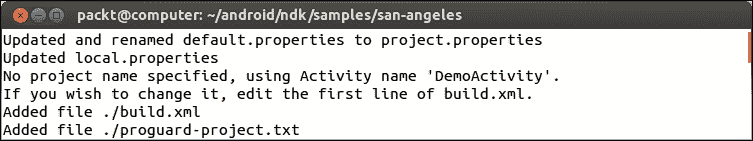
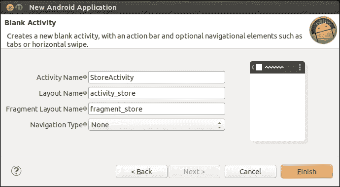
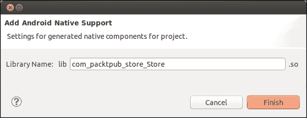
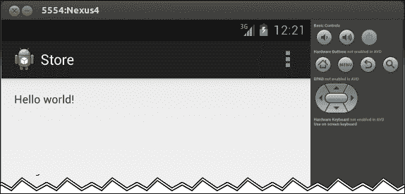
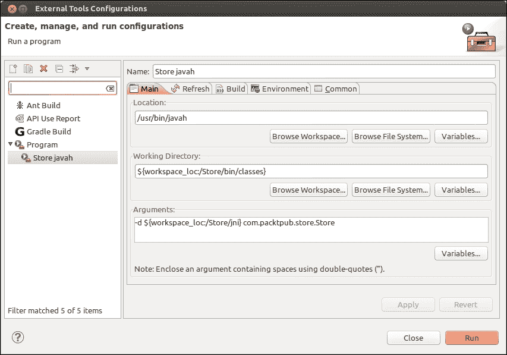
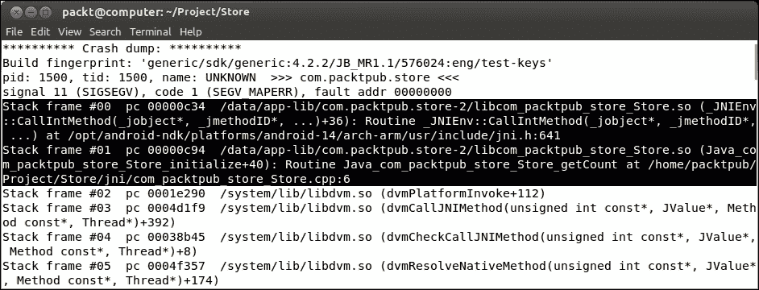
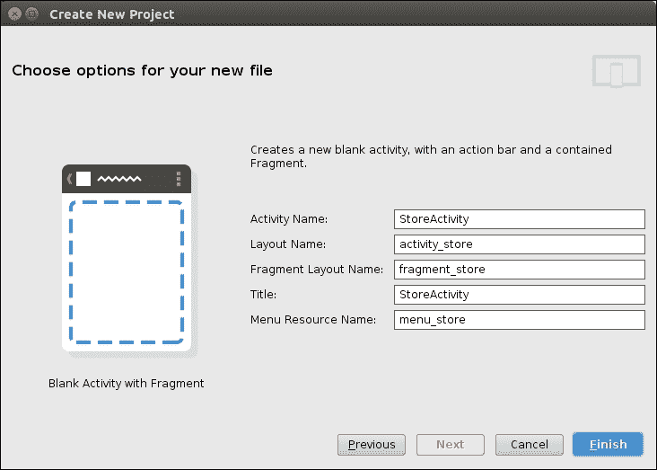
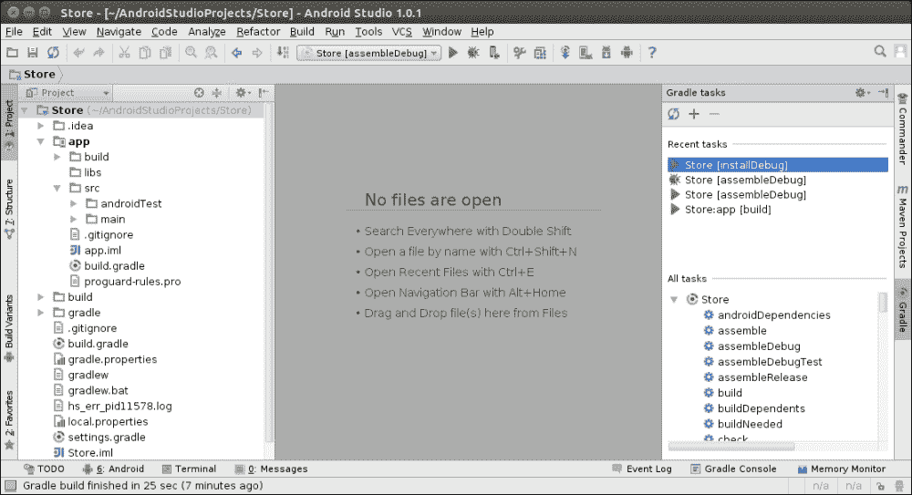

# 二、启动原生安卓项目

> *手里拿着最厉害工具的人，手无寸铁，不知道工具的用途。Make、GCC、Ant、Bash、Eclipse……——任何新的安卓程序员都需要处理这个技术生态系统。幸运的是，其中一些名字可能听起来已经很熟悉了。实际上，安卓是基于许多开源组件的，这些组件是由安卓开发工具包和它们特定的工具集组合而成的:亚行、AAPT、AM、NDK-Build、NDK-GDB...掌握它们将使我们有能力创建、构建、部署和调试自己的安卓应用。*

在下一章深入探讨本机代码之前，让我们通过启动一个包含本机 C/C++ 代码的新的具体 Android 项目来发现这些工具。尽管 Android Studio 是新的官方安卓集成开发环境，但它缺乏对本机代码的支持，这促使我们主要关注 Eclipse。

因此，在本章中，我们将:

*   构建一个官方示例应用，并将其部署在安卓设备上
*   使用 Eclipse 创建我们的第一个原生安卓项目
*   使用 Java 本机接口将 Java 与 C/C++ 接口
*   调试原生安卓应用
*   分析本机崩溃转储
*   用本机代码设置一个 Gradle 项目

到本章结束时，你应该知道如何自己启动一个新的原生安卓项目。

# 构建 NDK 示例应用

开始使用新的安卓开发环境最简单的方法是编译和部署安卓 NDK 提供的一些示例。一个可能的(和*多边形*！)选择是**圣安杰斯**演示，由 Jetro Lauha 在 2004 年创建，后来移植到 OpenGL ES(更多信息请参见[http://jet.ro/visuals/4k-intros/san-angeles-observation/](http://jet.ro/visuals/4k-intros/san-angeles-observation/))。

# 行动时间-编译和部署洛杉矶样本

让我们使用 Android SDK 和 NDK 工具来构建一个工作的 APK:

1.  Open a command-line prompt and go to the San Angeles sample directory inside the Android NDK. All further steps have to be performed from this directory.

    使用`android`命令生成洛杉矶项目文件:

    ```cpp
    cd $ANDROID_NDK/samples/san-angeles
    android update project -p ./
    ```

    

    ### 类型

    执行此命令时，可能会出现以下错误:

    ```cpp
    Error: The project either has no target set or the target is invalid.
    Please provide a --target to the 'android update' command.

    ```

    这意味着您尚未安装[第 1 章](01.html "Chapter 1. Setting Up Your Environment")、*设置您的环境*中指定的所有安卓软件开发工具包平台。在这种情况下，要么使用`Android manager tool`安装它们，要么指定您自己的项目目标，例如`android update project --target 18 -p ./`。

2.  Compile San Angeles native library with `ndk-build`:

    

3.  Build and package San Angeles application in **Debug** mode:

    ```cpp
    ant debug

    ```

    

4.  Make sure your Android device is connected or the emulator is started. Then deploy the generated package:

    ```cpp
    ant installd

    ```

    

5.  Launch `SanAngeles` application on your device or emulator:

    ```cpp
    adb shell am start -a android.intent.action.MAIN -n com.example.SanAngeles/com.example.SanAngeles.DemoActivity

    ```

    

    ### 类型

    **下载示例代码**

    您可以从您在[http://www.packtpub.com](http://www.packtpub.com)的账户下载您购买的所有 Packt Publishing 书籍的示例代码文件。如果您在其他地方购买了这本书，您可以访问[http://www.packtpub.com/support](http://www.packtpub.com/support)并注册，以便将文件直接通过电子邮件发送给您。

## *刚刚发生了什么？*

古老的洛杉矶演示，充满了平面阴影多边形和怀旧，现在正在你的设备上运行。只需几条命令行，涉及安卓开发所需的大部分工具，就可以生成、编译、构建、打包、部署和启动一个完整的应用，包括本机 C/C++ 代码。


让我们详细看看这个过程。

## 用安卓管理器生成项目文件

多亏了安卓管理器，我们从现有的代码库中生成了项目文件。以下要点提供了有关此过程的更多信息:

*   `build.xml`:这个是描述如何编译打包最终应用 APK 文件的 Ant 文件(代表 *Android PacKage* )。这个构建文件主要包含指向属性和核心 Android Ant 构建文件的链接。
*   `local.properties`:这个文件包含安卓 SDK 位置。每次您的 SDK 位置发生变化时，都应该重新生成该文件。
*   `proguard-project.txt`:这个文件包含 **Proguard** 的默认配置，一个代码优化器和 Java 代码的混淆器。更多信息可在[http://developer.android.com/tools/help/proguard.html](http://developer.android.com/tools/help/proguard.html)找到。
*   `project.properties`:该文件包含应用目标安卓 SDK 版本。默认情况下，该文件是从`project`目录中预先存在的`default.properties`文件生成的。如果不存在`default.properties`，则必须在`android create`命令后附加一个额外的`–target <API Target>`标志(例如，安卓 4 甜甜圈的`--target 4`)。

### 注

目标软件开发工具包版本不同于最低软件开发工具包版本。第一个版本描述了为其构建应用的最新安卓版本，而后者表示允许应用运行的最低安卓版本。两者都可以在`AndroidManifest.xml`文件(条款`<uses-sdk>`)中声明，但是只有目标 SDK 版本在`project.properties`中被“复制”。

### 类型

创建安卓应用时，请仔细选择您想要支持的最低和目标安卓应用接口，因为这可能会极大地改变您的应用功能以及您的受众范围。事实上，由于碎片化，目标在安卓系统中往往移动得更快更快！

不针对最新安卓版本的应用并不意味着它不会在上面运行。但是，它将无法访问所有最新的功能，也无法访问所有最新的优化。

安卓管理器是安卓开发者的主要切入点。其职责与 SDK 版本更新、虚拟设备管理和项目管理相关。通过执行`android –help`，可以从命令行中详尽地列出它们。既然我们已经在[第 1 章](01.html "Chapter 1. Setting Up Your Environment")、*设置您的环境*中研究了 SDK 和 AVD 管理，那么让我们关注一下它的项目管理能力:

1.  `android create project` allows creating new Android projects ex-nihilo from the command line. Generated projects contain only Java files but no NDK-related files. A few additional options must be specified to allow for proper generation, such as:

    <colgroup><col style="text-align: left"> <col style="text-align: left"></colgroup> 
    | 

    [计]选项

     | 

    描述

     |
    | --- | --- |
    | `-a` | 主要活动名称 |
    | `-k` | 应用包 |
    | `-n` | 项目名 |
    | `-p` | 项目路径 |
    | `-t` | 目标 SDK 版本 |
    | `-g`和`-v` | 生成梯度构建文件，而不是蚂蚁，并指定其插件版本 |

    创建新项目的命令行示例如下:

    ```cpp
    android create project -p ./MyProjectDir -n MyProject -t android-8 -k com.mypackage -a MyActivity

    ```

2.  `android update project` creates project files from existing sources, as shown in the previous tutorial. However, if they already exist it can also upgrade the project target to new SDK versions (that is, the `project.properties` file) and update the Android SDK location (that is, the `local.properties` file). The available flags are slightly different:

    <colgroup><col style="text-align: left"> <col style="text-align: left"></colgroup> 
    | 

    [计]选项

     | 

    描述

     |
    | --- | --- |
    | `-l` | 要添加的库项目 |
    | `-n` | 项目名 |
    | `-p` | 项目路径 |
    | `-t` | 目标 SDK 版本 |
    | `-s` | 更新子文件夹中的项目 |

    我们还可以添加一个带有`-l`标志的新库项目，例如:

    ```cpp
    android update project -p ./ -l ../MyLibraryProject

    ```

3.  `android create lib-project`和 T1】管理库项目。这类项目不太适合本机 C/C++ 开发，尤其是在调试方面，因为 NDK 有自己的重用本机库的方法。
4.  `android create test-project`、`android update test-project`、`android create uitest-project`管理单元测试和 UI 测试项目。

关于所有这些选项的更多细节可以在安卓开发者网站[http://developer.android.com/tools/help/android.html](http://developer.android.com/tools/help/android.html)上找到。

## 用 NDK 编译本地代码

在生成项目文件后，我们使用`ndk-build`编译我们的第一个本机 C/C++ 库(也称为*模块*)。这个命令对于 NDK 开发来说是最重要的，基本上是一个 Bash 脚本，它:

*   基于 GCC 或 CLang 设置安卓原生编译工具链。
*   借助用户定义的`Makefiles` : `Android.mk`和可选的`Application.mk`，包装`Make`以控制本机代码构造。默认情况下，`NDK-`
*   `Build`在`jni`项目目录中查找，按照惯例，本机 C/C++ 通常位于该目录中。

NDK-构建从 C/C++ 源文件(在`obj`目录中)生成中间目标文件，并在`libs`目录中生成最终二进制库(`.so`)。使用以下命令可以删除与 NDK 相关的构建文件:

```cpp
ndk-build clean

```

有关 NDK-构建和生成文件的更多信息，请参见[第 9 章](09.html "Chapter 9. Porting Existing Libraries to Android")、*将现有库移植到安卓系统*。

## 用 Ant 构建和打包应用

一个安卓应用不仅仅是由原生 C/C++ 代码组成，还包括 Java 代码。因此，我们有:

*   用`Javac` (Java 编译器)构建位于`src`目录的 Java 源代码。
*   Dexed 生成的 Java 字节码，也就是用 DX 转换成 Android Dalvik 或者 ART 字节码。事实上，Dalvik 和 ART 虚拟机(本章稍后将详细介绍)都是对特定的字节码进行操作，该字节码以一种称为 **Dex** 的优化格式进行存储。
*   打包的 Dex 文件、Android 清单、资源(图像等)和原生库在最终的 APK 文件中与 AAPT，也称为 **Android 素材打包工具**。

所有这些操作都在对 Ant 的一次调用中进行了总结:`ant debug`。结果是一个在调试模式下打包并在`bin`目录下生成的 APK。其他构建模式可用(例如，发布模式)，并且可以与`ant help`一起列出。如果您想要删除临时的 Java 相关构建文件(例如，`Java .class`)，那么只需运行以下命令行:

```cpp
ant clean

```

## 使用 Ant 部署应用包

通过 **ADB** ，可以像蚂蚁一样部署打包应用。可用的部署选项如下:

*   `ant installd`为调试模式
*   `ant installr`为释放模式

请注意，如果来自不同的来源，APK 不能覆盖相同应用的旧 APK。在这种情况下，首先通过执行以下命令行来删除以前的应用:

```cpp
ant uninstall

```

安装和卸载也可以直接通过 ADB 进行，例如:

*   `adb install` <应用路径 APK >:第一次安装应用(例如，我们示例中的`bin/DemoActivity-debug.apk`)。
*   `adb install -r` <应用路径 APK >:用于重新安装应用并将其数据保存在设备上。
*   `adb uninstall` <应用包名称>:用于卸载由其应用包名称标识的应用(例如，我们示例中的`com.example.SanAngeles`)。

## 使用 ADB Shell 启动应用

最后，感谢 **活动管理器** ( **AM** )我们启动了应用。用于启动洛杉矶的调幅命令参数来自`AndroidManifest.xml`文件:

*   `com.example.SanAngeles`是应用包名称(与我们之前显示的卸载应用的名称相同)。
*   `com.example.SanAngeles.DemoActivity`是启动的 Activity 规范类名(即连接到其包的简单类名)。这里有一个如何使用它们的简单例子:

    ```cpp
    <?xml version="1.0" encoding="utf-8"?>
    <manifest xmlns:android="http://schemas.android.com/apk/res/android"
          package="com.example.SanAngeles"
          android:versionCode="1"
          android:versionName="1.0">
    ...
            <activity android:name=".DemoActivity"
                      android:label="@string/app_name">
    ```

因为它位于您的设备上，所以 AM 需要通过 ADB 运行。为了做到这一点，后者采用了一个类似 Unix 的有限外壳，其中包含一些经典命令，如`ls`、`cd`、`pwd`、`cat`、`chmod`或`ps`，以及一些安卓专用命令，如下表所示:

<colgroup><col style="text-align: left"> <col style="text-align: left"></colgroup> 
| `am` | 活动管理器，不仅可以启动活动，还可以终止活动、广播意图、启动/停止探查器等。 |
| `dmesg` | 转储内核消息。 |
| `dumpsys` | 转储系统状态。 |
| `logcat` | 显示设备日志消息。 |
| `run-as <user id> <command>` | 以`user id`权限运行命令。`user id`可以是一个应用包名称，用于访问应用文件(例如，`run-as com.example.SanAngeles ls`)。 |
| `sqlite3 <db file>` | 打开一个 SQLite 数据库(可以结合`run-as`)。 |

亚行可以通过以下方式之一启动:

*   参数中有一个命令，如步骤 5 中的 AM 所示，在这种情况下，Shell 运行一个命令并立即退出。
*   使用不带参数的`adb shell`命令，在这种情况下，您可以将其用作经典 Shell(例如，调用`am`和任何其他命令)。

ADB Shell 是一把真正的“*瑞士军刀*，它允许在您的设备上进行高级操作，尤其是根访问。例如，可以观察部署在其“沙盒”目录(即`/data/data`目录)中的应用，或者列出并终止当前运行的进程。如果没有对您的电话的 root 访问权限，可能的操作将更加有限。更多信息，请看[http://developer.android.com/tools/help/adb.html](http://developer.android.com/tools/help/adb.html)。

### 类型

如果你对安卓生态系统有所了解，你可能听说过有根手机和无根手机。**扎根** 一部手机意味着获得行政特权，一般采用黑客手段。安装自定义只读存储器版本(优化或修改，例如**氰**)或执行根用户可以执行的任何类型的(特别危险的)操作(例如，访问和删除任何文件)时，扎根手机非常有用。生根本身不是非法操作，因为你正在修改你的设备。然而，并不是所有的制造商都喜欢这种做法，这通常会使保修无效。

## 更多关于安卓工装

构建 San Angeles 示例应用让您可以一窥 Android 工具的功能。然而，在他们有些“土气”的外表背后，更多的是可能的。信息可以在安卓开发者网站[http://developer.android.com/tools/help/index.html](http://developer.android.com/tools/help/index.html)找到。

# 创建你的第一个原生安卓项目

在本章的第一部分中，我们看到了如何使用安卓命令行工具。然而，用记事本或 VI 开发并没有真正的吸引力。编码应该很有趣！为了做到这一点，我们需要我们的首选 IDE 来执行无聊或不切实际的任务。所以现在我们将看到如何使用 Eclipse 创建一个原生的安卓项目。

### 注

由此产生的项目以`Store_Part1`的名称提供本书。

# 行动时间到了——创建一个原生安卓项目

Eclipse 提供了一个向导来帮助我们设置项目:

1.  启动 Eclipse。在主菜单中，转到**文件** | **新建** | **项目……**。
2.  然后在打开的**新项目**向导中，**转到安卓** | **安卓应用项目**点击**下一步**。
3.  In the next screen, enter project properties as follows and click on **Next** again:

    

4.  点击**下一步**两次，保留默认选项，进入**创建活动**向导屏幕。选择**带片段的空白活动**，点击**下一步**。
5.  Finally, in the **Blank Activity** screen, enter activity properties as follows:

    

6.  点击**完成**验证。几秒钟后，向导消失，项目**商店**在 Eclipse 中显示。
7.  在项目中加入原生 C/C++ 支持。在**包浏览器**视图中选择项目**商店**，并从其右键上下文菜单中，转到**安卓工具** | **添加本地支持...**。
8.  In the opened **Add Android Native Support** popup, set the library name to `com_packtpub_store_Store` and click on **Finish**.

    

9.  The `jni` and `obj` directories are created in the project directory. The first directory contains one makefile `Android.mk` and one C++ source file `com_packtpub_store_Store.cpp`.

    ### 类型

    添加本机支持后，Eclipse 可能会自动将您的视角切换到 C/C++。因此，如果您的开发环境看起来不像往常一样，只需在 Eclipse 的右上角检查您的视角。您可以从 Java 或 C/C++ 的角度来处理 NDK 项目，没有任何麻烦。

10.  在`src/com/packtpub/store/Store.java`中创建新的 Java 类`Store`。从静态块中，加载`com_packtpub_store_Store`原生库:

    ```cpp
    package com.packtpub.store;

    public class Store {
     static {
     System.loadLibrary("com_packtpub_store_Store");
     }
    }

    ```

11.  编辑`src/com/packtpub/store/StoreActivity.java`。在活动的`onCreate()`中声明并初始化`Store`的新实例。因为我们不需要它们，所以移除`onCreateOptionsMenu()`和`onOptionsItemSelected()`方法，它们可能是由 Eclipse 项目创建向导创建的:

    ```cpp
    package com.packtpub.store;
    ...
    public class StoreActivity extends Activity {
     private Store mStore = new Store();

        @Override
        protected void onCreate(Bundle savedInstanceState) {
            super.onCreate(savedInstanceState);
            setContentView(R.layout.activity_store);

            if (savedInstanceState == null) {
                getFragmentManager().beginTransaction()
                                    .add(R.id.container,
                                         new PlaceholderFragment())
                                    .commit();
            }
        }

        public static class PlaceholderFragment extends Fragment {
            public PlaceholderFragment() {
            }

            @Override
            public View onCreateView(LayoutInflater inflater,
                                     ViewGroup container,
                                     Bundle savedInstanceState)
            {
                View rootView = inflater.inflate(R.layout.fragment_store,
                                                 container, false);
                return rootView;
            }
        }
    }
    ```

12.  连接您的设备或模拟器并启动应用。在**包浏览器**视图中选择`Store`，然后从 Eclipse 主菜单导航至**运行** | **运行方式** | **安卓应用**。或者，单击 Eclipse 工具栏中的**运行**按钮。
13.  Select the application type **Android Application** and click on **OK** to get the following screen:

    

## *刚刚发生了什么？*

只需几个步骤，我们的第一个原生安卓项目就已经创建并启动，这要归功于 Eclipse。

1.  安卓项目创建向导帮助您快速入门。它为一个简单的安卓应用生成最少的代码。但是，默认情况下，新的 Android 项目支持 Java，并且只支持 Java。
2.  With the help of ADT, an Android Java project is easily turned into a hybrid project with native C/C++ support. It generates the minimum files necessary for an NDK-Build to compile a native library:

    `Android.mk`是一个 Makefile，描述要编译哪些源文件，以及如何生成最终的原生库。

    `com_packtpub_store_Store.cpp`是一个几乎为空的文件，包含一个 include。我们将在本章的下一部分对此进行解释。

3.  一旦项目建立，动态加载本机库只需调用`System.loadLibrary()`即可完成。这很容易在静态块中完成，这样可以确保在初始化类之前一劳永逸地加载库。请注意，只有从单个 Java 类加载器加载容器类时，这才有效(通常是这种情况)。

使用像 Eclipse 这样的集成开发环境确实可以极大地提高工作效率，让编程变得更加舒适！但是如果你是一个命令行爱好者或者想训练你的命令行技能，第一部分*构建 NDK 示例应用*，可以很容易地在这里应用。

### 介绍达尔维克和 ART

说起安卓就不能不提几句 **【达尔维克】****ART**了。

达尔维克是一个**虚拟机**上的 Dex 字节码被解释(不是本机代码！).它是任何运行在安卓系统上的应用的核心。Dalvik 旨在满足移动设备的受限需求。它经过专门优化，使用更少的内存和 CPU。它位于安卓内核之上，安卓内核提供了硬件之上的第一层抽象(进程管理、内存管理等等)。

ART 是新的安卓运行时环境，从安卓 5 棒棒糖开始就取代了达尔维克。与达尔维克相比，它的性能提高了很多。事实上，达尔维克在应用启动时解释字节码`Just-In-Time`，而 ART 则在应用安装期间将字节码`Ahead-Of-Time`预编译成本机代码。ART 与为以前的 Dalvik 虚拟机打包的应用向后兼容。

安卓的设计考虑到了速度。由于大多数用户不希望在其他用户仍在运行时等待他们的应用被加载，系统能够快速实例化多个 Dalvik 或 ART 虚拟机，这要归功于**合子**过程。受精卵(它的名字来自生物体的第一个生物细胞，子细胞从这个细胞中繁殖出来)在系统启动时就开始了。它预加载(或“预热”)应用之间以及虚拟机实例之间共享的所有核心库。为了启动一个新的应用，合子只是分叉，因此最初的达尔维克实例被复制。通过在进程间共享尽可能多的库来降低内存消耗。

Dalvik 和 ART 本身都是由为目标安卓平台(ARM、X86 等)编译的原生 C/C++ 代码组成的。这意味着，只要使用相同的 **应用二进制接口** ( **ABI** )(基本上描述了应用或库二进制格式)进行编译，就可以轻松地将这些虚拟机与本机 C/C++ 库进行接口。这就是安卓 NDK 的角色。更多信息请看 **安卓开源项目** ( **AOSP** ，即[https://source.android.com/](https://source.android.com/)的安卓源码代码。

# 【Java 与 C/C++ 的接口

原生 C/C++ 代码有能力释放你的应用的力量。要做到这一点，Java 代码需要调用和运行它的本地对应物。在这一部分中，我们将把 Java 和本机 C/C++ 代码连接在一起。

### 注

由此产生的项目以`Store_Part2`的名称提供本书。

# 行动时间——从 Java 调用 C 代码

让我们创建第一个本地方法，并从 Java 端调用它:

1.  打开`src/com/packtpub/store/Store.java`并声明一个原生方法来查询`Store`。该方法返回带有条目数的`int`。不需要定义方法体:

    ```cpp
    package com.packtpub.store;

    public class Store {
        static {
            System.loadLibrary("com_packtpub_store_Store");
        }

     public native int getCount();
    }
    ```

2.  打开`src/com/packtpub/store/StoreActivity.java`并初始化店铺。使用其`getCount()`方法值初始化应用标题:

    ```cpp
    public class StoreActivity extends Activity {
        ...
        public static class PlaceholderFragment extends Fragment {
     private Store mStore = new Store();
         ...
            public PlaceholderFragment() {
            }

            @Override
            public View onCreateView(LayoutInflater inflater,
                                     ViewGroup container,
                                     Bundle savedInstanceState)
            {
                View rootView = inflater.inflate(R.layout.fragment_store,
                                                 container, false);
     updateTitle();
                return rootView;
            }

     private void updateTitle() {
     int numEntries = mStore.getCount();
     getActivity().setTitle(String.format("Store (%1$s)",
     numEntries));
            }
        }
    }
    ```

3.  Generate a JNI header file from the `Store` class. Go to the Eclipse main menu and go to **Run** | **External Tools** | **External Tools Configurations…**. Create a new **Program** configuration with the following parameters described in the following screenshot:

    

    **位置**指的是`javah`绝对路径，具体是操作系统。在 Windows 上，可以进入`${env_var:JAVA_HOME}\bin\javah.exe`。在 Mac OS X 和 Linux 上，通常是`/usr/bin/javah`。

4.  在 **刷新**页签中，勾选**完成后刷新资源**，选择**具体资源**。使用**指定资源…** 按钮，选择`jni`文件夹。最后，点击**运行**执行`javah`。然后将生成一个新文件`jni/com_packtpub_store_Store.h`。这包含了一个原生方法的原型`getCount()`，期望在 Java 端:

    ```cpp
    /* DO NOT EDIT THIS FILE - it is machine generated */
    #include <jni.h>
    /* Header for class com_packtpub_store_Store */

    #ifndef _Included_com_packtpub_store_Store
    #define _Included_com_packtpub_store_Store
    #ifdef __cplusplus
    extern "C" {
    #endif
    /*
     * Class:     com_packtpub_store_Store
     * Method:    getCount
     * Signature: ()I
     */
    JNIEXPORT jint JNICALL Java_com_packtpub_store_Store_getCount
      (JNIEnv *, jobject);

    #ifdef __cplusplus
    }
    #endif
    #endif
    ```

5.  我们现在可以实现`jni/com_packtpub_store_Store.cpp`了，这样它在被调用的时候就会返回`0`。方法签名源自生成的头文件(您可以替换任何以前的代码)，除了已经明确指定的参数名称:

    ```cpp
    #include "com_packtpub_store_Store.h"

    JNIEXPORT jint JNICALL Java_com_packtpub_store_Store_getCount
      (JNIEnv* pEnv, jobject pObject) {
        return 0;
    }
    ```

6.  编译并运行应用。

## *刚刚发生了什么？*

Java 现在讲 C/C++！在前一部分，我们创建了一个混合安卓项目。在这一部分中，我们将 Java 与本机代码进行了接口。这种合作是通过 **Java 原生接口** ( **JNI** )建立的。JNI 是把 Java 和 C/C++ 绑定的桥梁。这分三个主要步骤。

在 Java 端定义本机方法原型，用 native 关键字标记。这种方法没有主体，就像抽象方法一样，因为它们是在本机端实现的。本机方法可以有参数、返回值、可见性(私有、受保护、受包保护或公共)，并且可以是静态的:例如常见的 Java 方法。

可以从 Java 代码中的任何地方调用本机方法，前提是在调用它们之前已经加载了包含本机库的。否则会导致类型为`java.lang.UnsatisfiedLinkError`的异常，该异常会在首次调用本机方法时引发。

使用`javah`生成带有相应原生 C/C++ 原型的头文件。虽然不是强制性的，但是 JDK 提供的`javah`工具对于生成原生原型非常有用。事实上，JNI 会议既乏味又容易出错(更多关于这一点的内容见[第 3 章](03.html "Chapter 3. Interfacing Java and C/C++ with JNI")、【Java 和 C/C++ 与 JNI 的接口)。JNI 代码是从`.class`文件生成的，这意味着你的 Java 代码必须先编译。

编写本机 C/C++ 代码实现来执行预期的操作。这里，我们只需在查询`Store`库时返回`0`。我们的原生库是在`libs/armeabi`目录(ARM 处理器的目录)中编译的，名为`libcom_packtpub_store_Store.so`。编译期间生成的临时文件位于`obj/local`目录中。

尽管表面上看起来很简单，但是 Java 与 C/C++ 的接口比表面上看起来要复杂得多。如何在原生端编写 JNI 代码在[第 3 章](03.html "Chapter 3. Interfacing Java and C/C++ with JNI")、【Java 和 C/C++ 与 JNI 的接口中有更详细的探讨。

# 调试原生安卓应用

在深入 JNI 之前，任何安卓开发者都需要知道如何使用的最后一个重要工具是: **调试器**。官方的 NDK 一号是 GNU 调试器，也被称为 **GDB** 。

### 注

由此产生的项目以`Store_Part3`的名称提供本书。

# 行动时间——调试原生安卓应用

1.  Create file `jni/Application.mk` with the following content:

    ```cpp
    APP_PLATFORM := android-14
    APP_ABI := armeabi armeabi-v7a x86
    ```

    ### 类型

    这些并不是 NDK 提供的唯一的 ABIs 存在更多的处理器架构，如 MIPS 或变体，如 64 位或硬浮点。这里使用的是您应该关注的主要问题。它们可以很容易地在模拟器上进行测试。

2.  Open **Project Properties**, go to **C/C++ Build**, uncheck **Use default build command** and enter `ndk-build NDK_DEBUG=1`:

    

3.  在`jni/com_packtpub_store_Store.cpp`中，双击 Eclipse 编辑器槽，在`Java_com_packtpub_store_Store_getCount()`方法中放置一个断点。
4.  在**包浏览器**或**项目浏览器**视图中选择`Store`项目，转到**调试为** | **安卓原生应用**。应用启动，但您可能会发现什么也没发生。事实上，断点很可能在 GDB 调试器附加到应用进程之前到达。
5.  Leave the application and reopen it from your device application menu. This time, Eclipse stops at the native breakpoint. Look at your device screen. The UI should be frozen because the main application thread is paused in native code.

    

6.  在**变量**视图中检查变量，在**调试**视图中检查调用堆栈。在**表达式**视图中，输入`*pEnv.functions`，打开结果表达式，查看`JNIEnv`对象提供的各种功能。
7.  **使用 Eclipse 工具栏或快捷键 *F6* 跳过**当前指令(也可以使用**使用快捷键 *F7* 进入**)。将突出显示以下说明:
    *   **通过 Eclipse 工具栏或快捷方式 *F8* 恢复**的执行。应用屏幕将再次显示在您的设备上。
    *   **通过 Eclipse 工具栏或快捷键 *Ctrl* + *F2* 终止**应用。应用被终止，清空**调试**视图。

## *刚刚发生了什么？*

这个有用的生产力工具是一个调试器，现在是我们工具箱中的一项素材。我们可以很容易地在任何时候停止或恢复程序执行，进入、越过或退出本机指令，并检查任何变量。由于 NDK-GDB，开发人员可以使用这种能力，这是一个围绕命令行调试器 GDB 的包装脚本(手工使用可能很麻烦)。希望 Eclipse CDT 和 Eclipse ADT 都支持 GDB。

在安卓系统上，以及更多的一般在嵌入式设备上，GDB 配置为客户端/服务器模式，而一个程序作为服务器运行在一个设备上(`gdbserver`，由 NDK-Build 在`libs`目录下生成)。一个远程客户端，也就是一个带有 Eclipse 的开发人员工作站，连接并向它发送远程调试命令。

## 定义 NDK 应用范围的设置

为了帮助 NDK-Build 和 NDK-GDB 完成他们的工作，我们创建了一个新的`Application.mk`文件。此文件应被视为定义应用范围编译设置的全局 Makefile，如下所示:

*   `APP_PLATFORM`:应用针对的安卓 API。该信息应该是`AndroidManifest.xml`文件中`minSdkVersion`的副本。
*   `APP_ABI`:应用所针对的 CPU 架构。应用二进制接口指定构成可执行文件和库二进制文件的二进制代码格式(指令集、调用约定等)。因此，ABI 与处理器密切相关。ABI 可以通过附加设置进行调整，例如`LOCAL_ARM_CODE`。

安卓 NDK 目前支持的主要 ABIs】如下表所示:

<colgroup><col style="text-align: left"> <col style="text-align: left"></colgroup> 
| **亚美尼亚语** | 这是默认选项，应该与所有 ARM 设备兼容。Thumb 是一种特殊的指令集，它将指令编码为 16 位而不是 32 位，以提高代码大小(对于内存受限的设备非常有用)。与 ArmEABI 相比，指令集受到严格限制。 |
| **亚美尼亚语****本地 _ARM_CODE = arm** | (或 Arm v5)应在所有 Arm 设备上运行。指令以 32 位编码，但可能比 Thumb 代码更简洁。Arm v5 不支持浮点加速等高级扩展，因此比 Arm v7 慢。 |
| **armabi-v7a** | 支持扩展，如 Thumb-2(类似于 Thumb，但有额外的 32 位指令)和 VFP，加上一些可选的扩展，如 NEON。为 Arm V7 编译的代码不会在 Arm V5 处理器上运行。 |
| **armeabi-v7a-hard** | 这款 ABI 是 armeabi-v7a 的延伸，支持硬件浮点而不是软件浮点。 |
| **arm64-v8a** | 这是专用于新的 64 位处理器架构。64 位 ARM 处理器与旧的 ABIs 向后兼容。 |
| **x86 和 x86_64** | 对于“类似 PC”的处理器架构(即英特尔/AMD)。这些是仿真器上使用的 ABI，以便在 PC 上获得硬件加速。虽然大多数安卓设备都是 ARM，但现在有些是基于 X86 的。x86 ABI 适用于 32 位处理器，x86_64 适用于 64 位处理器。 |
| **mips 和 mips 64** | 对于由 MIPS 技术公司制造的处理器，现在想象力技术公司的财产因 PowerVR 图形处理器而闻名。在写这本书的时候，几乎没有任何设备使用这些。mips ABI 适用于 32 位处理器，mips64 适用于 64 位处理器。 |
| **全部，全部 32 和全部 64** | 这是为所有 32 位或 64 位 ABi 构建 ndk 库的快捷方式。 |

为每个 ABI 重新编译每个库和中间对象文件。它们存储在各自的目录中，可以在`obj`和`libs`文件夹中找到。

`Application.mk`内部可以多使用几个旗帜。我们将在[第 9 章](09.html "Chapter 9. Porting Existing Libraries to Android")、*将现有库移植到安卓系统*中详细了解这一点。

`Application.mk`标志不是确保 NDK 调试器工作所必需的唯一标志；`NDK_DEBUG=1`还必须手动传递给 NDK-Build，以便它正确编译调试二进制文件并生成 GDB 安装文件(`gdb.setup`和`gdbserver`)。请注意，这可能应该更多地被认为是安卓开发工具中的缺陷，而不是真正的配置步骤，因为它通常应该自动处理调试标志。

## NDK-GDB 日常

NDK 和 Eclipse 中的调试器支持是相当新的，并且在 NDK 版本中有了很大的改进(例如，调试纯本机线程以前不起作用)。然而，尽管它现在非常可用，但在安卓上调试有时会有问题，不稳定，并且相当慢(因为它需要与远程安卓设备通信)。

### 类型

NDK-GDB 有时可能看起来很疯狂，并以完全不同寻常的堆栈跟踪在断点处停止。这可能与 GDB 在调试时无法正确确定当前的 ABI 有关。要解决这个问题，只需在`APP_ABI`子句中放入您相应的设备 ABI，并删除或注释任何其他设备。

NDK 调试器也可能很难使用，例如在调试本机启动代码时。事实上，GDB 的启动速度不足以激活断点。克服这个问题的一个简单方法是在应用启动时让本机代码休眠几秒钟。为了给 GDB 留下足够的时间来附加申请流程，我们可以执行以下操作:

```cpp
#include <unistd.h>
…
sleep(3); // in seconds.
```

另一个解决方案是启动一个调试会话，然后从您的设备上离开并重新启动应用，正如我们在前面的教程中看到的那样。这是可能的，因为安卓应用的生命周期是这样的，当一个应用在后台时，它会一直存在，直到需要内存。这个技巧只有在你的应用在启动时没有崩溃的情况下才有效。

# 分析本机崩溃转储

每个开发者都有一天经历了应用的意外崩溃。不要感到羞耻，这已经发生在我们所有人身上。而作为安卓原生开发的新人，这种情况还会再次发生，很多次。调试器是一个在代码中寻找问题的强大工具。然而可悲的是，当程序运行时，它们是“实时”工作的。它们变得不育，带有致命的病菌，不易繁殖。希望有一个工具可以做到这一点:**NDK-斯塔克**。NDK 堆栈帮助您读取崩溃转储，以分析应用崩溃时的堆栈跟踪。

### 注

由此产生的项目以`Store_Crash`的名称提供本书。

# 行动时间-分析本机崩溃转储

让我们让我们的应用崩溃，看看如何读取崩溃转储:

1.  模拟`jni/com_packtpub_store_Store.cpp`中的致命 bug:

    ```cpp
    #include "com_packtpub_store_Store.h"

    JNIEXPORT jint JNICALL Java_com_packtpub_store_Store_getCount
      (JNIEnv* pEnv, jobject pObject) {
     pEnv = 0;
     return pEnv->CallIntMethod(0, 0);
    }
    ```

2.  Open the **LogCat** view in Eclipse, select the **All Messages (no filter)** option, and then run the application. A crash dump appears in the logs. This is not pretty! If you look carefully through it, you should find a `backtrace` section with a snapshot of the call-stack at the moment the application crashed. However, it does not give the line of code involved:

    

3.  From a command-line prompt, go to the project directory. Find the line of code implied in the crash by running NDK-Stack with `logcat` as the input. NDK-Stack needs the `obj` files corresponding to the device ABI on which the application crashed, for example:

    ```cpp
    cd <projet directory>
    adb logcat | ndk-stack -sym obj/local/armeabi-v7a

    ```

    

## *刚刚发生了什么？*

NDK-Stack 安卓 NDK 提供的实用程序可以帮助您定位应用崩溃的来源。这个工具是一个不可估量的帮助，应该被认为是你的急救包时，一个严重的崩溃发生。然而，如果它能把你引向所在的*，那就另当别论了*为什么是*。*

**堆栈跟踪**只是崩溃转储的一小部分。破译垃圾场的其余部分很少是必要的，但是理解它的含义对一般文化是有好处的。

## 破译崩溃转储

崩溃转储不仅是献给那些在二进制代码中看到一个穿着红色衣服的女孩的过于有才华的开发人员，也是献给那些对汇编程序和处理器工作方式了解最少的人。该跟踪的目标是尽可能多地提供程序崩溃时的当前状态信息。它包含:

*   第一行:**建立指纹** 是一种标识当前运行的设备/安卓版本的标识符。当分析各种来源的转储时，这些信息很有趣。
*   第三行: **PID** 或进程标识符唯一标识 Unix 系统上的一个应用，而 **TID** 是线程标识符。当主线程发生崩溃时，线程标识符可以与进程标识符相同。
*   第 4 行:表示为 **信号**的崩溃原点是经典的分段故障 ( **SIGSEGV** )。
*   **处理器寄存器**值。一个寄存器保存着处理器可以立即工作的值或指针。
*   **回溯**(即堆栈跟踪)导致崩溃的方法调用。
*   **原始堆栈**是类似于回溯，但有堆栈参数和变量。
*   主寄存器周围的一些**内存字** (仅适用于 ARM 处理器)。第一列表示内存行位置，而其他列表示以十六进制表示的内存值。

处理器寄存器在处理器架构和版本之间是不同的。ARM 处理器提供:

<colgroup><col style="text-align: left"> <col style="text-align: left"></colgroup> 
| **rX** | **整数寄存器**程序在其中放置它工作的值。 |
| dx | **浮点寄存器**程序在其中放置它工作的值。 |
| **fp(或 r11)** | **帧指针**保存例程调用期间的当前堆栈帧位置(与堆栈指针结合使用)。 |
| **ip(或 r12)** | **过程内调用暂存寄存器**可用于一些子程序调用；例如，当链接器在分支时需要一个单板(一小段代码)来瞄准不同的内存区域时。实际上，跳转到内存中其他位置的分支指令需要一个相对于当前位置的偏移参数，只允许几兆字节的分支范围，而不是整个内存。 |
| **sp(或 r13)** | **堆栈指针**保存堆栈顶部的位置。 |
| **lr(或 r14)** | **链接寄存器**暂时保存一个程序计数器值，以便以后恢复。其使用的一个典型例子是作为一个函数调用，它在代码中的某个地方跳转，然后返回到它以前的位置。当然，几个链式子程序调用需要堆叠链接寄存器。 |
| **pc(或 r15)** | **程序计数器**保存要执行的下一条指令的地址。当执行顺序代码以获取下一条指令时，程序计数器只是递增，但是它被分支指令改变(if/else，C/C++ 函数调用，等等)。 |
| **cpsr** | **当前程序状态寄存器**包含一些关于当前处理器工作模式的标志和一些额外的位标志，用于条件代码(如导致负值的操作的 N、0 或相等结果的 Z 等)、中断和指令集(Thumb 或 ARM)。 |

### 类型

请记住，寄存器的使用主要是一种约定。例如，苹果 iOS 使用`r7`作为帧指针，而不是 ARMs 上的`r12`。所以在编写或重用汇编代码时一定要非常小心！

另一方面，X86 处理器提供:

<colgroup><col style="text-align: left"> <col style="text-align: left"></colgroup> 
| **eax** | **累加器寄存器**用于例如算术或输入输出操作。 |
| **ebx** | **基址寄存器**是内存访问的数据指针。 |
| **ecx** | **计数器寄存器**用于循环计数器等迭代运算。 |
| **edx** | **数据寄存器**是与`eax`结合使用的二级累加器寄存器。 |
| **为** | **源索引寄存器**与`edi`一起用于存储器阵列复制。 |
| EDI | **目的索引寄存器**与`esi`一起用于存储器阵列复制。 |
| **eip** | **指令指针**保存下一条指令的偏移量。 |
| **ebp** | **基本指针**在例程调用期间保存当前堆栈帧位置(与堆栈指针结合使用)。 |
| **esp** | **堆栈指针**保存堆栈顶部的位置。 |
| xcs | **代码段**有助于寻址程序运行的内存段。 |
| **xds** | **数据段**帮助寻址数据存储段。 |
| xes | **额外段**是寻址存储段的附加寄存器。 |
| **xfs** 的缩写形式 | **附加段**是通用数据段。 |
| XSS | **堆栈段**保存堆栈内存段。 |

### 类型

许多 X86 寄存器是 **遗留的**，这意味着它们失去了最初创建它们的目的。谨慎对待他们的描述。

破译堆栈跟踪不是一项容易的任务，需要时间和专业知识。如果你还没有理解它的每一部分，不要太麻烦。这是必要的，只是作为最后的手段。

# 设置一个 Gradle 项目来编译本机代码

Android Studio 现在是新的官方支持的安卓 IDE，取代了 Eclipse。它配有 **Gradle** ，这是新的官方安卓构建系统。Gradle 引入了一种基于 Groovy 的特定语言，可以轻松定义项目配置。尽管它对 NDK 的支持仍是初步的，但它在不断改进，并变得越来越有用。

现在让我们看看如何用编译本机代码的 Gradle 创建一个 Android Studio 项目。

### 注

由此产生的项目以`Store_Gradle_Auto`的名称提供本书。

# 行动时间到了——创建一个原生安卓项目

基于梯度的项目可以通过 Android Studio 轻松创建:

1.  启动 Android Studio。在欢迎屏幕上，选择**新项目…** (如果项目已经打开，则转到**文件** | **新项目…** )。
2.  From the **New Project** wizard, enter the following configuration and click on **Next**:

    

3.  然后，选择最小 SDK(例如 API 14:冰惊三明治)，点击**下一步**。
4.  选择 **带片段的空白活动**，点击**下一步**。
5.  Finally, enter **Activity Name** and **Layout Name** names as follows and click on **Finish**:

    

6.  Android Studio should then open the project:

    

7.  修改`StoreActivity.java`和创建`Store.java`的方法与我们在本章*将 Java 与 C/C++* 部分所做的相同(步骤 1 和 2)。
8.  创建`app/src/main/jni`目录。复制我们在本章的*将 Java 与 C/C++* 部分创建的 C 和头文件(步骤 4 和 5)。
9.  编辑 Android Studio 已经生成的`app/build.gradle`。在`defaultConfig`中，插入一个`ndk`部分来配置模块(即库)名称:

    ```cpp
    apply plugin: 'com.android.application'

    android {
        compileSdkVersion 21
        buildToolsVersion "21.1.2"

        defaultConfig {
            applicationId "com.packtpub.store"
            minSdkVersion 14
            targetSdkVersion 21
            versionCode 1
            versionName "1.0"
     ndk {
     moduleName "com_packtpub_store_Store"
            }
        }
        buildTypes {
            release {
                minifyEnabled false
                proguardFiles getDefaultProguardFile('proguard-android.txt'), 'proguard-rules.pro'
            }
        }
    }

    dependencies {
        compile fileTree(dir: 'libs', include: ['*.jar'])
        compile 'com.android.support:appcompat-v7:21.0.3'
    }
    ```

10.  Compile and install the project on your device by clicking on **installDebug** in the **Gradle tasks** view of Android Studio.

    ### 类型

    如果 Android Studio 抱怨找不到 NDK，请确保项目根目录中的`local.properties`文件包含可以指向你的安卓软件开发工具包和 NDK 位置的`sdk.dir`和`ndk.dir`属性。

## *刚刚发生了什么？*

我们创建了第一个 Android Studio 项目，通过 Gradle 编译本地代码。NDK 属性配置在`build.gradle`文件中特定于`ndk`的部分(例如，模块名称)。

下表显示了多种设置:

<colgroup><col style="text-align: left"> <col style="text-align: left"></colgroup> 
| 

财产

 | 

描述

 |
| --- | --- |
| **abiFilter** | 要编译的 ABi 列表；默认情况下，所有。 |
| cfflags | 要传递给编译器的自定义标志。在[第 9 章](09.html "Chapter 9. Porting Existing Libraries to Android")、*将现有库移植到安卓*中了解更多信息。 |
| ldlibs | 要传递给链接器的自定义标志。在[第 9 章](09.html "Chapter 9. Porting Existing Libraries to Android")、*将现有库移植到安卓*中了解更多信息。 |
| **模块名称** | 这是要构建的模块的名称。 |
| **stl** | 这是用于编译的 STL 库。在[第 9 章](09.html "Chapter 9. Porting Existing Libraries to Android")、*将现有库移植到安卓*中了解更多信息。 |

你可能已经注意到我们没有重用`Android.mk`和`Application.mk`文件。这是因为如果在编译时给`ndk-build`一个输入，Gradle 会自动生成构建文件。在我们的示例中，您可以在`app/build/intermediates/ndk/debug`目录中看到为`Store`模块生成的`Android.mk`。

NDK 自动 Makefile 生成使得在简单项目上编译原生 NDK 代码变得容易。然而，如果您想要对您的原生构建有更多的控制，您可以创建您自己的 Makefiles，就像在本章的“Java 与 C/C++ 的接口”一节中创建的那些一样。让我们看看如何做到这一点。

### 注

由此产生的项目以`Store_Gradle_Manual`的名称提供本书。

# 行动的时间到了——用 Gradle 使用你自己的 Makefiles

使用自己手工制作的 makefiles 与 Gradle 一起使用有点棘手，但不太复杂:

1.  将我们在本章的【Java 与 C/C++ 接口部分创建的`Android.mk`和`Application.mk`文件复制到`app/src/main/jni`目录中。
2.  编辑〔t0〕。
3.  为`OS`“类”添加一个导入，并删除我们在上一节中创建的第一个`ndk`部分:

    ```cpp
    import org.apache.tools.ant.taskdefs.condition.Os

    apply plugin: 'com.android.application'

    android {
        compileSdkVersion 21
        buildToolsVersion "21.1.2"

        defaultConfig {
            applicationId "com.packtpub.store"
            minSdkVersion 14
            targetSdkVersion 21
            versionCode 1
            versionName "1.0"
        }
        buildTypes {
            release {
                minifyEnabled false
                proguardFiles getDefaultProguardFile('proguard-android.txt'), 'proguard-rules.pro'
            }
        }
    ```

4.  还在`app/build.gradle`的安卓区。，插入带有以下内容的`sourceSets.main`部分:
    *   `jniLibs.srcDir`，定义 Gradle 将在哪里找到生成的库。
    *   `jni.srcDirs`，设置为空数组，通过 Gradle 禁用本机代码编译。

        ```cpp
            ...
            sourceSets.main {
                jniLibs.srcDir 'src/main/libs'
                jni.srcDirs = []
            }
        ```

5.  Finally, create a new Gradle task `ndkBuild` that will manually trigger the `ndk-build` command, specifying the custom directory `src/main` as the compilation directory.

    声明`ndkBuild`任务和 Java 编译任务之间的依赖关系，以自动触发本机代码编译:

    ```cpp
        ...

     task ndkBuild(type: Exec) {
     if (Os.isFamily(Os.FAMILY_WINDOWS)) {
     commandLine 'ndk-build.cmd', '-C', file('src/main').absolutePath
     } else {
     commandLine 'ndk-build', '-C', file('src/main').absolutePath
     }
     }

     tasks.withType(JavaCompile) {
     compileTask -> compileTask.dependsOn ndkBuild
     }
    }

    dependencies {
        compile fileTree(dir: 'libs', include: ['*.jar'])
        compile 'com.android.support:appcompat-v7:21.0.3'
    }
    ```

6.  在 Android Studio 的**梯度任务**视图中，点击**安装调试**，在你的设备上编译安装项目。

## *刚刚发生了什么？*

Android Gradle 插件执行的 Makefile 生成和本机源代码编译可以很容易地被禁用。技巧是简单地指出没有本地源目录可用。然后，我们可以使用 Gradle 的功能来执行`ndk-build`命令，该功能允许轻松定义自定义构建任务以及它们之间的依赖关系。这个技巧允许使用我们自己的 NDK makefiles，给我们构建本机代码的方式更多的灵活性。

# 总结

创建、编译、构建、打包和部署应用项目不是最令人兴奋的任务，但它们是不可避免的。掌握它们会让你有效率，专注于真正的目标:**产生代码**。

总之，我们使用命令行工具构建了第一个示例应用，并将其部署在安卓设备上。我们还使用 Eclipse 创建了我们的第一个本机安卓项目，并使用 Java 本机接口将 Java 与 C/C++ 接口。我们用 NDK-GDB 调试了一个本机安卓应用，并分析了一个本机崩溃转储，以在源代码中找到它的来源。最后，我们使用 Android Studio 创建了一个类似的项目，并用 Gradle 构建了它。

这是安卓 NDK 的第一个实验，让你很好地了解了原生开发的工作方式。在下一章中，我们将专注于代码，并深入探讨 JNI 协议。