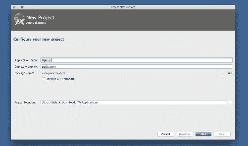
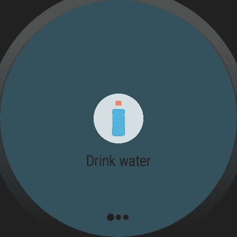

# 四、测量你的健康状况——传感器

我们生活在科技领域！这绝对不是这里的亮点。我们也生活在错综复杂的生活方式中，这种生活方式将每个人的健康推向某种疾病。我们的存在带领我们回到海洋的根；我们都知道我们是从水进化而来的生物。如果我们追溯一下，我们清楚地知道我们的身体成分 60%是由水组成的，其余是肌肉水。当我们谈论照顾我们的健康时，我们错过了简单的事情，比如喝足够的水。充足、规律的水分消耗将确保良好的新陈代谢和健康的功能器官。那么新千年在技术上的进步就是一个人如何利用技术做正确事情的表现。

安卓穿戴集成了众多传感器，可用于帮助安卓穿戴用户测量心率、步数等。说了这么多，不如写一个应用程序，每 30 分钟提醒我们喝水，测量我们的心率和步数，并提供一些健康提示？

本章将使您了解如何在穿戴设备中登记所有可用的传感器，并使用它们来测量步数、心率等。

在本章中，我们将探讨以下内容:

*   在磨损中登记可用的传感器
*   传感器的精度和电池消耗
*   佩戴 2.0 瞌睡模式
*   用初始逻辑编写应用程序
*   磨损材质设计入门
*   为应用程序创建用户界面

# 将应用概念化

我们将构建的穿戴应用程序将有三个主要界面，用于启动水提醒、心率分析和步数计数器。

以下是启动提醒服务的水提醒屏幕。使用导航抽屉中的导航功能，我们可以在其他屏幕之间切换:


# 在磨损中登记可用的传感器

了解您正在使用的穿戴设备中可用的传感器列表实际上有助于确保您不会得到错误的结果和不必要的等待。很少有安卓穿戴设备没有心率传感器。在这种情况下，为心率传感器编写应用程序并不能证明什么。以下是我们获取可用传感器列表的方法:

```java
public class SensorActivity extends Activity implements SensorEventListener {
  private SensorManager mSensorManager;
  private Sensor mLight;

  @Override
  public final void onCreate(Bundle savedInstanceState) {
    super.onCreate(savedInstanceState);
    setContentView(R.layout.main);

    mSensorManager = (SensorManager)  
    getSystemService(Context.SENSOR_SERVICE);
    mLight = mSensorManager.getDefaultSensor(Sensor.TYPE_LIGHT);

    mSensorManager = (SensorManager)     
    getSystemService(Context.SENSOR_SERVICE); 
    final List<Sensor> deviceSensors = 
    mSensorManager.getSensorList(Sensor.TYPE_ALL); 

    for(Sensor type : deviceSensors){      
        Log.e("sensors",type.getStringType()); 
    }
}

  @Override
  public final void onAccuracyChanged(Sensor sensor, int accuracy){
    // Do something here if sensor accuracy changes.
  }

  @Override
  public final void onSensorChanged(SensorEvent event) {

  }

  @Override
  protected void onResume() {
    super.onResume();

  }

  @Override
  protected void onPause() {
    super.onPause();
    mSensorManager.unregisterListener(this);
  }
}

```

我们将在控制台的穿戴设备中看到所有可用的传感器，如下所示:

```java
E/sensors: android.sensor.accelerometer
E/sensors: android.sensor.magnetic_field
E/sensors: android.sensor.orientation
E/sensors: android.sensor.temperature
E/sensors: android.sensor.proximity
E/sensors: android.sensor.light
E/sensors: android.sensor.pressure
E/sensors: android.sensor.relative_humidity
E/sensors: android.sensor.geomagnetic_rotation_vector

```

# 传感器的精度

所有装入磨损设备的传感器都表现出最佳的精度和准确度。当我们为健康领域撰写应用程序时，考虑传感器的精度非常重要。穿戴设备中使用的传感器也依赖于制造商，因为根据谷歌 IO 2017，安卓穿戴已经生产了近 40 个和更多不同的品牌。当我们在不知道 Wear 提供什么的情况下从头开始编写应用程序时，我们肯定会遇到许多挑战。大多数磨损设备都有步进检测器和步进计数器传感器。也许，我们不需要担心编写一个加速度计程序，该程序获取设备的三维运动并预测步长，这将是不准确的。线性加速度预测的步数在大多数情况下会导致错误的结果。为了节省电池并在某些使用情况下做出有意义的决定，传感器起着至关重要的作用。运动传感器通过在不看手腕时打开环境模式来帮助节省佩戴设备的电池。光传感器将允许设备根据外部光线影响增加或减少屏幕亮度。心率传感器在可穿戴设备中很常见。本质上，心率传感器是一种光学传感器。它不会像心电图或心电图仪(EKG)那样精确，但是当你在休息期间使用它们时，这些传感器会接近精确。使用相同的传感器，可以预测睡眠监测和活动跟踪，如卡路里燃烧。这些传感器正在变得越来越好，并且在未来将变得极其精确，但是，就硬件质量而言，Wear 中包含的内容将获得硬件问题和软件级别控制的软件修复。

常见的磨损集成传感器如下:

*   加速计
*   磁力计
*   环境传感器
*   全球（卫星）定位系统
*   心率传感器
*   氧饱和度传感器

未来，穿戴设备将更精确地装入更多传感器，并通过这些传感器瞄准健康区域。

# 电池消耗

电池至关重要。我们编写的程序应该以节省电池为目标。Wear 1.x 的设计指南和标准没有材质设计，对电池消耗影响巨大。将材质设计引入 Wear 2.0 后，很明显，深色主题可以节省更多电池。安卓穿戴团队正在不断努力提高电池寿命。谷歌引入了一套最佳实践来提高穿戴设备的电池寿命。穿戴设备中的显示器消耗大量电池。有不同类型的显示器，当显示器处于开启模式、始终开启模式和交互模式时，它们消耗不同的电量。交互模式汲取了最大的力量，所以我们需要关心什么时候写交互模式。当然，对于大多数用例来说，电池消耗是必要的。当我们真正研究一个特定的用例时，会有许多地方可以阻止从磨损电池中获取最大功率。我们应该在生产应用程序中反复检查，我们正在释放所有会消耗电池的传感器和其他硬件。安卓提供了`WAKE_LOCK`机制，让开发者能够识别哪个应用使用哪个硬件，并在应用进入后台时帮助发布它们。编写服务对于运行一个长进程是必要的，但是如果我们利用后台服务来获取硬件，它们将总是消耗电池，在这种情况下编写 kill 服务非常重要。

Android Studio提供了一个名为“电池历史记录”的开源工具，用于分析应用程序的电池统计数据。电池历史记录将电池数据转换为可在浏览器上查看的 HTML 视觉表示。在试图节省电池之前，我们需要知道哪个过程从电池中吸取了多少电流。稍后，使用电池历史数据，我们将确定哪个过程消耗更多数据，我们将能够进行电池优化。

# 十二模式

电池优化对开发人员来说一直是一项具有挑战性的任务。谷歌已经启动了许多内部项目，比如坚持每秒 60 帧动画速率的 Volta 项目。制造商已经开始了发布电池容量最高的手机和平板电脑的趋势。这里的挑战是引入了太多新的硬件组件，设备持续时间很长，只有几个小时。谷歌没有包装巨大的电池，而是从应用编程接口级别 23 优化了电池消耗过程，以便在应用程序适应使用打瞌睡模式时，可以多使用几个小时。

当设备长时间不使用或长时间处于空闲状态时，设备进入打盹模式。当系统试图访问网络和 CPU 密集型服务时，打盹模式可以防止这种情况发生。打盹模式会在一段时间后自动退出，访问网络，并同步所有作业和警报。以下限制适用于处于模式下的应用程序:

*   网络操作被终止
*   系统忽略唤醒锁定
*   标准报警管理器需要等待瞌睡模式退出
*   当处于打盹模式时，要发出警报，应使用`setAndAllowWhileIdle()`
*   该设备将不会执行无线扫描
*   同步适配器受到限制
*   作业计划程序受到限制

根据应用程序提供的功能，调整瞌睡模式会对它们产生不同的影响。几乎所有的应用程序在打盹模式下都能正常工作。在某些使用情况下，我们必须修改网络请求作业、警报和同步，并且应用程序应该在瞌睡模式退出期间有效地管理所有活动。考虑到安卓 5.1(应用编程接口级别 22)或更低版本中的警报在系统处于打盹模式时不会触发，打盹模式可能会影响`AlarmManager`警报和计时器管理的活动。为了帮助安排警报，Android 6.0 (API 级别 23)引入了两种新的`AlarmManager`方法:`setAndAllowWhileIdle()`和`setExactAndAllowWhileIdle()`。通过这些方法，我们可以在打盹模式下发出警报。

# 创建项目

现在，让我们启动Android Studio，并构建一个穿戴应用程序来帮助我们完成这一切。

1.  创建一个安卓项目，称之为`Upbeat`。因为它是一个与健康相关的应用程序，所以 upbeat 这个名字很有意义:



2.  在目标安卓设备屏幕中选择电话和穿戴模块:


4.  现在为移动模板选择“空活动”，为“穿搭”选择“始终穿搭活动”。成功创建项目后，转到“磨损”模块并添加配色方案文件，以开始推动材质设计标准的发展。
5.  在`res/values`目录下创建`colors.xml`文件，并添加以下颜色代码:

```java
<?xml version="1.0" encoding="utf-8"?>
<resources>
    <color name="colorPrimary">#607d8b</color>
    <color name="colorPrimaryDark">#34515e</color>
    <color name="colorAccent">#FFF</color>
</resources>

```

For better readability of code for the project, let's create packages called `fragments`, `services`, and `utils`. In these three packages, we will create all our working code.

6.  在这个项目中，我们将使用`WearableDrawerLayout`和`WearableNavigationDrawer`在片段之间导航。让我们在穿戴模块中设置`MainActivity`来使用`WearableNavigationDrawer`。在`activity_main.xml`文件中，我们需要将根元素更改为`WearableDrawerLayout`，如下所示:

```java
<android.support.wearable.view.drawer.WearableDrawerLayout
    xmlns:android="http://schemas.android.com/apk/res/android"
    xmlns:app="http://schemas.android.com/apk/res-auto"
    xmlns:tools="http://schemas.android.com/tools"
    android:id="@+id/drawer_layout"
    android:layout_width="match_parent"
    android:layout_height="match_parent"
    android:background="@color/colorPrimary"
    tools:context="com.packt.upbeat.MainActivity"
    tools:deviceIds="wear">

    .
    .
    .

</android.support.wearable.view.drawer.WearableDrawerLayout>

```

7.  在支持库中的`nestedScrollview`里面，我们将添加`framelayout`作为待附着和分离碎片的容器。之后，我们可以附加另一个`WearableNavigationDrawer`元素的子元素。如果我们正在寻找的穿戴应用有一个行动菜单，我们是，我们将添加另一个元素称为`WearableActionDrawer`。在`WearableDrawerLayout`范围内添加以下代码:

```java
<android.support.wearable.view.drawer.WearableDrawerLayout
 ...

<android.support.v4.widget.NestedScrollView
 android:id="@+id/content"
 android:layout_width="match_parent"
 android:layout_height="match_parent"
 android:fillViewport="true">

 <FrameLayout
 android:id="@+id/content_frame"
 android:layout_width="match_parent"
 android:layout_height="match_parent" />

</android.support.v4.widget.NestedScrollView>

<android.support.wearable.view.drawer.WearableNavigationDrawer
 android:id="@+id/top_navigation_drawer"
 android:layout_width="match_parent"
 android:layout_height="match_parent"
 android:background="@color/colorPrimaryDark" />

<android.support.wearable.view.drawer.WearableActionDrawer
 android:id="@+id/bottom_action_drawer"
 android:layout_width="match_parent"
 android:layout_height="match_parent"
 android:background="@color/colorPrimaryDark"
 app:action_menu="@menu/drawer_menu" />

</android.support.wearable.view.drawer.WearableDrawerLayout>

```

# 添加抽屉菜单

我们稍后将添加`drawer_menu`菜单 XML 资源。`MainActivity`的所有视觉元素都到位了。让我们从故事的 Java 方面着手，为选定的导航抽屉项目进行动态滑动和碎片切换。在开始学习`MainActivity`之前，我们需要为抽屉项目创建一个带有构造函数的 POJO 类:

```java
public class DrawerItem {
    private String name;
    private String navigationIcon;

    public DrawerItem(String name, String navigationIcon) {
        this.name = name;
        this.navigationIcon = navigationIcon;
    }

    public String getName() {
        return name;
    }

    public void setName(String name) {
        this.name = name;
    }

    public String getNavigationIcon() {
        return navigationIcon;
    }

    public void setNavigationIcon(String navigationIcon) {
        this.navigationIcon = navigationIcon;
    }
}

```

这些获取器和设置器将有助于设置抽屉图标和抽屉标题，正如我们之前讨论的笔记应用程序中的 POJO。

在`MainActivity.java`中，让我们执行`WearableActionDrawer.OnMenuItemClickListener`并覆盖`onMenuItemClick`，如下所示:

```java
public class MainActivity extends WearableActivity  implements
        WearableActionDrawer.OnMenuItemClickListener{

....

@Override
public boolean onMenuItemClick(MenuItem menuItem) {
    Log.d(TAG, "onMenuItemClick(): " + menuItem);
    final int itemId = menuItem.getItemId();
  }
}

```

让我们使用`MainActivity`范围内的必要设置初始化`WearableDrawerLayout`、`WearableNavigationDrawer`和`WearableActionDrawer`的所有实例:

```java
private static final String TAG = "MainActivity";
private WearableDrawerLayout mWearableDrawerLayout;
private WearableNavigationDrawer mWearableNavigationDrawer;
private WearableActionDrawer mWearableActionDrawer;
private ArrayList<DrawerItem> drawer_itemArrayList;
private int mSelectedScreen;

```

在`onCreate`方法中，让我们通过`findViewById()`方法映射所有的视觉组件。此后，我们将使用一个名为`ViewTreeObserver`的新类进行快速浏览和隐藏:

```java
@Override
protected void onCreate(Bundle savedInstanceState) {
    super.onCreate(savedInstanceState);
    setContentView(R.layout.activity_main);
    setAmbientEnabled();

   //Initialise the arraylist
    drawer_itemArrayList = initializeScreenSystem();
    mSelectedScreen = 0;

    // Initialize here for content to first screen.
    ...

    // Main Wearable Drawer Layout that holds all the content
    mWearableDrawerLayout = (WearableDrawerLayout) 
    findViewById(R.id.drawer_layout);

    // Top Navigation Drawer
    mWearableNavigationDrawer =
            (WearableNavigationDrawer) 
    findViewById(R.id.top_navigation_drawer);

    mWearableNavigationDrawer.setAdapter(new NavigationAdapter(this));

    // Bottom Action Drawer
    mWearableActionDrawer =
            (WearableActionDrawer) 
    findViewById(R.id.bottom_action_drawer);

    mWearableActionDrawer.setOnMenuItemClickListener(this);

    // Temporarily peeks the navigation and action drawers to ensure 
    the user is aware of them.
    ViewTreeObserver observer = 
    mWearableDrawerLayout.getViewTreeObserver();
    observer.addOnGlobalLayoutListener(new 
    ViewTreeObserver.OnGlobalLayoutListener() {
        @Override
        public void onGlobalLayout() {
            mWearableDrawerLayout.getViewTreeObserver()
            .removeOnGlobalLayoutListener(this);
            mWearableDrawerLayout.peekDrawer(Gravity.TOP);
            mWearableDrawerLayout.peekDrawer(Gravity.BOTTOM);
        }
    });
}

```

我们已经看到了`setAmbientEnabled()`方法之后的数组初始化代码。我们需要给它写关联的方法。在方法内部，初始化一个`DrawerItem`列表，遍历各项，得到标题和图标，如下:

```java
private ArrayList<DrawerItem> initializeScreenSystem() {
    ArrayList<DrawerItem> screens = new ArrayList<DrawerItem>();
    String[] FragmentArrayNames = 
    getResources().getStringArray(R.array.screens);

    for (int i = 0; i < FragmentArrayNames.length; i++) {
        String planet = FragmentArrayNames[i];
        int FragmentResourceId =
                getResources().getIdentifier(planet, "array", 
                getPackageName());
        String[] fragmentInformation = 
        getResources().getStringArray(FragmentResourceId);

        screens.add(new DrawerItem(
                fragmentInformation[0],   // Name
                fragmentInformation[1]));
    }

    return screens;
}

```

在`FragmentArrayNames`实例中，我们正在搜索一个字符串数组，它需要被创建。在`res/values`文件夹中，创建`arrays.xml`文件和以下数组集:

```java
<?xml version="1.0" encoding="utf-8"?>
<resources>

    <string-array name="screens">
        <item>water</item>
        <item>heart</item>
        <item>step</item>
    </string-array>

    <string-array name="water">
       // drawer item title  
        <item>Drink water</item>
      // drawer item icon
        <item>water_bottle_flat</item>
    </string-array>

    <string-array name="heart">
        <item>Heart Beat</item>
        <item>ic_heart_icon</item>
    </string-array>

    <string-array name="step">
        <item>Step Counter</item>
        <item>ic_step_icon</item>
    </string-array>

</resources>

```

为了便于理解，我们以`screens`弦阵中的水项为例。我们为水碎片屏幕的项目添加了一个标题和确切的图标名称，其他数组项目也是如此。

对于`WearableActionDrawer`项，我们需要在继续编写 Java 逻辑之前配置动作。我们需要将`menu` XML 文件添加到`res/menu`目录中。我们把文件叫做`drawer_menu.xml`:

```java
<?xml version="1.0" encoding="utf-8"?>

<menu xmlns:android="http://schemas.android.com/apk/res/android">
    <item android:id="@+id/menu_about"
          android:icon="@drawable/ic_info"
          android:title="About"/>
    <item android:id="@+id/menu_helathtips"
          android:icon="@drawable/ic_info"
          android:title="Health tips" />
    <item android:id="@+id/menu_calarie"
          android:icon="@drawable/ic_info"
          android:title="Calories chart" />
</menu>

```

当用户点击任何菜单项时，我们必须覆盖`onMenuItemclicklistener`并启动一个动作:

```java
@Override
public boolean onMenuItemClick(MenuItem menuItem) {
    Log.d(TAG, "onMenuItemClick(): " + menuItem);

    final int itemId = menuItem.getItemId();

    String toastMessage = "";

    switch (itemId) {
        case R.id.menu_about:
            toastMessage = 
            drawer_itemArrayList.get(mSelectedScreen).getName();
            break;
        case R.id.menu_helathtips:
            toastMessage = 
            drawer_itemArrayList.get(mSelectedScreen).getName();
            break;
        case R.id.menu_volume:
            toastMessage = 
            drawer_itemArrayList.get(mSelectedScreen).getName();
            break;
    }

 mWearableDrawerLayout.closeDrawer(mWearableActionDrawer);

    if (toastMessage.length() > 0) {
        Toast toast = Toast.makeText(
                getApplicationContext(),
                toastMessage,
                Toast.LENGTH_SHORT);
        toast.show();
        return true;
    } else {
        return false;
    }
}

```

当`actionDrawer`从穿戴设备底部弹出时，我们将关闭导航`drawerlayout`以感知活动抽屉。当用户点击该项目时，我们将显示片段屏幕名称，这是我们用数组 XML 制作的。

现在为最后一块`MainActivity`。让我们组成`NavigationDrawer`适配器，在切换时连接框架。

# 创建导航抽屉适配器

创建一个扩展到`WearableNavigationDrawerAdapter`的类，并覆盖以下方法:

```java
private final class NavigationAdapter
        extends WearableNavigationDrawer
        .WearableNavigationDrawerAdapter {

@Override
public String getItemText(int i) {
    return null;
}

@Override
public Drawable getItemDrawable(int i) {
    return null;
}

@Override
public void onItemSelected(int i) {

}

@Override
public int getCount() {
    return 0;
}

}

```

之后，创建一个构造函数，获取上下文作为参数，在`getCount`方法中，返回带有大小的`drawer_item` `ArrayList`。

在`onItemSelected`方法中，基于位置参数，我们可以切换片段:

```java
@Override
public void onItemSelected(int position) {
    Log.d(TAG, "WearableNavigationDrawerAdapter.onItemSelected(): " + 
    position);
    mSelectedScreen = position;

    if(position==0) {
        final DrinkWaterFragment drinkWaterFragment = new 
        DrinkWaterFragment();
        getFragmentManager()
                .beginTransaction()
                .replace(R.id.content_frame, drinkWaterFragment)
                .commit();
    }

}

```

不管怎样，我们必须写片段。坚持一段时间。在`getItemText`中，我们可以从`draweritem` `ArrayList`恢复名称如下:

```java
@Override
public String getItemText(int pos) {
    return drawer_itemArrayList.get(pos).getName();
}

```

要获取可绘制图标并设置图标，我们将使用以下自定义方法:

```java
@Override
public Drawable getItemDrawable(int pos) {
    String navigationIcon =   
    drawer_itemArrayList.get(pos).getNavigationIcon();

    int drawableNavigationIconId =
            getResources().getIdentifier(navigationIcon, "drawable", 
            getPackageName());

    return mContext.getDrawable(drawableNavigationIconId);
}

```

是的，我们已经完成了`MainActivity`代码。让我们把所有的方法放在一起，看看完整的`MainActivity`代码:

```java
public class MainActivity extends WearableActivity  implements
        WearableActionDrawer.OnMenuItemClickListener{

    private static final String TAG = "MainActivity";
    private WearableDrawerLayout mWearableDrawerLayout;
    private WearableNavigationDrawer mWearableNavigationDrawer;
    private WearableActionDrawer mWearableActionDrawer;
    private ArrayList<DrawerItem> drawer_itemArrayList;
    private int mSelectedScreen;

    private DrinkWaterFragment mDrinkFragment;

    @Override
    protected void onCreate(Bundle savedInstanceState) {
        super.onCreate(savedInstanceState);
        setContentView(R.layout.activity_main);
        setAmbientEnabled();
        drawer_itemArrayList = initializeScreenSystem();
        mSelectedScreen = 0;

        // Initialize content to first screen.
        mDrinkFragment = new DrinkWaterFragment();
        FragmentManager fragmentManager = getFragmentManager();
        fragmentManager.beginTransaction().replace(R.id.content_frame, 
        mDrinkFragment).commit();

        // Main Wearable Drawer Layout that holds all the content
        mWearableDrawerLayout = (WearableDrawerLayout) 
        findViewById(R.id.drawer_layout);

        // Top Navigation Drawer
        mWearableNavigationDrawer =
                (WearableNavigationDrawer) 
        findViewById(R.id.top_navigation_drawer);

        mWearableNavigationDrawer.setAdapter(new 
        NavigationAdapter(this));

        // Bottom Action Drawer
        mWearableActionDrawer =
                (WearableActionDrawer) 
                findViewById(R.id.bottom_action_drawer);

        mWearableActionDrawer.setOnMenuItemClickListener(this);

        // Temporarily peeks the navigation and action drawers to 
        ensure the user is aware of them.
        ViewTreeObserver observer = 
        mWearableDrawerLayout.getViewTreeObserver();
        observer.addOnGlobalLayoutListener(new 
        ViewTreeObserver.OnGlobalLayoutListener() {
            @Override
            public void onGlobalLayout() {
                mWearableDrawerLayout.getViewTreeObserver()
                .removeOnGlobalLayoutListener(this);
                mWearableDrawerLayout.peekDrawer(Gravity.TOP);
                mWearableDrawerLayout.peekDrawer(Gravity.BOTTOM);
            }
        });
    }

    private ArrayList<DrawerItem> initializeScreenSystem() {
        ArrayList<DrawerItem> screens = new ArrayList<DrawerItem>();
        String[] FragmentArrayNames = 
        getResources().getStringArray(R.array.screens);

        for (int i = 0; i < FragmentArrayNames.length; i++) {
            String planet = FragmentArrayNames[i];
            int FragmentResourceId =
                    getResources().getIdentifier(planet, "array", 
                    getPackageName());
            String[] fragmentInformation = 
            getResources().getStringArray(FragmentResourceId);

            screens.add(new DrawerItem(
                    fragmentInformation[0],   // Name
                    fragmentInformation[1]));
        }

        return screens;
    }

    @Override
    public boolean onMenuItemClick(MenuItem menuItem) {
        Log.d(TAG, "onMenuItemClick(): " + menuItem);

        final int itemId = menuItem.getItemId();

        String toastMessage = "";

        switch (itemId) {
            case R.id.menu_about:
                toastMessage = 
                drawer_itemArrayList.get(mSelectedScreen).getName();
                break;
            case R.id.menu_helathtips:
                toastMessage = 
                drawer_itemArrayList.get(mSelectedScreen).getName();
                break;
            case R.id.menu_volume:
                toastMessage = 
                drawer_itemArrayList.get(mSelectedScreen).getName();
                break;
        }

        mWearableDrawerLayout.closeDrawer(mWearableActionDrawer);

        if (toastMessage.length() > 0) {
            Toast toast = Toast.makeText(
                    getApplicationContext(),
                    toastMessage,
                    Toast.LENGTH_SHORT);
            toast.show();
            return true;
        } else {
            return false;
        }
    }

    private final class NavigationAdapter
            extends 
    WearableNavigationDrawer.WearableNavigationDrawerAdapter {

        private final Context mContext;

        public NavigationAdapter(Context context) {
            mContext = context;
        }

        @Override
        public int getCount() {
            return drawer_itemArrayList.size();
        }

        @Override
        public void onItemSelected(int position) {
            Log.d(TAG,              
            "WearableNavigationDrawerAdapter.onItemSelected():"
            + position);
            mSelectedScreen = position;

            if(position==0) {
                final DrinkWaterFragment drinkWaterFragment = new 
                DrinkWaterFragment();
                getFragmentManager()
                        .beginTransaction()
                        .replace(R.id.content_frame, 
                        drinkWaterFragment)
                        .commit();

            }
            }

        }

        @Override
        public String getItemText(int pos) {
            return drawer_itemArrayList.get(pos).getName();
        }

        @Override
        public Drawable getItemDrawable(int pos) {
            String navigationIcon = 
            drawer_itemArrayList.get(pos).getNavigationIcon();

            int drawableNavigationIconId =
                    getResources().getIdentifier(navigationIcon, 
                    "drawable", getPackageName());

            return mContext.getDrawable(drawableNavigationIconId);
        }
    }
        @Override
    public void onEnterAmbient(Bundle ambientDetails) {
        super.onEnterAmbient(ambientDetails);
    }

    @Override
    public void onUpdateAmbient() {
        super.onUpdateAmbient();
    }

    @Override
    public void onExitAmbient() {
        super.onExitAmbient();
    }
}

```

# 创建片段

我们需要创建一个名为`DrinkWaterFragment`的片段。在这个片段中，我们将处理`WaterDrink`提醒的开始和结束。

在`res/layout`目录下新建布局文件，创建`drink_water_fragment.xml`文件，在`boxinsetlayout`里面增加两个按钮，如下图:

```java
<?xml version="1.0" encoding="utf-8"?>
<android.support.wearable.view.BoxInsetLayout xmlns:android="http://schemas.android.com/apk/res/android"
    xmlns:app="http://schemas.android.com/apk/res-auto"
    xmlns:tools="http://schemas.android.com/tools"
    android:id="@+id/container"
    android:layout_width="match_parent"
    android:layout_height="match_parent"
    tools:context="com.packt.upbeat.fragments.HeartRateFragment"
    tools:deviceIds="wear">

    <LinearLayout
        android:layout_width="match_parent"
        android:layout_height="wrap_content"
        android:layout_gravity="center"
        android:orientation="horizontal">

        <android.support.v7.widget.AppCompatButton
            android:id="@+id/start"
            android:layout_width="match_parent"
            android:layout_height="50dp"
            android:layout_margin="10dp"
            android:layout_weight="1"
            android:background="@drawable/button_background"
            android:elevation="5dp"
            android:gravity="center"
            android:text="Start"
            android:textAllCaps="true"
            android:textColor="@color/white"
            android:textStyle="bold" />

        <android.support.v7.widget.AppCompatButton
            android:id="@+id/stop"
            android:layout_width="match_parent"
            android:layout_height="50dp"
            android:layout_margin="10dp"
            android:layout_weight="1"
            android:background="@drawable/button_background"
            android:elevation="5dp"
            android:gravity="center"
            android:text="Stop"
            android:textAllCaps="true"
            android:textColor="@color/white"
            android:textStyle="bold" />

    </LinearLayout>
</android.support.wearable.view.BoxInsetLayout>

```

你也可以使用普通的`Button`类，但是，在这个项目中，我们将使用`AppCompatButton`进行材质设计插图，例如立面和其他特征。我们必须自定义按钮背景选择器。在`drawable`目录中创建一个文件，并将其称为`button_background.xml`。添加以下代码:

```java
<?xml version="1.0" encoding="utf-8"?>
<selector xmlns:android="http://schemas.android.com/apk/res/android">
    <item android:drawable="@color/colorPrimaryDark" 
    android:state_pressed="true"/>
    <item android:drawable="@color/grey" android:state_focused="true"/>
    <item android:drawable="@color/colorPrimary"/>
</selector>

```

在`DrinkWaterFragment`中，实例化按钮，并在两个按钮上附加一个监听器，用于启动和停止的服务，如下所示:

```java
public class DrinkWaterFragment extends Fragment {

    private AppCompatButton mStart;
    private AppCompatButton mStop;

    public DrinkWaterFragment() {
        // Required empty public constructor
    }

    @Override
    public View onCreateView(LayoutInflater inflater, ViewGroup 
    container,
                             Bundle savedInstanceState) {
        // Inflate the layout for this fragment
        View rootView = inflater.inflate(R.layout.drink_water_fragment, 
        container, false);

        mStart = (AppCompatButton) rootView.findViewById(R.id.start);
        mStop = (AppCompatButton) rootView.findViewById(R.id.stop);
        mStart.setOnClickListener(new View.OnClickListener() {
            @Override
            public void onClick(View v) { 

}
});

mStop.setOnClickListener(new View.OnClickListener() {
    @Override
    public void onClick(View v) {

    }

});

     return rootView;
  }
}

```

现在是时候在服务包中编写一个`BroadcastReceiver`类，并在其中配置通知了。让我们把这个类叫做`WaterReminderReceiver`并扩展到`BroadcastReciever`。忽略`onReceive`方法，只要`AlarmManager`触发，接收器就会收到数据，我们会看到一个通知:

```java
public class WaterReminderReceiver extends BroadcastReceiver {
    public static final String CONTENT_KEY = "contentText";

    @Override
    public void onReceive(Context context, Intent intent) {
        Intent intent2 = new Intent(context, MainActivity.class);
        intent.addFlags(Intent.FLAG_ACTIVITY_CLEAR_TOP);
        PendingIntent pendingIntent = 
        PendingIntent.getActivity(context, 0, intent2,
                PendingIntent.FLAG_ONE_SHOT);

        Uri defaultSoundUri = 
        RingtoneManager.getDefaultUri(RingtoneManager.TYPE_ALARM);

        NotificationCompat.Builder notificationBuilder = 
        (NotificationCompat.Builder) new 
        NotificationCompat.Builder(context)
                .setAutoCancel(true)   
                //Automatically delete the notification
                .setSmallIcon(R.drawable.water_bottle_flat) 
                //Notification icon
                .setContentIntent(pendingIntent)
                .setContentTitle("Time to hydrate")
                .setContentText("Drink a glass of water now")
                .setCategory(Notification.CATEGORY_REMINDER)
                .setPriority(Notification.PRIORITY_HIGH)
                .setSound(defaultSoundUri);

        NotificationManagerCompat notificationManager = 
        NotificationManagerCompat.from(context);
        notificationManager.notify(0, notificationBuilder.build());

        Toast.makeText(context, "Repeating Alarm Received", 
        Toast.LENGTH_SHORT).show();
    }
}

```

在应用程序标记范围内的清单中注册此接收器:

```java
<receiver android:name=".services.WaterReminderReceiver" android:process=":remote" />

```

现在，在开始按钮的`onClickListener`中的`DrinkWaterFragment`中，启动`AlarmManager`服务并注册广播接收器:

```java
mStart.setOnClickListener(new View.OnClickListener() {
    @Override
    public void onClick(View v) {
        Intent intent = new Intent(getActivity(), 
        WaterReminderReceiver.class);
        PendingIntent sender = 
        PendingIntent.getBroadcast(getActivity(),
                0, intent, 0);

        // We want the alarm to go off 5 seconds from now.
        long firstTime = SystemClock.elapsedRealtime();
        firstTime += 5 * 1000;

        // Schedule the alarm!
        AlarmManager am = (AlarmManager) 
        getActivity().getSystemService(ALARM_SERVICE);
        am.setRepeating(AlarmManager.ELAPSED_REALTIME_WAKEUP,
                firstTime, 5 * 1000, sender);

        //DOZE MODE SUPPORT       am.setAndAllowWhileIdle(AlarmManager
        .ELAPSED_REALTIME_WAKEUP, firstTime, sender);

        // Tell the user about what we did.
        if (mToast != null) {
            mToast.cancel();
        }
        mToast = Toast.makeText(getActivity(), 
        "Subscribed to water alarm",
                Toast.LENGTH_LONG);
        mToast.show();
    }
});

```

现在，出于调试目的，我们将给出 15 秒的延迟，尽管您可以根据您的需求和应用程序用例来更改延迟。我们还确保当穿戴设备进入瞌睡模式时，水提醒仍然启动瞌睡支持的方法来启动警报管理器。

当我们点击停止按钮时，要停止水提醒服务，`onClickListener`将停止后台运行的报警管理器，并为水提醒的`unsubscription`快速干杯:

```java
  mStop.setOnClickListener(new View.OnClickListener() {
            @Override
            public void onClick(View v) {
                // Create the same intent, and thus a matching 
                IntentSender, for the one that was scheduled.
                Intent intent = new Intent(getActivity(), 
                WaterReminderReceiver.class);
                PendingIntent sender = 
                PendingIntent.getBroadcast(getActivity(),
                        0, intent, 0);

                // And cancel the alarm.
                AlarmManager am = (AlarmManager) 
                getActivity().getSystemService(ALARM_SERVICE);
                am.cancel(sender);

                // Tell the user about what we did.
                if (mToast != null) {
                    mToast.cancel();
                }
                mToast = Toast.makeText(getActivity(), "Unsubscribed 
                from water reminder",
                        Toast.LENGTH_LONG);
                mToast.show();
            }
        });

```

完整的片段类代码如下:

```java
public class DrinkWaterFragment extends Fragment {

    private AppCompatButton mStart;
    private AppCompatButton mStop;
    private Toast mToast;

    public DrinkWaterFragment() {
        // Required empty public constructor
    }

    @Override
    public View onCreateView(LayoutInflater inflater, ViewGroup 
    container,
                             Bundle savedInstanceState) {
        // Inflate the layout for this fragment
        View rootView = inflater.inflate(R.layout.drink_water_fragment, 
        container, false);

        mStart = (AppCompatButton) rootView.findViewById(R.id.start);
        mStop = (AppCompatButton) rootView.findViewById(R.id.stop);

        mStart.setOnClickListener(new View.OnClickListener() {
            @Override
            public void onClick(View v) {
                Intent intent = new Intent(getActivity(), 
                WaterReminderReceiver.class);
                PendingIntent sender = 
                PendingIntent.getBroadcast(getActivity(),
                        0, intent, 0);

                // We want the alarm to go off 5 seconds from now.
                long firstTime = SystemClock.elapsedRealtime();
                firstTime += 5 * 1000;

                // Schedule the alarm!
                AlarmManager am = (AlarmManager) 
                getActivity().getSystemService(ALARM_SERVICE);
                am.setRepeating(AlarmManager.ELAPSED_REALTIME_WAKEUP,
                        firstTime, 5 * 1000, sender);
                //DOZE MODE SUPPORT
                am.setAndAllowWhileIdle
                (AlarmManager.ELAPSED_REALTIME_WAKEUP, 
                firstTime, sender);

                // Tell the user about what we did.
                if (mToast != null) {
                    mToast.cancel();
                }
                mToast = Toast.makeText(getActivity(), "Subscribed to 
                water alarm",
                        Toast.LENGTH_LONG);
                mToast.show();
            }
        });

        mStop.setOnClickListener(new View.OnClickListener() {
            @Override
            public void onClick(View v) {
                // Create the same intent, 
                and thus a matching IntentSender, for
                // the one that was scheduled.
                Intent intent = new Intent(getActivity(), 
                WaterReminderReceiver.class);
                PendingIntent sender = 
                PendingIntent.getBroadcast(getActivity(),
                        0, intent, 0);

                // And cancel the alarm.
                AlarmManager am = (AlarmManager) 
                getActivity().getSystemService(ALARM_SERVICE);
                am.cancel(sender);

                // Tell the user about what we did.
                if (mToast != null) {
                    mToast.cancel();
                }
                mToast = Toast.makeText(getActivity(), "Unsubscribed 
                from water reminder",
                        Toast.LENGTH_LONG);
                mToast.show();
            }
        });

        return rootView;
    }
}

```

这个片段附在`MainActivity` `NavigationDrawerAdapter`上。通过将`onCreate`方法中的片段附加为`MainActivity`，确保您将此片段附加为默认片段:

```java
@Override
protected void onCreate(Bundle savedInstanceState) {

...
// Initialize content to first screen.
mDrinkFragment = new DrinkWaterFragment();
FragmentManager fragmentManager = getFragmentManager();
fragmentManager.beginTransaction().replace(R.id.content_frame, mDrinkFragment).commit();

}

```

我们已成功完成该应用的饮水提醒功能。现在，让我们通过光学心率传感器建立心率检测。

在碎片包中创建一个碎片，并将其称为`HeartRateFragment.java`。在`res/layout`目录中重构，创建 XML，或者创建一个新的布局文件并调用那个`heart_rate_fragment.xml`，并添加以下代码:

```java
<?xml version="1.0" encoding="utf-8"?>
<android.support.wearable.view.BoxInsetLayout xmlns:android="http://schemas.android.com/apk/res/android"
    xmlns:tools="http://schemas.android.com/tools"
    android:id="@+id/container"
    android:layout_width="match_parent"
    android:layout_height="match_parent"
    tools:context="com.packt.upbeat.fragments.HeartRateFragment"
    tools:deviceIds="wear">

    <LinearLayout xmlns:app="http://schemas.android.com/apk/res-auto"
        android:layout_width="match_parent"
        android:layout_height="match_parent"
        android:layout_gravity="center"
        android:orientation="horizontal">

        <ImageView
        android:layout_weight="1"
        android:src="@drawable/ic_heart_icon"
        android:layout_width="match_parent"
        android:layout_height="match_parent" />

        <TextView
            android:id="@+id/heart_rate"
            android:layout_width="match_parent"
            android:layout_height="match_parent"
            android:layout_gravity="center"
            android:layout_weight="1"
            android:gravity="left|center"
            android:hint="Reading"
            android:textColor="@color/colorAccent"
            android:textColorHint="#eaeaea"
            android:textSize="20sp"
            android:textStyle="bold" />

    </LinearLayout>
</android.support.wearable.view.BoxInsetLayout>

```

不是静态的`ImageView`，如前面的代码所示，给传感器返回的脉率加一个动态的心跳怎么样？我们将在[https://github.com/scottyab/HeartBeatView](https://github.com/scottyab/HeartBeatView)基于开源项目创建一个自定义比例动画。让我们在 utils 包中创建一个类，并将其称为`HeartBeatView.java`，扩展到`AppCompatImageView`。在我们开始处理`CustomView`之前，我们必须设置它的样式，如下所示，这有助于管理我们传递的自定义值。在`res/values`创建一个文件，并将其称为`heartbeat_attrs.xml`。`Styleable`定义自定义视图的属性和特性；例如，当自定义视图需要比例因子时，我们可以定义它，如下面的代码示例所示:

```java
<?xml version="1.0" encoding="utf-8"?>
<resources>

    <declare-styleable name="HeartBeatView">
        <attr name="scaleFactor" format="float" />
        <attr name="duration" format="integer" />
    </declare-styleable>

</resources>

```

通过扩展`AppCompatImageView`类来创建`HeartBeatView`类。我们需要创建属于`AppCompatImageView`类的构造函数，如下所示:

```java
public class HeartBeatView extends AppCompatImageView{

    public HeartBeatView(Context context) {
        super(context);
    }

    public HeartBeatView(Context context, AttributeSet attrs) {
        super(context, attrs);
    }

    public HeartBeatView(Context context, AttributeSet attrs, int 
    defStyleAttr) {
        super(context, attrs, defStyleAttr);
    }
}

```

让我们创建配置比例因子和动画持续时间的实例。将以下实例添加到类的全局范围:

```java
private static final float DEFAULT_SCALE_FACTOR = 0.2f;
private static final int DEFAULT_DURATION = 50;
private Drawable heartDrawable;

private boolean heartBeating = false;

float scaleFactor = DEFAULT_SCALE_FACTOR;
float reductionScaleFactor = -scaleFactor;
int duration = DEFAULT_DURATION;

```

我们需要一个心形的矢量图形，这需要在`drawable`文件夹中创建。创建一个文件，称之为`heart_red_24dp.xml`，并添加以下代码:

```java
<vector xmlns:android="http://schemas.android.com/apk/res/android"
    android:width="24dp"
    android:height="24dp"
    android:viewportHeight="24.0"
    android:viewportWidth="24.0">
    <path
        android:fillColor="#FFFF0000"
        android:pathData="M12,21.35l-1.45,-1.32C5.4,15.36 2,12.28 2,8.5 
        2,5.42 4.42,3 7.5,3c1.74,0 3.41,0.81 4.5,2.09C13.09,3.81
        14.76,3 16.5,3 19.58,3 22,5.42 22,8.5c0,3.78 -3.4,6.86
        -8.55,11.54L12,21.35z"/>
</vector>

```

为了初始化矢量图形，我们将利用`drawable`实例并访问矢量图形:

```java
private void init() {
    //make this not mandatory
    heartDrawable = ContextCompat.getDrawable(getContext(), 
    R.drawable.ic_heart_red_24dp);
    setImageDrawable(heartDrawable);

}

```

使用我们在`res/values`目录中创建的`styleable`，我们可以填充比例因子和动画持续时间。使用`TypedArray`类实例，我们可以获得如下属性:

```java
(Context context, AttributeSet attrs) {
    TypedArray a = context.getTheme().obtainStyledAttributes(
            attrs,
            R.styleable.HeartBeatView,
            0, 0
    );
    try {
        scaleFactor = a.getFloat(R.styleable.HeartBeatView_scaleFactor, 
        DEFAULT_SCALE_FACTOR);
        reductionScaleFactor = -scaleFactor;
        duration = a.getInteger(R.styleable.HeartBeatView_duration, 
        DEFAULT_DURATION);

    } finally {
        a.recycle();
    }

}

```

我们将需要三种方法，即`toggle()`、`start()`和`stop()`来初始化动画:

```java
/**
 * toggles current heat beat state
 */
public void toggle() {
    if (heartBeating) {
        stop();
    } else {
        start();
    }
}

/**
 * Starts the heat beat/pump animation
 */
public void start() {
    heartBeating = true;
    animate().scaleXBy(scaleFactor).scaleYBy(scaleFactor)
    .setDuration(duration).setListener(scaleUpListener);
}

/**
 * Stops the heat beat/pump animation
 */
public void stop() {
    heartBeating = false;
    clearAnimation();
}

```

现在，为了基于 bpm 设置持续时间，我们将简单地使用 3 位浮点的`Math.round`操作将 BPM 分配给持续时间:

```java
public void setDurationBasedOnBPM(int bpm) {
    if (bpm > 0) {
        duration = Math.round((milliInMinute / bpm) / 3f);
    }
}

```

要检查`heartBeat`动画是否已经开始，以及动画的持续时间，我们必须编写以下两种方法:

```java
public boolean isHeartBeating() {
    return heartBeating;
}

public int getDuration() {
    return duration;
}

```

使用这个指针，我们将分配持续时间和比例因子:

```java
public void setDuration(int duration) {
    this.duration = duration;
}

public float getScaleFactor() {
    return scaleFactor;
}

public void setScaleFactor(float scaleFactor) {
    this.scaleFactor = scaleFactor;
    reductionScaleFactor = -scaleFactor;
}

```

最后，我们将为`ScaleUpAnimation`和`ScaleDownAnimation`编写两个动画监听器方法。我们将编写一个类型为`Animator.AnimatorListener`的方法，我们将在`ScaleUpListener`中增加比例，在`ScaleDownListener`中减少比例，如下所示:

```java
//Scale up animation 
private final Animator.AnimatorListener scaleUpListener = new Animator.AnimatorListener() {

    @Override
    public void onAnimationStart(Animator animation) {
    }

    @Override
    public void onAnimationRepeat(Animator animation) {

    }

    @Override
    public void onAnimationEnd(Animator animation) {
        //we ignore heartBeating as we want to ensure the heart is 
        reduced back to original size
        animate().scaleXBy(reductionScaleFactor)
        .scaleYBy(reductionScaleFactor).setDuration(duration)
        .setListener(scaleDownListener);
    }

    @Override
    public void onAnimationCancel(Animator animation) {

    }
};

//Scale down animation 
private final Animator.AnimatorListener scaleDownListener = new Animator.AnimatorListener() {

    @Override
    public void onAnimationStart(Animator animation) {
    }

    @Override
    public void onAnimationRepeat(Animator animation) {
    }

    @Override
    public void onAnimationEnd(Animator animation) {
        if (heartBeating) {
            //duration twice as long for the upscale
            animate().scaleXBy(scaleFactor).scaleYBy(scaleFactor)
            .setDuration(duration * 2).setListener(scaleUpListener);
        }
    }

    @Override
    public void onAnimationCancel(Animator animation) {
    }
};

```

完成的自定义视图类如下:

```java
public class HeartBeatView extends AppCompatImageView {

    private static final String TAG = "HeartBeatView";

    private static final float DEFAULT_SCALE_FACTOR = 0.2f;
    private static final int DEFAULT_DURATION = 50;
    private Drawable heartDrawable;

    private boolean heartBeating = false;

    float scaleFactor = DEFAULT_SCALE_FACTOR;
    float reductionScaleFactor = -scaleFactor;
    int duration = DEFAULT_DURATION;

    public HeartBeatView(Context context) {
        super(context);
        init();
    }

    public HeartBeatView(Context context, AttributeSet attrs) {
        super(context, attrs);
        populateFromAttributes(context, attrs);
        init();
    }

    public HeartBeatView(Context context, AttributeSet attrs, int 
    defStyleAttr) {
        super(context, attrs, defStyleAttr);
        populateFromAttributes(context, attrs);
        init();
    }

    private void init() {
        //make this not mandatory
        heartDrawable = ContextCompat.getDrawable(getContext(), 
        R.drawable.ic_heart_red_24dp);
        setImageDrawable(heartDrawable);

    }

    private void populateFromAttributes(Context context, AttributeSet 
    attrs) {
        TypedArray a = context.getTheme().obtainStyledAttributes(
                attrs,
                R.styleable.HeartBeatView,
                0, 0
        );
        try {
            scaleFactor = 
            a.getFloat(R.styleable.HeartBeatView_scaleFactor, 
            DEFAULT_SCALE_FACTOR);
            reductionScaleFactor = -scaleFactor;
            duration = a.getInteger(R.styleable.HeartBeatView_duration, 
            DEFAULT_DURATION);

        } finally {
            a.recycle();
        }

    }

    /**
     * toggles current heat beat state
     */
    public void toggle() {
        if (heartBeating) {
            stop();
        } else {
            start();
        }
    }

    /**
     * Starts the heat beat/pump animation
     */
    public void start() {
        heartBeating = true;
        animate().scaleXBy(scaleFactor).scaleYBy(scaleFactor)
        .setDuration(duration).setListener(scaleUpListener);
    }

    /**
     * Stops the heat beat/pump animation
     */
    public void stop() {
        heartBeating = false;
        clearAnimation();
    }

    /**
     * is the heart currently beating
     *
     * @return
     */
    public boolean isHeartBeating() {
        return heartBeating;
    }

    public int getDuration() {
        return duration;
    }

    private static final int milliInMinute = 60000;

    /**
     * set the duration of the beat based on the beats per minute
     *
     * @param bpm (positive int above 0)
     */
    public void setDurationBasedOnBPM(int bpm) {
        if (bpm > 0) {
            duration = Math.round((milliInMinute / bpm) / 3f);
        }
    }

    public void setDuration(int duration) {
        this.duration = duration;
    }

    public float getScaleFactor() {
        return scaleFactor;
    }

    public void setScaleFactor(float scaleFactor) {
        this.scaleFactor = scaleFactor;
        reductionScaleFactor = -scaleFactor;
    }

    private final Animator.AnimatorListener scaleUpListener = new 
    Animator.AnimatorListener() {

        @Override
        public void onAnimationStart(Animator animation) {
        }

        @Override
        public void onAnimationRepeat(Animator animation) {

        }

        @Override
        public void onAnimationEnd(Animator animation) {
            //we ignore heartBeating as we want to ensure the heart is 
            reduced back to original size
            animate().scaleXBy(reductionScaleFactor)
            .scaleYBy(reductionScaleFactor).setDuration(duration)
            .setListener(scaleDownListener);
        }

        @Override
        public void onAnimationCancel(Animator animation) {

        }
    };

    private final Animator.AnimatorListener scaleDownListener = new 
    Animator.AnimatorListener() {

        @Override
        public void onAnimationStart(Animator animation) {
        }

        @Override
        public void onAnimationRepeat(Animator animation) {
        }

        @Override
        public void onAnimationEnd(Animator animation) {
            if (heartBeating) {
                //duration twice as long for the upscale
                animate().scaleXBy(scaleFactor).scaleYBy(scaleFactor)
                .setDuration(duration * 2)
                .setListener(scaleUpListener);
            }
        }

        @Override
        public void onAnimationCancel(Animator animation) {
        }
    };

}

```

在`heart_rate_fragment.xml`中，用创建的新自定义视图替换`imageview`代码。给它一个唯一的标识:

```java
<com.packt.upbeat.utils.HeartBeatView
    android:id="@+id/heartbeat"
    android:layout_width="match_parent"
    android:layout_height="match_parent"
    android:layout_marginLeft="25dp"
    android:layout_weight="1" />

```

创建`HeartRateFragment`类，扩展到`Fragment`类，实现到`SensorEventListener`。`SensorEventListener`将监控所有传感器更新并返回更改后的结果:

```java
public class HeartRateFragment extends Fragment implements SensorEventListener
{
      public HeartRateFragment() {
    // Required empty public constructor
     }

@Override
public View onCreateView(LayoutInflater inflater, ViewGroup container, Bundle savedInstanceState) {
    // Inflate the layout for this fragment
    View rootView = inflater.inflate(R.layout.heart_rate_fragment, 
    container, false);

return rootView;

  }
}

```

在程序的全局范围内，实例化以下必要组件:

```java
private BoxInsetLayout mContainerView;
private TextView mTextView;
private HeartBeatView heartbeat;
private Sensor mHeartRateSensor;
private SensorManager mSensorManager;
private Integer currentValue = 0;
private static final String TAG = "HeartRateFragment";
private static final int SENSOR_PERMISSION_CODE = 123;

```

在`onCreateView`方法中，映射所有添加到 XML 文件中的可视组件。良好的做法是在`onCreateView`中初始化传感器，以面对较少数量的 npe:

```java
heartbeat = (HeartBeatView)rootView.findViewById(R.id.heartbeat);

mContainerView = (BoxInsetLayout)rootView.findViewById(R.id.container);
mTextView = (TextView)rootView.findViewById(R.id.heart_rate);
mSensorManager = ((SensorManager)getActivity().getSystemService(SENSOR_SERVICE));
mHeartRateSensor = mSensorManager.getDefaultSensor(Sensor.TYPE_HEART_RATE);

```

访问`HeartRate`传感器需要清单中的许可。在 Wear 2.0 中，我们也需要设置运行时权限。因此，在清单文件中注册身体传感器权限:

```java
<uses-permission android:name="android.permission.WAKE_LOCK" />
<uses-permission android:name="android.permission.BODY_SENSORS" />
<uses-permission android:name="android.permission.RECEIVE_BOOT_COMPLETED"/>

```

对于运行时权限，我们需要请求`BODY_SENSORS`的访问，然后覆盖`onRequestPermissionresul()`方法。下面的代码说明了运行时权限模型:

```java
  //Requesting permission
    private void requestSensorPermission() {
        if (ContextCompat.checkSelfPermission(getActivity(),  
        Manifest.permission.BODY_SENSORS) == 
        PackageManager.PERMISSION_GRANTED)
            return;

        if (ActivityCompat.shouldShowRequestPermissionRationale
        (getActivity(), Manifest.permission.BODY_SENSORS)) {
            //If the user has denied the permission previously your 
            code will come to this block
            //Here you can explain why you need this permission
            //Explain here why you need this permission
        }
        //And finally ask for the permission
        ActivityCompat.requestPermissions(getActivity(), new String[]
        {Manifest.permission.BODY_SENSORS}, SENSOR_PERMISSION_CODE);
    }

    //This method will be called when the user will tap 
    on allow or deny
    @Override
    public void onRequestPermissionsResult(int requestCode, 
    @NonNull String[] permissions, @NonNull int[] grantResults) {

        //Checking the request code of our request
        if (requestCode == SENSOR_PERMISSION_CODE) {

            //If permission is granted
            if (grantResults.length > 0 && grantResults[0] == 
            PackageManager.PERMISSION_GRANTED) {
                //Displaying a toast
                Toast.makeText(getActivity(), "Permission granted now 
                you can read the storage", Toast.LENGTH_LONG).show();
            } else {
                //Displaying another toast if permission is not granted
                Toast.makeText(getActivity(), "Oops you just denied the 
                permission", Toast.LENGTH_LONG).show();
            }
        }
    }
}

```

现在，在`onCreateView()`方法中调用`requestSensorPermission()`:

```java
@Override
public View onCreateView(LayoutInflater inflater, ViewGroup container,
                         Bundle savedInstanceState) {
    // Inflate the layout for this fragment
    View rootView = inflater.inflate(R.layout.heart_rate_fragment, 
    container, false);

  //other components.

    requestSensorPermission();

    return rootView;
}

```

在`onSensorChanged()`方法中，使用来自参数的`sensorevent`对象，我们现在将得到`HeartRate`。下面的代码获取传感器的类型及其返回值。稍后，在 for 循环中，我们可以设置`HeartBeat`动画持续时间及其切换方式来开始动画:

```java
@Override
public void onSensorChanged(SensorEvent sensorEvent) {

    if(sensorEvent.sensor.getType() == Sensor.TYPE_HEART_RATE && 
    sensorEvent.values.length > 0) {

        for(Float value : sensorEvent.values) {

            int newValue = Math.round(value);

            if(currentValue != newValue) {
                currentValue = newValue;

                mTextView.setText(currentValue.toString());
                heartbeat.setDurationBasedOnBPM(currentValue);
                heartbeat.toggle();
            }

        }

    }
}

```

在`onStart`和`onDestroy`方法中，注册`HeartRate`传感器和注销传感器:

```java
@Override
public void onStart() {
    super.onStart();
    if (mHeartRateSensor != null) {
        Log.d(TAG, "HEART RATE SENSOR NAME: " +  
        mHeartRateSensor.getName() + " TYPE: " + 
        mHeartRateSensor.getType());
        mSensorManager.unregisterListener(this, this.mHeartRateSensor);
        boolean isRegistered = mSensorManager.registerListener(this, 
        this.mHeartRateSensor, SensorManager.SENSOR_DELAY_FASTEST);
        Log.d(TAG, "HEART RATE LISTENER REGISTERED: " + isRegistered);
    } else {
        Log.d(TAG, "HEART RATE SENSOR NOT READY");
    }
}

@Override
public void onDestroy() {
    super.onDestroy();
    mSensorManager.unregisterListener(this);
    Log.d(TAG, "SENSOR UNREGISTERED");
}

```

完整的`HeartRateFragment`类代码如下:

```java
public class HeartRateFragment extends Fragment implements SensorEventListener {

    private BoxInsetLayout mContainerView;
    private TextView mTextView;
    private HeartBeatView heartbeat;
    private Sensor mHeartRateSensor;
    private SensorManager mSensorManager;
    private Integer currentValue = 0;
    private static final String TAG = "HeartRateFragment";
    private static final int SENSOR_PERMISSION_CODE = 123;

    private GoogleApiClient mGoogleApiClient;

    public HeartRateFragment() {
        // Required empty public constructor
    }

    @Override
    public View onCreateView(LayoutInflater inflater, ViewGroup 
    container,
                             Bundle savedInstanceState) {
        // Inflate the layout for this fragment
        View rootView = inflater.inflate(R.layout.heart_rate_fragment, 
        container, false);

        heartbeat = (HeartBeatView)rootView.findViewById
        (R.id.heartbeat);

        mContainerView = (BoxInsetLayout)rootView.findViewById
        (R.id.container);
        mTextView = (TextView)rootView.findViewById(R.id.heart_rate);
        mSensorManager = ((SensorManager)getActivity()
        .getSystemService(SENSOR_SERVICE));
        mHeartRateSensor = mSensorManager.getDefaultSensor
        (Sensor.TYPE_HEART_RATE);

        mGoogleApiClient = new GoogleApiClient.Builder(getActivity())
        .addApi(Wearable.API).build();
        mGoogleApiClient.connect();

        requestSensorPermission();

        return rootView;
    }

    @Override
    public void onStart() {
        super.onStart();
        if (mHeartRateSensor != null) {
            Log.d(TAG, "HEART RATE SENSOR NAME: " +  
            mHeartRateSensor.getName() + " TYPE: " + 
            mHeartRateSensor.getType());
            mSensorManager.unregisterListener(this, 
            this.mHeartRateSensor);
            boolean isRegistered = mSensorManager.registerListener
            (this, this.mHeartRateSensor, 
            SensorManager.SENSOR_DELAY_FASTEST);
            Log.d(TAG, "HEART RATE LISTENER REGISTERED: " + 
            isRegistered);
        } else {
            Log.d(TAG, "HEART RATE SENSOR NOT READY");
        }
    }

    @Override
    public void onDestroy() {
        super.onDestroy();
        mSensorManager.unregisterListener(this);
        Log.d(TAG, "SENSOR UNREGISTERED");
    }

    @Override
    public void onSensorChanged(SensorEvent sensorEvent) {

        if(sensorEvent.sensor.getType() == Sensor.TYPE_HEART_RATE && 
        sensorEvent.values.length > 0) {

            for(Float value : sensorEvent.values) {

                int newValue = Math.round(value);

                if(currentValue != newValue) {
                    currentValue = newValue;

                    mTextView.setText(currentValue.toString());
                    heartbeat.setDurationBasedOnBPM(currentValue);
                    heartbeat.toggle();
                }

            }

        }
    }

    @Override
    public void onAccuracyChanged(Sensor sensor, int i) {
        Log.d(TAG, "ACCURACY CHANGED: " + i);
    }

    //Requesting permission
    private void requestSensorPermission() {
        if (ContextCompat.checkSelfPermission(getActivity(),  
        Manifest.permission.BODY_SENSORS) == 
        PackageManager.PERMISSION_GRANTED)
            return;

        if (ActivityCompat.shouldShowRequestPermissionRationale
        (getActivity(), Manifest.permission.BODY_SENSORS)) {
            //If the user has denied the permission previously your 
            code will come to this block
            //Here you can explain why you need this permission
            //Explain here why you need this permission
        }
        //And finally ask for the permission
        ActivityCompat.requestPermissions(getActivity(), new String[]
        {Manifest.permission.BODY_SENSORS}, SENSOR_PERMISSION_CODE);
    }

    //This method will be called when the user will tap 
    on allow or deny
    @Override
    public void onRequestPermissionsResult(int requestCode, @NonNull 
    String[] permissions, @NonNull int[] grantResults) {

        //Checking the request code of our request
        if (requestCode == SENSOR_PERMISSION_CODE) {

            //If permission is granted
            if (grantResults.length > 0 && grantResults[0] == 
            PackageManager.PERMISSION_GRANTED) {
                //Displaying a toast
                Toast.makeText(getActivity(), "Permission granted now 
                 you can read the storage", Toast.LENGTH_LONG).show();
            } else {
                //Displaying another toast if permission is not granted
                Toast.makeText(getActivity(), "Oops you just denied the 
                permission", Toast.LENGTH_LONG).show();
            }
        }
    }
}

```

最后，在`MainActivity`导航适配器中，我们可以为第二个索引值附加`HeartRateFragment`。在`onItemSelected`方法中，添加以下代码更改:

```java
if(position==0) {
    final DrinkWaterFragment drinkWaterFragment = new 
    DrinkWaterFragment();
    getFragmentManager()
            .beginTransaction()
            .replace(R.id.content_frame, drinkWaterFragment)
            .commit();

}else if(position == 1){
    final HeartRateFragment sectionFragment = new HeartRateFragment();
    getFragmentManager()
            .beginTransaction()
            .replace(R.id.content_frame, sectionFragment)
            .commit();
}

```

我们必须为步进计数器再建立一个屏幕。在碎片包中创建新的碎片。创建另一个布局 xml 文件，并将其称为`step_counter_fragment.xml`。本章范围内的用户界面只有两个文本字段。

如下所示:

```java
<?xml version="1.0" encoding="utf-8"?>
<android.support.wearable.view.BoxInsetLayout xmlns:android="http://schemas.android.com/apk/res/android"
    xmlns:tools="http://schemas.android.com/tools"
    android:id="@+id/container"
    android:layout_width="match_parent"
    android:layout_height="match_parent"
    tools:context="com.packt.upbeat.fragments.HeartRateFragment"
    tools:deviceIds="wear">

    <LinearLayout
        xmlns:android="http://schemas.android.com/apk/res/android"
        android:layout_width="match_parent"
        android:layout_height="match_parent"
        android:orientation="vertical">

        <TextView
            android:text="@string/steps"
            android:layout_width="wrap_content"
            android:layout_height="wrap_content"
            android:layout_gravity="center_horizontal|bottom"
            android:textSize="24sp"
            android:layout_weight="1"/>

        <TextView
            android:id="@+id/steps"
            android:layout_gravity="center_horizontal|top"
            android:layout_width="wrap_content"
            android:layout_height="wrap_content"
            android:textSize="24sp"
            android:layout_weight="1"/>

    </LinearLayout>
</android.support.wearable.view.BoxInsetLayout>

```

在创建的片段类中，我们有一个简单的文本视图来显示`StepCounter`数据。为了保持步进计数器传感器在后台运行，我们需要创建一个服务类，并将传感器数据附加到服务类。在构建片段之前，让我们先考虑一下步骤计数器需要的服务。

我们将编写一个观察器来接收特定的数据类型，并且在用户界面中，我们将使用一个处理程序线程来接收数据。让我们创建一个名为`EventReceiver`的类，它监听传感器的变化。我们将使用 java 的`BlockingQueue`类，它等待队列变空。使用单独的线程，在`ThreadPoolExecutor`的帮助下，我们可以检测事件。找到完整的类，如下所示:

```java
public class EventReceiver {
    private static ConcurrentMap<Class<?>, ConcurrentMap<Reporter, 
    String>> events
            = new ConcurrentHashMap<Class<?>, ConcurrentMap<Reporter, 
    String>>();

    private static BlockingQueue<Runnable> queue = new 
    LinkedBlockingQueue<Runnable>();
    private static ExecutorService executorService = new 
    ThreadPoolExecutor(1, 10, 30, TimeUnit.SECONDS, queue);

    public static void register(Class<?> event, Reporter reporter) {
        if (null == event || null == reporter)
            return;

        events.putIfAbsent(event, new ConcurrentHashMap<Reporter, 
        String>());
        events.get(event).putIfAbsent(reporter, "");
    }

    public static void remove(Class<?> event, Reporter reporter) {
        if (null == event || null == reporter)
            return;

        if (!events.containsKey(event))
            return;

        events.get(event).remove(reporter);
    }

    public static void notify(final Object event) {
        if (null == event)
            return;

        if (!events.containsKey(event.getClass()))
            return;

        for (final Reporter m : events.get(event.getClass()).keySet()) {
            executorService.execute(new Runnable() {
                @Override
                public void run() {
                    m.notifyEvent(event);
                }
            });
        }
    }

}

```

我们将从`Reporter`界面注册通知，并在不需要时将其删除。记者界面如下:

```java
public interface Reporter {
    public void notifyEvent(Object o);
}

```

我们需要一个`BroadcastReceiver`类来接收来自服务的通知:

```java
public class AlarmNotification extends BroadcastReceiver {

    private static final String TAG = "AlarmNotification";

    @Override
    public void onReceive(Context context, Intent intent) {
        Log.d(TAG, "alarm fired");
        context.startService(new Intent(context, 
        WearStepService.class));
    }
}

```

让我们开始编写服务类。创建一个扩展到服务类的类，并通过以下实例将其实现到`SensorEventListener`:

```java
public class WearStepService extends Service implements SensorEventListener {

    public static final String TAG = "WearStepService";
    private static final long THREE_MINUTES = 3 * 60 * 1000;
    private static final String STEP_COUNT_PATH = "/step-count";
    private static final String STEP_COUNT_KEY = "step-count";
    private SensorManager sensorManager;
    private Sensor countSensor;

}

```

创建获取传感器管理器的方法:

```java
private void getSensorManager() {
    if (null != sensorManager)
        return;

    Log.d(TAG, "getSensorManager");
    sensorManager = (SensorManager) 
    getSystemService(Context.SENSOR_SERVICE);
    registerCountSensor();
}

```

以下方法从磨损设备获取步进计数器传感器:

```java
private void getCountSensor() {
    if (null != countSensor)
        return;

    Log.d(TAG, "getCountSensor");
    countSensor = 
    sensorManager.getDefaultSensor(Sensor.TYPE_STEP_COUNTER);
    registerCountSensor();
}

```

要注册步数传感器，我们将使用传感器管理器类，并使用`registerListener`方法注册传感器:

```java
private void registerCountSensor() {
    if (countSensor == null)
        return;

    Log.d(TAG, "sensorManager.registerListener");
    sensorManager.registerListener(this, countSensor, 
    SensorManager.SENSOR_DELAY_UI);
}

```

为了设置`BroadcastReceiver`警报，我们之前创建了一个`AlarmNotification` `BroadcastReceiver`。使用以下方法，我们可以注册该类:

```java
private void setAlarm() {
    Log.d(TAG, "setAlarm");

    Intent intent = new Intent(this, AlarmNotification.class);
    PendingIntent pendingIntent =  
    PendingIntent.getBroadcast(this.getApplicationContext(), 
    234324243, intent, 0);
    AlarmManager alarmManager = (AlarmManager) 
    getSystemService(ALARM_SERVICE);
    long firstRun = System.currentTimeMillis() + THREE_MINUTES;
    alarmManager.setInexactRepeating(AlarmManager.RTC_WAKEUP, firstRun, 
    THREE_MINUTES, pendingIntent);
}

```

每当传感器给出传感器事件数据的变化时，使用`onSensorChanged`方法，我们可以在后台触发通知:

```java
    @Override
    public void onSensorChanged(SensorEvent event) {
        if (event.sensor.getType() == Sensor.TYPE_STEP_COUNTER)
            StepsTaken.updateSteps(event.values.length);
        Log.d(TAG, "onSensorChanged: steps count is" + 
        event.values.length);
        updateNotification();
    }

```

对于`UpdateNotification`方法，我们将使用`NotificationCompat.Builder`类来构造通知:

```java
private void updateNotification() {
    // Create a notification builder that's compatible with platforms 
    >= version 4
    NotificationCompat.Builder builder =
            new NotificationCompat.Builder(getApplicationContext());

    // Set the title, text, and icon
    builder.setContentTitle(getString(R.string.app_name))
            .setSmallIcon(R.drawable.ic_step_icon);

    builder.setContentText("steps: " + StepsTaken.getSteps());

    // Get an instance of the Notification Manager
    NotificationManager notifyManager = (NotificationManager)
            getSystemService(Context.NOTIFICATION_SERVICE);

    // Build the notification and post it
    notifyManager.notify(0, builder.build());
}

```

覆盖`onStartCommand`方法，初始化传感器管理器和步进计数器传感器，如下所示:

```java
@Override
public int onStartCommand(Intent intent, int flags, int startId) {
    Log.d(TAG, "onStartCommand");

    getSensorManager();
    getCountSensor();

    return super.onStartCommand(intent, flags, startId);
}

```

每当传感器读数出现精度变化时，我们可以按如下方式触发通知:

```java
@Override
public void onAccuracyChanged(Sensor sensor, int accuracy) {
    // drop these messages
    updateNotification();

}

```

我们需要在应用程序标签的清单中注册服务和广播接收器:

```java
<service android:name=".services.WearStepService" />

<receiver android:name=".services.AlarmNotification">
    <intent-filter>
        <action android:name="android.intent.action.BOOT_COMPLETED"/>
    </intent-filter>
</receiver>

```

我们必须为服务创建一个简单的`StepsTaken`逻辑，以便每天重新开始。我们将创建一个可序列化的类，如果一天结束了，我们将使用 Calendar 实例从零开始初始化步骤:

```java
public class StepsTaken implements Serializable {

    private static int steps = 0;
    private static long lastUpdateTime = 0L;
    private static final String TAG = "StepsTaken";

    public static void updateSteps(int stepsTaken) {
        steps += stepsTaken;

        // today
        Calendar tomorrow = new GregorianCalendar();
        tomorrow.setTimeInMillis(lastUpdateTime);
        // reset hour, minutes, seconds and millis
        tomorrow.set(Calendar.HOUR_OF_DAY, 0);
        tomorrow.set(Calendar.MINUTE, 0);
        tomorrow.set(Calendar.SECOND, 0);
        tomorrow.set(Calendar.MILLISECOND, 0);

        // next day
        tomorrow.add(Calendar.DAY_OF_MONTH, 1);

        Calendar now = Calendar.getInstance();

        if (now.after(tomorrow)) {
            Log.d(TAG, "I think it's tomorrow, resetting");
            steps = stepsTaken;
        }

        lastUpdateTime = System.currentTimeMillis();
    }

    public static int getSteps() {
        return steps;
    }
}

```

`WearStepService`类的完整代码如下。

```java
public class WearStepService extends Service implements SensorEventListener {

    public static final String TAG = "WearStepService";
    private static final long THREE_MINUTES = 3 * 60 * 1000;
    private SensorManager sensorManager;
    private Sensor countSensor;

    GoogleApiClient mGoogleApiClient;

    @Override
    public void onCreate() {
        super.onCreate();
        Log.d(TAG, "onCreate");
        setAlarm();
    }

    @Override
    public int onStartCommand(Intent intent, int flags, int startId) {
        Log.d(TAG, "onStartCommand");

        getSensorManager();
        getCountSensor();
        getGoogleClient();

        return super.onStartCommand(intent, flags, startId);
    }

    @Override
    public IBinder onBind(Intent intent) {
        return null;
    }

    private void getGoogleClient() {
        if (null != mGoogleApiClient)
            return;

        Log.d(TAG, "getGoogleClient");
        mGoogleApiClient = new GoogleApiClient.Builder(this)
                .addApi(Wearable.API)
                .build();
        mGoogleApiClient.connect();
    }

    /**
     * if the countSensor is null, try initializing it, and try 
     registering it with sensorManager
     */
    private void getCountSensor() {
        if (null != countSensor)
            return;

        Log.d(TAG, "getCountSensor");
        countSensor = sensorManager
        .getDefaultSensor(Sensor.TYPE_STEP_COUNTER);
        registerCountSensor();
    }

    /**
     * if the countSensor exists, then try registering
     */
    private void registerCountSensor() {
        if (countSensor == null)
            return;

        Log.d(TAG, "sensorManager.registerListener");
        sensorManager.registerListener(this, countSensor, 
        SensorManager.SENSOR_DELAY_UI);
    }

    /**
     * if the sensorManager is null, initialize it, and try registering 
     the countSensor
     */
    private void getSensorManager() {
        if (null != sensorManager)
            return;

        Log.d(TAG, "getSensorManager");
        sensorManager = (SensorManager) 
        getSystemService(Context.SENSOR_SERVICE);
        registerCountSensor();
    }

    private void setAlarm() {
        Log.d(TAG, "setAlarm");

        Intent intent = new Intent(this, AlarmNotification.class);
        PendingIntent pendingIntent = PendingIntent.getBroadcast
        (this.getApplicationContext(), 234324243, intent, 0);
        AlarmManager alarmManager = (AlarmManager) 
        getSystemService(ALARM_SERVICE);
        long firstRun = System.currentTimeMillis() + THREE_MINUTES;
        alarmManager.setInexactRepeating(AlarmManager.RTC_WAKEUP, 
        firstRun, THREE_MINUTES, pendingIntent);
    }

    @Override
    public void onSensorChanged(SensorEvent event) {
        if (event.sensor.getType() == Sensor.TYPE_STEP_COUNTER)
            StepsTaken.updateSteps(event.values.length);
        Log.d(TAG, "onSensorChanged: steps count is" + 
        event.values.length);
//        sendToPhone();
        sendData();
        updateNotification();
    }

    private void sendData(){

        if (mGoogleApiClient == null)
            return;

        // use the api client to send the heartbeat value to our 
        handheld
        final PendingResult<NodeApi.GetConnectedNodesResult> nodes = 
        Wearable.NodeApi.getConnectedNodes(mGoogleApiClient);
        nodes.setResultCallback(new 
        ResultCallback<NodeApi.GetConnectedNodesResult>() {
            @Override
            public void onResult(NodeApi.GetConnectedNodesResult 
            result) {
                final List<Node> nodes = result.getNodes();
                final String path = "/stepcount";
                String Message = StepsTaken.getSteps()+"";

                for (Node node : nodes) {
                    Log.d(TAG, "SEND MESSAGE TO HANDHELD: " + Message);
                    node.getDisplayName();
                    byte[] data = 
                    Message.getBytes(StandardCharsets.UTF_8);
                    Wearable.MessageApi.sendMessage(mGoogleApiClient, 
                    node.getId(), path, data);
                }
            }
        });
    }

    private void updateNotification() {
        // Create a notification builder that's compatible with 
        platforms >= version 4
        NotificationCompat.Builder builder =
                new NotificationCompat.Builder
                (getApplicationContext());

        // Set the title, text, and icon
        builder.setContentTitle(getString(R.string.app_name))
                .setSmallIcon(R.drawable.ic_step_icon);

        builder.setContentText("steps: " + StepsTaken.getSteps());

        // Get an instance of the Notification Manager
        NotificationManager notifyManager = (NotificationManager)
                getSystemService(Context.NOTIFICATION_SERVICE);

        // Build the notification and post it
        notifyManager.notify(0, builder.build());
    }

    @Override
    public void onAccuracyChanged(Sensor sensor, int accuracy) {
        // drop these messages
        updateNotification();

    }
}

```

现在，最后，我们将更新片段中的步进计数器代码。在`StepCounterFragment`中，我们需要实现 Reporter 接口并创建处理程序实例和`textview`实例，如下所示:

```java
public class StepCounterFragment extends Fragment implements Reporter {

    private TextView tv;
    private Handler handler = new Handler();

    public StepCounterFragment() {
        // Required empty public constructor
    }

@Override
public View onCreateView(LayoutInflater inflater, ViewGroup container,
                         Bundle savedInstanceState) {
    // Inflate the layout for this fragment
    View rootView = inflater.inflate(R.layout.step_counter_fragment, 
    container, false); return rootView;
 }
}

```

现在，在`oncreateView`方法中，注册`WearStepService`并将步数计数器`textview`连接到我们创建的`xml`标签，如下所示:

```java
getActivity().startService(new Intent(getActivity(), WearStepService.class));

tv = (TextView)rootView.findViewById(R.id.steps);
tv.setText(String.valueOf(StepsTaken.getSteps()));

```

当我们实现 Reporter 接口时，我们需要覆盖一个`NotifyEvent`方法，如下所示:

```java
@Override
public void notifyEvent(final Object o) {
    handler.post(new Runnable() {
        @Override
        public void run() {
            if (o instanceof StepsTaken)
                tv.setText(String.valueOf(StepsTaken.getSteps()));
        }
    });

}

```

在片段生命周期的`onResume`和`onPause`方法中，注册并移除我们之前编写的`StepsTaken`类的事件接收器观察器:

```java
@Override
public void onResume() {
    EventReceiver.register(StepsTaken.class, this);
    super.onResume();
}

@Override
public void onPause() {
    EventReceiver.remove(StepsTaken.class, this);
    super.onPause();
}

```

完整的片段类如下所示:

```java
public class StepCounterFragment extends Fragment implements Reporter {

    private TextView tv;
    private Handler handler = new Handler();

    public StepCounterFragment() {
        // Required empty public constructor
    }

    @Override
    public View onCreateView(LayoutInflater inflater, ViewGroup 
    container,
                             Bundle savedInstanceState) {
        // Inflate the layout for this fragment
        View rootView =    
        inflater.inflate(R.layout.step_counter_fragment, 
        container, false);

        getActivity().startService(new Intent(getActivity(), 
        WearStepService.class));

        tv = (TextView)rootView.findViewById(R.id.steps);
        tv.setText(String.valueOf(StepsTaken.getSteps()));

        return rootView;
    }

    @Override
    public void notifyEvent(final Object o) {
        handler.post(new Runnable() {
            @Override
            public void run() {
                if (o instanceof StepsTaken)
                    tv.setText(String.valueOf(StepsTaken.getSteps()));
            }
        });

    }

    @Override
    public void onResume() {
        EventReceiver.register(StepsTaken.class, this);
        super.onResume();
    }

    @Override
    public void onPause() {
        EventReceiver.remove(StepsTaken.class, this);
        super.onPause();
    }

}

```

我们已经成功完成`Stepcounter`功能。不要忘记在`MainActivity`导航适配器中附加下一个索引值:

```java
if(position==0) {
    final DrinkWaterFragment drinkWaterFragment = new DrinkWaterFragment();
    getFragmentManager()
            .beginTransaction()
            .replace(R.id.content_frame, drinkWaterFragment)
            .commit();

}else if(position == 1){
    final HeartRateFragment sectionFragment = new HeartRateFragment();
    getFragmentManager()
            .beginTransaction()
            .replace(R.id.content_frame, sectionFragment)
            .commit();
}else if(position == 2){
    final StepCounterFragment stepCounterFragment = new 
    StepCounterFragment();
    getFragmentManager()
            .beginTransaction()
            .replace(R.id.content_frame, stepCounterFragment)
            .commit();
}

```

一旦你完成了所有的片段，应用程序将如下所示。

下面的截图说明了帮助用户启动提醒服务的饮用水片段:



下面的截图说明了如何通过这些按钮启动和停止水提醒:


该图说明了如何读取`HeartRate`传感器以及我们创建的`HeartBeat`动画:


此图显示了步进计数器屏幕，其中显示了步进计数:


# 摘要

在本章中，我们研究了传感器、电池利用率和最佳实践。我们还研究了打盹模式如何帮助节省电池和 CPU 周期。您已经学习了如何使用诸如为 Wear 设备制作碎片、使用`WearableNavigationLayout`、使用`WearableActionDrawer`、使用服务和`BroadcastReceivers`以及使用传感器(如光学`HeartRate`传感器和步数计数器、步数计数器和饮用水服务的通知以及身体传感器的运行时权限)等想法来构建材质设计 Wear 应用程序。

在下一章中，我们期望通过使用更多的元素和功能来使这个应用程序更加稳固。