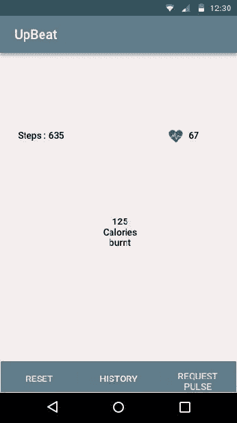
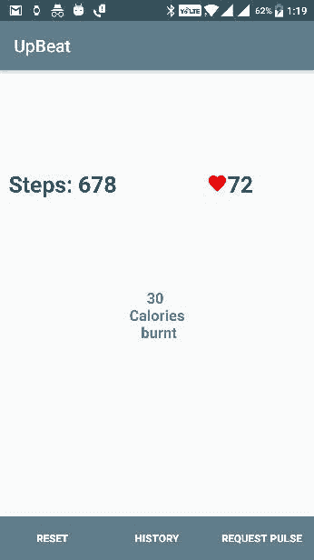

# 测量您的健康状况并同步收集的传感器数据

在前一章中，我们构建了一个 Wear app，提醒我们喝水，并具有通过嵌入式 Wear 传感器检查步数和心率的功能。穿戴和移动应用程序的理念是具有更好的简略性，永远不会错过任何重要的东西，而 Upbeat 项目似乎功能很少，但在用户的手腕和口袋中占有很大的位置。乐观穿戴应用程序的当前功能仅限于显示从传感器接收到的数据。在本章中，我们将通过与穿戴和移动应用的互操作性来增加应用的趣味性。我们将通过`RealmDB`保存所有传输的数据。我们将通过手机向穿戴者发出通知，启动应用程序来检查脉搏率。在穿戴应用程序中，我们会有一个健康提示和食物卡路里卡的列表。

在本章中，我们将探讨以下内容:

*   收集磨损传感器的数据
*   处理接收到的数据，找出卡路里和距离
*   `WearableListenerService`和消息传递应用编程接口
*   从移动应用程序向穿戴应用程序发送数据
*   `RealmDB`整合
*   `WearableRecyclerview`同`CardView`

# 收集磨损传感器的数据

从 Wear 设备收集传感器数据需要一种通信机制，而作为 Google Play 服务一部分的 Wear DataLayer API 在通信过程中起着主要作用。我们将在后面的课程中深入探讨通信过程，但在本章中，我们需要在移动应用程序中接收传感器数据。我们已经创建了这个项目，它已经有了一个移动模块和简单的旧 Hello World 样板代码。一旦我们从 Wear 应用程序中设置了数据发送机制，我们将着手开发移动模块。让我们从磨损模块服务包中的步数传感器开始，进入`WearStepService`课程。我们已经构建了这个服务来发出通知并监听步骤计数器数据。现在借助`GoogleApiClient`和穿戴消息 API，我们需要将数据发送到手机 app。

在`WearStepService`类中，在类的全局范围内实例化`GoogleApiClient`:

```java
GoogleApiClient mGoogleApiClient;

```

在`onStartCommand`中，调用初始化`mGoogleApiClient`的方法:

```java
@Override
public int onStartCommand(Intent intent, int flags, int startId) {
    Log.d(TAG, "onStartCommand");

    getSensorManager();
    getCountSensor();
 getGoogleClient();

    return super.onStartCommand(intent, flags, startId);
}

```

为了初始化`GoogleClient`，我们将使用`GoogleClient`的构建器模式，并且我们需要添加`Wearable.API`。稍后，我们可以使用构建器的`connect()`方法和`build()`方法连接`GoogleClient`:

```java
private void getGoogleClient() {
    if (null != mGoogleApiClient)
        return;

    Log.d(TAG, "getGoogleClient");
    mGoogleApiClient = new GoogleApiClient.Builder(this)
            .addApi(Wearable.API)
            .build();
    mGoogleApiClient.connect();
}

```

在`WearStepService`类中，我们将覆盖属于`IBinder`接口的`onBind`方法。我们可以通过远程服务将其用于客户端交互，如下所示:

```java
@Override
public IBinder onBind(Intent intent) {
    return null;
}

```

我们返回 null，因为在发送数据之后，我们不希望返回任何东西。如果我们想要返回某些信息，那么我们可以如下返回`IBinder`实例:

```java
private final IBinder mBinder = new LocalBinder();

@Override
public IBinder onBind(Intent intent) {
 return mBinder;
}

```

为了能够向移动设备发送数据，我们需要两种数据层应用编程接口机制，即可穿戴节点和消息应用编程接口。我们将使用节点应用编程接口获取连接的节点。使用消息应用编程接口，我们将数据发送到一个特定的路径，在接收端，我们应该监听该路径来获取数据。

在 Node API 中，我们会有`Resultcallback`类，它返回一个`ConnectedNodes`的列表，我们要实现`onResult`方法，它有能力返回连接节点的列表。我们可以将消息发送到所有已连接的节点，或者发送给已连接的节点。我们可以使用节点类的`getDisplayname`获取连接节点的名称，如下所示:

```java
node.getDisplayName();

```

现在，我们将使用节点和消息应用编程接口，并将数据发送到连接的节点:

```java
private void sendData(){

    if (mGoogleApiClient == null)
        return;

    // use the api client to send the heartbeat value to our handheld
    final PendingResult<NodeApi.GetConnectedNodesResult> nodes = 
    Wearable.NodeApi.getConnectedNodes(mGoogleApiClient);
    nodes.setResultCallback(new 
    ResultCallback<NodeApi.GetConnectedNodesResult>() {
        @Override
        public void onResult(NodeApi.GetConnectedNodesResult result) {
            final List<Node> nodes = result.getNodes();
            final String path = "/stepcount";
            String Message = StepsTaken.getSteps()+"";

            for (Node node : nodes) {
                Log.d(TAG, "SEND MESSAGE TO HANDHELD: " + Message);
                node.getDisplayName();
                byte[] data = Message.getBytes(StandardCharsets.UTF_8);
                Wearable.MessageApi.sendMessage(mGoogleApiClient, 
                node.getId(), path, data);
            }
        }
    });
}

```

在前面的方法中，我们将使用`PendingResults`类来检索连接节点的结果。收到连接节点列表后，我们可以使用`wearableMessageApi`类触发消息。不要忘记将数据发送和接收到同一路径。

# 已完成磨损步骤服务类

完整的`WearStepService`类代码如下:

```java
public class WearStepService extends Service implements SensorEventListener {

    public static final String TAG = "WearStepService";
    private static final long THREE_MINUTES = 3 * 60 * 1000;
    private static final String STEP_COUNT_PATH = "/step-count";
    private static final String STEP_COUNT_KEY = "step-count";
    private SensorManager sensorManager;
    private Sensor countSensor;

    GoogleApiClient mGoogleApiClient;

    @Override
    public void onCreate() {
        super.onCreate();
        Log.d(TAG, "onCreate");
        setAlarm();
    }

    @Override
    public int onStartCommand(Intent intent, int flags, int startId) {
        Log.d(TAG, "onStartCommand");

        getSensorManager();
        getCountSensor();
        getGoogleClient();

        return super.onStartCommand(intent, flags, startId);
    }

    @Override
    public IBinder onBind(Intent intent) {
        return null;
    }

    private void getGoogleClient() {
        if (null != mGoogleApiClient)
            return;

        Log.d(TAG, "getGoogleClient");
        mGoogleApiClient = new GoogleApiClient.Builder(this)
                .addApi(Wearable.API)
                .build();
        mGoogleApiClient.connect();
    }

    /**
     * if the countSensor is null, try initializing it, and try               
     registering it with sensorManager
     */
    private void getCountSensor() {
        if (null != countSensor)
            return;

        Log.d(TAG, "getCountSensor");
        countSensor = 
        sensorManager.getDefaultSensor(Sensor.TYPE_STEP_COUNTER);
        registerCountSensor();
    }

    /**
     * if the countSensor exists, then try registering
     */
    private void registerCountSensor() {
        if (countSensor == null)
            return;

        Log.d(TAG, "sensorManager.registerListener");
        sensorManager.registerListener(this, countSensor, 
        SensorManager.SENSOR_DELAY_UI);
    }

    /**
     * if the sensorManager is null, initialize it, and try registering 
     the countSensor
     */
    private void getSensorManager() {
        if (null != sensorManager)
            return;

        Log.d(TAG, "getSensorManager");
        sensorManager = (SensorManager) 
        getSystemService(Context.SENSOR_SERVICE);
        registerCountSensor();
    }

    private void setAlarm() {
        Log.d(TAG, "setAlarm");

        Intent intent = new Intent(this, AlarmNotification.class);
        PendingIntent pendingIntent = 
        PendingIntent.getBroadcast(this.getApplicationContext(), 
        234324243, intent, 0);
        AlarmManager alarmManager = (AlarmManager) 
        getSystemService(ALARM_SERVICE);
        long firstRun = System.currentTimeMillis() + THREE_MINUTES;
        alarmManager.setInexactRepeating(AlarmManager.RTC_WAKEUP, 
        firstRun, THREE_MINUTES, pendingIntent);
    }

    @Override
    public void onSensorChanged(SensorEvent event) {
        if (event.sensor.getType() == Sensor.TYPE_STEP_COUNTER)
            StepsTaken.updateSteps(event.values.length);
        Log.d(TAG, "onSensorChanged: steps count is" + 
        event.values.length);
//        sendToPhone();
        sendData();
        updateNotification();
    }

    private void sendData(){

        if (mGoogleApiClient == null)
            return;

        // use the api client to send the heartbeat value to our 
        handheld
        final PendingResult<NodeApi.GetConnectedNodesResult> nodes = 
        Wearable.NodeApi.getConnectedNodes(mGoogleApiClient);
        nodes.setResultCallback(new 
        ResultCallback<NodeApi.GetConnectedNodesResult>() {
            @Override
            public void onResult(NodeApi.GetConnectedNodesResult 
            result) {
                final List<Node> nodes = result.getNodes();
                final String path = "/stepcount";
                String Message = StepsTaken.getSteps()+"";

                for (Node node : nodes) {
                    Log.d(TAG, "SEND MESSAGE TO HANDHELD: " + Message);
                    node.getDisplayName();
                    byte[] data = 
                    Message.getBytes(StandardCharsets.UTF_8);
                    Wearable.MessageApi.sendMessage(mGoogleApiClient, 
                    node.getId(), path, data);
                }
            }
        });
    }

    private void updateNotification() {
        // Create a notification builder that's compatible with 
        platforms >= version 4
        NotificationCompat.Builder builder =
                new NotificationCompat.Builder
                (getApplicationContext());

        // Set the title, text, and icon
        builder.setContentTitle(getString(R.string.app_name))
                .setSmallIcon(R.drawable.ic_step_icon);

        builder.setContentText("steps: " + StepsTaken.getSteps());

        // Get an instance of the Notification Manager
        NotificationManager notifyManager = (NotificationManager)
                getSystemService(Context.NOTIFICATION_SERVICE);

        // Build the notification and post it
        notifyManager.notify(0, builder.build());
    }

    @Override
    public void onAccuracyChanged(Sensor sensor, int accuracy) {
        // drop these messages
        updateNotification();

    }
}

```

我们成功地向提到的路径发送了一条消息。现在，让我们看看如何从穿戴设备中检索消息。在移动模块内部，创建额外的代码可读性包。我们将命名包模型、服务和实用程序。

是时候用覆盖方法`onMessageReceived`创建一个扩展到`WearableListenerService`的类了。创建一个名为`StepListener`的类，并将其扩展到`WearableListenerService`；代码如下:

```java
public class StepListner extends WearableListenerService {

    private static final String TAG = "StepListner";

    @Override
    public void onMessageReceived(MessageEvent messageEvent) {
        if (messageEvent.getPath().equals("/stepcount")) {
            final String message = new String(messageEvent.getData());
            Log.v(TAG, "Message path received from wear is: " + 
            messageEvent.getPath());
            Log.v(TAG, "Message received on watch is: " + message);

            // Broadcast message to wearable activity for display
            Intent messageIntent = new Intent();
            messageIntent.setAction(Intent.ACTION_SEND);
            messageIntent.putExtra("message", message);
            LocalBroadcastManager.getInstance(this)
            .sendBroadcast(messageIntent);
        }
        else {
            super.onMessageReceived(messageEvent);
        }
    }
}

```

将清单中较早的服务类注册到与数据发送路径相同的路径，下面的代码说明了数据路径中的可穿戴`DATA_CHANGED`和`MESSAGE_RECEIVED`动作:

```java
<service android:name=".services.StepListner">
    <intent-filter>
        <action android:name=
        "com.google.android.gms.wearable.DATA_CHANGED" />
        <action android:name=
        "com.google.android.gms.wearable.MESSAGE_RECEIVED" />

        <data
            android:host="*"
            android:pathPrefix="/stepcount"
            android:scheme="wear" />
    </intent-filter>
</service>

```

`Steplistner`课结束；我们可以使用这个类来进一步处理数据。在`steplistener`类中，我们正在注册`localbroadcast`接收器类，以便在广播接收器的范围内发送接收到的数据。在我们建立用户界面之前，我们将在`MainActivity`接收移动应用程序中的所有数据。编写一个内部类来通读收到的步骤:

```java
public class StepReceiver extends BroadcastReceiver {
        @Override
        public void onReceive(Context context, Intent intent) {
            String message = intent.getStringExtra("message");
            Log.v("steps", "Main activity received message: " + 
            message);

        // Shows the step counts received by the wearlistener //service        
            mSteps.setText("Steps:"+ message);
            int value = Integer.valueOf(message);
      }
    }

```

使用以下代码在`oncreate`方法中注册该类:

```java
// Register the local broadcast receiver
IntentFilter StepFilter = new IntentFilter(Intent.ACTION_SEND);
StepReceiver StepReceiver = new StepReceiver();
LocalBroadcastManager.getInstance(this).registerReceiver(StepReceiver, StepFilter);

```

我们正在成功收集步进计数器数据。让我们做同样的过程来收集脉率。我们将保持步数计数，稍后，我们将有一个实时的心跳速率流通过连接的节点传输。

# 切换回磨损模块

将项目范围切换到磨损模块，选择`HeartRateFragment`实例化一个`GoogleClient`对象:

```java
private GoogleApiClient mGoogleApiClient;

```

在`oncreate`方法中初始化`GoogleClient`实例如下:

```java
mGoogleApiClient = new GoogleApiClient.Builder(getActivity()).
addApi(Wearable.API).
build();

mGoogleApiClient.connect();

```

编写一个方法，将脉冲速率计数发送到连接的节点，就像我们前面对步进计数器所做的那样:

```java
private void sendMessageToHandheld(final String message) {

    if (mGoogleApiClient == null)
        return;

    // use the api client to send the heartbeat value to our handheld
    final PendingResult<NodeApi.GetConnectedNodesResult> nodes = 
    Wearable.NodeApi.getConnectedNodes(mGoogleApiClient);
    nodes.setResultCallback(new 
    ResultCallback<NodeApi.GetConnectedNodesResult>() {
        @Override
        public void onResult(NodeApi.GetConnectedNodesResult result) {
            final List<Node> nodes = result.getNodes();
            final String path = "/heartRate";

            for (Node node : nodes) {
                Log.d(TAG, "SEND MESSAGE TO HANDHELD: " + message);

                byte[] data = message.getBytes(StandardCharsets.UTF_8);
                Wearable.MessageApi.sendMessage(mGoogleApiClient, 
                node.getId(), path, data);
            }
        }
    });
}

```

使用从传感器事件触发器接收到的 BPM 计数调用`onSensorchanged`回调中的方法:

```java
sendMessageToHandheld(currentValue.toString());

```

切换到移动项目范围。我们还需要一节`WearableListenerService`课来讨论心率数据:

```java
public class HeartListener extends WearableListenerService {

    @Override
    public void onMessageReceived(MessageEvent messageEvent) {

    }

}

```

在`onMessageReceived`回调中注册一个`localbroadcast`事件来接收活动中的数据。完整的侦听器类代码如下:

```java
public class HeartListener extends WearableListenerService {

    @Override
    public void onMessageReceived(MessageEvent messageEvent) {
        if (messageEvent.getPath().equals("/heartRate")) {
            final String message = new String(messageEvent.getData());
            Log.v("pactchat", "Message path received on watch is: " + 
            messageEvent.getPath());
            Log.v("packtchat", "Message received on watch is: " + 
            message);

            // Broadcast message to wearable activity for display
            Intent messageIntent = new Intent();
            messageIntent.setAction(Intent.ACTION_SEND);
            messageIntent.putExtra("heart", message);
            LocalBroadcastManager.getInstance(this)
            .sendBroadcast(messageIntent);
        }
        else {
            super.onMessageReceived(messageEvent);
        }
    }
}

```

在清单中注册`service`类，如下所示:

```java
<service android:name=".services.HeartListener">
    <intent-filter>
        <action android:name=
        "com.google.android.gms.wearable.DATA_CHANGED" />
        <action android:name=
        "com.google.android.gms.wearable.MESSAGE_RECEIVED" />

        <data
            android:host="*"
            android:pathPrefix="/heartRate"
            android:scheme="wear" />
    </intent-filter>
</service>

```

在`MainActivity`中，我们将编写另一个广播接收器。姑且称之为`HeartRateReceiver`:

```java
 public class HeartRateReciver extends BroadcastReceiver {
        @Override
        public void onReceive(Context context, Intent intent) {
            String data = intent.getStringExtra("heart");
            Log.v("heart", "Main activity received message: " + 
            message);

            mHeart.setText(message);

        }
    }

```

在`oncreate`方法中注册`BroadcastReceiver`如下:

```java
// Register the local broadcast receiver
IntentFilter DataFilter = new IntentFilter(Intent.ACTION_SEND);
HeartRateReciver DataReceiver = new HeartRateReciver();
LocalBroadcastManager.getInstance(this).registerReceiver(DataReceiver, DataFilter);

```

我们成功地从`HeartListener`直接接收心率数据到`broadcastreceiver`。现在，让我们来研究一下移动项目的用户界面。我们需要保持 UI 的全面简洁和强大；下面的设计讨论了与 Wear 应用程序的互操作性以及距离和卡路里燃烧预测。

# 将应用概念化

乐观的移动应用程序应该显示步数和脉率。Upbeat 需要向 Wear 应用程序发送脉率请求。历史记录显示了数据库中的距离和消耗的卡路里。重置将清除数据库。

登录屏幕:当用户打开应用程序时，他或她会看到类似于以下设计的内容:



在我们开始设计之前，我们需要确定一些事情，比如颜色、背景等等。在`res/values`目录内，打开`colors.xml`文件，添加以下颜色值:

```java
<?xml version="1.0" encoding="utf-8"?>
<resources>
    <color name="colorPrimary">#607d8b</color>
    <color name="colorPrimaryDark">#34515e</color>
    <color name="colorAccent">#FFF</color>
    <color name="grey">#afaeae</color>
    <color name="white">#fff</color>
</resources>

```

创建一个`drawable`资源文件，称之为`button_bg.xml`，为后台选择添加如下选择器代码:

```java
<?xml version="1.0" encoding="utf-8"?>
<selector xmlns:android="http://schemas.android.com/apk/res/android">
    <item android:drawable="@color/colorPrimaryDark" 
    android:state_pressed="true"/>
    <item android:drawable="@color/grey" android:state_focused="true"/>
    <item android:drawable="@color/colorPrimary"/>
</selector>

```

在`activity_main.xml`中，根据设计，我们需要三个按钮用于计划的功能和三个文本视图。我们将使用相对布局作为根容器，下面的代码解释了如何做到这一点:

```java
<?xml version="1.0" encoding="utf-8"?>
<RelativeLayout xmlns:android="http://schemas.android.com/apk/res/android"
    xmlns:app="http://schemas.android.com/apk/res-auto"
    xmlns:tools="http://schemas.android.com/tools"
    android:layout_width="match_parent"
    android:layout_height="match_parent"
    tools:context="com.packt.upbeat.MainActivity">

    <LinearLayout
        android:orientation="horizontal"
        android:layout_width="match_parent"
        android:layout_height="wrap_content"
        android:layout_marginLeft="10dp"
        android:layout_marginRight="10dp"
        android:layout_marginBottom="102dp"
        android:layout_above="@+id/calory"
        android:layout_centerHorizontal="true">

        <TextView
            android:id="@+id/steps"
            android:layout_width="wrap_content"
            android:layout_height="wrap_content"
            android:layout_alignBottom="@+id/linearLayout"
            android:layout_toStartOf="@+id/calory"
            android:layout_weight="1"
            android:text="Steps!"
            android:textColor="@color/colorPrimaryDark"
            android:textSize="30sp"
            android:textStyle="bold"
            app:layout_constraintBottom_toBottomOf="parent"
            app:layout_constraintLeft_toLeftOf="parent"
            app:layout_constraintRight_toRightOf="parent"
            app:layout_constraintTop_toTopOf="parent" />

        <LinearLayout
            android:layout_weight="1"
            android:id="@+id/linearLayout"
            android:layout_width="wrap_content"
            android:layout_height="wrap_content"
            android:gravity="center">

            <ImageView
                android:id="@+id/heartbeat"
                android:layout_width="wrap_content"
                android:layout_height="wrap_content"
                android:layout_alignStart="@+id/heart"
                android:layout_below="@+id/heart"/>

            <TextView
                android:id="@+id/heart"
                android:layout_width="wrap_content"
                android:layout_height="wrap_content"
                android:layout_alignBaseline="@+id/steps"
                android:layout_alignBottom="@+id/steps"
                android:layout_alignParentEnd="true"
                android:layout_marginEnd="25dp"
                android:text="Heart!"
                android:textColor="@color/colorPrimaryDark"
                android:textSize="30sp"
                android:textStyle="bold" />
        </LinearLayout>

    </LinearLayout>

    <TextView
        android:id="@+id/calory"
        android:layout_width="wrap_content"
        android:layout_height="wrap_content"
        android:gravity="center"
        android:text="Calories!"
        android:textColor="@color/colorPrimary"
        android:textSize="20sp"
        android:textStyle="bold"
        android:layout_centerVertical="true"
        android:layout_centerHorizontal="true" />

    <LinearLayout
        android:layout_width="match_parent"
        android:layout_height="wrap_content"
        android:layout_alignParentBottom="true"
        android:layout_alignParentStart="true"
        android:orientation="horizontal">

        <android.support.v7.widget.AppCompatButton
            android:id="@+id/reset"
            android:layout_width="match_parent"
            android:layout_height="50dp"
            android:layout_weight="1"
            android:background="@drawable/button_background"
            android:elevation="5dp"
            android:gravity="center"
            android:text="Reset"
            android:textAllCaps="true"
            android:textColor="@color/white"
            android:textStyle="bold" />

        <android.support.v7.widget.AppCompatButton
            android:id="@+id/history"
            android:layout_width="match_parent"
            android:layout_height="50dp"
            android:layout_weight="1"
            android:background="@drawable/button_background"
            android:elevation="5dp"
            android:gravity="center"
            android:text="History"
            android:textAllCaps="true"
            android:textColor="@color/white"
            android:textStyle="bold" />

        <android.support.v7.widget.AppCompatButton
            android:id="@+id/pulseRequest"
            android:layout_width="match_parent"
            android:layout_height="50dp"
            android:layout_weight="1"
            android:background="@drawable/button_background"
            android:elevation="5dp"
            android:gravity="center"
            android:text="Request pulse"
            android:textAllCaps="true"
            android:textColor="@color/white"
            android:textStyle="bold" />
    </LinearLayout>
</RelativeLayout>

```

要显示心率，我们有带`Imageview`和`Textview`的`LinearLayour`，其中`imageview`将是静态的。取而代之的是将`imageview`替换为我们在穿戴模块中为心脏定制动画创建的`HeartBeatView`。让我们最后一次创建它。

在`res/values`文件夹中，添加`heartbeatview_attrs.xml`文件，并添加以下代码:

```java
<?xml version="1.0" encoding="utf-8"?>
<resources>

    <declare-styleable name="HeartBeatView">
        <attr name="scaleFactor" format="float" />
        <attr name="duration" format="integer" />
    </declare-styleable>

</resources>

```

在 drawables 中，创建一个矢量图形 XML 文件，并在其中添加以下代码来实现心形:

```java
<vector xmlns:android="http://schemas.android.com/apk/res/android"
    android:width="24dp"
    android:height="24dp"
    android:viewportHeight="24.0"
    android:viewportWidth="24.0">
    <path
        android:fillColor="#FFFF0000"
        android:pathData="M12,21.35l-1.45,-1.32C5.4,15.36 2,12.28 2,8.5 
        2,5.42 4.42,3 7.5,3c1.74,0 3.41,0.81 4.5,2.09C13.09,3.81 
        14.76,3 16.5,3 19.58,3 22,5.42 22,8.5c0,3.78 -3.4,6.86 
       -8.55,11.54L12,21.35z"/>
</vector>

```

我们可以在 utils 包中创建一个名为`HeartBearView`的类，并为所有动画和自定义视图逻辑添加以下代码。有关实现的更多详细信息，您可以参考上一章中的磨损模块`HeartBeatView`课程:

```java
public class HeartBeatView extends AppCompatImageView {

    private static final String TAG = "HeartBeatView";

    private static final float DEFAULT_SCALE_FACTOR = 0.2f;
    private static final int DEFAULT_DURATION = 50;
    private Drawable heartDrawable;

    private boolean heartBeating = false;

    float scaleFactor = DEFAULT_SCALE_FACTOR;
    float reductionScaleFactor = -scaleFactor;
    int duration = DEFAULT_DURATION;

    public HeartBeatView(Context context) {
        super(context);
        init();
    }

    public HeartBeatView(Context context, AttributeSet attrs) {
        super(context, attrs);
        populateFromAttributes(context, attrs);
        init();
    }

    public HeartBeatView(Context context, AttributeSet attrs, int 
    defStyleAttr) {
        super(context, attrs, defStyleAttr);
        populateFromAttributes(context, attrs);
        init();
    }

    private void init() {
        //make this not mandatory
        heartDrawable = ContextCompat.getDrawable(getContext(), 
        R.drawable.ic_heart_red_24dp);
        setImageDrawable(heartDrawable);

    }

    private void populateFromAttributes(Context context, AttributeSet 
    attrs) {
        TypedArray a = context.getTheme().obtainStyledAttributes(
                attrs,
                R.styleable.HeartBeatView,
                0, 0
        );
        try {
            scaleFactor = a.getFloat(R.styleable
            .HeartBeatView_scaleFactor, DEFAULT_SCALE_FACTOR);
            reductionScaleFactor = -scaleFactor;
            duration = a.getInteger(R.styleable.HeartBeatView_duration, 
            DEFAULT_DURATION);

        } finally {
            a.recycle();
        }

    }

    /**
     * toggles current heat beat state
     */
    public void toggle() {
        if (heartBeating) {
            stop();
        } else {
            start();
        }
    }

    /**
     * Starts the heat beat/pump animation
     */
    public void start() {
        heartBeating = true;
        animate().scaleXBy(scaleFactor)
        .scaleYBy(scaleFactor).setDuration(duration)
        .setListener(scaleUpListener);
    }

    /**
     * Stops the heat beat/pump animation
     */
    public void stop() {
        heartBeating = false;
        clearAnimation();
    }

    /**
     * is the heart currently beating
     *
     * @return
     */
    public boolean isHeartBeating() {
        return heartBeating;
    }

    public int getDuration() {
        return duration;
    }

    private static final int milliInMinute = 60000;

    /**
     * set the duration of the beat based on the beats per minute
     *
     * @param bpm (positive int above 0)
     */
    public void setDurationBasedOnBPM(int bpm) {
        if (bpm > 0) {
            duration = Math.round((milliInMinute / bpm) / 3f);
        }
    }

    public void setDuration(int duration) {
        this.duration = duration;
    }

    public float getScaleFactor() {
        return scaleFactor;
    }

    public void setScaleFactor(float scaleFactor) {
        this.scaleFactor = scaleFactor;
        reductionScaleFactor = -scaleFactor;
    }

    private final Animator.AnimatorListener scaleUpListener = new 
    Animator.AnimatorListener() {

        @Override
        public void onAnimationStart(Animator animation) {
        }

        @Override
        public void onAnimationRepeat(Animator animation) {

        }

        @Override
        public void onAnimationEnd(Animator animation) {
            //we ignore heartBeating as we want to ensure the heart is 
            reduced back to original size
            animate().scaleXBy(reductionScaleFactor)
            .scaleYBy(reductionScaleFactor).setDuration(duration)
            .setListener(scaleDownListener);
        }

        @Override
        public void onAnimationCancel(Animator animation) {

        }
    };

    private final Animator.AnimatorListener scaleDownListener = new 
    Animator.AnimatorListener() {

        @Override
        public void onAnimationStart(Animator animation) {
        }

        @Override
        public void onAnimationRepeat(Animator animation) {
        }

        @Override
        public void onAnimationEnd(Animator animation) {
            if (heartBeating) {
                //duration twice as long for the upscale
                animate().scaleXBy(scaleFactor).scaleYBy(scaleFactor)
                .setDuration
                (duration * 2).setListener(scaleUpListener);
            }
        }

        @Override
        public void onAnimationCancel(Animator animation) {
        }
    };
}

```

在`activity_main.xml`文件中，用在移动项目范围内创建的自定义视图替换代码，而不是`ImageView`:

```java
<com.packt.upbeat.utils.HeartBeatView
    android:id="@+id/heartbeat"
    android:layout_width="wrap_content"
    android:layout_height="wrap_content"
    android:layout_alignStart="@+id/heart"
    android:layout_below="@+id/heart"/>

```

现在我们的登陆页面用户界面已经准备好了，我们可以从`MainActivity`开始工作了。

在`MainActivity`中，让我们实例化布局中使用的所有 UI 组件:

```java
private AppCompatButton mReset, mHistory, mHeartPulse;
private TextView mSteps, mHeart, mCalory;
private HeartBeatView heartbeat;

```

使用`oncreate`方法中的`findviewbyid`方法映射组件及其标识:

```java
heartbeat = (HeartBeatView)findViewById(R.id.heartbeat);
mSteps = (TextView) findViewById(R.id.steps);
mHeart = (TextView) findViewById(R.id.heart);
mCalory = (TextView) findViewById(R.id.calory);
mReset = (AppCompatButton) findViewById(R.id.reset);
mHistory = (AppCompatButton) findViewById(R.id.history);
mHeartPulse = (AppCompatButton) findViewById(R.id.pulseRequest);

```

在`HeartRateReceiver`类内部，获取数据，将数据转换为整数，并在 UI 中显示。以下代码说明了使用从穿戴应用程序接收的数据激活`HeartBeatAnimation`:

```java
 @Override
        public void onReceive(Context context, Intent intent) {
            String data = intent.getStringExtra("heart");
            Log.v("heart", "Main activity received message: " + data);

            mHeart.setText(data);
            heartbeat.setDurationBasedOnBPM(Integer.valueOf(data));
            heartbeat.toggle();
        }

```

在`StepReceiver`中，我们将数据设置为标记为`mSteps`的步数`textview`:

```java
mSteps.setText("Steps:"+ message);

```

我们已经完成了接收脉冲计数和步数，并显示在手机的用户界面。现在，我们需要显示这些步骤消耗的卡路里。

根据你的体重指数等，可以通过多种不同的方法来计算燃烧的卡路里。对这种计步器的热量步数的研究引入了一个转换因子，如下所示:

*换算系数=每英里 99.75 卡路里/每英里 2200 步=每步 0.045 卡路里*

因此，使用这个值，我们可以通过简单地将这个值乘以步数来确定卡路里。

*消耗的卡路里= 7000 步×每步 0.045 卡路里= 318 卡路里*

在`StepReceiver`类中，在`onReceive`方法中，添加以下代码:

```java
int value = Integer.valueOf(message);
mCalory.setText(String.valueOf((int)(value * 0.045)) + "/ncalories" + "/nburnt");

```

手机的卡路里燃烧和脉搏率检查完成。我们在`MainActivity`还有更多的工作。我们需要保存步数计数器的数据来显示卡路里和距离的历史。我们用第一章试过的`RealmDB`。

将以下类路径添加到项目级渐变文件中:

```java
classpath "io.realm:realm-gradle-plugin:2.2.1"

```

在 gradle 移动模块中应用之前的插件:

```java
apply plugin: 'realm-android'

```

项目中已准备好领域。现在，我们需要步长数据的设置器和获取器。将以下类添加到模型包中:

```java
public class StepCounts extends RealmObject {

    private String ReceivedDateTime;
    private String Data;

    public String getReceivedDateTime() {
        return ReceivedDateTime;
    }

    public void setReceivedDateTime(String receivedDateTime) {
        ReceivedDateTime = receivedDateTime;
    }

    public String getData() {
        return Data;
    }

    public void setData(String data) {
        Data = data;
    }
}

```

在`MainActivity`中，实例化领域并在`onCreate`方法中初始化它，如下所示:

```java
private Realm realm;

@Override
protected void onCreate(Bundle savedInstanceState) {
...
Realm.init(this);
realm = Realm.getDefaultInstance();

}

```

当接收到步数时，将数据加入`RealmDB`。在`StepReciever`内部类的`onRecieve`方法中添加以下代码:

```java
realm.beginTransaction();
StepCounts Steps = realm.createObject(StepCounts.class);
Steps.setData(message);
String TimeStamp =  DateFormat.getDateTimeInstance().format(System.currentTimeMillis());
Steps.setReceivedDateTime(TimeStamp);
realm.commitTransaction();

```

要在用户界面中显示最后一个值，请在`onCreate`方法中添加以下代码:

```java
RealmResults<StepCounts> results = realm.where(StepCounts.class).findAll();

if(results.size() == 0){
    mSteps.setText("Steps: ");
}else{
    mSteps.setText("Steps: "+results.get(results.size()-1).getData());
    int value = Integer.valueOf(results
    .get(results.size()-1).getData());
    mCalory.setText(String.valueOf((int)(value * 0.045)) 
    + "/ncalories" + "/nburnt");
}

```

对于按钮，现在将点击监听器附加到`oncreate`方法:

```java
mHistory.setOnClickListener(new View.OnClickListener() {
    @Override
    public void onClick(View v) {

    }
});

mHeartPulse.setOnClickListener(new View.OnClickListener() {
    @Override
    public void onClick(View v) {

    }
});

mReset.setOnClickListener(new View.OnClickListener() {
    @Override
    public void onClick(View v) {

    }
});

```

让我们创建另一个活动并将其称为`HistoryActivity`，它将显示收到的数据列表。在`activity_history.xml`文件中，添加以下代码:

```java
<?xml version="1.0" encoding="utf-8"?>
<LinearLayout xmlns:android="http://schemas.android.com/apk/res/android"
    xmlns:app="http://schemas.android.com/apk/res-auto"
    xmlns:tools="http://schemas.android.com/tools"
    android:layout_width="match_parent"
    android:layout_height="match_parent"
    tools:context="com.packt.upbeat.HistoryActivity">

    <android.support.v7.widget.RecyclerView
        android:id="@+id/recycler_view"
        android:layout_width="match_parent"
        android:layout_height="match_parent"
        android:layout_margin="5dp" />

</LinearLayout>

```

现在`recyclerview`中的每一项都需要`row_layout`，布局如下:

```java
<?xml version="1.0" encoding="utf-8"?>
<LinearLayout xmlns:android="http://schemas.android.com/apk/res/android"
    xmlns:card_view="http://schemas.android.com/apk/res-auto"
    android:layout_width="match_parent"
    android:layout_height="wrap_content"
    android:orientation="vertical">

    <android.support.v7.widget.CardView
        android:layout_width="match_parent"
        android:layout_height="wrap_content"
        android:layout_marginBottom="0dp"
        android:layout_marginLeft="5dp"
        android:layout_marginRight="5dp"
        android:layout_marginTop="9dp"
        card_view:cardCornerRadius="3dp"
        card_view:cardElevation="0.01dp">

        <LinearLayout
            android:layout_margin="10dp"
            android:orientation="vertical"
            android:id="@+id/top_layout"
            android:layout_width="match_parent"
            android:layout_height="wrap_content">

            <TextView
                android:layout_margin="10dp"
                android:id="@+id/steps"
                android:text="Steps"
                android:layout_width="match_parent"
                android:layout_height="wrap_content" />
            <TextView
                android:layout_margin="10dp"
                android:id="@+id/calories"
                android:text="calory"
                android:layout_width="match_parent"
                android:layout_height="wrap_content" />
            <TextView
                android:layout_margin="10dp"
                android:id="@+id/distance"
                android:text="distance"
                android:layout_width="match_parent"
                android:layout_height="wrap_content" />

            <TextView
                android:layout_margin="10dp"
                android:id="@+id/date"
                android:layout_width="match_parent"
                android:layout_height="40dp"
                android:layout_gravity="bottom"
                android:background="#ff444444"
                android:gravity="center"
                android:text="Timestamp"
                android:textColor="#fff"
                android:textSize="20dp" />

        </LinearLayout>
    </android.support.v7.widget.CardView>
</LinearLayout>

```

Remember, before using `cardview` and `recyclerview`, we need to add the support dependencies to our gradle module:

`compile 'com.android.support:cardview-v7:25.1.1'`
`compile 'com.android.support:recyclerview-v7:25.1.1'`

# 回收器视图适配器

我们必须创建一个`adapter`类，从领域中获取数据，并适应所创建的`row_layout`:

```java
public class HistoryAdapter extends RecyclerView.Adapter<HistoryAdapter.ViewHolder> {

    public List<StepCounts> steps;
    public Context mContext;

    public HistoryAdapter(List<StepCounts> steps, Context mContext) {
        this.steps = steps;
        this.mContext = mContext;
    }

    @Override
    public ViewHolder onCreateViewHolder(ViewGroup viewGroup, int i) {
        View v = LayoutInflater.from(viewGroup.getContext())
                .inflate(R.layout.row_item, viewGroup, false);
        ViewHolder viewHolder = new ViewHolder(v);
        return viewHolder;
    }

    @Override
    public void onBindViewHolder(ViewHolder viewHolder, int i) {
        viewHolder.steps.setText(steps.get(i).getData()+" Steps");
        viewHolder.date.setText(steps.get(i).getReceivedDateTime());

        int value = Integer.valueOf(steps.get(i).getData());
        DecimalFormat df = new DecimalFormat("#.00") ;
        String kms = String.valueOf(df.format(value * 0.000762)) + " 
        kms" ;
        viewHolder.calory.setText(String.valueOf((int)(value * 0.045)) 
        + " calories " + "burnt");
        viewHolder.distance.setText("Distance: "+kms);

    }

    @Override
    public int getItemCount() {
        return steps.size();
    }

    public static class ViewHolder extends RecyclerView.ViewHolder  {

        public TextView steps,calory,distance,date;

        public ViewHolder(View itemView) {
            super(itemView);
            steps = (TextView) itemView.findViewById(R.id.steps);
            calory = (TextView) itemView.findViewById(R.id.calories);
            distance = (TextView) itemView.findViewById(R.id.distance);
            date = (TextView) itemView.findViewById(R.id.date);
        }
    }

}

```

在适配器中，我们用转换因子值显示燃烧的卡路里。为了找到一个通用距离，我们有另一个值，我们需要乘以它的步长，如适配器所示。

在`HistoryActivity`中，在类全局范围内，声明以下实例:

```java
Realm realm;
RecyclerView mRecyclerView;
RecyclerView.LayoutManager mLayoutManager;
RecyclerView.Adapter mAdapter;

```

现在，在`HistoryActivity`类的`oncreate`方法中，添加以下代码:

```java
mRecyclerView = (RecyclerView) findViewById(R.id.recycler_view);
mRecyclerView.setHasFixedSize(true);

Realm.init(this);
realm = Realm.getDefaultInstance();
RealmResults<StepCounts> results = realm.where(StepCounts.class).findAll();
// The number of Columns
mLayoutManager = new GridLayoutManager(this, 1);
mRecyclerView.setLayoutManager(mLayoutManager);

mAdapter = new HistoryAdapter(results,HistoryActivity.this);
mRecyclerView.setAdapter(mAdapter);

```

# 已完成的历史活动类

完整的类如下所示:

```java
public class HistoryActivity extends AppCompatActivity {

    Realm realm;
    RecyclerView mRecyclerView;
    RecyclerView.LayoutManager mLayoutManager;
    RecyclerView.Adapter mAdapter;

    @Override
    protected void onCreate(Bundle savedInstanceState) {
        super.onCreate(savedInstanceState);
        setContentView(R.layout.activity_history);
        // Calling the RecyclerView
        mRecyclerView = (RecyclerView) 
        findViewById(R.id.recycler_view);
        mRecyclerView.setHasFixedSize(true);

        Realm.init(this);
        realm = Realm.getDefaultInstance();
        RealmResults<StepCounts> results = 
        realm.where(StepCounts.class).findAll();
        // The number of Columns
        mLayoutManager = new GridLayoutManager(this, 1);
        mRecyclerView.setLayoutManager(mLayoutManager);

        mAdapter = new HistoryAdapter(results,HistoryActivity.this);
        mRecyclerView.setAdapter(mAdapter);
    }
}

```

在`MainActivity`中，点击`mHistory`按钮，启动`historyActivity`:

```java
mHistory.setOnClickListener(new View.OnClickListener() {
    @Override
    public void onClick(View v) {
        startActivity(new Intent(MainActivity.this, 
        HistoryActivity.class));
    }
});

```

现在，是时候使用我们在 wear 中使用的相同方法将数据从手机发送到 Wear 了。

我们将创建一个扩展`Thread`的类，并且使用节点和消息应用编程接口，我们将发送如下数据:

```java
class SendToDataLayerThread extends Thread {
    String path;
    String message;

    // Constructor to send a message to the data layer
    SendToDataLayerThread(String p, String msg) {
        path = p;
        message = msg;
    }

    public void run() {
        NodeApi.GetConnectedNodesResult nodes = 
        Wearable.NodeApi.getConnectedNodes(googleClient).await();
        for (Node node : nodes.getNodes()) {
            MessageApi.SendMessageResult result =  
            Wearable.MessageApi.sendMessage(googleClient, 
            node.getId(), path, message.getBytes()).await();
            if (result.getStatus().isSuccess()) {
                Log.v("myTag", "Message: {" + message + "} sent to: " + 
                node.getDisplayName());
            } else {
                // Log an error
                Log.v("myTag", "ERROR: failed to send Message");
            }
        }
    }
}

```

在`mHeartPulse`按钮内点击监听器，如下启动`SendToDataLayerThread`类:

```java
mHeartPulse.setOnClickListener(new View.OnClickListener() {
    @Override
    public void onClick(View v) {
        new SendToDataLayerThread("/heart", "Start upbeat for heart 
        rate").start();
    }
});

```

现在，切换回 Wear 项目范围，添加一个扩展到`WearableListenerService`的新类。当它收到来自移动应用程序的消息时，会触发通知来启动应用程序。完整的类代码如下:

```java
public class MobileListener extends WearableListenerService {

    @Override
    public void onMessageReceived(MessageEvent messageEvent) {

        if (messageEvent.getPath().equals("/heart")) {
            final String message = new String(messageEvent.getData());
            Log.v("myTag", "Message path received on watch is: " + 
            messageEvent.getPath());
            Log.v("myTag", "Message received on watch is: " + message);

            // Broadcast message to wearable activity for display
            Intent messageIntent = new Intent();
            messageIntent.setAction(Intent.ACTION_SEND);
            messageIntent.putExtra("message", message);
            LocalBroadcastManager.getInstance(this)
            .sendBroadcast(messageIntent);

            Intent intent2 = new Intent
            (getApplicationContext(), MainActivity.class);

            PendingIntent pendingIntent = PendingIntent.getActivity
            (getApplicationContext(), 0, intent2,
                    PendingIntent.FLAG_ONE_SHOT);

            Uri defaultSoundUri = RingtoneManager.getDefaultUri
            (RingtoneManager.TYPE_ALARM);

            NotificationCompat.Builder notificationBuilder = 
            (NotificationCompat.Builder) new 
            NotificationCompat.Builder(getApplicationContext())
                    .setAutoCancel(true)   //Automatically delete the 
                    notification
                    .setSmallIcon(R.drawable.ic_heart_icon) 
                    //Notification icon
                    .setContentIntent(pendingIntent)
                    .setContentTitle("Open upbeat")
                    .setContentText("UpBeat to check the pulse")
                    .setCategory(Notification.CATEGORY_REMINDER)
                    .setPriority(Notification.PRIORITY_HIGH)
                    .setSound(defaultSoundUri);

            NotificationManagerCompat notificationManager =    
            NotificationManagerCompat.from
            (getApplicationContext());
            notificationManager.notify(0, notificationBuilder.build());

        }
        else {
            super.onMessageReceived(messageEvent);
        }
    }
}

```

现在，使用以下命令，使用正确的路径移动应用程序在清单中注册前面提到的服务:

```java
<service android:name=".services.MobileListener">
    <intent-filter>
        <action android:name=
        "com.google.android.gms.wearable.DATA_CHANGED" />
        <action android:name=
        "com.google.android.gms.wearable.MESSAGE_RECEIVED" />

        <data
            android:host="*"
            android:pathPrefix="/heart"
            android:scheme="wear" />
    </intent-filter>
</service>

```

让我们切换回移动项目范围，并完成重置按钮点击事件。我们将编写一个刷新`RealmDB`数据并重新创建活动的方法:

```java
public void Reset(){
    RealmResults<StepCounts> results = 
    realm.where(StepCounts.class).findAll();

    realm.beginTransaction();

    results.deleteAllFromRealm();

    realm.commitTransaction();
}

```

在 click 侦听器中，添加如下方法:

```java
mReset.setOnClickListener(new View.OnClickListener() {
    @Override
    public void onClick(View v) {
        Reset();
        recreate();
    }
});

```

切换到穿戴项目范围，为健康提示创建一个新的活动，我们将该活动称为`HealthTipsActivity`。在这里，在这个屏幕上，我们将列出一些良好的健康提示和建议。

在`activity_health_tips.xml`中，添加以下代码:

```java
<?xml version="1.0" encoding="utf-8"?>
<android.support.wearable.view.BoxInsetLayout xmlns:android="http://schemas.android.com/apk/res/android"
    xmlns:app="http://schemas.android.com/apk/res-auto"
    xmlns:tools="http://schemas.android.com/tools"
    android:id="@+id/container"
    android:layout_width="match_parent"
    android:layout_height="match_parent"
    android:padding="5dp"
    app:layout_box="all"
    tools:deviceIds="wear">

    <android.support.wearable.view.WearableRecyclerView
        android:id="@+id/wearable_recycler_view"
        android:layout_width="match_parent"
        android:layout_height="match_parent" />

</android.support.wearable.view.BoxInsetLayout>

```

我们需要为 tips 活动的行项目再添加一个布局。我们将这种布局称为`health_tips_row.xml`:

```java
<?xml version="1.0" encoding="utf-8"?>
<LinearLayout xmlns:android="http://schemas.android.com/apk/res/android"
    android:layout_width="match_parent"
    android:layout_height="match_parent"
    android:orientation="vertical"
    android:tag="cards main container">

    <android.support.v7.widget.CardView 
    xmlns:card_view="http://schemas.android.com/apk/res-auto"
        android:id="@+id/card_view"
        android:layout_width="match_parent"
        android:layout_height="wrap_content"
        card_view:cardBackgroundColor="@color/colorPrimary"
        card_view:cardCornerRadius="10dp"
        card_view:cardElevation="5dp"
        card_view:cardUseCompatPadding="true">

            <LinearLayout
                android:layout_width="match_parent"
                android:layout_height="wrap_content"
                android:layout_marginTop="12dp"
                android:layout_weight="2"
                android:orientation="vertical">

                <TextView
                    android:id="@+id/health_tip"
                    android:layout_width="wrap_content"
                    android:layout_height="wrap_content"
                    android:layout_gravity="center_horizontal"
                    android:layout_marginTop="10dp"
                    android:text="HealthTip"
                    android:textColor="@color/white"
                    android:textAppearance="?
                    android:attr/textAppearanceLarge" />

                <TextView
                    android:id="@+id/tip_details"
                    android:layout_width="wrap_content"
                    android:layout_height="wrap_content"
                    android:layout_gravity="center_horizontal"
                    android:layout_marginTop="10dp"
                    android:text="Details"
                    android:textColor="@color/white"
                    android:textAppearance="?
                    android:attr/textAppearanceMedium" />

        </LinearLayout>

    </android.support.v7.widget.CardView>

</LinearLayout>

```

创建包含必需字段的模型。我们将为所有字段创建带有完全参数化构造函数的 setters 和 getters:

```java
public class HealthTipsItem {

    public String Title;
    public String MoreInfo;

    public HealthTipsItem(String title, String moreInfo) {
        Title = title;
        MoreInfo = moreInfo;
    }

    public String getTitle() {
        return Title;
    }

    public void setTitle(String title) {
        Title = title;
    }

    public String getMoreInfo() {
        return MoreInfo;
    }

    public void setMoreInfo(String moreInfo) {
        MoreInfo = moreInfo;
    }
}

```

我们将有另一个数据类来保存所有的健康提示:

```java
public class HealthTips {

   public static String[] nameArray =
           {"Food style",
                   "Food style",
                   "Food style",
                   "Drinking water",
                   "Unhealthy drinks",
                   "Alcohol and drugs",
                   "Body Mass index",
                   "Physical excercise",
                   "Physical activities",
                   "Meditation",
                   "Healthy signs"};

    public static String[] versionArray = {
            "Along with fresh vegetables and fruits, eat lean meats (if 
            you're not vegetarian), nuts, and seeds.",
            "Opt for seasonal and local products instead of those 
            exotic imported foodstuff",
            "Make sure you get a proper balanced diet, as often as 
            possible",
            "Drink water - you need to stay hydrated. It is great for 
            your internal organs, and it also keeps your skin healthy 
            and diminishes acne",
            "Stop drinking too much caffeine and caffeinated 
            beverages",
            "Limit alcohol intake. Tobacco and drugs should be a firm 
            No",
            "Maintain a healthy weight.",
            "Exercise at least four days a week for 20 to 30 minutes 
            each day. Another option is to break your workouts into 
            several sessions",
            "Try to have as much physical activity as you can. Take the 
             stairs instead of elevator; walk to the market instead of 
             taking your car etc",
            "Practice simple meditation. It balances your body, mind, 
            and soul",
            "When speaking about health tips, skin, teeth, hair, and 
            nails are all health signs. Loss of hair or fragile nails 
            might mean poor nutrition"};

}

```

现在，我们将创建一个适配器来处理健康建议列表。以下代码获取数据并加载到`wearablerecyclerview`中:

```java
public class RecyclerViewAdapter
        extends WearableRecyclerView.Adapter
        <RecyclerViewAdapter.ViewHolder> {

    private List<HealthTipsItem> mListTips = new ArrayList<>();
    private Context mContext;

    public RecyclerViewAdapter(List<HealthTipsItem> mListTips, Context 
    mContext) {
        this.mListTips = mListTips;
        this.mContext = mContext;
    }

    static class ViewHolder extends RecyclerView.ViewHolder {
        private TextView Title, info;

        ViewHolder(View view) {
            super(view);
            Title = (TextView) view.findViewById(R.id.health_tip);
            info = (TextView) view.findViewById(R.id.tip_details);
        }
    }

    @Override
    public RecyclerViewAdapter.ViewHolder onCreateViewHolder(ViewGroup 
    parent, int viewType) {
        View view = LayoutInflater.from(parent.getContext())
                .inflate(R.layout.health_tips_row, parent, false);

        return new ViewHolder(view);
    }

    @Override
    public void onBindViewHolder(ViewHolder holder, int position) {

        holder.Title.setText(mListTips.get(position).getTitle());
        holder.info.setText(mListTips.get(position).getMoreInfo());
    }

    @Override
    public int getItemCount() {
        return mListTips.size();
    }
}

```

在活动的全局范围内，声明以下实例:

```java
private RecyclerViewAdapter mAdapter;
private List<HealthTipsItem> myDataSet = new ArrayList<>();

```

在`oncreate`方法内部，我们可以通过添加以下代码来完成 app:

```java
WearableRecyclerView recyclerView = (WearableRecyclerView) findViewById(R.id.wearable_recycler_view);
recyclerView.setHasFixedSize(true);
LinearLayoutManager mLayoutManager = new LinearLayoutManager(this);
recyclerView.setLayoutManager(mLayoutManager);

myDataSet = new ArrayList<HealthTipsItem>();
for (int i = 0; i < HealthTips.nameArray.length; i++) {
    myDataSet.add(new HealthTipsItem(
            HealthTips.nameArray[i],
            HealthTips.versionArray[i]
    ));
}

mAdapter = new RecyclerViewAdapter(myDataSet,HealthTipsActivity.this);
recyclerView.setAdapter(mAdapter);

```

让我们从国际食物列表中为通用卡路里图表创建另一个活动，并将该活动称为`CalorychartActivity`。

在`CaloryChartActivity`布局文件中，我们将添加`WearableRecyclerView`组件:

```java
<?xml version="1.0" encoding="utf-8"?>
<android.support.wearable.view.BoxInsetLayout xmlns:android="http://schemas.android.com/apk/res/android"
    xmlns:app="http://schemas.android.com/apk/res-auto"
    xmlns:tools="http://schemas.android.com/tools"
    android:id="@+id/container"
    android:layout_width="match_parent"
    android:layout_height="match_parent"
    android:padding="5dp"
    app:layout_box="all"
    tools:deviceIds="wear">

    <android.support.wearable.view.WearableRecyclerView
        android:id="@+id/wearable_recycler_view"
        android:layout_width="match_parent"
        android:layout_height="match_parent" />

</android.support.wearable.view.BoxInsetLayout>

```

为每个卡路里图表项目创建另一个布局，并添加以下代码:

```java
<?xml version="1.0" encoding="utf-8"?>
<LinearLayout xmlns:android="http://schemas.android.com/apk/res/android"
    android:layout_width="match_parent"
    android:layout_height="match_parent"
    android:orientation="vertical"
    android:tag="cards main container">

    <android.support.v7.widget.CardView 
    xmlns:card_view="http://schemas.android.com/apk/res-auto"
        android:id="@+id/card_view"
        android:layout_width="match_parent"
        android:layout_height="wrap_content"
        card_view:cardBackgroundColor="@color/colorPrimary"
        card_view:cardCornerRadius="10dp"
        card_view:cardElevation="5dp"
        card_view:cardUseCompatPadding="true">

            <LinearLayout
                android:layout_width="match_parent"
                android:layout_height="wrap_content"
                android:layout_margin="12dp"
                android:layout_weight="2"
                android:orientation="vertical">

                <TextView
                    android:id="@+id/health_tip"
                    android:layout_width="wrap_content"
                    android:layout_height="wrap_content"
                    android:layout_gravity="center_horizontal"
                    android:layout_marginTop="10dp"
                    android:text="calory"
                    android:textColor="@color/white"
                    android:textAppearance="?
                    android:attr/textAppearanceLarge" />

        </LinearLayout>

    </android.support.v7.widget.CardView>

</LinearLayout>

```

我们将为卡路里创建`model`类，如下所示:

```java
public class CaloryItem {

    public String Calories;

    public CaloryItem(String calories) {
        Calories = calories;
    }

    public String getCalories() {
        return Calories;
    }

    public void setCalories(String calories) {
        Calories = calories;
    }
}

```

我们将为卡路里图表创建另一个适配器。适配器类似于`HealthTips`适配器。创建一个文件`RecyclerViewCaloryAdapter`并添加以下代码:

```java
public class RecyclerViewCaloryAdapter
        extends WearableRecyclerView.Adapter<RecyclerViewCaloryAdapter.ViewHolder> {

    private List<CaloryItem> mCalory = new ArrayList<>();
    private Context mContext;

    public RecyclerViewCaloryAdapter(List<CaloryItem> mCalory, Context 
    mContext) {
        this.mCalory = mCalory;
        this.mContext = mContext;
    }

    static class ViewHolder extends RecyclerView.ViewHolder {
        private TextView Title;

        ViewHolder(View view) {
            super(view);
            Title = (TextView) view.findViewById(R.id.health_tip);
        }
    }

    @Override
    public RecyclerViewCaloryAdapter.ViewHolder 
    onCreateViewHolder(ViewGroup parent, int viewType) {
        View view = LayoutInflater.from(parent.getContext())
                .inflate(R.layout.calory_row, parent, false);

        return new ViewHolder(view);
    }

    @Override
    public void onBindViewHolder(ViewHolder holder, int position) {
        holder.Title.setText(mCalory.get(position).getCalories());
    }

    @Override
    public int getItemCount() {
        return mCalory.size();
    }
}

```

在项目的`CaloryChartActivity`全局范围内，添加以下实例:

```java
private RecyclerViewCaloryAdapter mAdapter;
private List<CaloryItem> myDataSet = new ArrayList<>();

```

在`oncreate`方法中添加以下代码:

```java
WearableRecyclerView recyclerView = (WearableRecyclerView) findViewById(R.id.wearable_recycler_view);
recyclerView.setHasFixedSize(true);
LinearLayoutManager mLayoutManager = new LinearLayoutManager(this);
recyclerView.setLayoutManager(mLayoutManager);

myDataSet = new ArrayList<CaloryItem>();
for (int i = 0; i < Calory.nameArray.length; i++) {
    myDataSet.add(new CaloryItem(
            Calory.nameArray[i]
    ));
}

mAdapter = new RecyclerViewCaloryAdapter(myDataSet,CaloryChartActivity.this);
recyclerView.setAdapter(mAdapter);

```

以下屏幕显示了完整的手机和穿戴应用程序。

下图显示了监听步骤和脉冲的活动屏幕:



下图说明了“穿搭”应用程序中的健康食品提示屏幕。设计有`WearableRecyclerView`:


下图显示了用于了解不同食物中可用热量的热量图:


# 摘要

在本章中，我们了解了使用 Wear 和移动应用程序的基本原理。我们已经探索了从穿戴设备向移动设备发送和接收数据的应用编程接口支持，反之亦然。现在，将`RealmDB`集成到任何 Wear 项目中会更容易。

在下一章中，我们将为穿戴设备构建一个谷歌地图应用程序，我们将保存位置数据，了解穿戴设备的不同地图类型和控件。