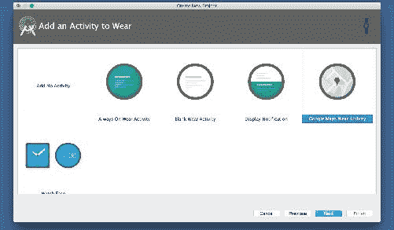
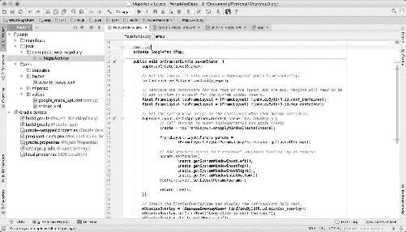
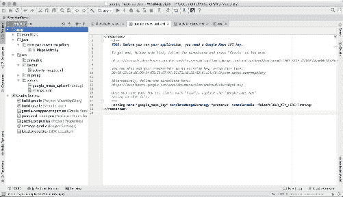
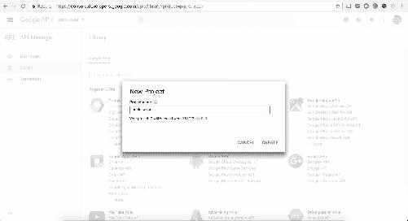
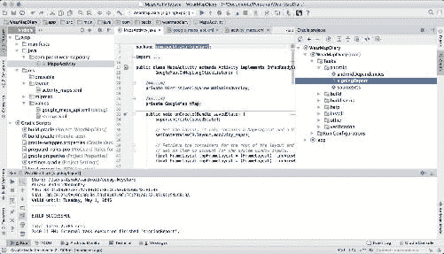
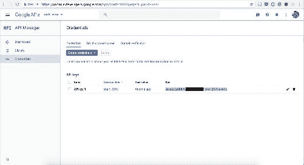
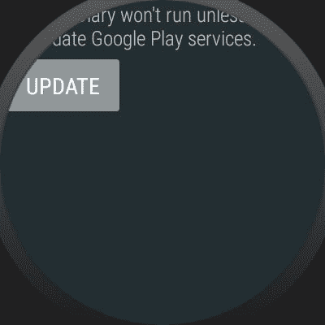
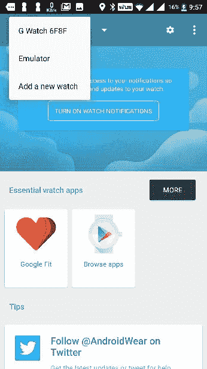
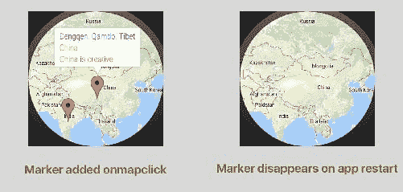

# 六、无处不在的方法——我们的地图和谷歌地图客户端

地图是一个区域或一个区域的一部分的视觉表示。

我们人类旅行到不同的城市；它们可以是国内或国际城市。追踪你参观的地方怎么样？我们都因为不同的原因使用地图，但在大多数情况下，我们使用地图来计划特定的活动，例如户外旅游、骑自行车和其他类似的活动。地图影响人类的智力，以找到从源位置到目的地的最快路线。在这个项目中，我们将构建一个与谷歌地图服务一起工作的穿戴应用程序。

为了记录在案，谷歌地图于 2004 年 10 月作为一个 C++桌面程序开始。谷歌地图于 2005 年 2 月正式发布。谷歌地图提供了一个允许地图嵌入第三方应用程序的应用编程接口；谷歌地图提供许多地方的空中和卫星视图。与其他地图服务相比，谷歌地图是最好的；地图经过优化，其准确率非常高。

在这个项目中，让我们构建一个独立的磨损图应用程序。当用户点击地图时，我们将允许用户写一个关于该位置的故事，并将其保存在 SQLite 数据库中作为标记。当用户点击标记时，我们应该向用户显示保存了什么。在本章中，我们将了解以下重要概念:

*   在开发人员应用编程接口控制台中创建项目
*   借助 SHA1 指纹获取地图应用编程接口密钥
*   SQLite 集成
*   谷歌地图
*   谷歌应用编程接口客户端等等
*   地理编码器

# 让我们开始创建我们的地图

我们现在知道如何创建一个独立的应用程序。如果您直接关注本项目，而没有关注[第 2 章](02.html#173720-4c29edad0fa44cd98c59653fa3b7fce0)、*中涉及的磨损记录应用程序，那么让我们帮助您捕获您的思维-磨损回收视图和更多信息*和[第 3 章](03.html#1Q5IA0-4c29edad0fa44cd98c59653fa3b7fce0)、*让我们帮助您捕获您的思维-保存数据和定制用户界面*。请务必遵循磨损说明应用程序，以了解独立应用程序的更多信息。

我们把这个项目叫做 **WearMapDiary** ，因为我们存储了位置和关于位置的细节。项目包地址由开发商决定；本项目中，包装地址为`com.packt.wearmapdiary`，API 等级为 25 牛轧糖。在活动模板中，选择谷歌地图穿戴活动，如下所示:



Select Google Maps Wear Activity template from the activity chooser

一旦创建了项目，我们将看到项目的必要配置，其中包括已经添加的地图片段；它会设置`DismissOverlays`组件:



The sample code configured for working with the Wear map activity will be generated.

我们需要在`res/values`目录`google_maps_api.xml`文件中将地图应用编程接口密钥添加到项目中:



# 谷歌应用编程接口控制台

谷歌应用编程接口控制台是一个门户网站，允许开发者为他们的项目开发管理谷歌服务，可以在[https://console.developers.google.com](https://console.developers.google.com)访问。

1.  使用您的谷歌帐户访问开发者控制台。创建一个项目`packt-wear`或者一些方便开发者的东西:



2.  成功创建项目后，转到应用编程接口管理器|库部分，启用谷歌地图安卓应用编程接口:


3.  点击启用按钮启用安卓地图:


4.  在控制台工具中启用 API 后，我们需要用开发机器的 SHA1 指纹和项目的包地址创建 API 密钥，如下所示:


5.  要获取机器的 SHA1 指纹，请打开安卓工作室。在安卓工作室的右侧，你会看到 Gradle 项目菜单。然后，按照以下步骤操作:
    1.  单击渐变(在右侧面板上，您将看到渐变栏)
    2.  点击刷新(点击刷新；在渐变栏上，您将看到项目的渐变脚本列表)
    3.  点击您的项目(您的项目名称来自**列表**(根))
    4.  单击任务
    5.  点击安卓






如果您的 Google Play 服务没有在模拟器中更新，Wear 会抛出一个错误屏幕来更新 Play 服务:



如果你有真正的穿戴设备，穿戴操作系统将负责下载最新的谷歌游戏服务更新。对于模拟器，我们需要将它连接到实际设备来添加帐户。首先通过 **adb** 连接安卓手机，启动 Wear 仿真器。

从 https://play.google.com/store/apps/details?游戏商店[安装安卓穿戴伴侣应用 id = com . Google . Android . wealth . app&HL = en](https://play.google.com/store/apps/details?id=com.google.android.wearable.app&hl=en)。



在 android Wear 应用程序中，选择仿真器，在 Android Studio 终端中，输入以下命令:

```java
adb -d forward tcp:5601 tcp:5601

```

模拟器连接到您的实际手机后，您可以添加已经同步到您手机的帐户，也可以添加新帐户。

下图显示了穿戴者帐户的同步屏幕:


*   成功添加帐户后，开始更新您的 Google Play 服务:


*   现在，完成所有这些配置后，在 Android Studio 中编译程序，并在 Wear 设备上看到地图:


# 谷歌应用编程接口客户端

`GoogleApiClient`扩展**对象**类。谷歌应用编程接口客户端为所有谷歌游戏服务提供了一个公共入口点，并管理用户设备和每个谷歌服务之间的网络连接。谷歌建议使用`GoogleApiClient`以编程方式获取用户位置。

在每个线程上创建`GoogleApiClient`。`GoogleApiClient`服务连接在内部缓存。`GoogleApiClient`实例不是线程安全的，所以创建多个实例很快。`GoogleApiClient`用于各种静态方法。其中一些方法需要`GoogleApiClient`连接；有些人会在`GoogleApiClient`接通前排队。

下面是一个代码示例，它创建了一个与谷歌`LocationServices`连接的`GoogleApiClient`实例:

```java
GoogleApiClient mGoogleApiClient = new GoogleApiClient.Builder(this)
.addConnectionCallbacks(this)
.addOnConnectionFailedListener(this)
.addApi(LocationServices.API)
.build();

```

# 为功能配置项目

我们知道创建包对于更好的代码管理和将来维护代码的重要性。让我们用四个不同的名称为项目创建一个包，它们是适配器、模型、util 和视图。

我们在模型包中编写简单的旧 Java 对象。我们将在 util 包中配置所有与数据库相关的类，并在视图包中配置自定义视图，如对话框片段、`TextView`等。对于自定义`infoWindow`，我们必须在`adapter`包内创建一个`infoWindowAdapter`。

使用`GoogleApiClient`获取位置信息非常重要。现在我们已经配置了穿戴地图活动，并且使用我们添加的应用编程接口键绘制了地图，现在是时候在`GoogleApiClient`的帮助下获取位置细节了。

# 借助谷歌客户端获取用户位置信息

现在，在`MapActivity`类中，我们需要实现以下接口:

*   `GoogleApiClient.ConnectionCallback`
*   `GoogleApiClient.OnConnectionFailedListener`

并且，我们需要从这两个接口重写三个方法，如下所示:

*   `public void onConnected(..){}`
*   `public void onConnectionSuspended(..){}`
*   `public void onConnectionFailed(..){}`

在`onConnected`方法中，我们可以使用`GoogleApiClient`实例来实例化位置服务。首先，让我们将`GoogleApiClient`添加到项目中。在`MapActivity`全局范围内创建一个`GoogleApiClient`实例:

```java
private GoogleApiClient mGoogleApiClient;

```

添加一个名为`addGoogleAPIClient(){ }`的 void 方法，用于检索位置服务 API:

```java
private void addGoogleAPIClient(){
    mGoogleApiClient = new GoogleApiClient.Builder(this)
            .addConnectionCallbacks(this)
            .addOnConnectionFailedListener(this)
            .addApi(LocationServices.API)
            .build();
}

```

To have the google play services to do the location related jobs, please add the following dependency in the gradle wear module:
`compile 'com.google.android.gms:play-services-location:11.0.2'`

现在，在`onConnected`方法中，附上`mGoogleApiClient`:

```java
@Override
public void onConnected(@Nullable Bundle bundle) {

    Location location =      LocationServices.FusedLocationApi
    .getLastLocation(mGoogleApiClient);
    double latitude = location.getLatitude();
    double longitude = location.getLongitude();

}

```

`Locationservice`在请求位置之前需要进行权限检查。让我们在清单和活动中添加权限。

向清单添加以下权限:

```java
<uses-permission android:name="android.permission.INTERNET"/>
<uses-permission android:name="android.permission.ACCESS_NETWORK_STATE"/>
<uses-permission android:name="android.permission.WRITE_EXTERNAL_STORAGE"/>
<!-- The following two permissions are not required to use
     Google Maps Android API v2, but are recommended. -->
<uses-permission android:name="android.permission.ACCESS_COARSE_LOCATION"/>
<uses-permission android:name="android.permission.ACCESS_FINE_LOCATION"/>

```

在`MapActivity.java`类中编写一个检查权限的方法，如下所示:

```java
private boolean checkPermission(){
    int result = ContextCompat.checkSelfPermission(MapsActivity.this, 
    Manifest.permission.ACCESS_FINE_LOCATION);
    if (result == PackageManager.PERMISSION_GRANTED){

        return true;

    } else {

        return false;

    }
}

```

按如下方式覆盖方法`onRequestPermissionsResult(..){}`:

```java
@Override
public void onRequestPermissionsResult(int requestCode, String permissions[], int[] grantResults) {
    switch (requestCode) {
        case PERMISSION_REQUEST_CODE:
            if (grantResults.length > 0 && grantResults[0] == 
            PackageManager.PERMISSION_GRANTED) {

            } else {

            }
            break;
    }
}

```

现在，我们有了权限检查方法；用`onConnected`方法处理:

```java
@Override
public void onConnected(@Nullable Bundle bundle) {
    if (checkPermission()) {
        Location location = LocationServices.FusedLocationApi
        .getLastLocation(mGoogleApiClient);
        double latitude = location.getLatitude();
        double longitude = location.getLongitude();
    }else{

    }

}

```

让我们写一个方法来检查穿戴设备上的全球定位系统是否可用`onboard`。使用`packagemanager`类，我们可以在穿戴设备中检索可用的硬件。我们来写一个叫做`hasGps()`的方法:

```java
private boolean hasGps() {
    return getPackageManager().hasSystemFeature(
      PackageManager.FEATURE_LOCATION_GPS);
}

```

如果你想让你的用户知道他们的设备是否有全球定位系统设备，或者你只是为了开发的目的想记录它，在`onCreate()`方法中使用这个方法:

```java
if (!hasGps()) {
    Log.d(TAG, "This hardware doesn't have GPS.");
    // Fall back to functionality that does not use location or
    // warn the user that location function is not available.
}

```

如果您的可穿戴应用程序使用内置的全球定位系统记录数据，您可能希望通过实现`onLocationChanged()`方法，使用`LocationListner`界面将位置数据与手机同步。

要使您的应用程序能够识别位置，请使用`GoogleAPIclient`。

点击此链接了解更多权限信息:[https://developer . Android . com/training/articles/wear-permissions . html](https://developer.android.com/training/articles/wear-permissions.html)。

现在，让我们使用`onMapclick`方法来处理在地图上添加标记的过程。为此，在您的活动中实现`GoogleMap.OnMapClickListener`并实现其回调方法，这将为您提供带有 latlong 的`onmapclick`。将点击上下文添加到您的`onMapReady`回调中，如下所示:

```java
mMap.setOnMapClickListener(this);

```

在`onMapClick`方法中，我们可以使用`latLng`添加以下标记:

```java
@Override
public void onMapClick(LatLng latLng) {
    Log.d(TAG, "Latlng is "+latLng);
}

```

在`onMapclick`方法中添加标记使用`MarkerOptions()`。对于谷歌设计的自定义标记，我们将使用地图中的`addmarker`方法，并添加带有位置、标题和片段的新`MarkerOptions`，这是标题下面的最小描述:

```java
@Override
public void onMapClick(LatLng latLng) {
    Log.d(TAG, "Latlng is "+latLng);
    mMap.addMarker(new MarkerOptions()
            .position(latLng)
            .title("Packt wear 2.0")
            .snippet("Map is cool in wear device"));
}

```

添加`infowindow`标记后:


现在，我们有了地图，并将标记添加到地图中，但是我们需要使用地理编码来获取坐标的地址名称。

# 使用地理编码器的地理空间数据

使用`GeoCoder`类使用坐标获取地址。地理编码通常是将街道地址或其他位置描述转换为(纬度、经度)坐标的过程。反向地理编码是将(纬度、经度)坐标转换为(部分)地址的过程。

在`OnMapClick`方法中，进行以下更改:

```java
@Override
public void onMapClick(LatLng latLng) {
    Log.d(TAG, "Latlng is "+latLng);

   //Fetching the best address match
    Geocoder geocoder = new Geocoder(this);
 List<Address> matches = null;
 try {
 matches = geocoder.getFromLocation(latLng.latitude, 
        latLng.longitude, 1);
 } catch (IOException e) {
 e.printStackTrace();
 }
 Address bestAddress = (matches.isEmpty()) ? null : matches.get(0);
 int maxLine = bestAddress.getMaxAddressLineIndex(); 
    mMap.addMarker(new MarkerOptions()
            .position(latLng)
            .title(bestAddress.getAddressLine(maxLine - 1))
            .snippet(bestAddress.getAddressLine(maxLine)));
}

```

前面的代码片段使用信息窗口中的位置名称将标记添加到地图中:


点击地图弹出的视图在安卓系统中称为`infowindow`。这是一个类似于网络开发工具提示的组件。在这个项目中，我们需要在用户点击地图的任何地方保存数据；我们需要借助`infowindow`展示一个自定义地图标记。我们需要编写一个带有自定义布局的适配器来实现`GoogleMap.InfoWindowAdapter`，如下所示:

# 信息窗口适配器

下面的实现解释了如何为地图标记编写我们的自定义`infowindow`适配器:

```java
//XML latout for customising  infowindow 
<LinearLayout xmlns:android="http://schemas.android.com/apk/res/android"
              android:orientation="horizontal"
              android:layout_width="match_parent"
              android:layout_height="match_parent">
    <TextView
        android:id="@+id/title"
        android:layout_width="wrap_content"
        android:layout_height="wrap_content"/>
    <TextView
        android:id="@+id/snippet"
        android:layout_width="wrap_content"
        android:layout_height="wrap_content"/>
</LinearLayout>

```

`windowadapter`类通过两种回调方法`getInfoWindow(..){}`和`getInfoContents(..){}`实现`GoogleMap.InfoWindowAdapter`。我们可以扩展我们的定制布局`getInfoContent`方法:

```java
public class WearInfoWindowAdapter implements GoogleMap.InfoWindowAdapter {
    private LayoutInflater mLayoutInflater;
    private View mView;
    MarkerAdapter(LayoutInflater layoutInflater){
        mLayoutInflater = layoutInflater;
    }
    @Override
    public View getInfoWindow(Marker marker) {
        return null;
    }
    @Override
    public View getInfoContents(Marker marker) {
        if (mView == null){
            mView = mLayoutInflater.inflate(R.layout.marker, null);
        }
        TextView titleView = (TextView)mView.findViewById(R.id.title);
        titleView.setText(marker.getTitle());
        TextView snippetView = 
        (TextView)mView.findViewById(R.id.snippet);
        snippetView.setText(marker.getSnippet());
        return mView;
    }
}

```

将前面的适配器类添加到适配器包中，以便更好地访问和维护代码。`InfoWindowAdapter`不使用任何数据填充视图；我们用与标记相关联的任何数据填充视图。如果我们想在标题和代码片段之外添加任何东西，我们没有办法在适配器本身中这样做。我们需要创建一个机制来通过编程实现这一点。

在模型包中创建`Memory`类。`Memory`类是用户选择添加标记的地方:

```java
public class Memory {
    double latitude;
    double longitude;
    String city; // City name
    String country; // Country name
    String notes; // saving notes on the location 
}

```

现在，我们有了内存，定制的`infowindow`适配器已经准备好与`onMapclick`实现一起工作。对于每个标记，我们将添加一个记忆类关联。为了暂时保存我们所有的记忆，让我们使用`HashMap`:

```java
private HashMap<String, Memory> mMemories = new HashMap<>();

```

让我们将标记添加到`HashMap`以访问`Marker`属性，例如`Marker` ID 等等。适配器的完整代码如下:

```java
public class WearInfoWindowAdapter implements GoogleMap.InfoWindowAdapter {

    public LayoutInflater mLayoutInflater;
    public View mView;
    public HashMap<String, Memory> mMemories;

    WearInfoWindowAdapter(LayoutInflater layoutInflater, 
    HashMap<String,Memory> memories){
        mLayoutInflater = layoutInflater;
        mMemories = memories;
    }

    @Override
    public View getInfoWindow(Marker marker) {
        return null;
    }

    @Override
    public View getInfoContents(Marker marker) {
        if (mView == null) {
            mView = mLayoutInflater.inflate(R.layout.marker, null);
        }
        Memory memory = mMemories.get(marker.getId());

        TextView titleView = (TextView)mView.findViewById(R.id.title);
        titleView.setText(memory.city);
        TextView snippetView = 
        (TextView)mView.findViewById(R.id.snippet);
        snippetView.setText(memory.country);
        TextView notesView = (TextView)mView.findViewById(R.id.notes);
        notesView.setText(memory.notes);

        return mView;
    }
}

```

在`OnMapClick`方法中，添加以下更改:

```java
@Override
public void onMapClick(LatLng latLng) {
    Log.d(TAG, "Latlng is "+latLng);

    Geocoder geocoder = new Geocoder(this);
    List<Address> matches = null;
    try {
        matches = geocoder.getFromLocation(latLng.latitude, 
        latLng.longitude, 1);
    } catch (IOException e) {
        e.printStackTrace();
    }

    Address bestAddress = (matches.isEmpty()) ? null : matches.get(0);
    int maxLine = bestAddress.getMaxAddressLineIndex();

    Memory memory = new Memory();
    memory.city = bestAddress.getAddressLine(maxLine - 1);
    memory.country = bestAddress.getAddressLine(maxLine);
    memory.latitude = latLng.latitude;
    memory.longitude = latLng.longitude;
    memory.notes = "Packt and wear 2.0 notes...";

    Marker marker = mMap.addMarker(new MarkerOptions()
            .position(latLng));

    mMemories.put(marker.getId(), memory);
}

```

用`onMapready`方法，用以下代码将新的`Marker`附加到地图上:

```java
mMap.setInfoWindowAdapter(new WearInfoWindowAdapter(getLayoutInflater(), mMemories));

```

现在，编译程序。你应该可以看到更新后的`infoWindow`，如下图:


# 自定义对话片段，用于记录位置信息

`DialogFragment`是一个活动浮动的对话窗口。在磨损设备上，它不会浮动，但它提供了磨损优化设计。检查以下代码以实现。

在继续之前，将 Memory 类实现为可序列化的接口:

```java
public class Memory implements Serializable {
    public double latitude;
    public double longitude;
    public String city;
    public String country;
    public String notes;
}

```

将以下布局文件添加到布局目录中，并将布局文件称为`memory_dialog_fragment.xml`。创建文件后，在布局文件中添加以下代码:

```java
<?xml version="1.0" encoding="utf-8"?>
<android.support.wearable.view.BoxInsetLayout
    xmlns:android="http://schemas.android.com/apk/res/android"
    xmlns:tools="http://schemas.android.com/tools"
    xmlns:app="http://schemas.android.com/apk/res-auto"
    android:id="@+id/container"
    android:layout_width="match_parent"
    android:layout_height="match_parent"
    tools:context=".MapsActivity"
    tools:deviceIds="wear">

    <LinearLayout
        xmlns:android="http://schemas.android.com/apk/res/android"
        android:layout_width="match_parent"
        android:layout_height="wrap_content"
        android:orientation="vertical"
        android:padding="5dp"
        app:layout_box="all"
        android:layout_gravity="center"
        android:gravity="center">

        <TextView
            android:id="@+id/city"
            android:layout_width="wrap_content"
            android:layout_height="wrap_content" />

        <TextView
            android:id="@+id/country"
            android:layout_width="wrap_content"
            android:layout_height="wrap_content" />

        <EditText
            android:id="@+id/notes"
            android:layout_width="match_parent"
            android:layout_height="wrap_content" />

    </LinearLayout>
</android.support.wearable.view.BoxInsetLayout>

```

创建布局文件后，让我们处理创建自定义对话框的 Java 代码。创建一个名为`MemoryDialogFragment`的类，并将其扩展到`DialogFragment`。

创建操作`DialogFragment`的`SaveClicked`和`cancelClicked`按钮的界面:

```java
public interface Listener{
    public void OnSaveClicked(Memory memory);
    public void OnCancelClicked(Memory memory);
}

```

现在，将以下实例添加到`MemoryDialogFragment`全局范围。：

```java
private static final String TAG = "MemoryDialogFragment";
private static final String MEMORY_KEY = "MEMORY";
private Memory mMemory;
private Listener mListener;
private View mView;

```

现在，用正确字段中的正确数据来扩展布局:

```java
@Override
public Dialog onCreateDialog(Bundle savedInstanceState) {

    mView = getActivity().getLayoutInflater()
    .inflate(R.layout.memory_dialog_fragment, null);
    TextView cityView = (TextView) mView.findViewById(R.id.city);
    cityView.setText(mMemory.city);
    TextView countryView = (TextView) mView.findViewById(R.id.country);
    countryView.setText(mMemory.country);

    AlertDialog.Builder builder = new 
    AlertDialog.Builder(getActivity());
    builder.setView(mView)
            .setTitle(getString(R.string.dialog_title))
            .setPositiveButton(getString(R.string.DialogSaveButton), 
            new DialogInterface.OnClickListener() {
                @Override
                public void onClick(DialogInterface dialog, int which) 
                {
                    EditText notesView = (EditText) 
                    mView.findViewById(R.id.notes);
                    mMemory.notes = notesView.getText().toString();
                    mListener.OnSaveClicked(mMemory);
                }
            })
            .setNegativeButton(getString(R.string.DialogCancelButton), 
            new DialogInterface.OnClickListener() {
                @Override
                public void onClick(DialogInterface dialog, int which) 
                {
                    mListener.OnCancelClicked(mMemory);
                }
            });

    return builder.create();
}

```

我们将通过`oncreate`方法从`Memory`获取序列化数据:

```java
@Override
public void onCreate(Bundle savedInstanceState) {
    super.onCreate(savedInstanceState);
    Bundle args = getArguments();
    if (args != null){
        mMemory = (Memory)args.getSerializable(MEMORY_KEY);
    }
}

```

`MemoryDialogFragment`的完整代码如下:

```java
public class MemoryDialogFragment extends DialogFragment  {

    private static final String TAG = "MemoryDialogFragment";
    private static final String MEMORY_KEY = "MEMORY";

    private Memory mMemory;
    private Listener mListener;
    private View mView;

    @Override
    public void onCreate(Bundle savedInstanceState) {
        super.onCreate(savedInstanceState);
        Bundle args = getArguments();
        if (args != null){
            mMemory = (Memory)args.getSerializable(MEMORY_KEY);
        }
    }

    @Override
    public Dialog onCreateDialog(Bundle savedInstanceState) {

        mView = getActivity().getLayoutInflater()
        .inflate(R.layout.memory_dialog_fragment, null);
        TextView cityView = (TextView) mView.findViewById(R.id.city);
        cityView.setText(mMemory.city);
        TextView countryView = (TextView) 
        mView.findViewById(R.id.country);
        countryView.setText(mMemory.country);

        AlertDialog.Builder builder = new 
        AlertDialog.Builder(getActivity());
        builder.setView(mView)
                .setTitle(getString(R.string.dialog_title))
                .setPositiveButton(getString
                (R.string.DialogSaveButton), 
                new DialogInterface.OnClickListener() {
                    @Override
                    public void onClick
                    (DialogInterface dialog, int which) {
                        EditText notesView = (EditText) 
                        mView.findViewById(R.id.notes);
                        mMemory.notes = notesView.getText().toString();
                        mListener.OnSaveClicked(mMemory);
                    }
                })
                .setNegativeButton(getString
                (R.string.DialogCancelButton), 
                new DialogInterface.OnClickListener() {
                    @Override
                    public void onClick
                    (DialogInterface dialog, int which) {
                        mListener.OnCancelClicked(mMemory);
                    }
                });

        return builder.create();
    }

    public static MemoryDialogFragment newInstance(Memory memory){
        MemoryDialogFragment fragment = new MemoryDialogFragment();
        Bundle args = new Bundle();
        args.putSerializable(MEMORY_KEY, memory);
        fragment.setArguments(args);

        return fragment;
    }

    @Override
    public void onAttach(Activity activity) {
        super.onAttach(activity);
        try{
            mListener = (Listener)getActivity();
        }catch (ClassCastException e){
            throw new IllegalStateException("Activity does not 
            implement contract");
        }

    }

    @Override
    public void onDetach() {
        super.onDetach();
        mListener = null;
    }

    public interface Listener{
        public void OnSaveClicked(Memory memory);
        public void OnCancelClicked(Memory memory);
    }
}

```

在`OnMapClick`方法中，进行以下更改:

```java
@Override
public void onMapClick(LatLng latLng) {
    Log.d(TAG, "Latlng is "+latLng);

    Memory memory = new Memory();
 updateMemoryPosition(memory, latLng);
    MemoryDialogFragment.newInstance(memory)
    .show(getFragmentManager(),MEMORY_DIALOG_TAG);
}

```

现在，编译程序。您将在`mapclick`上看到以下屏幕。用户可以在 edittext 字段中输入他或她对地图位置的想法:


现在我们已经添加了用于获取输入的对话框，让我们开始将数据保存到 SQLite 中。

# 配置 SQLite 并保存标记

保存所有必要的数据是任何好软件的基本用例。Android SDK 提供了一个内置的 SQLite 存储解决方案。它占地面积非常小，速度非常快。如果一个程序员熟悉 SQL 查询和操作，那么使用 SQLite 将变得简单而愉快。

# 模式和契约

本质上，对于数据库，我们需要创建一个数据模式，这是数据库如何组织的正式声明。该模式反映在 SQLite 查询语句中。协定类是定义 URIs、表和列名称的常数的容器。契约类允许在同一个包中的所有其他类之间使用相同的常量。

对于`WearMapDiary`的范围，我们将创建`DBHelper`类中的所有实例。现在，让我们创建`DBhelper`类，它打开应用程序并将应用程序连接到 SQLite 并处理查询:

```java
public class DbHelper extends SQLiteOpenHelper {

    private static final String DATABASE_NAME = "traveltracker.db";
    private static final int DATABASE_VERSION = 3;
    public static final String MEMORIES_TABLE = "memories";
    public static final String COLUMN_LATITUDE = "latitude";
    public static final String COLUMN_LONGITUDE = "longitude";
    public static final String COLUMN_CITY = "city";
    public static final String COLUMN_COUNTRY = "country";
    public static final String COLUMN_NOTES = "notes";
    public static final String COLUMN_ID = "_id";

    private static DbHelper singleton = null;

    public static DbHelper getInstance(Context context){
        if (singleton == null){
            singleton = new DbHelper(context.getApplicationContext());
        }
        return singleton;
    }

    private DbHelper(Context context) {
        super(context, DATABASE_NAME, null, DATABASE_VERSION);
    }

    @Override
    public void onCreate(SQLiteDatabase db) {
        db.execSQL("CREATE TABLE "+MEMORIES_TABLE+" ("
                +COLUMN_ID+" INTEGER PRIMARY KEY AUTOINCREMENT, "
                +COLUMN_LATITUDE +" DOUBLE, "
                +COLUMN_LONGITUDE +" DOUBLE, "
                +COLUMN_CITY +" TEXT, "
                +COLUMN_COUNTRY +" TEXT, "
                +COLUMN_NOTES +" TEXT"
                +")");
    }

    @Override
    public void onUpgrade(SQLiteDatabase db, int oldVersion, int 
    newVersion) {
        db.execSQL("DROP TABLE IF EXISTS "+MEMORIES_TABLE);
        onCreate(db);
    }
}

```

我们需要创建一个`Datasource`来管理所有的查询，并将数据读写到 SQLite。在本课中，我们将创建多种方法来创建数据、读取数据、更新数据和删除数据:

```java
public class MemoriesDataSource {
    private DbHelper mDbHelper;
    private String[] allColumns = {
            DbHelper.COLUMN_ID, DbHelper.COLUMN_CITY,
            DbHelper.COLUMN_COUNTRY, DbHelper.COLUMN_LATITUDE,
            DbHelper.COLUMN_LONGITUDE, DbHelper.COLUMN_NOTES
    };

    public MemoriesDataSource(Context context){
        mDbHelper = DbHelper.getInstance(context);
    }

    public void createMemory(Memory memory){
        ContentValues values = new ContentValues();
        values.put(DbHelper.COLUMN_NOTES, memory.notes);
        values.put(DbHelper.COLUMN_CITY, memory.city);
        values.put(DbHelper.COLUMN_COUNTRY, memory.country);
        values.put(DbHelper.COLUMN_LATITUDE, memory.latitude);
        values.put(DbHelper.COLUMN_LONGITUDE, memory.longitude);
        memory.id = mDbHelper.getWritableDatabase()
        .insert(DbHelper.MEMORIES_TABLE, null, values);
    }

    public List<Memory> getAllMemories(){

        Cursor cursor = allMemoriesCursor();
        return cursorToMemories(cursor);
    }

    public Cursor allMemoriesCursor(){
        return mDbHelper.getReadableDatabase()
        .query(DbHelper.MEMORIES_TABLE, 
        allColumns,null, null, null, null, null);
    }

    public List<Memory> cursorToMemories(Cursor cursor){
        List<Memory> memories =  new ArrayList<>();
        cursor.moveToFirst();
        while (!cursor.isAfterLast()){
            Memory memory = cursorToMemory(cursor);
            memories.add(memory);
            cursor.moveToNext();
        }
        return memories;
    }

    public void updateMemory(Memory memory){
        ContentValues values = new ContentValues();
        values.put(DbHelper.COLUMN_NOTES, memory.notes);
        values.put(DbHelper.COLUMN_CITY, memory.city);
        values.put(DbHelper.COLUMN_COUNTRY, memory.country);
        values.put(DbHelper.COLUMN_LATITUDE, memory.latitude);
        values.put(DbHelper.COLUMN_LONGITUDE, memory.longitude);

        String [] whereArgs = {String.valueOf(memory.id)};

        mDbHelper.getWritableDatabase().update(
                mDbHelper.MEMORIES_TABLE,
                values,
                mDbHelper.COLUMN_ID+"=?",
                whereArgs
        );
    }

    public void deleteMemory(Memory memory){
        String [] whereArgs = {String.valueOf(memory.id)};

        mDbHelper.getWritableDatabase().delete(
                mDbHelper.MEMORIES_TABLE,
                mDbHelper.COLUMN_ID+"=?",
                whereArgs
        );
    }

    private Memory cursorToMemory(Cursor cursor){
        Memory memory = new Memory();
        memory.id = cursor.getLong(0);
        memory.city = cursor.getString(1);
        memory.country = cursor.getString(2);
        memory.latitude = cursor.getDouble(3);
        memory.longitude = cursor.getDouble(4);
        memory.notes = cursor.getString(5);
        return memory;
    }
}

```

为了使用`cursorLoader`在后台执行所有这些查询，我们将编写另一个类，并将这个类称为`DBCurserLoader`:

```java
public abstract class DbCursorLoader extends AsyncTaskLoader<Cursor> {

    private Cursor mCursor;

    public DbCursorLoader(Context context){
        super(context);
    }

    protected abstract Cursor loadCursor();

    @Override
    public Cursor loadInBackground() {
        Cursor cursor = loadCursor();
        if (cursor != null){
            cursor.getCount();
        }

        return cursor;
    }

    @Override
    public void deliverResult(Cursor data) {
        Cursor oldCursor = mCursor;
        mCursor = data;

        if (isStarted()){
            super.deliverResult(data);
        }

        if (oldCursor != null && oldCursor != data){
            onReleaseResources(oldCursor);
        }
    }

    @Override
    protected void onStartLoading() {
        if (mCursor != null){
            deliverResult(mCursor);
        }
        if (takeContentChanged() || mCursor == null){
            forceLoad();
        }
    }

    @Override
    protected void onStopLoading() {
        cancelLoad();
    }

    @Override
    public void onCanceled(Cursor data) {
        super.onCanceled(data);

        if (data != null) {
            onReleaseResources(data);
        }
    }

    @Override
    protected void onReset() {
        super.onReset();

        onStopLoading();

        if (mCursor != null){
            onReleaseResources(mCursor);
        }
        mCursor = null;
    }

    private void onReleaseResources(Cursor cursor){
        if (!cursor.isClosed()){
            cursor.close();
        }
    }
}

```

创建另一个类来加载从`memoryDatasource`开始的所有记忆，并将其扩展到`DBCursorLoader`:

```java
public class MemoriesLoader extends DbCursorLoader {

    private MemoriesDataSource mDataSource;

    public MemoriesLoader(Context context, MemoriesDataSource 
    memoriesDataSource){
        super(context);
        mDataSource = memoriesDataSource;
    }

    @Override
    protected Cursor loadCursor() {
        return mDataSource.allMemoriesCursor();
    }
}

```

现在，我们的 SQLite 配置工作正常。让我们使用`MapActivity`来保存 SQLite `onMapclick`中的数据。

# 在 SQLite 中保存数据

要将 SQLite 连接到活动并将数据保存在 SQLite 中，请执行活动`LoaderManager.LoaderCallbacks<Cursor>`并在`onCreate`方法中设置数据源:

```java
mDataSource = new MemoriesDataSource(this);
getLoaderManager().initLoader(0,null,this);

```

实现`LoaderManager.LoaderCallbacks<Cursor>`界面的回调方法:

```java
@Override
public Loader<Cursor> onCreateLoader(int id, Bundle args) {
    return null;
}

@Override
public void onLoadFinished(Loader<Cursor> loader, Cursor data) {

}

@Override
public void onLoaderReset(Loader<Cursor> loader) {

}

```

现在，用如下方法重构`addingMarker`代码:

```java
private void addMarker(Memory memory) {
    Marker marker = mMap.addMarker(new MarkerOptions()
            .draggable(true)
            .position(new LatLng(memory.latitude, memory.longitude)));

    mMemories.put(marker.getId(), memory);
}

```

我们仍然需要为将来的实现拖动标记。让我们将可拖动属性设置为真。现在，在`OnMapClick`方法中，调用以下代码:

```java
@Override
public void onMapClick(LatLng latLng) {
    Log.d(TAG, "Latlng is "+latLng);

    Memory memory = new Memory();
    updateMemoryPosition(memory, latLng);
    MemoryDialogFragment.newInstance(memory)
    .show(getFragmentManager(),MEMORY_DIALOG_TAG);
}

```

让我们重构`UpdateMemoryPosition`方法，它从`latlng`获取地址并将其添加到`Memory`:

```java
private void updateMemoryPosition(Memory memory, LatLng latLng) {
    Geocoder geocoder = new Geocoder(this);
    List<Address> matches = null;
    try {
        matches = geocoder.getFromLocation(latLng.latitude, 
        latLng.longitude, 1);
    } catch (IOException e) {
        e.printStackTrace();
    }

    Address bestMatch = (matches.isEmpty()) ? null : matches.get(0);
    int maxLine = bestMatch.getMaxAddressLineIndex();
    memory.city = bestMatch.getAddressLine(maxLine - 1);
    memory.country = bestMatch.getAddressLine(maxLine);
    memory.latitude = latLng.latitude;
    memory.longitude = latLng.longitude;
}

```

现在，我们将数据保存在 SQLite 中。当我们关闭和打开地图时，我们没有读取标记数据并将其添加到地图中:



现在，让我们读取 SQLite 数据并将其添加到地图中。

来自`LoaderManager`类的`onCreateLoader`回调方法通过`Datasource`实例向`MemoryLoader`添加数据，如下所示:

```java
@Override
public Loader<Cursor> onCreateLoader(int id, Bundle args) {
    Log.d(TAG,"onCreateLoader");
    return new MemoriesLoader(this, mDataSource);
}

```

在`onLoadFinished`方法中，从光标处获取数据并将其添加到地图中:

```java
@Override
public void onLoadFinished(Loader<Cursor> loader, Cursor cursor) {
    Log.d(TAG,"onLoadFinished");
    onFetchedMemories(mDataSource.cursorToMemories(cursor));
}

```

从提取的数据向地图添加标记:

```java
private void onFetchedMemories(List<Memory> memories) {
    for(Memory memory: memories){
        addMarker(memory);
    }
}

```

现在，我们有了一个名为`WearMapDiary`的功能性穿戴应用，它可以找到地址，并在地图中保存关于位置的快速注释。当我们在 Wear 设备中打开应用程序时，它会将标记添加到 SQLite 数据库并将标记附加到地图上:


从应用程序中检索到的注释和位置信息:


在该对话框中，用户可以键入他或她想要保存在当前位置的数据:


到目前为止，我们已经探索了如何将地图集成到穿戴设备，并对获取地图应用编程接口密钥有了清晰的了解。我们正在使用`GoogleApiclient`获取位置服务。我们正在检查全球定位系统硬件的可用性:

以下步骤简要说明了如何编写自定义标记。

*   通过实现`GoogleMap.InfoWindowAdapter`探索自定义`InfoWindow`适配器
*   使用`boxinsetlayout`为磨损兼容性创建了自定义`dialogFragment`
*   `Geocoder`类获取`GeoSpatial`数据
*   SQLite 及其在地图数据中的集成

现在，是时候了解更多关于穿戴设备上的地图了。

# 独立地图和移动同步地图应用程序的区别

面向穿戴 2.0 平台的手表应用程序可以通过板载无线收发器连接到无线网络。我们可以缓存地图和更多，但它仍然缺乏移动地图应用程序所能提供的舒适。通常，对于独立的穿戴应用程序，目标应用编程接口级别为 25，并带有安全操作的运行时权限。在本章中，我们添加了处理运行时权限的代码。

# 将应用程序标识为独立的

穿戴 2.0 要求手表应用的安卓`Manifest`文件中有一个新的元数据元素，作为`<application>`元素的子元素。新的元数据元素的名称是`com.google.android.wearable.standalone`，值必须为真或假:

```java
 <meta-data
    android:name="com.google.android.wearable.standalone"
    android:value="true" />

```

由于独立应用程序是独立或半独立的，它可以由 iPhone 用户和缺少 Play 商店的安卓手机(黑莓安卓分叉操作系统和诺基亚定制安卓手机)安装。

如果手表应用程序依赖于手机应用程序，则将前一个元数据元素的值设置为 false。

Even if the value is false, the watch app can be installed before the corresponding phone app is installed. Therefore, if a watch app detects that a companion phone lacks a necessary phone app, the watch app should prompt the user to install the phone app.

# 在穿戴应用和手机应用之间共享数据

数据可以在穿戴应用程序和电话应用程序之间共享，也可以是特定于应用程序的数据。可以使用标准的 Android 存储 API 在本地存储数据。例如，您可以使用[shared references API](https://developer.android.com/reference/android/content/SharedPreferences.html)、SQLite 或内部存储(就像您在电话中一样)。消息应用程序接口穿戴应用程序可以与相应的电话应用程序通信。

# 从其他设备检测您的应用程序

在**能力 API** 中，您的穿戴应用程序可以检测穿戴应用程序的相应移动应用程序。穿戴设备也可以自发地和静态地向配对设备通告他们的事件。要查看配对穿戴设备的广告功能，请查看此链接了解更多信息:

请注意，并非所有手机都支持 Play store(如 iPhones 等)。本节介绍了这些场景的最佳实践:您的独立手表应用程序需要您的手机应用程序，而您的手机应用程序需要您的独立手表应用程序。

# 指定功能名称来检测您的应用

对于每种设备类型(手表或手机)对应的应用，在`res/values/wear.xml`文件中为功能名称指定一个唯一的字符串。例如，在您的移动模块中，`wear.xml`文件可能在穿戴和移动模块中包含以下代码:

```java
<resources>
    <string-array name="android_wear_capabilities">
        <item>verify_remote_example_phone_app</item>
    </string-array>
</resources>

```

# 检测并引导用户安装相应的手机应用

穿戴 2.0 引入了独立应用。穿戴应用程序在没有移动应用程序支持的情况下也能正常运行。在紧急情况下，当必须使用移动应用程序时，Wear 应用程序可以通过以下一组步骤指导用户安装移动支持应用程序和 Wear 通信应用程序:

*   使用`CapabilityApi`检查您的手机 app 是否安装在配对的手机上。更多信息，请查看谷歌提供的这个示例:[https://github . com/Google samples/Android-weaverify remote app。](https://github.com/googlesamples/android-WearVerifyRemoteApp)

*   如果手机上没有安装手机应用，使用`PlayStoreAvailability.getPlayStoreAvailabilityOnPhone()`查看是什么类型的手机。

*   如果返回`PlayStoreAvailability.PLAY_STORE_ON_PHONE_AVAILABLE``true`，说明手机中安装了 Playstore。

*   在穿戴设备上拨打`RemoteIntent.startRemoteActivity()`使用 URI 市场([市场://详情)在手机上打开 Play Store？id = com . example . Android . wear . wear . find devices](http://use%20a%20market%20URI%20such%20as:%20market://details?id=com.example.android.wearable.wear.finddevices))。

*   如果返回`PlayStoreAvailability.PLAY_STORE_ON_PHONE_UNAVAILABLE`，则表示该手机很可能是 iOS 手机(没有 Play Store 可用)。用这个 URI 在穿戴设备上调用`RemoteIntent.startRemoteActivity()`:[https://itunes.apple.com/us/app/yourappname](https://itunes.apple.com/us/app/yourappname)，打开 iPhone 上的应用商店。另外，请参见从手表打开网址。在 iPhone 上，从 Android Wear，您无法通过编程来确定您的手机应用程序是否已安装。作为最佳实践，向用户提供一种机制(例如，按钮)来手动触发应用商店的打开。

要想更详细地了解独立应用，请查看以下链接:[https://developer . Android . com/wear/preview/features/standalone-apps . html .](https://developer.android.com/wear/preview/features/standalone-apps.html)

# 在穿戴设备上保持应用程序的活动状态

当我们为不同的环境编写一个应用程序时，我们需要做一些选择。我们知道，在不使用应用程序时，我们应该让该应用程序在 Wear 设备中休眠，以获得更好的电池性能，但当我们为地图构建应用程序时，地图对用户来说必须是可见和活跃的。

安卓对此有一个简单的配置:一个激活环境模式的少行方法:

```java
//oncreate Method
setAmbientEnabled();

```

这将启动地图上的环境模式。当用户不再积极使用该应用程序时，该应用程序接口会转换为地图的非交互式低色彩渲染:

```java
@Override
public void onEnterAmbient(Bundle ambientDetails) {
    super.onEnterAmbient(ambientDetails);
    mMapFragment.onEnterAmbient(ambientDetails);
}

```

以下代码退出佩戴地图上的环境模式。当用户开始主动使用应用程序时，应用程序接口会切换到地图的正常渲染:

```java
@Override
public void onEnterAmbient(Bundle ambientDetails) {
    super.onEnterAmbient(ambientDetails);
    mMapFragment.onEnterAmbient(ambientDetails);
}

```

# 为您的应用程序配置唤醒锁

当磨损应用程序经常可见时，它们非常有用。让应用程序持续可见会对电池寿命产生影响，因此在将此功能添加到应用程序时，您应该仔细考虑这种影响。

将`WAKE_LOCK`权限添加到清单中:

```java
<uses-permission android:name="android.permission.WAKE_LOCK" />

```

以下代码片段有助于理解`WAKE_LOCK`机制:

```java
 // Schedule a new alarm
    if (isAmbient()) {
        // Calculate the next trigger time
        long delayMs = AMBIENT_INTERVAL_MS - (timeMs % 
        AMBIENT_INTERVAL_MS);
        long triggerTimeMs = timeMs + delayMs;

        mAmbientStateAlarmManager.setExact(
AlarmManager.RTC_WAKEUP,
            triggerTimeMs,
            mAmbientStatePendingIntent);

    } else {
        // Calculate the next trigger time for interactive mode
    }

```

除了使用输入法框架来读取输入，用户还可以使用语音输入，这需要在您的穿戴设备上进行主动互联网:

```java
private static final int SPEECH_REQUEST_CODE = 0;

// Create an intent that can start the Speech Recognizer activity
private void displaySpeechRecognizer() {
    Intent intent = new 
    Intent(RecognizerIntent.ACTION_RECOGNIZE_SPEECH);
    intent.putExtra(RecognizerIntent.EXTRA_LANGUAGE_MODEL,
            RecognizerIntent.LANGUAGE_MODEL_FREE_FORM);
// Start the activity, the intent will be populated with the speech text
    startActivityForResult(intent, SPEECH_REQUEST_CODE);
}

// This callback is invoked when the Speech Recognizer returns.
// This is where you process the intent and extract the speech text from the intent.
@Override
protected void onActivityResult(int requestCode, int resultCode,
        Intent data) {
    if (requestCode == SPEECH_REQUEST_CODE && resultCode == RESULT_OK) 
    {
        List<String> results = data.getStringArrayListExtra(
                RecognizerIntent.EXTRA_RESULTS);
        String spokenText = results.get(0);
        // Do something with spokenText
    }
    super.onActivityResult(requestCode, resultCode, data);
}

```

# 理解完全交互模式和精简模式

谷歌地图安卓应用编程接口可以将静态图像作为光照模式地图。

给安卓地图添加 Lite 模式类似于配置普通地图，因为它将使用相同的类和接口。我们可以通过以下两种方式将谷歌地图设置为精简模式:

*   作为您的`MapView`或`MapFrgament`的 XML 属性
*   使用`GoogleMapOptions`对象

```java
<fragment xmlns:android="http://schemas.android.com/apk/res/android"
    xmlns:map="http://schemas.android.com/apk/res-auto"
    android:name="com.google.android.gms.maps.MapFragment"
    android:id="@+id/map"
    android:layout_width="match_parent"
    android:layout_height="match_parent"
    map:cameraZoom="13"
    map:mapType="normal"
    map:liteMode="true"/>

```

或者，使用`GoogleMapOptions`对象，如下所示:

```java
GoogleMapOptions options = new GoogleMapOptions().liteMode(true);

```

交互模式允许应用程序使用所有的生命周期方法，包括`onCreate()`、`onDestroy()`、`onResume()`和`onPause()`，以及所有的谷歌应用编程接口功能，使应用程序完全交互。作为成本，会有网络依赖。

有关 Interactive 和 Lite 模式的更多信息，请查看以下链接:[https://developers . Google . com/maps/documentation/Android-API/Lite。](https://developers.google.com/maps/documentation/android-api/lite) 

# 摘要

在这里，我们已经到了这一章的结尾，期待着我们能在 WearMapDiary 应用程序中做些什么改进。现在，我们知道创建一个`MapsActivity`，设置地图和谷歌应用编程接口键，在穿戴模拟器中配置谷歌游戏服务，运行时权限检查，检查全球定位系统硬件，以及使用`geocoder`类获取位置名称。我们已经理解了地图的交互模式和精简模式的概念。在下一章中，让我们了解更多的穿戴和地图用户界面控件以及其他谷歌地图技术，例如街景、更改地图类型等。