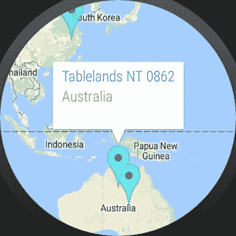
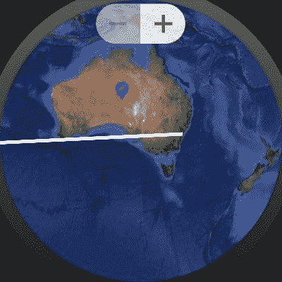

# 七、无处不在的方法——用户界面控件以及其它

既然您已经学习了如何为安卓穿戴应用程序的谷歌地图带来活力，并探索 SQLite 集成，我们需要 UI 控件和更多增强功能。在这一章中，让我们通过添加功能(例如移动地图上的标记和更改地图类型)来专注于使地图应用程序更加实用和直观。在本章中，您将学习以下主题:

*   标记控件
*   地图类型
*   地图缩放控件
*   穿戴设备街景
*   最佳实践

标记不仅是表示地图上坐标的符号。标记被用来通过用显著的图画描绘代替标记默认符号来传达它是什么样的地方；例如，如果是加油站，标记符号可能有点像油枪符号或医院。

# 更改标记颜色和自定义

使用`MarkerOptions`类，我们可以改变标记的颜色和图标。下面的代码解释了更改标记的图标和颜色。

要更改标记的颜色，请参考以下代码:

```java
private void addMarker(Memory memory) {
    Marker marker = mMap.addMarker(new MarkerOptions()
          .draggable(true).icon(BitmapDescriptorFactory.defaultMarker
          (BitmapDescriptorFactory.HUE_CYAN)).alpha(0.7f)
            .position(new LatLng(memory.latitude, memory.longitude)));

    mMemories.put(marker.getId(), memory);
}

```

我们现在可以看到，标记颜色随着透明度从红色变为青色。如果您希望移除透明度，您可以移除传递给标记选项的`.alpha()`值:



Changed marker color

要将标记更改为`drawable`目录内的图标，请检查以下代码:

```java
private void addMarker(Memory memory) {
    Marker marker = mMap.addMarker(new MarkerOptions()
            .draggable(true).icon(BitmapDescriptorFactory.fromResource
            (R.drawable.ic_edit_location)).alpha(0.7f)
            .position(new LatLng(memory.latitude, memory.longitude)));

    mMemories.put(marker.getId(), memory);
}

```

这将默认标记图标替换为我们从可绘制目录中传递的自定义图像。我们需要确保图标大小不臃肿，并且具有 72x72 的最佳大小:


Changed marker image with custom image

前面的代码片段将有助于更改标记的颜色或图标，但是对于更复杂的场景，我们可以动态构建标记视觉素材并将其添加到地图中。

使用简单的 Java 代码拥有我们自己定制设计的标记怎么样？我们将创建一个标记，在图像顶部绘制简单的文本。下面的代码解释了如何使用`Bitmap`类和`Canvas`类在图像上绘制文本:

```java
 private void addMarker(Memory memory) {

        Bitmap.Config conf = Bitmap.Config.ARGB_8888;
        Bitmap bmp = Bitmap.createBitmap(80, 80, conf);
        Canvas canvas1 = new Canvas(bmp);

        // paint defines the text color, stroke width and size
        Paint color = new Paint();
        color.setTextSize(15);
        color.setColor(Color.BLACK);

        // modify canvas
        canvas1.drawBitmap(BitmapFactory.decodeResource(getResources(),
                R.drawable.ic_edit_location), 0,0, color);
        canvas1.drawText("Notes", 30, 35, color);

        // add marker to Map

        Marker marker = mMap.addMarker(new MarkerOptions()
                .draggable(true).icon(BitmapDescriptorFactory
                .fromBitmap(bmp)).alpha(0.7f)
                .position(new LatLng(memory.latitude, 
                memory.longitude)));

        mMemories.put(marker.getId(), memory);
    }

```

以下屏幕截图显示了使用位图和画布绘制的带有注释的标记:


Dynamically adding the marker from realmdb information.

# 拖动标记并更新位置

在`MapActivity`中实现`GoogleMap.OnMarkerDragListener`接口，从`OnMarkerDragListener`接口实现所有回调方法:

```java
@Override
public void onMarkerDragStart(Marker marker) {

}

@Override
public void onMarkerDrag(Marker marker) {

}

@Override
public void onMarkerDragEnd(Marker marker) {

}

```

从界面实现这三种方法后，在第三次回调`onMarkerDragEnd`中，我们可以用更新后的位置细节来更新内存。我们也可以在`onMapReady`回拨中注册`draglistner`:

```java
@Override
public void onMapReady(GoogleMap googleMap) {

mMap.setOnMarkerDragListener(this);
...
}

```

然后，用以下代码更新`onMarkerDragEnd`方法:

```java
@Override
public void onMarkerDragEnd(Marker marker) {

    Memory memory = mMemories.get(marker.getId());
    updateMemoryPosition(memory, marker.getPosition());
    mDataSource.updateMemory(memory);

}

```

上一个代码片段更新了拖动标记时的位置。

# 信息窗口点击事件

当用户点击`InfoWindow`时，可以删除标记。要收听`Infowindow`的点击事件，需要实现`GoogleMap.OnInfoWindowClickListener`及其回调方法`onInfoWindowClick(..)`。
在`onMapready`回调中注册`infoWindoClicklistner`如下:

```java
mMap.setOnInfoWindowClickListener(this);

```

在回调方法中，让我们设计一个当用户点击它时的警告对话框。它应该允许用户删除标记:

```java
@Override
public void onInfoWindowClick(final Marker marker) {
    final Memory memory = mMemories.get(marker.getId());
    String[] actions  = {"Delete"};
    AlertDialog.Builder builder = new AlertDialog.Builder(this);
    builder.setTitle(memory.city+", "+memory.country)
            .setItems(actions, new DialogInterface.OnClickListener() {
                @Override
                public void onClick
                (DialogInterface dialog, int which) {
                    if (which == 0){
                        marker.remove();
                        mDataSource.deleteMemory(memory);
                    }
                }
            });

    builder.create().show();
}

```


# 用户界面控件

可穿戴设备禁用了缩放和位置控制等用户界面控制。我们可以使用`UISettings`类启用它们。`UISettings`类扩展到谷歌地图用户界面的对象设置。要获得该界面，请调用`getUiSettings()`。

以下布尔方法返回组件的状态，无论它是启用还是禁用的:

*   `public boolean isCompassEnabled ()`:获取指南针是否启用/禁用
*   `public boolean isMyLocationButtonEnabled ()`:获取我的位置按钮是否启用/禁用
*   `public boolean isZoomControlsEnabled ()`:获取缩放控件是否启用/禁用
*   `public boolean isZoomGesturesEnabled ()`:获取缩放手势是否启用/禁用
*   `public boolean isTiltGesturesEnabled ()`:获取是否启用/禁用倾斜手势
*   `public boolean isRotateGesturesEnabled ()`:获取旋转手势是否启用/禁用
*   `public boolean isScrollGesturesEnabled ()`:获取滚动手势是否启用/禁用

    这些方法将返回组件的状态。

    为了启用应用程序的这些组件，`getUiSettings()`将提供适当的设置方法，如下所示:

*   `public void setCompassEnabled (boolean enabled)`:启用或禁用指南针
*   `public void setIndoorLevelPickerEnabled (boolean enabled)`:设置室内模式启用时是否启用室内电平选择器
*   `public void setMyLocationButtonEnabled (boolean enabled)`:启用或禁用我的位置按钮
*   `public void setRotateGesturesEnabled (boolean enabled)`:设置应该启用还是禁用旋转手势的首选项
*   `public void setZoomControlsEnabled (boolean enabled)`:启用或禁用缩放控制

让我们在`WearMapdiary`应用中看到这一点。让我们为应用程序启用缩放控件。在`OnMapready`方法中，为`mMap`对象添加以下代码行:

```java
mMap.getUiSettings().setZoomControlsEnabled(true);

```


同样，我们可以设置其他用户界面控件。可穿戴设备上的所有这些控制都有一定的局限性，例如，`setIndoorLevelPickerEnabled`在可穿戴设备上不起作用。

# 地图的类型

地图类型控制地图的整体表示。例如，地图集通常包含侧重于显示边界的政治地图，而道路地图显示一个城市或地区的所有道路。谷歌地图安卓应用编程接口提供四种类型的地图，以及一个完全没有地图的选项。让我们更详细地看看这些选项:

*   **正常**:典型路线图。展示道路、人类建造的一些特征以及重要的自然特征，如河流。道路和要素标签也是可见的。
*   **混合:**添加了路线图的卫星照片数据。道路和要素标签也是可见的。
*   **卫星:**卫星照片数据。道路和要素标签不可见。
*   **地形:**地形数据。地图包括颜色、等高线和标签以及透视阴影。一些道路和标签也是可见的。
*   **无:**无瓷砖。地图将呈现为一个空网格，没有加载任何切片。

让我们在`WearMapdiary`应用中看到这一点。让我们更改应用程序的地图类型。在`OnMapready`方法中，在`mMap`对象中添加以下代码行，将地图类型更改为混合:

```java
mMap.setMapType(GoogleMap.MAP_TYPE_HYBRID);

```


地图属于混合类型，即卫星图像和标签。现在，要将地图类型更改为地形，请在`mMap`中插入以下代码:

```java
object'mMap.setMapType(GoogleMap.MAP_TYPE_TERRAIN);

```


地形类型地图如上图所示。现在，要将地图类型更改为`NONE`，请在`mMap`对象中插入以下代码:

```java
mMap.setMapType(GoogleMap.MAP_TYPE_NONE);

```


当您选择没有地图时，它看起来像上一个截图所示。现在，要将地图类型更改为卫星，请在`mMap`对象中插入以下代码:

```java
mMap.setMapType(GoogleMap.MAP_TYPE_SATELLITE)

```


# 街景在服装中的应用

谷歌街景在其覆盖区域内提供指定道路的 360 度全景视图。街景是可视化用户目的地或任何地址的好方法。添加 Streetview 为应用程序添加了真实世界的视觉元素，并为用户提供了有意义的上下文。用户可以与街景互动；用户将喜欢在街景中平移和扫描位置。

要创建街景地图，我们应该创建一个新的片段或活动，然后我们可以开始活动或附加片段。在这个例子中，让我们用`SupportStreetViewPanoramaFragment`类创建一个新的活动，并启动活动`onMapLongclick`回调:

```java
Lets create a new activity with the following layout and java code. 
//Java class
public class StreetView extends AppCompatActivity {

    private static final LatLng SYDNEY = new LatLng(-33.87365, 
    151.20689);

    @Override
    protected void onCreate(final Bundle savedInstanceState) {
        super.onCreate(savedInstanceState);
        setContentView(R.layout.activity_street_view);

        SupportStreetViewPanoramaFragment streetViewPanoramaFragment =
                (SupportStreetViewPanoramaFragment)
                        getSupportFragmentManager()
                        .findFragmentById(R.id.Streetviewpanorama);

        streetViewPanoramaFragment.getStreetViewPanoramaAsync(
                new OnStreetViewPanoramaReadyCallback() {
                    @Override
                    public void onStreetViewPanoramaReady
                    (StreetViewPanorama panorama) {
                        // Only set the panorama to SYDNEY on startup 
                        (when no panoramas have been
                        // loaded which is when the savedInstanceState 
                        is null).
                        if (savedInstanceState == null) {
                            panorama.setPosition(SYDNEY);
                        }
                    }
                });
    }
}

```

在新布局资源中添加以下代码，并将文件命名为`activity_street_view`:

```java

<?xml version="1.0" encoding="utf-8"?>

<FrameLayout xmlns:android="http://schemas.android.com/apk/res/android"
 android:layout_width="match_parent"
 android:layout_height="match_parent">

<fragment
 android:id="@+id/Streetviewpanorama"
 android:layout_width="match_parent"
 android:layout_height="match_parent"
 class="com.google.android.gms.maps.SupportStreetViewPanoramaFragment" />
</FrameLayout>

```

现在，在`MapActivity`中开始这个活动`onMapLongclicklistner`。在开始活动之前，请确保您已将应用程序或活动主题更改为`Theme.AppCompat.Light.NoActionBar`:

```java
android:theme="@style/Theme.AppCompat.Light.NoActionBar"
@Override
    public void onMapLongClick(LatLng latLng) {
        // Display the dismiss overlay with a button to exit this 
        activity.

        //        mDismissOverlay.show();

        Intent street = new Intent(MapsActivity.this, 
        StreetView.class);
        startActivity(street);

```


现在，我们有了一个完整的、工作的、基本的 Streetview 穿戴应用程序，你可以平移和旋转 360 度。

*   **多段线**:多段线延伸到对象类。多段线是点的列表，其中线段在连续点之间绘制。多段线具有以下特性:
    *   **点:**直线的顶点。线段绘制在连续的点之间。折线需要起点和终点来绘制直线。

在`onMapready`回调中添加以下代码，并将其附加到地图实例中:

```java
Polyline line = mMap.addPolyline(new PolylineOptions()
        .add(new LatLng(-34, 151), new LatLng(-37, 74.0))
        .width(5)
        .color(Color.WHITE));

```



# 最佳实践

安卓穿戴对于快速和简略的信息非常有用。穿搭最需要的功能是地图在最新的谷歌 Play 服务中，谷歌地图的更新来到了安卓穿搭，这意味着你可以理想地开发地图应用程序，就像我们如何为移动应用程序开发一样，开发穿搭地图应用程序的过程没有变化。这意味着只需几行代码和配置就能获得一流的开发体验。

让我们来谈谈安卓穿戴地图应用的一些常见用例，以及如何实现最佳的地图应用体验:

*   最常见的用例之一是简单地显示地图；由于穿戴者的显示屏很小，我们可能需要全屏显示整个地图。
    您的应用程序可能需要显示一个标记来表示地标。需要允许用户在地图上平移并找到地图上的位置。
*   安卓穿戴保留了从左向右滑动的手势来解除当前应用。如果你不需要你的地图平移，这将继续工作。但是，如果您需要您的地图应用程序在地图上移动和平移，我们需要覆盖这个特定的消除手势，以减少混乱并让用户退出应用程序。为此，我们可以实现`dismissoverlay`视图。并将其附加到长点击事件中。该视图将处理取消操作。
*   另一个常见的用例是在地图上选择位置，这样你就可以和你的朋友分享位置。为了实现这一点，我们可以将标记放在屏幕中间，让用户在地图周围平移，并选择最近的平移`latlong`值，该值指示地图片段组件内的选定位置。然后，使用地图`oncamerachange`列表器来检测用户是否在地图周围平移。我们可以通过`cameraposition.target.letlong`值访问新位置。
*   发布我们不使用的组件是一个很好的做法；例如，当我们初始化谷歌应用编程接口客户端时。我们将在活动生命周期回调中发布它。

For more information on implementing the best wear map application, follow this link: [https://developers.google.com/maps/documentation/android-api/wear.](https://developers.google.com/maps/documentation/android-api/wear)

# 摘要

在本章中，您已经学习了如何添加像缩放、地图类型等用户界面控件。
使用谷歌地图安卓应用编程接口，您已经了解了用户可以通过以下关键项目与穿戴地图应用交互的方式:

**添加 UI 控件:** UI 控件帮助用户以更个性化的方式控制地图。

**拖动标记并更新位置标签:**当用户想要修改标记在地图上的位置时，拖动相同的标记是一个很好的方法。

**自定义标记:**我们知道标记可以识别地图上的位置。自定义标记可以帮助用户找出位置类型。自定义标记传达更多关于位置的信息；例如，该位置的燃料图标传达该位置是加油站。

**不同的地图类型:**不同的地图类型帮助用户以个性化的方式体验地图。

**信息窗口点击事件:**信息窗口是一种特殊的覆盖，用于在地图上给定位置的弹出气球中显示内容(通常是文本或图像)。`InfoWindow`点击事件帮助做某些动作。对于 WearMapDiary 应用程序的范围，我们附加了`dialogfragment`用于更新代码片段区域中的文本。

****多段线:**** 多段线将一系列坐标指定为一组坐标对象。这表示地图上的图形路径。

**街景:**谷歌街景在其覆盖区域内提供指定道路的 360 度全景。

现在，除了`wearmapdiary`之外，有了所有这些与地图相关的想法，我们可以生产出最好的穿戴应用程序来帮助用户。