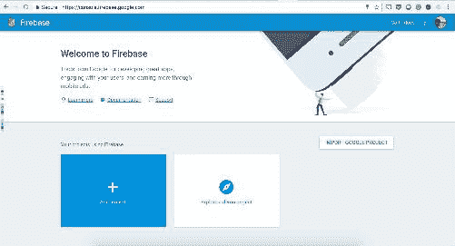
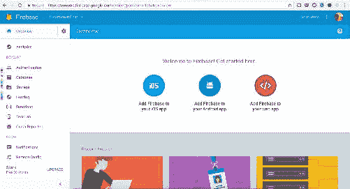
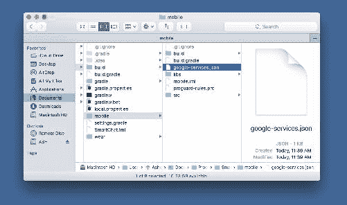
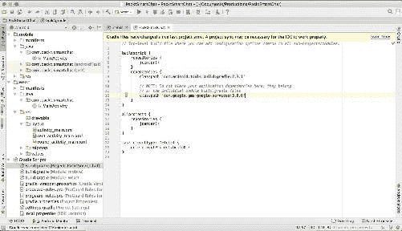
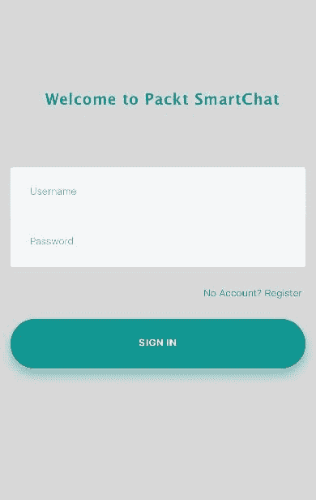
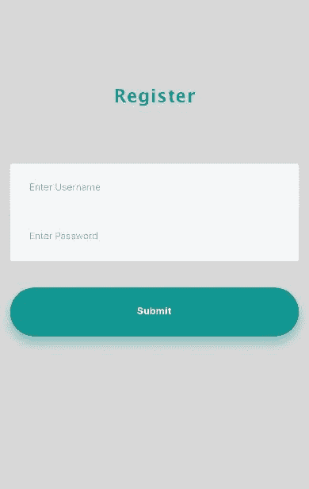
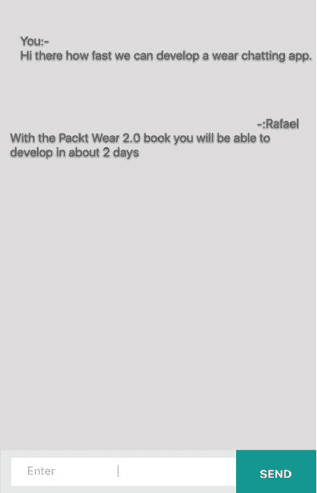
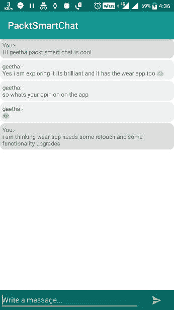

# 八、让我们以一种聪明的方式聊天——消息API和更多

创新时代使我们有能力钻研许多新的精明的课题。社交媒体目前是一种密集的传播媒介。纵观在线网络和创新的发展模式，我们可以说社交媒体的信仰体系已经进步并消除了许多沟通困难。大约几十年前，通信媒介是信件。几个世纪前，它是受过训练的鸟。如果我们仍然回头看，我们肯定会得到更多的故事来理解那些日子里人们习惯的交流方式。现在，我们正处于物联网、可穿戴智能设备的时代，以及智能手机的时代，在这个时代，地球上的通信只需几分之一秒。在不详细说明通信的情况下，让我们构建一个移动和穿戴应用程序，展示谷歌穿戴消息应用程序接口的功能，以帮助我们构建一个带有穿戴伴随应用程序的聊天应用程序，来管理和响应接收到的消息。为了支持聊天的过程，我们将在本章中使用谷歌自己的技术 Firebase。我们不会深入探究 Firebase 技术，但我们肯定会了解在移动平台中使用 Firebase 和使用 wear 技术的要点。Firebase 实时数据库在其 hashmap 结构中反映正在更新的数据。本质上，这些是 Firebase 使用的键值对流。数据以最小的互联网带宽需求得到更新，而且是即时更新。

为了支持聊天的过程，我们将在本章中使用谷歌自己的技术——Firebase。我们将理解移动平台的通用注册和登录流程，我们将为所有注册成员留出空间，并通过从列表中选择一个用户，使他们能够单独聊天。

在本章中，我们将探讨以下几点:

*   将 Firebase 配置到您的移动应用程序
*   创建用户界面
*   使用`GoogleApiClient`
*   理解消息应用编程接口
*   处理事件
*   构建磨损模块

现在，让我们了解如何为我们的项目设置 Firebase。在项目中使用 Firebase 技术之前，我们需要执行以下几个步骤。首先，我们需要应用 Firebase 插件，然后应用我们在项目中使用的依赖项。

# 安装 Firebase

要安装 Firebase，请执行以下步骤:

1.  访问 Firebase 控制台[https://console.firebase.google.com](https://console.firebase.google.com):



2.  在控制台中选择“添加项目”，并填写项目的必要信息。成功添加项目后，您将看到以下屏幕:



3.  入门页面帮助您为不同的平台设置项目。让我们选择第二个选项，它说将 Firebase 添加到您的安卓应用程序中:


4.  添加项目包名称，出于进一步的安全目的，您可以添加 SHA-1 指纹，但这是可选的。现在注册应用程序:


5.  下载配置文件。`google-services.json`文件将包含应用程序的所有重要配置，并将其放在项目结构的应用程序目录中。

现在，让我们启动Android Studio并创建项目:


确保包名与 Firebase 控制台中提到的包名相同。

让我们选择既有手机又有穿戴的目标平台:


现在，将空活动添加到移动活动选择器中:


在穿戴活动选择器中选择**空白穿戴活动**，通过Android Studio模板生成空白穿戴活动代码:


现在，命名你的类和 XML 文件，完成Android Studio的项目，为你的手机和穿戴模块生成锅炉。使用文件浏览器或 finder，转到目录结构，复制并粘贴`google-services.json`文件:



由于我们正在一起构建穿戴和移动应用，并且`app`目录名称对于移动项目将是移动的，对于穿戴项目将是穿戴的，因此我们将在移动目录中复制配置文件(`google-services.json`)。

添加配置文件后，是时候添加插件类路径依赖项了:

```java
classpath 'com.google.gms:google-services:3.0.0'

```



现在，在移动 Gradle 模块依赖项中，将插件应用到所有标签范围的底部，如下图所示:


To help Gradle to manage dependencies and the order of events that Gradle uses to build the project, we are supposed to add Google Play services dependencies at the bottom of the Gradle file. However, it will also avoid the conflict with other Google dependencies.

成功同步后，Firebase SDKs 被集成到我们的项目中。现在，我们可以开始使用我们感兴趣的功能。在这个项目中，对于聊天功能的范围，我们将使用 Firebase 实时数据库。让我们将依赖项添加到依赖项中的同一个 gradle 文件中。我们将使用凌空网络库从 Firebase 用户节点获取用户列表。我们需要为材料设计支持添加设计支持库:

```java
compile 'com.firebase:firebase-client-android:2.5.2+'
compile 'com.android.volley:volley:1.0.0'
compile 'com.android.support:design:25.1.1'
compile 'com.android.support:cardview-v7:25.1.1'

```

On off the chance if you see gradle error please add the following packaging in gradle file under dependency section.

`packagingOptions {`
`exclude 'META-INF/DEPENDENCIES.txt'`
`exclude 'META-INF/LICENSE.txt'`
`exclude 'META-INF/NOTICE.txt'`
`exclude 'META-INF/NOTICE'`
`exclude 'META-INF/LICENSE'`
`exclude 'META-INF/DEPENDENCIES'`
`exclude 'META-INF/notice.txt'`
`exclude 'META-INF/license.txt'`
`exclude 'META-INF/dependencies.txt'`
`exclude 'META-INF/LGPL2.1'`
`}`

完成所有必要的项目设置后，让我们对将要构建的聊天应用程序进行概念化。

一个基本的聊天应用程序需要一个注册过程，为了避免匿名聊天，或者至少知道我们在和谁聊天，我们需要发送者和接收者的名字。第一个屏幕将是登录屏幕，用户名和密码字段允许已经注册的用户开始与用户聊天。然后，我们看到注册屏幕上有相同的用户名和密码字段。一旦用户成功注册，我们将要求用户输入凭据，并允许他们访问用户列表屏幕，在那里可以选择他们想与谁聊天。

# 将聊天应用概念化

带有供用户输入凭据的输入字段的登录屏幕如下所示:



带有输入字段的注册屏幕如下所示:



以下屏幕截图显示了显示注册用户列表的用户屏幕:


包含实际聊天消息的聊天屏幕如下所示:



穿戴聊天应用程序在圆形屏幕上会显示如下:


当消息进入手持设备时，它应该通知穿戴者，并且从穿戴者设备，用户应该能够发送对该消息的回复。在本章中，我们将看到一个工作手机和穿戴聊天应用程序。

# 理解数据层

可穿戴数据层应用编程接口是谷歌游戏服务的一部分，该服务建立了手持设备应用程序和穿戴应用程序之间的通信渠道。使用`GoogleApiClient`类，我们可以访问数据层。数据层主要用于穿戴式应用程序与手持设备通信，但不建议将其用于连接网络。当我们使用构建器模式创建`GoogleAPIClient`类时，我们将把`Wearable.API`附加到`addAPI`方法上。当我们在`GoogleApiclient`中添加多个 API 时，客户端实例有可能失败进入`onConnection`失败回调。通过`addApiIfAvailable()`添加一个 API 是一个很好的方法。这将解决大部分的艰苦工作；如果可用的话，它将添加应用编程接口。使用`addConnectionCallbacks`添加所有这些之后，我们可以处理数据层事件。我们需要通过调用`connect()`方法来启动客户端实例的连接。成功连接后，我们可以使用数据层应用编程接口。

# 数据层事件

事件允许开发人员监听通信通道中发生的事情。成功的通信信道将能够在呼叫完成时发送呼叫状态。这些事件将允许开发者监控无线通信信道中的所有状态变化和数据变化。数据层应用编程接口返回未完成事务的待定结果，如`putdataitem()`。当事务未完成时，挂起的结果将在后台自动排队，如果我们不处理它，这个操作将在后台完成。但是，需要处理待定的结果；挂起的结果将等待结果状态，它有两种方法来同步和异步等待结果。

如果数据层代码在用户界面线程中运行，我们应该避免阻塞对数据层应用编程接口的调用。使用对`pendingresult`对象的异步回调，我们将能够检查状态和其他重要信息:

```java
pendingResult.setResultCallback(new ResultCallback<DataItemResult>() {
    @Override
    public void onResult(final DataItemResult result) {
        if(result.getStatus().isSuccess()) {
            Log.d(TAG, "Data item set: " + 
            result.getDataItem().getUri());
        }
    }
});

```

如果数据层代码在后台服务的单独线程中运行，例如`wearableListenerService`，可以阻止调用，您可以在`pendingresult`对象上调用`await()`方法:

```java
DataItemResult result = pendingResult.await();
if(result.getStatus().isSuccess()) {
    Log.d(TAG, "Data item set: " + result.getDataItem().getUri());
}

```

可以通过两种方式监控数据层事件:

*   创建一个扩展到`WearableListenerService`的类
*   实施`DataApi.DataListener`的活动

在这两个工具中，我们覆盖了处理数据事件的方法。通常，我们需要在可穿戴和手持应用中创建实例。我们可以覆盖应用程序用例所需的方法。本质上，`WearableListenerService`有以下事件:

*   `onDataChanged()`:每当这个被创建、删除或更新时，系统都会触发这个方法。
*   `onMessageReceived()`:节点发送的消息在目标节点触发此事件。
*   `onCapabilityChanged()`:当实例广告的功能在网络上可用时，会触发此事件。我们可以通过调用`isnearby().`来检查附近的节点

这些方法在后台线程中执行。

要创建`WearableListenerService`，我们需要创建一个扩展`WearableListenerService`的类。倾听你感兴趣的事件，比如`onDataChanged()`。在你的安卓清单中声明一个`intent`过滤器，通知系统你的`WearableListenerService`:

```java
public class DataLayerListenerService extends WearableListenerService {

    private static final String TAG = "DataLayerSample";
    private static final String START_ACTIVITY_PATH = "/start-
    activity";
    private static final String DATA_ITEM_RECEIVED_PATH = "/data-item-
    received";

    @Override
    public void onDataChanged(DataEventBuffer dataEvents) {
        if (Log.isLoggable(TAG, Log.DEBUG)) {
            Log.d(TAG, "onDataChanged: " + dataEvents);
        }

        GoogleApiClient googleApiClient = new 
        GoogleApiClient.Builder(this)
                .addApi(Wearable.API)
                .build();

        ConnectionResult connectionResult =
        googleApiClient.blockingConnect(30, TimeUnit.SECONDS);

        if (!connectionResult.isSuccess()) {
            Log.e(TAG, "Failed to connect to GoogleApiClient.");
            return;
        }

        // Loop through the events and send a message
        // to the node that created the data item.
        for (DataEvent event : dataEvents) {
            Uri uri = event.getDataItem().getUri();

            // Get the node id from the host value of the URI
            String nodeId = uri.getHost();
            // Set the data of the message to be the bytes of the URI
            byte[] payload = uri.toString().getBytes();

            // Send the RPC
            Wearable.MessageApi.sendMessage(googleApiClient, nodeId,
            DATA_ITEM_RECEIVED_PATH, payload);
        }
    }
}

```

并在清单中注册服务，如下所示:

```java
<service android:name=".DataLayerListenerService">
  <intent-filter>
      <action 
      android:name="com.google.android.gms.wearable.DATA_CHANGED" />
      <data android:scheme="wear" android:host="*"
               android:path="/start-activity" />
  </intent-filter>
</service>

```

`DATA_CHANGED`动作取代了之前推荐的`BIND_LISTENER`动作，因此只有特定的事件才会通过该路径。在这一章中，当我们正在进行一个现场项目时，我们将会了解更多。

# 能力应用编程接口

该应用编程接口有助于宣传磨损网络中节点提供的功能。功能是应用程序本地的。利用数据层和消息应用编程接口，我们可以与节点通信。为了发现目标节点是否精通于做某些动作，我们必须利用能力 API，例如，在极有可能的情况下，我们需要从 wear 启动一个活动。

要将功能应用编程接口初始化到您的应用程序，请执行以下步骤:

1.  在`res/values`目录下创建一个 XML 配置文件。
2.  添加名为`android_wear_capabilities`的资源。
3.  定义设备提供的功能:

```java
<resources>
    <string-array name="android_wear_capabilities">
        <item>voice_transcription</item>
    </string-array>
</resources>

```

`voice_transcription`的 Java 程序:

```java
private static final String
        VOICE_TRANSCRIPTION_CAPABILITY_NAME = "voice_transcription";

private GoogleApiClient mGoogleApiClient;

...

private void setupVoiceTranscription() {
    CapabilityApi.GetCapabilityResult result =
            Wearable.CapabilityApi.getCapability(
                    mGoogleApiClient, 
                    VOICE_TRANSCRIPTION_CAPABILITY_NAME,
                    CapabilityApi.FILTER_REACHABLE).await();

    updateTranscriptionCapability(result.getCapability());
}

```

现在我们已经有了实现聊天应用程序的所有设置和设计，让我们开始吧。

# 移动应用实现

聊天应用程序的移动应用程序利用了谷歌的 Firebase 实时数据库。每当用户发送消息时，它都会实时反映在 Firebase 控制台中。撇开故事不谈，现在我们已经准备好了所有的屏幕，让我们开始编写代码。

既然我们有了将要使用的颜色，那么让我们在`res`目录下的颜色值 XML 文件中声明颜色:

```java
<?xml version="1.0" encoding="utf-8"?>
<resources>
    <color name="colorPrimary">#129793</color>
    <color name="colorPrimaryDark">#006865</color>
    <color name="colorAccent">#ffaf40</color>
    <color name="white">#fff</color>
</resources>

```

根据设计，我们有一个蓝绿色背景的弯曲边缘按钮。为了制作一个类似的按钮，我们需要在`drawable`目录中创建一个 XML 资源，并将其称为`buttonbg.xml`，这基本上是一个`selector`标签，如下所示:

```java
<?xml version="1.0" encoding="utf-8"?>
<selector xmlns:android="http://schemas.android.com/apk/res/android">

 <!-- When item pressed this item will be triggered -->    <item android:state_pressed="true">
        <shape android:shape="rectangle">
        <corners android:radius="25dp" />
        <solid android:color="@color/colorPrimaryDark" />
    </shape>
   </item>

 <!-- By default the background will be this item -->    <item>
        <shape android:shape="rectangle">
        <corners android:radius="25dp" />
        <solid android:color="@color/colorPrimary" />
    </shape>
</item>

</selector>

```

在`selector`标签内部，我们有一个`item`标签，用来传达状态；任何普通按钮都有状态，如点击、释放和默认。这里，我们采用了默认的按钮背景和按下状态，并使用`item`属性标签，如形状和角落，我们正在雕刻按钮，如设计所示。

为了避免多重变化，我们不会将`MainActivity`重构为`LoginActivity`，而是将`MainActivity`视为`LoginActivity`。现在，在`activity_main.xml`中，让我们将以下代码添加到登录屏幕设计中。为了使屏幕动态，我们将在`scrollview`下添加代码:

```java
<?xml version="1.0" encoding="utf-8"?>
<ScrollView xmlns:android="http://schemas.android.com/apk/res/android"
    xmlns:app="http://schemas.android.com/apk/res-auto"
    xmlns:tools="http://schemas.android.com/tools"
    android:layout_width="match_parent"
    android:layout_height="match_parent"
    android:fillViewport="true"
    android:fitsSystemWindows="true">

    <RelativeLayout
        android:layout_width="match_parent"
        android:layout_height="match_parent">

       <!-- Your design code goes here -->

   </RelativeLayout>
</ScrollView>

```

现在，为了完成登录设计，我们需要两个输入字段，一个按钮实例和一个可点击的链接实例。完整的登录屏幕代码如下所示:

```java
<?xml version="1.0" encoding="utf-8"?>
<ScrollView xmlns:android="http://schemas.android.com/apk/res/android"
    xmlns:app="http://schemas.android.com/apk/res-auto"
    xmlns:tools="http://schemas.android.com/tools"
    android:layout_width="match_parent"
    android:layout_height="match_parent"
    android:fillViewport="true"
    android:fitsSystemWindows="true">

    <RelativeLayout
        android:layout_width="match_parent"
        android:layout_height="match_parent">

        <LinearLayout
            android:layout_width="match_parent"
            android:layout_height="match_parent"
            android:layout_marginTop="25dp"
            android:orientation="vertical">

            <TextView
                android:layout_width="wrap_content"
                android:layout_height="wrap_content"
                android:layout_gravity="center_horizontal"
                android:layout_marginBottom="24dp"

                android:gravity="center|center_horizontal
                |center_vertical"
                android:text="Welcome to Packt Smartchat"
                android:textColor="@color/colorPrimaryDark"
                android:textSize="25sp"
                android:textStyle="bold" />

            <!--  Email Label -->

            <android.support.v7.widget.CardView
                android:layout_margin="10dp"
                android:layout_width="match_parent"
                android:layout_height="wrap_content"
                android:orientation="vertical">

                <LinearLayout
                    android:padding="5dp"
                    android:orientation="vertical"
                    android:layout_width="match_parent"
                    android:layout_height="wrap_content">

                <android.support.design.widget.TextInputLayout
                    android:layout_width="match_parent"
                    android:layout_height="wrap_content"
                    android:layout_marginBottom="8dp"
                    android:layout_marginTop="8dp">

                    <EditText
                        android:id="@+id/input_email"
                        android:layout_width="match_parent"
                        android:layout_height="wrap_content"
                        android:hint="Username"
                        android:inputType="textEmailAddress"
                        android:windowSoftInputMode="stateHidden" />
                </android.support.design.widget.TextInputLayout>

                <!--  Password Label -->
                <android.support.design.widget.TextInputLayout
                    android:layout_width="match_parent"
                    android:layout_height="wrap_content"
                    android:layout_marginBottom="8dp"
                    android:layout_marginTop="8dp"
                    app:passwordToggleEnabled="true">

                    <EditText
                        android:id="@+id/input_password"
                        android:layout_width="match_parent"
                        android:layout_height="wrap_content"
                        android:hint="Password"
                        android:inputType="textPassword"
                        android:windowSoftInputMode="stateHidden" />
                </android.support.design.widget.TextInputLayout>
                </LinearLayout>
            </android.support.v7.widget.CardView>

            <LinearLayout
                android:layout_width="fill_parent"
                android:layout_height="wrap_content"
                android:orientation="horizontal"
                android:paddingBottom="5dp"
                android:paddingTop="8dp">

                <TextView
                    android:id="@+id/register"
                    android:layout_width="wrap_content"
                    android:layout_height="wrap_content"
                    android:layout_weight="1"
                    android:gravity="end"
                    android:padding="5dp"
                    android:text="No Account? Register"
                    android:textSize="14sp" />
            </LinearLayout>

            <Button
                android:id="@+id/btn_login"
                android:layout_width="150dp"
                android:layout_height="wrap_content"
                android:layout_gravity="center"
                android:layout_marginBottom="24dp"
                android:layout_marginTop="24dp"
                android:background="@drawable/buttonbg"
                android:textColor="@color/white"
                android:textStyle="bold"
                android:padding="12dp"
                android:text="Login" />

        </LinearLayout>
    </RelativeLayout>

</ScrollView>

```

让我们创建另一个活动并将其称为`RegistrationActivity`，它具有与登录活动相似的组件需求、两个输入字段和一个按钮。XML 布局的完整代码如下所示:

```java
<?xml version="1.0" encoding="utf-8"?>
<ScrollView xmlns:android="http://schemas.android.com/apk/res/android"
    xmlns:app="http://schemas.android.com/apk/res-auto"
    xmlns:tools="http://schemas.android.com/tools"
    android:layout_width="match_parent"
    android:layout_height="match_parent"
    android:fillViewport="true"
    android:fitsSystemWindows="true">

    <RelativeLayout
        android:layout_width="match_parent"
        android:layout_height="match_parent">

        <LinearLayout
            android:layout_width="match_parent"
            android:layout_height="match_parent"
            android:layout_marginTop="25dp"
            android:orientation="vertical">

            <TextView
                android:layout_width="wrap_content"
                android:layout_height="wrap_content"
                android:layout_gravity="center_horizontal"
                android:layout_marginBottom="24dp"
                android:gravity="center
                |center_horizontal|center_vertical"
                android:text="Register"
                android:textColor="@color/colorPrimaryDark"
                android:textSize="25sp"
                android:textStyle="bold" />

            <!--  Email Label -->

            <android.support.v7.widget.CardView
                android:layout_margin="10dp"
                android:layout_width="match_parent"
                android:layout_height="wrap_content"
                android:orientation="vertical">

                <LinearLayout
                    android:padding="5dp"
                    android:orientation="vertical"
                    android:layout_width="match_parent"
                    android:layout_height="wrap_content">

                    <android.support.design.widget.TextInputLayout
                        android:layout_width="match_parent"
                        android:layout_height="wrap_content"
                        android:layout_marginBottom="8dp"
                        android:layout_marginTop="8dp">

                        <EditText
                            android:id="@+id/input_email"
                            android:layout_width="match_parent"
                            android:layout_height="wrap_content"
                            android:hint="Username"
                            android:inputType="textEmailAddress"
                            android:windowSoftInputMode="stateHidden" 
                        />
                    </android.support.design.widget.TextInputLayout>

                    <!--  Password Label -->
                    <android.support.design.widget.TextInputLayout
                        android:layout_width="match_parent"
                        android:layout_height="wrap_content"
                        android:layout_marginBottom="8dp"
                        android:layout_marginTop="8dp"
                        app:passwordToggleEnabled="true">

                        <EditText
                            android:id="@+id/input_password"
                            android:layout_width="match_parent"
                            android:layout_height="wrap_content"
                            android:hint="Password"
                            android:inputType="textPassword"
                            android:windowSoftInputMode="stateHidden" 
                         />
                    </android.support.design.widget.TextInputLayout>
                </LinearLayout>
            </android.support.v7.widget.CardView>

            <LinearLayout
                android:layout_width="fill_parent"
                android:layout_height="wrap_content"
                android:orientation="horizontal"
                android:paddingBottom="5dp"
                android:paddingTop="8dp">

            </LinearLayout>

            <Button
                android:id="@+id/btn_submit"
                android:layout_width="150dp"
                android:layout_height="wrap_content"
                android:layout_gravity="center"
                android:layout_marginBottom="24dp"
                android:layout_marginTop="24dp"
                android:background="@drawable/buttonbg"
                android:textColor="@color/white"
                android:textStyle="bold"
                android:padding="12dp"
                android:text="Submit" />

        </LinearLayout>
    </RelativeLayout>

</ScrollView>

```

现在，让我们创建一个包含用户列表的用户活动列表。称之为`UsersList`活动，它将有一个简单的`ListView`和`TextView`来处理空列表。`UsersListActivity`的完整的 XML 代码如下:

```java
<?xml version="1.0" encoding="utf-8"?>
<LinearLayout xmlns:android="http://schemas.android.com/apk/res/android"
    xmlns:tools="http://schemas.android.com/tools"
    android:layout_width="match_parent"
    android:layout_height="match_parent"
    android:orientation="vertical"
    android:padding="16dp">

    <TextView
        android:id="@+id/noUsersText"
        android:layout_width="match_parent"
        android:layout_height="wrap_content"
        android:text="No users found!"
        android:visibility="gone" />

    <ListView
        android:id="@+id/usersList"
        android:layout_width="match_parent"
        android:layout_height="wrap_content" />

</LinearLayout>

```

为聊天屏幕创建另一个活动。我们称之为`ChatActivity`。在活动 XML 文件中添加以下代码:

```java
<?xml version="1.0" encoding="utf-8"?>
<LinearLayout xmlns:android="http://schemas.android.com/apk/res/android"
    xmlns:tools="http://schemas.android.com/tools"
    android:layout_width="match_parent"
    android:layout_height="match_parent"
    android:background="#ffffff"
    android:orientation="vertical"
    tools:context="com.packt.smartchat.MainActivity">

    <ScrollView
        android:layout_width="match_parent"
        android:layout_weight="20"
        android:layout_height="wrap_content"
        android:id="@+id/scrollView">

        <LinearLayout
            android:layout_width="match_parent"
            android:layout_height="wrap_content"
            android:orientation="vertical"
            android:id="@+id/layout1">
        </LinearLayout>

    </ScrollView>

    <include
        layout="@layout/message_area"
        android:layout_width="match_parent"
        android:layout_height="wrap_content"
        android:gravity="bottom"
        android:layout_marginTop="5dp"/>
</LinearLayout>

```

我们需要包括一个编辑消息的布局。在`layout`目录内创建另一个名为`message_area.xml`的 XML 文件，并添加以下代码:

```java
<?xml version="1.0" encoding="utf-8"?>
<LinearLayout xmlns:android="http://schemas.android.com/apk/res/android"
    android:layout_width="match_parent"
    android:layout_height="match_parent"
    android:background="@color/colorPrimaryDark"
    android:gravity="bottom"
    android:orientation="horizontal">

    <EditText
        android:layout_width="match_parent"
        android:layout_height="wrap_content"
        android:layout_weight="1"
        android:textColorHint="#CFD8DC"
        android:textColor="#CFD8DC"
        android:singleLine="true"
        android:hint="Write a message..."
        android:id="@+id/messageArea"
        android:maxHeight="80dp" />

    <ImageView
        android:layout_width="match_parent"
        android:layout_height="wrap_content"
        android:layout_weight="4"
        android:padding="4dp"
        android:src="@android:drawable/ic_menu_send"
        android:id="@+id/sendButton"/>
</LinearLayout>

```

现在，我们所有的视觉元素都准备好开始编写我们的编程逻辑了。

在我们开始处理活动 Java 文件之前，在清单文件中添加以下权限:

```java
 <uses-permission android:name="android.permission.WAKE_LOCK" />
 <uses-permission android:name="android.permission.INTERNET" />

```

在`MainActivity`文件中，让我们创建所有实例，并将它们映射到我们放在`activity_main.xml`中的它们的 XML 标识。在`MainActivity`类中，在全局范围内声明以下实例:

```java
private TextView mRegister;
private EditText mUsername, mPassword;
private Button mLoginButton;
public String mUserStr, mPassStr;

```

现在，让我们使用`oncreate`方法中的`findViewById()`方法将所有这些实例连接到它们的 XML 可视元素，如下所示:

```java
mRegister = (TextView)findViewById(R.id.register);
mUsername = (EditText)findViewById(R.id.input_email);
mPassword = (EditText)findViewById(R.id.input_password);
mLoginButton = (Button)findViewById(R.id.btn_login);

```

现在，当用户点击注册链接时，应该会将用户带到注册活动。使用`intent`，我们将实现它:

```java
mRegister.setOnClickListener(new View.OnClickListener() {

    @Override
    public void onClick(View v) {
        startActivity(new Intent(MainActivity.this, 
        RegistrationActivity.class));
    }
});

```

通过点击登录按钮，它应该进行网络调用，检查用户是否存在于 Firebase 中，并显示成功后的正确操作。在我们编写登录逻辑之前，让我们编写注册逻辑。

注册时，活动使用`findViewById()`方法连接 Java 文件中的所有组件:

```java
//In Global scope of registration activity 
private EditText mUsername, mPassword;
private Button mSubmitButton;
public String mUserStr, mPassStr;

// Inside the oncreate method
Firebase.setAndroidContext(this);
mUsername = (EditText)findViewById(R.id.input_email);
mPassword = (EditText)findViewById(R.id.input_password);
mSubmitButton = (Button)findViewById(R.id.btn_submit);

```

将点击监听器连接到`mSubmit`并获取`onClick`监听器中的输入，以确保我们没有传递空字符串:

```java
mSubmitButton.setOnClickListener(new View.OnClickListener() {
    @Override
    public void onClick(View v) {
      // Input fields
      // Validation logics
    }
});

```

进行简单的验证检查将使应用程序免受易出错情况的影响。验证和从输入字段获取输入如下:

```java
mSubmitButton.setOnClickListener(new View.OnClickListener() {
    @Override
    public void onClick(View v) {
        mUserStr = mUsername.getText().toString();
        mPassStr = mPassword.getText().toString();

        // Validation
        if(mUserStr.equals("")){
            mUsername.setError("can't be blank");
        }
        else if(mPassStr.equals("")){
            mPassword.setError("can't be blank");
        }
        else if(!mUserStr.matches("[A-Za-z0-9]+")){
            mUsername.setError("only alphabet or number allowed");
        }
        else if(mUserStr.length()<5){
            mUsername.setError("at least 5 characters long");
        }
        else if(mPassStr.length()<5){
            mPassword.setError("at least 5 characters long");
        }
    }
});

```

我们现在需要到达 Firebase 注册用户。在我们继续之前，让我们登录 Firebase 控制台，[https://console.firebase.google.com](https://console.firebase.google.com)，进入我们之前创建的项目。

现在，在左侧菜单上，我们将看到数据库选项并选择它。在规则选项卡中，默认情况下，读写授权设置为`null`。如果您将它更改为`true`将是理想的，但是在您编写生产应用程序时不建议这样做:

```java
{
 "rules": {
 ".read": true,
 ".write": true
 }
}

```

When we set a read and write permission to true, essentially, we are telling Firebase anyone can read and write on the off chance that they have an endpoint URL.

了解公开网址的复杂性后，我们将在项目中使用它。现在，在`mSubmit`点击监听器中，我们将检查一些验证并获取用户名和密码。

我们应该完成`mSubmit`点击监听器的代码。在密码键字段的`else if`实例之后，让我们为所有 Firebase 网络操作做一个其他的例子。我们将制作 Firebase 参考网址，推送子值，并利用`volley`网络图书馆。我们将检查用户名是否存在，如果存在，我们将允许用户使用该应用程序。

这个项目的 Firebase 端点 URL 是[https://packt-wear.firebaseio.com](https://packt-wear.firebaseio.com)，节点名称可以是我们希望为用户添加的任何内容。让我们加上[https://packt-wear.firebaseio.com/users](https://packt-wear.firebaseio.com/users)；代码如下所示:

```java
else {
        final ProgressDialog pd = new 
        ProgressDialog(RegistrationActivity.this);
        pd.setMessage("Loading...");
        pd.show();

        String url = "https://packt-wear.firebaseio.com/users.json";

        StringRequest request = new StringRequest(Request.Method.GET, 
        url, new Response.Listener<String>(){
            @Override
            public void onResponse(String s) {
                Firebase reference = new Firebase("https://packt-
                wear.firebaseio.com/users");
                if(s.equals("null")) {
                    reference.child(mUserStr)
                    .child("password").setValue(mPassStr);
                    Toast.makeText(RegistrationActivity.this, 
                    "registration successful", 
                    Toast.LENGTH_LONG).show();
                }
                else {
                    try {
                        JSONObject obj = new JSONObject(s);

                        if (!obj.has(mUserStr)) {
                            reference.child(mUserStr)
                            .child("password").setValue(mPassStr);
                            Toast.makeText(RegistrationActivity.this,   
                            "registration successful", 
                            Toast.LENGTH_LONG).show();
                        } else {
                            Toast.makeText(RegistrationActivity.this, 
                            "username already exists", 
                            Toast.LENGTH_LONG).show();
                        }

                    } catch (JSONException e) {
                        e.printStackTrace();
                    }
                }

                pd.dismiss();
            }

        },new Response.ErrorListener(){
            @Override
            public void onErrorResponse(VolleyError volleyError) {
                System.out.println("" + volleyError );
                pd.dismiss();
            }
        });

        RequestQueue rQueue = 
        Volley.newRequestQueue(RegistrationActivity.this);
        rQueue.add(request);
    }
}

```

使用`volley`，我们可以添加请求队列，并以非常高效的方式处理网络请求。

现在，完整的注册活动类如下所示:

```java
public class RegistrationActivity extends AppCompatActivity {

    private EditText mUsername, mPassword;
    private Button mSubmitButton;
    public String mUserStr, mPassStr;

    @Override
    protected void onCreate(Bundle savedInstanceState) {
        super.onCreate(savedInstanceState);
        setContentView(R.layout.activity_registration);

        mUsername = (EditText)findViewById(R.id.input_email);
        mPassword = (EditText)findViewById(R.id.input_password);
        mSubmitButton = (Button)findViewById(R.id.btn_submit);

        Firebase.setAndroidContext(this);

        mSubmitButton.setOnClickListener(new View.OnClickListener() {
            @Override
            public void onClick(View v) {
                mUserStr = mUsername.getText().toString();
                mPassStr = mPassword.getText().toString();

                // Validation
                if(mUserStr.equals("")){
                    mUsername.setError("can't be blank");
                }
                else if(mPassStr.equals("")){
                    mPassword.setError("can't be blank");
                }
                else if(!mUserStr.matches("[A-Za-z0-9]+")){
                    mUsername.setError("only alphabet or number 
                    allowed");
                }
                else if(mUserStr.length()<5){
                    mUsername.setError("at least 5 characters long");
                }
                else if(mPassStr.length()<5){
                    mPassword.setError("at least 5 characters long");
                }else {
                    final ProgressDialog pd = new 
                    ProgressDialog(RegistrationActivity.this);
                    pd.setMessage("Loading...");
                    pd.show();

                    String url = "https://packt-
                    wear.firebaseio.com/users.json";

                    StringRequest request = new StringRequest
                    (Request.Method.GET, url, 
                    new Response.Listener<String>(){
                        @Override
                        public void onResponse(String s) {
                            Firebase reference = new Firebase
                        ("https://packt-wear.firebaseio.com/users");
                            if(s.equals("null")) {
                                reference.child(mUserStr)
                                .child("password").setValue(mPassStr);
                                Toast.makeText
                                (RegistrationActivity.this, 
                                "registration successful", 
                                Toast.LENGTH_LONG).show();
                            }
                            else {
                                try {
                                    JSONObject obj = new JSONObject(s);

                                    if (!obj.has(mUserStr)) {
                                        reference.child(mUserStr)
                                        .child("password")
                                        .setValue(mPassStr);
                                        Toast.makeText
                                        (RegistrationActivity.this, 
                                        "registration successful", 
                                        Toast.LENGTH_LONG).show();
                                    } else {
                                        Toast.makeText
                                        (RegistrationActivity.this, 
                                        "username already exists", 
                                        Toast.LENGTH_LONG).show();
                                    }

                                } catch (JSONException e) {
                                    e.printStackTrace();
                                }
                            }

                            pd.dismiss();
                        }

                    },new Response.ErrorListener(){
                        @Override
                        public void onErrorResponse(VolleyError    
                        volleyError) {
                            System.out.println("" + volleyError );
                            pd.dismiss();
                        }
                    });

                    RequestQueue rQueue = 
                    Volley.newRequestQueue
                    (RegistrationActivity.this);
                    rQueue.add(request);
                }
            }
        });

    }
}

```

现在我们跳转到`MainActivity`进行用户登录逻辑。

在我们继续之前，让我们用静态实例创建一个类，如下所示:

```java
public class User {
    static String username = "";
    static String password = "";
    static String chatWith = "";
}

```

现在，正如我们在注册屏幕中看到的，让我们使用`volley`库在登录屏幕中验证它，让我们检查用户名是否存在。如果拥有有效密码的有效用户登录，我们将不得不允许该用户进入聊天屏幕。下面的代码进入登录点击监听器:

```java
   mUserStr = mUsername.getText().toString();
    mPassStr = mPassword.getText().toString();

    if(mUserStr.equals("")){
        mUsername.setError("Please enter your username");
    }
    else if(mPassStr.equals("")){
        mPassword.setError("can't be blank");
    }
    else{
        String url = "https://packt-wear.firebaseio.com/users.json";
        final ProgressDialog pd = new 
        ProgressDialog(MainActivity.this);
        pd.setMessage("Loading...");
        pd.show();

        StringRequest request = new StringRequest(Request.Method.GET, 
        url, new Response.Listener<String>(){
            @Override
            public void onResponse(String s) {
                if(s.equals("null")){
                    Toast.makeText(MainActivity.this, "user not found", 
                    Toast.LENGTH_LONG).show();
                }
                else{
                    try {
                        JSONObject obj = new JSONObject(s);

                        if(!obj.has(mUserStr)){
                            Toast.makeText(MainActivity.this, "user not 
                            found", Toast.LENGTH_LONG).show();
                        }
                        else if(obj.getJSONObject(mUserStr)
                        .getString("password").equals(mPassStr)){
                            User.username = mUserStr;
                            User.password = mPassStr;
                            startActivity(new Intent(MainActivity.this, 
                            UsersListActivity.class));
                        }
                        else {
                            Toast.makeText(MainActivity.this, 
                            "incorrect password", Toast
                           .LENGTH_LONG).show();
                        }
                    } catch (JSONException e) {
                        e.printStackTrace();
                    }
                }

                pd.dismiss();
            }
        },new Response.ErrorListener(){
            @Override
            public void onErrorResponse(VolleyError volleyError) {
                System.out.println("" + volleyError);
                pd.dismiss();
            }
        });

        RequestQueue rQueue = 
        Volley.newRequestQueue(MainActivity.this);
        rQueue.add(request);
    }
}

```

完整的课程如下所示:

```java
public class MainActivity extends AppCompatActivity {

    private TextView mRegister;
    private EditText mUsername, mPassword;
    private Button mLoginButton;
    public String mUserStr, mPassStr;

    @Override
    protected void onCreate(Bundle savedInstanceState) {
        super.onCreate(savedInstanceState);
        setContentView(R.layout.activity_main);

        mRegister = (TextView)findViewById(R.id.register);
        mUsername = (EditText)findViewById(R.id.input_email);
        mPassword = (EditText)findViewById(R.id.input_password);
        mLoginButton = (Button)findViewById(R.id.btn_login);

        mRegister.setOnClickListener(new View.OnClickListener() {

            @Override
            public void onClick(View v) {
                startActivity(new Intent(MainActivity.this, 
                RegistrationActivity.class));
            }
        });

        mLoginButton.setOnClickListener(new View.OnClickListener() {
            @Override
            public void onClick(View v) {
                mUserStr = mUsername.getText().toString();
                mPassStr = mPassword.getText().toString();

                if(mUserStr.equals("")){
                    mUsername.setError("Please enter your username");
                }
                else if(mPassStr.equals("")){
                    mPassword.setError("can't be blank");
                }
                else{
                    String url = "https://packt-
                    wear.firebaseio.com/users.json";
                    final ProgressDialog pd = new                 
                    ProgressDialog(MainActivity.this);
                    pd.setMessage("Loading...");
                    pd.show();

                    StringRequest request = new StringRequest
                    (Request.Method.GET, url, 
                    new Response.Listener<String>(){
                        @Override
                        public void onResponse(String s) {
                            if(s.equals("null")){
                                Toast.makeText(MainActivity.this, "user 
                                not found", Toast.LENGTH_LONG).show();
                            }
                            else{
                                try {
                                    JSONObject obj = new JSONObject(s);

                                    if(!obj.has(mUserStr)){

                                    Toast.makeText(MainActivity.this, 
                                    "user not found", 
                                    Toast.LENGTH_LONG).show();
                                    }
                                    else if(obj.getJSONObject(mUserStr)
                                    .getString("password")
                                    .equals(mPassStr)){
                                        User.username = mUserStr;
                                        User.password = mPassStr;
                                        startActivity(new 
                                        Intent(MainActivity.this,    
                                        UsersListActivity.class));
                                    }
                                    else {

                                    Toast.makeText(MainActivity.this, 
                                    "incorrect password", 
                                    Toast.LENGTH_LONG).show();
                                    }
                                } catch (JSONException e) {
                                    e.printStackTrace();
                                }
                            }

                            pd.dismiss();
                        }
                    },new Response.ErrorListener(){
                        @Override
                        public void onErrorResponse(VolleyError 
                        volleyError) {
                            System.out.println("" + volleyError);
                            pd.dismiss();
                        }
                    });

                    RequestQueue rQueue = 
                    Volley.newRequestQueue(MainActivity.this);
                    rQueue.add(request);
                }
            }
        });

    }
}

```

现在，在允许用户成功登录后，我们需要显示一个用户列表，忽略登录的用户。但是用户应该能够看到其他用户列表。现在，让我们开始获取`ListView`中的用户列表。让我们连接组件:

```java
//Instances 
private ListView mUsersList;
private TextView mNoUsersText;
private ArrayList<String> mArraylist = new ArrayList<>();
private int totalUsers = 0;
private ProgressDialog mProgressDialog;

//inside onCreate method 
mUsersList = (ListView)findViewById(R.id.usersList);
mNoUsersText = (TextView)findViewById(R.id.noUsersText);
mProgressDialog = new ProgressDialog(UsersListActivity.this);

mProgressDialog.setMessage("Loading...");
mProgressDialog.show();

```

现在，在`onCreate`方法中，我们将启动`volley`并获取用户列表，如下所示:

```java
String url = "https://packt-wear.firebaseio.com/users.json";
    StringRequest request = new StringRequest(Request.Method.GET, url, 
    new Response.Listener<String>(){
        @Override
        public void onResponse(String s) {
 doOnSuccess(s);
        }
    },new Response.ErrorListener(){
        @Override
        public void onErrorResponse(VolleyError volleyError) {
            System.out.println("" + volleyError);
        }
    });

    RequestQueue rQueue = 
    Volley.newRequestQueue(UsersListActivity.this);
    rQueue.add(request);

    mUsersList.setOnItemClickListener(new 
    AdapterView.OnItemClickListener() {
        @Override
        public void onItemClick(AdapterView<?> parent, View view, int 
        position, long id) {
            User.chatWith = mArraylist.get(position);
            startActivity(new Intent(UsersListActivity.this, 
            ChatActivity.class));
        }
    });

}

```

当我们公开 Firebase 端点的 URL 时，任何人都可以读写端点，如果他们有 URL 的话。我只是使用网址并添加`.json`作为扩展名，以便它返回 JSON 结果。现在，我们需要写下管理成功结果的最后一种方法:

```java
public void doOnSuccess(String s){
    try {
        JSONObject obj = new JSONObject(s);

        Iterator i = obj.keys();
        String key = "";

        while(i.hasNext()){
            key = i.next().toString();

            if(!key.equals(User.username)) {
                mArraylist.add(key);
            }

            totalUsers++;
        }

    } catch (JSONException e) {
        e.printStackTrace();
    }

    if(totalUsers <=1){
        mNoUsersText.setVisibility(View.VISIBLE);
        mUsersList.setVisibility(View.GONE);
    }
    else{
        mNoUsersText.setVisibility(View.GONE);
        mUsersList.setVisibility(View.VISIBLE);
        mUsersList.setAdapter(new ArrayAdapter<String>(this, 
        android.R.layout.simple_list_item_1, mArraylist));
    }

    mProgressDialog.dismiss();
}

```

完整的课程如下所示:

```java
public class UsersListActivity extends AppCompatActivity {

    private ListView mUsersList;
    private TextView mNoUsersText;
    private ArrayList<String> mArraylist = new ArrayList<>();
    private int totalUsers = 0;
    private ProgressDialog mProgressDialog;

    @Override
    protected void onCreate(Bundle savedInstanceState) {
        super.onCreate(savedInstanceState);
        setContentView(R.layout.activity_users_list);
        mUsersList = (ListView)findViewById(R.id.usersList);
        mNoUsersText = (TextView)findViewById(R.id.noUsersText);

        mProgressDialog = new ProgressDialog(UsersListActivity.this);
        mProgressDialog.setMessage("Loading...");
        mProgressDialog.show();

        String url = "https://packt-wear.firebaseio.com/users.json";
        StringRequest request = new StringRequest(Request.Method.GET, 
        url, new Response.Listener<String>(){
            @Override
            public void onResponse(String s) {
                doOnSuccess(s);
            }
        },new Response.ErrorListener(){
            @Override
            public void onErrorResponse(VolleyError volleyError) {
                System.out.println("" + volleyError);
            }
        });

        RequestQueue rQueue = 
        Volley.newRequestQueue(UsersListActivity.this);
        rQueue.add(request);

        mUsersList.setOnItemClickListener(new 
        AdapterView.OnItemClickListener() {
            @Override
            public void onItemClick(AdapterView<?> parent, View view, 
            int position, long id) {
                User.chatWith = mArraylist.get(position);
                startActivity(new Intent(UsersListActivity.this, 
                ChatActivity.class));
            }
        });

    }

    public void doOnSuccess(String s){
        try {
            JSONObject obj = new JSONObject(s);

            Iterator i = obj.keys();
            String key = "";

            while(i.hasNext()){
                key = i.next().toString();

                if(!key.equals(User.username)) {
                    mArraylist.add(key);
                }

                totalUsers++;
            }

        } catch (JSONException e) {
            e.printStackTrace();
        }

        if(totalUsers <=1){
            mNoUsersText.setVisibility(View.VISIBLE);
            mUsersList.setVisibility(View.GONE);
        }
        else{
            mNoUsersText.setVisibility(View.GONE);
            mUsersList.setVisibility(View.VISIBLE);
            mUsersList.setAdapter(new ArrayAdapter<String>(this, 
            android.R.layout.simple_list_item_1, mArraylist));
        }

        mProgressDialog.dismiss();
    }
}

```

现在，我们已经完成了一个流程，这就是`onBoarding`用户，并显示了一个可以聊天的用户列表。现在，是时候研究实际的聊天逻辑了。让我们开始工作`ChatActivity`。

对于消息背景，我们将添加两个可绘制的资源文件:`rounded_corner1.xml`和`rounded_corner2.xml`。让我们为可绘制的资源文件添加 XML 代码:

```java
<?xml version="1.0" encoding="utf-8"?>
<shape xmlns:android="http://schemas.android.com/apk/res/android">
    <solid android:color="#dddddd" />
    <stroke
        android:width="0dip"
        android:color="#dddddd" />
    <corners android:radius="10dip" />
    <padding
        android:bottom="5dip"
        android:left="5dip"
        android:right="5dip"
        android:top="5dip" />
</shape>

```

对于`rounded_corner2.xml`

```java
<?xml version="1.0" encoding="utf-8"?>
<shape xmlns:android="http://schemas.android.com/apk/res/android">
    <solid android:color="#f0f0f0" />
    <stroke
        android:width="0dip"
        android:color="#f0f0f0" />
    <corners android:radius="10dip" />
    <padding
        android:bottom="5dip"
        android:left="5dip"
        android:right="5dip"
        android:top="5dip" />
</shape>

```

现在，让我们声明 Firebase 聊天活动的必要实例:

```java
//Global instances
LinearLayout mLinearlayout;
ImageView mSendButton;
EditText mMessageArea;
ScrollView mScrollview;
Firebase reference1, reference2;

//inside onCreate method 
mLinearlayout = (LinearLayout)findViewById(R.id.layout1);
mSendButton = (ImageView)findViewById(R.id.sendButton);
mMessageArea = (EditText)findViewById(R.id.messageArea);
mScrollview = (ScrollView)findViewById(R.id.scrollView);

Firebase.setAndroidContext(this);
reference1 = new Firebase("https://packt-wear.firebaseio.com/messages/" + User.username + "_" + User.chatWith);
reference2 = new Firebase("https://packt-wear.firebaseio.com/messages/" + User.chatWith + "_" + User.username);

```

点击发送按钮，使用`push()`方法，我们可以用用户名和他们发送的消息更新 Firebase:

```java
mSendButton.setOnClickListener(new View.OnClickListener() {
    @Override
    public void onClick(View v) {
        String messageText = mMessageArea.getText().toString();

        if(!messageText.equals("")){
            Map<String, String> map = new HashMap<String, String>();
            map.put("message", messageText);
 map.put("user", User.username);
            reference1.push().setValue(map);
 reference2.push().setValue(map);
        }
    }
});

```

我们需要从 Firebase `addChildEventListener()`实现回调。在`onChildAdded`方法中，我们可以显示添加的消息。以下代码完成了 Firebase，并为消息添加了背景:

```java
reference1.addChildEventListener(new ChildEventListener() {
    @Override
    public void onChildAdded(DataSnapshot dataSnapshot, String s) {
        Map map = dataSnapshot.getValue(Map.class);
        String message = map.get("message").toString();
        String userName = map.get("user").toString();

        if(userName.equals(User.username)){
 addMessageBox("You:-\n" + message, 1);
        }
        else{
 addMessageBox(User.chatWith + ":-\n" + message, 2);
        }
    }

    @Override
    public void onChildChanged(DataSnapshot dataSnapshot, String s) {

    }

    @Override
    public void onChildRemoved(DataSnapshot dataSnapshot) {

    }

    @Override
    public void onChildMoved(DataSnapshot dataSnapshot, String s) {

    }

    @Override
    public void onCancelled(FirebaseError firebaseError) {

    }
});

```

`addMessageBox`方法改变发送方和接收方消息背景:

```java
public void addMessageBox(String message, int type){
TextView textView = new TextView(ChatActivity.this);
textView.setText(message);
LinearLayout.LayoutParams lp = new LinearLayout.LayoutParams(ViewGroup.LayoutParams.MATCH_PARENT, ViewGroup.LayoutParams.WRAP_CONTENT);
lp.setMargins(0, 0, 0, 10);
textView.setLayoutParams(lp);

    if(type == 1) {
textView.setBackgroundResource(R.drawable.rounded_corner1);
}
    else{
textView.setBackgroundResource(R.drawable.rounded_corner2);
}

    mLinearlayout.addView(textView);
    mScrollview.fullScroll(View.FOCUS_DOWN);
}

```

`ChatActivity`的完整代码如下:

```java
public class ChatActivity extends AppCompatActivity {

    LinearLayout mLinearlayout;
    ImageView mSendButton;
    EditText mMessageArea;
    ScrollView mScrollview;
    Firebase reference1, reference2;

    @Override
    protected void onCreate(Bundle savedInstanceState) {
        super.onCreate(savedInstanceState);
        setContentView(R.layout.activity_chat);

        mLinearlayout = (LinearLayout)findViewById(R.id.layout1);
        mSendButton = (ImageView)findViewById(R.id.sendButton);
        mMessageArea = (EditText)findViewById(R.id.messageArea);
        mScrollview = (ScrollView)findViewById(R.id.scrollView);

        Firebase.setAndroidContext(this);
        reference1 = new Firebase("https://packt-
        wear.firebaseio.com/messages/" + User.username + "_" + 
        User.chatWith);
        reference2 = new Firebase("https://packt-  
        wear.firebaseio.com/messages/" + User.chatWith + "_" + 
        User.username);

        mSendButton.setOnClickListener(new View.OnClickListener() {
            @Override
            public void onClick(View v) {
                String messageText = mMessageArea.getText().toString();

                if(!messageText.equals("")){
                    Map<String, String> map = new HashMap<String, 
                    String>();
                    map.put("message", messageText);
                    map.put("user", User.username);
                    reference1.push().setValue(map);
                    reference2.push().setValue(map);
                }
            }
        });

        reference1.addChildEventListener(new ChildEventListener() {
            @Override
            public void onChildAdded(DataSnapshot dataSnapshot, 
            String s) {
                Map map = dataSnapshot.getValue(Map.class);
                String message = map.get("message").toString();
                String userName = map.get("user").toString();

                if(userName.equals(User.username)){
                    addMessageBox("You:-\n" + message, 1);
                }
                else{
                    addMessageBox(User.chatWith + ":-\n" + message, 2);
                }
            }

            @Override
            public void onChildChanged(DataSnapshot dataSnapshot, 
            String s) {

            }

            @Override
            public void onChildRemoved(DataSnapshot dataSnapshot) {

            }

            @Override
            public void onChildMoved(DataSnapshot dataSnapshot, 
            String s) {

            }

            @Override
            public void onCancelled(FirebaseError firebaseError) {

            }
        });
    }

    public void addMessageBox(String message, int type){
        TextView textView = new TextView(ChatActivity.this);
        textView.setText(message);
        LinearLayout.LayoutParams lp = new LinearLayout
        .LayoutParams(ViewGroup.LayoutParams.MATCH_PARENT, 
        ViewGroup.LayoutParams.WRAP_CONTENT);
        lp.setMargins(0, 0, 0, 10);
        textView.setLayoutParams(lp);

        if(type == 1) {
            textView.setBackgroundResource(R.drawable.rounded_corner1);
        }
        else{
            textView.setBackgroundResource(R.drawable.rounded_corner2);
        }

        mLinearlayout.addView(textView);
        mScrollview.fullScroll(View.FOCUS_DOWN);
    }
}

```

我们有一个完整的移动应用工作聊天模块。现在，让我们为聊天应用程序编写 Wear 模块。

# 穿戴应用实现

穿戴模块的目标是穿戴设备应该接收新消息并在应用程序中显示，用户应该能够从穿戴设备回复该消息。在本文中，我们将了解穿戴和移动应用程序的类和 API，以建立通信。

现在，Android Studio为计时器应用程序生成的样板代码。我们需要做的就是删除所有代码，只保留`onCreate()`方法。稍后在`activity_main.xml`文件中，我们来添加帮助用户聊天的用户界面。在这里，我将有`Edittext`和`Textview`，以及一个向移动设备发送消息的按钮。让我们添加 XML 代码:

```java
<?xml version="1.0" encoding="utf-8"?>
<android.support.wearable.view.BoxInsetLayout xmlns:android="http://schemas.android.com/apk/res/android"
    xmlns:app="http://schemas.android.com/apk/res-auto"
    xmlns:tools="http://schemas.android.com/tools"
    android:id="@+id/container"
    android:layout_width="match_parent"
    android:layout_height="match_parent"
    tools:context="com.packt.smartchat.MainActivity"
    tools:deviceIds="wear">

    <LinearLayout
        android:layout_gravity="center|center_horizontal"
        android:layout_width="match_parent"
        android:layout_height="wrap_content"
        android:orientation="vertical">

        <TextView
            android:id="@+id/text"
            android:layout_width="match_parent"
            android:layout_height="match_parent"
            android:gravity="center"
            android:text="Message"
            android:layout_margin="30dp"
            app:layout_box="all" />

        <EditText
            android:id="@+id/message"
            android:layout_width="match_parent"
            android:layout_height="wrap_content" />

        <Button
            android:id="@+id/send"
            android:layout_gravity="center"
            android:text="Send"
            android:layout_width="wrap_content"
            android:layout_height="wrap_content" />
    </LinearLayout>

</android.support.wearable.view.BoxInsetLayout>

```

现在，用户界面准备好了。当我们想要接收和发送消息到手机时，我们需要编写一个扩展到`WearableListenerService`的服务类，并且该服务类需要在清单中注册:

```java
public class ListenerService extends WearableListenerService {

    @Override
    public void onMessageReceived(MessageEvent messageEvent) {

        if (messageEvent.getPath().equals("/message_path")) {
            final String message = new String(messageEvent.getData());
            Log.v("myTag", "Message path received on watch is: " + 
            messageEvent.getPath());
            Log.v("myTag", "Message received on watch is: " + message);

            // Broadcast message to wearable activity for display
            Intent messageIntent = new Intent();
            messageIntent.setAction(Intent.ACTION_SEND);
            messageIntent.putExtra("message", message);
            LocalBroadcastManager
            .getInstance(this).sendBroadcast(messageIntent);
        }
        else {
            super.onMessageReceived(messageEvent);
        }
    }
}

```

现在，在应用程序标签范围内的清单文件中注册`service`类，如下所示:

```java
<application
    android:allowBackup="true"
    android:icon="@mipmap/ic_launcher"
    android:label="@string/app_name"
    android:supportsRtl="true"
    android:theme="@android:style/Theme.DeviceDefault">

<activity...></activity>

<service android:name=".ListenerService">
 <intent-filter>
 <action android:name="com.google.android.gms.wearable.DATA_CHANGED" />
 <action 
 android:name="com.google.android.gms.wearable.MESSAGE_RECEIVED" />
 <data android:scheme="wear" android:host="*" 
 android:pathPrefix="/message_path" />
 </intent-filter>
</service>

</application>

```

我们正在用最新的标准注册`wear`服务。之前，我们必须使用`BIND_LISTENER` API 注册服务。由于效率低，因此不推荐使用。我们必须使用以前的`DATA_CHANGED`和`MESSAGE_RECEIVED`应用编程接口，因为它们让应用程序监听特定的路径。而`BIND_LISTENER`应用编程接口正在监听广泛的系统消息，这是性能和电池水平的缺陷。以下代码说明了不推荐使用的`BIND_LISTENER`注册:

```java
 <service android:name=".ListenerService">
 <intent-filter>
 <action android:name="com.google.android.gms.wearable.BIND_LISTENER" />
 </intent-filter>
 </service>

```

在清单中注册服务后，我们可以直接在穿戴模块中工作`MainActivity`。在我们开始之前，确保您已经用一个`onCreate`方法删除了`MainActivity`中的所有样板代码，如下所示:

```java
public class MainActivity extends WearableActivity {

    @Override
    protected void onCreate(Bundle savedInstanceState) {
        super.onCreate(savedInstanceState);
        setContentView(R.layout.activity_main);
        setAmbientEnabled();

    }
}

```

连接`MainActivity`中的所有 XML 组件:

```java
mTextView = (TextView)findViewById(R.id.text);
send = (Button) findViewById(R.id.send);
message = (EditText)findViewById(R.id.message);

```

让我们从`GoogleApiClient`开始实现有助于查找连接节点和处理故障场景的接口:

```java
public class MainActivity extends WearableActivity implements GoogleApiClient.ConnectionCallbacks,
        GoogleApiClient.OnConnectionFailedListener  {

                 .......

}

```

实现`ConnectionCallbacks`、`OnConnectionFailedListener`后，我们要从这个界面覆盖几个方法，即`onConnected`、`onConnectionSuspended`、`onConnectionFailed`方法。我们的大部分逻辑将通过`onConnected`方法编程。现在，在`MainActivity`范围内，我们需要编写一个类，用覆盖的`onReceive`方法扩展`BroadcastReciever`来监听消息:

```java
public class MessageReceiver extends BroadcastReceiver {
    @Override
    public void onReceive(Context context, Intent intent) {
        String message = intent.getStringExtra("message");
        Log.v("packtchat", "Main activity received message: " + 
        message);
        // Display message in UI
        mTextView.setText(message);
    }
}

```

按照以下方法注册本地广播接收器:

```java
// Register the local broadcast receiver
IntentFilter messageFilter = new IntentFilter(Intent.ACTION_SEND);
MessageReceiver messageReceiver = new MessageReceiver();
LocalBroadcastManager.getInstance(this).registerReceiver(messageReceiver, messageFilter);

```

用`WEAR_PATH`声明`GoogleApiClient`和节点实例，用于发送移动应用将监听的来自穿戴者的消息:

```java
private Node mNode;
private GoogleApiClient mGoogleApiClient;
private static final String WEAR_PATH = "/from-wear";

```

并在`onCreate`方法中初始化`mGoogleApiclient`:

```java
//Initialize mGoogleApiClient
mGoogleApiClient = new GoogleApiClient.Builder(this)
        .addApi(Wearable.API)
        .addConnectionCallbacks(this)
        .addOnConnectionFailedListener(this)
        .build();

```

在`onConnected`方法中，我们将使用可穿戴节点 API 来获取所有连接的节点。它可以是穿戴设备或移动设备，可以配对使用。使用以下代码，我们将知道哪些穿戴设备是配对的:

```java
@Override
public void onConnected(@Nullable Bundle bundle) {
    Wearable.NodeApi.getConnectedNodes(mGoogleApiClient)
            .setResultCallback(new 
            ResultCallback<NodeApi.GetConnectedNodesResult>() {
                @Override
                public void onResult(NodeApi.GetConnectedNodes
                Result nodes) {
                    for (Node node : nodes.getNodes()) {
                        if (node != null && node.isNearby()) {
                            mNode = node;
                            Log.d("packtchat", "Connected to " + 
                            mNode.getDisplayName());
                        }
                    }
                    if (mNode == null) {
                        Log.d("packtchat", "Not connected!");
                    }
                }
            });
}

```

现在，我们需要将`clicklistener`附加到`send`按钮实例，以便从`edittext`获取值，并将其传递给向移动设备发送消息的方法:

```java
send.setOnClickListener(new View.OnClickListener() {
    @Override
    public void onClick(View v) {
        mMsgStr = message.getText().toString();
        sendMessage(mMsgStr);
    }
});

```

`sendMessage`方法接受一个字符串参数，并将相同的字符串消息作为字节发送到连接的节点。使用`MessageAPI`，我们将消息发送到手机。下面的代码解释了这是如何实现的:

```java
private void sendMessage(String city) {
    if (mNode != null && mGoogleApiClient != null) {
        Wearable.MessageApi.sendMessage(mGoogleApiClient, 
        mNode.getId(), WEAR_PATH, city.getBytes())
                .setResultCallback(new 
                ResultCallback<MessageApi.SendMessageResult>() {
                    @Override
                    public void onResult(MessageApi.SendMessageResult 
                    sendMessageResult) {
                        if (!sendMessageResult.getStatus().isSuccess()) 
                        {
                            Log.d("packtchat", "Failed message: " +

                            sendMessageResult.getStatus()
                            .getStatusCode());
                        } else {
                            Log.d("packtchat", "Message succeeded");
                        }
                    }
                });
    }
}

```

让我们忽略连接和断开`GoogleAPIClient`时寻求帮助的`onstart`和`onstop`方法:

```java
@Override
protected void onStart() {
    super.onStart();
    mGoogleApiClient.connect();
}

@Override
protected void onStop() {
    super.onStop();
    mGoogleApiClient.disconnect();
}

```

完整的磨损模块`MainActivity`代码如下:

```java
public class MainActivity extends WearableActivity implements GoogleApiClient.ConnectionCallbacks,
        GoogleApiClient.OnConnectionFailedListener  {

    private TextView mTextView;
    Button send;
    EditText message;
    String mMsgStr;

    private Node mNode;
    private GoogleApiClient mGoogleApiClient;
    private static final String WEAR_PATH = "/from-wear";

    @Override
    protected void onCreate(Bundle savedInstanceState) {
        super.onCreate(savedInstanceState);
        setContentView(R.layout.activity_main);

        mTextView = (TextView)findViewById(R.id.text);
        send = (Button) findViewById(R.id.send);
        message = (EditText)findViewById(R.id.message);
        setAmbientEnabled();

        //Initialize mGoogleApiClient
        mGoogleApiClient = new GoogleApiClient.Builder(this)
                .addApi(Wearable.API)
                .addConnectionCallbacks(this)
                .addOnConnectionFailedListener(this)
                .build();

        // Register the local broadcast receiver
        IntentFilter messageFilter = new 
        IntentFilter(Intent.ACTION_SEND);
        MessageReceiver messageReceiver = new MessageReceiver();
        LocalBroadcastManager.getInstance(this)
        .registerReceiver(messageReceiver, messageFilter);

        send.setOnClickListener(new View.OnClickListener() {
            @Override
            public void onClick(View v) {
                mMsgStr = message.getText().toString();
                sendMessage(mMsgStr);
            }
        });

    }

    private void sendMessage(String message) {
        if (mNode != null && mGoogleApiClient != null) {
            Wearable.MessageApi.sendMessage(mGoogleApiClient, 
            mNode.getId(), WEAR_PATH, message.getBytes())
                    .setResultCallback(new 
                    ResultCallback<MessageApi.SendMessageResult>() {
                        @Override
                        public void onResult(MessageApi
                        .SendMessageResult sendMessageResult) {
                            if (!sendMessageResult.getStatus()
                            .isSuccess()) {
                                Log.d("packtchat", "Failed message: " +

                                sendMessageResult.getStatus()
                                .getStatusCode());
                            } else {
                                Log.d("packtchat", "Message 
                                succeeded");
                            }
                        }
                    });
        }
    }

    public class MessageReceiver extends BroadcastReceiver {
        @Override
        public void onReceive(Context context, Intent intent) {
            String message = intent.getStringExtra("message");
            Log.v("packtchat", "Main activity received message: " + 
            message);
            // Display message in UI
            mTextView.setText(message);

        }
    }

    @Override
    public void onConnected(@Nullable Bundle bundle) {
        Wearable.NodeApi.getConnectedNodes(mGoogleApiClient)
                .setResultCallback(new 
                 ResultCallback<NodeApi.GetConnectedNodesResult>() {
                    @Override
                    public void 
                    onResult(NodeApi.GetConnectedNodesResult nodes) {
                        for (Node node : nodes.getNodes()) {
                            if (node != null && node.isNearby()) {
                                mNode = node;
                                Log.d("packtchat", "Connected to " + 
                                mNode.getDisplayName());
                            }
                        }
                        if (mNode == null) {
                            Log.d("packtchat", "Not connected!");
                        }
                    }
                });
    }

    @Override
    protected void onStart() {
        super.onStart();
        mGoogleApiClient.connect();
    }

    @Override
    protected void onStop() {
        super.onStop();
        mGoogleApiClient.disconnect();
    }

    @Override
    public void onConnectionSuspended(int i) {

    }

    @Override
    public void onConnectionFailed(@NonNull ConnectionResult 
    connectionResult) {

    }
}

```

穿戴模块已准备好接收消息并将其发送至连接的设备。现在，我们需要升级我们的移动模块来接收和发送消息给穿戴者。

切换到移动模块，创建服务类`WearListner`并覆盖`onMessageReceived`方法，如下所示:

```java
public class WearListner extends WearableListenerService {

    @Override
    public void onMessageReceived(MessageEvent messageEvent) {
        if (messageEvent.getPath().equals("/from-wear")) {
            final String message = new String(messageEvent.getData());
            Log.v("pactchat", "Message path received on watch is: " + 
            messageEvent.getPath());
            Log.v("packtchat", "Message received on watch is: " + 
            message);

            // Broadcast message to wearable activity for display
            Intent messageIntent = new Intent();
            messageIntent.setAction(Intent.ACTION_SEND);
            messageIntent.putExtra("message", message);
            LocalBroadcastManager
            .getInstance(this).sendBroadcast(messageIntent);
        }
        else {
            super.onMessageReceived(messageEvent);
        }
    }
}

```

现在，在应用程序标签范围内的清单中注册这个`WearListner`类:

```java
<service android:name=".WearListner">
    <intent-filter>
        <action 
        android:name="com.google.android.gms.wearable.DATA_CHANGED" />
        <action 
        android:name="com.google.android.gms.wearable.MESSAGE_RECEIVED" 
        />
        <data android:scheme="wear" android:host="*" android:pathPrefix="/from-wear" />
    </intent-filter>
</service>

```

现在，让我们将工作范围切换到移动模块，并添加以下更改，以便与磨损和移动深度链接。
从`ChatActivity`中的`GoogleApiClient`类实现`ConnectionCallbacks`和`OnConnectionFailedListener`接口:

```java
public class ChatActivity extends AppCompatActivity implements
        GoogleApiClient.ConnectionCallbacks,
        GoogleApiClient.OnConnectionFailedListener {
...
}

```

覆盖`ConnectionCallbacks`和`OnConnectionFailedListener`界面的方法，类似于我们对穿戴`MainActivity`所做的:

在`onCreate`方法中初始化`GoogleApiClient`如下:

```java
googleClient = new GoogleApiClient.Builder(this)
        .addApi(Wearable.API)
        .addConnectionCallbacks(this)
        .addOnConnectionFailedListener(this)
        .build();

```

在`ChatActivity`中写入广播接收器类以及我们收到的字符串消息。我们需要通过`addMessageBox`方法，我们已经写好了:

```java
public class MessageReceiver extends BroadcastReceiver {
    @Override
    public void onReceive(Context context, Intent intent) {
        String message = intent.getStringExtra("message");
        Log.v("myTag", "Main activity received message: " + message);
        // Displaysage in UI
        addMessageBox("You:-\n" + message, 1);
        if(!message.equals("")){
            Map<String, String> map = new HashMap<String, String>();
            map.put("message", message);
            map.put("user", User.username);
            reference1.push().setValue(map);
        }
        new SendToDataLayerThread("/message_path","You:-\n" + 
        message).start();
    }
}

```

在`onCreate`方法中注册`MessageReciever`如下:

```java
// Register the local broadcast receiver
IntentFilter messageFilter = new IntentFilter(Intent.ACTION_SEND);
MessageReceiver messageReceiver = new MessageReceiver();
LocalBroadcastManager.getInstance(this).registerReceiver(messageReceiver, messageFilter);

```

注册广播接收器后，编写扩展到`Thread`类的`SendToDataLayerThread`类，用于在单独的线程中承担所有负载，但在 UI 线程上。在`void run`方法中，我们将检查所有连接的节点，并循环通过连接的节点。一旦连接建立，我们将使用`MessageAPI`发送消息，如代码所示。消息应用编程接口`sendMessage`方法寻找某些参数，如`googleclient`，以及连接的节点标识路径，确切地说是我们在穿搭清单和实际消息中注册的字节。使用`SendMessageResult`实例，我们开发人员可以确定从设备触发的消息是否成功到达节点:

```java
class SendToDataLayerThread extends Thread {
    String path;
    String message;

    // Constructor to send a message to the data layer
    SendToDataLayerThread(String p, String msg) {
        path = p;
        message = msg;
    }

    public void run() {
        NodeApi.GetConnectedNodesResult nodes = 
        Wearable.NodeApi.getConnectedNodes(googleClient).await();
        for (Node node : nodes.getNodes()) {
            MessageApi.SendMessageResult result = Wearable.MessageApi
           .sendMessage(googleClient, node.getId(), path, 
           message.getBytes()).await();
            if (result.getStatus().isSuccess()) {
                Log.v("myTag", "Message: {" + message + "} sent to: " + 
                node.getDisplayName());
            } else {
                // Log an error
                Log.v("myTag", "ERROR: failed to send Message");
            }
        }
    }
}

```

我们需要在`chatActivity`中的一些方法中初始化`sendtoDatalayer`线程:

```java
@Override
public void onConnected(@Nullable Bundle bundle) {
    String message = "Conected";
    //Requires a new thread to avoid blocking the UI
    new SendToDataLayerThread("/message_path", message).start();
}

```

当`reference1`被一些子事件更新时，我们需要将消息添加到`sendToDatalayer`线程中:

```java
reference1.addChildEventListener(new ChildEventListener() {
    @Override
    public void onChildAdded(DataSnapshot dataSnapshot, String s) {
        Map map = dataSnapshot.getValue(Map.class);
        String message = map.get("message").toString();
        String userName = map.get("user").toString();
        mMessageArea.setText("");
        if(userName.equals(User.username)){
            addMessageBox("You:-\n" + message, 1);
            new SendToDataLayerThread("/message_path","You:-\n" + 
            message).start();

        }
        else{
            addMessageBox(User.chatWith + ":-\n" + message, 2);
            new SendToDataLayerThread("/message_path", User.chatWith + 
            ":-\n" + message).start();

        }
    }

```

为连接和断开`GoogleApiClient`添加以下回调，在`ChatActivity`中添加回调:

```java
@Override
protected void onStart() {
    super.onStart();
    googleClient.connect();
}

@Override
protected void onStop() {
    if (null != googleClient && googleClient.isConnected()) {
        googleClient.disconnect();
    }
    super.onStop();
}

```

聊天应用程序通过穿戴和移动交互完成。聊天活动收到的每条消息都会发送给穿戴者，并且穿戴者的回复会更新到移动设备。

显示两个用户之间基本对话的聊天屏幕如下所示:



圆形表盘手表的佩戴应用屏幕如下所示:


# 摘要

在本章中，我们已经看到了如何利用 Firebase 实时数据库作为聊天媒介。我们组装了一个简单的消息应用程序，可以从穿戴设备发送回复。这个项目有足够的空间来增强项目的元素。我们已经看到了聊天应用程序如何通过穿戴设备和手持设备交叉发送和接收消息。我们从头开始构想了一个聊天应用程序，并为节点设置了数据层事件，以便相互通信。消息应用编程接口的基本思想是加强我们对可穿戴通信的理解。`GoogleApiClient`类在 Play 服务中也扮演了一个值得注意的角色。

在下一章中，我们将了解通知、Firebase 函数以及如何使用 Firebase 函数触发推送通知。