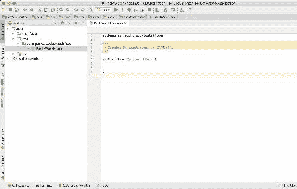

# 十、只是你的一张脸——WatchFace 服务

表盘，也称为表盘，是时钟的一部分，用移动的指针显示固定数字的时间。钟面的外观可以用各种艺术手法和创意来设计。设计一个常规的手表表面是一门美丽的艺术；一个表脸艺术家将知道如何雕刻和设计传统可佩戴手表的表脸。在 Android Wear 中，这个过程非常相似，只是你作为表脸的制造者，手中不会有任何工具，而是需要知道需要扩展哪项服务，以及哪段代码可以帮助你定制表脸的观感。手表表面将显示时间和日期。在这里，在安卓穿戴中，手表表面可以是模拟的，也可以是数字的。

安卓穿戴手表脸是包装在可穿戴应用程序中的服务。当用户选择一个可用的手表表面时，可穿戴设备会显示手表表面，并调用其服务回调方法。定制手表表面使用动态的数字画布，可以整合色调、活动和相关数据。当我们在 Android Wear 中安装一个可穿戴的表脸应用时，我们可以通过表脸选择器在不同的表脸之间切换。用户可以在手机上使用谷歌 Play 商店的配套应用程序在手表上安装各种表盘。在本章中，您将学习以下主题:

*   `CanvasWatchFaceService`类并注册你的手表脸
*   `CanvasWatchFaceService.Engine`和回调方法
*   书写手表表面，处理手势和敲击事件
*   理解观察面元素并初始化它们
*   常见问题

# CanvasWatchFaceService 类并注册您的手表脸

手表脸是具有绘图和视觉渲染能力的服务；所有观看面将延长`CanvasWatchFaceService`等级。`CanvasWatchFaceService`类从`WallpaperSevice`和`WallpaperService.Engine`类中提取其功能。`Engine`类，及其回调方法，帮助手表面对它的生命周期。如果你必须为安卓穿戴做一个手表表面，你应该使用`CanvasWatchfaceService`类，而不是普通的旧香草`WallpaperService`。一个手表脸服务，就像壁纸服务一样，必须只执行`onCreateEngine()`方法。表盘引擎需要实现`onTimeTick()`刷新时间和刷新视图的方法，以及`onAmbientModeChanged(boolean)`在不同版本的表盘之间切换，如灰色模式和彩色表盘。手表面部引擎以类似的方式实现`onInterruptionFilterChanged(int)`来根据用户已经查询了多少信息来更新视图。对于在环境模式下发生的更新，`wake_lock`将被保持，因此设备直到表盘完成绘制过程才会停止。通过几个额外的步骤，在应用程序中注册手表脸与注册壁纸非常相似。然而，观看面部需要`wake_lock`许可，如下所示:

```java
 <uses-permission android:name="android.permission.WAKE_LOCK" />

```

稍后，您的 watch face 服务声明需要预览元数据:

```java
 <meta-data
     android:name="com.google.android.wearable.watchface.preview"
     android:resource="@drawable/preview_face" />
 <meta-data
     android:name=
     "com.google.android.wearable.watchface.preview_circular"
     android:resource="@drawable/preview_face_circular" />

```

最后，我们需要添加一个特殊的目的过滤器。

```java
 <intent-filter>
     <action android:name="android.service.wallpaper.WallpaperService" 
     />
     <category
         android:name=
         "com.google.android.wearable.watchface.category.WATCH_FACE" />
 </intent-filter>

```

# CanvasWatchFaceService。发动机等级

`CanvasWatchFaceService.Engine`类扩展了`WatchFaceService.Engine`类。这里，可以实现在画布上绘制的手表表面的实际实现。我们应该实施`onCreateEngine()`来重建你的具体引擎实施。`CanvasWatchFaceService.Engine`有一个公共构造器，它有几个过程，使我们能够实现 watch face。不如我们研究几个我们将在本章后面部分实现的方法:

*   `void invalidate ()`:计划调用`onDraw(Canvas, Rect)`绘制下一帧。这必须从主线着手。

*   `void onDestroy ()`:在这次回调中，我们可以释放硬件和其他资源，我们将使用这些资源来完成表盘。

*   `void onDraw(Canvas canvas, Rect bounds)`:绘制表盘、所有视觉组件、时钟复活原理等时钟排列都是用这种方法完成的。
*   `void onSurfaceChanged()`:此法取四个参数，`void onSurfaceChanged (SurfaceHolder holder, int organise, int width, int stature)`。`SurfaceHolder`参数使您能够控制表面尺寸和不同的排列。
*   `void postInvalidate()`:发布消息安排调用`onDraw(Canvas, Rect)`绘制下一帧。此外，该方法是线程安全的。我们可以从任何线程调用这个方法。

这些方法在规划你的手表表面时起到了值得注意的作用。让我们开始做一个手表脸。在下面的练习中，我们将了解如何制作数字手表的表面。

# 写自己的手表脸

Android Studio是我们应该用来编写穿戴应用的主要工具，原因有很多；既然我们已经为 Wear 2.0 开发配置了开发环境，这应该不是一个挑战。让我们启动Android Studio，创建一个穿戴项目。

在活动选择器中，选择“不添加活动”。由于手表表面是一种服务，我们不需要活动:


我们在上一节中已经了解到，我们将把类扩展到`CanvasWatchFaceService`，在那里手表表面被绘制在画布上，另一个类是`CanvasWatchFaceService.Engine`**，在那里我们将致力于手表表面的实际实现和我们已经讨论过的更重要的方法。这将有助于我们实现手表表面的必要设置。
现在，让我们在包中创建一个名为`PacktWatchFace`的类文件。**

 **`PacktWatchFace`类将扩展到`CanvasWatchFaceService`类:



创建类文件后，将其扩展到 **`CanvasWatchFaceService`** 类；这是我们将在清单中注册的服务类。在这个类中，我们需要为 Wear 设计实现创建一个子类。之后，在同一个类中，我们需要覆盖一个`onCreateEngine()`方法。

以下代码是耐磨手表表面设计的入口点设置:

```java
public class PacktWatchFace extends CanvasWatchFaceService{

@Override
public Engine onCreateEngine() {
    return new Engine();
}

private class Engine extends CanvasWatchFaceService.Engine{

  }
}

```

`PacktWatchFace`类只实现了一个返回`CanvasWatchFaceService.Engine`实际实现的方法`onCreateEngine()`。现在，是时候在清单文件中注册`watchFace`服务类了。

在清单登记的应用范围内，增加`PacktWatchFace`类:

```java
<service
    android:name=".PacktWatchFace"
    android:label="PacktWatchface Wear"
    android:permission="android.permission.BIND_WALLPAPER" >
    <meta-data
        android:name="android.service.wallpaper"
        android:resource="@xml/watch_face" />
    <meta-data
        android:name="com.google.android.wearable.watchface.preview"
        android:resource="@mipmap/ic_launcher" />
    <meta-data
        android:name=
        "com.google.android.wearable.watchface.preview_circular"
        android:resource="@mipmap/ic_launcher" />

    <intent-filter>
        <action android:name=
        "android.service.wallpaper.WallpaperService" />

        <category android:name=
        "com.google.android.wearable.watchface.category.WATCH_FACE" />
    </intent-filter>
</service>

```

在`res`目录下的`xml`文件夹下创建一个文件，并将其称为`watch_face.xml`。在内部，添加`wallpaper` XML 标签，如下所示:

```java
<?xml version="1.0" encoding="UTF-8"?>
<wallpaper xmlns:android="http://schemas.android.com/apk/res/android"/>

```

Watch face 服务声明需要预览元数据，如前所示。可穿戴设备中的手表拾音器预览版也使用了相同的元数据。这些元素将指定手表脸服务的元数据。观察面将使用预览图像和我们在这个元数据标签中提供的其他信息。

将以下权限添加到您的清单中:

```java
<uses-permission android:name="com.google.android.permission.PROVIDE_BACKGROUND" />
<uses-permission android:name="android.permission.WAKE_LOCK" />

```

让我们为图形元素和年表实例设置全局的基本实例:

```java
//Essential instances
private static Paint textPaint, boldTextPaint, backGround, whiteBackground, darkText;
private static Calendar calendar;
private static final long INTERACTIVE_UPDATE_RATE_MS = TimeUnit.SECONDS.toMillis(1);
private static final int MSG_UPDATE_TIME = 0;

```

在`onDraw`方法中，我们可以画出需要显示在表盘上的内容。绘制的图像将是静态的；我们不能仅仅通过在画布上绘画来使它变得动态。时间序列显示的实现起着重要的作用。

表脸需要显示什么信息和其他化妆品由表脸设计师决定。现在，让我们初始化`onCreate`方法中的所有实例:

```java
backGround = new Paint() {{ setARGB(255, 120, 190, 0); }};
textPaint = createPaint(false, 40);
boldTextPaint = createPaint(true, 40);
whiteBackground = createPaint(false, 0);
darkText = new Paint() {{ setARGB(255, 50, 50, 50); setTextSize(18); }};

```

接下来，我们将编写一个单独的方法`createPaint()`，用于返回所有调用的值:

```java
private Paint createPaint(final boolean bold, final int fontSize) {
    final Typeface typeface = (bold) ? Typeface.DEFAULT_BOLD : 
    Typeface.DEFAULT;

    return new Paint()
    {{
        setARGB(255, 255, 255, 255);
        setTextSize(fontSize);
        setTypeface(typeface);
        setAntiAlias(true);
    }};
}

```

# 处理敲击事件和手势

在表盘上，用户可以进行交互，但是`CanvasWatchService.Engine`类只提供了单一的交互方式，就是一次点击。如果我们想有其他的交互，我们需要覆盖`onTapCommand`方法。我们需要通过更改穿戴应用程序的样式来请求`onCreate`方法中的`tapevents`:

```java
setWatchFaceStyle(new WatchFaceStyle.Builder(PacktWatchFace.this)
    .setAcceptsTapEvents(true)
    .build());

```

此后，我们可以覆盖`onTapCommand()`方法来处理点击事件，并且当用户点击应用程序时，我们可以覆盖该功能来提供功能和服务。

以下显示了用户点击手表时的吐司信息:

```java
@Override
public void onTapCommand(
        @TapType int tapType, int x, int y, long eventTime) {
    switch (tapType) {
        case WatchFaceService.TAP_TYPE_TAP:
            // Handle the tap
            Toast.makeText(PacktWatchFace.this, "Tapped", 
            Toast.LENGTH_SHORT).show();
            break;

        // There are other cases, not mentioned here. <a 
        href="https://developer.android.com/training/wearables/watch-
        faces/interacting.html">Read Android guide</a>
        default:
            super.onTapCommand(tapType, x, y, eventTime);
            break;
    }
}

```

这样，我们可以自定义 tap 功能。默认函数签名给出两个坐标， *x* 和*y*；通过使用这些坐标，我们可以确定用户点击的位置，这有助于 watch face 设计师定制手势并相应地点击事件。

# 支持不同的外形规格

安卓穿戴设备有方形和矩形设计。手表表面开发者有责任让手表表面在外形上看起来一样。大多数为矩形显示器设计的用户界面排列在圆形显示器上会失败，反之亦然。为了解决这个问题，`WallpaperService`引擎有一个称为`onApplyWindowInsets`功能的工具。`onApplyWindowInsets`方法有助于检查设备是否为圆形；通过确定这一点，我们可以画出圆形或方形的表盘:

```java
@Override
public void onApplyWindowInsets(WindowInsets insets) {
    super.onApplyWindowInsets(insets);
    boolean isRound = insets.isRound();

    if(isRound) {
        // Render the Face in round mode.
    } else {
        // Render the Face in square (or rectangular) mode.
    }
}

```

现在，让我们编写一个完整的方法来绘制及时更新的手表表面:

```java
  @Override
        public void onDraw(Canvas canvas, Rect bounds) {
            calendar = Calendar.getInstance();

            canvas.drawRect(0, 0, bounds.width(), bounds.height(), 
            whiteBackground); // Entire background Canvas
            canvas.drawRect(0, 60, bounds.width(), 240, backGround);

            canvas.drawText(new SimpleDateFormat("cccc")
            .format(calendar.getTime()), 130, 120, textPaint);

            // String time = String.format
            ("%02d:%02d", mTime.hour, mTime.minute);
            String time = new SimpleDateFormat
            ("hh:mm a").format(calendar.getTime());
            canvas.drawText(time, 130, 170, boldTextPaint);

            String date = new SimpleDateFormat
            ("MMMM dd, yyyy").format(calendar.getTime());
            canvas.drawText(date, 150, 200, darkText);
        }

```

`onVisibilityChanged`方法有助于注册和注销告知看脸时间的接收器:

```java
@Override
public void onVisibilityChanged(boolean visible) {
    super.onVisibilityChanged(visible);

    if (visible) {
        registerReceiver();
        // Update time zone in case it changed while we weren't 
        visible.
        calendar = Calendar.getInstance();
    } else {
        unregisterReceiver();
    }

    // Whether the timer should be running depends on whether we're 
    visible (as well as
    // whether we're in ambient mode), so we may need to start or stop 
    the timer.
    updateTimer();
}

private void registerReceiver() {
    if (mRegisteredTimeZoneReceiver) {
        return;
    }
    mRegisteredTimeZoneReceiver = true;
    IntentFilter filter = new 
    IntentFilter(Intent.ACTION_TIMEZONE_CHANGED);
    PacktWatchFace.this.registerReceiver(mTimeZoneReceiver, filter);
}

private void unregisterReceiver() {
    if (!mRegisteredTimeZoneReceiver) {
        return;
    }
    mRegisteredTimeZoneReceiver = false;
    PacktWatchFace.this.unregisterReceiver(mTimeZoneReceiver);
}

/**
 * Starts the {@link #mUpdateTimeHandler} timer if it should be running and isn't currently
 * or stops it if it shouldn't be running but currently is.
 */
private void updateTimer() {
    mUpdateTimeHandler.removeMessages(MSG_UPDATE_TIME);
    if (shouldTimerBeRunning()) {
        mUpdateTimeHandler.sendEmptyMessage(MSG_UPDATE_TIME);
    }
}

```

为了确保计时器仅在表盘可见时运行，我们将设置以下配置:

```java
private boolean shouldTimerBeRunning() {
    return isVisible() && !isInAmbientMode();
}

```

要定期更新表盘上的时间，请执行以下操作:

```java
 private void handleUpdateTimeMessage() {
        invalidate();
        if (shouldTimerBeRunning()) {
            long timeMs = System.currentTimeMillis();
            long delayMs = INTERACTIVE_UPDATE_RATE_MS
                    - (timeMs % INTERACTIVE_UPDATE_RATE_MS);
            mUpdateTimeHandler.sendEmptyMessageDelayed(MSG_UPDATE_TIME, 
            delayMs);
        }
    }
}

```

现在，让我们用`WeakReference`类实现来完成代码。弱引用对象将允许引用被最终确定，并且可以在以后被访问。弱引用将使所有以前的弱可达对象最终确定。最后，它会将那些最近清除的弱引用排队，这些引用在引用队列中注册:

```java
private static class EngineHandler extends Handler {
    private final WeakReference<Engine> mWeakReference;

    public EngineHandler(PacktWatchFace.Engine reference) {
        mWeakReference = new WeakReference<>(reference);
    }

    @Override
    public void handleMessage(Message msg) {
        PacktWatchFace.Engine engine = mWeakReference.get();
        if (engine != null) {
            switch (msg.what) {
                case MSG_UPDATE_TIME:
                    engine.handleUpdateTimeMessage();
                    break;
            }
        }
    }
}

```

要添加一个可绘制的，我们可以利用`BitmapFactory`类:

```java
bitmapObj = BitmapFactory.decodeResource(getResources(), R.mipmap.ic_launcher);

// And set the bitmap object in onDraw methods canvas            canvas.drawBitmap(bob, 0, 40, null);

```

现在完整的逻辑定义已经完成，让我们看看 watch face 的完整最终类:

```java
/**
 * Created by ashok.kumar on 27/04/17.
 */

public class PacktWatchFace extends CanvasWatchFaceService{

    //Essential instances
    private static Paint textPaint, boldTextPaint, backGround, 
    whiteBackground, darkText;
    private static Calendar calendar;
    private static final long INTERACTIVE_UPDATE_RATE_MS = 
    TimeUnit.SECONDS.toMillis(1);
    private static final int MSG_UPDATE_TIME = 0;

    @Override
    public Engine onCreateEngine() {
        return new Engine();
    }

    private class Engine extends CanvasWatchFaceService.Engine {

        final Handler mUpdateTimeHandler = new EngineHandler(this);

        final BroadcastReceiver mTimeZoneReceiver = new 
        BroadcastReceiver() {
            @Override
            public void onReceive(Context context, Intent intent) {
                calendar = Calendar.getInstance();
            }
        };
        boolean mRegisteredTimeZoneReceiver = false;

        boolean mLowBitAmbient;

        @Override
        public void onCreate(SurfaceHolder holder) {
            super.onCreate(holder);

            setWatchFaceStyle(new WatchFaceStyle.Builder
            (PacktWatchFace.this)
                    .setCardPeekMode(WatchFaceStyle.PEEK_MODE_SHORT)
                    .setBackgroundVisibility
                    (WatchFaceStyle.BACKGROUND_VISIBILITY_INTERRUPTIVE)
                    .setShowSystemUiTime(false)
                    .build());

            backGround = new Paint() {{ setARGB(255, 120, 190, 0); }};
            textPaint = createPaint(false, 40);
            boldTextPaint = createPaint(true, 40);
            whiteBackground = createPaint(false, 0);
            darkText = new Paint() 
            {{ setARGB(255, 50, 50, 50); setTextSize(18); }};

            setWatchFaceStyle(new WatchFaceStyle.Builder
            (PacktWatchFace.this)
                    .setAcceptsTapEvents(true)
                    .build());

            calendar = Calendar.getInstance();
        }

        private Paint createPaint
        (final boolean bold, final int fontSize) {
            final Typeface typeface = 
            (bold) ? Typeface.DEFAULT_BOLD : Typeface.DEFAULT;

            return new Paint()
            {{
                setARGB(255, 255, 255, 255);
                setTextSize(fontSize);
                setTypeface(typeface);
                setAntiAlias(true);
            }};
        }

        @Override
        public void onTapCommand(
                @TapType int tapType, int x, int y, long eventTime) {
            switch (tapType) {
                case WatchFaceService.TAP_TYPE_TAP:
                    // Handle the tap
                    Toast.makeText(PacktWatchFace.this, 
                    "Tapped", Toast.LENGTH_SHORT).show();
                    break;

                default:
                    super.onTapCommand(tapType, x, y, eventTime);
                    break;
            }
        }

        @Override
        public void onDestroy() {
            mUpdateTimeHandler.removeMessages(MSG_UPDATE_TIME);
            super.onDestroy();
        }

        @Override
        public void onPropertiesChanged(Bundle properties) {
            super.onPropertiesChanged(properties);
            mLowBitAmbient = properties.getBoolean
            (PROPERTY_LOW_BIT_AMBIENT, false);
        }

        @Override
        public void onTimeTick() {
            super.onTimeTick();
            invalidate();
        }

        @Override
        public void onAmbientModeChanged(boolean inAmbientMode) {
            super.onAmbientModeChanged(inAmbientMode);
            if (inAmbientMode) {
                if (mLowBitAmbient) {
                }
                invalidate();
            }

            updateTimer();
        }

        @Override
        public void onDraw(Canvas canvas, Rect bounds) {
            calendar = Calendar.getInstance();

            canvas.drawRect(0, 0, bounds.width(), bounds.height(), 
            whiteBackground); // Entire background Canvas
            canvas.drawRect(0, 60, bounds.width(), 240, backGround);

            canvas.drawText(new SimpleDateFormat("cccc")
            .format(calendar.getTime()), 130, 120, textPaint);

            // String time = String.format("%02d:%02d", mTime.hour, 
            mTime.minute);
            String time = new SimpleDateFormat
            ("hh:mm a").format(calendar.getTime());
            canvas.drawText(time, 130, 170, boldTextPaint);

            String date = new SimpleDateFormat
            ("MMMM dd, yyyy").format(calendar.getTime());
            canvas.drawText(date, 150, 200, darkText);
        }

        @Override
        public void onVisibilityChanged(boolean visible) {
            super.onVisibilityChanged(visible);

            if (visible) {
                registerReceiver();
                calendar = Calendar.getInstance();
            } else {
                unregisterReceiver();
            }

            updateTimer();
        }

        private void registerReceiver() {
            if (mRegisteredTimeZoneReceiver) {
                return;
            }
            mRegisteredTimeZoneReceiver = true;
            IntentFilter filter = new IntentFilter
            (Intent.ACTION_TIMEZONE_CHANGED);
            PacktWatchFace.this.registerReceiver
            (mTimeZoneReceiver, filter);
        }

        private void unregisterReceiver() {
            if (!mRegisteredTimeZoneReceiver) {
                return;
            }
            mRegisteredTimeZoneReceiver = false;
            PacktWatchFace.this.unregisterReceiver(mTimeZoneReceiver);
        }

        private void updateTimer() {
            mUpdateTimeHandler.removeMessages(MSG_UPDATE_TIME);
            if (shouldTimerBeRunning()) {
                mUpdateTimeHandler.sendEmptyMessage(MSG_UPDATE_TIME);
            }
        }

        private boolean shouldTimerBeRunning() {
            return isVisible() && !isInAmbientMode();
        }

        private void handleUpdateTimeMessage() {
            invalidate();
            if (shouldTimerBeRunning()) {
                long timeMs = System.currentTimeMillis();
                long delayMs = INTERACTIVE_UPDATE_RATE_MS
                        - (timeMs % INTERACTIVE_UPDATE_RATE_MS);
                mUpdateTimeHandler
                .sendEmptyMessageDelayed(MSG_UPDATE_TIME, delayMs);
            }
        }
    }

    private static class EngineHandler extends Handler {
        private final WeakReference<Engine> mWeakReference;

        public EngineHandler(PacktWatchFace.Engine reference) {
            mWeakReference = new WeakReference<>(reference);
        }

        @Override
        public void handleMessage(Message msg) {
            PacktWatchFace.Engine engine = mWeakReference.get();
            if (engine != null) {
                switch (msg.what) {
                    case MSG_UPDATE_TIME:
                        engine.handleUpdateTimeMessage();
                        break;
                }
            }
        }
    }
}

```

最终的经过编辑的手表表面将出现在您的佩戴设备的手表表面选取器中:


恭喜你打造了第一张手表脸。

# 理解观察面元素并初始化它们

根据我们正在开发的手表表面类型，我们需要为手表表面规划出某些元素。我们已经看到了构建数字表盘需要什么，但是要构建模拟表盘，我们需要了解一些有助于构建表盘的表盘元素。

一般来说，模拟手表表面是三个基本组件的组合，如下所示:

*   `HOUR_STROKE`
*   `MINUTE_STROKE`
*   `SECOND_TICK_STROKE`

现在，为了构建一个模拟手表表面，我们需要这三个组件，其余的事情将与构建一个数字手表表面几乎相似。在这里，我们需要做更多的努力来制作笔画的动画。
首先，我们需要设计`Strokes`，如下代码所示:

```java
 mHourPaint = new Paint();
 mHourPaint.setColor(mWatchHandColor);
 mHourPaint.setStrokeWidth(HOUR_STROKE_WIDTH);
 mHourPaint.setAntiAlias(true);
 mHourPaint.setStrokeCap(Paint.Cap.ROUND);
 mHourPaint.setShadowLayer(SHADOW_RADIUS, 0, 0, mWatchHandShadowColor);

 mMinutePaint = new Paint();
 mMinutePaint.setColor(mWatchHandColor);
 mMinutePaint.setStrokeWidth(MINUTE_STROKE_WIDTH);
 mMinutePaint.setAntiAlias(true);
 mMinutePaint.setStrokeCap(Paint.Cap.ROUND);
 mMinutePaint.setShadowLayer(SHADOW_RADIUS, 0, 0, 
 mWatchHandShadowColor);

 mSecondPaint = new Paint();
 mSecondPaint.setColor(mWatchHandHighlightColor);
 mSecondPaint.setStrokeWidth(SECOND_TICK_STROKE_WIDTH);
 mSecondPaint.setAntiAlias(true);
 mSecondPaint.setStrokeCap(Paint.Cap.ROUND);
 mSecondPaint.setShadowLayer(SHADOW_RADIUS, 0, 0, 
 mWatchHandShadowColor);

 mTickAndCirclePaint = new Paint();
 mTickAndCirclePaint.setColor(mWatchHandColor);
 mTickAndCirclePaint.setStrokeWidth(SECOND_TICK_STROKE_WIDTH);
 mTickAndCirclePaint.setAntiAlias(true);
 mTickAndCirclePaint.setStyle(Paint.Style.STROKE);
 mTickAndCirclePaint.setShadowLayer(SHADOW_RADIUS, 0, 0, 
 mWatchHandShadowColor);

```

现在，有了之前设计的`Strokes`，我们可以按照自己想要的方式设计和定制表脸，还可以在画布上添加不同的背景，以及其他会让你的模拟手表变得特别的修饰元素。
对于数字表盘，您需要在表盘中使用的文本和其他图形元素的参考。

# 常见问题

佩戴手表面部应用程序不同于佩戴应用程序。手表脸应用遇到的最常见问题是不同的外形，如方形和圆形表盘下巴。为了解决这个问题，程序员必须在手表表面执行之前检测磨损形状因子。正如我们已经讨论过的，`CanvasWatchFaceService.Engine`的`onApplyWindowInsets()`方法有助于找到磨损的形状。
手表脸应用程序一直在运行；本质上看脸服务延伸到壁纸服务。当我们有很多从网络 API 调用中获取数据的服务时，电池可能会很快耗尽。此类服务可能包括:

*   不同的外形
*   电池功效
*   用户界面调节
*   动画太多了
*   我们用来打造耐磨手表表面的素材
*   手表表面取决于硬件

UI 容纳是手表制造商面临的另一个挑战；虽然我们在手表表面风格中启用了`setHotwordIndicator()`，但安卓系统应该能够在我们构建的手表表面上张贴和覆盖通知卡。我们构建的模拟手表必须考虑这种情况，因为模拟手表几乎不愿意调整大小，并且在笔画的连续动画中，它不会与系统通知协调。看脸动画太多不是个好主意。有许多动画会导致中央处理器和图形处理器的性能问题。当我们在 watch face 中有动画时，需要考虑的事情如下:

*   降低动画的帧速率
*   让中央处理器在动画之间休眠
*   减少使用的位图资源的大小
*   绘制缩放位图时禁用抗锯齿
*   将昂贵的操作移出绘图方法

当您的手表表面依靠硬件来显示数据时，您应该确保定期访问硬件并释放它。例如，当我们使用全球定位系统显示当前位置，手表表面持续收听全球定位系统时，我们不仅会耗尽电池，垃圾收集器还会抛出一个错误。

# 交互式WatchFace

每当 Wear 2.0 更新到来时，这一趋势就会发生变化，这将带来新的交互式手表面孔，这些面孔也可以具有独特的交互和风格表达。《戴》的所有手表脸开发者可能不得不开始考虑交互式手表脸。

互动手表脸到底是什么？

这个想法是通过及时给用户提供令人愉快和有用的信息来让用户喜欢和喜爱手表脸，这改变了用户对手表脸的体验。

谷歌提出了以下方法来实现交互式WatchFace:

*   创造性视野
*   不同的外形
*   显示模式
*   系统用户界面元素
*   数据集成手表表面

安卓穿戴提供了一个数字画布，以非常高效的方式表达时间。安卓穿戴还提供在手表表面集成数据，以实现更高级别的个性化。手表表面和设计需要简洁，并应向手表表面用户传达优先信息。

我们知道安卓穿戴的不同外形对于手表脸开发者来说是一个实现上的挑战。手表表面的设计语言应该在不同的外形上保持一致，这是一组常见的颜色、线宽、阴影和其他设计元素。

在磨损 2.0 中，有两种显示模式:

*   有源方式
*   始终活动模式

活动模式是指用户移动手腕或触摸显示屏来浏览时间。佩戴会点亮显示屏，使手表表面活跃。在这种模式下，手表表面可以使用丰富多彩的动画和流畅的设计语言来表达时间和其他信息。

始终激活模式有助于节省电池电量，当穿戴设备进入始终激活模式时，显示功能仅限于黑色、白色和灰色。我们需要仔细设计在总是活动模式下显示什么，看起来类似于手表表面的设计，但颜色和动画较少。

系统用户界面元素指示磨损设备的状态；例如，电池电量和其他系统用户界面元素。手表表面应允许这些指示器显示在佩戴装置的特定位置。

数据集成的手表脸帮助手表脸用户一目了然地查看选择的信息，例如，步数、天气报告等都可以显示在手表脸上。

# 摘要

在本章中，我们探讨了设计手表表面的基本理解，并构建了一个数字手表表面。我们已经了解了`CanvasWatchFaceService`类如何帮助构建手表表面，我们还看到了以下与手表表面相关的概念:

*   `CanvasWatchFaceService`类
*   `canvasWatchFaceService.Engine`方法
*   在佩戴模块清单中注册手表表面
*   处理敲击手势
*   不同的外形
*   将位图图像添加到观察面
*   观看面部元素
*   常见问题
*   交互式WatchFace

制作手表表面是一项优秀的艺术工程，包括我们应该在手表表面表达什么数据，以及时间和日期数据是如何显示的。`ComplicationsAPI`是穿戴 2.0 中的新功能。让我们在下一章中与一些高级概念一起讨论这个问题。**