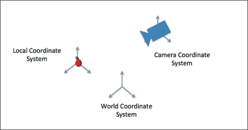
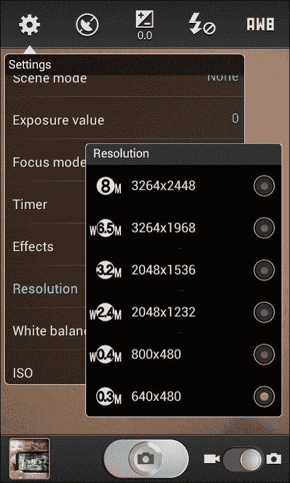

# 第三章。叠加世界

现在，您已经在屏幕上看到了物理世界的视图，我们的下一个目标是在其上叠加数字 3D 模型。增强现实中使用的 3D 叠加不同于 Adobe Photoshop 或类似绘图应用程序可能使用的基本 2D 叠加(在这些应用程序中，我们只调整两个 2D 层的位置)。3D 叠加的概念涉及六个自由度(三维平移和旋转)的内容管理和渲染，如下图所示:


在本章中，我们将引导您了解不同的概念，并向您展示叠加真实内容和虚拟内容的最佳方式。我们将依次描述真实和虚拟相机的概念，如何用我们的场景图引擎进行叠加，并创建高质量的叠加。首先，我们来讨论一下 3D 世界和虚拟相机。

# 三维渲染的构建模块

表示和渲染虚拟 3D 内容的操作方式与在物理世界中用数码相机点击图片的操作方式相同。如果你给你的朋友或风景拍照，你会先用肉眼检查你的拍摄对象，然后通过相机的取景器观察它；只有到那时你才会拍照。这三个不同的步骤对于虚拟 3D 内容是相同的。你没有实体相机拍照，但是你会使用**虚拟相机**T3 来渲染你的场景。您的虚拟相机可以被视为真实相机的数字表示，并且可以以类似的方式进行配置；你可以定位你的相机，改变它的视野，等等。使用虚拟 3D 内容，您可以操纵几何 3D 场景的数字表示，我们简单地称之为您的虚拟 3D 场景或虚拟世界。

下图显示了使用三维计算机图形渲染场景的三个基本步骤，包括:

*   配置虚拟三维场景(对象位置和外观)
*   配置您的虚拟摄像机
*   用虚拟摄像机渲染三维场景


当我们为 AR 进行实时渲染时，您将循环重复这些步骤；对象或相机可以在每个时间帧移动(通常为 20-30 FPS)。

当定位场景中的对象或场景中的相机时，我们需要一种方法来将对象的位置(以及方向)表示为彼此的函数。为此，我们通常使用基于几何数学模型的场景的一些空间表示。最常见的方法是使用**欧几里德几何** 和 **坐标系**。坐标系定义了一种参考空间中的对象(或点)的方法，使用数字表示来定义该位置(**坐标**)。场景中的一切都可以在一个坐标系中定义，坐标系可以使用 **变换**相互关联。

下图显示了最常见的坐标系，它们是:

*   **世界坐标系**:是你参考一切的地。
*   **相机坐标系**:放置在世界坐标系中的，用来渲染你从这个特定视点看到的场景。它有时也被称为眼睛坐标系。
*   **局部坐标系**:以为例，物体坐标系，用于表示物体的三维点。传统上，您使用对象的(几何)中心来定义本地坐标系。



### 类型

坐标系的方向有两种约定:左手和右手。在这两个惯例中，X 在右边，Y 向上。z 在惯用右手的习惯中走向你，在惯用左手的习惯中远离你。

另一个常见的坐标系，这里没有说明，是图像坐标系。如果你编辑你的图片，你可能对这个很熟悉。它从参考原点(通常是图像的左上角或左下角)定义图像每个像素的位置。当您执行 3D 图形渲染时，这是相同的概念。现在我们将重点讨论虚拟相机的特性。

# 真实摄像头和虚拟摄像头

用于三维图形渲染的虚拟摄像机通常由两组主要参数表示:**外在**和**内在**参数。外在参数定义了摄像机在虚拟世界中的位置(从世界坐标系到摄像机坐标系的转换，反之亦然)。固有参数定义相机的投影属性，包括其视野(焦距)、图像中心和倾斜。这两个参数可以用不同的数据结构表示，最常见的是矩阵。

如果开发一款 3D 手机游戏，一般可以自由配置相机，随心所欲；您可以将相机放在运行在地形上的 3D 角色上方(外部)，或者设置一个大的视野来拥有角色和地形的大视图(内部)。然而，当你做增强现实时，选择受到手机中真实相机属性的限制。在 AR 中，我们希望虚拟摄像机的属性与真实摄像机的属性相匹配:视场和摄像机位置。这是增强现实的一个重要元素，我们将在本章中进一步解释如何实现它。

## 相机参数(固有取向)

虚拟相机的外在参数将在后续章节中探讨；它们用于增强现实中的 3D 注册。对于我们的 3D 叠加，我们现在将探索内在的相机参数。

有不同的计算模型来表示虚拟相机(及其参数)，我们将使用最流行的一个:针孔相机模型。针孔相机模型是物理相机的简化模型，其中您认为只有一个点(针孔)是光线进入相机图像的地方。根据这一假设，计算机视觉研究人员将固有参数的描述简化为:

*   **你的(物理或虚拟)镜头的焦距**:这个加上相机中心的大小决定了你相机的 **视野**(**FOV**)——也叫视角。FOV 是您的相机可以看到的物体空间的范围，以弧度(或度数)表示。它可以根据相机传感器的水平、垂直和对角线方向来确定。
*   **图像中心(主点)**:这个适应传感器从中心位置的任何位移。
*   **倾斜因子**:这是用于非方形像素的。

### 注

在非移动相机上，您还应该考虑镜头失真，例如径向和切向失真。它们可以用先进的软件算法建模和校正。手机相机上的镜头畸变通常是通过硬件来校正的。

考虑到所有这些概念，现在让我们做一些练习。

# 使用场景图将三维模型覆盖到相机视图上

在上一章中，您学习了如何设置单个视口和摄像机来渲染视频背景。虽然虚拟相机决定了您的 3D 图形如何投影到 2D 图像平面上，但视口定义了该图像平面到应用程序运行的实际窗口的一部分(或者如果应用程序以全屏模式运行，则是智能手机的整个屏幕)的映射。它确定应用程序窗口中呈现图形的部分。多个视口可以堆叠，可以覆盖相同或不同的屏幕区域，如下图所示。对于基本的增强现实应用程序，通常有两个视口。一个与渲染背景视频的摄像机相关联，一个与渲染 3D 对象的摄像机一起使用。通常，这些视口覆盖整个屏幕。


视窗大小不是以像素为单位定义的，而是无单位的，其宽度和高度定义为 0 到 1，以便能够轻松适应窗口大小的变化。一个摄像机一次与一个视口相关联。

请记住，对于视频背景，我们使用正交相机来避免视频图像的透视缩短。但是，这种视角对于获得正确的三维对象视觉印象至关重要。正交(平行)投影(下图左侧)和透视投影(下图右侧)决定了三维体积如何投影到 2D 图像平面上，如下图所示:


JME 使用右手坐标系(OpenGL 惯例，x 在右手边，y 向上，z 朝向你)。你当然希望 3D 对象随着相机靠近而变大，随着相机远离而变小。那我们该怎么走？没错，您只需添加第二个摄像头(这次是透视摄像头)和一个覆盖整个应用程序窗口的关联视口。

在与本章相关的`SuperimposeJME`项目中，我们又有了安卓活动(`SuperimposeJMEActivity.java`)和一个 JME 应用程序类(`SuperimposeJME.java`)。该应用程序不需要对我们以前的项目进行重大更改；你只需要延长 JME `SimpleApplication`班。在其`simpleInitApp()`启动方法中，我们现在明确区分场景几何的初始化(视频背景:`initVideoBackground()`；3D 前景场景:`initForegroundScene()`)以及相关联的摄像机和视口:

```java
private float mForegroundCamFOVY = 30;
…
public void simpleInitApp() {
…
initVideoBackground(settings.getWidth(), settings.getHeight());
initForegroundScene();	
initBackgroundCamera();
initForegroundCamera(mForegroundCamFOVY);
…
}
```

请注意，相机和视口的初始化顺序很重要。只有当我们首先为视频背景添加摄像机和视口(`initBackgroundCamera()`)然后再添加前景摄像机和视口(`initForegroundCamera()`)时，才能保证我们的 3D 对象渲染在视频背景之上；否则，您只会看到视频背景。

我们现在将使用`initForegroundScene()`将您的第一个 3D 模型添加到场景中。JME 的一个方便的特性是它支持加载外部资产——例如，波前文件(`.obj`)或 Ogre3D 文件(。`mesh.xml`/`.scene`)—包括动画。我们将加载并激活一个绿色忍者，这是 JME 附带的默认资产。

```java
private AnimControl mAniControl;
private AnimChannel mAniChannel;
…
public void initForegroundScene() {
Spatial ninja = assetManager.loadModel("Models/Ninja/Ninja.mesh.xml");
ninja.scale(0.025f, 0.025f, 0.025f);
ninja.rotate(0.0f, -3.0f, 0.0f);
ninja.setLocalTranslation(0.0f, -2.5f, 0.0f);
rootNode.attachChild(ninja);

DirectionalLight sun = new DirectionalLight();
sun.setDirection(new Vector3f(-0.1f, -0.7f, -1.0f));
rootNode.addLight(sun);

mAniControl = ninja.getControl(AnimControl.class);
mAniControl.addListener(this);
mAniChannel = mAniControl.createChannel();
mAniChannel.setAnim("Walk");
mAniChannel.setLoopMode(LoopMode.Loop);
mAniChannel.setSpeed(1f);
}
```

所以在这个方法中你加载一个相对于你的项目的`root` / `asset`文件夹的模型。如果你想加载其他模型，你也可以把它们放在这个`asset`文件夹中。您可以缩放、平移和定向它，然后将其添加到根场景图节点。为了使模型可见，您还可以添加一个从顶部前方照射到模型上的方向光(您可以尝试不添加光并查看结果)。对于动画，访问存储在模型中的“行走”动画序列。为此，您的类需要实现`AnimEventListener`接口，并且您需要使用`AnimControl`实例来访问模型中的动画序列。最后，将“行走”序列分配给一个`AnimChannel`实例，告诉它循环动画，并设置动画速度。

太好了，你现在已经加载了你的第一个 3D 模型，但是你仍然需要在屏幕上显示它。

这就是你在`initForegroundCamera(fovY)`接下来要做的。它负责为三维模型设置透视相机和相关联的视口。由于透视相机的特征在于它能看到的物体空间的空间范围(FOV)，我们将存储在`mForegroundCamFOVY`中的垂直视角传递给该方法。然后它将包含三维模型的场景的根节点附着到前景视口。

```java
public void initForegroundCamera(float fovY) {
  Camera fgCam = new Camera(settings.getWidth(), settings.getHeight());
  fgCam.setLocation(new Vector3f(0f, 0f, 10f));
  fgCam.setAxes(new Vector3f(-1f,0f,0f), new Vector3f(0f,1f,0f), new Vector3f(0f,0f,-1f));
  fgCam.setFrustumPerspective(fovY,  settings.getWidth()/settings.getHeight(), 1, 1000);

  ViewPort fgVP = renderManager.createMainView("ForegroundView", fgCam);
  fgVP.attachScene(rootNode);
  fgVP.setBackgroundColor(ColorRGBA.Blue);
  fgVP.setClearFlags(false, true, false);
}
```

虽然您可以从默认相机中复制一些标准参数(类似于我们对视频背景相机所做的)，但最好知道初始化新相机实际上需要执行哪些步骤。创建用窗口宽度和高度初始化的透视相机后，您可以设置相机的位置(`setLocation()`)和旋转(`setAxes()`)。JME 使用右手坐标系，我们的相机被配置为沿着负 z 轴观察原点，正如上图所示。此外，我们将传递给`setFrustumPerspective()`的视角的垂直角度设置为 30 度，这大致对应于人类看起来自然的视野(与非常宽或非常窄的视野相反)。

之后，我们像设置视频背景摄像机一样设置视口。此外，我们告诉视口删除其深度缓冲区，但保留带有`setClearFlags(false, true, false)`的颜色和模具缓冲区。我们这样做是为了确保我们的 3D 模型始终呈现在包含视频纹理的四边形的前面，无论它们在对象空间中实际上是在该四边形的前面还是后面(请注意，我们所有的图形对象都是在同一世界坐标系中引用的)。我们不清除颜色缓冲区，因为，否则，先前渲染到颜色缓冲区中的视频背景的颜色值将被删除，我们将只看到该视口的背景颜色(蓝色)。如果您现在运行应用程序，您应该能够在视频背景前看到一个行走的忍者，如下图所示:


# 改善叠加

在上一节中，您创建了一个透视相机，它以 30 度的垂直视野渲染您的模型。然而，为了增加场景的真实感，您实际上希望尽可能匹配虚拟和物理相机的视野。一般成像系统(如手机摄像头)的视野取决于摄像头传感器的大小和所用光学器件的焦距。焦距是衡量相机镜头弯曲入射平行光线直到它们聚焦(在传感器平面上)的力度，它基本上是传感器平面和镜头光学元件之间的距离。

FOV 可以通过公式 *α = 2 弧坦 d/2f* 计算，其中 *d* 是摄像机传感器的(垂直、水平或对角线)范围， *2* 是焦距。听起来很简单，对吧？只有一个小小的挑战。您通常不知道(物理)传感器的大小或手机摄像头的焦距。上述公式的好处是，您不需要知道传感器的物理范围或焦距，而是可以在任意坐标(如像素)中计算。而对于传感器尺寸，我们可以很方便的使用摄像头图像的分辨率，这一点你已经在[第二章](2.html "Chapter 2. Viewing the World")、*观世界*中学会查询了。

最棘手的部分是估计你相机的焦距。有一些工具可以帮助你使用一组从已知物体上拍摄的照片来做到这一点；它们被称为相机切除工具(或几何相机校准工具)。我们将向您展示如何使用名为 GML C++相机校准工具箱的工具来实现这一点，您可以从[http://graphics.cs.msu.ru/en/node/909](http://graphics.cs.msu.ru/en/node/909)下载该工具。

安装工具后，打开安卓手机上的标准相机应用。在静态图像设置下，选择您在 JME 应用程序中也使用的相机分辨率，例如 **640 x 480** ，如下图所示:



将`checkerboard_8x5_A4.pdf`文件打印成 A4 大小，放在 GML 校准模式子目录中。用你的相机 app 从不同的视角拍摄至少四张照片(6 到 8 张会更好)。尽量避免非常尖锐的角度，尽量使图像中的棋盘最大化。下图描述了示例图像:


完成后，将图像传输到电脑上的文件夹中(例如，`AR4Android\calibration-images`)。然后，在你的电脑上启动 GML 相机校准应用程序，创建一个新项目。在**新建项目**对话框中输入正确的黑白方块数(例如`5`和`8`，如下图所示:


实际测量正方形尺寸也很重要，因为您的打印机可能会将 PDF 缩放到其纸张大小。然后点击**确定**开始添加刚刚拍摄的图片(导航至**物体检测** | **添加图片**)。添加完所有图像后，导航至**物体检测** | **全部检测**，然后**校准** | **校准**。如果校准成功，您应该会在结果选项卡中看到摄像机参数。我们最感兴趣的是**焦距**部分。虽然 x 轴和 y 轴有两种不同的焦距，但使用第一种也没关系。在使用三星 Galaxy SII 拍摄的图像示例中，最终的焦距为 522 像素。

然后，您可以将这个数字与您的垂直图像分辨率一起插入到前面的公式中，并以弧度为单位检索视图的垂直角度。由于 JME 需要角度的度数，您只需通过应用以下因子将其转换:*180/π*。如果您使用的也是三星 Galaxy SII，则应该会产生大约 50 度的垂直视角，这相当于 35 毫米胶片格式(广角镜头)中大约 28 毫米的焦距。如果将此插入`mForegroundCamFOVY`变量并上传应用，行走的忍者应该会显得更小，如下图所示。当然，你可以通过调整摄像头位置来再次增加它的尺寸。

请注意，您无法在 JME 对物理相机的所有参数进行建模。例如，您无法使用 JME 相机轻松设置物理相机的主点。

### 注

JME 也不支持直接镜头畸变校正。您可以通过涵盖的高级镜头校正技术来解释这些伪像，例如这里:[http://paulbourke.net/miscellaneous/lenscorrection/](http://paulbourke.net/miscellaneous/lenscorrection/)。


# 总结

在本章中，我们向您介绍了 3D 渲染的概念、3D 虚拟相机以及增强现实的 3D 叠加概念。我们介绍了什么是虚拟摄像机及其特点，并描述了摄像机固有参数对精确增强现实的重要性。您还有机会开发您的第一个 3D 叠加，并校准您的移动相机以提高真实感。然而，当您移动手机时，视频背景会发生变化，而 3D 模型会保持不变。在下一章中，我们将处理增强现实应用程序的一个基本模块:注册。