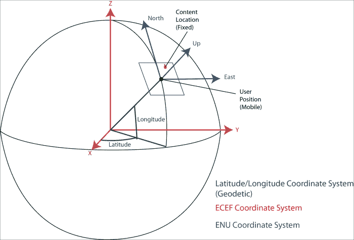
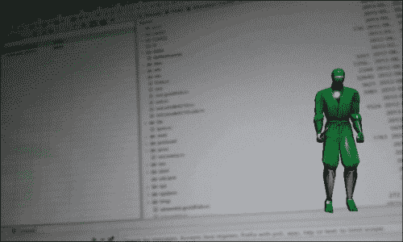
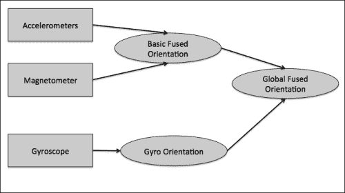

# 四、定位世界

在上一章中，您学习了如何在物理世界的视图上叠加数字内容。但是，如果您带着设备四处移动，将它指向其他地方，虚拟内容将始终停留在屏幕上的相同位置。这不完全是在 AR 中发生的事情。虚拟内容应该相对于物理世界停留在同一个地方(你可以在它周围移动)，而不是固定在你的屏幕上。

在这一章中我们将看看如何在数字内容和物理空间之间实现**动态注册** 。如果在每一个时间步，我们在我们的应用中更新移动对象的位置，我们就会创造出数字内容粘着物理世界的感觉。跟随运动元素在我们场景中的位置可以定义为 **跟踪**，这就是我们在本章中要用到和实现的。我们将使用基于传感器的 AR 来更新数字内容和物理空间之间的注册。由于这些传感器中的一些通常质量较差，我们将向您展示如何使用名为 **传感器融合**的技术来改善您从它们获得的测量。为了使它更实用，我们将向您展示如何使用全局跟踪为最常见的增强现实应用程序之一的简单原型开发基本的构建块:增强现实浏览器(如 Junaio、Layar 或 Wikitude)。

# 知道你在哪里–操作全球定位系统

在本节中，我们将了解移动增强现实和基于传感器的增强现实的主要方法之一(参见第 1 章、*增强现实概念和工具*，该方法使用**全局跟踪**。全局跟踪是指在一个全局参考系(世界坐标系)中进行跟踪，可以涵盖整个地球。我们将首先看位置方面，然后是你手机上的位置传感器，它将用于增强现实。我们将学习如何使用安卓应用编程接口从它那里检索信息，并将它的位置信息集成到 JME。

## 全球定位系统和全球导航卫星系统

因此，我们需要跟踪用户的位置，以了解他/她在现实世界中的位置。虽然我们说我们跟踪用户，但手持增强现实应用程序实际上跟踪设备的位置。

### 注

**用户跟踪与设备跟踪**

要创建一个全沉浸式 AR 应用程序，理想情况下需要知道设备在哪里，用户的身体相对于设备在哪里，用户的眼睛相对于身体在哪里。过去已经探索过这种方法，尤其是头戴式显示器。为此，您需要跟踪用户的头部和身体，并在它们之间进行所有静态转换(校准)。有了移动 AR，我们离那个还很远；也许在未来，用户会戴上装有传感器的眼镜或衣服，这将允许创建更精确的注册和跟踪。

那么我们如何跟踪设备在全球坐标系中的位置呢？当然，你或者你的一些朋友已经使用了全球定位系统来进行汽车导航或者跑步或者徒步旅行。参考地球坐标系，全球定位系统是用于全球跟踪的常见技术的一个示例，如下图所示:


现在大部分手机都配备了 GPS，所以看起来是 AR 中全球追踪的理想技术。全球定位系统是美国版的全球导航卫星系统 ( **全球导航卫星系统**)。技术依赖于一个地理参考卫星星座，它可以使用地理坐标给出你在地球上任何地方的位置。全球定位系统不是唯一的全球导航卫星系统；俄罗斯版( **GLONASS** )目前也在运营，欧洲版(**伽利略**)将在 2020 年左右生效。然而，全球定位系统是目前移动设备上最受支持的全球导航卫星系统，因此当我们谈论使用全球导航卫星系统进行跟踪时，我们将在本书的其余部分使用这个术语。

对于依赖全球定位系统的常见增强现实应用程序，您有两件事要考虑:数字内容位置和设备位置。如果两者都定义在同一个坐标系中，以地球为参照，你就能知道它们是如何相互参照的(见下图中的椭圆图案)。有了这些知识，您就可以在用户坐标系中对 3D 内容的位置进行建模，并根据您的全球定位系统传感器的每次位置更新对其进行更新。因此，如果您向某个对象移动得更近(从下到上)，该对象将看起来更近(并且在图像中更大)，从而再现您在正常世界中的行为。


这项技术的一个小问题与全球定位系统中使用的坐标系有关。使用纬度和经度坐标(基本的全球定位系统提供的)不是使用增强现实最合适的表示。当我们做 3D 图形时，我们习惯于一个欧几里德坐标系来定位数字内容；使用笛卡尔坐标系的位置，以 X、Y 和 Z 坐标定义。因此，我们需要通过将这些全球定位系统坐标转换为更适合的坐标来解决这个问题。

## JME 和全球定位系统–跟踪您设备的位置

谷歌安卓应用编程接口通过位置管理器服务提供对全球定位系统的访问。位置管理器可以为你提供全球定位系统数据，但它也可以使用网络(例如，无线网络和手机网络)来定位你的位置，并给你一个粗略的估计。在安卓术语中，这被称为位置提供者。要使用位置管理器，您需要基于侦听器类在安卓中应用标准的安卓通知机制；`LocationListener`在这种情况下。

所以打开与本章关联的`LocationAccessJME`项目，这是`SuperimposeJME`项目的修改版([第三章](3.html "Chapter 3. Superimposing the World")、*叠加世界*)。

首先，我们需要修改我们的安卓清单，以允许访问全球定位系统传感器。它们是关于全球定位系统(估计位置的质量)的不同质量模式，我们将授权所有这些模式。因此，将这两个权限添加到您的`AndroidManifest.xml`文件中:

```java
  <uses-permission android:name="android.permission.ACCESS_COARSE_LOCATION"/>
  <uses-permission android:name="android.permission.ACCESS_FINE_LOCATION"/>
```

项目和以前一样，有 JME 班(`LocationAccessJME`)、活动班(`LocationAccessJMEActivity`)和`CameraPreview`。我们需要做的是创建一个`LocationListener`类和一个`LocationManager`类，并将其添加到我们的`LocationAccessJMEActivity`类中:

```java
private LocationManager locationManager;
```

在`LocationListener`类内部，我们需要覆盖不同的回调函数:

```java
private LocationListener locListener= new LocationListener() {
  …

  @Override
  public void onLocationChanged(Location location) {
    Log.d(TAG, "onLocation: " + location.toString());
    if ((com.ar4android.LocationAccessJME) app != null) {
      ((com.ar4android.LocationAccessJME) app)
        .setUserLocation(xyzposition);
    }
  }
  …
}
```

`onLocationChanged`回调是对用户位置的任何改变的调用；位置参数包含测量的纬度和经度(以度为单位)。为了将转换后的数据传递给我们的 JME，我们将使用与之前相同的原则:使用 location 作为参数调用我们的 JME 类中的一个方法。所以每次更新用户的位置时都会调用`setUserLocation`，新的值将对 JME 类可用。

接下来，我们需要访问位置管理器服务，并使用`requestLocationUpdates`功能向其注册我们的位置监听器:

```java
  public void onResume() {
    super.onResume();
    …
    locationManager = (LocationManager)getSystemService(LOCATION_SERVICE);
    locationManager.requestLocationUpdates(LocationManager.GPS_PROVIDER, 500, 0, locListener);
  }
```

`requestLocationUpdates`的参数是我们想要使用的提供商的类型(全球定位系统对网络)、更新频率(以毫秒为单位)和位置阈值的变化(以米为单位)作为我们的收听者。

在 JME 方面，我们需要为我们的`LocationAccessJME`类定义两个新变量:

```java
  //the User position which serves as intermediate storage place for the Android
  //Location listener position update
  private Vector3f mUserPosition;

  //A flag indicating if a new Location is available
  private boolean mNewUserPositionAvailable =false;
```

我们还需要定义我们的`setUserLocation`函数，它是从`LocationListener`中的回调调用的:

```java
    public void setUserLocation(Vector3f location) {
    if (!mSceneInitialized) {
      return;
    }
    WSG84toECEF(location,mUserPosition);
    //update your POI location in reference to the user position
    ….
    mNewUserPositionAvailable =true;
  }
```

在这个函数中，我们需要将摄像机的位置从纬度/经度格式转换为笛卡尔坐标系。这样做有不同的技巧；我们将使用来自卫星侦察网站([http://www.satsleuth.com/GPS_ECEF_Datum_transformation.htm](http://www.satsleuth.com/GPS_ECEF_Datum_transformation.htm))的转换算法，将我们的数据转换为 **ECEF** ( **以地球为中心，地球固定**)格式。现在我们在 JME 班有 ECEF 格式的`mUserPosition`。每次用户的位置改变时，都会调用`onLocationChange`方法和`setUserLocation`，我们会得到`mUserPosition`的更新值。现在的问题是，我们如何在场景图中使用这个变量，以及与地理参考数字内容(例如，兴趣点)的关系？

使用的方法是从你当前的位置本地引用你的内容。为此，我们需要使用额外的坐标系:**【ENU】**(**东-北-上**)坐标系。对于您拥有的每个数据(例如，在距离您的位置 5 公里半径处的一定数量的兴趣点)，您可以根据您当前的位置计算位置。让我们看看如何在我们的忍者模型上做到这一点，如以下代码所示:

```java
    Vector3f ECEFNinja=new Vector3f();
    Vector3f ENUNinja=new Vector3f();
    WSG84toECEF(locationNinja,ECEFNinja);
    ECEFtoENU(location,mUserPosition,ECEFNinja,ENUNinja);
    mNinjaPosition.set(ENUNinja.x,0,ENUNinja.y);
```

经纬度格式(`locationNinja`)的忍者位置也转换为 ECEF 格式(`ECEFNinja`)。从那里，使用当前的全球定位系统位置(经纬度格式和 ECEF 格式，位置，mUserPosition)，我们计算忍者在本地坐标系(`ENUNinja`)中的位置。每次用户移动时，他或她的 GPS 位置将被更新，转换为 ECEF 格式，并且内容的本地位置将被更新，这将触发不同的渲染。就这样！我们已经实现了基于全球定位系统的跟踪。下图显示了不同坐标系之间的关系:



唯一剩下的部分是使用新的本地位置更新模型的位置。我们可以通过添加以下代码从`simpleUpdate`函数实现:

```java
    if (mNewUserPositionAvailable) {
      Log.d(TAG,"update user location");
      ninja.setLocalTranslation(mNinjaPosition.x+0.0f,mNinjaPosition.y-2.5f,mNinjaPosition.z+0.0f);
      mNewUserPositionAvailable=false;
    }
```

在真实的 AR 应用程序中，您可能会在 GPS 坐标系中的当前位置周围放置一些 3D 内容，例如让虚拟忍者位于纽约第五街，或者位于巴黎埃菲尔铁塔前。

既然我们想确定，您可以独立于您当前测试和阅读该书的位置(从纽约到廷巴克图)运行该示例。出于教育目的，我们将稍微修改这个演示。我们要做的是在距离你的初始全球定位系统位置 10 米处(也就是全球定位系统第一次更新时)添加忍者模型，方法是在`setUserLocation`中添加以下调用:

```java
    if (firstTimeLocation) {
      //put it at 10 meters
      locationNinja.setLatitude(location.getLatitude()+0.0001);
      locationNinja.setLongitude(location.getLongitude());
      firstTimeLocation=false;
    }
```

测试时间:在你的手机上部署应用程序，然后到外面一个你应该能接收到很好的全球定位系统信号的地方(你应该能看到天空，避免真正的阴天)。别忘了激活设备上的全球定位系统。启动应用程序，四处移动，你应该会看到忍者在移动位置。恭喜你，你为一个增强现实应用开发了你的第一个跟踪实例！

# 知道你在看哪里–操作惯性传感器

有了前面的例子和对全球定位系统位置的访问，我们现在可以更新用户的位置，并且能够在增强现实中进行基本的跟踪。然而，这种跟踪只考虑用户的位置，而不考虑他或她的方位。例如，如果用户旋转手机，什么也不会发生，只有当他在移动时，更改才会生效。为此，我们需要能够为用户检测旋转的变化；这就是惯性传感器的作用。惯性传感器可用于检测方向的变化。

## 了解传感器

在当前一代移动电话中，有三种类型的传感器可用于定位:

*   **加速度计**:这些传感器检测你的手机的适当加速度，也叫 **g 力**加速度。您的手机通常配备多轴模型，为您提供 3 个轴的加速度:手机的俯仰、滚动和倾斜。它们是第一批在手机上可用的传感器，用于基于传感器的游戏，生产成本低廉。有了加速度计和一些基础物理知识，你就能计算出手机的方位。然而，它们相当不准确，测量的数据非常嘈杂(这可能导致您的增强现实应用程序出现抖动)。
*   **磁力计**:它们可以探测地球磁场，就像指南针一样。理想情况下，你可以通过测量三维磁场和知道你的手机指向哪里来获得北向。磁力计面临的挑战是，它们很容易被周围的金属物体分散注意力，例如用户手腕上的手表，然后指示错误的北向。
*   **陀螺仪**:它们利用**科里奥利效应**测量角速度。你手机用的是**多轴微型机械系统** ( **MEMS** )采用一种振动机构。它们比以前的传感器更精确，但它们的主要问题是漂移:测量精度随着时间的推移而降低；短时间后，你的测量开始变得非常不准确。

正如我们将在本章后面看到的，您可以将它们的测量值组合起来，以解决它们的局限性。惯性传感器在进入手机之前已经被广泛使用，最著名的用途是在飞机上测量它们的方位或速度，用作 **惯性测量单元** ( **惯性测量单元**)。由于制造商总是试图降低成本，移动设备之间的传感器质量差异很大。噪音、漂移和不准确性的影响会导致您的增强现实内容在不移动手机的情况下跳跃或移动，或者可能导致内容定位错误。如果你想商业部署你的应用程序，一定要测试一系列的。

## JME 的传感器

谷歌安卓 API 上的传感器访问通过`SensorManager`进行，使用`SensorListener`检索测量值。`SensorManager`不仅能让你接触惯性传感器，还能接触手机上的所有传感器。在安卓应用编程接口中，传感器分为三类:运动传感器、环境传感器和位置传感器。加速度计和陀螺仪被定义为运动传感器；磁力计被定义为位置传感器。Android API 还实现了一些软件传感器，将这些不同传感器(也可能包括位置传感器)的值组合到中，为您提供运动和方向信息。可用的五个运动传感器有:

*   `TYPE_ACCELEROMETER`
*   `TYPE_GRAVITY`
*   `TYPE_GYROSCOPE`
*   `TYPE_LINEAR_ACCELERATION`
*   `TYPE_ROTATION_VECTOR`

请参考谷歌开发者安卓网站[http://Developer . Android . com/guide/topics/sensors/sensors _ overview . html](http://developer.android.com/guide/topics/sensors/sensors_overview.html)，了解它们各自的特点。那么让我们打开`SensorAccessJME`项目。正如我们之前所做的，我们定义了一个`SensorManager`类，并将为每个运动传感器添加一个`Sensor`类:

```java
  private SensorManager sensorManager;
  Sensor rotationVectorSensor;
  Sensor gyroscopeSensor;
  Sensor magneticFieldSensor;
  Sensor accelSensor;
  Sensor linearAccelSensor; 
```

我们还需要定义`SensorListener`，它将处理来自运动传感器的任何传感器变化:

```java
private SensorEventListener sensorListener = new SensorEventListener() {    
    …
@Override
public void onSensorChanged(SensorEvent event) {
  switch(event.sensor.getType()) {
      …
      case Sensor.TYPE_ROTATION_VECTOR:
  float[] rotationVector = {event.values[0],event.values[1], event.values[2]};
  float[] quaternion = {0.f,0.f,0.f,0.f};
  sensorManager.getQuaternionFromVector(quaternion,rotationVector);
  float qw = quaternion[0]; float qx = quaternion[1];
  float qy = quaternion[2];float qz = quaternion[3];
    double headingQ = Math.atan2(2*qy*qw-2*qx*qz , 1 - 2*qy*qy - 2*qz*qz);
  double pitchQ = Math.asin(2*qx*qy + 2*qz*qw); 
  double rollQ = Math.atan2(2*qx*qw-2*qy*qz ,1 - 2*qx*qx - 2*qz*qz);
  if ((com.ar4android.SensorAccessJME) app != null) {
  ((com.ar4android.SensorAccessJME) app).setRotation((float)pitchQ, (float)rollQ, (float)headingQ);
  }
  }
}
};
```

### 注

旋转变化也可以单独用四元数来处理，但是为了更直观的理解，我们明确使用了欧拉角。特权四元数作为合成旋转更容易，他们不会遭受“万向节锁”。

我们的监听器覆盖了两个回调:`onAccuracyChanged`和`onSensorChanged`回调。如果我们注册到`SensorManager`的传感器有任何变化，将会调用`onSensorChanged`频道。这里我们通过查询`event.sensor.getType()`事件的类型来识别哪种类型的传感器发生了变化。对于每种类型的传感器，您可以使用生成的测量值来计算设备的新方向。在本例中，我们将只向您展示如何使用`TYPE_ROTATION_VECTOR`传感器(软件传感器)的值。该传感器传递的方向需要映射，以匹配虚拟摄像机的坐标框架。我们将欧拉角(航向、俯仰和滚转)传递给 JME 应用程序，以在 JME 应用程序的`setRotation`功能中实现这一点(欧拉角只是方向的另一种表示，可以从传感器事件中提供的四元数和轴角表示中计算出来)。

现在，有了我们的`SensorListener`，我们需要查询`SensorManager`来获取传感器服务并初始化我们的传感器。在你的`onCreate`法中加上:

```java
  // sensor setup
  sensorManager = (SensorManager)getSystemService(SENSOR_SERVICE);
  List<Sensor> deviceSensors = sensorManager.getSensorList(Sensor.TYPE_ALL);
  Log.d(TAG, "Integrated sensors:");
  for(int i = 0; i < deviceSensors.size(); ++i ) {
    Sensor curSensor = deviceSensors.get(i);
    Log.d(TAG, curSensor.getName() + "\t" + curSensor.getType() + "\t" + curSensor.getMinDelay() / 1000.0f);
  }
initSensors();
```

访问传感器服务后，我们查询所有可用传感器的列表，并将结果显示在我们的 logcat 上。为了初始化传感器，我们称我们的`initSensors`方法，并将其定义为:

```java
    protected void initSensors(){
      //look specifically for the gyroscope first and then for the rotation_vector_sensor (underlying sensors vary from platform to platform)
    gyroscopeSensor = initSingleSensor(Sensor.TYPE_GYROSCOPE, "TYPE_GYROSCOPE");
    rotationVectorSensor = initSingleSensor(Sensor.TYPE_ROTATION_VECTOR, "TYPE_ROTATION_VECTOR");
    accelSensor = initSingleSensor(Sensor.TYPE_ACCELEROMETER, "TYPE_ACCELEROMETER");
      linearAccelSensor = initSingleSensor(Sensor.TYPE_LINEAR_ACCELERATION, "TYPE_LINEAR_ACCELERATION");
    magneticFieldSensor = initSingleSensor(Sensor.TYPE_MAGNETIC_FIELD, "TYPE_MAGNETIC_FIELD");
    }
```

函数`initSingleSensor`将创建一个`Sensor`的实例，并使用传入参数的特定类型的传感器注册我们之前创建的监听器:

```java
    protected Sensor initSingleSensor( int type, String name ){
    Sensor newSensor = sensorManager.getDefaultSensor(type);
    if(newSensor != null){
      if(sensorManager.registerListener(sensorListener, newSensor, SensorManager.SENSOR_DELAY_GAME)) {
        Log.i(TAG, name + " successfully registered default");
      } else {
        Log.e(TAG, name + " not registered default");
      }
    } …
    return newSensor;
    }
```

当我们退出应用程序时，不应该忘记注销监听器，所以修改您的`onStop`方法如下:

```java
    public void onStop() {
      super.onStop();
      sensorManager.unregisterListener(sensorListener);
    }
```

所以，我们现在是设定在我们的`Activity`中的。在我们的`SensorAccessJME`类中，我们添加了以下变量:

```java
  private Quaternion mRotXYZQ;
  private Quaternion mInitialCamRotation;
  private Quaternion mCurrentCamRotation; 
```

变量`mInitialCamRotation`保存初始相机方向，`mRotXYZQ`保存映射到相机坐标系的传感器方向，`mCurrentCamRotation`保存最终相机旋转，该旋转由`mInitialCamRotation`乘以`mRotXYZQ`组成。`setRotation`功能从安卓活动中获取传感器值，并将其映射到相机坐标系。最后，它将当前旋转值乘以初始相机方向:

```java
  public void setRotation(float pitch, float roll, float heading) {
    if (!mSceneInitialized) {
      return;
    }
    mRotXYZQ.fromAngles(pitch , roll - FastMath.HALF_PI, 0);
    mCurrentCamRotation = mInitialCamRotation.mult(mRotXYZQ);
    mNewCamRotationAvailable = true;
```

作为最后一步，我们需要为我们的虚拟相机使用这个旋转值，就像我们为我们的全球定位系统示例所做的那样。在`simpleUpdate`中，您现在添加:

```java
    if (mNewCamRotationAvailable) {
      fgCam.setAxes(mCurrentCamRotation);
      mNewCamRotationAvailable = false;
    }
```

所以，我们现在准备运行应用程序。重要的是要考虑到，设备的自然方向(定义运动传感器的坐标系)对于所有设备来说并不相同。如果您的设备默认处于纵向模式，并且您将其更改为横向模式，坐标系将会旋转。在我们的示例中，我们明确将设备方向设置为横向。使用此默认定向模式在设备上部署应用程序。您可能需要旋转您的设备才能看到忍者在您的屏幕上移动，如以下截图所示:




# 改进方向跟踪–处理传感器融合

基于传感器的跟踪的局限性之一是传感器。就像我们之前介绍的一样，有些传感器不准确，有噪音，或者有漂移。补偿他们个人问题的一个技巧是结合他们的价值来改善你能得到的整体轮换。这种技术被称为传感器融合。传感器的融合有不同的方法，我们将使用*保罗·劳维茨基*提出的方法，其源代码在[上提供。在本节中，我们将简要解释该技术如何工作，以及如何将传感器融合集成到我们的 JME 增强现实应用中。](http://www.thousand-thoughts.com/2012/03/android-sensor-fusion-tutorial/)

## 简单来说就是传感器融合

保罗·劳维茨基提出的融合算法融合了加速度计、磁力计和陀螺仪传感器数据。类似于安卓应用编程接口的软件传感器，加速度计和磁力计首先被合并以获得绝对方向(磁力计，作为指南针，给你真正的北方)。为了补偿两者的噪声和误差，使用了陀螺仪。陀螺仪精确但随时间漂移，在系统中以高频率使用；加速度计和磁力计被认为是长期的。以下是算法概述:



你可以在保罗·劳维茨基的网页上找到更多关于算法细节的信息。

## JME 的传感器融合

打开`SensorFusionJME`项目。传感器融合使用了一定数量的内部变量，这些变量在`SensorFusionJMEActivity`开始时声明:

```java
// angular speeds from gyro
private float[] gyro = new float[3]; …
```

还要添加算法使用的不同子程序的代码:

*   `calculateAccMagOrientation`:通过加速度计和磁力计测量计算方位角
*   `getRotationVectorFromGyro`:根据陀螺仪角速度测量值计算旋转矢量
*   `gyroFunction`:将基于陀螺仪的方向写入`gyroOrientation`
*   **两个矩阵变换功能** : `getRotationMatrixFromOrientation` 和`matrixMultiplication`

处理的主要部分是在`calculatedFusedOrientationTask`功能中完成的。该功能生成新的融合方向作为`TimerTask`的一部分，这是一个可以在特定时间安排的任务。在这个函数的末尾，我们将把生成的数据传递给我们的 JME 类:

```java
  if ((com.ar4android.SensorFusionJME) app != null) {
        ((com.ar4android.SensorFusionJME) app).setRotationFused((float)(fusedOrientation[2]), (float)(-fusedOrientation[0]), (float)(fusedOrientation[1]));
      }
  }
```

传递给我们的 JME 活动桥函数(`setRotationFused`)的参数是欧拉角格式中定义的融合方向。

我们还需要修改我们的`onSensorChanged`回调来调用`calculatedFusedOrientationTask`使用的子程序:

```java
public void onSensorChanged(SensorEvent event) {
  switch(event.sensor.getType()) {
  case Sensor.TYPE_ACCELEROMETER:
    System.arraycopy(event.values, 0, accel, 0, 3);
    calculateAccMagOrientation();
    break;
  case Sensor.TYPE_MAGNETIC_FIELD:  
    System.arraycopy(event.values, 0, magnet, 0, 3);
    break;
  case Sensor.TYPE_GYROSCOPE:
    gyroFunction(event)
    break;
}
```

对于我们的活动类，最后一个变化是为我们的计时器指定一个任务，指定调度速率，以及第一次执行之前的延迟。在调用`initSensors`后，我们将其添加到我们的`onCreate`方法中:

```java
fuseTimer.scheduleAtFixedRate(new calculateFusedOrientationTask(), 1000, TIME_CONSTANT);
```

在 JME 方面，我们定义了一个新的桥接函数来更新旋转(并再次将传感器方向转换为虚拟摄像机的适当方向):

```java
public void setRotationFused(float pitch, float roll, float heading) {
  if (!mSceneInitialized) {
    return;
  } // pitch: cams x axis roll: cams y axisheading: cams z axis
  mRotXYZQ.fromAngles(pitch + FastMath.HALF_PI , roll - FastMath.HALF_PI, 0);
  mCurrentCamRotationFused = mInitialCamRotation.mult(mRotXYZQ);
  mNewUserRotationFusedAvailable = true;
}
```

我们最终以与`simpleUpdate`中`setRotation`相同的方式使用该功能，用`fgCam.setAxes(mCurrentCamRotationFused)`更新相机方向。现在，您可以部署应用程序并在设备上查看结果。

如果你结合`LocationAccessJME`和`SensorAccessJME`的例子，你现在将得到完整的 6 自由度(6DOF)跟踪，这是一个经典的基于传感器的增强现实应用的基础。

# 为你的增强现实浏览器获取内容——谷歌地图应用编程接口

在知道如何获得您的 GPS 位置和手机方向后，您现在就可以将精彩的内容整合到相机的实时视图中了。亲自探索兴趣点，比如你周围的地标和商店，不是很酷吗？我们现在将向您展示如何集成流行的基于位置的服务，如谷歌位置应用编程接口来实现这一点。为了成功集成到应用程序中，您需要执行以下步骤:

*   查询您当前位置周围的兴趣点
*   解析结果并提取属于兴趣点的信息
*   在您的增强现实视图中可视化信息

在我们开始之前，您必须确保您的应用程序有一个有效的 API 密钥。为此，你还需要一个谷歌账户。你可以在[https://code.google.com/apis/console](https://code.google.com/apis/console)下用你的谷歌账号登录获得。

为了测试您的应用程序，您可以使用默认项目`API Project`或者创建一个新项目。要创建新的应用编程接口密钥，您需要:

1.  点击左侧菜单中的**服务**链接。
2.  激活位置应用编程接口状态开关。
3.  点击左侧菜单上的**应用编程接口访问**菜单项，并查看**简单应用编程接口访问**区域，即可访问您的密钥。

您可以将密钥存储在`LocationAccessJME`项目的`String mPlacesKey = "<YOUR API KEY HERE>"`变量中。

接下来，我们将向您展示如何查询设备位置周围的 poi，并获得一些基本信息，如它们的名称和位置。将这些信息集成到增强现实视图中遵循的原则与 *JME 和全球定位系统-跟踪您设备的位置*一节中描述的原则相同。

## 查询您当前位置周围的兴趣点

在本章之前，您学习了如何获取您在世界上的当前位置(纬度和经度)。现在，您可以使用这些信息来获取您周围的 poi 位置。谷歌位置应用编程接口允许您通过 HTTP 请求查询用户附近的地标和企业，并将结果作为 JSON 或 XML 字符串返回。所有查询都将指向以[https://maps.googleapis.com/maps/api/place/](https://maps.googleapis.com/maps/api/place/)开头的网址。

虽然您可以在网络浏览器中轻松地进行查询，但是您可能希望在您的安卓应用程序中发送请求和处理响应。由于调用一个网址并等待响应可能需要几秒钟的时间，您可能希望以一种不阻止主程序执行的方式来实现这个请求-响应处理。在这里，我们向您展示如何使用线程来实现这一点。

在您的`LocationAccessJME`项目中，您定义了一些新的成员变量，它们负责与谷歌位置应用编程接口的交互。具体来说，您创建了一个用于发送请求的`HttpClient`和一个用于存储关于 poi 的最重要信息的列表`List<POI> mPOIs`。`POI`类是一个简单的助手类，用于存储谷歌位置参考字符串(谷歌位置数据库中的唯一标识符、兴趣点名称、纬度和经度):

```java
private class POI {
  public String placesReference;
  public String name;
  public Location location;
…
}
```

当然，您可以很容易地扩展这个类来保存额外的信息，如街道地址或图像网址。要查询兴趣点，您需要调用`sendPlacesQuery`函数。我们在程序启动时进行调用，但是您可以很容易地定期进行调用(例如，当用户移动一定距离时)或者明确地点击按钮。

```java
public void sendPlacesQuery(final Location location,  final Handler guiHandler) throws Exception  {
Thread t = new Thread() {
public void run() {
  Looper.prepare();
  BufferedReader in = null;
  try {
    String url = "https://maps.googleapis.com/maps/api/place/nearbysearch/json?location=" + location.getLatitude() + "," + location.getLongitude() + "&radius=" +  mPlacesRadius + "&sensor=true&key=" + mPlacesKey;
    HttpConnectionParams.setConnectionTimeout(mHttpClient.getParams(), 10000);
    HttpResponse response;
    HttpGet get = new HttpGet(url);
    response = mHttpClient.execute(get);
    Message toGUI = guiHandler.obtainMessage();
…
guiHandler.sendMessage(toGUI);
…
```

在这个方法中，我们为谷歌位置服务的每个查询创建一个新的线程。这对于不阻塞主程序的执行非常重要。Places API 的响应应该是一个 JSON 字符串，我们将其传递给主线程中的一个`Handler`实例来解析 JSON 结果，接下来我们将讨论这个问题。

## 解析谷歌位置应用编程接口结果

谷歌位置以轻量级 JSON 格式返回其结果(XML 是另一个选项)。您可以使用作为标准安卓包交付的`org.json`库来方便地解析这些结果。

您的查询的典型 JSON 结果如下所示:

```java
{
   …
   "results" : [
      {
         "geometry" : {
            "location" : {
               "lat" : 47.07010720,
               "lng" : 15.45455070
            },
   …
         },
         "name" : "Sankt Leonhard",
         "reference" : "CpQBiQAAADXt6JM47sunYZ8vZvt0GViZDLICZi2JLRdfhHGbtK-ekFMjkaceN6GmECaynOnR69buuDZ6t-PKow-J98l2tFyg3T50P0Fr39DRV3YQMpqW6YGhu5sAzArNzipS2tUY0ocoMNHoNSGPbuuYIDX5QURVgncFQ5K8eQL8OkPST78A_lKTN7icaKQV7HvvHkEQJBIQrx2r8IxIYuaVhL1mOZOsKBoUQjlsuuhqa1k7OCtxThYqVgfGUGw",
         …
      },
…
}
```

在我们的处理程序`placesPOIQueryHandler`的`handleMessage`中，我们将把这个 JSON 字符串解析成一个兴趣点列表，然后可以在您的增强现实视图中可视化:

```java
public void handleMessage(Message msg) {
  try {
    JSONObject response = new JSONObject(msg.obj.toString());
    JSONArray results = response.getJSONArray("results");
    for(int i = 0; i < results.length(); ++i) {
      JSONObject curResult = results.getJSONObject(i);
      String poiName = curResult.getString("name");
      String poiReference = curResult.getString("reference");
      double lat = curResult.getJSONObject("geometry").getJSONObject("location").getDouble("lat");
      double lng = curResult.getJSONObject("geometry").getJSONObject("location").getDouble("lng");
      Location refLoc = new Location(LocationManager.GPS_PROVIDER);
      refLoc.setLatitude(lat);
      refLoc.setLongitude(lng);
      mPOIs.add(new POI(poiReference, poiName, refLoc));
      …
    }
  …
  }
} 
```

就是这样。你现在有了你的基本兴趣点信息，有了纬度和经度信息，你可以很容易地在 JME 实例化新的 3D 对象，并相对于你的相机位置正确定位它们，就像你对忍者所做的那样。您还可以查询关于 poi 的更多详细信息，或者通过各种标准对其进行筛选。有关谷歌位置应用编程接口的更多信息，请访问[https://developers.google.com/places/documentation/](https://developers.google.com/places/documentation/)。

### 类型

如果要在 3D 场景中包含文本，我们建议避免使用 3D 文本对象，因为它们会导致大量额外的多边形需要渲染。请改用位图文本，在可以生成的网格上将其渲染为纹理。

# 总结

在本章中，我们向您介绍了移动增强现实的第一种流行方法:全球定位系统和基于传感器的增强现实。我们介绍了在全局参考框架中跟踪设备位置、动态确定设备方向、提高方向跟踪的健壮性的基本构建模块，最后使用流行的 Google Places API 检索用户周围的 poi 信息，然后将其集成到 ar 视图中。

在下一章中，我们将向您介绍第二种流行的实现移动 ar 的方式:基于计算机视觉的增强现实。