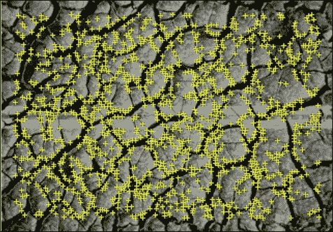
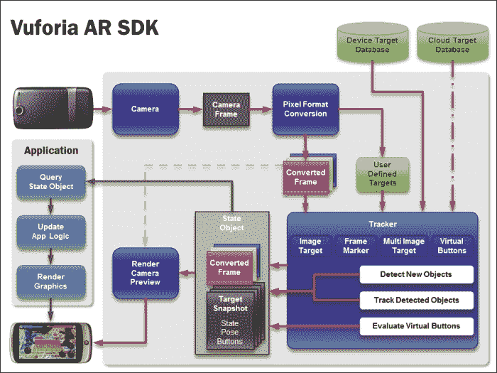
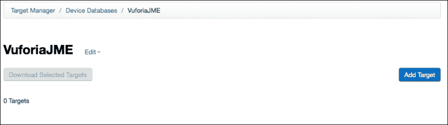
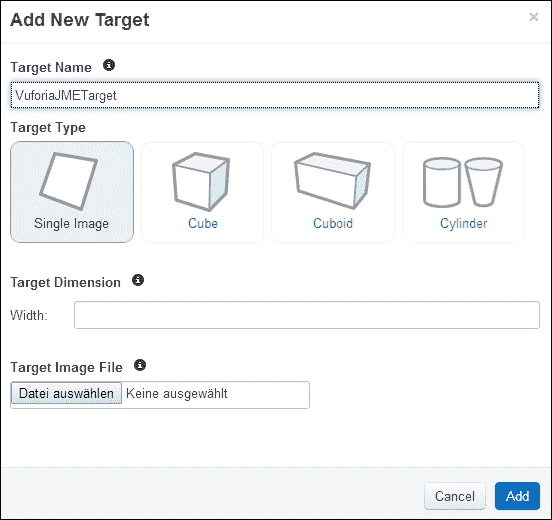

# 五、与好莱坞相同——实物上的虚拟

在前一章中，您了解了实现全球定位系统和基于传感器的增强现实应用的基本构建模块。如果你尝试了我们给出的不同例子，你可能已经注意到在真实空间中获得数字对象的感觉(*注册*)是有效的，但是会变得粗糙和不稳定。这主要是由于智能手机或平板设备中使用的传感器(GPS、加速度计等)的精度问题，以及这些技术的特点(例如陀螺仪漂移、GPS 对卫星能见度的依赖以及其他此类技术)。在本章中，我们将向您介绍一个更强大的解决方案，它是支持移动增强现实的第二种主要方法:**基于计算机视觉的增强现实**。

基于计算机视觉的 AR 不依赖任何外部传感器，而是利用摄像头图像的内容来支持跟踪，这是通过一系列不同的算法进行分析。有了基于计算机视觉的增强现实，你可以在数字世界和物理世界之间获得更好的配准，尽管在处理方面成本稍高。

可能你甚至不知道，你已经看到了基于计算机视觉的注册。如果你去看一部具有大量电影效果的大片动作片，你有时会注意到一些数字内容被覆盖在物理录制集上(例如，假爆炸、假背景和假角色运行)。与增强现实一样，电影行业必须处理数字和物理内容之间的注册，依靠分析记录的图像来恢复跟踪和相机信息(例如，使用匹配移动技术)。然而，与增强现实相比，它是离线完成的，而不是实时完成的，通常依赖于繁重的工作站进行注册和视觉集成。

在本章中，我们将向您介绍不同类型的基于计算机视觉的增强现实跟踪。我们还将向您描述高通公司集成了一个使用良好且高质量的移动增强现实跟踪库，**Vuforia<sup>TM</sup>**T4。有了这个库，我们将能够实现我们的第一个基于计算机视觉的增强现实应用。

# 介绍基于计算机视觉的跟踪和 Vuforia <sup>TM</sup>

到目前为止，您已经使用手机的摄像头专门渲染真实世界的视图作为模型的背景。基于计算机视觉的增强现实更进一步，处理每个图像帧，在相机图像中寻找熟悉的*模式*(或图像特征)。

在一个典型的基于计算机视觉的增强现实应用中，平面物体如*帧标记*或*自然特征跟踪目标*被用来在*局部坐标系*中定位摄像机(参见[第 3 章](3.html "Chapter 3. Superimposing the World")、*叠加世界*、*显示三个最常见坐标系*的图)。这与基于传感器的增强现实中使用的全球坐标系(地球)形成对比，但允许在这个局部坐标系中更精确和稳定地叠加虚拟内容。与之前类似，获取跟踪信息允许在我们的 3D 图形渲染引擎中更新关于虚拟相机的信息，并自动为我们提供注册。

## 选择实物

为了成功实现基于计算机视觉的 AR，需要了解可以使用哪些物理对象来跟踪摄像头。目前主要有两种方法:帧标记(**基准**)和自然特征跟踪目标(平面纹理对象)，如下图所示。我们将在下一节讨论这两个问题。


### 理解框架标记

在移动增强现实的早期，使用计算高效的算法至关重要。计算机视觉算法传统上要求很高，因为它们通常依赖于图像分析、复杂的几何算法和数学变换，对每个时间帧都应该发生的大量操作求和(为了将帧速率保持在 30 Hz，您只有 33 ms)。因此，基于计算机视觉的增强现实的最初方法之一是使用相对简单的对象类型，这些对象可以用计算要求低的算法来检测，例如基准标记。这些标记通常只在灰度级定义，简化了它们在传统物理世界中的分析和识别(想想二维码，但在 3D 中)。

下图描述了用于检测这些类型标记的典型算法工作流程，接下来将对其进行简要说明:


在获取的相机图像被转换成灰度图像之后，应用**阈值**，即灰度级被转换成纯黑白图像。下一步，**矩形检测**、在这个简化的图像中搜索边缘，随后是检测闭合轮廓和潜在平行四边形形状的过程。采取进一步的步骤来确保检测到的轮廓实际上是一个平行四边形(也就是说，它正好有四个点和几条平行线)。一旦形状被确认，标记的内容被分析。在**模式检查**步骤至*中提取标记边界内的(二进制)模式，以识别*标记。这对于能够在不同的标记上覆盖不同的虚拟内容非常重要。对于帧标记，使用支持 512 种不同组合(以及标记)的简单位代码。

在最后一步中，在 **姿态估计**步骤中计算姿态(即摄像机在标记的局部坐标系中的平移和旋转或相反)。

### 注

姿势计算，以其最简单的形式*单应*(两个平面上的点之间的映射)，可以与固有参数一起用于恢复相机的平移和旋转。

在实践中，这不是一次性计算，而是一个迭代过程，在这个过程中，初始姿态被细化几次以获得更精确的结果。为了可靠地估计相机姿态，标记的至少一侧的长度(宽度或高度)必须是系统已知的；这通常在加载标记描述时通过配置步骤来完成。否则，系统无法可靠地判断小标记是在附近还是大标记在远处(由于透视投影的影响)。

### 了解自然特征跟踪目标

虽然帧标记可以用于在许多应用中有效地跟踪相机姿态，但您需要跟踪不太显眼的对象。您可以通过使用更高级但计算成本更高的算法来实现这一点。自然特征跟踪的一般思想是使用目标上的若干(理论上只有三个，实际上有几十个或几百个)局部点来计算相机姿态。挑战在于这些点必须可靠、可靠地被检测和跟踪。这是通过先进的计算机视觉算法来检测和描述一个**兴趣点**(或特征点)的局部邻域来实现的。兴趣点具有锐利、清晰的细节(如拐角)，例如，使用渐变方向，这适用于下图中黄色十字表示的特征点。圆或直线没有尖锐的特征，不适合兴趣点:


许多特征点可以在纹理清晰的图像上找到(例如本章中使用的街道图像):



注意特征点在具有同质颜色区域或柔和边缘的图像(如蓝天或一些计算机图形渲染的图片)上无法很好地识别。

# Vuforia <sup>TM</sup> 建筑

Vuforia <sup>TM</sup> 是一个由高通公司发行的增强现实图书馆。该图书馆在非商业或商业项目中免费使用。该库支持帧标记和自然特征目标跟踪以及多目标，多目标是多个目标的组合。该库还具有基本的渲染功能(视频背景和 OpenGL 3D 渲染)、线性代数(矩阵/矢量变换)和交互功能(虚拟按钮)。该库实际上在 iOS 和 Android 平台上都可用，并且在配备高通芯片组的移动设备上的性能得到了提高。下图显示了库架构的概述:



从客户端的角度来看(上图左侧的应用程序框)，架构为开发人员提供了一个状态对象，其中包含关于识别目标和摄像机内容的信息。我们在这里不会涉及太多细节，因为在他们的网站上有一个样本列表，以及完整的文档和一个活跃的论坛，在[http://developer.vuforia.com/](http://developer.vuforia.com/)。你需要知道的是，该库使用**安卓 NDK** 进行集成，因为它是用 C++开发的。

这主要是由于用 C++而不是用 Java 进行图像分析或计算机视觉的高性能计算的好处(并发技术也使用相同的方法)。这对我们来说是一个缺点(因为我们只使用 JME 和 Java)，但对您来说是一个好处，可以在您的应用程序中获得性能。

要使用该库，通常需要遵循以下三个步骤:

*   训练和创造你的目标或标记
*   将库集成到您的应用程序中
*   部署应用程序

在下一节中，我们将向您介绍如何创建和培训您的目标。

# 配置 Vuforia <sup>TM</sup> 识别物体

要将 Vuforia <sup>TM</sup> 工具包用于自然特征跟踪目标，首先需要创建它们。在库的最新版本(2.0)中，您可以在应用程序运行时(在线)自动创建目标，或者在部署应用程序之前(离线)预定义目标。我们将向您展示如何进行离线创建。首先去 Vuforia <sup>TM</sup> 开发者网站[https://developer.vuforia.com](https://developer.vuforia.com)。

你需要做的第一件事是登录网站，访问创建目标的工具。点击右上角，如果你以前没有做过注册。登录后，可以点击**目标管理器**，即创建目标的培训程序。目标管理器组织在一个数据库中(可以对应于您的项目)，对于数据库，您可以创建一个目标列表，如下图所示:


让我们创建第一个数据库。点击**创建数据库**，进入`VuforiaJME`。您的数据库应该出现在您的**设备数据库**列表中。选择它以进入以下页面:



点击**添加新目标**创建第一个目标。将出现一个对话框，需要填写不同的文本字段，如下图所示:



首先你需要为你的目标选择一个名字；在我们的例子中，我们将称之为`VuforiaJMETarget`。Vuforia <sup>TM</sup> 允许您创建不同类型的目标，如下所示:

*   **单个图像**:只创建一个平面，只使用一个图像。目标通常用于打印在页面上，杂志的一部分，等等。
*   **立方体**:定义多个曲面(有多个图片)，用来跟踪一个 3D 立方体。这可以用于游戏、包装等。
*   **长方体**:是正方体类型的变体，为非正方形面的平行六面体。

选择**单图像**目标类型。目标尺寸定义了标记的相对比例。单位没有定义，因为它对应于您的虚拟对象的大小。一个很好的建议是考虑所有的东西都以厘米或毫米为单位，这通常是你的物理标记的大小(例如，打印在 A4 或信纸页面上)。在我们的例子中，我们以厘米为单位输入尺寸。最后，您需要选择一个将用于目标的图像。例如，您可以选择`stones.jpg`图像，该图像可通过 Vuforia <sup>TM</sup> 样本分发获得(Vuforia <sup>TM</sup> 网站上*图像目标*示例中的媒体目录)。要验证您的配置，请点击**添加**，并等待图像被处理。处理结束后，您应该会看到如下屏幕:


星星会通知你追踪目标的质量。这个的例子有 5 颗星，说明会真的很好用。你可以在 Vuforia <sup>TM</sup> 网站上获得更多关于如何为目标创造良好形象的信息:[https://developer . Vuforia . com/resources/dev-guide/natural-features-and-rating](https://developer.vuforia.com/resources/dev-guide/natural-features-and-rating)。

我们现在的最后一步是导出创建的目标。所以选择目标(勾选**旁边的框，点击**，点击**下载选择的目标**。在出现的对话框中，选择 **SDK** 导出，选择 **VuforiaJME** 我们的数据库名称，保存。


解压你的压缩文件。你会看到两个文件:一个`.dat`文件和一个`.xml`文件。这两个文件都用于在运行时操作 Vuforia <sup>TM</sup> 跟踪。`.dat`文件指定图像的特征点，`.xml`文件是配置文件。有时，您可能想更改标记的大小或进行一些基本编辑，而不必重新开始或进行训练；您可以直接在 XML 文件中修改它。所以现在我们已经准备好实现我们的第一个 Vuforia <sup>TM</sup> 项目的目标了！

# 把它放在一起——武佛利亚 <sup>TM</sup> 和 JME

在本节中，我们将向您展示如何将 Vuforia <sup>TM</sup> 与 JME 集成在一起。为此，我们将使用自然的特征跟踪目标。所以在你的 Eclipse 中打开 **VuforiaJME** 项目开始。正如您已经看到的，与我们之前的项目相比，有两个主要变化:

*   相机预习课结束了
*   项目根目录中有一个名为`jni`的新目录

第一个变化是由于 Vuforia <sup>TM</sup> 管理摄像头的方式。Vuforia <sup>TM</sup> 使用自己的相机手柄和集成在库中的相机预览。因此，我们需要通过 Vuforia <sup>TM</sup> 库查询视频图像，以将其显示在我们的场景图上(使用与[第 2 章](2.html "Chapter 2. Viewing the World")、*查看世界*中所见相同的原理)。

`jni`文件夹包含 C++源代码，这是 Vuforia <sup>TM</sup> 所需要的。为了将 Vuforia <sup>TM</sup> 与 JME 集成，我们需要将 Vuforia 的低级部分(C++)与高级部分(Java)进行互操作。这意味着我们需要编译 C++和 Java 代码，并在它们之间传输数据。如果你已经完成了，你将需要下载并安装安卓 NDK，然后继续(如[第 1 章](1.html "Chapter 1. Augmented Reality Concepts and Tools")、*增强现实概念和工具*中所述)。

## c++集成

C++层基于 Vuforia <sup>TM</sup> 网站上提供的 **ImageTargets** 示例的修改版本。`jni`文件夹包含以下文件:

*   `MathUtils.cpp`和`MathUtils.h`:数学计算的实用函数
*   `VuforiaNative.cpp`:这是与我们的 Java 层交互的主要 C++类
*   `Android.mk`和`Application.mk`:包含编译用的配置文件

打开`Android.mk`文件，在`QCAR_DIR`目录下检查你的 Vuforia <sup>TM</sup> 安装路径是否正确。仅使用相对路径使其跨平台(在搭载 android ndk r9 或更高版本的 MacOS 上，绝对路径将与当前目录串联，导致目录路径不正确)。

现在打开`VuforiNative.cpp`文件。文件中定义了许多功能，但只有三个与我们相关:

*   `Java_com_ar4android_VuforiaJMEActivity_loadTrackerData(JNIEnv *, jobject)`:这是加载我们特定目标的函数(在上一节中创建)
*   `virtual void QCAR_onUpdate(QCAR::State& state)`:这是查询相机图像并传送到 Java 层的功能
*   `Java_com_ar4android_VuforiaJME_updateTracking(JNIEnv *env, jobject obj)`:该功能用于查询目标的位置，并传递到 Java 层

第一步是在我们的应用程序和第一个函数中使用我们的特定目标。所以复制并粘贴`VuforiaJME.dat`和`VuforiaJME.xml`文件到你的资产目录(应该已经有两个目标配置)。Vuforia <sup>TM</sup> 基于 XMl 配置文件配置将要使用的目标。`loadTrackerData`首先访问`TrackerManager`和`imageTracker`(这是非自然特征的追踪器):

```java
JNIEXPORT int JNICALL
Java_com_ar4android_VuforiaJMEActivity_loadTrackerData(JNIEnv *, jobject)
{
    LOG("Java_com_ar4android_VuforiaJMEActivity_ImageTargets_loadTrackerData");

    // Get the image tracker:
    QCAR::TrackerManager& trackerManager = QCAR::TrackerManager::getInstance();
    QCAR::ImageTracker* imageTracker = static_cast<QCAR::ImageTracker*>(trackerManager.getTracker(QCAR::Tracker::IMAGE_TRACKER));
    if (imageTracker == NULL)
    {
        LOG("Failed to load tracking data set because the ImageTracker has not been initialized.");
        return 0;
    }
```

下一步是创建特定目标，例如实例化数据集。在本例中，创建了一个数据集，命名为`dataSetStonesAndChips`:

```java
    // Create the data sets:
    dataSetStonesAndChips = imageTracker->createDataSet();
    if (dataSetStonesAndChips == 0)
    {
        LOG("Failed to create a new tracking data.");
        return 0;
    }
```

在创建的实例中加载目标配置后，我们在这里设置 VuforiaJME 目标:

```java
    // Load the data sets:
    if (!dataSetStonesAndChips->load("VuforiaJME.xml", QCAR::DataSet::STORAGE_APPRESOURCE))
    {
        LOG("Failed to load data set.");
        return 0;
    }
```

最后我们可以通过调用`activateDataSet`函数来激活数据集。如果不激活数据集，目标将在跟踪器中加载和初始化，但在激活之前不会被跟踪:

```java
    // Activate the data set:
    if (!imageTracker->activateDataSet(dataSetStonesAndChips))
    {
        LOG("Failed to activate data set.");
        return 0;
    }

    LOG("Successfully loaded and activated data set.");
    return 1;
}
```

一旦我们的目标被初始化，我们需要用 Vuforia <sup>TM</sup> 获得世界的真实视图。这个概念和我们之前看到的一样:在 JME 课上使用视频背景摄像机，并用图像更新。然而，在这里，图像不是来自 Java `Camera.PreviewCallback`，而是来自 Vuforia <sup>TM</sup> 。在 Vuforia <sup>TM</sup> 中，获取视频图像的最佳位置是在`QCAR_onUpdate`功能中。这个函数在跟踪器更新后被调用。可以通过用`getFrame()`查询 Vuforia <sup>TM</sup> 的状态对象上的帧来检索图像。一帧可以包含多个图像，因为相机图像的格式不同(例如，YUV、RGB888、frame、RGB565 等)。在前面的例子中，我们在 JME 类中使用了 RGB565 格式。我们将在这里做同样的事情。因此，我们的课程将从以下内容开始:

```java
class ImageTargets_UpdateCallback : public QCAR::UpdateCallback
{   
    virtual void QCAR_onUpdate(QCAR::State& state)
    {
       //inspired from:
       //https://developer.vuforia.com/forum/faq/android-how-can-i-access-camera-image

 QCAR::Image *imageRGB565 = NULL;
        QCAR::Frame frame = state.getFrame();

        for (int i = 0; i < frame.getNumImages(); ++i) {
              const QCAR::Image *image = frame.getImage(i);
              if (image->getFormat() == QCAR::RGB565) {
                  imageRGB565 = (QCAR::Image*)image;

                  break;
              }
        }
```

该函数解析帧中的图像列表并检索`RGB565`图像。一旦我们得到这个图像，我们需要把它转移到 **Java 层**。为此，您可以使用 JNI 函数:

```java
        if (imageRGB565) {
            JNIEnv* env = 0;

            if ((javaVM != 0) && (activityObj != 0) && (javaVM->GetEnv((void**)&env, JNI_VERSION_1_4) == JNI_OK)) {

                const short* pixels = (const short*) imageRGB565->getPixels();
                int width = imageRGB565->getWidth();
                int height = imageRGB565->getHeight();
                int numPixels = width * height;

                jbyteArray pixelArray = env->NewByteArray(numPixels * 2);
                env->SetByteArrayRegion(pixelArray, 0, numPixels * 2, (const jbyte*) pixels);
                jclass javaClass = env->GetObjectClass(activityObj);
                jmethodID method = env-> GetMethodID(javaClass, "setRGB565CameraImage", "([BII)V");
                env->CallVoidMethod(activityObj, method, pixelArray, width, height);

                env->DeleteLocalRef(pixelArray);

            }
        }

};
```

在这个例子中，我们获得关于图像大小的信息和图像原始数据上的指针。我们使用名为`setRGB565CameraImage`的 JNI 函数，它是在我们的`Java Activity`类中定义的。我们从 C++中调用这个函数，并将图像(`pixelArray`)的内容作为图像的`width`和`height`传递给参数。所以每次跟踪器更新的时候，我们都会通过调用`setRGB565CameraImage`函数来检索一个新的相机图像并将其发送到 Java 层。JNI 机制非常有用，您可以使用它来传递任何数据，从复杂的计算过程到 Java 类(例如，物理、数值模拟等等)。

下一步是从跟踪中检索目标的位置。我们将从`updateTracking`功能开始。和之前一样，我们从 Vuforia <sup>TM</sup> 中获得了一个 State 对象的实例。状态对象包含`TrackableResults`，它是视频图像中识别的目标的列表(这里识别为被识别为目标，并且它们的位置被识别):

```java
JNIEXPORT void JNICALL
Java_com_ar4android_VuforiaJME_updateTracking(JNIEnv *env, jobject obj)
{
    //LOG("Java_com_ar4android_VuforiaJMEActivity_GLRenderer_renderFrame");

    //Get the state from QCAR and mark the beginning of a rendering section
    QCAR::State state = QCAR::Renderer::getInstance().begin();

    // Did we find any trackables this frame?
    for(int tIdx = 0; tIdx < state.getNumTrackableResults(); tIdx++)
    {
        // Get the trackable:
        const QCAR::TrackableResult* result = state.getTrackableResult(tIdx);
```

在我们的例子中，我们只有一个目标被激活，所以如果我们得到一个结果，它显然将是我们的标记。然后我们可以直接从中查询位置信息。如果你有多个激活的标记，你需要通过调用`result->getTrackable()`从结果中获取信息来识别哪个是哪个。

通过调用`result->getPose()`查询`trackable`的位置，返回定义线性变换的矩阵。这个变换给出了标记相对于摄像机位置的位置。Vuforia <sup>TM</sup> 使用计算机视觉坐标系(x 在左边，y 向下，z 远离你)，这与 JME 不同，所以我们稍后将不得不进行一些转换。现在，我们首先要做的是逆变换，得到摄像机相对于标记的位置；这将使标记成为我们虚拟内容的参考坐标系。所以你要做一些基本的数学运算如下:

```java
        QCAR::Matrix44F modelViewMatrix = QCAR::Tool::convertPose2GLMatrix(result->getPose());

        QCAR::Matrix44F inverseMV = MathUtil::Matrix44FInverse(modelViewMatrix);
        QCAR::Matrix44F invTranspMV = MathUtil::Matrix44FTranspose(inverseMV);

        float cam_x = invTranspMV.data[12];
        float cam_y = invTranspMV.data[13];
        float cam_z = invTranspMV.data[14];

        float cam_right_x = invTranspMV.data[0];
        float cam_right_y = invTranspMV.data[1];
        float cam_right_z = invTranspMV.data[2];
        float cam_up_x = invTranspMV.data[4];
        float cam_up_y = invTranspMV.data[5];
        float cam_up_z = invTranspMV.data[6];
        float cam_dir_x = invTranspMV.data[8];
        float cam_dir_y = invTranspMV.data[9];
        float cam_dir_z = invTranspMV.data[10];
```

现在我们有了位置(`cam_x,y,z`)以及相机的方位`(cam_right_/cam_up_/cam_dir_x,y,z`)。

最后一步是将这些信息传输到 Java 层。这次行动我们将再次使用 JNI。我们还需要关于相机内部参数的信息。这是类似于[第三章](3.html "Chapter 3. Superimposing the World")、*叠加世界*的内容，但是现在已经在这里用 Vuforia <sup>TM</sup> 完成了。为此，您可以从`CameraDevice`访问`CameraCalibration`对象:

```java
float nearPlane = 1.0f;
float farPlane = 1000.0f;
const QCAR::CameraCalibration& cameraCalibration = QCAR::CameraDevice::getInstance().getCameraCalibration();
QCAR::Matrix44F projectionMatrix = QCAR::Tool::getProjectionGL(cameraCalibration, nearPlane, farPlane);
```

我们可以轻松地将投影变换转换为更易读的相机配置格式，例如它的视场(`fovDegrees`)，我们还必须对其进行调整，以考虑相机传感器和屏幕的纵横比差异:

```java
        QCAR::Vec2F size = cameraCalibration.getSize();
        QCAR::Vec2F focalLength = cameraCalibration.getFocalLength();
        float fovRadians = 2 * atan(0.5f * size.data[1] / focalLength.data[1]);
        float fovDegrees = fovRadians * 180.0f / M_PI;
        float aspectRatio=(size.data[0]/size.data[1]);

        float viewportDistort=1.0;
        if (viewportWidth != screenWidth)     {
        	viewportDistort = viewportWidth / (float) screenWidth;
            fovDegrees=fovDegrees*viewportDistort;
            aspectRatio=aspectRatio/viewportDistort;
        }
        if (viewportHeight != screenHeight)  {
        	viewportDistort = viewportHeight / (float) screenHeight;
            fovDegrees=fovDegrees/viewportDistort;
            aspectRatio=aspectRatio*viewportDistort;
        }
```

然后我们调用三个 JNI 函数，将视野(`setCameraPerspectiveNative`)、相机位置(`setCameraPoseNative`)和相机方向(`setCameraOrientationNative`)转移到我们的 Java 层。这三个功能是在`VuforiaJME`类中定义的时间，允许我们快速修改我们的虚拟相机:

```java
jclass activityClass = env->GetObjectClass(obj);
        jmethodID setCameraPerspectiveMethod = env->GetMethodID(activityClass,"setCameraPerspectiveNative", "(FF)V");
        env->CallVoidMethod(obj,setCameraPerspectiveMethod,fovDegrees,aspectRatio);
        jmethodID setCameraViewportMethod = env->GetMethodID(activityClass,"setCameraViewportNative", "(FFFF)V");
        env->CallVoidMethod(obj,setCameraViewportMethod,viewportWidth,viewportHeight,cameraCalibration.getSize().data[0],cameraCalibration.getSize().data[1]);
       // jclass activityClass = env->GetObjectClass(obj);
        jmethodID setCameraPoseMethod = env->GetMethodID(activityClass,"setCameraPoseNative", "(FFF)V");
        env->CallVoidMethod(obj,setCameraPoseMethod,cam_x,cam_y,cam_z);

        //jclass activityClass = env->GetObjectClass(obj);
        jmethodID setCameraOrientationMethod = env->GetMethodID(activityClass,"setCameraOrientationNative", "(FFFFFFFFF)V");
        env->CallVoidMethod(obj,setCameraOrientationMethod,cam_right_x,cam_right_y,cam_right_z,
        cam_up_x,cam_up_y,cam_up_z,cam_dir_x,cam_dir_y,cam_dir_z);

    }

    QCAR::Renderer::getInstance().end();
}
```

最后一步是编译程序。所以运行一个命令 shell，进入包含文件的`jni`目录。从那里你需要调用`ndk-build`函数。这个函数是在你的`android-ndk-r9d`目录中定义的，所以确保它可以从你的路径中访问。如果一切顺利，您应该会看到以下内容:

```java
Install        : libQCAR.so => libs/armeabi-v7a/libQCAR.so
Compile++ arm  : VuforiaNative <= VuforiaNative.cpp
SharedLibrary  : libVuforiaNative.so
Install        : libVuforiaNative.so => libs/armeabi-v7a/libVuforiaNative.so
```

该回 Java 了！

## Java 集成

Java 层定义了先前使用我们的*叠加*示例中的类似类调用的函数。第一个函数是`setRGB565CameraImage`函数，它像前面的例子一样处理视频图像。

其他 JNI 函数将修改我们前景摄像机的特性。具体来说，我们修改了 JME 相机的左轴，以匹配 Vuforia <sup>TM</sup> 使用的坐标系(如图中*选择物理对象*部分所示)。

```java
  public void setCameraPerspectiveNative(float fovY,float aspectRatio) {
            fgCam.setFrustumPerspective(fovY,aspectRatio, 1, 1000);
  }  
  public void setCameraPoseNative(float cam_x,float cam_y,float cam_z){
           fgCam.setLocation(new Vector3f(cam_x,cam_y,cam_z));
  }

  public void setCameraOrientationNative(float cam_right_x,float cam_right_y,float cam_right_z,
  float cam_up_x,float cam_up_y,float cam_up_z,float cam_dir_x,float cam_dir_y,float cam_dir_z) {
       //left,up,direction
       fgCam.setAxes(new Vector3f(-cam_right_x,-cam_right_y,-cam_right_z), 
         new Vector3f(-cam_up_x,-cam_up_y,-cam_up_z), 
         new Vector3f(cam_dir_x,cam_dir_y,cam_dir_z));
  } 
```

最后，我们必须调整显示相机图像的背景相机的视口，以防止 3D 对象漂浮在物理目标上方:

```java
public void setCameraViewportNative(float viewport_w,float viewport_h,float size_x,float size_y) {		
      float newWidth = 1.f;
      float newHeight = 1.f;

      if (viewport_h != settings.getHeight())
      {
        newWidth=viewport_w/viewport_h;
        newHeight=1.0f;
        videoBGCam.resize((int)viewport_w,(int)viewport_h,true);
        videoBGCam.setParallelProjection(true);
      }
      float viewportPosition_x =  (((int)(settings.getWidth()  - viewport_w)) / (int) 2);//+0
      float viewportPosition_y =  (((int)(settings.getHeight() - viewport_h)) / (int) 2);//+0
      float viewportSize_x = viewport_w;//2560
      float viewportSize_y = viewport_h;//1920

      //transform in normalized coordinate
      viewportPosition_x =  (float)viewportPosition_x/(float)viewport_w;
      viewportPosition_y =  (float)viewportPosition_y/(float)viewport_h;
      viewportSize_x = viewportSize_x/viewport_w;
      viewportSize_y = viewportSize_y/viewport_h;

    //adjust for viewport start (modify video quad)
        mVideoBGGeom.setLocalTranslation(-0.5f*newWidth+viewportPosition_x,-0.5f*newHeight+viewportPosition_y,0.f);
    //adust for viewport size (modify video quad)
    mVideoBGGeom.setLocalScale(newWidth, newHeight, 1.f);
  }
```

就这样。我们希望在这里再次概述的是其背后的概念:

*   跟踪器中使用的相机模型与您的虚拟相机相匹配(在本例中`CameraCalibration`从 Vuforia <sup>TM</sup> 到我们的 JME 虚拟相机)。这将保证我们正确注册。
*   您可以在相机坐标系中跟踪目标(在本例中，是来自 Vuforia <sup>TM</sup> 的自然特征目标)。这种跟踪取代了我们之前看到的全球定位系统，并使用了本地坐标系。
*   这个目标的位置被用来修改你的虚拟相机的姿态(在这个例子中，用 JNI 将检测到的位置从 C++转移到 Java，并更新我们的 JME 虚拟相机)。当我们为每一帧重复该过程时，我们在物理(目标)和虚拟(我们的 JME 场景)之间有一个完整的 6 自由度配准。

您的结果应该如下图所示:


## 总结

在本章中，我们向您介绍了基于计算机视觉的增强现实。我们使用 Vuforia <sup>TM</sup> 库开发了一个应用程序，并向您展示了如何将其与 JME 集成。您现在可以创建基于自然特征跟踪的增强现实应用程序了。在本演示中，您可以在标记周围移动设备，并从各个方向查看虚拟内容。在下一章中，我们将学习如何在交互方面做得更多。能够选择模型并玩它怎么样？