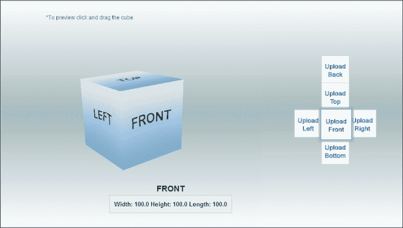
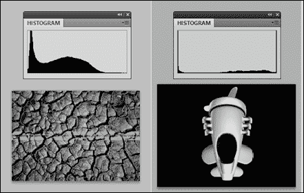

# 七、深入阅读和提示

在这最后一章中，我们将向您展示一些提示和链接，这些提示和链接指向更先进的技术，以改进任何增强现实应用程序的开发。我们将介绍多目标和云识别等内容管理技术，以及先进的交互技术。

# 管理您的内容

对于基于计算机视觉的 AR，我们向您展示了如何使用单个目标构建应用程序。但是，可能会出现需要同时使用几个标记的情况。试想一下，增加一个房间，每面墙上至少需要一个目标，或者您可能希望您的应用程序能够识别和增加数百个不同的产品包。前一种情况可以通过跟踪具有共同坐标框架的多个目标来实现，后一种情况可以通过利用云识别的能力来实现。我们将在接下来的章节中简要讨论这两个问题。

## 多目标

**多目标** 不仅仅是几个单个图像的集合。他们实现了一个单一和一致的坐标系统，手持设备可以被跟踪。这允许场景的连续增强，只要甚至单个目标是可见的。创建多目标的主要挑战在于定义公共坐标系(您将只做一次)，并在设备运行期间保持这些目标的相对姿态。

要创建公共坐标系，必须指定所有图像目标相对于公共原点的平移和方向。Vuforia TM 为您提供了一个选项，甚至可以构建常用的多目标，如立方体或长方体，而无需进入指定整个目标变换的细节。在 Vuforia TM 目标管理器中，您可以简单地向坐标原点位于立方体(不可见)中心的目标添加立方体(长度、高度和宽度相等)或长方体(长度、高度和宽度不同)。您所要做的就是指定长方体的一个延伸到三个延伸，并为目标的所有侧面添加单独的图像，如下图所示:

如果你想创建更复杂的多目标，例如跟踪整个房间，你必须采取稍微不同的方法。您首先要将您想要用于多目标的所有图像上传到 Vuforia TM 目标管理器内的单个设备数据库中。将设备数据库下载到开发机上后，您可以修改下载的`<database >.xml`文件，以添加各个图像目标的名称及其相对于坐标原点的平移和方向。在[https://developer . Vuforia . com/resources/dev-guide/creating-multi-target-XML-file](https://developer.vuforia.com/resources/dev-guide/creating-multi-target-xml-file)下的 Vuforia TM 知识库中可以找到一个示例 XML 文件。

请注意，您的设备数据库中最多只能有 100 个目标，因此您的多目标最多只能包含该数量的图像目标。还要注意的是，在运行时更改图像目标的位置(例如，打开产品包装)将会抑制对坐标系的一致跟踪，也就是说，单个目标元素之间定义的空间关系将不再有效。这甚至会导致跟踪完全失败。如果您想使用单个移动元素作为应用程序的一部分，除了多目标之外，您还必须将它们定义为单独的图像目标。

## 云识别

如前所述，在您的 Vuforia TM 应用程序中，最多只能同时使用 100 张图像。这个限制可以通过使用云数据库来克服。这里的基本思想是，您使用相机图像查询云服务，并且(如果目标是在云中识别的)在您的设备上本地处理对识别的目标的跟踪。这种方法的主要好处是您可以识别多达一百万张图像，这些图像对于大多数应用场景来说应该足够了。然而，这种好处并不是免费的。由于识别发生在云中，您的客户端必须连接到互联网，响应时间可能长达几秒钟(通常约为两到三秒钟)。

与识别不同，存储在设备上的图像数据库通常只需要 60 到 100 毫秒。为了更容易地上传许多图像进行云识别，您甚至不必使用 Vuforia TM 在线目标管理器网站，而是可以使用特定的网络应用编程接口——VuforiaTM网络服务应用编程接口——该接口可以在以下网址下找到:[https://developer . Vuforia . com/resources/dev-guide/management-targets-cloud-database-use-developer-API](https://developer.vuforia.com/resources/dev-guide/managing-targets-cloud-database-using-developer-api)。通过访问[https://developer . Vuforia . com/resources/dev-guide/cloud-targets](https://developer.vuforia.com/resources/dev-guide/cloud-targets)，您可以在 Vuforia TM 知识库中找到有关使用云识别的更多信息。

# 提高识别和跟踪能力

如果你想创建自己的自然特征跟踪目标，重要的是要设计成能被 AR 系统很好地识别和跟踪。自然特征目标的基础知识在[第 5 章](5.html "Chapter 5. Same as Hollywood – Virtual on Physical Objects")*的*理解自然特征跟踪目标*一节中进行了解释，与好莱坞相同–物理物体上的虚拟*。良好可追踪目标的基本要求是它们拥有大量的局部特征。但是，如果你的目标没有被很好地识别，你该怎么做呢？在一定程度上，你可以通过使用即将到来的提示来改善跟踪。

首先，你要确保你的图像有足够的局部对比度。在 GIMP 或 Photoshop 等任何照片编辑软件中，查看其灰度表示的直方图是衡量目标整体对比度的一个很好的指标。您通常需要分布广泛的直方图，而不是峰值很少的直方图，如下图所示:

要增加图像的局部对比度，您可以使用自己选择的照片编辑器，并应用取消共享蒙版滤镜或清晰度滤镜，例如在 Adobe Lightroom 中。

### 类型

此外，为了避免在 Vuforia TM 目标创建过程中重新采样伪像，请确保上传精确图像宽度为 320 px 的单个图像。这将避免由于服务器端自动调整图像大小而导致的混叠效应和降低局部特征数量。通过改进渲染，Vuforia TM 将重新缩放您的图像，使最长图像侧的最大延伸为 320 像素。

在本书的课程中，我们在示例应用程序中使用了不同类型的 3D 模型，包括基本图元(如我们的彩色立方体或球体)或更高级的 3D 模型(如忍者模型)。对于他们所有人来说，我们并没有真正考虑现实方面，包括光线条件。任何桌面或移动 3D 应用程序都将始终考虑渲染的逼真程度。这种真实感探索总是通过模型的几何质量、它们的外观定义(材质反射属性)以及它们如何与光交互(阴影和照明)。

**真实感渲染** 将暴露诸如遮挡(某物的前面、后面)、阴影(来自照明)、支持一系列真实感材质(使用着色器技术开发)或更高级的属性(例如支持全局照明)等属性。

当您开发您的增强现实应用程序时，您还应该考虑照片真实感渲染。然而，事情有点复杂，因为在 AR 中，你不仅要考虑虚拟方面(例如，桌面 3D 游戏)，还要考虑真实方面。在 AR 中支持照片真实感将意味着您会考虑**真实(R** ) **环境和虚拟** ( **V** ) **环境**在渲染过程中的交互方式，可以通过四种不同的情况简化如下:

1.  V→V
2.  V→R
3.  R→V
4.  R→R

您可以做的最简单的事情是支持 V→V，这意味着您可以在 3D 渲染引擎中启用任何高级渲染技术。对于基于计算机视觉的应用程序，这将意味着在您的目标上一切看起来都很现实。对于基于传感器的应用，这将意味着您的虚拟对象在彼此之间看起来是真实的。

第二个简单的步骤，特别是对于基于计算机视觉的应用，是使用平面技术支持 V→R。如果您有一个目标，您可以创建它的半透明版本，并将其添加到您的虚拟场景中。如果您启用了阴影，阴影似乎会投射到您的目标上，从而产生 V→R 的简单错觉。您可以参考下面的文章，该文章将为您提供一些解决此问题的技术方案:

*   参考*使用阴影体积的增强现实应用的实时阴影方法。VRST 2003: 56-65* 作者:*迈克尔·哈勒*、*斯蒂芬·单调*和*沃纳·哈特曼*。

处理 R→V 是比较复杂的一个，也是一个比较难的研究课题。例如，通过物理光源支持虚拟物体的照明需要大量的努力。

相反，对 R→V 来说，遮挡是很容易实现的。例如，如果将一个物理对象(如 **can** )放在您的虚拟对象前面，就会发生 R→V 情况下的遮挡。在标准增强现实中，你总是在视频前面渲染虚拟内容，所以你的**可以**将会出现在后面，即使它可以在你的目标前面。

重现这种效果的简单技术有时被称为 **幻影物体**。您需要创建一个物理对象的虚拟对应物，例如圆柱体，来表示您的罐子。将此虚拟对应物放置在与物理对应物相同的位置，并进行 **仅深度渲染**。仅深度渲染在很多库中都可用，它与颜色遮罩有关，当渲染任何东西时，您可以决定渲染哪个通道。通常，你有红色，绿色，蓝色和深度的组合。所以，你需要关闭前三个通道，只激活深度。它将渲染某种幻像对象(没有颜色，只有深度)，通过标准渲染管道，视频在你有真实对象的地方不再被遮挡，遮挡看起来很逼真；例如见[http://Hal . inria . fr/docs/00/53/75/15/PDF/咬合协同. pdf](http://hal.inria.fr/docs/00/53/75/15/PDF/occlusionCollaborative.pdf) 。

这是最简单的情况；当你有一个动态对象时，事情要复杂得多，你需要能够跟踪你的对象，更新它们的幻影模型，并且能够获得真实感渲染。

# 高级交互技术

在前一章中，我们研究了一些简单的交互技术，包括光线拾取(通过触摸交互)、传感器交互或相机到目标的接近。还有大量其他交互技术可以用于增强现实。

我们还会在其他移动用户界面上找到一种标准技术，那就是 **虚拟控制面板**。由于手机限制了对其他控制设备的访问，如游戏手柄或操纵杆，您可以通过触摸界面模拟它们的行为。使用这种技术，您可以在屏幕上显示一个虚拟控制器，并分析该区域的触摸是否等同于控制控制面板。它易于实现和增强基本的光线投射技术。控制面板通常显示在屏幕边框附近，可以适应外形尺寸并抓住您握持设备时做出的手势，因此您可以用手握持设备并在屏幕上自然移动手指。

另一个在增强现实中真正流行的技术是 **【有形用户界面】** ( **TUI** )。当我们使用相机与目标接近的概念创建示例时，我们实际上实现了一个有形的用户界面。TUI 的思想是使用一个物理对象来支持交互。这个概念在很大程度上是由麻省理工有形媒体集团的石井四郎开发和丰富的——这个网站指的是 http://tangible.media.mit.edu/。*马克·比灵赫斯特*在博士期间将这一概念应用于增强现实，并展示了一系列与之相关的专用交互技术。

TUI AR 的第一种类型是**本地交互**，比如你可以使用两个目标进行交互。类似于我们在`ProximityBasedJME`项目中检测相机和目标之间距离的方式，你可以用两个目标复制同样的想法。您可以检测两个目标是否彼此靠近，是否在同一方向对齐，并使用它触发一些动作。当您希望卡片之间相互作用时，您可以将这种类型的交互用于基于卡片的游戏，或者包括用户需要将不同卡片组合在一起的谜题的游戏，等等。

第二种 TUI AR 是**全局交互**，在这里你也会使用两个或者更多的目标，但是其中一个目标会变成*专用*。在这种情况下，您所做的是将目标定义为基本目标，所有其他目标都引用它。要实现它，您只需计算其他目标到基础目标的本地转换，基础目标在后面并被定义为您的原点。有了这个，就很容易把目标放在主目标上，以某种方式定义某种地平面，并与它进行一系列不同类型的交互。*马克·比灵赫斯特*推出了一个著名的衍生版本，用于进行基于桨的交互。在这种情况下，其中一个目标被用作拨片，可用于在地平面上进行交互——您可以触摸地平面，将拨片放在地平面上的特定位置，甚至可以用它检测简单的手势(摇动拨片、倾斜拨片等)。设置手机 AR，需要考虑到终端用户手持设备，无法进行复杂手势，但是有了手机，单手交互还是可以的。参考以下技术文件:

*   *有形增强现实。ACM SIGGRAPH ASIA (2008): 1-10* 由*马克·比林赫斯特*、*加藤大和*和*伊万·普尔佩列夫*进行。
*   *设计增强现实界面。ACM Siggraph 计算机图形学 39.1 (2005): 17-22* 作者:*马克·比灵赫斯特**拉斐尔·格拉斯特**朱利安·洛瑟*。

与 a TUI 的全局交互，在某种意义上可以定义为屏幕后面的交互*，而虚拟控制面板则可以看作是*屏幕前面的交互*。这是对与手机交互进行分类的另一种方式，这就把我们带到了第三类交互技术:**在目标上的触摸交互**。例如，Vuforia TM 库实现了虚拟按钮的概念。目标上的特定区域可用于放置控制器(例如，按钮、滑块和拨号盘)，用户可以将手指放在该区域并控制这些元素。这背后的概念使用基于时间的方法；如果您长时间将手指放在这个区域，它会模拟您可以在电脑上进行的点击，或者您可以在触摸屏上进行的点击。例如参考[https://developer . vuforia . com/resources/sample-apps/virtual-button-sample-app](https://developer.vuforia.com/resources/sample-apps/virtual-button-sample-app)。*

还有其他技术正在研究实验室中进行研究，它们将很快在未来一代移动增强现实中可用，因此您应该已经考虑过它们何时可用。一个趋势是 3D 手势交互或者也叫 **半空中交互**。你可以想象在设备和目标之间做手势，而不是触摸屏幕或目标。拥有一个用于三维建模的移动增强现实将是一种合适的技术。3D 手势有很多挑战，比如识别手、手指、手势、可能导致疲劳的身体接触等等。在不久的将来，这种已经在智能家居设备(如微软 Kinect)上流行的交互方式将在设备(配备 3D 传感器)上实现。

# 总结

在本章中，我们向您展示了如何通过使用多目标或云识别来实现基于计算机视觉的增强现实，从而超越标准的增强现实应用。我们还向您展示了如何提高图像目标的跟踪性能。此外，我们还向您介绍了一些用于增强现实应用程序的高级渲染技术。最后，我们还向您展示了一些新颖的交互技术，您可以使用它们来创造出色的增强现实体验。本章结束了您对安卓增强现实开发世界的介绍。我们希望您已经准备好进入增强现实应用程序开发的新阶段。