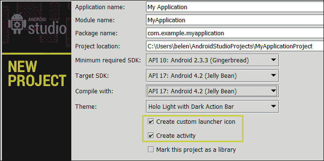
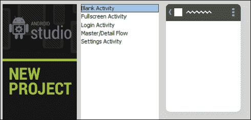
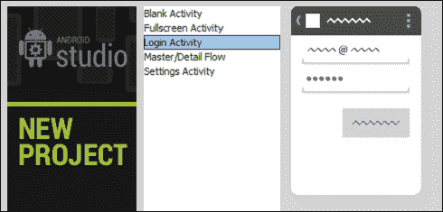

# 第二章。启动项目

你刚刚安装了安卓工作室，现在你想熟悉它的功能。创建项目时，您需要了解必要的字段。您想知道如何将图标添加到您的应用程序中，并将其与项目相关联，您想知道如何创建主活动以及选择哪种类型的活动。如何使用 Android Studio 实现这一点？

本章的目标是创建一个新项目，其基本内容应该从这个项目开始。我们将使用安卓工作室向导来创建项目，并浏览项目配置字段。我们将为我们的应用程序选择一个启动图标，我们将浏览向导中可用的不同类型的活动，以选择作为我们项目的主要活动。

这些是我们将在本章中讨论的主题:

*   创建新项目
*   创建您的应用程序图标
*   选择作为主要活动的活动类型

# 创建新项目

要创建新项目，从欢迎屏幕点击**新项目**选项。如果您不在欢迎屏幕中，则导航至**文件** | **新项目**。将打开新建项目向导。

向导的第一步足以创建一个项目，但是如果您选中**创建自定义启动器图标**选项，向导将增加第二步，如果您选中**创建活动**选项，将增加两个额外的步骤。检查两个。

新项目向导中将显示的字段如下:

*   **应用名称**:它是 Google Play 中显示的名称，也是用户看到的名称。
*   **模块名称**:它是安卓工作室唯一使用的名称。
*   **软件包名称**:您的应用程序的唯一标识符，通常采用`com.company_name.app_name`或`reverse_company_domain.app_name`形式。这种形式降低了与其他应用程序发生名称冲突的风险。
*   **项目位置**:您系统中保存项目的目录是。
*   **最低要求的 SDK** :是你的应用支持的最低 SDK。带有以前的软件开发工具包的设备将无法安装您的应用程序。尝试在支持的设备和可用功能之间达成平衡。如果您的应用程序不需要最新软件开发工具包中发布的特定功能，那么您可以选择较旧的**应用编程接口** ( **应用编程接口**)。谷歌最近发布的关于平台分布的仪表板显示，95.5%的设备使用安卓 2.3 或更高版本。如果你选择安卓 2.2，那么这个百分比会上升到 98.5%。官方安卓仪表盘可在[http://developer.android.com/about/dashboards/index.html](http://developer.android.com/about/dashboards/index.html)获得。
*   **目标 SDK** :它是你针对你的应用测试过的最高 SDK。您应该将此值更新到最新版本。
*   **用**编译:它是用来编译你的应用程序的 SDK。这个软件开发工具包是你在安卓工作室安装和配置的软件开发工具包之一。
*   **主题**:为你的应用选择一个默认的用户界面主题。

选项**将此项目标记为库**用于将项目创建为库模块。库可以在其他项目中引用，以共享其功能。不要选中此选项。

考虑上一张截图中显示的字段。选择 API 10 作为最小 SDK，API 17 作为目标 SDK。在**用**编译字段中，选择您安装的最高应用编程接口版本(应用编程接口 17)。点击**下一步**。

# 创建自定义启动器图标

这一步允许你创建你的应用程序图标，如果你在第一步选中**创建自定义启动器图标**选项，将会显示。

安卓项目存储多种图像分辨率，以便在应用程序执行时选择最适合设备屏幕分辨率的图像。为了确保图标将在每个设备中正确显示，请检查`XXHDPI`图像是否未像素化。

有三个选项可以创建您的应用程序图标、图像、一个提供的剪贴画或文本。最常见的是一个形象。您可以选择自己的图像文件来创建图标，并调整一些参数，如填充、形状或背景颜色。选择**图像**选项，保留默认图像和选项不变。点击**下一步**。

# 选择你的活动类型

此步骤允许您创建应用程序的主要活动。如果在第一步中选择了**创建活动**选项，将会显示该步骤。

可以选择几种类型的活动:

*   **Blank Activity**: This creates a blank activity with an action bar. The action bar includes a title and an options menu. The navigation type can be a tabbed user interface (tabs fixed or scrollable), horizontal swipe, or a drop-down menu. See more about action bars at [http://developer.android.com/guide/topics/ui/actionbar.html](http://developer.android.com/guide/topics/ui/actionbar.html).

    

*   **Fullscreen Activity**: This template hides the system user interface (such as the notification bar) in a full-screen view. The full-screen mode is alternated with an action bar that shows up when the user touches the device screen.

    

*   **Login activity**: This template creates its view as a login screen allowing the users to log in or register with an e-mail and password.

    

*   **Master/Detail Flow**: This template splits the screen into two sections: a left menu and the detail of the selected item on the right. On a smaller screen, just one section is displayed, but on a bigger screen, both sections are displayed at the same time.

    

*   **Settings Activity**: This creates a preference activity with a list of settings.

    

选择**空白活动**，点击**下一步**。在最后一步中，我们可以为活动及其相关布局命名。保留默认值，选择无导航类型，点击**完成**。

# 总结

我们使用安卓工作室向导创建了我们的第一个项目，并填写了配置字段。我们为我们的应用程序选择了启动图标，并确保它能够以任何分辨率正常显示。我们经历了不同种类的活动。

在下一章中，我们将介绍安卓工作室结构的不同元素。我们将找到可以创建新类、添加和访问库的地方，以及如何配置项目。