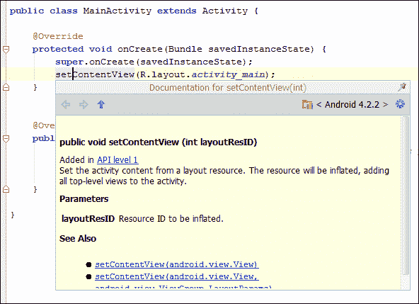
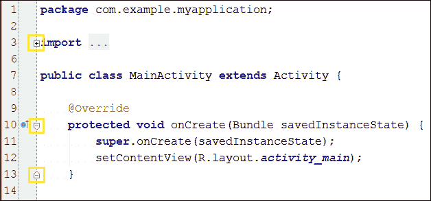
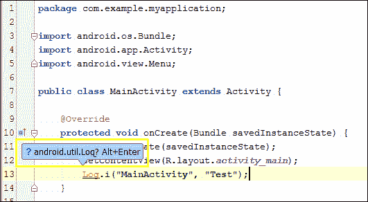
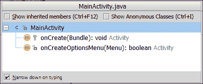

# 四、使用代码编辑器

您已经创建了第一个项目，并且知道如何浏览不同的文件夹、子文件夹和文件。是时候开始编程了！你曾经希望能够更高效地编程吗？你如何加快你的发展进程？您想学习有用的快捷方式吗，例如，一次注释多行，查找和替换字符串，或者在方法调用中更快地通过不同的参数？

在这一章中，我们将学习如何使用代码编辑器以及如何定制它，以便在编程时感觉更舒服。为了提高开发人员的工作效率，了解代码编辑器的基本特性是值得的。我们将学习代码完成和代码生成。最后，我们将学习一些有用的快捷键和热键来加快我们的开发过程。

这些是我们将在本章中讨论的主题:

*   自定义代码编辑器
*   代码完成
*   代码生成
*   查找相关内容
*   有用的快捷方式

# 编辑器设置

要打开编辑器设置，请导航至**文件** | **设置**，部分 **IDE 设置**，菜单**编辑器**。该屏幕显示编辑器的常规设置。我们建议选中两个默认情况下未选中的选项:

*   **用 Ctrl +鼠标滚轮改变字体大小(缩放)**:这个选项允许我们使用鼠标滚轮改变编辑器的字体大小，就像我们在网页浏览器等其他程序中一样。
*   **Show quick doc on mouse move**: If we check this option, when we move the mouse over a piece of code and wait 500 ms, a quick doc about that code will be displayed in a small dialog. When we move the mouse again, the dialog automatically disappears, but if we move the mouse into the dialog, then we can examine the doc in detail. This is very useful, for example, to read what a method does and its parameters without navigating to it.

    

有更多的设置分布在七个类别中:

*   **智能按键**:将动作配置为打字时自动完成，如添加右括号、引号或标签；或者当我们按下*回车*键时缩进线条。
*   **外观**:配置编辑器的外观。我们建议检查默认情况下未选中的以下两个选项:
    *   **显示行号**:显示编辑器左边缘的行号。当我们调试或检查日志时，它非常有用。
    *   **显示方法分隔符**:直观地分隔一个类的方法。
*   **颜色&字体**:改变字体和颜色。有很多选项和元素可以配置(关键词、数字、警告、错误、注释、字符串等)。我们可以将配置保存为方案。
*   **编辑器选项卡**:编辑器选项卡的配置。我们建议您选择**用星号标记修改标签**选项，以便轻松检测修改和未保存的文件。
*   **Code Folding**: The **code folding** option allows us to collapse or expand code blocks. It is very useful to hide code blocks that we are not editing, simplifying the code view. We can collapse or expand the blocks using the icons from the editor or using the **Code** | **Folding** menu.

    

*   **代码完成**:配置代码完成选项。代码完成将在下一节详细讨论。
*   **Auto Import**: Configures how the editor behaves when we paste code that uses classes that are not imported in the current class. By default when we do this, a pop up appears to add the import command. If we check the option **Add unambiguous imports on the fly**, the import command will be added automatically without our interaction.

    

# 代码完成

代码完成帮助我们通过建议列表快速编写代码，并自动完成代码。

基本的代码完成是在我们键入时出现的建议列表。如果列表没有显示，按 *Ctrl* +空格键打开。


继续输入，从列表中选择一个命令，然后按*进入*或双击将其添加到代码中。

如果我们写的代码是一个表达式，但是我们想以否定的形式插入表达式，当我们从建议列表中选择表达式时，不要按*回车*或者双击它，而是按感叹号键(*！*)。表达式将被加上否定。

另一种类型的代码完成是**智能类型代码完成**。如果我们输入一个命令来调用一个带有`String`参数的方法，那么只会建议使用`String`对象。这种智能完成发生在赋值语句、方法调用参数、返回语句或变量初始值设定项的右侧。要打开智能建议列表，请按 *Ctrl* + *Shift* +空格键。

为了显示这两种类型的建议列表之间的区别，在代码中创建两个不同类的对象，`String`和`int`。然后调用带有`String`参数的方法，例如类的方法`i`。在输入`String`参数时，注意打开基本建议列表( *Ctrl* +空格键)和打开智能类型建议列表( *Ctrl* + *Shift* +空格键)的区别，如下一页截图所示。


在上一个截图中显示的第一个列表中，尽管`int`对象与`parameter`类不匹配，但两个对象都被建议。在第二个中，如下图所示，只建议使用`String`对象。


代码完成的最后一个效用是语句的**完成。键入语句，按下 *Ctrl* + *Shift* + *回车，*并注意如何自动添加结束标点。如果您在键入关键字`if`后按下这些键，括号和括号将被添加以完成条件语句。这个快捷方式也可以用来完成方法声明。开始输入方法，输入左括号后，或输入方法参数后，按*Ctrl*+*Shift*+*回车*。添加右括号和括号是为了完成方法规范。**

# 代码生成

要在一个类中生成代码块，导航至**代码** | **生成**或按快捷键 *Alt* + *插入*。我们可以生成构造函数、getters 和 setters 方法、`equals`和`toString`方法、重写或委托方法。

另一种生成代码的方法是用一些语句包围我们的一些代码(`if`、`if` / `else`、`while`、`for`、`try` / `catch`等等)。选择一条代码行，导航至**代码** | **用**环绕或按*Ctrl*+*Alt*+*T*。

第三个选项是插入代码模板。导航至**代码** | **插入实时模板**打开可用模板对话框。这些模板可以插入代码来迭代集合、数组、列表等；打印格式化字符串的代码、抛出异常的代码或添加静态和最终变量的代码。在对话框的左边缘，每个模板都有一个前缀，因此如果您在编辑器中键入前缀并按下*选项卡*键，代码模板将自动添加。

试着在我们主要活动的`onCreate`方法末尾键入`inn`，然后按*标签*。将出现一个条件块。在这个新块中，键入`soutm`并再次按下*选项卡*。结果如下所示。

```java
protected void onCreate(Bundle savedInstanceState) {
    super.onCreate(savedInstanceState);
    setContentView(R.layout.activity_main);

    if (savedInstanceState != null) {
 System.out.println("savedInstanceState = [" + savedInstanceState + "]");
 }
 }
```

# 导航代码

导航到声明或类型声明的最直接的方法是按下 *Ctrl* ，当符号显示为链接时，单击它。该选项也可从**导航** | **申报**中访问。

从编辑器的左边缘，我们可以浏览方法的层次结构。在属于方法层次结构的方法声明旁边，有一个图标，指示某个方法是实现接口方法、实现抽象类方法、重写超类方法，还是相反，某个方法被实现或被其他后代重写。

单击这些图标导航到层次结构中的方法。该选项也可通过**导航** | **超级方法**或**导航** | **实施**获得。通过打开我们第一个项目的主要活动来测试它(`MainActivity.java`)。


与代码导航相关的另一个有用的工具是自定义区域的使用。一个**自定义区域** 只是一段你想要分组并命名的代码。例如，如果有一个类有很多方法，我们可以创建一些自定义区域，在它们之间分配方法。区域有名称或描述，可以使用代码折叠来折叠或展开。

要创建自定义区域，我们可以使用代码生成。选择代码片段，导航至**代码** | **环绕，并选择以下两个选项之一:**

*   **<编辑-折叠……>评论**
*   **区域…末端区域注释**

他们都创建了一个区域，但使用了不同的风格。

当我们使用自定义区域时，我们可以使用**导航** | **自定义区域**菜单来导航它们。

其余的导航选项可从菜单**导航**进入:

*   **类** / **文件** / **符号**:通过名称查找类、文件或符号。
*   **线路**:通过线路编号进入。
*   **最后编辑位置**:导航到最近的更改点。
*   **测试**:导航到当前班级的测试。
*   **File Structure**: Opens a dialog box that shows the file structure. Open the file structure of our main activity and observe how the structure is presented, displaying the list of methods, the icons that indicate the type of element, or the icons that indicate the visibility of the element.

    

*   **文件路径**:打开对话框，显示编辑器中打开的文件的完整路径。
*   **类型层次结构**:打开对话框，显示选定对象的类型层次结构。
*   **方法层次结构**:打开对话框，显示所选方法的方法层次结构。
*   **调用层次结构**:打开对话框，显示所选方法的调用层次结构。
*   **下一个突出显示的错误** : 导航到下一个错误。
*   **上一个突出显示的错误**:导航到上一个错误。
*   **下一个方法**:导航到下一个方法。
*   **上一个方法**:导航到上一个方法。

# 有用的动作

下表列出了一些有用的快捷方式:

*   *Ctrl* + *W* :根据语法选择表达式。保持一次又一次按下这些键来扩展选择。相反的命令是*Ctrl*+*Shift*+*W*。
*   *Ctrl* + */* :注释选中代码的每一行。要使用块注释，请按*Ctrl*+*Shift*+*/*。
*   *Ctrl*+*Alt*+*I*:缩进选中的代码。有用的当你写完一段代码或者方法来清理它的时候。
*   *Ctrl*+*Alt*+*O*:优化导入，移除未使用的导入并重新排序剩余的导入。
*   *移动* + *Ctrl* +箭头:将选中的代码移动到另一行。
*   *Alt* +箭头:在编辑器打开的标签之间切换。
*   *Ctrl* + *F* :在编辑器的活动标签中找到一个字符串。
*   *Ctrl* + *R* :替换编辑器活动标签中的一个字符串。
*   *Ctrl* + *A* :选择所有打开文件的代码。
*   *Ctrl* + *D* :复制选中的代码，粘贴在它的末尾。如果未选择任何代码，则将整行复制并粘贴到新行中。
*   *Ctrl* + *Y* :删除整行，不留下任何空行。
*   *Ctrl*+*Shift*+*U*:切换情况。
*   *选项卡*:将移动到下一个参数。

# 总结

到本章结束时，用户应该学会一些有用的技巧和有用的动作，以充分利用代码编辑器。我们现在知道如何使用代码完成、代码生成和一些有用的快捷方式来加快不同的动作。我们还定制了代码编辑器，现在可以开始编程了。

在下一章中，我们将开始使用布局创建我们的第一个用户界面。我们将学习如何使用图形向导创建布局，以及如何使用基于文本的视图编辑 XML 布局文件来创建布局。我们将使用文本视图组件创建我们的第一个应用程序，一个经典的 *Hello World* 示例。我们还将了解如何为多种屏幕尺寸准备我们的应用程序，并根据不同的设备方向进行调整。最后，我们将学习 UI 主题以及如何处理事件。