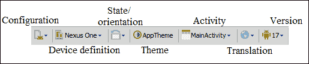
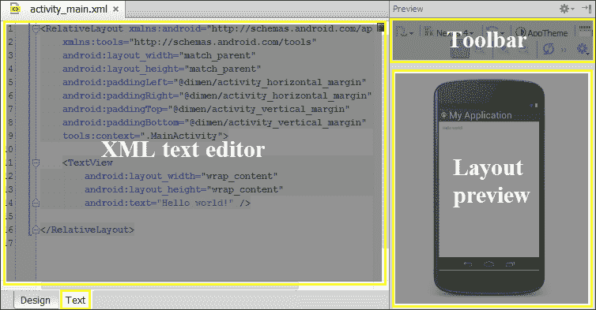
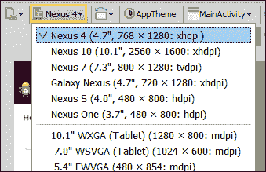

# 五、创建用户界面

现在，您已经创建了第一个项目，并熟悉了代码编辑器及其功能，我们将通过创建用户界面来开始我们的应用程序。使用 Android Studio 创建用户界面的方法是否不止一种？如何向用户界面添加组件？你有没有想过如何让你的应用程序支持不同的屏幕尺寸和分辨率？

本章重点介绍使用布局创建用户界面。可以使用图形视图或基于文本的视图来创建布局。我们将学习如何使用它们来创建我们的布局。我们还将使用简单的组件编写一个 *Hello World* 应用程序。我们将了解不同基于安卓的设备上的碎片化，以及如何为这个问题准备我们的应用程序。我们将以在应用程序上处理事件的基本概念来结束这一章。

这些是我们将在本章中讨论的主题:

*   现有布局编辑器
*   创建新布局
*   添加组件
*   支持不同的屏幕
*   更改用户界面主题
*   处理事件

# 图形编辑器

打开我们项目中位于`/src/main/res/layout/activity_main.xml`的主布局。默认情况下，将打开图形编辑器。最初，这个主布局只包含一个带有**你好世界的文本视图！**消息。要在图形编辑器和文本编辑器之间切换，请单击底部选项卡**设计**和**文本**。


工具栏包含一些改变布局样式和预览的选项。本章中对工具栏的选项进行了解释。



组件树将布局中放置的组件显示为层次结构。属性检查器显示布局中所选组件的属性，并允许我们更改它们。

调色板列出了现有的**用户界面** ( **用户界面**)组件，以放置在我们的布局中。调色板以不同的类别组织组件。

*   **布局**:布局是一个容器对象，用于在屏幕上分发组件。用户界面的根元素是一个布局对象，但是布局也可以包含更多的布局，从而创建一个在布局中结构化的组件层次结构。建议尽可能保持这种布局层次结构简单。我们的主布局有一个相对布局作为根元素。
*   **小部件**:按钮、复选框、文本视图、开关、图像视图、进度条、微调器或网页视图都属于此类别。它们是大多数布局中最常用的组件。
*   **文本字段**:这些是用户可以输入文本的输入。它们之间的区别在于用户可以键入的文本类型。
*   **容器**:这些容器是共享一个共同行为的组组件。广播组、列表视图、滚动视图或选项卡主机就是其中的一部分。
*   **日期&时间**:这些是与日期和时间相关的部件，比如日历或者钟表。
*   **专家**:这些组件没有小部件类的那么常见，但是值得一看。
*   **定制**:这些是组件，允许我们包含我们的定制组件，这些组件通常是我们项目中的其他布局。

# 基于文本的编辑器

点击**文本**选项卡，将图形编辑器更改为文本编辑器。



工具栏与图形编辑器相同。预览会显示布局，但不能更改，您应该使用“设计”选项卡。组件使用它们的 XML 声明添加到布局中。属性也使用 XML 声明进行配置。像图形编辑器一样，文本编辑器只显示根布局中的文本视图元素。

# 创建新布局

当我们创建我们的主要活动时，相关的布局也被创建。这是在创建活动时创建布局的一种方式。

如果我们想在不创建新活动的情况下添加独立布局，那么用鼠标右键单击布局文件夹(`res/layout/`)并导航至**新建** | **布局资源文件**。也可以导航到菜单选项**文件** | **新建** | **布局资源文件**。键入文件名和根元素。

一旦创建了布局，相关联的活动就可以从编辑器更改为另一个。如果布局没有活动，任何现有的布局都可以从编辑器链接到它。为此，在布局编辑器的工具栏中，搜索活动选项，点击它，并选择**与其他活动关联**选项。将打开一个对话框，列出项目的所有活动，以便您可以选择其中一项。

# 添加成分

我们的主布局是一个相对布局，包含一个说 **Hello world 的文本视图！**，但是让我们添加一个新的组件。最简单的方法是使用图形编辑器，所以打开设计选项卡。选择一个组件并将其拖动到布局预览中，例如，导航到**文本字段** | **人名**并将其放置在文本视图下方。

在组件树视图中，现在有了一个新的`EditText`对象。保持选中文本字段，以检查其在属性检查器中加载的属性。让我们更改其中的一些，并观察布局预览和组件树中的差异。

1.  **布局:宽度**:其当前值为`wrap_content`。此选项将使字段的宽度适应其内容。将其更改为`match_parent`以适应父布局宽度(根相对布局)。
2.  **提示**:输入`Enter your name`作为场的提示。提示是当字段为空时显示的文本，指示应该键入的信息。由于字段具有默认值`Name`，提示不可见。
3.  **id**: Its current ID is `@+id/editText`. This ID will be used from the code to get access to this object and is the one displayed in the component tree. Change it to `@+id/editText_name` to easily distinguish it from other text fields. Check that in the component tree the component ID has also changed.

    

4.  **文本**:删除该字段的值。提示现在应该可见了。

如果切换到文本编辑器，我们可以看到文本字段的 XML 定义，其属性为我们编辑的:

```java
<EditText
android:layout_width="match_parent"
android:layout_height="wrap_content"
android:inputType="textPersonName"
android:ems="10"
android:id="@+id/editText_name"
android:layout_below="@+id/textView_greeting"
android:layout_alignLeft="@+id/textView_greeting"
android:layout_marginTop="15dp"
android:hint="Enter your name"
/>
```

从文本编辑器中，还可以更改现有组件及其属性。将文本视图标识(`android:id`属性)从`@+id/textView`修改为`@+id/textView_greeting`。拥有一个描述性的标识很重要，因为它将在我们的代码中使用。描述性变量名允许代码自我记录。

这次让我们使用文本编辑器添加另一个组件。按下打开标签键，开始输入`Button`。让建议列表出现，选择一个`Button`对象。在`Button`标签内，添加下一个属性:

```java
<Button
android:id="@+id/button_accept"
android:layout_width="wrap_content"
android:layout_height="wrap_content"
android:layout_below="@+id/editText_name"
android:layout_centerHorizontal="true"
android:text="Accept"
/>
```

用值`@+id/button_accept`创建标识属性。让宽度和高度适应按钮内容(`wrap_content`值)。使用`android:layout_below`属性将按钮放在名称文本字段下方。我们通过名称文本字段的标识来引用它(`@+id/editText_name`)。使用`layout_centerHorizontal`属性水平居中父布局中的按钮。设置按钮的文本(`Accept`)。

该按钮显示在布局预览中。下一张截图显示，如果我们切换到图形编辑器，按钮也会显示在其中以及组件树中:


# 支持多屏

在创建安卓应用时，我们必须意识到多种屏幕尺寸和屏幕分辨率的存在。检查我们的布局如何在不同的屏幕配置中显示是很重要的。为了实现这一点，Android Studio 提供了一个功能，当我们在设计模式下改变布局预览。

我们可以在工具栏中找到这个功能，预览中使用的**设备定义**选项默认为 **Nexus 4** 。单击它打开可用设备定义列表。



试试其中的一些。平板设备和像 Nexus 这样的设备之间的区别非常明显。我们应该使视图适应我们的应用程序支持的所有屏幕配置，以确保它们以最佳方式显示。

设备定义显示屏幕英寸、分辨率和屏幕密度。安卓将屏幕密度分为 ldpi、mdpi、hdpi、xhdpi，甚至 xhdpi。

*   **ldpi** ( **每英寸低密度点**):约 120 dpi
*   **mdpi** ( **中密度点每英寸**):约 160 dpi
*   **hdpi** ( **每英寸高密度点**):约 240 dpi
*   **xdpi**(**每英寸超高密度点**):约 320 dpi
*   **xxhdpi** ( **每英寸超高密度点**):约 480 dpi

谷歌最近发布的仪表板显示，大多数设备都有高密度屏幕(34.3%)，其次是 xh dpi(23.7%)和 mdpi(23.5%)。因此，通过使用这三种屏幕密度测试我们的应用程序，我们可以覆盖 81.5%的设备。官方安卓仪表盘可在[http://developer.android.com/about/dashboards](http://developer.android.com/about/dashboards)获得。

另一个需要记住的问题是**设备的方向**。我们是否希望在应用程序中支持横向模式？如果答案是肯定的，我们必须在横向测试我们的布局。在工具栏上，单击布局状态选项，将模式从纵向更改为横向或从横向更改为纵向。

如果我们的应用程序支持横向模式，并且布局没有按照预期的方向显示，我们可能需要创建布局的变体。点击工具栏的第一个图标，即配置选项，选择**创建景观变化**选项。编辑器中将打开一个新布局。该布局已在资源文件夹中创建，位于目录`layout-land`下，并使用与肖像布局相同的名称:`/src/main/res/layout-land/activity_main.xml`。现在我们可以编辑新的布局变化，完全符合景观模式。

同样，我们可以为 *xlarge* 屏幕创建不同的布局。选择选项**创建布局-大变化**。新布局将在`layout-xlarge`文件夹中创建:`/src/main/res/layout-xlarge/activity_main.xml`。安卓分为*小*、*普通*、*大*和 *xlarge* 实际屏幕尺寸:

*   **小**:分类在这个类别的屏幕至少是 426 DP×320 DP
*   **正常**:该类别的屏幕至少为 470 DP×320 DP
*   **大**:该类别的屏幕至少为 640 DP×480 DP
*   **xlarge** :此类别中的屏幕至少为 960 dp x 720 dp

A **dp** 是一个与密度无关的像素，相当于 160 dpi 屏幕上的一个物理像素。

谷歌最近发布的仪表板显示，大多数设备的屏幕尺寸正常(79.6%)。如果您想覆盖更大比例的设备，也可以使用小屏幕(9.5%)来测试您的应用程序，因此覆盖范围将是 89.1%的设备。

要同时显示多个设备配置，在工具栏中点击配置选项并选择**预览所有屏幕尺寸**选项，或点击**预览代表性样本**仅打开最重要的屏幕尺寸。我们也可以通过使用鼠标右键点击样品并选择菜单中的**删除**选项来删除任何样品。这个菜单另一个有用的动作是**保存截图**选项，可以让我们截图布局预览。


如果我们创建一些布局变体，我们可以选择选项**预览布局版本**来预览它们。

# 更改用户界面主题

布局和小部件是使用我们项目的默认用户界面主题创建的。我们可以通过创建样式来改变用户界面元素的外观。可以对样式进行分组以创建主题，并且主题可以应用于整个活动或应用程序。有些主题是默认提供的，例如赫萝风格。样式和主题作为资源创建在`/src/res/values`文件夹下。

使用图形编辑器打开主布局。工具栏中显示了为我们的布局选择的主题:`AppTheme`。这个主题是为我们的项目创建的，可以在样式文件(`/src/res/values/styles.xml`)中找到。打开样式文件，注意这个主题是另一个主题(`Theme.Light`)的扩展。

要自定义我们的主题，请编辑样式文件。例如，在`AppTheme`定义中增加下一行来改变窗口背景颜色:

```java
<style name="AppTheme" parent="AppBaseTheme">
<item name="android:windowBackground">#dddddd</item>
</style>
```

保存文件并切换到布局选项卡。背景现在是浅灰色。这种背景颜色将应用于我们所有的布局，因为我们在主题中配置了它，而不仅仅是在布局中。

要完全更改布局主题，请单击图形编辑器工具栏中的主题选项。主题选择器对话框现在打开，显示可用主题的列表。


在我们自己的项目中创建的主题列在**项目主题**部分。**清单主题**部分显示了应用程序清单文件(`/src/main/AndroidManifest.xml`)中配置的主题。**全部**部分列出了所有可用的主题。

# 处理事件

如果应用程序的其余部分不能与之交互，用户界面将毫无用处。安卓中的事件是在用户与我们的应用程序交互时生成的。所有的用户界面小部件都是`View`类的子类，它们共享由下一个侦听器处理的一些事件:

*   `OnClickListener`:捕捉用户点击视图元素时的事件
*   `OnCreateContextMenu`:当用户在视图元素上长时间点击并且我们想要打开一个上下文菜单时，捕捉事件
*   `OnDragListener`:当用户拖拽事件元素时捕捉事件
*   `OnFocusChange`:当用户在同一视图中从一个元素导航到另一个元素时捕获事件
*   `OnKeyListener`:当视图元素有焦点时，当用户按任意键时捕捉事件
*   `OnLongClickListener`:当用户触摸视图元素并握住它时，捕捉事件
*   `OnTouchListener`:当用户触摸视图元素时捕捉事件

除了这些事件和监听器，一些 UI 小部件还有一些更具体的。复选框可以注册侦听器，以便在侦听器的状态发生变化时进行捕获(`OnCheckedChangeListener`)，或者微调器可以注册侦听器，以便在单击某个项目时进行捕获(`OnItemClickListener`)。

最常见的捕获事件是当用户单击视图元素时。对于这个事件，有一个简单的方法来处理它，使用视图属性。在布局中选择接受按钮，寻找`onClick`属性。此属性指示当用户单击按钮时将执行的方法的名称。该方法必须在与当前布局相关联的活动中创建，在本例中，在我们的主活动`MainActivity.java`中。键入`onAcceptClick`作为该属性的值。

打开主活动来创建方法定义。当视图被单击时，事件回调方法必须是公共的，具有 void 返回类型，并且它接收作为参数被单击的视图。每次用户单击按钮时，都会执行此方法。

```java
public void onAcceptClick(View v) {
  // Action when the button is pressed
}
```

从主活动中，我们可以与界面的所有组件进行交互，因此当用户单击 accept 按钮时，我们的代码可以从 name 字段中读取文本，并将问候语更改为包含姓名。

要获取视图对象的引用，请使用从`Activity`类继承的`findViewById`方法。该方法接收组件的标识，并返回与该标识对应的`View`对象。返回的视图对象必须在中被铸造到其特定的类，以便使用其方法，例如`EditText`类的`getText`方法来获得用户键入的名称。

```java
public void onAcceptClick(View v) {
  TextView tv_greeting =
    (TextView) findViewById(R.id.textView_greeting);
  EditText et_name = (EditText) findViewById(R.id.editText_name);

  if(et_name.getText().length() > 0) {
    tv_greeting.setText("Hello " + et_name.getText());
  }
}
```

在方法的前两行中，检索对布局元素的引用:包含问候语的文本视图和用户可以键入名称的文本字段。组件是通过它的标识找到的，这个标识与我们在布局文件中的元素属性中指出的标识相同。所有资源的标识都包含在`R`类中。`R`类是在构建阶段自动生成的，我们不能编辑它。如果这个类不是自动生成的，那么可能我们资源的某个文件包含了一个错误。

下一行是检查用户是否键入了名称的条件语句，在这种情况下，文本将被包含该名称的新问候语替换。在接下来的章节中，我们将学习如何在模拟器中执行我们的应用程序，并且我们将能够测试这些代码。

如果我们想要处理的事件不是用户点击，那么我们必须通过活动的`onCreate`方法中的代码来创建和添加监听器。有两种选择:

*   在活动中实现侦听器接口，然后添加未实现的方法。接口所需的方法是接收事件的方法。
*   在活动文件中创建侦听器的私有匿名实现。接收事件的方法在此对象中实现。

最后，必须使用 setter 方法、`setOnClickListener`、`setOnCreateContextMenu`、`setOnDragListener`、`setOnFocusChange`、`setOnKeyListener`等将侦听器实现分配给视图元素。听众分配通常包含在活动的`onCreate`方法中。如果侦听器是由活动直接实现的，那么指示给 setter 方法的参数是它自己的使用关键字`this`的活动，如下面的代码所示:

```java
Button b_accept = (Button) findViewById(R.id.button_accept);
b_accept.setOnClickListener(this);
```

活动然后应该实现侦听器和侦听器接口所需的`onClick`方法。

```java
public class MainActivity extends Activity 
implements View.OnClickListener {
  @Override
  public void onClick(View view) {
    // Action when the button is pressed
  }
```

# 总结

到本章结束时，我们已经学习了如何通过使用图形编辑器和基于文本的编辑器来创建和编辑用户界面布局。我们完成了第一个小应用程序，并使用一些基本组件对其进行了升级。用户现在应该能够创建一个简单的布局，并使用不同的样式、屏幕大小和屏幕分辨率进行测试。我们还了解了不同的可用用户界面主题，最后，我们还了解了事件以及如何使用侦听器来处理它们。

在下一章中，我们将了解谷歌 Play 可用的服务，以及如何使用 Android Studio 将它们集成到我们的项目中。我们将学习如何安装和集成谷歌技术提供的不同库，如谷歌地图、谷歌 Plus 等。