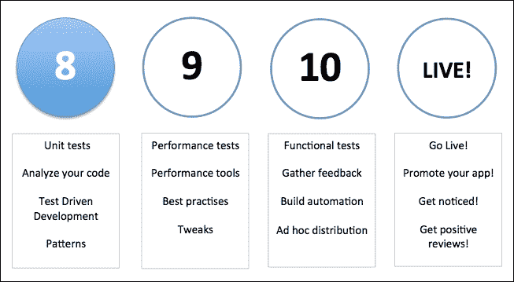
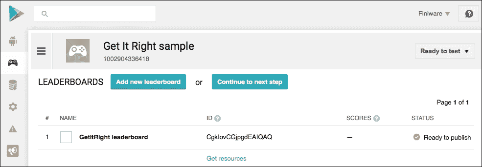

# 八、提高质量

您刚刚完成应用编码。现在怎么办？尽快将它上传到游戏商店！

不，等等，你还没说完呢！你测试你的应用了吗？它会在任何安卓版本上工作吗？在任何设备上？在所有情况下？

在本章中，我们将重点关注:

*   模式和支持注释
*   使用机器人进行单元测试
*   代码分析

# 简介

为了提高应用的质量，有一些常见的陷阱需要避免，也有一些模式需要应用。您已经在前面的章节中看到了其中的一些。此外，还有一些有趣的工具可以用来测试和分析您的代码。

在下面的路线图中，您会注意到，在使用您的应用之前，您需要完成不同的阶段:



代码的结构、健壮性、可维护性以及它符合功能需求的程度是关键要素。

功能质量是通过软件测试来衡量的，为此我们需要将我们的应用分发给我们的测试员。我们将在[第 10 章](10.html "Chapter 10. Beta Testing Your Apps")、*测试版*中讨论这一点。

通过手动运行单元测试和代码检查(同行评审)或使用安卓 Lint 等工具来评估结构质量，您将在本章的最终配方中了解更多信息。现在的问题是代码的体系结构满足好的软件工程的需求有多好？

总的来说，有一些有趣的原则可以帮助您提高代码的质量。这里列出了其中的一些:

*   了解活动生命周期，并以正确的方式使用片段。
*   如果可以避免，就不要分配内存。
*   避免太重的碎片和活动。
*   考虑一种 **模型视图控制器** ( **MVC** )的方法。应用正确的模式。
*   在单个点解决一个问题。**不要重复自己** ( **干**)。
*   不要做你不需要做的工作。也被称为:**你不是** **会需要它** ( **YAGNI** )。

下一个食谱会让你知道什么是模式，以及你为什么想要应用它们。

# 模式和支持注释

质量是一项严肃的工作，所以我们将把它和一些乐趣结合起来。我们将在即将到来的食谱中创建一个测验应用。我们将为此使用谷歌游戏服务，我们将看看我们可以应用到我们的应用中的模式，特别是 MVC 和**模型视图演示者** ( **MVP** )方法。

那么什么是设计模式呢？设计模式是一个常见问题的解决方案。我们可以在任何地方重用这样的模式。没有必要重新发明轮子(当然，除非你能想到更好的轮子)，也没有必要重复自己。

模式是我们可以信赖的最佳实践。它们可以帮助我们加快开发过程，包括测试。

一些模式是:

*   手动音量调节
*   最有价值球员
*   可观察量
*   工厂
*   一个
*   支持注释
*   谷歌游戏服务

## MVC

MVC 最适合更大的项目。这种模式的好处是关注点的分离。我们可以将用户界面代码与业务逻辑分开。控制器将负责显示哪个视图。它将从另一个层获取数据，一个类似于存储库的类，它将从某个地方获取数据，并将数据通过模型(或模型列表)传递给用户界面。控制器不知道数据来自哪里以及如何显示。这些分别是存储库类和用户界面的任务。

## MVP

MVP 在大多数情况下是更适合用于安卓应用开发的模式，因为具有活动和片段的性质。使用 MVP 模式，演示者包含视图的用户界面逻辑。视图中的所有调用都直接委托给它。演示者将通过一个界面与视图进行交流，允许我们稍后使用模拟数据创建单元测试。

## 观察者模式

我们已经在[第 7 章](07.html "Chapter 7. Content Providers and Observers")、*内容供应器和观察者*中看到了这个模式。一个观察者观察另一个物体的变化。

## 工厂模式

这个模式有助于创建一个对象。我们在之前的配方中使用的位图工厂(我们将在这个配方中再次使用)是工厂模式的一个很好的例子。

## 独生子女

单例模式将阻止我们拥有一个对象的多个实例。通常，它是返回实例的(类)方法。如果它不存在，它将被创建，否则它将返回先前创建的实例。应用类是单一模式的一个例子。

## 支持标注

支持注释可以帮助我们提供代码检查工具的提示，比如 lint。它们可以通过添加元数据标签和运行代码检查来帮助您检测诸如空指针异常和资源类型冲突等问题。支持库本身已经用这些注释进行了注释。是的，他们吃自己的狗粮，这证明了使用注释才是正道。

我们基本上可以使用三种类型的注释:空性注释、资源类型注释和 IntDef \ StringDef 注释。例如，我们可以使用`@NonNull`注释来指示给定的参数不能为空，或者我们可以使用`@Nullable`注释来指示返回值可以为空。

## 谷歌游戏服务

Play Games SDK 提供跨平台的 Google Play 游戏服务，让您可以轻松地将热门游戏功能集成到平板电脑和移动游戏中，例如成就、领袖板、保存的游戏以及实时多人(在 Android 上)选项。

这是足够的理论了！让我们创建我们的问答应用，并应用我们在这里讨论的一些理论。

## 做好准备

对于这个食谱，你需要有最新版本的Android Studio和一个安装了谷歌游戏服务的真实设备，这将是大多数设备的情况。或者，您可以将它们安装在虚拟 Genymotion 设备上，但这需要一些额外的准备。

此外，你需要有(或创建)一个谷歌开发者帐户。

## 怎么做...

我们走吧。启动Android Studio并执行以下步骤，因为我们将构建一些伟大的东西:

1.  在 Android Studio 中创建新项目。命名为`GetItRight`并点击**下一步**按钮。
2.  选择**电话和平板**选项，点击**下一步**按钮。
3.  在**移动**视图中，选择**谷歌游戏服务**并点击**下一步**按钮。
4.  接受**活动名称**和**标题**字段，点击**完成**按钮。
5.  将您的网络浏览器指向谷歌开发者控制台，如果您还没有帐户，请登录或注册。可以在:[https://console.developers.google.com](https://console.developers.google.com)找到。
6.  在开发人员控制台中，单击游戏选项卡(网页左侧的游戏图标)。
7.  如果被要求，接受服务条款。
8.  点击 **设置谷歌游戏服务**按钮。
9.  输入应用名称`Get It Right Sample`，选择类别:**琐事**，点击**继续**按钮。
10.  在游戏详情视图中，输入描述并点击**保存**按钮。
11.  接下来，您需要生成一个 Oauth2 客户端 ID。为此，请点击**链接应用**链接。
12.  选择**安卓**作为你的操作系统，输入`packt.com.getitright`作为**包名**，其他设置不变，点击**保存并继续**按钮。
13.  点击第 2 步中的**立即授权你的应用**按钮。在**品牌信息**弹出对话框中，点击**继续**按钮。
14.  出现**客户端标识**对话框。输入`packt.com.getitright`作为包名。要获取签名证书指纹，打开**终端 app** (适用于 Windows:命令提示符)并键入:

    ```java
    keytool -exportcert -alias androiddebugkey -keystore ~/.android/debug.keystore  -list –v

    ```

15.  如果询问`keystore`密码，调试密钥库的默认密码是`android`。
16.  复制并粘贴指纹(SHA1)，点击**创建客户端**按钮。
17.  点击**返回列表**按钮，之后点击**继续下一步**按钮。
18.  在**安卓应用详情**视图中，你会看到我们稍后需要的**应用 ID** (如果你向下滚动一点)。复制它的值。

### 排行榜

按照给定的步骤将引导板添加到您的应用中:

1.  On the left-hand side of the webpage, choose **LEADERBOARDS** and click on the **Add new leaderboard** button. Name your new leaderboard `GetItRight Leaderboard` and click on the **Save** button. Note the leader board **ID**. We will be using it later:

    

2.  打开项目的`app`目录中的`build.gradle`文件，为谷歌游戏服务添加一个依赖项:

    ```java
    compile 'com.google.android.gms:play-services:7.5.0'
    ```

3.  同步您的项目。如果它不能解决谷歌游戏服务，将会产生一个错误，包括一个链接，上面写着**安装存储库和同步项目**。点击此链接。
4.  打开`AndroidManifest.xml`文件，给应用标签添加一个元数据标签:

    ```java
    <meta-data 
     android:name="com.google.android.gms.games.APP_ID"android:value="@string/app_id" />
    ```

5.  另外，将`app_id`添加到`strings.xml`文件中:

    ```java
    <resources><string name="app_name">GetItRight</string><string name="app_id">your app id</string>
    ```

6.  在`GooglePlayServicesActivity`类的`onConnected`方法的第一行添加断点。对`onConnectionFailed`法的第一行做同样的事情。使用谷歌游戏服务模板和提供的应用标识，您应该已经能够连接到谷歌游戏服务。运行该应用(在调试模式下)以了解它是否运行。
7.  新建安卓资源目录，选择**布局**作为资源类型；在该目录中创建新的布局资源文件，并将其命名为`activity_google_play_services.xml`。
8.  在`strings.xml` 资源文件中添加一些新的字符串:

    ```java
    <string name="incorrect_answer">That is incorrect</string><string name="correct_answer">That is the correct 
     answer!</string><string name="leader_board">LEADER BOARD</string>
    ```

9.  为`activity_google_play_service`资源文件

    ```java
    <?xml version="1.0" encoding="utf-8"?>
    <LinearLayout xmlns:android=
       "http://schemas.android.com/apk/res/android"android:orientation="vertical"  
        android:layout_width="match_parent"android:padding="16dp"
        android:background="@android:color/holo_blue_dark"
        android:layout_height="match_parent">
        <ScrollView
          android:layout_width="match_parent"
          android:layout_height="wrap_content"><LinearLayout
             android:orientation="vertical"android:layout_width="match_parent"android:layout_height="wrap_content">
              <ImageView
                android:id="@+id/image"android:src= 
                 "@android:drawable/ic_popup_sync"android:layout_width="match_parent"android:layout_height="300px" />
              <TextView
                android:id="@+id/text"android:textColor="@android:color/white"android:text="Question"android:textSize="24sp"android:layout_width="match_parent"android:layout_height="wrap_content" />
              <LinearLayout
                android:orientation="vertical"android:layout_width="match_parent"android:layout_height="wrap_content">
              <Button
                android:id="@+id/button_1"            
                android:layout_width="match_parent"android:layout_height="wrap_content"android:gravity="center_vertical|left" />
              <Button
                android:id="@+id/button_2"android:layout_width="match_parent"android:layout_height="wrap_content"                     
                android:gravity="center_vertical|left" />
              <Button
               android:id="@+id/button_3"android:layout_width="match_parent"android:layout_height="wrap_content"android:gravity="center_vertical|left" />
              <Button
               android:id="@+id/button_4"           
               android:layout_width="match_parent"android:layout_height="wrap_content"android:gravity="center_vertical|left" />
              <Button
               android:id="@+id/button_test"android:text="@string/leader_board"android:layout_width="match_parent"android:layout_height="wrap_content"android:gravity="center_vertical|left" />
              </LinearLayout>
            </LinearLayout>
        </ScrollView>
    </LinearLayout>
    ```

    创建布局
10.  打开 `GooglePlayServicesActivity`文件。在`onCreate`方法中，加载布局并为所有按钮设置点击监听器:

    ```java
    setContentView(R.layout.activity_google_play_services); 
    findViewById(R.id.button_1).setOnClickListener(this);
    findViewById(R.id.button_2).setOnClickListener(this);
    findViewById(R.id.button_3).setOnClickListener(this);
    findViewById(R.id.button_4).setOnClickListener(this); 
    findViewById(R.id.button_test).setOnClickListener(this);
    ```

11.  对`GooglePlayServicesActivity`文件执行`onClickListener`方法。Android Studio会建议一个实现，你可以接受这个建议或者自己添加实现:

    ```java
    public class GooglePlayServicesActivity extends Activity implements GoogleApiClient.ConnectionCallbacks,GoogleApiClient.OnConnectionFailedListener, 
       View.OnClickListener { 
    @Override
    public void onClick(View v) {
    }
    ```

12.  添加两个私人成员，一个用于我们的排行榜请求，另一个将持有您的排行榜 ID:

    ```java
    private int REQUEST_LEADERBOARD = 1;
    private String LEADERBOARD_ID = "<your leaderboard id>";
    ```

13.  创建`onClick`方法的实现。我们正在准备用户点击任何一个选项的情况。对于**排行榜**(测试)按钮，我们可以马上添加实现:

    ```java
    @Override
    public void onClick(View v) {
        switch (v.getId()){
            case R.id.button_1:
            case R.id.button_2:
            case R.id.button_3:
            case R.id.button_4: 
                break;
            case R.id.button_test:
             startActivityForResult( 
              Games.Leaderboards.getLeaderboardIntent(  
               mGoogleApiClient, LEADERBOARD_ID),  
                REQUEST_LEADERBOARD);
             break;
        }
    }
    ```

14.  Create a new package and name it `models`. Create the `Answer`, `Question`, and `Quiz` classes:

    要添加`Answer`类，您需要以下代码:

    ```java
    public class Answer {
        private String mId;
        private String mText;
        public String getId() {
            return mId;
        }
        public String getText() {
           return mText;
        }
        public Answer (String id, String text) {
            mId = id;
            mText = text;
        }
    }
    ```

    要添加`Question`类，请使用给定的代码:

    ```java
    public class Question {
        private String mText;
        private String mUri;
        private String mCorrectAnswer;
        private String mAnswer;
        private ArrayList<Answer> mPossibleAnswers;
        public String getText(){
            return mText;
        }
        public String getUri(){
            return mUri;}
        public String getCorrectAnswer(){
            return mCorrectAnswer;
        }
        public String getAnswer(){
            return mAnswer;
        }
        public Question (String text, String uri, String 
         correctAnswer){
            mText = text;
            mUri = uri;
            mCorrectAnswer = correctAnswer;
        }
        public Answer addAnswer(String id, String text){
            if (mPossibleAnswers==null){
                mPossibleAnswers = new ArrayList<Answer>();
            }
            Answer answer = new Answer(id,text);
            mPossibleAnswers.add(answer);
            return answer;
        }
        public ArrayList<Answer> getPossibleAnswers(){
            return mPossibleAnswers;
        }
    }
    ```

    要添加`Quiz` 类，请使用以下代码:

    ```java
    public class Quiz {
        private ArrayList<Question> mQuestions;
        public ArrayList<Question> getQuestions(){
            return mQuestions;
        }
        public Question addQuestion(String text, String uri, String 
         correctAnswer){
            if (mQuestions==null){
                mQuestions = new ArrayList<Question>();
            }
            Question question = new Question( 
             text,uri,correctAnswer);
            mQuestions.add(question);
            return question;
        }
    }
    ```

15.  创建一个新包并命名为`repositories`。创建一个新的类并命名为`QuizRepository`。在测验中添加一些问题。您可以使用以下示例中的问题，但是如果您愿意，也可以自己创建一些问题。当然，在一个真实的应用中，问题和答案不会被硬编码，而是从数据库或后端检索(请注意，我们总是可以在以后更改这个行为，而不需要修改除了这个类之外的任何东西):

    ```java
    public class QuizRepository {
        public Quiz getQuiz(){
          Quiz quiz = new Quiz();
          Question q1 = quiz.addQuestion(
          "1\. What is the largest city in the world?",  
           "http://cdn.acidcow.com/pics/20100923/
            skylines_of_large_cities_05.jpg" , "tokyo");
            q1.addAnswer("delhi" , "Delhi, India");
            q1.addAnswer("tokyo" , "Tokyo, Japan");
            q1.addAnswer("saopaulo" , "Sao Paulo, Brazil");
            q1.addAnswer("nyc" , "New York, USA");
            Question q2 = quiz.addQuestion("2\. What is the largest animal in the world?","http://www.onekind.org/uploads/a-z/az_aardvark.jpg" , "blue_whale");
            q2.addAnswer("african_elephant" , "African Elephant");
           q2.addAnswer("brown_bear" , "Brown Bear");
            q2.addAnswer("giraffe" , "Giraffe");
            q2.addAnswer("blue_whale" , "Blue whale");
            Question q3 = quiz.addQuestion("3\. What is the highest mountain in the world?","http://images.summitpost.org/medium/ 815426.jpg", "mount_everest");
            q3.addAnswer("mont_blanc" , "Mont Blanc");
            q3.addAnswer("pico_bolivar" , "Pico Bolívar");
            q3.addAnswer("mount_everest" , "Mount Everest");
            q3.addAnswer("kilimanjaro" , "Mount Kilimanjaro");
            return quiz;
        }
    }
    ```

16.  在`GamePlayServicesActivity`类中，添加这三个私有成员:

    ```java
    private Quiz mQuiz;
    private int mScore;
    private int mQuestionIndex=0;
    ```

17.  添加`newGame`方法的实现。我们将通过向存储库请求获得`Quiz`对象。在重置分数和问题索引后，我们调用`displayQuestion`方法，该方法通过实际显示问题、可能的答案和漂亮的图像来实现 UI 逻辑:

    ```java
    private void newGame(){
        mQuiz = new QuizRepository().getQuiz();
        mScore = 0;
        mQuestionIndex = 0;
        displayQuestion(mQuiz.getQuestions().get(mQuestionIndex));
    private void displayQuestion(Question question){ 
        TextView questionText = (TextView)findViewById(R.id.text); 
        displayImage(question); 
        questionText.setText(question.getText());
        ArrayList<Answer> answers = question.getPossibleAnswers();
        setPossibleAnswer(findViewById(R.id.button_1), 
         answers.get(0));
        setPossibleAnswer(findViewById(R.id.button_2), 
         answers.get(1));
        setPossibleAnswer(findViewById(R.id.button_3), answers.get(2));
        setPossibleAnswer(findViewById(R.id.button_4), answers.get(3));
    }
    private void setPossibleAnswer(View v, Answer answer){
        if (v instanceof Button) {
            ((Button) v).setText(answer.getText());
            v.setTag(answer);
        }
    }
    private void displayImage(final Question question){ 
        new Thread(new Runnable() {
            public void run(){
                try {
                  URL url = new URL(question.getUri());
                  final Bitmap image = BitmapFactory.decodeStream(url.openConnection().getInputStream());
                   runOnUiThread(new Runnable() {
                        @Override
                        public void run() {
                            ImageView imageView = (ImageView) 
                              findViewById(R.id.image);
                            imageView.setImageBitmap(image);
                        }
                    });
                }
                catch (Exception ex){
                    Log.d(getClass().toString(), ex.getMessage());
                }
            }
        }).start();
    }
    ```

### 让游戏开始！

以下步骤可用于为新游戏添加方法:

1.  在`onCreate`方法的最后，我们将调用`newGame`方法:

    ```java
    newGame();
    ```

2.  修改`onClick`方法，这样我们就可以在用户点击任何一个按钮时做出响应。如果任意一个选择题按钮被点击，我们将调用`checkAnswer`方法。这是我们选择的正确答案吗？多刺激:

    ```java
    @Override
    public void onClick(View v) {
        switch (v.getId()){
            case R.id.button_1:
            case R.id.button_2:
            case R.id.button_3:
            case R.id.button_4:
                checkAnswer(v);
                break;
            case R.id.button_test: startActivityForResult( 
             Games.Leaderboards.getLeaderboardIntent(
              mGoogleApiClient, LEADERBOARD_ID), REQUEST_LEADERBOARD);
             break;
    }

       }
    ```

3.  添加`checkAnswer`方法。我们将给出的答案与问题的正确答案进行比较，根据结果，我们将调用`onGoodAnswer`或`onWrongAnswer`方法。根据答案，你的进度被决定:如果答案是错误的，游戏结束，我们显示引导板。
4.  如果没有更多的问题，我们将提交用户分数，并显示领导板。领导委员会本身会处理所有的逻辑。提交的分数高到足以让你的名字出现在名单的顶端吗？借助以下片段进行检查:

    ```java
    private void checkAnswer(View v){ 
        if (v instanceof Button){
            Answer answer = (Answer)((Button)v).getTag();
            if (mQuiz.getQuestions().get(mQuestionIndex).  
             getCorrectAnswer().equalsIgnoreCase( 
              answer.getId())){
                onGoodAnswer();
            }
            else{
                onWrongAnswer();
            }
        }
    }
    private void onWrongAnswer(){
        Toast.makeText(this, getString( 
         R.string.incorrect_answer), Toast.LENGTH_SHORT).show();
        startActivityForResult(
         Games.Leaderboards.getLeaderboardIntent( 
         mGoogleApiClient, LEADERBOARD_ID), 
          REQUEST_LEADERBOARD);
    }
    private void onGoodAnswer(){
        mScore+= 1000;
        Games.Leaderboards.submitScore(mGoogleApiClient, 
         LEADERBOARD_ID, mScore);
        Toast.makeText(this, getString(R.string.correct_answer), 
         Toast.LENGTH_SHORT).show();
        mQuestionIndex++ ;
        if (mQuestionIndex < mQuiz.getQuestions().size()){
            displayQuestion(mQuiz.getQuestions().get( 
             mQuestionIndex));
        }
        else{
            startActivityForResult( 
             Games.Leaderboards.getLeaderboardIntent( 
              mGoogleApiClient, LEADERBOARD_ID), 
               REQUEST_LEADERBOARD);
    	}
    }
    ```

5.  为了准备单元测试和代码检查，让我们添加注释支持。打开`app`文件夹中的`build.gradle`文件，添加依赖项。点击修改文件后出现的**立即同步**链接:

    ```java
    compile 'com.android.support:support-annotations:22.2.0'
    ```

6.  如果出现显示`Failed to resolve support-annotations`的错误，则点击出现的**安装存储库和同步项目**链接。
7.  如果一切顺利，那么我们可以添加注释，例如，添加到`CheckAnswer`方法的参数中:

    ```java
    private void checkAnswer(@NonNull View v){
    ```

8.  在`Question`类中，我们可以给`getPossibleAnswers`方法添加一个`@Nullable`注释，如果我们没有为问题

    ```java
    @Nullable
    public ArrayList<Answer> getPossibleAnswers(){
        return mPossibleAnswers;
    }
    ```

    提供任何选择题选项，情况可能就是这样
9.  稍后，如果我们做一些分析，这将导致对`GooglePlayServiceActivity`的警告，我们将在那里调用该方法。我们将在*代码分析*配方:

    ```java
    Method invocation 'answers.get(0)' may produce  'java.lang.NullPointerException' 
    ```

    中详细了解这一点

你可以玩这个游戏，如果你喜欢的话，还可以添加一些注释。只是不要和他们玩太久。让我们改玩游戏吧！

运行你的应用，成为领导板上的第一名。因为目前你是唯一的测试玩家，我想这不会太难。

您刚刚创建了自己的测验应用，如果您愿意，可以用一些其他具有挑战性的问题来扩展它，如下图所示:


我们已经调查了谷歌游戏服务，并且我们已经为我们的应用使用了 MVC 方法。此外，我们看了一下如何使用注释，这可以帮助我们在进行一些代码分析后改进代码。

## 还有更多...

我们只是偷偷看了一下模式以及如何应用它们。上网或者找一些好书来学习更多关于模式的知识。另外，参考[https://www . Google . com/design/spec/patterns/app-structure . html](https://www.google.com/design/spec/patterns/app-structure.html)。

确保您也阅读了关于支持注释的文档。使用它们有更多的可能性。查看[http://tools.android.com/tech-docs/support-annotations](http://tools.android.com/tech-docs/support-annotations)的文件。

此外，我们使用谷歌游戏服务的时间还很短。我们只知道如何登录以及如何使用引导板。如果你愿意，你可以查看其他选项。关于，请参考[https://developers . Google . com/games/services/Android/quick start](https://developers.google.com/games/services/android/quickstart)。

## 另见

*   参见[第 7 章](07.html "Chapter 7. Content Providers and Observers")、*内容供应器和观察者*。

# 使用电机的单元测试

单元测试是对代码的单个单元进行测试的一种测试方法。例如，可以测试视图或存储库，以检查它是否满足需求。与大多数其他测试不同，这类测试通常由软件开发人员开发和运行。

理想情况下，测试用例完全独立于其他用例和其他单元。因为类经常依赖于其他类，所以需要使用替代品，比如模拟对象。在前面的方法中，`QuizRepository`类提供了硬编码的测验数据(存根或模拟数据)，但正如建议的那样，目的是从后端检索测验数据。

我们将为单元测试准备我们在前面的配方中创建的应用，我们将自己创建一些测试。机器人将帮助我们解决这个问题。尽管自 1.2 版本的 Android Studio 单元测试(基于 JUnit)以来，它变得更容易设置，但它仍然不如 Robolectric 强大。

Robolectric 不需要额外的模拟框架，它也可以在仿真器之外运行，允许我们将单元测试与持续集成环境相结合，正如我们将在[第 10 章](10.html "Chapter 10. Beta Testing Your Apps")、*测试您的应用*中所做的那样。

## 做好准备

对于这个配方，最理想的是成功完成上一个配方。如果你想跳过这一章的那一部分，你当然可以打开你自己的项目，用或多或少相同的方式设置单元测试。这取决于你。

## 怎么做...

那么我们需要做什么来创建和运行一些单元测试呢？让我们来看看:

1.  打开我们在上一个食谱中创建的项目。
2.  打开`app`文件夹中的`build.gradle`文件，并为“T2”添加一个依赖项
3.  将`src`文件夹中的`androidTest`文件夹重命名为`test`。
4.  从**运行**菜单中选择**编辑配置**选项。
5.  在运行\调试配置窗口的左侧，选择**默认值**和**儒尼特**。在右侧将**工作目录**的内容更改为`$MODULE_DIR$`，点击**确定**按钮。
6.  将**应用测试**类重命名为`QuizRepositoryTest`。
7.  给**类添加一些测试。我们将为此使用机器人。正如你所注意到的，我们也将在这里使用注释，就像我们在之前的食谱中所做的那样:

    ```java
    @Config(constants = BuildConfig.class, sdk = 21)
    @RunWith(RobolectricGradleTestRunner.class)
    public class QuizRepositoryTest {
        private QuizRepository mRepository; 
        @Beforepublic void setup() throws Exception {
           mRepository = new QuizRepository();
            assertNotNull("QuizRepository is not 
            instantiated", mRepository);
        }
        @Test
        public void quizHasQuestions() throws Exception {
            Quiz quiz = mRepository.getQuiz();
            ArrayList<Question> questions = quiz.getQuestions();
            assertNotNull("quiz could not be created", quiz);

            assertNotNull("quiz contains no questions",       
             questions);
            assertTrue("quiz contains no questions", 
             questions.size()>0);
        }
        @Test
        public void quizHasSufficientQuestions() throws 
         Exception {
            Quiz quiz = mRepository.getQuiz();
            ArrayList<Question> questions = quiz.getQuestions();
            assertNotNull("quiz could not be created", quiz);
            assertNotNull("quiz contains no questions", 
             questions);
            assertTrue("quiz contains insufficient questions", questions.size()>=10);
        }
    }
    ```** 
8.  创建另一个测试类，这样我们就可以测试活动了。命名新类`GooglePlayServicesActivityTest`。在这个测试中，我们还可以执行一些布局测试:

    ```java
    @Config(constants = BuildConfig.class, sdk = 21)
    @RunWith(RobolectricGradleTestRunner.class)
    public class GooglePlayServicesActivityTest {
        private GooglePlayServicesActivity activity;
        @Before
        public void setup() throws Exception {
           activity = Robolectric.setupActivity( 
            GooglePlayServicesActivity.class);
            assertNotNull("GooglePlayServicesActivity is not instantiated", activity);
        }
        @Test
        public void testButtonExistsAndHasCorrectText() throwsException {
            Button testButton = (Button) activity.findViewById( 
             R.id.button_test); 
            assertNotNull("testButton could not be found",testButton); 
    }
    ```

9.  打开`build variants`面板，选择`Unit tests`而不是`Instrumentation tests`。

`test`包下的所有内容现在都会以绿色突出显示(您可能需要先进行重建)。如果您右键单击包名`packt.com.getitright`或您创建的任何测试类，您将在上下文菜单**的中找到一个选项在 packt.com.getright 运行测试**或**运行快速测试**。比如选择跑`QuizRepositoryTest`。如果你选择这个选项，Gradle 会开始思考一会儿。过一会儿，显示结果。

默认情况下，仅显示失败的测试。要查看同样成功的测试，点击**隐藏通过的**按钮(左侧测试树上方的按钮)。

你会看到**quizhasques**测试已经通过。然而，**快速问答**测试失败了。这是有道理的，因为我们的测试要求我们的测验至少有 10 个问题，而我们只给测验增加了 3 个，如下图所示:


在`QuizRepository`中的`Quiz`上再加七个问题，就可以答对了。当然，你可以通过修改测试来作弊，但是我们只能说这是一个业务需求。

重新运行测试。每个单元测试都成功了。万岁！再创建几个你能想到的单元测试。

单元测试是一个非常有趣的选择，因为我们也可以将它用于持续集成的目的。想象一下一个场景，在这个场景中，我们在您每次将您的源代码提交(和推送)到一个中央存储库(如 GitHub 或 BitBucket)时运行单元测试。如果编译和所有单元测试成功，我们可以自动创建一个新的(临时)版本，或者被通知编译或任何测试是否失败。

## 还有更多...

有很多其他工具和方法可用于移动测试目的。

除了单元测试之外，我们还想测试**用户界面** ( **用户界面**)例如，使用 Espresso。

### 特快

浓缩咖啡适合写简洁可靠的安卓 UI 测试。测试通常包含点击、文本输入和检查。编写测试实际上非常简单。以下是使用浓缩咖啡进行测试的示例:

```java
@Test
public void testLogin() {
   onView(withId(R.id.login)).perform(
    typeText("mike@test.com"));
   onView(withId(R.id.greet_button)).perform(click());
}
```

引用该网站:

> *“Espresso 测试清楚地陈述了期望、交互和断言，没有样板内容、定制基础设施或混乱的实现细节的干扰”。*

更多信息，请参考[https://code.google.com/p/android-test-kit/wiki/Espresso](https://code.google.com/p/android-test-kit/wiki/Espresso)。

### 接近

说到测试，你可以想到不同的方法。其中一种方法是**测试驱动开发** ( **TDD** )。如果知道功能和所有要求，我们可以在开发应用之前定义我们的测试。当然，所有测试最初都会失败，但这其实是一件好事。它将设定一个需要做什么的大纲，并创造焦点来把事情做好。如果你开始开发越来越多，测试将会成功，剩下的工作量。

另一个更近的方法是**行为驱动开发** ( **BDD** )。这种测试方法是基于特性的，其中特性是从特定角度表达的故事的集合。

BDD 工具作为单元测试风格出现，例如`Rspec`和作为更高级别的验收测试风格出现:`Cucumber`。

### 黄瓜、小黄瓜和葫芦

不，这不是突然出现在这里的蔬菜水果广告。**黄瓜**是一个运行用 BDD 风格编写的自动化验收测试的工具。它允许执行以面向业务的文本编写的功能文档。

下面是一个使用**小黄瓜**的特征文件的例子。它有两个目的:文档和自动化测试:

```java
Scenario: Login
  Given I am on the Login Screen
  Then I touch the "Email" input field
  Then I use the keyboard and type "test@packt.com"
  Then I touch the "Password" input field
  Then I use the keyboard and type "verysecretpassword"
  Then I touch "LOG IN"
  Then I should see "Hello world"
```

`Gherkin`是一种业务可读的、特定于领域的语言，允许您描述软件的行为，而无需详细说明该行为是如何实现的。因此，这些测试也可以由团队中非开发成员编写。

有一些胶水代码需要让事情发生。在黄瓜中，这个过程在步骤定义中定义。黄瓜通常让你用 Ruby 语言编写这些步骤定义。

通过葫芦框架，您可以使用黄瓜为安卓和 iOS 创建测试。它使您能够定义和执行自动化的验收测试。葫芦的另一个伟大之处在于它允许你在云上运行自动化的测试，例如，使用 TestDroid 的服务。

### 先有大事！

要了解更多关于黄瓜的信息，请访问[。](https://cucumber.io)

你可以在[找到](http://calaba.sh)葫芦框架。

此外，查看[www.testdroid.com](http://www.testdroid.com)了解更多关于在尽可能多的设备上使用基于云的测试环境 TestDroid 进行测试的信息。

最后，在时间、质量和金钱之间找到一个很好的平衡。测试你的应用的方法取决于你(或你的公司或你的客户)认为这些元素有多有价值。至少创建单元和用户界面测试。此外，让我们不要忘记性能测试，但这是一个将在下一章讨论的话题！

## 另见

*   参见[第九章](09.html "Chapter 9. Improving Performance")、*提升绩效*
*   参考[第 10 章](10.html "Chapter 10. Beta Testing Your Apps")、*测试你的应用*

# 代码分析

代码分析工具，如 Android Lint，可以帮助您检测潜在的 bug，以及如何优化您的应用的安全性、可用性和性能。

安卓 Lint 自带安卓 Studio，但也有其他工具可用，如:检查样式、**项目** **乱七八糟的检测器** ( **PMD** )和查找 bug。在这个食谱中，我们将只看安卓 Lint。

## 做好准备

*   最理想的情况是，你已经完成了本章的前两个食谱，所以我们现在将检查应用的结果。但是，你可以在任何项目上使用`Android Lint`(或另一个工具)，看看哪里可以改进。

### 注

第一个配方的支持注释会影响显示的结果。是的，没错，我们引起了这些警告。

## 怎么做...

我们不需要安装任何东西来获得安卓 Lint 报告，因为它已经在Android Studio中了。只需遵循以下步骤来利用它:

1.  打开您在前面的食谱中创建的项目。或者，也可以打开自己的项目。
2.  从**分析**菜单中，选择**代码检查**。检查范围是整个项目。点击 **确定**按钮继续。
3.  The results for inspection will be presented as a tree view. Expand and select items to see what each item is about, as shown in the following snapshot:

    

4.  这里的情况看起来很严重，但实际上，并没有那么糟。有些问题根本不是 show stoppers，但是修复它们可以极大地改进您的代码，这也是我们目前的目标。
5.  比如查看**申报冗余** | **申报访问可以弱一些** | **可以私了**发布。导航到它。双击它跳转到出现问题的代码。右击它。上下文菜单立即为此提供了解决方案。选择**使字段私有**选项以应用正确的解决方案。如果您这样做，此项目将被标记为完成(删除)。
6.  现在看看**硬编码文本**。如果双击与此问题相关的任何项目，您将会看到问题所在。
7.  为了方便起见，我们确实在`Text View`中放了一个临时文本(如`Question`)。如果这是真的，我们应该使用字符串资源来代替。在这里，我们可以安全地删除文本。如果重新运行代码检查，问题将消失:

    ```java
    <TextView
        android:id="@+id/text"android:textColor="@android:color/white"android:textSize="24sp"android:layout_width="match_parent"
        android:layout_height="wrap_content" />
    ```

8.  接下来，看看**下**恒定条件&例外**可能的 bug**。对于`GooglePlayServicesActivity`文件，上面写着:

    ```java
    Method invocation 'answers.get(0)' may produce 'java.lang.NullPointerException'
    ```

9.  如果你双击这条消息，你会发现问题是关于什么的:

    ```java
    setPossibleAnswer(findViewById(R.id.button_1), answers.get(0));
    ```

10.  This line may produce `Null Pointer Exception` Why is that? If you go to the declaration of the `getPossibleAnswers` method by selecting it and pressing *Cmd* + *B* (for Windows: *Ctrl* + *B*) you will find out why:

    ```java
    @Nullable
    public ArrayList<Answer> getPossibleAnswers(){return mPossibleAnswers;}
    ```

    啊对了！我们自己在第一个配方中添加了这个注释，以提醒我们后来的自己(或开发伙伴)返回的答案可能是空的。有几种方法可以解决这个问题。

11.  我们可以删除这里的`@Nullable`注释，但这是不好的，因为答案实际上可能是空的。我们也可以选择压制警告。
12.  最好的解决办法是在使用`getAnswers`方法做任何事情之前，先对其结果进行实际测试。就这样:

    ```java
    ArrayList<Answer> answers = question.getPossibleAnswers();
    if (answers == null){
        return;
    }
    ```

13.  扩展**申报冗余** | **法可作废** | **题**。上面写着:

    ```java
    Return value of the method is never used 

    ```

14.  双击问题跳转代码。嗯，这个警告是正确的，但是假设我确实想以任何方式返回答案，因为我非常确定(你能有多确定？)我稍后会消费。在这种情况下，您可以右键单击该问题并选择**为成员**抑制选项。您不会再被这个问题困扰，因为它会在您的代码中添加`SuppressWarnings`注释:

    ```java
    @SuppressWarnings("UnusedReturnValue")public Answer addAnswer(String id, String text){
    ```

15.  Finally, have a look at **Spelling warnings**. Expand **Spelling** and the underlying **Typo** and **app** items. There it is. A `Typo`!

    ```java
    Typo: In word 'getitright' 

    ```

    我们现在还没拿到钥匙，是吗？因为它是我们应用的名称，也因为它是包名的一部分，所以我非常确定我们可以安全地忽略这个警告。这一次，我们右击类型，选择**保存到字典**选项:

16.  警告的清单看似没完没了，但这些项目到底有多严重？在Android Studio的左手边，你会发现一个带有**按严重性分组**工具提示的按钮。点击它。
17.  现在，树视图包含一个错误节点(如果有)、一个警告节点和一个错别字节点。如果你只是专注于错误和警告，看看每一项都是关于什么的，那么你将改进你的代码，并且实际上学到了很多，因为每个问题都有问题的描述和如何修复它的建议。

太好了，你今天学到了一些很酷的东西！并通过应用模式、运行单元测试以及通过修复`Android Lint`报告的问题来编写更好的代码。

我们现在知道，我们的应用做了它应该做的事情，并且经过一些重构后，它的结构很好。

接下来要考虑的是，如果我们从互联网上加载的图像大小是现在的 10 倍，会发生什么？如果我们有 1000 个问题呢？不真实？也许吧。

我们的问答应用在低端设备上表现如何？在下一章中，我们将追寻这些和其他问题的答案。

## 另见

*   参见[第九章](09.html "Chapter 9. Improving Performance")、*性能*
*   参考[第 10 章](10.html "Chapter 10. Beta Testing Your Apps")、*测试你的应用*