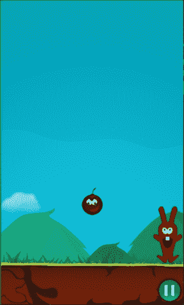
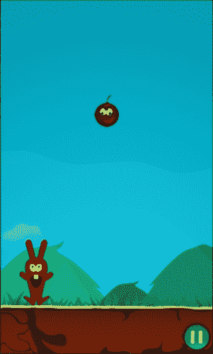

# 四、用户输入

到目前为止，我们已经添加了在屏幕上移动并相互碰撞的图形，但这还不好玩，因为玩家无法控制我们的主角，除非我们的用户能够与之交互，否则这不会是一个游戏。在本章中，我们将为我们的游戏添加用户交互。本章将涵盖以下主题:

*   理解事件调度机制
*   处理触摸事件
*   处理加速度计事件
*   保持屏幕活跃
*   处理安卓回车键按下事件

# 了解事件调度机制

事件的处理现在已经和以前版本(版本 2)的 Cocos2d-x 不一样了，从 3.0 版本开始，我们现在有了一个统一的事件调度机制，叫做事件调度器(Event Dispatcher)，处理各种用户输入事件，这些事件可能会在游戏过程中发生。

我们可以处理多种用户输入事件，例如触摸、键盘按键、加速和鼠标运动。在接下来的部分中，我们将介绍如何处理与移动游戏相关的用户输入事件，例如触摸和加速度计。

有许多课程可以让我们聆听前面提到的每一个事件；一旦我们实例化了这些类中的任何一个，我们就需要将它们添加到事件调度器中，这样，当用户事件被触发时，它将调用由其对应的侦听器定义的方法。

您可以通过从`Node`类继承的`_eventDispatcher`实例属性，或者通过调用位于 Cocos2d-x API `Director`类中的`getEventDispatcher`静态方法来访问事件调度器。

### 注

Cocos2d-x 事件调度机制使用了观察者设计模式，这是用于在 Android 原生应用程序上处理用户输入事件的模式。

# 处理触摸事件

在游戏和用户之间创建交互的最常见方式是通过触摸事件。在 Cocos2d-x 中处理触摸事件非常简单。

在这一部分，我们将允许用户通过触摸来移动我们的播放器精灵，并将其移动到所需的位置。

我们要做的第一件事是在`HelloWorldScene.h`类头文件中创建`initTouch`、`movePlayerByTouch`和`movePlayerIfPossible`方法，如下面的代码清单所示:

```cpp
void initTouch();
void movePlayerByTouch(cocos2d::Touch* touch, cocos2d::Event* event);
void movePlayerIfPossible(float newX);
```

现在让我们将初始化代码添加到实现文件`HelloWorldScene.cpp`中的`initTouch`方法中。在这个简单的游戏中，我们将使用一次触摸来移动我们的兔子角色，不需要多次触摸。

为了处理单次触摸，我们将创建一个`EventListenerTouchOneByOne`类的新实例，然后我们将指定当触摸事件开始时，当触摸正在移动时，以及当触摸事件结束时，我们的游戏应该做什么。在下面的代码清单中，在实例化`EventListenerTouchOneByOne`类之后，我们将指定当事件`onTouchBegan`、`onTouchMoved`和`onTouchEnded`被触发时应该调用的方法。为了当前游戏的目的，我们将只使用`onTouchMoved`事件。为此，我们将创建对我们的方法`movePlayerByTouch`的回调，对于另外两个方法，我们将通过lambda 函数创建空结构。您可以从链接[http://en.cppreference.com/w/cpp/language/lambda](http://en.cppreference.com/w/cpp/language/lambda)了解更多关于 C++ lambda 函数的信息。

```cpp
void HelloWorld::initTouch() {
  auto listener = EventListenerTouchOneByOne::create();
  listener->onTouchBegan = [](Touch* touch, Event* event){return true;
  }
  listener->onTouchMoved = CC_CALLBACK_2(HelloWorld::movePlayerByTouch,this);
  listener->onTouchEnded = [=](Touch* touch, Event* event){};
  _eventDispatcher->addEventListenerWithSceneGraphPriority(listener, this);
}
```

### 注

按照惯例，所有 C++成员变量都用下划线前缀命名。

现在我们已经将所有的触摸监听器初始化代码封装到一个方法中，让我们通过在方法的末尾添加下面一行来将其称为我们的`init`方法:

```cpp
  initTouch();
```

我们现在将创建`movePlayerIfPossible`方法。只有当水平轴上新请求的位置没有超出屏幕限制时，这才会移动玩家精灵，正如我们在图中看到的。这种方法将用于通过触摸输入事件来移动我们的玩家精灵，它也将在下一节中使用，我们将使用加速度计来移动我们的玩家精灵。

```cpp
void HelloWorld::movePlayerIfPossible(float newX){
  float sprHalfWidth = _sprPlayer->getBoundingBox().size.width/2;
  if(newX >= sprHalfWidth && newX < visibleSize.width - sprHalfWidth){
    _sprPlayer->setPositionX(newX);
  }
}
```



### 注

在这个方法中，我们使用了“告诉，不问”的设计原则，在验证玩家是否出屏的方法中进行了验证。这使我们不必在触摸和加速度计事件处理方法中重复验证玩家精灵是否在屏幕之外的逻辑。

最后，我们现在将创建`movePlayerByTouch`方法，一旦触发触摸事件，事件调度器就会调用该方法。在这个方法中，我们将评估屏幕上的位置，以及用户触摸屏幕的位置是否与精灵的边框相交:

```cpp
void HelloWorld::movePlayerByTouch(Touch* touch, Event* event){
  auto touchLocation = touch->getLocation();
  if(_sprPlayer->getBoundingBox().containsPoint(touchLocation)){
    movePlayerIfPossible(touchLocation.x);
  }
}
```

## 处理多点触控事件

在前面的部分，我们启用了本次游戏所需的触控事件，为单次触控；尽管如此，Cocos2d-x 还处理多点触控功能，我们将在本节中介绍。

虽然我们的游戏不需要多点触控功能，但我们会创建一个测试代码，这样我们就可以同时移动我们的玩家精灵和炸弹。为此，我们将在`HelloWorldScene.h`头文件的末尾添加方法`initMultiTouch`和`moveByMultitouch`，如下所示:

```cpp
void initMultiTouch();
void moveByMultiTouch(const std::vector<cocos2d::Touch*>& touches, cocos2d::Event* event);
```

现在，让我们将其实现添加到`HelloWorldScene.cpp`实现文件中。我们将从`initMultiTouch`初始化方法开始:

```cpp
void HelloWorld::initMultiTouch() {
  auto listener = EventListenerTouchAllAtOnce::create();
  listener->onTouchesBegan = [](const std::vector<Touch*>& touches, Event* event){};
  listener->onTouchesMoved = CC_CALLBACK_2(HelloWorld::moveByMultiTouch,this);
  listener->onTouchesEnded = [](const std::vector<Touch*>& touches, Event* event){};
  _eventDispatcher->addEventListenerWithSceneGraphPriority(listener, this);
}
```

在这里我们可以找到与之前的单触初始化方法的相似之处，但也有很多不同之处，最臭名昭著的就是我们现在实例化的是`EventListenerTouchAllAtOnce`类，而不是像之前那样实例化`EventListenerTouchOneByOne`类。虽然其事件属性的命名类似于其单触版本，但您可能会注意到它们现在是以复数形式书写的，因此它现在指的是触摸而不是触摸，例如，`onTouchesBegan`。现在，它还将期待一组不同的参数，因为我们现在将处理多个触摸，事件方法现在将接收一个`std::vector`参数，在那里它将接收同时发生的触摸的集合。

如前面的代码所示，我们将在每次我们的玩家移动触摸时调用我们的`moveByMultiTouch`方法，所以我们现在显示这个方法的实现代码:

```cpp
void HelloWorld::moveByMultiTouch(const std::vector<Touch*>& touches, Event* event){
  for(Touch* touch: touches){
    Vec2 touchLocation = touch->getLocation();
    if(_sprPlayer->getBoundingBox().containsPoint(touchLocation)){
      movePlayerIfPossible(touchLocation.x);
    }else if(_sprBomb->getBoundingBox().containsPoint(touchLocation)){
      _sprBomb->setPosition(touchLocation);
    }
  }
}
```

正如你从前面的代码中可以看到的，我们现在正在处理多个触摸，在`moveByMultiTouch`方法中，我们正在迭代所有的触摸，对于每个触摸，我们正在验证它是否正在触摸我们的炸弹或我们的兔子玩家精灵，如果它这样做了，那么它将把触摸的精灵移动到触摸的位置。

最后，让我们在`init`方法的末尾调用`initMultiTouch`初始化方法，如下所示:

```cpp
initMultiTouch();
```

如前所述，本节的目的是向您展示处理多点触控事件有多简单；然而，由于我们不打算在我们的游戏中使用它，一旦您完成多点触控功能的测试，您就可以取消对我们刚刚添加到我们的`init`方法中的`initMultiTouch`方法的调用。

# 处理加速计事件

游戏与玩家互动的另一种常见方式是加速度计，它可以让我们通过移动手机来享受几个小时的乐趣，以移动我们的角色并实现游戏的目标。

为了给我们的游戏增加加速度计支持，我们首先要在我们的`HelloWorldScene.h`头文件中添加以下方法声明:

```cpp
void movePlayerByAccelerometer(cocos2d::Acceleration* acceleration, cocos2d::Event* event);
void initAccelerometer();
```

现在，让我们创建对应于加速度计初始化的`HelloWorld.cpp`实现文件的代码。我们要做的第一件事是启用设备上的加速度计传感器，通过调用位于`Device`类上的静态方法`setAccelerometerEnabled`，然后我们要创建事件监听器，该监听器将监听加速度计的事件，最后，我们将它添加到事件调度器中，如以下代码所示:

```cpp
void HelloWorld::initAccelerometer(){
  Device::setAccelerometerEnabled(true);
  auto listener = EventListenerAcceleration::create(CC_CALLBACK_2(HelloWorld::movePlayerByAccelerometer, this));
  _eventDispatcher->addEventListenerWithSceneGraphPriority(listener, this);
}
```

### 注

向调度器添加事件监听器最常见的方法是通过`addEventListenerWithSceneGraphPriority`方法，该方法将作为第二个参数发送的节点的 *z* 顺序指定为其优先级。当我们有许多同时被触发的侦听器，并且我们想要指定哪个代码应该首先运行时，这很有用。

在这一点上，我们已经初始化了加速度计，并且我们已经在前一节中创建了`movePlayerIfPossible`方法，该方法将移动玩家精灵并确保它不会超出屏幕限制。现在我们将为`movePlayerByAccelerometer`方法创建实现代码，一旦触发加速度计事件，就会调用该代码。由于我们得到的加速度值非常低，我们将其乘以 10，这样我们的玩家精灵移动得更快。

```cpp
void HelloWorld::movePlayerByAccelerometer(cocos2d::Acceleration* acceleration, cocos2d::Event* event){
  int accelerationMult = 10;
  movePlayerIfPossible(_sprPlayer->getPositionX() + (acceleration->x * accelerationMult));
}
```

最后，让我们从`HelloWorldScene.cpp`实现文件中调用`init`方法末尾的加速度计初始化代码，如下所示:

```cpp
initAccelerometer();
```

# 保持屏幕活跃

在上一节我们在游戏中加入了加速度计交互，这意味着我们的玩家是通过移动手机而不是触摸屏幕来控制主角，这将导致很多安卓设备在一段时间不活动(不触摸屏幕)后关闭屏幕。当然，没有人会喜欢我们安卓设备的屏幕突然变黑；为了防止这种情况的发生，我们将调用`setKeepScreenOnJni`方法，在之前的 3.3 版本框架中介绍过。在这个版本之前，这种恼人的情况被认为是一个框架缺陷，现在它终于被修复了。

我们首先需要在`HelloWorldScene.cpp`头文件中包含助手，如下所示:

```cpp
#include "../cocos2d/cocos/platform/android/jni/Java_org_cocos2dx_lib_Cocos2dxHelper.h"
```

然后，我们将在`HelloWorldScene.cpp`实现文件中的`init`方法末尾添加以下一行:

```cpp
setKeepScreenOnJni(true);
```

# 处理安卓回车键按下事件

我在很多使用 Cocos2d-x 开发的游戏中看到的一个常见错误是，当按下后退按钮时，游戏什么都不做。安卓用户习惯于每当想回到上一个活动时就按下后退按钮。如果应用程序在按下后退按钮时什么都不做，那么它会让用户感到困惑，因为这不是预期的行为，经验较少的用户甚至可能很难退出游戏。

通过向我们的事件调度器添加`EventListenerKeyboard`方法，我们可以在用户按下后退按钮的任何时候轻松触发自定义代码。

首先，我们将在我们的`HelloWorldScene.h`头文件中添加`initBackButtonListener`和`onKeyPressed`方法声明，如下面的代码清单所示:

```cpp
void initBackButtonListener();
void onKeyPressed(cocos2d::EventKeyboard::KeyCode keyCode, cocos2d::Event* event);
```

现在，让我们在`HelloWorldScene.cpp`实现文件中添加`initBackButtonListener`的实现代码。我们首先要实例化`EventListenerKeyboard`类，然后我们需要指定将要在`onKeyPressed`事件和`onKeyReleased`事件上调用的方法，否则我们将得到一个运行时错误。我们将创建一个空的方法实现，并通过 C++11 lambda 表达式将其分配给`onKeyPressed`属性，然后我们将为侦听器的`onkeyRelease`属性向我们的`onKeyPressed`方法添加一个回调。然后，正如我们之前所做的那样，我们将把这个监听器添加到事件调度器机制中:

```cpp
void HelloWorld::initBackButtonListener(){
  auto listener = EventListenerKeyboard::create();
  listener->onKeyPressed = [=](EventKeyboard::KeyCode keyCode, Event* event){};
  listener->onKeyReleased = CC_CALLBACK_2(HelloWorld::onKeyPressed, this);
  _eventDispatcher->addEventListenerWithSceneGraphPriority(listener, this);
}
```

我们现在要实现我们的`onKeyPressed`方法的代码。这将告诉`Director`结束游戏，如果按下的键是后退键:

```cpp
void HelloWorld::onKeyPressed(EventKeyboard::KeyCode keyCode, Event* event){
  if(keyCode == EventKeyboard::KeyCode::KEY_BACK){
    Director::getInstance()->end();
  }
}
```

最后，我们将在`init`方法的末尾调用`initBackButtonListener`方法，如下所示:

```cpp
initBackButtonListener();
```

### 注

请注意，您应该在每个场景中将`EventListenerKeyboard`监听器添加到事件调度器中，在这些场景中，您想要捕捉按下后退按钮的事件。

# 把所有东西放在一起

在我们在本章中添加的所有代码之后，现在，我们的`HelloWorldScene.h`头文件将如下所示:

```cpp
#ifndef __HELLOWORLD_SCENE_H__
#define __HELLOWORLD_SCENE_H__
#include "cocos2d.h"
class HelloWorld : public cocos2d::Layer
{
public:
  static cocos2d::Scene* createScene();
  virtual bool init();
  void pauseCallback(cocos2d::Ref* pSender);
  CREATE_FUNC(HelloWorld);
private:
  cocos2d::Director *_director;
  cocos2d::Size visibleSize;
  cocos2d::Sprite* _sprBomb;
  cocos2d::Sprite* _sprPlayer;
  void initPhysics();
  bool onCollision(cocos2d::PhysicsContact& contact);
  void setPhysicsBody(cocos2d::Sprite* sprite);
  void initTouch();
  void movePlayerByTouch(cocos2d::Touch* touch, cocos2d::Event* event);
  void movePlayerIfPossible(float newX);
  void movePlayerByAccelerometer(cocos2d::Acceleration* acceleration, cocos2d::Event* event);
  void initAccelerometer();
  void initBackButtonListener();
  void onKeyPressed(cocos2d::EventKeyboard::KeyCode keyCode, cocos2d::Event* event);
};

#endif // __HELLOWORLD_SCENE_H__
```

最终的`HelloWorldScene.cpp`实现文件将如下所示:

```cpp
#include "HelloWorldScene.h"
#include "PauseScene.h"
#include "../cocos2d/cocos/platform/android/jni/Java_org_cocos2dx_lib_Cocos2dxHelper.h"

USING_NS_CC;
Scene* HelloWorld::createScene()
{
  auto scene = Scene::createWithPhysics();
  scene->getPhysicsWorld()->setGravity(Vect(0,0));
  auto layer = HelloWorld::create();
  //enable debug draw
  //scene->getPhysicsWorld()->setDebugDrawMask(PhysicsWorld::DEBUGDRAW_ALL);
  scene->addChild(layer);
  return scene;
}
```

接下来，我们将尝试移动播放器，使其不会超出屏幕:

```cpp
void HelloWorld::movePlayerIfPossible(float newX){
  float sprHalfWidth = _sprPlayer->getBoundingBox().size.width/2;
  if(newX >= sprHalfWidth && newX < visibleSize.width - sprHalfWidth){
    _sprPlayer->setPositionX(newX);
  }
}
void HelloWorld::movePlayerByTouch(Touch* touch, Event* event)
{
  Vec2 touchLocation = touch->getLocation();
  if(_sprPlayer->getBoundingBox().containsPoint(touchLocation)){
    movePlayerIfPossible(touchLocation.x);
  }
}
```

正如你在下面的两个方法`initTouch`和`initAccelerometer`中看到的，我们已经为每个初始化任务创建了函数。这将允许我们简化代码，并使其更易于阅读:

```cpp
void HelloWorld::initTouch()
{
  auto listener = EventListenerTouchOneByOne::create();
  listener->onTouchBegan = [](Touch* touch, Event* event){return true;};
  listener->onTouchMoved = CC_CALLBACK_2(HelloWorld::movePlayerByTouch,this);
  listener->onTouchEnded = [=](Touch* touch, Event* event){};
  _eventDispatcher->addEventListenerWithSceneGraphPriority(listener, this);
}
void HelloWorld::initAccelerometer()
{
  Device::setAccelerometerEnabled(true);
  auto listener = EventListenerAcceleration::create(CC_CALLBACK_2(HelloWorld::movePlayerByAccelerometer, this));
  _eventDispatcher->addEventListenerWithSceneGraphPriority(listener, this);
}

void HelloWorld::movePlayerByAccelerometer(cocos2d::Acceleration* acceleration, cocos2d::Event* event)
{
  movePlayerIfPossible(_sprPlayer->getPositionX() + (acceleration->x * 10));
}
```

现在，我们将初始化物理。为此，我们将在 init()中调用 initPhysics()方法:

```cpp
bool HelloWorld::init()
{
  if( !Layer::init() ){
    return false;
  }
  _director = Director::getInstance();
  visibleSize = _director->getVisibleSize();
  auto origin = _director->getVisibleOrigin();
  auto closeItem = MenuItemImage::create("pause.png", "pause_pressed.png", CC_CALLBACK_1(HelloWorld::pauseCallback, this));
  closeItem->setPosition(Vec2(visibleSize.width - closeItem->getContentSize().width/2, closeItem->getContentSize().height/2));

  auto menu = Menu::create(closeItem, nullptr);
  menu->setPosition(Vec2::ZERO);
  this->addChild(menu, 1);
  _sprBomb = Sprite::create("bomb.png");
  _sprBomb->setPosition(visibleSize.width/2, visibleSize.height + _sprBomb->getContentSize().height/2);
  this->addChild(_sprBomb,1);
  auto bg = Sprite::create("background.png");
  bg->setAnchorPoint(Vec2());
  bg->setPosition(0,0);
  this->addChild(bg, -1);
  _sprPlayer = Sprite::create("player.png");
  _sprPlayer->setPosition(visibleSize.width/2, visibleSize.height * 0.23);
  setPhysicsBody(_sprPlayer);

  this->addChild(_sprPlayer, 0);
  //Animations
  Vector<SpriteFrame*> frames;
  Size playerSize = _sprPlayer->getContentSize();
  frames.pushBack(SpriteFrame::create("player.png", Rect(0, 0, playerSize.width, playerSize.height)));
  frames.pushBack(SpriteFrame::create("player2.png", Rect(0, 0, playerSize.width, playerSize.height)));
  auto animation = Animation::createWithSpriteFrames(frames,0.2f);
  auto animate = Animate::create(animation);
  _sprPlayer->runAction(RepeatForever::create(animate));

  setPhysicsBody(_sprBomb);
  initPhysics();
  _sprBomb->getPhysicsBody()->setVelocity(Vect(0,-100));
  initTouch();
  initAccelerometer();
  setKeepScreenOnJni(true);
  initBackButtonListener();
  return true;
}

void HelloWorld::pauseCallback(cocos2d::Ref* pSender){
  _director->pushScene(TransitionFlipX::create(1.0, Pause::createScene()));
}
void HelloWorld::initBackButtonListener(){
  auto listener = EventListenerKeyboard::create();
  listener->onKeyPressed = [=](EventKeyboard::KeyCode keyCode, Event* event){};
  listener->onKeyReleased = CC_CALLBACK_2(HelloWorld::onKeyPressed, this);
  _eventDispatcher->addEventListenerWithSceneGraphPriority(listener, this);
}

void HelloWorld::onKeyPressed(EventKeyboard::KeyCode keyCode, Event* event){
  if(keyCode == EventKeyboard::KeyCode::KEY_BACK){
    Director::getInstance()->end();
  }
}
```

正如我们在下图中看到的，我们终于让我们的兔子在屏幕上移动，并离开它的初始中心位置。



### 注

请注意，在前面的代码列表中，我们省略了与本章无关的代码段。如果您想看看完整的代码清单在这一点上是什么样子，那么您可以在本书附带的资源材料中找到它。

# 总结

在本章中，我们允许用户使用两种不同的输入机制来控制我们的游戏，即触摸屏幕和移动手机以使用加速度传感器；每当按下后退按钮时，我们也让我们的游戏停止。

在下一章中，我们将介绍向游戏中添加文本的不同方式。