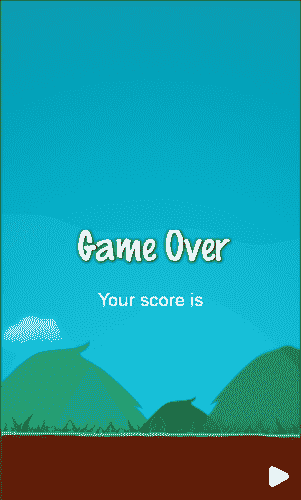

# 五、处理文本和字体

在我们的游戏中，添加文本向玩家显示信息是非常常见的。这可以通过使用 TrueType 字体或位图字体来实现，这将使我们具有更大的灵活性，并且确实是专业游戏中使用最多的字体类型，因为它允许我们为游戏赋予自定义外观。本章将涵盖以下主题:

*   创建 TrueType 字体标签
*   添加标签效果
*   创建系统字体
*   创建位图字体标签

# 创建 TrueType 字体标签

使用 TrueType 字体添加文本真的很简单。打开我们在[第二章](2.html "Chapter 2. Graphics")、*图形*中创建的`PauseScene.cpp`实现文件。在`init`方法中，您将看到我们通过调用静态方法`createWithTTF`创建了一个`Label`类的实例。这个方法接收三个参数，第一个是我们要绘制的字符串，第二个是另一个代表你要使用的字体文件的字符串，包括它所在的`Resources`文件夹内的路径，第三个代表字体大小。

### 注

`Label`类是在 Cocos2d-x 3 . x 版本中引入的，它将 TrueType 字体和位图字体处理结合在一个类中。然而，尽管不推荐使用，但出于兼容性的原因，以前的标签处理类在 API 中仍然可用。

现在，让我们在`createWithTTF` 方法中将第三个参数值从 24 更改为 96，以使字体更大:

```cpp
auto label = Label::createWithTTF("PAUSE", "fonts/Marker Felt.ttf", 96);
```

### 注

标记毡字体包含在由`cocos new`命令生成的模板 Cocos2d-x 项目中。

## 创造我们的游戏超世

现在是在场景上方创建一个游戏的时候了，这将在一颗炸弹撞上我们的`bunny`精灵时显示。

我们将通过复制我们的`Classes`目录中的`PauseScene.cpp`和`PauseScene.h`文件并将它们分别重命名为`GameOverScene.cpp`和`GameOverScene.h`来实现这一点。

### 类型

请记住，每次在 Cocos2d-x 文件夹中添加新的源文件时，都需要将该类添加到包含在`jni`文件夹中的`Android.mk`文件中，以便在下一次构建时编译这个新的源文件。

现在在`GameOverScene.h`和`GameOverScene.cpp`文件中，对这两个文件执行查找和替换，并将单词`Pause`替换为单词`GameOver`。

最后，用第一行代码代替`GameOverScene.cpp`实现文件:

```cpp
#include "GameOverScene.h"
#include "HelloWorldScene.h"
```

在`GameOverScene.cpp`实现文件的`exitPause`方法的主体中，我们将用这个方法拥有的唯一一行替换这个:

```cpp
   Director::getInstance()->replaceScene(TransitionFlipX:: create(1.0, HelloWorld::createScene()));;
```

## 当玩家输了，我们的游戏就结束了

我们已经创建了我们的游戏场景；现在让我们在炸弹与我们的`player`精灵相撞后立即展示。为了实现这一点，我们将向包含在`HelloWorld`类中的`onCollision`方法添加下面一行代码。

```cpp
_director->replaceScene(TransitionFlipX::create(1.0, GameOver::createScene()));
```

现在，通过在`HelloWorldScene.h`头文件的开头添加以下一行，将游戏场景头文件包含到我们的`gameplay`类中:

```cpp
#include "GameOverScene.h"
```

## 自定义游戏超场景

现在，我们不想要黑色的背景颜色，所以我们将添加我们在游戏中使用的相同背景，就像我们在[第 2 章](2.html "Chapter 2. Graphics")、*图形*中所做的那样:

```cpp
  auto bg = Sprite::create("background.png");
  bg->setAnchorPoint(Vec2());
  bg->setPosition(0,0);
  this->addChild(bg, -1);
```

现在我们要改变 TrueType 字体标签，我们从`PauseScene`复制过来的，现在会读作`Game Over`。在下一节中，我们将为这个标签添加一些效果。

```cpp
   auto label = Label::createWithTTF("Game Over", "fonts/Marker Felt.  ttf", 96);
```

## 添加标签效果

现在我们将添加仅适用于 TrueType 字体的效果。

让我们启用字体的轮廓。来自`Label`类的`enableOutline`方法接收两个参数，一个`Color4B`实例和一个代表轮廓尺寸的整数——数字越大轮廓越粗:

```cpp
  label->enableOutline(Color4B(255, 0, 0, 100),6);
```

现在，让我们给字体添加一些发光效果:

```cpp
  label->enableGlow(Color4B(255, 0, 0, 255));
```

最后，让我们将阴影效果添加到标签中，这是目前所有三种标签类型都支持的效果。

```cpp
  label->enableShadow();
```

正如您从下面的截图中注意到的，效果相互重叠，因此决定哪一个看起来更好:


`Color4B`构造器方法接收四个参数。前三个是**红绿蓝** ( **RGB** )组件，第四个一个是`alpha`组件。这将允许我们添加一些透明度效果，范围可以从 0 到 255。标签实例不支持自定义效果，例如为文本的每个单词赋予不同的颜色，为单个文本使用不同的字体，或者在标签中嵌入图像。

### 类型

如果你有兴趣在你的游戏中添加这些字体效果，那么你可以使用由卢马·斯图布马创建的`CCRichLabelTTF`类。这在[https://github.com/stubma/cocos2dx-better](https://github.com/stubma/cocos2dx-better)有售。

# 创建系统字体

您可以创建使用主机操作系统字体的标签；因此，您不需要提供字体文件。建议您仅出于测试目的使用这种标签，因为它会降低框架的灵活性，因为所选字体可能在用户的安卓操作系统版本上不可用。

为了测试，在我们当前的文本下面，我们将在`GameOverScene.cpp`实现文件的`init`方法中添加以下标签:

```cpp
auto label2 = Label::createWithSystemFont("Your score is", "Arial", 48);
label2->setPosition(origin.x + visibleSize.width/2,origin.y + visibleSize.height /2.5);
this->addChild(label2, 1);
```

这段代码产生以下结果:



# 创建位图字体标签

到目前为止，我们已经看到了使用 TrueType 和系统字体创建标签是多么容易，现在我们将执行一些额外的步骤，以便为我们的标签实现更专业的风格。如前所述，位图字体是专业游戏中最常见的标签类型。

顾名思义，位图字体是由代表每个字符的图像生成的，这将允许我们绘制任何我们想要的字体，但是它将具有位图的所有缺点，例如我们的标签被像素化的风险，在处理不同大小时缺乏灵活性，以及磁盘和内存上用于处理这种字体的额外空间。

有几个应用程序可以用来创建位图字体。最常见的一个是**字形设计器**，可以从网址[https://71squared.com](https://71squared.com)获取。这个应用最初是为 Mac OS 发布的，但是在 2015 年初**字形设计器 X** 也为 Windows 发布了。也可以使用免费的在线应用**litha**创建自己的位图字体。在[http://kvazars.com/littera](http://kvazars.com/littera)有。出于本书的目的，我们在章节中包含了位图字体的代码。我们将使用这个位图字体代码来显示玩家在游戏中的总得分。

## 给我们的游戏增加更多炸弹

考虑到现在我们有一个游戏结束场景，让我们通过添加更多的炸弹来增加这个游戏的难度。我们将使用 Cocos2d-x 调度机制，它将允许我们在每个给定的时间段内调用一个方法。我们将把`addBombs`方法添加到`HelloWorldScene`类中，在前面提到的类的`init`方法中，我们将对其进行调度，使其每八秒钟被调用一次:

```cpp
schedule(CC_SCHEDULE_SELECTOR(HelloWorld::addBombs), 8.0f);
```

我们将在场景中添加三个随机位置的炸弹，每次调用`addBombs`方法时都会发生:

```cpp
void HelloWorld::addBombs(float dt)
{
   Sprite* bomb = nullptr;
   for(int i = 0 ; i < 3 ; i++)
   {
         bomb = Sprite::create("bomb.png");
         bomb->setPosition(CCRANDOM_0_1() * visibleSize.width,   visibleSize.height + bomb->getContentSize().height/2);
         this->addChild(bomb,1);
         setPhysicsBody(bomb);
         bomb->getPhysicsBody()->setVelocity(Vect(0, ( (CCRANDOM_0_1() + 0.2f) * -250) ));
   }
}
```

该代码产生以下结果:


### 注

通过使用`CC_SCHEDULE_SELECTOR`宏，我们创建了一个自定义选择器，在本例中被称为**自定义时间间隔**。所选功能应接收`float`参数，该参数代表最后一次调用和当前调用之间经过的时间量，以便您可以独立于硬件处理速度计算统一的游戏节奏。如果您没有将第二个`float`参数传递给调度函数，那么它将在每一帧中执行所选的函数。

在场景中我们要给调度器增加另一个方法，每三秒调用一次，给玩家的分数加 10 分。所以玩家可以避免被炸弹击中的时间越长，他或她的分数就会越大。

现在我们有两个以上的物理体，这意味着我们必须修改我们的`onCollision`方法，以便只有当`player`精灵参与碰撞时，它才会变为`gameOverScene`。为此，我们将在方法的开头添加以下代码行:

```cpp
auto playerShape = _sprPlayer->getPhysicsBody()->getFirstShape();
if(playerShape != contact.getShapeA() && playerShape != contact.getShapeB())
   {
      return false;
   }
```

如果方法没有返回，这意味着玩家精灵确实卷入了冲突。因此，我们将使用 Cocos2d-x 内置的存储机制来编写存储在成员变量`_score`中的玩家分数:

```cpp
UserDefault::getInstance()->setIntegerForKey("score",_score);
```

### 注

`UserDefault`类允许我们访问 Cocos2d-x 数据存储机制。可以存储`bool`、`int`、`float`、`double`和`string`值。使用此类存储的数据可以通过调用`flush`方法来持久化，该方法将数据存储在一个 XML 文件中。

我们可以像创建 TrueType 字体和系统字体一样创建位图字体。我们将在`GameOverScene.cpp`实现文件的`init`方法中添加以下几行代码:

```cpp
char scoreText[32];
int score = UserDefault::getInstance()->getIntegerForKey("score",0);
sprintf(scoreText, "%d", score);
auto label3 = Label::createWithBMFont("font.fnt", scoreText);
label3->setPosition(origin.x + visibleSize.width/2,origin.y + visibleSize.height /3.5);
this->addChild(label3, 1);
```

前面的代码将产生以下结果:


# 把所有东西放在一起

经过我们所有的修改后，这就是我们的`HelloWorldScene.h`头文件的样子:

```cpp
#ifndef __HELLOWORLD_SCENE_H__
#define __HELLOWORLD_SCENE_H__

#include "cocos2d.h"

#include "PauseScene.h"
#include "GameOverScene.h"

```

包含`GameOverScene.h`是本章中我们对这个头文件所做的唯一更改:

```cpp
class HelloWorld : public cocos2d::Layer
{
public:
    static cocos2d::Scene* createScene();
    virtual bool init();
    void pauseCallback(cocos2d::Ref* pSender);
    CREATE_FUNC(HelloWorld);
private:
   cocos2d::Director *_director;
   cocos2d::Size visibleSize;
   cocos2d::Sprite* _sprBomb;
   cocos2d::Sprite* _sprPlayer;
   int _score;
   void initPhysics();
   bool onCollision(cocos2d::PhysicsContact& contact);
   void setPhysicsBody(cocos2d::Sprite* sprite);
   void initTouch();
   void movePlayerByTouch(cocos2d::Touch* touch, cocos2d::Event*  event);
   void movePlayerIfPossible(float newX);
   void movePlayerByAccelerometer(cocos2d::Acceleration*  acceleration, cocos2d::Event* event);
   void initAccelerometer();
   void initBackButtonListener();
   void onKeyPressed(cocos2d::EventKeyboard::KeyCode keyCode,    cocos2d::Event* event);
   void updateScore(float dt);
   void addBombs(float dt);   
};

#endif // __HELLOWORLD_SCENE_H__
```

现在，我们的`HelloWorldScene.cpp`实现文件是这样的:

```cpp
#include "HelloWorldScene.h"
#include "../cocos2d/cocos/platform/android/jni/Java_org_cocos2dx_lib_Cocos2dxHelper.h"

USING_NS_CC;

Scene* HelloWorld::createScene()
{
   auto scene = Scene::createWithPhysics();   
   scene->getPhysicsWorld()->setGravity(Vect(0,0));
   auto layer = HelloWorld::create();
   //enable debug draw
   //scene->getPhysicsWorld()->setDebugDrawMask(PhysicsWorld::DEBUGDR  AW_ALL);
   scene->addChild(layer);
   return scene;
}
```

我们现在将添加事件和物理的代码:

```cpp
void HelloWorld::updateScore(float dt)
{
   _score += 10;
}

void HelloWorld::addBombs(float dt)
{
   Sprite* bomb = nullptr;
   for(int i = 0 ; i < 3 ; i++)
   {
      bomb = Sprite::create("bomb.png");   
      bomb->setPosition(CCRANDOM_0_1() * visibleSize.width,  visibleSize.height + bomb->getContentSize().height/2);
      this->addChild(bomb,1);
      setPhysicsBody(bomb);
      bomb->getPhysicsBody()->setVelocity(Vect(0,  ( (CCRANDOM_0_1() + 0.2f) * -250) ));
   }
}

}

bool HelloWorld::init()
{
    if ( !Layer::init() )
    {
        return false;
    }
   _score = 0;
   _director = Director::getInstance();
   visibleSize = _director->getVisibleSize();
   auto origin = _director->getVisibleOrigin();
   auto closeItem = MenuItemImage::create("pause.png", "pause_pressed.png", CC_CALLBACK_1(HelloWorld::pauseCallback, this));

   closeItem->setPosition(Vec2(visibleSize.width - closeItem-  >getContentSize().width/2, closeItem->getContentSize().height/2));

   auto menu = Menu::create(closeItem, nullptr);
   menu->setPosition(Vec2::ZERO);
   this->addChild(menu, 1);
   _sprBomb = Sprite::create("bomb.png");
   _sprBomb->setPosition(visibleSize.width / 2,  visibleSize.height + _sprBomb->getContentSize().height/2);
   this->addChild(_sprBomb,1);
   auto bg = Sprite::create("background.png");
   bg->setAnchorPoint(Vec2());
   bg->setPosition(0,0);
   this->addChild(bg, -1);
   _sprPlayer = Sprite::create("player.png");   
   _sprPlayer->setPosition(visibleSize.width / 2, visibleSize.height * 0.23);
   setPhysicsBody(_sprPlayer);
   this->addChild(_sprPlayer, 0);
   //Animations
   Vector<SpriteFrame*> frames;
   Size playerSize = _sprPlayer->getContentSize();
   frames.pushBack(SpriteFrame::create("player.png",  Rect(0, 0, playerSize.width, playerSize.height)));
   frames.pushBack(SpriteFrame::create("player2.png",  Rect(0, 0, playerSize.width, playerSize.height)));
   auto animation =  Animation::createWithSpriteFrames(frames,0.2f);
   auto animate = Animate::create(animation);
   _sprPlayer->runAction(RepeatForever::create(animate));   

   setPhysicsBody(_sprBomb);   
   initPhysics();   
   _sprBomb->getPhysicsBody()->setVelocity(Vect(0,-100));   
   initTouch();
   initAccelerometer();   
   setKeepScreenOnJni(true);
   initBackButtonListener();
   schedule(CC_SCHEDULE_SELECTOR (HelloWorld::updateScore), 3.0f);
   schedule(CC_SCHEDULE_SELECTOR (HelloWorld::addBombs), 8.0f);
   return true;
}

void HelloWorld::pauseCallback(cocos2d::Ref* pSender){
   _director->pushScene(TransitionFlipX::create(1.0, Pause::createScene()));
}
```

我们的`GameOverScene.h`头文件现在看起来是这样的:

```cpp
#ifndef __GameOver_SCENE_H__
#define __GameOver_SCENE_H__

#include "cocos2d.h"
#include "HelloWorldScene.h"

class GameOver : public cocos2d::Layer
{
public:
    static cocos2d::Scene* createScene();
    virtual bool init();    
    void exitPause(cocos2d::Ref* pSender);
    CREATE_FUNC(GameOver);
private:
   cocos2d::Sprite* sprLogo;
   cocos2d::Director *director;
   cocos2d::Size visibleSize;   
};

#endif // __Pause_SCENE_H__
```

而最后，我们的`GameOverScene.cpp`实现文件会是这样的:

```cpp
#include "GameOverScene.h"

USING_NS_CC;

Scene* GameOver::createScene()
{
    auto scene = Scene::create();
    auto layer = GameOver::create();
    scene->addChild(layer);
    return scene;
}

bool GameOver::init()
{
    if ( !Layer::init() )
    {
        return false;
    }
   director = Director::getInstance();  
   visibleSize = director->getVisibleSize();
   Vec2 origin = director->getVisibleOrigin();
   auto pauseItem = MenuItemImage::create("play.png", "play_pressed.png", CC_CALLBACK_1(GameOver::exitPause, this));
   pauseItem->setPosition(Vec2(origin.x + visibleSize.width -   pauseItem->getContentSize().width / 2, origin.y + pauseItem-  >getContentSize().height / 2));
   auto menu = Menu::create(pauseItem, NULL);
   menu->setPosition(Vec2::ZERO);
   this->addChild(menu, 1);
   auto bg = Sprite::create("background.png");
   bg->setAnchorPoint(Vec2());
   bg->setPosition(0,0);
   this->addChild(bg, -1);
```

在下面的代码行中，我们已经创建了本章中介绍的三种类型的字体:

```cpp
   auto label = Label::createWithTTF("Game Over", "fonts/Marker  Felt.ttf", 96);
   label->enableOutline(Color4B(255, 0, 0, 100),6);
   label->enableGlow(Color4B(255, 0, 0, 255));
   label->enableShadow();
   label->setPosition(origin.x + visibleSize.width/2,  origin.y + visibleSize.height /2);
   this->addChild(label, 1);
   auto label2 = Label::createWithSystemFont("Your score is",  "Arial", 48);
   label2->setPosition(origin.x + visibleSize.width/2,origin.y  + visibleSize.height/2.5);
   this->addChild(label2, 1);
   char scoreText[32];
   int score = UserDefault::getInstance()- >getIntegerForKey("score",0);
   sprintf(scoreText, "%d", score);
   auto label3 = Label::createWithBMFont("font.fnt", scoreText);
   label3->setPosition(origin.x + visibleSize.width/2,origin.y  + visibleSize.height /3.5);
   this->addChild(label3, 1);
   return true;
}

void GameOver::exitPause(cocos2d::Ref* pSender){
   Director::getInstance()- >replaceScene(TransitionFlipX::create(1.0, HelloWorld::createScene()));
}
```

# 总结

在本章中，我们已经看到了如何使用 TrueType 字体、系统字体和位图字体为我们的游戏添加文本，以及如何为它们添加效果。标签创建非常简单；只需要调用它的 creation static 方法，在场景中添加了这些之后，就可以在屏幕上定位这些了，就像在屏幕上定位子画面一样。

在下一章中，我们将介绍在版本 3 上从头开始编写的新音频引擎，它取代了传统的`CocosDenshion`音频引擎，该引擎自其前身`cocos2d`以来就与 iPhone 捆绑在一起。