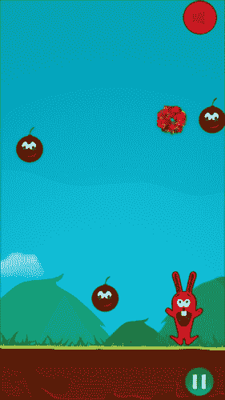

# 七、创建粒子系统

通过使用与 Cocos2d-x 框架捆绑在一起的内置粒子系统，您可以轻松模拟火、烟、爆炸、雪和雨。本章将教你如何创建这里提到的效果，还将教你自定义它们。

本章将涵盖以下主题:

*   创建 Cocos2d-x 对象的集合
*   在我们的游戏中加入粒子系统
*   配置粒子系统
*   创建自定义粒子系统

# 创建 Cocos2d-x 对象的集合

我们将在我们的游戏中增加一个粒子系统来模拟玩家每次接触炸弹时的爆炸。为了做到这一点，我们将使用位于 Cocos2d-x 框架中的`Vector`类来创建我们游戏中创建的所有炸弹对象的集合，这样当玩家触摸屏幕时，我们将遍历这个集合来验证玩家是否触摸了任何炸弹。

如果玩家接触到任何炸弹，我们将:

*   显示炸弹精灵所在位置的爆炸
*   让炸弹隐形
*   使用继承的`removeChild`方法将炸弹从屏幕上移除，最后
*   从集合中移除炸弹对象，这样下次我们遍历向量时，它就会被忽略

为此，我们将炸弹集合添加到我们的`HelloWorldScene.h`定义文件中，如下所示:

```cpp
cocos2d::Vector<cocos2d::Sprite*> _bombs;
```

请注意，我们指定要使用与`cocos2d`命名空间捆绑的`Vector`类，这样编译器就可以清楚地知道我们指的是框架的内置集合类，而不是`std`命名空间中包含的`Vector`类。虽然可以在`std`命名空间中使用`Vector`类，但是位于框架中的类被优化以便在 Cocos2d-x 对象集合中使用。

### 注

Cocos2d-x 3.0 中引入的`Vector`类通过使用 C++ 标准来表示对象集合，而不推荐使用的`CCArray`类通过使用目标 C 容器类来建模 Cocos2d-x 对象集合。这个新类照顾到了 Cocos2d-x 中用于内存管理的引用计数机制，它还增加了`std::vector`中不存在的功能，例如`random`、`contains`和`equals`方法。

如果需要将`std::vector`实例作为参数传递给 Cocos2d-x API 类的函数，而该函数需要数据类型，如`FileUtils`类中的`setSearchPaths`方法，则只能使用它们。

现在让我们转到位于我们的`HelloWorldScene.cpp`实现文件中的`init`方法，就在引用第一个炸弹精灵的`_sprBomb`变量的声明旁边，我们将把这个引用添加到我们新的`_bombs`集合中，如下所示:

```cpp
_bombs.pushBack(_sprBomb);
```

现在，让我们回到我们在前几章中创建的`addBombs`方法，为我们的游戏添加更多的炸弹。在这个方法中，我们将把游戏场景中产生的每个炸弹添加到`_bombs`集合中，如下所示:

```cpp
void HelloWorld::addBombs(float dt)
{
Sprite* bomb = nullptr;
for(int i = 0; i < 3; i++){
  bomb = Sprite::create("bomb.png");
  bomb->setPosition(CCRANDOM_0_1() * visibleSize.width, visibleSize.height + bomb->getContentSize().height/2);
  this->addChild(bomb,1);
  setPhysicsBody(bomb);
  bomb->getPhysicsBody()->setVelocity(Vect(0, ( (CCRANDOM_0_1() + 0.2f) * -250) ));
  _bombs.pushBack(bomb);
}
}
```

## 爆炸炸弹

我们希望我们的炸弹在我们碰到它们的时候爆炸。为了实现这一点，我们将创建我们的`explodeBombs`方法。在`HelloWorldScene.h`头文件中，我们将编写如下声明:

```cpp
bool explodeBombs(cocos2d::Touch* touch, cocos2d::Event* event);
```

现在我们要把方法体写在`HelloWorldScene.cpp`实现文件中；如前所述，每次玩家触摸屏幕时，我们都可以验证触摸的位置，并将其与每个炸弹的位置进行比较。如果发现任何交叉路口，那么被触动的炸弹就会消失。到目前为止，我们不会添加任何粒子系统，我们将在后面的章节中进行添加:

```cpp
bool HelloWorld::explodeBombs(cocos2d::Touch* touch, cocos2d::Event* event)
{
Vec2 touchLocation = touch->getLocation();
cocos2d::Vector<cocos2d::Sprite*> toErase;
for(auto bomb : _bombs){
  if(bomb->getBoundingBox().containsPoint(touchLocation)){
    bomb->setVisible(false);
    this->removeChild(bomb);
    toErase.pushBack(bomb);
  }
}

for(auto bomb : toErase){
  _bombs.eraseObject(bomb);
}
return true;
}
```

请注意，我们已经创建了另一个向量，目的是添加用户触摸的所有炸弹，然后它们从另一个循环中的`_bombs`集合中移除。我们这样做而不是直接从第一个循环中移除对象的原因是它会给出一个运行时错误。这是因为我们不能在单个集合中执行并发修改，也就是说，我们不能在迭代集合时从集合中移除一个项。如果我们这样做，那么我们会得到一个运行时错误。

### 注

`Vector`类是在 Cocos2d-x 3.0 中引入的。它取代了以前在 Cocos2d-x 2.x 中使用的`CCArray`类，我们可以通过对每个特性使用 C++ 11 来迭代`Vector`实例；因此，不再需要我们在 Cocos2d-x 2.x 中用于迭代 Cocos2d-x 对象的`CCARRAY_FOREACH`宏。

现在，我们将通过在位于我们的`HelloWorldScene.cpp`实现文件中的`initTouch`方法中进行以下更改，在`onTouchBegan`属性上向我们的触摸监听器添加回调:

```cpp
void HelloWorld::initTouch()
{
  auto listener = EventListenerTouchOneByOne::create();
  listener->onTouchBegan = CC_CALLBACK_2(HelloWorld::explodeBombs,this);
  listener->onTouchMoved = CC_CALLBACK_2(HelloWorld::movePlayerByTouch,this);
  listener->onTouchEnded = [=](Touch* touch, Event* event){};
  _eventDispatcher->addEventListenerWithSceneGraphPriority(listener, this);
}
```

就是这样，现在只要你碰到炸弹，它们就会消失。在下一部分，我们将添加一个爆炸效果来增强我们游戏的外观。

# 在我们的游戏中加入粒子系统

Cocos2d-x 有内置的类，允许你通过显示大量被称为粒子的小图形对象来渲染最常见的视觉效果，如爆炸、火灾、烟花、烟雾和雨等。

它非常容易实现。让我们添加一个默认的爆炸效果，只需在我们的`explodeBombs`方法中添加以下几行:

```cpp
bool HelloWorld::explodeBombs(cocos2d::Touch* touch, cocos2d::Event* event){
  Vec2 touchLocation = touch->getLocation();
  cocos2d::Vector<cocos2d::Sprite*> toErase;
  for(auto bomb : _bombs){
    if(bomb->getBoundingBox().containsPoint(touchLocation)){
      auto explosion = ParticleExplosion::create();
      explosion->setPosition(bomb->getPosition());
      this->addChild(explosion);
      bomb->setVisible(false);
      this->removeChild(bomb);
      toErase.pushBack(bomb);
    }
  }
  for(auto bomb : toErase){
    _bombs.eraseObject(bomb);
  }
  return true;
}
```



您可以通过将前面代码列表第一个高亮行中的粒子类名称更改为以下类名来尝试嵌入到引擎中的其他粒子系统:`ParticleFireworks`、`ParticleFire`、`ParticleRain`、`ParticleSnow`、`ParticleSmoke`、`ParticleSpiral`、`ParticleMeteor`和`ParticleGalaxy`。

# 配置粒子系统

在前面的部分中，我们通过简单地添加三行代码来创建一个真实的爆炸。我们可以自定义粒子系统的许多参数。例如，我们可以通过修改生命属性来修改我们希望粒子系统扩展的程度。

我们还可以通过将值设置为`startSize`属性和`endSize`属性来修改我们希望粒子系统在开始时有多大或多小，以及我们希望它在结束时有多大。例如，如果我们想模拟火箭的涡轮，那么我们可以将发射器配置为从小尺寸开始，到大尺寸结束。

我们可以通过修改角度属性来调整粒子将要移动的角度。您可以为粒子系统指定随机角度，这样看起来会更真实。

粒子系统可以有两种模式，半径和重力。最常见的粒子系统使用重力模式，在该模式下，我们可以参数化重力、速度、径向和切向加速度。这意味着发射器产生的粒子被一种叫做重力的力吸引，我们可以自定义它们的水平和垂直分量。径向模式具有径向运动和旋转，因此粒子系统的这种模式将螺旋旋转。

粒子的总量也可以通过`totalParticles`属性改变。粒子的数量越多，粒子系统就会越厚，但是要注意渲染的粒子数量也会影响运行性能。给你一个想法，默认爆炸粒子系统有 700 个总粒子，烟雾效果有 200 个总粒子。

### 注

您可以通过调用方法修改本节中提到的属性，在发射器实例中设置<property name="">。例如，如果你想修改系统的总粒子，那么调用`setTotalParticles`方法。</property>

在下面的代码清单中，我们将修改粒子系统的总量、速度和寿命:

```cpp
bool HelloWorld::explodeBombs(cocos2d::Touch* touch, cocos2d::Event* event){
  Vec2 touchLocation = touch->getLocation();
  cocos2d::Vector<cocos2d::Sprite*> toErase;
  for(auto bomb : _bombs){
    if(bomb->getBoundingBox().containsPoint(touchLocation)){
      auto explosion = ParticleExplosion::create();
      explosion->setDuration(0.25f);
      AudioEngine::play2d("bomb.mp3");
      explosion->setPosition(bomb->getPosition());
      this->addChild(explosion);
      explosion->setTotalParticles(800);
      explosion->setSpeed(3.5f);
      explosion->setLife(300.0f);
      bomb->setVisible(false);
      this->removeChild(bomb);
      toErase.pushBack(bomb);
    }
  }

  for(auto bomb : toErase){
    _bombs.eraseObject(bomb);
  }
  return true;
}
```


# 创建自定义粒子系统

到目前为止，我们已经尝试了所有与 Cocos2d-x 框架捆绑在一起的粒子系统，但是在我们作为游戏开发者的旅程中，将会有很多情况，我们将不得不创建自己的粒子系统。

有一些工具允许我们创建粒子系统，并以非常图形化的方式调整它们的属性。这允许我们创建粒子系统的**所见即所得** ( **所见即所得**)类型。

创建粒子系统最常见的应用程序叫做粒子设计器，它在官方 Cocos2d-x 文档中被多次提及。它目前仅适用于 Mac OS，您需要购买许可证才能将粒子系统导出到 plist 文件。您可以从以下链接下载并免费试用:[https://71squared.com/particledesigner](https://71squared.com/particledesigner)。粒子设计器如下图所示:


您也可以通过使用位于[http://www.particle2dx.com/](http://www.particle2dx.com/)的以下免费网络应用程序，以图形方式创建您的粒子系统:


还可以使用 V-Play 粒子编辑器，可以在 Windows、安卓、iOS、Mac 平台上免费下载使用。这些工具可以从[http://games.v-play.net/particleeditor](http://games.v-play.net/particleeditor)下载。


通过使用前面提到的任何工具，您可以调整粒子系统属性，如最大粒子数、持续时间、寿命、发射率和角度，然后将其保存在 plist 文件中。

我们已经创建了自己的粒子系统，并将其导出到 plist 文件中。我们将它包含在与本章源代码捆绑在一起的代码档案中。我们已经将这个 plist 文件放在一个新创建的文件夹中，该文件夹位于名为`particles`的`Resources`目录中。

由于我们的 plist 文件不在`Resources`文件夹的根目录中，我们需要通过在`searchPaths`中添加`sounds`目录之后添加下面一行代码，将`particles`目录添加到`AppDelegate`类的`applicationDidFinishLaunching`方法中的搜索路径中:

```cpp
searchPaths.push_back("particles");
```

下面的代码清单显示了如何使用`ParticleSystemQuad`类显示我们的自定义粒子系统，并将使用该工具生成的 plist 文件的名称作为参数传递给它的`create`静态方法:

```cpp
bool HelloWorld::explodeBombs(cocos2d::Touch* touch, cocos2d::Event* event){
  Vec2 touchLocation = touch->getLocation();
  cocos2d::Vector<cocos2d::Sprite*> toErase;
  for(auto bomb : _bombs){
    if(bomb->getBoundingBox().containsPoint(touchLocation)){
      AudioEngine::play2d("bomb.mp3");
 auto explosion = ParticleSystemQuad::create("explosion.plist");
      explosion->setPosition(bomb->getPosition());
      this->addChild(explosion);
      bomb->setVisible(false);
      this->removeChild(bomb);
      toErase.pushBack(bomb);
    }
  }
  for(auto bomb : toErase){
    _bombs.eraseObject(bomb);
  }
  return true;
}
```

正如你所见，我们还增加了一行代码，用于在每次炸弹到达我们的播放器精灵时播放音频，从而增加了更真实的效果。我们已经将这个 MP3 文件添加到本章提供的代码中。


# 把所有东西放在一起

在这一章中，我们在游戏中增加了粒子系统，以便在玩家每次接触炸弹时增加真实的爆炸。为了实现这个目标，我们修改了`HelloWorldScene.h`头文件和`HelloWorldScene.cpp`实现文件。

这就是我们的`HelloWorldScene.h`头文件在本章修改后的样子:

```cpp
#ifndef __HELLOWORLD_SCENE_H__
#define __HELLOWORLD_SCENE_H__
#include "cocos2d.h"
#include "PauseScene.h"
#include "GameOverScene.h"

class HelloWorld : public cocos2d::Layer{
public:
  static cocos2d::Scene* createScene();
  virtual bool init();
  CREATE_FUNC(HelloWorld);
private:
  cocos2d::Director *_director;
  cocos2d::Size _visibleSize;
  cocos2d::Sprite* _sprBomb;
  cocos2d::Sprite* _sprPlayer;
  cocos2d::Vector<cocos2d::Sprite*> _bombs;
  cocos2d::MenuItemImage* _muteItem;
  cocos2d::MenuItemImage* _unmuteItem;
  int _score;
  int _musicId;
  void initPhysics();
  void pauseCallback(cocos2d::Ref* pSender);
  void muteCallback(cocos2d::Ref* pSender);
  bool onCollision(cocos2d::PhysicsContact& contact);
  void setPhysicsBody(cocos2d::Sprite* sprite);
  void initTouch();
  void movePlayerByTouch(cocos2d::Touch* touch, cocos2d::Event* event);
  void movePlayerIfPossible(float newX);
  bool explodeBombs(cocos2d::Touch* touch, cocos2d::Event* event);
  void movePlayerByAccelerometer(cocos2d::Acceleration* acceleration, cocos2d::Event* event);
  void initAccelerometer();
  void initBackButtonListener();
  void onKeyPressed(cocos2d::EventKeyboard::KeyCode keyCode, cocos2d::Event* event);
  void updateScore(float dt);
  void addBombs(float dt);
  void initAudio();
  void initAudioNewEngine();
  void initMuteButton();
};

#endif // __HELLOWORLD_SCENE_H__
```

最后，下面的代码清单显示了我们的`HelloWorldScene.cpp`实现文件在本章中所做的修改之后的样子:

```cpp
#include "HelloWorldScene.h"
#include "SimpleAudioEngine.h"
#include "audio/include/AudioEngine.h"
#include "../cocos2d/cocos/platform/android/jni/Java_org_cocos2dx_lib_Cocos2dxHelper.h"

USING_NS_CC;
using namespace CocosDenshion;
using namespace cocos2d::experimental;
//Create scene code …
//User input event handling code
```

在下面的方法中，我们首先验证用户是否触摸了炸弹，如果用户已经触摸了，那么爆炸粒子系统将在触摸时炸弹所在的位置呈现。

```cpp
bool HelloWorld::explodeBombs(cocos2d::Touch* touch, cocos2d::Event* event){
  Vec2 touchLocation = touch->getLocation();
  cocos2d::Vector<cocos2d::Sprite*> toErase;
  for(auto bomb : _bombs){
    if(bomb->getBoundingBox().containsPoint(touchLocation)){
      AudioEngine::play2d("bomb.mp3");
      auto explosion = ParticleSystemQuad::create("explosion.plist");
      explosion->setPosition(bomb->getPosition());
      this->addChild(explosion);
      bomb->setVisible(false);
      this->removeChild(bomb);
      toErase.pushBack(bomb);
    }
  }
  for(auto bomb : toErase){
    _bombs.eraseObject(bomb);
  }
  return true;
}
```

在下面的方法中，我们添加了一个事件监听器，该监听器将在用户每次触摸屏幕时被触发，以验证炸弹是否被触摸:

```cpp
void HelloWorld::initTouch(){
  auto listener = EventListenerTouchOneByOne::create();
  listener->onTouchBegan = CC_CALLBACK_2(HelloWorld::explodeBombs,this);
  listener->onTouchMoved = CC_CALLBACK_2(HelloWorld::movePlayerByTouch,this);
  listener->onTouchEnded = [=](Touch* touch, Event* event){};
  _eventDispatcher->addEventListenerWithSceneGraphPriority(listener, this);
}
```

在下面的方法中，我们使用其`pushBack`方法将新产生的炸弹添加到我们新的`cocos2d:Vector`集合中:

```cpp
void HelloWorld::addBombs(float dt)
{
  Sprite* bomb = nullptr;
  for(int i = 0; i < 3; i++){
    bomb = Sprite::create("bomb.png");
    bomb->setPosition(CCRANDOM_0_1() * visibleSize.width, visibleSize.height + bomb->getContentSize().height/2);
    this->addChild(bomb,1);
    setPhysicsBody(bomb);
    bomb->getPhysicsBody()->setVelocity(Vect(0, ( (CCRANDOM_0_1() + 0.2f) * -250) ));
    _bombs.pushBack(bomb);
  }
}
```

现在我们将看到我们的`init`方法在本章完成修改后的样子。请注意，我们已经将在初始化阶段创建的第一个炸弹添加到新的`cocos2d:Vector _bombs`集合中。

```cpp
bool HelloWorld::init()
{
  if ( !Layer::init() ){
    return false;
  }
  _score = 0;
  _director = Director::getInstance();
  _visibleSize = _director->getVisibleSize();
  auto origin = _director->getVisibleOrigin();
  auto closeItem = MenuItemImage::create("pause.png", "pause_pressed.png", CC_CALLBACK_1(HelloWorld::pauseCallback, this));
  closeItem->setPosition(Vec2(_visibleSize.width - closeItem->getContentSize().width/2 , closeItem->getContentSize().height/2));
  auto menu = Menu::create(closeItem, nullptr);
  menu->setPosition(Vec2::ZERO);
  this->addChild(menu, 1);
  _sprBomb = Sprite::create("bomb.png");
  _sprBomb->setPosition(_visibleSize.width/2, _visibleSize.height + _sprBomb->getContentSize().height/2);
  this->addChild(_sprBomb,1);
  auto bg = Sprite::create("background.png");
  bg->setAnchorPoint(Vec2());
  bg->setPosition(0,0);
  this->addChild(bg, -1);
  _sprPlayer = Sprite::create("player.png");
  _sprPlayer->setPosition(_visibleSize.width/2, _visibleSize.height * 0.23);
  setPhysicsBody(_sprPlayer);

  this->addChild(_sprPlayer, 0);
  //Animations
  Vector<SpriteFrame*> frames;
  Size playerSize = _sprPlayer->getContentSize();
  frames.pushBack(SpriteFrame::create("player.png", Rect(0, 0, playerSize.width, playerSize.height)));
  frames.pushBack(SpriteFrame::create("player2.png", Rect(0, 0, playerSize.width, playerSize.height)));
  auto animation = Animation::createWithSpriteFrames(frames,0.2f);
  auto animate = Animate::create(animation);
  _sprPlayer->runAction(RepeatForever::create(animate));
  setPhysicsBody(_sprBomb);
  initPhysics();
  _sprBomb->getPhysicsBody()->setVelocity(Vect(0,-100));
  initTouch();
  initAccelerometer();
  #if (CC_TARGET_PLATFORM == CC_PLATFORM_ANDROID)
  setKeepScreenOnJni(true);
  #endif
  initBackButtonListener();
  schedule(CC_SCHEDULE_SELECTOR(HelloWorld::updateScore), 3.0f);
  schedule(CC_SCHEDULE_SELECTOR(HelloWorld::addBombs), 8.0f);
  initAudioNewEngine();
  initMuteButton();
  _bombs.pushBack(_sprBomb);
  return true;
}
```

# 总结

在这一章中，我们已经看到了如何在我们的游戏中使用粒子系统来模拟真实的火、爆炸、雨和雪，如何自定义它们，以及如何从头开始创建它们。我们还看到了如何使用与 Cocos2d-x API 捆绑在一起的`Vector`类来创建 Cocos2d-x 对象的集合。

在下一章中，我们将向您展示如何使用 Java 原生接口(JNI)将安卓原生代码添加到我们的游戏中。