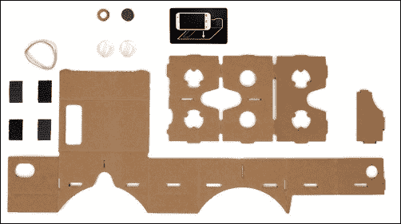
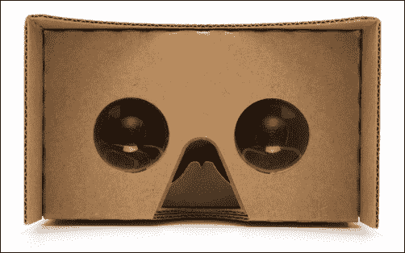
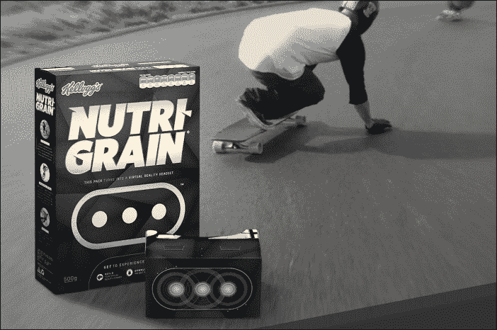
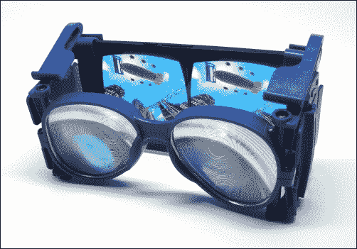
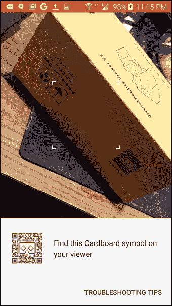

# 一、人人共享的虚拟现实

欢迎来到激动人心的虚拟现实新世界！我们确信，作为一名安卓开发者，你想直接加入进来，开始构建可以使用谷歌纸板查看的酷东西。你的用户可以把他们的智能手机塞进一个浏览器，然后进入你的虚拟作品。在本书剩余部分的代码和技术内容中，我们先来看看虚拟现实、谷歌纸板和安卓软件开发工具包，看看它们是如何结合在一起的。我们将在本章中讨论以下主题:

*   为什么叫硬纸板？
*   虚拟现实设备的范围
*   虚拟现实的门户
*   低端虚拟现实的价值
*   卡片
*   配置纸板查看器
*   为纸板开发应用
*   虚拟现实最佳实践概述

# 为什么叫硬纸板？

这一切都始于 2014 年初，当时谷歌员工大卫·科兹(David Coz)和达米安·亨利(Damien Henry)在业余时间为安卓智能手机构建了一个简单廉价的立体浏览器。他们设计了一种装置，可以用普通的纸板制成，外加两个镜片和一个触发按钮“咔嗒”的装置。观看者实际上是由纸板制成的。他们编写了软件，用分屏渲染三维场景:左眼用一个视图，右眼用另一个带偏移的视图。透过该设备，您可以真正感受到计算机生成场景的 3D 沉浸感。成功了。该项目随后被提议并批准为“20%项目”(员工可以每周为创新奉献一天)，由其他员工资助和参与。

### 注

关于纸板是如何产生的背后故事的“规范”事实的两个来源如下:

*   [http://www . wired . com/2015/06/内幕-谷歌-不太可能-飞跃-纸板-vr/](http://www.wired.com/2015/06/inside-story-googles-unlikely-leap-cardboard-vr/)
*   [https://en . Wikipedia . org/wiki/Google _ cardboard](https://en.wikipedia.org/wiki/Google_Cardboard)

事实上，carboard的效果非常好，以至于谷歌决定继续前进，将项目推向下一个层次，并在几个月后的谷歌 I/O 2014 上向公众发布。下图显示了一个典型的未组装的谷歌纸板套件:

自成立以来，黑客、业余爱好者和专业开发人员都可以访问谷歌纸板。谷歌开源了浏览器设计，任何人都可以从披萨盒子或他们身边的任何东西上下载图表并自己制作。人们甚至可以直接向消费者出售预切割套件。下图显示了组装好的纸板观察器:

硬纸板项目还包括一个 **软件开发工具包** ( **SDK** )，可以轻松构建 VR 应用。谷歌发布了对该软件的持续改进，包括一个原生的 Java 软件开发工具包以及一个用于统一 3D 游戏引擎(https://unity3d.com/)的插件。

自纸板发布以来，谷歌 Play 商店已经开发并提供了大量应用。在谷歌 I/O 2015 上，2.0 版本引入了升级设计、改进软件和对苹果 iOS 的支持。

在市场看来，谷歌纸板已经从一个几乎可笑的玩具迅速演变成一个用于某些类型的 3D 内容和虚拟现实体验的严肃新媒体设备。谷歌自己的纸板演示应用已经从谷歌 Play 商店下载了数百万次。《纽约时报》在 2015 年 11 月 8 日(周日)发行了大约 100 万纸板观众。

纸板对于观看 360 度照片和玩低保真度 3D VR 游戏非常有用。几乎任何人都可以访问它，因为它运行在任何安卓或 iOS 智能手机上。

开发人员现在正在将 3D 虚拟现实内容直接集成到安卓应用中。谷歌纸板是体验虚拟现实的一种方式，它将一直存在。

# 虚拟现实设备的频谱

与大多数技术一样，虚拟现实有一系列产品，从最简单、最便宜的到非常先进的。

## 老式的立体镜

纸板处于 VR 设备频谱的低端。好吧，如果你考虑到你小时候玩过的取景器大师，或者甚至是 1876 年的历史立体镜观察者(新罕布什尔州利特尔顿的启真道公司)，你甚至可以更低，如下图所示:

在这些老式的观众中，一对照片显示了左右眼的两个独立视图，这两个视图稍微偏移以产生视差。这让大脑误以为它看到了一个真正的三维视图。该设备为每只眼睛配备了独立的镜头，让您可以轻松地近距离聚焦照片。

同样，渲染这些并排的立体视图是谷歌纸板应用的第一项工作。(利用他们的传统，美泰最近发布了一款使用智能手机的纸板兼容 ViewMaster 品牌 VR viewer ，可在[http://www.view-master.com/](http://www.view-master.com/)找到)。

## 纸板是移动 VR

纸板相对于立体观众的明显优势就像数码照片相对于传统照片的优势一样。数字媒体可以在我们的智能手机中动态存储、加载和操作。这本身就是一个巨大的飞跃。

最重要的是，Cardboard 使用手机中的运动传感器，当你左右或上下转动头部时，图像会相应地进行调整，有效地消除了图像的传统帧边缘。构图是传统视觉媒体的一个非常重要的部分，例如绘画、摄影和电影摄影。几个世纪以来，艺术家和导演已经用这个矩形框架建立了一种视觉语言。

然而，在虚拟现实中却不是这样。当你在 VR 中移动头部时，你的视角方向会改变，场景会更新，就像相机在跟着你旋转一样，提供一个完全沉浸式的视图。当你左右看时，你可以水平旋转 360 度，上下旋转 180 度。换句话说，你可以去任何你想去的地方。VR 中没有框架！(尽管您的周边视觉可能会受到决定设备视野或 FOV 的光学器件和显示器尺寸的限制)。这样，设计考虑可能更类似于雕塑、综合剧场，甚至建筑设计。我们需要考虑让游客沉浸其中的整个空间。

谷歌纸板设备只是一个让你把智能手机塞进去的外壳。它使用智能手机的技术，包括以下内容:

*   显示
*   中央处理器
*   图形处理器
*   运动传感器
*   磁力计和/或触摸屏(触发传感器)

稍后我们将详细讨论所有这些是如何工作的。

使用移动智能手机进行 VR 意味着很多事情，例如易用性，但也有令人讨厌的限制，例如电池寿命有限、图形处理速度较慢以及精度较低/延迟较高的运动传感器。

三星齿轮虚拟现实是一款移动虚拟现实耳机，比简单的纸板阅读器更智能。基于安卓系统，但与 Cardboard 应用不兼容(仅适用于三星手机的特定型号)，它有一个单独的内置更高精度的 IMU(运动传感器)，这提高了头部运动跟踪的准确性，并有助于在更新显示器时减少运动到像素的延迟。它还采用人体工程学设计，可更长时间使用，并包括一个表带。

## 桌面虚拟现实及更高版本

在消费类虚拟现实设备的高端，除其他外，还有 Oculus Rift、HTC Vive 和索尼 PlayStation VR。这些产品超越了纸板的能力，因为它们不受智能手机功能的限制。有时被称为“桌面虚拟现实”，这些设备是连接到外部电脑或控制台的 **头戴式显示器** ( **HMD** )。

在桌面虚拟现实中，桌面强大的中央处理器和图形处理器进行实际的计算和图形渲染，并将结果发送到 HMD。此外，HMD 具有更高质量的运动传感器和其他功能，有助于减少更新显示时的延迟，例如，每秒 90 帧 ( **FPS** )。我们将在本书中了解到，降低延迟和保持高 FPS 对于所有虚拟现实开发和您的用户在所有虚拟现实设备上的舒适性都是非常重要的，包括纸板。

桌面 VR 设备还增加了*位置跟踪*。纸板设备可以检测任何 X、Y 和 Z 轴上的旋转运动，但不幸的是，它无法检测位置运动(例如，沿着这些轴中的任何一个滑动)。裂谷，薇薇和 PSVR 可以。例如，东非大裂谷使用一个外部摄像头，利用 HMD 上的红外线跟踪位置(*由外向内跟踪*)。另一方面，Vive 使用 HMD 上的传感器来跟踪一对战略性地放置在房间里的激光发射器(*由内向外跟踪*)。Vive 还使用该系统来跟踪一对手动控制器的位置和旋转。这两种策略取得了相似的结果。用户在虚拟空间内体验四处移动的同时，在被跟踪空间内有更大的自由四处移动。纸板做不到这一点。

请注意，创新不断被引入。很有可能，在某个时候，位置跟踪将包括在纸板兵工厂。例如，我们知道谷歌的探戈项目实现了视觉惯性里程计，即 VIO，使用传感器、陀螺仪和对物理空间的感知来为移动应用提供运动和位置跟踪。参考[https://developers . Google . com/project-tango/overview/concepts](https://developers.google.com/project-tango/overview/concepts)。LG 和三星等移动设备公司正在努力研究如何进行移动位置跟踪，但(在撰写本文时)一个通用的低延迟解决方案尚不存在。谷歌的探戈舞项目显示出一些希望，但还不能达到流畅、舒适的虚拟现实体验所需的像素延迟时间。太多的延迟会让你生病！

最高端的是工业级和军用级系统，花费数千或数百万美元，它们不是消费设备，我相信它们可以做非常棒的事情。我可以告诉你更多，但那样我就得杀了你。自 20 世纪 80 年代以来，诸如此类的解决方案也一直存在。虚拟现实不是新的——消费者虚拟现实是新的。

下图说明了虚拟现实设备的范围:

当我们为纸板开发时，重要的是要记住它相对于其他虚拟现实设备可以做和不能做的事情。纸板可以显示立体视图。纸板罐跟踪旋转头运动。它不能进行位置跟踪。它有图形处理能力、内存和电池寿命的限制。

# 虚拟现实的入口

在很短的时间内它已经可用，这一代消费者虚拟现实已经证明自己是即时引人注目的，身临其境的，娱乐性的，和“游戏改变者”，几乎每个人都尝试它。谷歌纸板特别容易获得，使用门槛很低。你所需要的只是一部智能手机，一个低成本的纸板浏览器(低至 5 美元)，以及从谷歌 Play(或苹果应用商店，适用于 iOS)下载的免费应用。

谷歌纸板被称为虚拟现实的门户，也许是指大麻是更危险的非法药物滥用的“门户药物”？不管多么颓废，我们都可以用这个比喻玩一会儿。也许纸板会给你一点虚拟现实潜力的味道。你会想要更多。然后更多。这将帮助您实现更好、更快、更强烈和沉浸式虚拟体验的愿望，这种体验只能在高端虚拟现实设备中找到。在这一点上，也许不会有回头路；你上瘾了！

然而，作为 Rift 的用户，我仍然喜欢纸板。很快。很简单。很好玩。如果我运行的应用是为该设备设计的，它真的可以工作。

我带了一个纸板阅读器在我的背包里，当我去我的家人那里度假的时候。大家都很喜欢。我的许多亲戚甚至没有通过标准的谷歌纸板演示应用，尤其是它的 360 度照片查看器。这足以让他们开心一段时间。其他人跳到一个或两个或更多的游戏。他们想继续玩，尝试新的体验。也许这只是新奇。或者，也许这就是这种新媒体的本质。关键是谷歌纸板提供了一种令人愉快的、有用的、非常容易获得的沉浸式体验。总之，太神奇了。

然后，给他们看一个 HTC Vive 或 Oculus Rift。天哪！真的，真的很神奇！好吧，对于这本书，我们不是在这里谈论更高端的虚拟现实设备，除了将它们与纸板进行对比，并保持事物的角度。

一旦尝试桌面 VR，是不是很难“回到”移动 VR？有些人这么说。但那几乎是愚蠢的。事实是它们是真正分开的东西。

如前所述，桌面虚拟现实具有更高的处理能力和其他高保真功能，而移动虚拟现实受到您的智能手机的限制。如果开发人员尝试将桌面虚拟现实应用直接移植到移动设备上，你很可能会失望。

最好把每一个都当成一个单独的媒介。就像桌面应用或控制台游戏一样不同于但类似于移动应用。设计标准可能相似但不同。这些技术相似但不同。用户期望相似但不同。移动 VR 可能和桌面 VR 相似，但有所不同。

### 注

为了强调纸板与桌面虚拟现实设备的不同，值得指出的是，谷歌已经将以下内容写入了制造商的规范和指南:

“不要在你的观察器上安装头套。当用户用手握住纸板靠在脸上时，他们的头部旋转速度受到躯干旋转速度的限制(躯干旋转速度比颈部旋转速度慢得多)。这减少了由渲染/惯性测量单元延迟引起的“虚拟现实疾病”的机会，并增加了虚拟现实的沉浸感。”

言外之意是，纸板应用应该设计得更短、更简单、更稳定。在这本书里，我们将举例说明这些和其他的技巧以及你为移动虚拟现实媒介开发的最佳实践。

现在让我们考虑纸板是虚拟现实门户的其他方式。

我们预测，未来安卓将继续成长为虚拟现实的主要平台。越来越多的技术将被塞进智能手机。该技术将包括有利于虚拟现实的特征:

*   更快的处理器和移动图形处理器
*   更高分辨率的屏幕
*   更高精度的运动传感器
*   优化的图形管道
*   更好的软件
*   更多虚拟现实应用

移动 VR 不会让位于桌面 VR；它甚至可能最终取代它。

此外，我们很快就会看到内置智能手机的专用移动虚拟现实耳机，而无需支付无线通信合同的费用。不需要用自己的手机。在虚拟现实中，不会再被来电或通知打断。如果你需要接一个重要的电话或者使用你的手机，不再限制电池寿命。所有这些专用的虚拟现实设备都可能基于安卓系统。

# 低端 VR 的价值

与此同时，安卓和谷歌纸板今天出现在我们的手机上、口袋里、家里、办公室甚至学校里。

例如，谷歌探险是谷歌的纸板教育项目([https://www.google.com/edu/expeditions/](https://www.google.com/edu/expeditions/)，该项目允许 K-12 学校的孩子进行虚拟实地考察，去“校车去不了的地方”，就像他们说的，“在全球各地，在火星表面，去珊瑚礁潜水，或者回到过去。”这些工具包包括给教室里每个孩子的纸板阅读器和安卓手机，以及给老师的安卓平板电脑。它们与网络相连。然后，教师可以指导学生进行虚拟实地考察，提供增强的内容，并创造超越教科书或课堂视频的学习体验，如下图所示:

在另一个创造性的营销例子中，2015 年夏天，凯洛格开始销售营养谷物小吃店，这种小吃店可以变成谷歌纸板浏览器。这链接到一个显示各种极限运动 360 度视频([http://www.engadget.com/2015/09/09/cereal-box-vr-headset/](http://www.engadget.com/2015/09/09/cereal-box-vr-headset/))的应用，如下图所示:

整个互联网可以认为是一个世界性的出版和媒体发行网络。这是一个由超链接页面、文本、图像、音乐、视频、JSON 数据、网络服务等等组成的网络。它也充满了 360 度的照片和视频。还有越来越多的三维内容和虚拟世界。你会考虑今天写一个不显示图像的安卓应用吗？可能不会。很有可能您的应用也需要支持声音文件、视频或其他媒体。所以要注意。三维纸板支持的内容正在迅速到来。你现在可能有兴趣读这本书，因为虚拟现实看起来很有趣。但是，很快，它可能会成为你下一个应用的客户驱动需求。

流行纸板应用类型的一些例子包括:

*   **360 度照片查看**，以为例，谷歌的纸板演示([https://play.google.com/store/apps/details?id = com . Google . samples . apps . carboard demo](https://play.google.com/store/apps/details?id=com.google.samples.apps.cardboarddemo))和 carboard Camera([https://play.google.com/store/apps/details?id=com.google.vr.cyclops](https://play.google.com/store/apps/details?id=com.google.vr.cyclops) )
*   **视频和影院观看**，以为例，纸板剧场([https://play.google.com/store/apps/details?id = it . couch games . apps . carboard cinema](https://play.google.com/store/apps/details?id=it.couchgames.apps.cardboardcinema))
*   **过山车和动感单车**，例如VR 过山车([https://play.google.com/store/apps/details?)(T4)](https://play.google.com/store/apps/details?id=com.frag.vrrollercoaster)
*   **卡通化 3D 游戏**，以为例，兰博 VR([https://play.google.com/store/apps/details?id = com . archiactiinteractive . lfgc&HL = en _ GB](https://play.google.com/store/apps/details?id=com.archiactinteractive.LfGC&hl=en_GB)
*   **第一人称射击游戏**，以为例，Battle 360 VR([https://play.google.com/store/apps/details?(T4)](https://play.google.com/store/apps/details?id=com.oddknot.battle360vr)
*   **令人毛骨悚然的恐怖玩意儿**，举为例，姐妹([https://play.google.com/store/apps/details?姐妹们](https://play.google.com/store/apps/details?id=com.otherworld.Sisters)
*   **教育经历**，例如太空巨人([https://play.google.com/store/apps/details?(T4)](https://play.google.com/store/apps/details?id=com.drashvr.titansofspacecb&hl=en_GB)
*   **营销体验**，例如沃尔沃 Reality([https://play.google.com/store/apps/details?(沃尔沃汽车](https://play.google.com/store/apps/details?id=com.volvo.volvoreality))

以及更多；数千人。最受欢迎的应用有数十万次下载(纸板演示应用本身有数百万次下载)。

这本书里的项目是你今天可以自己构建的不同种类的纸板应用的例子。

# 心脏用品！

让我们来看看不同的纸板设备。种类很多。

显然，谷歌最初的设计实际上是由纸板制成的。制造商也纷纷效仿，直接向消费者提供硬纸板——非官方硬纸板、多多益善和 iam card 等品牌是第一批。

谷歌免费提供规格和原理图(参考[https://www.google.com/get/cardboard/manufacturers/](https://www.google.com/get/cardboard/manufacturers/))。例如，2.0 版查看器主体示意图如下所示:

基本的观察器设计包括一个外壳主体、两个透镜和一个输入机构。*与谷歌纸板合作*认证计划表明，给定的查看器产品符合谷歌标准，并且与纸板应用配合良好。

观察器外壳可以由任何材质制成:纸板、塑料、泡沫、铝等。它应该很轻，并且在阻挡环境光方面做得很好。

透镜(输入/输出 2015 版)是直径 34 毫米的非球面单透镜，具有 80 度圆形 FOV(视场)和其他指定参数。

输入触发器(“点击器”)可以是几种替代机制之一。最简单的是无，用户必须用手指直接触摸智能手机屏幕才能触发点击。这可能会不方便，因为手机位于查看器外壳内，但它可以工作。很多观众只是把手指伸进一个洞。或者，原始纸板利用一个附着在观察者外部的小环形磁铁，通过一个嵌入的圆形磁铁将固定在适当的位置。用户可以滑动环形磁铁，磁场的变化被手机的磁力计感应到，并被软件识别为“点击”。这种设计并不总是可靠的，因为磁力计的位置因手机而异。此外，使用这种方法，更难检测到“按住”交互，这意味着在您的应用中只能使用一种类型的用户输入“事件”。

纸板版本 2.0 引入了一个按钮输入，它由一个导电的“条”和“枕头”组成，粘在一个基于纸板的“锤子”上，就像大钢琴中的锤子一样。当按下按钮时，用户的身体电荷转移到智能手机屏幕上，就像他用手指直接触摸屏幕一样。这个聪明的解决方案避免了不可靠的磁力计解决方案，而是使用手机的本地触摸屏输入，尽管是间接的。

在这一点上还值得一提的是，由于您的智能手机支持蓝牙，因此您可以在 Cardboard 应用中使用手持蓝牙控制器。这不是纸板规范的一部分，需要一些额外的配置:使用第三方输入处理器或内置于应用中的控制器支持。下图显示了一个微型蓝牙控制器:

纸板观众不一定是纸板做的。塑料观众可能会变得相对昂贵。虽然它们比纸板更坚固，但它们基本上具有相同的设计(组装)。有些设备允许您调整镜头到屏幕的距离，和/或眼睛之间的距离(IPD 或瞳孔间距离)。蔡司 VR One、Homido 和 Sunnypeak 设备是最早流行的设备之一。

一些制造商已经跳出框框(双关语)进行创新，这些创新不一定符合谷歌的规范，但提供了超越纸板设计的功能。一个显著的例子是磨损观察器([http://www.wearality.com/](http://www.wearality.com/)，它包括专利的 150 度**视场** ( **FOV** )双菲涅尔透镜。它太便携了，就像一副太阳镜一样折叠起来。下图显示了磨损观察器的预发布版本:

# 配置纸板查看器

有了如此多的纸板设备以及镜头距离、视野、失真等的变化，纸板应用必须配置为特定设备的属性。谷歌也提供了一个解决方案。每个纸板阅读器都带有一个独特的二维码和/或 NFC 芯片，您可以通过扫描来配置该设备的软件。如果您对校准自己的设备或定制您的参数感兴趣，请查看[的配置文件生成器工具。](https://www.google.com/get/cardboard/viewerprofilegenerator/)

要将您的手机配置到特定的纸板查看器，请打开标准的谷歌纸板应用，并选择屏幕底部中间部分的设置图标，如下图所示:

然后将相机对准特定纸板阅读器的二维码:

您的手机现在已经为特定的纸板浏览器参数配置了。

# 为纸板开发应用

在撰写本书时，谷歌为 Cardboard 提供了两个 SDK:

*   安卓硬纸板SDK([https://developers.google.com/cardboard/android](https://developers.google.com/cardboard/android)
*   统一纸板SDK([https://developers.google.com/cardboard/unity](https://developers.google.com/cardboard/unity)

让我们首先考虑Unity 选项。

## 使用统一

unity([http://unity3d.com/](http://unity3d.com/))是一款流行的全功能 3D 游戏引擎，支持在从 PlayStation 和 XBox 到 Windows 和 Mac(以及 Linux)的各种平台上构建你的游戏！)，到安卓和 iOS。

Unity 由多个独立的工具组成，在统一的可视化编辑器下集成到一个强大的引擎中。有图形、物理、脚本、网络、音频、动画、用户界面等工具。它包括高级计算机图形渲染、着色、纹理、粒子和照明，以及各种优化性能和微调 2D 和 3D 图形质量的选项。如果这还不够，Unity 还拥有一个巨大的素材商店，里面充满了模型、脚本、工具和其他由其大型开发人员社区创建的素材。

统一纸板软件开发工具包提供了一个插件包，您可以将其导入到统一编辑器中，其中包含预置(预制对象)、C#脚本和其他素材。该包为您提供了所需的东西，以便为您的虚拟 3D 场景添加立体摄像机，并构建您的项目，使其在安卓(和 iOS)上作为纸板应用运行。Unity 计划将 Cardboard SDK 直接集成到引擎中，这意味着只需在构建设置中选中一个框，就可以添加对 Cardboard 的支持。

### 注

如果您有兴趣了解更多关于使用 Unity 为 Cardboard 构建 VR 应用的信息，请查看 Packt Publishing 的另一本书，*Unity Virtual R**eality project*作者 Jonathan lino wes([https://www . Packt pub . com/game-development/Unity-Virtual-reality-project](https://www.packtpub.com/game-development/unity-virtual-reality-projects))。

## 土生土长

那么，为什么不直接使用 Unity 进行 Cardboard 开发呢？问得好。这取决于你想做什么。当然，如果您的项目需要 Unity 的所有功能和特性，这是您应该走的路。

但代价是什么？权力越大，责任越大(本·帕克叔叔说)。它学起来很快，但需要一辈子才能掌握(围棋大师说)。不过说真的，Unity 是一个强大的引擎，对于许多应用来说可能有些过头了。为了充分利用这一优势，您可能需要在建模、动画、关卡设计、图形和游戏机制方面的额外专业知识。

使用 Unity 构建的纸板应用体积庞大。一个空的安卓统一场景生成一个最小 23 兆字节的`.apk`文件。相比之下，我们在[第 2 章](02.html "Chapter 2. The Skeleton Cardboard Project")*框架纸板项目*中构建的简单本机纸板应用`.apk`不足一兆字节。

伴随这个大的应用尺寸而来的是很长的加载时间，可能超过几秒钟。它会影响内存使用和电池使用。除非你已经支付了统一安卓许可证的费用，否则你的应用总是从“统一制造”闪屏开始。这些可能不是你可以接受的约束。

一般来说，离金属越近，应用的性能就越好。当你直接为安卓写的时候，你可以直接访问设备的功能，对内存和其他资源有更多的控制，也有更多的机会进行定制和优化。这就是为什么本地移动应用往往胜过移动网络应用。

最后，使用原生安卓和 Java 开发的最佳理由之一可能是最简单的。你现在急于建造一些东西！如果你已经是安卓开发者了，那就用你已经知道并且热爱的东西吧！从这里到那里走最直的路。

如果你熟悉安卓开发，那么纸板开发自然会到来。使用安卓的 Cardboard SDK，可以用 Java 编程，使用的是基于 Jet Brains 的 InteliJ IDEA 的 Android Studio IDE(集成开发环境)。

正如我们将在本书中看到的，你的 Cardboard Android 应用和其他 Android 应用一样，包括清单、资源和 Java 代码。和任何安卓应用一样，你将实现一个`MainActivity`类，但是你的将扩展`CardboardActivity`并实现`CardboardView.StereoRenderer`。您的应用将利用 OpenGL ES 2.0 图形、着色器和 3D 矩阵数学。它将负责更新每一帧上的显示，也就是说，根据用户在时间上看那个特定切片的方向重新渲染您的 3D 场景。在虚拟现实中，以及在任何 3D 图形环境中，以显示器允许的最快速度渲染新帧尤其重要，通常是 60 FPS。您的应用将通过纸板触发器和/或基于凝视的控件处理用户输入。我们将在接下来的章节中详细讨论所有这些主题。

这就是你的应用需要做的。然而，要让虚拟现实发挥作用，还有更多细节需要处理。正如谷歌纸板软件开发工具包指南([https://developers.google.com/cardboard/android/](https://developers.google.com/cardboard/android/))中所述，软件开发工具包简化了许多常见的虚拟现实开发任务，包括以下内容:

*   镜头畸变校正
*   头部跟踪
*   三维校准
*   并排渲染
*   立体几何构型
*   用户输入事件处理

SDK 中提供了一些函数来为您处理这些任务。

构建和部署您的应用进行开发、调试、分析，并最终在谷歌 Play 上发布，也遵循您可能已经熟悉的相同安卓工作流程。那很酷。

当然，构建一个应用不仅仅是简单地遵循一个例子。我们将了解一些技术，例如使用数据驱动的几何模型、抽象着色器和 OpenGL ES API 调用，以及使用基于凝视的选择构建用户界面元素。除此之外，还有一些重要的建议最佳实践，可以让您的虚拟现实体验发挥作用，并避免常见错误。

# 虚拟现实最佳实践概述

越来越多的每天都在被发现和书写，关于虚拟现实设计和开发时的注意事项。谷歌提供了一些资源来帮助开发者构建出色的虚拟现实体验，包括以下内容:

*   *为谷歌纸板设计*是一个最佳实践文档，它帮助您关注整体可用性并避免常见的虚拟现实陷阱。
*   *硬纸板设计实验室*是一个硬纸板应用，直接说明了虚拟现实的设计原则，你可以在硬纸板中探索。在 2016 年愿景峰会上，纸板团队宣布，他们已经发布了源代码(Unity)项目，供开发人员检查和扩展([https://play.google.com/store/apps/details?)id = com . Google . VR . carboard . apps . design lab](https://play.google.com/store/apps/details?id=com.google.vr.cardboard.apps.designlab)和[https://github . com/Google Samples/carboard-unity/tree/master/Samples/carboard design lab](https://github.com/googlesamples/cardboard-unity/tree/master/Samples/CardboardDesignLab)。

虚拟现实运动病是虚拟现实的一个真实症状和担忧，部分原因是当你移动头部时，屏幕更新滞后或延迟。你的大脑期望你周围的世界与你的实际运动完全同步。至少可以说，任何可察觉的延迟都会让你感到不舒服，甚至可能会恶心。可以通过更快地渲染每帧来降低延迟，以保持每秒推荐的帧数。桌面虚拟现实应用被保持在 90 FPS 的高标准，由定制的 HMD 屏幕实现。在移动设备上，屏幕硬件通常将刷新率限制在 60 FPS，或者在最坏的情况下，限制在 30 FPS。

还有其他导致虚拟现实运动病和其他用户不适的原因，可以通过遵循以下设计指南来缓解:

*   始终保持头部跟踪。如果虚拟世界似乎冻结或暂停，这可能会导致用户感到不适。
*   在三维虚拟空间中显示用户界面元素，如标题和按钮。如果在 2D 渲染，它们会看起来“粘在你脸上”，你会感到不舒服。
*   在场景之间转换时，淡入黑色。过场镜头会很迷失方向。对你的用户来说，褪色成白色可能是不舒服的明亮。
*   用户应该继续控制他们在应用中的移动。自己启动相机运动有助于减少晕车。尽量避免“人为”旋转相机。
*   避免加速和减速。作为人类，我们感受到的是加速度，而不是恒定的速度。如果你正在移动应用内的摄像头，保持匀速。过山车很有趣，但即使在现实生活中，它们也会让你感到恶心。
*   让你的用户脚踏实地。在太空中做一个虚拟的浮点会让你感到恶心，而感觉自己站在地上或坐在驾驶舱里会给人一种稳定的感觉。
*   对于用户界面元素，如按钮和十字线光标，保持与眼睛的合理距离。如果物体离得太近，用户可能不得不看起来斗鸡眼，并可能会感到眼睛疲劳。有些过于接近的项目可能根本无法汇聚，导致“复视”。

虚拟现实应用在其他方面也不同于传统的安卓应用，例如:

*   When transitioning from a 2D application into VR, it is recommended that you provide a headset icon for the user to tap, as shown in the following image:

    

*   要退出虚拟现实，用户可以点击系统栏中的后退按钮(如果有)或主页按钮。纸板示例应用使用“向上倾斜”手势返回主菜单，如果您想允许“向后”输入而不强迫用户将手机从设备上移除，这是一种不错的方法。
*   确保你的应用在全屏模式下运行(而不是安卓的熄灯模式)。
*   不要执行任何会向用户显示 2D 对话框的 API 调用。用户将被迫将手机从查看器中取出来进行响应。
*   提供音频和触觉(振动)反馈来传达信息，并指示用户输入被应用识别。

所以，假设你已经完成了你的优秀纸板应用，并准备发布。现在怎么办？您可以在`AndroidManifest`文件中放一行，将应用标记为纸板应用。谷歌的纸板应用包括一个谷歌 Play 商店浏览器，用于查找纸板应用。然后像发布任何普通安卓应用一样发布它。

# 总结

在这一章中，我们从定义谷歌纸板开始，看看它如何适合消费者虚拟现实设备的范围。然后，我们将纸板与更高端的虚拟现实设备进行了对比，如 Oculus Rift、HTC Vive 和 PlayStation VR，从而证明低端虚拟现实是一种独立的媒体。市场上有各种各样的纸板阅读器设备，我们研究了如何使用二维码为你的阅读器配置你的智能手机。我们谈了一点关于为纸板开发，并考虑了为什么和为什么不使用统一 3D 游戏引擎，而不是用纸板软件开发工具包用 Java 编写一个本地安卓应用。最后，我们对虚拟现实开发的许多设计考虑因素进行了快速调查，我们将在整本书中更多地讨论这些考虑因素，包括避免晕车的方法以及将 Cardboard 与安卓应用集成的一般技巧。

在下一章中，我们开始编码。耶！作为一个共同的参考点，我们将花一点时间介绍Android Studio集成开发环境，并回顾纸板安卓类。然后我们将一起构建一个简单的 Cardboard 应用，为整本书中其他项目的结构和功能奠定基础。