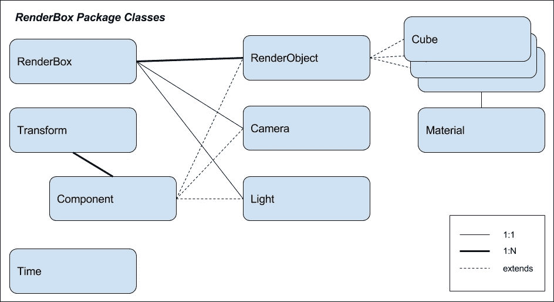
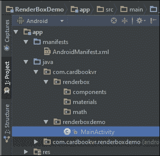
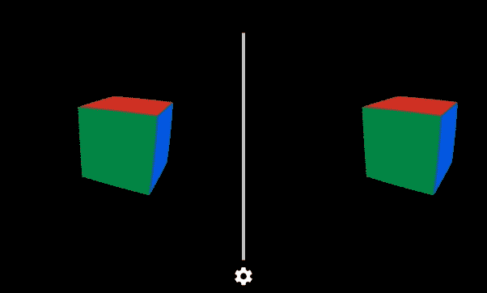
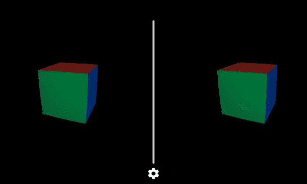
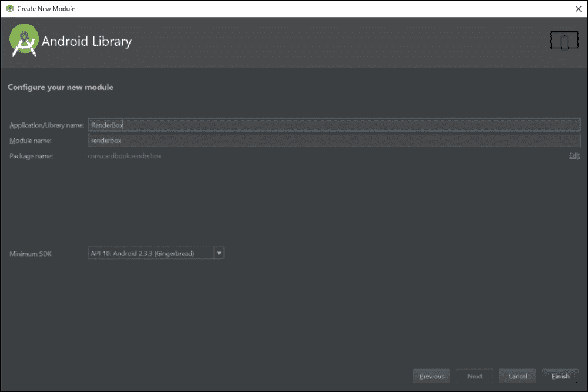
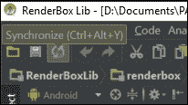
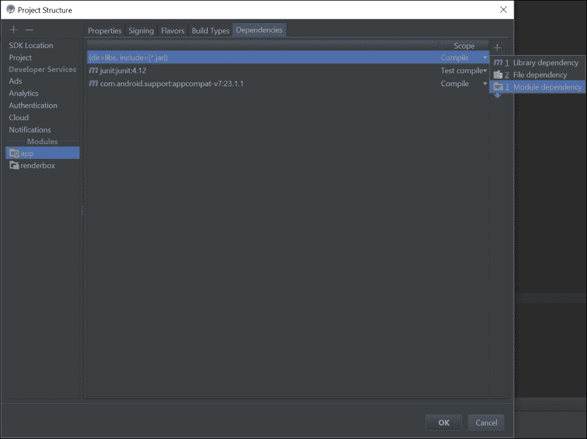

# 五、RenderBox引擎

虽然硬纸板 Java SDK 和 OpenGL ES 是强大和健壮的移动虚拟现实应用库，但它们是相当低级的。软件开发最佳实践期望我们将常见的编程模式抽象成新的类和数据结构。在[第三章](03.html "Chapter 3. Cardboard Box")、*纸箱*中，我们获得了一些关于细节的实际操作经验。这一次，我们将重新审视这些细节，同时将它们抽象成一个可重用的库，我们称之为 **RenderBox** 。将会有向量数学、材质、照明等等，所有这些都被卷成一个整洁的小包裹。

在本章中，您将学会:

*   创建新的纸板项目
*   用着色器编写一个`Material`类
*   探索我们的`Math`套餐
*   写一堂`Transform`课
*   用`RenderObject Cube`、`Camera`和`Light`组件写一个`Component`类
*   添加一个`Material`类来渲染带有顶点颜色和光照的立方体
*   写一个`Time`动画课
*   将所有这些导出到`RenderBox`库中以供重用

这个项目的源代码可以在 Packt Publishing 网站上找到，也可以在位于[https://github.com/cardbookvr/renderboxdemo](https://github.com/cardbookvr/renderboxdemo)的 GitHub 上找到(每个主题都是单独提交的)。最终的`RenderBoxLib`项目将在本书的其他项目中继续维护和重用，也可以在 Packt Publishing 网站和位于[https://github.com/cardbookvr/renderboxlib](https://github.com/cardbookvr/renderboxlib)的 GitHub 上找到。

# 引入 RenderBox——一个图形引擎

在一个虚拟的现实应用中，你正在用一堆物体创建一个三维空间。用户的视点或相机也位于这个空间。在纸板软件开发工具包的帮助下，场景被渲染两次，一次用于左眼和右眼，以创建并排的立体视图。第二个同样重要的特征是将传感器数据转换为头部观察方向，跟踪真实用户的头部。像素使用 OpenGL ES 库在屏幕上绘制或渲染，OpenGL ES 库将与设备上的硬件 **图形处理器** ( **GPU** )进行对话。

我们将把图形渲染代码组织到单独的 Java 类中，我们可以将它们提取到一个可重用的图形引擎库中。我们将这个库称为 **RenderBox** 。

如您所见，`RenderBox`类实现了`CardboardView.StereoRender`接口。但不止如此。虚拟现实需要 3D 图形渲染，至少可以说，在低级别的 OpenGL ES 调用(和其他支持 API)中完成所有这些可能会很乏味，尤其是随着应用的增长。再者，这些 API 要求你像半导体芯片一样思考！缓冲区、着色器和矩阵数学，我的天！我是认真的，谁愿意一直这样想？我宁愿像 3D 艺术家和 VR 开发者一样思考。

有许多不同的部分需要跟踪和管理，它们可能会变得复杂。作为软件开发人员，我们的职责是识别通用模式并实现抽象层，这有助于降低复杂性，避免重复代码，并将程序表示为更接近问题领域的对象(软件类)。在我们的例子中，这个领域制作可以在纸板虚拟现实设备上渲染的 3D 场景。

`RenderBox`开始将细节抽象成一层干净的代码。它旨在处理 OpenGL 调用和复杂的算法，同时仍然允许我们按照自己想要的方式设置应用特定的代码。如果我们的项目需要任何特殊情况，它还会为新材质和组件类型创建一个通用的模式，称为**实体组件模式**([https://en.wikipedia.org/wiki/Entity_component_system](https://en.wikipedia.org/wiki/Entity_component_system))。以下是我们图书馆主要课程的图解:



`RenderBox`类实现了`CardboardView.StereoRenderer`，从应用的`MainActivity`类中解除了这一责任。正如我们将看到的，`MainActivity`通过`IRenderBox`接口(设置、`preDraw`和`postDraw`挂钩)与`RenderBox`通信，以便`MainActivity`实现`IRenderBox`。

让我们考虑一下可以参与三维虚拟现实场景的`Component`的种类:

*   `RenderObject`:这些是场景中可以绘制的模型，比如立方体和球体
*   `Camera`:这是用户的视点，用来渲染场景
*   `Light`:这些是用于阴影和阴影的光源

我们场景中的每个物体在空间中都有一个 X，Y，Z 位置，一个旋转，三个尺度维度。这些属性由`Transform`类定义。转换可以按层次结构排列，让您构建更复杂的对象，这些对象是由更简单的对象组装而成的。

每个`Transform`类可以与一个或多个`Component`类相关联。不同种类的组件(例如，`Camera`、`Light`、`RenderObject`)扩展了`Component`类。没有附加到`Transform`类的组件不应该存在，但是相反的情况(没有组件的转换)非常好。

在内部，`RenderBox`维护一个`RenderObjects`列表。这些是场景中的几何模型。`RenderObjects`的类型包括`Cube`和`Sphere`等。这些对象与`Material`相关联，T5 定义了它们的颜色、纹理和/或阴影属性。材质依次引用、编译和执行低级着色器程序。维护组件的平面列表来渲染每一帧比遍历每一帧的变换层次结构更有效。这是我们为什么使用实体组件模式的一个完美例子。

`RenderBox`包中的其他东西包括用于实现动画的`Time`类，以及用于向量和矩阵运算的`Math`函数库。

现在，让我们开始把这些放在一起。

游戏计划是什么？最终目标是创建我们的`RenderBox`图形引擎库。在自己的项目中维护它会很方便(如果您使用的是源代码管理，比如 Git，还可以维护它)，因此可以独立地进行改进和维护。然而，要开始这一步，我们需要一个简单的应用来构建它，向您展示如何使用它，并验证(如果不是测试)它是否正常工作。这将被称为`RenderBoxDemo`。在本章的最后，我们将把`RenderBox`代码提取到一个安卓库模块中，然后导出。

# 创建新项目

如果您想了解这些步骤的更多细节和说明，请参考*创建新纸板项目*部分[第 2 章](02.html "Chapter 2. The Skeleton Cardboard Project")、*框架纸板项目*，然后继续:

1.  Android Studio打开后，创建一个新项目。让我们将其命名为`RenderBoxDemo`，并以**空活动**为目标**安卓 4.4 KitKat (API 19)** 。
2.  使用**文件** | **新** | **新模块，将纸板 SDK `common.aar`和`core.aar`库文件作为新模块添加到项目中...**。
3.  使用**文件** | **项目结构**，将库模块设置为项目应用的依赖项。
4.  按照[第二章](02.html "Chapter 2. The Skeleton Cardboard Project")、*框架纸板项目*中的说明编辑`AndroidManifest.xml`文件，注意保留该项目的`package`名称。
5.  按照[第 2 章](02.html "Chapter 2. The Skeleton Cardboard Project")、*框架纸板项目*中的说明编辑`build.gradle`文件，根据 SDK 22 进行编译。
6.  编辑`activity_main.xml`布局文件，如[第 2 章](02.html "Chapter 2. The Skeleton Cardboard Project")、*框架纸板项目*所述。

现在，打开`MainActivity.java`文件，编辑`MainActivity` Java 类扩展`CardboardActivity`:

```java
    public class MainActivity extends CardboardActivity {
        private static final String TAG = "RenderBoxDemo";
```

### 注

注意与前面章节不同，我们不实现`CardboardView.StereoRender`。相反，我们将在`RenderBox`类中实现该接口(在下一个主题中)。

## 创建RenderBox包文件夹

由于我们的计划是将`RenderBox`代码导出为库，所以让我们将其全部放入自己的包中。

在安卓层级面板中，使用`Gear`图标并取消勾选**压缩空中间包**，这样我们就可以在**com . cardbookr**下插入新包。

右键单击项目视图中的`app/java/com/carbookvr/`文件夹，导航至**新建** | **包**，并将其命名为`renderbox`。您现在可能希望再次启用**压缩空中间包**。

在`renderbox`文件夹中，创建三个名为`components`、`materials`和`math`的包子文件夹。项目现在应该有相同的文件夹，如下图所示:



## 创建一个空的RenderBox类

让我们从创建`RenderBox`类 Java 代码的框架开始。右键单击`renderbox/`文件夹，导航至**新** | **Java 类**，并将其命名为`RenderBox`。

现在，打开`RenderBox.java`文件并编辑它以实现`CardboardView.StereoRenderer`界面。添加以下代码:

```java
public class RenderBox implements CardboardView.StereoRenderer {
    private static final String TAG = "RenderBox";

    public static RenderBox instance;
    public Activity mainActivity;
    IRenderBox callbacks;

    public RenderBox(Activity mainActivity, IRenderBox callbacks){
        instance = this;
        this.mainActivity = mainActivity;
        this.callbacks = callbacks;
    }
}
```

在这一点上主要是内务管理。`RenderBox`类定义为`implements` `CardboardView.StereoRenderer`。它的构造函数将接收对`MainActivity`实例和`IRenderBox`实现器(在本例中，也是`MainActivity`)类的引用。`MainActivity`现在必须执行`IRenderBox`方法(接下来定义)。这样，我们实例化框架并实现关键方法。

请注意，我们还通过在类构造函数中注册`this`实例来使`RenderBox`成为单例。

我们还必须为`StereoRenderer`类添加方法覆盖。从智能感知菜单中，选择**实现方法…** (或 *Ctrl* + *I* )为界面添加存根方法覆盖，如下所示:

```java
    @Override
    public void onNewFrame(HeadTransform headTransform) {
    }

    @Override
    public void onDrawEye(Eye eye) {
    }

    @Override
    public void onFinishFrame(Viewport viewport) {
    }

    @Override
    public void onSurfaceChanged(int i, int i1) {
    }

    @Override
    public void onSurfaceCreated(EGLConfig eglConfig) {
    }

    @Override
    public void onRendererShutdown() {
    }
```

现在是时候在`RenderBox`中添加一个错误报告方法`checkGLError`来记录 OpenGL 渲染错误了，如下面的代码所示:

```java
    /**
     * Checks if we've had an error inside of OpenGL ES, and if so what that error is.
     * @param label Label to report in case of error.
     */
    public static void checkGLError(String label) {
        int error;
        while ((error = GLES20.glGetError()) != GLES20.GL_NO_ERROR) {
            String errorText = String.format("%s: glError %d, %s", label, error, GLU.gluErrorString(error));
            Log.e(TAG, errorText);
            throw new RuntimeException(errorText);
        }
    }
```

在前一章的项目中，我们定义了`MainActivity`，这样它就实现了`CardboardView.StereoRenderer`。现在这被委托给我们新的`RenderBox`对象。让我们告诉`MainActivity`使用它。

在`MainActivity.java`中，修改`onCreate`方法以创建`RenderBox`的新实例，并将其设置为视图渲染器，如下所示:

```java
    protected void onCreate(Bundle savedInstanceState) {
        super.onCreate(savedInstanceState);
        setContentView(R.layout.activity_main);

        CardboardView cardboardView = (CardboardView) findViewById(R.id.cardboard_view);
        cardboardView.setRenderer(new RenderBox(this,this));
        setCardboardView(cardboardView);
    }
```

注意传递的`cardboardView.setRender`是新的`RenderBox`，它将`MainActivity`实例作为`Activity`和`IRenderBox`参数。瞧，我们已经完全控制了纸板 SDK 集成，现在一切都是为了实现`IRenderbox`。通过这种方式，我们已经将 Cardboard SDK、OpenGL 和各种其他外部依赖项包装在我们自己的库中。现在，如果这些规格发生变化，我们要做的就是保持`RenderBox`最新，我们的 app 可以告诉`RenderBox`该怎么做，一如既往。

## 添加 IRenderBox 界面

一旦我们将所有这些都放在一起，`MainActivity`类将实现`IRenderBox`接口。该接口为活动可能实现的`setup`、`preDraw`和`postDraw`功能提供回调。

在`onSurfaceCreated`中做了一些一般性的工作后会调用设置方法。在`onDrawEye`期间将调用`preDraw`和`postDraw`方法。我们将在本章稍后部分看到这一点。

我们现在可以设置了。右键点击层次面板中的`renderbox`，导航至**新建** | **Java 类**，选择**种类:“接口”**，命名为`IRenderBox`。它只有几行，应该只包含以下代码:

```java
public interface IRenderBox {
    public void setup();
    public void preDraw();
    public void postDraw();
}
```

然后，修改`MainActivity`使其实现`IRenderBox`:

```java
public class MainActivity extends CardboardActivity implements IRenderBox {
```

选择智能感知**实现方法**(或 *Ctrl* + *I* ，添加接口方法覆盖。Android Studio会自动填写以下内容:

```java
    @Override
    public void setup() {

    }

    @Override
    public void preDraw() {

    }

    @Override
    public void postDraw() {

    }
```

如果您现在运行空应用，您将不会得到任何构建错误，它将显示空纸板分割视图:


现在我们已经创建了一个框架应用，准备实现`RenderBox`包和实用程序，我们可以使用它们来帮助构建新的 Cardboard VR 应用。

在接下来的几个主题中，我们将构建`RenderBox`中需要的一些类。不幸的是，我们不能在你的纸板设备上显示任何有趣的东西，直到我们得到这些编码。这也限制了我们测试和验证编码是否正确的能力。这可能是引入单元测试的合适时机，比如 JUnit。详见*单元测试支持*文档([http://tools.android.com/tech-docs/unit-testing-support](http://tools.android.com/tech-docs/unit-testing-support))。不幸的是，篇幅不允许我们介绍这个主题，并将其用于本书的项目。但是我们鼓励你自己去追求。(我会提醒您，这个项目的 GitHub 存储库对每个主题都有单独的提交，随着我们的进行，会逐渐增加代码)。

# 材质、纹理和着色器

在[第三章](03.html "Chapter 3. Cardboard Box")、*硬纸板盒*中，我们介绍了 OpenGL ES 2.0 图形管道和简单着色器。我们现在将把代码提取到一个单独的`Material`类中。

在计算机图形学中，材质是指几何模型的视觉表面特征。在场景中渲染对象时，材质与着色器代码和 OpenGL 图形管道所需的照明和其他场景信息一起使用。

纯色材质是最简单的；物体的整个表面是单一颜色。最终渲染中的任何颜色变化都是由不同着色器变体中的照明、阴影和其他特征造成的。用灯光和阴影制作纯色材质是很有可能的，但是最简单的例子就是用相同的颜色填充光栅段，比如我们的第一个着色器。

纹理材质可以具有在图像文件(例如 JPG)中定义的表面细节。纹理就像贴在物体表面的壁纸。它们可以在很大程度上被使用，并且负责用户在对象上感知的大部分细节。纯色球体可能看起来像乒乓球。有纹理的球体可能看起来像地球。可以添加更多的纹理通道来定义阴影的变化，甚至在表面有阴影时发光。你会在[第六章](06.html "Chapter 6. Solar System")*太阳系*的结尾看到这种效果，当我们给地球的黑暗面增加一个人造光的时候。

更真实的基于物理的阴影不仅仅是纹理贴图，还包括模拟的高度贴图、金属光泽和其他瑕疵，如铁锈或灰尘。我们不会在这本书里讨论这个问题，但是它在图形引擎中很常见，比如 Unity 3D 和虚幻引擎。我们的`RenderBox`库可以扩展以支持它。

目前，我们将为基本的纯色材质和相关着色器构建基础结构。在这一章的后面，我们将使用灯光来扩展它。

## 抽象材质

在的`renderbox/materials/`文件夹中，创建一个名为`Material`的新的 Java 类，并开始编写如下:

```java
public abstract class Material {
    private static final String TAG = "RenderBox.Material";

    protected static final float[] modelView = new float[16];
    protected static final float[] modelViewProjection = new float[16];

    public static int createProgram(int vertexShaderResource, int fragmentShaderResource){
        int vertexShader = loadGLShader(GLES20.GL_VERTEX_SHADER, vertexShaderResource);
        int passthroughShader = loadGLShader(GLES20.GL_FRAGMENT_SHADER, fragmentShaderResource);

        int program = GLES20.glCreateProgram();
        GLES20.glAttachShader(program, vertexShader);
        GLES20.glAttachShader(program, passthroughShader);
        GLES20.glLinkProgram(program);
        GLES20.glUseProgram(program);

        RenderBox.checkGLError("Material.createProgram");
        return program;
    }

    public abstract void draw(float[] view, float[] perspective);
}
```

这个定义了一个抽象类，将用于扩展我们定义的各种类型的材质。`createProgram`方法加载指定的着色器脚本，并构建一个附带着色器的 OpenGL ES 程序。

我们还定义了一个抽象的`draw()`方法，将在每个着色器中分别实现。其中，它要求在类的顶部声明`modelView`和`modelViewProjection`变换矩阵。在这一点上，我们实际上将只使用`modelViewProjection`，但是当我们添加照明时，将需要单独引用`modelView`矩阵。

接下来，向`Material`类添加以下实用程序方法来加载着色器:

```java
    /**
     * Converts a raw text file, saved as a resource, into an OpenGL ES shader.
     *
     * @param type The type of shader we will be creating.
     * @param resId The resource ID of the raw text file about to be turned into a shader.
     * @return The shader object handler.
     */
    public static int loadGLShader(int type, int resId) {
        String code = readRawTextFile(resId);
        int shader = GLES20.glCreateShader(type);
        GLES20.glShaderSource(shader, code);
        GLES20.glCompileShader(shader);

        // Get the compilation status.
        final int[] compileStatus = new int[1];
        GLES20.glGetShaderiv(shader, GLES20.GL_COMPILE_STATUS, compileStatus, 0);

        // If the compilation failed, delete the shader.
        if (compileStatus[0] == 0) {
            Log.e(TAG, "Error compiling shader: " + GLES20.glGetShaderInfoLog(shader));
            GLES20.glDeleteShader(shader);
            shader = 0;
        }

        if (shader == 0) {
            throw new RuntimeException("Error creating shader.");
        }

        return shader;
    }

    /**
     * Converts a raw text file into a string.
     *
     * @param resId The resource ID of the raw text file about to be turned into a shader.
     * @return The context of the text file, or null in case of error.
     */
    private static String readRawTextFile(int resId) {
        InputStream inputStream = RenderBox.instance.mainActivity.getResources().openRawResource(resId);
        try {
            BufferedReader reader = new BufferedReader(new InputStreamReader(inputStream));
            StringBuilder sb = new StringBuilder();
            String line;
            while ((line = reader.readLine()) != null) {
                sb.append(line).append("\n");
            }
            reader.close();
            return sb.toString();
        } catch (IOException e) {
            e.printStackTrace();
        }
        return null;
    }
```

正如[第 3 章](03.html "Chapter 3. Cardboard Box")、*硬纸板盒*中所讨论的，这些方法将加载着色器脚本并编译它。

稍后，我们将从这个类中导出特定的材质，并定义每个材质将使用的特定着色器。

# 数学包

在[第三章](03.html "Chapter 3. Cardboard Box")*硬纸板盒*中，我们介绍了三维几何和矩阵数学计算。我们将把它们包装成更有用的函数。

我们收集的大部分数学代码来自现有的开源项目(属性在源代码的注释中给出)。毕竟，我们还不如利用那些喜欢这种东西的数学天才，他们拥有开源的优秀真实且经过测试的代码。该代码列表包含在本书的文件下载中。

### 注

下面的列表记录了我们的数学应用编程接口。实际代码包含在本书的文件下载和 GitHub 存储库中。

一般来说，数学属于线性代数的主题，但大部分是图形编程特有的，并且在现代 CPU 上的快速浮点数学的约束下工作。

我们鼓励您浏览本书包含的源代码，显然您需要访问这些源代码才能完成项目。只要说包括的一切都是 3D 游戏引擎相当标准的费用就够了，事实上，大部分来自(或对照)一个名为 **LibGDX** 的开源引擎。LibGDX 的数学库非常庞大，针对移动 CPU 进行了优化，可以替代我们更简单的数学包。我们还将广泛使用安卓`Matrix`类，在大多数情况下，它以本机代码运行，并避免了 **Java 虚拟机** ( **JVM** 或达尔维克虚拟机(在安卓的情况下)的开销。

这是我们数学应用编程接口的总结。

## 数学技巧

`MathUtils`变量和方法大多是不言而喻的:`PI`、`sin`、`cos`等等，定义为使用`floats`作为 Java 的`Math`类的替代，后者包含双精度。在计算机图形学中，我们讲浮点运算。这种数学方法需要更少的功率和晶体管，精度损失是可以接受的。您的`MathUtils`类应该如下所示:

```java
// File: renderbox/math/MathUtils.java
public class MathUtils {
    static public final float PI = 3.1415927f;
    static public final float PI2 = PI * 2;
    static public final float degreesToRadians = PI / 180;
    static public final float radiansToDegrees = 180f / PI;
}
```

## 矩阵 4

`Matrix4`类管理 4×4 变换矩阵，用于在三维空间中平移(定位)、旋转和缩放点。我们很快就会好好利用这些。以下是删除了函数体的`Matrix4`类的节略版:

```java
// File: renderbox/math/Matrix4.java
public class Matrix4{
    public final float[] val = new float[16];
    public Matrix4()
    public Matrix4 toIdentity()

    public static Matrix4 TRS(Vector3 position, Vector3 rotation, Vector3 scale)
    public Matrix4 translate(Vector3 position)
    public Matrix4 rotate(Vector3 rotation)
    public Matrix4 scale(Vector3 scale)
    public Vector3 multiplyPoint3x4(Vector3 v)
    public Matrix4 multiply(Matrix4 matrix)
    public Matrix4 multiply(float[] matrix)
```

请特别注意 TRS 函数。`Transform`类使用它将位置、旋转和缩放信息组合成一个有用的矩阵，该矩阵代表所有三个信息。创建该矩阵的顺序很重要。首先，我们生成一个平移矩阵，然后旋转和缩放它。生成的矩阵可以乘以任何三维点(我们的顶点)来分层应用这三个操作。

## 四元数

一个 **四元数**表示三维空间中的旋转方向，当两个四元数结合时，不会丢失任何信息。

从人类的角度来看，更容易将旋转方向视为三个欧拉(发音为“加油器”)角度，因为我们认为旋转有三个维度:俯仰、偏航和滚转。我们使用四元数而不是更直接的矢量表示旋转的原因是，根据您将三个欧拉旋转应用于对象的顺序，最终的 3D 方向会有所不同。

### 注

有关四元数和欧拉角的更多信息，请参考以下链接:

*   [https://en . Wikipedia . org/wiki/四元数 _ 和 _ 空间 _ 旋转](https://en.wikipedia.org/wiki/Quaternions_and_spatial_rotation)
*   [https://en . Wikipedia . org/wiki/Euler _ angles](https://en.wikipedia.org/wiki/Euler_angles)
*   [http://mathworld . wolfram . com/eul erarules . html](http://mathworld.wolfram.com/EulerAngles.html)
*   [https://en . Wikipedia . org/wiki/Conversion _ 介于 _ 四元数 _ 和 _ 欧拉角之间](https://en.wikipedia.org/wiki/Conversion_between_quaternions_and_Euler_angles)

即使四元数是四维构造，我们也将每个四元数视为单个值，代表一个 3D 方向。因此，当我们连续应用多个旋转操作时，我们不会遇到一个轴的旋转影响另一个轴的效果的问题。如果这些都没有任何意义，不要担心。这是 3D 图形中最棘手的概念之一。以下是节略`Quaternion`课:

```java
// File: renderbox/math/Quaternion.java
public class Quaternion {
    public float x,y,z,w;
    public Quaternion()
    public Quaternion(Quaternion quat)

    public Quaternion setEulerAngles (float pitch, float yaw, float roll) public Quaternion setEulerAnglesRad (float pitch, float yaw, float roll) 
    public Quaternion conjugate ()
    public Quaternion multiply(final Quaternion other)
    public float[] toMatrix4()
    public String toString()
```

## 矢量 2

A **矢量 2** 是由(X，Y)坐标定义的二维点或方向矢量。使用`Vector2`类，您可以变换和操作向量。这里是删节的`Vector2`类:

```java
// File: renderbox/math/Vector2.java
public class Vector2 {
    public float x;
    public float y;

    public static final Vector2 zero = new Vector2(0, 0);
    public static final Vector2 up = new Vector2(0, 1);
    public static final Vector2 down = new Vector2(0, -1);
    public static final Vector2 left = new Vector2(-1, 0);
    public static final Vector2 right = new Vector2(1, 0);

    public Vector2()

    public Vector2(float xValue, float yValue)
    public Vector2(Vector2 other)
    public Vector2(float[] vec)

    public final Vector2 add(Vector2 other)
    public final Vector2 add(float otherX, float otherY, float otherZ)
    public final Vector2 subtract(Vector2 other)
    public final Vector2 multiply(float magnitude)
    public final Vector2 multiply(Vector2 other)
    public final Vector2 divide(float magnitude)
    public final Vector2 set(Vector2 other)
    public final Vector2 set(float xValue, float yValue)
    public final Vector2 scale(float xValue, float yValue)
    public final Vector2 scale(Vector2 scale)
    public final float dot(Vector2 other)
    public final float length2()
    public final float distance2(Vector2 other)
    public Vector2 normalize()
    public final Vector2 zero()
    public float[] toFloat3()
    public float[] toFloat4()
    public float[] toFloat4(float w)
    public String toString()
```

## 矢量 3

A **矢量 3** 是一个由 X，Y，Z 坐标定义的三维点或方向矢量。使用`Vector3`类，您可以变换和操作向量。以下是节略`Vector3`课:

```java
// File: renderbox/math/Vector3.java
public final class Vector3 {
    public float x;
    public float y;
    public float z;

    public static final Vector3 zero = new Vector3(0, 0, 0);
    public static final Vector3 up = new Vector3(0, 1, 0);
    public static final Vector3 down = new Vector3(0, -1, 0);
    public static final Vector3 left = new Vector3(-1, 0, 0);
    public static final Vector3 right = new Vector3(1, 0, 0);
    public static final Vector3 forward = new Vector3(0, 0, 1);
    public static final Vector3 backward = new Vector3(0, 0, -1);

    public Vector3()
    public Vector3(float xValue, float yValue, float zValue)
    public Vector3(Vector3 other)
    public Vector3(float[] vec)

    public final Vector3 add(Vector3 other)
    public final Vector3 add(float otherX, float otherY, float otherZ)
    public final Vector3 subtract(Vector3 other)
    public final Vector3 multiply(float magnitude)
    public final Vector3 multiply(Vector3 other)
    public final Vector3 divide(float magnitude)
    public final Vector3 set(Vector3 other)
    public final Vector3 set(float xValue, float yValue, float zValue)
    public final Vector3 scale(float xValue, float yValue, float zValue)
    public final Vector3 scale(Vector3 scale)
    public final float dot(Vector3 other)
    public final float length()
    public final float length2()
    public final float distance2(Vector3 other)
    public Vector3 normalize()
    public final Vector3 zero()
    public float[] toFloat3()
    public float[] toFloat4()
    public float[] toFloat4(float w)
    public String toString()
```

`Vector2`和`Vector3`有很多相同的功能，但是要特别注意在 3D 中存在的功能，而在 2D 是不存在的。接下来，我们将看到当我们实现`Transform`类时，如何使用数学库。

# 转换类

3D 虚拟现实场景将由各种对象构建，每个对象在由`Transform`定义的 3D 空间中都有位置、旋转和比例。

允许对变换进行分层分组自然也是有用的。这种分组也在局部空间和世界空间之间建立了一种区别，在这种区别中，孩子们只记录他们的**平移、旋转和缩放** ( **TRS** )和他们的父母(局部空间)之间的差异。我们存储的实际数据是局部位置(我们将交替使用位置和平移这两个词)、旋转和缩放。全局位置、旋转和缩放是通过结合父链上的本地 TRS 来计算的。

首先，我们来定义`Transform`类。在Android Studio层次面板中，右键`renderbox/`，转到**新建** | **Java 类**，命名为`Transform`。

每个`Transform`可以有一个或多个相关组件。通常只有一个，但是可以添加任意多个(我们将在本书的其他项目中看到)。我们将维护转换中的组件列表，如下所示:

```java
public class Transform {
    private static final String TAG = "RenderBox.Transform";

    List<Component> components = new ArrayList<Component>();

     public Transform() {}

    public Transform addComponent(Component component){
        component.transform = this;
        return this;
    }
    public List<Component> getComponents(){
        return components;
    }
}
```

我们将在下一个主题中定义`Component`类。如果现在在定义它之前引用它真的让你很困扰，你可以从`renderbox/components`文件夹中的一个空的组件 Java 类开始。

现在回到`Transform`课。一个`Transform`对象在空间中有一个位置、方向和比例，由它的`localPosition`、`localRotation`和`localScale`变量定义。让我们定义这些私有变量，然后添加操作它们的方法。

此外，由于变换可以按层次排列，我们将包含对可能的`parent`变换的引用，如下所示:

```java
    private Vector3 localPosition = new Vector3(0,0,0);
    private Quaternion localRotation = new Quaternion();
    private Vector3 localScale = new Vector3(1,1,1);

    private Transform parent = null;
```

位置、旋转和缩放值被初始化为相同的值，也就是说，在其他地方明确设置它们之前，不会有位置偏移、旋转或调整大小。请注意，身份等级为(1，1，1)。

`parent`变换变量允许每个变换在层次结构中有一个父变换。您可以在转换中保留子列表，但是您可能会惊讶地知道，在不必向下移动层次结构的情况下，您可以走多远。如果您可以避免它，就像我们已经做的那样，您可以在设置/取消设置父引用时节省大量的分支。维护子对象列表意味着每次解包一个对象都要进行一次 *O(n)* 操作，并且在设置父对象时需要额外的 *O(1)* 插入成本。在寻找特定物体的儿童中搜寻也不是很有效。

## 父方法

可以分别使用`setParent`和`unParent` 方法添加变换或从其在层次结构中的位置移除变换。现在让我们定义它们:

```java
    public Transform setParent(Transform Parent){
        setParent(parent, true);
        return this;
    }

    public Transform setParent(Transform parent, boolean updatePosition){
        if(this.parent == parent)
        //Early-out if setting same parent--don't do anything
            return this;
        if(parent == null){
            unParent(updatePosition);
            return this;
        }

        if(updatePosition){
            Vector3 tmp_position = getPosition();
            this.parent = parent;
            setPosition(tmp_position);
        } else {
            this.parent = parent;
        }
        return this;
    }

    public Transform upParent(){
        unParent(true);
        return this;
    }

    public Transform unParent(boolean updatePosition){
        if(parent == null)
        //Early out--we already have no parent
            return this;
        if(updatePosition){
            localPosition = getPosition();
        }
        parent = null;
        return this;
    }
```

简单地说，`setParent`方法将`this.parent`设置为给定的父变换。或者，您可以指定相对于父对象更新位置。我们添加了一个优化来跳过这个过程，如果已经设置了父级的话。将父级设置为`null`相当于调用`unParent`。

`unParent`方法从层次结构中移除变换。或者，您可以指定相对于(上一个)父级更新位置，以便变换现在与层次断开连接，但保持在世界空间中的相同位置。

请注意，在养育和解除抚养时，轮换和比例也可以而且应该更新。我们在本书的项目中不需要这些，所以它们被留给读者作为练习。另外，注意我们的`setParent`方法包括一个是否更新位置的参数。如果是`false`，操作运行会快一点，但是如果父变换没有设置为同一性(没有平移、旋转或缩放)，对象的全局状态会改变。为了方便起见，您可以将`updatePosition`设置为`true`，这将对局部变量应用当前的全局变换，以其当前的旋转和缩放保持对象在空间中的固定。

## 定位方法

`setPosition`方法设置相对于父变量的变换位置，如果没有父变量，则将绝对世界位置应用于局部变量。如果要使用向量或单个组件值，将提供两个重载。`getPosition`将基于父变换计算世界空间位置，如果它们存在的话。请注意，这将有一个与转换层次结构的深度相关的 CPU 成本。作为一项优化，您可能希望在`Transform`类中包含一个缓存世界空间位置的系统，每当父变换被修改时，该缓存就会失效。一个更简单的替代方法是确保在调用 `getPosition`后立即将位置存储在局部变量中。同样的优化适用于旋转和缩放。

如下定义位置采集器和设置器:

```java
    public Transform setPosition(float x, float y, float z){
        if(parent != null){
            localPosition = new Vector3(x,y,z).subtract(parent.getPosition());
        } else {
            localPosition = new Vector3(x, y, z);
        }
        return this;
    }

    public Transform setPosition(Vector3 position){
        if(parent != null){
            localPosition = new Vector3(position).subtract(parent.getPosition());
        } else {
            localPosition = position;
        }
        return this;
    }

    public Vector3 getPosition(){
        if(parent != null){
            return Matrix4.TRS(parent.getPosition(), parent.getRotation(), parent.getScale()).multiplyPoint3x4(localPosition);
        }
        return localPosition;
    }

    public Transform setLocalPosition(float x, float y, float z){
        localPosition = new Vector3(x, y, z);
        return this;
    }

    public Transform setLocalPosition(Vector3 position){
        localPosition = position;
        return this;
    }

    public Vector3 getLocalPosition(){
        return localPosition;
    }
```

## 旋转方法

`setRotation`方法设置相对于父对象的变换旋转，如果没有父对象，则绝对世界旋转应用于局部变量。同样，多个重载为不同的输入数据提供了选项。如下定义旋转吸气剂和沉降剂:

```java
    public Transform setRotation(float pitch, float yaw, float roll){
        if(parent != null){
            localRotation = new Quaternion(parent.getRotation()).multiply(new Quaternion().setEulerAngles(pitch, yaw, roll).conjugate()).conjugate();
        } else {
            localRotation = new Quaternion().setEulerAngles(pitch, yaw, roll);
        }
        return this;
    }

    /**
     * Set the rotation of the object in global space
     * Note: if this object has a parent, setRoation modifies the input rotation!
     * @param rotation
     */
    public Transform setRotation(Quaternion rotation){
        if(parent != null){
            localRotation = new Quaternion(parent.getRotation()).multiply(rotation.conjugate()).conjugate();
        } else {
            localRotation = rotation;
        }
        return this;
    }

    public Quaternion getRotation(){
        if(parent != null){
            return new Quaternion(parent.getRotation()).multiply(localRotation);
        }
        return localRotation;
    }

    public Transform setLocalRotation(float pitch, float yaw, float roll){
        localRotation = new Quaternion().setEulerAngles(pitch, yaw, roll);
        return this;
    }

    public Transform setLocalRotation(Quaternion rotation){
        localRotation = rotation;
        return this;
    }

    public Quaternion getLocalRotation(){
        return localRotation;
    }

    public Transform rotate(float pitch, float yaw, float roll){
        localRotation.multiply(new Quaternion().setEulerAngles(pitch, yaw, roll));
        return this;
    }
```

## 标度法

`setScale`方法设置相对于父变量的变换比例，如果没有父变量，则将绝对比例应用于局部变量。为秤定义吸气剂和沉降剂，如下所示:

```java
    public Vector3 getScale(){
        if(parent != null){
            Matrix4 result = new Matrix4();
            result.setRotate(localRotation);
            return new Vector3(parent.getScale())
                .scale(localScale);
        }
        return localScale;
    }

    public Transform setLocalScale(float x, float y, float z){
        localScale = new Vector3(x,y,z);
        return this;
    }

    public Transform setLocalScale(Vector3 scale){
        localScale = scale;
        return this;
    }

    public Vector3 getLocalScale(){
        return localScale;
    }

    public Transform scale(float x, float y, float z){
        localScale.scale(x, y, z);
        return this;
    }
```

## 变换成矩阵并绘制

我们需要对`Transform`类做的最后一件事是将一个身份矩阵转换成一个告诉 OpenGL 如何正确绘制对象的矩阵。为此，我们按此顺序平移、旋转和缩放矩阵。从技术上讲，我们也可以用矩阵做一些很酷的事情，比如剪切和扭曲模型，但是数学已经够复杂了。如果你想了解更多，请在搜索引擎中输入`transformation matrix`、`quaternion to matrix`以及我们一直在使用的其他术语。所有这一切背后的实际数学令人着迷，而且过于详细，无法用一个段落来解释。

我们还提供了 `drawMatrix()`功能，为绘制调用设置照明和模型矩阵。由于照明模型是一个中间步骤，因此结合这个调用是有意义的；

```java
    public float[] toFloatMatrix(){
        return Matrix4.TRS(getPosition(), getRotation(), getScale()).val;
    }

    public float[] toLightMatrix(){
        return Matrix4.TR(getPosition(), getRotation()).val;
    }

    /**
     * Set up the lighting model and model matrices for a draw call
     * Since the lighting model is an intermediate step, it makes sense to combine this call
     */
    public void drawMatrices() {
        Matrix4 modelMatrix = Matrix4.TR(getPosition(), getRotation());
        RenderObject.lightingModel = modelMatrix.val;
        modelMatrix = new Matrix4(modelMatrix);
        RenderObject.model = modelMatrix.scale(getScale()).val;
    }
```

`drawMatrices`方法使用来自`RenderObject`类的变量，这些变量将在后面定义。在`RenderObject`类中，我们只是将矩阵设置为静态变量，这可能看起来非常反 Java。正如您将看到的，实际上不需要存在多个`lightingModel`对象和模型的实例。它们总是在绘制时为每个对象及时计算。如果我们要引入避免一直重新计算这个矩阵的优化，保留信息是有意义的。为了简单起见，我们只是在每次绘制每个对象时重新计算矩阵，因为自上一帧以来它可能已经改变了。

接下来，我们将看到当我们实现`Component`类时如何使用`Transform`类，该类将被定义 3D 场景中对象的许多类扩展。

# 组件类

我们的 3D 虚拟现实场景由各种组件组成。组件可能包括几何对象、灯光和相机。组件可以根据其关联的变换在三维空间中定位、旋转和缩放。让我们创建一个`Component`类，作为场景中其他对象类的基础。

如果你还没有创建`Component.java`，现在就在`renderbox/components`文件夹中创建一个。定义如下:

```java
public class Component {
    public Transform transform;

    public boolean enabled = true;
}
```

我们已经包括了一个`enabled`标志，当我们绘制场景时，它将会很方便地隐藏/显示对象。

就这样。接下来，我们将定义第一个组件`RenderObject`，以表示场景中的几何对象。

# 渲染对象组件

`RenderObject` 将作为可以在场景中渲染的几何对象的父类。`RenderObject`延伸`Component`，所以有`Transform`。

在`renderbox/components`文件夹中，创建一个新的 Java 类`RenderObject`。将其定义为扩展`Component`的抽象类:

```java
public abstract class RenderObject extends Component {
    private static final String TAG = "RenderObject";

    public RenderObject(){
        super();
        RenderBox.instance.renderObjects.add(this);
    }
}
```

我们要做的第一件事是让每个实例将自己添加到由`RenderBox`实例维护的`renderObjects`列表中。现在让我们跳到`RenderBox`课，为这个列表添加支持。

打开`RenderBox.java`文件，添加一个`renderObjects`列表:

```java
public class RenderBox implements CardboardView.StereoRenderer {

    public List<RenderObject> renderObjects = new ArrayList<RenderObject>();
```

现在，回到`RenderObject`班；我们将实现三种方法:`allocateFloatBuffer`、`allocateShortBuffer`和`draw`。

OpenGL ES 要求我们为各种数据分配大量不同的内存缓冲区，包括模型顶点、法向量和索引列表。`allocateFloatBuffer`和`allocateShortBuffer`方法是对象可以分别用于浮点和整数的实用方法。索引是整数(具体来说，简称)；其他的都是彩车。这些将可用于派生对象类:

```java
public abstract class RenderObject extends Component {
       ...
    protected static FloatBuffer allocateFloatBuffer(float[] data){
        ByteBuffer bbVertices = ByteBuffer.allocateDirect(data.length * 4);
        bbVertices.order(ByteOrder.nativeOrder());
        FloatBuffer buffer = bbVertices.asFloatBuffer();
        buffer.put(data);
        buffer.position(0);
        return buffer;
    }

    protected static ShortBuffer allocateShortBuffer(short[] data){
        ByteBuffer bbVertices = ByteBuffer.allocateDirect(data.length * 2);
        bbVertices.order(ByteOrder.nativeOrder());
        ShortBuffer buffer = bbVertices.asShortBuffer();
        buffer.put(data);
        buffer.position(0);
        return buffer;
    }
}
```

聪明的读者可能已经注意到我们首先使用`ByteBuffer`，然后将其转换为`FloatBuffer`或`ShortBuffer`。虽然从一个字节到浮点的转换可能是有意义的——原始内存通常不被表示为浮点——但是有些人可能会想为什么我们不从一开始就把`ShortBuffer`分配为`ShortBuffer`。两种情况的原因其实是一样的。我们想利用`allocateDirect`方法，它效率更高，只存在于`ByteBuffer`类中。

最终，`RenderObject`组件的目的是在屏幕上绘制几何图形。这是通过转换三维视图并通过`Material`类进行渲染来完成的。让我们为材质定义变量，一些 setter 和 getter 方法，以及`draw`方法:

```java
    protected Material material;
    public static float[] model;
    public static float[] lightingModel;

    public Material getMaterial(){
        return material;
    }
    public RenderObject setMaterial(Material material){
        this.material = material;
        return this;
    }

    public void draw(float[] view, float[] perspective){
        if(!enabled)
            return;
        //Compute position every frame in case it changed
        transform.drawMatrices();
        material.draw(view, perspective);
    }
```

`draw`方法为该对象准备模型变换，大部分绘制动作发生在材质中。`draw`方法将从当前的`Camera`组件调用，因为它响应来自纸板 SDK 的`onDrawEye`钩子的姿势。如果组件没有被启用，它将被跳过。

`RenderObject`类是抽象的；我们不会直接与`RenderObjects`合作。相反，我们将派生对象类，如`Cube`和`Sphere`。接下来让我们从`RenderObject`组件创建`Cube`类。

# 立方体渲染对象组件

出于演示的目的，我们将从一个简单的立方体开始。稍后，我们将使用灯光对其进行改进。在[第三章](03.html "Chapter 3. Cardboard Box")、*纸板箱*中，我们定义了一个`Cube`模型。我们将从这里使用相同的类和数据结构开始。您甚至可以复制代码，但它显示在下面的文本中。在`renderbox/components/`文件夹中创建一个`Cube` Java 类:

```java
// File: renderbox/components/Cube.java
public class Cube {
    public static final float[] CUBE_COORDS = new float[] {
            // Front face
            -1.0f, 1.0f, 1.0f,
            -1.0f, -1.0f, 1.0f,
            1.0f, 1.0f, 1.0f,
            -1.0f, -1.0f, 1.0f,
            1.0f, -1.0f, 1.0f,
            1.0f, 1.0f, 1.0f,

            // Right face
            1.0f, 1.0f, 1.0f,
            1.0f, -1.0f, 1.0f,
            1.0f, 1.0f, -1.0f,
            1.0f, -1.0f, 1.0f,
            1.0f, -1.0f, -1.0f,
            1.0f, 1.0f, -1.0f,

            // Back face
            1.0f, 1.0f, -1.0f,
            1.0f, -1.0f, -1.0f,
            -1.0f, 1.0f, -1.0f,
            1.0f, -1.0f, -1.0f,
            -1.0f, -1.0f, -1.0f,
            -1.0f, 1.0f, -1.0f,

            // Left face
            -1.0f, 1.0f, -1.0f,
            -1.0f, -1.0f, -1.0f,
            -1.0f, 1.0f, 1.0f,
            -1.0f, -1.0f, -1.0f,
            -1.0f, -1.0f, 1.0f,
            -1.0f, 1.0f, 1.0f,

            // Top face
            -1.0f, 1.0f, -1.0f,
            -1.0f, 1.0f, 1.0f,
            1.0f, 1.0f, -1.0f,
            -1.0f, 1.0f, 1.0f,
            1.0f, 1.0f, 1.0f,
            1.0f, 1.0f, -1.0f,

            // Bottom face
            1.0f, -1.0f, -1.0f,
            1.0f, -1.0f, 1.0f,
            -1.0f, -1.0f, -1.0f,
            1.0f, -1.0f, 1.0f,
            -1.0f, -1.0f, 1.0f,
            -1.0f, -1.0f, -1.0f,
    };

    public static final float[] CUBE_COLORS_FACES = new float[] {
            // Front, green
            0f, 0.53f, 0.27f, 1.0f,
            // Right, blue
            0.0f, 0.34f, 0.90f, 1.0f,
            // Back, also green
            0f, 0.53f, 0.27f, 1.0f,
            // Left, also blue
            0.0f, 0.34f, 0.90f, 1.0f,
            // Top, red
            0.84f,  0.18f,  0.13f, 1.0f,
            // Bottom, also red
            0.84f,  0.18f,  0.13f, 1.0f
    };

    /**
     * Utility method for generating float arrays for cube faces
     *
     * @param model - float[] array of values per face.
     * @param coords_per_vertex - int number of coordinates per vertex.
     * @return - Returns float array of coordinates for triangulated cube faces.
     *               6 faces X 6 points X coords_per_vertex
     */
    public static float[] cubeFacesToArray(float[] model, int coords_per_vertex) {
        float coords[] = new float[6 * 6 * coords_per_vertex];
        int index = 0;
        for (int iFace=0; iFace < 6; iFace++) {
            for (int iVertex=0; iVertex < 6; iVertex++) {
                for (int iCoord=0; iCoord < coords_per_vertex; iCoord++) {
                    coords[index] = model[iFace*coords_per_vertex + iCoord];
                    index++ ;
                }
            }
        }
        return coords;
    }
}
```

我们列出立方体每个面的坐标。每个面由两个三角形组成，形成 12 个三角形，或者总共 36 组坐标来定义立方体。

我们还列出了立方体每个面的不同颜色。有`cubeFacesToArray`方法来生成颜色，而不是重复 36 次。

现在，我们需要将`Cube`升级为`RenderBox`。

一、增加`extends` `RenderObject`字样。这将在构造函数中提供`super()`方法，并允许您调用`draw()`方法:

```java
public class Cube extends RenderObject {
```

为其顶点和颜色分配缓冲区，并创建将用于渲染的`Material`类:

```java
    public static FloatBuffer vertexBuffer;
    public static FloatBuffer colorBuffer;
    public static final int numIndices = 36;

    public Cube(){
        super();
        allocateBuffers();
        createMaterial();
    }

    public static void allocateBuffers(){
        //Already setup?
        if (vertexBuffer != null) return;
        vertexBuffer = allocateFloatBuffer(CUBE_COORDS);
        colorBuffer = allocateFloatBuffer(cubeFacesToArray(CUBE_COLORS_FACES, 4));
    }

    public void createMaterial(){
        VertexColorMaterial mat = new VertexColorMaterial();
        mat.setBuffers(vertexBuffer, colorBuffer, numIndices);
        material = mat;
    }
```

我们通过检查`vertexBuffer`是否为`null`，确保`allocateBuffers`只运行一次。

我们计划使用`VertexColorMaterial`类来渲染大多数立方体。接下来将对其进行定义。

一个`Camera`组件将调用`Cube`类的`draw`方法(从`RenderObject`继承而来)，该方法又调用`Material`类的`draw`方法。`draw`方法将从主`Camera`组件调用，因为它响应纸板 SDK 的`onDrawEye`钩子。

# 顶点颜色材质和着色器

`Cube`组件需要一个`Material`在显示器上渲染。我们的`Cube`为每个面部定义了单独的颜色，即单独的顶点颜色。我们将定义一个`VertexColorMaterial`实例和相应的着色器。

## 顶点颜色着色器

至少， OpenGL 管道要求我们定义一个顶点着色器，它将顶点从三维空间转换到 2D，以及一个片段着色器，它计算栅格段的像素颜色值。类似于我们在[第 3 章](03.html "Chapter 3. Cardboard Box")、*硬纸板盒*中创建的简单着色器，我们将创建两个文件，`vertex_color_vertex.shader`和`vertex_color_fragment.shader`。除非你已经这样做了，否则用`raw`类型创建一个新的安卓资源目录，并命名为`raw`。然后，对于每个文件，右击目录，进入**新建** | **文件**。对这两个文件分别使用以下代码。顶点着色器的代码如下:

```java
// File:res/raw/vertex_color_vertex.shader
uniform mat4 u_Model;
uniform mat4 u_MVP;

attribute vec4 a_Position;
attribute vec4 a_Color;

varying vec4 v_Color;

void main() {
   v_Color = a_Color;
   gl_Position = u_MVP * a_Position;
}
```

片段着色器的代码如下:

```java
//File: res/raw/vertex_color_fragment.shader
precision mediump float;
varying vec4 v_Color;

void main() {
    gl_FragColor = v_Color;
}
```

`vertex`着色器通过`u_MVP`矩阵变换每个顶点，该矩阵将由`Material`类的绘制函数提供。片段着色器只是通过顶点着色器指定的颜色。

## 顶点彩色材质

现在，我们准备实施我们的第一个材质，`VertexColorMaterial`类。在`renderbox/materials/`目录中创建新的名为`VertexColorMaterial`的 Java 类。将类别定义为`extends Material`:

```java
public class VertexColorMaterial extends Material {
```

我们要实现的方法如下:

*   `VertexColorMaterial`:这些是施工人员
*   `setupProgram`:这个创建着色器程序并获取其 OpenGL 变量位置
*   `setBuffers`:此设置渲染时使用的分配缓冲区
*   `draw`:这个从视图角度绘制模型

下面是完整的代码:

```java
public class VertexColorMaterial extends Material {
    static int program = -1;

    static int positionParam;
    static int colorParam;
    static int modelParam;
    static int MVPParam;

    FloatBuffer vertexBuffer;
    FloatBuffer colorBuffer;
    int numIndices;

    public VertexColorMaterial(){
        super();
        setupProgram();
    }

    public static void setupProgram(){
        //Already setup?
		if (program != -1) return;
        //Create shader program
        program = createProgram(R.raw.vertex_color_vertex, R.raw.vertex_color_fragment);

        //Get vertex attribute parameters
        positionParam = GLES20.glGetAttribLocation(program, "a_Position");
        colorParam = GLES20.glGetAttribLocation(program, "a_Color");

        //Enable vertex attribute parameters
        GLES20.glEnableVertexAttribArray(positionParam);
        GLES20.glEnableVertexAttribArray(colorParam);

        //Shader-specific parameters
        modelParam = GLES20.glGetUniformLocation(program, "u_Model");
        MVPParam = GLES20.glGetUniformLocation(program, "u_MVP");

        RenderBox.checkGLError("Solid Color Lighting params");
    }

    public void setBuffers(FloatBuffer vertexBuffer,  FloatBuffer colorBuffer, int numIndices){
        this.vertexBuffer = vertexBuffer;
        this.colorBuffer = colorBuffer;
        this.numIndices = numIndices;
    }

    @Override
    public void draw(float[] view, float[] perspective) {
        Matrix.multiplyMM(modelView, 0, view, 0, RenderObject.model, 0);
        Matrix.multiplyMM(modelViewProjection, 0, perspective, 0, modelView, 0);

        GLES20.glUseProgram(program);

        // Set the Model in the shader, used to calculate lighting
        GLES20.glUniformMatrix4fv(modelParam, 1, false, RenderObject.model, 0);

        // Set the position of the cube
        GLES20.glVertexAttribPointer(positionParam, 3, GLES20.GL_FLOAT, false, 0, vertexBuffer);

        // Set the ModelViewProjection matrix in the shader.
        GLES20.glUniformMatrix4fv(MVPParam, 1, false, modelViewProjection, 0);

        // Set the normal positions of the cube, again for shading
        GLES20.glVertexAttribPointer(colorParam, 4, GLES20.GL_FLOAT, false, 0, colorBuffer);

        // Set the ModelViewProjection matrix in the shader.
        GLES20.glUniformMatrix4fv(MVPParam, 1, false, modelViewProjection, 0);

        GLES20.glDrawArrays(GLES20.GL_TRIANGLES, 0, numIndices);
    }

    public static void destroy(){
        program = -1;
    }
}
```

`setupProgram`方法为我们在`res/raw/`目录— `vertex_color_vertex`和`vertex_color_fragment`中创建的两个着色器创建一个 OpenGL ES 程序。然后，它使用`GetAttribLocation`和`GetUniformLocation`调用获取对`positionParam`、`colorParam`和`MVPParm`着色器变量的引用，这两个调用提供着色器程序中的内存位置，稍后用于绘制。

`setBuffers`方法为顶点设置存储缓冲区，这些顶点定义了将使用该材质绘制的对象。该方法假设对象模型由一组三维顶点(X、Y 和 Z 坐标)组成。

`draw()`方法使用一组给定的 **【模型-视图-透视】** ( **MVP** )变换矩阵渲染缓冲区中指定的对象。(详见[第三章](03.html "Chapter 3. Cardboard Box")、*纸盒*的 *3D 摄像头、透视、头部旋转*部分。)

你可能已经注意到我们没有使用前面提到的`ShortBuffer`功能。稍后，材质将使用`glDrawElements`调用以及索引缓冲区。`glDrawArrays`本质上是`glDrawElements`的退化形式，假设一个顺序索引缓冲区(即 0、1、2、3 等等)。对于复杂模型，在三角形之间重用顶点更有效，这需要索引缓冲区。

为了完整起见，我们还将为每个`Material`类提供一个`destroy()`方法。我们将在稍后知道为什么必须销毁这些材质。

如您所见，`Material`封装了大部分较低级别的 OpenGL ES 2.0 调用，用于编译着色器脚本、创建渲染程序、在着色器中设置模型-视图-透视矩阵以及绘制三维图形元素。

我们现在可以实现`Camera`组件了。

# 摄像头组件

一个`Camera`类是的另一种类型`Component`，像其他组件对象一样位于空间中。相机是特别的，因为通过相机的眼睛，我们渲染场景。对于虚拟现实，我们渲染两次，每只眼睛一次。

让我们创建`Camera`类，然后看看它是如何工作的。在`renderbox/components`文件夹中创建，定义如下:

```java
public class Camera extends Component {
    private static final String TAG = "renderbox.Camera";

    private static final float Z_NEAR = .1f;
    public static final float Z_FAR = 1000f;

    private final float[] camera = new float[16];
    private final float[] view = new float[16];
    public Transform getTransform(){return transform;}

    public Camera(){
        //The camera breaks pattern and creates its own Transform
        transform = new Transform();
    }

    public void onNewFrame(){
        // Build the camera matrix and apply it to the ModelView.
        Vector3 position = transform.getPosition();
        Matrix.setLookAtM(camera, 0, position.x, position.y, position.z + Z_NEAR, position.x, position.y, position.z, 0.0f, 1.0f, 0.0f);

        RenderBox.checkGLError("onNewFrame");
    }

    public void onDrawEye(Eye eye) {
        GLES20.glEnable(GLES20.GL_DEPTH_TEST);
        GLES20.glClear(GLES20.GL_COLOR_BUFFER_BIT | GLES20.GL_DEPTH_BUFFER_BIT);

        RenderBox.checkGLError("glClear");

        // Apply the eye transformation to the camera.
        Matrix.multiplyMM(view, 0, eye.getEyeView(), 0, camera, 0);

        // Build the ModelView and ModelViewProjection matrices
        float[] perspective = eye.getPerspective(Z_NEAR, Z_FAR);

        for(RenderObject obj : RenderBox.instance.renderObjects) {
            obj.draw(view, perspective);
        }
        RenderBox.checkGLError("Drawing complete");
    }
}
```

`Camera`类实现了两种方式:`onNewFrame`和`onDrawEye`，这两种方式将由`RenderBox`类委派(而`RenderBox`类又由`MainActivity`委派)。

顾名思义，每次新帧更新都会调用`onNewFrame`。它通过了当前纸板软件开发工具包的`HeadTransform`，描述了用户的头部方向。我们的相机其实不需要`headTransform`值，因为结合相机矩阵的`Eye.getEyeView()`也包含旋转信息。相反，我们只需要使用`Matrix.setLookAtM`定义它的位置和初始方向(参考[)。](http://developer.android.com/reference/android/opengl/Matrix.html)

纸板软件开发工具包为每个眼睛视图调用`onDrawEye`方法一次。给定纸板 SDK 的眼睛视图，该方法开始渲染场景。它清除表面，包括深度缓冲区(用于确定可见像素)，将眼睛变换应用于相机(包括透视)，然后在场景中绘制每个`RenderObject`对象。

# 渲染框方法

好吧。我们越来越近了。我们现在准备使用之前创建的代码在`RenderBox`中构建一个小场景。首先，场景将简单地由一个彩色立方体组成，当然还有一个摄像机。

在这个项目的开始，我们创建了框架`RenderBox`类，实现`CardboardView.StereoRenderer`。

对此，我们现在添加一个`Camera`实例。在`RenderBox`类的顶部，声明`mainCamera`，在`onSurfaceCreated`中初始化:

```java
    public static Camera mainCamera;
```

注意Android Studio可能会找到其他`Camera`类；确保它使用我们在这个包中创建的那个。

在你的应用启动和`MainActivity`类被实例化后不久，调用`onSurfaceCreated`回调。这是我们可以清除屏幕、分配缓冲区和构建着色器程序的地方。现在让我们补充一下:

```java
    public void onSurfaceCreated(EGLConfig eglConfig) {
        RenderBox.reset();
        GLES20.glClearColor(0.1f, 0.1f, 0.1f, 0.5f);

        mainCamera = new Camera();

        checkGLError("onSurfaceCreated");
        callbacks.setup();
    }
```

为了安全起见，它做的第一件事是调用 reset，这将在可能编译其他材质之前，通过重置它们的程序句柄来销毁任何可能已经编译过的材质。在后续项目中，我们将实现启动/重新启动应用的意图功能，这种需求将变得显而易见:

```java
    /**
     * Used to "clean up" compiled shaders, which have to be recompiled for a "fresh" activity
     */
    public static void reset(){
        VertexColorMaterial.destroy();
    }
```

`onSurfaceCreated`做的最后一件事是调用`setup`回调。这将在接口实现器中实现，在我们的例子中是`MainActivity`。

在每个新的帧中，我们将调用相机的`onNewFrame`方法来构建相机矩阵，并将其应用于其模型视图。

如果我们想在以后的项目中引用当前的头部姿势(`headView`和`headAngles`分别作为变换矩阵和角度)(参考[https://developers . Google . com/carboard/Android/latest/reference/com/Google/VR toolkit/carboard/head transform # public-constructors](https://developers.google.com/cardboard/android/latest/reference/com/google/vrtoolkit/cardboard/HeadTransform#public-constructors))。仍在`RenderBox`中，添加以下代码:

```java
    public static final float[] headView = new float[16];
    public static final float[] headAngles = new float[3];

    public void onNewFrame(HeadTransform headTransform) {
        headTransform.getHeadView(headView, 0);
        headTransform.getEulerAngles(headAngles, 0);
        mainCamera.onNewFrame();
        callbacks.preDraw();
    }
```

然后，当 Cardboard SDK 去画每一只眼睛时(对于左右分屏立体视图)，我们将调用相机的`onDrawEye`方法:

```java
    public void onDrawEye(Eye eye) {
        mainCamera.onDrawEye(eye);
    }
```

在此过程中，我们还可以启用`preDraw`和`postDraw`回调(在之前的代码中，分别在`onNewFrame`和`onFinishFrame`中)。

```java
    public void onFinishFrame(Viewport viewport) {
        callbacks.postDraw();
    }
```

如果这些接口回调在`MainActivity`中实现，它们将从这里被调用。

现在，我们可以构建一个使用`Camera`、`Cube`和`VertexColorMaterial`类的场景。

# 一个简单的方块场景

*让我们摇滚吧！*制作一个场景，只有一个立方体，当然还有一个摄像头(已经由`RenderBox`自动设置)。使用`IRenderBox`界面的`setup`回调设置`MainActivity`类。

在`MainActivity`的`setup`中，我们为立方体创建了一个`Transform`，并对其进行定位，使其在空间中向后稍微偏移:

```java
    Transform cube;

        @Override
    public void setup() {
        cube = new Transform();
        cube.addComponent(new Cube());
        cube.setLocalPosition(2.0f, -2.f, -5.0f);
    }
```

在Android Studio，点击**运行**。程序应该编译、构建并安装到你连接的安卓手机上。如果您收到任何编译错误，请立即修复它们！如前所述，使用`Matrix`类，确保您正在导入正确的`Camera`类型。SDK 中还有一个`Camera`类，代表手机的物理摄像头。

您将在设备显示屏上看到类似这样的内容。(记得在设备正对着你的时候启动应用，否则你可能需要向后看才能找到立方体！)



我不知道你怎么样，但我很兴奋！现在，让我们添加一些光线和阴影。

# 面法线立方体

现在，让我们给场景添加一个灯光，并用它渲染立方体。为此，我们还需要为立方体的每个面定义法线向量，这些向量用于着色器计算。

如果你从[第三章](03.html "Chapter 3. Cardboard Box")、*纸箱*中得到`Cube`，你可能已经有了这个代码:

```java
    public static final float[] CUBE_NORMALS_FACES = new float[] {
            // Front face
            0.0f, 0.0f, 1.0f,
            // Right face    
            1.0f, 0.0f, 0.0f,
            // Back face
            0.0f, 0.0f, -1.0f,
            // Left face
            -1.0f, 0.0f, 0.0f,
            // Top face
            0.0f, 1.0f, 0.0f,
            // Bottom face
            0.0f, -1.0f, 0.0f,
    };
```

现在，为法线添加一个缓冲区，就像我们为颜色和顶点添加的一样，并分配它们:

```java

public static FloatBuffer normalBuffer;
    ...

    public static void allocateBuffers(){
        ...

normalBuffer = allocateFloatBuffer( cubeFacesToArray(CUBE_NORMALS_FACES, 3) );
    }
```

我们将在`createMaterial`中添加一个照明选项参数，如果设置为`true`，则使用`VertexColorLightingMaterial`来实现:

```java
    public Cube createMaterial(boolean lighting){
 if(lighting){
 VertexColorLightingMaterial mat = new VertexColorLightingMaterial();
 mat.setBuffers(vertexBuffer, colorBuffer, normalBuffer, 36);
 material = mat;
 } else {
            VertexColorMaterial mat = new VertexColorMaterial();
            mat.setBuffers(vertexBuffer, colorBuffer, numIndices);
            material = mat;
 }
        return this;
    }
```

当然`VertexColorLightingMaterial`课还没写。很快就会有了。但是，首先我们应该创建一个`Light`组件，也可以添加该组件来照亮场景。

我们将用两种变体重构`Cube()`构造器方法。当没有给出参数时，`Cube`不产生任何`Material`。当给出布尔照明参数时，传递到`createMaterial`以选择材质:

```java
    public Cube(){
        super();
        allocateBuffers();
    }

    public Cube(boolean lighting){
        super();
        allocateBuffers();
        createMaterial(lighting);
    }
```

我们稍后会提醒您，但不要忘记在`MainActivity`中修改对新`Cube(true)`的调用，以通过照明选项。

请注意，为了方便起见，我们在构造函数中创建了素材。没有什么能阻止我们只是在`RenderObject`上增加一个`setMaterial()`方法或者公开这个材质变量。事实上，随着对象和材质类型数量的增加，这成为唯一明智的方法。这是我们简化的`Material`系统的一个缺点，它要求每种材质类型有不同的等级。

# 光成分

我们场景中的光源是一种带有颜色和浮动数组的`Component`，用于表示眼睛空间中的计算位置。现在让我们创建`Light`类。

在`renderbox/components`文件夹中创建新的`Light` Java 类。定义如下:

```java
public class Light extends Component {
    private static final String TAG = "RenderBox.Light";

    public final float[] lightPosInEyeSpace = new float[4];
    public float[] color = new float[]{1,1,1,1};

    public void onDraw(float[] view){
        Matrix.multiplyMV(lightPosInEyeSpace, 0, view, 0, transform.getPosition().toFloat4(), 0);
    }
}
```

我们默认的光是白色(颜色 1，1，1)。

`onDraw`方法根据`Transform`的位置乘以当前视图矩阵计算眼睛空间中的实际光线位置。

可以扩展`RenderBox`支持多光源和其他花式渲染，比如阴影等。但是，我们将场景限制为单一光源。因此，我们将它作为实例变量保留在`RenderBox`中。

现在，我们可以在`RenderBox`中为场景添加默认灯光，就像我们之前添加`Camera`组件一样。在`RenderBox.java`中，添加以下代码:

```java
    public Light mainLight;
```

修改`onSurfaceCreated`初始化灯光并添加到场景中:

```java
    public void onSurfaceCreated(EGLConfig eglConfig) {
        ...
 mainLight = new Light();
 new Transform().addComponent(mainLight);
        mainCamera = new Camera();
        ...
    }
```

然后，计算它在`Camera`类的`onDrawEye`中的位置(它可能每一帧都会改变)。编辑`Camera.java`中的`Camera`类:

```java
    public void onDrawEye(Eye eye) {
        ...
        // Apply the eye transformation to the camera.
        Matrix.multiplyMM(view, 0, eye.getEyeView(), 0, camera, 0);

// Compute lighting position

RenderBox.instance.mainLight.onDraw(view);
```

然后，我们还可以引用我们的`Material`类的`draw`方法中的`mainLight`对象。我们本可以将颜色和位置声明为静态变量，因为我们只使用一种灯光，但是计划将来支持多种灯光更有意义。

# 顶点颜色照明材质和着色器

下一个话题有点复杂。我们将编写新的顶点和片段着色器来处理光照，并编写一个相应的扩展类`Material`来利用它们。不过别担心，我们已经做过一次了。这次我们要解释一下。

让我们开始吧。找到`res/raw/`文件夹。然后，对于每个文件，右键单击它，转到**新建** | **文件**创建新文件。

文件:`res/raw/vertex_color_lighting_vertex.shader`

```java
uniform mat4 u_Model;
uniform mat4 u_MVP;
uniform mat4 u_MVMatrix;
uniform vec3 u_LightPos;

attribute vec4 a_Position;
attribute vec4 a_Color;
attribute vec3 a_Normal;

varying vec4 v_Color;

const float ONE = 1.0;
const float COEFF = 0.00001;

void main() {
    vec3 modelViewVertex = vec3(u_MVMatrix * a_Position);
    vec3 modelViewNormal = vec3(u_MVMatrix * vec4(a_Normal, 0.0));

    float distance = length(u_LightPos - modelViewVertex);
    vec3 lightVector = normalize(u_LightPos - modelViewVertex);
    float diffuse = max(dot(modelViewNormal, lightVector), 0.5);

    diffuse = diffuse * (ONE / (ONE + (COEFF * distance * distance)));
    v_Color = a_Color * diffuse;
    gl_Position = u_MVP * a_Position;
}
```

顶点着色器使用模型-视图变换矩阵将三维顶点映射到 2D 屏幕空间。然后，它找到光线的距离和方向来计算该点的光线颜色和强度。这些值通过图形管道传递。片段着色器然后确定光栅段中的像素颜色。

```java
// File: res/raw/vertex_color_lighting_fragment.shader
precision mediump float;
varying vec4 v_Color;

void main() {
    gl_FragColor = v_Color;
}
```

现在，我们将创建`Material`。在`renderbox/materials/`文件夹中，创建一个`VertexColorLightingMaterial`类。定义它使其扩展`Material`，然后为`setupProgram`和`draw`声明其缓冲区和方法。这是代码的血淋淋的荣耀:

```java
public class VertexColorLightingMaterial extends Material {
    private static final String TAG = "vertexcollight";
    static int program = -1;
    //Initialize to a totally invalid value for setup state

    static int positionParam;
    static int colorParam;
    static int normalParam;
    static int MVParam;
    static int MVPParam;
    static int lightPosParam;

    FloatBuffer vertexBuffer;
    FloatBuffer normalBuffer;
    FloatBuffer colorBuffer;
    int numIndices;

    public VertexColorLightingMaterial(){
        super();
        setupProgram();
    }

    public static void setupProgram(){
        //Already setup?
		if (program != -1) return;
        //Create shader program
        program = createProgram(R.raw.vertex_color_lighting_vertex, R.raw.vertex_color_lighting_fragment);

        //Get vertex attribute parameters
        positionParam = GLES20.glGetAttribLocation(program, "a_Position");
        normalParam = GLES20.glGetAttribLocation(program, "a_Normal");
        colorParam = GLES20.glGetAttribLocation(program, "a_Color");

        //Enable vertex attribute parameters
        GLES20.glEnableVertexAttribArray(positionParam);
        GLES20.glEnableVertexAttribArray(normalParam);
        GLES20.glEnableVertexAttribArray(colorParam);

        //Shader-specific parameteters
        MVParam = GLES20.glGetUniformLocation(program, "u_MVMatrix");
        MVPParam = GLES20.glGetUniformLocation(program, "u_MVP");
        lightPosParam = GLES20.glGetUniformLocation(program, "u_LightPos");

        RenderBox.checkGLError("Solid Color Lighting params");
    }
    public void setBuffers(FloatBuffer vertexBuffer, FloatBuffer colorBuffer, FloatBuffer normalBuffer, int numIndices){
        this.vertexBuffer = vertexBuffer;
        this.normalBuffer = normalBuffer;
        this.colorBuffer = colorBuffer;
        this.numIndices = numIndices;
    }

    @Override
    public void draw(float[] view, float[] perspective) {
        GLES20.glUseProgram(program);

        GLES20.glUniform3fv(lightPosParam, 1, RenderBox.instance.mainLight.lightPosInEyeSpace, 0);

        Matrix.multiplyMM(modelView, 0, view, 0, RenderObject.lightingModel, 0);

        // Set the ModelView in the shader, used to calculate // lighting
        GLES20.glUniformMatrix4fv(MVParam, 1, false, modelView, 0);

        Matrix.multiplyMM(modelView, 0, view, 0, RenderObject.model, 0);
        Matrix.multiplyMM(modelViewProjection, 0, perspective, 0, modelView, 0);
        // Set the ModelViewProjection matrix in the shader.
        GLES20.glUniformMatrix4fv(MVPParam, 1, false, modelViewProjection, 0);

        // Set the normal positions of the cube, again for shading
        GLES20.glVertexAttribPointer(normalParam, 3, GLES20.GL_FLOAT, false, 0, normalBuffer);
        GLES20.glVertexAttribPointer(colorParam, 4, GLES20.GL_FLOAT, false, 0, colorBuffer);

        // Set the position of the cube
        GLES20.glVertexAttribPointer(positionParam, 3, GLES20.GL_FLOAT, false, 0, vertexBuffer);

        GLES20.glDrawArrays(GLES20.GL_TRIANGLES, 0, numIndices);
    }

    public static void destroy(){
        program = -1;
    }
}
```

这里发生了很多事情，但是如果你仔细阅读，你就能理解。大多数情况下，材质代码设置了我们在着色器程序中编写的参数。

重要的是尤其是在`draw()`方法中，我们获得当前位置变换矩阵、`mainLight`的`RenderBox.instance.mainLight.lightPosInEyeSpace`和浅色，并将它们传递给着色器程序。

现在是调用`GLES20.glEnableVertexAttribArray`的好时机，这是您正在使用的每个顶点属性所必需的。顶点属性是为每个顶点指定的任何数据，因此在这种情况下，我们有位置、法线和颜色。与以前不同，我们现在使用正常和颜色。

介绍了一个新的`Material`，让我们按照我们的模式将其添加到`RenderBox.reset()`:

```java
    public static void reset(){
        VertexColorMaterial.destroy();
 VertexColorLightingMaterial.destroy();
    }
```

最后，在`MainActivity`的`setup()`方法中，确保将照明参数传递给`Cube`构造器:

```java
    public void setup() {
        cube = new Transform();
        cube.addComponent(new Cube(true));
        cube.setLocalPosition(2.0f, -2.f, -5.0f);
    }
```

运行您的应用。TAADAA！！好了，我们拿到了。与无光材质视图的区别可能很微妙，但它更真实，几乎真实。



如果您希望调整阴影，您可能需要在`vertex_color_lighting_vertex.shader`中使用用于计算漫射照明的衰减值(例如，根据场景的比例将`COEFF = 0.00001`更改为`0.001`)。对于那些仍然处于黑暗中的人(双关语)，衰减是一个花哨的词，指的是光强度如何随着距离而减弱，实际上指的是任何物理信号(例如，光、无线电、声音等)的相同属性。如果你有一个非常大的场景，你可能想要一个较小的值(所以光线到达遥远的区域)或者相反的值(所以不是所有的东西都在光线中)。您可能还想使衰减成为一个统一的浮动参数，它可以根据每种材质或每种光线进行调整和设置，以便获得合适的照明条件。

到目前为止，我们一直使用单点光源来照亮场景。A **点光源**是一个在 3D 空间中有位置的光源，向各个方向均匀投射光线。就像放置在房间特定位置的标准灯泡一样，重要的是它和物体之间的距离，以及光线照射到表面的角度。旋转对于点光源来说并不重要，除非使用一个 cookie 来为光源应用纹理。我们没有在书中实现轻饼干，但它们超级酷。

其他光源可以是定向灯，它将模仿地球上的阳光，所有的光线基本上都是朝着同一个方向。方向灯有一个影响光线方向的旋转，但是它们没有位置，因为我们假设理论光源沿着方向向量无限远。从图形的角度来看，第三种类型的光源是聚光灯，光线呈锥形，并在其照射的表面投射一个圆或椭圆。聚光灯将以类似于我们对 MVP 矩阵所做的透视变换的方式结束。在本书的例子中，我们将只使用单点光源。其他光源类型的实现留给读者练习。

# 动画时间

是时候投入更多的兴奋了。让我们制作立方体的动画，使其旋转。这也将有助于演示阴影。

为此，我们需要一堂`Time`课。这是一个单独的实用程序类，它标记框架，并使应用可以使用这些信息，例如通过`getDeltaTime`。注意这是一个`final`类，明确表示不能扩展。在 Java 中没有静态类这种东西，但是如果我们使构造函数私有，我们可以确保没有任何东西会实例化它。

在`renderbox/`文件夹中创建新的`Time`类。不会延期，所以我们可以宣布`final`。下面是代码:

```java
public final class Time {
    private Time(){}
    static long startTime;
    static long lastFrame;
    static long deltaTime;
    static int frameCount;

    protected static void start(){
        frameCount = 0;
        startTime = System.currentTimeMillis();
        lastFrame = startTime;
    }
    protected static void update(){
        long current =System.currentTimeMillis();
        frameCount++ ;
        deltaTime = current - lastFrame;
        lastFrame = current;
    }

    public static int getFrameCount(){return frameCount;}

    public static float getTime(){
        return (float)(System.currentTimeMillis() - startTime) / 1000;
    }

    public static float getDeltaTime(){
        return deltaTime * 0.001f;
    }
}
```

启动`RenderBox`设置中的定时器:

```java
    public RenderBox(Activity mainActivity, IRenderBox callbacks){
        ...
 Time.start();
    }
```

然后，在`RenderBox`的`onNewFrame`法中，调用`Time.update()`:

```java
    public void onNewFrame(HeadTransform headTransform) {
 Time.update();
        ...
}
```

现在，我们可以使用它来修改立方体的变换每一帧，通过`preDraw()`界面钩子。在`MainActivity`中，使立方体围绕 *X* 轴每秒旋转 5 度，围绕 *Y* 轴每秒旋转 10 度，围绕 *Z* 轴每秒旋转 7.5 度:

```java
    public void preDraw() {
        float dt = Time.getDeltaTime();
        cube.rotate(dt * 5, dt * 10, dt * 7.5f);
    }
```

`getDeltaTime()`方法返回前一帧后一秒的分数。因此，如果我们想让它每秒围绕 *X* 轴旋转 5 度，我们将`deltaTime`乘以 5，得到旋转这个特定帧的度数分数。

运行应用。摇滚！！！

# 检测正在看的物体

等等，还有！还有一件事要补充。构建交互式应用需要我们能够确定用户是否正在注视特定的对象。我们可以把这个放到`RenderObject`中，这样场景中的任何物体都可以被凝视检测到。

我们将实现的技术很简单。考虑到我们渲染的每个对象都被投影到相机平面上，我们只需要确定用户是否在看对象的平面。基本上，我们检查摄像机和平面位置之间的向量是否与摄像机的观察方向相同。但是我们会加入一些公差，这样你就不用精确地看飞机的中心了(那是不切实际的)。我们将检查一个狭窄的范围。一个很好的方法是计算向量之间的角度。我们计算这些矢量之间的俯仰角和偏航角(分别是上/下 *X* 轴角和左/右 *Y* 轴角)。然后，我们检查这些角度是否在狭窄的阈值范围内，表明用户正在看平面(或多或少)。

这个方法就像[第三章](03.html "Chapter 3. Cardboard Box")、*纸箱、*用的一样，虽然当时我们放在`MainActivity`里面。现在，我们将它移入`RenderObject`组件。

请注意，这可能会导致效率低下。这种技术对于我们的项目来说很好，因为对象数量有限，所以计算并不昂贵。但是，如果我们有一个包含许多对象的大型复杂场景，这种设置将会失败。在这种情况下，一种解决方案是添加一个`isSelectable`标志，以便只有那些在给定帧中应该交互的对象才会交互。

如果我们使用一个功能齐全的游戏引擎，我们会有一个物理引擎，能够做一个`raycast`来精确地确定你的视线中心是否以高精度与物体相交。虽然这在游戏环境中可能很棒，但对于我们的目的来说，这有些过分了。

在`RenderObject`的顶部，为`isLooking`值添加一个布尔变量。此外，添加两个变量来保持偏航和俯仰范围限制，以检测摄像机视角，并添加一个`modelView`矩阵，我们将用于计算:

```java
    public boolean isLooking;
    private static final float YAW_LIMIT = 0.15f;
    private static final float PITCH_LIMIT = 0.15f;
    final float[] modelView = new float[16];
```

`isLookingAtObject`方法的实现如下。我们将物体空间转换为相机空间，使用来自`onNewFrame`的`headView`值，计算俯仰角和偏航角，然后检查它们是否在公差范围内:

```java
    private boolean isLookingAtObject() {
        float[] initVec = { 0, 0, 0, 1.0f };
        float[] objPositionVec = new float[4];

        // Convert object space to camera space. Use the headView // from onNewFrame.
        Matrix.multiplyMM(modelView, 0, RenderBox.headView, 0, model, 0);
        Matrix.multiplyMV(objPositionVec, 0, modelView, 0, initVec, 0);

        float pitch = (float) Math.atan2(objPositionVec[1], -objPositionVec[2]);
        float yaw = (float) Math.atan2(objPositionVec[0], -objPositionVec[2]);

        return Math.abs(pitch) < PITCH_LIMIT && Math.abs(yaw) < YAW_LIMIT;
    }
```

为了方便，我们将在绘制对象的同时设置`isLooking`标志。在`draw`方法的末尾添加调用:

```java
    public void draw(float[] view, float[] perspective){
        . . . 
 isLooking = isLookingAtObject();
    }
```

应该可以了。

对于一个简单的测试，当用户凝视立方体时，我们会将一些文本记录到控制台。在`MainActivity`中，为`Cube`对象创建一个单独的变量:

```java
    Cube cubeObject;

    public void setup() {
        cube = new Transform();
        cubeObject = new Cube(true);
        cube.addComponent(cubeObject);
        cube.setLocalPosition(2.0f, -2.f, -5.0f);
    }
```

然后，在`postDraw`进行测试，如下:

```java
    public void postDraw() {
        if (cubeObject.isLooking) {
            Log.d(TAG, "isLooking at Cube");
        }
    }
```

# 导出RenderBox包

现在已经完成了这个漂亮的`RenderBox`库的创建，如何在其他项目中重用呢？这就是 **模块**和`.aar`文件发挥作用的地方。安卓项目之间共享代码的方式有很多。最显而易见的方法是将代码片段复制到下一个项目中。虽然这在某些情况下是完全可以接受的，事实上应该是你正常过程的一部分，但它可能会变得相当乏味。如果我们有一堆相互引用并依赖于某个文件层次结构的文件，比如`RenderBox`，会怎么样？如果你熟悉 Java 开发，你可能会说，“好吧，很明显，把编译好的类导出到一个`.jar`文件中。”你会是对的，除了这是安卓。我们有一些生成的类以及`/res`文件夹，在这种情况下，它包含我们的着色器代码。我们真正想要的是`.aar`文件。安卓程序员可能熟悉`.aidl`文件，这些文件用于类似的目的，但专门用于建立应用之间的接口，而不是封装功能代码。

要生成一个`.aar`文件，我们首先需要将我们的代码放入一个Android Studio模块中，它的输出与应用不同。从现在开始你有几个选择。我们建议您创建一个专用的Android Studio项目，其中包含`RenderBox`模块和一个测试应用，该应用将与库一起构建，并作为一种手段来确保您对库所做的任何更改都不会破坏任何东西。您也可以将`renderbox`包和`/res/raw`文件夹复制到一个新项目中，然后从那里开始，但是最终，您会发现一个模块要方便得多。

你可能会想“我们要把这个新项目叫做`RenderBox`”，但你可能会遇到一个障碍。基本上，构建系统不能处理项目和模块具有相同名称的情况(它们应该具有相同的包名称，这是不允许的)。如果您调用您的项目`RenderBox`(从技术上讲，如果您遵循说明，就不应该这样做)并包含一个活动，然后创建一个名为`RenderBox`的模块，您将看到一个构建错误，抱怨项目和模块共享一个名称。如果你创建了一个空的没有活动的项目叫做`RenderBox`，并添加了一个模块叫做`RenderBox`，你碰巧侥幸逃脱了，但是只要你试图从这个项目中构建一个应用，你就会发现你不能。因此，我们建议您从这里开始的下一步是创建一个名为`RenderBoxLib`的新项目。

## 构建 RenderBoxLib 模块

让我们试一试。前往**档案** | **新建** | **新建项目**。命名项目`RenderBoxLib`。

我们不需要一个`MainActivity`类，但是我们仍然想要一个，就像讨论的那样，作为一个测试用例来确保我们的库工作。在库项目中添加一个测试应用，不仅可以让我们方便地在一个步骤中测试对库的更改，还可以确保我们不能在不确保使用它的应用也可以编译它的情况下构建库的新版本。即使您的库没有语法错误，当您将它包含在新项目中时，它仍然可能中断编译。

所以，继续添加一个**空活动**，在默认选项中点击**完成**。

所有熟悉的领域。但是，现在我们要创建一个新模块:

1.  Go to **File** | **New** | **New Module** and select **Android Library**:

    

2.  Name it `RenderBox`.

    

3.  Now, we have a new folder in our project view:

    

不要在Android Studio执行下一步，让我们只使用我们的文件管理器(窗口资源管理器或查找器，或者终端，如果你是专业人士)将我们的`RenderBox`文件从现有项目复制到新项目中。如果您正在使用版本控制，您可以考虑将您的存储库转移到新项目，或者在复制之前创建一个 init 提交；这取决于你和你有多在乎保存你的历史。

我们想把你所有的`RenderBox`代码从`RenderBoxDemo`项目的`/app/src/main/java/com/cardbookvr/renderbox`文件夹复制到`RenderBoxLib`的`/renderbox/src/main/java/com/cardbookvr/renderbox`文件夹。

资源也是如此；将它们从`RenderBoxDemo`项目的`/app/src/main/res/raw`文件夹复制到`/renderbox/src/main/res/raw`。

这意味着我们在原始项目中创建的几乎每个`.java`和`.shader`文件都会进入新项目的模块中，在它们对应的位置。

我们不会将`MainActivity.java`或任何 XML 文件，如`layouts/activity_main.xml`或`AndroidManifest.xml`传输到模块。这些是特定于应用的文件，不包含在库中。

复制完文件后，回到Android Studio，点击**同步**按钮。这将确保Android Studio已经注意到新文件。



然后，在层次面板中选择`renderbox`，通过导航到**构建** | **使模块“渲染框”**(或*Ctrl*+*Shift*+*F9*来启动构建。你会看到一堆错误。让我们照顾他们。

`RenderBox`引用了 Cardboard SDK，因此，我们必须将其作为一个依赖项包含在`RenderBox`模块中，就像我们在主应用中所做的那样，就像本项目开始时一样:

1.  使用**文件** | **新** | **新模块，将纸板 SDK `common.aar`和`core.aar`库文件作为新模块添加到项目中...**和**进口。JAR/。AAR 包装**。
2.  使用**文件** | **项目结构**，将库模块设置为`RenderBox`模型的依赖项。在左侧面板中，选择`RenderBox`，然后选择**依赖关系**选项卡| **+** | **模块依赖关系**，添加常用和核心模块。

一旦您同步项目并触发构建，您将有希望看到那些与`CardboardView`等相关的错误消失。

另一个版本。还有其他错误吗？

这是因为前面提到的命名问题。如果您的模块的包名与原始项目中的包名不匹配(即`com.cardbookvr.renderbox`)，您将不得不在复制的 Java 文件中对其进行重命名。即使这些匹配，我们命名我们的原始项目`RenderBoxDemo`，这意味着生成的 R 类将是`com.cardbookvr.renderboxdemo`包的一部分。对此包的任何导入引用都需要更改。

首先删除引用`com.cardbookvr.renderboxdemo`的行(如`Material` Java 文件)。然后，对 R 类的任何引用都将显示为错误:


删除此行，Android Studio将生成一个新的有效导入行。尝试再次构建它。如果没有错误，我们就可以走了。

现在，您将看到对 R 的引用显示为带有建议的错误:


如果您继续按下 *Alt* + *进入*，Android Studio将在您的代码中添加适当的导入行。如果没有看到 *Alt* + *进入*工具提示，试着将光标放在 r 旁边，用这种方式使用该功能，按 *Alt* + *进入*后，您必须从您看到的菜单中选择**导入类**。如果您仍然看到错误，请确保您已经将着色器代码复制到`/renderbox/res/raw`文件夹中，并且没有其他错误干扰此过程。本质上，我们正在从代码中移除任何外部引用，并让`RenderBox`自行构建。我们也可以通过简单地在`import com.cardbook.renderboxdemo.R;`上粘贴`import com.cardbook.renderbox.R;`来完成这个代码修复。这可能比第一种方法更容易，但这样你就不会了解 *Alt* + *Enter* 。

一旦做到了这一点，我们就应该能够毫无差错地进行构建。这可能看起来是一种混乱的工作方式，但是偶尔变得混乱并没有什么坏处。您甚至可以了解一些您之前不知道的关于构建管道的新知识。

如果一切顺利，你会在`renderbox/build/outputs/aar/`中看到一个名为`renderbox-debug.aar`的文件。如果是这样，你就完了。咻！

最后一个想法:您应该在最终应用中包含`renderbox-release.aar`，但同时您将失去有用的调试功能。在本书中，我们不会讨论如何在调试和发布之间来回切换，但是理解构建配置对于发布过程至关重要。

## render box 测试应用

这个新项目包含了`renderbox`模块，但是还有一个我们首先创建的`app`文件夹。`app`是我们可以实现测试应用的地方，以确保至少库已经构建并基本运行。

我们将在`RenderBoxLib`中对应用模块做与我们在新项目中做的相同的事情(像`renderbox`，`app`是一个模块。事实证明，我们一直在使用模块！):

1.  右键点击`app`文件夹，转到**打开模块设置**，用**编译范围**将现有的`renderbox`模块添加为**模块依赖关系**。请注意，依赖关系不能是循环的。既然`renderbox`是这个应用的附属品，那么反过来就不可能了。
2.  更新`/res/layout/activity_main.xml`和`AndroidManifest.xml`，正如我们在本章顶部看到的。(如果只是复制代码，请确保将`package=`值更改为当前名称，例如`com.cardbookvr.renderboxlib`)。
3.  设置`class MainActivity extends CardboardActivity implements IRenderBox`。
4.  我们现在也希望我们的`MainActivity`类实例化`RenderBox`并定义一个`setup()`方法，就像`RenderBoxDemo`中的`MainActivity`一样。事实上，只需从`RenderBoxDemo`复制整个`MainActivity`类，并确保您不会在新项目中复制/覆盖新文件顶部的包定义。

运气好的话，你应该可以点击绿色的运行按钮，选择你的目标设备，并看到一个与我们的伙伴运行的应用，顶点颜色立方体。就最终结果而言，我们已经正式倒退了，但是我们的应用特定代码是如此干净和简单！

## 在未来的项目中使用 RenderBox

现在我们已经经历了所有这些麻烦，让我们做一个试运行，看看如何使用我们漂亮的小包裹都用弓绑起来。再来一次。您可以执行以下步骤来启动本书中的每个后续项目:

1.  为 API 19 KitKat 创建一个新项目，叫什么都行，比如`MyCardboardApp`。包括**空活动**。
2.  Now, go to **File** | **New** | **New Module…**. It's a little counterintuitive, but even though we are importing an existing module, we're adding a new one to this project. Choose **Import .JAR/.AAR Package**.

    

3.  您需要导航到您的`RenderBox` lib 项目的`RenderBoxLib/renderbox/build/outputs`文件夹，并选择`.aar`文件。我们建议您将模块重命名为`renderbox`，而不是`renderbox-debug`。点击**完成**。对于一个生产应用，您可能希望在您的项目中有两个不同的模块:一个用于调试，一个用于发布，但是我们将只对本书中的项目使用 debug。
4.  Now that we have this new module, we need to add it as a dependency to the default app. Go back to the familiar **Module Settings** screen, and head over to the **Dependencies** tab for `app`. Click on the plus tab on the right-hand side, and choose **Module dependency**:

    

5.  Then, you can add `renderbox`:

    

我们现在在新项目的`/renderbox`模块文件夹中有一份文件的副本。当您对`RenderBox`库进行更改时，您只需要构建一个新的`.aar`文件(构建菜单，`MakeProject`)，覆盖新项目中的副本，并触发项目同步，或者清理并重建(如果您想确定的话)。新项目不维护指向库输出项目的生成文件夹的链接。

设置新项目所需的其余步骤如下:

1.  使用**文件** | **新模块**导入纸板 SDK `.aar`包`common`和`core`，并将它们作为依赖项添加到应用中。
2.  更新`/res/layout/activity_main.xml`和`AndroidManifest.xml`，就像我们刚刚为`RenderBoxDemo`做的一样。
3.  设置`MainActivity`类，使其扩展`CardboardActivity`并实现`IRenderBox`，使用与之前相同的代码。
4.  我们现在也希望我们的`MainActivity`类实例化`RenderBox`并定义一个`setup()`方法，就像我们在`RenderBoxDemo`中的`MainActivity`类一样。其实直接复制整个`MainActivity`类就行了，注意不要复制/覆盖文件顶部的包定义。

再次构建和运行它。打包了。我们现在可以开始做很酷的东西了。

### 注

这将是我们从现在开始的新项目流程，因为本书中的其余项目都使用了`RenderBox`库模块。

模块过程的最后一句话:剥橘子的方法不止一种。你可以在`RenderBox`演示项目中创建新的模块，获取它的输出，然后关闭并运行。您也可以复制源文件，并尝试使用 Git 子模块或子树来同步源文件。IntelliJ 文档的这一页也讨论了一些细节。我们还在保持主要活动和布局文件完全特定于应用方面做出了某些决定，并将我们的大部分或所有着色器和材质包含在`RenderBox`模块中，而不是应用代码中。在任何一个决策点，都有利弊，我们建议您仔细考虑如何在未来的项目中构建自己的代码。

# 总结

在这一章中，我们创建了一个简短而甜蜜的轻量级图形引擎来构建新的纸板虚拟现实应用。我们将底层的 OpenGL ES API 调用抽象成一套`Material`类和一个`Camera`类。我们为几何实体定义了`RenderObject`，从`Component`类继承的`Camera`和`Light`组件。我们定义了一个`Transform`类来组织和定向三维空间中的实体(包含组件)。所有这些都集成在`RenderBox`类下，该类在`MainActivity`类中被实例化和控制，而后者又实现了`IRenderBox`接口。我们通过指定`MainActivity`类作为`IRenderBox`的实现者并实现`setup`、`preDraw`和`postDraw`来完成这个循环。

为了开发这个库，我们遵循了[第 3 章](03.html "Chapter 3. Cardboard Box")、*硬纸板盒*中的大部分内容，较少解释如何使用 OpenGL ES 和矩阵库，而更多地关注于实现我们的`RenderBox`软件架构。

由此产生的`RenderBox`引擎库现在在自己的项目中。在后面的章节中，我们将重用这个库，并且我们将扩展它，包括新的组件和材质。我们鼓励您在源代码库中维护您的`RenderBoxLib`代码，例如 Git。当然，最终代码是随图书素材一起提供的，并且在我们的 GitHub 存储库中。

下一章是科学项目！我们将建立一个我们太阳系的模型，充满太阳、行星、卫星和星象。使用`RenderBox`，我们将添加一个`Sphere`组件，我们还将向我们的材质套件添加纹理着色器。