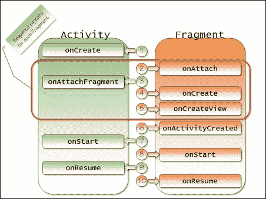

# 第三章。碎片生命周期和专业化

本章讨论了片段的生命周期与活动的生命周期之间的关系，并演示了生命周期中不同点的适当编程动作。介绍了特殊目的片段类`ListFragment`和`DialogFragment`，涵盖了它们的使用，以及它们在活动生命周期中的行为与标准片段的行为有何不同。

本章涵盖以下主题:

*   片段设置/显示事件序列
*   片段拆卸/隐藏事件序列
*   与`ListFragment`班一起工作
*   与`DialogFragment`班一起工作
*   作为传统的`Dialog`类与`DialogFragment`类交互
*   将现有的`Dialog`类包装在`DialogFragment`类中

到本章结束时，我们将能够协调片段在其宿主活动中的设置和拆卸，并有效利用`ListFragment`和`DialogFragment`类。

# 了解碎片生命周期

开发安卓应用的挑战之一是确保我们的应用有效地处理应用活动的生命周期。在应用程序的生命周期中，给定的活动可能会被创建、销毁和重新创建多次。一个简单的动作，例如用户将设备从纵向旋转到横向或相反，通常会导致可视活动被完全破坏，并使用新方向的适当资源重新创建。不能与这种自然生命周期有效协作的应用程序经常崩溃或以其他不希望的方式运行。

每个片段实例存在于单个活动中；因此，这个片段必须以某种方式与活动生命周期合作。事实上，片段不仅与活动生命周期相配合，而且紧密相连。

在设置和显示阶段，以及隐藏和拆卸阶段，片段提供了许多与活动相同的生命周期相关的回调方法。此外，片段提供了额外的与生命周期相关的回调方法，这些方法与片段与包含活动的关系有关。

随着我们的应用程序变得越来越复杂，并且我们使用片段类的更专业的实现，理解片段类的生命周期以及与活动生命周期的关系是至关重要的。

### 注

如果您不熟悉安卓活动生命周期回调方法的基础知识，请参考[中安卓活动文档的*活动生命周期*部分。](http://developer.android.com/reference/android/app/Activity.html#ActivityLifecycle)

## 了解片段设置和显示

片段设置和显示是一个多阶段的过程，涉及片段与活动的关联、其创建以及将活动移动到运行状态(也称为恢复或活动状态)的标准生命周期事件。理解生命周期事件的行为和相关的回调方法对于有效地使用片段至关重要。一旦我们理解了生命周期事件和回调方法，我们将看看事件回调方法是如何使用的。

下图显示了在设置和显示过程中，在片段和活动上发生的生命周期相关回调方法调用的顺序:



正如您所料在大多数情况下，片段设置和显示的第一步发生在活动的`onCreate`方法中。在大多数情况下，活动从活动的`onCreate`回调方法中调用`setContentView`方法，然后该方法加载布局资源并触发活动与所包含片段的关联。

注意接下来会发生什么。甚至在创建片段之前，它就被附加到活动中。片段首先被通知附件，并通过`onAttach`回调方法接收对活动的引用。然后通过`onAttachFragment`回调方法通知活动并接收对片段的引用。

虽然在创建片段之前将片段附加到活动看起来可能出乎意料，但是这样做是有用的。在许多情况下，片段需要在创建过程中访问活动，因为活动通常包含片段将显示的信息，或者对片段的创建过程很重要的信息。

该片段附加到活动，然后在`onCreate`方法中执行一般的创建工作，然后在`onCreateView`方法中构建包含的视图层次结构。我们将在本章后面的*最大化可用资源*一节中详细讨论每种方法中适合执行的操作。

当一个活动包含多个片段时，安卓会为一个片段连续调用四个方法`Fragment.onAttach`、`Activity.onAttachFragment`、`Fragment.onCreate`和`Fragment.onCreateView`，然后为下一个片段调用这些方法。这允许每个片段在下一个片段开始这个过程之前完成附加和创建的过程。

一旦对所有片段调用这四个方法的序列完成，剩余的设置和显示回调方法将对每个片段单独连续调用。

活动完成其`onCreate`方法的执行后，Android 再调用每个片段的`onActivityCreated`方法。`onActivityCreated`方法表示由活动的布局资源创建的所有视图和片段现在都已完全构建，可以安全访问。

此时，片段在调用了每个同名的活动方法之后，会收到对`onStart`和`onResume`方法的标准生命周期回调。在片段的`onStart`和`onResume`方法中执行的任何工作都非常类似于在活动中相应方法中执行的工作。

对于许多片段来说，它们生命周期的这一部分中唯一被覆盖的方法是`onCreate`和`onCreateView`方法，正如我们在前面几章的例子中所提到的。

### 避免方法名称混淆

activity 和片段类有很多常用的回调方法，这些常用的方法大多有一个共同的目的。一个重要的例外是`onCreateView`方法。这种方法的目的对于每个类都有很大的不同。

如前所述，安卓调用`Fragment`类的`onCreateView`方法，给片段一个机会来创建和返回片段包含的视图层次结构。该方法通常在片段中被重写。

在布局资源膨胀的过程中，`Activity`类中同名的方法被`LayoutInflater`类重复调用。大多数活动实现都不会覆盖此方法。

## 理解碎片隐藏和拆卸

正如片段在设置和显示过程中的行为与活动相似，它们在隐藏和拆卸过程中的行为也相似，如下图所示:


最初，在隐藏和拆卸过程中，片段的行为就像活动一样。当用户切换到另一个活动时，调用每个片段的`onPause`、`onSaveInstanceState`和`onStop`方法。对于每个方法，首先调用片段实现，然后调用活动实现。

调用`onStop`方法后，片段开始表现得与活动有些不同。与片段创建与片段视图层次创建的分离一致，片段视图层次销毁与片段销毁是分离的。在调用活动的`onStop`方法之后，片段的`onDestroyView`方法被调用，这表明片段的`onCreateView`方法返回的视图层次结构正在被破坏。然后调用片段的`onDestroy`方法，接着调用片段的`onDetach`方法。此时，片段与活动没有关联，对`getActivity`方法的任何调用都将返回 null。

对于包含多个片段的活动，在开始下一个片段调用这三个方法的顺序之前，安卓会为单个片段调用这三个方法的顺序`onDestroyView`、`onDestroy`、`onDetach`。这将销毁和分离每个片段的过程分组，类似于安卓将附加和创建每个片段的过程分组。一旦所有片段的这个序列完成，安卓就调用活动的`onDestroy`方法。

## 最大化可用资源

对于的大部分来说，一个片段的生命周期管理非常像一个活动的生命周期管理。然而，有一个重要的例外:碎片创建和销毁的两阶段性质。片段将它们的创建和销毁与其包含的视图层次结构分开。这是因为片段能够在没有视图层次结构的情况下存在并与活动相关联。

在许多情况下，一个活动包含多个片段，但在任何时间点都只能看到这些片段的一个子集。在这种情况下，所包含的片段可以调用它们的`onAttach`和`onCreate`方法。但是对每个片段的`onCreateView`方法的调用被延迟，直到应用程序让这个片段的内容可见的时候。同样，当需要隐藏一个片段的内容时，只调用该片段的`onDestroyView`方法，而不调用`onDestroy`和`onDetach`方法。

当片段在一个活动中被动态管理时，这种行为就起作用了。这种行为允许将片段与活动相关联以及初始化片段状态的开销只发生一次，同时能够轻松地更改片段视图层次结构的可见性。当我们使用`FragmentTransaction`类和某些管理片段的动作栏特性显式管理片段的可见性时，这一点很重要。我们将在接下来的两章中讨论这些问题。

### 管理片段状态

对于许多片段实现，生命周期序列中最重要的回调方法是`onSaveInstanceState`方法。就像活动一样，这个回调方法为片段提供了在片段被销毁之前保持任何状态的机会，例如当用户移动到另一个活动时，或者当用户将设备旋转到不同的方向时。在这两种情况下，活动和包含的片段可能会被完全拆除并重新创建。通过在`onSaveInstanceState`方法中保持片段状态，该状态随后在`onCreate`和`onCreateView`方法中被传递回片段。

当管理一个片段的状态时，你需要确保将片段整体存在的一般工作与特定工作分开，以建立视图层次结构。对于片段的存在来说，任何昂贵的初始化工作，例如连接到数据源、复杂的计算或资源分配，都应该在`onCreate`方法中进行，而不是在`onCreateView`方法中进行。这样，如果只有片段的视图层次结构被破坏，并且片段保持完整，您就避免了不必要地重复昂贵的初始化工作。

# 专用片段类

现在我们理解了片段的生命周期，可以看看`Fragment`类的一些专门化版本。当我们浏览每一个专业类时，记住它们最终都继承自`Fragment`类，因此体验到相同的生命周期行为。这些专业类中的许多类对在生命周期的不同点上执行哪些操作是安全的有影响，其中一些类甚至添加了自己的生命周期方法。理解这些类中的每一个以及它们与片段生命周期的交互对于有效地使用这些类是至关重要的。

## 列表片段

使用最简单的片段派生类之一，也是最有帮助的一个，是`ListFragment`类。 `ListFragment`类提供了封装`ListView`的片段，顾名思义，对于显示数据列表很有用。

### 将数据与列表相关联

与基础`Fragment`类不同，我们不需要覆盖`ListFragment`类的`onCreateView`回调方法。`ListFragment`类提供了标准的外观，只需要我们关联一些数据。`ListFragment`类完成创建视图层次结构和显示这些数据的所有工作。

我们将通过调用`ListFragment`类的`setListAdapter`方法并将引用传递给实现`ListAdapter`接口的对象来将数据与`ListFragment`类相关联。安卓提供了很多实现这个界面的类，比如`ArrayAdapter`、`SimpleAdapter`和`SimpleCursorAdapter`。您使用的特定类将取决于您的源数据是如何存储的。如果没有一个标准的安卓类满足您的特定需求，您可以相当容易地创建一个自定义实现。

### 注

关于创建自定义列表适配器的讨论，请看*显示快速联系徽章安卓*教程在[http://developer . Android . com/training/contacts-provider/display-Contact-Badge . html](http://developer.android.com/training/contacts-provider/display-contact-badge.html)。

`ListFragment`类包装了`ListView`类的一个实例，可通过`getListView`方法访问。在大多数情况下，我们可以自由地与包含的`ListView`实例直接交互，并利用`ListView`类提供的任何功能。一个非常重要的例外是当我们设置`ListAdapter`实例时。`ListFragment`和`ListView`类都暴露了一个`setListAdapter`方法，但是我们一定要使用`ListFragment`版本的方法。

`ListFragment`类依赖于在`ListFragment.setListAdapter`方法中发生的某些初始化行为；因此，直接在包含的`ListView`实例上调用`setListAdapter`方法的过程会绕过这种初始化行为，并可能导致应用程序变得不稳定。

### 将数据与显示分离

到目前为止，我们的应用程序使用了几个`RadioButton`视图的固定布局来显示图书列表。使用固定布局来显示这样的选项通常不是一个好的选择，因为对图书列表的任何更改都需要我们进入并直接修改片段布局。实际上，我们更喜欢独立于特定标题的布局。我们可以编写代码来动态生成`RadioButton`视图，但是有一种更简单的方法。我们可以使用`ListFragment`类。

通过将我们的应用程序切换到使用`ListFragment`类，我们可以简单地将书名列表存储在一个数组资源中，并将这个数组资源的内容与`ListFragment`实例相关联。在添加更多标题或需要更改其中一个标题的情况下，我们可以简单地修改数组资源文件。我们没有必要对实际的片段布局进行任何更改。

我们的应用程序已经将所有书名存储为单独的字符串资源，所以我们只需要为它们添加一个数组资源。我们将图书标题数组添加到`values`资源文件夹中的 `course_arrays.xml`资源文件中，在这里我们当前定义了一个数组资源来保存图书描述列表。

在`course_arrays.xml`资源文件的`resources`根元素中，添加一个包含`name`属性且值为`bookTitles`的`string-array`元素。在`string-array`元素中，为每个书名添加一个`item`，引用每个书名的字符串资源。我们希望确保以与`book_descriptions`数组条目相同的顺序列出书名数组条目，因为当我们通知用户图书选择的活动时，我们使用数组索引作为每本书的标识值。图书标题和描述数组的数组资源条目如下所示:

```java
<resources>
  <!-- Book Titles -->
  <string-array name="book_titles">
    <item>@string/dynamicUiTitle</item>
    <item>@string/android4NewTitle</item>
    <item>@string/androidSysDevTitle</item>
    <item>@string/androidEngineTitle</item>
    <item>@string/androidDbProgTitle</item>
  </string-array>

  <!-- Book Descriptions -->
  <string-array name="book_descriptions">
    <item>@string/dynamicUiDescription</item>
    <item>@string/android4NewDescription</item>
    <item>@string/androidSysDevDescription</item>
    <item>@string/androidEngineDescription</item>
    <item>@string/androidDbProgDescription</item>
  </string-array>
</resources>
```

标题存储为数组资源后，我们现在可以轻松创建一个`ListFragment`派生类来显示书籍标题。

#### 用Android Studio创建 listbluge 派生类

第一步是给我们的项目添加一个新类。为此，我们将创建一个名为`BookListFragment2`的新类，它扩展了`ListFragment`类。在[第 1 章](1.html "Chapter 1. Fragments and UI Modularization")、*碎片和 UI 模块化*中，我们手动创建了碎片类。对于`BookListFragment2`课程，我们将使用Android Studio。

要创建 `BookListFragment2`类，我们首先需要通过执行以下步骤打开**新安卓活动**对话框:

1.  选择Android Studio**文件**菜单。
2.  然后，选择**新建**。
3.  选择**片段**。
4.  选择**片段(列表)**。

现在，我们将在**新安卓活动**对话框中执行以下步骤:

1.  在**对象种类:**字段中，输入`String`。
2.  在**片段类名:**字段，输入`BookListFragment2`。
3.  然后，取消选择**包含片段工厂方法？**复选框。
4.  取消选择**在大屏幕上切换到网格视图？**复选框。

**新安卓活动**对话框现在看起来应该类似于下面的截图:


点击**完成**按钮完成`BookListFragment2`类的创建。

生成的类使用了`onCreate`方法，用虚拟数据填充列表。要在中载入书名列表，更新`onCreate`方法，如下代码所示:

```java
public void onCreate(Bundle savedInstanceState) {
  super.onCreate(savedInstanceState);

  // TODO: Change Adapter to display your content
  String[] bookTitles =
    getResources().getStringArray(R.array.book_titles);
  setListAdapter(new ArrayAdapter<String>(getActivity(),
    android.R.layout.simple_list_item_1,
    android.R.id.text1, bookTitles));
}
```

在`onCreate`方法中，我们将首先调用扩展`ListFragment`的所有类所需的基类实现。然后我们将加载`bookTitles`阵列资源。我们将通过传递一个`ArrayAdapter`的实例来调用`setListAdapter`方法。数组适配器将上下文作为第一个参数，我们将通过访问活动来获得它，然后它将数组作为第三个参数。第二个参数是用于布局列表中每个条目的资源的标识。该资源可以是自定义资源，也可以是内置的安卓资源之一。在我们的例子中，我们将使用内置的安卓布局资源`android.R.layout.simple_list_item_1`，它为`ListView`中的每一行显示一个字符串值。

### 注

为`ListFragment`类创建自定义布局资源就像为 `ListView`类创建一样，并在[的安卓开发者文档中详细讨论。](http://developer.android.com/reference/android/app/ListFragment.html)

#### 处理列表片段项目选择

为了让我们的应用程序正常工作，我们需要在用户每次选择其中一个标题时通知活动。当我们使用一个接口将我们的片段与活动松散耦合时，这是一个非常简单的任务。

当 Android 工作室生成`BookListFragment2`类时，它在名为`OnFragmentInteractionListener`的`BookListFragment2`类中包含一个嵌套的接口声明，以及使用该接口通知列表中用户选择活动的代码。滚动到`BookListFragment2`类的底部，会看到`OnFragmentInteractionListener`界面声明，如下代码所示:

```java
public interface OnFragmentInteractionListener {
  // TODO: Update argument type and name
  public void onFragmentInteraction(String id);
}
```

正如我们之前创建的`OnSelectedBookChangeListener`界面一样，我们不需要`OnFragmentInteractionListener`界面；因此，我们可以删除它，然后更新`BookListFragment2`类以使用我们现有的`OnSelectedBookChangeListener`界面。

滚动到`BookListFragment2`类的顶部，找到`mListener`字段声明，如下代码所示:

```java
private OnFragmentInteractionListener mListener;
```

更新`mListener`字段声明以使用`OnSelectedBookChangeListener`界面，这样声明现在出现如下代码所示:

```java
private OnSelectedBookChangeListener mListener;
```

通过`mListener`字段，我们能够存储对包含活动的引用作为`OnSelectedBookChangeListener`接口引用。生成的`BookListFragment2`类代码在`onAttach`回调方法中设置`mListener`引用。正如我们在本章前面所讨论的，当片段实例被附加到包含活动并接收到对该活动的引用时，调用`onAttach`方法。更新`onAttach`方法以使用`OnSelectedBookChangeListener`界面而不是`OnFragmentInteractionListener`界面，这样该方法现在出现如下代码所示:

```java
public void onAttach(Activity activity) {
  super.onAttach(activity);
  try {
    mListener = (OnSelectedBookChangeListener) activity;
  } 
  catch (ClassCastException e) {
    throw new ClassCastException(activity.toString()
      + " must implement OnSelectedBookChangeListener");
  }
}
```

`onAttach`方法只是将活动分配给`mListener`字段，将活动投射到`OnSelectedBookChangeListener`界面。该方法还包括一个`try` \ `catch`块，如果包含活动没有实现`OnSelectedBookChangeListener`界面，该块将显示适当的错误消息。

生成的`BookListFragment2`类包括一个`onListItemClick`方法，当用户从列表中进行选择并接收到几个与选择相关的参数(包括用户选择的从零开始的位置)时调用该方法。更新`onListItemClick`方法使用`OnSelectedBookChangeListener`界面，使该方法出现如下代码所示:

```java
public void onListItemClick(ListView l, View v,
  int position, long id) {
  super.onListItemClick(l, v, position, id);
  if (null != mListener) {
    mListener.onSelectedBookChanged(position);
  }
}
```

在基类上调用`onListItemClick`方法后，前面的代码验证了`mListener`字段已设置。如果有，调用`onSelectedBookChanged`方法，传递用户选择的位置。该代码现在将在用户每次从列表中进行选择时通知活动，就像用户选择单选按钮时`BookListFragment`类实现所做的那样。

我们的应用程序中使用我们的`BookListFragment2`类的所有活动类都已经实现了`OnSelectionChangeListener`接口，因此不需要对活动类进行任何更改。

#### 更新布局资源

我们现在将更新`activity_main.xml`资源文件，使用`BookListFragment2`类代替原来的`BookListFragment`类，如下代码所示:

```java
<LinearLayout
  android:orientation="vertical"
  android:layout_width="match_parent"
  android:layout_height="match_parent"
  xmlns:android="http://schemas.android.com/apk/res/android">

  <!-- List of Book Titles ** using the ListFragment **-->
  <fragment
    android:layout_width="match_parent"
    android:layout_height="0dp"
    android:layout_weight="1"
    android:name="com.jwhh.fragments.BookListFragment2"
    android:id="@+id/fragmentTitles"/>

  <!-- Description of selected book -->
  <fragment
    android:layout_width="match_parent"
    android:layout_height="0dp"
    android:layout_weight="1"
    android:name="com.jwhh.fragments.BookDescFragment"
    android:id="@+id/fragmentDescription"/>
</LinearLayout>
```

我们需要在`activity_main_wide.xml`文件中进行同样的更改。

我们的程序现在使用`ListFragment`类完全正常运行，如下所示:


我们需要对标题进行的任何更改现在都可以在资源文件中进行，并且不需要对用户界面代码进行更改。

## 对话片段

到目前为止，我们一直将片段视为一种新的方式，将应用程序的用户界面划分为可用显示区域的子部分。虽然片段是新的，但是将我们的应用程序用户界面的一个方面作为可用显示区域的一个子部分的概念并不是新的。每当一个应用程序显示一个对话框时，应用程序就会这样做。

从历史上看，使用对话框的挑战是，尽管它们在概念上只是应用程序中的另一个窗口，但我们必须以不同于应用程序用户界面其他方面的方式来处理与对话框相关的许多任务。像处理按钮点击这样简单的事情需要特定于对话框的`DialogInterface.OnClickListener`界面，而不是我们从用户界面代码的非对话框相关部分处理`click`事件时使用的`View.OnClickListener`界面。一个更复杂的问题是方向的改变。对话框会自动关闭以响应方向变化，因此如果用户在对话框可见时更改设备方向，可能会导致应用程序行为不一致。

`DialogFragment`类消除了许多与对话框相关的特殊处理。使用`DialogFragment`类，显示和管理对话框变得与我们应用程序用户界面的其他方面更加一致。

### 风格

当应用程序显示一个`DialogFragment`类的实例时，`DialogFragment`实例的窗口最多有三个部分:布局区域、标题和框架。一个`DialogFragment`实例总是包含布局区域，但是我们可以通过使用`setStyle`方法设置`DialogFragment`类的样式来控制它是否包含标题和框架。`DialogFragment`类支持四种样式，其中`DialogFragment`类的一个实例只应用了一种样式。下表显示了四种可用的样式:

<colgroup><col style="text-align: left"> <col style="text-align: left"> <col style="text-align: left"> <col style="text-align: left"></colgroup> 
| 

风格

 | 

有头衔

 | 

有框架

 | 

接受输入

 |
| --- | --- | --- | --- |
| `STYLE_NORMAL` | 是 | 是 | 是 |
| `STYLE_NO_TITLE` | 不 | 是 | 是 |
| `STYLE_NO_FRAME` | 不 | 不 | 是 |
| `STYLE_NO_INPUT` | 不 | 不 | 不 |

### 注

请注意，样式会累积移除特征。例如，`STYLE_NO_TITLE`表示没有标题，而`STYLE_NO_FRAME`表示没有框架和标题。如果我们不调用`setStyle`方法，安卓将创建`DialogFragment`实例，样式设置为`STYLE_NORMAL`。

该样式影响`DialogFragment`类的其余行为，因此必须在`onCreate`回调方法中设置。试图在生命周期的后期设置`DialogFragment`类的风格被忽略。

如果您希望为对话框提供一个特殊的主题，也可以将主题的资源标识传递给`setStyle`方法。要让安卓根据风格选择合适的主题，只需通过`0`作为主题资源 id 即可。下面的代码将`DialogFragment`实例设置为没有标题，并使用安卓选择的主题作为该样式，如下面的代码所示:

```java
class MyDialogFragment extends DialogFragment {
  public void onCreate(Bundle savedInstanceState) {
    super.onCreate(savedInstanceState);
    setStyle(DialogFragment.STYLE_NO_TITLE, 0);
  }
}
```

### 布局

填充`DialogFragment`类实例的布局类似于标准片段派生类的布局。我们将简单地覆盖`onCreateView`方法，并通过以下代码膨胀布局资源:

```java
public View onCreateView(LayoutInflater inflater,
  ViewGroup container, Bundle savedInstanceState) {
  View theView = inflater.inflate(R.layout.fragment_my_dialog,
    container, false);
  return theView;
}
```

创建用于`DialogFragment`派生类的布局资源的工作方式与为任何其他`fragment`派生类创建布局资源完全一样。为了让我们的`DialogFragment`实例显示一行文本和两个按钮，我们将定义`fragment_my_dialog.xml`布局资源，如下 XML 所示:

```java
<LinearLayout
  xmlns:android="http://schemas.android.com/apk/res/android"
  android:orientation="vertical"
  android:layout_width="match_parent"
  android:layout_height="match_parent">

  <!-- Text -->
  <TextView
    android:layout_width="fill_parent"
    android:layout_height="0px"
    android:layout_weight="1"
    android:text="@string/dialogSimpleFragmentPrompt"
    android:layout_margin="16dp"/>

  <!-- Two buttons side-by-side -->
  <LinearLayout
    android:layout_width="fill_parent"
    android:layout_height="0px"
    android:orientation="horizontal"
    android:layout_weight="3">
  <Button
    android:id="@+id/btnYes"
    android:layout_width="0px"
    android:layout_height="wrap_content"
    android:layout_weight="1"
    android:text="@string/text_yes"
    android:layout_margin="16dp"/>
  <Button
    android:id="@+id/btnNo"
    android:layout_width="0px"
    android:layout_height="wrap_content"
    android:layout_weight="1"
    android:text="@string/text_no"
    android:layout_margin="16dp"/>
  </LinearLayout>
</LinearLayout>
```

### 显示对话片段

显示我们的`DialogFragment`派生类很大程度上只是创建类实例和调用`show`方法的问题。然而，我们需要记住，尽管我们的`DialogFragment`实例在显示时显示为标准对话框，但它实际上是一个片段。与所有片段一样，由包含活动的`FragmentManager`实例管理。因此，我们需要传递对活动的`FragmentManager`实例的引用，作为对`DialogFragment`类‘`show`方法的调用的一部分，如下面的代码所示:

```java
MyDialogFragment theDialog = new MyDialogFragment();
theDialog.show(getFragmentManager(), null);
```

将我们的`DialogFragment`派生类的样式设置为`STYLE_NO_TITLE`，并使用前面显示的`fragment_my_dialog.xml`布局资源文件，前面的代码显示了下面的截图:


### 对话片段中的事件处理

`DialogFragment`类的一个关键价值是，与使用传统的`Dialog`类相比，它在我们的代码中提供了更大的一致性。使用`DialogFragment`类处理的大多数方面与处理其他片段时相同。显示对话框不再需要像处理应用程序用户界面的其他方面那样不同。例如，不需要特殊处理来处理方向变化。这种更大一致性的另一个地方是在事件处理中，因为我们的按钮点击事件处理可以使用标准的视图类事件接口。

为了处理按钮点击，我们的`DialogFragment`派生类简单地实现了`View.OnClickListener`接口。下面的代码显示了设置“是”和“否”按钮点击事件来回调我们的类“`onCreateView`回调方法中的`DialogFragment`派生类:

```java
public View onCreateView(LayoutInflater inflater,
  ViewGroup container, Bundle savedInstanceState) {
  View theView = inflater.inflate(R.layout.fragment_my_dialog, container, false);

  // Connect the Yes button click event and request focus
  View yesButton = theView.findViewById(R.id.btnYes);
  yesButton.setOnClickListener(this);
  yesButton.requestFocus();

  // Connect the No button click event
  View noButton = theView.findViewById(R.id.btnNo);
  noButton.setOnClickListener(this);

  return theView;
}
```

请注意，我们正在设置按钮点击处理，就像我们在任何其他片段中工作，甚至直接在活动中工作一样。

我们还可以像处理其他片段一样，处理通知用户与`DialogFragment`派生类交互的活动。正如我们在通知活动书名选择时所做的，我们的`DialogFragment`派生类只是提供了一个界面来通知活动用户选择了哪些可用按钮，如下面的代码所示:

```java
public class MyDialogFragment extends DialogFragment
  implements View.OnClickListener {
  // Interface Activity implements for notification
  public interface OnButtonClickListener {
    void onButtonClick(int buttonId);
  }
  // Other members elided for clarity
}
```

只要活动实现了接口，我们的`DialogFragment`派生类就可以通知用户点击的按钮的活动。

在按钮点击事件的处理程序中，我们将遵循与上一章相同的模式。我们将访问包含活动，将其转换为预期的接口，并调用接口方法，如以下代码所示:

```java
public void onClick(View view) {
  int buttonId = view.getId();

  // Notify the Activity of the button selection
  OnButtonClickListener parentActivity = (OnButtonClickListener) getActivity();
  parentActivity.onButtonClick(buttonId);

  // Close the dialog fragment
  dismiss();
}
```

注意`onClick`方法有一点特殊处理。就像传统的`Dialog`类一样，当不再希望显示时，我们必须在`DialogFragment`派生类上调用`dismiss`方法。

### 对话身份

虽然我们把我们的`DialogFragment`派生类只是另一个片段，但它的一部分身份仍然与传统的`Dialog`类联系在一起。事实上，安卓实际上将我们的`DialogFragment`派生类包装在一个传统的`Dialog`实例中。这发生在名为`onCreateDialog`的`DialogFragment`类特有的回调方法中，安卓在调用`onCreateView`回调方法之前调用该方法。

`onCreateDialog`方法返回的`Dialog`实例是最终显示给用户的窗口。我们在`DialogFragment`派生类中创建的布局被简单地包装在`Dialog`窗口中。我们可以在生命周期的后期访问这个`Dialog`实例，以访问与`Dialog` 类相关的行为，甚至覆盖该方法来提供我们自己的`Dialog`实例。

#### 访问与对话框相关的行为

访问与我们的`DialogFragment`派生类的相关的行为需要引用在`onCreateDialog`方法中创建的`Dialog`实例。我们通过调用`getDialog`方法来检索这个引用。一旦我们有了对`Dialog`实例的引用，我们就可以访问类“`Dialog`身份的其他方面。

当我们创建样式设置为`STYLE_NORMAL`的`DialogFragment`派生类时，显示的对话框包括布局区域上方的标题区域。标题的值只能通过调用包装我们的`DialogFragment`实例的`Dialog`实例上的`setTitle`方法来设置。在处理对话取消行为时也会出现类似的问题。默认情况下，用户可以通过点击对话框后面的活动来取消对话框。在许多情况下，这可能是不可接受的，因为我们希望要求用户确认对话框中的一个选择。以下代码设置了按钮点击处理后与 `Dialog`相关的这些行为:

```java
public View onCreateView(LayoutInflater inflater,
  ViewGroup container, Bundle savedInstanceState) {
  View theView = inflater.inflate(R.layout.fragment_my_dialog, container, false);

  View yesButton = theView.findViewById(R.id.btnYes);
  yesButton.setOnClickListener(this);
  yesButton.requestFocus();

  View noButton = theView.findViewById(R.id.btnNo);
  noButton.setOnClickListener(this);

  // Set the dialog aspects of the dialog fragment
  Dialog dialog = getDialog();
  dialog.setTitle(getString(R.string.myDialogFragmentTitle));
  dialog.setCanceledOnTouchOutside(false);

  return theView;
}
```

该代码首先设置对话框标题，然后设置选项以防止用户通过点击活动窗口来关闭对话框。要使对`setTitle`方法的调用起作用，我们需要将对`onCreate`回调方法中的`setStyle`方法的调用更改为`STYLE_NORMAL`样式，以便对话框有标题区域。

#### 将现有的对话框包装在一个片段中

可能有些时候我们喜欢`DialogFragment`类提供的编程一致性，但是希望利用从传统`Dialog`类派生的类所提供的特性。通过覆盖`DialogFragment`类的`onCreateDialog`方法，我们可以做到这一点。覆盖`onCreateDialog`方法允许我们用我们创建的实例替换`DialogFragment`类的默认`Dialog`实例。一个有用的例子是利用安卓`AlertDialog`类。

`AlertDialog`类提供了多种默认行为，并允许我们显示文本、图标和按钮，而无需创建布局资源。当我们利用继承自传统`Dialog`类的类时，我们必须记住一些事情。虽然与我们的类的外部交互将与其他`DialogFragment`派生类保持一致，但是在我们的`DialogFragment`派生类内发生的与传统`Dialog`类的任何交互都将以传统的`Dialog`类方式完成。例如，要创建一个利用`AlertDialog`类的`DialogFragment`派生类，需要我们的类实现`Dialog`类处理点击事件的方式；也就是说，它必须实现`DialogInterface.OnClickListener`接口，如下代码所示:

```java
public class AlertDialogFragment extends DialogFragment
  implements DialogInterface.OnClickListener{  }
```

在我们类的`onCreateDialog`方法中，我们将使用`AlertDialog.Builder`类创建`AlertDialog`实例，就像我们将直接显示`AlertDialog`实例一样。在`onCreateDialog`方法中，我们将设置`AlertDialog.Builder`实例上的所有选项，包括标题、消息、图标和按钮。注意，我们从来不称`AlertDialog.Builder`类为`show`方法；相反，我们称其为`create`法。然后，我们将引用新创建的`AlertDialog`实例，并从`onCreateDialog`方法中返回它。所有这些步骤都显示在下面的代码中:

```java
public Dialog onCreateDialog(Bundle savedInstanceState) {
  // Create the Builder for the AlertDialog
  AlertDialog.Builder builder = new AlertDialog.Builder(getActivity());

  // Set the AlertDialog options
  builder.setTitle(R.string.alert_dialog_title)
  .setMessage(R.string.alert_dialog_message)
  .setIcon(R.drawable.ic_launcher)
  .setCancelable(false)
  .setPositiveButton(R.string.text_yes, this)
  .setNegativeButton(R.string.text_no, this);

  // Create and return the AlertDialog
  AlertDialog alertDialog = builder.create();
  return alertDialog;
}
```

我们创建的`Dialog`实例现在作为`DialogFragment`实例的一部分进行管理。我们对我们的`AlertDialogFragment`类所做的其他一切将和我们创建的其他`DialogFragment`派生类一样。

当我们的应用程序显示我们的`AlertDialogFragment`类时，它看起来像这样:


### 注

请注意，我们不需要覆盖`onCreateView`回调方法，因为我们在`onCreateDialog`回调方法中创建的`Dialog`实例提供了所需的显示特性。

覆盖`DialogFragment`类的`onCreateDialog`回调方法是一种强大的技术，允许我们享受`DialogFragment`类的好处，同时仍然利用我们在传统`Dialog`类中可能有的任何现有投资——无论它们是内置类，如`AlertDialog`类，还是我们自己的代码库中可能有的自定义`Dialog`类。

# 总结

理解片段生命周期使我们能够利用片段的创建和销毁阶段来更有效地管理片段和与之相关的数据。通过使用这种自然的生命周期，我们可以利用专门的片段类来创建丰富的用户体验，同时遵循比以前更一致的编程模型。

在下一章中，我们将基于对片段生命周期的理解，对片段进行更直接的控制，以便在单个活动中动态地添加和移除它们。