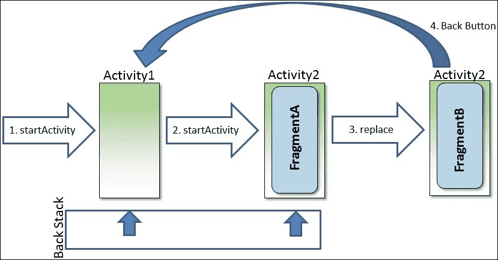

# 四、使用片段事务

本章涵盖了动态管理活动中的片段、实现后退按钮行为以及监控用户与后退按钮的交互。

让我们看一下涵盖的主题:

*   理解`FragmentTransactions`
*   动态添加和删除片段
*   将片段用户界面与活动关系分开管理
*   `FragmentTransactions`增加后退按钮支持

到本章结束时，我们将能够创建交互式 ui，使用片段来动态更改屏幕外观以响应用户操作。

# 有意屏蔽管理

到目前为止，我们一直认为每个活动在我们的应用程序中总是对应一个屏幕。我们只使用片段来表示每个屏幕中的子部分。举个例子，让我们回想一下我们构建图书浏览应用程序的方式。在宽显示设备的情况下，我们的应用程序使用包含两个片段的单个活动。一个片段显示图书标题列表，另一个片段显示当前所选图书的描述。由于这两个片段同时出现在屏幕上，我们从一个活动中显示和管理它们。然而，在面向肖像的手机的情况下，我们选择在单独的屏幕上显示图书列表和图书描述。原因是两个片段没有同时出现在屏幕上；我们在不同的活动中管理它们。

令人惊讶的是，在这两种情况下，我们的应用程序执行相同的任务。唯一的区别是我们一次能在屏幕上显示多少信息。这一细节导致我们在应用程序中增加了一个额外的活动。我们还增加了应用程序的复杂性，因为启动新活动的代码比我们用来简单更新同一活动中的片段的代码更复杂。此外，我们在活动中复制了代码，因为它们都与图书描述片段交互。

大家会记得，当我们在[第 1 章](1.html "Chapter 1. Fragments and UI Modularization")、*片段和 UI 模块化*中开始讨论片段时，我们提到片段的一个关键价值是它们有助于减少不必要的复杂性、活动扩散和逻辑重复。然而，当应用程序正在编写时，我们正在经历所有这些事情。

我们需要进一步发展我们对用户界面设计的想法。我们的应用程序中的活动不是简单地对设备物理显示器上的信息做出反应，而是需要专注于有意管理应用程序中的屏幕和相应活动之间的关系。

对于用户来说，移动到新屏幕的体验仅仅意味着他们看到的视图布局被不同的视图布局所取代。历史上，我们倾向于设计我们的应用程序，以便每个活动都有一个相对固定的布局。因此，将用户移动到新的屏幕需要显示新的活动，但片段为我们提供了另一种选择。

不是简单地使用片段来管理屏幕的逻辑子部分，我们还可以使用它们来管理整个屏幕的逻辑分组。然后，我们可以动态地管理单个活动中的片段，以便从一个片段切换到另一个片段。这给了用户从一个屏幕移动到下一个屏幕的体验，同时给了我们在单个活动中管理公共用户界面元素的便利。

# 动态管理片段

动态管理片段的过程通常涉及多个步骤。这些步骤可能像移除一个片段并添加另一个片段一样简单，也可能更复杂，包括移除和添加多个片段。在任何情况下，我们都需要确保对活动中构成从一个应用程序屏幕转移到下一个应用程序屏幕的片段的所有动态更改作为单个工作单元一起发生。安卓通过使用`FragmentTransaction` 类将步骤分组到事务中来实现这一点。

从概念上讲，`FragmentTransaction`类的行为方式与其他事务模型一致:

1.  开始交易。
2.  确定所需的更改。
3.  一旦确定了这个工作单元中的所有变更，就提交事务。

当我们准备进行更改时，我们将通过调用活动的`FragmentManager`实例上的`beginTransaction`方法来启动一个新的`FragmentTransaction`实例，该实例返回对`FragmentTransaction`实例的引用。然后，我们将使用新的`FragmentTransaction`实例来识别活动中显示片段列表的所需更改。当我们在事务中时，这些更改将排队，但尚未应用。最后，当我们识别出所有期望的变化时，我们将调用`FragmentTransaction`类的`commit`方法。

一旦应用了事务中的所有更改，我们的应用程序显示就会更新，以反映这些更改，让用户感觉移动到应用程序中的新屏幕。虽然我们的应用程序执行了许多步骤来修改现有活动中显示的片段列表，但是从用户的角度来看，一切都表现得就像我们显示了一个新活动一样。

## 延迟执行交易变更

对`commit`方法的调用不会立即应用更改。

当我们使用`FragmentTransaction`类时，我们不在应用程序用户界面上做任何直接的工作。相反，我们建立了一个未来在用户界面上要做的工作的列表。我们在`FragmentTransaction`实例上调用的每个方法都会向列表中添加另一个待办事项。当我们完成添加待办事项列表并调用`commit`方法时，这个待办事项列表被打包并发送到主用户界面线程的消息队列。然后，用户界面线程遍历列表，代表`FragmentTransaction`实例执行实际的用户界面工作。

### 注

由于对`FragmentTransaction`实例的方法调用不会直接影响用户界面，因此应用程序可以在非用户界面线程上安全地进行这些调用。复杂的应用程序可以利用这一事实，通过在必要时在后台执行与`FragmentTransaction`相关的工作来提供更具响应性的用户体验。

在大多数情况下，在`FragmentTransaction`实例中执行的工作的延迟执行效果良好。然而，如果我们的应用程序代码需要在调用`commit`方法之后立即找到一个片段，或者与一个由片段添加的视图进行交互，那么这可能会产生问题。虽然这种要求通常不会出现，但有时会出现。

如果我们确实有这样的需求，我们可以通过在调用`FragmentTransaction`实例的`commit`方法之后调用`FragmentManager`类的`executePendingTransactions`方法来强制`FragmentTransaction`实例的工作立即执行。当对`executePendingTransactions`方法的调用返回时，我们知道所有已提交的`FragmentTransaction`工作都已执行。

我们只需要在主 UI 线程上调用`executePendingTransactions`方法就需要小心了；此方法导致挂起的用户界面工作执行，并因此触发与用户界面的直接交互。

## 添加和移除片段

在`FragmentTransaction`类上有许多方法可以用来操纵活动中的片段，其中最基本的是`add`和`remove`方法。

`add`方法允许我们将新创建的片段实例放入活动的特定视图组中，如下所示:

```java
// Begin the transaction
FragmentManager fm = getFragmentManager();
FragmentTransaction ft = fm.beginTransaction();

// Create the Fragment and add
BookListFragment2 listFragment = new BookListFragment2();
ft.add(R.id.layoutRoot, listFragment, "bookList");

// Commit the changes
ft.commit();
```

我们将首先使用活动的`FragmentManager`实例创建一个新的`FragmentTransaction`实例。然后，我们将创建我们的`BookListFragment2`类的新实例，并将其作为由`R.id.layoutRoot`标识值标识的`LinearLayout`视图组的子级附加到活动中。最后，我们将提交`FragmentTransaction`实例，表明我们已经完成了更改。我们将在本章的*更新布局以支持动态片段*一节中查看对应于这段代码的 XML 布局。

### 注

片段可以动态添加到从`ViewGroup`派生的任何布局元素中。您可能会遇到的许多示例代码都是为此目的而使用`FrameLayout`的。由于我们正在开发一个使用源自`ViewGroup`的`LinearLayout`和`LinearLayout`的现有布局，在这种情况下我们没有必要引入`FrameLayout`。

字符串值`bookList`，我们将作为第三个参数传递给`add`方法，它只是一个标记值。我们可以使用标记值来定位片段实例，就像我们使用`id`值一样。当动态添加片段时，我们将使用标签作为标识符，而不是`id`值，这只是因为没有办法将`id` 值与动态添加的片段相关联。

当我们准备显示一个不同的片段时，标签值会派上用场，因为我们需要有一个对现有片段的引用来传递给`remove`方法，这样我们就可以在添加新片段之前删除它。下面的代码显示了我们如何更新显示以显示`BookDescFragment`类来代替我们在前面的代码中添加的`BookListFragment2`类:

```java
FragmentManager fm = getFragmentManager();
Fragment listFragment = fm.findFragmentByTag("bookList");
BookDescFragment bookDescFragment = new BookDescFragment();
FragmentTransaction ft = fm.beginTransaction();
ft.remove(listFragment);
ft.add(R.id.layoutRoot, bookDescFragment, "bookDescription");
ft.commit();
```

我们将从使用标签值开始，使用`FragmentManager`类的`findFragmentByTag`方法找到我们现有的`BookListFragment2`实例。然后，我们将创建一个希望添加的新片段的实例。现在，我们有了要移除的片段和要添加的片段的引用，我们将开始片段事务。在事务中，我们将通过将引用传递给`FragmentTransaction`类的`remove`方法来移除`BookListFragment2`实例，然后使用`add`方法添加新片段，就像我们之前所做的那样。最后，我们将调用`commit`方法来允许进行更改。

移除特定视图组下的片段实例并在它的位置添加另一个片段实例的过程经常发生，对于`FragmentTransaction`类来说，这足以包含一个名为`replace`的方便方法。`replace`方法允许我们简单地识别我们想要添加的片段的信息。它负责删除目标视图组中可能存在的任何其他片段的细节。使用`replace`方法，删除`BookListFragment2`实例并添加`BookDescFragment`实例的代码可以编写如下:

```java
FragmentManager fm = getFragmentManager();
bookDescFragment = new BookDescFragment();
FragmentTransaction ft = fm.beginTransaction();
ft.replace(R.id.layoutRoot, bookDescFragment, "bookDescription");
ft.commit();
```

请注意，除了`replace`方法名之外，该代码与添加片段的情况相同。我们将创建我们的片段实例，然后在`FragmentTransaction`实例中，我们将通过传递目标视图组、片段实例和标签的标识来调用`replace`方法。`replace`方法处理移除当前可能在`R.id.layoutRoot`视图组中的任何片段的细节。然后，它将`BookDescFragment`实例添加到视图组中。

## 支持后退按钮

当我们转向这种将应用程序屏幕作为片段来管理的模式时，我们需要确保我们为用户提供的体验符合他们的期望。需要特别注意的一个方面是我们的应用程序对后退按钮的处理。

当用户与他们设备上的应用程序交互时，他们自然会在各种应用程序屏幕中前进。正常的行为是用户可以通过点击后退按钮随时返回到上一个屏幕。这是因为，每次应用程序显示一个新的活动时，安卓会自动将该活动添加到安卓后台堆栈中。这将导致用户每次点击后退按钮时都移动到上一个活动的预期行为。

这种行为基于一个活动等于一个应用程序屏幕的假设——由于我们将屏幕动态管理为片段，这个假设不再正确。当我们使用`FragmentTransaction`类将用户从一个应用程序屏幕转换到另一个应用程序屏幕时，应用程序会继续显示相同的活动，使得后栈不知道我们应用程序的新屏幕。这导致应用程序在用户点击后退按钮时跳回多个屏幕，因为后退堆栈会将用户直接返回到上一个活动，而忽略对当前活动所做的任何中间更改。

下图说明了这个问题:



以下是对上图的解释:

1.  应用程序最初调用`startActivity`方法来显示`Activity1`的实例。`Activity1`被自动添加到后栈，目前在栈顶。
2.  `Activity1`然后调用`startActivity`方法显示`Activity2,`，后者使用`FragmentTransaction.add`方法添加`FragmentA`。`Activity2`被自动添加到后栈顶部。
3.  接下来，`Activity2`用`FragmentTransaction.replace`方式显示`FragmentB`代替`FragmentA`。就用户而言，应用程序会显示一个显示`FragmentB`内容的新屏幕。问题是后栈没变。
4.  当用户现在点击后退按钮时，他/她的期望是应用应该显示上一个屏幕，`FragmentA`；相反，当安卓弹出后栈时，它遇到的下一个屏幕是`Activity1`。

我们通过在显示`FragmentB`的`FragmentTransaction`实例中调用`FragmentTransaction`类的`addToBackStack`方法来解决这个问题。`addToBackStack`方法将事务中的更改添加到后台堆栈的顶部。这允许用户使用后退按钮在`FragmentTransaction`实例中创建的应用程序屏幕中移动，就像通过显示活动创建的屏幕一样。

在调用`commit`方法之前，我们可以在事务期间的任何时候调用`addToBackStack`方法。`addToBackStack`方法可选地接受一个字符串参数，该参数可以用于命名后栈中的位置。如果您希望以后以编程方式操作后堆栈，这很有用，但在大多数情况下，该参数值可以作为 null 传递。我们将很快看到`addToBackStack`方法在起作用，因为我们修改了我们的应用程序以使用更具适应性的布局。

### 注

如果您的活动源自`AppCompatActivity`，您需要调用`getSupportFragmentManager`才能创建适当支持`addToBackStack`的交易。当从`AppCompatActivity`派生时，在使用标准`FragmentManager`创建的事务上调用`addToBackStack`会无声地失败。

# 创建自适应应用布局

让我们通过更新我们的应用程序来实践我们对动态片段管理的讨论，以便只使用一个活动来工作。这一个活动将处理两种情况:宽显示设备，其中两个片段并排出现，和面向肖像的手机，其中片段作为两个独立的屏幕出现。提醒一下，在每个场景中，应用程序都会显示如下图所示:


在我们的应用程序中，我们将忽略程序的宽显示方面，因为静态布局管理在这里工作得很好。我们的工作是在面向肖像的手机方面的应用。对于这些设备，我们将更新应用程序的主要活动，以便在显示包含图书列表的片段和显示所选图书描述的片段之间动态切换。

## 更新布局以支持动态片段

在我们编写任何代码来动态管理我们的应用程序中的片段之前，我们首先需要修改面向肖像的手机设备的活动布局资源。该资源包含在 `activity_main.xml`布局资源文件中，后面没有跟随`(land)`或`(600dp)`。布局资源当前显示如下:

```java
<LinearLayout
  xmlns:tools="http://schemas.android.com/tools"
  android:orientation="vertical"
  android:layout_width="match_parent"
  android:layout_height="match_parent"
  xmlns:android="http://schemas.android.com/apk/res/android">
  <!--    List of Book Titles  -->
  <fragment
    android:layout_width="match_parent"
    android:layout_height="0dp"
    android:layout_weight="1"
    android:name="com.jwhh.fragments.BookListFragment2"
    android:id="@+id/fragmentTitles"
    tools:layout="@layout/fragment_book_list"/>
</LinearLayout>
```

我们需要对布局资源进行两个更改。首先是给`LinearLayout`视图组添加一个`id`属性，这样我们就可以很容易地在代码中找到它。另一个变化是完全移除`fragment`元素。更新后的布局资源现在只包含`LinearLayout`视图组，该组包含一个`id`属性值`@+id/layoutRoot`。布局资源现在显示如下:

```java
<LinearLayout
  android:id="@+id/layoutRoot"
  android:orientation="vertical"
  android:layout_width="match_parent"
  android:layout_height="match_parent"
  xmlns:android="http://schemas.android.com/apk/res/android">
</LinearLayout>
```

我们仍然希望我们的应用程序最初显示图书列表片段，因此删除`fragment`元素似乎是一个奇怪的变化；然而，这样做是必要的，因为我们将移动我们的应用程序来动态管理片段。我们最终需要移除图书列表片段，用图书描述片段替换它。如果我们将图书列表片段留在布局资源中，我们稍后动态移除它的尝试将会无声地失败。

### 注

只有动态添加的片段才能被动态移除。尝试动态移除布局资源中静态添加了`fragment`元素的片段将会失败。

## 适应设备差异

当我们的应用程序在面向肖像的手机设备上运行时，该活动需要以编程方式加载包含图书列表的片段。这与我们之前在`activity_main.xml`布局资源文件中加载的`fragment`元素是同一个`Fragment`类`BookListFragment2`。在加载图书列表片段之前，我们首先需要确定是否在需要动态片段管理的设备上运行。请记住，对于宽显示设备，我们将保留静态片段管理。

在我们的代码中有几个地方，我们需要根据我们使用的布局采取不同的逻辑路径，因此我们需要向`MainActivity`类添加一个`boolean`类级别的字段，我们可以在其中存储我们使用的是动态还是静态片段管理。看看以下内容:

```java
boolean mIsDynamic;
```

我们可以询问设备的具体特征，如屏幕尺寸和方向。但是，请记住，我们之前的大部分工作是配置我们的应用程序，以利用安卓资源系统，根据设备特性自动加载适当的布局资源。与其在代码中重复这些特征检查，我们可以简单地包含代码来确定加载了哪个布局资源。我们之前创建的宽显示设备的布局资源(即`activity_main_wide.xml`)静态加载图书列表片段和图书描述片段。我们可以在活动的`onCreate`方法代码中包含确定加载的布局资源是否包含这些片段之一，如下所示:

```java
public class MainActivity extends Activity
  implements BookListFragment.OnSelectedBookChangeListener {
  protected void onCreate(Bundle savedInstanceState) {
    super.onCreate(savedInstanceState);
    setContentView(R.layout.activity_main_dynamic);

    // Get the book description fragment
    FragmentManager fm = getFragmentManager();
    Fragment bookDescFragment = fm.findFragmentById(R.id.fragmentDescription);

    // If not found than we're doing dynamic mgmt
    mIsDynamic = bookDescFragment == null || !bookDescFragment.isInLayout();
  }

  // Other members elided for clarity
}
```

当对`setContentView`方法的调用返回时，我们将知道为当前设备加载了合适的布局资源。然后，我们将使用`FragmentManager`实例搜索`id`值为`R.id.fragmentDescription`的片段，该片段包含在宽显示设备的布局资源中，但不包含在面向人像的手机的布局资源中。`null`的返回值表示片段没有被加载，因此我们在一个需要我们动态管理片段的设备上。除了对 null 的测试，我们还将包括对`isInLayout`方法的调用，以防止一种特殊情况。

在设备处于横向布局然后旋转到纵向的场景中，由`R.id.fragmentDescription`标识的片段的缓存实例可能仍然存在，即使活动没有在当前方向上使用该片段。通过调用`isInLayout`方法，我们能够确定返回的引用是否是当前加载布局的一部分。有了这个，我们有效设置`mIsDynamic`成员变量的测试表示当`R.id.fragmentDescription`片段没有找到(等于`null`)或者找到了但不是当前加载布局的一部分(即`!bookDescFragment.isInLayout`)时，我们将`mIsDynamic`设置为`true`。

## 启动时动态加载片段

现在，我们已经能够确定是否有必要动态加载图书列表片段，我们将向我们的`onCreate`方法添加这样做的代码，如下所示:

```java
protected void onCreate(Bundle savedInstanceState) {
  super.onCreate(savedInstanceState);
  setContentView(R.layout.activity_main_dynamic);

  // Get the book description fragment
  FragmentManager fm = getFragmentManager();
  Fragment bookDescFragment = fm.findFragmentById(R.id.fragmentDescription);

  // If not found than we're doing dynamic mgmt
  mIsDynamic = bookDescFragment == null || !bookDescFragment.isInLayout();

  // Load the list fragment if necessary
  if (mIsDynamic) {
    // Begin transaction
    FragmentTransaction ft = fm.beginTransaction();

    // Create the Fragment and add
    BookListFragment2 listFragment = new BookListFragment2();
    ft.add(R.id.layoutRoot, listFragment, "bookList");

    // Commit the changes
    ft.commit();
  }
}
```

在检查确定我们是否在需要动态片段管理的设备上之后，我们将包括`FragmentTransaction`以将`BookListFragment2`类的实例添加到活动中，作为`LinearLayout`视图组的子级，由标识值`R.id.layoutRoot`标识。这段代码利用了我们对`activity_main.xml`资源文件所做的更改:删除`fragment`元素，并在`LinearLayout`视图组中包含一个`id`值。

现在我们已经动态加载了图书列表，我们已经准备好摆脱其他活动了。

## 片段之间的转换

您会记得，每当用户在`BookListFragment2`类中选择一个书名时，片段通过调用`MainActivity.onSelectedBookChanged`方法并传递所选书籍的索引来通知主活动。`onSelectedBookChanged`方法目前出现如下:

```java
public void onSelectedBookChanged(int bookIndex) {
  FragmentManager fm = getFragmentManager();

  // Get the book description fragment
  BookDescFragment bookDescFragment = (BookDescFragment)
    fm.findFragmentById(R.id.fragmentDescription);

  // Check validity of fragment reference
  if(bookDescFragment == null || !bookDescFragment.isVisible()){
    // Use activity to display description
    Intent intent = new Intent(this, BookDescActivity.class);
    intent.putExtra("bookIndex", bookIndex);
    startActivity(intent);
  }
  else {
    // Use contained fragment to display description
    bookDescFragment.setBook(bookIndex);
  }
}
```

在当前实现中，我们将使用类似于我们在`onCreate`方法中所做的技术来确定加载了哪个布局；我们将尝试在当前加载的布局中找到图书描述片段。如果找到了，就知道现在的布局包含了片段，直接在片段上设置书籍描述。如果找不到，我们会调用`startActivity`方法显示确实包含图书描述片段的活动。

启动单独的活动来处理与`BookListFragment2`类的交互会不必要地增加我们程序的复杂性。这样做需要我们将数据从一个活动传递到另一个活动，这有时可能很复杂，尤其是如果有大量的值，或者如果这些值中的一些是需要在`Intent`实例中传递额外编码的对象类型。更重要的是，使用单独的活动来管理与`BookListFragment2`类的交互会导致多余的工作，因为我们已经拥有了与`MainActivity`类中的`BookListFragment2`类交互所需的所有代码。我们倾向于在所有情况下始终如一地处理与`BookListFragment2`类的交互。

### 消除冗余处理

为了消除这种冗余处理，我们将从剥离当前实现中处理启动活动的任何代码开始。我们还可以避免重复对书籍描述片段的检查，因为我们在`onCreate`方法中已经执行了该检查。相反，我们现在可以检查`mIsDynamic`类级别字段来确定正确的处理。考虑到这一点，我们最初可以修改`onSelectedBookChanged`方法，现在看起来类似于下面的代码:

```java
public void onSelectedBookChanged(int bookIndex) {
  BookDescFragment bookDescFragment;
  FragmentManager fm = getFragmentManager();

  // Check validity of fragment reference
  if(mIsDynamic) {
    // Handle dynamic switch to description fragment
  }
  else {
    // Use the already visible description fragment
    bookDescFragment = (BookDescFragment)
      fm.findFragmentById(R.id.fragmentDescription);
    bookDescFragment.setBook(bookIndex);
  }
}
```

我们现在将检查`mIsDynamic`成员字段，以确定适当的代码路径。如果事实证明是真的，我们还有一些的工作要做，但万一是`false`，我们可以简单地获取一个我们知道包含在当前布局中的图书描述片段的引用，并在上面设置图书索引，就像我们以前做的那样。

### 动态创建片段

如果`mIsDynamic`字段是`true`，我们可以简单地用图书描述片段替换我们在`onCreate`方法中添加的图书列表片段，显示图书描述片段，代码如下所示:

```java
FragmentTransaction ft = fm.beginTransaction();
bookDescFragment = new BookDescFragment();
ft.replace(R.id.layoutRoot, bookDescFragment, "bookDescription");
ft.addToBackStack(null);
ft.setCustomAnimations(
  android.R.animator.fade_in, android.R.animator.fade_out);
ft.commit();
```

在`FragmentTransaction`内，我们将创建一个`BookDescFragment`类的实例并调用`replace`方法，传递包含我们在`onCreate`方法中添加的`BookListFragment2`实例的同一个视图组的 ID。我们将包括对`addToBackStack`方法的调用，以便返回按钮正常工作，允许用户点击返回按钮返回图书列表。

### 注

该代码包括对`FragmentTransaction`类的`setCustomAnimations`方法的调用，当用户从一个片段切换到另一个片段时，该方法会产生渐变效果。

### 管理异步创建

我们还有最后一个挑战，那就是在动态添加的图书描述片段上设置图书索引。我们最初的想法可能是在创建了`BookDescFragment`实例之后，简单地调用`BookDescFragment` 类的`setBook`方法，但是让我们首先看一下`setBook`方法的当前实现。该方法当前显示如下:

```java
public void setBook(int bookIndex) {
  // Lookup the book description
  String bookDescription = mBookDescriptions[bookIndex];

  // Display it
  mBookDescriptionTextView.setText(bookDescription);
}
```

方法的最后一行试图在片段内设置`mBookDescriptionTextView`的值，这是一个问题。请记住，我们在`FragmentTransaction`类中所做的工作不会立即应用于用户界面。相反，正如我们在本章前面的*事务变更的延迟执行*一节中所讨论的，事务中的工作是在完成对`commit`方法的调用之后的某个时间执行的。因此，`BookDescFragment`实例的`onCreate`和`onCreateView`方法尚未调用。因此，尚未创建任何与`BookDescFragment`实例相关联的视图。试图在`BookDescriptionTextView`实例上调用`setText`方法将导致空引用异常。

一种可能的解决方案是修改`setBook`方法，以了解片段的当前状态。在这种情况下，`setBook`方法检查`BookDescFragment`实例是否完全创建。如果没有，它将在类级别字段中存储图书索引值，并在创建过程中自动设置`BookDescriptionTextView`值。虽然可能有一些场景需要如此复杂的解决方案，但片段给了我们一个更简单的解决方案。

`Fragment`基类包含一个名为`setArguments`的方法。使用`setArguments`方法，我们可以将数据值(也称为参数)附加到片段上，然后可以在片段生命周期的后期使用`getArguments`方法进行访问。就像我们将额外的东西与一个`Intent`实例相关联一样，一个好的做法是在目标类上定义常量来命名参数值。在非空类型(如整数)的情况下，为参数的默认值提供一个常量也是很好的编程实践，如下所示:

```java
public class BookDescFragment extends Fragment {
  // Book index argument name
  public static final String BOOK_INDEX = "book index";

  // Book index default value
  private static final int BOOK_INDEX_NOT_SET = -1;

  // Other members elided for clarity
}
```

### 注

如果你用Android Studio生成`BookDescFragment`类，你会发现`ARG_PARAM1`和`ARG_PARAM2`常量都包含在类中。Android Studio包括这些常量，以提供如何将值传递给片段的示例，就像我们现在讨论的那样。当我们添加自己的常量声明时，您可以从`BookDescFragment`类中删除`ARG_PARAM1`和`ARG_PARAM2`常量，以及生成的`BookDescFragment.onCreate`和`BookDescFragment.newInstance`方法中引用它们的行。

我们将使用`BOOK_INDEX`常量来获取和设置图书索引值，使用`BOOK_INDEX_NOT_SET`常量来指示是否设置了图书索引参数。

为了简化创建`BookDescFragment`实例并将其传递给 book index 值的过程，我们将向`BookDescFragment`类添加一个名为`newInstance`的静态工厂方法，如下所示:

```java
public static BookDescFragment newInstance(int bookIndex) {
  BookDescFragment fragment = new BookDescFragment();
  Bundle args = new Bundle();
  args.putInt(BOOK_INDEX, bookIndex);
  fragment.setArguments(args);
  return fragment;
}
```

`newInstance`方法从创建`BookDescFragment`类的实例开始。然后它创建一个`Bundle`类的实例，将图书索引存储在`Bundle`实例中，然后使用`setArguments`方法将其附加到`BookDescFragment`实例。最后，`newInstance`方法返回`BookDescFragment`实例。我们将很快在`MainActivity`类中使用这个方法来创建我们的`BookDescFragment`实例。

### 注

如果你用Android Studio生成`BookDescFragment`类，你会发现大部分`newInstance`方法已经到位了。唯一需要做的改变是替换引用`ARG_PARAM1`和`ARG_PARAM2`常量的两行，这两行是在调用前面代码中显示的`args.putInt`方法时删除的。

我们现在可以更新`BookDescFragment`类的`onCreateView`方法来寻找可能附加到片段的参数。在我们对`onCreateView`方法进行任何更改之前，让我们看看当前的实现，如下所示:

```java
public View onCreateView(LayoutInflater inflater,
  ViewGroup container, Bundle savedInstanceState) {
  View viewHierarchy = inflater.inflate(
    R.layout.fragment_book_desc, container, false);

  // Load array of book descriptions
  mBookDescriptions = getResources().getStringArray(R.array.bookDescriptions);

  // Get reference to book description text view
  mBookDescriptionTextView = (TextView) viewHierarchy.findViewById(R.id.bookDescription);
  return viewHierarchy;
}
```

由于当前实现了`onCreateView`方法，它只是扩展布局资源，加载包含书籍描述的数组，并缓存对加载书籍描述的`TextView`实例的引用。

我们现在可以更新方法来查找和使用可能作为参数附加的图书索引。更新方法如下:

```java
public View onCreateView(LayoutInflater inflater,
  ViewGroup container, Bundle savedInstanceState) {
  View viewHierarchy = inflater.inflate(
    R.layout.fragment_book_desc, container, false);

  // Load array of book descriptions
  mBookDescriptions = getResources().getStringArray(R.array.bookDescriptions);

  // Get reference to book description text view
  mBookDescriptionTextView = (TextView) viewHierarchy.findViewById(R.id.bookDescription);

  // Retrieve the book index if attached
  Bundle args = getArguments();
  int bookIndex = args != null ?
    args.getInt(BOOK_INDEX, BOOK_INDEX_NOT_SET) : BOOK_INDEX_NOT_SET;

  // If we find the book index, use it
  if (bookIndex != BOOK_INDEX_NOT_SET)
    setBook(bookIndex);
  return viewHierarchy;
}
```

就在我们返回片段的视图层次结构之前，我们将调用`getArguments`方法来检索任何可能附加的参数。参数作为`Bundle`类的实例返回。如果`Bundle`实例不为空，我们将调用`Bundle`类的`getInt`方法来检索图书索引，并将其分配给`bookIndex`局部变量。如果片段碰巧附加了不包括图书索引的参数，则返回`getInt`方法的第二个参数`BOOK_INDEX_NOT_SET`。虽然通常情况下不应该是这样，但为任何这种意外情况做好准备是一个好主意。最后，我们来看看`bookIndex`变量的值。如果它包含图书索引，我们将调用片段的`setBook`方法来显示它。

### 把所有的放在一起

现在`BookDescFragment`类包含了对附加书籍索引作为参数的支持，我们准备好来完全实现主活动的`onSelectedBookChanged`方法，包括切换到`BookDescFragment`实例并附加书籍索引作为参数。该方法现在显示如下:

```java
public void onSelectedBookChanged(int bookIndex) {
  BookDescFragment bookDescFragment;
  FragmentManager fm = getFragmentManager();

  // Check validity of fragment reference
  if(mIsDynamic){
    // Handle dynamic switch to description fragment
    FragmentTransaction ft = fm.beginTransaction();

    // Create the fragment and pass the book index
    bookDescFragment = BookDescFragment.newInstance(bookIndex);

    // Replace the book list with the description
    ft.replace(R.id.layoutRoot, bookDescFragment, "bookDescription");
    ft.addToBackStack(null);
    ft.setCustomAnimations(
      android.R.animator.fade_in, android.R.animator.fade_out);
    ft.commit();
  }
  else {
    // Use the already visible description fragment
    bookDescFragment = (BookDescFragment)
      fm.findFragmentById(R.id.fragmentDescription);
    bookDescFragment.setBook(bookIndex);
  }
}
```

就像之前一样，我们将从检查是否在进行动态片段管理开始。一旦我们确定我们是，我们将启动`FragmentTransaction`实例并创建`BookDescFragment`实例。然后我们将创建一个新的`Bundle`实例，将图书索引存储到其中，然后使用`setArguments`方法将`Bundle`实例附加到`BookDescFragment`实例。最后，我们将把`BookDescFragment`实例作为当前片段放置到位，处理后栈，启用动画，并完成事务。

现在一切都完成了。当用户从列表中选择一个书名时，将调用`onSelectedBookChanged`方法。然后，`onSelectedBookChanged`方法创建并显示带有相应书籍索引的`BookDescFragment`实例作为参数。当最终创建`BookDescFragment`实例时，其`onCreateView`方法将从参数中检索图书索引并显示适当的描述。

# 总结

有意的屏幕管理将我们从尝试每个应用程序屏幕到单个活动的负担中解放出来。使用`FragmentTransaction`类，我们能够在一个活动中的各个片段之间动态切换，消除了在我们的应用程序中为每个屏幕创建单独的活动类的需要。这有助于防止不必要的活动类扩散，更好地组织我们的应用程序，并避免复杂性的相关增加。

我们将在下一章中看到，这种在单个活动中动态管理多个屏幕的能力为我们打开了更大的灵活性，并增加了安卓应用程序外观和导航行为的丰富性。