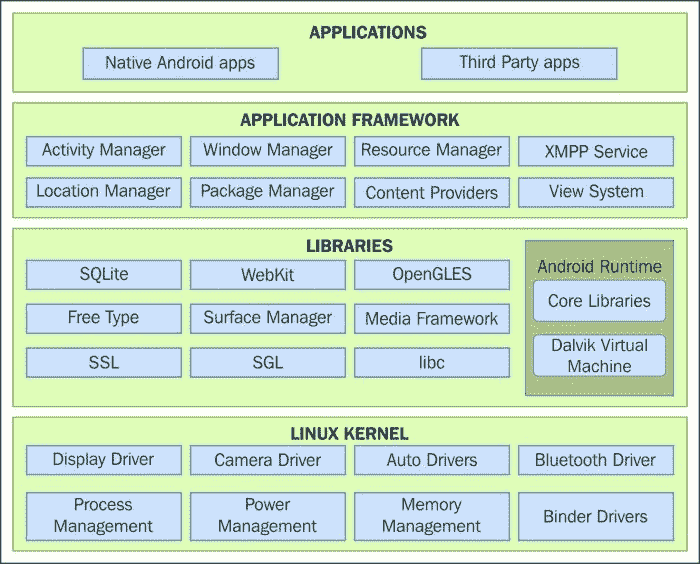
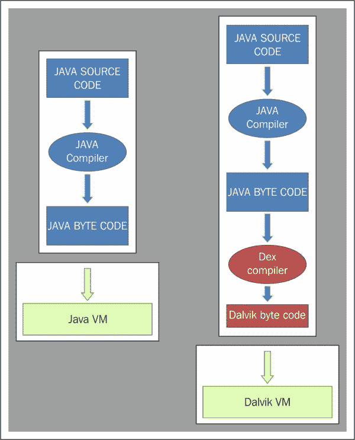
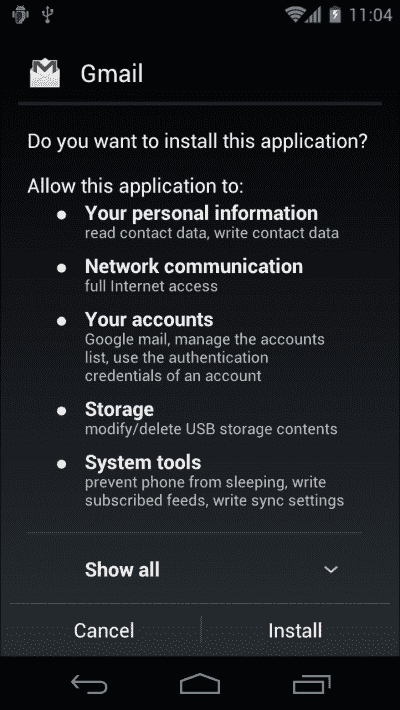
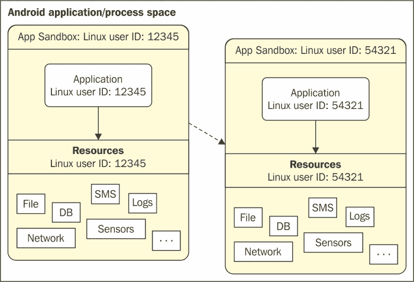
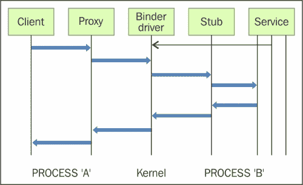
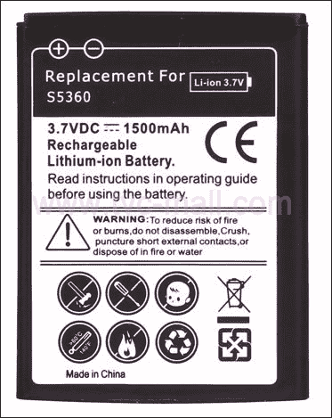
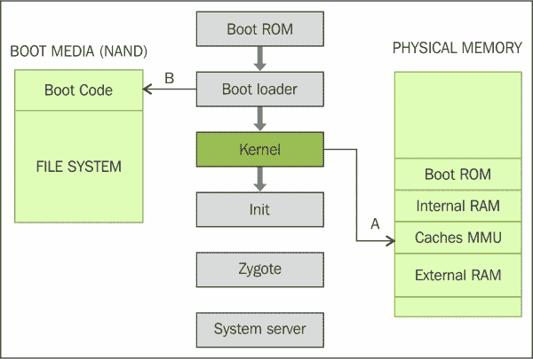
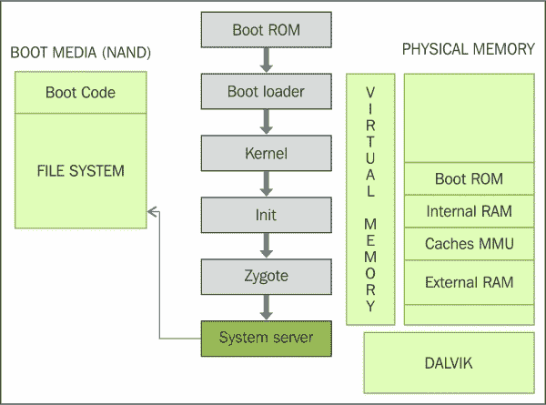

# 一、安卓取证简介

移动取证是数字取证的一个分支，在当今数字时代不断发展。安卓取证处理通过各种技术提取、恢复和分析安卓设备上存在的数据。然而，在我们深入研究并找出如何提取数据之前，对平台和其他基础知识有一个清晰的了解是很重要的。在本章中，我们将涵盖以下主题:

*   移动取证
*   移动取证方法
*   安卓架构
*   安卓安全
*   安卓硬件组件
*   安卓启动过程

当今世界正在经历前所未有的技术创新。这种增长在移动设备领域几乎是指数级的。技术研究和咨询公司 Gartner 在 2014 年 6 月发布的预测中预测，手机出货量很快将突破 24 亿部。仅这一统计数据就反映了移动设备前所未有的增长。移动电话不仅数量增加了，而且在功能方面也变得更加复杂。

以下截图引用自[http://en . Wikipedia . org/wiki/File:Mobile _ phone _ subscribers _ 1997-2014 _ ITU . SVG](http://en.wikipedia.org/wiki/File:Mobile_phone_subscribers_1997-2014_ITU.svg)显示了 1997 年至 2014 年每百名居民手机用户的增长情况图:


1997-2014 年每 100 名居民的移动电话用户

在手机领域，智能手机正在成为常态。这些设备在计算能力和数据存储方面的改进使我们能够执行广泛的活动。我们的大部分活动越来越依赖这些移动设备。除了执行常规任务，如打电话、发送消息等，这些设备还支持其他活动，如发送电子邮件、上网、录制视频、创建和存储文档、使用**全球定位系统** ( **全球定位系统** ) 服务识别位置、管理业务任务等。换句话说，移动设备现在是敏感个人信息的储存库，包含大量用户数据。很多时候，设备上的数据比设备本身更有价值。例如，从一个设备拨打的电话可能是执法机构的宝贵信息。移动取证在解决备受瞩目的案件(如 2010 年时代广场汽车爆炸未遂案和波士顿马拉松爆炸案)中发挥了至关重要的作用，这一事实再次证明了移动取证在许多政府和执法案件中的作用越来越大。

# 移动取证

移动设备取证是数字取证的一个分支，它处理在合理的条件下从移动设备中提取、恢复和分析数字证据或数据。简而言之，它处理访问存储在设备上的数据，包括短信、联系人、通话记录、照片、视频、文档、应用文件、浏览历史等，还使用各种取证技术恢复从设备上删除的数据。重要的是，从设备中恢复或获取细节的过程在法律上是合理的，如果必须在法庭上承认并保持证据的完整性。如果证据必须在法庭上被接受，原始装置不被篡改是很重要的。

### 注

术语*在法律上听起来*是常用于数字取证社区，以阐明特定取证技术或方法的正确使用。移动取证，尤其是安卓取证，正在快速发展，因为它拥有 84%的市场份额(根据市场研究公司 IDC 的数据)。

正如 Eoghan Casey 在他的书*数字取证和调查*中所解释的，取证的可靠性不仅仅是保持原始证据不变。即使是使用硬件写阻止程序从硬盘获取数据的例行任务也可能导致硬盘上的更改(例如，使硬盘的隐藏区域可访问)。法医健全的关键之一是文件。从一开始就记录设备的操作非常重要。因此，如果采集过程保留了原始数据，并且其真实性和完整性可以得到验证，则调查可以被认为是合法的。证据完整性检查确保证据从收集时起就没有被篡改。完整性检查是通过将收集时获取的证据的数字指纹与当前状态的证据的数字指纹进行比较来完成的。

由于几个原因，对移动取证的需求越来越大。一些突出的原因是:

*   使用手机存储个人信息
*   越来越多地使用手机进行在线活动
*   在几起犯罪中使用手机

特定设备上的移动取证主要依赖于底层操作系统。因此我们有不同的领域，如安卓取证、iOS 取证、黑莓取证等等。

# 移动取证方法

一旦从设备中提取数据，将根据基础情况使用不同的分析方法。由于每一项调查都是不同的，不可能对所有案件都有一个明确的程序。但是，整个过程可以分为五个阶段，如下图所示:


移动取证的各个阶段

以下部分详细讨论了每个阶段:

## 调查准备

当收到检查请求时，该阶段开始。它包括准备所有文件和表格，以记录监管链、所有权信息、设备型号、用途、请求者正在寻找的信息等。保管链是指按时间顺序排列的文件或书面记录，显示实物或电子证据的扣押、保管、控制、转移、分析和处置。从申请人提交的详细信息来看，清楚地了解每次考试的目标是很重要的。

## 癫痫发作和隔离

在癫痫发作期间处理设备是进行法医分析的重要步骤之一。证据通常使用防静电袋运输，防静电袋旨在保护电子元件免受静电损坏。一旦设备被没收，应注意确保我们的操作不会导致设备上的任何数据修改。与此同时，任何有助于调查的机会也不应错过。

以下是在此阶段处理安卓设备时需要考虑的一些要点:

*   随着用户对安全和隐私意识的增强，大多数设备现在都启用了屏幕锁定。在癫痫发作期间，如果有机会，禁用密码。某些设备在禁用锁屏选项时不会要求用户重新输入密码。
*   If the device is unlocked, try to change the settings of the device to allow greater access to the device. Some of the settings that can be considered to achieve this are as follows:
    *   **启用 USB 调试**:启用该选项可以通过 **Android 调试桥** ( **adb** ) 连接更好地访问设备。我们将在[第二章](2.html "Chapter 2. Setting Up an Android Forensic Environment")、*设置安卓取证环境*中详细介绍 adb 连接。这将在数据提取过程中极大地帮助法医调查员。在安卓设备中，该选项通常位于**设置** | **开发者选项**下，如下图截图所示。在从 4.2 开始的更高的安卓版本中，默认情况下开发者选项是隐藏的。要启用它们，导航至**设置** | **关于电话**并点击**内部号码** 7 次。
    *   **Enable stay awake setting**: Enabling this option and charging the device will make the device stay awake which means that, it doesn't get locked. In Android devices, this option is usually found under **Settings** | **Developer options**, as shown in the following screenshot:

        

        保持清醒和 USB 调试选项

    *   **增加屏幕超时**:这是设备解锁后激活的时间。根据设备型号，该时间最多可设置为 30 分钟。大部分设备都可以在**设置** | **显示** | **屏幕超时**下访问，如下图截图所示:

    ### 注

    请注意，在不同版本和型号的安卓手机中，访问该项目的位置会有所不同。

    

    安卓设备上的屏幕超时选项

在移动取证中，保护被扣押的设备至关重要，这样我们与证据的交互(或者说，攻击者试图远程与设备交互)就不会改变证据。在计算机取证中，我们有软件和硬件写阻止程序可以执行这一功能。但是在移动取证中，因为我们需要与设备交互来提取数据，所以这些写拦截器没有任何用处。另一个重要方面是，我们还需要防止设备与无线无线电网络交互。如前所述，攻击者很有可能会发出远程擦除命令来删除设备上的所有数据，包括电子邮件、应用、照片、联系人和其他文件。

**安卓设备管理器** ( **ADM** ) 和其他几个第三方应用允许远程擦除或锁定手机。这可以通过登录移动设备上配置的谷歌帐户来实现。使用该软件，攻击者还可以定位设备，这可能会带来安全风险。出于所有这些原因，将设备与所有通信源隔离非常重要。

### 类型

您是否考虑过不需要互联网接入的远程擦除选项？**移动设备管理** ( **MDM** ) 软件只需发送短信即可提供远程擦除功能。将设备与所有通信选项隔离开来至关重要。

要将设备与网络隔离，如果可以访问设备，我们可以将设备置于**飞机模式** 。飞机模式禁用设备的无线传输功能，如蜂窝无线电、无线网络和蓝牙。然而，这并不总是可能的，因为大多数设备都是屏幕锁定的。此外，由于无线网络现在可以在飞机上使用，一些设备现在允许在飞机模式下使用无线网络。因此，另一种解决方案是使用法拉第袋或射频隔离盒，因为两者都可以有效地阻挡进出移动电话的信号。但是，这些隔离方法的一个问题是，一旦使用它们，就很难使用手机，因为你不能通过它们来使用触摸屏或键盘。为此，法拉第帐篷和房间是存在的，如下图截图所示(取自[http://www.technicalprotection.co.uk/](http://www.technicalprotection.co.uk/)，但是很贵。


金字塔形法拉第帐篷

即使采取了所有这些预防措施，某些自动功能，如警报也可能触发。如果遇到这种情况，必须妥善记录。

## 采集

采集阶段是指从设备中提取数据。由于移动设备固有的安全特性，提取数据并不总是一帆风顺的。根据设备的操作系统、品牌和型号，决定提取方法。以下类型的采集方法可用于从设备中提取数据:

*   **手动采集**:这是所有采集方式中最简单的。考官使用手机的用户界面进行浏览和调查。这里不需要特殊的工具或技术，但限制是只能提取那些通过正常用户界面可见的文件和数据。通过其他方法提取的数据也可以用这个来验证。
*   **逻辑获取**:这也叫逻辑提取。这通常指的是提取存在于逻辑存储(如文件系统分区)上的文件。这包括从电话中获取数据类型，如短信、通话记录、图片等。逻辑提取技术通过使用原始设备制造商的应用编程接口将手机内容与计算机同步来工作。这种技术通常包括提取以下证据:
    *   通话记录
    *   短信
    *   多媒体短信服务
    *   浏览器历史记录
    *   人
    *   联系方式
    *   联系人扩展
    *   联系人组
    *   联系人电话
    *   联系人设置
    *   外部图像媒体(元数据)
    *   外部图像缩略图媒体(元数据)
    *   外部媒体、音频和杂项(元数据)
    *   外部视频(元数据)
    *   彩信(包括通过彩信发送的完整图像)
    *   位置详情(全球定位系统数据)
    *   互联网活动
    *   组织
    *   已安装的所有应用及其版本的列表
    *   社交网络应用数据，如 WhatsApp、Skype、脸书等。
*   **文件系统获取**:这是一个符合逻辑的过程，通常指的是从移动设备中提取完整的文件系统。文件系统获取有时有助于恢复从设备中删除的已删除内容(存储在 SQLite 文件中)。
*   **物理采集**:这涉及到对整个闪存进行一点一点的复制。使用这种方法提取的数据通常是原始数据的形式(作为十六进制转储)，然后可以进一步解析以获得文件系统信息或人类可读数据。由于所有的调查都是在这张图像上进行的，这个过程也确保了原始证据不会被改变。

## 检查和分析

在这个阶段，使用不同的软件工具从记忆图像中提取数据。除了这些工具，调查人员还需要十六进制编辑器的帮助，因为工具并不总是提取所有数据。没有单一的工具可以在所有情况下使用。因此，检查和分析需要对各种文件系统、文件头等有充分的了解。

## 报告

应在整个过程中记录检查，记录在每个阶段所做的工作。考官可能会记录以下几点:

*   考试开始的日期和时间
*   手机的物理状况
*   收到电话时的状态(开/关)
*   手机的品牌、型号和操作系统
*   手机和单个组件的图片
*   调查期间使用的工具
*   检查期间记录的数据

从移动设备中提取的数据应清晰地呈现给接收方，以便导入其他软件进行进一步分析。在民事或刑事案件中，只要有可能，就应该收集手机上的数据图片，因为它们在视觉上可能会吸引陪审团。

# 移动取证面临的挑战

随着安卓设备使用的增加和它们支持的更广泛的通信平台，对法医检查的需求自动增长。在使用移动设备时，法医分析师面临许多挑战。以下几点揭示了当今面临的一些移动取证挑战:

*   **防止设备上的数据被篡改**:取证时要记住的一个基本规则就是不要修改证据。换句话说，应用于设备以提取任何信息的取证技术不应改变设备上存在的数据。但是这对于移动取证来说是不实际的，因为简单地打开设备也可能改变设备上存在的某些状态变量。对于移动设备，后台进程总是在运行，从一种状态到另一种状态的突然转换可能会导致数据丢失或修改。因此，取证分析师有可能有意或无意地更改数据。除此之外，攻击者很有可能远程更改或删除设备上的内容。由于手机使用不同的通信通道(蜂窝、Wi-Fi、蓝牙、红外等)，因此应该消除通过它们进行通信的可能性。远程数据擦除等功能将使攻击者能够通过发送短信或简单地按下向安卓设备发送擦除请求的按钮来远程擦除整个设备。与计算机取证不同，移动设备取证需要的不仅仅是将设备与网络隔离。
*   **广泛的操作系统和设备型号**:市场上广泛的移动操作系统让法医分析师的生活更加艰难。虽然安卓是移动世界中最占主导地位的操作系统，但也有在其他操作系统上运行的移动设备，包括 iOS、黑莓、Windows 等，这在调查过程中经常遇到。此外，对于给定的操作系统，有数百万个移动设备在操作系统版本、硬件和各种其他功能方面存在差异。例如，在安卓操作系统中，大约有 10 个版本，每个版本都有不同制造商进行的不同定制。基于制造商，获取取证工件的方法发生了变化。为了保持竞争力，制造商发布新型号和更新的速度如此之快，以至于很难跟踪所有型号和更新。有时在同一个操作系统中，数据存储选项和文件结构也会发生变化，这就更加困难了。没有一个单一的工具可以适用于所有可用类型的移动操作系统。因此，法医分析师保持对所有最新变化和技术的更新是至关重要的。
*   **固有的安全特性**:随着“隐私”的概念越来越重要，移动制造商正在向移动，在设备上实施强大的安全控制，这使得获取数据的过程变得复杂。例如，如果设备受密码保护，法医调查人员必须首先找到绕过密码的方法。同样，在一些最新设备上实施的全磁盘加密机制会阻止执法机构和法医分析师访问设备上的信息。苹果的 iPhone 默认情况下使用内置在设备中的硬件密钥对设备上的所有数据进行加密。对于审查员来说，使用暴力等技术破解这些加密机制是非常困难的。
*   **法律问题**:移动设备可能涉及跨越全球的犯罪，并且可能跨越地理边界。为了解决这些跨辖区的问题，法医需要了解犯罪的性质以及地区法律。

# 安卓架构

在我们继续讨论 Android 取证的内部之前，本节将向您介绍 Android 作为一个操作系统，并涵盖需要理解的各种基本概念，以获得取证领域的经验。

任何操作系统(桌面或移动)都负责管理系统资源，并为应用提供与硬件或物理组件对话的方式，以完成某些任务。安卓操作系统也不例外。它为手机供电，管理内存和进程，加强安全性，处理网络问题，等等。安卓是开源的，大部分代码是在 Apache 2.0 许可下发布的。实际上，这意味着手机设备制造商可以根据任何设备的要求自由访问、修改和使用软件。这是它受欢迎的主要原因之一。

Android 操作系统由一个层层叠叠的运行组成。通过了解这些层是什么以及它们做什么，可以最好地理解安卓架构。下图参考了安卓系统架构，显示了安卓软件堆栈中涉及的各个层:



安卓架构

安卓架构是以软件栈的形式，包括内核、库、运行时环境、应用、中间件和服务。堆栈的每一层(以及每一层中的元素)都以一种为移动设备提供最佳执行环境的方式进行集成。以下几节将重点介绍安卓堆栈的不同层，从 Linux 内核的底部开始。

## Linux 内核

安卓操作系统是建立在 Linux 内核之上的，谷歌做了一些架构上的改变。选择 Linux 是因为它是一个可移植的平台，可以在不同的硬件上轻松编译。Linux 内核位于软件堆栈的底部，在设备硬件和上层之间提供了一个抽象层次。它还充当设备上软件和硬件之间的抽象层。为了更好地理解这一点，考虑一下相机点击的情况。当您使用移动设备上的相机按钮点按照片时，实际上会发生什么？在某些时候，硬件指令，如*按下按钮*，必须转换为软件指令，如*才能拍照并存储在图库*中。内核包含可以促进这一过程的驱动程序。当检测到相机按钮点击时，指令会转到内核中相应的驱动程序，该驱动程序会向相机硬件发送必要的命令，类似于在键盘上按键时发生的情况。简单来说，内核中的驱动程序控制底层硬件。如上图所示，内核包含与 Wi-Fi、蓝牙、USB、音频、显示等相关的驱动。

安卓的所有核心功能，如进程管理、内存管理、安全和网络，都由 Linux 内核管理。在安全性和流程管理方面，Linux 是一个成熟的平台。安卓利用现有的 Linux 开源操作系统为其生态系统奠定了坚实的基础。安卓的每个版本都有不同版本的底层 Linux 内核。截至 2014 年 9 月，目前的安卓 4.2 版本是基于 Linux 内核 3.4 或更高版本构建的，但具体的内核版本取决于实际的安卓设备和芯片组。

## 图书馆

在 Linux 内核之上是安卓的原生库。正是在这些库的帮助下，设备处理不同类型的数据。例如，媒体框架库支持音频、视频和图片格式的录制和回放。这些库是用 C 或 C++ 编程语言编写的，并且特定于特定的硬件。Surface Manager、Media framework、SQLite、WebKit、OpenGL 等都是一些最重要的原生库。

## 达尔维克虚拟机

安卓应用使用 Java 编程语言编程。选择 Java 的主要原因是因为它是一种众所周知的语言，并且拥有庞大的开发人员基础。安卓想利用这个现有的开发者社区，而不是想出一种新的语言。

### 注

这后来促使甲骨文向法院起诉谷歌，声称其版权和专利受到侵犯。但陪审团最终宣布谷歌没有侵犯甲骨文的专利，初审法官裁定谷歌使用的 Java APIs 的结构不可版权。

当一个 Java 程序被编译时，我们得到字节码。一个 **Java 虚拟机** ( **JVM** )(虚拟机是一个充当操作系统的应用)可以执行这个字节码。在安卓的情况下，这个 Java 字节码被 dex 编译器进一步转换成 **Dalvik** 字节码。该达尔维克字节代码随后被送入**达尔维克虚拟机** ( **DVM** ) ，后者可以读取并使用该代码。因此，使用 dx 工具将来自 Java 编译器的`.class`文件转换为`.dex`文件。Dalvik 字节码是一种优化的字节码，适用于低内存和低处理环境。此外，请注意，JVM 的字节码由一个或多个`.class`文件组成，这取决于应用中存在的 Java 文件的数量，但是达尔维克字节码仅由一个`.dex`文件组成。每个安卓应用都运行自己的 DVM 实例。下图显示了 Java 应用和 Android 应用的程序编译之间的区别。



JVM 与 DVM

从安卓 5.0 开始，Dalvik 被**安卓运行时间** ( **ART** ) 取代，成为平台默认。ART 是在实验基础上在安卓 4.4 中引入的。Dalvik 使用**即时** ( **JIT** )编译，每次启动应用时都会编译字节码。然而，ART 在安装应用时执行**提前** ( **AOT** )编译。这大大减少了移动设备的处理器使用，因为应用运行期间的整体编译减少了。

## 应用框架

安卓应用在安卓应用框架的帮助下运行和管理。它负责执行许多关键功能，如资源管理、处理呼叫等。Android 框架包括以下关键服务，参考自[http://FP . edu . GVA . es/av/pluginfile . PHP/745396/mod _ imscp/content/2/1 _ overview _ of _ the _ Android _ architecture . html](http://fp.edu.gva.es/av/pluginfile.php/745396/mod_imscp/content/2/1_overview_of_the_android_architecture.html):

*   **活动管理器**:这个服务控制应用生命周期和活动栈的所有方面。
*   **内容提供商**:这项服务允许应用发布数据并与其他应用共享数据。
*   **资源管理器**:该服务提供对字符串、颜色设置、用户界面布局等非代码嵌入资源的访问。
*   **通知管理器**:该服务允许应用向用户显示警报和通知。
*   **视图系统**:该服务提供一组可扩展的视图，用于创建应用用户界面。
*   **包管理器**:系统通过哪些应用能够找到当前安装在设备上的其他应用的信息。
*   **电话管理器**:该服务向应用提供关于设备上可用的电话服务的信息，例如状态和用户信息。
*   **位置管理器**:该服务提供对位置服务的访问，允许应用接收关于位置变化的更新。

## 应用层

安卓栈中最顶层由应用(称为**应用**)组成，这些应用是用户直接交互的程序。下面讨论了两种应用:

*   **系统应用**:这些是预先安装在手机上的应用，随手机一起发货。默认浏览器、电子邮件客户端、联系人等应用是系统应用的示例。用户不能卸载或更改它们，因为它们在生产设备上是只读的。这些通常安装在`/system`目录中。直到安卓 4.4，所有出现在`/system`下的应用都被平等对待。但是从安卓 4.4 开始，安装在`/system/priv-app/`的应用被视为特权应用，并且只被授予特权应用的保护级别签名权限。
*   **用户安装的应用**:这些是用户从谷歌 Play 等各种分发平台下载安装的应用。谷歌 Play 是安卓操作系统的官方应用商店，用户可以在这里浏览和下载应用。根据 AppBrain 2014 年 12 月的统计，Play Store 中大约有 1418453 款安卓应用。这些应用目前位于`/data`目录中。有关如何在它们之间实施安全性的更多信息将在以下章节中讨论。

# 安卓安全

安卓作为一个平台，其架构中内置了某些功能，可以确保用户、应用和数据的安全。尽管它们有助于保护数据，但这些安全功能有时会阻止调查人员访问必要的数据。因此，从取证的角度来看，首先重要的是理解固有的安全特性，以便对正常情况下哪些可以访问，哪些不能访问有一个清晰的概念。整合的安全特性和产品旨在实现三个目标:

*   为了保护用户数据
*   为了保护系统资源
*   确保一个应用不能访问另一个应用的数据

接下来的部分将概述安卓操作系统中的关键安全特性。

## 通过 Linux 内核实现操作系统级别的安全性

安卓操作系统是建立在 Linux 内核之上的。在过去的几年里，Linux 已经发展成为一个安全的操作系统，它的安全性受到了世界各地许多公司的信任。如今，由于 Linux 的安全性，大多数任务关键型系统和服务器都运行在 Linux 上。通过将 Linux 内核置于其平台的核心，安卓试图确保操作系统级别的安全性。此外，安卓已经在 Linux 中构建了许多特定的代码，以包含与移动环境相关的某些功能。随着每个安卓版本的发布，内核版本也发生了变化。下表显示了安卓版本和相应的 Linux 内核版本:

<colgroup><col> <col></colgroup> 
| 

安卓版本

 | 

Linux 内核版本

 |
| --- | --- |
| One | 2.6.25 |
| One point five | 2.6.27 |
| one point six | 2.6.29 |
| Two point two | 2.6.32 |
| Two point three | 2.6.35 |
| Three | 2.6.36 |
| Four | 3.0.1 |
| Four point one | 3.0.31 |
| Four point two | 3.4.0 |
| Four point three | 3.4.39 |
| Four point four | Three point eight |

> *各种安卓版本使用的 Linux 内核*

Linux 内核为安卓提供了以下关键安全功能:

*   基于用户的权限模型
*   过程隔离
*   安全 IPC 的可扩展机制

### 权限模型

安卓为单个应用实现了权限模型。应用必须声明它们需要哪些权限(在清单文件中)。安装应用后，如下图截图所示，Android 会将列表呈现给用户，以便用户查看列表是否允许安装:



安卓中的示例权限模型

与桌面环境不同，这为用户提供了提前了解应用正在寻求访问哪些资源的机会。换句话说，用户权限是访问设备上任何类型的关键资源的必要条件。通过查看请求的权限，用户更清楚安装应用所涉及的风险。但大多数用户不会阅读这些内容，只是放弃了很多权限，从而使设备暴露在恶意活动之下。

### 注

安装一个权限很少或降低的安卓应用是不可能的。您可以用所有权限安装该应用，也可以拒绝它。

如前所述，开发者必须在名为`AndroidManifest.xml`的文件中提及权限。例如，如果应用需要访问互联网，则使用`AndroidManifest.xml`文件中的以下代码指定权限`INTERNET`:

```py
<manifest xmlns:android="http://schemas.android.com/apk/res/android" package="com.example.rohit">

  <uses-permission android:name="android.permission.INTERNET" />

</manifest>
```

安卓权限分为以下四个级别:

<colgroup><col> <col></colgroup> 
| 

权限类型

 | 

描述

 |
| --- | --- |
| 常态 | 这是默认值。这些是低风险权限，不会对其他应用、系统或用户造成风险。在安装过程中，该权限会自动授予应用，无需征得用户批准。 |
| 危险的 | 这些权限可能会对系统和其他应用造成危害。因此，在安装过程中，用户批准是必要的。 |
| 签名 | 如果发出请求的应用与声明/创建权限的应用使用相同的证书签名，则这些权限会自动授予该应用。该级别旨在允许作为套件一部分或相关的应用共享数据。 |
| 签名/系统 | 系统只授予安卓系统映像中的应用的权限，或者使用与声明该权限的应用相同的证书签名的应用的权限。 |

### 应用沙箱

为了将应用相互隔离，安卓利用了 Linux 基于用户的保护模式。在 Linux 系统中，每个用户被分配一个唯一的**用户标识** ( **UID** ) ，并且用户被隔离，以便一个用户不能访问另一个用户的数据。特定用户下的所有资源都以相同的权限运行。同样，每个安卓应用都被分配了一个 UID，并作为一个独立的进程运行。这意味着，即使一个已安装的应用试图做一些恶意的事情，它也只能在它的上下文中并使用它拥有的权限来做。

这个应用沙箱是在内核级别完成的。应用和系统之间在进程级别的安全性是通过标准的 Linux 工具来保证的，例如分配给应用的用户和组标识。这显示在下面的截图中，引用自[http://www . IBM . com/developer works/library/x-Android security/](http://www.ibm.com/developerworks/library/x-androidsecurity/)。



两个应用在不同的进程上使用不同的 UID

默认情况下，应用无法读取或访问其他应用的数据，并且对操作系统的访问权限有限。例如，如果应用 A 试图读取应用 B 的数据，那么操作系统会对此进行保护，因为应用 A 没有适当的权限。由于应用沙箱机制是在内核级别实现的，因此它适用于本机应用和操作系统应用。因此，操作系统库、应用框架、应用运行时以及所有应用都在应用沙箱中运行。绕过这个沙盒机制将需要牺牲 Linux 内核的安全性。

### 安卓系统中的 SELinux

从安卓 4.3 开始，**安全增强 Linux** ( **SELinux** )是安卓安全模式支持的。安卓安全基于自主访问控制，这意味着应用可以请求权限，而用户可以授予或拒绝这些权限。因此，恶意软件可以通过获得许可对手机造成严重破坏。但 SE 安卓采用**强制访问控制** ( **MAC** ) ，保证应用在隔离环境下工作。因此，即使用户安装了恶意软件应用，恶意软件也无法访问操作系统并损坏设备。SELinux 用于对所有进程强制实施 MAC，包括以 root 权限运行的进程。

SELinux 基于*默认否认*的原则运行。任何不被明确允许的事情都会被拒绝。SELinux 可以在两种全局模式中的一种模式下运行: **许可模式**，其中许可拒绝被记录但不被执行；以及 **强制模式**，其中拒绝被记录并被执行。根据谷歌的文档，在安卓 5.0 棒棒糖版本中，安卓开始全面实施 SELinux。这是建立在 4.3 的许可发布和 4.4 的部分执行的基础上的。简而言之，安卓正在从对有限的几个关键领域(`installd`、`netd`、`vold`和`zygote`)的强制转向所有领域(超过 60 个领域)。

### 申请签署

所有安卓应用在安装到设备上之前都需要通过证书进行数字签名。使用证书的主要目的是识别应用的作者。这些证书不需要由证书颁发机构签名，安卓应用通常使用自签名证书。应用开发人员持有证书的私钥。使用相同的私钥，开发人员可以向他的应用提供更新，并在应用之间共享数据。在调试模式下，开发者可以使用 Android SDK 工具生成的调试证书对应用进行签名。您可以运行和调试以调试模式签名的应用，但该应用无法分发。若要分发应用，该应用需要使用您自己的证书进行签名。在此过程中使用的密钥存储和私钥需要由开发者保护，因为它们对于推送更新至关重要。以下屏幕截图显示了导出应用时显示的密钥存储选择选项:


导出安卓应用时选择密钥库

### 安全的进程间通信

如以上部分所述，应用的沙箱化是通过在不同进程中以不同的 Linux 身份运行应用来实现的。系统服务在不同的进程中运行，并且有更多的特权。因此，为了组织这些进程之间的数据和信号，需要一个**进程间通信** ( **IPC** ) 框架。在安卓系统中，这是通过使用 **绑定器**机制来实现的。

安卓中的 Binder 框架提供了组织各种进程之间所有类型的通信所需的功能。安卓应用组件，如意图和内容提供商，也建立在这个 Binder 框架之上。使用这个框架，可以执行各种操作，例如调用远程对象上的方法，就好像它们是本地的一样，同步和异步方法调用，跨进程发送文件描述符，等等。让我们假设**进程“A”**中的应用想要使用在**进程“B”**中运行的服务所暴露的特定行为。在这种情况下，**流程‘A’**是客户端，**流程‘B’**是服务。下图显示了使用 Binder 的通信模型:



活页夹传播模型

使用 Binder 框架的进程之间的所有通信都通过`/dev/binder` Linux 内核驱动程序进行。对此设备驱动程序的权限设置为世界可读和可写。因此，任何应用都可以写入和读取这个设备驱动程序。客户端和服务器之间的所有通信都是通过客户端的**代理** 和服务器端的**存根** 进行的。代理和存根负责发送和接收通过 Binder 驱动程序发送的数据和命令。

使用 Binder 机制公开的每个服务(也称为 Binder 服务)都被分配了一个 **令牌**。该令牌是一个 32 位值，在系统的所有进程中是唯一的。发现该值后，客户端可以开始与服务交互。借助 Binder 的 **上下文管理器**，这是可能的。基本上，上下文管理器充当名称服务，使用服务的名称提供服务的句柄。为了让这个过程正常工作，每个服务都必须向上下文管理器注册。因此，客户端只需要知道要通信的服务的名称。名称由上下文管理器解析，客户端接收令牌，令牌随后用于与服务通信。Binder 驱动程序将发送方进程的 UID 和 PID 值添加到每个事务中。如前所述，系统中的每个应用都有自己的 UID，该值用于识别呼叫方。呼叫的接收者可以检查获得的值，并决定是否应该完成交易。因此，安全性得到了加强，Binder 令牌充当安全令牌，因为它在所有进程中都是唯一的。

## 安卓硬件组件

安卓兼容广泛的硬件组件。拥有一个 Linux 内核使这变得容易，因为 Linux 支持多种硬件。这给了制造商很大的灵活性，因为他们可以根据自己的需求进行设计，而不用担心兼容性。这在调查期间给法医分析人员带来了重大挑战。因此，了解硬件组件和设备类型将大大有助于理解安卓取证。

### 核心部件

设备中出现的组件从一个制造商变为另一个制造商，并且从一个型号变为另一个型号。然而，大多数移动设备中都有一些组件。以下部分概述了安卓设备中常见的组件。

#### 中央处理器

中央处理器(也称为处理器)负责执行移动设备上发生的一切。它告诉设备做什么和如何做。它的性能是根据每秒可以完成的任务数来衡量的，这就是所谓的T4 循环。例如，1 GHz 处理器每秒可以处理十亿个周期。处理器的容量越高，手机的性能就会越流畅。

在处理智能手机时，我们会遇到以下术语——ARM、x86(英特尔)、MIPS、Cortex、A5、A7 或 A9。ARM 是一家公司的名称，该公司为其架构(品牌为 Cortex)颁发许可证，每年都会推出不同的型号，例如前面提到的 A 系列(A5、A7 和 A9)。基于这些架构，芯片制造商发布了自己的系列芯片组(骁龙、Exynos 等)，用于移动设备。最新的智能手机采用双核、四核甚至八核处理器。

#### 基带处理器

如今的智能手机支持多种蜂窝协议，包括 GSM、3G、4G 和 4G LTE。这些协议很复杂，需要大量的中央处理器来处理数据、生成数据包并将其传输到网络提供商。为了处理这个过程，智能手机现在使用基带调制解调器，这是智能手机中包含的一个独立芯片，可以与主处理器通信。这些基带调制解调器有自己的处理器，称为基带处理器，并运行自己的操作系统。基带处理器管理多个无线电控制功能，如信号生成、调制、编码以及频移。它还可以管理信号的传输。

基带处理器通常与中央处理器位于同一电路板上，但由单独的无线电电子元件组成。

#### 记忆

安卓手机和普通电脑一样，使用两种主要内存类型–**随机存储器** ( **RAM** ) 和 **只读存储器** ( **ROM** )。虽然大多数用户都熟悉这些概念，但在移动设备方面却有些混乱。

随机存取存储器是易失性的，这意味着当断电时，其内容会被擦除。内存访问速度非常快，主要用于软件应用(包括设备的操作系统和任何应用)的运行时内存。换句话说，它被系统用来加载和执行操作系统和其他应用。因此，可以同时运行的应用和进程的数量取决于这个内存大小。

ROM(通常称为安卓 ROM)是非易失性的，这意味着即使在断电的情况下也能保留内容。安卓只读存储器包含引导加载程序、操作系统、所有下载的应用及其数据、设置等。

请注意，用于引导加载程序的内存部分通常是锁定的，只能通过固件升级来更改。存储器的剩余部分被一些制造商称为用户存储器。其他应用将无法访问存储在此处的每个应用的数据。一旦内存被填满，设备就会变慢。随机存取存储器和安卓只读存储器都被制造成一个叫做 **多芯片封装** ( **微通道板**)的单一组件。

#### SD 卡

SD 卡在移动取证方面具有重大意义，因为存储在其中的数据往往是至关重要的证据。许多安卓设备都有一张可移动存储卡，通常被称为他们的 **【安全数字】** ( **SD** )卡。这与苹果的 iPhone 形成对比，苹果的 iPhone 不提供 SD 卡。SD 卡是非易失性的，这意味着即使在断电的情况下，数据也会存储在其中。SD 卡使用闪存，一种**电可擦除可编程只读存储器** ( **EEPROM** ) ，以大块而不是单个字节擦除和写入。大多数多媒体数据和大文件都是由 SD 卡中的应用存储的。为了与其他设备互操作，SD 卡实现了某些通信协议和规范。

在一些移动设备中，虽然存在 SD 卡接口，但是板上 NAND 存储器(非易失性)的一些部分被雕刻出来用于创建仿真 SD 卡。这实质上意味着 SD 卡是不可拆卸的。因此，法医分析师需要检查他们处理的是实际的 SD 卡还是仿真的 SD 卡。SD 卡有几种不同的尺寸。Mini-SD 卡和 micro-SD 卡包含与原 SD 存储卡相同的底层技术，但尺寸更小。

#### 显示

在过去的几年里，手机屏幕有了巨大的进步。以下是在[网站上描述的一些广泛使用的手机屏幕类型的简要说明。](http://www.in.techradar.com/news/phone-and-communications/mobile-phones/Best-phone-screen-display-tech-explained/articleshow/38997644.cms)

**薄膜晶体管液晶显示器** ( **TFT LCD** )是手机中最常见的屏幕类型。这些屏幕下面有一束光，通过像素照射使它们可见。

**有源矩阵有机发光二极管** ( **AMOLED** ) 是一项基于有机化合物的技术，以其在低功耗下的最佳图像质量而闻名。与液晶显示屏不同，AMOLED 显示屏不需要背光；每个像素产生自己的光，所以使用它们的手机可能会更薄。

#### 电池

电池是手机的命脉，也是现代智能手机的主要关注点之一。使用设备及其组件越多，电池消耗就越多。以下不同类型的电池用于移动电话:

*   **锂离子(Li-ion)** :这些电池是手机中最受欢迎的电池，因为它们轻便便携。它们以高能量密度和低维护性而闻名。然而，与其他类型的电池相比，它们的制造成本很高。
*   **锂聚合物(锂聚合物)**:这些电池具有锂离子电池的所有属性，但具有超薄的几何形状和简化的包装。它们是最新的，只在少数移动设备中发现。
*   **镍镉(NiCd)** :这些电池都是老旧的科技电池，存在记忆效应。结果，电池的总容量和寿命降低。除此之外，NiCd 电池是由不环保的有毒材质制成的。
*   **镍氢电池**:这些电池与 NiCd 电池相同，但是能量更高，续航时间更长，在 30%到 40%之间。它们仍然受到记忆效应的影响，但相对来说不如 NiCd 电池。它们广泛应用于手机中，价格也很实惠。

电池类型可以通过查看其机身上的细节来找到。例如，以下是锂离子电池的图像:



锂离子电池

大多数 SD 卡位于电池后面。在取证分析期间，访问 SD 卡将需要移除电池，这将关闭设备的电源。这可能会有一定的影响，这将在后面的章节中详细讨论。

除了上述组件，以下是一些众所周知的其他组件:

*   全球定位系统
*   无线网络连接
*   近场通信
*   蓝牙
*   照相机
*   小键盘
*   通用串行总线
*   加速度计和陀螺仪
*   扬声器
*   麦克风

## 安卓开机过程

了解安卓设备的启动过程将有助于我们理解其他取证技术，这些技术涉及到在不同级别与设备交互。安卓设备首次开机时，会执行一系列步骤，帮助设备将必要的固件、操作系统、应用数据等加载到内存中。以下信息整理自[http://www . androidenea . com/2009/06/Android-开机过程-开机过程. html](http://www.androidenea.com/2009/06/android-boot-process-from-power-on.html) 发布的原创帖子。

Android 引导过程中涉及的步骤顺序如下:

1.  引导只读存储器代码执行
2.  引导加载程序
3.  Linux 内核
4.  初始化过程
5.  合子和达尔维克
6.  系统服务器

我们将详细研究这些步骤。

### 启动 ROM 代码执行

在设备通电之前，设备中央处理器将处于状态，此时不会发生初始化。安卓设备一开机，执行就从启动 ROM 代码开始。该引导只读存储器代码特定于设备使用的中央处理器。如下图所示，此阶段包括两个步骤:

1.  当执行引导只读存储器代码时，它初始化设备硬件并尝试检测引导介质。因此，引导只读存储器代码扫描，直到找到引导介质。这类似于计算机引导过程中的 BIOS 功能。
2.  Once the boot sequence is established, the initial boot loader is copied to the internal RAM. After this, the execution shifts to the code loaded into the RAM.

    

    安卓开机流程:开机 ROM 代码执行

### 引导加载程序

引导加载程序是在操作系统开始运行之前执行的一个程序。引导加载程序也存在于台式计算机、笔记本电脑和移动设备中。在安卓引导加载程序中，有两个阶段——**初始程序加载** ( **IPL** ) 和 **第二程序加载** ( **SPL** )。如下图所示，这包括三个步骤，解释如下:

1.  IPL 处理检测和设置外部内存。
2.  一旦外部内存可用，SPL 就被复制到内存中，并将其执行转移到内存中。SPL 负责加载安卓操作系统。它还提供对其他引导模式的访问，如快速引导、恢复等。它启动几个硬件组件，如控制台、显示器、键盘和文件系统、虚拟内存和其他功能。
3.  After this, the SPL tries to look for the Linux kernel. It will load this from the boot media and copy it to the RAM. Once the boot loader is done with this process, it transfers the execution to the kernel.

    

    安卓启动过程:启动加载程序

### Linux 内核

Linux 内核是安卓操作系统的核心，负责进程管理、内存管理和设备安全。内核加载后，挂载**根文件系统** ( **根文件系统** ) ，提供对系统和用户数据的访问，如下步骤所述:

1.  当内存管理单元和缓存已经初始化时，系统可以使用虚拟内存并启动用户空间进程。
2.  The kernel will look in the rootfs for the init process and launch it as the initial user space process.

    

    安卓启动过程:内核

### 初始化过程

init 是开始的第一个进程，也是所有其他进程的根进程。

1.  初始化过程将寻找一个名为`init.rc`的脚本，该脚本描述了系统服务、文件系统和任何其他需要设置的参数。
    *   `init`流程可以在:`<android source>/system/core/init`找到..
    *   The `init.rc` file can be found in source tree at `<android source>/system/core/rootdir/init.rc`.

        ### 类型

        关于安卓文件层次结构的更多细节将在[第 3 章](3.html "Chapter 3. Understanding Data Storage on Android Devices")、*了解安卓设备上的数据存储*中介绍。

2.  The `init` process will parse the `init.rc` script and launch the system service processes. At this stage, you will see the Android logo on the device screen.

    

    安卓启动过程:初始化过程

### 合子和达尔维克

**合子** 是设备启动后创建的第一个初始化进程之一。它初始化 Dalvik 虚拟机，并试图创建多个实例来支持每个 android 进程。正如前面讨论的，达尔维克虚拟机是执行用 Java 编写的安卓应用的虚拟机。

合子便于在虚拟机中使用共享代码，从而有助于节省内存并减轻系统负担。之后，应用可以通过请求每个应用运行的新 Dalvik 虚拟机来运行。合子为合子连接注册一个服务器套接字，并且还预加载某些类和资源。这个合子加载过程在[http://www . kpbird . com/2012/11/in-deep-Android-boot-sequence-process . html](http://www.kpbird.com/2012/11/in-depth-android-boot-sequence-process.html)已经解释的比较清楚了。这也解释如下:

*   `Load ZygoteInitclass`:该类加载`ZygoteInit`类。源代码:`<Android Source>/frameworks/base/core/java/com/android/internal/os/ZygoteInit.java`。
*   `registerZygoteSocket()`:这为合子命令连接注册了一个服务器套接字。
*   `preloadClasses()`:这是一个简单的文本文件，里面包含了需要预加载的类列表，将在这里执行。这个文件可以在`<Android Source>/frameworks/base`看到。
*   `preloadResources()`: This deals with native themes and layouts. Everything that includes the `android.R` file will be loaded using this method.

    

    安卓启动过程:合子

### 系统服务器

设备的所有核心功能如电话、网络和其他重要功能都由系统服务器启动，如下图所示:



安卓启动过程:系统服务器

以下核心服务在这个过程中启动:

*   启动电源管理器
*   创建活动管理器
*   启动电话注册
*   启动包管理器
*   将活动管理器服务设置为系统流程
*   启动上下文管理器
*   启动系统上下文提供程序
*   启动电池服务
*   启动报警管理器
*   启动传感器服务
*   启动窗口管理器
*   启动蓝牙服务
*   启动装载服务

系统发送一个名为`ACTION_BOOT_COMPLETED`的广播动作，通知所有相关进程启动过程已经完成。此后，设备显示主屏幕，并准备好与用户交互。安卓系统现已全面运行，并准备好与用户互动。

如前所述，几家制造商在其设备上使用安卓操作系统。这些设备制造商大多根据其硬件和其他要求定制操作系统。因此，当安卓的新版本发布时，这些设备制造商必须移植他们的定制软件并调整到最新版本。

## 总结

了解安卓架构及其安全模型对于正确理解安卓取证至关重要。安卓操作系统固有的安全特性，如应用沙箱、权限模型等，保护安卓设备免受各种威胁，也是法医专家在调查过程中的障碍。了解了安卓内部的这些知识后，我们将在下一章中讨论更多关于设备上存储的数据类型及其存储方式。