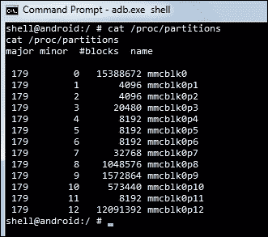
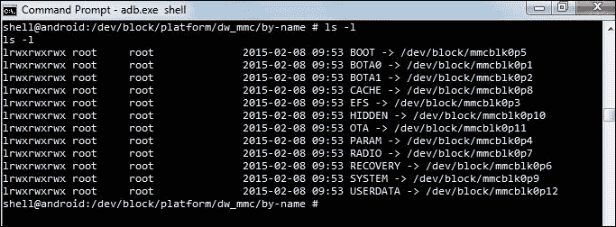
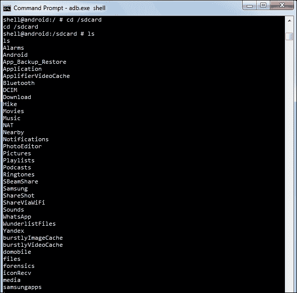
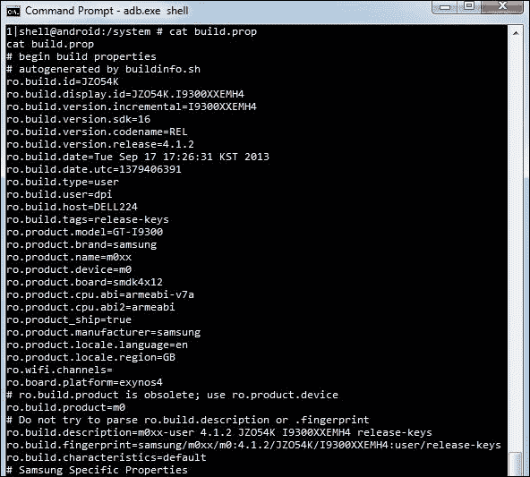
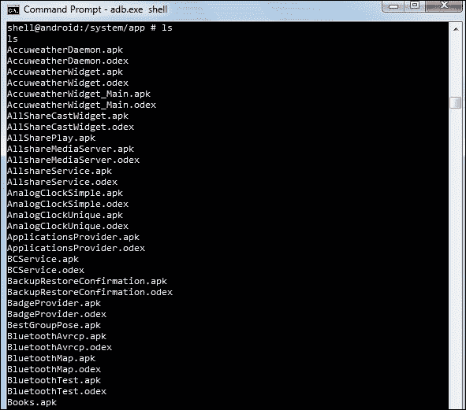
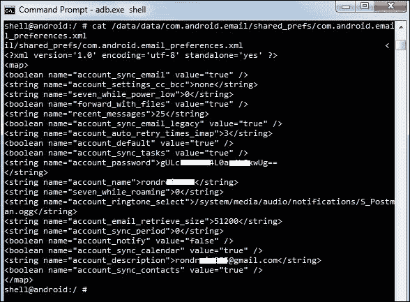
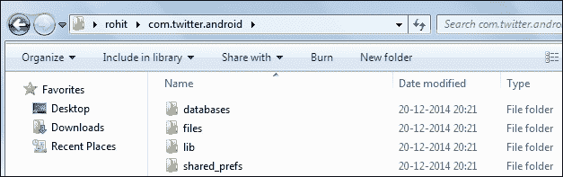
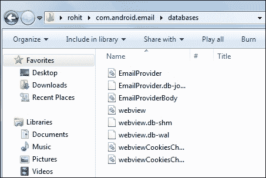

# 三、了解安卓设备上的数据存储

法医分析的主要目的是从设备中提取必要的数据。因此，为了进行有效的取证分析，必须知道设备上存储的数据类型、存储位置、存储方式以及存储数据的文件系统的详细信息。对于法医分析师来说，这些知识非常重要，有助于他们就在哪里寻找数据以及可以用来提取数据的技术做出明智的决定。在本章中，我们将涵盖以下主题:

*   Android 分区布局和文件层次结构
*   设备上的应用数据存储
*   安卓文件系统概述

# 安卓分区布局

分区是逻辑的存储单元，在设备的持久存储内存中构成。分区允许您在逻辑上将可用空间划分为可以相互独立访问的部分。

## 安卓常见分区

分区布局因供应商和版本而异。但是，所有安卓设备中都有一些分区。以下部分解释了大多数安卓设备中常见的一些分区。

### 引导加载程序

这个分区存储了手机的引导加载程序。这个程序负责在手机启动时初始化底层硬件。因此，它负责引导安卓内核并引导到其他引导模式，如恢复模式、下载模式等。

### 开机

顾名思义，这个分区有手机启动所需的信息和文件。它包含内核和内存磁盘。所以，没有这个分区，手机就无法启动它的进程。

### 恢复

恢复分区允许设备引导到恢复控制台，通过该控制台执行活动，例如电话更新和其他维护操作。为此，会存储一个最小的安卓启动映像。这个引导映像用作故障保险。

### 用户数据

这个分区通常被称为数据分区，是设备内部存储应用数据的地方。大量的用户数据存储在这里，这是我们大部分取证证据的存放地。它还存储所有应用数据和标准通信。

### 系统

除了内核和内存磁盘之外的所有主要组件都在这里。这里的安卓系统镜像包含安卓框架、库、系统二进制文件和预装应用。没有这个分区，设备无法引导到正常模式。

### 缓存

该分区用于存储经常访问的数据和各种其他文件，例如通过蜂窝网络下载的恢复日志和更新包。

### 收音机

具有电话功能的设备有一个基带映像存储在这个分区中，用于处理各种电话活动。

## 识别分区布局

对于给定的安卓设备，分区布局可以通过多种方式确定。`/proc`下的`partitions`文件为我们提供了设备上所有可用分区的详细信息。以下截图显示了`partitions`文件的内容:



安卓系统中的分区文件

前面截图中的条目只显示了块名。要获得这些块到其逻辑功能的映射，检查`/dev/block/platform/dw_mmc`下的`by-name`目录的内容。下面的截图显示了该目录的内容:



块到其逻辑功能的映射

正如您在前面的输出中所看到的，各种分区，如系统、用户数据等都存在于分区布局中。

# 安卓文件层级

为了在任何系统(桌面或移动)上执行取证分析，了解底层文件层次结构非常重要。对安卓如何在文件和文件夹中组织数据的基本理解有助于法医分析师将其研究范围缩小到特定位置。如果你熟悉类似 Unix 的系统，你会很好地理解 Android 中的文件层次结构。在 Linux 中，文件层次结构是一个单一的树，树的顶部表示为`/`。这叫**根**。这不同于在驱动器中组织文件的概念(如 Windows)。无论文件系统是本地的还是远程的，它都将出现在根目录下。安卓文件层次结构是现有 Linux 层次结构的定制版本。根据设备制造商和底层的 Linux 版本，这个层次结构可能会有一些微不足道的变化。要查看完整的文件层次结构，您需要具有 root 访问权限。下面的截图显示了安卓设备上的文件层次结构:


安卓中`/`(根)下的文件夹

## 目录概述

以下部分提供了安卓设备文件层次结构中目录的概述。

### 账户

这是提供用户记账的账户组(控制组)的挂载点。

### 缓存

这是目录(`/cache`)安卓在这里存储经常访问的数据和应用组件。擦除缓存不会影响您的个人数据，而只是删除其中的现有数据。这个文件夹里还有另外一个目录叫做`lost+found`。该目录保存文件系统损坏时恢复的文件(如果有)，例如错误地移除 SD 卡而不卸载它，等等。缓存可能包含与法律相关的工件，例如图像、浏览历史和其他应用数据。

### d

这是到`/sys/kernel/debug`的象征性链接。这个文件夹用于挂载 debugfs 文件系统和调试内核。

### 数据

这是包含每个应用数据的分区。属于用户的大部分数据，如联系人、短信、已拨号码等，都存储在这个文件夹中。从取证的角度来看，该文件夹非常重要，因为它保存了有价值的数据。以下屏幕截图显示了此分区中存在的文件夹:


安卓设备数据分区的内容

以下部分提供了`data`文件夹下其他重要子目录的简要说明。

#### dalvik 缓存

正如[第 1 章](1.html "Chapter 1. Introducing Android Forensics")、*介绍 Android 取证*中所讨论的，Android 应用包含`.dex`文件，这些文件是 Java 字节码的优化版本。当应用安装在安卓设备上时，会对相应的`.dex`文件进行一些修改，并创建一个名为`.odex`文件(优化后的`,de` x 文件)的结果文件。然后将其缓存在`/data/dalvik-cache`目录中，这样它就不必在每次加载`application.log`时都执行优化过程。

该文件夹包含几个日志，这些日志在检查过程中可能会很有用，具体取决于底层需求。例如，下面的截图显示了一个日志文件`recovery_log.txt`，其中给出了关于恢复日志的详细信息:


recovery_log.txt 文件输出

#### 数据

`/data/data`分区包含所有应用的私有数据。属于用户的大部分数据都存储在这个文件夹中。从取证的角度来看，该文件夹非常重要，因为它保存了有价值的数据。该分区在*内部存储*部分有详细介绍。

### dev

该目录包含所有设备的特殊设备文件。这是 tempfs 文件系统的挂载点。该文件系统定义了应用可用的设备。

### 初始化

如[第 1 章](1.html "Chapter 1. Introducing Android Forensics")*介绍安卓取证*中所述，当启动安卓内核时，会执行 init 程序。该程序出现在该文件夹下。

### 分钟

该目录作为所有文件系统、内部和外部 SD 卡等的挂载点。以下屏幕截图显示了此目录中存在的挂载点:


### 继续

这是 procfs 文件系统的挂载点，提供对内核数据结构的访问。几个程序使用`/proc`作为它们的信息来源。它包含的文件中有关于进程的有用信息。例如，如下图所示，`/proc`下的`meminfo` 给出了关于内存分配的信息:


Android 中 proc 文件夹下的 meminfo 文件

### 根

这是根帐户的主目录。只有当设备是根设备时，才能访问该文件夹。

### 自旋

其中包含几个重要守护程序的二进制文件。从法医的角度来看，这没有多大意义。

### 杂项

顾名思义，这个文件夹包含了各种设置的信息。这些设置大多定义状态，即开/关。关于硬件设置、USB 设置等信息可以从这个文件夹访问。

### 信用卡

这是包含设备 SD 卡上数据的分区。请注意，该 SD 卡可以是可移动存储，也可以是不可移动存储。您手机上任何具有`WRITE_EXTERNAL_STORAGE`权限的应用都可以在此位置创建文件或文件夹。大多数手机都有一些默认文件夹，如`android_secure`、`Android`、`DCIM`、`media`等。以下截图显示了`/sdcard`位置的内容:



安卓设备 sd 卡分区的内容

**数码相机图像** ( **DCIM** ) 是数码相机、智能手机、平板电脑和相关固态设备的默认目录结构。有些平板电脑有一个指向同一位置的`photos`文件夹。在`DCIM`内，你会找到你拍摄的照片、视频和缩略图(缓存)文件。照片储存在`/DCIM/Camera`。

安卓开发者的参考资料解释说，有一些公共存储目录并不特定地绑定到特定的程序。以下是这些文件夹的快速概述:

*   `Music:` Media scanner 将此处找到的所有媒体分类为用户音乐。
*   `Podcasts` `:` Media scanner 将在此找到的所有媒体分类为播客。
*   `Ringtones:`这里呈现的媒体文件被归类为铃声。
*   `Alarms:`此处出现的媒体文件被归类为报警。
*   `Notifications:`该位置下的媒体文件用于通知声音。
*   `Pictures:`除了用相机拍摄的照片外，所有照片都存储在这个文件夹中。
*   `Movies:`除了用相机拍摄的电影，所有电影都存储在这个文件夹中。
*   `Download`:杂项下载存储在此文件夹中。

### 系统

该目录包含库、系统二进制文件和其他系统相关文件。该分区中还包含随手机附带的预装应用。下面的截图显示了安卓设备上系统分区中的文件:


安卓设备系统分区的内容

以下是`/system` 分区中一些法医调查员感兴趣的文件和文件夹。

#### 建造道具

该文件包含给定设备的所有构建属性和设置。对于法医分析师来说，该文件概述了设备型号、制造商、安卓版本和许多其他细节。可以通过发出`cat`命令查看该文件的内容，如下图截图所示:



build.prop 文件输出

如前面输出所示，通过查看该文件内容，可以找出产品型号、CPU 详情、安卓版本。在根设备上，调整`build.prop`文件可能会导致几个系统设置发生变化。

#### app

该文件夹包含系统应用和预装应用。这是以只读方式装载的，以防止任何更改。以下屏幕截图显示了此文件夹中存在的各种系统相关应用:



/system/app 分区下存在系统应用

除了 APK 文件，您可能还注意到了前面输出中的`.odex`文件。在安卓系统中，应用是打包的，带有`.apk`扩展。这些 apk 包含`.odex`文件，其假定功能是节省空间。`.odex`文件是应用某些部分的集合，这些部分在引导前进行了优化。

#### 框架

这个文件夹包含安卓框架的源码。在这个分区中，您可以找到关键服务的实现，例如带有包和活动管理器的系统服务器。Java 应用接口和本机库之间的大量映射也在这里完成。

### ueventd .金鱼. rc 和 ueventd.rc

这些文件包含`/dev`目录的配置规则。

综上所述，这里是来自[http://wiki.robotz.com/index.php/Android_File_System](http://wiki.robotz.com/index.php/Android_File_System)的安卓文件树引用截图:


安卓文件树

# 设备上的应用数据存储

安卓设备通过应用的使用存储大量敏感数据。虽然我们之前将应用分为系统应用和用户安装的应用，但这里有一个更详细的划分:

*   安卓系统附带的应用
*   制造商安装的应用
*   无线运营商安装的应用
*   用户安装的应用

所有这些都在设备上存储不同类型的数据。应用数据通常包含大量与调查相关的信息。以下是可以在安卓设备上找到的可能数据的示例列表:

*   短信
*   多媒体短信服务
*   聊天消息
*   备份
*   电子邮件
*   通话记录
*   联系人
*   图片
*   录像
*   浏览器历史记录
*   全球定位系统数据
*   下载的文件或文档
*   属于已安装应用(脸书、推特和其他社交媒体应用)的数据
*   日历约会

属于不同应用的数据可以存储在内部或外部。在外部存储(SD 卡)的情况下，数据可以存储在任何位置。但是，在内部存储的情况下，位置是预先定义的。具体来说，设备上存在的所有应用(系统应用或用户安装的应用)的内部数据会自动保存在`/data/data`子目录中，该子目录以包名命名。例如，默认的安卓电子邮件应用有一个名为`com.android.email`的包，内部数据存储在`/data/data/com.android.email`中。我们将在接下来的章节中详细讨论这一点，但目前，这些知识足以理解以下细节。

安卓为开发者提供了特定的选项来将数据存储到设备中。可以使用的选项取决于要存储的底层数据。属于应用的数据可以存储在以下位置之一:

*   共享首选项
*   内存储器
*   外部存储器
*   SQLite 数据库
*   网络

以下各节对这些选项进行了清晰的解释。

## 共享偏好

这个位置提供了一个框架，以`.xml`格式存储原始数据类型的键值对。基本数据类型包括布尔、浮点、int、long 和 string。字符串以 **通用字符集转换格式-8** ( **UTF-8** )格式存储。这些文件通常存储在应用的`/data/data/<package_name>/shared_prefs`路径中。例如，安卓电子邮件应用的`shared_prefs`文件夹包含不到六个`.xml`文件，如下图所示:


安卓电子邮件应用的`shared_prefs`文件夹内容

如[第 2 章](2.html "Chapter 2. Setting Up an Android Forensic Environment")、*设置安卓取证环境*所述，可以使用`cat`命令查看这些文件的内容。以下截图显示了`com.android.email_preferences.xml`文件的内容:



安卓电子邮件应用的共享首选项文件内容

如前面的截图所示，数据存储在名称-值对中。也许在前面的`.xml`文件中，`account_name`、`account_password`、`recent_messages`是从法医角度看的一些有趣的参数。许多应用使用共享引用来存储敏感数据，因为它重量轻。因此，它们可能是法医调查期间的重要信息来源。

## 内部存储

这里的文件存储在内部存储器中。这些文件通常位于应用的`/data/data`子目录中。此处存储的数据是私有的，其他应用无法访问。甚至设备所有者也无法查看文件(除非他们拥有超级用户访问权限)。但是，根据需求，开发人员可以允许其他进程修改和更新这些文件。

下面的截图显示了在`/data/data`目录中以包名存储的应用的详细信息:


安卓中`/data/data`文件夹的内容

每个应用的内部数据都存储在各自的文件夹中。例如，下面的截图显示了安卓设备上属于推特应用的内部存储:



安卓推特应用的内部存储

通常，`databases`、`lib`、`shared_pref`、`cache`文件夹是为大多数应用创建的。下表提供了这些文件夹的简要描述:

<colgroup><col> <col></colgroup> 
| 

子目录

 | 

描述

 |
| --- | --- |
| shared_prefs | 共享首选项的 XML 文件 |
| 解放运动 | 应用所需的自定义库文件 |
| 文件 | 开发者保存的文件 |
| 隐藏物 | 应用缓存的文件 |
| 数据库 | SQLite 和日志文件 |

除此之外的文件夹是由应用开发人员创建的自定义文件夹。`databases`文件夹包含有助于法医调查的关键数据。如下图所示，该文件夹中的数据存储在 SQLite 文件中:


安卓浏览器应用的数据库文件夹下有 SQLite 文件

可以使用 SQLite Browser 等工具查看该数据。关于如何提取数据的更多细节将在[第 4 章](4.html "Chapter 4. Extracting Data Logically from Android Devices")、*从安卓设备中逻辑提取数据*中详细介绍。

## 外部存储

文件也可以通过应用存储在外部存储器中。外部存储可以是可移动介质，例如手机附带的 SD 卡或不可移动存储。在可移动 SD 卡的情况下，只需移除 SD 卡并将其插入任何其他设备，就可以在其他设备上使用数据。SD 卡通常用 FAT32 文件系统格式化，但其他文件系统，如 EXT3 和 EXT4，也越来越多地被使用。与内部存储不同，外部存储没有严格的安全措施。换句话说，存储在这里的数据是公共的，可以被其他应用访问，前提是请求的应用具有必要的权限。

例如，前面讨论的推特应用也在 SD 卡的`/Android/data`位置存储某些文件。应用加载的大型文件(如图像和视频)通常存储在外部存储器中，以加快检索速度。

## SQLite 数据库

SQLite 是许多移动系统中流行的数据库格式，用于结构化数据存储。SQLite 是开源的，与许多其他数据库不同，它是紧凑的，并提供了许多功能。Android 通过专用的 API 支持 SQLite，因此开发人员可以利用它。SQLite 数据库是取证数据的丰富来源。应用使用的 SQLite 文件一般存储在`/data/data/<ApplicationPackageName>/databases`处。例如，在安卓电子邮件应用的情况下，下面的截图显示了其`databases`文件夹中存在的 SQLite 文件。我们将在接下来的章节中更详细地研究这些文件。从取证的角度来看，它们非常有价值，因为它们经常存储应用处理的大量重要数据。`databases`文件夹的内容可以在下面的截图中看到:



安卓电子邮件应用的数据库文件夹

## 网络

您可以使用网络在自己的网络服务上存储和检索数据。要进行网络操作，可以使用`java.net.*`和`android.net.*`包中的类。这些包为开发人员提供了与网络、web 服务器等交互所必需的低级 API。

# 安卓文件系统概述

理解文件系统在安卓取证中非常重要，因为它帮助我们了解数据是如何存储和检索的。关于文件系统的属性和结构的知识将在取证分析中证明是有用的。文件系统是指从卷中存储、组织和检索数据的方式。基本安装可能基于一个分割成几个分区的卷；这里，每个分区可以由不同的文件系统管理。微软视窗用户最熟悉的是 FAT32 或 NTFS 文件系统，而 Linux 用户更熟悉 EXT2 或 EXT4 文件系统。就像在 Linux 中一样，安卓也使用挂载点，而不是驱动器(即`C:`或`E:`)。每个文件系统都定义了自己的规则来管理卷上的文件。根据这些规则，每个文件系统提供不同的文件检索速度、安全性、大小等。Linux 使用几个文件系统，安卓也是如此。从取证的角度来看，了解安卓系统使用什么文件系统以及识别对调查有意义的文件系统非常重要。例如，存储用户数据的文件系统是我们最关心的，而不是用来引导设备的文件系统。

如前所述，众所周知，Linux 支持大量文件系统。系统使用的这些文件系统不是通过驱动器名来访问的，而是被组合成单个分层树结构，将这些文件系统表示为单个实体。每个新文件系统在挂载时都会添加到这个文件系统树中。

### 注

在 Linux 中，挂载是在计算机的当前可访问文件系统上附加一个附加文件系统的行为。

因此，文件系统被装载到一个目录中，这个文件系统中的文件现在就是该目录的内容。这个目录叫做 **挂载点**。文件系统是存在于本地设备上还是远程设备上没有区别。所有内容都集成到一个从根目录开始的文件层次结构中。每个文件系统都有一个独立的内核模块，该模块通过一个名为 **的虚拟文件系统** ( **VFS** )来注册它所支持的操作。VFS 允许不同的应用以统一的方式访问不同的文件系统。通过将实现从抽象中分离出来，添加一个新的文件系统就变成了编写另一个内核模块的事情。这些模块要么是内核的一部分，要么是按需动态加载的。安卓内核附带了大量文件系统的子集，从 **日志文件系统** ( **JFS** )到阿米加文件系统。当挂载文件系统时，所有的后台工作都由内核处理。

### 注

以上信息参考自[http://trikandroid.hol.es/page/100/](http://trikandroid.hol.es/page/100/)。

## 在安卓设备上查看文件系统

通过检查`proc`文件夹中`filesystems`文件的内容，可以确定安卓内核支持的文件系统。可以使用以下命令查看该文件的内容:

```py
shell@Android:/ $ cat /proc/filesystems
cat /proc/filesystems
nodev sysfs
nodev rootfs
nodev bdev
nodev proc
nodev cgroup
nodev tmpfs
nodev binfmt_misc
nodev debugfs
nodev sockfs
nodev usbfs
nodev pipefs
nodev anon_inodefs
nodev devpts
ext2
ext3
ext4
nodev ramfs
vfat
msdos
nodev ecryptfs
nodev fuse
fuseblk
nodev fusectl
exfat

```

在前面的输出中，以`nodev`属性开头的文件系统没有安装在设备上。

## 常见的安卓文件系统

安卓系统中的文件系统可以分为以下三大类:

*   闪存文件系统
*   基于媒体的文件系统
*   伪文件系统

### 闪存文件系统

闪存是一种持续供电的非易失性存储器，可以以称为块的存储器为单位进行擦除和重新编程。由于闪存的特殊特性，需要特殊的文件系统来覆盖介质并处理某些块的长擦除时间。虽然支持的文件系统在不同的安卓设备上有所不同，但常见的闪存文件系统如下:

*   **扩展文件分配表** ( **exFAT** ):这种类型的文件系统是针对闪存驱动器优化的微软专有文件系统。由于许可证要求，它不是标准 Linux 内核的一部分。然而，一些制造商为这个文件系统提供支持。
*   **闪存友好文件系统** ( **F2FS** ):这种类型的文件系统是由三星作为开源文件系统推出的。基本意图是建立一个考虑到基于 NAND 闪存的存储设备特性的文件系统。
*   **日志闪存文件系统版本 2**(**JFS2**):这种类型的文件系统是安卓系统中使用的日志结构文件系统。JFFS2 是自冰淇淋三明治版本以来**安卓开源项目** ( **AOSP** ) 的默认闪存文件系统。像日志文件系统、UBIFS、YAFFS 等文件系统已经被开发出来作为 JFFS2 的替代品。
*   **又一个闪存文件系统版本 2** ( **YAFFS2** ):这种类型的文件系统是一个开源的单线程文件系统，于 2002 年发布。主要是为了在处理 NAND 闪存时快速。雅夫斯 2 利用 OOB。在取证过程中，这通常无法被正确捕获或解码，这使得分析变得困难。YAFFS2 一度是最受欢迎的版本，现在仍广泛用于安卓设备。YAFFS2 是一个日志结构文件系统。即使在突然断电的情况下，数据完整性也得到保证。2010 年，有一则公告称，在姜饼之后的版本中，设备将从 YAFFS2 转移到 EXT4。目前，较新的内核版本不支持 YAFFS2，但某些移动制造商可能仍会继续支持它。
*   **强大的文件系统** ( **RFS** ):这种类型的文件系统支持三星设备上的 NAND 闪存。RFS 可以概括为一个 FAT16(或 FAT32)文件系统，其中通过事务日志启用日志记录。很多用户抱怨三星应该坚持 EXT4。众所周知，RFS 的延迟时间会降低安卓的功能。

### 基于媒体的文件系统

除了前面讨论的闪存文件系统，安卓设备通常支持以下基于媒体的文件系统:

*   **扩展文件系统**(**EXT2**/**EXT3**/**EXT4**):该文件系统于 1992 年推出专门用于 Linux 内核。这是第一批使用虚拟文件系统的文件系统之一。EXT2、EXT3 和 EXT4 是后续版本。日志是 EXT3 相对于 EXT2 的主要优势。对于 EXT3，在意外关闭的情况下，不需要验证文件系统。EXT4 文件系统，第四个扩展的文件系统，在实现双核处理器的移动设备中变得越来越重要。众所周知，YAFFS2 文件系统在双核系统上存在瓶颈。在姜饼版安卓系统中，YAFFS 文件系统被替换为 EXT4。
*   **文件分配表** ( **FAT** ):这些文件系统，如 FAT12、FAT16 和 FAT32，都是由 MSDOS 驱动程序支持的。
*   **虚拟文件分配表** ( **VFAT** ):这个文件系统是 FAT16 和 FAT32 文件系统的扩展。大多数安卓设备都支持微软的 FAT32 文件系统。几乎所有的主流操作系统都支持，包括 Windows、Linux、Mac OS。这使得这些系统能够轻松读取、修改和删除安卓设备 FAT32 部分的文件。大多数外部 SD 卡都是使用 FAT32 文件系统格式化的。

### 伪文件系统

除了这些，还有伪文件系统，它们可以被认为是文件的逻辑分组。以下是在安卓设备中发现的一些重要的伪文件系统:

*   **control group** (**cgroup**): This type of pseudo filesystem provides a way to access and define several kernel parameters. There are a number of different process-control groups present. As shown in the following command-line output, the list of groups can be seen in the `/proc/cgroups` file:

    

    cgroups 文件输出

    安卓设备使用这个文件系统来跟踪他们的工作。他们负责汇总任务并跟踪它们。

*   **rootfs** :这种类型的文件系统是安卓的主要组件之一，包含启动设备所需的所有信息。当设备启动引导过程时，它需要访问许多核心文件，从而装载根文件系统。该文件系统安装在`/`(根文件夹)。因此，这是所有其他文件系统缓慢装载的文件系统。如果该文件系统损坏，设备将无法启动。
*   **procfs** :这种类型的文件系统包含目录中内核数据结构、进程和其他系统相关信息的信息。例如，`/proc/filesystems`文件显示了设备上可用文件系统的列表。以下命令显示设备中央处理器的所有信息:

    ```py
    shell@Android:/ $ cat /proc/cpuinfo
    cat /proc/cpuinfo
    Processor : ARMv7 Processor rev 0 (v7l)
    processor : 0
    BogoMIPS : 1592.52
    processor : 3
    BogoMIPS : 2786.91
    Features : swp half thumb fastmult vfp edsp neon vfpv3 tls
    CPU implementer : 0x41
    CPU architecture: 7
    CPU variant : 0x3
    CPU part : 0xc09
    CPU revision : 0
    Chip revision : 0011
    Hardware : SMDK4x12
    Revision : 000c
    Serial : ****************

    ```

*   **sysfs**: This type of filesystem mounts the `/sys` folder, which contains information about the configuration of the device. The following output shows various folders in the `sys` directory in an Android device:

    ```py
    shell@Android:/ $ cd /sys
    cd /sys
    shell@Android:/sys $ ls
    ls
    block
    bus
    class
    dev
    devices
    firmware
    fs
    kernel
    module
    power

    ```

    由于这些文件夹中的数据大多与配置有关，因此这对法医调查人员来说通常没有太大意义。但是，在某些情况下，我们可能需要检查电话上是否启用了特定设置。在这种情况下，分析此文件夹可能会很有用。请注意，每个文件夹都包含大量文件。通过法医采集获取这些数据是确保这些数据在检查过程中不会改变的最佳方法。

*   **tmpfs** :这种类型的文件系统是设备上的临时存储设施，将文件存储在内存(易失性存储器)中。这通常安装在`/dev`目录中。使用内存的主要优点是访问和检索更快。但是，一旦设备重新启动或关闭，这些数据将无法再访问。因此，对于法医调查员来说，在设备重启之前检查内存中的数据或者提取数据是很重要的。

您可以使用`mount`命令来查看设备上可用的不同分区及其文件系统，如下所示:

```py
shell@Android:/sdcard $ mount
mount
rootfs / rootfs rw 0 0
tmpfs /dev tmpfs rw,nosuid,relatime,mode=755 0 0
devpts /dev/pts devpts rw,relatime,mode=600,ptmxmode=000 0 0
proc /proc proc rw,relatime 0 0
sysfs /sys sysfs rw,relatime 0 0
tmpfs /mnt/asec tmpfs rw,relatime,mode=755,gid=1000 0 0
tmpfs /mnt/obb tmpfs rw,relatime,mode=755,gid=1000 0 0
/dev/block/nandd /system ext4 rw,nodev,noatime,user_xattr,barrier=0,data=ordered 0 0
/dev/block/nande /data ext4 rw,nosuid,nodev,noatime,user_xattr,barrier=0,journal_checksum,data=or dered,noauto_da_alloc 0 0
/dev/block/nandh /cache ext4 rw,nosuid,nodev,noatime,user_xattr,barrier=0,journal_checksum,data=or dered,noauto_da_alloc 0 0
/dev/block/vold/93:64 /mnt/sdcard vfat rw,dirsync,nosuid,nodev,noexec,relatime,uid=1000,gid=1015,fmask=0702, dmask=0702,allow_utime=0020,codepage=cp437,iocharset=ascii,shortname= mixed,utf8,errors=remount-ro 0 0
/dev/block/vold/93:64 /mnt/secure/asec vfat rw,dirsync,nosuid,nodev,noexec,relatime,uid=1000,gid=1015,fmask=0702, dmask=0702,allow_utime=0020,codepage=cp437,iocharset=ascii,shortname= mixed,utf8,errors=remount-ro 0 0
tmpfs /mnt/sdcard/.Android_secure tmpfs ro,relatime,size=0k,mode=000 0 0
/dev/block/dm-0 /mnt/asec/com.kiloo.subwaysurf-1 vfat ro,dirsync,nosuid,nodev,relatime,uid=1000,fmask=0222,dmask=0222,codep age=cp437,iocharset=ascii, shortname=mixed,utf8,errors=remount-ro 0 0

```

如前面的命令行输出所示，不同的分区有不同的文件系统，它们被相应地挂载。

# 总结

在从设备中提取数据的过程中，对安卓的分区布局、文件系统和重要位置有充分的了解将有助于法医调查员。安卓设备上的用户数据位置包含大量用户信息，这些信息对于任何取证调查都至关重要。然而，这些文件中的大多数只能在根手机上访问(尤其是`/data/data`位置的文件)。您还了解了安卓数据存储选项、安卓使用的各种文件系统及其重要性。

有了这些知识，在接下来的章节中，您将学习如何从安卓设备中逻辑和物理地提取数据。