# 八、安卓取证工具概述

本章概述了免费和开源的安卓取证工具，并将向您展示如何将这些工具用于常见的调查场景。到本章结束时，读者应该熟悉以下工具:

*   ViaExtract
*   验尸
*   维塔利卜

# ViaExtract

ViaExtract 是由 NowSecure(以前称为 via 取证)创建的逻辑和物理提取工具。免费版本提供逻辑获取(包括备份)，而付费版本增加物理提取。它在运行 NowSecure 的 Santoku Linux 发行版的虚拟机文件(VMWare 或 Virtual Box 格式)中自由分发。使用免费版本时，需要活动的互联网连接。下载和完整功能列表可在[https://www.nowsecure.com/forensics/community/](https://www.nowsecure.com/forensics/community/)的找到。需要注册。

注册工具和启动 ViaExtract 的图标可以在 ViaExtract 虚拟机的桌面上找到:

在启动 ViaExtract 之前，确保要检查的设备通过 USB 连接到计算机。这将确保设备被检测到。该设备还需要通电。请注意[第 1 章](1.html "Chapter 1. Introducing Android Forensics")、*介绍安卓取证*中讨论的适当网络隔离措施。在下面的例子中，我们将检查一个运行安卓棒棒糖 5.1 的 LG Nexus 5。请注意，这显示在下面截图的左下角。

然后，按照以下步骤操作:

1.  Clicking on the **New** button in the upper-left corner will bring up the **Create a new project** dialog box:

    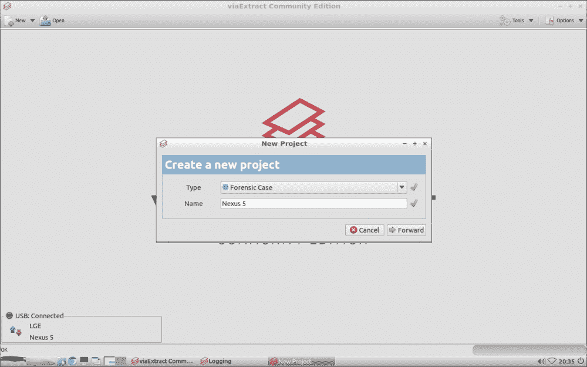

2.  Choosing **Forward** will bring up the **Device Info** tab, which is where we will begin our extractions. The list of supported extractions is shown in the following screenshot. In this case, our two options are **Android Backup** or **Android Logical**:

    

## 使用 ViaExtract 进行备份提取

要执行备份提取，请执行以下步骤:

1.  Clicking on **Extract** (as seen in the preceding screenshot) will show the **Select extraction type** dialog box. We choose to do a backup extraction first from the **Type** drop-down menu:

    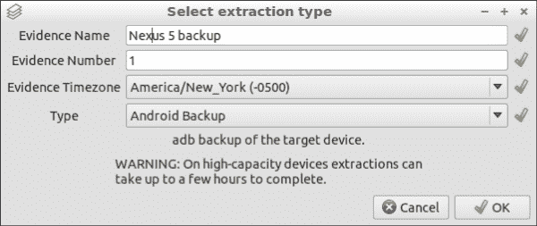

2.  Once all of the fields are filled in, the **OK** button will become available. Selecting **OK** will display instructions to accept the process on the device. However, this step will not be available on the device yet:

    

3.  After choosing **Forward** on the **Android Backup: Allow backup** screen, ViaExtract will give you the option to attempt the recovery of deleted SQLite data. Though this is only a logical extraction, it is possible, as discussed in detail previously in this book, because of the way SQLite databases store their data.

    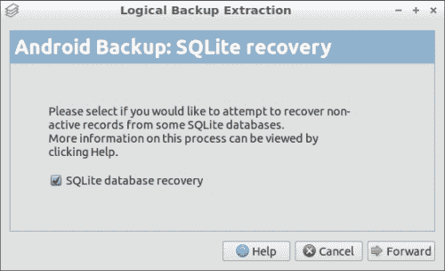

4.  Choosing **Forward on the Android Backup: SQLite recovery** screen will begin the backup. At this point, the backup will have to be accepted on the device, as shown in the preceding **Android:Backup Allow backup** screenshot:

    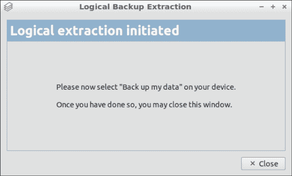

5.  点击**关闭**后，现在左上角的**任务**选项卡中应该可以看到备份正在进行，如下图截图所示:

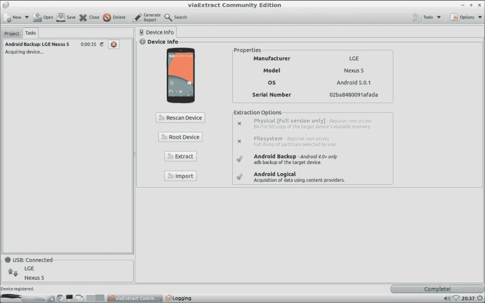

## 用 ViaExtract 进行逻辑提取

要开始逻辑提取，请遵循以下步骤:

1.  Select **Extract** from the **Device Info** tab, just as with the backup extraction we completed earlier. This time, however, choose **Android Logical** from the **Type** drop-down menu. This will launch the logical extraction wizard, which begins by noting that it will require us to install an application on the device:

    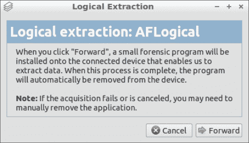

2.  Choosing **Forward** will advance to the **Logical extraction: Options** menu. Here, certain file types can be ignored to speed up the extraction process:

    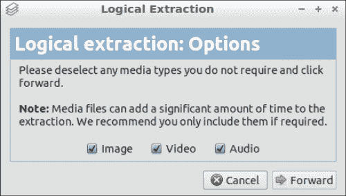

3.  At this point, the ViaExtract application will be pushed to the device and further action may be required on the device. We will choose **DECLINE** on the following pop-up message:

    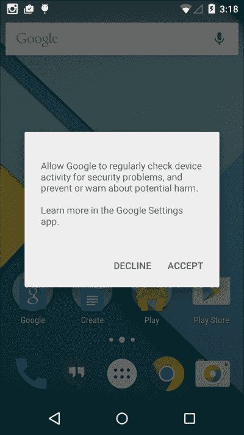

4.  After declining the popup, the application can be seen running on the device:

    

5.  Back on the computer, the following message will be displayed:

    

6.  在左上角的**任务**标签中再次可以看到进度，如下图:

## 检查 ViaExtract 中的数据

一旦提取完成，可以在左上角的**项目**选项卡中查看数据:

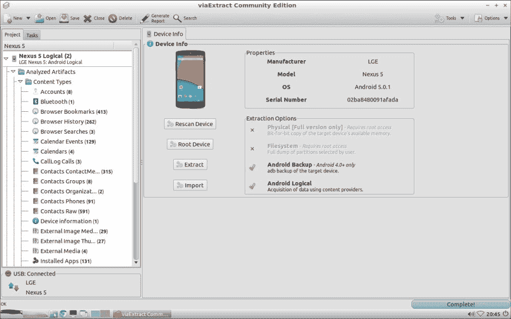

要查看内容，只需点击它，它就会显示在右侧。以下是在逻辑提取中找到的书签示例:

检查备份时，过程是相同的。以下是在[第 7 章](7.html "Chapter 7. Forensic Analysis of Android Applications")*安卓应用的取证分析*中分析的`Tango tc.db`文件摘录:

## 【ViaExtract 中的其他工具

ViaExtract 还可以尝试根设备并绕过密码。点击**设备信息**选项卡中的**根**按钮，将启动根向导。只需按照弹出消息来根设备。在我们的测试设备 Nexus 5、Moto X (2013 年款)和 HTC Droid DNA 上，我们没有取得任何成功。

锁屏旁路向导从右上角的工具菜单启动。然后，选择**解锁屏幕**。这将向设备推送一个应用(需要启用 USB 调试并通过 RSA 身份验证)，该设备将移除锁定屏幕。这是一个有用的工具，因为不同于[第 4 章](4.html "Chapter 4. Extracting Data Logically from Android Devices")、*从安卓设备*中逻辑提取数据的手动方法，它不需要根访问。它在我们的 Nexus 5 和 HTC Droid DNA 上不成功，但在我们的 Moto X 上工作得很完美。

# 尸检

尸检是一个免费的开源分析工具，最初由布莱恩·开利开发。尸检最初是作为基于 Linux 的底层工具集的图形用户界面，但最新版本(版本 3)是为 Windows 构建的独立工具。尸检可以在[http://www.sleuthkit.org/autopsy/](http://www.sleuthkit.org/autopsy/)下载。

尸检的目的不是为了收购移动设备，而是为了分析最常见的安卓文件系统(比如 YAFFS 和 ext)。对于本例，我们将加载通过 dd 从 HTC Droid DNA 获得的完整物理图像，如[第 5 章](5.html "Chapter 5. Extracting Data Physically from Android Devices")、*从 Android 设备*物理提取数据中所述。

## 在尸检中创建病例

打开尸检时，用户将被提示选择**创建新病例**、**打开最近病例**或**打开现有病例**:

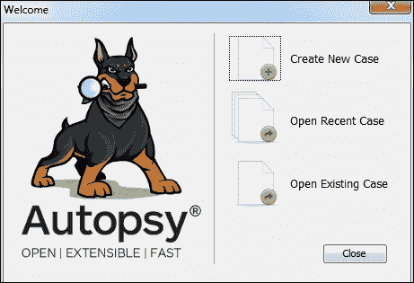

我们将创建一个新的案例。请遵循以下步骤:

1.  After filling in the **Case Name** field, the **Next** button will become available:

    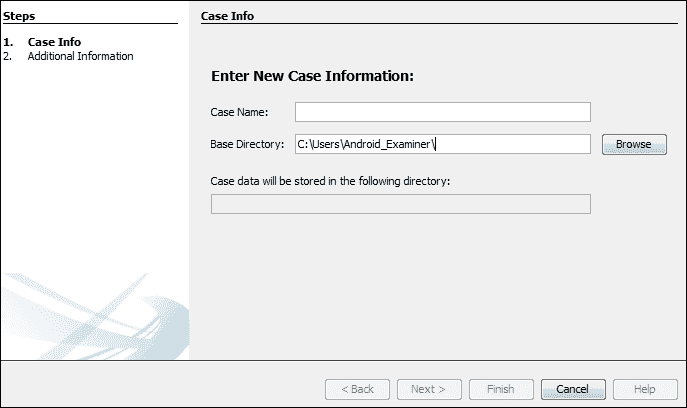

2.  On the next screen, an optional **Case Number** and **Examiner** can be entered:

    

3.  Selecting **Finish** will bring up the **Enter Data Source Information** screen. Clicking on **Browse** will allow the user to select an image file to load:

    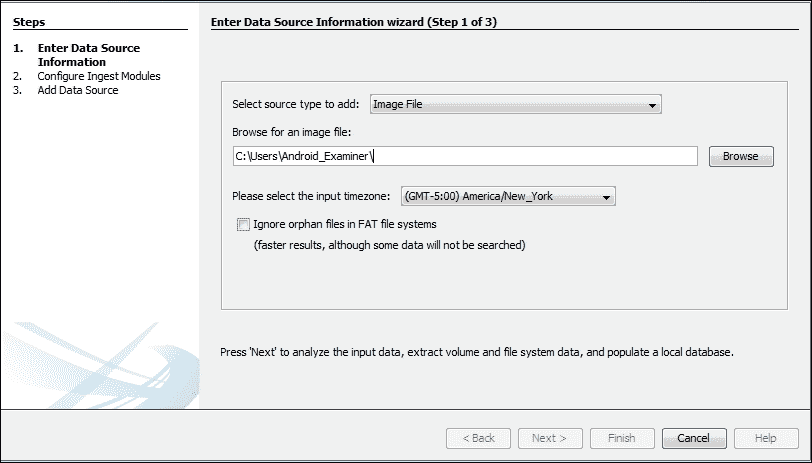

4.  After choosing an image file, the **Next** button can be clicked to advance to the **Configure Ingest Modules wizard**:

    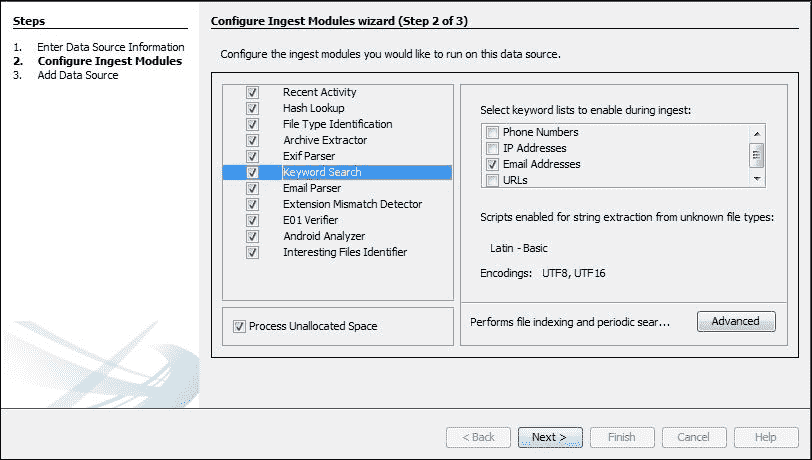

    摄取模块是尸检中内置的工具，可以在案件开始时或之后的任何时候运行。此版本尸检中的默认模块如下:

    *   **最近活动**:这个提取最近的用户活动比如网页浏览，最近使用的文档，安装的程序。
    *   **哈希查找**:这个使用提供的哈希数据库来识别已知的和值得注意的文件，例如标准的 NSRL 数据库。它还允许导入自定义哈希数据库。
    *   **文件类型识别**:这与基于二进制签名的文件类型相匹配。
    *   **档案提取器**:此提取档案文件(`.zip`、`.rar`、`.arj`、`.7z`、`.gzip`、`.bzip2`、`.tar`)。它会自动提取这些文件类型，并将它们的内容放入目录树。
    *   **EXIF 解析器**:这个吸收 JPEG 文件并检索它们的 EXIF 元数据。
    *   **关键词搜索**:此使用列表中的关键词和正则表达式执行文件索引和定期搜索。它允许加载自定义关键词/列表。
    *   **邮件解析器**:这个模块检测并解析 mbox 和 pst/ost 文件，并在黑板中填充电子邮件工件。
    *   **扩展名不匹配检测器**:这些是基于文件类型具有非标准扩展名的标志文件。
    *   **E01 验证器**:此验证 E01 文件的完整性。
    *   **安卓分析仪**:这个提取安卓系统和第三方 app 数据。
    *   **兴趣文件标识符**:这个标识兴趣项目，由兴趣项目规则集定义。

    ### 注

    安卓设备不需要这些模块中的许多(例如 E01 验证器和电子邮件解析器)。只有选择有用的模块才能加快摄取时间。此外，请注意，点击一个模块可能会带来更多的选项，如前面的截图所示。

5.  Clicking on **Next** will load the Data Source and begin the Ingest process. Any errors encountered will be noted:

    

6.  Choosing **Finish** will bring the examiner to the main screen for analysis of the ingested case:

    

## 分析尸检中的数据

即使案例仍在加载，摄取模块正在运行(如前一张截图右下角的进度条所示)，审查员也可以开始分析案例。展开左上角的图像文件将显示尸检识别的分区/卷:

尸检确定了我们设备上的`65`分区，其中绝大多数是未分配的。为了找到数据分区(因为我们知道这是我们感兴趣的绝大多数数据的存储位置)，我们可以简单地扩展分配的分区，直到找到一个看起来像数据分区的分区:

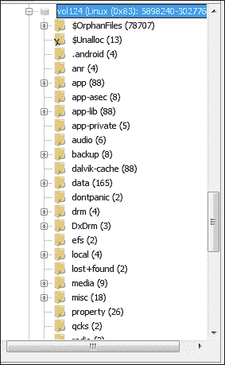

在我们的图像中，卷 124 是数据分区。我们可以看到它有一个应用目录(存储 APK 文件的地方)、一个数据目录(存储应用数据的地方)和一个媒体目录(SD 卡的符号链接位置)。

扩展数据目录将揭示我们应该记住的来自[第 7 章](7.html "Chapter 7. Forensic Analysis of Android Applications")、*安卓应用的取证分析*的信息。这也可以在下面的截图中看到:

马上，我们可以看到`com.android.providers.telephony``userdictionary`以及`com.facebook.katana`。如何分析这些应用在[第 7 章](7.html "Chapter 7. Forensic Analysis of Android Applications")、*Android 应用的取证分析*中有介绍；这是如何使用尸检访问相关文件。例如，扩展`com.android.providers.telephony`将显示分析短信和彩信数据所需的`mmssms.db`文件。

右键单击文件将允许用户选择**提取文件**或 **在外部查看器**中打开进行进一步分析:

现在，让我们看看尸检的其余特征。展开屏幕左侧的**视图**部分将显示使用的几个摄取模块的结果，如下所示:

**文件类型**视图显示了由`File Type Identification` 模块识别的文件。**最近文件**显示来自`Recent Activity`模块的结果。在这种情况下，该设备似乎有 6 天没有使用，然后在**最后一天**使用。查看此处标识的文件可以显示用户在该时间段内的活动。请注意红十字会，表示这些文件中的一些已被删除，但已通过尸检恢复:

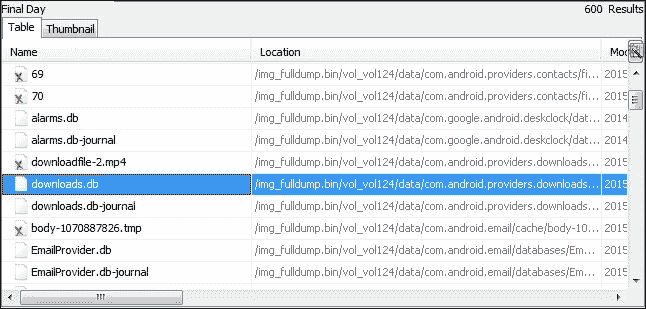

在我们的例子中，我们可以看到`downloads.db`和`EmailProvider.db`数据库被修改了。分析这些文件将显示收到了带有附件的电子邮件，然后附件被下载到设备上。

最后，**视图**部分识别已删除的文件(由于磨损均衡，这在移动设备上非常常见)，以及大文件(这对于快速查找图像/视频或识别隐写术非常有用)。

**结果**部分将显示安卓分析器和关键词搜索模块的输出，如下图所示:

在**提取内容**下看到的安卓分析仪结果与预期的基本一致。值得注意的是， **Contacts (1)** 部分仅指向`contacts.db`文件，并不实际解析其中的数据。例如**通话记录**显示从`contacts2.db`提取的数据，如[第 7 章](7.html "Chapter 7. Forensic Analysis of Android Applications")、*安卓应用取证分析*所述:

**检测到扩展不匹配**结果还显示了我们在[第 7 章](7.html "Chapter 7. Forensic Analysis of Android Applications")、*安卓应用的取证分析*中发现的数据。几个应用被描述为具有实际上是 JPEG 图像的`.cnt`文件，并且这些文件被尸检适当地识别，如下截图所示:

双击上面看到的任何文件将会把用户带到文件系统中找到该文件的位置。

**关键词点击**部分适当地找到了许多电子邮件地址和电话号码。然而，其中许多是在应用文件(即应用开发人员的联系信息)和用户没有实际存储的其他地方找到的(这在移动和计算机取证工具中都很常见)。

尸检还有许多其他更高级的功能，这里不涉及。为了了解更多信息，Basis Technology 提供了尸检培训课程，可在[http://www . Basis tech . com/digital-forensics/尸检/培训/](http://www.basistech.com/digital-forensics/autopsy/training/) 上找到。

# ViaLab 社区版

ViaLab 社区版是 NowSecure 开发发布的另一款免费工具。它作为独立虚拟机发货，可以在[https://www.nowsecure.com/apptesting/community/](https://www.nowsecure.com/apptesting/community/)找到(需要注册)。虚拟机实际上与我们在本章开头讨论的 Santoku 下载非常相似，但包括 ViaLab 社区版工具。

### 类型

ViaLab 要求考官的电脑要有互联网连接，才能使用该工具。

ViaLab 的主要目的是分析 APK 的行为，尽管许多这样做的功能在免费的社区版中是不可用的。ViaLab 允许您手动将 APK 文件加载到 Android 模拟器中，或者在根设备上运行应用。例如，我们手动将 Kik 的 APK 文件加载到安卓模拟器中。我们选择 Kik 是因为在[第 7 章](7.html "Chapter 7. Forensic Analysis of Android Applications")、*安卓应用的取证分析*中对其进行了透彻的分析，所以我们很清楚该期待什么，并且可以证实我们之前的发现。一个很好的取证用例是研究一个应用，了解它存储了什么数据。例如，如果检察官正在寻找保存的视频，审查员可以确定应用是否具有这种能力以及它们存储在哪里。

## 在 ViaLab 中设置仿真器

要开始使用 ViaLab，必须先激活。这是通过桌面上的 via 取证产品激活工具完成的。注册后，按照以下步骤设置模拟器:

1.  Click on the **ViaLab** icon on the desktop to launch the tool:

    

2.  The program may prompt for the root password. In the ViaLab VM, the default password is `vialab1`:

    

3.  After the program launches, a system check will be run. Clicking on **Close** will finish the system check. The **Always run System Check on startup** box can also be deselected to skip this step in the future:

    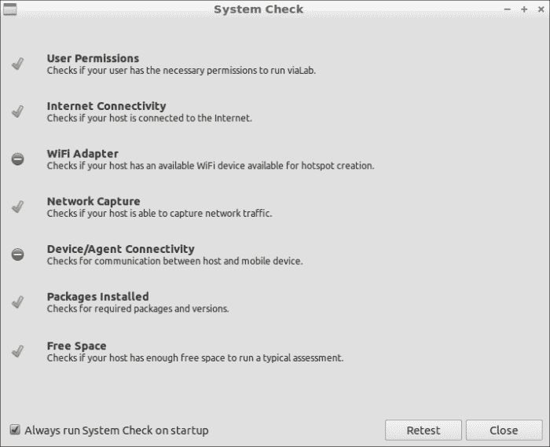

4.  To enable the Android emulator (or to configure a real device for ViaLab), select the **Device Manager** icon in the bottom-left corner of the main screen and make the appropriate selection in the window that opens:

    

5.  The first time the Android emulator is used, additional packages will have to be installed:

    

6.  After the emulator package is installed and ViaLab is restarted, the **Device Manager** will now show a **Start Emulator** option. Choose this to launch the Android emulator:

    

7.  The Android emulator will launch and appear in a separate window. The **Device Manager** icon in the bottom-right corner should show that ViaLab is now connected to the emulator:

    

## 在模拟器上安装应用

要开始 ViaLab 分析，请执行以下步骤:

1.  Select **New** in the upper-left corner. This will open a window to add a new project:

    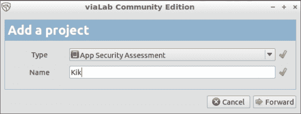

2.  Selecting **Forward** from the **Add a project** dialog will bring you to the setup page:

    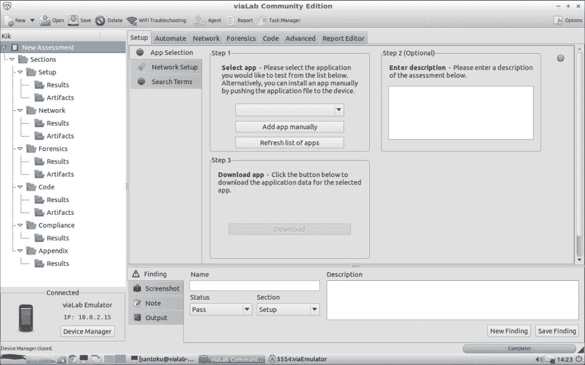

3.  To select an APK file to install into the emulator, choose **Add app manually** and select the file. Once the APK file has been selected, the **Download** button will become usable. Select this to push the APK to the emulator, and choose **OK** once it has completed:

    

4.  You can now go to the emulator window and use the application to populate it with test data. Note that performance may be quite slow, as the emulator is a virtual machine running within a virtual machine:

    

应用在仿真时可能会有不同的表现。例如 Kik 要求我们解一个验证码来证明我们是人类！其他应用的功能可能会减少(例如任何涉及全球定位系统数据的应用)。

## 用 ViaLab 分析数据

在应用内填充数据后，我们来分析一下！请遵循以下步骤:

1.  Return to ViaLab and choose the **Forensics** tab at the top of the screen. Selecting **Refresh Application Folder** will pull the data from the device:

    

2.  Once the data has been synced, the **File List** button can be selected to filter the files by type:

    

例如，这里是我们在应用中填充的联系人数据，存储在我们在[第 7 章](7.html "Chapter 7. Forensic Analysis of Android Applications")、*安卓应用的取证分析*中检查的数据库中:

# 总结

本章概述了安卓法医鉴定人员可以使用的一些免费工具。下表总结了这些工具:

<colgroup><col> <col></colgroup> 
| 

工具

 | 

特征

 |
| --- | --- |
| ViaExtract | 

*   Free of charge, registration and active Internet connection are required.
*   Logical extraction by the application pushed to the device.
*   Backup extraction
*   File extraction If the device is the root device
*   Root device
*   Push the application to the device

绕过没有根的屏幕锁定 |
| 验尸 | 

*   Free open source
*   Used to check the extraction completed by other tools.
*   Allow keyword search, hash list and other common forensic methods.
*   Powerful timeline function
*   Deleted data can be recovered from supported file systems.

 |
| 维塔利卜 | 

*   Free of charge, registration and active Internet connection are required.
*   Allow examiners to run applications from APK and determine where data is stored.
*   Run the application on the simulator or test equipment.
*   Valuable tools show examiners where the data is stored in the application directory and the functions of viewing the application.

 |

# 结论

我们祝大家在未来的安卓考试中好运。我们真诚地希望这本书能对你有所帮助。我们的目标是从头到尾为整个安卓取证过程制作一个信息丰富的指南。我们希望你在这个过程中已经学到了很多东西(我们在写的时候确实学到了)。感谢阅读！