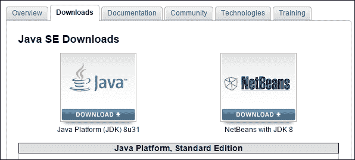
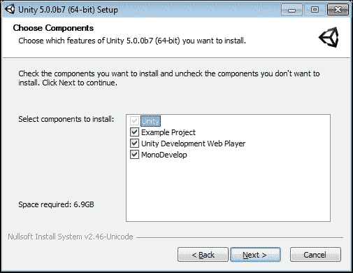
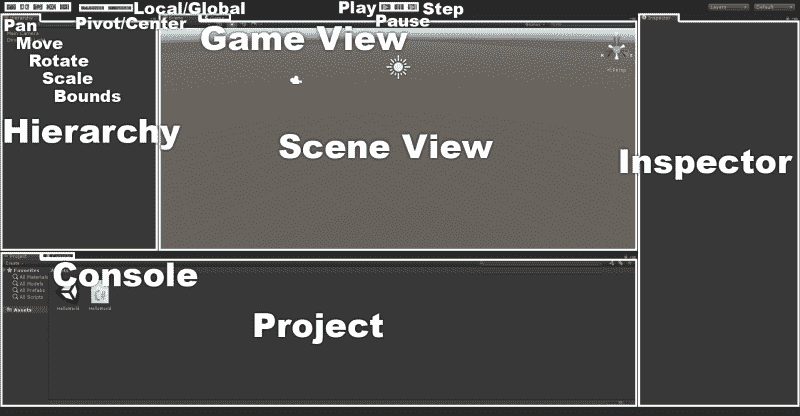
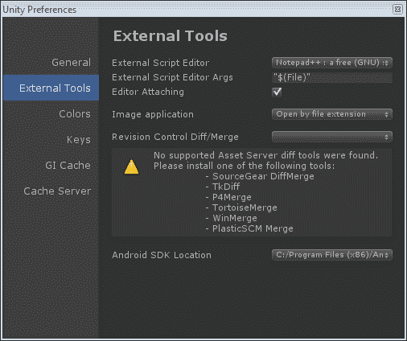
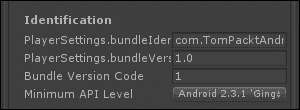

# 一、向 Unity 和 Android 问好

欢迎来到手机游戏开发的精彩世界。无论你是还在寻找合适的开发工具包，还是已经选择了，这一章都非常重要。在本章中，我们将探讨选择 **Unity** 作为您的开发环境以及 T4【安卓】作为目标平台所带来的各种特性。通过与主要竞争对手的对比，发现了为什么 Unity 和安卓站在了最顶端。接下来，我们将研究 Unity 和 Android 如何协同工作。最后，将设置开发环境，我们将创建一个简单的 Hello World 应用程序来测试是否一切都设置正确。就本书而言，假设您在基于 Windows 的环境中工作。

在本章中，我们将涵盖以下主题:

*   Unity 的主要功能
*   安卓的主要功能
*   Unity 许可选项
*   安装 JDK
*   安装安卓软件开发工具包
*   安装统一 3D
*   安装统一遥控器

# 理解团结的伟大之处

也许 Unity 最大的特点就是它的开放性。目前市场上几乎所有的游戏引擎都受限于它们所能构建的东西。这很有道理，但它会限制团队的能力。普通的游戏引擎已经被高度优化以创建特定的游戏类型。如果你打算一次又一次地做同一个游戏，那就太好了。当一个人被下一个大热门的灵感击中时，却发现游戏引擎无法处理它,每个人都必须重新训练一个新的引擎或加倍开发时间才能使游戏引擎有能力。团结没有这个问题。Unity 的开发人员非常努力地优化引擎的各个方面，没有限制使用它可以制作什么类型的游戏。从简单的 2D 平台到大规模的在线角色扮演游戏，一切都有可能在 Unity 中实现。一个刚刚完成超逼真的第一人称射击游戏的开发团队，不用学习全新的系统，就可以掉头制作 2D 格斗游戏。

然而，如此开放确实带来了一个缺点。没有为构建完美游戏而优化的默认工具。为了对抗这种情况，Unity 授权可以创建任何你能想象的工具，使用创建游戏的相同脚本。除此之外，还有一个强大的用户社区，提供了各种免费和付费的工具和配件，可以快速插入和使用。这就产生了大量可供选择的内容，可以让你在进入下一个伟大的游戏的道路上一跃而起。

很多准用户看 Unity 的时候都觉得，因为这么便宜，不如一个昂贵的 AAA 游戏引擎。这根本不是真的。向游戏引擎投入更多资金不会让游戏变得更好。Unity 支持您想要的所有高级着色器、普通贴图和粒子效果。最棒的是，几乎所有您想要的花哨功能都包含在 Unity 的免费版本中，而且在此之后的 90%的时间里，您甚至不需要使用 Pro-only 功能。

选择游戏引擎时最大的问题之一，尤其是对于移动市场，是它会给最终的构建尺寸增加多少周长。大多数游戏引擎都相当笨重。随着 Unity 的代码剥离，项目的最终构建规模变得非常小。代码剥离是 Unity 从编译后的库中移除每一点额外代码的过程。一个为安卓编译的空白项目，利用了完全的代码剥离，结果是 7 兆字节左右。

也许 Unity 最酷的特性之一是它的多平台兼容性。通过一个项目，一个人可以为几个不同的平台构建。这包括同时瞄准手机、电脑和控制台的能力。这使您能够专注于实际问题，例如处理输入、解决方案和性能。

在过去，如果一家公司希望在不止一个平台上部署他们的产品，他们必须将开发成本增加近一倍，才能从本质上重新编程游戏。每个平台过去是，现在仍然是，按照自己的逻辑和语言运行。感谢 Unity，游戏开发从未如此简单。我们可以使用简单快速的脚本开发游戏，让 Unity 处理每个平台的复杂翻译。

# 团结——其他人中最好的

游戏引擎当然还有其他几个选择。脑海中浮现的两个主要场景是 **cocos2d** 和 T5【虚幻引擎】。虽然两者都是很好的选择，但你会发现它们在某些方面有些欠缺。

《愤怒的小鸟》的引擎 cocos2d 可能是你下一部手机热门的绝佳选择。然而，顾名思义，它仅限于 2D 奥运会。一个游戏在里面看起来很棒，但是如果你想要第三维度，把它添加到 cocos2d 可能会很棘手；你可能需要选择一个新的游戏引擎。cocos2d 的第二个主要问题是它的骨骼有多裸露。任何用于构建或导入素材的工具都需要从头开始创建，或者需要找到它。除非你有时间和经验，否则这会严重减缓发展。

然后是主要游戏开发的主要部分，虚幻引擎。这款游戏引擎已经被开发者成功使用了很多年，为世界带来了伟大的游戏《虚幻锦标赛》和《战争装备》不仅仅是其中之一。然而，这些都是游戏机和电脑游戏，这是引擎的根本问题。虚幻是一个非常大和强大的引擎。对于移动平台，只能在上面做这么多优化。它一直都有同样的问题；它为一个项目及其最终构建增加了很多围长。虚幻的另一个主要问题是它作为第一人称射击游戏引擎的刚性。虽然在技术上可以在其中创建其他类型的游戏，但这些任务既长又复杂。在实现这一壮举之前，必须对底层系统有丰富的工作知识。

总而言之，Unity 在游戏引擎中绝对是非常强大的。也许，你已经发现了这一点，这就是为什么你在读这本书。但这些仍然是选择 Unity 进行游戏开发的很大原因。Unity 项目看起来和 AAA 一样棒。最终构建中的开销和周长很小，这在移动平台上工作时非常重要。该系统的潜力是足够开放的，允许你创建任何类型的游戏，你可能想要的，其他引擎往往局限于单一类型的游戏。此外，如果您的需求在项目生命周期的任何时候发生变化，添加、删除或更改您对目标平台的选择都是非常容易的。

# 了解安卓的伟大之处

用户手中有超过 3000 万台设备，你为什么不选择安卓平台进行下一次手机热播？苹果可能是第一个凭借他们的 iPhone 轰动一时，但安卓在智能手机技术方面绝对领先一步。它最好的特点之一是它可以被公开，这样你就可以看看手机在物理和技术上是如何工作的。如果需要的话，人们可以在几乎所有安卓设备上更换电池并升级微型 SD 卡。将手机插入电脑并不一定是一场巨大的磨难；它可以简单地用作可移动存储介质。

从的开发成本来看，安卓市场也是占优的。其他移动应用商店要求每年大约 100 美元的注册费。有些还对一次可以注册开发的设备数量有限制。Google Play 市场的一次性注册费是 25 块钱，不用担心你用多少安卓设备或者什么类型的安卓设备进行开发。

其他一些移动开发工具包的缺点之一是，在访问 SDK 之前，您必须支付年度注册费。有些需要注册和付款才能查看他们的文档。安卓更加开放，更容易访问。任何人都可以免费下载安卓软件开发工具包。文档和论坛完全可以查看，无需支付任何费用。这意味着安卓的开发可以更早开始，设备测试从一开始就是其中的一部分。

# 了解 Unity 和 Android 如何协同工作

由于 Unity 以通用的方式处理项目和素材，因此不需要为多个目标平台创建多个项目。这意味着你可以很容易地用免费版的 Unity 开始开发，并瞄准个人电脑。然后，在稍后的日期，您可以通过单击按钮将目标切换到安卓平台。也许，在你的游戏推出后不久，它就席卷了市场，并有很大的呼声将其带到其他移动平台。只需再次点击按钮，您就可以轻松锁定 iOS，而无需更改项目中的任何内容。

大多数系统需要一系列漫长而复杂的步骤才能让你的项目在设备上运行。对于本书中的第一个应用程序，我们将经历这个过程，因为了解它很重要。然而，一旦你的设备被设置并被安卓软件开发工具包识别，只需点击一个按钮，Unity 就可以构建你的应用程序，将其推送到一个设备上，并开始运行它。对于一些开发人员来说，没有什么比试图在设备上获得应用程序更令人头疼的了。团结让这变得简单。

加上一个免费的安卓应用 **Unity Remote** ，无需经过整个构建过程就可以简单轻松地测试手机输入。在开发过程中，没有什么比每次需要测试一个小的调整，尤其是在控件和界面中，都要等待 5 分钟来构建更烦人的了。在最初的十几个小调整之后，构建时间开始增加。Unity Remote 让您无需点击**构建**按钮即可简单轻松地测试一切。

以下是 Unity 与 Android 配合良好的三大原因:

*   通用项目
*   一键构建过程
*   统一远程

当然，我们可以想出几个更好的方法，让统一和安卓协同工作。然而，这三个是主要的时间和金钱节省者。你可以拥有世界上最伟大的游戏，但是如果它需要 10 倍的时间来构建和测试，那还有什么意义呢？

# Unity 专业版和基础版的区别

Unity 有两个许可选项，Pro 和 Basic，可在[https://store.unity3d.com](https://store.unity3d.com)找到。为了遵循本书的大部分内容，只需要 Unity Basic。但是，[第 4 章](4.html "Chapter 4. Setting the Stage – Camera Effects and Lighting")、*设置舞台*–*相机效果和灯光*中的实时阴影，以及[第 9 章](9.html "Chapter 9. Optimization")、*优化*中讨论的一些优化功能，都需要 Unity Pro。如果你还没有准备好花 3000 美元购买安卓插件的完整统一专业版许可证，还有其他选择。Unity Basic 免费，附带 Unity Pro 30 天免费试用。这个试用版是完整的，就像你购买了 Unity Pro 一样，唯一的缺点是游戏右下角有一个水印，上面写着**仅演示使用**。也可以在以后升级您的许可证。在 Unity Basic 免费提供移动选项的情况下，Unity Pro 要求为每个移动平台购买 Pro 附加组件。

## 许可证比较概述

许可证对比可以在[http://unity3d.com/unity/licenses](http://unity3d.com/unity/licenses)找到。本节将介绍 Unity 安卓 Pro 和 Unity 安卓 Basic 的具体区别。我们将在以下几个方面探讨这些功能是什么以及它们的用途:

### 导航网格、寻路和人群模拟

这个功能是 Unity 内置的寻路系统。它允许角色在你的游戏中从一个点找到他们的方式。只需在编辑器中烘焙导航数据，让 Unity 在运行时接管。直到最近，这还是 Unity Pro 独有的功能。现在唯一在 Unity Basic 中被限制的部分是使用离网链接。你唯一需要它们的时候是你希望你的人工智能角色能够跳过间隙或者在间隙中导航的时候。

### LOD 支持

**LOD** (细节层次**的缩写**)让根据网格与相机的距离来控制网格的复杂程度。当相机靠近对象时，您可以渲染一个复杂的网格，其中包含大量细节。当相机离那个物体很远的时候，你可以渲染一个简单的网格，因为所有的细节都不会被看到。Unity Pro 提供了一个内置系统来管理这一点。然而，这是另一个可以在 Unity Basic 中创建的系统。无论您是否使用专业版，这都是提高游戏效率的重要功能。通过在远处渲染不太复杂的网格，一切都可以渲染得更快，为令人敬畏的游戏留下更多空间。

### 音频滤波器

音频过滤器允许您在运行时为音频剪辑添加效果。也许你为你的角色创造了砾石脚步声。你的角色正在奔跑，我们可以很好地听到脚步声，当他们突然进入一个隧道，一个太阳耀斑击中，导致时间扭曲，一切都变慢了。音频过滤器将允许我们扭曲砾石脚步声听起来好像它们来自隧道内，并被时间扭曲减慢。当然，你也可以让音频人员在时间扭曲的声音中创建一组新的隧道碎石脚步声，尽管这可能会使游戏中的音频量增加一倍，并限制我们在运行时使用它的动态性。我们要么在玩，要么不玩时间扭曲的脚步。音频过滤器将允许我们控制多少时间扭曲影响我们的声音。

### 视频播放和流式传输

在处理复杂或高清的过场场景时，能够播放视频变得非常重要。将它们包含在一个构建中，尤其是带有移动目标时，可能需要大量空间。这就是这个特性的流部分。这个功能不仅可以让我们播放视频，还可以让我们从互联网上流式传输一段视频。然而，这个特性有一个缺点。在移动平台上，视频必须通过设备内置的视频播放系统。这意味着视频只能全屏播放，不能用作电视模型上运动图像等效果的纹理。理论上，您可以将视频分成每一帧的单独图片，并在运行时浏览它们，但出于构建大小和视频质量的原因，不建议这样做。

### 素材捆绑的成熟流媒体

素材捆绑是 Unity Pro 提供的一大特色。它们允许你创建额外的内容，并将其流式传输给用户，而无需更新游戏。您可以添加新的字符、级别或您能想到的任何其他内容。他们唯一的缺点是你不能添加更多的代码。功能不能改变，但内容可以。这是 Unity Pro 最好的特性之一。

### 10 万美元的成交额

这个与其说是一个特性，不如说是一个指南。根据 Unity 的最终用户许可协议，任何在上一个财政年度赚了 100，000 美元的团体或个人都不能许可 Unity 的基本版本。这基本上意味着，如果你赚了一大笔钱，你必须购买 Unity Pro。当然，如果你赚了那么多钱，你可能毫无问题地负担得起。这至少是 Unity 的观点，也是 10 万美元成交额的原因。

### 我很有钱

Unity 全新的动画系统 **Mecanim** 支持很多令人兴奋的新功能，其中之一就是 **IK** (简称**逆运动学**)。如果您不熟悉这个术语，IK 允许您定义动画的目标点，并让系统知道如何到达那里。想象一下，你有一个杯子坐在桌子上，一个角色想把它捡起来。你可以让角色弯腰捡起来；但是，如果角色稍微偏向一边呢？或者玩家可能造成的任何其他轻微偏移，完全丢弃你的动画？为每一种可能性而活是不切实际的。有了 IK，角色稍微偏离也没什么关系。

我们只需定义手的目标点，并将手臂的动画留给 IK 系统。它计算手臂需要如何移动才能将手伸向杯子。另一个有趣的用途是让角色在房间里走动时看着有趣的东西:警卫可以追踪最近的人，玩家的角色可以看着他们可以互动的东西，或者触手怪物可以在没有所有复杂动画的情况下向玩家猛烈攻击。这将是一个令人兴奋的游戏。

### Mecanim–同步图层和附加曲线

同步层，在 Mecanim 内部，允许我们保持多组动画状态彼此及时。假设你有一个士兵，你想根据他的健康程度来改变他的动画。当他完全健康时，他会轻快地四处走动。在对他的健康造成一点损害后，散步变得更加艰难。如果他的健康状况不到一半，他就会跛行，当他快死的时候，他就会沿着地面爬行。有了同步层，我们可以创建一个动画状态机，并将其复制到多个层。通过改变动画和同步层，我们可以轻松地在不同的动画之间转换，同时保持状态机。

额外的曲线功能只是能够将曲线添加到动画中。这意味着我们可以用动画控制各种值。例如，在游戏世界中，当角色抬起脚进行跳跃时，重力几乎会立即将脚拉下来。通过在动画中添加一条额外的曲线，在 Unity 中，我们可以控制重力对角色的影响程度，允许他们在跳跃时实际处于空中。这对于控制动画旁边的这些值是一个有用的特性，但是您也可以轻松地创建一个保存和控制曲线的脚本。

### 自定义闪屏

虽然非常不言自明，但是除非您以前使用过 Unity，否则可能不会立即明白为什么要指定这个特性。当在 Unity 中构建的应用程序在任何平台上初始化时，它都会显示一个闪屏。在 Unity Basic 中，这将始终是 Unity 徽标。通过购买统一专业版，您可以用任何您想要的图像替换统一标志。

### 实时光斑/点和软阴影

灯光和阴影为一个场景增添了很多情绪。这个特性允许我们超越斑点阴影，使用逼真的阴影。这个如果有加工空间的话，都很好。然而，大多数移动设备没有。这个功能也绝不应该用于静态场景；相反，使用静态光照图，这就是它们的用途。

然而，如果你能在简单的需求和质量之间找到一个很好的平衡，这可能是创造一个好游戏和一个棒游戏之间差异的特征。如果你绝对必须有实时阴影，方向灯支持它们，并且是计算最快的灯。这也是 Unity Basic 中唯一支持实时阴影的灯光类型。

### HDR 和色调映射

**HDR** (简称**高动态范围**)和色调映射让我们能够创造更逼真的灯光效果。标准渲染使用从 0 到 1 的值来表示像素中每种颜色的亮度。这不允许探索全光谱照明选项。HDR 让系统使用超出这个范围的值，并使用色调映射来处理它们，以创建更好的效果，例如明亮的早晨房间或汽车窗户反射阳光的花朵。这个特性的缺点在于处理器。该设备仍然只能处理 0 到 1 之间的值，因此转换它们需要时间。此外，效果越复杂，渲染时间就越长。看到这在手持设备上得到很好的使用，甚至在一个简单的游戏中，这将是令人惊讶的。也许现代平板电脑可以处理它。

### 光探头

光探头是一个有趣的小功能。当放置在世界上时，光探测器会计算出物体应该如何被照亮。然后，当一个角色四处走动时，他们告诉它如何着色。当然，角色是由场景中的灯光照亮的，但是一次有多少灯光可以遮挡一个物体是有限制的。光探测器会预先进行所有复杂的计算，以便在运行时进行更好的着色。然而，同样存在对处理能力的担忧。动力太少，效果不好；太多了，玩游戏就没有处理能力了。

### 具有全局照明和区域照明的灯光映射

所有版本的 Unity 都支持光照贴图，允许烘焙复杂的静态阴影和光照效果。通过添加全局照明和区域灯光，您可以为场景添加另一种真实感。然而，每个版本的 Unity 也允许你导入你自己的光照贴图。这意味着您可以使用其他程序来渲染光照贴图，并分别导入它们。

### 静态配料

这个特性加快了渲染过程。这使得系统能够保存预先生成的组，而不是花费时间对对象进行分组，以便在每个帧上更快地呈现。减少抽奖次数是让游戏运行更快的有力步骤。这正是这个特性的作用。

### 渲染到纹理效果

这是一个有趣的功能，但是用处有限。它允许你在游戏中使用相机的输出作为纹理。然后，这种纹理可以以最简单的形式被放到一个网格上，作为一个监控摄像头。你也可以做一些定制的后期处理，比如当玩家失去健康时，从世界上移除颜色。然而，这个选项可能会变得非常占用处理器。

### 全屏后处理效果

这是另一个处理器密集型功能，可能不会进入你的手机游戏。但是，您可以为场景添加一些非常酷的效果，例如当玩家移动非常快时添加运动模糊，或者当船只通过扭曲的空间部分时添加漩涡效果来扭曲场景。最好的效果之一是使用绽放效果给事物一种霓虹般的光辉。

### 遮挡剔除

这是另一个很棒的优化特性。标准摄像机系统渲染摄像机视平截头体(即视图空间)内的所有内容。遮挡剔除允许我们在相机可以进入的空间中设置体积。这些体积用于计算摄像机从这些位置实际能看到什么。如果有一堵墙挡道，那么渲染它背后的一切又有什么意义呢？遮挡剔除计算这一点，并阻止摄像机渲染墙后的任何东西。

### 延迟渲染

如果你想要最好看的游戏，有非常详细的灯光和阴影，这是你感兴趣的特征。延迟渲染是一个计算游戏光影细节的多通道过程。然而，这是一个昂贵的过程，需要一个像样的显卡来充分发挥它的作用。不幸的是，这让它有点超出了我们对手机游戏的使用范围。

### 模板缓冲区访问

自定义着色器可以使用模板缓冲区通过选择性渲染特定像素来创建特殊效果。这类似于如何使用阿尔法通道有选择地渲染纹理的一部分。

### GPU 蒙皮

这是一种处理和渲染方法，通过这种方法，当使用骨架装备时，字符或对象如何出现的计算被提供给图形卡，而不是由中央处理器来完成。以这种方式渲染对象要快得多。然而，这仅在 DirectX 11 和 OpenGL ES 3.0 上受支持，这让它对于我们的手机游戏来说有点遥不可及。

### nav mesh–动态障碍物和优先级

该功能与寻路系统协同工作。在脚本中，我们可以动态设置障碍，角色会找到绕过障碍的方法。能够设置优先级意味着不同类型的角色在寻找方向时可以考虑不同类型的对象。例如，士兵必须绕过路障才能到达目标。然而，如果玩家愿意的话，坦克可以直接撞过去。

### 本地代码插件的支持

如果您有一组以**动态链接库** ( **DLL** 形式的自定义代码，这是您需要访问的 Unity Pro 功能。否则，Unity 无法访问本机插件来使用您的游戏。

### 剖析器和 GPU 剖析

这是一个非常有用的特性。探查器提供了大量关于你的游戏给处理器带来多少负载的信息。有了这个信息，我们就可以深入到本质，并准确地确定一个脚本需要多长时间来处理。不过，在本书的最后，我们还将创建一个工具来确定代码的特定部分需要多长时间来处理。

### 脚本访问素材管道

这是一个不错的特性。通过对管道的完全访问，可以对素材和构建进行大量定制处理。所有的可能性都超出了这本书的范围。但是，您可以将其视为可以使所有导入的纹理略带蓝色的东西。

### 深色皮肤

这完全是一个修饰特征。它的意义和目的值得怀疑。然而，如果你想要一个光滑、深色皮肤的外观，这就是你想要的特征。编辑器中有一个选项可以将其更改为 Unity Basic 中使用的配色方案。对于这个功能，无论你的船漂到哪里。

# 设置开发环境

在我们可以为安卓创造下一个伟大的游戏之前，我们需要安装几个程序。为了让安卓 SDK 正常工作，我们将首先安装 **Java 开发工具包** ( **JDK** )。然后我们将安装安卓软件开发工具包。之后，我们将安装 Unity。然后我们必须安装一个可选的代码编辑器。为了确保一切都设置正确，我们将连接到我们的设备，如果设备很棘手，我们将查看一些特殊的策略。最后，我们将安装 Unity Remote，这是一个将在您的移动开发中变得无价的程序。

## 安装 JDK

安卓的开发首选语言是 Java 所以，要为其开发，我们需要一份我们电脑上的 **Java SE 开发工具包**的副本。安装 JDK 的过程按以下步骤进行:

1.  The latest version of the JDK can be downloaded from [http://www.oracle.com/technetwork/java/javase/downloads/index.html](http://www.oracle.com/technetwork/java/javase/downloads/index.html). So open the site in a web browser, and you will be able to see the screen showed in the following screenshot:

    

2.  从可用版本中选择 **Java 平台(JDK)** ，您将被带到包含许可协议的页面，并允许您选择希望下载的文件类型。
3.  接受许可协议，并从底部的列表中选择合适的 Windows 版本。如果不确定选择哪个版本，那么 **Windows x86** 通常是安全的选择。
4.  下载完成后，运行新的安装程序。
5.  系统扫描后，点击**下一步**两次，JDK 将初始化，然后再次点击**下一步**按钮，将 JDK 安装到默认位置。那里和其他地方一样好，所以一旦安装好，点击**关闭**按钮。

我们刚刚安装完 **JDK** 。我们需要这一点，这样我们的安卓开发套件就可以工作了。幸运的是，这个梯形的安装过程又短又甜。

## 安装安卓软件开发工具包

为了实际开发并连接到我们的设备，我们需要安装安卓软件开发工具包。安装软件开发工具包满足两个主要要求。首先，它确保我们拥有识别设备的大部分最新驱动程序。第二，我们可以使用 **安卓调试桥** ( **亚行**)。ADB 是用于实际连接到设备并与之交互的系统。安卓软件开发工具包的安装过程如下:

1.  最新版本的安卓软件开发工具包可以在[http://developer.android.com/sdk/index.html](http://developer.android.com/sdk/index.html)找到，所以打开一个网络浏览器，去给定的网站。
2.  到达后，滚动至底部，找到**仅 SDK 工具**部分。这是我们可以只获得 SDK 的地方，我们需要用 Unity 制作安卓游戏，而不需要处理 Android Studio 的花哨绒毛。
3.  We need to select the `.exe` package with **(Recommended)** underneath it (as shown in the following screenshot):

    

4.  然后，您将被发送到**条款和条件**页面。如果你愿意，可以读一读，但要同意它继续下去。然后点击**下载**按钮开始下载安装程序。
5.  下载完成后，启动它。
6.  点击第一个**下一个**按钮，安装程序将尝试找到合适版本的 JDK。如果你没有安装 JDK，你会看到一个通知你找不到它的页面。
7.  如果您跳过并没有安装 JDK，请点击页面中间的**访问 java.oracle.com**按钮并返回到上一节获取安装指南。如果你有，继续这个过程。
8.  再次点击**下一步**将带您进入一个页面，询问您正在为谁安装软件开发工具包。
9.  选择**为任何使用这台电脑的人安装**，因为默认的安装位置更容易到达，以便以后使用。
10.  点击**下一步**两次，接着**安装**将 SDK 安装到默认位置。
11.  完成后，点击**下一步**和**完成**完成安卓软件开发工具包管理器的安装。
12.  If Android SDK Manager does not start right away, start it up. Either way, give it a moment to initialize. The SDK Manager makes sure that we have the latest drivers, systems, and tools for developing with the Android platform. However, we have to actually install them first (which can be done from the following screen):

    

13.  默认情况下，软件开发工具包管理器应该选择多个选项进行安装。如果没有，请选择在 **Extras** 中找到的最新安卓 API(截至本书撰写时的安卓 L (API 20)】、**安卓支持库**、**谷歌 USB 驱动**。务必选择**安卓 SDK 平台工具**。这在以后会非常重要。它实际上包括我们需要连接到设备的工具。
14.  一旦一切选定，点击右下角的**安装包**。
15.  下一个屏幕是另一组许可协议。每次通过软件开发工具包管理器安装或更新组件时，您都必须在安装之前同意许可条款。接受所有许可并点击**安装**开始该过程。
16.  你现在可以坐下来放松一下了。下载和安装组件需要一段时间。一旦这些都完成了，你就可以关闭它了。我们已经完成了这个过程，但是你应该偶尔回来看看。定期检查软件开发工具包管理器的更新将确保您使用的是最新的工具和应用编程接口。

**安卓 SDK** 的安装现已完成。没有它，我们将完全无法在安卓平台上做任何事情。除了长时间等待下载和安装组件之外，这是一个非常简单的安装。

## 安装 Unity 3D

也许这本书最重要的部分是安装统一，没有它，其余的都没有意义。执行以下步骤安装 Unity:

1.  Unity 的最新版本可以在[http://www.unity3d.com/unity/download](http://www.unity3d.com/unity/download)找到。截至撰写本书时，当前版本为 5.0。
2.  Once it is downloaded, launch the installer and click on **Next** until you reach the **Choose Components** page, as shown in the following screenshot:

    

3.  在这里，我们可以选择 Unity 安装的功能。这些选项实际上都不是阅读本书其余部分所必需的，但是它们值得一看，因为 Unity 会在您每次更新或重新安装时要求您安装想要的组件:
    *   **示例项目**:这是 Unity 为了展示一些最新功能而打造的当前项目。如果你想早点加入进来，看看一个完整的 Unity 游戏会是什么样子，请勾选这个选项。
    *   **Unity 开发网页播放器**:如果你打算用 Unity 开发浏览器应用，这是必须的。由于本书专注于安卓开发，因此完全是可选的。然而，这是一个很好的检查。你永远不知道什么时候你可能需要一个网络演示，因为它是完全免费的网络开发使用统一，有它没有坏处。
    *   **MonoDevelop** :不勾选这个选项是明智的选择。下一节会有更多的细节，但现在只要说它只是为脚本编辑增加了一个额外的程序就足够了，这个程序并不像它应该的那样有用。
4.  一旦你选择或取消选择了你想要的选项，点击**下一步**。如果你想完全按照书上说的做，请注意我们将取消选中**mono developer**，其余部分保持选中状态。
5.  接下来是安装位置。默认位置效果不错，点击**安装**等待。这将需要几分钟，所以坐下来，放松，享受你最喜欢的饮料。
6.  Once the installation is complete, the option to run Unity will be displayed. Leave it checked and hit **Finish**. If you have never installed Unity before, you will be presented with a license activation page (as shown in the following screenshot):

    

7.  虽然 Unity 确实提供了一个功能丰富的免费版本，但是为了遵循本书的全部内容，需要使用 Unity Pro 的一些功能。在[https://store.unity3d.com](https://store.unity3d.com)，你有能力购买各种牌照。要阅读整本书，您至少需要购买统一专业版和安卓专业版许可证。购买后，您将收到一封包含新许可证密钥的电子邮件。在提供的文本字段中输入。
8.  如果你还没有准备好购买，你有两个选择。我们将在本章后面的*构建简单应用程序*部分讨论如何重置您的许可证。备选方案如下:
    *   第一种选择是您可以勾选**激活免费版 Unity** 复选框。这将允许您使用免费版的 Unity。如前所述，选择这个选项有很多原因。目前最引人注目的是成本。
    *   或者，您可以选择**激活 Unity Pro 的 30 天免费试用**选项。Unity 提供功能齐全的一次性安装和 30 天的免费 Unity Pro 试用。此试用版还包括 Android Pro 附加组件。30 天内生产的任何产品都完全属于您，就像您购买了完整的 Unity Pro 许可证一样。他们想让你看看它有多棒，所以你会回来购买。不利的一面是**试玩版**水印会在游戏角落不断显示。30 天后，Unity 将恢复免费版本。如果您选择在购买前等待，这是一个很好的选择。
9.  无论你的选择是什么，一旦你做出了选择，点击**确定**。
10.  下一页的只是要求您使用您的 Unity 帐户登录。这将是您用来进行购买的同一帐户。只需填写字段并点击**确定**。
11.  如果您还没有进行购买，您可以点击**创建账户**，并在您进行购买时准备好。
12.  下一页是对你发展兴趣的简短调查。填写后点击**确定**或者直接滚动到底部点击**现在不行**。
13.  最后，还有一个感谢页面。点击**开始使用 Unity** 。
14.  经过短暂的初始化，项目向导将会打开，我们可以开始创建下一个伟大的游戏。然而，连接开发设备还有一大堆工作要做。所以现在，点击右上角的 **X** 按钮关闭项目向导。稍后，我们将在*构建简单应用程序*部分介绍如何创建新项目。

我们刚刚完成安装 Unity 3D。整本书都依赖于这一步。我们还必须对许可证做出选择。如果您选择购买专业版，您将能够毫无问题地遵循本书中的所有内容。然而，替代方案会有一些缺点。你要么不能完全使用所有的功能，要么在游戏中加入水印时受限于试用期的长度。

# 可选代码编辑器

现在必须对代码编辑器做出选择。Unity 附带了一个名为**的系统。在很多方面与 **Visual Studio** 相似。像 Visual Studio 一样，它为项目添加了许多额外的文件和许多围长，所有这些都需要操作。所有这些额外的周长使得在真正开始代码之前，需要花费一段烦人的时间。**

 **技术上来说，你可以用一个纯文本编辑器逃脱惩罚，因为 Unity 并不在乎。本书推荐使用记事本++，可在[http://notepad-plus-plus.org/download](http://notepad-plus-plus.org/download)找到。它是免费使用的，本质上是带有代码高亮显示的记事本。Notepad++ 有几个花哨的小部件和附加组件，它们为它增加了更多的功能，但它们不是阅读本书所必需的。如果您选择此选项，将 Notepad++ 安装到默认位置就可以了。

# 连接到设备

也许在使用安卓设备时最烦人的一步是建立与电脑的连接。因为有这么多不同种类的设备，只是让你的计算机识别设备有时会有点棘手。

## 简单的设备连接

简单的设备连接方法涉及更改一些设置和在命令提示符下做一点工作。这可能看起来有点可怕，但如果一切顺利，您将很快连接到您的设备:

1.  你需要做的第一件事就是打开手机的**开发者选项**。在最新版本的安卓系统中，这些都被隐藏了。进入手机设置页面，找到**关于手机**页面。
2.  接下来，你需要找到**构建号**信息槽，点击几次。起初，它看起来什么也不做，但很快就会显示，您需要再按几次按钮来激活**开发者选项**。安卓团队这样做是为了让普通用户不会意外地做出改变。
3.  现在回到你的设置页面，应该会有一个新的**开发者选项**页面；现在选择它。此页面控制开发应用程序时可能需要更改的所有设置。
4.  我们现在真正关心检查的唯一复选框是 **USB 调试**。这允许我们从开发环境中实际检测我们的设备。
5.  If you are using Kindle, be sure to go into **Security** and turn on **Enable ADB** as well.

    ### 类型

    有几个警告弹出窗口与打开这些不同的选项相关联。它们本质上等同于与您的计算机相关的恶意软件警告。具有不道德意图的应用程序可能会扰乱您的系统并获取您的私人信息。如果您的设备仅用于开发，则需要打开所有这些设置。但是，正如警告所暗示的，如果恶意应用程序是一个问题，请在您不开发时关闭它们。

6.  接下来，在电脑上打开命令提示符。这可以通过点击你的窗口键，输入`cmd.exe`，然后点击*进入*来最容易地完成。
7.  We now need to navigate to the ADB commands. If you did not install the SDK to the default location, replace the path in the following commands with the path where you installed it.

    如果您运行的是 32 位版本的 Windows，并且将 SDK 安装到默认位置，请在命令提示符下键入以下内容:

    ```java
    cd c:\program files\android\android-sdk\platform-tools

    ```

    如果您运行的是 64 位版本，请在命令提示符下键入以下内容:

    ```java
    cd c:\program files (x86)\android\android-sdk\platform-tools

    ```

8.  现在，将您的设备连接到电脑，最好使用附带的 USB 电缆。
9.  等待您的计算机完成识别设备。完成后应该会弹出**设备驱动程序安装**类型的消息。
10.  下面的命令让我们看到 ADB 系统当前连接并识别了哪些设备。仿真设备也会出现。在命令提示符下键入以下内容:

    ```java
    adb devices

    ```

11.  短暂暂停处理后，命令提示符将显示连接设备的列表以及所有连接设备的唯一标识。如果此列表现在包含您的设备，恭喜您！你有一个开发者友好的设备。如果它不完全对开发人员友好，在事情变得棘手之前，还有一件事你可以尝试。
12.  转到设备顶部，打开系统通知。应该有一个看起来像 USB 符号的。选择它将打开连接设置。这里有几个选项，默认情况下，安卓选择将安卓设备连接为**媒体设备**。
13.  我们需要将我们的设备连接为**摄像机**。原因是使用的连接方法。通常，这将允许您的计算机连接。

我们已经完成了第一次连接安卓设备的尝试。对于大多数人来说，这应该是连接到设备所需的全部内容。对一些人来说，这个过程还不够。下一小节将介绍解决连接复杂设备问题的解决方案。

对于更复杂的设备，我们可以尝试一些通用的东西；如果这些步骤无法连接您的设备，您可能需要做一些特殊的研究。

1.  首先键入以下命令。这些将重新启动连接系统，并再次显示设备列表:

    ```java
    adb kill-server
    adb start-server
    adb devices

    ```

2.  如果你仍然没有任何运气，试试下面的命令。这些命令强制更新并重启连接系统:

    ```java
    cd ../tools
    android update adb
    cd ../platform-tools
    adb kill-server
    adb start-server
    adb devices

    ```

3.  如果你的设备仍然没有出现，你有一个最讨厌和棘手的设备。查看制造商的网站，了解数据同步和管理程序。如果你已经使用你的设备很长时间了，你可能会被提示安装不止一次。如果您还没有这样做，请安装最新版本，即使您从未打算使用它。重点是为您的设备获取最新的驱动程序，这是最简单的方法。
4.  使用第一组命令重新启动连接系统，并交叉手指！
5.  如果你仍然无法连接，最好的，专业的建议是谷歌为你的问题提供解决方案。在最后使用`adb`搜索您的设备品牌，应该会在最初的几个结果中找到一个针对您的设备的逐步教程。另一个了解安卓设备本质的优秀资源可以在[http://www.xda-developers.com/](http://www.xda-developers.com/)找到。

开发过程中会遇到的一些设备不容易连接。我们刚刚介绍了一些快速步骤，并设法连接了这些设备。如果我们能涵盖每台设备的流程，我们就能做到。然而，设备的种类实在是太多了，制造商们不断制造更多的设备。

# 统一远程

Unity Remote 是 Unity 团队打造的一款很棒的应用。它允许开发人员将他们的安卓设备连接到统一编辑器，并为测试提供移动输入。对于任何有抱负的 Unity 和安卓开发者来说，这都是必须的。如果你使用的是非亚马逊设备，获取 Unity Remote 相当容易。在写这本书的时候，它可以在 https://play.google.com/store/apps/details?的谷歌游戏上找到 id = com . unity 3d . generic remote。它是免费的，除了将你的安卓设备连接到统一编辑器之外什么也不做，所以应用权限可以忽略不计。事实上，目前 Unity Remote 有两个版本。要连接到 Unity 4.5 和更高版本，我们必须使用 Unity Remote 4。

然而，如果你喜欢不断增长的亚马逊市场，或者寻求瞄准亚马逊的安卓设备系列，增加统一远程将变得有点棘手。首先，您需要从统一素材商店下载一个特殊的统一包。可以在[https://www.assetstore.unity3d.com/en/#!/content/18106](https://www.assetstore.unity3d.com/en/#!/content/18106)找到。您需要将包导入到一个新的项目中，并从那里构建它。转到 Unity 顶部导入包，导航至**素材** | **导入包** | **自定义包**，然后导航至保存的位置。在下一节中，我们将构建一个简单的应用程序，并将其放在我们的设备上。导入包后，继续我们打开**构建设置**窗口的步骤，用创建的 APK 替换简单的应用程序。

# 构建简单的应用程序

我们现在将创建一个简单的 Hello World 应用程序。这将使您熟悉 Unity 界面以及如何在您的设备上实际放置应用程序。

## 你好世界

为了确保一切设置正确，我们需要一个简单的应用程序来进行测试，还有什么比 Hello World 应用程序更好的呢？要构建应用程序，请执行以下步骤:

1.  第一步非常简单明了:启动 Unity。
2.  If you have been following along so far, once this is done you should see a screen resembling the next screenshot. As the tab might suggest, this is the screen through which we open our various projects. Right now, though, we are interested in creating one; so, select **New Project** from the top-right corner and we will do just that:

    

3.  Use the **Project name*** field to give your project a name; `Ch1_HelloWorld` fits well for a project name. Then use the three dots to the right of the **Location*** field to choose a place on your computer to put the new project. Unity will create a new folder in this location, based on the project name, to store your project and all of its related files:

    

4.  现在我们可以忽略 **3D** 和 **2D** 按钮。这些让我们可以确定 Unity 在创建新场景和导入新素材时将使用的默认值。我们也可以忽略**素材包**按钮。这允许您从 Unity 提供的素材和功能中进行选择。它们免费供您在项目中使用。
5.  Hit the **Create Project** button, and Unity will create a brand-new project for us.

    以下屏幕截图显示了统一编辑器的窗口:

    

6.  Unity 的默认布局包含了创建游戏所需的大量窗口:
    *   从左侧开始，**层次结构**包含当前存在于我们场景中的所有对象的列表。它们按字母顺序组织，并分组在父对象下。
    *   旁边是**场景**视图。该窗口允许我们在三维空间中编辑和排列对象。在左上角，有两组按钮。这些会影响您如何与**场景**视图交互。
    *   最左边的按钮看起来像一只手，当你用鼠标点击和拖动时，它可以让你四处移动。
    *   下一个按钮，交叉箭头，可以让你移动物体。如果你使用过任何建模程序，你会对它的行为和它提供的小控件很熟悉。
    *   第三个按钮将小控件更改为旋转。它允许你旋转物体。
    *   第四个按钮用于缩放。它也改变了小发明。
    *   第五个按钮允许您根据对象的边界框及其相对于查看方式的方向来调整位置和比例。
    *   倒数第二个按钮在**枢轴**和**中心**之间切换。这将更改最后三个按钮使用的 gizmo 的位置，使其位于选定对象的枢轴点，或者位于所有选定对象的平均位置点。
    *   最后一个按钮在**本地**和**全局**之间切换。这将改变 gizmo 的方向是平行于世界原点，还是与选定对象一起旋转。
    *   在下方**场景**视图是**游戏**视图。这是场景中任何摄像机当前正在渲染的内容。这是玩家在玩游戏时会看到的，用于测试你的游戏。窗口中上部有三个按钮控制**游戏**视图的回放。
    *   首先是**播放**按钮。它切换游戏的运行。如果你想测试你的游戏，按这个按钮。
    *   第二个是**暂停**按钮。玩的时候，按下这个按钮会暂停整个游戏，让你看一下游戏的当前状态。
    *   第三个是**步骤**按钮。暂停时，这个按钮会让你一帧一帧地完成游戏。
    *   右侧是**检查器**窗口。这将显示有关当前选定的任何对象的信息。
    *   左下角是**项目**窗口。这将显示当前存储在项目中的所有素材。
    *   这后面是**控制台**。它将显示调试消息、编译错误、警告和运行时错误。
7.  在顶部的**帮助**下方，有一个名为**管理许可证的选项...**。通过选择此项，我们可以选择控制许可证。按钮描述涵盖了它们的功能，因此我们在此不再详细介绍。
8.  The next thing we need to do is connect our optional code editor. At the top, go to **Edit** and then click on **Preferences...**, which will open the following window:

    

9.  通过左侧选择**外部工具**，可以选择其他软件管理素材编辑。
10.  如果您不想使用 MonoDevelop，请选择**外部脚本编辑器**右侧的下拉列表，并导航至**记事本++** 的可执行文件或您选择的任何其他代码编辑器。
11.  您的**图像应用程序**选项也可以在这里更改为 **Adobe Photoshop** 或您喜欢的任何其他图像编辑程序，方式与脚本编辑器相同。
12.  如果你把安卓 SDK 安装到默认位置，不用担心。否则，点击**浏览...**并找到`android-sdk`文件夹。
13.  现在，对于这个应用程序的实际创建，在您的**项目**窗口中右键单击。
14.  在弹出的新窗口中，从菜单中选择**创建**和 **C#脚本**。
15.  Type in a name for the new script (`HelloWorld` will work well) and hit *Enter* twice: once to confirm the name and once to open it.

    ### 类型

    由于这是第一章，这将是一个简单的 Hello World 应用程序。Unity 支持 C#、JavaScript 和 Boo 作为脚本语言。为了保持一致性，本书将使用 C#。相反，如果你想在你的脚本中使用 JavaScript，所有项目的副本可以在本书的其他资源中找到，在 JavaScript 的`_JS`后缀下。

16.  每个将要附加到对象的脚本都扩展了`MonoBehaviour`类的功能。JavaScript 会自动这样做，但是 C#脚本必须显式定义它。但是，从脚本中的默认代码可以看出，我们不必担心最初的设置；这是自动完成的。扩展`MonoBehaviour`类让我们的脚本可以访问游戏对象的各种值，比如位置，让系统在游戏中的特定事件期间自动调用某些函数，比如更新周期和 GUI 渲染。
17.  现在，我们将删除 Unity 坚持包含在每个新脚本中的`Start`和`Update`功能。用一段代码替换它们，这段代码只是在屏幕左上角呈现出**你好世界**字样；您现在可以关闭脚本并返回到 Unity:

    ```java
    public void OnGUI() {
      GUILayout.Label("Hello World");
    }
    ```

18.  将`HelloWorld`脚本从**项目**窗口拖放到**层级**窗口中的**主摄像机**对象上。恭喜你！您刚刚向 Unity 中的一个对象添加了第一点功能。
19.  如果在**层次结构**中选择**主摄像头**，则**检查器**将显示与其连接的所有组件。列表底部是你全新的`HelloWorld`脚本。
20.  在我们能测试它之前，我们需要保存现场。为此，转到顶部的**文件**并选择**保存场景**。给它起名字`HelloWorld`点击**保存**。一个新的图标会出现在你的**项目**窗口中，表示你已经保存了场景。
21.  你现在可以自由点击编辑器中上部的**播放**按钮，见证 Hello World 的神奇。
22.  我们现在开始构建应用程序。在顶部，选择**文件**，然后点击**构建设置...**。
23.  默认情况下，目标平台为 **PC** 。在**平台**下，选择**安卓**，点击**构建设置**窗口左下角的**切换平台**。
24.  在构建框中**场景的下方，有一个标记为**添加当前**的按钮。点击它将我们当前打开的场景添加到构建中。只有在这个列表中被选中的场景才会被添加到游戏的最终版本中。旁边数字为 0 的场景将是游戏开始时加载的第一个场景。**
25.  在我们点击**构建**按钮之前，还有最后一组要改变的事情。选择**播放器设置...**底部的**构建设置**窗口。
26.  The **Inspector** window will open **Player Settings** (shown in the following screenshot) for the application. From here, we can change the splash screen, icon, screen orientation, and a handful of other technical options:

    

27.  目前，我们关心的只有几个选择。在顶部，**公司名称**是将出现在关于应用程序的信息下的名称。**产品名称**是将出现在您的安卓设备图标下方的名称。你可以在很大程度上将它们设置为你想要的任何值，但是它们确实需要立即设置。
28.  The important setting is **Bundle Identifier**, underneath **Other Settings** and **Identification**. This is the unique identifier that singles out your application from all other applications on the device. The format is `com.CompanyName.ProductName`, and it is a good practice to use the same company name across all of your products. For this book, we will be using `com.TomPacktAndBegin.Ch1.HelloWorld` for **Bundle Identifier** and opt to use an extra dot (period) for the organization.

    

29.  转到**文件**，然后再次点击**保存**。
30.  现在您可以在**构建设置**窗口中点击**构建**按钮。
31.  选择保存文件的位置，文件名(`Ch1_HelloWorld.apk`就可以了。一定要记得在哪里，打**救**。
32.  如果在构建过程中，Unity 抱怨 Android SDK 在哪里，请选择安装位置内的`android-sdk`文件夹。32 位系统默认为`C:\Program Files\Android\android-sdk`，64 位系统默认为`C:\Program Files (x86)\Android\android-sdk`。
33.  一旦装载完成，这应该不会很长，你的 APK 将已经完成，我们准备继续。
34.  这一章我们已经讲完了。您可以关闭它并打开命令提示符。
35.  正如我们在连接设备时所做的那样，我们需要导航到`platform-tools`文件夹才能连接到我们的设备。如果您将软件开发工具包安装到默认位置，请使用:
    *   对于 32 位 Windows 系统:

        ```java
        cd c:\program files\android\android-sdk\platform-tools

        ```

    *   对于 64 位 Windows 系统:

        ```java
        cd c:\program files (x86)\android\android-sdk\platform-tools

        ```

36.  使用以下命令再次检查以确保设备已连接并被识别:

    ```java
    adb devices

    ```

37.  Now we will install the application. This command tells the system to install an application on the connected device. The `-r` indicates that it should override if an application is found with the same **Bundle Identifier** as the application we are trying to install. This way you can just update your game as you develop, rather than uninstalling before installing the new version each time you need to make an update. The path to the `.apk` file that you wish to install is shown in quotes as follows:

    `adb install -r "c:\users\tom\desktop\packt\book\ch1_helloworld.apk"`

38.  用 APK 文件的路径替换它；大写字母不重要，但一定要有所有正确的间距和标点符号。
39.  如果一切顺利，控制台将在完成向设备推送应用程序时显示上传速度，并在完成安装时显示成功消息。这个阶段最常见的错误原因是发出命令时不在`platform-tools`文件夹中，并且没有到`.apk`文件的正确路径，用引号括起来。
40.  收到成功消息后，在手机上找到应用程序并启动它。
41.  现在，惊奇地注视着你用 Unity 的力量创建安卓应用程序的能力。

我们已经创建了第一个统一和安卓应用程序。诚然，这只是一个简单的 Hello World 应用程序，但它总是这样启动的。这很好地服务于双重检查设备连接和学习构建过程，而没有来自游戏的所有混乱。

如果您正在寻找进一步的挑战，请尝试更改应用程序的图标。这是一个相当简单的程序，随着游戏的发展，你无疑会想要执行它。如何做到这一点在本节前面已经提到了，但是，作为提醒，请看一下**玩家设置**。此外，您还需要导入一个图像。在菜单栏的**素材**下查看一下，就知道怎么做了。

# 总结

这一章有很多技术性的东西。首先，我们讨论了使用 Unity 和 Android 时的好处和可能性。接下来是大量的安装；JDK、安卓软件开发工具包、统一 3D 和统一远程。然后，我们找到了如何通过命令提示符连接到我们的设备。我们的第一个应用程序制作起来又快又简单。我们建造了它，并把它放在一个设备上。

在下一章中，我们将创建一个游戏，井字游戏，它的互动性明显更强。我们将探索图形用户界面的奇妙世界。所以我们不仅要让游戏好看，还要让它看起来好看。**