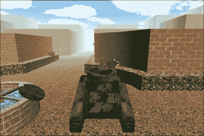
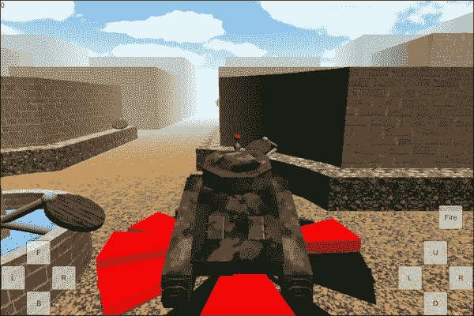
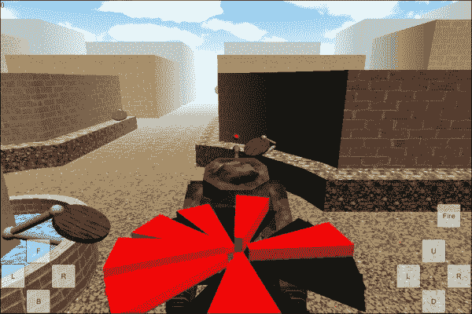
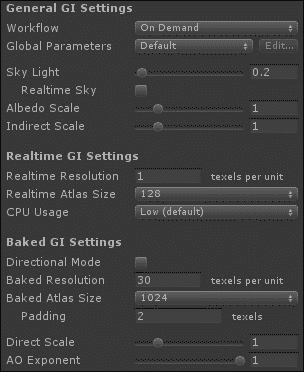
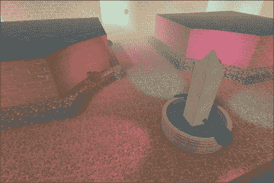
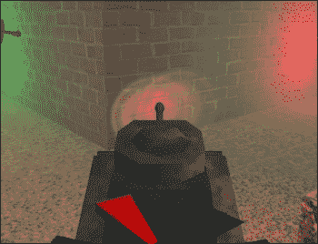

# 四、设置舞台——摄像机效果和灯光

在前一章中，您已经了解了任何游戏的基本构件:网格、材质和动画。我们创造了一个*坦克战*游戏，利用了所有这些区块。

在这一章，我们将展开坦克战游戏。我们将从添加天空盒和距离雾开始。相机效果的探索继续，目标指示器覆盖使用第二个相机。坦克的涡轮增压效果将完善我们对相机效果的看法。继续看看照明，我们将完成我们的坦克环境，增加光照图和阴影。

在本章中，我们将涵盖以下主题:

*   Skyboxes
*   距离雾
*   使用多个摄像头
*   调整视野
*   添加灯光
*   创建光照贴图
*   添加饼干

我们将直接从[第 3 章](3.html "Chapter 3. The Backbone of Any Game – Meshes, Materials, and Animations")、*任何游戏的支柱——网格、材质和动画*中借用这个项目。所以，在 Unity 中打开这个项目，我们就可以开始了。

# 相机效果

有许多伟大的相机效果，你应该添加，以便给你的游戏最后一个伟大的点睛之笔。在本章中，我们将介绍一些易于添加的选项。这些也会给我们的坦克游戏一个完成的外观。

## 天箱和距离雾

当摄像机渲染游戏画面时，它从清除屏幕开始。Unity 中的默认相机通过用渐变为所有事物着色来实现这一点，模拟天空盒子的外观。然后游戏的所有网格被绘制在这个空白屏幕的顶部。虽然渐变看起来比纯色更好，但对于一场激动人心的坦克大战来说，它仍然相当无聊。对我们来说幸运的是，Unity 允许我们改变天空盒子。skybox 只是构成任何游戏背景天空的一系列图像的一个奇特的词。距离雾与 skybox 配合使用，可以缓解模型和背景之间的视觉过渡。

我们首先需要的是一个新的 skybox。我们可以创建自己的，但是，Unity 为我们提供了几个非常适合我们需求的优秀产品。现在，让我们按照以下步骤获取 skybox:

1.  在统一编辑器的顶部，选择**素材**，然后点击**导入包**。大约在这个列表的中间，选择**天空之盒**。
2.  经过一点点处理后，会弹出一个新窗口。Unity 中的包只是已经在 Unity 中设置的一组压缩素材。此窗口显示内容，并允许您有选择地导入它们。我们想要全部，所以我们只需要点击这个窗口右下角的**导入**。
3.  一个新的文件夹`Standard Assets`将被添加到**项目**窗口。这包含一个文件夹，`Skyboxes`，其中包含各种 skybox 材质。选择其中任何一个。您可以在**检查器**窗口中看到，它们是使用天空框着色器的普通材质。它们每个都有六个图像，一个盒子的每个方向一个。
4.  您还会注意到，每个图像下方都有带有**立即修复**按钮的警告信息。这是因为所有的图像都被压缩以节省导入时间和空间，但是 skybox 着色器需要不同格式的图像。每次点击**立即修复**按钮，Unity 会自动为您修复。它还将消除材质预览中所有奇怪的黑色。
5.  要将您选择的 skybox 添加到游戏中，首先要确保加载了正确的场景。如果没有，只需双击**项目**窗口中的场景。这是必要的，因为我们将要更改的设置是特定于每个场景的。
6.  前往统一编辑器顶部，选择**编辑**，然后点击**场景渲染设置**。新的设置组将出现在**检查器**窗口中。
7.  目前我们关注的是顶部的数值，**天箱材质**。只需将新的天箱素材拖放到**天箱素材**槽中，就会自动更新。可以在**游戏**和**场景**窗口中立即查看变化。
8.  为了增加距离雾，我们还在**场景渲染设置**中调整了这个设置。要打开它，只需勾选**使用雾**复选框。
9.  下一个设置**雾色**，允许你选择雾的颜色。选择一种接近天空盒子一般颜色的颜色是很好的。
10.  **雾模式**设置是一个选项下拉列表，指示 Unity 将用于计算距离雾的方法。几乎所有情况下，**指数平方**的默认设置都是合适的。
11.  The next three settings, **Density**, **Start**, and **End**, determine how much fog there is and how close it starts. They will only appear for the fog modes that use them. **Density** is used for the **Exponential** and **Exponential Squared** fog modes, while the others are used for the **Linear** fog mode. Settings that put the fog at the edge of sight will, in general, give the best-looking effect. Leave these settings on **Exponential Squared** and choose `0.03` for the **Density** in order to get a good look.

    

我们已经进口了几个天箱，并在现场增加了天箱。距离雾设置也被打开和调整。现在，我们的场景开始看起来像一个真正的游戏。

## 目标指标

另一个相当有趣的相机效果是使用了多个相机。第二个摄像头可以用来制作一个三维图形用户界面，一个小地图，或者一个安全摄像头弹出窗口。在下一部分中，我们将创建一个指向附近目标的系统。使用第二个摄像头，我们将使指示器出现在玩家的坦克上方。

### 创建指针

我们将从创建一个指向目标的对象开始。我们将制作一个可以重复使用的预制构件。不过这一章需要导入`IndicatorSliceMesh.blend`启动素材，所以我们有东西给玩家看。它是一个饼状的薄片状网格。让我们执行以下步骤来创建指针:

1.  一旦导入了网格，将其添加到场景中。
2.  创建一个空的**游戏对象**组件，并将其重命名为`IndicatorSlice`。
3.  Make the mesh a child of `IndicatorSlice` and position it so that it points along the *z* axis of `GameObject`, with the small end of the pie slice being at the position of `IndicatorSlice`. The `IndicatorSlice` GameObject will be centered in our indicator. Each slice that is created will have its *z* axis pointing in the direction of a target, as shown in the following figure:

    

4.  现在，我们需要创建一个新的脚本来控制我们的指标。在**项目**窗口中创建一个名为`TargetIndicator`的新脚本。
5.  我们从一对变量开始这个脚本。第一个变量将包含一个指向目标的引用，该指示器将指向该目标。指标也是根据目标距离有多远，会有增有减。第二个变量将控制指示器开始增长的距离:

    ```java
    public Transform target;
    public float range = 25;
    ```

6.  创建指示件时，下一个功能将用于设置`target`变量:

    ```java
    public void SetTarget(Transform newTarget) {
      target = newTarget;
    }
    ```

7.  最后一组代码进入`LateUpdate`功能。使用`LateUpdate`功能，当我们的坦克在`Update`功能中移动后，指示器可以指向目标:

    ```java
    public void LateUpdate() {
    ```

8.  我们通过检查`target`变量是否有值来启动函数。如果为空，则指示器切片被破坏。`Destroy`功能可以用来移除游戏中存在的任何物体。`gameObject`变量由`MonoBehaviour`类自动提供，并保存对脚本组件所附加到的**游戏对象**组件的引用。摧毁这个组件也将摧毁它的所有子组件(或附属组件):

    ```java
    if(target == null) {
      Destroy(gameObject);
      return;
    }
    ```

9.  接下来，我们确定这个指示器片离它的目标有多远。通过使用`Vector3.Distance`，我们可以轻松计算距离，而无需自己计算:

    ```java
    float distance = Vector3.Distance(transform.position, target.position);
    ```

10.  这一行代码决定了切片的垂直比例， *y* 轴。它是通过使用一些精心应用的数学和`Mathf.Clamp01`函数来实现的。该功能将提供的值限制在 0 和 1 之间:

    ```java
    float yScale = Mathf.Clamp01((range – distance) / range);
    ```

11.  我们使用计算出的比例来设置指示器切片的局部比例。通过调整局部比例，我们只需要改变父对象的比例就可以轻松控制整个指标有多大:

    ```java
    transform.localScale = new Vector3(1, yScale, 1);
    ```

12.  `transform.LookAt`功能只是旋转游戏对象的一种奇特的自动方式，使其 *z* 轴指向世界上的一个特定地点。然而，我们希望所有的指示器切片平放在地面上，不要指向空中任何可能在我们上方的目标。所以，我们首先收集目标的位置。通过将变量的`y`值设置为切片的位置，我们确保切片保持平坦。当然，最后一行关闭了`LateUpdate`功能:

    ```java
      Vector3 lookAt = target.position;
      lookAt.y = transform.position.y;
      transform.LookAt(lookAt);
    }
    ```

13.  前面的代码是这个脚本的最后一个代码。返回到 Unity，将`TargetIndicator`脚本添加到场景中的`IndicatorSlice`对象。
14.  为了完成指示器，创建一个它的预置。就像我们对目标对象做的那样。
15.  最后，从场景中删除`IndicatorSlice`对象。游戏开始时，我们将动态创建切片。这需要预制构件，但不是场景中的那个。

我们创建了一个物体的预设，我们将使用它来指示目标的方向。创建并附加的脚本将旋转预设的每个实例，指向场景中的目标。它还会调整刻度，以指示目标离玩家有多远。

### 控制指示器

我们现在需要创建一个脚本来控制指示器切片。这将包括根据需要创建新切片。此外，它所连接的**游戏对象**组件将作为我们刚刚创建的指示器切片的旋转中心点。让我们执行以下步骤来实现这一点:

1.  创建一个新的脚本并命名为`IndicatorControl`。
2.  我们从一对变量开始这个脚本。第一个变量将保存对刚刚创建的预置的引用。这将允许我们随时生成预设的实例。第二个是静态变量，这意味着无需引用场景中存在的组件就可以轻松访问它。当游戏开始时，它将被场景中这个脚本的实例引用填充:

    ```java
    public GameObject indicatorPrefab;
    private static IndicatorControl control;
    ```

3.  目标将使用下一个函数。很快，我们将在游戏开始时更新目标的脚本来调用这个函数。函数是静态的，就像前面的变量:

    ```java
    public static void CreateSlice(Transform target) {
    ```

4.  这个函数从检查静态变量中是否有对任何对象的引用开始。如果为空，等于`null`，`Object.FindObjectOfType`用于填充变量。通过告诉它我们想要找到什么类型的对象，它会在游戏中搜索并尝试找到一个。这是一个相对较慢的过程，不应该经常使用，但是我们使用这个过程和变量，这样我们就可以始终确保系统可以找到脚本:

    ```java
    if(control == null) {
      control = Object.FindObjectOfType(typeof(IndicatorControl)) as IndicatorControl;
    }
    ```

5.  `CreateSlice`函数的第二部分检查以确保我们的静态变量不是空的。如果是，它会告诉实例创建一个新的指示器切片，并将目标传递给切片:

    ```java
    if(control != null) {
      control.NewSlice(target);
    }
    }
    ```

6.  这个脚本还有一个功能:`NewSlice`。`NewSlice`功能顾名思义；当被调用时，它将创建新的指示器切片:

    ```java
    public void NewSlice(Transform target) {
    ```

7.  该函数首先使用`Instantiate`函数创建`indicatorPrefab`的副本:

    ```java
    GameObject slice = Instantiate(indicatorPrefab) as GameObject;
    ```

8.  接下来，该函数使新的切片成为控件转换的子切片，因此当我们四处移动时，它会一直伴随着我们。通过将新切片的局部位置归零，我们还可以确保它与我们的控件位于相同的位置:

    ```java
    slice.transform.parent = transform;
    slice.transform.localPosition = Vector3.zero;
    ```

9.  函数的最后一行使用切片的`SendMessage`函数来调用我们之前创建的`SetTarget`函数，并将其传递给所需的目标对象:

    ```java
      slice.SendMessage("SetTarget", target);
    }
    ```

10.  现在脚本已经创建，我们需要使用它。创建一个空的**游戏对象**组件并命名为`IndicatorControl`。
11.  新的**游戏对象**组件需要成为坦克的子组件，然后在每个轴上将其位置设置为零。
12.  将我们刚刚创建的脚本添加到`IndicatorControl`对象中。
13.  最后，选择游戏对象，添加对`IndicatorSlice`预设的引用。通过将预制构件从**项目**窗口拖到**检查器**窗口的适当位置来完成。

我们创建了一个脚本来控制目标指示器切片的生成。我们在最后创建的**游戏对象**组件也将允许我们轻松控制整个指示器的大小。我们几乎完成了目标指标。

### 使用第二个摄像头工作

如果你现在玩这个游戏，它看起来还是一样的。这是因为目标尚未调用来创建指示器切片。当我们结束目标指示器时，我们还将在这一部分添加第二个摄像机。这些步骤将帮助我们做好:

1.  Start by opening the `Target` script and adding the following line of code at the end of the `Awake` function. This line tells the `IndicatorControl` script to create a new indicator slice for this target:

    ```java
    IndicatorControl.CreateSlice(transform);
    ```

    

2.  如果你现在玩游戏，可以看到指示器在动作。然而，它可能太大了，肯定会出现在油箱内部。一个糟糕的解决方案是移动`IndicatorControl`物体，直到整个物体出现在坦克上方。然而，当爆炸发生时，物体开始在空中飞行，它们会再次模糊目标指示器。更好的解决方案是增加第二个摄像头。您现在可以通过从统一编辑器顶部选择**游戏对象**，然后点击**相机**来完成。
3.  另外，让相机成为`Main Camera`的孩子。务必将新相机的位置和旋转值设置为`0`。
4.  默认情况下，Unity 中的每个摄像头都有各种组件:**摄像头**、**照明弹层**、 **GUI 层**和**音频监听器**。除了**摄像头**组件之外，其他的对于每一个其他摄像头来说一般都不重要，整个场景中应该只有一个**音频监听器**组件。从相机中取出多余的组件，只留下**相机**组件。
5.  在我们使用相机做其他事情之前，我们需要更改`IndicatorSlice`预设所在的图层。图层用于对象之间的选择性交互。它们主要用于物理和渲染。首先在**项目**窗口中选择预设。
6.  在**检查器**窗口的顶部是带有下拉列表的**图层**标签，该下拉列表显示**默认**。点击下拉列表，选择**添加图层...**从列表中。
7.  图层列表现在将出现在**检查器**窗口中。这些都是游戏中用到的图层。前几个保留给 Unity 使用；因此，它们已经变灰。剩下的给我们用。点击**用户层 8** 右侧输入框，命名为`Indicator`。
8.  再次选择`IndicatorSlice`预设。这次，从**图层**下拉列表中选择新的**指示器**图层。
9.  Unity 会询问您是否也要更改所有子对象的图层。我们想要整个物体渲染在这个图层上，所以我们需要选择**是的，改变孩子**，我们将能够这样做。
10.  现在，让我们回到我们的第二个相机。选择摄像头，查看**检查器**窗口。
11.  **相机**组件的第一个属性是**清除旗帜**。这个选项列表规定了在绘制游戏中的所有模型之前，相机将在背景中填充什么。第二个摄像头不应遮挡第一个摄像头绘制的所有内容。我们从**清除标志**下拉列表中选择**仅深度**。这意味着，它不会将 skybox 放在背景中，而是将已经渲染的内容保留下来，并在顶部绘制新的东西。
12.  下一个属性**剔除遮罩**，控制相机渲染哪些层。前两个选项**无**和**一切**用于快速取消选择和选择所有图层。对于该相机，取消选择所有其他图层，以便只有**指示器**图层旁边有一个复选标记。
13.  The last thing to do is to adjust the scale of `IndicatorControl` so that the target indicator is not too large or small.

    

我们创建了一个系统来指示潜在目标的方向。为此，我们使用了第二个摄像头。通过调整**剔除蒙版**属性中的图层，我们可以让相机只渲染场景的一部分。此外，通过将**清除标志**属性更改为**仅深度**，第二个相机可以在第一个相机绘制的基础上进行绘制。

通过移动摄像机可以改变指示器的绘制位置。如果你要移动`IndicatorControl`物体，它会改变如何计算从目标到目标的距离和方向。移动并调整第二个摄像头的角度，以便目标指示器有一个更令人满意的视图。

当你移动第二个摄像头或使用助推时(从下一部分)，你可能会注意到目标指示器仍然可以在坦克中看到。调整主摄像机，使其不呈现目标指示器。这类似于我们如何使第二个相机只渲染目标指示器对象。

## 涡轮增压

我们将在本章中看到的最后一个相机效果是涡轮增压。它将是屏幕上的一个按钮，将在短时间内推动玩家快速前进。相机效果的出现是因为对**视野**属性的简单调整可以让它看起来好像我们走得更快。电影中也使用了类似的方法，让追车看起来更快。

我们将在这一部分只制作一个脚本。该脚本将以类似于我们在上一章中创建的`ChassisControls`脚本的方式移动坦克。不同的是，我们不需要按下按钮就能启动。让我们从以下步骤开始:

1.  首先创建一个新的脚本并调用它`TurboBoost`。
2.  为了开始脚本，我们需要四个变量。第一个变量是对油箱上`CharacterController`部件的引用。我们需要这个来移动。第二个变量是我们在提振时的移动速度。第三个是多久，以秒为单位，我们将提高。最后一个是内部使用的，表示我们是否可以提升，何时应该停止:

    ```java
    public CharacterController controller;
    public float boostSpeed = 50;
    public float boostLength = 5;
    public float startTime = -1;
    ```

3.  `StartBoost`功能相当简单。检查`startTime`变量是否小于零。如果是，变量设置为`Time.time`提供的当前时间。变量的值小于零意味着我们当前没有提升:

    ```java
    public void StartBoost() {
      if(startTime < 0)
        startTime = Time.time;
    }
    ```

4.  我们要用到的最后一个函数是`Update`函数。它从检查`startTime`开始，看我们目前是否在提升。如果我们不提升，函数会提前退出。下一行代码检查以确保我们有我们的`CharacterController`参考。如果变量为空，那么我们不能让坦克移动:

    ```java
    public void Update() {
      if(startTime < 0) return;
      if(controller == null) return;
    ```

5.  下一行代码应该看起来很熟悉。这是让坦克移动的线:

    ```java
    controller.Move(controller.transform.forward * boostSpeed * Time.deltaTime);
    ```

6.  接下来，检查我们是否处于助推的前半秒。通过将当前时间与我们开始时记录的时间进行比较，我们可以很容易地计算出我们已经提升了多长时间:

    ```java
    if(Time.time – startTime < 0.5f)
    ```

7.  如果时间合适，我们通过调整`fieldOfView`值来转换相机。`Camera.main`值只是 Unity 提供给场景中使用的主摄像头的参考。`Mathf.Lerp`函数取一个起始值，并根据 0 到 1 之间的第三个值将该值移向目标值。利用这个，摄像机的`fieldOfView`值在半秒钟内朝着我们的目标移动:

    ```java
    Camera.main.fieldOfView = Mathf.Lerp(Camera.main.fieldOfView, 130, (Time.time – startTime) * 2);
    ```

8.  下一段代码与前两段代码做了相同的事情，除了最后半秒的提升，并使用相同的方法将`fieldOfView`值转换回默认值:

    ```java
    else if(Time.time – startTime > boostLength – 0.5f)
    Camera.main.fieldOfView = Mathf.Lerp(Camera.main.fieldOfView, 60, (Time.time – startTime – boostLength + 0.5f) * 2);
    ```

9.  最后一段代码检查我们是否完成了提升。如果是，将`startTime`设置为`-1`，以表示我们可以开始另一次助推。当然，最后一个大括号关闭了`Update`功能:

    ```java
    if(Time.time > startTime + boostLength)
      startTime = -1;
    }
    ```

10.  接下来，将脚本添加到您的坦克，并连接`CharacterController`参考。
11.  我们快完成了。我们需要创建一个新按钮。我们可以像以前一样做这件事。将按钮固定在**画布**的右下角，并将其放置在底盘移动控制的正上方。
12.  最后，确保选择**的`Tank`点击**对象，导航至功能的**涡轮增压** | **启动增压()**。
13.  Try this out.

    

我们在这里创造了涡轮增压。与我们在上一章中使用的移动坦克的方法相同。通过调整相机的**视野**属性，我们使它看起来像坦克移动得更快。

你可能会注意到，在玩游戏时，你甚至可以在助推时转身。尝试在`ChassisControls`脚本中添加一个检查，以便在增强时锁定控件。为此，您需要添加对`TurboBoost`脚本的引用。

对于额外的挑战，试着增加一个冷却时间。让玩家无法持续使用提升。另外，如果坦克撞到什么东西，试着取消助推。这是一个困难的问题，所以这里有一个开始的提示:看看 Unity 文档中的`OnControllerColliderHit`。

# 灯光

Unity 提供多种灯光类型，用于点亮游戏世界。分别是**方向灯**、**聚光灯**、**点光源**、**面光源**。每个项目都以不同的方式发光；详细解释如下:

*   **定向光**:这个功能很像太阳。它把所有的光投射到一个方向。光的位置不重要，重要的是旋转。光以一个方向投射在整个场景上。这使得它非常适合最初为场景添加光线。
*   **聚光灯**:这个的功能就像舞台上的灯一样。光以锥形的形状向特定的方向投射。正因如此，它也是系统计算最复杂的光型。Unity 在计算灯光的方式上有了显著的改进，但是应该避免过度使用这些灯光。
*   **点光**:这个是你游戏中会用到的主要光型。它向各个方向发光。这个功能就像一个灯泡。
*   **区域灯**:这是专用灯。它从平面向单一方向发光。可以把它想象成一个大霓虹灯，用来为酒店或餐馆做广告。由于其复杂性，这些灯光只能在烘焙阴影时使用。游戏运行时，计算量太大，无法使用。

谈论灯光时，下一个明显的问题涉及阴影，尤其是实时阴影。虽然实时阴影为场景增加了很多东西，并且在任何平台上都是技术上可行的，但它们非常昂贵。除此之外，它们是除**方向灯**之外的所有灯光类型的 Unity Pro 功能。总的来说，这让它们对你的普通手机游戏来说有点太多了。

另一方面，有一些完全可行的替代方案，成本几乎没有实时阴影高，而且看起来也更真实。第一种选择是针对您的环境。一般来说，游戏中的环境在特定的场景中从不移动，也从不改变。为此，我们有光照图。它们是包含阴影数据的额外纹理。使用 Unity，你可以在制作游戏时创建这些纹理。然后，当游戏运行时，它们会自动应用，您的阴影会出现。然而，这不适用于动态对象(任何移动的东西)。

对于动态对象，我们有 cookies。这些不是你奶奶的饼干。在照明中，饼干是一个黑白图像，在游戏中投射到网格上。这类似于皮影。影子木偶用一个切口挡住一部分光线，而饼干用黑白图像告诉光线它可以投射光线的地方。

Cookies 还可以用来创建其他静态和动态的良好效果，例如覆盖整个场景的云层，或者从笼子里投射出来的光线。或者，你可以用它们来制作手电筒不均匀的焦点。

## 增加更多灯光

给场景添加额外的灯光相当简单。此外，只要坚持使用点光源，渲染它们的成本就会很低。让我们用这些步骤来点亮我们的游戏:

1.  在统一编辑器的顶部，导航至**游戏对象** | **灯光** | **点光源**。
2.  选择新灯光后，我们应该在**检查器**窗口中关注以下几个属性:
    *   **范围**:这是光从物体发出的距离。从这一点发出的光在中心最亮，当它达到范围的程度时，就会消失。在**场景**视图中，该范围还被表示为黄色的线球。
    *   **颜色**:这简直就是光的颜色。默认为白色；然而，这里可以使用任何颜色。该设置在所有灯光类型之间共享。
    *   **强度**:表示光线的亮度。光的强度越大，中心的光就越亮。该设置也在所有灯光类型之间共享。
3.  创建和定位几个更多的灯，沿着街道排列它们，为环境添加一些更有趣的元素。
4.  Press *Ctrl* + *D* to duplicate the selected object. This can greatly speed up the creation process (like the one shown in the following screenshot):

    

5.  当添加这些灯时，你可能注意到了它们的一个主要缺点。实时影响曲面的灯光数量是有限制的。可以通过使用更复杂的网格来解决这个问题。更好的选择是使用光照贴图，我们将在下一节中看到。
6.  再次在统一编辑器的顶部，导航至**游戏对象** | **灯光** | **聚光灯**。
7.  Select a new light and take a look at it in the **Inspector** window.

    **光斑角度**:这是这种类型的光独有的。它决定了发射光的光锥有多宽。与**范围**一起，在**场景**视图中用黄色线锥表示。

8.  Add a few spotlights around the fountain in the center of our Tank Battle city, as shown in the following screenshot:

    

9.  场景中有如此多的对象会使“T2”层级“T3”窗口变得混乱，从而很难找到任何东西。为了组织它，你可以使用空的游戏对象。创建一个**游戏对象**并命名为`PointLights`。
10.  通过让你所有的点光源都成为这个空的**游戏对象**的子对象，**层级**窗口变得明显不那么杂乱。

我们给游戏增加了几个灯光。通过改变灯光的颜色，我们让场景看起来和玩起来都更有趣。然而，照明系统的缺点暴露出来。我们使用的城市非常简单，一次可以影响一架飞机的灯光数量是有限制的。尽管我们场景的外观得到了改善，但许多令人印象深刻的东西都被这个缺点偷走了。

## 光图

光照贴图非常适合复杂的照明设置，这些设置太贵或者在运行时根本不起作用。它们还允许你在游戏世界中添加详细的阴影，而不会牺牲实时阴影。然而，它只适用于在游戏过程中不移动的物体。

光照贴图对于任何游戏环境都是一个很好的效果，但是我们需要明确告诉 Unity 哪些对象不会移动，然后创建光照贴图。以下步骤将帮助我们做到这一点:

1.  首先要做的是使你的环境网格静态。要做到这一点，从选择你的城市开始。
2.  在**检查器**窗口的右上角，对象名称字段的右侧，有一个复选框和一个**静态**标签。选中此框将使对象成为静态的。
3.  使城市的所有网格保持静态，如下所示:
    *   如果您有任何类型的分组(就像我们刚才对灯光所做的那样)，这一步可以更快地完成，而不是逐个选择每个复选框。选择城市的根对象，它是城市、建筑和街道的所有部分的父对象。
    *   现在，去选择**静态**复选框。
    *   在新弹出窗口中，选择**是，更改子对象**以使所有子对象也变为静态。
4.  当 Unity 生成光照贴图时，任何未展开的网格或其紫外位置在归一化紫外空间之外的网格都将被跳过。在**模型导入设置**窗口中，有一个选项让统一自动生成光照贴图坐标，**生成光照贴图紫外线**。如果您正在为您的环境使用`TankBattleCity`，现在应该打开该选项。
5.  前往统一编辑器顶部，选择**窗口**，然后点击底部附近的**照明**。
6.  看着这个窗口，你的大部分时间都会花在**场景**页面上。选择窗口顶部的**场景**切换到该窗口。
7.  你会注意到这个页面的第一件事是它有和我们在**场景渲染设置**中看到的相同的**天空之光**部分，我们在那里改变了天空盒子。我们还在窗口底部设置了所有的**雾**。
8.  The section we are interested in is **General GI Settings**, as shown in the following screenshot:

    

    前面的截图有以下设置:

    *   **工作流程**:该设置决定了使用哪种方法来处理光照贴图。默认选择**遗留**，是老方法。我们想把它改成**点播**。(**迭代**与**按需**相同，但它试图在您调整设置时更新光照图。只有当你有一台足够强大的计算机来处理它时，才建议这样做。)
    *   **全局参数**:该设置允许您创建您可能希望能够快速选择的设置。如果你有很多场景需要改变，这将是特别有用的。然而，我们只有一个场景，所以我们可以暂时忽略它。
    *   **天空之光**:该设置影响场景中环境光的多少。较低的值会使整个场景变暗，可能会给你一个夜景。更高的值会让一切变得更明亮，也许是白天的场景。该设置下的**实时天空**复选框指示该计算是在游戏运行时进行，还是仅在烘焙光照贴图时进行。取消选中该框将节省处理时间，但保持选中状态将允许您在游戏运行时更改场景的亮度。所以，你可以在游戏中看到你的灯光，将**天空之光**设置为`0.2`，取消勾选**实时天空**。
    *   **反照率比例**:该设置会影响光线从表面反射的程度。**间接缩放**选项会影响不直接指向对象的光源在整个场景中的光量。出于我们的目的，这两者都可以保持默认值。
    *   **实时 GI 设置**:此部分仅适用于 Unity 新的光照贴图系统。它保存着游戏运行时计算的光照贴图的控件。**实时分辨率**和**实时地图集大小**选项调整这些光照贴图中的细节。 **CPU 使用率**选项控制游戏运行时系统在计算您看到的值时所投入的精力。由于我们在移动平台上工作，我们需要降低处理成本，因此将所有这些都保持在低默认值对我们来说很好。
    *   **烘焙光照设置**:这些设置控制着预先计算好的光照图的调整。这是你大部分调整发生的地方。马上，我们有一个**方向模式**复选框，指示我们是否要使用一个单一的光照贴图集时，取消选中。或者，如果我们要使用两组，其中一组用于颜色和直射光，第二组用于间接光。使用两组光照贴图可以给你更多的细节，尤其是在黑暗的区域，但是计算和使用的成本更高。所以，我们不去管它。
    *   **Baked Resolution**: This setting controls how much detail is put into an object based on its size. After the number field, you can see the **texels per unit** setting. A texel is just a fancy lightmap pixel. So, it is really just the amount of pixel details in the lightmap for each unit in the scene. For our purposes, a value of `30` will give us a good amount of detail without overloading our computers.

        ### 类型

        **烘焙分辨率**设置将最快速地影响实际烘焙光照贴图所需的时间。最好从低值开始，只有当你的照明设置接近你想要的最终产品时，才增加值。

    *   **烘焙地图集尺寸**:该设置控制最终光照贴图图像的最终分辨率。较小的分辨率尺寸将更容易处理，但您需要限制场景中最大对象的整体细节。不管你选择了什么分辨率，你的模型的单个平面都不可能比单个光照图图谱更详细。 **1024** 的默认值是细节和加工成本之间的最佳折衷。
    *   **填充**:该设置的值调整对象之间的光照贴图空间。过低的值会导致阴影溢出到共享光照贴图的其他对象的边缘。过高的值会导致光照图中大量空间的浪费。同样，这里的默认设置对我们来说也没问题。
    *   **直接缩放**:这个设置会在光照贴图中缩放光照强度。它会让你改变场景的整体亮度。缺省值在这里也能正常工作。
    *   **AO 指数**:此设置调整环境照明的对比度。这将使场景中的暗区域看起来更暗，亮区域看起来更亮。让它默认为`1`对我们来说没问题。
9.  At the bottom of the page is a **Bake** button. Clicking on this button will start the render process. A loading bar will appear in the bottom-right corner of Unity, so you can monitor the progress.

    ### 注

    请注意，这个过程可能需要一段时间。尤其是随着环境的复杂性和灯光数量的增加以及细节设置的增加，这将需要越来越长的时间来运行。此外，除非你有一台高级计算机，否则当 Unity 运行时，你没有什么可以做的。

10.  如果你点击了按钮，意识到自己犯了错误，不要烦恼。选择**烘焙**后，按钮变为**取消**。此时，可以选择它并停止该过程继续进行。但是，一旦创建了纹理，并且 Unity 开始导入它们，就无法停止了。
11.  在**烘焙**按钮的左侧是**清除**。此按钮是删除和移除场景中当前正在使用的所有光照贴图的最快和最简单的方法。这无法撤消。
12.  为了给你的建筑添加阴影，在你的场景中选择**方向灯**，从**层次**中，看一下**检查器**窗口。
13.  从**阴影类型**下拉列表中，选择**软阴影**。这只是打开了光线的阴影。它为光照贴图和实时光照打开它们。打开阴影的灯光数量越多，渲染成本就越高。为你的光照贴图打开阴影是一个好主意，但是一定要在之后关闭它们。这将在你的最终游戏中节省处理，同时仍然给你的静态场景一个好的外观。
14.  When all your lights and settings match your expectations, select **Bake** and once it has finished processing, gaze in wonder at the now beautiful scene before you, as shown here:

    

我们在游戏世界中加入了光照贴图。仅仅处理这一步所需的时间长度使得很难进行细微的调整。然而，我们的照明已经大大改善了一些点击。虽然早些时候灯光被网格打破，但我们现在有了平滑的颜色和光线。

玩游戏的时候，只有一种光是人们不会质疑的光源:阳光。如果看不到光源，每隔一盏灯看起来都很奇怪。创建一个网格，并将其添加到游戏中，以便为您正在使用的灯光给出一个理由。这可能是一些像火把、灯柱，甚至发光的外星粘性球的东西。不管它们最终是什么，拥有它们增加了那种完整的感觉，这使得好看的游戏和好看的游戏有所不同。

作为第二个挑战，看看你的光照图的质量。玩一下我们讨论过的各种质量设置，看看有什么不同。此外，在你注意到任何像素化之前，找出分辨率有多低。在较小的移动设备屏幕上运行时，设置是否可以更低？去看看。

## 饼干

饼干是一个很好的方式来增加游戏中灯光的趣味性。他们使用纹理来调整光的发射方式。这种效果可以覆盖广泛的用途，从闪闪发光的晶体到笼式工业灯，在我们的例子中，还有头灯。

通过给我们的坦克前灯，我们给了玩家在他们的世界里控制光线的能力。使用饼干，我们可以让它们看起来比光圈更有趣。让我们通过以下步骤添加这些灯:

1.  从制造聚光灯开始。
2.  将灯放在水箱前面并指向远处。
3.  在**检查器**窗口中，将**强度**属性的值增加到`3`。这将使我们的大灯变亮，就像真正的大灯一样。
4.  现在，我们需要一些饼干质地。在统一编辑器的顶部，导航至**素材** | **导入包** | **轻饼干**。
5.  在新窗口中，点击**导入**，等待加载栏完成。
6.  我们现在有几个选择。在`Standard Assets`文件夹中，创建了一个包含新纹理的新文件夹`Light Cookies`。将**手电筒**从**项目**窗口拖到**检查器**窗口中**聚光灯**上的**小块**区域。就这么简单，往灯里加一块饼干。
7.  您可能仍然无法看到您的 cookie 在运行。这是我们以前遇到的同样问题的结果；太多的灯光无法遮挡同一个物体。不幸的是，一束本该四处移动的光却无法被烤入光地图。要解决此问题，请在**检查器**面板中将灯光的**渲染模式**属性更改为**重要**。这将赋予灯光优先级，并使其先于场景中的其他对象照亮一个对象。
8.  如果你现在再次烘烤你的灯，你会发现饼干形状粘在建筑物的墙上。我们需要将 **GI 模式**更改为**实时**，这样灯光会被灯光映射过程忽略，但仍然能够影响场景。
9.  To finish off, duplicate the light for the second headlight and make them both children of the tank. What good is it to have headlights if they don't come with us?

    

我们执行了一些小步骤，并使用 cookies 为我们的坦克创建了一对大灯。这正是其他游戏，尤其是恐怖游戏，创造手电筒效果的方式。

尝试制作一个脚本，让玩家打开和关闭前灯。它应该是一个切换灯光的简单按钮。看看作为光的一部分提供的`enabled`变量。

作为一个简单的挑战，创建一个位于坦克炮塔上的灯。也给它一盏灯。有了这个，玩家可以指向他们射击的地方，而不仅仅是他们坦克指向的方向。

# 水滴影

Blob 阴影是一种简单而廉价的方法，通过它可以给角色添加阴影。自从电子游戏出现以来，它们就一直存在。正常的阴影是一个物体在另一个表面上的实心的、深色的投影。阴影的轮廓与物体的形状完全匹配。当角色开始随机移动时，计算成本会变得很高。

斑点阴影是角色或物体下面黑色纹理的污点。它通常没有一个明确定义的形状，也从来没有匹配的对象的确切形状，它应该是阴影。斑点阴影通常也不会改变大小。这使得计算变得非常容易，成为许多代电子游戏的首选。这也意味着，对于处理速度可能很快成为问题的移动设备来说，这是一个更好的选择。

我们要给坦克增加一个斑点阴影。团结已经为我们做了大部分工作；我们只需要把它加到油箱里。通过这些步骤，我们可以添加斑点阴影:

1.  我们从导入统一的斑点阴影开始。转到 Unity 编辑器顶部，导航至**素材** | **导入包** | **投影仪**。
2.  在新窗口中点击**导入**，在**项目**窗口中查看在`Standard Assets`下创建的名为`Projectors`的新文件夹。
3.  Drag the `Blob Shadow Projector` prefab from the **Project** window to the scene and position it above the tank, as shown in the following screenshot:

    

4.  不幸的是的影子出现在我们的坦克顶部。为了解决这个问题，我们再次需要使用图层。所以，选择坦克。
5.  从**图层**下拉列表中，选择**添加图层……**。
6.  点击**用户层 9** 右侧的文本字段，并命名为`PlayerTank`。
7.  再次选择你的坦克，但是这次从**图层**下拉列表中选择**游戏坦克**。
8.  当新窗口弹出时，一定要选择**是，换子**换整个坦克的图层。如果不选择此选项，斑点阴影可能会出现在坦克的某些部分，而不会出现在其他部分。
9.  Now, select `Blob Shadow Projector` from the **Hierarchy** window.

    ### 注

    斑点阴影由**投影仪**组件创建。该组件的功能类似于**相机**组件。然而，它把一个图像放在世界上，而不是把世界变成一个图像，放在你的屏幕上。

10.  看一下**检查器**窗口。我们现在关心的是**忽略图层**的值。现在，设置为**无**。
11.  点击**无**，从**图层**下拉列表中选择`PlayerTank`。这将使投影仪忽略坦克，只让斑点阴影出现在它下面。
12.  The next step is to change the size of the shadow to roughly match the size of the tank. Adjust the value of the **Field of View** attribute until the size is just about right. A value of `70` seems to be a good size to start with.

    

13.  最后一步是让`Blob Shadow Projector`成为坦克的孩子。我们需要能够把自己的影子带在身边；我们不想失去它。

我们给了坦克一个阴影。阴影非常适合让物体，尤其是角色看起来像是真的在接触地面。我们使用的斑点阴影比实时阴影好，因为它处理得更快。

斑点阴影的纹理是圆形的，但是我们的坦克大部分是方形的。尝试为斑点阴影创建自己的纹理，并使用它。某种矩形应该很好用。如果你最终在场景中出现黑色条纹，确保你的纹理在图像边缘有一个完全白色的边框。

如果你设法添加你自己的纹理到斑点阴影，那么看看那门大炮怎么样？大炮突出了我们的坦克，破坏了它原本的方形轮廓。使用附加在炮塔上的第二个斑点阴影为大炮投射阴影。这个的纹理也必须是矩形的。

# 总结

在这一点上，你应该对相机效果和灯光非常熟悉。

在这一章中，我们首先看一下使用多个摄像头。然后我们玩了一个涡轮增压相机效果。这一章以我们城市的灯光继续。当我们使用灯光地图时，灯光有了很大的改善。我们最后看了一些饼干和斑点阴影，用于一些特殊的照明效果。

在下一章中，我们将看到为我们的游戏创造敌人。我们将使用 Unity 的寻路系统让他们四处移动并追逐玩家。在这之后，如果玩家希望保持他们的分数，他们将需要更加活跃。