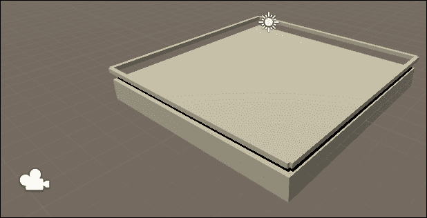
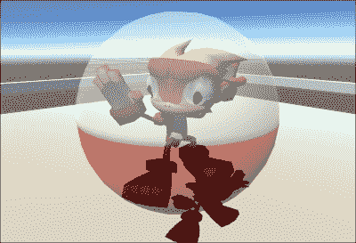
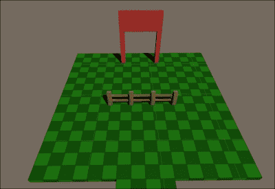
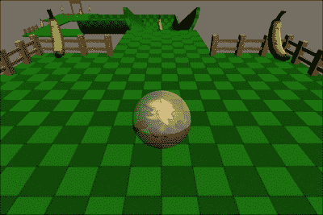

# 六、移动设备的特性——触摸和倾斜

在前一章中，我们学习了寻路和人工智能。我们扩大了我们的坦克战游戏，包括敌人的坦克。我们为他们创造了点，让他们向玩家射击。此外，玩家还被赋予了摧毁坦克的能力。一旦他们被摧毁，玩家会得到一些积分，一个新的敌人坦克会被制造出来。

在这一章中，我们将研究一款新游戏，探索移动设备的一些特性。我们将创建一个**猴子球**游戏。玩家将在收集香蕉的同时，控制住一只在超大仓鼠球里的猴子，并试图在时间耗尽之前到达迷宫的尽头。为了四处移动，他们必须倾斜移动设备。要收集香蕉，玩家必须触摸香蕉所在的屏幕。

在本章中，我们将涵盖以下主题:

*   触摸控制
*   倾斜控制
*   猴子球游戏

我们将为这一章创建一个新项目，所以开始团结，我们将开始。

# 设置开发环境

和每个项目一样，为了准备好我们的开发环境，我们需要一点点准备工作。不用担心；本章的设置简单明了。让我们按照以下步骤来做:

1.  当然，第一步是启动 Unity 并创建一个新项目。它需要是一个 3D 项目，命名为`Ch6_MonkeyBall`会很好。
2.  一旦 Unity 完成初始化，这就是设置我们的构建设置的绝佳机会。打开**搭建设置**窗口，从平台列表中选择**安卓**，点击**切换平台**即可更改目标平台。
3.  当您处于**构建设置**窗口时，选择**玩家设置**在**检查器**中打开玩家设置。调整**公司名称**、**产品名称**，最重要的是**捆绑包标识**。
4.  当用户倾斜他们的设备时，当新的一侧成为底部时，整个屏幕将调整其方向。由于整个游戏是基于倾斜设备，屏幕方向可能会在玩家玩的任何时候改变，从而破坏他们的游戏。因此，在**玩家设置**中，找到**分辨率** **和演示**部分，并确保**默认方位**没有设置为**自动旋转**，这将导致 Unity 在我们玩游戏时改变游戏的方位。任何其他选择对我们都有效。
5.  我们需要创建一些文件夹来保持项目的有序性。应在**项目**窗口中创建`Scripts`、`Models`和`Prefabs`文件夹。既然我们将来可能会有几十个关卡和地图，那么制作一个`Scenes`文件夹也是个好主意。
6.  最后，我们必须为这个项目导入素材。我们需要一只猴子给玩家，一根香蕉来收集，一张地图样本和一些栅栏。幸运的是，所有这些都已经准备好了，并且可以从本章的开始素材中获得。将`Monkey.blend`、`Monkey.psd`、`Ball.psd`、`Banana.blend`、`Banana.psd`、`MonkeyBallMap.blend`、`Grass.psd`、`Fence.blend`和`Wood.psd`导入您刚刚创建的`Models`文件夹。

我们刚刚完成本章项目的设置。同样，项目开始时的一点点努力会节省时间，避免后来的挫败感；随着项目规模的增长，开始时完成的组织变得非常重要。

# 基本环境

在我们深入了解倾斜和触摸控制的所有乐趣之前，我们需要一个基本的测试环境。当使用新的控制方案时，在引入真实级别的复杂性之前，最好总是在简单且控制良好的环境中工作。让我们通过以下步骤来实现:

1.  前往 Unity 的顶部，通过导航至**game Object**|**3D Object**选择**立方体**，创建一个新的立方体，这将是我们基本环境的基础。将其重命名为`Ground`以便我们可以跟踪它。
2.  将立方体在**检查器**面板中的**位置**设置为每个轴上的`0`，允许我们围绕世界原点工作。另外，将**检查器**中的 **X** 和**Z**T10】刻度设置为`10`，给我们足够的空间来移动和测试我们的猴子。
3.  接下来，我们需要第二个立方体，命名为`Fence`。该立方体的**位置**值为 **X** 、`1`为 **Y** 、`0`为 **Z** ，同时 **X** 和 **Y** 和`10`为 **Z** 。
4.  With `Fence` selected in the **Hierarchy** window, you can hit *Ctrl* + *D* on your keyboard to make a duplicate. We are going to need a total of four, positioned along each side of our `Ground` cube:

    

我们现在有了一个基本的测试环境，允许我们使用我们的控件，而不用担心整个级别的所有复杂性。一旦我们的控制在这个环境中按照我们希望的方式工作，我们就会把我们的猴子引入一个新的环境。

# 倾斜控制

现代移动设备提供了各种各样的内部传感器来检测和提供周围世界的信息。虽然你可能没有这样想过，但你一定非常熟悉打电话所需的麦克风和扬声器。还有一个连接互联网的无线接收器和一个拍照的相机。此外，你的设备几乎肯定有一个磁力计，与你的全球定位系统一起工作并提供方向。

我们现在感兴趣的传感器是**陀螺仪**。该传感器检测设备的局部旋转。一般来说，它是手机中用来确定设备在世界上的方向和移动的众多传感器之一。我们要用它来控制我们的猴子。当用户左右倾斜他们的设备时，猴子会左右移动。当装置上下倾斜时，猴子会前后移动。通过这些步骤，我们可以创建脚本，让我们以这种方式控制我们的猴子:

1.  首先，创建一个新的脚本并命名为`MonkeyBall`。
2.  我们的第一个变量将包含一个对将附加到球上的**刚体**组件的引用。这将允许我们实际上让它滚动并与世界上的东西碰撞:

    ```java
    public Rigidbody body;
    ```

3.  接下来的两个变量将让我们控制设备的倾斜如何影响游戏中的移动。第一个可以让我们摆脱任何太小的动作。这让我们可以避免来自环境或传感器的随机移动，这些移动可能并不完全准确。第二个选项将让我们向上或向下缩放倾斜输入，以防控制感觉缓慢或无法控制的快:

    ```java
    public float minTilt = 5f;
    public float sensitivity = 1f;
    ```

4.  目前的最后一个变量将记录设备倾斜的程度。它迫使用户前后倾斜他们的设备，如果他们想往相反的方向移动，则阻止移动:

    ```java
    private Vector3 totalRotate = Vector3.zero;
    ```

5.  这个脚本的第一个功能很好，很短。为了从陀螺仪获得输入，我们必须首先打开它。我们将在`Awake`功能中这样做，这样我们就可以在游戏一开始就开始跟踪它:

    ```java
    public void Awake() {
      Input.gyro.enabled = true;
    }
    ```

6.  The next function for our script will be `Update`. It starts by grabbing the value of `rotationRate` from the gyroscope. This is a value in radians per second, indicating how fast the user has tilted their device along each axis. To make it a little more understandable, we multiply the value of `rotationRate` by `Mathf.Rad2Deg` to convert it into degrees per second before we store it in a variable:

    ```java
    public void Update() {
      Vector3 rotation = Input.gyro.rotationRate * Mathf.Rad2Deg;
    ```

    ### 注

    当拿着设备，屏幕面向你时，设备的 *x* 轴指向右边。 *y* 轴笔直向上，位于设备顶部， *z* 轴从屏幕中心直接指向您。

7.  接下来，我们确保沿着每个轴都有足够的运动来真正让我们的猴子移动。通过在每个值上使用`Mathf.Abs`，我们找到轴运动的绝对值。然后，我们将其与我们正在寻找的最小倾斜量进行比较。如果运动太少，我们在`rotation`变量中将其归零:

    ```java
    if(Mathf.Abs(rotation.x) < minTilt) rotation.x = 0;
    if(Mathf.Abs(rotation.y) < minTilt) rotation.y = 0;
    if(Mathf.Abs(rotation.z) < minTilt) rotation.z = 0;
    ```

8.  最后，对于我们的`Update`函数，我们通过将其添加到我们的`totalRotate`变量来跟踪新的运动。为了正确地做到这一点，我们需要重新排列这些值。玩家希望能够将设备的顶部向他们倾斜，以向后移动，远离设备以向前移动。这是 *x* 轴的运动，但与我们移动猴子所需的东西相比，它是从我们的设备向后移动的，因此在值之前有负号。接下来，我们交换 *y* 和 *z* 轴的旋转，因为玩家将期望向左和向右倾斜他们的设备以向左和向右移动，这是 *y* 轴的移动。如果我们把它应用到猴子的 *y* 轴上，它就会原地旋转。因此，运动被视为每秒速度，而不是每帧速度；我们必须乘以`Time.deltaTime` :

    ```java
    TotalRotate += new Vector3(-rotation.x, rotation.z, -rotation.y) * Time.deltaTime;
    }
    ```

9.  现在最后一个功能是`FixedUpdate`功能。当改变和处理刚体时，最好在`FixedUpdate`中进行。刚体实际上是将我们连接到 Unity 的物理引擎中的，它只在这个功能期间更新。我们在这里所做的就是给刚体增加一些扭矩或旋转力。我们用我们收集的总数乘以我们的`sensitivity`让我们的玩家得到他们期望的控制速度:

    ```java
    public void FixedUpdate() {
      body.AddTorque(totalRotate * sensitivity);
    }
    ```

10.  为了利用我们的新脚本，我们需要对球进行一些更改。从创造一个我们可以合作的领域开始；这可以通过导航到**游戏对象** | **3D 对象** | **球体**找到。将其重命名为`MonkeyBall`，并将其放置在我们的**地面**立方体上方一点。
11.  接下来，给它一个材质中的`Ball.psd`纹理，这样我们就可以看到它旋转，而不仅仅是移动。纹理的双色性质会让我们很容易看到它在场景中滚动。
12.  通过导航到 Unity 顶部的**组件** | **物理** | **刚体**可以找到**刚体**组件。添加新的**刚体**组件。
13.  此外，将我们的`MonkeyBall`脚本添加到球体中，并将新的**刚体**组件拖动到**检查器**面板中的**刚体**槽中。
14.  这就是拥有**统一远程**特别重要的地方。连接您的设备并运行 *Unity Remote* ，您可以举起它并控制球。请随意调整灵敏度和最小倾斜度，直到您找到感觉可以自然控制的设置。由于设备、硬件和架构的多样性，不同设备之间的倾斜率很容易不同。然而，尤其是在这个阶段，你必须找到现在对你的设备有效的设置，并担心一旦游戏完成，什么会对其他设备有效。
15.  如果你看不到球滚来滚去，移动相机，这样你可以看得更清楚。但是，请确保它继续沿着世界的 *z* 轴指向前方。
16.  Once all your settings are in place, ensure that you save the scene. Name it `MonkeyBall`.

    

我们利用陀螺仪为你提供球的转向控制。通过测量球员如何倾斜他或她的设备，我们能够相应地增加球的运动。通过在一个简单的地图上滚动，我们可以微调我们的控制，并确保一切正常工作。

## 跟随镜头

要真正让球员感觉到他们在控制球，摄像机需要跟着它转。当地图和关卡变得比单次拍摄更大、更复杂时，这一点尤为必要。最简单的解决方案是让摄像机成为球的孩子，但这会让它随着球旋转，我们的控制也会变得混乱。因此，让我们使用这些步骤来设置我们的相机，以跟踪球的周围:

1.  我们需要首先创建一个新的脚本并命名为`CameraFollow`。
2.  这个脚本真的很简单。它有一个单一的变量来记录跟踪的内容:

    ```java
    public Transform ball;
    ```

3.  脚本中唯一的功能是`LateUpdate`功能。我们使用这个函数是因为它是在其他所有东西都有机会正常更新之后执行的。脚本唯一要做的就是移动到球的新位置:

    ```java
    public void LateUpdate() {
      transform.position = ball.position;
    }
    ```

4.  为了利用这个脚本，我们需要一个新的空的**游戏对象**组件。命名为`CameraPivot`。
5.  把它放在(大约)球的中心。这是一个点，它会随着球移动。在这一点上，创建的**游戏对象**不需要完美定位；它只需要足够近，这样更容易排列相机。
6.  接下来，在**层级**窗口中找到`Main Camera`，使其成为`CameraPivot`的子级。
7.  将`Main Camera`组件的 **X** 位置设置为`0`。只要 **X** 保持在零，摄像机继续沿着 *z* 轴相对向前指向，就可以自由移动，找到一个好的位置来观察球。 **Y** 位置的`2`值、 **Z** 位置的`-2.5`值、 **X** 旋转的`35`值也很好。
8.  接下来，将`CameraFollow`脚本添加到`CameraPivot`对象。
9.  Finally, drag `MonkeyBall` from the scene and drop it on the **Ball** slot of the new **CameraFollow** script component. Then, go try it out!

    

我们现在有一个可以滚动的球和一个跟随它的摄像机。相机只是简单地更新它的位置来与球保持同步，但它作为一种效果很好。作为一名球员，我们肯定会觉得我们在控制球和球的运动。

## 添加猴子

现在我们已经接近球并跟随它，我们需要一些更有趣的东西来看。在本节中，我们将把猴子添加到球中。此外，为了确保他不会被疯狂地旋转，我们将制作一个新的脚本来保持他的直立。让我们按照以下步骤来完成所有这些工作:

1.  创建一个新的空的**游戏对象**，并将其重命名为`MonkeyPivot`。
2.  使其成为`MonkeyBall`脚本的子脚本，并清零其位置。
3.  接下来，将猴子添加到场景中，并使其成为`MonkeyPivot`游戏对象的子对象。
4.  为了更容易看到球里面的猴子，我们需要让它稍微透明一些。选择`MonkeyBall`，在底部的材质上找到**渲染模式**设置。通过将其更改为**透明**，我们将能够对其进行调整。
5.  现在，点击**反照率**右侧的**拾色器**框，将 **A** 滑块 alpha 更改为`128`；这将允许我们现在看透球。
6.  Scale and move the monkey until he fills the center of the ball.

    ### 类型

    你也可以借此机会摆出猴子的姿势。如果您在**层级** 窗口中展开猴子，您将能够看到构成其骨骼装备的所有骨骼。现在给他一个很酷的姿势会让我们以后的玩家玩得更好。

    

7.  我们的猴子和球现在看起来真的很酷，直到我们真的打球，猴子在球里头晕目眩地旋转。我们需要打开我们的`MonkeyBall`脚本，修复他旋转的滑稽动作:
8.  首先，我们需要脚本顶部的两个新变量。第一个将跟踪我们刚才创建的空的游戏对象。第二个会给我们更新猴子旋转的速度。我们希望它看起来像猴子在移动球，所以他需要面对球移动的方向。这里的速度是他转向正确方向的速度:

    ```java
    public Transform monkeyPivot;
    public float monkeyLookSpeed = 10f;
    ```

9.  接下来，我们需要一个新的`LateUpdate`函数。这将再次检查脚本的`monkeyPivot`变量是否已被实际填充。如果它不在那里，我们就不能做别的事情:

    ```java
    public void LateUpdate() {
      if(monkeyPivot != null) {
    ```

10.  我们首先需要弄清楚球往哪个方向移动。最简单的方法是抓取**刚体**组件的`velocity`，我们的身体变量。这是一个`Vector3`表示我们当前移动的速度和方向。由于我们不希望我们的猴子指向上或下，我们将 *y* 轴运动归零:

    ```java
    Vector3 velocity = body.velocity;
    velocity.y = 0;
    ```

11.  接下来，我们需要弄清楚猴子目前面对的是哪个方向。我们以前在坦克上用过前进值。这只是我们在三维空间中面临的方向。同样，为了避免向上或向下看，我们将 *y* 轴归零:

    ```java
    Vector3 forward = monkeyPivot.forward;
    forward.y = 0;
    ```

12.  为了防止我们移动时突然改变方向并跟上帧速率，我们必须计算一个`step`变量。这是根据我们的速度和自上一帧以来经过的时间，我们可以旋转该帧的程度:

    ```java
    float step = monkeyLookSpeed * Time.deltaTime;
    ```

13.  然后我们需要用`Vector3.RotateTowards`找到一个新的方向去面对。它采取我们面对的方向，然后是我们想要面对的方向和两个速度。第一个速度指定角度在此帧中可以改变多少，第二个速度指定向量的大小或长度可以改变多少。我们不关心大小的变化，所以给它一个零值:

    ```java
    Vector3 newFacing = Vector3.RotateTowards(forward, velocity, step, 0);
    ```

14.  最后，使用`Quaternion.LookRotation`计算新的旋转，方法是将`newFacing`向量传递给它，并将结果应用于猴子的旋转。这将使猴子面向运动的方向，防止它带着球旋转:

    ```java
    monkeyPivot.rotation = Quaternion.LookRotation(newFacing);
    }
    }
    ```

15.  To make it work, drop the `MonkeyPivot` object on the **Monkey Pivot** slot on the **MonkeyBall** script component. The monkey will rotate to face the direction of the ball's movement while staying upright:

    

我们刚刚把猴子加到球上。通过给他一个很酷的姿势，玩家作为角色会更投入。然而，当猴子在球内疯狂旋转时，看起来有点奇怪，所以我们更新了我们的脚本，让它保持直立，面向球移动的方向。现在，看起来好像猴子控制了球。

# 把猴子放在木板上

如果没有失败的风险，游戏有什么乐趣？为了测试我们的猴子和倾斜控制，我们在我们的基本环境周围放置了安全围栏，以防止它们摔倒。然而，每一个游戏都需要一点风险，才能让它变得令人兴奋。通过移除安全栅栏，我们引入了摔倒并输掉比赛的风险。然而，通常有一个选项，如果你摔倒了，可以重试游戏。为此，我们现在将创造一个传统上被称为**杀** 的**卷**。这只是一个当玩家陷入其中时重置他们的区域。让我们使用以下步骤来创建它:

1.  首先，创建一个新的脚本并命名为`KillVolume`。
2.  这个脚本只有一个变量。猴子球掉进去后，它会记录下放在哪里:

    ```java
    public Transform respawnPoint;
    ```

3.  这个脚本还有一个单一的功能，`OnTriggerEnter`。每当具有**刚体**组件的对象进入触发体积时，就会调用该函数。它接收作为碰撞器进入的物体:

    ```java
    public void OnTriggerEnter(Collider other) {
    ```

4.  这个函数只是将进入体积的物体的位置改变到我们想要重生的位置。唯一会在我们的游戏中移动的东西将是猴子球，所以我们不必担心任何双重检查已经进入的东西。我们还将`velocity`设置为`zero`，这样当玩家恢复控制时它就不会突然移动:

    ```java
    other.transform.position = respawnPoint.position;
    other.attachedRigidbody.velocity = Vector3.zero;
    }
    ```

5.  接下来，我们需要一个新的空的**游戏对象**，命名为`RespawnPoint`。
6.  将这个物体放在球开始的大致相同的位置。这是球掉下场地后要放的点。
7.  现在，创建另一个空的**游戏对象**，并将其命名为`KillVolume`。当玩家摔倒时，这个物体会接住并重置游戏。
8.  对于 **Y** 和 **X** 和 **Z** ，将其位置设置为`-10`。这将使它远远低于玩家的预期。对未来水平来说，重要的是这个音量低于玩家通常的水平。如果不是，他们可能会错过它，永远坠落，或者突然跳回起点，在去他们应该去的地方的路上穿过它。
9.  我们需要给物体一个**箱式对撞机**组件，并附上我们的`KillVolume`脚本。
10.  为了得到 Unity 调用的`OnTriggerEnter`函数，我们需要勾选**是否触发**框。否则，它只会与音量发生碰撞，并向玩家显示它们只是浮动的。
11.  接下来，我们需要把音量调得足够大，以便在我们的玩家掉进去的时候能抓住他们。为此，将**箱式对撞机**组件上的**尺寸**设置为`100`用于 **X** 和 **Z** 轴。
12.  将`RespawnPoint`对象从**层级**窗口拖动到**检查器**中我们的`KillVolume`脚本组件上的**重生点**槽。没有它，我们的玩家从地图上掉下来就再也回不来了。
13.  Finally, delete the `Fence` cubes from our basic environment so that we can test it out. You can move the ball around and when it falls off the ground block, it will hit `KillVolume` and return to `RespawnPoint`.

    

我们现在有能力在玩家从地图上掉落时重置他们。重要的部分是检测他们何时不再在地图上，而不是在他们应该在的时候打断他们。这就是为什么我们把它做得这么大，并把它放在我们水平的主要区域下面。然而，将音量放在游戏区域下方太远将是一个坏主意，否则在游戏重置之前，玩家将会下降很长时间。

# 比赛的输赢

现在我们有了能力，如果我们从地图上掉下来，可以四处移动和重置，我们只需要一些方法来赢得或输掉游戏。这种特殊类型的游戏传统上是通过你从地图的一端到另一端的速度来追踪的。如果你没能在计时器结束前到达终点，游戏就结束了。让我们使用这些步骤为我们的游戏创建一个终点线和一个计时器:

1.  我们需要一个名为`VictoryVolume`的新剧本。
2.  它从一对变量开始，用于跟踪玩家的信息。第一个将被打开，并显示给玩家，如果他们在时限内到达终点。第二个只有在时间用完时才会显示:

    ```java
    public GameObject victoryText;
    public GameObject outOfTimeText;
    ```

3.  下一个变量将跟踪图形用户界面中的`Text`对象，以显示完成该级别的当前剩余时间:

    ```java
    public Text timer;
    ```

4.  此变量用于设置玩家完成关卡的可用时间(以秒为单位)。当在**检测器**面板中为一个更大版本的游戏调整这个时，让几个人测试这个级别是一个好主意，以便了解完成需要多长时间:

    ```java
    public float timeLimit = 60f;
    ```

5.  脚本的最后一个变量将简单地跟踪我们的计时器是否真的可以倒计时。通过将其设为`private`并默认为`true`，计时器将从关卡加载的时刻开始计时:

    ```java
    private bool countDown = true;
    ```

6.  这个脚本的第一个功能是`Awake`，这是初始化的最佳位置。它唯一能做的就是关闭这两条消息。我们稍后会根据玩家的表现开启相应的功能:

    ```java
    public void Awake() {
      victoryText.SetActive(false);
      outOfTimeText.SetActive(false);
    }
    ```

7.  为了检测玩家何时越过终点线，我们将使用与`KillVolume`脚本相同的`OnTriggerEnter`功能。然而，在这里，我们将首先检查以确保我们仍然在计时玩家。如果我们不再给他们计时，他们一定是时间不够了，输了。因此，我们不应该让他们越过终点线而获胜:

    ```java
    public void OnTriggerEnter(Collider other) {
      if(countDown) {
    ```

8.  接下来，我们打开告诉玩家他们赢了的文本。我们必须在某个时候让他们知道，所以最好是现在:

    ```java
    victoryText.SetActive(true);
    ```

9.  这个函数做的下一件事基本上是关闭猴子球的物理，以阻止它滚动。通过使用`attachedRigidbody`，我们获得了对**刚体**组件的访问，该组件是将它连接到对象上的 Unity 物理引擎的部分。然后，我们将其`isKinematic`属性设置为`true`，本质上是告诉它将由脚本和控制，而不是由物理引擎:

    ```java
    other.attachedRigidbody.isKinematic = true;
    ```

10.  最后，该功能停止计算玩家的时间:

    ```java
    countDown = false;
    }
    }
    ```

11.  该脚本的最后一个功能是`Update`功能，它首先检查以确保计时器正在运行:

    ```java
    public void Update() {
      if(countDown) {
    ```

12.  然后，它从完成关卡的剩余时间中删除自最后一帧以来的时间:

    ```java
    timeLimit -= Time.deltaTime;
    ```

13.  接下来，我们用剩余的时间更新屏幕上的时间。屏幕上的文本必须是字符串或单词的形式。一个数字，比如我们的剩余时间，不是一个单词，所以我们使用上面的`ToString`函数将其转换成正确的数据类型以供显示。把它留在那里会很好，但它会显示一堆额外的小数位，玩家甚至不会在意。因此，`0.00`被传递给函数。我们告诉它，当数字变成一个单词时，我们希望它有什么格式和多少小数位。这使得它对我们的玩家更有意义，也更容易阅读:

    ```java
    timer.text = timeLimit.ToString("0.00");
    ```

14.  在检查播放器是否超时后，我们打开告诉他们已经丢失的文本，并关闭时间显示。我们也停止计算时间。如果他们已经没时间了，那计数还有什么意义？

    ```java
    if(timeLimit <= 0) {
      outOfTimeText.SetActive(true);
      timer.gameObject.SetActive(false);
      countDown = false;
    }
    }
    }
    ```

15.  现在，我们需要回到统一，让这个剧本发挥作用。首先创建一个新的空的**游戏对象**，并将其命名为`VictoryPoint`。
16.  它需要三个孩子。记住，你可以通过导航到**游戏对象** | **三维对象** | **立方体**找到它们。
17.  第一个立方体应定位在`1`代表 **X** 、`1`代表 **Y** 、`0`代表 **Z** 。另外，给它一个`0.25`代表 **X** 、`2`代表 **Y** 、`0.25`代表 **Z** 的刻度。
18.  第二个立方体应该具有与第一个立方体相同的所有设置，除了 **X** 的`-1`位置，这将它移动到对象的相对侧。
19.  最后一个立方体需要`0`代表 **X** ，`2.5`代表 **Y** ，而`0`代表 **Z** 。其刻度需要设置为 **X** 的`2.25`、 **Y** 的`1`、 **Z** 的`0.25`。这三个立方体一起给了我们一个基本外观的终点线，它将从游戏板的其余部分中脱颖而出。
20.  接下来，我们需要一些图形用户界面的文本对象。通过导航到**游戏对象** | **用户界面** | **文本**，创建其中的三个。
21.  第一个应该命名为`Timer`；这将处理显示，显示玩家到达终点线还剩下多少时间。需要锚定在**左上角**上，位置为**位置 X**`-20`位置**位置 Y** 。还需要**宽度**的`130`值和**高度**的`30`值。我们还可以将默认文本更改为`0.00`，这样我们就可以更好地了解它在游戏中的外观。**左中**的`20`**对齐**的**字号**值会为我们定位好。
22.  第二个文本对象应该命名为`Victory`；当运动员到达终点时，它会显示显示的信息。需要锚定在**中心**，位置为**位置 X****位置 Y** 。需要**宽度**的`200`值和**高度**的`60`值，这样我们就有足够的空间来绘制消息。将默认文本更改为`You Win!`，将**字体大小**增加到`50,`，并选择**居中**进行**对齐**，以便我们在屏幕中央获得一条漂亮的大消息。
23.  最后一个文本对象应该命名为`OutOfTime`；当玩家没有到达终点时，在计时器停止计时之前，它会显示信息。除了需要**宽度**的值`500`来适应其较大的默认文本`You Ran Out Of Time!`之外，它与前一个共享所有相同的设置。
24.  接下来，我们需要选择`VictoryPoint`并给它一个**box 对撞机**组件，以及我们的`VictoryVolume`脚本。
25.  **箱式对撞机**组件需要 **Is Trigger** 框进行检查。对于 **X** 、 **Y** 需要`0`的值，对于**中心**需要`0`的值。另外**尺寸**应为**X**`2`为**Y**`0.25`为 **Z** 。
26.  Finally, drag each of the text objects that we just created to the appropriate slot on the **VictoryVolume** script component.

    

我们刚刚完成了一个玩家可以赢或输的方法。如果你现在试一试，你应该能看到屏幕左上角的计时器滴答作响。当你设法及时到达终点时，会显示一条很好的信息表明这一点。如果您没有成功到达，则会显示一条不同的消息。

这是我们将为这个游戏创建的整个界面，但它仍然非常平淡无奇。使用您在[第 2 章](2.html "Chapter 2. Looking Good – The Graphical Interface")、*好看–图形界面*中学到的技能来设计界面。它应该看起来令人愉悦和兴奋，甚至可能是猴子主题的。为了获得额外的乐趣，你可以尝试设置它来改变的颜色和大小，因为剩余时间接近零，给玩家一个指示，在剩余时间内完成该级别。

终点线看起来也很无聊，因为它只由立方体组成。尝试创造一个新的。它可能有某种终点线横幅，就像他们在比赛中一样。也许可以更圆一点。如果你想变得非常花哨，你可以考虑创建一个第二计时器，它将存在于终点线的前面。这将让玩家看到世界，他们的大部分注意力将集中在哪里，并知道他们剩下的时间是什么。

# 将复杂的环境放在一起

拥有一张区块地图并不能带来非常有趣的游戏体验。设置控制对我们来说非常有效，但是玩家不会觉得很有趣。所以，我们需要更好的东西。在这里，我们将设置一个更复杂的环境，包括坡道、桥梁和转弯处。我们也会用一些栅栏来帮助和引导玩家。让我们通过以下步骤来完成这一切:

1.  首先将`MonkeyBallMap`模型添加到场景中。
2.  在每个轴上将其**比例**属性设置为`100`，将其**位置**属性设置为`0`。
3.  如果地图显示为白色，则应用`Grass`纹理。这张地图给了我们一个很好的出发平台、一个半管坡道、几个转弯和一座矮桥。总之，对玩家来说有很多基本的挑战。
4.  为了让我们的球能够真正使用地图，它需要一些碰撞器来使它物理化。在**层级**窗口中展开`MonkeyBallMap`，选择`FlatBits`和`HalfPipe`。
5.  在每个物体上添加一个**网格碰撞器**组件，就像我们对坦克城的一些部分所做的那样。记住，可以通过导航到**组件** | **物理** | **网格碰撞器**找到。
6.  接下来，我们有`Fence`模型。有了这个，我们可以通过在他们的道路边缘或障碍物上放置护栏来帮助和阻碍玩家。首先将`Fence`模型拖到场景中，并将其**比例**设置为`100`，以保持其大小与我们的地图成比例。
7.  为了让栅栏能够物理阻挡玩家，他们需要一个碰撞器。对于两个子围栏对象，添加一个**箱式对撞机**组件，可以通过导航到**组件** | **物理** | **箱式对撞机**找到该组件。
8.  此外，如果两个栅栏碎片在场景中显示为白色，请确保将`Wood`纹理应用到这两个栅栏碎片。
9.  创建一个新的空的**游戏对象**并命名为`Fences`。然后，在每个轴上将其**位置**属性设置为`0`。这个物体将帮助我们保持有条理，因为我们可能会有很多栅栏。
10.  现在，在**层次**窗口中展开`Fence`模型，并使`Fences`的`Post`和`PostWithSpokes`子代都为空**游戏对象**。然后，删除`Fence`对象。通过这样做，我们打破了预制连接，并消除了重新创建它的风险。如果我们刚刚为我们的组织使用了`Fence`对象，那么如果我们对原始模型文件进行更改，就有可能删除我们在场景中设置的所有工作。
11.  We need to position the fences in strategic locations to affect how our player is able to play the game. The first place we might want to put them is around the starting area, giving our player a nice safe beginning to the game. Remember, you can use *Ctrl* + *D* to duplicate the fence pieces so that you will always have enough fences.

    

12.  The second place to put fences would be after the half pipe, just before the bridge. Here, they would help the player to reorient themselves before they try to go across the small bridge:

    

13.  我们最不可能放他们的地方会成为球员的障碍。如果我们把它们放在最终平台的中间，我们会迫使玩家绕过，在到达终点之前有掉下去的风险。
14.  Speaking of the finish line, now that everything else is placed, we need to move it into position. Place it at the end of the lower platform. Here, the player will have to face all of the challenges of the map and risk falling many times before they finally achieve victory by reaching the end.

    

这是为了建立我们复杂的环境。我们给了玩家一个定位自己的机会，然后迫使他们通过一些挑战并到达终点。试试看。我们的游戏开始变得非常好看了。

这里的第一个挑战可能非常明显。尝试用坡道、桥梁、滑道和障碍物制作自己的地图。你也许可以用栅栏做成一个大迷宫。否则，你可以改变关卡，让它实际上需要玩家走一些直道和坡道，这意味着玩家需要足够的速度来完成。甚至可能需要跳几下。在跳到另一个平台之前，让玩家走下斜坡以获得速度。无论你的新关卡变成什么样，确保`KillVolume`在它的下方，并覆盖下方大量区域。你永远不知道球员们会如何比赛，以及他们会在哪里陷入困境。

地图本身看起来很好，但是它周围的区域需要一些工作。使用前几章中的技巧——给世界添加一个天空盒子，看起来比默认的更好。当你在做的时候，用灯光工作。单个**方向灯**不错，但是不太有趣。创建一些光源模型放置在地图周围。然后，烘焙光照贴图来创建一些高质量的阴影。

# 加入香蕉

说到和猴子的游戏，我们玩家最明显要收藏的就是香蕉。但是世界里有物品供玩家收藏永远不够；我们必须向玩家展示这些物品是可以收藏的。通常，这意味着这个东西在旋转、弹跳、发光、产生火花或展示一些其他特殊效果。对于我们的游戏，我们将使香蕉在原地旋转时上下弹跳。让我们按照以下步骤进行:

1.  马上，我们将需要一个新的剧本。创建一个并命名为`BananaBounce`。
2.  这个脚本从三个变量开始。首先是香蕉上下移动的速度，单位是米/秒。第二个是香蕉会从它的起始位置上升多高。第三个是香蕉每秒旋转多少度。总之，这些变量将让我们轻松控制和调整香蕉的运动:

    ```java
    public float bobSpeed = 1.5f;
    public float bobHeight = 0.75f;
    public float spinSpeed = 180f;
    ```

3.  下一个变量将跟踪将要移动的实际对象。通过使用两个对象来设置和控制香蕉，我们能够分离位置和旋转，并使一切变得更容易:

    ```java
    public Transform bobber;
    ```

4.  这个脚本的功能是`Update`。它首先检查以确保我们的`bobber`变量已经被填充。没有它，我们不能做任何事情让我们的香蕉动起来:

    ```java
    public void Update() {
      if(bobber != null) {
    ```

5.  接下来，我们使用`PingPong`函数为我们的香蕉计算一个新的位置。这个函数在零和第二个值之间反弹一个值。在这种情况下，我们使用当前时间乘以我们的速度来确定香蕉在这个游戏中可能移动了多远。通过给它一个高度，我们最终得到一个从零到最大高度来回移动的值。然后我们将其乘以一个向上的向量，并将其应用到我们的`localPosition`上，这样香蕉就会上下移动:

    ```java
      float newPos = Mathf.PingPong(Time.time * bobSpeed, bobHeight);
      bobber.localPosition = Vector3.up * newPos;
    }
    ```

6.  最后，我们使用与旋转炮塔相同的`Rotate`功能，让香蕉原地旋转。无论我们告诉它什么速度，它都会一直这样做:

    ```java
    transform.Rotate(Vector3.up * Time.deltaTime * spinSpeed);
    }
    ```

7.  接下来，我们需要返回 Unity 并设置这些香蕉。为此，我们首先需要将`Banana`模型添加到场景中。如果是白色的，一定要加上`Banana`纹理。
8.  把我们的 `BananaBounce`脚本添加到新的香蕉中，否则它就不会在那里了。
9.  `Banana`的子对象需要放在我们脚本组件的 **Bobber** 槽中。
10.  Finally, turn it into a prefab and scatter them about the map: a few at the beginning area, a few near the finish line, and some along the way.

    

如果你现在尝试这个游戏，你应该有几个快乐弹跳的香蕉。通过使用`Mathf.PingPong`功能，我们的工作非常容易产生这种效果。没有它，我们将需要做一堆额外的计算来计算我们是向上还是向下移动，以及我们前进了多远。

有香蕉作为收藏品是很棒的，但是现在哪个游戏有单一类型的拾取？试试做一些其他的皮卡模型。最明显的是一些香蕉束，比如你可以在杂货店买到的束，或者实际上长在香蕉树上的巨大束。然而，你也可以沿着硬币、能量水晶、古猴图腾、检查站、分数乘数或任何其他可能引起你注意的东西的路线前进。

## 触摸收集香蕉

现代移动设备最明显的特征之一是触摸屏。设备利用用户手指的导电性和许多微小的接触点来确定被触摸的位置。为了探索触摸界面在我们游戏中的可能性，我们将让我们的玩家戳屏幕上的香蕉，而不是跑进去收集它们。Unity 为我们提供了对触摸输入的便捷访问。通过将输入与光线投射相结合，就像我们让坦克开火一样，我们可以确定用户触摸了 3D 空间中的哪个对象。对我们来说，这意味着我们可以给玩家触摸和收集那些香蕉的能力。为此，让我们使用以下步骤:

1.  首先，我们需要一个新的剧本。创建一个并命名为`BananaTouch`。
2.  `Update` 功能是这个脚本中唯一的功能。它从检查玩家是否以任何方式触摸屏幕开始。`Input`类为我们提供了`touchCount`值，它只是一个计数器，用来计算当前有多少手指在触摸设备的屏幕。如果没有手指触摸，我们不想浪费时间做任何工作，所以我们提前退出`return`:准备再次检查下一帧，看看玩家是否在触摸屏幕。

    ```java
    public void Update() {
      if(Input.touchCount <= 0) return;
    ```

3.  We next create a `foreach` loop. This is a loop that will check each item in the list of touches, but it will not track the index of that touch. We then check the phase of each touch to see whether it has just started touching the screen. Every touch has five potential phases: **Began**, **Moved**, **Stationary**, **Ended**, and **Canceled**:

    ```java
    foreach(Touch next in Input.touches) {
      if(next.phase == TouchPhase.Began) {
    ```

    以下是每个州的描述:

    *   **开始**:这个触摸阶段发生在用户第一次触摸屏幕的时候。
    *   **移动**:当用户在屏幕上移动他或她的手指时，出现触摸的这个阶段。
    *   **静止**:这一阶段的触摸与前一阶段相反；当用户的手指没有在屏幕上移动时，就会出现这种情况。
    *   **结束**:当用户的手指离开屏幕时，出现这种触摸阶段。这是触摸完成的正常方式。
    *   **取消**:当跟踪触摸时出现错误时，会出现这一阶段的触摸。当手指接触屏幕但长时间不移动时，这一阶段往往最常见。触摸系统并不完美，所以它假设错过了手指被抬离屏幕，只是取消了触摸。
4.  接下来，我们创建一对变量。和我们的坦克一样，第一个是被我们的射线投射击中的东西的支架。第二个是`Ray`，它只是一个容器，用来存储空间中的一个点和一个方向向量。`ScreenPointToRay`功能由摄像头专门提供，将触摸位置从屏幕的 2D 空间转换到游戏世界的 3D 空间:

    ```java
    RaycastHit hit;
    Ray touchRay = Camera.main.ScreenPointToRay(next.position);
    ```

5.  函数的最后一步是调用`Raycast`函数。我们将光线和跟踪变量传递给函数。如果一个物体被击中，我们会给它发一条信息，告诉它已经被碰过了，就像用我们的坦克射击东西一样。此外，还有几个花括号需要用来关闭`if`语句、循环和函数:

    ```java
          if(Physics.Raycast(touchRay, out hit)) {
            hit.transform.gameObject.SendMessage("Touched", SendMessageOptions.DontRequireReceiver);
          }
        }
      }
    }
    ```

6.  在我们可以试用之前，我们需要更新我们的`BananaBounce`脚本，给它一些生命值，并允许它在生命值耗尽时被破坏。所以，现在打开它。
7.  首先，我们需要一对变量。首先是`health`。实际上，这只是破坏香蕉所需的接触次数。如果我们有多种类型的香蕉，它们可能各有不同的健康程度。第二个变量是香蕉运动速度的修正值。香蕉每失去一次健康，就会减速，表示还剩多少健康:

    ```java
    public int health = 3;
    public float divider = 2f;
    ```

8.  接下来，我们需要添加一个新的函数。这个`Touched`功能将接收来自我们`BananaTouch`脚本的消息。它的工作原理类似于我们用坦克射击的方式。它做的第一件事就是减少剩余的健康:

    ```java
    public void Touched() {
      health--;
    ```

9.  在造成一些伤害后，我们可以通过做一点除法来减缓香蕉的移动。这样，玩家很容易知道他们的触摸是否成功:

    ```java
      bobSpeed /= divider;
      spinSpeed /= divider;
    ```

10.  最后，该函数检查香蕉是否已经耗尽健康。如果有，我们用`Destroy`功能除掉它，就像敌方坦克一样:

    ```java
      if(health <= 0) {
        Destroy(gameObject);}
    }
    ```

11.  当您返回 Unity 时，您需要将我们新的`BananaTouch`脚本附加到`MonkeyBall`对象。由于它的工作方式，从技术上来说，它可以在任何对象上运行，但是将玩家控制脚本放在一起并控制它们是一种很好的做法。
12.  接下来，给你的一根香蕉添加一个 **球体碰撞器**组件；这可以通过导航到**组件** | **物理** | **球体对撞机**找到。如果我们对其中一个进行更改并更新预设，场景中的所有香蕉都将被更新。
13.  检查 **Is Trigger** 框，这样香蕉就不会阻碍我们猴子的活动。当允许我们的猴子通过它们时，它们仍然是可触摸的。
14.  对撞机还需要放置在玩家撞击时最容易触碰的地方。所以，将**中心**设置为`0`表示 **X** ，`0.375`表示 **Y** ，而`0`表示 **Z** 。此外，确保**半径**设置为`0.5`。
15.  Finally, be sure to hit the **Apply** button at the top right of the **Inspector** panel to update all the bananas in the scene.

    

当你现在尝试这个游戏时，你应该能摸到任何一根香蕉。最初，所有的香蕉会均匀地上下移动，就像它们之前做的那样。当你触摸它们时，你触摸的那些会移动得更慢，这要感谢我们所做的一点点划分，然后它们才会被最终删除。这让我们的玩家很容易看到哪些香蕉被摸过，哪些没有。

在游戏中拥有可收集的物品的下一步是给玩家赋予意义。这主要是通过给他们一些分值来完成的。试着在这里做。这可以用一种非常类似于我们摧毁敌人坦克时的积分系统的方式来完成。如果您之前创建了一些其他皮卡，您可以将它们设置为具有不同的生命值。结果他们也可以给你不同的分数。摆弄这些数字和设置，直到你找到一个能让玩家互动的有趣的东西。

# 总结

在这一章中，我们了解了现代移动设备的特点。我们创建了一个猴球游戏来尝试这一点。我们接触到了该设备的陀螺仪，以检测它何时旋转。这给了我们的猴子被指引的能力。在为玩家创造了一个更加复杂和有趣的移动环境后，我们创造了一串香蕉，在原地旋转的同时上下摆动。我们还利用触摸屏给玩家收集香蕉的能力。

在下一章，我们将从我们的猴球游戏中休息一会儿。市场上最受欢迎的手机游戏之一《愤怒的小鸟》是一款独特且并不罕见的游戏。为了了解 Unity 中的物理和 2D 风格游戏的可能性，我们将制作一个愤怒的小鸟克隆体。我们还将看看视差滚动，以帮助我们创建一个令人愉快的背景。在你知道之前，我们将创造所有你一直希望你能玩的愤怒的小鸟关卡。