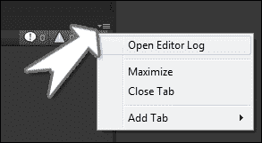
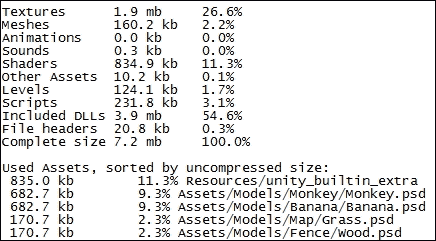
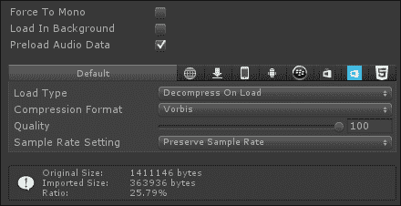
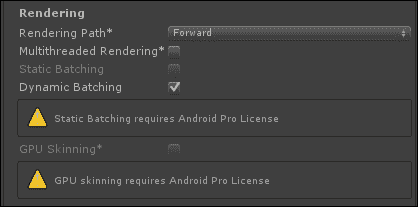
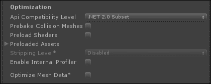
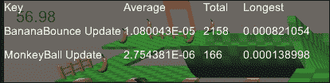
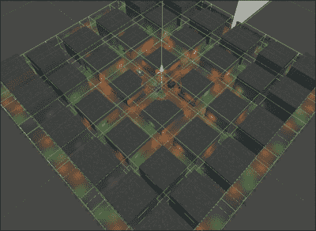
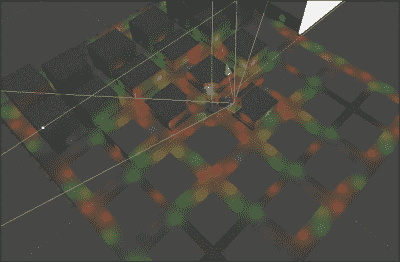

# 第九章。最佳化

在前一章中，我们了解了游戏的特效。我们给我们的猴球游戏添加了背景音乐。我们还为我们的猴子创造了灰尘痕迹。通过结合音频效果和粒子系统，我们在玩家收集香蕉时制造了爆炸。总之，这些完善了游戏体验，给我们一个非常完整的游戏外观。

在这一章中，我们探讨了我们的优化选项。我们从查看应用程序占用空间以及如何减少它开始。然后，我们继续进一步观察游戏的表现。最后，我们探索一些可能导致滞后的关键领域，并研究如何将它们的影响降至最低。

在本章中，我们将涵盖以下主题:

*   最小化应用程序占用空间
*   跟踪性能
*   最小化滞后
*   遮挡剔除

在这一章，我们将同时进行猴子球和坦克战游戏。从开启猴球项目开始这一章。

# 最小化应用程序占用空间

游戏成功的关键之一是游戏本身的大小。许多用户会很快卸载任何看起来不必要大的应用程序。此外，所有的移动应用商店都会根据应用程序本身的大小来限制如何向用户提供游戏。熟悉最小化游戏大小的选项是控制游戏分布的关键。

当致力于最小化足迹时，首先要注意的是 Unity 在构建游戏时如何处理素材。游戏中实际上只包括在构建场景中某处使用的素材。如果它不在场景本身中或被场景中的资源引用，它将不会被包括在内。这意味着你可以有素材的测试版本，或者不完整的版本；只要它们没有被引用，它们就不会影响你游戏的最终构建大小。

Unity 还允许您将您的素材保持在您处理它们所需的格式。当最终构建完成时，所有的素材都被转换为适合其类型的版本。这意味着您可以将模型保存为建模程序的原生格式，该格式将被转换为 FBX 文件。否则，您可以将图像保存为 Photoshop 文件或您工作时使用的任何其他格式，当游戏构建时，它们将被适当地转换为 JPG 或巴布亚新几内亚。

## 编辑日志

当你终于准备好处理你的游戏足迹时，就有可能找出到底是什么导致你的游戏比预期的要大。在**控制台**窗口的右上角是一个下拉菜单按钮。这个菜单里面是**打开编辑日志**:



编辑器日志是 Unity 运行时输出信息的位置。该文件跟踪关于当前版本的 Unity Editor 的信息，对您的许可证执行任何检查，并包含关于您导入的任何素材的一点信息。日志还将包含游戏中包含的文件大小和素材的详细信息。下面的屏幕截图显示了编辑器日志的一个示例:



在这里，我们可以看到最终构建方面的细分。每个素材类别都有一个大小和总构建大小的百分比。我们还提供了游戏中实际包含的每个素材的列表，在它们被添加到构建之前，按照它们的文件大小进行组织。当您寻找可以变小的素材时，这些信息变得非常有用。

## 素材压缩

在模型、纹理和音频的**导入设置**窗口中，有一些选项会影响导入素材的大小和质量。一般来说，受影响的变化是质量下降。然而，尤其是在为移动设备开发游戏时，在设备上的差异变得明显之前，素材质量可能会降低到远低于计算机所需的水平。一旦你了解了每种类型的素材的可用选项，你将能够就游戏质量做出最佳决策。当使用这些选项中的任何一个时，在引入不需要的工件之前，寻找一个最小化尺寸的设置。

### 车型

不管你用什么程序或方法来创建你的模型，最终，总会有一个顶点位置和三角形的列表，以及一些对纹理的引用。模型的大部分文件大小来自顶点位置列表。为了确保你游戏中的模型是最高质量的，从你选择的建模程序开始。删除所有多余的顶点、面和未使用的对象。这不仅会导致你在构建最终游戏时文件变小，而且还会减少你在编辑器中工作时的导入时间。

模型的**导入设置** 窗口由三个页面组成，从而产生更多调整质量的选项。每个页面选项卡都对应于模型的相关部分，允许您微调每个选项卡。

### 模型选项卡

在 **【模型】**选项卡上，您可以影响网格的导入方式。说到优化模型的使用，这里有许多选项是你成功的关键。一旦你的游戏看起来和玩起来像你想要的那样，你应该总是好好看看这些设置，看看你是否能让它们工作得更好:


以下是**模型**选项卡中的各种设置:

*   **比例因子**和**文件比例**:这些都可以让你控制模型的默认视觉大小。**文件比例**参数是 Unity 在导入模型时计算模型的大小。**比例因子**参数允许您调整 Unity 导入模型时将应用的额外比例。
*   **网格压缩**:该选项允许您选择应该对模型应用多少压缩。压缩效果相当于合并顶点，以减少必须为网格存储的整体细节量。当推得太远时，此设置可能会在网格中引入不希望的奇怪内容。所以，总是选择不引入任何工件的最高设置。
*   **读/写使能**:这个选项只有当你想在游戏运行时通过脚本操纵网格时才有用。如果您从未使用任何脚本接触过网格，请取消选中此框。虽然这不会影响最终的构建大小，但会影响运行游戏所需的内存。
*   **优化网格**:该选项使 Unity 对描述模型的三角形列表重新排序。这个选项总是一个很好的选择。您可能想要取消选中它的唯一原因是，如果您正在根据三角形的特定顺序操纵游戏或网格。
*   **导入混合形状**:混合形状类似于普通动画中的关键帧，但它们作用于网格细节本身，而不是骨骼的位置。通过取消选中此框，您可以节省游戏和项目中的空间，因为 Unity 不需要计算和存储它们。
*   **生成碰撞器**:这个选项几乎都是不勾选的候选项。该选项将为模型中的每个网格添加**网格碰撞器**组件。在你的游戏中处理物理时，这些对撞机的计算成本相对较高。如果可能的话，你应该总是使用一组简单得多的**箱式对撞机**和**球形对撞机**。
*   **交换 UV**:Unity 支持有两套 UV 坐标的模型。一般来说，第一个用于普通纹理，第二个用于对象拥有的任何光照贴图。如果您生成自己的光照贴图紫外线，统一可能会以错误的顺序识别它们。选中此框将强制 Unity 更改它们的使用顺序。
*   **生成光照贴图 UVs** :该选项仅在处理需要静态阴影的对象时使用。如果对象不需要它，这将引入多余的顶点信息并膨胀素材。
*   **法线**:此选项用于计算或导入法线信息。**材质使用法线**来确定顶点或三角形面向的方向，以及光照应该如何影响它。如果网格从不使用需要**法线**信息的材质，请确保将其设置为**无**。
*   **切线**:该选项用于计算或导入切线信息。**切线**被材质用来用凹凸贴图和类似的特效来伪造细节。就像**法线**设置一样，如果不需要，就不要导入。如果**法线**设置为**无**，该设置将自动灰显，不再导入。
*   **平滑角度**:在计算法线时，这个选项可以让你定义两个面之间的角度需要有多接近才能在它们的共享边上平滑着色。
*   **分割切线**:这将导致网格的切线在紫外线中有接缝的地方重新计算。这是用来修复一些照明不规则的高度详细的模型。
*   **保留四边形** : Unity 通常会将所有面转换为三角形进行渲染。如果您使用 DirectX 11 进行渲染，此选项会将您的脸保留为四边形进行镶嵌。
*   **导入材质**:该选项允许您在导入模型时控制是否创建新材质。如果未选中此项，则在导入时不会创建新模型。
*   **材质命名**:这允许您控制导入的模型命名任何创建的新材质的方式。
*   **材质搜索** : Unity 可以使用多种方法在已经创建好的模型上找到要使用的材质。**本地材质文件夹**选项将只查看模型导入位置旁边名为`Materials`的文件夹。**递归向上**选项将在模型的文件夹中查找，并且根素材文件夹通过父级向上。**项目范围内的**选项将在整个项目中搜索具有正确名称的材质。

### 装备选项卡

正如我们在下面的截图中所看到的，对于动画装备来说，调整的选项非常少:


当你在优化你的动画装备时，只有两件事需要记住。首先，如果素材没有动画，那么不要导入它。通过将**动画类型**设置为**无**，Unity 将不会尝试导入装备或任何无用的动画。要记住的第二件事是去除任何不必要的骨头。导入到 Unity 后，从装备中删除对动画或角色没有实际影响的所有对象。Unity 可以将动画中可能使用的任何反向运动学转换为正向运动学，因此 Unity 启动后可以删除用于反向运动学的参考线。

那里的**优化游戏对象**复选框实际上对游戏的整体优化没有帮助。它只是在“层次结构”窗口中隐藏额外的装备对象，因此您不必处理它们。在编辑器中处理复杂的装备时，这个复选框也非常有用。

### 动画选项卡

与**装备**标签一样，如果模型没有动画，不要导入动画。首次导入素材时，取消选中**导入动画**复选框将会阻止任何额外的组件添加到 Unity 中的**游戏对象**组件中。此外，如果任何额外的动画被意外添加到您的最终构建中，它们会很快使您的应用程序变得过大。“动画”选项卡在以下屏幕截图中突出显示:


*   **动漫。压缩**:此选项调整 Unity 处理动画中多余关键帧的方式。对于大多数情况，默认选项效果很好。可用的各种选项如下:
    *   **关闭**:只有需要高精度动画的时候才应该使用这个选项。这是最大和最昂贵的设置选择。
    *   **关键帧减少**:该选项将根据随后的错误设置减少动画使用的关键帧数量。本质上，如果关键帧对动画没有明显的影响，它将被忽略。
    *   **最优**:该选项与前一个选项相同，但它会压缩动画的文件大小。但是，在运行时，动画仍然需要与前一个选项相同数量的处理器资源进行计算。
*   **旋转误差**:该选项是执行关键帧缩小时将被忽略的关键帧之间的度数差。
*   **位置误差**:此选项是执行关键帧缩小时关键帧之间将被忽略的移动距离。
*   **缩放误差**:该选项是执行关键帧缩小时，在关键帧之间将忽略的动画中的大小调整量。

### 纹理

很难想象一款高质量的游戏里面没有一大堆图片。纹理有很多选项来控制在游戏中使用时会保留多少细节。一般来说，最好选择不会在图像中引入明显伪像的最低质量设置。此外，最好使用 2 的幂的纹理大小来提高处理速度。此外，很少有处理器能够处理尺寸大于`1024`像素的纹理。通过将您的图像放在这个大小或以下，您可能会在最终游戏中节省大量内存和空间。


*   **纹理类型**:该选项影响图像将被视为何种类型的纹理。最好选择最适合图像预期用途的类型。以下选项显示了可以使用的各种类型的纹理:
    *   **纹理**:这个选项是处理 3D 游戏时最常见也是默认的设置。这应该用于你的正常模型纹理。
    *   **普通贴图**:此选项用于凹凸贴图等特效。使用这种类型纹理的材质还需要模型导入设置中的法线和切线信息。
    *   **编辑器 GUI 和 Legacy GUI** :除非是使用特殊的编辑器脚本，或者其他特殊情况，否则不会使用这个设置。这与**雪碧**设置非常相似。
    *   **雪碧(2D 和 UI)** :这个选项是使用 2D 游戏时最常见也是默认的设置。这应该总是用于您的平面 2D 字符和用户界面元素。
    *   **光标**:这个设置和我们的安卓平台不是特别相关。它允许你创建定制的鼠标指针，这在大多数安卓设备上是不常见的。
    *   **立方体贴图**:当您使用自定义反射或天空框类型的材质时，您的图像应该使用该选项。这将自动环绕图像，因此它像球体或立方体的边缘一样重复。
    *   **Cookie** :这些纹理用在灯光上，它们会改变灯光从灯光对象发出的方式，就像我们用于坦克前灯的纹理一样。
    *   **光照贴图**:我们在坦克战游戏中使用了 Unity 的光照贴图系统。然而，这个系统并不总是适用于所有情况。因此，当您在 Unity 之外制作自定义光照贴图时，请选择此选项。
    *   **高级**:这个选项可以让你完全控制与导入图像相关的所有设置。只有当你对你的纹理有特殊目的或者你需要精确控制它们时，你才需要这个设置。
*   **读/写启用**:当**纹理类型**设置为**高级**时，此复选框可用。只有当你计划在游戏运行时从你的脚本中操作纹理时，这才应该被选中。如果未选中此项，Unity 不会在 CPU 中维护数据副本，从而为游戏的其他部分释放内存。
*   **生成纹理贴图**:这个选项是另一个**高级**设置，可以让你控制创建更小版本的纹理。然后，当纹理在屏幕上很小时，就使用它们，减少了在屏幕上绘制纹理和使用它的对象所需的处理量。
*   **过滤模式**:该选项适用于所有纹理类型。当你非常靠近它时，它会影响图像的外观。**点**将使图像看起来像块状，而**双线性**和**三线性**将模糊像素。一般来说，**点**是最快的模式；**三线性**是最慢的模式，但效果最好。
*   **最大尺寸**:这个选项可以调整图像在游戏中使用时的大小。这允许您处理非常大的图像，但以适当的小尺寸将它们导入 Unity。总的来说，大于 **1024** 的值是糟糕的选择，不仅因为内存需求增加，而且因为大多数移动设备根本无法处理更大的纹理。一般来说，1024 大小的纹理应该保留给你的主要角色和其他非常重要的对象。对于重要性中等或较低的对象，256 的大小在移动设备上运行良好。对于您的所有对象，如果您可以组合它们的纹理来共享一个 1024 纹理，它们对您的游戏的影响将比它们有小的单独纹理时小。选择尽可能小的尺寸会对最终构建中纹理的足迹大小产生很大影响。
*   **格式**:该选项调整图像的导入方式以及每个像素可以容纳多少细节。**压缩**是最小的格式，而**真彩**提供了最多的细节。

### 音频

给游戏质量的声音总是增加了游戏的最终尺寸。这是一个游戏离不开的素材之一，但在合适的水平上很难包括在内。在处理音频程序中的声音时，请尽可能缩短声音以最小化声音大小。此外，请记住，您的大多数播放器不会有相同的花哨耳机或扬声器来收听您的音频，因此质量可能会在他们注意到任何差异之前降低到相当大的程度。音频导入设置都会影响它们在构建大小中的足迹或运行游戏所需的内存。



*   **强制为单声道**:该设置将多声道音频转换为单声道。虽然大多数设备在技术上能够播放立体声，但它们并不总是拥有让其发挥作用所需的多个扬声器。选中此框可以通过将所有通道组合成一个更小的通道来显著减小音频的文件大小。多通道音频文件用于根据声音来自哪个扬声器产生方向错觉。这基本上需要每个扬声器有单独的声音文件。单声道音频文件对所有扬声器使用相同的声音文件，因此在游戏中需要更少的数据和空间。
*   **后台加载**和**预加载音频数据**:这两个设置共同定义何时加载音频信息并准备播放。**后台加载**参数决定游戏是否在加载任何其他游戏数据之前等待文件加载。对于长文件或大文件，如背景音乐，选中此框是一个好主意。**预加载音频数据**参数决定是否应该尽快加载文件。您马上需要的任何音频剪辑都应该选中此选项。
*   **加载类型**:这个设置会影响游戏运行时会使用多少系统内存来处理音频文件的加载。**加载时解压**选项使用最大内存，最适合小而短的声音。**压缩在内存中**选项仅在文件播放时解压缩文件，使用中等大小的内存，最适合中等大小的文件。**流**选项意味着只有当前正在播放的文件部分存储在运行时内存中。这就像从互联网上流式传输视频或音乐。此选项最适合大型文件，但一次只能由少数人使用。
*   **压缩格式**:这个决定对音频文件应用什么样的数据缩减，使其足够小，可以包含在游戏中。 **PCM** 格式将保留大部分原始音频，因此将是最大的文件大小。 **ADPCM** 格式会给你中等程度的压缩，但也会因此降低一些质量。 **Vorbis** 格式可以为您提供尽可能小的文件大小，但代价是最大程度地降低质量。
*   **质量**和**采样速率设置**:这些控制了当您从上一个选项应用压缩时将保留的细节量。如果文件大小仍然太大，您可以降低整体质量，使其在可接受的范围内。然而，这里降低质量是以音质为代价的。在目标设备上引入和听到伪像之前，请始终寻找尽可能低的设置。

## 玩家设置

进入 Unity 的工具栏，导航至**编辑** | **项目设置** | **玩家**，打开游戏的**玩家设置**窗口。在安卓平台特定的设置中，我们在**其他设置**下还有另外几个选项会影响我们游戏的最终大小和速度。

### 渲染

**渲染**组设置控制你的游戏如何处理在屏幕上绘制你的游戏。这控制使用的照明和阴影计算的种类。它还允许你优化计算的数量，以绘制构成游戏场景的许多对象。**渲染**窗口如下图所示:



在**渲染**窗口中看到的设置如下:

*   **渲染路径**:这组选项主要控制灯光和阴影的渲染质量。**渲染路径**下的选项如下:
    *   **前进**:这将是你最常用的设置。它支持来自单一方向光线的实时阴影。此选项是您在 Unity 中渲染光线的正常基线。
    *   **延迟**:这是要给你最高质量的光影，但是系统处理的成本最高。不是每个系统都能够支持它，它恰好是 Unity Pro 独有的功能。
    *   **遗留顶点点亮**:这个渲染方式是老系统的一部分。这也是最便宜的加工方法。该方法没有实时阴影，光照计算高度简化。旧机器和移动设备将默认使用此模式。
    *   **遗留延期(轻前置)**:这个方法也是老系统的一部分。较新的`Deferred`方法比这个方法有很大的改进，一般来说，不应该使用这个方法。只有当您有特殊情况或需要支持特定平台时，才需要选择此方法。
*   **多线程渲染**:用来运行程序的过程和一系列步骤称为线程。可以启动许多这样的线程，让它们同时在程序的不同部分工作。Unity 利用了编程的这一特性来提高渲染系统的速度和质量。然而，它需要更强大的处理器才能有效运行。
*   **静态批处理**:这是 Unity Pro 的一项功能，通过对在**检查器**中标记为静态的相同对象进行分组，Unity 可以显著加快渲染速度。然后，对于每个组，它在多个位置呈现一个对象，而不是单独呈现每个对象。有可能，这个设置会给你的最终构建尺寸增加一些额外的围长，因为 Unity 需要保存关于静态对象的额外信息来完成这个工作。
*   **动态配料**:这与**静态配料**的工作方式相同，但有两个主要区别。首先，它对 Unity Pro 和 Basic 用户都可用。其次，它对没有标记为静态的对象进行分组。
*   **GPU 蒙皮**:这个设置对于比较老的移动设备来说不太适用，对于最新的移动设备以及其他既有 CPU 又有 GPU 的系统来说用的比较多。这使得通常在网格上进行的计算(由骨骼产生动画和变形)可以在图形处理器上进行，而不是在中央处理器上进行。这将释放资源来处理游戏的其他部分，并给你的玩家最好的体验。

### 优化

**优化**组设置允许您调整 Unity 编译项目和相关素材的方式。当你接近游戏的最终版本时，每个设置都应该被仔细考虑。总之，这些设置有可能对你的游戏运行产生巨大的影响。**优化**窗口如下图所示:



*   **Api 兼容级别**:该设置决定了。NET 函数包含在最终版本中。**。Net 2.0** 选项将包含所有可用的功能，占用空间最大。**。Net 2.0 子集**选项是函数的一小部分，只包括您的编程最可能使用的函数。除非你需要一些特殊的功能，**。Net 2.0 子集**选项应该永远是你选择的选项。
*   **预烘焙碰撞网格**:通过将物理计算从场景加载移动到游戏构建，该框可以节省加载关卡的时间。这意味着您的构建大小会很大，但处理速度会降低。
*   **预加载着色器**:当一个网格使用了一个游戏场景中尚未使用的新着色器时，系统需要处理并计算该着色器将如何渲染对象。这个盒子会在场景开始时处理这些信息，并在它试图进行计算时避免游戏中潜在的停顿。
*   **预加载的资源**:这个选项和上一个选项做了同样的事情，但是针对的是资源和预置，而不是着色器。当您第一次实例化一个对象时，它需要被加载到内存中。这将改变它，以便在场景开始时加载该列表中的所有资源。
*   **剥离等级**:该设置是 Unity Pro 独有的功能。它允许您通过在编译之前移除所有多余的代码来减少最终构建的大小。为了便于参考，系统功能被分组到所谓的库中。**条带组件**选项从最终构建中移除未使用的库。**使用 micro mscorlib** 选项执行与前一选项相同的功能，但使用了最小化的库形式。虽然这个库非常小，但是它拥有更少的函数供您的代码使用。然而，除非你的游戏很复杂，否则这应该不会有什么不同。
*   **启用内部探查器**:该选项允许您检索关于您的游戏如何在设备上运行的信息。它确实在你的游戏运行时给处理信息引入了一点开销，但是效果比 Unity Editor 引入的要差。可以使用命令提示符中的`adb logcat`命令检索信息。
*   **优化网格数据**:该设置将从所有没有被应用到它们的任何材质使用的网格中移除额外的信息。这包括**法线**、**切线**，以及其他一些信息。它还会导致组成网格的三角形数据被重新排序，以实现最佳处理和渲染。除非你有一个非常特殊的情况，这是一个很好的选择。

# 跟踪性能

Unity 为我们提供了许多工具，让我们能够确定我们的游戏运行得有多好。我们将介绍的第一个工具对 Unity Pro 和 Basic 用户来说都是现成的。然而，信息相当有限，尽管它仍然有用。第二个工具仅适用于 Unity Pro 用户。它提供了更多关于性能的细节和信息。最后，我们将创建自己的工具，允许我们详细查看脚本的性能。

## 编辑统计

在**游戏**窗口的右上角有一个标有**统计**的按钮。点击这个按钮会打开一个窗口，它会告诉我们游戏是如何运行的，需要多长时间来处理。这个窗口中的大部分信息都与游戏的渲染效果有关，主要包括屏幕上当前有多少对象，有多少动画，以及它们占用了多少内存。此外，还有一些关于游戏中的声音和任何可能出现的网络流量的信息。以下截图显示了**状态**选项卡:


*   **音频**部分关注场景中播放的各种音频片段。它包含了关于你的游戏有多吵以及需要多少内存来处理这一切的信息。**音频**部分包含以下细节:
    *   **等级**:这就是你游戏的分贝有多响。它实际上只是一种特殊形式的音量测量，代表游戏中播放的每个音频片段的总和。
    *   **DSP 负载**:这是你场景中处理数字音频片段的成本。它表示为游戏使用的内存百分比。
    *   **剪辑**:这是你的音频文件因为系统过载而没有播放的百分比。根据设备处理器的功率，设备一次只能播放有限数量的音频片段。根据**音频源**组件的**检查器**面板中的优先级设置，任何额外的音频剪辑都会被忽略。
    *   **流加载**:这是处理任何必须在播放时流式传输的音频所涉及的成本。这也是所用内存的百分比。
*   **图形**部分涉及游戏的渲染和渲染所需的内存。它包含有关游戏运行速度、渲染多少对象以及对象详细程度的信息。大多数时候，当使用**统计**窗口时，你会看到这个部分。该组标题右侧的 **FPS** 值是对游戏运行速度的极好估计。这是一秒钟内正在处理的帧数，后面是处理一帧游戏所需的毫秒数。**图形**部分包括以下细节:
    *   **CPU** :本节分解为两部分。**主要的**部分是处理用于运行游戏的代码需要多长时间。**渲染线**是在屏幕上绘制游戏的所有部分所需的时间。一起，你可以得到一个好主意，什么是在你的游戏中花费最多时间运行。
    *   **批处理**:使用**静态**或**动态批处理**时，在**玩家设置**的**渲染**组中，第一个数字表示为批处理渲染过程创建了多少组，**通过批处理保存的**值是由于批处理过程而避免的绘制调用的数量。保存越多意味着在屏幕上绘制游戏的工作量越少。
    *   **Tris** :最终 3D 图形中的每一个模型都是由一系列的三角形组成的。该值是场景中摄像机看到和渲染的三角形总数。更少的三角形意味着图形过程需要做更少的工作来在屏幕上绘制模型。
    *   **Verts** :模型文件中的大部分信息都与每个顶点的世界位置、法线方向和纹理位置有关。该值是摄像机看到和渲染的顶点总数。每个模型的顶点数量越少，计算渲染的速度就越快。
    *   **屏幕**:这是**游戏**窗口的当前宽度和高度，以像素为单位。它还显示以该大小渲染所需的内存量。较小的尺寸导致游戏的细节较少，但也使游戏更容易渲染。
    *   **SetPass 调用**:这本质上是需要调用着色器的不同部分来在屏幕上绘制场景中的所有内容的次数。它更多地基于场景中不同材质的数量，而不是对象的数量。
    *   **阴影施法者**:这个统计是在你使用实时阴影的时候使用的。实时阴影很贵。如果可能，它们不应在移动设备上使用。但是，如果你必须拥有它们，尽量减少投射阴影的对象的数量。限制它移动足够大的对象，让用户看到阴影。小型静态物体尤其不需要投射阴影。
    *   **可见蒙皮网格**:这是当前在摄像机视图中的操纵对象的总数。蒙皮网格通常是你的角色，也是其他任何动画。它们比静态网格渲染更昂贵，因为需要额外的计算来使它们随着动画移动和改变。
    *   **动画**:这只是场景中播放的动画总数。
*   **网络**统计组只有在多人游戏中连接到其他玩家时才可见。这些信息通常相当于游戏连接了多少人，以及这些连接有多快。

## 轮廓仪

通过导航到**窗口|探查器**，可以在统一的工具栏中找到 **探查器**窗口，这是一个分析游戏运行情况的很好的工具。它为我们提供了一个丰富多彩的系统各部分的细分，以及它正在做多少工作。这个工具唯一真正不幸的地方是它只对 Unity Pro 用户可用。 **Profiler** 窗口如下图所示:


首先打开 **Profiler** 窗口，然后我们可以在窗口中玩我们的游戏，看着工具给我们一个关于正在发生的事情的相当详细的分解。我们可以点击任何一点，在窗口底部看到关于该框架的详细信息。提供的信息是针对你点击的点的，比如 **CPU 使用率**、**渲染**、**内存**等等。

当我们试图找到游戏中耗时过长的部分时， **CPU 使用率**信息特别有用。加工成本的激增很容易凸显出来。通过点击一个尖刺，我们可以看到游戏的每个部分在使该帧昂贵方面所做的细分。对于这些部分中的大部分，我们可以深入了解导致问题的确切对象或功能。然而，我们只能进入功能层面。仅仅因为我们知道代码中的问题通常在哪里，**分析器**窗口不会告诉我们该函数的哪个部分导致了问题。

为了实际工作，剖析器需要连接到游戏的每个部分。这在你的游戏速度上引入了一点额外的成本。因此，在分析所提供的信息时，最好考虑相对成本，而不是将每个成本作为一个精确的值。

## 跟踪脚本性能

Unity 提供的所有这些工具都很棒，但它们并不总是正确的解决方案。统一基本用户无法访问**探查器**窗口。此外，**轮廓仪**和**编辑统计**都相当一般化。我们可以通过 **Profiler** 获得更多一点的细节，但是的信息并不总是足够的，如果你不需要浏览一堆菜单的话。在下一部分中，我们将创建一个特殊的脚本，它能够跟踪任何脚本的特定部分的性能。它绝对应该成为开发人员工具包中的常规部分。让我们使用这些步骤在我们的猴球游戏中创建脚本:

1.  首先，我们需要一个特殊的类来记录我们的性能统计数据。为此，创建一个新的脚本并将其命名为`TrackerStat`。
2.  为了开始这个脚本，我们需要启用与各种图形用户界面元素交互的能力。转到脚本的最上面，在以`using` :

    ```java
    using UnityEngine.UI;
    ```

    开头的其他行旁边添加这一行
3.  Next, we need to change the class definition line. We do not want or need to extend the `MonoBehaviour` class. So, find the following line of code:

    ```java
    public class TrackerStat : MonoBehaviour {
    ```

    并且，将其更改为以下代码:

    ```java
    public class TrackerStat {
    ```

4.  这个脚本从四个变量开始。第一个变量将被用作一个 ID，允许我们通过提供不同的键值来同时跟踪多个脚本。第二个变量将跟踪被跟踪的代码位将花费的平均时间。第三个变量只是被跟踪代码被调用的总次数。第四个变量是代码执行所用的最长时间:

    ```java
    public string key = "";
    public float averageTime = 0;
    public int totalCalls = 0;
    public float longestCall = 0;
    ```

5.  接下来，我们还有两个变量。这些将完成实际跟踪脚本执行时间的工作。第一个变量包括跟踪开始的时间。第二个变量是标记跟踪已经开始的标志。

    ```java
    public float openTime = 0;
    public bool isOpen = false;
    ```

6.  该脚本的第三批也是最后一批变量用于存储对文本对象的引用，这些对象将实际显示我们的统计信息:

    ```java
    private Text averageLabel;
    private Text totalLabel;
    private Text longestLabel;
    ```

7.  这个脚本的第一个功能是`Open`。当我们想要开始跟踪一点代码时，调用这个函数。它首先检查代码是否已经被跟踪。如果是，则使用`Debug.LogWarning`向**控制台** 窗口发送警告。接下来，它设置标记代码被跟踪的标志。最后，该函数通过使用`Time.realtimeSinceStartup`来跟踪其被调用的时间，该时间包含游戏开始后的实际秒数。

    ```java
    public void Open() {
      if(isOpen) {
        Debug.LogWarning("Tracking is already open. Key: " + key);
      }

      isOpen = true;
      openTime = Time.realtimeSinceStartup;
    }
    ```

8.  下一个功能`Close`与上一个功能相反。当我们到达我们想要跟踪的代码的末尾时，它被调用。跟踪应该停止的时间传递给它。这样做是为了尽量减少执行多余的代码。与前面的函数一样，它检查跟踪是否正在进行，并发出另一个警告，如果函数没有被跟踪，则提前退出。接下来，`isOpen`标志通过设置为`false`来清除。最后，计算追踪开启后的时间，并调用`AddValue`功能。

    ```java
    public void Close(float closeTime) {
      if(!isOpen) {
        Debug.LogWarning("Tracking is already closed. Key: " + key);
        return;
      }

      isOpen = false;
      AddValue(closeTime – openTime);
    }
    ```

9.  `AddValue`函数被传递给`callLength`，这是被跟踪的代码位所花费的时间长度。然后它使用一些计算来增加`averageTime`的价值。接下来，如果新值大于当前值，该功能将当前值`longestCall`与新值进行比较并更新。然后，功能递增`totalCalls`，最后用新值更新屏幕上的文本。

    ```java
    public void AddValue(float callLength) {
      float totalTime = averageTime * totalCalls;
      averageTime = (totalTime + callLength) / (totalCalls + 1);

      if(longestCall < callLength) {
        longestCall = callLength;
      }

      totalCalls++;

      averageLabel.text = averageTime.ToString();
      totalLabel.text = totalCalls.ToString();
      longestLabel.text = longestCall.ToString();
    }
    ```

10.  我们脚本的最后一个函数`CreateTexts`在我们第一次创建这个类的实例来跟踪一些代码时被调用。它首先计算图形用户界面元素的垂直位置。通过使用我们将在下一个脚本中创建的`ScriptTracker.NewLabel`功能，我们可以为自己节省一些工作；它自动处理显示状态信息所需的文本对象的创建和基本设置。我们只需要传递一个名称给它，在**层次**窗口中使用它，并在它给我们新对象时设置位置和大小。

    ```java
    public void CreateTexts(int position) {
      float yPos = -45 – (30 * position);

      Text keyLabel = ScriptTracker.NewLabel(key + ":Key");
      keyLabel.text = key;
      keyLabel.rectTransform.anchoredPosition = new Vector2(75, yPos);
      keyLabel.rectTransform.sizeDelta = new Vector2(150, 30);

      averageLabel = ScriptTracker.NewLabel(key + ":Average");
      averageLabel.rectTransform.anchoredPosition = new Vector2(200, yPos);
      averageLabel.rectTransform.sizeDelta = new Vector2(100, 30);

      totalLabel = ScriptTracker.NewLabel(key + ":Total");
      totalLabel.rectTransform.anchoredPosition = new Vector2(200, yPos);
      totalLabel.rectTransform.sizeDelta = new Vector2(100, 30);

      longestLabel = ScriptTracker.NewLabel(key + ":Longest");
      longestLabel.rectTransform.anchoredPosition = new Vector2(200, yPos);
      longestLabel.rectTransform.sizeDelta = new Vector2(100, 30);
    }
    ```

11.  接下来，我们需要创建另一个新的脚本，并将其命名为`ScriptTracker`。这个脚本将允许我们进行实际的性能跟踪。
12.  就像我们对上一个脚本所做的那样，我们需要在脚本的最顶部添加一个新的行，紧挨着其他的`using`行，这样脚本就可以创建 GUI 对象并与之交互:

    ```java
    using UnityEngine.UI;
    ```

13.  这个脚本从一个变量开始。此变量维护当前正在跟踪的所有统计信息。注意这里`static`的用法；它允许我们从游戏中的任何地方轻松更新列表:

    ```java
    private static TrackerStat[] stats = new TrackerStat[0];
    ```

14.  这个脚本的第一个函数`Open`允许我们开始跟踪代码的执行。它使用`static`标志，所以任何脚本都可以轻松调用该函数。一个`key`值被传递给函数，允许我们对呼叫进行分组跟踪。该函数首先创建一个变量来保存开始跟踪的 stat 的索引。接下来，它在当前的一组统计数据中循环寻找一个匹配的`key`值。如果找到一个，则`index`变量用该值更新，并退出循环。

    ```java
    public static void Open(string key) {
      int index = -1;

      for(int i=0;i<stats.Length;i++) {
        if(stats[i].key == key) {
          index = I;
          break;
        }
      }
    ```

15.  `Open`功能通过检查是否找到一个状态来继续。只有当我们遍历当前统计的整个循环，并且找不到匹配的`key`时，`index`变量才会小于零。如果没有找到，我们首先检查统计列表是否为空，如果为空，我们通过调用`CreateLabels`函数创建一些显示标签。然后我们调用`AddNewStat`来设置新的状态进行跟踪。我们将很快创建这两个函数。`index`然后设置为新状态。最后，使用 stat 的`Open`功能触发 stat 开始跟踪。

    ```java
      if(index < 0) {
        if(stats.Length <= 0) {
          CreateLabels();
        }

        AddNewStat(key);
        index = stats.Length – 1;
      }

      stats[index].Open();
    }
    ```

16.  `AddNewStat`功能是传递要创建的统计的键。它首先将统计列表存储在一个临时变量中，并将统计列表的大小增加一。然后，每个值从临时列表转移到更大的统计列表。最后，创建一个新的统计，并将其分配到统计列表中的最后一个位置。然后，设置`key`并调用其`CreateTexts`功能，以便在屏幕上显示。

    ```java
    private static void AddNewStat(string key) {
      TrackerStatp[] temp = stats;
      stats = new TrackerStat[temp.Length + 1];

      for(int i=0;i<temp.Length;i++) {
        stats[i] = temp[i];
      }

      stats[stats.Length – 1] = new TrackerStat();
      stats[stats.Length – 1].key = key;
      stats[stats.Length – 1].CreateTexts(stats.Length – 1);
    }
    ```

17.  接下来，我们有`Close`功能。这个函数被传递要关闭的 stat 的键值。它从查找调用函数的时间开始，最大限度地减少将要跟踪的多余代码量。它继续在统计列表中循环寻找匹配的`key`。如果找到一个，则调用 stat 的`Close`函数并退出该函数。如果未找到匹配项，则调用`Debug.LogError`向**控制台**窗口发送错误消息。

    ```java
    public static void Close(string key) {
      float closeTime = Time.realtimeSinceStartup;

      for(int i=0;i<stats.Length;i++) {
        if(stats[i].key = key) {
          stats[i].Close(closeTime);
          return;
        }
      }

      Debug.LogError("Tracking stat not found. Key: " + key);
    }
    ```

18.  `CreateLabels`功能处理屏幕上文本标签的创建，因此我们可以很容易地告诉显示的每一位信息是什么意思。就像我们之前的脚本一样，它使用`NewLabel`函数来处理文本对象的基本创建，向它传递一个要在**层次结构**窗口中显示的名称。然后，它设置要在屏幕上显示的文本，将其沿屏幕左上角放置，并设置其大小。

    ```java
    private static void CreateLabels() {
      Text keyLabel = NewLabel("TrackerLabel:Key");
      keyLabel.text = "Key";
      keyLabel.rectTransform.anchoredPosition = new Vector2(75, -15);
      keyLabel.rectTransform.sizeDelta = new Vector2(150, 30);

      Text averageLabel = NewLabel("TrackerLabel:Average");
      averageLabel.text = "Average";
      averageLabel.rectTransform.anchoredPosition = new Vector2(200, -15);
      averageLabel.rectTransform.sizeDelta = new Vector2(100, 30);

      Text totalLabel = NewLabel("TrackerLabel:Total");
      totalLabel.text = "Total";
      totalLabel.rectTransform.anchoredPosition = new Vector2(275, -15);
      totalLabel.rectTransform.sizeDelta = new Vector2(50, 30);

      Text longestLabel = NewLabel("TrackerLabel:Longest");
      longestLabel.text = "Longest";
      longestLabel.rectTransform.anchoredPosition = new Vector2(350, -15);
      longestLabel.rectTransform.sizeDelta = new Vector2(100, 30);
    }
    ```

19.  这个脚本的最后一个静态函数是`NewLabel`函数。它处理我们在脚本的其余部分中使用的每个文本对象的基本创建。它首先尝试找到画布对象，如果找不到，则创建一个新对象。为了使用我们的文本对象，我们需要画布，这样它们就可以被真实地绘制出来。

    ```java
    public static Text NewLabel(string labelName) {
      Canvas canvas = GameObject.FindObjectOfType<Canvas>();
      if(canvas == null) {
        GameObject go = new GameObject("Canvas");
        go.AddComponent<RectTransform>();
        canvas = go.AddComponent<Canvas>();
      }
    ```

20.  接下来，`NewLabel`函数使用传递给它的名称创建一个新的**游戏对象**，并使其成为画布的子对象。然后，它添加了`RectTransform`组件，这样它就可以在 2D 空间中定位自己，并将其固定在左上角。然后，文本对象被赋予一个`CanvasRenderer`组件，这样它就可以在屏幕上实际绘制，以及一个`Text`组件，这样它就实际上是一个文本对象。然后，我们使用`Resources.GetBuiltinResource`函数为文本对象抓取 Unity 的默认`Arial`字体，然后将其返回给函数的调用者。

    ```java
    GameObject label = new GameObject(labelName);
    label.transform.parent = canvas.transform;

    RectTransform labelTrans = label.AddComponent<RectTransform>();
    labelTrans.anchorMin = Vector2.up;
    labelTrans.anchorMax = Vector2.up;

    label.AddComponent<CanvasRenderer>();
    Text textComp = label.AddComponent<Text>();
    textComp.font = Resources.GetBuiltinResource(typeof(Font), "Arial.ttf") as Font;
    return textComp;
    }
    ```

21.  要测试这些脚本，请打开您的`BananaBounce`脚本。在`Update`功能开始时，添加以下一行开始跟踪运行时间:

    ```java
    ScriptTracker.Open("BananaBounce Update");
    ```

22.  在`Update`函数的端，我们需要用同一个键调用`Close`函数:

    ```java
    ScriptTracker.Close("BananaBounce Update");
    ```

23.  Finally, start the game and take a look at the results (shown in the following screenshot):

    

我们创建了一个工具来测试代码的特定部分。通过在对函数的调用中包装任何一位代码，并发送一个唯一的标识，我们可以确定执行代码需要多长时间。通过平均对脚本的调用并包装代码的不同部分，我们可以准确地确定脚本的哪些部分需要最长的时间来完成。我们还可以找出代码的部分是否被调用过多次。这两种情况都是最大限度减少处理和延迟的理想点。

在部署游戏之前，请务必删除对该工具的任何引用。如果留在最后一级，会给 CPU 增加不必要的负载。这种对游戏的不利影响可能会使游戏无法进行。始终记得清除专门用于编辑器调试的工具的任何使用。

# 最小化滞后

滞后是用来描述比预期慢的应用程序的模糊概念之一。它是应用程序帧速率中最常见和最容易识别的。大多数游戏的运行速度约为 60 FPS，如果下降到 30 FPS 或更低，则被认为是落后的。然而，滞后及其问题更深层次，包括输入响应、互联网连接和文件读/写等问题。作为开发人员，我们不断与提供最高质量的体验作斗争，同时保持用户期望的速度和响应能力。它本质上相当于用户设备上的处理器是否能够处理提供游戏体验的成本。游戏中几个简单的对象会导致快速处理，但几个复杂的对象需要最多的处理。

## 闭塞

遮挡非常适合有很多物体的游戏。在它的基本形式中，任何在摄像机侧面或后面的东西都不会被看到，因此也不会被画出来。在 Unity Pro 中，我们可以设置遮挡剔除。这将计算相机实际能看到什么，而不会绘制任何被遮挡的东西。使用这些工具时必须达到一个平衡。计算看不见的东西的成本需要低于仅仅绘制对象的成本。一个场景渲染可能需要多长时间，没有确切的数字。这完全取决于您选择的渲染设置以及模型和纹理中的细节。根据经验，如果你有许多小物体经常被大物体挡住视线，遮挡剔除是正确的选择。

我们将在坦克战游戏中增加遮挡剔除，因为它是唯一一个有足够大的东西来定期阻挡物体的游戏。让我们按照以下步骤进行设置:

1.  现在打开坦克战游戏。如果你完成了挑战，并添加了额外的碎片和障碍，这一部分将对你特别有效。
2.  进入统一工具栏打开遮挡窗口，导航至**窗口** | **遮挡剔除**。该窗口是您修改游戏中与遮挡相关的各种设置的主要访问点。不幸的是，这是 Unity Pro 独有的功能。如果您试图在 Unity Basic 中打开窗口，这只会导致在**控制台**中出现错误信息。
3.  Switch to the **Bake** page and we can take a look at the options associated with occlusion culling:

    

    *   **最小封堵器**:这个要设置成能挡住其他东西看不见的最小东西的大小。像大石块和房子这样的东西是很好的封堵器。较小的东西，如家具或书籍，通常太小，无法阻挡任何重要的东西。
    *   **最小空洞**:这是你场景中可以看到其他物体的最小空隙。较小的值需要更详细的计算。较大的值成本较低，但更有可能导致对象在玩家移动时闪烁。
    *   **背面阈值**:该设置会导致系统对可能在其他物体内部的物体进行额外检查。`100`值表示不进行检查，节省计算时间。`5`的值将需要大量的额外计算，以找出所有东西彼此之间的关系。
4.  对于我们此时的目的，默认值将正常工作。理想情况下，您希望找到在降低渲染成本和计算应渲染内容的成本之间取得平衡的设置。
5.  为了使遮挡系统与动态对象一起工作，我们需要设置多个遮挡区域。要创建它们，创建一个空的**游戏对象**并添加一个**遮挡区域**组件，通过导航到**组件** | **渲染** | **遮挡区域**可以在 Unity 的工具栏中找到该组件。
6.  You will need to create and manipulate several of these objects. They need to cover the whole area where any dynamic objects and the camera can be located. To this end, create and position enough areas to cover the streets of our game. Their size can be edited just as when working with the **Box Collider** components. You can also use the little cylinders on each side of the area to manipulate the field. Be sure to make them tall enough to cover all of your targets (as you can see in the following screenshot):

    

7.  接下来，点击**遮挡**窗口底部的**烘焙** 。统一编辑器的右下角会出现一个进度条，告诉你计算需要多长时间。这个过程通常需要很长时间，尤其是当你的游戏变得越来越复杂的时候。对于我们简单的坦克战游戏来说，这个过程不会花特别长的时间。我们的简单场景中包含的内容很少，应该只需要几秒钟就可以处理完毕。一个充满细节的大级别很容易需要一整天来处理。
8.  When the baking process has completed, the **Occlusion** window would switch to the **Visualization** tab and, if it can be found, the camera should be selected in your **Scene** window. If it is not, select it now. In the **Scene** view, Unity will give us a preview of how occlusion culling is working. Only those objects that can be seen will be visible while the rest will be turned off (as seen in the following screenshot):

    

我们经历了设置遮挡剔除的基本过程。我们看了一下**遮挡**窗口，了解了那里可用的设置。遮挡剔除对于减少场景中的绘制调用数量非常有用。然而，这种减少需要与存储和检索遮挡计算的成本相平衡。这种平衡是通过选择合适的技术和合适的**观察细胞大小**来实现的。现在使用不同的值来寻找一个单元格大小，在不提供太多信息的情况下给出适当的细节。

## 减少滞后的提示

以下是应对和避免游戏延迟的提示列表。并非所有这些都适用于您制作的每一款游戏，但对于每个项目来说，它们都值得牢记:

*   如果可能，在创建材质时避免使用透明度。它们比普通的不透明材质渲染成本更高。此外，如果你避免深度排序，你可以为自己省下一大堆麻烦。
*   每个对象使用一种材质。游戏中的抽奖次数越多，每一帧的渲染时间就越长。每个网格都是针对其上的每个材质绘制一次，即使该材质看起来没有任何作用。通过保持每个对象只有一种材质，尤其是在移动平台上，您可以最大限度地减少绘图调用的次数，并最大限度地提高渲染速度。
*   尽可能组合纹理。不是你制作的每一个纹理都会利用整个图像。只要有可能，将同一场景中对象的纹理结合起来。这最大限度地提高了图像的使用效率，同时减少了最终的构建大小和使用纹理所需的内存量。
*   使用空的**游戏对象**组件将对象分组到您的**层次结构**窗口中。虽然这不是为了最小化延迟，但它会让你的项目更容易处理。尤其是对于大型复杂的关卡，你将能够花更少的时间在场景中搜索对象，而花更多的时间制作一个伟大的游戏。
*   **控制台**窗口是你的朋友。在担心你的游戏不起作用之前，先看看 Unity 中的**控制台**窗口或底部的栏。两者都将显示 Unity 对您的游戏当前设置方式的任何抱怨。这里的信息为你指出了解决任何问题的正确方向。如果您不确定这些消息想要告诉您什么，请在谷歌上搜索该消息，您应该能够从众多 Unity 用户中轻松找到解决方案。如果您的代码看起来不起作用，并且 Unity 没有抱怨，请使用`Debug.Log`功能将消息打印到控制台。这将让您找到代码可能意外退出的地方，或者找到不应该出现的值。
*   设备测试很重要。在编辑器中工作很棒，但是没有什么比在目标设备上测试更好的了。当游戏在设备上运行时，您可以获得更好的游戏体验。编辑器总是引入少量额外的处理开销。此外，您正在使用的计算机将始终比您可能打算在其上部署游戏的移动设备更强大。

# 总结

在本章中，我们了解了 Unity 中的优化选项。我们首先看了游戏中使用的素材的各种设置，这些设置用于在保持质量的同时降低文件大小。接下来，我们了解了一些影响整体游戏的设置。之后，我们探索了跟踪游戏性能的选项。我们首先看了 Unity 提供的一些工具来跟踪性能。然后，我们创建了一个自己的工具来详细跟踪脚本性能。然后我们看了一些在游戏中最小化延迟的选项，包括利用遮挡剔除。现在我们已经知道了所有这些工具和选项，请浏览我们创建的游戏并优化它们。让他们成为最好的自己。

在这本书里，我们学到了很多。我们从学习 Unity、Android 以及如何让它们协同工作开始。我们的旅程继续探索统一的图形用户界面系统，并创建了一个井字游戏。然后，当我们开始创建坦克战游戏时，我们了解了任何游戏所需的基本素材。我们的坦克战游戏随后增加了一些特殊的相机效果和一些照明。我们通过引入一些敌人并让他们追逐玩家来结束坦克战游戏的创建。猴球游戏的创建教会了我们在游戏中可以使用的触摸和倾斜控制。在游戏的短暂休息中，我们看到了《愤怒的小鸟》克隆版的创建，同时了解了物理学以及使用 Unity 2D 管道的选项。然后我们回到猴子球游戏，通过添加声音和粒子效果来完善它。最后，我们的旅程以学习优化我们的游戏而结束。谢谢你读这本书。我们希望您在创建您一直梦想的精彩游戏的同时，享受您在 Unity 和 Android 上的体验。