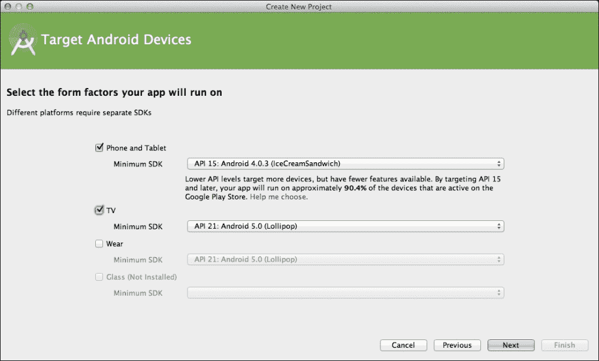
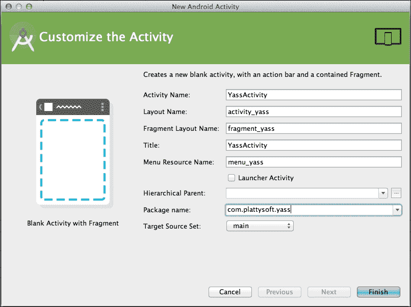
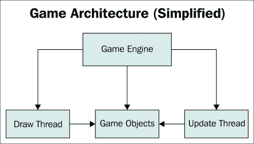
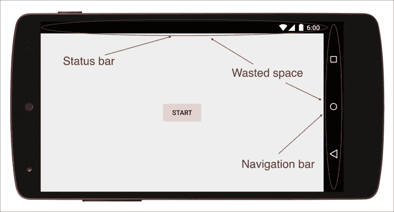
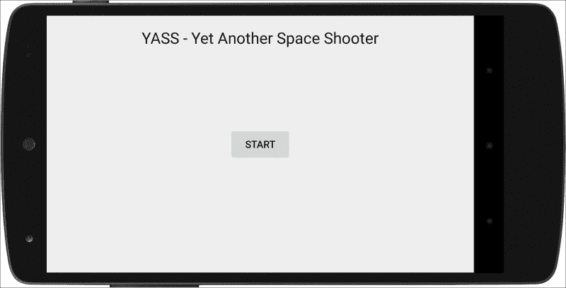
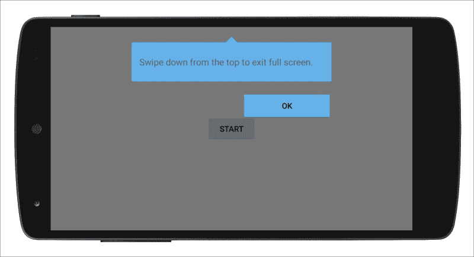

# 一、设置项目

在本章中，我们将描述在游戏中使用安卓软件开发工具包有意义的情况，以及最好使用外部引擎的情况，并解释每种情况的优缺点。

我们将创建一个简单的项目，我们将在整本书中不断改进，直到它成为一个完整的游戏。我们将要制作的特定游戏是一款太空射击游戏。

将做出并解释一些顶层决定，例如使用哪个方向以及我们将如何使用活动和片段。

我们将描述一个游戏引擎的顶层架构，研究它与典型 app 的区别，解释为什么会有`UpdateThread`以及它如何与用户输入交互，为什么会与`DrawThread`分离；我们将在我们的项目中包含这些元素。

一旦游戏引擎完成，我们将展开项目显示暂停对话框，妥善处理安卓回车键，与`Activity`生命周期保持一致，并使其全屏。

最后，我们将总结一些编写游戏代码的最佳实践。

本章将涉及的主题如下:

*   适合游戏的合适工具
*   用Android Studio设置项目
*   游戏架构
*   警报对话框
*   处理后钥匙
*   处理全屏模式
*   游戏开发者的良好实践

# 适合游戏的合适工具

在我们开始进入用安卓软件开发工具包制作游戏的细节之前，让我们先退一步，考虑一下我们为什么要这样做，以及制作一个运行在安卓系统上的游戏有什么其他选择。

人们往往会重新发明轮子，开发人员也经常这样做，尤其是在电子游戏中。虽然从头开始创建一个完整的引擎是一个很好的学习体验，但也需要很多时间。所以，如果你只想做一个游戏，用现有的一个引擎来代替可能更划算。

我们正处于制作电子游戏工具的黄金时代。不仅有很多，而且大多数都是免费的。这使得选择正确的一个有点复杂。

让我们看几个问题来帮助我们决定使用哪种工具来满足特定游戏的需求。既然你已经在读这本书了，我认为多平台在你的优先事项列表中并不重要，重用你现有的 Java 和安卓知识是一个优势。


## 要用 3D 吗？

如果答案是肯定的；我会明确推荐你使用已经存在的发动机。有一些众所周知的任务，你需要实现，以建立甚至最简单的三维引擎，如加载模型，加载和应用纹理，处理转换，以及处理相机。除此之外，你还需要写 OpenGL。所有这些都是大量的工作。

编写一个 OpenGL 引擎就是重新发明轮子的定义。如果你想学习 3D 引擎的内部结构，这很好，但是如果你走这条路，你甚至需要花几个月的时间才能开始游戏。如果你想直接制作游戏，你最好从现有的 3D 引擎开始。

这条路上的第二个问题是:你更喜欢用代码工作，还是更喜欢完整的编辑器？对于代码，可以使用 jPCT-AE 和 libGDX，而在编辑器端，最常见的替代是 Unity。

## 要不要用物理？

对这个问题的肯定回答应该会让你直接找到现有的引擎。

物理模拟是一个非常著名的领域，有很多文档，你应该能够实现自己的物理引擎。同样，这是一个很好的学习体验，但是如果你想直接制作游戏，使用支持物理的现有引擎要方便得多。最常用的物理引擎是 Box2D，它是用 C++ 编写的，并且已经使用 NDK 移植到安卓系统上。

虽然我们将在本书的后面讨论碰撞检测，但物理学已经超出了本书的范围。任何比两个球体碰撞更复杂的事情都可能变得非常难以处理。

同样，这取决于您是更喜欢使用代码，还是想要一个完整的编辑器。要使用代码，AndEngine 应该是您的首选武器。就编辑而言，Corona 和 Unity 是最受欢迎的选择。

## 要不要用 Java？

我们提到的大多数功能丰富的环境都有自己的环境，包括特定的 IDE。学习它们需要付出努力，其中一些使用不同的语言(例如 Unity 有自己的环境并使用 JavaScript 或 C#)。

另一方面，框架更简单。你只需要把它们包括进去，你仍然可以写一个安卓游戏。这是一个有趣的中间地带，在这里你仍然可以重用你的安卓和 Java 知识，并利用物理或 3D 模型等功能。在这一部分，我们可以提到 2D 和物理学的 AndEngine 和 3D 的 jPCT-AE 作为很好的选择。

## 用安卓 SDK 构建游戏的优势

使用安卓软件开发工具包构建游戏有几个优势:

*   构建原型更快
*   你完全控制了发动机
*   它的学习曲线更小(你已经知道安卓、Java 和Android Studio)
*   你的大部分知识都可以应用到应用程序中
*   您可以在本地使用谷歌游戏服务和其他库

## 用安卓软件开发工具包制作游戏的缺点

当然不是一切都很牛逼。有一些严重的缺点，其中大多数已经提到，例如:

*   代码不能移植到其他平台(即 iOS)。
*   性能可能是一个问题。如果游戏达到一定的复杂程度，你可能需要使用 OpenGL。
*   它缺少一个物理引擎；你需要自己写。
*   对 OpenGL 的支持只是原语；你需要构建一切(或者使用一个库)。

## 我要安卓 SDK！

你还在吗？恭喜你，你选对了书！

如果你想探索其他的选择，这里有 Unity、AndEngine 和 libGDX 的书籍，由 Packt 出版。

既然我们意见一致，那就言归正传吧。

# 项目——YASS(又一个太空射手)

沿着这本书，我们将构建一个游戏，作为我们将在每章学习的概念的演示。这个游戏将会是一个经典的太空射手街机游戏。我们称之为 YASS——又一个太空射手。

这意味着将对这种特殊类型的游戏做出一些决定，但其他选项也将被评论，因为这本书是为通用视频游戏开发而写的。

## 活动和片段

我们将用单个`Activity`创建一个项目，必要时我们将添加片段。

在安卓 5.0 棒棒糖之前的版本中，活动之间的转换可以修改，但方式非常有限。用户甚至可以在设置中禁用它们。总而言之，当从一个`Activity`过渡到另一个`Activity`时，这会让你的游戏看起来很笨重。您需要保存`Activity`的状态，以防它被破坏。由于每个`Activity`都是一个独立的实例，如果需要，您需要注意它们之间的通信。

另一方面，当处理片段时，您永远不会退出`Activity`和，您可以完全控制过渡动画。除此之外，您仍然可以将每个部分的代码和布局分开，因此模块化和封装不会受到影响。

最后，在处理第三方库(如应用内计费或谷歌游戏服务)时，您必须注意初始化和配置是否只进行一次，因为这些是在`Activity`级别链接的。

### 注

对于游戏来说，只使用一个活动和多个片段会更有效率。

一个很好的做法是为我们的游戏(`YassBaseFragment`)建立一个基础`Fragment`，所有其他片段都将从这个基础继承。这个片段的一个很好的用途是有一个方法来替换返回我们特定的`Activity`的`getActivity`，但是在其他情况下，有一个公共的基础片段是很方便的。

## 项目设置

我们将使用Android Studio作为集成开发环境。我们将用`minSDK` 15(冰淇淋三明治—ICS)创建项目。作为一个很好的实践，我们不想移动最小的 SDK，除非我们正在使用一些以前不可用的功能。通过将`minSDK`保持在低电平，您可以让尽可能多的设备使用您的游戏。

我们将在 ICS 中使用的两个主要特性是`Fragments`、`ValueAnimators`和`ViewPropertyAnimators`。所有这些都已经在蜂巢中可用，但 3.x 被认为只不过是 ICS 的一个测试；当时还不成熟，几乎所有设备都被 ICS 取代。

如果你想支持更老的版本，比如姜饼，你可以利用兼容性库和九旧机器人来为我们正在使用的功能增加向后兼容性。

### 创建存根项目

我们继续导航到**文件** > **新项目**。我们将使用`YASS`作为**应用名称**，`example.com`作为**公司域名**。


我们包括对安卓电视的支持，因为我们希望能够在大屏幕上运行我们的游戏。这将创建一个额外的模块，我们可以为其编译，但我们要到最后一章才会触及这个问题。

如前所述，我们将在手机上使用**最低软件开发工具包**第 15 版，在安卓电视上使用 21 版，因为这是它推出的时候。

对于应用的**包名**，我们将使用`com.example.yass`。



我们不会使用任何默认向导，因为所有向导都包括动作栏/工具栏，这对应用程序很好，但对游戏没有用处。因此，我们将使用空的项目选项:


同样，我们不会为电视创建任何活动:


一旦项目创建完成，我们将用一个`Fragment`创建一个单独的`Activity`。这是通过菜单选项**新建** > **活动** > **带有片段的空白活动**完成的。



我们将通过如下方式填充对话框来自定义 `Activity`:

*   **活动名称** : `YassActivity`
*   **布局名称** : `activity_yass`(一旦我们更改活动名称，将成为默认值)
*   **片段布局名称** : `fragment_yass`(一旦我们更改活动名称，将成为默认值)
*   **标题** : `YassActivity`

这将创建以下文件:

*   `YassActivity.java`代码为`YassActivity`和`PlaceholderFragment`
*   `activity_main.xml`:一个带`@+id/container`的`FrameLayout`，用来装载碎片
*   `fragment_main.xml`:带文字的占位符布局`Hello World!`

由于我们没有告诉Android Studio这个活动将是我们的发布活动，我们需要编辑`AndroidManifest.xml`来配置它，通过添加适当的意图过滤器:

```java
<intent-filter>
  <action android:name="android.intent.action.MAIN" />
  <category android:name="android.intent.category.LAUNCHER" />
</intent-filter>
```

### 清理

我们根本不打算使用菜单，所以有几个方法和文件我们不需要，可以删除。如果你愿意，你可以把所有这些方法都留在那里，但是最好有一个干净的环境，没有未使用的代码。

因此，我们可以删除`resources`下的`menu`文件夹和其中的文件，这意味着是`YassActivity`的菜单。

处理菜单创建和菜单项选择的方法也是无用的，所以我们可以从`YassActivity`中删除以下方法:

*   `onCreateOptionsMenu`:创建菜单时调用
*   `OnOptionsItemSelected`:当选择菜单中的一个选项时调用

## 选择方向

决定游戏的方位是非常重要的一点。考虑到安卓手机的多样性，分辨率和长宽比是我们必须处理的几个问题。

游戏传统上是横向进行的:电脑的显示器处于横向模式，当你使用游戏控制台时，电视屏幕也是如此。几乎所有的手持控制台都是横向设计的。更有甚者，大多数平板电脑认为横向是默认方向。

### 注

风景是游戏的传统方向。

YASS 将会是一个风景游戏。我们这样做的关键原因是为了以后能够将游戏移植到安卓主机上，无论是在安卓电视还是 OUYA 上。这并不意味着肖像模式对游戏来说不是一个有效的方向，但对玩家来说是一个不太熟悉的方向。

我们将使用`sensorLandscape`而不仅仅是`landscape`，所以设备可以旋转 180 度来调整到任何一边向下。我们必须把`AndroidManifest.xml`更新成这样:

```java
<application
  android:icon="@mipmap/ic_launcher"
  android:label="@string/app_name"
  android:theme="@style/AppTheme" >
  <activity
    android:screenOrientation="sensorLandscape"
    android:name=".YassActivity"
    android:label="@string/title_activity_yass" >
    <intent-filter>
      <action android:name="android.intent.action.MAIN" />
      <category android:name="android.intent.category.LAUNCHER" />
    </intent-filter>
  </activity>
</application>
```

你可能知道，当一个`Activity`在安卓上改变方位时，它会被破坏和重建，里面所有的碎片也会被破坏和重建。这意味着，除非您显式保存和恢复信息，否则片段将不会记住以前的状态。

### 注

`sensorLandscape`和`sensorPortrait`模式不会破坏旋转时的活动。

这里有个好消息:在使用`sensorLandscape`的时候，旋转不会杀死 Activity，所以不需要额外的工作。发生这种情况是因为布局完全相同，不需要重新创建任何内容。

如果你打算做一个可以旋转的游戏，那么在方位改变的时候一定要格外注意保存和恢复游戏的状态。这本身就是将游戏锁定在特定方向的另一个好理由，无论是横向还是纵向。

### 处理长宽比

安卓设备有很多不同的长宽比，至少从 4:3 到 16:9。这还不算像素数。

在设计一个多长宽比的游戏时，基本上有两种方法。对于它们中的每一个，我们都设计了最极端的长宽比。我们将使用“智能信箱”的额外空间，这意味着我们可以有更多的游戏视角。


不同长宽比的几种设计方法

最常见的选择是使相机居中，并固定最小尺寸(横向方向的高度)。这允许侧面有更多的视图空间，同时确保最小的屏幕有足够的显示空间。这相当于在 16:9 的屏幕上观看 4:3 的图像。

如果游戏设计有道理，你也可以固定更大的尺寸。如果屏幕是正方形的，这将在顶部和底部增加额外的空间。这相当于在 4:3 的屏幕上观看 16:9 的图像。

还有一种替代方法:简单地拥有“更多的相机空间”我们也可以让游戏视图具有一定的大小，并将额外的空间用于其他控制，如分数、级别等。

如果你将这种方法发挥到极致，你可以将游戏区域设计成完全方形，并将额外的信息放在“智能信箱”中，用于横向和纵向。糖果粉碎传奇就是一个很好的例子。这是实现通用性的最佳方法，但也是需要做最多工作的方法。

对于我们的游戏，我们将使用“更多的相机空间”的方法，用固定大小的信箱来显示分数和生活。

由于分辨率和像素密度的差异，我们将设计低密度屏幕。我们将以编程方式读取设备的分辨率，并应用转换因子。这种方法的一些深入细节在专门介绍低级绘图、菜单和对话框的章节中给出。

# 游戏架构

游戏和应用有着不同的架构和控制流程。两者似乎都可以立即响应用户输入，但是当一个应用程序通过设置监听器并通过方法调用(最常见的是`onClick`方法调用`OnClickListener`)来响应事件时，这种方法对实时游戏无效(尽管它对非实时游戏有效)。

一旦游戏开始运行，它必须尽快评估和更新一切。这就是它不能被用户事件打断的原因。这些事件或状态应该被记录下来，然后在更新过程中被游戏对象读取。

游戏引擎应该在运行游戏的片段中创建，因为我们只需要游戏引擎在我们玩的时候运行。这样做的好处是，我们可以利用现有的安卓知识来创建和处理游戏的其余屏幕。



游戏引擎的简化架构

基本的**游戏引擎**架构由一个**更新线程**、**绘制线程**和一系列属于**游戏引擎**的**游戏对象**组成。

**游戏引擎**是程序其余部分与游戏交互的组件。它的任务也是封装更新的存在和绘制线程以及处理游戏对象。

一个游戏由**游戏** **对象**组成，它们都是更新和绘制的。这些物体被保存在**游戏引擎**中。

**更新线程**负责尽快更新游戏对象的状态。它将通过调用一个更新方法来运行所有的游戏对象。

用户界面也必须不断更新，并且独立于更新线程。它会通过调用一个绘制方法来绘制所有的游戏对象。

让我们详细分析每个组件。

## 游戏引擎和游戏对象

`GameEngine` 包含已经提到的三个元素。

`GameObject`是一个抽象的类，我们的游戏中的所有游戏对象都必须从这个类开始扩展。该接口将它们与 `Update`和`Draw`线程连接起来。

```java
public abstract class GameObject {
  public abstract void startGame();
  public abstract void onUpdate(long elapsedMillis, GameEngine gameEngine);
  public abstract void onDraw();
  public final Runnable mOnAddedRunnable = new Runnable() {
    @Override
    public void run() {
      onAddedToGameUiThread();
    }
  };

  public final Runnable mOnRemovedRunnable = new Runnable() {
    @Override
    public void run() {
      onRemovedFromGameUiThread();
    }
  };

  public void onRemovedFromGameUiThread(){
  }

  public void onAddedToGameUiThread(){
  }
}
```

*   `startGame`用于游戏开始前对象的初始化。
*   `onUpdate`由游戏引擎以尽可能快的速度调用，提供自上一次调用以来经过的毫秒数以及对`GameEngine`本身的引用，以供将来使用，例如访问用户输入。
*   `onDraw`让组件自己渲染。我们现在还没有使用任何参数，但是稍后我们将传递一个`Canvas`来进行绘制。
*   `onRemovedFromGameUiThread`包含从游戏中移除对象时必须在`UIThread`上运行的代码。
*   `onAddedToGameUiThread`包含对象添加到游戏中时必须在`UIThread`上运行的代码。
*   两个`Runnable`对象用来称呼`UIThread`里面的`onRemovedFromGameUiThread`和`onAddedToGameUiThread`。

`GameEngine`将提供给我们简单的开始、停止、暂停和恢复游戏的方法，这样我们就不用从外部担心线程或者游戏对象。

游戏引擎由三个项目组成:游戏对象列表、`UpdateThread`和 `DrawThread`。

```java
private List<GameObject> mGameObjects = new ArrayList<GameObject>();

private UpdateThread mUpdateThread;
private DrawThread mDrawThread;
```

我们来看看引擎处理一个游戏的不同方法。

### 开始游戏

从`GameEngine`开始游戏的代码如下:

```java
public void startGame() {
  // Stop a game if it is running
  stopGame();

  // Setup the game objects
  int numGameObjects = mGameObjects.size();
  for (int i=0; i<numGameObjects; i++) {
    mGameObjects.get(i).startGame();
  }

  // Start the update thread
  mUpdateThread = new UpdateThread(this);
  mUpdateThread.start();

  // Start the drawing thread
  mDrawThread = new DrawThread(this);
  mDrawThread.start();
}
```

首先，我们要确保没有游戏在运行，所以我们在开始时调用`stopGame`来停止正在进行的游戏。

其次，我们重置所有链接到引擎的游戏对象。在我们开始线程之前这样做很重要，所以一切都从初始位置开始。

最后，我们创建并启动`UpdateThread`和`DrawThread`。

### 停止游戏

停止游戏甚至更简单。我们只需要停止`Update`和`Draw`线程，如果它们存在的话:

```java
public void stopGame() {
  if (mUpdateThread != null) {
    mUpdateThread.stopGame();
  }
  if (mDrawThread != null) {
    mDrawThread.stopGame();
  }
}
```

我们还有功能上等同于这个的`pauseGame`和`resumeGame`的方法。在这些方法中，操作的逻辑属于每个线程。我们这里不包括这些方法的代码，因为它们是多余的。

### 管理游戏对象

引擎必须管理游戏对象的添加和移除。我们不能直接处理列表，因为它将在`onUpdate`和`onDraw`期间密集使用。

```java
public void addGameObject(final GameObject gameObject) {
  if (isRunning()){
    mObjectsToAdd.add(gameObject);
  }
  else {
    mGameObjects.add(gameObject);
  }
  mActivity.runOnUiThread(gameObject.mOnAddedRunnable);
}

public void removeGameObject(final GameObject gameObject) {
  mObjectsToRemove.add(gameObject);
  mActivity.runOnUiThread(gameObject.mOnRemovedRunnable);
}
```

我们使用列表`mObjectsToAdd`和`mObjectsToRemove`来跟踪必须添加或移除的对象。作为`onUpdate`方法的最后一步，除了当游戏引擎不运行时，我们将两者都做，在这种情况下，直接添加和删除它们是安全的。

我们也正在运行`UIThread`上`GameObject`对应的对象。

要从引擎更新游戏对象，我们只需在所有对象上调用`onUpdate`。一旦更新循环完成，我们会处理必须移除或添加到`mGameObjects`的对象。这部分使用`synchronized`部分完成，这对于`onDraw`方法也很重要。

```java
public void onUpdate(long elapsedMillis) {
  int numGameObjects = mGameObjects.size();
  for (int i=0; i<numGameObjects; i++) {
    mGameObjects.get(i).onUpdate(elapsedMillis, this);
  }
  synchronized (mGameObjects) {
    while (!mObjectsToRemove.isEmpty()) {
      mGameObjects.remove(mObjectsToRemove.remove(0));
    }
    while (!mObjectsToAdd.isEmpty()) {
       mGameObjects.add(mObjectsToAdd.remove(0));
    }
  }
}
```

除了绘图必须在`UIThread`上进行之外，我们对绘图也是如此。因此，我们创建了一个`Runnable`对象，并将其传递给活动的`runOnUIThread`方法。

```java
private Runnable mDrawRunnable = new Runnable() {
  @Override
  public void run() {
    synchronized (mGameObjects) {
      int numGameObjects = mGameObjects.size();
      for (int i = 0; i < numGameObjects; i++) {
        mGameObjects.get(i).onDraw();
      }
    }
  }
};

public void onDraw(Canvas canvas) {
  mActivity.runOnUiThread(mDrawRunnable);
}
```

请注意，我们使用`mGameObjects`同步运行方法。我们这样做是为了确保在迭代列表时不会修改它。

同样重要的是，只有`onUpdate`的最后一部分是同步的。如果没有添加或移除对象，线程是独立的。如果我们同步完整的`onUpdate`方法，我们将失去`Update`和`Draw`线程分离的所有优势。

## 更新线程

`UpdateThread`是一个线程，在游戏引擎上持续运行更新。对于对`onUpdate`的每次调用，它提供自上次执行以来的毫秒数。

更新线程的基本`run`方法如下:

```java
@Override
public void run() {
  long previousTimeMillis;
  long currentTimeMillis;
  long elapsedMillis;
  previousTimeMillis = System.currentTimeMillis();

  while (mGameIsRunning) {
    currentTimeMillis = System.currentTimeMillis();
    elapsedMillis = currentTimeMillis - previousTimeMillis;           
    mGameEngine.onUpdate(elapsedMillis);
    previousTimeMillis = currentTimeMillis;
  }
}
```

只要游戏还在运行，线程就会保持循环。在每次迭代中，它将获得当前时间，计算自上次运行以来经过的毫秒，并在`GameEngine`对象上调用`onUpdate`。

虽然这个第一个版本的工作原理和遵循非常简单，它只能开始和停止一个游戏。我们希望能够暂停和恢复它。

为了暂停和恢复游戏，我们需要一个变量，我们在循环中读取该变量来检查何时暂停执行。我们需要记录经过的毫秒数，并扣除暂停的时间。一个简单的方法是这样的:

```java
while (mGameIsRunning) {
  currentTimeMillis = System.currentTimeMillis();
  elapsedMillis = currentTimeMillis - previousTimeMillis;
  if (mPauseGame) {
    while (mPauseGame) {
      try {
        Thread.sleep(20);
      } catch (InterruptedException e) {
        // We stay on the loop
      }
    }
    currentTimeMillis = System.currentTimeMillis();
  }
  mGameEngine.onUpdate(elapsedMillis);
  previousTimeMillis = currentTimeMillis;
}
```

`pauseGame`和`resumeGame`方法的代码只是将变量`mPauseGame`设置为真或假。

如果游戏暂停，我们会进入一个 while 循环，在这个循环中我们会一直呆到游戏重新开始。为了避免连续运行的空循环，我们可以让线程休眠一小段时间(20 毫秒)。注意`Thread.sleep`可以触发`InterruptedException`。如果发生这种情况，我们可以继续，因为它将在 20 毫秒内再次运行。此外，我们现在就要改进它。

这种方法是可行的，但是仍然有很多空闲的处理正在进行。对于线程，有暂停和以更有效的方式恢复的机制。我们将使用`wait` / `notify`对此进行改进。

代码可以更新如下:

```java
while (mGameIsRunning) {
  currentTimeMillis = System.currentTimeMillis();
  elapsedMillis = currentTimeMillis - previousTimeMillis;
  if (mPauseGame) {
    while (mPauseGame) {
      try {
        synchronized (mLock) {
          mLock.wait();
        }
      } catch (InterruptedException e) {
        // We stay on the loop
      }
    }
    currentTimeMillis = System.currentTimeMillis();
  }
  mGameEngine.onUpdate(elapsedMillis);
  previousTimeMillis = currentTimeMillis;
}
```

`pauseGame`方法和之前一样，但是我们需要更新`resumeGame`到通知开锁的地方:

```java
public void resumeGame() {
  if (mPauseGame == true) {
    mPauseGame = false;
    synchronized (mLock) {
      mLock.notify();
    }
  }
}
```

通过`wait` / `notify`的使用，我们保证线程在空闲时不会做任何工作，我们也知道一通知就会被唤醒。重要的是首先将`mPauseGame`设置为`false`，然后唤醒线程，否则主循环可能会再次停止。

最后，为了开始和停止游戏，我们只需要改变变量的值:

```java
public void start() {
  mGameIsRunning = true;
  mPauseGame = false;
  super.start();
}

public void stopGame() {
  mGameIsRunning = false;
  resumeGame();
}
```

游戏从不在暂停状态下开始。要停止一个游戏，我们只需要将`mGameIsRunning`值设置为`false`，那么`run`方法内的循环将结束。

将`resumeGame`作为`stopGame`方法的一部分进行调用很重要。如果我们在游戏暂停时调用 stop，线程会一直等待，所以除非我们恢复游戏，否则什么都不会发生。如果游戏没有暂停，`resumeGame`里面什么都没做，所以我们叫它也没关系。

## 画线

实施`DrawThread`有几种方式。这可能是以类似于更新线程的方式完成的，但是我们将使用一种更简单的方法，不使用`Thread`。

我们将使用`Timer`和`TimerTask`类以足够高的频率将`onDraw`回调发送到游戏引擎，以每秒 30 帧的速度渲染:

```java
private static int EXPECTED_FPS = 30;
private static final long TIME_BETWEEN_DRAWS = 1000 / EXPECTED_FPS;

public void start() {
  stopGame();
  mTimer = new Timer();
  mTimer.schedule(new TimerTask() {
    @Override
    public void run() {
      mGameEngine.onDraw();
    }
  }, 0, TIME_BETWEEN_DRAWS);
}
```

我们每 33 毫秒调用一次这个方法。在简单的实现中，该方法将只调用`GameView`中的`invalidate`，这将导致调用`View`的`onDraw`方法。

这个实现依赖于安卓用户界面的一个特性。为了重新显示视图，安卓内置了一个应急系统，以避免重复失效。如果在绘制视图时请求无效，它将被排队。如果超过个无效被排队，它们将被丢弃，因为它们不会有任何影响。

这样，如果绘制视图的时间超过`TIME_BETWEEN_DRAWS`，系统会自动回到每秒更少的帧数。

在本书的后面，我们将针对更复杂的实现重新讨论这个线程，但是现在，让我们保持简单。

停止、暂停和恢复`DrawThread`也很简单:

```java
public void stopGame() {
  if (mTimer != null) {
    mTimer.cancel();
    mTimer.purge();
  }
}

public void pauseGame() {
  stopGame();
}

public void resumeGame() {
  start();
}
```

要停止游戏，我们只需要`cancel`和`purge`计时器。`cancel`方法将取消计时器和所有计划任务，而`purge`将从队列中删除所有取消的任务。

因为我们不需要跟踪任何状态，所以我们可以将`pauseGame`和`resumeGame`等同于`stopGame`并开始。

注意，如果我们想让在 30fps 下有一个流畅的游戏，屏幕上所有项目的绘制必须在 33 毫秒以内完成。这意味着这些方法的代码通常需要优化。

## 用户输入

正如我们提到的，用户的输入是由一些输入控制器处理，然后由需要它的对象读取，当他们需要它的时候。我们将在下一章详细介绍这种输入控制器。目前，我们只想检查游戏引擎是否按预期工作，并正确处理启动、停止、暂停和恢复调用。

暂停、恢复和开始不同于其他用户输入，因为它们影响引擎和线程本身的状态，而不是修改游戏对象的状态。为此，我们将使用标准的面向事件的编程来触发这些函数。

# 把所有东西放在一起

让我们拿起我们的存根项目，添加我们需要的所有类，以拥有一个工作的游戏引擎，然后修改代码，使其允许我们启动、停止、暂停和恢复游戏引擎，并显示自游戏启动以来的毫秒数。

我们将把我们当前的`GameEngine`、`UpdateThread`、`DrawThread`和`GameObject`的实现放在`com.example.yass.engine` 包中。

接下来，我们将创建另一个名为`com.example.yass.counter`的包，我们将在本例的代码中使用它。

在`YassActivity`里面，我们有一个名为`PlaceholderFragment`的内部类。我们将把它重命名为`GameFragment`，重构为一个单独的文件，并将其放在`com.example.yass.counter` 包下。

我们将添加一个`TextView`，它将显示毫秒数和两个按钮:一个用于启动和停止游戏引擎，另一个用于暂停和恢复游戏引擎。

我们将它们添加到`fragment_yass_main.xml`的布局中，如下图所示:

```java
<LinearLayout xmlns:android="http://schemas.android.com/apk/res/android"
  xmlns:tools="http://schemas.android.com/tools"
  android:layout_width="match_parent"
  android:layout_height="match_parent"
  android:orientation="vertical"
  android:padding="@dimen/activity_horizontal_margin"
  android:paddingLeft="@dimen/activity_horizontal_margin"
  tools:context="com.example.yass.counter.PlaceholderFragment">

  <TextView
    android:id="@+id/txt_score"
   android:layout_width="wrap_content"
    android:layout_height="wrap_content"
    android:text="@string/hello_world" />

  <Button
    android:id="@+id/btn_start_stop"
    android:layout_width="wrap_content"
    android:layout_height="wrap_content"
    android:text="@string/start" />

  <Button
    android:id="@+id/btn_play_pause"
    android:layout_width="wrap_content"
    android:layout_height="wrap_content"
    android:text="@string/pause" />
</LinearLayout>
```

对于游戏片段，我们需要在`onViewCreated`里面添加以下代码:

```java
@Override
public void onViewCreated(View view, Bundle savedInstanceState) {
  super.onViewCreated(view, savedInstanceState);
  mGameEngine = new GameEngine(getActivity());
  mGameEngine.addGameObject(
    new ScoreGameObject(view, R.id.txt_score));
  view.findViewById(R.id.btn_start_stop)
    .setOnClickListener(this);
  view.findViewById(R.id.btn_play_pause)
    .setOnClickListener(this);
}
```

一旦创建了视图，我们就创建了游戏引擎，并在其中添加了一个新的`ScoreGameObject`。然后我们将当前片段设置为我们添加的两个按钮的监听器。

`onClick`的代码很简单；只需决定为每个按钮调用哪种方法:

```java
@Override
public void onClick(View v) {
  if (v.getId() == R.id.btn_play_pause) {
    playOrPause();
  }
  if (v.getId() == R.id.btn_start_stop) {
    startOrStop();
  }
}
```

决定游戏应该暂停还是继续就这么简单:

```java
private void playOrPause() {
  Button button = (Button)
  getView().findViewById(R.id.btn_play_pause);
  if (mGameEngine.isPaused()) {
    mGameEngine.resumeGame();
    button.setText(R.string.pause);
  }
  else {
    mGameEngine.pauseGame();
    button.setText(R.string.resume);
  }
}
```

我们还处理按钮上的名称更改，以确保用户界面一致。在代码中，我们使用了`GameEngine`中的`isPaused`方法。只要不为空，该方法就返回`UpdateThread`对象的状态:

```java
public boolean isPaused() {
  return mUpdateThread != null && mUpdateThread.isGamePaused();
}
```

同样，为了玩/暂停游戏并保持按钮的状态，我们将添加以下方法:

```java
private void startOrStop() {
  Button button = (Button)
    getView().findViewById(R.id.btn_start_stop);
  Button playPauseButton = (Button)
    getView().findViewById(R.id.btn_play_pause);
  if (mGameEngine.isRunning()) {
    mGameEngine.stopGame();
    button.setText(R.string.start);
    playPauseButton.setEnabled(false);
  }
  else {
    mGameEngine.startGame();
    button.setText(R.string.stop);
    playPauseButton.setEnabled(true);
    playPauseButton.setText(R.string.pause);
  }
}
```

我们再次需要`GameEngine`中的一个方法来知道它是否在运行。和前一个一样，我们只是反映了`UpdateThread`的状态:

```java
public boolean isRunning() {
  return mUpdateThread != null && mUpdateThread.isGameRunning();
}
```

一旦基本连接完成，我们就可以进入真正有趣的部分:我们正在创建的游戏对象。这个对象说明了我们一直在讨论的`GameObject`类中每个方法的使用:

```java
public class ScoreGameObject extends GameObject {

  private final TextView mText;
  private long mTotalMilis;

  public ScoreGameObject(View view, int viewResId) {
    mText = (TextView) view.findViewById(viewResId);
  }

  @Override
  public void onUpdate(long elapsedMillis, GameEngine gameEngine)
  {
    mTotalMilis += elapsedMillis;
  }

  @Override
  public void startGame() {
    mTotalMilis = 0;
  }

  @Override
  public void onDraw() {
    mText.setText(String.valueOf(mTotalMilis));
  }
}
```

`onUpdate`方法只是不断地在总数上增加毫秒。当新游戏开始时，总数被重置，并且`onDraw`在文本视图中设置总毫秒数的值。

不出所料，`onUpdate`比`onDraw`被叫的次数多了很多。另一方面，`onDraw`是在`UIThread`上执行的，这是我们不能和`onUpdate`一起做的事情。

我们现在可以编译并运行这个例子，并检查当我们启动和停止游戏引擎时计时器是否启动和停止。我们也可以按预期检查暂停和恢复工作。

# 继续举个例子

现在我们将稍微改变一下例子。我们将进行暂停对话，从中可以恢复或停止游戏。如果用户点击暂停按钮，如果他或她按下返回键，将显示该对话框。

最后，我们将添加一个片段，玩家可以从其中开始游戏，我们将从菜单中分离出游戏片段。

因此，我们将创建`MainMenuFragment.java`和`fragment_main_menu.xml`。布局的内容将极其简单:

```java
<?xml version="1.0" encoding="utf-8"?>
<FrameLayout xmlns:android="http://schemas.android.com/apk/res/android"
  android:layout_width="match_parent" 
  android:layout_height="match_parent">

  <TextView
    android:layout_gravity="center_horizontal|top"
    style="@android:style/TextAppearance.DeviceDefault.Large"
    android:layout_marginTop="@dimen/activity_vertical_margin"
    android:text="@string/game_title"
    android:layout_width="wrap_content"
    android:layout_height="wrap_content" />

  <Button
    android:id="@+id/btn_start"
    android:layout_width="wrap_content"
    android:layout_height="wrap_content"
    android:layout_gravity="center"
    android:text="@string/start" />

</FrameLayout>
```

这包括屏幕上的应用标题和开始播放的按钮:


在这个片段中，我们给开始按钮添加了一个监听器，并让它调用`startGame`方法。`startGame`方法的代码也很简单:

```java
public void startGame() {
  getFragmentManager()
    .beginTransaction()
    .replace(R.id.container, new GameFragment(), TAG_FRAGMENT)
    .addToBackStack(null)
    .commit();
}
```

我们正在使用片段管理器从当前片段过渡到`GameFragment`。

`beginTransition`方法自己创建转换，我们可以用链式方法配置它。

我们正在用`GameFragment`替换视图中 id 为`R.id.container`的片段。这将删除旧的片段。如果我们使用`add`，两个片段将被显示。

然后，我们将片段添加到没有标记的后堆栈中，因为我们不需要任何标记。这一点非常重要，因为它允许系统正确处理 back key。当按下 back 键时，片段管理器后面堆栈上的所有内容都会弹出。

如果我们不将片段添加到后栈，当我们点击后退键时，默认行为将是关闭应用程序。有了后栈上的片段，我们就可以依靠系统来正确处理片段导航。

最后，我们提交转换，以便替换片段。

在我们已经拥有的游戏片段中，我们将移除开始/停止对话框，并修改暂停按钮，以显示一个对话框，我们可以从其中恢复或退出当前游戏。

我们希望游戏立即开始，因此`GameFragment`的`onViewCreated`方法现在将如下所示:

```java
@Override
public void onViewCreated(View view, Bundle savedInstanceState) {
  super.onViewCreated(view, savedInstanceState);
  mGameEngine = new GameEngine(getActivity());
  mGameEngine.addGameObject(
    new ScoreGameObject(view, R.id.txt_score));
  view.findViewById(R.id.btn_play_pause)
    .setOnClickListener(this);
  mGameEngine.startGame();
}
```

我们还将修改`onClick`方法，去掉旧代码开始或停止，这样看起来是这样的:

```java
@Override
public void onClick(View v) {
  if (v.getId() == R.id.btn_play_pause) {
    pauseGameAndShowPauseDialog();
  }
}
```

这个更简单的版本只关心暂停游戏并在点击暂停按钮时显示一个对话框。

现在，我们将使用`AlertDialog`框架创建一个默认对话框:

```java
private void pauseGameAndShowPauseDialog() {
  mGameEngine.pauseGame();
  new AlertDialog.Builder(getActivity())
  .setTitle(R.string.pause_dialog_title)
  .setMessage(R.string.pause_dialog_message)
  .setPositiveButton(R.string.resume, 
  new DialogInterface.OnClickListener() {
    @Override
    public void onClick(DialogInterface dialog, int which) {
      dialog.dismiss();
      mGameEngine.resumeGame();
    }
  })
  .setNegativeButton(R.string.stop, 
    new DialogInterface.OnClickListener() {
    @Override
    public void onClick(DialogInterface dialog, int which) {
      dialog.dismiss();
      mGameEngine.stopGame();
      ((MainActivity)getActivity()).navigateBack();
    }
  })
  .create()
  .show();
}
```

正面按钮将恢复游戏，因此在游戏引擎中调用`resumeGame`。

否定按钮将退出游戏，所以它在`GameEngine`中调用`stopGame`，然后在父`Activity`中调用`navigateBack`。

`navigateBack`方法无非是处理活动中按下的返回键:

```java
public void navigateBack() {
  super.onBackPressed();
}
```

既然我们把碎片放在导航栈中，那么`MainMenuFragment`会被再次加载，而`GameFragment`会被销毁。以下是`Pause`对话框的外观:


## 处理后钥匙

我们想做的一件事就是妥善处理好后钥匙。这是安卓用户在游戏中无法正常工作时会感到不安的事情，所以我们会对它给予特别的关注。现在有两个地方没有达到预期的效果。

### 注

在安卓系统上，正确处理返回键非常重要。

*   如果我们使用后退键关闭**暂停**对话框，游戏将不会继续。
*   而在游戏片段中，后退键应该暂停游戏。此刻，返回键回到`GameFragment`。

对于第一个问题，我们需要在对话框中添加一个`OnCancelListener`。这与`OnDismissListener`不同，每次对话框被取消时都会调用`OnDismissListener`。`cancel`方法仅在对话框取消时调用。

此外，`OnDismissListener`是在 API 等级 17 中引入的。既然不需要，就不用担心提高游戏的`minSDK`。

我们用以下代码更新**暂停**对话框的创建:

```java
new AlertDialog.Builder(getActivity())
  [...]
  .setOnCancelListener(new DialogInterface.OnCancelListener() {
    @Override
    public void onCancel(DialogInterface dialog) {
      mGameEngine.resumeGame();
    }
  })
  .create()
  show();
```

剩下的项目是在游戏过程中按下后退键时暂停游戏。这是片段中需要处理的事情。恰好，`onBakPressed` 是一种只适用于活动的方法。我们需要编码一种方法，将它扩展到当前片段。

我们将利用我们的`YassBaseFragment`，我们游戏中所有片段的基类，为`onBackPressed`添加支持。我们将在这里创建一个`onBackPressed`方法:

```java
public class YassBaseFragment extends Fragment {
  public boolean onBackPressed() {
    return false;
  }
}
```

在`Activity`中，我们更新`onBackClicked`以允许片段在需要时覆盖它:

```java
@Override
public void onBackPressed() {
  final YassFragment fragment = (YassFragment)
    getFragmentManager().findFragmentByTag(TAG_FRAGMENT);
  if (!fragment.onBackPressed()) { 
    super.onBackPressed();
  }
}
```

如果片段没有处理回车键的按下，它将返回 false。然后，我们只需要调用 super 方法来允许默认行为。

`TAG_FRAGMENT`很重要；它允许我们获取我们正在添加的片段，并且它是在我们将片段添加到`FragmentTransition`时设置的。让我们回顾一下向导创建的`MainActivity`的`onCreate`方法，并在初始的`FragmentTransition`中添加`TAG_FRAGMENT`:

```java
@Override
protected void onCreate(Bundle savedInstanceState) {
  super.onCreate(savedInstanceState);
  setContentView(R.layout.activity_yass);
  if (savedInstanceState == null) {
    getFragmentManager().beginTransaction()
      .add(R.id.container, new MainMenuFragment(), TAG_FRAGMENT)
      .commit();
  }
}
```

同样非常重要的是，应用程序的所有片段都必须从`YassBaseFragment`开始延伸，否则这个方法会抛出一个`ClassCastException`。

所有的部分都就位后，我们现在覆盖`GameFragment`中的`onBackPressed`方法，显示 **暂停**对话框:

```java
@Override
public boolean onBackPressed() {
  if (mGameEngine.isRunning()) {
    pauseGameAndShowPauseDialog();
    return true;
  }
  return false;
}
```

这样，当我们在`GameFragment`中点击返回时，显示**暂停**对话框。请注意，只有当`GameEngine`正在运行时，我们才会显示暂停对话框。当它不运行时，我们返回`false`。安卓的默认行为将被触发，必须显示的**暂停**对话框将被取消。

## 尊重生命周期

我们的游戏也应该与活动生命周期保持一致；尤其是，每当`Activity`暂停时，它都应该暂停。这非常重要，主要有两个原因:

*   如果游戏放在后台，用户希望游戏返回时暂停
*   只要游戏还在运行，更新线程就会以最快的速度更新，所以会让手机感觉比较慢

以目前的实施方式，这些都不会发生。你可以试着按下主页按钮，你会发现设备没有反应。此外，如果您使用最近的活动按钮将游戏再次放在前台，您将看到计时器仍在计时。

### 注

不尊重片段生命周期会导致性能问题和玩家不满。

解决这个很简单，我们只需要与片段生命周期保持一致，通过将这个代码添加到 `GameFragment`:

```java
@Override
public void onPause() {
  super.onPause();
  if (mGameEngine.isRunning()){
    pauseGameAndShowPauseDialog();
  }
}

@Override
public void onDestroy() {
  super.onDestroy();
  mGameEngine.stopGame();
}
```

这样，每当片段暂停时，我们暂停游戏并显示对话框，这样玩家就可以再次恢复。还有，每当碎片被破坏，我们就停止游戏引擎。

暂停前检查游戏引擎是否在运行很重要，因为退出游戏时也会调用`onPause`。因此，如果我们忘记这样做，通过暂停对话框退出将使应用程序崩溃。

## 尽可能多地使用屏幕

我们正在建立一个游戏。我们希望拥有设备的所有屏幕空间，并且没有干扰。我们有两个项目:

*   **状态栏**:屏幕上方的栏，显示时间、电池、WiFi、移动信号和通知。
*   **导航栏**:这里是`back`、`home`、`recent`、按钮放置的栏。根据设备的方向，它可能位于不同的位置。



状态栏和导航栏占据了屏幕上大量的空间

**导航条**是在冰淇淋三明治上推出的，作为物理按钮的替代品。但是，即使在今天，一些制造商决定使用物理按钮来代替，所以它可能存在，也可能不存在。

我们能做的第一件事就是告诉系统我们想要全屏。有一面`SYSTEM_UI_FLAG_FULLSCREEN`名的旗帜，好像就是我们要找的。

问题是这个标志是在安卓早期版本没有**导航栏**的时候引入的。当时，它真的意味着全屏，但是，从冰淇淋三明治开始，它只是意味着“删除**状态栏**”。

### 注

`SYSTEM_UI_FLAG_FULLSCREEN`模式不是真正的全屏。


全屏只会让状态栏消失。

随着**导航** **栏**的加入，增加了一些全屏处理的方式。该方法在基特卡特被重新采用。那么，让我们看看我们的选择。

### 安卓 4.4 之前——几乎全屏

在安卓 4.0 上，除了现有的全屏标志之外，还与**导航栏**一起添加了两个新的标志来处理**导航栏**:

*   `SYSTEM_UI_FLAG_HIDE_NAVIGATION`:告知系统隐藏**导航栏**
*   `SYSTEM_UI_FLAG_LOW_PROFILE`:这将设备置于“低姿态”模式，使**导航栏**上的图标变暗，仅用点代替

虽然“隐藏导航”标志确实完全隐藏了导航栏，但只要您触摸屏幕上的任何地方，导航栏就会重新出现，因为该模式旨在用于视频回放等非交互活动。所以，`SYSTEM_UI_FLAG_HIDE_NAVIGATION`对我们没多大用处。

使用低调来调暗导航栏是一个更合理的解决方案。虽然我们没有得到任何额外的屏幕空间，但事实上，工具栏上的图标被缩小为小点，这让玩家可以将更多的注意力集中在内容上。这些图标将在必要时显示(本质上，当用户点击栏时)，并在不需要时再次变暗。

### 注

隐藏导航栏只会对非交互式应用程序有效。触摸屏幕后，导航栏将再次出现。

总而言之，我们必须对仅仅调暗导航栏并去掉状态栏感到满意。



低配置模式使导航栏变暗，因此不太显眼

这是我们需要添加到`MainActivity`的代码，以移除状态栏并将设备置于低配置模式:

```java
@Override
public void onWindowFocusChanged(boolean hasFocus) {
  super.onWindowFocusChanged(hasFocus);
  if (hasFocus) {
    View decorView = getWindow().getDecorView();
    decorView.setSystemUiVisibility(View.SYSTEM_UI_FLAG_LAYOUT_STABLE
      | View.SYSTEM_UI_FLAG_LAYOUT_FULLSCREEN
      | View.SYSTEM_UI_FLAG_FULLSCREEN
      | View.SYSTEM_UI_FLAG_LOW_PROFILE);
  }
}
```

我们正在覆盖主`Activity`中的`onWindowFocusChanged`方法。这是处理标志的推荐位置，因为每当窗口焦点改变时都会调用它。当应用程序重新获得焦点时，我们不知道状态栏处于哪种状态。所以，确保事情是我们想要的方式是一个很好的做法。

还有两个旗子我们还没提到。它们是在 API 级别 16 中引入的，旨在关注布局如何对元素的出现和消失做出反应。

`SYSTEM_UI_FLAG_LAYOUT_STABLE`标志表示布局将保持一致，与显示或隐藏的元素无关。

`SYSTEM_UI_FLAG_LAYOUT_FULLSCREEN`标志告诉系统，我们的稳定布局将是全屏模式下的布局——没有导航栏。

这意味着如果/当状态栏显示时，布局不会改变，这很好，否则它会看起来像是一个小故障。这也意味着我们需要小心边距，这样状态栏就不会覆盖任何重要的内容。

### 注

稳定的布局只存在于果冻豆版本之后(API 等级 16 +)。

对于冰淇淋三明治，`SYSTEM_UI_FLAG_LAYOUT_STABLE`不起作用。但是这种版本的设备很少，状态栏显示的场合也很少，可以接受。

真正的全屏模式是在 KitKat 中引入的。

### 安卓 4.4 及更高版本–沉浸式模式

在 KiKat 上，引入了一种新的模式:**沉浸式模式**。

沉浸式模式完全隐藏了状态栏和导航栏。顾名思义，它是为完全沉浸式体验而设计的，这主要意味着游戏。即使导航栏再次出现，它也是半透明的，而不是黑色，并覆盖在游戏顶部。

### 注

粘性沉浸式模式几乎是专门为游戏设计的。

沉浸式模式有两种使用方式:**普通**和**粘性**。两者都是全屏的，当应用第一次进入这种模式时，会向用户显示提示，并解释如何退出:



沉浸式非粘性模式将在状态栏和导航栏显示后保持可见，而沉浸式粘性模式将在几秒钟后隐藏它们，返回到真正的全屏。游戏推荐的模式是使用粘性沉浸。

将应用置于全屏粘性沉浸模式的代码如下:

```java
@Override
public void onWindowFocusChanged(boolean hasFocus) {
  super.onWindowFocusChanged(hasFocus);
  if (hasFocus) {
    View decorView = getWindow().getDecorView();
    decorView.setSystemUiVisibility(View.SYSTEM_UI_FLAG_LAYOUT_STABLE
      | View.SYSTEM_UI_FLAG_LAYOUT_FULLSCREEN
      | View.SYSTEM_UI_FLAG_FULLSCREEN
      | View.SYSTEM_UI_FLAG_LAYOUT_HIDE_NAVIGATION
      | View.SYSTEM_UI_FLAG_HIDE_NAVIGATION
      | View.SYSTEM_UI_FLAG_IMMERSIVE_STICKY);
  }
}
```

在这种情况下，就像上一个例子一样，我们要求使用稳定的布局，并且我们让它看起来像全屏一样。这一次，我们包含了一个标志，使稳定布局成为没有导航栏(`SYSTEM_UI_FLAG_LAYOUT_HIDE_NAVIGATION`)的布局。

我们还添加了标志来隐藏状态栏(全屏)和导航栏(隐藏导航)。最后，我们要求沉浸式粘性模式。结果是一个真正的全屏游戏:


沉浸式模式为我们提供了设备上的所有屏幕空间

使用这种配置，即使当用户做一个手势来显示状态栏和导航栏时，它们也以半透明的方式显示在我们的用户界面之上:


当条形在粘性沉浸模式下显示时，它们被覆盖并且是半透明的

不幸的是，粘性模式要求我们添加`SYSTEM_UI_FLAG_HIDE_NAVIGATION`标志，将导航栏置于粘性模式。这在以前的安卓版本中有一个非常糟糕的副作用，一接触屏幕，导航栏就会不断出现和消失，因为这个没有沉浸式模式的标志意味着一些不同的东西。

除此之外，`SYSTEM_UI_FLAG_LOW_PROFILE`标志对沉浸式模式可用的版本没有任何影响。这是有道理的，因为它被认为是一个替代品和对它的改进。

### 将全屏放在一起

由于我们有两种不同的模式用于请求全屏显示，一种在 KitKat 之前(低配置模式)，另一种来自 KitKat(沉浸式模式)，隐藏导航栏的标志不能很好地配合使用，因此我们需要根据设备运行的安卓版本进行不同的配置:

```java
@Override
public void onWindowFocusChanged(boolean hasFocus) {
  super.onWindowFocusChanged(hasFocus);
  if (hasFocus) {
    View decorView = getWindow().getDecorView();
    if (Build.VERSION.SDK_INT < Build.VERSION_CODES.KITKAT) {
      decorView.setSystemUiVisibility(View.SYSTEM_UI_FLAG_LAYOUT_STABLE
        | View.SYSTEM_UI_FLAG_LAYOUT_FULLSCREEN
        | View.SYSTEM_UI_FLAG_FULLSCREEN
        | View.SYSTEM_UI_FLAG_LOW_PROFILE);
    }
    else {
      decorView.setSystemUiVisibility(View.SYSTEM_UI_FLAG_LAYOUT_STABLE
        | View.SYSTEM_UI_FLAG_LAYOUT_FULLSCREEN
        | View.SYSTEM_UI_FLAG_FULLSCREEN
        | View.SYSTEM_UI_FLAG_LAYOUT_HIDE_NAVIGATION
        | View.SYSTEM_UI_FLAG_HIDE_NAVIGATION
        | View.SYSTEM_UI_FLAG_IMMERSIVE_STICKY);
    }
  }
}
```

有了这段代码，我们给了每个安卓版本预期的游戏体验；比 KitKat 旧的版本有一个暗的导航条，新的设备有全沉浸模式。

# 游戏开发者的良好实践

一般来说，你应该避免过早优化。这意味着，除非有性能问题，否则不要优化代码。

尽管如此，在游戏中，我们有两种方法(`onUpdate`和`onDraw`)执行时间很关键。因此，我们将提供一些提示，这些提示应该足以使性能低于合理的阈值。

对于其余的情况，您的代码可能是好的。如果发现性能问题，应该仔细衡量，找出瓶颈所在，然后再进行优化。很多时候，问题不在我们认为的地方。过早的优化会导致代码可读性降低，并且没有显著的改进。

## 对象池

物体的创造和破坏是一个昂贵的操作，应该加以限制。这是实时游戏比应用程序敏感得多的一个领域。

每次创建对象时，垃圾收集器都有机会运行。在安卓的旧版本中，这意味着一切都停止了 200 毫秒。虽然它不再那么糟糕，但它可能仍然引人注目。

### 注

我们应该尽可能地避免创建对象。

我们希望避免在`onUpdate`方法中执行任何昂贵的操作——它必须尽可能快地运行——因此，我们将不再考虑对象的创建和销毁。

对此的解决方案是一个众所周知的软件模式，称为**对象池**。

在我们开始游戏之前，我们将预先创建我们需要的对象，并将它们放入池中。池可以是简单的堆栈或列表。

我们将从池中选择一个对象并初始化它，而不是创建一个对象。如果池是空的，这意味着我们低估了对象的数量。因此，作为较小的邪恶，必须创建对象的新实例。

我们不会破坏一个物体，而是把它放回水池里。

事实上，我们必须将对象返回到池中，这迫使我们弄清楚何时不再需要某个对象，而不是仅仅依赖垃圾收集器来为我们做这件事。虽然这需要一点努力，但这种脑力锻炼会提高游戏性能和结构。如果你曾经使用过 C++，这对你来说应该很容易。

我们将对代码中的所有游戏对象使用对象池；这意味着敌人和子弹基本上。

## 避免列表中的增强循环语法

与对象创建相关，我们应该避免在列表中使用增强的循环语法。虽然 for-each 语法更容易阅读，但它会动态创建一个迭代器，这会降低执行速度，并给垃圾收集器一个运行的机会。

对于`GameEngine`的`onUpdate`方法，我们可以使用如下的 for-each 语法来编写它:

```java
public void onUpdate(long elapsedMillis) {    
  for (GameObject gameObject : mGameObjects) {
    gameObject.onUpdate(elapsedMillis, this);
  }
}
```

但是这比使用循环语法的标准要慢得多。这就是为什么它看起来像这样:

```java
public void onUpdate(long elapsedMillis) {
  int numGameObjects = mGameObjects.size();
  for (int i=0; i<numGameObjects; i++) {
    mGameObjects.get(i).onUpdate(elapsedMillis, this);
  }
}
```

在数组的特殊情况下，增强的语法与带有 **JIT** ( **即时**)编译器的设备上的传统语法一样快——这应该是当今所有设备的情况——所以总是使用默认循环语法而不是增强的语法没有缺点。

同样重要的是为大小使用一个变量，而不是每次迭代都请求它，这将引导我们进入下一个提示。

## 预处理对象

与在`onUpdate`循环内创建对象的低效相关，我们应该总是预先创建我们将要使用的对象。

这种做法的一个很好的例子是在`GameObject`内部创建的`Runnable`对象，用于运行`onRemovedFromGameUiThread`和`onAddedToGameUiThread`。

我们可以在游戏引擎中按需创建它们，作为`addGameObject`和`removeGameObject`的一部分，但效率会低得多。

## 直接访问变量

尽可能多地，我们将使用直接变量访问，而不是使用 getters 和 setters。一般来说，这是一个很好的做法，因为访问器很贵，编译器不会内联它们。

在游戏的情况下，将这种实践扩展到其他类的变量是有意义的。正如我们之前多次提到的，`onUpdate`、`onDraw`的执行时间至关重要；只有几毫秒的差异。这就是为什么，当来自游戏对象的变量被其他游戏对象访问时，我们将它们公开并直接使用它们。

这对 Java 开发人员来说有点违背直觉，因为我们习惯于通过 getters 和 setters 封装一切。在这种情况下，效率比封装更重要。

## 小心浮点

在进行计算的情况下，整数运算的速度大约是浮点运算的两倍。

当整数不够时，浮点和双精度在速度上没有真正的区别。唯一不同的是空间，双打是两倍大。

此外，即使对于整数，一些处理器也有硬件乘法，但缺乏硬件除法。在这种情况下，整数除法和模数运算在软件中执行。总而言之，这是一个过早优化会害了你的情况。

## 性能神话——避免界面

在旧版本的安卓系统上，在引入 JIT 编译器之前，通过接口而不是确切的类型访问方法稍微更有效。在这些版本中，声明一个变量`ArrayList`而不是通用的 List 接口来直接访问类是有意义的。

然而，在现代版本的安卓系统中，通过接口访问变量和直接访问变量没有区别。因此，为了通用性，我们将使用泛型接口而不是类，如`GameEngine`中所示:

```java
private List<GameObject> mGameObjects = new ArrayList<GameObject>();
```

# 总结

在快速介绍了哪些工具最适合制作哪些类型的游戏这个问题后，我们已经描述了使用裸机安卓 SDK 制作游戏的利弊。

我们已经建立了一个项目，并确定了主要活动及其方向。我们已经创建了一个基本的游戏引擎，将它包含在项目中，并检查它是否如预期的那样工作。

后来，我们用第二个片段和暂停对话框扩展了这个项目，适当地管理了游戏的生命周期，并定义了一种方法来为不同的安卓版本获得合适的全屏。

最后，我们已经介绍了一些在游戏的关键部分优化代码的技巧。

我们准备开始处理用户输入。