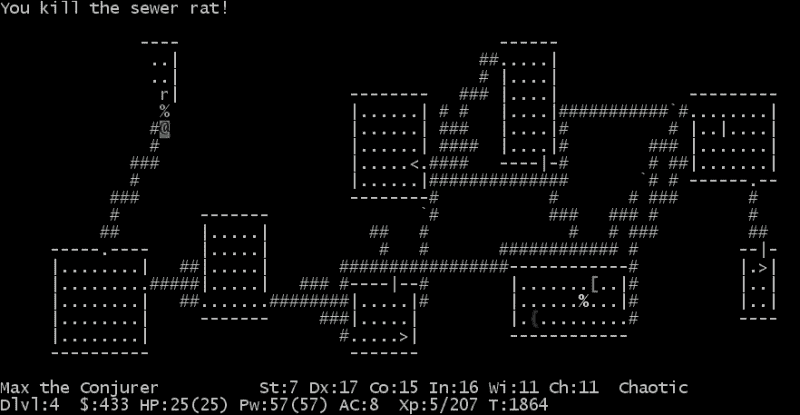
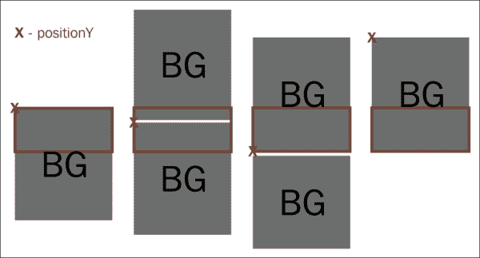

# 三、绘制线条

在这一章中，我们将为我们的游戏改进精灵的渲染。为此，我们将使用一个自定义的`GameView`来执行低级绘图。我们将进行两种不同的实现:一种是从`View`扩展而来，另一种是从`SurfaceView`扩展而来。我们将让`DrawThread`成为一根真正的线，与这个`GameView`更好地合作。

我们将重构项目，创建一个`Sprite`类，用于游戏中绘制的所有项目。我们将在`Canvas`上绘制位图，并了解用于此目的的变换矩阵。

为了继续改进游戏，我们将增加敌人。它们将是一波向我们的宇宙飞船移动的小行星。为此，我们将学习`GameController`的概念和不同的实现方式，从静态到程序层面的生成。

作为渲染技术的一部分，我们将学习遮挡剔除和视差背景，我们将使用它们来使游戏看起来更好。

最后，我们将在引擎中添加对图层的支持。

# 使用游戏视图

直到现在，我们一直在使用标准视图并翻译它们来渲染游戏的不同元素。虽然这是一种在屏幕上绘制元素的简单方法，但它远非高效。我们依靠系统布局来绘图。

虽然这种技术对基于回合的游戏或任何非实时游戏来说都很好，但它不能为实时游戏每秒渲染足够的帧。

### 注

使用标准视图对于非实时游戏来说很好。

我们将创建一个我们称之为`GameView`的自定义`View`。这个视图将负责绘制精灵。

我们已经注意到了代码的重复，并且在前一章中提到了 sprite 的概念。我们现在将前进并创建一个`Sprite`类，它将负责在`GameView`内的特定坐标处绘制图像。

在安卓系统上有两种低级别绘图方式。它们是:

*   扩展`View`和覆盖`onDraw`
*   延伸`SurfaceView`并使用`SurfaceHolder`

在这两种情况下，我们都会得到一个`Canvas`并在上面画出我们的`GameObjects`。主要区别在于`View`的`onDraw`方法在`UIThread`上执行，而`SurfaceView`和`SurfaceHolder`设计为在单独的线程上执行绘制。

### 注

安卓上的低级绘图总是使用画布完成的。

根据官方文件，使用`SurfaceView`效率更高。但是，从 Android 4.0 开始，视图渲染是硬件加速的(而`SurfaceView`不是)。就拥有高分辨率屏幕和更快处理器的现代手机而言，情况可能并非总是如此。

### 注

`SurfaceView`不是硬件加速，性能可能比正常`View`差。

无论如何，你应该两者都知道，并且能够轻松地交换它们，即使只是为了测试。我们将创建一个名为`GameView`的接口，由这两个类实现，这样它们就可以很容易地更改。我们将开设的课程有:

*   `StandardGameView`:从`View`开始延伸
*   `SurfaceGameView`:从`SurfaceView`开始延伸

## 游戏视图界面

`GameView` 界面会有`GameEngine`处理`View`所需的所有方法:

```java
public interface GameView {
  void draw();
  void setGameObjects(List<GameObject> gameObjects);
  // Generic methods from View
  int getWidth();
  int getHeight();
  int getPaddingLeft();
  int getPaddingRight();
  int getPaddingTop();
  int getPaddingBottom();
  Context getContext();
}
```

我们需要的方法基本上有两种，一种是触发绘制，一种是将游戏对象列表传递给`GameView`，这样就可以在那里绘制了:

*   `draw`:这将触发`GameView`上的平局
*   `setGameObjects`:这将设置`View`的`GameObjects`列表

其余方法在`View`中实现。我们需要申报它们，因为我们正在`GameEngine`上使用它们。

让我们详细探讨每个实现。

## 标准游戏视图

`StandardGameView` 类扩展了`View`。我们只是为`View`提供基本的构造函数，覆盖`onDraw`方法，然后从`GameView`实现方法:

```java
public class StandardGameView extends View implements GameView {

  private List<GameObject> mGameObjects;

  public GameView(Context context) {
    super(context);
  }

  public GameView(Context context, AttributeSet attrs) {
    super(context, attrs);
  }

  public GameView(Context context, AttributeSet attrs, int defStyleAttr) {
    super(context, attrs, defStyleAttr);
  }

  @Override
  protected void onDraw(Canvas canvas) {
    super.onDraw(canvas);
    synchronized (mGameObjects) {
      int numObjects = mGameObjects.size();
      for (int i = 0; i < numObjects; i++) {
        mGameObjects.get(i).onDraw(canvas);
      }
    }
  }

  @Override
  public void draw() {
    postInvalidate();
  }

  @Override
  public void setGameObjects(List<GameObject> gameObjects) {
    mGameObjects = gameObjects;
  }
}
```

基本上，`setGameObjects`存储对游戏对象的引用。`GameObjects`的添加和删除在`GameEngine`完成。当我们绘制视图时，我们遍历游戏对象列表，在所有对象上调用`onDraw`，并传递我们正在绘制的`Canvas`对象。

请注意，该方法是使用`mGameObjects`变量进行同步的。这一点很重要，因为正如我们在[第 1 章](00.html "Chapter 1. Setting Up the Project")、*设置项目*中提到的，列表的内容在`onUpdate`期间可能会发生变化，我们不希望在迭代列表时发生这种情况。

另一个重要的点是`GameObjects`的列表是对`GameEngine`内部的列表的引用，而不是副本，所以每当列表被修改时，从两个地方都可以访问最新的值。这也是为什么需要同步的原因。

### 注

游戏对象的列表在游戏引擎和游戏视图之间共享。

就性能而言，在每次执行`onDraw`时，将列表中的所有元素复制到新的元素是没有意义的。

要触发平局，我们只需要调用`postInvalidate`。请记住，使视图无效必须在`UIThread`上完成。这就是为什么我们需要叫`postInvalidate`。该方法将在`UIThread`上发布一个要运行的`Runnable`，然后使`View`无效。

正如我们在前面几章中提到的，一旦视图失效，安卓会确保调用`View`的`onDraw`方法，然后更新用户界面。这是无效视图和`onDraw`方法之间的联系，我们在这里绘制游戏对象。

`onDraw`方法显然是时间关键的。我们应该避免所有不必要的操作。特别是，如果您在`onDraw`内创建一个对象，lint 会显示一条警告。重申一下，这是游戏开发者的最佳实践:总是提前创建对象。

### 注

千万不要在`onDraw`里面做物体创造。

此外，值得记住的是，安卓有一个后备机制来避免绘图过载。如果视图已经无效但尚未重绘，则无效调用将被忽略(视图已经将被重绘)。

## SurfaceGameView

要实现一个扩展`SurfaceView`的`GameView` ，我们需要为`SurfaceHolder`定义一个`Callback`——用来访问`SurfaceView`的类——然后，每当我们想要绘制的时候，我们锁定画布，在上面绘制，然后再次解锁，这样它就可以被`SurfaceView`渲染了。

让我们看看`SurfaceGameView`的代码:

```java
public class SurfaceGameView extends SurfaceView implements SurfaceHolder.Callback, GameView {

  private List<GameObject> mGameObjects;
  private boolean mReady;

  public SurfaceGameView(Context context) {
    super(context);
    getHolder().addCallback(this);
  }

  public SurfaceGameView(Context context, AttributeSet attrs) {
    super(context, attrs);
    getHolder().addCallback(this);
  }

  public SurfaceGameView(Context c, AttributeSet attrs, int defStyleAttr) {
    super(c, attrs, defStyleAttr);
    getHolder().addCallback(this);
  }

  @Override
  public void surfaceCreated(SurfaceHolder holder) {
    mReady = true;
  }

  @Override
  public void surfaceChanged(SurfaceHolder holder, int format, int width, int height) {

  }

  @Override
  public void surfaceDestroyed(SurfaceHolder holder) {
    mReady = false;
  }

  @Override
  public void setGameObjects(List<GameObject> gameObjects) {
    mGameObjects = gameObjects;
  }

  @Override
  public void draw() {
    if (!mReady) {
      return;
    }
    Canvas canvas = getHolder().lockCanvas();
    if (canvas == null) {
      return;
    }
    canvas.drawRGB(0,0,0);
    synchronized (mGameObjects) {
      int numObjects = mGameObjects.size();
      for (int i = 0; i < numObjects; i++) {
        mGameObjects.get(i).onDraw(canvas);
      }
    }
    getHolder().unlockCanvasAndPost(canvas);
  }
}
```

首先，我们有三个具有不同参数的构造函数，它们是`SurfaceView`固有的。请注意，它们都包括一个为`SurfaceHolder`设置`Callback`的调用，该调用也由`SurfaceGameView`实现。这个回调将通知我们什么时候`SurfaceView`准备好了，或者什么时候事情发生了变化。

接下来的方法是实现`Callback`接口。这些是`SurfaceView`创建、修改或销毁时调用的方法。我们存储视图的状态来知道它是否准备好了，以便可以用来绘图。一个`View`在它被创造出来之后的任何时候都是准备好的，直到它被毁灭。

然后，我们从`GameView`开始实施这些方法。

为了设置`GameObjects`，我们完全按照我们为`StandardGameView`所做的那样做，在处理引用时也有同样的含义。

`draw`方法是事情有点不同的地方。我们必须检查景色是否准备好了。如果是这样的话，我们锁定`Canvas`这样我们就可以在上面画画了。

一旦我们有了画布，我们需要在画每一帧之前清理它。画布上会有之前的图像。(如果不清理，会得到如下截图所示的渲染工件。)这种清洁是通过使用`drawRGB`用纯色填充画布来完成的。


一旦我们清理了画布，我们就采用与`StandardGameView`相同的绘图，并且只迭代游戏对象。

最后，我们解锁画布并发布它。这就是我们把`Canvas`传回到`SurfaceView`再传到`UIThread`的时候。注意所有的绘图都是在`UIThread`之外完成的。只有当`Canvas`完全渲染后，它才会被传递回去进行绘制。

### 注

`SurfaceView`在`UIThread`外的`Canvas`上进行绘图。

如前所述，`SurfaceView`应该给出更好的表现。但是，由于它只是软件加速，在现代手机中，标准的`View`-硬件加速-在某些情况下可能更有效。当`SurfaceView` 的性能受到影响时，一个特殊的情况是，如果我们将其他视图放在它上面(像暂停按钮)，因为每次表面变化时都会执行一个完整的阿尔法混合合成。

## 更新游戏引擎

从`GameEngine`的角度来看，`GameView` 的使用有一些含义。这意味着它必须初始化`GameView`，然后使用通用接口触发绘制。

`GameView`将是`GameEngine`构造器的一个参数。它将被初始化，传递一个对游戏对象列表的引用。`GameEngine`更新后的构造器是这样的:

```java
public GameEngine (Activity a, GameView gameView) {
  mActivity = a;
  mGameView = gameView;
  mGameView.setGameObjects(mGameObjects);

  mWidth = gameView.getWidth()
    - gameView.getPaddingRight() - gameView.getPaddingRight();
  mHeight = gameView.getHeight()
    - gameView.getPaddingTop() - gameView.getPaddingBottom();

  mPixelFactor = mHeight / 400d;
}
```

从现在开始，我们也将计算`GameEngine`里面的`pixelFactor`。我们将把它存储在一个公共变量中，这样游戏对象就可以读取它。这有几个优点，例如:

*   如果我们决定改变屏幕的单位数量，这是在一个地方完成的
*   删除代码重复总是有利于维护

另一方面，`GameEngine`的`onDraw`方法变得极其简单:

```java
public void onDraw() {
  mGameView.draw();
}
```

## 更新游戏布局

当然，我们必须修改`fragment_game.xml`布局以包括`GameView`。我们将借此机会对其进行一些其他的修改，例如删除`TextView`并将布局的填充改为暂停按钮上的边距。这确保了`GameView`全屏显示，同时保持按钮边距不变。

重要的是要记住，在`FrameLayout`中，XML 中的顺序指定了项目的绘制顺序(z 索引)。我们将把`GameView`放在布局的开头，让暂停按钮画在上面。

`fragment_game.xml`新版如下:

```java
<FrameLayout xmlns:android="http://schemas.android.com/apk/res/android"
  xmlns:tools="http://schemas.android.com/tools"
  android:layout_width="match_parent"
  android:layout_height="match_parent"
  android:orientation="vertical"
  tools:context="com.example.yass.counter.GameFragment">

  <com.example.yass.engine.SurfaceGameView
    android:id="@+id/gameView"
    android:layout_width="match_parent"
    android:layout_height="wrap_content" />

  <Button
    android:layout_gravity="top|right"
    android:id="@+id/btn_play_pause"
    android:layout_marginTop="@dimen/activity_vertical_margin"
    android:layout_marginRight="@dimen/activity_vertical_margin"
    android:layout_width="wrap_content"
    android:layout_height="wrap_content"
    android:text="@string/pause" />

  <include layout="@layout/view_vjoystick" />

</FrameLayout>
```

请注意，这是我们决定使用`GameView`的哪个变体的地方。代码的其余部分将通过`GameView`接口访问这些方法，因此不需要更改任何其他内容。从现在开始，我们将使用`SurfaceGameView`，但也可以随意尝试`StandardGameView`。

### 注

布局是我们设置要使用的`GameView`变体的地方。

最后，在`GameFragment`内部，我们通过添加`GameView`参数来更新`GameEngine`的创建:

```java
GameView gameView = (GameView) getView().findViewById(R.id.gameView);
mGameEngine = new GameEngine(getActivity(), gameView);
```

现在我们有一个`GameEngine`依赖于一个`GameView`来进行渲染。我们仍然需要更新`GameObject`类来利用它。

在我们进入`GameObject`课之前，让我们也花点时间来提高`DrawThread`。

# 改善拉丝

为了触发抽签，我们已经安排了使用`Timer`和`TimerTask`，这样我们可以每秒获得 30 帧。虽然这是可行的，但它提供了更好的性能，就像`UpdateThread`一样:尽可能多地调用`onDraw`。

这种方法对`SurfaceView`非常有效，因为绘图是在同一根线上完成的。但是在使用`StandardGameView`的时候可能会出现一些消息溢出的问题，这就叫`postInvalidate`。为了防止溢出，我们将确保对`onDraw`的调用之间的时间不会短于 20 毫秒，这对于每秒 50 帧来说已经足够了。

新`DrawThread`的代码与`UpdateThread`完全相同，除了运行方法中处理溢出的部分。看起来是这样的:

```java
@Override
public void run() {
  long elapsedMillis;
  long currentTimeMillis;
  long previousTimeMillis = System.currentTimeMillis();

  while (mGameIsRunning) {
    currentTimeMillis = System.currentTimeMillis();
    elapsedMillis = currentTimeMillis - previousTimeMillis;
    if (mPauseGame) {
      while (mPauseGame) {
        try {
          synchronized (mLock) {
            mLock.wait();
          }
        } catch (InterruptedException e) {
          // We stay on the loop
        }
      }
      currentTimeMillis = System.currentTimeMillis();
    }
    if (elapsedMillis < 20) { // This is 50 fps
      try {
        Thread.sleep(20-elapsedMillis);
      } catch (InterruptedException e) {
        // We just continue.
      }
    }
    mGameEngine.onDraw();
    previousTimeMillis = currentTimeMillis;
  }
}
```

在运行两个调用过于接近的情况下，我们将线程从剩余时间睡眠到最少 20 毫秒。

如果发生了`InterruptedException`，我们真的没有太多事情要处理。所以，我们可以继续前进，在`GameEngine`呼叫`onDraw`。

# 精灵

我们已经提到精灵的概念是在屏幕上特定位置绘制和处理的实体。本质上，我们在游戏中看到的一切都是精灵。也有例外，比如游戏控制器(不画任何东西)和背景(用不同的方式画)，但我们将在本章后面讨论它们。

这是扩展`GameObject`的`Sprite`类的代码:

```java
public abstract class Sprite extends GameObject {

  protected double mPositionX;
  protected double mPositionY;

  protected final double mPixelFactor;

  private final Bitmap mBitmap;
  protected final int mImageHeight;
  protected final int mImageWidth;

  private final Matrix mMatrix = new Matrix();

  protected Sprite (GameEngine gameEngine, int drawableRes) {
    Resources r = gameEngine.getContext().getResources();
    Drawable spriteDrawable = r.getDrawable(drawableRes);
    mPixelFactor = gameEngine.mPixelFactor;

    mImageHeight = (int) (spriteDrawable.getIntrinsicHeight()*mPixelFactor);
    mImageWidth = (int) (spriteDrawable.getIntrinsicWidth()*mPixelFactor);

    mBitmap = ((BitmapDrawable) spriteDrawable).getBitmap();
  }

  @Override
  public void onDraw(Canvas canvas) {
    mMatrix.reset();
    mMatrix.postScale((float) mPixelFactor, (float) mPixelFactor);
    mMatrix.postTranslate((float) mPositionX, (float) mPositionY);
    canvas.drawBitmap(mBitmap, mMatrix, null);
  }
}
```

`Sprite`是抽象类，根本没有`onUpdate`的实现。精灵关心的是在屏幕上显示一个项目，而不是这个项目如何移动。

该类有一系列成员变量。让我们仔细看看:

*   `mPositionX`、`mPositionY`:屏幕上`Sprite`的位置。与我们用于`Player`和`Bullet`物体的概念相同。这个位置在图像的左上角。
*   `mPixelFactor`:和之前一样的概念。将屏幕单位转换为像素的因子。
*   `mBitmap`:我们要画的位图。
*   `mImageWidth`、`mImageHeight`:屏幕上绘制的位图大小。它被设置在这里是为了方便。我们总是可以使用位图和像素因子来计算它，但是只存储它供子类将来使用会更快。
*   `mMatrix`:这个对象是一个变换矩阵。它用于在画布上渲染位图之前缩放、移动和旋转位图。出于优化目的，它在`onDraw`执行中被重用，而不是为每次运行创建。

下一段代码是构造函数。我们正在传递对`GameEngine`的引用和一个可提取的资源。在前一章中，我们传递了父级`View`，因此我们可以将新创建的`ImageView`添加到其中。这已经没有必要了。我们只需要`Context`和像素因子，我们可以从`GameEngine`获得。

构造函数中的代码与我们之前看到的非常相似。它做了几件事:

*   通过`Context`从资源加载`Drawable`
*   获取可绘制对象的固有大小，并将其乘以像素因子，以存储子画面将用于此特定设备的宽度和高度(以像素为单位)
*   从`Drawable`中获取`Bitmap`，并将其存储在类变量中，以便在`onDraw`期间使用

最后，我们有接收`Canvas`的`onDraw`方法。这个方法现在叫做`GameView`。`Canvas`的获取方式与`StandardGameView`和`SurfaceGameView`不同，但两者的绘制逻辑是一样的。

画布作为实际表面的绘图界面，图形将在该表面上绘制。它为我们提供了一组可以绘制的图元，包括位图、文本、线条、矩形、椭圆等等等等。当使用画布时，实际上是在底层位图上进行绘制，然后将位图放在窗口中。

### 注

Canvas 充当一个绘图界面，为我们提供原语。

要绘制精灵，我们使用`Canvas`类中的 `drawBitmap`方法。此方法接收转换矩阵作为参数。让我们看看我们能用`Matrix`做些什么:

*   `reset`:我们根据上一次运行的值重置转换矩阵。这是重用上一次运行的`Matrix`对象所必需的。
*   `postScale`:我们在变换列表的末尾增加一个比例变换。刻度与`mPixelFactor`相同。
*   `postTranslate`:这将在转换列表的末尾添加一个翻译转换。这意味着该转换将在缩放后执行。我们将项目翻译到位置(`mPositionX`、`mPositionY`)。

目前，这是我们将对转换矩阵所做的一切。在本章的后面，我们将添加旋转。

### 注

变换矩阵中的动作顺序非常重要。结果受到转换顺序的影响。

转换矩阵是一个非常强大的转换位图的工具。创建矩阵的关键是要记住顺序非常重要。当我们只使用时，平移和缩放并不重要。但是随着旋转，结果会受到转换顺序的影响。

## 更新飞船和子弹

既然我们有了 `Sprite`基类，我们就必须更新现有的 `Player`和`Bullet`类来扩展它。

`Player`对象中的大多数成员变量现在都是`Sprite`的一部分。我们也可以去掉`onDraw`的旧实现，依靠`Sprite`的实现。

最后，我们有了新的更简单的构造函数，只接收`GameEngine`。`Player`类的是:

```java
public Player(GameEngine gameEngine) {
  super(gameEngine, R.drawable.ship);
  mSpeedFactor = mPixelFactor * 100d / 1000d;

  mMaxX = gameEngine.mWidth - mImageWidth;
  mMaxY = gameEngine.mHeight - mImageHeight;

  initBulletPool(gameEngine);
}
```

`Bullet`对象的一个是:

```java
public Bullet(GameEngine gameEngine) {
  super(gameEngine, R.drawable.bullet);
  mSpeedFactor = gameEngine.mPixelFactor * -300d / 1000d;
}

```

总而言之，我们向`Sprite`类推了很多代码，这会让新游戏元素的加入变得更加容易。

在此之前，让我们也给`GameView`添加一个每秒帧数的计数器，看看它的表现如何，以便能够比较`StandardGameView`和`SurfaceGameView`。

# 添加每秒帧数(fps)计数器

我们更新了 `DrawThread`以每秒任意帧数运行，适应渲染所需的时间，而不是固定的 30 fps，我们使用的是精灵。现在是添加每秒帧数计数器的最佳时机。这是一个非常简单的工具，也便于检查性能。

我们本可以使用`TextView`，但是有一些很好的理由直接在`Canvas`上画出来:

*   当我们在上面叠加其他视图时，`SurfaceView`的性能会受到影响
*   这是在`Canvas`上绘制其他方法的一个有趣的例子
*   我们可以在不接触布局的情况下移除和添加它

我们将制作一个名为`FPSCounter`的类，它从`GameObject`延伸而来，看起来像这样:

```java
public class FPSCounter extends GameObject {
  private final double mPixelFactor;
  private final float mTextWidth;
  private final float mTextHeight;

  private Paint mPaint;
  private long mTotalMillis;
  private int mDraws;
  private float mFps;

  private String mFpsText = "";

  public FPSCounter(GameEngine gameEngine) {
    mPaint = new Paint();
    mPaint.setTextAlign(Paint.Align.CENTER);
    mTextHeight = (float) (25*gameEngine.mPixelFactor);
    mTextWidth = (float) (50*gameEngine.mPixelFactor);
    mPaint.setTextSize(mTextHeight/2);
  }

  @Override
  public void startGame() {
    mTotalMillis = 0;
  }

  @Override
  public void onUpdate(long elapsedMillis, GameEngine gameEngine) {
    mTotalMillis += elapsedMillis;
    if (mTotalMillis > 1000) {
      mFps = mDraws*1000 / mTotalMillis;
      mFpsText = mFps+" fps";
      mTotalMillis = 0;
      mDraws = 0;
    }
  }

  @Override
  public void onDraw(Canvas canvas) {
    mPaint.setColor(Color.BLACK);
    canvas.drawRect(0,(int)(canvas.getHeight()-mTextHeight), mTextWidth, canvas.getHeight(), mPaint);
    mPaint.setColor(Color.WHITE);
    canvas.drawText(mFpsText, mTextWidth/2, (int) (canvas.getHeight()-mTextHeight/2), mPaint);
    mDraws++;
  }
}
```

逻辑相当简单；我们统计`onDraw`和`onUpdate`期间的通话次数。每当我们运行超过 1000 毫秒，我们就进行计算，存储结果，并重置两个变量。

`onDraw`方法绘制一个黑色正方形，然后将文本居中呈现。我们将正方形的大小设置为 50 乘以 25 个单位，并将文本大小设置为正方形高度的一半，这样就有了边距。为此，我们还需要使用一个`Paint`对象。

`Paint`类有设置颜色、对齐方式、笔画宽度和类型等方法。由于我们主要是绘制位图，因此我们不会对此进行更详细的描述。

请注意，`Paint`对象被创建一次并被重用，就像我们在`Sprite`上对`Matrix`所做的那样，前提是我们不应该在`onDraw`中进行任何对象分配。

# 繁殖敌人——游戏控制器

现在我们准备产卵一些敌人。为此，我们将介绍一个新概念:`GameController`。

A `GameController`是`GameObject`的一种特殊类型，它没有视觉表现(它不是精灵)，它的任务是使用对`onUpdate`的调用来控制游戏的进化。

`GameController`最典型的任务之一是管理环境。这包括在必要时用正确的参数繁殖敌人。

游戏控制器分为两大类:

*   程序/随机
*   确定性/静态

## 程序/随机

这是 `GameController`的一种类型，它基于一组包含某种随机输入的参数(或函数)生成关卡或敌人。

过程生成的主要优点是，您不必详细创建所有级别，只需提供参数和算法。适当地调整它是复杂的，但是，一旦它是正确的，它可能会在你每次播放它时给你呈现一个不同的设置。这提高了可重放性。

一些使用程序游戏控制器的游戏有粉笔球(生存模式)、水果忍者和尤弗里亚。程序级生成最经典的例子是类似盗贼的游戏，当你进入地牢时，地牢的每一级都会生成。



Nethack，最早使用程序级生成的游戏之一。

## 确定性/静态

当级别固定且始终相同时，使用确定性级别生成。

这意味着对细节的大量关注，这允许在级别中微调难度。显然，这也需要很多时间。

大多数游戏谜题和塔防游戏都是这样的例子:愤怒的小鸟、割断绳子、异常、太空猫等等。

根据经验，在使用确定性的`GameController`时，您希望将级别的定义存储在一些文件中，这些文件可以在不接触代码的情况下进行修改。这允许您独立于代码调整级别或添加新的级别集。您甚至可以创建一个外部编辑器来管理级别。

这些文件的格式完全由你决定。我个人建议使用结构化语言，如 XML 或 JSON。


在级别编辑器中看到的 SpaceCat 级别

## 混合方法

游戏级设计不是黑也不是白。有许多方法可以定义介于程序控制器和确定性控制器之间的`GameController`。

例如，Candy Crush Saga 在关卡布局确定后会有一个混合关卡生成，但是每次玩的时候掉落的糖果都不一样。

这是两全其美的。它允许你微调关卡的设计，而每次你玩的时候它还是不同的。这也需要很多时间，因为你必须调整静态设计和算法。

## 我们的方法

对于 YASS 来说有一个确定性的`GameController`是没有意义的，所以我们会选择程序生成。

我们将使小行星以[-30，30]度范围内变化的角度从屏幕顶部落下。我们将限制他们在 *x* 轴上的位置在屏幕中心区域的 50%。

速度将是恒定的，它们将在给定的时间间隔内繁殖，也是恒定的。

处理`Asteroids`生成的`GameController`代码如下:

```java
@Override
public void onUpdate(long elapsedMillis, GameEngine gameEngine) {
  mCurrentMillis += elapsedMillis;
  long waveTimestamp = mEnemiesSpawned*TIME_BETWEEN_ENEMIES;
  if (mCurrentMillis > waveTimestamp) {
    // Spawn a new enemy
    Asteroid a = mAsteroidPool.remove(0);
    a.init(gameEngine);
    gameEngine.addGameObject(a);
    mEnemiesSpawned++;
  }
}

```

我们计算游戏运行的时间，然后计算下一个敌人产卵的时间。这是我们已经创造的敌人数量乘以敌人之间的时间。

如果游戏的当前时间大于下一个敌人必须出现的时间，那么我们生成一个并将其添加到`GameEngine`中。

为此，我们从物体池中获得一个`Asteroid`，就像我们使用子弹一样。我们将其初始化并添加到`GameEngine`中。然后，我们将一个增加到产生的敌人数量上。

代码会产生一个新的敌人，通过`TIME_BETWEEN_ENEMIES`规定的毫秒数将他们分开。我们将它设置为 500 毫秒。

我们用于小行星的对象池与用于子弹的对象池基本相同。我不会再用同样的细节来烦你了。

剩余的程序生成在`Asteroid`的`init`方法中，看起来像这样:

```java
public void init(GameEngine gameEngine) {
  // They initialize in a [-30, 30] degrees angle
  double angle = gameEngine.mRandom.nextDouble()*Math.PI/3d-Math.PI/6d;
  mSpeedX = mSpeed * Math.sin(angle);
  mSpeedY = mSpeed * Math.cos(angle);
  // Asteroids initialize in the central 50% of the screen
  mPositionX = gameEngine.mRandom.nextInt(gameEngine.mWidth/2)+gameEngine.mWidth/4;
  // They initialize outside of the screen vertically
  mPositionY = -mImageHeight;
}
```

`cos`和`sin`方法要求参数是弧度，所以我们用`Random.getDouble`得到[0，1]之间的一个双精度，乘以 PI/3，再减去 PI/6。由此，我们得到一个介于[-PI/6，PI/6]之间的随机值。

我们用一个随机的角度，用`sin`和`cos`得到`X`和`Y`上的速度分量。

对于起始位置，我们使用相同的技术。我们得到一个范围为[0，width/2]的随机整数，然后加上 width/4，所以最终值在[width/4，width*3/4]的范围内。


## 小行星

最后，我们需要我们的 `Asteroid`类，这将是一个`Sprite`。正如我们对其他图形所做的那样，我们从 OpenGameArt 网站下载了我们的艺术。这次我们得到了一些不同形状和颜色的小行星。

小行星的实现让人想起子弹的实现，除了这次物体从底部离开屏幕时从`GameEngine`中移除，并且它在两个轴上都有速度分量。

`Asteroid`的代码如下:

```java
public class Asteroid extends Sprite {

  private final GameController mController;

  private final double mSpeed;
  private double mSpeedX;
  private double mSpeedY;

  public Asteroid(GameController gameController, GameEngine gameEngine) {
    super(gameEngine.getContext(), R.drawable.a10000, gameEngine.mPixelFactor);
    mSpeed = 200d*mPixelFactor/1000d;
    mController = gameController;
  }

  @Override
  public void onUpdate(long elapsedMillis, GameEngine gameEngine) {
    mPositionX += mSpeedX * elapsedMillis;
    mPositionY += mSpeedY * elapsedMillis;
    // Check of the sprite goes out of the screen
    if (mPositionY > gameEngine.mHeight) {
      // Return to the pool
      gameEngine.removeGameObject(this);
      mController.returnToPool(this);
    }
  }

  public void init(GameEngine gameEngine) {
    // We already saw that
  }
}
```

感谢`Sprite` 基类，这个实现非常容易。我们只需要在构造中设置速度，然后使用速度和`elapsedMillis`更新两个轴上的位置。

最后，我们检查对象是否在边界之外，如果是，我们将它从引擎中移除，并将其返回到池中。

我们现在可以编译和运行，可以看到小行星向我们的宇宙飞船飞来。


### 更多关于变换矩阵

你可能已经注意到小行星看起来相当静止。这是因为形象总是一样的。我们可以用一个简单的技巧来改善这一点:给它们增加旋转。

我们需要做的第一件事是更新`Sprite`类，使其作为变换矩阵配置的一部分处理旋转:

```java
@Override
public void onDraw(Canvas canvas) {
  mMatrix.reset();
  mMatrix.postScale((float) mPixelFactor, (float) mPixelFactor);
  mMatrix.postTranslate((float) mPositionX, (float) mPositionY);
  mMatrix.postRotate((float) mRotation,
    (float) (mPositionX + mImageWidth/2),
    (float) (mPositionY + mImageHeight/2));
  canvas.drawBitmap(mBitmap, mMatrix, null);
}
```

转换的顺序极其重要。变换按顺序应用，旋转确实会变换参考轴。因此，如果我们旋转 45 度，然后向右平移 40 个单位，因为初始旋转改变了坐标的参考，所以结束位置将向下向左。另一方面，如果我们先平移然后旋转，坐标系只会在最后受到影响。


这一开始可能是反直觉的，但它是描述非线性运动的非常强大的工具。我们将在[第 8 章](07.html "Chapter 8. The Animation Framework")、*动画框架*中看到更多关于变换的内容。

对于精灵，我们首先进行平移，然后旋转，使用精灵在最终位置的中心作为它的枢轴。

### 注

旋转也会影响对象的参考坐标系。

一旦`Sprite`知道如何处理旋转，我们只需要将小行星的旋转初始化为一个有意义的值，并且对于每个小行星都是不同的。

首先，我们将旋转初始化为一个随机角度，因此每个小行星都有不同的值。我们将此行添加到`Asteroid`的`init`方法中:

```java
mRotation = gameEngine.mRandom.nextInt(360);
```

然后我们设置转速与线速度的角度成正比，所以每个小行星都有一个基于轨迹倾斜度的转速。这也包含在`init`方法中:

```java
mRotationSpeed = angle*(180d / Math.PI)/250d;
```

我们让小行星每秒钟旋转相当于倾斜角的次数。

一旦值被初始化，我们需要在`onUpdate`调用期间更新它们。我们将在`onUpdate`中添加以下代码:

```java
mRotation += mRotationSpeed * elapsedMillis;
if (mRotation > 360) {
  mRotation = 0;
}
else if (mRotation < 0) {
  mRotation = 360;
}
```

我们更新旋转并确保它在有效的值[0-360]下。

### 注

变换矩阵的旋转以度为单位。

请注意，转换矩阵使用角度单位是度，而不是弧度，而我们用于速度的数学运算符预期使用弧度。请务必仔细检查角度应该在哪个单位。

如果你现在运行这个游戏，你会注意到这样一个简单的调整如何让它看起来更好。

# 遮挡剔除

遮挡剔除是一种在游戏中广泛使用的技术，尤其是 3D 游戏。因为绘图非常昂贵，而且要做很多次，所以每次优化都很重要。显而易见的优化是不要画那些看不到的部分(例如被其他东西隐藏的部分)。如果我们可以在屏幕上只画一次每个像素，我们就节省了很多处理时间。

将每个像素绘制一次以上的事实称为透支。透支高是影响业绩最大的因素之一。

在 3D 的情况下，绘制特别昂贵，遮挡剔除是大多数引擎在一定程度上自动做的事情。

### 注

遮挡剔除通过不绘制未显示的内容来优化绘制时间。

在我们的例子中，我们可能会两次绘制一些像素，但是由于我们只做 2D，所以绘制的成本并没有那么高，这是我们不需要做的事情。

但是有一种特殊情况:绘制`GameView`之外的精灵。

直到现在，我们一直在根据需要繁殖精灵，一旦它们离开`GameView`，我们就把它们移除。相反，我们可以在初始化关卡时将它们放在适当的位置，只需依靠对`onUpdate`的调用就可以让它们出现在屏幕上。这对于作为风景或静态敌人的一部分的元素来说是很常见的。在一个类似盗贼的游戏中，我们会在开始的时候生成每个地牢等级，然后产生所有的精灵，并把它们放到适当的位置。

显然，画出玩家看不到的东西是一种浪费。因此，我们将确保`Sprite`类执行这个简单的类似遮挡剔除的优化:

```java
@Override
public void onDraw(Canvas canvas) {
  if (mPositionX > canvas.getWidth()
      || mPositionY > canvas.getHeight()
      || mPositionX < -mImageWidth
      || mPositionY < -mImageHeight) {
    return;
  }
  mMatrix.reset();
  mMatrix.postScale((float) mPixelFactor, (float) mPixelFactor);
  mMatrix.postRotate((float) mRotation,
    (float) mImageWidth/2, (float) mImageHeight/2);
  mMatrix.postTranslate((float) mPositionX, (float) mPositionY);
  canvas.drawBitmap(mBitmap, mMatrix, null);
}
```

我们只需要检查 *x* 和 *y* 轴上的位置，看看精灵是否在绘图区域内。请记住，我们使用图像左上角的点。这就是为什么我们必须检查负的宽度和高度。

这在我们的游戏中不会有任何不同，但对于其他类型的游戏，尤其是那些静态内容的游戏来说，这可能是至关重要的。

# 视差背景

2D 游戏的另一个与`DrawThread`有很深关联的典型特征是视差背景。

视差背景的想法是让图像比前景中的元素移动得慢，给人以深度的印象。

### 注

在 2D 游戏中，视差背景被用来制造深度错觉。

为了使这种效果更好，我们可以以不同的速度使用多个背景图像。这通常用于 2D 阴囊。例如，树在近平面，山和云在最后面。

对于 YASS，我们将使用缓慢下移的星域作为背景。

我们将使用与精灵相同的单位惯例。我们用于背景的图像应该被设计成平铺的，在我们的例子中是垂直的。这意味着图像的结尾与其开头相吻合，因此它们被一个接一个地放置，并且具有连续性。

它的设计也应该比最大的屏幕大。我们可以考虑最高的屏幕，长宽比为 16:9 的屏幕。因此，对于 400 像素的高度，该图像应该至少有 720 像素宽(400 * 16 / 9 = 711.11)。

背景与精灵有很大的不同，主要是因为图像的大小，以及我们可能需要绘制其中两个来覆盖屏幕的事实。

我们将为此创建一个新的`ParallaxBackground`类:

```java
public ParallaxBackground(GameEngine gameEngine, int speed, int drawableResId) {
  Drawable spriteDrawable = gameEngine.getContext().getResources()
    .getDrawable(drawableResId);
  mBitmap = ((BitmapDrawable) spriteDrawable).getBitmap();

  mPixelFactor = gameEngine.mPixelFactor;
  mSpeedY = speed*mPixelFactor/1000d;

  mImageHeight = spriteDrawable.getIntrinsicHeight()*mPixelFactor;
  mImageWidth = spriteDrawable.getIntrinsicWidth()*mPixelFactor;

  mScreenHeight = gameEngine.mHeight;
  mScreenWidth = gameEngine.mWidth;

  mTargetWidth = Math.min(mImageWidth, mScreenWidth);
}
```

构造器与`Sprite`类似。我们加载一个位图，计算速度，并以其显示尺寸存储屏幕和图像的高度和宽度。

我们有一个新概念:目标宽度。这是用于优化的情况下，图像比屏幕大，所以我们不画什么是看不见的。

首先，我们将使用与我们在精灵上使用的相同的变换矩阵概念来做一个简单的实现:

```java
@Override
public void onUpdate(long elapsedMillis, GameEngine gameEngine) {
  mPositionY += mSpeedY * elapsedMillis;
}

@Override
public void onDraw(Canvas canvas) {
  if (mPositionY > 0) {
    mMatrix.reset();
    mMatrix.postScale((float) (mPixelFactor), (float) (mPixelFactor));
    mMatrix.postTranslate(0, (float) (mPositionY - mImageHeight));
    canvas.drawBitmap(mBitmap, mMatrix, null);
  }
  mMatrix.reset();
  mMatrix.postScale((float) (mPixelFactor), (float) (mPixelFactor));
  mMatrix.postTranslate(0, (float) mPositionY);
  canvas.drawBitmap(mBitmap, mMatrix, null);

  if (mPositionY > mScreenHeight) {
    mPositionY -= mImageHeight;
  }
}
```

我们正在 *y* 坐标处绘制图像。当此坐标大于 0 时，视图顶部将有空间需要用另一个图像填充。这是代码的第一部分；它会再次绘制图像，但会平移图像的所有高度，因此它们会平铺。

无论如何，我们都要在`mPositionY`处画背景，这也是第二个块做的。请注意，当位置小于 0 时，我们只需要绘制一个图像。类的逻辑保证了`Y`的值永远不会小于`mImageHeight`–`mScreenHeight`。

一旦`Y`位置离开屏幕，就不再需要第二部分的绘图，所以我们减去图像的高度。这样，图像保持相同的位置并平滑滚动，因为绘图的第二部分现在相当于第一部分，而第一部分没有输入。



背景的不同状态可以画出来。

虽然这段代码有效，但效率很低，因为它绘制了大量不可见的图形。

我们可以使用`drawBitmap`的另一个变体在`ParallaxBackground`上实现的绘制，该变体接收我们想要绘制的图像的矩形和应该绘制时屏幕上的矩形。

这个案子的数学看起来有点复杂。我们先来看看代码:

```java
private void efficientDraw(Canvas canvas) {
  if (mPositionY < 0) {
    mSrcRect.set(0,
      (int) (-mPositionY/mPixelFactor),
      (int) (mTargetWidth/mPixelFactor),
      (int) ((mScreenHeight - mPositionY)/mPixelFactor));
    mDstRect.set(0,
      0,
      (int) mTargetWidth,
      (int) mScreenHeight);
    canvas.drawBitmap(mBitmap, mSrcRect, mDstRect, null);
  }
  else {
    mSrcRect.set(0,
      0,
      (int) (mTargetWidth/mPixelFactor),
      (int) ((mScreenHeight - mPositionY) / mPixelFactor));
    mDstRect.set(0,
      (int) mPositionY,
      (int) mTargetWidth,
      (int) mScreenHeight);
    canvas.drawBitmap(mBitmap, mSrcRect, mDstRect, null);
    // We need to draw the previous block
    mSrcRect.set(0,
      (int) ((mImageHeight - mPositionY) / mPixelFactor),
      (int) (mTargetWidth/mPixelFactor),
      (int) (mImageHeight/mPixelFactor));
    mDstRect.set(0,
      0,
      (int) mTargetWidth,
      (int) mPositionY);
    canvas.drawBitmap(mBitmap, mSrcRect, mDstRect, null);
  }

  if (mPositionY > mScreenHeight) {
    mPositionY -= mImageHeight;
  }
}
```

处理在概念上与之前的算法相同，但是现在您必须记住，源矩形具有图像的原始比例，而目标矩形具有`GameView`的比例。除此之外，案例和它们的工作方式是相同的。

虽然这种绘制在绘制所需内容的标准下更有效，但在某些情况下并不那么有效。

当我们使用`drawBitmap`和两个矩形时，一个新的位图被创建和使用。然后丢弃该位图，并为下一次调用`onDraw`创建另一个位图。使用另一种实现，位图不会被触摸，因此它们可以保持加载在内存中，从而节省一些处理时间。

总之，性能取决于位图的大小，如果你使用的是`SurfaceView`或普通的`View`，以及设备的硬件有多好。

### 注

虽然高效，但这种绘图方式可能不会更快。位图操作和分配内存也很耗时。

要给`GameEngine`添加背景，我们必须记住`GameView`中的绘制顺序是`GameObjects`被添加到`GameEngine`中的顺序，所以我们必须确保在开始时添加背景，在其余游戏对象之前。

`GameFragment`内`GameEngine`的初始化现在应该是这样的:

```java
mGameEngine = new GameEngine(getActivity(), (GameView) getView().findViewById(R.id.gameView));
mGameEngine.setInputController(
  new CompositeInputController(getView(), getYassActivity()));
mGameEngine.addGameObject(
  new ParallaxBackground(mGameEngine, 20, R.drawable.seamless_space_0));
mGameEngine.addGameObject(new GameController(mGameEngine));
mGameEngine.addGameObject(new Player(mGameEngine));
mGameEngine.startGame();
```

我们的游戏开始变得非常好看。


## 多背景

以不同的速度在游戏中添加一组额外的星星相当容易和另一个`ParallaxBackground`，所以他们两个在一起会给人一种更好的深度感。这就像添加另一个具有不同速度和具有透明度的可绘制对象一样简单。

如果我们这样做，我们将看到性能的急剧下降。

这个性能问题是由像素透支的数量引起的。有了第二个背景，屏幕上的每个点都会被绘制至少两次(每个背景一次)，当涉及到精灵时，有些点会被绘制三次。透明像素也算透支。

### 注

使用两个重叠的视差背景迫使每个像素每帧至少绘制两次。

总而言之，性能涉及许多参数。在大多数情况下，`SurfaceGameView`加上高效的背景绘制，会给出最好的结果。但是一旦我们在`GameView`上叠加另一个`View`，性能就会直线下降。`StandardGameView`这种情况下性能衰减较慢。

当我们只使用一个背景时，`GameView`或背景渲染方法的两种实现在性能上没有太大的差异。但同样，这取决于背景位图的大小。我建议你自己去实验，看看有什么不同。

虽然两个视差背景的效果很好，我们的`GameView`可以以合适的刷新率处理它，但是我们将在 YASS 只使用一个背景。有了这么多透支，我们已经进入了不使用 OpenGL 的标准 Android SDK 所能达到的性能极限。

如果你想要更复杂的背景，你可能想使用 OpenGL 引擎，比如 AndEngine，它使用了我们在这里一直使用的相同概念。

# 层

到目前为止，游戏对象的绘制顺序是它们被添加到游戏引擎的顺序。这至少可以说是不方便的。我们应该改进它。

像大多数其他绘图系统一样，我们的引擎应该使用图层。

每当我们向`GameEngine`添加`GameObject`时，我们都会传递一个整数来指示我们希望它被添加到的层。我们将考虑 0 作为添加背景的图层。将图层视为游戏对象的 z 索引。

我们将使用四层。从前景到背景，我们将显示:

*   物体:宇宙飞船
*   小行星
*   子弹
*   背景


为了增加图层支持，我们需要修改`GameEngine`、`StandardGameView`和`SurfaceGameView`类。为了方便，我们也会更新`GameObject`来了解它的图层。

在最上层，我们将处理层作为游戏对象列表的列表。这是我们将存储在`GameEngine`中并传递给`GameView`的实现的数据结构。我们将保留旧的`mGameObject`列表，作为迭代所有`GameObjects`的简单方法。

我们在`GameEngine`的构造器中初始化图层。我们将向构造函数添加一个参数，显示我们期望拥有的层数，这样就可以预先创建它们:

```java
private List<List<GameObject>> mLayers = new ArrayList<List<GameObject>>();

public GameEngine (Activity a, GameView gameView, int numLayers) {
  [...]
  for (int i=0; i<numLayers; i++) {
    mLayers.add(new ArrayList<GameObject>());
  }
}
```

主要变化在`onUpdate`里面的:

```java
public void onUpdate(long elapsedMillis) {
  mInputController.onPreUpdate();
  int numObjects = mGameObjects.size();
  for (int i=0; i<numObjects; i++) {
    mGameObjects.get(i).onUpdate(elapsedMillis, this);
  }
  synchronized (mLayers) {
    while (!mObjectsToRemove.isEmpty()) {
      GameObject objectToRemove = mObjectsToRemove.remove(0);
      mGameObjects.remove(objectToRemove);
      mLayers.get(objectToRemove.mLayer).remove(objectToRemove);
    }
    while (!mObjectsToAdd.isEmpty()) {
      GameObject gameObject = mObjectsToAdd.remove(0);
      addToLayerNow(gameObject);
    }
  }
}
```

第一部分和以前一样。它沿着所有`GameObjects`迭代，调用`onUpdate`。

对于对象的移除，重要的是`GameObject`知道它的层。因此，从层列表中移除对象只是多了一行代码。

在添加`GameObjects`时，知道图层也很重要，尤其是当添加延迟到`onUpdate`结束时。

有一种新方法叫做`addToLayerNow`。在游戏开始前添加对象时也使用它。我们可以看到它是如何在`GameEngine`的`addGameObject`方法中使用的:

```java
public void addGameObject(final GameObject gameObject, int layer) {
  gameObject.mLayer = layer;
  if (isRunning()){
    mObjectsToAdd.add(gameObject);
  }
  else {
    addToLayerNow(gameObject);
  }
  mActivity.runOnUiThread(gameObject.mOnAddedRunnable);
}
```

请注意，当我们添加一个新的`GameObject`时，我们要做的第一件事是设置它要添加到的图层。

`addToLayerNow`方法处理了当我们想给一个我们没有定义的层添加一个`GameObject`时的情况。如果我们定义了要预创建的正确层数，就不会发生这种情况。但这是一个很好的安全措施，尤其是当你不确定你将使用多少层时:

```java
private void addToLayerNow (GameObject object) {
  int layer = object.mLayer;
  while (mLayers.size() <= layer) {
    mLayers.add(new ArrayList<GameObject>());
  }
  mLayers.get(layer).add(object);
  mGameObjects.add(object);
}
```

`GameObject`知道它必须被添加到的层的事实允许我们在一行代码中将其添加到正确的层。请注意，我们还将`GameObject`添加到所有游戏对象的列表中。

最后，在`GameView`的两个实现中，将游戏对象绘制到画布中的代码都必须更改。这是使用图层顺序提供绘图顺序的地方:

```java
int numLayers = mLayers.size();
for (int i = 0; i < numLayers; i++) {
  List<GameObject> currentLayer = mLayers.get(i);
  int numObjects = currentLayer.size();
  for (int j=0; j<numObjects; j++) {
    currentLayer.get(j).onDraw(canvas);
  }
}
```

注意，在每一层内部，绘制的顺序仍然是添加的顺序。既然我们现在可以将相同类型的项目隔离到同一层，这就不再需要担心了。

另外，注意同步对象在`GameViews`和`GameEngine`中是相同的，现在同步是使用`mLayers`完成的。

# 总结

我们已经学会了如何使用标准的`View`和`SurfaceView`在低水平上绘画。我们创建了一个`Sprite`类来重用屏幕上显示的项目代码。

`DrawThread`已经更新为更高效的，我们还增加了每秒帧数计数器来检查每个配置的效率。

一路上，我们了解了游戏控制器和创建关卡的不同方法。我们还决定使用程序生成生成小行星 YASS，并将其付诸实施。

我们还在引擎中增加了对视差背景和图层的支持。

总的来说，YASS 开始看起来不错，但我们显然错过了一些东西:子弹击中小行星时不起作用，我们的宇宙飞船也是如此。

是时候实施碰撞检测了。