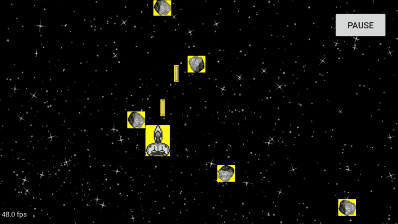
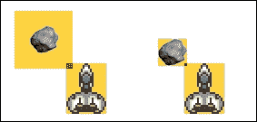
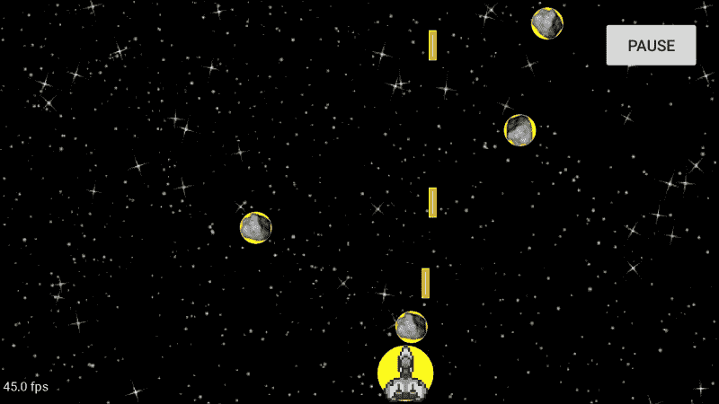
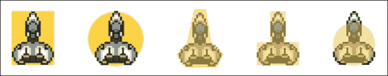
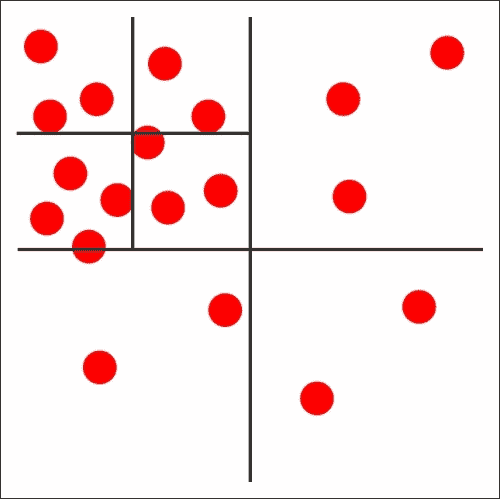

# 第四章。冲突检出

在大多数游戏中，我们需要检测物体何时相互交叉来触发动作；这被称为碰撞检测。我们将使用它来检测子弹何时击中小行星(摧毁它)以及玩家何时被小行星击中(结束游戏)。这种检测可以以离散或连续的方式进行，并且可以涉及不同类型的形状。我们将使用矩形和圆形的离散检测。

如[第 1 章](00.html "Chapter 1. Setting Up the Project")*设置项目*所述，我们不做任何物理模拟。这是一个完全不同的话题，它足够长，值得自己出书。

我们还将讨论优化技术，并实现一种称为空间分割的方法，该方法基于对象密度将区域分割成更小的区域。

顺便说一下，本章中的所有概念都可以很容易地推断出 3D 中的碰撞。

# 检测碰撞

检查碰撞有两种主要方法:

*   离散的，或后验的
*   连续的，或先验的

对于离散方法，我们推进游戏项目的状态，然后检查它们是否相交。这是一个离散的模拟，因为我们只在每个步骤结束时进行评估。它被称为后验，因为它是在物体移动之后完成的。它是反应性的。很多时候我们缺乏确切的接触点；我们只知道在模拟步骤结束时，物体会发生碰撞。

另一方面，基于每个对象的参数，连续方法在应用移动之前预测碰撞。它是在执行移动之前计算的。这就是为什么它被称为先验的原因。这种方法提供了精确的接触点，并且在我们需要精度的时候非常有用——例如物理模拟。

离散方法通常比连续方法简单一维。这使得理解和实现更加容易。它用速度换精度。

### 注

离散碰撞检测速度更快，但精度较低。

既然我们不打算使用物理，我们也不真正关心确切的接触点，我们将使用离散的方法。

## 谁能碰撞？

为了能够计算 `GameObject`碰撞，我们需要将一个形状(或身体)与一个`GameObject`相关联。这种关联需要一些关于屏幕上对象的信息，例如 *x* 和 *y* 轴上的位置以及宽度和高度。

我们将创建一个名为`ScreenGameObject`的类，它从`GameObject`开始扩展，并将包含该信息。在我们的游戏中，`Sprite`是唯一会从`ScreenGameObject`延伸出来的职业，但是如果你想在屏幕上放置非视觉的物品，当玩家穿越时会触发一些东西，这可能会派上用场，这是游戏中常见的技术。


游戏对象类层次结构

要与其他物体碰撞，你需要在屏幕上有一个位置和尺寸。`ScreenGameObject`将提供这一点。

计算碰撞的所有逻辑都将放在`ScreenGameObject`类中。这个类的存根是这样的:

```java
public abstract class ScreenGameObject extends GameObject {

  protected double mX;
  protected double mY;

  protected int mHeight;
  protected int mWidth;

  public Rect mBoundingRect = new Rect(-1, -1, -1, -1);

  public boolean checkCollision(ScreenGameObject otherObject) {
    return false;
  }

  public void onCollision(GameEngine gameEngine, ScreenGameObject sgo) {
  }
}
```

我们借此机会重构变量`width`、`height`、`X`和`Y`以获得更短、更通用的名称。在本章中，我们将继续学习这门课。

方法`checkCollision`是动作发生的地方。该方法将有不同的实现取决于我们用来计算碰撞的形状。

最后，`onCollision`用于在发生碰撞时触发动作。

## 更新游戏引擎

为了运行离散的碰撞检测，我们将在`GameEngine`上执行`onUpdate`的过程中使用名为`checkCollisions`的方法，因此它将在每次更新游戏对象时运行。我们将在更新游戏对象之后，移除对象的代码之前调用这个方法。碰撞是物体被移走的典型原因。

因为只有`ScreenGameObjects`可以有碰撞，所以我们会创建一个包含它们的特殊列表。

```java
private List<ScreenGameObject> mCollisionableObjects;
```

并且我们将保持它的更新，每当一个对象被添加到`GameEngine`或从`GameEngine`中移除时，就像我们在前一章中为单独的层所做的那样。

检查碰撞并通知相关游戏对象的代码如下。

```java
private void checkCollisions() {
  int numObjects = mCollisionableObjects.size();
  for (int i = 0; i < numObjects; i++) {
    ScreenGameObject objectA = mCollisionableObjects.get(i);
    for (int j = i + 1; j < numObjects; j++) {
      ScreenGameObject objectB = mCollisionableObjects.get(j);
      if (objectA.checkCollision(objectB)) {
        objectA.onCollision(gameEngine, objectB);
        objectB.onCollision(gameEngine, objectA);
      }
    }
  }
}

```

代码就像一个嵌套的`for`循环一样简单，该循环将每个`ScreenGameObject`与所有其他循环进行检查。如果检测到碰撞，我们将在其中涉及的两个屏幕游戏对象上执行方法`onCollision`，将它们碰撞的对象作为参数传递。

请记住，该方法具有二次复杂度，而`onUpdate` 中涉及的所有其他方法都具有线性复杂度。运行碰撞检测是昂贵的。

### 注

检查碰撞具有二次复杂度 O(n <sup>2</sup> )。

## 处理碰撞

不管我们用什么方法计算碰撞，我们必须为玩家和子弹采取的行动是一样的。让我们为他们覆盖方法`onCollision`。

在子弹的情况下，我们必须检查它碰撞的物体是否是小行星，如果是这样，我们将两个物体都从`GameEngine`中移除。

```java
public void onCollision(GameEngine gameEngine, ScreenGameObject otherObject) {
  if (otherObject instanceof Asteroid) {
    // Remove both from the game (and return them to their pools)
    removeObject(gameEngine);
    Asteroid a = (Asteroid) otherObject;
    a.removeObject(gameEngine);
  }
}
```

请注意，我们正在对象本身上调用一个方法`removeObject`。此方法负责从`GameEngine`中移除`GameObject`，并将其返回到对象池。

玩家的代码与子弹的代码几乎相同:我们只是在小行星的情况下移除两个碰撞的物体。

值得一提的是，由于我们生成子弹的方式，它们在添加到场景中时确实会与`Player`对象发生碰撞，因为我们希望它看起来像是从宇宙飞船中出现的。我们必须放弃那次碰撞。这是一个很好的做法，总是检查物体碰撞到什么。

如果我们想做一个有多条生命的游戏，应该在那个点给`GameEngine`发信号停止产卵波，去掉一条生命，产卵一个新的`Player`对象，然后继续游戏。

让我们看看碰撞是如何计算的。

# 长方形物体

我们要去实施检测的第一种方式是通过矩形的交集，这也是最简单的方法。

我们将使用`ScreenGameObject`的边框，并检查它是否与另一个`ScreenGameObject`的边框相交。

边界矩形在我们每次更新精灵的位置时都会改变，因为我们可能需要检查许多其他对象，所以最好在`onUpdate`之后重新计算它。我们要做一个新的方法叫做`onPostUpdate`，并且在里面做。

我们必须给`ScreenGameObject`增加一个新的方法。

```java
public void onPostUpdate(GameEngine gameEngine) {
  mBoundingRect.set(
    (int) mX,
    (int) mY,
    (int) mX + mWidth,
    (int) mY + mHeight);
}
```

如果需要在其他对象上覆盖`onPostUpdate`，记得一定要调用 super 方法，否则碰撞会行为不端。

然后，当检查碰撞时，我们检查矩形碰撞:

```java
@Override
public boolean checkCollision(ScreenGameObject otherObject) {
  return checkRectangularCollision(otherObject);
}
```

最后，虽然计算矩形的交点是一个非常容易的操作，但是由于类`Rect`已经为我们提供了一个实用的方法来实现，所以我们将使用它。

```java
private boolean checkRectangularCollision(ScreenGameObject other) {
  return Rect.intersects(mBoundingRect, other.mBoundingRect);
}
```

## 增加视觉反馈

当处理碰撞时，真正有帮助的是获得一些关于正在发生的事情的视觉反馈。为此，我们将绘制黄色边框作为精灵的背景:

```java
@Override
public void onDraw(Canvas canvas) {
  if (mX > canvas.getWidth() || mY > canvas.getHeight()
    || mX < -mWidth || mY < -mHeight) {
    return;
  }
  mPaint.setColor(Color.YELLOW);
  canvas.drawRect(mBoundingRect, mPaint);

  mMatrix.reset();
  [...]
  canvas.drawBitmap(mBitmap, mMatrix, null);
}
```



是时候尝试一下我们闪亮的碰撞检测方法，看看它的表现了。剧透提醒:不太好。

## 利弊

这种碰撞检测有一些优点:

*   易于实施
*   快速评估

但它也有一些重要的缺陷:

*   如果精灵有填充，碰撞面积太大，不现实。
*   当精灵旋转时，我们不旋转矩形。
*   碰撞非常严格。系统检测只有透明像素的碰撞。当拐角接触时，这尤其糟糕。

我们可以通过裁剪精灵或者增加在`ScreenGameObject`上设置边距的可能性来解决第一个问题。

第二个问题可以用一些简单的数学来解决，但是它使代码变得复杂，并且结果并不是比圆形碰撞体更好的解决方案。这超出了本书的范围，留给读者做练习。



矩形物体在图像上不需要填充，并且仍然会产生误报

不幸的是，最后一个问题是这种方法固有的，除非我们使用边界多边形或矩形组合，否则无法解决。

# 圆形物体

我们可以用来探测碰撞的下一种物体是圆形。为此，我们将考虑圆的直径是精灵的最大尺寸。我们必须向名为`mRadius`的`ScreenGameObject`添加一个成员变量，并将这段代码添加到精灵的构造函数中:

```java
mRadius = Math.max(mHeight, mWidth)/2;
```

请注意，从`ScreenGameObject`继承的其他元素可能希望以不同的方式初始化半径。

圆形碰撞的计算相当简单:我们只需测量两个圆的中心之间的距离，并检查它是否小于半径之和。


对于圆形物体，碰撞可能发生在精灵的矩形之外

因为计算平方根是比乘法耗时得多的运算，我们将使用勾股定理定义的距离的平方:*距离**<sup>2</sup>**=δx**<sup>2</sup>**+δy**<sup>2</sup>*。

检查循环碰撞的代码如下:

```java
private boolean checkCircularCollision(ScreenGameObject other) {
  double distanceX = (mX + mWidth /2) - (other.mX + other.mWidth /2);
  double distanceY = (mY + mHeight /2) - (other.mY + other.mHeight /2);
  double squareDistance = distanceX*distanceX + distanceY*distanceY;
  double collisionDistance = (mRadius + other.mRadius);
  return squareDistance <= collisionDistance*collisionDistance;
}
```

我们计算每个轴上的距离，然后得到`squareDistance`作为方块的和。`collisionDistance`是半径的和，然后我们将其与`collisionDistance`的平方进行比较。

## 增加视觉反馈

正如我们对矩形碰撞检测所做的那样，我们将在精灵中添加一些视觉反馈，以在播放时显示碰撞区域。在这种情况下，我们只需要画一个圆:

```java
canvas.drawCircle(
  (int) (mX + mWidth / 2), 
  (int) (mY + mHeight / 2), 
  (int) mRadius, 
  mPaint);
```

而且，就这么简单我们可以看到游戏中精灵的碰撞区域。


圆形物体非常适合小行星，但是对于子弹来说太可怕了

## 利弊

这种方法也不完美，但它有一些优点:

*   对于大多数精灵来说，它比矩形效果更好
*   它很容易实现
*   它不涉及复杂的计算

但它也有一些问题——最值得注意的是，当图像大部分是矩形时，碰撞的面积太大。在子弹的情况下我们可以清楚地看到这一点。

所以，有些精灵用矩形效果更好，而有些用圆形效果更好。我们可以为每个`ScreenGameObject`设置不同的身体类型，并据此计算碰撞。

# 混合碰撞检测

我们已经看到一个单一形状并不适合所有情况，所以我们将更新我们的游戏，让我们定义每个`ScreenGameObject`用于碰撞的身体形状。为此，我们将创建一个身体类型的枚举，并在`ScreenGameObject`中有一个变量来存储该信息。

枚举`BodyType`如下:

```java
public enum BodyType {
  None,
  Circular,
  Rectangular
}
```

在精灵的情况下，我们将向构造函数添加一个指定主体类型的参数。注意我们有一个特殊的类型叫做`None`。这用于不与其他精灵碰撞的精灵。虽然我们的游戏中还没有这些，但其他类型的游戏可以拥有它们——例如，地牢爬虫上的地砖。

### 注

我们可能想要一些不会触发碰撞的精灵。这是使用`BodyType.None`完成的。

我们将为小行星和玩家使用圆形物体，为子弹使用矩形物体。

因为我们有一个可以碰撞的物体列表，如果一个`ScreenGameObject`有一个`None`的`BodyType`，我们不会把它添加到列表中；因此，我们不需要检查它的碰撞。这段代码包含在`GameEngine`的`addToLayerNow`方法中。

```java
if (object instanceof ScreenGameObject) {
  ScreenGameObject sgo = (ScreenGameObject) object;
  if (sgo.mBodyType != BodyType.None) {
    mCollisionableObjects.add(sgo);
  }
}
```

然后我们必须更新`ScreenGameObject`的`checkCollision`方法，以检查两个对象的主体是哪种类型，以及我们必须应用哪种方法:

```java
@Override
public boolean checkCollision(ScreenGameObject otherObject) {
  if (mBodyType == BodyType.Circular 
    && otherObject.mBodyType == BodyType.Circular) {
    return checkCircularCollision(otherObject);
  }
  else if (mBodyType == BodyType.Rectangular 
    && otherObject.mBodyType == BodyType.Rectangular) {
    return checkRectangularCollision(otherObject);
  }
  else {
    return checkMixedCollision(otherObject);
  }
}
```

请注意，在执行的这一点上，我们知道对象是一个`ScreenGameObject`，并且它有一个不是`None`的`BodyType`。

如果两个物体都有矩形物体，我们使用矩形碰撞检测方法。如果两者都有圆形物体，我们使用圆形碰撞检测方法。在任何其他情况下，其中一个是圆形的，另一个是矩形的，所以我们有一个新的方法来处理这种情况:`checkMixedCollision`。

要计算一个矩形和一个圆是否碰撞，我们必须检查矩形最靠近圆的点是否在里面(到圆心的距离小于半径)。

如果我们把问题隔离在每个坐标上，那么最接近圆的矩形点就可以很容易地计算出来。


圆和矩形及其最近点的可能相对位置

我们将讨论垂直轴(这更容易区分，因为子弹很高)。横轴遵循等效逻辑:

*   我们画一条穿过圆心的水平线。
*   如果那条线与矩形相交，交点就是最近的点。因为我们只考虑垂直轴，所以该值是圆心的 *y* 坐标。
*   如果矩形在线下方，则最接近圆的点的 *y* 坐标是矩形的顶部位置( *y* 坐标)。
*   如果矩形在线上方，则最接近圆的点的 *y* 坐标为矩形的底部位置( *y* + `height`)。

请记住，在计算机图形中，【0，0】点位于屏幕左上角， *y* 轴正下方。

现在算法已经清楚了，让我们看看代码:

```java
private boolean checkMixedCollision(ScreenGameObject other) {
  ScreenGameObject circularSprite;
  ScreenGameObject rectangularSprite;
  if (mBodyType == BodyType.Rectangular) {
    circularSprite = this;
    rectangularSprite = other;
  }
  else {
    circularSprite = other;
    rectangularSprite = this;
  }

  double circleCenterX = circularSprite.mX + circularSprite.mWidth /2;
  double positionXToCheck = circleCenterX;
  if (circleCenterX < rectangularSprite.mX) {
    positionXToCheck = rectangularSprite.mX;
  }
  else if (circleCenterX > rectangularSprite.mX + rectangularSprite.mWidth) {
    positionXToCheck = rectangularSprite.mX + rectangularSprite.mWidth;
  }
  double distanceX = circleCenterX - positionXToCheck;

  double circleCenterY = circularSprite.mY + circularSprite.mHeight /2;
  double positionYToCheck = circleCenterY;
  if (circleCenterY < rectangularSprite.mY) {
    positionYToCheck = rectangularSprite.mY;
  }
  else if (circleCenterY > rectangularSprite.mY + rectangularSprite.mHeight) {
    positionYToCheck = rectangularSprite.mY + rectangularSprite.mHeight;
  }
  double distanceY = circleCenterY - positionYToCheck;

  double squareDistance = distanceX*distanceX + distanceY*distanceY;
  if (squareDistance <= circularSprite.mRadius*circularSprite.mRadius) {
    // They are overlapping
    return true;
  }
  return false;
}
```

我们首先确定哪个物体有圆形物体，哪个物体有矩形物体，然后将它们设置为局部变量。

然后我们按照我们已经描述过的逻辑计算最近点的 *x* 和 *y* 坐标。这个组合给了我们九个可能的相对位置，你可以在图中看到。

最后，我们计算从该点到圆心的平方距离，并检查它是否小于半径的平方。

## 增加视觉反馈

添加视觉反馈也很简单。我们只需要运行代码，根据精灵的身体类型，画一个矩形或一个圆形。

```java
mPaint.setColor(Color.YELLOW);
if (mBodyType == BodyType.Circular) {
  canvas.drawCircle(
    (int) (mX + mWidth / 2), 
    (int) (mY + mHeight / 2), 
    (int) mRadius, 
    mPaint);
}
else if (mBodyType == BodyType.Rectangular) {
  canvas.drawRect(mBoundingRect, mPaint);
}
```



## 形状的其他选项

至此，我们已经介绍了使用简单形状进行碰撞检测的基本选项。为了获得游戏的良好感觉，你需要特别注意每个精灵的形状，看看哪个形状最适合它，也许可以进行一些修改，比如缩小半径。为此，我建议您保持视觉反馈打开，以检查近似值。

也有可能使用多边形作为形状或多个矩形。这些都是提高碰撞检测的相当简单的方法，并且不太难实现。我们让读者更深入地探讨这个主题，因为它需要微调。

在宇宙飞船的情况下，最好的形状是两个矩形的组合，但是，当我们对圆形物体感到满意时，我们就这样离开它。



飞船的不同形状选择

## 优化

检查碰撞是一个二次复杂度的算法。如果要检查的对象数量增加，可能会很快成为瓶颈。

一种选择是保留对象之间比较的先前状态的记录，然后如果两个对象自上次检查以来都没有改变，则返回旧值，或者使用旧状态作为计算新状态的参数。这对于 3D 游戏来说尤其方便，在 3D 游戏中，碰撞检测需要更复杂的算法。

还有一种优化叫做空间分区，它利用了对象的邻近性。这种技术是基于这样一种思想，即物体只能与屏幕上与其接近的其他元素发生碰撞。很明显，对吧？

为了实现空间分区，我们将使用一种称为`QuadTree`的数据结构。

## 空间划分和四叉树

一个`QuadTree`类似于一个二叉树，除了每个不是叶子的节点有四个子节点而不是两个。

这意味着表示将空间划分为四个扇区，每个扇区由一个子扇区表示。每个孩子可以有另外四个节点，或者只是一片叶子。这种设计使得在需要时递归应用分区成为可能。



密度高的递归分区示例。

我们只需要在空间中的对象数量太大的情况下对空间进行分区。这意味着某些具有高对象密度的部分可能会被分割几次，而其他部分则不会。

将这一概念应用于 3D 游戏时，数据结构被称为`OctTree`，因为当我们有三个维度时，空间被分成八个部分。

填充`QuadTree`的算法非常简单:

*   我们检查空间中有多少个物体，如果数量不太大(我们使用常数`MAX_OBJECTS_TO_CHECK`来表示)，我们将像以前一样运行碰撞检测，每隔一个物体检查一个
*   否则，将空间分成四个象限或区域
*   对于每个象限，检查哪些对象位于内部(一个对象可能位于多个象限)
*   对于每个象限，递归应用相同的算法

每个`QuadTree`都有一个`Rect`成员，指定其区域和要检查的对象列表。

在`GameEngine`中，我们将替换对象列表，以检查与某个`QuadTree`的根节点的冲突。当对象被添加到`GameEngine`或从`QuadTree`中移除时，我们将在该节点中添加或移除对象，并委托`QuadTree`检查碰撞。

在`GameEngine`的构造器上，我们将设置根节点的面积:

```java
mQuadTreeRoot.setArea(new Rect(0,0,mWidth, mHeight));
```

在`GameEngine`上检查碰撞的代码被简化为一行:

```java
private void checkCollisions() {
  mQuadTreeRoot.checkCollisions(this);
}
```

然后，在 `QuadTree`内部，检查碰撞的代码如下:

```java
public void checkCollisions(GameEngine gameEngine) {
  int numObjects = mGameObjects.size();
  if (numObjects > MAX_OBJECTS_TO_CHECK && sQuadTreePool.size() >= 4) {
    splitAndCheck(gameEngine);
  }
  else {
    for (int i = 0; i < numObjects; i++) {
      ScreenGameObject objectA = mGameObjects.get(i);
      for (int j = i + 1; j < numObjects; j++) {
        ScreenGameObject objectB = mGameObjects.get(j);
        if (objectA.checkCollision(objectB)) {
          objectA.onCollision(gameEngine, objectB);
          objectB.onCollision(gameEngine, objectA);
        }
      }
    }
  }
}
```

有两种可能。如果我们池中物体太多，超过四个`QuadTree`物体，我们分割空间并检查孩子身上的碰撞。如果不是这样，我们就像以前一样运行碰撞检测方法，在列表中的所有对象之间迭代。

方法`splitAndCheck`是这样的:

```java
private void splitAndCheck(GameEngine gameEngine) {
  for (int i=0 ; i<4; i++) {
    mChildren[i] = sQuadTreePool.remove(0);
  }
  for (int i=0 ; i<4; i++) {
    mChildren[i].setArea(getArea(i));
    mChildren[i].checkObjects(mGameObjects);
    mChildren[i].checkCollisions(gameEngine);
    // Clear and return to the pool
    mChildren[i].mGameObjects.clear();
    sQuadTreePool.add(mChildren[i]);
  }
}
```

我们从池中取出四个`QuadTree`对象，并将其分配给子数组中的元素。考虑到算法的递归性质，在开始时这样做很重要。

对于每个孩子，我们定义区域，这意味着将当前区域分成四个相等的矩形，检查哪些对象在该区域内，然后检查碰撞，这又是递归函数。一旦这样做了，我们清除孩子，并返回到游泳池。

最后一点——`getArea`只需重用一个`Rect`对象，将其设置为四个象限的值。

```java
private Rect getArea(int area) {
  int startX = mArea.left;
  int startY = mArea.top;
  int width = mArea.width();
  int height = mArea.height();
  switch (area) {
    case 0:
      mTmpRect.set(startX, startY, 
        startX + width / 2, startY + height / 2);
      break;
    case 1:
      mTmpRect.set(startX + width / 2, startY, 
        startX + width, startY + height / 2);
      break;
    case 2:
      mTmpRect.set(startX, startY + height / 2, 
        startX + width / 2, startY + height);
      break;
    case 3:
      mTmpRect.set(startX + width / 2, startY + height / 2, 
        startX + width, startY + height);
      break;
  }
  return mTmpRect;
}
```

为了了解四叉树的优化水平，让我们假设屏幕上有 100 个对象，它们只分布在两个象限中。这是这种算法提供最佳优化的情况之一。


如果不使用`QuadTree`技术，需要评估的碰撞次数是 50.000。对列表迭代两次给出 n <sup>2</sup> /2 碰撞检查。

当我们将空间分成四个部分时，第一个和第四个象限(50 <sup>2</sup> /2)的碰撞检查量为 1.250，其他象限无碰撞检查量。我们必须添加 400 个操作，需要这些操作来查看每个对象位于哪个部分(四个象限中的 100 个对象)。

对我们来说，检查物体处于哪个象限与检查碰撞的复杂性相似，但是对于 3D 中的碰撞，碰撞检查要昂贵得多。

### 重复碰撞

在使用空间划分时，有一种特殊的情况我们应该注意:有些冲突可以检测两次。

当位于两个象限相交处的两个对象之间发生碰撞时，两个对象都在两个象限中；当算法检查冲突时，它会在每个冲突中被检测到。在最坏的情况下，当物体被放置在四个象限的交叉点上时，它将被检测四次。

为了解决这个问题，我们将保留一个已经检测到的冲突列表，并且只处理以前没有检测到的冲突。

`Collision`类很简单。它只包含两个`ScreenGameObject`实例、一个`equals`方法和两个静态方法来处理它的池:

```java
public class Collision {
  private static List<Collision> sCollisionPool = new ArrayList<Collision>();

  public static Collision init(ScreenGameObject objectA, ScreenGameObject objectB) {
    if (sCollisionPool.isEmpty()) {
      return new Collision(objectA, objectB);
    }
    Collision c = sCollisionPool.remove(0);
    c.mObjectA = objectA;
    c.mObjectB = objectB;
    return c;
  }

  public static void release(Collision c) {
    c.mObjectA = null;
    c.mObjectB = null;
    sCollisionPool.add(c);
  }

  public ScreenGameObject mObjectA;
  public ScreenGameObject mObjectB;

  public Collision(ScreenGameObject objectA, ScreenGameObject objectB) {
    mObjectA = objectA;
    mObjectB = objectB;
  }

  public boolean equals (Collision c) {
    return (mObjectA == c.mObjectA && mObjectB == c.mObjectB)
      || (mObjectA == c.mObjectB && mObjectB == c.mObjectA);
  }
}
```

我们将检测到的碰撞列表作为参数添加到`checkCollisions`方法中，并确保在再次检查之前在`GameEngine`上对其进行清理。`checkCollisions` 上更新的`GameEngine`是这样的:

```java
private List<Collision> mDetectedCollisions = new ArrayList<Collision>();

private void checkCollisions() {
  // Release the collisions from the previous step
  while (!mDetectedCollisions.isEmpty()) {
    Collision.release(mDetectedCollisions.remove(0));
  }
  mQuadTreeRoot.checkCollisions(this, mDetectedCollisions);
}
```

请注意，因为我们正在使用一个池，所以我们不能只清除列表；我们需要单独释放每个元素。

最后，我们验证之前没有检测到碰撞，在`QuadTree`上检查。

```java
public void checkCollisions(GameEngine gameEngine, List<Collision> detectedCollisions) {
  int numObjects = mGameObjects.size();
  if (numObjects > MAX_OBJECTS_TO_CHECK && sQuadTreePool.size() >= 4) {
    // Split this area in 4
    splitAndCheck(gameEngine, detectedCollisions);
  }
  else {
    for (int i = 0; i < numObjects; i++) {
      ScreenGameObject objectA = mGameObjects.get(i);
      for (int j = i + 1; j < numObjects; j++) {
        ScreenGameObject objectB = mGameObjects.get(j);
        if (objectA.checkCollision(objectB)) {
          Collision c = Collision.init(objectA, objectB);
          if (!hasBeenDetected(detectedCollisions, c)) {
            detectedCollisions.add(c);
            objectA.onCollision(gameEngine, objectB);
            objectB.onCollision(gameEngine, objectA);
          }
        }
      }
    }
  }
}
```

请注意，冲突列表在整个过程中都是必需的，它必须作为计算状态的部分传递给递归方法。

# 总结

现在我们的游戏真的可以玩了，我们可以探测到子弹什么时候碰到小行星并摧毁它们；此外，我们必须小心，因为我们的船也可能被他们摧毁。

我们已经学习了如何用矩形和圆形物体进行简单的碰撞检测，为每个特定的精灵调整物体。

我们还学习了一些碰撞检测的优化技术，并实现了一个利用空间划分的优化技术。

我们路线图的下一步是给游戏增加一些趣味性。你没注意到小行星错过了一些爆炸吗？在下一章中，我们将讨论如何为效果创建粒子系统。