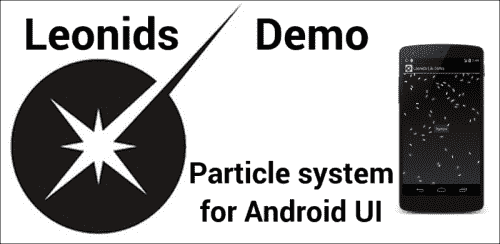
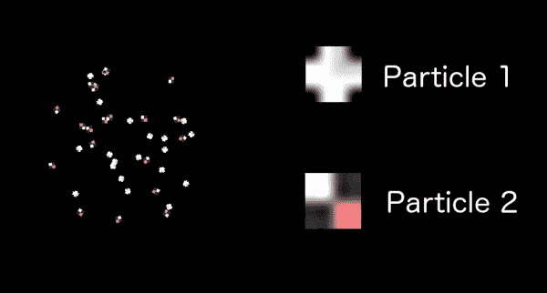

# 五、粒子系统

粒子系统是一种在视频游戏中广泛使用的技术，用于模拟用其他方法渲染复杂的现象。它们的典型用法包括爆炸、烟火、烟、火、水等等。它们通常是高度混乱的系统。

他们的基础是使用大量被称为粒子的小精灵。它们的行为是参数化的，因此每个粒子都有一组不同的伪随机值。这使得粒子系统的每一种用法都不同，但看起来仍然相似。

大多数游戏引擎都包含一种实现粒子系统的方法。我们的发动机也会有。

我们的代码将基于自由软件项目 Leonids，这是一个在标准 Android UI 中显示粒子系统的库。我们将把它改装成我们的发动机使用。

在解释了粒子系统的基础之后，我们将实现几个单粒子系统的例子来模拟爆炸，以及一些连续发射器来模拟小行星的踪迹和宇宙飞船引擎的烟雾。

# 一般概念

我们将制作我们的粒子系统，模仿 http://plattysoft.github.io/Leonids/的狮子座粒子系统库。这个项目是我制作的一个自由软件库，用来在标准的安卓用户界面中使用粒子系统。



狮子座图书馆的演示可以在谷歌游戏上找到

因此，Leonids 实现了自己的更新和绘制线程，以及一个简化的`GameView`。我们已经拥有了所有这些，所以我们将修改代码以适应我们的需求。

我们将在本章中使用的概念是:

*   **粒子**:渲染的每个精灵
*   **粒子系统**:负责产生、更新和跟踪粒子的实体
*   **初始值设定项**:一个类根据某些参数为粒子设置一个值(在激活之前)
*   **修改器**:一个类根据经过的时间(激活时)更新粒子的值

在我们的游戏中，我们将只使用一些初始值设定项和修饰符。如果你需要扩展粒子系统的功能，可以访问 Leonids 的 GitHub 页面，从中获取思路。

让我们进入概念。

## 粒子

粒子是 `Sprites`的子类。每个粒子都是一个具有几个特征的小图像:

*   粒子没有碰撞体
*   它们的运动基于线速度和角速度
*   他们活的时间有限

理论上，你可以有一个粒子系统，粒子可以在其中碰撞——这对于模拟瀑布之类的效果很方便——但事实是，除非你也有物理学，否则这不会正常工作。为了简单起见，我们将定义粒子的`BodyType`为`None`。

一个粒子确实有线速度和角速度，它的`onUpdate`方法就是基于这些变量。每个粒子都有这些由粒子系统初始化的值。

粒子通常会修改精灵的一些属性。它们是 alpha 和 scale。我们还没有在精灵上使用它们，所以我们将为此修改`Sprite`的`onDraw`方法:

```java
float scaleFactor = (float) (mPixelFactor*mScale);
mMatrix.reset();
mMatrix.postScale(scaleFactor, scaleFactor);
mMatrix.postTranslate((float) mX, (float) mY);
mMatrix.postRotate((float) mRotation, 
  (float) (mX + mWidth*mScale / 2), 
  (float) (mY + mHeight*mScale / 2));
mPaint.setAlpha(mAlpha);
canvas.drawBitmap(mBitmap, mMatrix, mPaint);
```

碰巧的是，我们使用比例作为变换矩阵的一部分，根据像素因子来缩放子画面。现在，我们也把这个乘以感知的尺度，我们就完成了。

请注意，我们还需要将宽度和高度乘以比例，以将旋转的中心放在缩放后的精灵的中心。

另外，请注意，我们在开始时进行缩放。如果我们在平移后进行缩放，运动也会缩放，这不是我们想要的。同样，转换的顺序会影响结果。

虽然比例是变换矩阵的一部分，但α是`Paint`的参数。它的值从 0(透明)到 255(不透明)。重要的是你要记得初始化为 255，否则我们所有的精灵都是透明的。

### 注

Alpha 值从 0(透明)到 255(不透明)。

关于存活时间，我们只需要检查`onUpdate`期间粒子活跃的总时间，将其从`GameEngine`中移除，并在过期时将其返回粒子系统。

`Particle`则是扩展`Sprite`的类，有方法`activate`给它。它基于线速度和角速度的值运行更新:

```java
public class Particle extends Sprite {

  private long mTimeToLive;
  private long mTotalMillis;

  public double mSpeedX;
  public double mSpeedY;

  public double mRotationSpeed;

  protected Particle(
    ParticleSystem particleSystem, 
    GameEngine gameEngine, 
    int drawableRes) {
    super(gameEngine, drawableRes, BodyType.None);
    mParent = particleSystem;
  }

  @Override
  public void removeFromGameEngine(GameEngine gameEngine) {
    super.removeFromGameEngine(gameEngine);
    mParent.returnToPool(this);
  }

  public void activate(
    GameEngine gameEngine, 
    long timeToLive, 
    double x, 
    double y, 
    ArrayList<ParticleModifier> modifiers
    int layer) {
    mTimeToLive = timeToLive;
    mX = x-mWidth/2;
    mY = y-mHeight/2;
    addToGameEngine(gameEngine, layer);
    mModifiers = modifiers;
    mTotalMillis = 0;
  }

  @Override
  public void onUpdate(long elapsedMillis, GameEngine gameEngine) {
    mTotalMillis += elapsedMillis;
    if (mTotalMillis > mTimeToLive) {
      removeFromGameEngine(gameEngine);
    }
    else {
      mX += mSpeedX*elapsedMillis;
      mY += mSpeedY*elapsedMillis;
      mRotation += mRotationSpeed*elapsedMillis/1000d;
      for (int i=0; i<mModifiers.size(); i++) {
        mModifiers.get(i).apply(this, mTotalMillis);
      }
    }
  }
}
```

在构造函数中，我们传递一个对父级`ParticleSystem`的引用，当粒子从游戏引擎中移除时，我们将使用该引用将粒子返回给它。我们还将`BodyType.None`传递给基类构造函数，这样粒子就不会参与碰撞检测。

当我们激活粒子时，我们做几个动作:

*   设定一个生活的时间
*   初始化 *x* 和 *y* 轴上的位置，根据图像的宽度和高度进行调整
*   将其添加到`GameEngine`的特定层
*   存储`onUpdate`期间要使用的修改器列表的引用
*   将总毫秒数设置为 0 表示该粒子刚刚被激活

值得注意的是，我们保留了对修饰符列表的引用。该列表由系统中的所有粒子共享，由`ParticleSystem`类管理。

在`onUpdate`期间，我们将经过的毫秒数加到总时间中，并检查`Particle`是否已经过了其存活时间。如果是这种情况，我们将其从`GameEngine`中移除。否则，我们根据速度(线性和角度)更新位置和旋转，然后应用所有修改器。

您可能已经意识到我们使用的是线速度和角速度值，但到目前为止，我们还没有设置它们。这是由`ParticleSystem`通过初始化器完成的。这就是为什么这些变量是公开的。

让我们看看处理粒子的系统。

## 粒子系统

`ParticleSystem`本身就是控制粒子发射的那个。在某些方面与`GameController`类相似。`ParticleSystem`负责粒子的初始化、激活和繁殖。

`ParticleSystem`的职责之一是管理`Particle` 对象的池。鉴于粒子系统中有大量的粒子过期并被重用，这是使用对象池最重要的情况之一。

### 注

`ParticleSystem`有一池`Particles`。

该池在`ParticleSystem`的构造器中填充:

```java
public ParticleSystem(
    GameEngine gameEngine,
    int maxParticles,
    int drawableRedId,
    long timeToLive) {
  mRandom = new Random();

  mModifiers = new ArrayList<ParticleModifier>();
  mInitializers = new ArrayList<ParticleInitializer>();

  mTimeToLive = timeToLive;
  mPixelFactor = gameEngine.mPixelFactor;
  for (int i=0; i<maxParticles; i++) {
    mParticlePool.add(new Particle(this, gameEngine, drawableRedId));
  }
}
```

构造函数接收将同时使用的最大数量的粒子。这是我们将用于池的大小。

关于我们的粒子系统的另一个要点是，所有的粒子都有相同的图像。这在施工中传递给`ParticleSystem`。如果你想有不同的图像，你应该对每个图像使用`ParticleSystem`，就像我们在其中一个例子中所做的那样。

### 注

一个`ParticleSystem`的所有粒子都有相同的图像。

在构造器中，我们还创建了`ParticleInitializer`和`ParticleModifiers`的列表。初始化器将在激活每个粒子时使用。修改器列表将被传递给每个粒子，它将在`Particle`的`onUpdate`方法中使用，正如我们已经看到的。

这是初始化器在粒子激活过程中的用法:

```java
private void activateParticle(GameEngine gameEngine) {
  Particle p = mParticlePool.remove(0);        
  for (int i=0; i<mInitializers.size(); i++) {
    mInitializers.get(i).initParticle(p, mRandom);
  }
  p.activate(gameEngine, mTimeToLive, mX, mY, mModifiers, mLayer);
  mActivatedParticles++;
}
```

`ParticleSystem`中一个重要的设计概念是，它通过实用方法抽象初始化器和修饰符，这些实用方法中的每一个都返回`ParticleSystem`对象，因此初始化可以被链接，使代码更短更容易阅读。

让我们详细看看`ParticleInitializers`和`ParticleModifiers`。

## 初始值设定项

**初始值设定项**由 `ParticleSystem`用来根据参数设置粒子的值。为此，我们将`ParticleInitializer`定义为一个非常简单的界面:

```java
public interface ParticleInitializer {
  void initParticle(Particle p, Random r);
}
```

举个例子，我们来看看`ParticleSytem`设置粒子初始旋转的实用方法:

```java
public ParticleSystem setInitialRotationRange (int minAngle, int maxAngle) {
  mInitializers.add(new RotationInitiazer(minAngle, maxAngle));
  return this;
}
```

当我们为`Particle`设置初始旋转范围时，我们给`ParticleSystem`添加一个`RotationInitializer`类型的初始化器。然后我们返回这个，这样方法就可以被链接了。

我们可以用来配置粒子初始化的其他方法有:

*   `setRotationSpeedRange(double minRotationSpeed, double maxRotationSpeed)`
*   `setSpeedRange(double speedMin, double speedMax)`
*   `setSpeedModuleAndAngleRange(double speedMin, double speedMax, int minAngle, int maxAngle)`
*   `setRotationSpeedRange(double minRotationSpeed, double maxRotationSpeed)`

我们不会包含我们将要使用的所有初始化器的代码，因为它们都遵循相同的模式:

*   接收一组参数并定义范围
*   从范围中生成随机值
*   将值设置为`Particle`的适当变量(这可能涉及多个字段)

### 注

初始化器从一个范围中获取一个随机值，并将其设置为变量`Particle`。

作为如何实现 `ParticleInitializer`的例子，我们来看看`RotationInitializer`的代码:

```java
public class RotationInitiazer implements ParticleInitializer {

  private int mMinAngle;
  private int mMaxAngle;

  public RotationInitiazer(int minAngle, int maxAngle) {
    mMinAngle = minAngle;
    mMaxAngle = maxAngle;
  }

  @Override
  public void initParticle(Particle p, Random r) {
    int value = r.nextInt(mMaxAngle-mMinAngle)+mMinAngle;
    p.mRotation = value;
  }
}
```

够直白；初始化器将角度的最小值和最大值存储在成员变量(`mMinAngle`、`mMaxAngle`)中。初始化粒子时，它会在该范围内生成一个随机值，并将其设置为粒子的旋转变量。

所有初始化器的工作方式都是一样的；有些比其他的复杂一点。例如，`SpeedModuleAndRangeInitializer`使用三角学将速度从角度和模数转换为坐标:

```java
public class SpeedModuleAndRangeInitializer implements ParticleInitializer {

  private double mSpeedMin;
  private double mSpeedMax;
  private int mMinAngle;
  private int mMaxAngle;

  public SpeedModuleAndRangeInitializer(
      double speedMin, double speedMax, 
      int minAngle, int maxAngle) {
    mSpeedMin = speedMin;
    mSpeedMax = speedMax;
    mMinAngle = minAngle;
    mMaxAngle = maxAngle;
  }

  @Override
  public void initParticle(Particle p, Random r) {
    double speed = r.nextDouble()*(mSpeedMax-mSpeedMin) + mSpeedMin;
    int angle;
    if (mMaxAngle == mMinAngle) {
      angle = mMinAngle;
    }
    else {
      angle = r.nextInt(mMaxAngle - mMinAngle) + mMinAngle;
    }
    double angleInRads = angle*Math.PI/180d;
    p.mSpeedX = speed * Math.cos(angleInRads)/1000d;
    p.mSpeedY = speed * Math.sin(angleInRads)/1000d;
  }
}
```

在这种情况下，我们有两个范围，一个用于速度模块，另一个用于角度。当我们初始化一个粒子时，我们从它们的范围中为每个粒子获得一个值，但是然后我们需要使用`sin`和`cos`将它们转换成可以用于`Particle`的值，它们是`mSpeedX`和`mSpeedY`。

在这种情况下，我们是初始化`Particle`的两个变量。再次注意`Particle`类的这些字段是公共的，所以我们可以很容易地从这个类中修改它们。

## 修饰词

**修改器**是一个类似于初始值设定项的概念，但是它们在粒子活动时应用。

至于初始化器，我们定义了一个接口，允许它们与`Particle`类交互:

```java
public interface ParticleModifier {
  void apply(Particle particle, long milliseconds);
}
```

对我们来说，修改器对所有粒子都有相同的参数，而初始化器会为每个粒子生成一个值。这就是为什么线速度和角速度是由修改器处理的*而不是*，并且是每个粒子的变量，每个粒子可以——并且很可能会——具有不同的值。

`ParticleModifier`实例也通过`ParticleSystem`的实用程序方法进行管理，例如设置淡出的方法:

```java
public ParticleSystem setFadeOut(long millisecondsBeforeEnd) {
  mModifiers.add(
    new AlphaModifier(255, 0, mTimeToLive-millisecondsBeforeEnd, mTimeToLive));
  return this;
}
```

该方法根据粒子在系统中的时间创建`AlphaModifier`来设置淡出(从 255 到 0 的α)。

一般来说，我们可以创建自己的`ParticleModifier`实例，并通过调用`addModifier`将其添加到`ParticleSystem`中:

```java
public ParticleSystem addModifier(ParticleModifier modifier) {
  mModifiers.add(modifier);
  return this;
}
```

我们将只使用两个修改器:`AlphaModifier`用于淡出和`ScaleModifier`。

让我们检查一下`AlphaModifier`的代码:

```java
public class AlphaModifier implements ParticleModifier {

  private int mInitialValue;
  private int mFinalValue;
  private long mStartTime;
  private long mEndTime;
  private float mDuration;
  private float mValueIncrement;

  public AlphaModifier(int initialValue, int finalValue, long startMilis, long endMilis) {
    mInitialValue = initialValue;
    mFinalValue = finalValue;
    mStartTime = startMilis;
    mEndTime = endMilis;
    mDuration = mEndTime - mStartTime;
    mValueIncrement = mFinalValue-mInitialValue;
  }

  @Override
  public void apply(Particle particle, long milliseconds) {
    if (milliseconds < mStartTime) {
      particle.mAlpha = mInitialValue;
    }
    else if (milliseconds > mEndTime) {
      particle.mAlpha = mFinalValue;
    }
    else {
      double percentageValue = (miliseconds- mStartTime)*1d/mDuration;
      int newAlphaValue = (int) (mInitialValue + mValueIncrement*percentageValue);
      particle.mAlpha = newAlphaValue;
    }
  }
}
```

注意，我们有一个初始值和一个终值；如果时间小于起始时间，我们将阿尔法设置为初始值，当时间大于结束时间时，我们将阿尔法设置为最终值。

这允许我们使用同一个类来做两种事情，淡入和淡出。

对于修饰符，需要强调的是`apply`方法接收花费的毫秒总数。这是必需的，因为修改器对`Particle`一无所知。它没有任何状态，所以所有的信息都必须作为参数传递给`apply`方法。

### 注

所有粒子的修改器都是相同的，不保存任何状态。

修改器有开始时间和结束时间。当时间超出间隔时，我们将其设置为初始值或最终值。当时间在这些边界之间时，它以初始值和最终值之间增量的线性插值形式返回值。

很容易修改这个代码来使用其他类型的插值器。如果你好奇的话，可以在支持插值器的 GitHub 上查看 Leonids 的代码。

`ScaleModifier`和这个几乎一样，只是数值设置为`mScale`而不是`mAlpha`。

## 复合游戏对象和游戏引擎

直到现在，我们一直使用的 `GameObjects`都是一个单一的实体。从现在开始，我们也将拥有包括其他`GameObjects`的`GameObjects`。特别是每个对象使用的`ParticleSystems`将归其所有。

这意味着必须更新`GameEngine`中`GameObjects`的添加和移除。该对象将有两种方法来添加和删除自己从`GameEngine`和我们可以覆盖这个方法，当我们使用一个复合对象来照顾他们。

我们的改变将是停止使用来自`GameEngine`的`addGameObject`和`removeGameObject`方法，转而开始在`GameObject`上使用新的等效方法，如`addToGameEngine`和`removeFromGameEngine`。

这意味着我们应该检查项目的代码并替换所有出现的代码。这在小行星产生的`GameController`和`GameFragment`内部`GameEngine`的初始化中尤为重要，当我们添加`Player`对象时:

```java
mGameEngine = new GameEngine(getActivity(), gameView, 4);
mGameEngine.setInputController(
  new CompositeInputController(getView(), getYassActivity()));
new ParallaxBackground(mGameEngine, 20, R.drawable.seamless_space_0)
  .addToGameEngine(mGameEngine, 0);
new GameController(mGameEngine).addToGameEngine(mGameEngine, 2);
new Player(mGameEngine).addToGameEngine(mGameEngine, 3);
new FPSCounter(mGameEngine).addToGameEngine(mGameEngine, 2);
```

即使使用旧方法会在非复合对象上产生相同的结果，最好以相同的方式将所有`GameObjects`添加到`GameEngine`中，以获得一致的代码。

`addToGameEngine`和`removeFromGameEngine`的默认实现对于非复合`GameObject`来说其实非常简单:

```java
public void addToGameEngine (GameEngine gameEngine, int layer) {
  gameEngine.addGameObject(this, layer);
}

public void removeFromGameEngine (GameEngine gameEngine) {
  gameEngine.removeGameObject(this);
}
```

当我们在复合项上重写此方法时，我们必须记住调用 super 方法来添加和移除对象。

# 制造好的粒子系统

顺便提一下，粒子系统非常强大，但对它们进行调整和设计并不容易。

正如我们已经看到的，粒子系统的实现细节很简单。但是制造一个看起来真实而又好的粒子系统完全是另外一回事。

微调它们的关键是玩参数，看它们看起来如何，一次又一次，直到我们对结果感到满意。

为了试着阐明调整粒子系统的晦涩艺术，我们将做几个例子。你可以自己玩粒子和参数，看看微小的改变会有多大的不同。

使用粒子系统有两种方式:一次发射和连续发射器。让我们举一些两者的例子。

# 一枪

当使用一次射击时，我们使`ParticleSystem`一次发射所有粒子。

在这种情况下，我们不需要在`GameEngine`中添加或移除`ParticleSystem`，因为`ParticleSystem`的`onUpdate`方法不需要被调用(它仅用于发射新粒子)。

当使用一个镜头时，用我们计划用于该镜头的相同数量的粒子初始化粒子池才是合理的。

`ParticleSystem`类的`oneShot`方法如下:

```java
public void oneShot(GameEngine gameEngine, double x, double y,
    int numParticles) {
  mX = x;
  mY = y;
  mIsEmiting = false;
  for (int i=0; !mParticlePool.isEmpty() && i<numParticles; i++) {
    activateParticle(gameEngine);
  }
}
```

我们设置 *x* 和 *y* 坐标，我们将从这些坐标发射，然后将`isEmitting`设置为`false`。虽然更新`isEmitting`只有在`ParticleSystem`添加到`GameEngine`时才有必要，但我们这样做只是为了安全。在这种情况下，将`isEmitting`设置为假将使`onUpdate`干脆什么都不做。

一旦设置好参数，我们就可以从水池中获取粒子并`activate`它们。记得我们在讲解`ParticleSystem`课时已经看到了`activate`方法。作为激活的一部分，粒子被添加到`GameEngine`中。

我们将使用这种类型的粒子系统进行`Asteroids`和`Player`的爆炸。

## 小行星爆炸

对于小行星的爆炸，我们将使用一个有三个小岩石碎片的粒子，所以它看起来像小行星已经破碎成多个碎片。为了加强这种效果，我们将使粒子旋转并向任何方向移动，但不要太远。

我们创建并配置`ParticleSystem`作为`Asteroid`创建的一部分。这将确保每个小行星都有自己独立的粒子池:

```java
public Asteroid(GameController gameController, GameEngine gameEngine) {
  super(gameEngine, R.drawable.a10000, BodyType.Circular);
  mSpeed = 200d*mPixelFactor/1000d;
  mController = gameController;
  mExplisionParticleSystem = new ParticleSystem(gameEngine, EXPLOSION_PARTICLES, R.drawable.particle_asteroid_1, 700)
    .setSpeedRange(15, 40)
    .setFadeOut(300)
    .setInitialRotationRange(0, 360)
    .setRotationSpeedRange(-180, 180);
}

public void explode(GameEngine gameEngine) {
  mExplisionParticleSystem.oneShot(gameEngine, mX + mWidth / 2, mY + mHeight / 2, EXPLOSION_PARTICLES);
}
```

粒子系统的配置如下:

*   这些粒子将存活 700 毫秒。
*   它们将以每秒 15 到 40 个单位的速度向各个方向繁殖。
*   在最后的 300 毫秒，他们将有一个阿尔法修改器来平滑淡出。
*   粒子会有任何初始旋转。注意粒子不是对称的；这对于防止粒子看起来静止非常重要。
*   最后，每个粒子的角旋转速度将在每秒-180 到 180 度之间。
*   `EXPLOSION_PARTICLES`是`Asteroid`的常数。我们把它定在 15 点。

`explode`方法确实会从小行星中心触发`oneShot`，这将使所有粒子运动。

最后一个连接点是触发`explode`方法。当子弹与小行星相撞或玩家与小行星相撞时，就会发生这种情况。这是如何在`Bullet`课内完成的:

```java
@Override
public void onCollision(GameEngine gameEngine, ScreenGameObject otherObject) {
  if (otherObject instanceof Asteroid) {
    removeFromGameEngine(gameEngine);
    Asteroid a = (Asteroid) otherObject;
    a.explode(gameEngine);
    a.removeFromGameEngine(gameEngine);
  }
}
```

就是这里。很简单，对吧？由于`ParticleSystem`正在使用`oneShot`，因此不需要将其添加到`GameEngine`或从其移除。


爆炸粒子和粒子系统的细节。

## 飞船爆炸

对于`Player` 爆炸，我们将采用不同的方法。我们希望它看起来更有戏剧性。我们将有一个比小行星更大的速度值，以给人一种更具攻击性的爆炸的印象，并扩大范围。我们还将使用两个不同颜色的不同粒子，而不是一个有几个碎片的粒子。

由于每个`ParticleSystem`被设计为只保存一种类型的`Particle`(一个图像)，我们将在`Player`类中有两个`ParticleSystem`实例，它们将在构造函数中初始化:

```java
mExplisionParticleSystem1 = new ParticleSystem(gameEngine,
EXPLOSION_PARTICLES, R.drawable.particle_ship_explosion_1, 600)
  .setSpeedRange(30, 150)
  .setInitialRotationRange(0,360)
  .setFadeOut(200);
mExplisionParticleSystem2 = new ParticleSystem(gameEngine,
EXPLOSION_PARTICLES, R.drawable.particle_ship_explosion_2, 600)
  .setSpeedRange(30, 150)
  .setInitialRotationRange(0,360)
  .setFadeOut(200);
```

在这种情况下，每个粒子都非常小且对称，所以我们不需要转速。因为它们比以前快得多，所以生存时间也短了一点，淡出也更清晰了。

在这种情况下，`EXPLOSION_PARTICLES`被设置为 20，因此总共有 40 个粒子。

当`Player`物体爆炸时(作为`onCollision`的一部分)，我们在两个`ParticleSystem`实例上触发`oneShot`:

```java
mExplisionParticleSystem1.oneShot(gameEngine, mX + mWidth / 2, mY+mWidth/2, EXPLOSION_PARTICLES);
mExplisionParticleSystem2.oneShot(gameEngine, mX+mWidth/2, mY+mWidth/2, EXPLOSION_PARTICLES);
```

如你所见，如果你现在运行它，爆炸的感觉和小行星完全不同:



# 发射器

使用粒子系统的另一种方法是将它们配置为发射器。这意味着，当系统处于活动状态时，每秒钟会发出一定比例的粒子。

计算正确的池大小非常容易。这只是一个基于粒子存活时间和你想要的每秒粒子数的公式。例如，使用每秒 20 个粒子，500 毫秒的生存时间，您只需要 10 个粒子的池，因为它们在死亡时会返回到池中。

重要的是要记住，作为发射器的`ParticleSystem`需要从`GameEngine`中添加和移除，因为`onUpdate`方法需要检查更多粒子的产生。`ParticleSystem`的`onUpdate`方法如下:

```java
@Override
public void onUpdate(long elapsedMillis, GameEngine gameEngine) {
  if (!mIsEmiting){
    return;
  }
  mTotalMillis += elapsedMillis;
  // We have to make sure that we have to keep emiting
  while ( !mParticlePool.isEmpty() && // We have particles in the pool
    mActivatedParticles < mParticlesPerMillisecond*mTotalMillis) {
    // and we are under the number of particles that should be launched
    // Activate a new particle
    activateParticle(gameEngine);
  }
}
```

代码相当简单。首先我们检查系统是否有辐射。如果系统没有发射，我们不需要更新任何东西，所以我们可以简单地返回。

如果它在发射，我们检查是否必须激活一个粒子。为此，我们将已激活的粒子数与应已激活的粒子数进行比较(*粒子数毫秒*总毫秒数*)。我们还需要确保我们可以从池中获得一个粒子(它不是空的)。

一旦我们知道我们需要产生一个粒子，并且我们有一些粒子可用，我们就开始激活。`activateParticle`方法的最后一行增加了激活粒子的计数。

请注意，激活粒子的数量是已被发射器激活的粒子总数，而不是当前的激活粒子数量。

`ParticleSystem`的发射方法如下:

```java
public void emit (int particlesPerSecond) {
  mActivatedParticles = 0;
  mTotalMillis = 0;
  mParticlesPerMillisecond = particlesPerSecond/1000d;
  mIsEmiting = true;
}
```

够简单；它重置激活粒子的数量和时间计数器。它还计算每毫秒的粒子速率(该参数作为每秒粒子数传递)，然后将`mIsEmitting`设置为`true`，因此`onUpdate`方法应该有效。

最后，要停止发射，我们只需要将`mIsEmitting`设置为`false`:

```java
public void stopEmiting() {
  mIsEmiting = false;
}
```

让我们看一些发射器的例子。

## 小行星轨迹

如果小行星留下痕迹，它们看起来会比 T2 冷很多。在`Asteroid`类的构造函数中，我们将在爆炸的相同位置为踪迹创建一个`ParticleSystem`:

```java
mTrailParticleSystem = new ParticleSystem(gameEngine, 50, R.drawable.particle_dust, 600)
  .addModifier(new ScaleModifier(1, 2, 200, 600))
  .setFadeOut(200);
```

对于这条轨迹，我们使用了一个粒子，也就是两个小片段。为了给步道一个更好的感觉，我们加上了`ScaleModifier`和淡出。

我们想要一个取决于小行星值的初始化。为此，我们将在调用小行星的`init`期间设置所有初始值:

```java
public void init(GameEngine gameEngine) {
  […] // Standard initialization
  mTrailParticleSystem.clearInitializers()
    .setInitialRotationRange(0,360)
    .setRotationSpeed(mRotationSpeed * 1000);      
    .setSpeedByComponentsRange(
      -mSpeedY * 100, mSpeedY * 100, 
      mSpeedX * 100, mSpeedX * 100);
}
```

首先，我们清理所有的初始化器，然后设置它有任何旋转。转速将与小行星的转速相同。然后，线速度将成比例，并从小行星组件交换。这将使轨迹垂直于小行星移动。

`ParticleSystem`的发射点需要在小行星上每次运行`onUpdate`时更新，以保持从正确位置发射:

```java
mTrailParticleSystem.setPosition(mX + mWidth / 2, mY + mHeight / 2);
```

因为它是发射器，所以需要与`Asteroid`一起添加到`GameEngine`和从`Asteroid`中移除。为此，我们已经定义了`addToGameEngine`和`removeFromGameEngine`方法。我们现在将覆盖它们:

```java
@Override
public void addToGameEngine (GameEngine gameEngine, int layer) {
  super.addToGameEngine(gameEngine, layer);
  mTrailParticleSystem.addToGameEngine(gameEngine, mLayer-1);
  mTrailParticleSystem.emit(15);
}

@Override
public void removeFromGameEngine(GameEngine gameEngine) {
  super.removeFromGameEngine(gameEngine);
  mTrailParticleSystem.stopEmiting();
  mTrailParticleSystem.removeFromGameEngine(gameEngine);
}
```

请注意，我们将其添加到小行星下方的`GameEngine`层，因此粒子系统总是在它们后面，而不是相反。

有了这个，我们就有了所有的碎片，我们可以看到我们的小行星现在看起来有多好:


## 宇宙飞船的发动机

为了最后的效果，我们将给宇宙飞船添加一些烟雾。因为它是一个发射器，所以它需要通过与玩家对象一起在`GameEngine`中添加和移除来尊重`GameObject`生命周期，就像我们对小行星轨迹所做的那样:

```java
@Override
public void removeFromGameEngine(GameEngine gameEngine) {
  super.removeFromGameEngine(gameEngine);
  mEngineFireParticle.removeFromGameEngine(gameEngine);
}

@Override
public void addToGameEngine(GameEngine gameEngine, int layer) {
  super.addToGameEngine(gameEngine, layer);
  mEngineFireParticle.addToGameEngine(gameEngine, mLayer - 1);
  mEngineFireParticle.emit(12);
}
```

在`onUpdate` 方法中，我们必须将玩家的位置与`ParticleSystem`的发射器同步，就像我们对小行星所做的那样:

```java
mEngineFireParticle.setPosition(mX+mWidth/2, mY+mHeight);
```

请注意，我们将发射器设置在飞船的底部，而不是中心。这使得烟雾出现在正确的地方。

最后，我们将在`Player`对象的构造器中创建`ParticleSystem`，与我们已经为爆炸创建的另外两个相同:

```java
mEngineFireParticle = new ParticleSystem(gameEngine, 50, R.drawable.particle_smoke, 600)
  .setInitialRotationRange(0, 360)
  .setRotationSpeedRange(-30, 30)
  .setSpeedModuleAndAngleRange(50, 80, 60, 120)
  .setFadeOut(400);
```

这些配置方法到现在都是我们熟知的。

我们有初始旋转[0-360]的整个范围和每秒-30 到 30 度的旋转速度。我们也有一个更长的淡出其他系统，使其以平稳的方式溶解。

我们还使用`setSpeedModuleAndAngleRange`，它根据角度和模块来设置速度。我们希望烟雾在[60-120]度的范围内(也就是说，60 度的弧线到达飞船底部)以变化不大的速度离开飞船。

您现在可以运行它，看看它的外观:


在看静态图像时，你可以看到每个粒子，但是当它们在运动时，感觉真的很好。

或者，如果在`onUpdate`期间有一些用户输入，您可以启动这个粒子系统，如果没有，您可以停止它，这将提供一个更动态的外观和感觉，因为烟雾只会在飞船移动时出现。

# 总结

我们已经学习了粒子系统是如何工作的，以及如何将它们集成到我们的游戏中。我们将`ParticleSystem`和粒子本身包含在我们的`GameEngine`中。我们还学习了初始化器和修饰符，以及如何创建新的来扩展系统。

然后我们看到了如何编写一个内部有其他`GameObject`实例的`GameObject`。特别是，粒子系统通常属于另一个`GameObject`。为此，`ParticleSystem`进入了`GameObject`的生命周期。我们更新了`GameEngine`使其更容易添加`GameObjects`成分。

最后，我们检查了两个单次拍摄的例子和两个覆盖各种不同参数的发射器的例子。

总而言之，这四个`ParticleSystem`实例让游戏感觉活灵活现多了。让我们进入让游戏感觉生动的最后一步:音效。