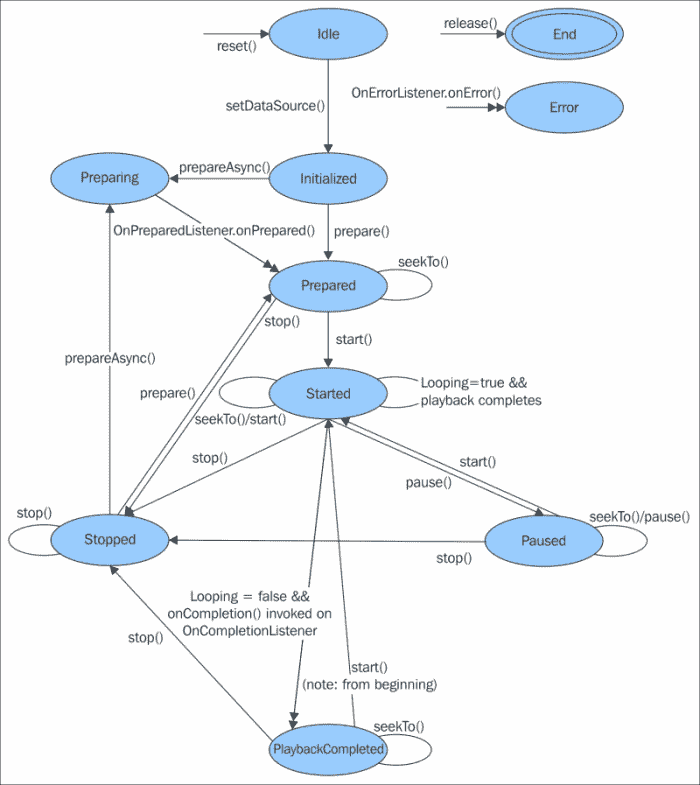

# 第六章。声音效果和音乐

没有声音的游戏感觉不完整。在这一章中，我们将探索在安卓系统中播放音效和音乐的不同选项，我们将构建一个`SoundManager`类来处理它们，我们将看到它如何与`GameEngine`交互。

对于音效，我们将使用`SoundPool`，它是专门为通过在内存中预加载播放小声音而设计的。为了触发音效，我们将引入`GameEvent`的概念，并了解它们如何通过`GameEngine`传播。

在背景音乐的情况下，我们将直接使用`MediaPlayer`，因为长曲目与`SoundPool`配合不好，`MediaPlayer`是播放所有类型媒体文件的通用解决方案。

最后，我们将在主屏幕上添加启用和禁用音效和音乐的控件，并使`SoundManager`处理它们。

# 声音管理器

为了管理声音和音乐，我们将有一个名为`SoundManager`的课程。这个类将沿着`Application`代码只实例化一次，并且将在`YassActivity`的`onCreate`完成。这样做有几个原因:

*   音效加载确实需要一点时间，所以最好提前加载
*   我们可能想在菜单中使用声音和音乐
*   加载声音和音乐需要内存；重复这一点是没有意义的

让我们看看我们需要对`YassActivity`进行的修改:

```java
private SoundManager mSoundManager;

@Override
protected void onCreate(Bundle savedInstanceState) {
  super.onCreate(savedInstanceState);
  [...]
  setVolumeControlStream(AudioManager.STREAM_MUSIC);
  mSoundManager = new SoundManager(getApplicationContext());
}

public SoundManager getSoundManager() {
  return mSoundManager;
}
```

我们有一个包含`SoundManager`的字段，我们在`onCreate`方法中初始化它。我们还为它提供了一个 getter 方法。

还有一行需要特别提及:

```java
setVolumeControlStream(AudioManager.STREAM_MUSIC);
```

此代码将应用程序的音量控制流设置为音乐。它告诉操作系统，当我们在应用程序运行时按下物理音量键时，我们希望它修改音乐音量，而不是默认音量。安卓上有七种流类型，从系统和铃声音量到警报和通知，每种声音类型一种。

### 注

要使游戏运行时按下的音量键超过音乐音量，我们应该在活动中调用`setVolumeControlStream(AudioManager.STREAM_MUSIC)`。

由于我们将播放声音，这个小调整对于允许用户在游戏过程中控制声音的音量非常重要。

`SoundManager`将使用安卓 SDK 的不同类别来处理声音和音乐。它还将提供不同的方法来访问它们。音效和音乐是`SoundManager`类中独立的特性，所以我们将分别来看它们。

# 声音 FX

音效将用于游戏中的事件，如爆炸、发射子弹等，但也可以用于其他情况，如菜单点击和对话框出现。在我们的游戏中，我们将为小行星和宇宙飞船的爆炸以及激光发射添加音效。

我们将开始讨论一些获得游戏音效的方法。如果没有声音文件，我们就不能工作，对吗？

一旦我们的声音到位，我们将更新`GameEngine`以提供一种在游戏中发出事件信号的方式，并且我们将让`SoundManager`知道其中一个事件何时发生。

最后，我们将解释 `SoundPool`是如何工作的，以及如何将其包含在我们的`SoundManager`中，将游戏事件与音效相关联。

动手吧——我们去拿些声音文件。

## 如何创建声音 FXs

对于独立开发者来说，有几个地方可以获得音效。已经提到的`OpenGameArt`不仅有图形，还有声音。寻找游戏音效的最佳地点之一是网站[www.freesound.org](http://www.freesound.org)(原“自由声音项目”)。


用它自己的话来说:Freesound 旨在创建一个巨大的协作数据库，其中包含根据知识共享许可发布的音频片段、样本、录音、哔哔声等，允许它们被重用。Freesound 提供了新的有趣的方法来访问这些样本，允许用户使用关键词、一种“听起来像”的浏览类型等以新的方式浏览声音。

### 注

在知识共享许可下，Freesound.org 是一个很好的声音数据库。

您可能需要一段时间才能浏览到所需的声音，但这是一个非常有用的资源。我们在药丸树制作粉笔球和太空猫时使用了它。

对于需要复古风格的简单音效的游戏，还有另一个有趣的项目:Bfxr([www.bfxr.net/](http://www.bfxr.net/))

### 注

Bfxr 是一个简单方便的工具，可以创建复古风格的音效。

Bfxr 允许你用声波做很多事情，但你不需要成为专家，因为它还有一些按钮，可以根据某些参数生成新的随机声音。这些按钮用于拍摄、拾取、加电、点击等。Bfxr 的灵感来源于 as3sfxr，它也比较简单。


bfxr 网络版的用户界面

您对所有使用 bfxr 制作的声音拥有完全的权利，因此您可以自由地将其用于任何目的，无论是商业目的还是其他目的。

对于 YASS，我们使用 bfxr 来产生一些爆炸和激光声音，然后选择我们更喜欢的声音。你可以自己做，只需要几分钟。

现在我们有了声音，我们需要一个地方把它们放在我们的项目中。我们可以将声音存储为原始资源(在`res/raw`下)，但是将它们放在`assets`文件夹中更方便，在那里我们可以有一个层次结构，并且对文件命名没有限制。

### 注

我们将声音文件存储在`assets`文件夹下。

我们必须在项目的`src/main`目录下创建`assets`文件夹。在`assets`文件夹中，我们将为我们所有的声音文件创建另一个名为`sfx`的文件夹。

## 游戏事件

正如我们提到的，我们将把音效和`GameEvents`联系起来，所以首先我们需要我们的`GameEngine`来支持这样的`GameEvents`。为此，我们创建了一个包含我们感兴趣的`GameEvents`的枚举:

```java
public enum GameEvent {
  AsteroidHit,
  SpaceshipHit,
  LaserFired
}
```

`GameEvents`将以类似于`BroadcastReceiver`或`EventBus`的方式在`GameEngine`上传播。我们在`GameEngine`中创造了一个新方法`onGameEvent`。当`GameEvent`发生时，将调用该方法。

```java
public void onGameEvent (GameEvent gameEvent) {
  mSoundManager.playSoundForGameEvent(gameEvent);
}
```

当`GameEvent`到达时，我们将其传达给`SoundManager`。只需在该方法中的`GameObjects`上添加一个循环，就可以轻松地让所有`GameObjects`订阅`GameEvents`。

唯一剩下的就是在事件发生时触发它们。让我们看看从`Player`对象触发的:

```java
private void checkFiring(long elapsedMillis, GameEngine gameEngine) {
  if (gameEngine.mInputController.mIsFiring
    && mTimeSinceLastFire > TIME_BETWEEN_BULLETS) {
    [...]
 gameEngine.onGameEvent(GameEvent.LaserFired);
  }
  else {
    mTimeSinceLastFire += elapsedMillis;
  }
}

@Override
public void onCollision(GameEngine gameEngine, ScreenGameObject otherObject) {
  if (otherObject instanceof Asteroid) {
    [...]
 gameEngine.onGameEvent(GameEvent.SpaceshipHit);
  }
}
```

因为`GameEvents`发生在`onUpdate`期间，我们手边总有一个对`GameEngine`的引用，发送事件就像在正确的地方添加一个方法调用一样简单。`Player`对象现在将`LaserFired`和`SpaceshipHit`的事件传递给`GameEngine`。

子弹也会触发`GameEvent`。

```java
@Override
public void onCollision(GameEngine gameEngine, ScreenGameObject otherObject) {
  if (otherObject instanceof Asteroid) {
    [...]
 gameEngine.onGameEvent(GameEvent.AsteroidHit);
  }
}
```

现在事件已经被触发并且到达`SoundManager`，我们必须在事件到达时实际播放特定的声音。为此，我们需要构建和配置`SoundPool`。

## 使用音池

`SoundPool`是一个实用工具，旨在通过低延迟播放播放多个短声音文件。它可以预加载文件，并允许我们同时播放其中的几个文件。`SoundManager`的初始构造函数如下所示:

```java
public SoundManager(Context context) {
  mContext = context;
  loadSounds();
}
```

我们将有一个加载声音的方法。目前只使用一次，但以后，当我们添加一个设置来启用或禁用它们时，声音可以加载和卸载多次。

有一个特定的方法来处理`SoundPool`的创建，因为默认的构造函数在棒棒糖上已经被弃用，新的构建方法相当冗长，并且不向后兼容；我们需要根据操作系统版本来分支代码。

```java
private void createSoundPool() {
  if (Build.VERSION.SDK_INT < Build.VERSION_CODES.LOLLIPOP) {
    mSoundPool = new SoundPool(MAX_STREAMS, AudioManager.STREAM_MUSIC, 0);
  }
  else {
    AudioAttributes audioAttributes = new AudioAttributes.Builder()
      .setUsage(AudioAttributes.USAGE_GAME)
      .setContentType(AudioAttributes.CONTENT_TYPE_MUSIC)
      .build();
    mSoundPool = new SoundPool.Builder()
      .setAudioAttributes(audioAttributes)
      .setMaxStreams(MAX_STREAMS)
      .build();
  }
}
```

构建`SoundPool`的两种方式都接收相同类型的参数，但是旧的只是一个构造器，新的使用一个构造器和`AudioAttributes`。

现在已弃用的构造函数的参数是:

*   **最大流数**:同时播放的最大流数。
*   **流类型**:如`AudioManager`所述的音频流类型。游戏要用`STREAM_MUSIC`。
*   **Src 质量**:采样率转换器质量。它没有效果，所以我们就用 0。

构建`SoundPool`的新方法用`AudioAttributes`的用法和内容类型替换流类型，但是如果您愿意，您可以使用遗留系统类型来代替这些参数，并将其设置为`AudioManager.STREAM_MUSIC`。

max streams 参数的含义与之前完全相同。`SoundPool`跟踪活动流的数量。如果超过最大流数，`SoundPool`将首先根据优先级，然后根据该优先级内的年龄，自动停止先前播放的流。

### 注

`SoundPool`旨在播放低延迟播放的小声音文件。

使用`SoundPool`相当容易。当我们将一个文件加载到`SoundPool`中时，它会返回一个声音 ID，我们以后需要用它来播放声音。

为了存储这些声音标识，我们将在`SoundManager`中有一个地图，该地图以`GameEvent`为键，以`Integer`为值的类型。

```java
private HashMap<GameEvent, Integer> mSoundsMap;
```

我们现在创建一个方法，将一个文件加载到`SoundPool`中，并将其与一个`GameEvent`相关联:

```java
private void loadEventSound(Context context, GameEvent event, String filename) {
  try {
    AssetFileDescriptor descriptor = context.getAssets().openFd("sfx/" + filename);
    int soundId = mSoundPool.load(descriptor, 1);
    mSoundsMap.put(event, soundId);
  } catch (IOException e) {
    e.printStackTrace();
  }
}
```

`SoundPool`有几种加载文件的方法。由于我们的声音文件在`assets`中，我们需要使用接收`AssetFileDescriptor`的文件。

load 方法还接收优先级作为参数。官方文档说这目前没有影响，为了将来的兼容性，我们应该使用 1，所以我们这样做了。

最后，我们将声音标识存储到地图中。

如果我们试图打开的文件不存在，我们可以得到一个`IOException`。有趣的是，如果我们在播放时错过了一些声音，打印堆栈轨迹，以检查可能的错别字。

是时候看看`loadSounds`了，它有效地组合了我们迄今为止看到的所有代码:

```java
private void loadSounds() {
  createSoundPool();
  mSoundsMap = new HashMap<GameEvent, Integer>();
  loadEventSound(mContext, GameEvent.AsteroidHit, "Asteroid_explosion_1.wav");
  loadEventSound(mContext, GameEvent.SpaceshipHit, "Spaceship_explosion.wav");
  loadEventSound(mContext, GameEvent.LaserFired, "Laser_shoot.wav");
}
```

很简单——我们创建`SoundPool`和声音地图。然后我们加载三个声音文件，并将它们关联到`GameEvents`。

我们还有一个卸载声音的方法:

```java
private void unloadSounds() {
  mSoundPool.release();
  mSoundPool = null;
  mSoundsMap.clear();
}
```

为了卸载声音，我们释放声音池并清除声音图。

官方文档告诉我们释放`SoundPool`并将其设置为空；然后在加载一组新的声音时创建一个新的，而不是卸载每个声音效果。这就是为什么在`loadSounds`的开头创建了一个新的`SoundPool`，而不是在`SoundManager`的构造器中。

最后，当`GameEvent`到达时，我们准备播放声音:

```java
public void playSoundForGameEvent(GameEvent event) {
  Integer soundId = mSoundsMap.get(event);
  if (soundId != null) {
    mSoundPool.play(soundId, 1.0f, 1.0f, 0, 0, 1.0f);
  }
}
```

我们从地图中获取声音标识，如果不为空，我们就播放它。这个检查对于使游戏面向未来是很重要的，当我们进化它来支持更多的`GameEvents`并且其中一些没有声音关联的时候。

`SoundPool`播放方式的参数为:

*   **左卷**:不言自明。介于 0.0 和 1.0 之间的浮点值。
*   **右卷**:也不言自明。介于 0.0 和 1.0 之间的浮点值。
*   **优先级** : 0 表示最低优先级；我们所有的声音都有相同的优先级。它用于选择达到最大流数时停止的声音。
*   **循环**:循环值-1 表示永远循环，值 0 表示不循环，其他值表示重复次数。我们不想循环我们的声音，所以我们传递 0。
*   **速率**:值 1.0 表示以原频率回放。值 2.0 表示回放速度快一倍，值 0.5 表示回放速度减半。范围从 0.5 到 2.0。

你可以通过根据事件在屏幕上的位置调整左右音量来改善声音的感觉，但是我们不会讨论这个问题，所以我们只对左右音量使用 1.0。

播放方法将返回一个流标识，我们可以用它来暂停或恢复这个声音。因为我们使用的是不循环、不中断的非常短的声音，所以我们根本不需要存储流标识。

请注意，如果超过活动流的最大数量，调用播放可能会导致另一个声音停止播放。

借助`SoundManager`的这种架构，只需将它们与`GameEvent` 相关联，并从 `GameObject`产生的事件中触发该事件，就可以非常容易地添加新的音效。

# 播放音乐

游戏包含的另一种声音是背景音乐。这些轨道通常比音效长，并且循环播放。在某些情况下，可能有一个以上的轨道，例如，如果我们想要一个菜单的音乐和另一个级别的音乐，或者如果我们想要不同背景音乐轨道的几个级别。我们将使用单个轨道，但是很容易将其扩展到多个轨道。

我们将使用`MediaPlayer`在我们的游戏中播放背景音乐，我们还将通过`SoundManager`对其进行抽象，提供暂停和恢复活动时暂停和恢复音乐的方法。

## 获取音乐

和音效一样，我们需要一些音轨。说到用预算制作游戏，寻找可以免费使用的音乐的最佳地点之一是 Jamendo.com。在 Creative Commons 许可下有很多专辑，其中一些专辑在用于制作商业产品时价格非常合理，而且大多数专辑只需要归属(也称为给艺术家信用)。


Jamendo 是创作共用音乐的一个很好的资源

我们将使用一首来自里卡多·科伦波的曲目，名为“精神上的东西”，它有一个很好的环境声音。我们还会将声音放在我们在`assets`中创建的`sfx`文件夹下。

在安卓系统上，MP3 文件通常运行良好，但 OGG 通常会在不同的设备和硬件能力之间产生更一致和可靠的行为。您可以使用 Audacity([http://audacity.sourceforge.net/](http://audacity.sourceforge.net/))等音频编辑器将任何 MP3 转换为 OGG。

## 媒体播放器

`MediaPlayer`使用起来相当直截了当，但是它也有一个复杂的生命周期，而且它的使用非常严格。如果不完全按照预期使用，它可能会产生问题。

生命周期由几种状态和方法组成。当处于状态时，只能调用几个方法。因此，方法调用的调用必须以精确的顺序进行，以便从一个状态移动到下一个状态。如果你调用一个在`MediaPlayer`当前状态下不允许的方法，它将会以一个隐藏的错误崩溃。此外，没有方法知道 MediaPlayer 的当前状态。

### 注

如果你调用一个在`MediaPlayer`当前状态下不允许的方法，它将会以一个隐藏的错误崩溃。



但是不要担心，我们将以最简单的方式使用它。

我们要做的是采取以下动作加载轨迹:

1.  创建 `MediaPlayer`对象，使其处于**空闲**状态。
2.  设置数据源，就变成**初始化**。
3.  呼叫`prepare`。这会将`MediaPlayer`移动到**准备**状态。
4.  从**准备**，我们就叫`start`，所以移到**开始**。
5.  玩的时候我们可以`pause`小溪，移动到**暂停**。从**暂停**我们可以再次调用`start`回到**开始**。

我们还将有一种方法来卸载曲目，以便音乐可以随时启用和禁用。要卸载曲目，我们只需:

*   **呼叫停止**。这将从**开始**或**暂停**开始工作。这个电话会让音乐停止。
*   **通话释放**。这将从任何其他状态转移到**结束**状态。注意没有办法脱离 **End** 状态，所以当我们想要再次加载音乐的时候，需要新建一个`MediaPlayer`，从头开始。

在**准备**或**暂停**状态时，我们最需要注意的情况是避免呼叫`pause`。那里不允许使用方法，并将`MediaPlayer`置于非工作状态。但是，如果你按照这里提供的步骤去做，你就不用担心了。

让我们看看`SoundManager`中处理背景音乐的方法:

```java
private void loadMusic() {
  try {
    mBgPlayer = new MediaPlayer();
    AssetFileDescriptor afd = mContext.getAssets()
      .openFd("sfx/Riccardo_Colombo_-_11_-_Something_mental.mp3");
    mBgPlayer.setDataSource(
      afd.getFileDescriptor(),
      afd.getStartOffset(),
      afd.getLength());
    mBgPlayer.setLooping(true);
    mBgPlayer.setVolume(DEFAULT_MUSIC_VOLUME, DEFAULT_MUSIC_VOLUME);
    mBgPlayer.prepare();
  }
  catch (IOException e) {
    e.printStackTrace();
  }
}

private void unloadMusic() {
  mBgPlayer.stop();
  mBgPlayer.release();
}

public void pauseBgMusic() {
  mBgPlayer.pause();
}

public void resumeBgMusic() {
  mBgPlayer.start();
}
```

我们还没有谈到的唯一一点是对`setLooping`和`setVolume`的呼叫。他们自己很清楚:`setLooping`根据参数将媒体播放器设置为循环或非循环模式；`setVolume`设置`MediaPlayer`实例的左右音量。对于音量，我们使用常数`DEFAULT_MUSIC_VOLUME`，我们已经将该值设置为 0.6，因此音乐播放得比声音效果更柔和。

加载音乐时，我们可以得到一个`IOException`，原因与我们可能有一个音效的原因相同:如果文件不存在。正如我们之前所做的，如果发生这种情况，我们只需记录并继续。

当然我们在初始化`SoundManager`的时候也需要加载的音乐，就在我们调用`loadSounds`之后调用 `loadMusic`。

```java
public SoundManager(Context context) {
  mContext = context;
  loadSounds();
 loadMusic();
}
```

## 音乐与活动生命周期

在本节中，我们将处理暂停和恢复音乐。为此，我们唯一需要做的事情是将`SoundManager`链接到活动生命周期。在下一部分中，我们将负责在用户更改偏好时按需卸载和加载音乐:

```java
@Override
protected void onPause() {
  super.onPause();
  mSoundManager.pauseBgMusic();
}

@Override
protected void onResume() {
  super.onResume();
  mSoundManager.resumeBgMusic();
}
```

请记住，我们在`onCreate`期间创建`SoundManager`。现在我们添加方法调用，当活动调用`onPause`时暂停音乐，当活动调用`onResume`时恢复音乐。

这允许我们在另一个应用程序出现在前台时(或者当游戏被放在后台时)暂停音乐，然后在它回到前台时恢复音乐。

不允许用户手动暂停或恢复背景音乐；这会使`MediaPlayer`进入不一致状态。我们将允许用户禁用音乐，而不是暂停音乐，这是一个不同的过程，我们将在下一节中介绍。

# 启用和禁用音乐和声音 FX

现在我们有了音乐和音效，但是我们错过了一个非常重要的点:允许用户禁用它们。如果你在游戏中添加声音，你需要提供一种方法来禁用它们。许多人喜欢安静地玩。

### 注

始终为用户提供单独禁用音乐和音效的方法。

为此，我们将在主屏幕上添加两个按钮(一个用于音乐，一个用于声音)，以分别启用和禁用每个按钮。这些选项也应该出现在**暂停**对话框中，但是我们将在下一章修改对话框时进入该对话框。

一方面，我们要更新`MainMenuFragment`的布局和代码；另一方面，我们会让`SoundManager`照顾这个配置。

为了存储音乐和声音状态，我们将使用`SharedPreferences`，因为这是在安卓上存储键值持久数据的最简单和最方便的方法。

## 更新主菜单组件

直到现在，一个`FrameLayout`对我们来说已经足够好了。在这一点上，我们希望声音和音乐按钮在一边并在一起，所以我们需要用一个`RelativeLayout`来代替它。

`fragment_main.xml`的更新版本如下:

```java
<?xml version="1.0" encoding="utf-8"?>
<RelativeLayout xmlns:android="http://schemas.android.com/apk/res/android"
  android:layout_width="match_parent"
  android:layout_height="match_parent"
  >

  <TextView
    style="@android:style/TextAppearance.DeviceDefault.Large"
    android:layout_marginTop="@dimen/activity_vertical_margin"
    android:text="@string/game_title"
    android:layout_centerHorizontal="true"
    android:layout_width="wrap_content"
    android:layout_height="wrap_content" />

  <Button
    android:id="@+id/btn_start"
    android:layout_centerInParent="true"
    android:layout_width="wrap_content"
    android:layout_height="wrap_content"
    android:text="@string/start" />

  <Button
    android:id="@+id/btn_sound"
    android:layout_margin="@dimen/activity_vertical_margin"
    android:layout_width="wrap_content"
    android:layout_height="wrap_content"
    android:layout_alignParentBottom="true"
    android:layout_alignParentRight="true"
    android:text="@string/sound_on" />

  <Button
    android:id="@+id/btn_music"
    android:layout_width="wrap_content"
    android:layout_height="wrap_content"
    android:layout_alignBottom="@+id/btn_sound"
    android:layout_toLeftOf="@+id/btn_sound"
    android:text="@string/music_on" />
</RelativeLayout>
```

无需具体评论。我们只是将`btn_sound`和`btn_music`添加到右下角，并有正确的边距，将音乐按钮对齐声音按钮的底部，并将其放置在它的左侧。


代码更有趣一点。我们必须修改`MainMenuFragment`来处理对新按钮的点击以及在它们上面放置正确的文本。为此，我们将修改`onViewCreated`和`onClick`，并添加一个新方法来在每个按钮上放置正确的文本。

首先我们必须在`onViewCreated`期间将 `MainMenuFragment`添加为这些按钮的点击收听者:

```java
@Override
public void onViewCreated(View view, Bundle savedInstanceState) {
  super.onViewCreated(view, savedInstanceState);
  view.findViewById(R.id.btn_start).setOnClickListener(this);
  view.findViewById(R.id.btn_sound).setOnClickListener(this);
  view.findViewById(R.id.btn_music).setOnClickListener(this);
  updateSoundAndMusicButtons();
}
```

然后我们必须处理点击。为此，我们依赖于我们将在`SoundManager`内创建的方法来切换值。完成后，我们会更新按钮上的文本。

```java
@Override
public void onClick(View v) {
  if (v.getId() == R.id.btn_start){
    ((YassActivity) getActivity()).startGame();
  }
  else if (v.getId() == R.id.btn_music) {
    SoundManager soundManager = getYassActivity().getSoundManager();
    soundManager.toggleMusicStatus();
    updateSoundAndMusicButtons();
  }
  else if (v.getId() == R.id.btn_sound) {
    SoundManager soundManager = getYassActivity().getSoundManager();
    soundManager.toggleSoundStatus();
    updateSoundAndMusicButtons();
  }
}
```

最后，方法`updateSoundAndMusicButtons`简单地从 `SoundManager`读取声音和音乐的状态，并在每个按钮上设置正确的字符串资源。

```java
private void updateSoundAndMusicButtons() {
  SoundManager soundManager = getYassActivity().getSoundManager();
  TextView btnMusic = (TextView) getView().findViewById(R.id.btn_music);
  if (soundManager.getMusicStatus()) {
    btnMusic.setText(R.string.music_on);
  }
  else {
    btnMusic.setText(R.string.music_off);
  }
  TextView btnSounds= (TextView) getView().findViewById(R.id.btn_sound);
  if (soundManager.getSoundStatus()) {
    btnSounds.setText(R.string.sound_on);
  }
  else {
    btnSounds.setText(R.string.sound_off);
  }
}
```

正如我们提到的，所有繁重的工作都是在`SoundManager`内部完成的，尤其是我们还没有实现的方法:`toggleMusicStatus`和`toggleSoundStatus`。

那我们进入`SoundManager`吧。

## 更新声音管理器

我们的`SoundManager`是负责阅读、改变和恢复声音和音乐偏好的价值。为此，我们从构造上的`SharedPreferences`中读取它们，并提供一种方法来更改设置，该方法还根据需要处理声音文件的加载和卸载。

```java
private boolean mSoundEnabled;
private boolean mMusicEnabled;

public SoundManager(Context context) {
  SharedPreferences prefs = PreferenceManager.getDefaultSharedPreferences(context);
  mSoundEnabled = prefs.getBoolean(SOUNDS_PREF_KEY, true);
  mMusicEnabled = prefs.getBoolean(MUSIC_PREF_KEY, true);
  mContext = context;
  loadIfNeeded();
}

private void loadIfNeeded () {
  if (mSoundEnabled) {
    loadSounds();
  }
  if (mMusicEnabled) {	
    loadMusic();
  }
}

public boolean getSoundStatus() {
  return mSoundEnabled;
}

public boolean getMusicStatus() {
  return mMusicEnabled;
}
```

有了这个初始化，我们从`SharedPreferences`读取值，存储在成员变量`mSoundEnabled`和`mMusicEnabled`中，可以随时访问，不需要从磁盘读取。读取值后，只有当声音和音乐启用时，我们才会加载它们。

我们还提供了访问器方法`getSoundStatus`和`getMusicStatus`，我们已经在`MainMenuFragment`上使用它们来更新按钮上的文本。

要改变每个变量的值，我们必须使用一种方法来保存状态，并加载或卸载所需的文件。让我们看看声音的方法:

```java
public void toggleSoundStatus() {
  mSoundEnabled = !mSoundEnabled;
  if (mSoundEnabled) {
    loadSounds();
  }
  else {
    unloadSounds();
  }
  // Save it to preferences
  PreferenceManager.getDefaultSharedPreferences(mContext).edit()
    .putBoolean(SOUNDS_PREF_KEY, mSoundEnabled)
    .commit();
}
```

该方法将设置的值切换为它原来的逻辑否定。然后它根据新值加载或卸载声音。最后，它将更新后的值存储在`SharedPreferences`上，因此成员变量和存储的变量是同步的。

在音乐的情况下，方法具有完全相同的逻辑，但是基于`mMusicEnabled`的值加载和卸载音乐，而首选项键是常量`MUSIC_PREF_KEY`。

```java
public void toggleMusicStatus() {
  mMusicEnabled = !mMusicEnabled;
  if (mMusicEnabled) {
    loadMusic();
    resumeBgMusic();
  }
  else {
    unloadMusic();
  }
  // Save it to preferences
  PreferenceManager.getDefaultSharedPreferences(mContext).edit()
    .putBoolean(MUSIC_PREF_KEY, mMusicEnabled)
    .commit();
}
```

为了完成该功能，我们还需要修改`playSoundForGameEvent`以及`pauseBgMusic`和`resumeBgMusic`以仅在声音或音乐被启用时做一些事情。这就像在所涉及的每个方法的开头添加一个检查一样简单。

```java
public void playSoundForGameEvent(GameEvent event) {
  if (!mSoundEnabled) {
    return;
  }
  Integer soundId = mSoundsMap.get(event);
  if (soundId != null) {
    mSoundPool.play(soundId, 1.0f, 1.0f, 0, 0, 1.0f);
  }
}

public void pauseBgMusic() {
  if (mMusicEnabled) {
    mBgPlayer.pause();
  }
}

public void resumeBgMusic() {
  if (mMusicEnabled) {
    mBgPlayer.start();
  }
}
```

请注意，这个检查非常重要，因为当我们试图访问未初始化的组件时，我们可以很容易地得到`NullPointerExceptions`。

# 禁用系统声音

安卓有按钮点击的默认声音。如果您想使用自己的声音进行点击操作，您还必须禁用系统声音。这是我们几乎每次都会想要的东西。幸运的是，这很容易做到。我们只需要修改我们已经在`res/styles.xml`中定义的应用风格，并告诉它我们想要禁用音效:

```java
<style name="AppTheme" parent="Theme.AppCompat.Light.DarkActionBar">
  <item name="android:soundEffectsEnabled">false</item>
</style>
```

# 总结

我们已经创建了一个`SoundManager`，可以从资产文件夹中加载和卸载音效和音乐曲目，使用安卓为其提供的类— `SoundPool`和`MediaPlayer`，我们已经了解了它们的最佳用途。

为了播放声音，我们在`GameEngine`上增加了一个`GameEvent`信息系统，可以用于其他目的；这是同步`GameObjects`的常用机制。

对于音乐，我们将暂停和恢复音乐与活动生命周期联系起来。

我们还增加了随时独立启用和禁用声音和音乐的可能性，并将状态存储在永久存储器中。

此时`GameEngine`基本完成。在接下来的几章中，我们将重点介绍安卓提供的工具，这些工具可以让用户界面变得更好、更引人注目，整体上改善游戏的外观和感觉。