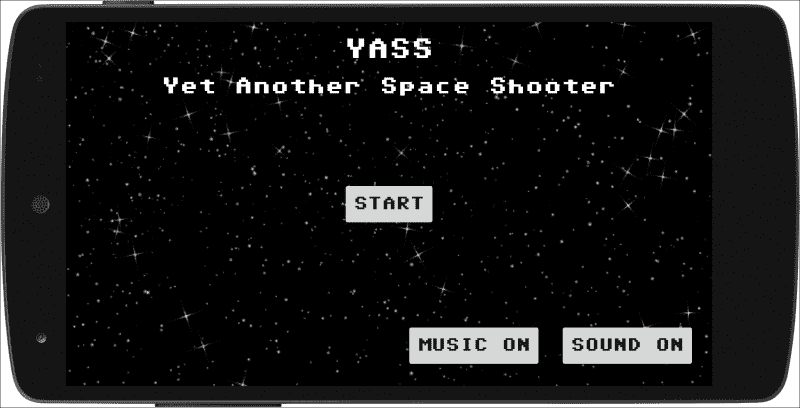
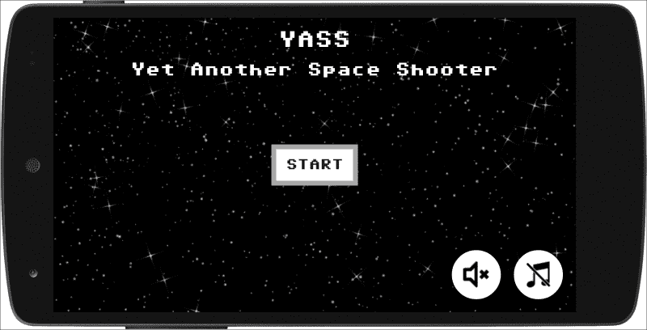
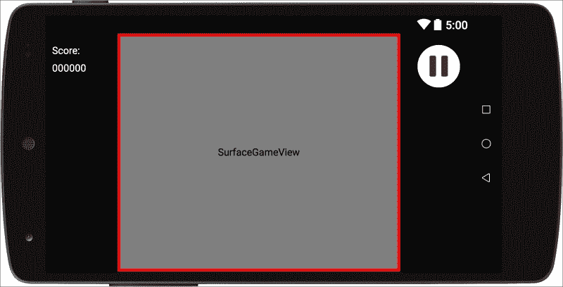
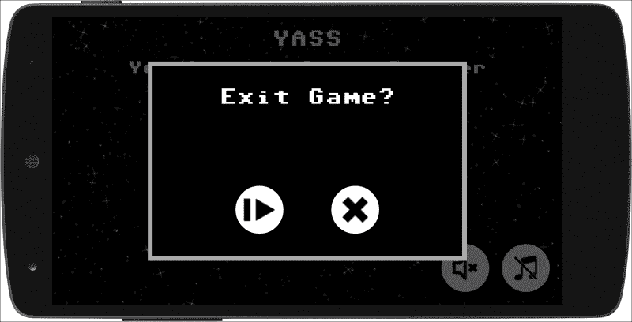
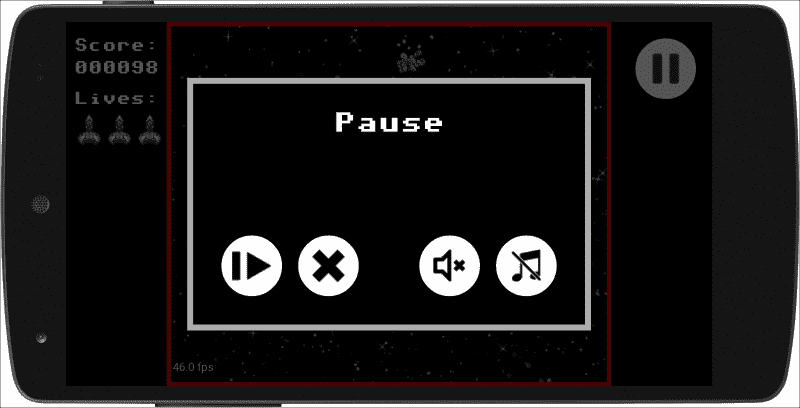
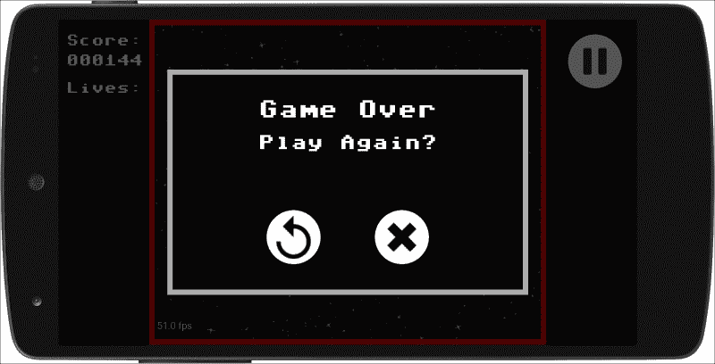
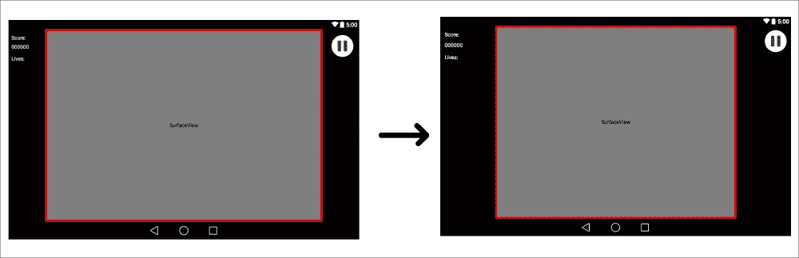

# 第七章。菜单和对话框

现在游戏运行了，是时候调整 UI 的其余部分了。当你制作一个应用程序时，最好的做法是使用所有标准的用户界面组件。游戏不一样，要有个性。为此，我们将了解如何使用自定义字体、按钮和对话框。

我们将从让游戏的所有片段使用自定义字体开始。然后我们将调整主菜单，通过添加背景和定制声音和音乐按钮使其看起来更好；我们还将使用我们可以用 XML 定义的特殊可绘制类型自定义启动游戏的按钮。

对于`GameFragment`，我们会腾出空间来显示分数和生活，也会更新暂停按钮。我们会让游戏处理得分和玩家死亡。为此，我们还将看到如何使用`GameEvents`，不仅仅是播放声音，还包括扩展功能和添加一些事件。

我们也会通过使用状态机让`GameController`对游戏情况承担更多的责任。这项技术可以应用于其他情况，如新的水平等。

最后，由于安卓对话框框架非常有限，我们将看到如何创建自定义对话框来退出游戏、暂停和结束游戏。

# 自定义字体

对于 app 开发者来说，谷歌一直强制使用系统默认字体，尤其是引入 Robotto 之后。这就是系统中没有其他字体的原因。但是，`TextView`可以使用真实类型(`.ttf`)或开放类型(`.otf`)格式的自定义字体。

选择字体时，你有很多选择。有网站列出了许多免费使用的字体。因为 YASS 注定是一个复古风格的射手，所以我选了一个像素艺术风格的字体，叫做 Adore64。

我们将字体文件存储在`assets`下的一个文件夹中，我们将命名为`ttf`，就像我们对声音一样。

要以`TextView`可以使用的格式加载字体，我们有`Typeface`类。加载一个字体的过程是很昂贵的，所以我们只做一次(在`onCreate`里面)，并且我们将保持`Typeface`变量作为`Activity`的成员。

### 注

加载一个字体是昂贵的；我们应该把它保存在内存中(在活动级别)。

我们必须添加到`YassActivity`中的加载字体的代码非常简单:

```java
private Typeface mCustomTypeface;

@Override
protected void onCreate(Bundle savedInstanceState) {
  super.onCreate(savedInstanceState);
  [...]
  mCustomTypeface = Typeface.createFromAsset(getAssets(), "ttf/Adore64.ttf");
}
```

一旦加载了字体，我们只需要将它应用到层次结构的所有文本视图中。这可以使用递归轻松完成:

```java
public void applyTypeface (View view) {
  if (view instanceof ViewGroup) {
    // Apply recursively to all the children
    ViewGroup viewGroup = (ViewGroup) view;
    for (int i=0; i<viewGroup.getChildCount(); i++) {
      applyTypeface(viewGroup.getChildAt(i));
    }
  }
  else if (view instanceof TextView) {
    TextView tv = (TextView) view;
    tv.setTypeface(mCustomTypeface);
  }
}
```

该方法接收一个`View`。如果它是`ViewGroup`的一个实例，这意味着它有(或者可以有)更多的视图作为子视图，所以我们递归地使用相同的方法迭代所有的子视图。

如果视图是`TextView`的一个实例，我们只调用方法`setTypeface`，它只存在于`TextView`上，我们可以继续前进。

对于任何其他类型的视图，我们什么也不做。

### 注

使用递归算法很容易将字体应用于我们所有的视图。

注意 `instanceof`检查对象是否符合给定的类别。这意味着从它扩展而来的类中的对象将返回 true。这是该算法工作的关键，因为所有的`Layout`类都是`ViewGroup`的子类，并且所有包含文本的视图(即`Button`)都是从`TextView`延伸出来的。

缺少的环节是，我们在哪里调用这个方法，用哪些参数？我们将用`YassBaseFragment`的`onViewCreated`方法来做。

```java
@Override
public void onViewCreated(View view, Bundle savedInstanceState) {
  super.onViewCreated(view, savedInstanceState);
  getYassActivity().applyTypeface(view);
}
```

由于所有片段都将从这个片段延伸，因此它们都将自动设置`Typeface`。

如果我们想在游戏中使用一种以上的字体，代码就会开始变得复杂，最好使用一个库来处理它。为此，我推荐使用书法([https://github.com/chrisjenx/Calligraphy](https://github.com/chrisjenx/Calligraphy))，它在视图膨胀时钩入`ContextWrapper`加载字体，而不是稍后遍历层次结构，并且还支持 XML 属性将特定字体设置到特定视图。

### 注

如果你想在你的安卓项目中使用多种字体，书法是一个很好的库。

# 与背景打交道

让游戏看起来很糟糕的东西是我们此刻拥有的纯白背景。虽然我们可以为活动设置背景，但这不是最好的解决方案，因为背景图像被设置为适合的比例，这是无法更改的。当使用背景图像时，它将扩展到覆盖所有视图。

### 注

属性`android:background`将拉伸图像，使其适合视图。

我们不希望我们的背景图像在一个维度上被拉伸。我们希望它在两个轴上均匀缩放。

这可以通过使用 9-patch 作为背景图像来改进，但是在我们的例子中，我们将使用一个`ImageView`覆盖所有布局，并将`scaleType`设置为`centerCrop`。此参数可均匀缩放图像(保持图像的纵横比)，使图像的两个维度(宽度和高度)都等于或大于`View`的相应维度。

我们将在`fragment_main_menu.xml`的开头添加一个带有所需`scaleType`的`ImageView`:

```java
<?xml version="1.0" encoding="utf-8"?>
<RelativeLayout xmlns:android="http://schemas.android.com/apk/res/android"
  android:layout_width="match_parent"
  android:layout_height="match_parent" >
  <ImageView
    android:layout_width="match_parent"
    android:layout_height="match_parent"
    android:scaleType="centerCrop"
    android:src="@drawable/seamless_space_0"/>
[…]
</RelativeLayout>
```

仅仅是字体和背景，主菜单看起来就已经好多了！



我们可以用`GameView`代替`ImageView`来创建视差背景，我把这个作为练习留给那些对调整背景更感兴趣的读者。

## 可扩展标记语言的力量

直到现在我们已经使用了可绘制的图片，但是安卓提供了一个非常完整的框架，允许我们使用其他类型的资源。可绘制资源是可绘制到屏幕上的图形的一般概念。您可以在 XML 中定义几种类型的绘图。

我们将描述状态列表和形状绘图，但还有一些。特别是如果你不熟悉 9 补丁，你也应该去看看。

### 注

您可以在官方文档中了解所有可绘制的资源:http://developer . Android . com/guide/topics/resources/draw able-resource . html。

## 状态列表可绘制

`StateListDrawable`是一个用 XML 定义的可绘制对象，它根据对象的状态使用其他几个可绘制对象来表示相同的图形。框架定义了很多状态，但我们只会使用`pressed`、`focused`、`default`(无状态)。还有一个州叫`selected`，不要和`focused`混为一谈。事实上，精选几乎从未使用过。

状态列表在一个以`<selector>`为根标签的 XML 文件中描述。每个图形由一个`<item>`元素表示，该元素可以使用各种属性来描述它应该用作可绘制图形的状态。

当状态改变时，将按顺序检查列表，并使用与当前状态匹配的第一个项目。重要的是要记住，这种状态的选择不是基于最佳匹配，而是基于第一次匹配。定义状态列表的最佳实践是将最严格的状态放在开头，并将默认状态作为最后一项。

### 注

州的顺序非常重要。列表中的第一个匹配是使用的匹配。

我们将使用音乐和声音按钮的状态列表。然后，我们将有四个状态列表可绘制——音乐打开、音乐关闭、声音打开和声音关闭——对于每个状态，我们将有三个状态:按下、聚焦和正常。

这些视图将不再是按钮，而是`ImageView`。为了进行这种改变，需要进行一些代码调整，基本上是在`updateSoundAndMusicButtons`内部，它现在应该使用可绘制的而不是文本。

关于外观和感觉，我们将制作一个代表状态的颜色圆圈，然后对所有状态使用相同的图标，只是改变颜色。我们还将通过给图像添加边距来使按压状态变小一点——给人以被按压的感觉。

我们使用白色表示正常状态，黄色表示按压状态，蓝色表示聚焦状态。


所有为声音和音乐状态而创作的绘画作品

状态可绘制文件应放入`res/drawable`目录，因为它们只是引用列表，因此与密度无关。另一方面，我们应该提供被称为状态的可绘图的特定密度版本。

现在，不是提供 12 个图标，因为它们都使用相同的背景，我们可以使用 4 个图标、3 个背景状态和 1 个可绘制的状态来配置它，这将是所有图标的背景。这也将允许我们重用其他按钮的背景。

这是我们将用于背景的可绘制状态列表的代码:

```java
<?xml version="1.0" encoding="utf-8"?>
<selector xmlns:android="http://schemas.android.com/apk/res/android">
  <item
    android:drawable="@drawable/icon_button_bg_pressed"
    android:state_pressed="true"/>
  <item
    android:drawable="@drawable/icon_button_bg_selected"
    android:state_focused="true"/>
  <item
    android:drawable="@drawable/icon_button_bg_normal"/>
</selector>
```

正如我们已经说过的，顺序非常重要。我们想在按下时显示按下状态；我们不在乎它是否有重点，所以这是第一种情况。然后我们想展示它是否集中。最后，我们有一个缺省情况，没有覆盖“其他一切”的参数。

背景是使用 GIMP 创建的，基本图标是我们使用图标搜索网站(如icon finder([https://www.iconfinder.com](https://www.iconfinder.com))找到的免费图标。有很多图标搜索网站。试几个，看看你最喜欢哪一个。

请注意，命名约定是为状态列表使用一个名称，然后为每个状态使用相同的名称后跟按下、选择或正常。

### 状态列表颜色

我们可以使用选择器定义颜色和图像。这可用于进入按钮的文本或视图的背景。它的工作方式与 drawables 相同，但使用了`color`关键字而不是`drawable`。定义颜色的文件必须放在`res/colors`目录下。

稍后我们将参考的颜色状态列表的一个例子是`btn_background.xml`。

```java
<?xml version="1.0" encoding="utf-8"?>
<selector xmlns:android="http://schemas.android.com/apk/res/android">
  <item
    android:color="@color/btn_pressed"
    android:state_pressed="true"/>
  <item
    android:color="@color/btn_focused"
    android:state_selected="true"/>
  <item
    android:color="@color/btn_normal"/>
</selector>

```

当然我们也需要定义这些颜色。请注意，这些颜色不是状态列表，因此应该在`res/values`目录下的文件中定义。我们通常把这个文件叫做`colors.xml`作为约定，但是任何名字都可以。

```java
<?xml version="1.0" encoding="utf-8"?> 
<resources>
  <color name="btn_selected">#39a29c</color>
  <color name="btn_normal">#ffffff</color>
  <color name="btn_pressed">#fdd33f</color>
</resources>
```

### 注

状态列表颜色 XML 文件放在`res/color`下，但正常颜色定义为`res/values`下文件中的值。

作为良好的实践，您应该始终将布局的所有变量外部化。这对颜色、尺寸和字符串有效。

## 造型抽屉

形状可绘制正如名字所暗示的那样:一种用 XML 定义通用形状的方式。我们将使用它们来制作所有的按钮背景。

形状可绘制的语法定义如下:

```java
<?xml version="1.0" encoding="utf-8"?>
<shape
  xmlns:android="http://schemas.android.com/apk/res/android"
  android:shape=["rectangle" | "oval" | "line" | "ring"] >
  <corners
    android:radius="integer"
    android:topLeftRadius="integer"
    android:topRightRadius="integer"
    android:bottomLeftRadius="integer"
    android:bottomRightRadius="integer" />
  <gradient
    android:angle="integer"
    android:centerX="integer"
    android:centerY="integer"
    android:centerColor="integer"
    android:endColor="color"
    android:gradientRadius="integer"
    android:startColor="color"
    android:type=["linear" | "radial" | "sweep"]
    android:useLevel=["true" | "false"] />
  <padding
    android:left="integer"
    android:top="integer"
    android:right="integer"
    android:bottom="integer" />
  <size
    android:width="integer"
    android:height="integer" />
  <solid
    android:color="color" />
  <stroke
    android:width="integer"
    android:color="color"
    android:dashWidth="integer"
    android:dashGap="integer" />
</shape>
```

可绘制形状的顶层标签是`<shape>`，它有一个属性，也称为`shape`，定义了它的类型。可能的值有:

*   `rectangle`:填充包含视图的矩形。如果未指定任何形状，则这是默认形状。
*   `oval`:符合包含视图尺寸的椭圆形。
*   `line`:跨越包含视图宽度的水平线。该形状需要`<stroke>`元素来定义线条的宽度。
*   `ring`:一个的环形。此形状允许正确定义一些其他属性，如`innerRadius/innerRadiusRatio`、`thickness/thicknessRatio`和`useLevel`。

形状的内容可以是纯色或渐变。为此，我们使用标签`<solid>`或`<gradient>`。

标签`<solid>`有参数`color`，可以提供十六进制值或颜色资源。该颜色资源也可以是状态列表。

标签`<gradient>`可以用代替`<solid>`，其论据不言自明。我们不会在游戏中使用它们。

我们可以使用 `<padding>`标签定义包含视图元素的填充。它有四个不同的属性-`left`、`top`、`right`和`bottom`，可以作为维度值或维度资源提供。

形状的大小是可选的，可以使用标签`<size>`来定义，该标签将`height`和`width`作为属性，可以是维度值或资源。

### 注

默认情况下，形状与容器的大小`View`成比例，与这里定义的尺寸成比例。当您在`ImageView`中使用该形状时，您可以通过将`android:scaleType`设置为`"center"`来限制缩放。

形状的边界或轮廓由标签`<stroke>`定义。它接受以下属性:

*   **宽度**:线的厚度，作为尺寸值或尺寸资源。
*   **颜色**:线条的颜色，作为十六进制值或颜色资源。
*   **DashGap/DashWith** :线划之间的距离和每个线划的大小，既作为尺寸值又作为尺寸资源。它们需要放在一起。

当使用矩形形状时，我们可以通过使用`<corners>`标签来指定要圆角的角；对于我们可以只使用`radius`或者我们可以为每个角指定一个尺寸:`topLeftRadius`、`topRightRadius`、`bottomLeftRadius`和`bottomRightRadius`。

### 注

系统要求在 XML 文件中用大于 1 的值初始化每个角半径。否则没有圆角。要解决此问题，可以通过编程方式覆盖拐角半径值。

现在我们已经详细了解了语法，让我们创建将要在游戏中使用的形状。

我们将为圆形按钮创建一个椭圆形，并使用也是颜色状态列表的颜色来替换当前具有多个形状的可绘制状态列表，因为它使代码更加紧凑和易于更新。

```java
<?xml version="1.0" encoding="utf-8"?>
<shape xmlns:android="http://schemas.android.com/apk/res/android"
  android:shape="oval">
  <solid
    android:color="@color/btn_backgound" />
  <padding android:bottom="@dimen/round_button_padding"
    android:left="@dimen/round_button_padding"
    android:right="@dimen/round_button_padding"
    android:top="@dimen/round_button_padding"/>
</shape>
```

我们将形状定义为椭圆形，然后将其设置为纯色，这是我们在上一节中定义的状态列表颜色资源。最后，我们定义了一些来自维度资源的填充。

接下来，我们将为方形按钮定义一个形状(目前它仅用于开始游戏的按钮):

```java
<?xml version="1.0" encoding="utf-8"?>
<shape xmlns:android="http://schemas.android.com/apk/res/android"
  android:shape="rectangle">
  <solid
    android:color="@color/btn_backgound" />
  <padding android:bottom="@dimen/square_button_padding"
    android:left="@dimen/square_button_padding"
    android:right="@dimen/square_button_padding"
    android:top="@dimen/square_button_padding"/>
  <stroke android:color="@color/btn_border"
    android:width="@dimen/square_button_border" />
</shape>
```

这个形状是一个有边框的矩形。边框由`stroke`标签定义。

我们用于此形状的所有尺寸都必须定义。我们将它们放入`res/values`下的`dimens.xml`文件中。

```java
<dimen name="square_button_padding">18dp</dimen>
<dimen name="square_button_border">6dp</dimen>
<dimen name="round_button_padding">6dp</dimen>
<dimen name="btn_sound_size">60dp</dimen>
```

我们还在`colors.xml`中为按钮边框和文本颜色增加了一些颜色。

```java
<color name="text_color">#FFFFFF</color>
<color name="btn_border">#AAAAAA</color>
```

最后，我们将使用样式来保持布局上的代码更干净。安卓上的样式允许您定义几个 XML 属性，并将它们与一个名称相关联。然后，您可以在任何布局上通过名称引用样式，它将被应用。

风格的目的是在一个地方定义外观和感觉，以便可以很容易地改变和/或更新。这个概念类似于网页的 CSS。

### 注

样式对于保持布局整洁和在一个地方定义外观非常方便。

我们将为圆形按钮定义一种样式。这将进入`res/values`下的`styles.xml`文件(同样，文件的任何名称都可以，但最好遵循惯例)。

```java
<resources>
  <style name="iconButton" >
    <item name="android:background">@drawable/icon_button_bg</item>
    <item name="android:layout_width">@dimen/btn_round_size</item>
    <item name="android:layout_height">@dimen/btn_round_size</item>
  </style>
</resources>
```

为了让完成这一部分，让我们看看包含所有这些变化的`fragment_main_menu.xml`的更新版本:

```java
<?xml version="1.0" encoding="utf-8"?>
<RelativeLayout xmlns:android="http://schemas.android.com/apk/res/android"
  android:layout_width="match_parent"
  android:layout_height="match_parent"
  >

  <ImageView
    android:layout_width="match_parent"
    android:layout_height="match_parent"
    android:scaleType="centerCrop"
    android:src="@drawable/seamless_space_0"/>

  <TextView
    android:textColor="@color/text_color"
    android:id="@+id/main_title"
    style="@android:style/TextAppearance.DeviceDefault.Large"
    android:layout_marginTop="@dimen/activity_vertical_margin"
    android:text="@string/game_title"
    android:layout_centerHorizontal="true"
    android:layout_width="wrap_content"
    android:layout_height="wrap_content" />

  <TextView
    android:textColor="@color/text_color"
    android:layout_below="@+id/main_title"
    style="@android:style/TextAppearance.DeviceDefault.Medium"
    android:layout_marginTop="@dimen/activity_vertical_margin"
    android:text="@string/game_subtitle"
    android:layout_centerHorizontal="true"
    android:layout_width="wrap_content"
    android:layout_height="wrap_content" />

  <Button
    android:id="@+id/btn_start"
    android:layout_centerInParent="true"
    android:layout_width="wrap_content"
    android:layout_height="wrap_content"
    android:background="@drawable/button_square_bg"
    android:text="@string/start" />

  <ImageView
    android:background="@drawable/button_round_bg"
    android:id="@+id/btn_sound"
    android:layout_margin="@dimen/activity_vertical_margin"
    android:layout_width="@dimen/btn_sound_size"
    android:layout_height="@dimen/btn_sound_size"
    android:src="@drawable/sounds_on_no_bg"
    android:layout_alignParentBottom="true"
    android:layout_alignParentRight="true"/>

  <ImageView
    android:background="@drawable/button_round_bg"
    android:id="@+id/btn_music"
    android:layout_width="@dimen/btn_sound_size"
    android:layout_height="@dimen/btn_sound_size"
    android:layout_alignBottom="@+id/btn_sound"
    android:src="@drawable/music_on_no_bg"
    android:layout_toLeftOf="@+id/btn_sound"/>
</RelativeLayout>
```



# 游戏片段

现在我们已经调整了主菜单，是时候开始`GameFragment`了。

有两个基本的游戏特性我们还没有建立:分数和生活。我们现在要解决这个问题。首先我们需要在布局中为它们留出空间，然后我们必须编写一些代码来实际处理这两个特性。

对于分数和生活的用户界面，我们将使用标准的安卓组件。我们已经在`GameEngine`中构建了许多功能，但是我们不想重新发明轮子。由于安卓提供了一个定义布局和制作我们熟悉的用户界面的好方法，不使用它将是一种浪费。

### 注

使用标准的安卓视图可以节省你很多时间。

我们将通过在每边增加一个柱子来缩小游戏区域。我们将在那里放置新的用户界面元素，并将它们链接到`GameObjects`以随着游戏的进行更新它们。

虽然我们可以将控件覆盖在`GameView`上而不是信箱上，但请注意，我们使用的是`SurfaceView`，当其他视图覆盖在上面时，它的性能会急剧下降。我们也认为游戏区和控制区分开看起来更好。如果你想使用叠加，你应该把`GameView`改成`StandardGameView`。

现在我们正在与`fragment_game.xml`合作，这是一个很好的时机，也用我们为声音和音乐创建的相同风格更新暂停按钮。

`fragment_game.xml`的新版本是这样的:

```java
<FrameLayout xmlns:android="http://schemas.android.com/apk/res/android"
  xmlns:tools="http://schemas.android.com/tools"
  android:layout_width="match_parent"
  android:layout_height="match_parent"
  android:background="@color/background"
  tools:context="com.plattysoft.yass.counter.GameFragment">

  <RelativeLayout
    android:layout_width="@dimen/game_menu_width"
    android:layout_height="match_parent">
    <!-- Lives and score go here -->
  </RelativeLayout>

  <FrameLayout
    android:background="@color/game_view_frame"
    android:layout_weight="1"
    android:padding="4dp"
    android:layout_marginLeft="@dimen/game_menu_width"
    android:layout_marginRight="@dimen/game_menu_width"
    android:layout_width="match_parent"
    android:layout_height="match_parent">

    <com.plattysoft.yass.engine.SurfaceGameView
      android:id="@+id/gameView"
      android:layout_weight="1"
      android:layout_width="match_parent"
      android:layout_height="match_parent" />
  </FrameLayout>

  <include layout="@layout/view_vjoystick" />

  <ImageView
    style="@style/iconButton"
    android:layout_gravity="top|right"
    android:id="@+id/btn_play_pause"
    android:layout_marginTop="@dimen/activity_vertical_margin"
    android:layout_marginRight="@dimen/activity_vertical_margin"
    android:src="@drawable/pause" />
</FrameLayout>
```

现在的`GameView`在一个`FrameLayout`里面，这个`FrameLayout`是居中的，两边都有空白，有列的值(`R.dimen.game_menu_width`)。`FrameLayout`用于在`GameView`周围显示一个红色框架，以清晰地将游戏区域与用户界面的其余部分分开。

框架背景是一个类似于我们已经定义的矩形:

```java
<?xml version="1.0" encoding="utf-8"?>
<shape xmlns:android="http://schemas.android.com/apk/res/android"
  android:shape="rectangle">
  <solid
    android:color="@android:color/transparent" />
  <padding android:bottom="@dimen/game_frame_width"
    android:left="@dimen/game_frame_width"
    android:right="@dimen/game_frame_width"
    android:top="@dimen/game_frame_width"/>
  <stroke android:color="@color/game_view_frame"
    android:width="@dimen/game_frame_width" />
</shape>
```

在左边我们有一个`RelativeLayout`，我们将使用它来放置分数和生活的控制。在这之前，我们已经使用了虚拟操纵杆，它覆盖了整个屏幕。最后，我们有暂停按钮，它必须保持在前台，否则虚拟操纵杆将捕获触摸事件。正如我们已经提到的，暂停按钮现在使用与主菜单上的音乐和声音按钮相同的外观和感觉。



既然我们有了空间，那就开始在那里添加物品吧！我们将只显示分数和生活，但你可以使用这个空间做任何与游戏相关的事情，从最高分到应用内购买按钮。

## 加一分

让我们实现分数计数器。为此，我们也需要定义一种给玩家打分的方式。

我们将使用`TextView`在屏幕上显示分数。为了控制这个`TextView`，我们将创建一个`ScoreGameObject`，在很多方面与我们在[第一章](00.html "Chapter 1. Setting Up the Project")、*中使用的相似，设置项目*来显示`Player`的坐标。

分数将在`ScoreGameObject`类内计算，并根据游戏事件进行更新。这也意味着`GameEngine`必须将事件传播到游戏对象(到目前为止，它只将事件传播到`SoundEngine`)。

玩家每次击中小行星我们会给 50 分，小行星每次逃跑我们会去掉一分。一个`Asteroid`逃跑是一个新的`GameEvent`我们将不得不创造和触发。两个分数修改值都将设置为常量，这是可读性和易于更改的良好做法。

首先:让我们让`GameEngine`将`GameEvents`传播到所有当前活动的`GameObjects`。为此，我们修改了`GameEngine`的`onGameEvent`方法。

```java
public void onGameEvent (GameEvent gameEvent) {
  // We notify all the GameObjects
  int numObjects = mGameObjects.size();
  for (int i=0; i<numObjects; i++) {
    mGameObjects.get(i).onGameEvent(gameEvent);
  }
  // Also the sound manager
  mSoundManager.playSoundForGameEvent(gameEvent);
}
```

请注意这意味着在`GameObject`中创建一个名为`onGameEvent`的方法，默认为空。

我们将使用一个新的`GameEvent`，当小行星离开屏幕时就会触发(`AsteroidMissed`)。我们必须将该值添加到`GameEvents`枚举中，并通过`Asteroid`的`onUpdate`方法触发事件。

```java
@Override
public void onUpdate(long elapsedMillis, GameEngine gameEngine) {
  [...]
  if (mY > gameEngine.mHeight) {
    gameEngine.onGameEvent(GameEvent.AsteroidMissed);
    removeFromGameEngine(gameEngine);
  }
}
```

现在我们把`TextView`加到`fragment_game.xml`的左栏。我们将有两个新的文本视图:一个是文本“`Score:"`”(`R.id.score_title`)另一个是乐谱本身(`R.id.score_value`)。

```java
<RelativeLayout
  android:layout_width="@dimen/game_menu_width"
  android:layout_height="match_parent">
  <TextView
    android:layout_marginTop="@dimen/activity_vertical_margin"
    android:layout_marginLeft="@dimen/menu_margin"
    android:id="@+id/score_title"
    android:layout_width="wrap_content"
    android:layout_height="wrap_content"
    android:layout_alignParentTop="true"
    android:textColor="@color/text_color"
    android:text="@string/score"/>
  <TextView
    android:id="@+id/score_value"
    android:layout_width="wrap_content"
    android:layout_height="wrap_content"
    android:layout_marginTop="@dimen/menu_margin"
    android:layout_below="@+id/score_title"
    android:layout_alignLeft="@+id/score_title"
    android:textColor="@color/text_color"
    android:text="000000"/>
</RelativeLayout>
```

我们已经把一切都准备好了，是时候把它们和`ScoreGameObject`类联系在一起了。这是一个相当简单的问题:

```java
public class ScoreGameObject extends GameObject {

  private final TextView mText;
  private int mPoints;
  private boolean mPointsHaveChanged;

  private static final int POINTS_LOSS_PER_ASTEROID_MISSED = 1;
  private static final int POINTS_GAINED_PER_ASTEROID_HIT = 50;

  public ScoreGameObject(View view, int viewResId) {
    mText = (TextView) view.findViewById(viewResId);
  }

  @Override
  public void onUpdate(long elapsedMillis, GameEngine gameEngine) {}

  @Override
  public void startGame() {
    mPoints = 0;
    mText.post(mUpdateTextRunnable);
  }

  @Override
  public void onGameEvent(GameEvent gameEvent) {
    if (gameEvent == GameEvent.AsteroidHit) {
      mPoints += POINTS_GAINED_PER_ASTEROID_HIT;
      mPointsHaveChanged = true;
    }
    else if (gameEvent == GameEvent.AsteroidMissed) {
      if (mPoints > 0) {
        mPoints -= POINTS_LOSS_PER_ASTEROID_MISSED;
      }
      mPointsHaveChanged = true;
    }
  }

  private Runnable mUpdateTextRunnable = new Runnable() {
    @Override
    public void run() {
      String text = String.format("%06d", mPoints);
      mText.setText(text);
    }
  };

  @Override
  public void onDraw(Canvas canvas) {
    if (mPointsHaveChanged) {
      mText.post(mUpdateTextRunnable);
      mPointsHaveChanged = false;
    }
  }
}
```

该类在游戏开始时将积分设置为 0，然后通过修改玩家的总积分对`GameEvents`做出反应。一旦分数的值被修改，我们用一个布尔变量通知它，这样我们就知道它需要在下一次调用`onDraw`时被更新。这样做是为了防止在`TextView`上进行不必要的重绘。

请记住，当我们使用`StandardGameView`时，`onDraw`在`UIThread`上被调用，但是在使用`SurfaceGameView`的情况下，它是从`UpdateThread`调用的。由于视图只能在`UIThread`上更新，我们使用一个发布到`UIThread`的`Runnable`，然后更新`TextView`的值，使其对`StandardGameView`和`SurfaceGameView`都有效。

### 注

视图修改必须始终在`UIThread`上完成。

我们用`String.format`得到一个由 6 位数字组成的数字，如果整数没有足够的数字，在左边填入 0。这只会让比分看起来好很多。

剩下的唯一一个环节就是将这个`GameObject`添加到`GameFragment`中的`GameEngine`初始化中。

```java
new ScoreGameObject(getView(),R.id.score_value).addToGameEngine(mGameEngine, 0);
```

我们现在可以玩这个游戏，最后得分。

## 增加生命

我们也将在左栏中有一个生命指示器。为此，我们必须更新游戏很多，因为我们目前只有一个生命，当我们死亡时，游戏不会做任何事情。

正如我们对分数所做的那样，我们将有一个`LivesCounter`对象来管理显示，但在这种情况下，生命计数将依赖于`GameController`。`GameController`和`LivesCounter`之间的同步将通过`GameEvents`完成。

另一个需要考虑的是，一旦玩家死亡，浪潮必须停止。只有屏幕空了，我们才能生成一个新的`Player`对象，然后几秒钟后重新开始波。

为了管理这个，我们将使`GameController`成为一个状态机，并基于`GameEvents`从一个状态转换到另一个状态。一般来说，这是游戏控制器的常用技术。

### 注

让`GameController`成为状态机是游戏中常见的技术。

我们先从`GameController`开始修改，然后是`LivesCounter`。

对于`GameController`的状态，我们将创建一个我们称之为`GameControllerState`的枚举。

```java
public enum GameControllerState {
  StoppingWave,
  SpawningEnemies,
  PlacingSpaceship,
  Waiting,
  GameOver;
}
```

让我们描述每一种状态:

*   `StoppingWave`:这个状态是有时间基础的。当`GameController`在里面的时候，没有小行星产生。加上超时，它有效地阻止了当前的浪潮。从这个状态，控制器将转换到`GameOver`如果没有剩余的生命，或者转换到`PlacingSpaceship`如果有。
*   `SpawningEnemies`:正常状态下的。这相当于没有状态的前一个版本的行为。当宇宙飞船被摧毁时，它转换到`StoppingWave`。
*   `PlacingSpaceship`:控制器将一个`Player`物体放入游戏中，并发送一个关于它的`GameEvent`。这将自动转换到`Waiting`。
*   `Waiting`:类似于到`StoppingWave`，这个状态也是基于时间的，但是它总是转换到`SpawningEnemies`。这种状态的存在是为了让玩家在新的宇宙飞船出现在屏幕上后有时间放松。


`GameController`从`PlacingSpaceship`状态开始，获得一个生命，在屏幕上放置一艘飞船。`GameController`将进入`Waiting`然后进入`SpawningEnemies`。

当 `SpaceshipHit`事件到来时，我们进入`StoppingWave`。一旦屏幕上没有了`Asteroids`，我们就检查剩余的生命数量。如果是 0，那就是`GameOver`，否则，我们去`PlacingSpaceship`(触发一个`LifeLost`游戏事件)，然后再次移动到`Waiting`，直到可以移动到`SpawningEnemies`。

让我们看看开始游戏的代码:

```java
@Override
public void startGame(GameEngine gameEngine) {
  mCurrentMillis = 0;
  mEnemiesSpawned = 0;
  mWaitingTime = 0;
  for (int i=0; i<INITIAL_LIFES; i++) {
    gameEngine.onGameEvent(GameEvent.LifeAdded);
  }
  mState = GameControllerState.PlacingSpaceship;
}
```

首先，我们重置所有计数器，并对最初的生命数量进行循环，发送游戏事件`LifeAdded`。此事件在此类以及`LivesCounter`中处理。

以这种方式增加生命的主要优点是，我们可以处理除了开始游戏之外的其他方式给出的生命，即任何额外的生命。我们在一个地方也有最初生命的价值。

最后我们进入到前面描述的`PlacingSpaceship`状态。

作为的重要提示:由于我们从`PlacingSpaceship`开始，我们现在不再需要向`GameEngine`添加玩家对象，因为我们是从这个类开始的。我们必须从引擎初始化中删除该代码。

### 注

`GameController`现在负责将`Player`添加到游戏中。我们不再需要在`GameEngine`创作中手工添加它。

我们也可以在`StoppingWave`状态下启动`GameController`。那会给我们一些时间，在生命被移除然后被添加之前。玩这个，决定你更喜欢哪个。

接下来我们来看看`GameController`的`onGameEvent`法:

```java
@Override
public void onGameEvent(GameEvent gameEvent) {
  if (gameEvent == GameEvent.SpaceshipHit) {
    mState = GameControllerState.StoppingWave;
    mWaitingTime = 0;
  }
  else if (gameEvent == GameEvent.GameOver) {
    mState = GameControllerState.GameOver;
  }
  else if (gameEvent == GameEvent.LifeAdded) {
    mNumLives++;
  }
}
```

这确实通过进入`StoppingWave`状态对`SpaceshipHit`事件做出反应，并且它还重置等待时间。该州将检查是否还有剩余生命可以使用，并在需要时触发`GameOver`事件。当我们观察`onUpdate`时，我们会看到这一点。

该方法通过将其自身置于`GameOver`状态来对`GameOver`事件做出反应。这个事件目前只是`GameController`发的，不过这样留着以后用就好了。也许我们会希望有一个非常强大的敌人，可以一口气结束游戏。

最后，当`LifeAdded`到达时，它增加了生命计数器。同样，这个事件只是在构建这个类时发送的，但是我们可以实现一个额外的生命机制，然后从其他地方触发它。

真正的果汁在`onUpdate`法里面。

```java
@Override
public void onUpdate(long elapsedMillis, GameEngine gameEngine) {
  if (mState == GameControllerState.SpawningEnemies) {
    mCurrentMillis += elapsedMillis;
    long waveTimestamp = mEnemiesSpawned * TIME_BETWEEN_ENEMIES;
    if (mCurrentMillis > waveTimestamp) {
      // Spawn a new enemy
      Asteroid a = mAsteroidPool.remove(0);
      a.init(gameEngine);
      a.addToGameEngine(gameEngine, mLayer);
      mEnemiesSpawned++;
      return;
    }
  }
  else if (mState == GameControllerState.StoppingWave) {
    mWaitingTime += elapsedMillis;
    if (mWaitingTime > STOPPING_WAVE_WAITING_TIME) {
      mState = GameControllerState.PlacingSpaceship;
    }
  }
  else if (mState == GameControllerState.PlacingSpaceship) {
    if (mNumLifes == 0) {
      gameEngine.onGameEvent(GameEvent.GameOver);
    }
    else {
      mNumLives--;
      gameEngine.onGameEvent(GameEvent.LifeLost);
      Player newLife = new Player(gameEngine);
      newLife.addToGameEngine(gameEngine, 2);
      newLife.startGame(gameEngine);
      // We wait to start spawning more enemies
      mState = GameControllerState.Waiting;
      mWaitingTime = 0;
    }
  }
  else if (mState == GameControllerState.Waiting) {
    mWaitingTime += elapsedMillis;
    if (mWaitingTime > WAITING_TIME) {
      mState = GameControllerState.SpawningEnemies;
    }
  }
}
```

你可以看到我们之前的代码现在是`SpawningEnemies`状态的代码。产生小行星没有什么新鲜事。

为了阻止波浪我们只需要等待几毫秒。由于没有新的`Asteroids`产生，这个超时只需要比`Asteroid`穿越屏幕的时间长。我们可以在小行星返回池中时对它们进行计数，但是这种方法总是等待相同的时间，玩家会感觉更好。

`PlacingSpaceship`状态只持续一次迭代。它将发送一个`GameOver`事件(将它移动到`GameOver`状态)或使用一条生命，包括:

*   发送`LifeLost`事件
*   创建一个`Player`对象，初始化并添加到`GameEngine`中
*   移至`Waiting`状态并重置等待时间

此时，当`GameOver`事件发生时，我们没有做任何事情，但是我们将在本章的第二部分通过在对话框上显示一个游戏来解决这个问题。

最后，在`Waiting`状态下，我们计算毫秒数，就像在`StoppingWave`上一样，然后我们进入`SpawningEnemies`状态。

这就是我们让`GameController`正确处理状态机所需要的。是时候进入`LivesCounter`了。

为了在屏幕上显示生活，我们需要在布局中添加一些视图，并实现处理它们的类。我们希望每一个生命都显示为左边的宇宙飞船图标，在分数计数器下面。

我们需要在`fragment_game.xml`布局的左栏添加以下代码:

```java
<RelativeLayout>
  [...]
  <TextView
    android:layout_marginTop="@dimen/activity_vertical_margin"
    android:id="@+id/lives_title"
    android:layout_below="@+id/score_value"
    android:layout_alignLeft="@+id/score_value"
    android:layout_width="wrap_content"
    android:layout_height="wrap_content"
    android:textColor="@color/text_color"
    android:text="@string/lives" />
  <LinearLayout
    android:orientation="horizontal"
    android:id="@+id/lives_value"
    android:layout_marginTop="@dimen/menu_margin"
    android:layout_below="@+id/lives_title"
    android:layout_alignLeft="@+id/lives_title"
    android:layout_width="@dimen/game_menu_width"
    android:layout_height="wrap_content" />
</RelativeLayout>
```

我们有一个`TextView`显示文本“`Lives`”`:`和一个水平`LinearLayout`，当我们收到各自的`GameEvents`时，我们将在其中添加和删除`ImageViews`。

`LivesCounter`的代码就这么简单:

```java
public class LivesCounter extends GameObject {

  private final LinearLayout mLayout;

  public LivesCounter(View view, int viewResId) {
    mLayout = (LinearLayout) view.findViewById(viewResId);
  }

  @Override
  public void startGame(GameEngine gameEngine) {}

  @Override
  public void onUpdate(long elapsedMillis, GameEngine gameEngine) {}

  @Override
  public void onDraw(Canvas canvas) {}

  @Override
  public void onGameEvent(GameEvent gameEvent) {
    if (gameEvent == GameEvent.LifeLost) {
      mLayout.post(mRemoveLifeRunnable);
    }
    else if (gameEvent == GameEvent.LifeAdded) {
      mLayout.post(mAddLifeRunnable);
    }
  }

  private Runnable mRemoveLifeRunnable = new Runnable() {
    @Override
    public void run() {
      // Remove one life from the layout
      mLayout.removeViewAt(mLayout.getChildCount()-1);
    }
  };

  private Runnable mAddLifeRunnable = new Runnable() {
    @Override
    public void run() {
      // Remove one life from the layout
      View spaceship = View.inflate(mLayout.getContext(), R.layout.view_spaceship, mLayout);
    }
  };
}
```

如你所见，这个类没有考虑玩家拥有的生命数量。它只对事件`LifeAdded`和`LifeLost`做出反应，在`LinearLayout`中添加或删除一个项目。

我们通过发布一个可运行的对象来添加和删除视图，原因与`ScoreGameObject`相同:修改视图必须在`UIThread`中完成，`onDraw`在使用`SurfaceGameView`时确实在`UpdateThread`中运行。

最后一块是我们正在膨胀的布局`view_spaceship.xml`，只是一个`ImageView`:

```java
<?xml version="1.0" encoding="utf-8"?>
<ImageView xmlns:android="http://schemas.android.com/apk/res/android"
  android:src="@drawable/ship"
  android:scaleType="fitCenter"
  android:layout_width="@dimen/life_size"
  android:layout_height="@dimen/life_size" />
```

尺寸`life_size`在文件`dimens.xml`文件中设置为 30dp，所以有足够的水平空间放置三艘宇宙飞船。


# 自定义对话框

让我们的用户界面变得更好的下一步是停止使用标准的安卓对话框，而是创建我们自己的自定义对话框。这对于应用程序来说是完全不鼓励的，但是对于游戏来说却很有意义。

自定义对话系统更适合游戏的原因有很多:

*   默认对话框在不同的安卓版本中会有所不同。当你在应用程序中使用`AlertDialog`时，这实际上很棒，因为它模仿了所有其他应用程序的对话框，但不是游戏。我们想要一致性。
*   默认对话框使用系统字体。
*   如果试图设置自定义背景或自定义内容视图，`AlertDialogs`看起来很可怕。同样，你永远不应该在应用程序中这样做，但你肯定想在游戏中这样做。
*   标准对话框会在屏幕上显示通知和系统条，从而破坏沉浸式体验。
*   很难用自定义动画替换`AlertDialog`的动画。

我们将建立一个系统，在屏幕上显示我们的对话框，在它们后面有一个灰色的半透明覆盖层。这些对话框将有一个由可绘制的形状制成的自定义背景，并将使用我们为游戏选择的自定义字体。

最后，对话框本身只是我们放在内容前面的一个布局。

值得注意的是我们需要定义一个策略，当我们显示一个对话框，并且一个新的对话框试图显示在顶部时，该做什么。在我们的游戏中，旧的对话框会保留，新的不会显示，但是我们会提供一个方法来消除以前的对话框，并显示新的对话框，以防你想在你的游戏中出现这种行为。

我们将首先描述架构(包括对`YassBaseFragment`的修改)，然后我们将从制作退出游戏的对话框开始，因为这是最简单的一个。之后，我们将替换当前的暂停对话框，最后我们将为游戏制作一个新的对话框。

## 基本客户动态

我们将要创建的自定义对话框框架是由三个项目组成的:

*   `BaseCustomDialog`:所有对话框的基类
*   `my_overlay_dialog`:所有对话框的父级布局
*   基础片段类中的实用函数

大部分工作是在`BaseCustomDialog`类中完成的，该类为`setContentView`、`show`和`dismiss`提供方法。

`BaseCustomDialog`类的完整代码如下:

```java
public class BaseCustomDialog implements OnTouchListener {

  private boolean mIsShowing;

  protected final YassActivity mParent;
  private ViewGroup mRootLayout;
  private View mRootView;

  public BaseCustomDialog(YassActivity activity) {
    mParent = activity;
  }

  protected void onViewClicked() {
    // Ignore clicks on this view
  }

  protected void setContentView(int dialogResId) {
    ViewGroup activityRoot = (ViewGroup) mParent.findViewById(android.R.id.content);
    mRootView = LayoutInflater.from(mParent).inflate(dialogResId, activityRoot, false);
    mParent.applyTypeface(mRootView);
  }

  public void show() {
    if (mIsShowing) {
      return;
    }
    mIsShowing = true;

    ViewGroup activityRoot = (ViewGroup) mParent.findViewById(android.R.id.content);
    mRootLayout = (ViewGroup) LayoutInflater.from(mParent).inflate(R.layout.my_overlay_dialog, activityRoot, false);
    activityRoot.addView(mRootLayout);
    mRootLayout.setOnTouchListener(this);
    mRootLayout.addView(mRootView);
  }

  public void dismiss() {
    if (!mIsShowing) {
      return;
    }
    mIsShowing = false;
    hideViews();
  }

  private void hideViews() {
    mRootLayout.removeView(mRootView);
    ViewGroup activityRoot = (ViewGroup) mParent.findViewById(android.R.id.content);
    activityRoot.removeView(mRootLayout);
  }

  protected View findViewById(int id) {
    return mRootView.findViewById(id);
  }

  @Override
  public boolean onTouch(View v, MotionEvent event) {
    // Ignoring touch events on the gray outside
    return true;
  }

  public boolean isShowing() {
    return mIsShowing;
  }
}
```

在构建期间，我们将对主活动的引用存储到成员变量`mParent`中，供以后使用。

类中还有一些其他的成员变量:

*   `mRootLayout`:这个是我们膨胀的布局，所有对话框都通用，用作背景。
*   `mRootView`:内容视图的根。这用于显示和隐藏对话框本身。
*   `mIsShowing`:一个变量，用于确定对话框是否显示。

在`setContentView`期间，我们膨胀对话框的视图并将引用存储在`mRootView`中，但是我们还没有将其添加到任何`ViewGroup`中。对于通货膨胀，我们使用应用程序的内容视图的参数(`android.R.id.content`)。充气方法的最后一个参数用于确定系统是否应该将视图添加为父视图的子视图。我们通过`false`，所以视图不会被添加到层次结构中。最后，我们应用自定义字体。

注意`setContentView`一般在施工时调用，不在展示时调用；这就是此时视图没有被添加到层次结构中的原因。

为了显示对话框，我们首先检查它是否已经被显示，如果是这样，我们返回并且不做任何事情。否则我们将`mIsShowing`设置为`true`并继续。

为了正确显示对话框，我们膨胀根布局并将其添加到主要内容中，然后将根视图添加到其中。这使得对话框成为视图层次结构前景中最重要的项目。

我们还将该类添加为对`mRootLayout`不做任何事情的触摸监听器。这样做的目的是过滤掉对话框后面项目中的所有触摸和点击事件。如果我们想让一个对话框在用户点击它的边界之外时被取消，我们只需要在这个监听器里面添加一个对`dismiss`的调用。

最后，`dismiss`首先检查对话框是否显示，如果显示，则从层次结构中移除视图。

我们还有实用方法，如`findViewById`、`isShowing`。

`mRootLayout`的布局只是一个灰色的半透明叠加，其代码如下:

```java
<?xml version="1.0" encoding="utf-8"?>
<FrameLayout xmlns:android="http://schemas.android.com/apk/res/android"
  android:background="#aa000000"
  android:layout_width="match_parent"
  android:layout_height="match_parent"/>
```

请注意，这个已经被设计成可以很容易地在显示和取消对话框的过程中添加动画(在下一章中讨论)。当涉及到独立于内容视图的完全灰色背景时，尤其如此。

我们的对话框框架的最后一个阶段是在基础片段中提供一些实用方法，以便于使用我们的自定义对话框。

```java
BaseCustomDialog mCurrentDialog;

public void showDialog (BaseCustomDialog newDialog) {
  showDialog(newDialog, false);
}

public void showDialog (BaseCustomDialog newDialog, boolean dismissOtherDialog) {
  if (mCurrentDialog != null && mCurrentDialog.isShowing()) {
    if (dismissOtherDialog) {
      mCurrentDialog.dismiss();
    }
    else {
      return;
    }
  }
  mCurrentDialog = newDialog;
  mCurrentDialog.show();
}

public boolean onBackPressed() {
  if (mCurrentDialog != null && mCurrentDialog.isShowing()) {
    mCurrentDialog.dismiss();
    return true;
  }
  return false;
}
```

我们将通过在片段上调用`showDialog`方法来显示一个对话框。这将存储对当前正在显示的对话框的引用，该引用可用于确定是否有其他内容正在显示，并在需要时将其取消。

默认情况下，如果另一个对话框已经出现在屏幕上，我们将不会显示该对话框，但是，如果您想在游戏中显示该对话框，则有一个版本的`showDialog`会接收一个布尔参数来关闭其他对话框(如果存在)。

我们还注意处理回车键按下，并使用它们来消除正在显示的对话框，并返回`true`，以指示事件已被片段消耗。

现在我们已经有了所有的基础，让我们为我们的游戏制作一个退出对话框。

## 退出对话框

当在`MainMenuFragment`中按下后退键时，必须出现退出对话框。它将显示一些文本和两个按钮来退出或继续播放。

这是一个简单的对话框，在我们开始创建更复杂的对话框之前，它将帮助我们理解所有的部分是如何适应架构的。

我们将在`layouts`文件夹下创建文件`dialog_game_over.xml`来定义它。我们使用的命名约定是给所有对话框布局定义一个以 dialog 开头的名称(类似于片段和活动的约定)。

布局如下:

```java
<?xml version="1.0" encoding="utf-8"?>
<RelativeLayout xmlns:android="http://schemas.android.com/apk/res/android"
  android:layout_gravity="center"
  android:background="@drawable/diablog_bg"
  android:layout_width="@dimen/dialog_width"
  android:layout_height="@dimen/dialog_height">

  <TextView
    android:layout_width="wrap_content"
    android:layout_height="wrap_content"
    android:textColor="@color/text_color"
    android:layout_marginTop="@dimen/activity_vertical_margin"
    android:layout_centerHorizontal="true"
    style="@android:style/TextAppearance.Large"
    android:text="@string/exit_confirm"/>

  <LinearLayout
    android:layout_alignParentBottom="true"
    android:layout_centerHorizontal="true"
    android:layout_marginBottom="@dimen/activity_vertical_margin"
    android:layout_width="wrap_content"
    android:layout_height="wrap_content">
    <ImageView
      style="@style/iconButton"
      android:layout_marginRight="@dimen/btn_sound_size"
      android:id="@+id/btn_resume"
      android:src="@drawable/resume"/>

    <ImageView
      style="@style/iconButton"
      android:id="@+id/btn_exit"
      android:src="@drawable/exit"/>
  </LinearLayout>
</RelativeLayout>
```

这很简单，但是我们还有几点要说:

*   按钮将有标识`btn_exit`和`btn_resume`，它们使用我们从免费图标集中获得的透明图像。
*   两个按钮都使用我们为主屏幕创建的样式`iconButton`，它设置了圆形状态列表背景图像。
*   为了使按钮居中，我们将它们放入`LinearLayout`中，该`LinearLayout`本身居中于`RelativeLayout`中。这是将几个按钮居中的最简单方法。
*   我们使用可绘制的`dialog_bg`作为背景。这是一个可绘制的形状，类似于方形按钮的形状，但颜色不同。
*   对话框的宽度和高度被提取为尺寸。所有对话框都是一样的。我们已经将它们设置为 400x250dp。

从`BaseCustomDialog`延伸出来的类也很简单:

```java
public class QuitDialog extends BaseCustomDialog implements View.OnClickListener {
  private QuitDialogListener mListener;

  public QuitDialog(YassActivity activity) {
    super(activity);
    setContentView(R.layout.dialog_quit);
    findViewById(R.id.btn_exit).setOnClickListener(this);
    findViewById(R.id.btn_resume).setOnClickListener(this);
   }

  public void setListener(QuitDialogListener listener) {
    mListener = listener;
  }

  @Override
  public void onClick(View v) {
    if (v.getId() == R.id.btn_exit) {
      dismiss();
      mListener.exit();
    }
    else if (v.getId() == R.id.btn_resume) {
      dismiss();
    }
  }

  public interface QuitDialogListener {
    void exit();
  }
}
```

在构造器中，我们将监听器设置为按钮，然后在`onClick`中，如果单击继续，我们就关闭对话框，或者如果单击退出，关闭对话框并退出。

这突出了我们将要使用的典型架构。该对话框有一个关联的自定义侦听器，侦听器中有一个方法，用于可以从该对话框触发的每个特定操作。

### 注

每个对话框都有一个监听器，监听对话框中每个特定选项的方法。

使用一个接口，而不是调用对话框的片段类，允许我们分离功能，并从其他地方调用对话框。这本身也是一种很好的做法。

现在，`MainFragment`负责显示这个对话框，也是实现`QuitDialogListener`的类。让我们看看片段中需要更改的代码，以处理对话框:

```java
@Override
public boolean onBackPressed() {
  boolean consumed = super.onBackPressed();
  if (!consumed){
    QuitDialog quitDialog = new QuitDialog(getYassActivity());
    quitDialog.setListener(this);
    showDialog(quitDialog);
  }
  return true;
}

@Override
public void exit() {
  getYassActivity().finish();
}
```

这相当简单。在按下 back 的情况下，我们首先检查父片段是否处理该事件(即，是否正在显示对话框)。如果`false`被返回，我们创建一个`QuitDialog`，将这个片段设置为监听器，并使用基类的方法`showDialog`来显示它。

无论哪种方式，事件都会被这个片段消耗掉，所以`onBackPressed`总是返回`true`。

因为`QuitDialogListener`接口我们要实现的方法是`exit`，这就像获取父级`Activity`并在里面调用`finish`一样简单。



## 暂停对话框

让我们做一些更复杂的事情。我们将使用自定义对话框替换现有的暂停对话框，我们还将添加按钮来控制声音和音乐。

再说一遍，我们有一些必须结合在一起的部分:

*   对话框的布局
*   扩展`BaseCustomDialog`来处理它的类
*   对话框中执行的操作的侦听器接口
*   在`GameFragment`中编码处理

让我们从布局开始。这一个将有两组按钮，一组在左下方用于退出和继续，一组在右下方用于声音和音乐设置。

布局很简单`RelativeLayout`:

```java
<?xml version="1.0" encoding="utf-8"?>
<RelativeLayout xmlns:android="http://schemas.android.com/apk/res/android"
  android:layout_gravity="center"
  android:background="@drawable/diablog_bg"
  android:layout_width="@dimen/dialog_width"
  android:layout_height="@dimen/dialog_height">

  <TextView
    android:layout_width="wrap_content"
    android:layout_height="wrap_content"
    android:textColor="@color/text_color"
    android:layout_marginTop="@dimen/activity_vertical_margin"
    android:layout_centerHorizontal="true"
    style="@android:style/TextAppearance.Large"
    android:text="@string/pause"/>

  <ImageView
    style="@style/iconButton"
    android:id="@+id/btn_resume"
    android:layout_margin="@dimen/activity_vertical_margin"
    android:src="@drawable/resume"
    android:layout_alignParentBottom="true"
    android:layout_alignParentLeft="true"/>

  <ImageView
    style="@style/iconButton"
    android:id="@+id/btn_exit"
    android:layout_alignBottom="@+id/btn_resume"
    android:src="@drawable/exit"
    android:layout_toRightOf="@+id/btn_resume"/>

  <ImageView
    style="@style/iconButton"
    android:id="@+id/btn_sound"
    android:layout_margin="@dimen/activity_vertical_margin"
    android:src="@drawable/sounds_on_no_bg"
    android:layout_alignParentBottom="true"
    android:layout_alignParentRight="true"/>

  <ImageView
    style="@style/iconButton"
    android:id="@+id/btn_music"
    android:layout_alignBottom="@+id/btn_sound"
    android:src="@drawable/music_on_no_bg"
    android:layout_toLeftOf="@+id/btn_sound"/>

</RelativeLayout>
```

每个按钮与另一个按钮或对话框本身的左边或右边对齐。给定我们如何选择对话框框架和按钮的尺寸，我们可以确保四个按钮将很好地适合屏幕。我们也确信这个对话框在所有设备上都是一样的。



**暂停**对话框本身的代码比`QuitDialog`的代码复杂一点，主要是有四个不同的动作；它还需要检查声音和音乐状态来决定使用哪个图像。

让我们深入研究一下代码:

```java
public class PauseDialog extends BaseCustomDialog implements View.OnClickListener {
  private PauseDialogListener mListener;

  public PauseDialog(YassActivity activity) {
    super(activity);
    setContentView(R.layout.dialog_pause);
    findViewById(R.id.btn_music).setOnClickListener(this);
    findViewById(R.id.btn_sound).setOnClickListener(this);
    findViewById(R.id.btn_exit).setOnClickListener(this);
    findViewById(R.id.btn_resume).setOnClickListener(this);
    updateSoundAndMusicButtons();
  }

  public void setListener(PauseDialogListener listener) {
    mListener = listener;
  }

  @Override
  public void onClick(View v) {
    if (v.getId() == R.id.btn_sound) {
      mParent.getSoundManager().toggleSoundStatus();
      updateSoundAndMusicButtons();
    }
    else if (v.getId() == R.id.btn_music) {
      mParent.getSoundManager().toggleMusicStatus();
      updateSoundAndMusicButtons();
    }
    else if (v.getId() == R.id.btn_exit) {
      super.dismiss();
      mListener.exitGame();
    }
    else if (v.getId() == R.id.btn_resume) {
      dismiss();
    }
  }

  @Override
  public void dismiss() {
    super.dismiss();
    mListener.resumeGame();
  }

  public void updateSoundAndMusicButtons() {
    [...]
  }

  public interface PauseDialogListener {
    void exitGame();
    void resumeGame();
  }
}
```

结构和之前一样。我们将类设置为每个按钮的点击监听器，并在`onClick`内做出相应的反应。我们隐藏了`updateSoundAndMusicButtons`的代码，因为它与`MainFragment`中的代码非常相似。

注意`PauseDialogListener`只有关心退出和恢复游戏。对声音状态的修改直接通过`SoundManager`完成，可通过父活动访问。

最后一部分是`GameFragment`中的修改；这基本上是用新类替换旧的`AlertDialog.Builder`，因为其他功能已经存在:

```java
@Override
public boolean onBackPressed() {
  if (mGameEngine.isRunning() && !mGameEngine.isPaused()){
    pauseGameAndShowPauseDialog();
    return true;
  }
  return super.onBackPressed();
}

private void pauseGameAndShowPauseDialog() {
  if (mGameEngine.isPaused()) {
    return;
  }
  mGameEngine.pauseGame();
  PauseDialog dialog = new PauseDialog(getYassActivity());
  dialog.setListener(this);
  showDialog(dialog);
}

public void resumeGame() {
  mGameEngine.resumeGame();
}

public void exitGame() {
  mGameEngine.stopGame();
  getYassActivity().navigateBack();
}
```

## 游戏结束对话框

让我们进入进行另一个对话，**游戏结束**将要求我们选择是再次玩还是退出主菜单。为了处理 `GameOverDialog`，我们需要给`GameFragment`添加一些代码来开始一个新的游戏。我们将把已经有的代码提取到一个可以从片段中调用的方法中。

我们还需要从`GameEngine`内部的“某个地方”访问片段，以便能够在事件发生时显示对话框。我们将通过将片段传递给`GameController`来做到这一点。

对话框本身与`PauseDialog`非常相似，所以我们这里不包含布局或者代码，只包含我们为其定义的我们称之为`GameOverDialogListener`的界面。

```java
public interface GameOverDialogListener {
  void exitGame();

  void startNewGame();
}
```



让我们从修改`GameFragment`开始。这个类将是实现`GameOverDialogListener`的类。

碰巧的是，`GameFragment`已经有了一个名为`exitGame`的方法，我们是从`PauseDialog`那里调用的，所以唯一要实现的就是`startNewGame`。

为此我们将把创建`GameEngine`的所有逻辑提取到一个方法中，然后我们将从游戏可以开始的两个地方调用它:

*   创建和测量碎片时的`onGlobalLayout`方法
*   `startNewGame`什么时候**又上场了？在`GameOver`对话框中点击**按钮

代码是这样的:

```java
@Override
public void startNewGame() {
  // Exit the current game
  mGameEngine.stopGame();
  // Start a new one
  prepareAndStartGame();
}

private void prepareAndStartGame() {
  GameView gameView = (GameView) getView().findViewById(R.id.gameView);
  mGameEngine = new GameEngine(getActivity(), gameView, 4);
  mGameEngine.setInputController(new CompositeInputController(getView(), getYassActivity()));
  mGameEngine.setSoundManager(getYassActivity().getSoundManager());
  new ParallaxBackground(mGameEngine, 20, R.drawable.seamless_space_0).addToGameEngine(mGameEngine, 0);
  new GameController(mGameEngine, GameFragment.this).addToGameEngine(mGameEngine, 2);
  new FPSCounter(mGameEngine).addToGameEngine(mGameEngine, 2);
  new ScoreGameObject(getView(), R.id.score_value).addToGameEngine(mGameEngine, 0);
  new LivesCounter(getView(), R.id.lives_value).addToGameEngine(mGameEngine, 0);
  mGameEngine.startGame();
  if (Build.VERSION.SDK_INT >= Build.VERSION_CODES.JELLY_BEAN) {
    InputManager inputManager = (InputManager) getActivity().getSystemService(Context.INPUT_SERVICE);
    inputManager.registerInputDeviceListener(GameFragment.this, null);
  }
}
```

当我们开始游戏时，我们首先必须停止前一个。即使`GameOverDialog`在前面，`GameEngine`也不会暂停或停止。在中，我们可以看到视差背景在对话框后面移动。这是一个很好的效果，我们想保持这样，但这意味着我们需要在开始一个新的游戏之前停止当前的游戏，否则我们将有两个引擎同时运行，这对性能和电池寿命来说是可怕的。

请注意，初始化中没有创建`Player`。这是我们在让`GameController`管理生活时删除的东西，但值得再次强调。

另一方面，我们需要能够从`GameController`内部显示对话框，因为显示对话框的实用方法是在基础片段上实现的。这就是为什么我们需要将参数传递给构造函数，并将其存储为成员变量。

```java
public GameController(GameEngine gameEngine, GameFragment parent) {
  mParent = parent;
  […]
}

@Override
public void onGameEvent(GameEvent gameEvent) {
  [...]
  else if (gameEvent == GameEvent.GameOver) {
    mState = GameControllerState.GameOver;
    showGameOverDialog();
  }
}

private void showGameOverDialog() {
  mParent.getActivity().runOnUiThread(new Runnable() {
    @Override
    public void run() {
      GameOverDialog quitDialog = new GameOverDialog(mParent);
      quitDialog.setListener(mParent);
      mParent.showDialog(quitDialog);
    }
  });
}
```

作为处理`GameOver`事件的一部分，我们创建并展示了`GameOverDialog`。注意，由于游戏事件到达`UpdateThread`并且对话框的创建和显示必须在`UIThread`上运行，我们需要使用一个`Runnable`对象。

## 其他对话框

游戏中还有两个对话框我们还没有用过。这些对话框是:

*   正在连接的控制器的通知对话框。
*   触摸控制信息对话框

这两个对话框都只是一个图像，点击它们应该会消除它们，因此既没有复杂的布局，也不需要任何自定义侦听器。

然而，我们将在[第 10 章](09.html "Chapter 10. To the Big Screen")、*中的控制器连接对话框上进行工作，以显示在大屏幕*上，因为我们希望在不同的环境下显示它:在电视上而不是在电话上。

# 设计多种屏幕尺寸

虽然我们已经设计了`GameView`通过使用适当的屏幕单元在所有屏幕尺寸和宽高比中同等缩放，但安卓视图并不是这样工作的；然而，我们可以为他们遵循标准的安卓程序。

对于应用程序，建议您根据屏幕大小调整布局。对于游戏来说，在所有屏幕大小上保持相同的布局是有意义的，并且只改变一些项目的大小和边距。

### 注

游戏应该保持所有屏幕尺寸的相同布局。

根据经验，您应该始终使用`RelativeLayout`来设计您的布局，其中屏幕上的每个项目都相对于其他项目进行定位。这允许布局平滑地适应所有屏幕尺寸。这个概念是响应设计的核心。

为了在所有屏幕尺寸中都有合适的显示，我们将对尺寸进行限定；这包含在 Android SDK 中，是推荐的做法。

### 注

限定维度是应用和游戏的最佳实践。

合格资源通过根据屏幕尺寸选择不同的尺寸规格并动态应用它们来工作。请注意，自从安卓 3.2 使用限定资源以来，`normal`、`large`和`xlarge`关键词已经被认为过时了(尽管这是您在查看文档时发现的第一件事)。

有三种方法可以根据屏幕大小来鉴定资源:

*   **最小宽度**:这个取设备最小宽度，不管是横向还是纵向。当您需要保证任何尺寸的最小尺寸时，这很有用。它在屏幕旋转时不会改变。
*   **可用屏幕宽度**:当前屏幕宽度。请注意，当方向改变时，这种情况也会改变，其他资源(如布局)也可能改变。
*   **可用屏幕高度**:与前一个互补。

使用这些的方法是创建一个附加限定符的`resources`目录，例如`values-sw720dp`或`values-w820dp`。请注意，这些限定符是在 dips 中定义的。

*   普通手机的数值在 320x480dp 和 480x800dp 之间，因为它们的变化范围从 3.2 英寸到 5 英寸以上。
*   7 英寸平板电脑的起步价约为 600x960dp。
*   10 英寸平板电脑通常至少有 720x1280dp。

我们将根据可用的屏幕宽度确定一些尺寸，并将手机、小型平板电脑和大型平板电脑分开。我们将使用目录`values-w820dp`(已经由向导创建)和`values-w1024dp`。

让我们看看迄今为止我们为游戏定义的维度:

```java
<resources>
  <dimen name="square_button_padding">18dp</dimen>
  <dimen name="square_button_border">6dp</dimen>
  <dimen name="round_button_padding">6dp</dimen>
  <dimen name="btn_round_size">60dp</dimen>

  <dimen name="menu_margin">8dp</dimen>
  <dimen name="game_frame_width">6dp</dimen>
  <dimen name="game_menu_width">100dp</dimen>

  <dimen name="life_size">30dp</dimen>

  <dimen name="activity_horizontal_margin">16dp</dimen>
  <dimen name="activity_vertical_margin">16dp</dimen>

  <dimen name="dialog_width">400dp</dimen>
  <dimen name="dialog_height">250dp</dimen>
</resources>
```

请注意，由于我们的`TextViews`使用的是标准的安卓风格，我们没有文本大小的尺寸。如果您使用自己的文本样式，限定文本大小也是明智的。

我们不会修改触摸目标的大小。正因为如此，我们保留了所有尺寸的方形和圆形按钮尺寸。

### 注

触摸目标的大小不应随屏幕大小而变化。

当我们创建默认项目时，Android Studio为`w820dp`定义了边距，所以我们也不需要接触这些。

游戏的边界和对话框的大小是我们需要更新的维度。仅这一点就能让它在 7 英寸和 10 英寸平板电脑上看起来更好。

我们手机最差的情况是最窄的，它有 480 dp 的宽度，因为它留给我们的游戏区域只有 280 dp。尽管如此，这还是超过了屏幕的 50%，看起来还可以。

另一方面，当游戏的长宽比太宽时，布局开始看起来很糟糕。所以对于`w820dp`我们取 150 dp 作为保证金，对于`w1280dp`我们取 200 dp。你可以很容易地在Android Studio上使用预览工具，并调整这些值，直到你喜欢的结果。生活尺寸也应该更大，因为他们三个的空间在那些屏幕上也更大。

我们也会在更大的屏幕上让对话框稍微大一点。

总而言之，`values-w820dp`会有以下`dimens.xml`:

```java
<dimen name="activity_horizontal_margin">64dp</dimen>
<dimen name="menu_margin">12dp</dimen>

<dimen name="game_menu_width">150dp</dimen>
<dimen name="life_size">45dp</dimen>

<dimen name="dialog_width">500dp</dimen>
<dimen name="dialog_height">300dp</dimen>
```

而为`values-w1080dp`我们将有这些:

```java
<dimen name="menu_margin">16dp</dimen>

<dimen name="game_menu_width">200dp</dimen>
<dimen name="life_size">60dp</dimen>

<dimen name="dialog_width">600dp</dimen>
<dimen name="dialog_height">400dp</dimen>
```

这种技术允许我们修改用户界面以适应更大的屏幕，而完全不接触布局。



对 w820dp 的布局进行资格鉴定前后

# 总结

我们已经学会了如何使用安卓提供的标准工具、绘图工具和视图来定制我们游戏的用户界面。这包括自定义字体，状态列表可绘制，形状可绘制，特别是自定义对话框，以匹配我们游戏的外观和感觉的方式取代默认对话框。

我们还修改了游戏，加入了一个分数和多个生命。我们修改了`GameFragment`的用户界面来显示两者。为了那个功能。我们扩展了游戏事件系统，使其成为所有`GameObjects`的事件总线。

虽然游戏开始看起来很完整，但有时仍然感觉有点笨拙，这是因为我们没有使用任何动画。在下一章中，我们将学习安卓提供的不同动画技术，并将应用它们。