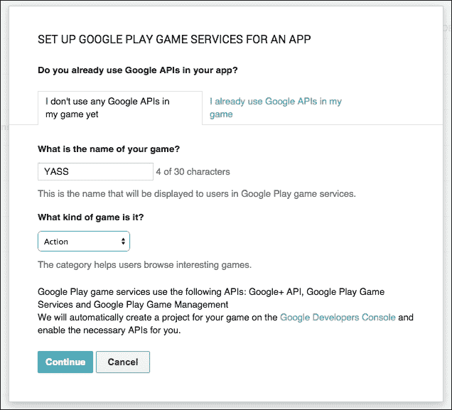
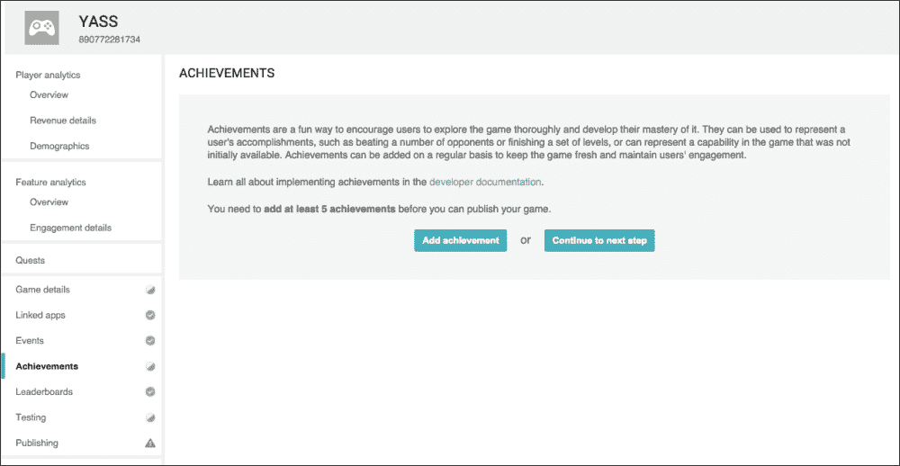
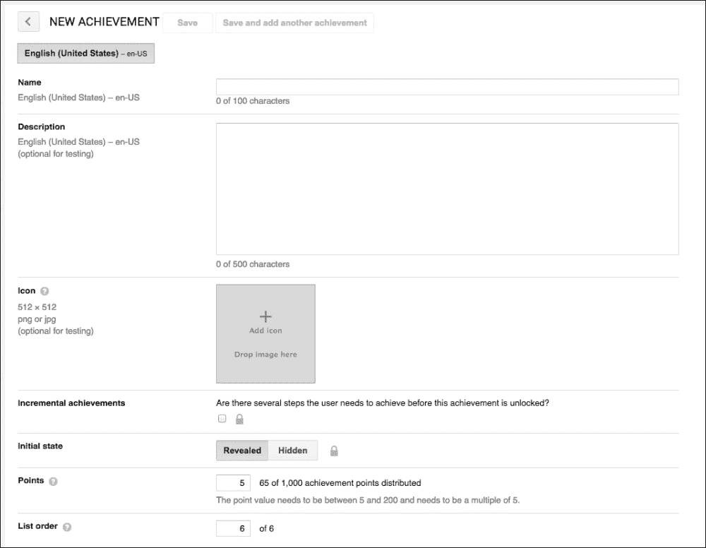
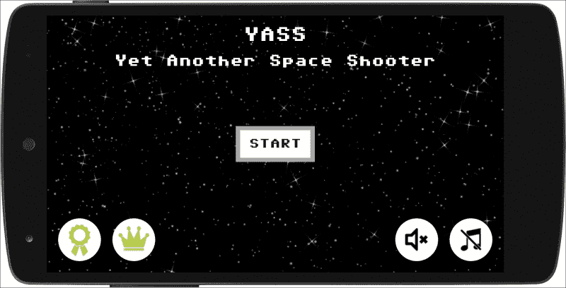

# 九、整合谷歌游戏服务

谷歌提供谷歌游戏服务，作为在应用程序中使用特殊功能的一种方式。成为我们最感兴趣的游戏服务子集。请注意，谷歌游戏服务是作为独立于操作系统的应用程序更新的。这允许我们假设大多数玩家将安装最新版本的谷歌游戏服务。

因此，越来越多的功能正从安卓软件开发工具包转移到游戏服务中。

Play Services 提供的不仅仅是游戏服务，还有一个专门针对游戏的板块，那就是**谷歌 Play 游戏服务** ( **GPGS** )。这些功能包括成就，排行榜，任务，保存游戏，礼物，甚至多人支持。

GPGS 还提供了一个名为“玩游戏”的独立应用程序，向用户显示他或她一直在玩的游戏、最新成就以及他或她的朋友玩的游戏。这是一个非常有趣的方法，让你的游戏曝光。

即使作为一个独立的功能，成就和排行榜是现在大多数游戏使用的两个概念，那么为什么要在可以依赖谷歌制作的基础上自己定制呢？

GPGS 可以在许多平台上使用:安卓、iOS 和网络等等。它更多地用于安卓系统，因为它是谷歌应用程序的一部分。

网上有大量的分步文档，但细节分散在不同的地方。我们将在这里把它们放在一起，并将您链接到官方文档以获得更详细的信息。

在本章中，您应该有一个开发人员帐户，并且可以访问谷歌游戏开发人员控制台。也建议你了解一个 app 的签约和发布流程。如果你不熟悉的话，在[有非常详细的官方](http://developer.android.com/distribute/googleplay/start.html)文档。

GPGS 有两个方面:开发者控制台和代码。我们将从一个交替到另一个，同时谈论不同的功能。

# 设置开发人员控制台

现在我们已经接近发布状态，我们必须开始使用开发人员控制台。

我们需要做的第一件事是进入控制台的**游戏服务**部分来创建和配置一个新游戏。在左侧菜单中，我们有一个标记为**游戏服务**的选项。这是你必须点击的地方。进入**游戏服务**部分，点击**添加新游戏**:


这将我们带到设置对话框。如果您在游戏中使用其他谷歌服务，如**谷歌地图**或**谷歌云消息** ( **GCM** )，您应该选择第二个选项并继续前进。否则，你只需填写**的字段，我的游戏还没有使用任何谷歌应用编程接口**并继续。如果你不知道你是否已经在使用它们，你可能没有。



现在，是时候把一个游戏和它联系起来了。我建议你提前发布你的游戏作为 alpha 版本。这个会让你在开始输入包名时从列表中选择。

### 注

在将游戏添加到游戏服务之前，先将游戏发布到 alpha 通道，这使得配置更加容易。

如果您不熟悉签署和发布您的应用程序，请查看[的官方文档。](http://developer.android.com/tools/publishing/app-signing.html)

最后，当我们链接第一个应用程序时，我们只需要采取两个步骤。我们需要授权并提供品牌信息。授权将生成一个 OAuth 密钥——我们不需要使用它，因为其他平台需要它——以及一个游戏标识。这个标识对所有链接的应用程序都是唯一的，我们需要它来登录。但是现在没必要写下来，随时可以在控制台轻松找到。

### 注

授权该应用程序将生成游戏标识，这对于所有链接的应用程序都是唯一的。

请注意，我们添加的应用配置了释放键。如果您继续并尝试登录集成，您将收到一条错误消息，告诉您该应用程序使用了错误的证书:


有两种方法可以解决这个限制:

*   始终进行发布构建以测试 GPGS 集成
*   将您的调试签名游戏添加为链接应用程序

我建议您将调试签名的应用程序添加为链接应用程序。为此，我们只需要链接另一个应用程序，并用调试密钥的 SHA1 指纹对其进行配置。要获得它，我们必须打开一个终端并运行 keytool 实用程序:

```java
keytool -exportcert -alias androiddebugkey -keystore <path-to-debug-keystore> -list -v
```

注意在 Windows 中，调试`keystore`可以在`C:\Users\<USERNAME>\.android\debug.keystore`找到。在苹果和 Linux 上，调试`keystore`通常位于`~/.android/debug.keystore`。


对话框链接游戏服务控制台上的调试应用程序

现在，我们已经配置好了游戏。我们可以继续在控制台中创建成就和排行榜，但我们会把它放在一边，并确保我们可以登录并与 GPGS 连接。

只有测试人员可以在游戏未发布时登录 GPGS。你可以让一个链接应用的 alpha 和/或 beta 测试员成为游戏服务的测试员，你也可以为此手动添加电子邮件地址。您可以在“测试”选项卡中对此进行修改。

### 注

只有测试帐户可以访问未发布的游戏。

开发人员控制台所有者的电子邮件被预填充为测试人员。以防你在登录时遇到问题，请仔细检查测试人员列表。

未发布的游戏服务不会出现在 Play Services 应用程序的提要中，但可以对其进行测试和修改。这就是为什么最好保持在草稿模式，直到游戏本身准备好，同时发布游戏和游戏服务。

# 设置代码

我们需要做的第一件事是将谷歌游戏服务库添加到我们的项目中。当我们创建项目时，向导应该已经完成了这项工作，但是我建议您现在仔细检查一下。

该库需要添加到主模块的`build.gradle`文件中。请注意，Android Studio 项目为每个模块包含一个顶级`build.gradle`和一个模块级`build.gradle`。我们将修改`mobile`模块下的一个。

确保播放服务的库列在依赖项下:

```java
apply plugin: 'com.android.application'

dependencies {
  compile 'com.android.support:appcompat-v7:22.1.1'
  compile 'com.google.android.gms:play-services:7.3.0'
}
```

在撰写本文时，最新版本是 7.3.0。基本特征没有太大变化，也不太可能改变。您可以强制 Gradle 使用特定版本的库，但一般来说，我建议您使用最新版本。

一旦拥有，保存更改并点击**将项目与渐变文件同步**。

为了能够连接到 GPGS，我们需要让游戏知道游戏 ID 是什么。这是通过`AndroidManifest.xml`上的`<meta-data>`标签完成的。您可以在这里硬编码该值，但是强烈建议您将其设置为 Android 项目中的资源。

我们将在`res/values`下为此创建一个新文件，我们将命名为`play_services.xml`。在这个文件里我们会放游戏 ID，但是以后我们也会有成绩和排行榜 ID 在里面。建议对这些值使用单独的文件，因为它们是不需要翻译的常数:

```java
<application>
  <meta-data android:name="com.google.android.gms.games.APP_ID" android:value="@string/app_id" />
  <meta-data android:name="com.google.android.gms.version" android:value="@integer/google_play_services_version"/>
  [...]
</application>
```

添加这些元数据非常重要。如果您忘记更新`AndroidManifest.xml`，当您尝试登录谷歌游戏服务时，应用程序将崩溃。请注意，gms 版本的整数是在库中定义的，我们不需要将其添加到文件中。

### 注

如果你忘记将游戏标识添加到字符串中，应用程序将会崩溃。

现在，是时候开始登录了。这个过程相当繁琐，需要很多检查，所以谷歌发布了一个名为 BaseGameUtils 的开源项目，这让它变得更加容易。不幸的是，这个项目不是 play services 库的一部分，甚至不能作为库使用。因此，我们必须从 GitHub 获取它(要么签出它，要么以 ZIP 文件的形式下载源代码)。

### 注

BaseGameUtils 将我们从处理与游戏服务的连接的复杂性中抽象出来。

更麻烦的是，BaseGameUtils 不能独立下载，必须与另一个项目一起下载。事实上，这段重要的代码不是官方库的一部分，因此设置起来相当繁琐。为什么会这样做，我自己也不明白。

包含基础游戏软件的项目叫做`android-basic-samples`，可以从[https://github.com/playgameservices/android-basic-samples](https://github.com/playgameservices/android-basic-samples)下载。

### 注

添加 BaseGameUtils 并不像我们希望的那样简单。

`android-basic-samples`下载完成后，在 Android Studio 打开你的游戏项目。点击**文件** > **导入模块**，导航至下载`android-basic-samples`的目录。在`BasicSamples/libraries`目录中选择`BaseGameUtils`模块，点击**确定**。

最后，更新`mobile`模块的`build.gradle`文件中的依赖关系，并再次同步梯度:

```java
dependencies {
  compile project(':BaseGameUtils')
  [...]
}
```

经过所有这些步骤来设置项目，我们终于准备好开始登录了。

我们将使我们的主`Activity`从负责所有连接处理的`BaseGamesActivity`扩展，并使用谷歌游戏服务登录。

还有一个细节:到目前为止，我们使用`Activity`而不是`FragmentActivity`作为`YassActivity` ( `BaseGameActivity`从`FragmentActivity`延伸而来)的基类，这个变化会干扰我们调用`navigateBack`时的对话框行为。我们可以更改`BaseGameActivity`的基类或修改`navigateBack`来执行弹出的片段导航层次结构。我推荐第二种方法:

```java
public void navigateBack() {
  // Do a pop on the navigation history
  getFragmentManager().popBackStack();
}
```

这个 util 类是专为单活动游戏设计的。它可以用于多种活动，但并不简单。这是将游戏保持在单一活动中的另一个很好的理由。

### 注

BaseGameUtils 是为单活动游戏设计的。

`BaseGameActivity`的默认行为是每次启动`Activity`时尝试登录。如果用户同意登录，登录将自动发生。但是如果用户拒绝这样做，他或她将被再次询问几次。

我个人觉得这很烦人，我建议你只提示登录一次谷歌 Play 服务(如果用户注销，也要提示一次)。我们总是可以在应用中提供一个登录入口点。

这很容易改变。默认尝试次数设置为 3，并且是`GameHelper`代码的一部分:

```java
// Should we start the flow to sign the user in automatically on startup? If
// so, up to
// how many times in the life of the application?
static final int DEFAULT_MAX_SIGN_IN_ATTEMPTS = 3;
int mMaxAutoSignInAttempts = DEFAULT_MAX_SIGN_IN_ATTEMPTS;
```

因此，我们只需为我们的活动配置它，在`onCreate`期间添加一行代码，以我们想要的方式更改默认行为:只需尝试一次:

```java
getGameHelper().setMaxAutoSignInAttempts(1);
```

最后，当用户成功登录和出现问题时，我们可以覆盖两种方法来采取行动:`onSignInSucceeded`和`onSignInFailed`。我们将在本章末尾更新主菜单时使用它们。

GPGS 的进一步使用将通过`GameHelper`和/或`GoogleApiClient`进行，后者是`GameHelper`的一部分。我们可以使用`BaseGameActivity`的`getGameHelper`方法获得对`GameHelper`的引用。

现在用户可以登录谷歌游戏服务，我们可以继续使用成就和排行榜。让我们回到开发者控制台。

# 成绩

我们先在开发者控制台定义几个成就，然后看看如何在游戏中解锁。请注意，要发布与 GPGS 的任何游戏，您需要定义至少五个成就。没有其他功能是强制性的，但成就是强制性的。

### 注

我们需要定义至少五个成就来发布一个使用谷歌游戏服务的游戏。

如果你想在一个没有成就的游戏中使用 GPGS，我建议你添加五个虚拟的秘密成就，让它们成为现实。

要添加成就，我们只需要导航到左侧的**成就**选项卡，点击**添加成就**:



添加新成就的菜单有几个主要是不言自明的领域。它们如下:

*   **名称**:将要显示的名称(可以本地化为不同语言)。
*   **描述**:待展示成果的描述(也可以本地化为不同语言)。
*   **图标**:作为 512x512 px PNG 图像的成就图标。这将用于显示列表中的成就，并在解锁时生成锁定图像和游戏内弹出窗口。
*   **增量成就**:如果成就需要一套步骤才能完成，则称之为增量成就，可以用进度条显示。我们将有一个递增的成就来说明这一点。
*   **初始状态** : **显露** / **隐藏**取决于我们是否希望成就被展现。当一个成就显示出来时，名字和描述是可见的，玩家知道他们必须做什么来解锁它。另一方面，隐藏的成就是一个秘密，解锁后可能是一个有趣的惊喜。我们会有两个秘密的成就。
*   **积分** : GPGS 允许每局解锁成绩有 1000 分给予。这将在谷歌游戏的玩家档案中转换为 XP。这可以用来强调某些成就比其他成就更难，因此给予更大的奖励。一旦发表，你就不能改变这些，所以如果你计划在未来有更多的成就，请提前计划要点。
*   **List order**: The order of the achievements is shown. It is not followed all the time, since on the Play Games app the unlocked ones are shown before the locked ones. It is still handy to rearrange them.

    

    对话框在开发人员控制台上添加成就

正如我们已经决定的，我们将在我们的游戏中取得五项成就，它们是:

*   **大比分**:一局得分超过 10 万分。这是在玩的时候授予的。
*   **小行星杀手**:摧毁 100 颗小行星。这将在不同的游戏中计算它们，是一个渐进的成就。
*   **幸存者**:存活 60 秒。
*   **目标获得**:隐藏成就。连续击中 20 颗小行星，没有错过一次击中。这是为了奖励那些只在该出手的时候出手的玩家。
*   **目标丢失**:这应该是一个有趣的成就，当你连续 10 发子弹未命中时，这是理所当然的。它也是隐藏的，因为否则解锁太容易了。

因此，我们为他们创建了一些图像，并将它们添加到控制台。


开发人员控制台，包含所有已配置的成果

每个成就都有一个字符串标识。我们将需要这些 id 来解锁我们游戏中的成就，但是谷歌让我们变得很容易。我们在底部有一个名为**获取资源**的链接，它会弹出一个对话框，显示我们需要的字符串资源。我们可以从那里复制它们，并将其粘贴到我们已经创建的`play_services.xml`文件中的项目中。


## 建筑

对于我们的游戏，鉴于我们只有五个成就，我们将把成就的代码直接添加到`ScoreObject`中。这将使您阅读的代码更少，因此我们可以专注于它是如何完成的。然而，对于一个真正的产品代码，我建议您定义一个专用的架构来实现。

推荐的架构是有一个`AchievementsManager`类，在游戏开始时加载所有成就，并存储在三个列表中:

*   所有成就
*   锁定的成就
*   未锁定的成就

然后，我们有一个带有抽象`check`方法的`Achievement`基类，我们为它们中的每一个实现:

```java
public boolean check (GameEngine gameEngine, GameEvent gameEvent) 
{
}
```

这个基类负责从本地存储中加载成就状态(我建议这个使用`SharedPreferences`)并根据`check`的结果进行修改。

成就检查在`AchievementManager`级别使用`checkLockedAchievements`方法完成，该方法遍历可解锁的成就列表。这个方法应该叫做`GameEngine`的`onEventReceived`的一部分。

这个架构允许你只检查尚未解锁的成就，也可以在特定的专用地方检查游戏中包含的所有成就。

在我们的例子中，由于我们将分数保持在`ScoreGameObject`内，我们将在那里添加所有的成就代码。

请注意，让`GameEngine`处理分数并将其作为其他对象可以读取的变量也是推荐的设计模式，但作为`ScoreGameObject`的一部分来做更简单。

## 解锁成就

为了处理的成就，我们需要访问类的一个对象`GoogleApiClient`。我们可以在`ScoreGameObject`的构造器中得到对它的引用:

```java
private final GoogleApiClient mApiClient;

public ScoreGameObject(YassBaseFragment parent, View view, int viewResId) {
  […]
  mApiClient = parent.getYassActivity().getGameHelper().getApiClient();
}
```

父级`Fragment`引用了`Activity`，后者引用了`GameHelper`，后者引用了`GoogleApiClient`。

解锁一项成就只需要一行代码，但在尝试解锁一项成就之前，我们还需要检查用户是否连接了谷歌 Play 服务。这是必要的，因为如果用户没有签名，就会引发异常，游戏就会崩溃。

### 注

解锁一项成就只需要一行代码。

但是这张支票还不够。在边缘情况下，当用户从谷歌 Play 服务手动注销时(可以在成就屏幕中完成)，连接不会关闭，也无法知道他或她是否已经注销。

我们将创建一个实用方法来解锁完成所有检查的成果，并将解锁方法包装到一个`try/catch`块中，并在出现异常时断开 API 客户端:

```java
private void unlockSafe(int resId) {
  if (mApiClient.isConnecting() || mApiClient.isConnected()) {
    try {
      Games.Achievements.unlock(mApiClient, getString(resId));
    } catch (Exception e) {
      mApiClient.disconnect();
    }
  }
}
```

即使有了所有的检查，代码仍然非常简单。

让我们努力实现我们为游戏定义的特定成就。尽管它们非常具体，但跟踪游戏事件和变量，然后检查成就以解锁的方法本身是通用的，并且是如何处理成就的现实例子。

我们设计的成就需要我们计算一些游戏事件和运行时间。对于最后两个成果，我们需要为子弹未命中的情况做一个新的`GameEvent`，这个我们到现在还没有创造出来。触发这个新的`GameEvent`的`Bullet`对象中的代码如下:

```java
@Override
public void onUpdate(long elapsedMillis, GameEngine gameEngine) {
  mY += mSpeedFactor * elapsedMillis;
  if (mY < -mHeight) {
    removeFromGameEngine(gameEngine);
    gameEngine.onGameEvent(GameEvent.BulletMissed);
  }
}
```

现在，让我们在`ScoreGameObject`里面工作。我们将有一种方法来检查每次小行星被撞击时的成就。当该事件发生时，有三项成就可以解锁:

*   **大比分**，因为撞小行星给我们加分
*   **目标获得**，因为它需要小行星连续命中
*   **小行星杀手**，因为它统计的是已经被摧毁的小行星总数

代码是这样的:

```java
private void checkAsteroidHitRelatedAchievements() {
  if (mPoints > 100000) {
    // Unlock achievement
    unlockSafe(R.string.achievement_big_score);
  }
  if (mConsecutiveHits >= 20) {
    unlockSafe(R.string.achievement_target_acquired);
  }
  // Increment achievement of asteroids hit
  if (mApiClient.isConnecting() || mApiClient.isConnected()) {
    try {
      Games.Achievements.increment(mApiClient, getString(R.string.achievement_asteroid_killer), 1);
    } catch (Exception e) {
      mApiClient.disconnect();
    }
  }
}
```

我们检查总积分和连续点击次数来解锁相应的成就。

“小行星杀手”的成就有点不同，因为它是一个渐进的成就。这些类型的成就没有`unlock`方法，而是`increment`方法。每次我们增加价值，成就的进展就会更新。一旦进度达到 100%，就会自动解锁。

### 注

增量的成就是自动解锁的，我们只需要增量它们的价值。

这使得增量成果比本地跟踪进度更容易使用。但是我们仍然需要像对`unlockSafe`那样做所有的检查。

我们正在使用一个名为`mConsecutiveHits`的变量，它还没有初始化。这是在`onGameEvent`内部完成的，这里是检查其他隐藏成就目标丢失的地方。“幸存者”成就的一些初始化也在这里完成:

```java
public void onGameEvent(GameEvent gameEvent) {
  if (gameEvent == GameEvent.AsteroidHit) {
    mPoints += POINTS_GAINED_PER_ASTEROID_HIT;
    mPointsHaveChanged = true;
    mConsecutiveMisses = 0;
    mConsecutiveHits++ ;
    checkAsteroidHitRelatedAchievements();
  }
  else if (gameEvent == GameEvent.BulletMissed) {
    mConsecutiveMisses++ ;
    mConsecutiveHits = 0;
    if (mConsecutiveMisses >= 20) {
      unlockSafe(R.string.achievement_target_lost);
    }
  }
  else if (gameEvent == GameEvent.SpaceshipHit) {
    mTimeWithoutDie = 0;
  }
  […]
}
```

每次撞击小行星时，我们都会增加小行星连续撞击的次数，并重置连续未命中的次数。同样，每次我们错过一颗子弹，我们都会增加连续未命中的次数，并重置连续命中的次数。

附带说明一下，每次飞船被摧毁，我们都会重置不死时间，用于“幸存者”，但这不是唯一一次应该更新不死时间。我们必须在游戏开始时重置它，并在`onUpdate`内通过添加已经过去的毫秒数来修改它:

```java
@Override
public void startGame(GameEngine gameEngine) {
  mTimeWithoutDie = 0;
  […]
}

@Override
public void onUpdate(long elapsedMillis, GameEngine gameEngine) {
  mTimeWithoutDie += elapsedMillis;
  if (mTimeWithoutDie > 60000) {
    unlockSafe(R.string.achievement_survivor);
  }
}
```

所以，一旦游戏从开始到宇宙飞船被摧毁已经运行了 6 万毫秒，我们就解锁了“幸存者”的成就。

有了这个，我们就有了解锁我们为游戏创造的成就所需的所有代码。让我们以对系统和开发人员控制台的一些评论来结束这一部分:

*   根据经验，您可以编辑成就的大部分细节，直到将其发布到生产中。
*   你的成果一旦发表，就不能删除。您只能删除处于预发布状态的成就。在成就屏幕的底部有一个标记为“删除”的按钮。
*   您也可以在成就处于草稿状态时重置它们的进度。这种重置会同时发生在所有玩家身上。在成就屏幕底部有一个标有**重置成就进度**的按钮。

还要注意的是`GameBaseActivity`做了大量的日志记录。因此，如果您的设备连接到您的计算机，并且您运行调试版本，您可能会发现它有时会滞后。在删除日志的发布版本中不会发生这种情况。

# 排行榜

由于 YASS 在游戏中只有一种游戏模式和一个分数，所以在谷歌游戏服务上只有一个排行榜是有意义的。排行榜在开发人员控制台的游戏服务区域内通过自己的选项卡进行管理。

与成就不同，并不强制要求任何排行榜能够发布您的游戏。

如果你的游戏有不同的难度，你可以为每个游戏设置一个排行榜。这也适用于游戏有几个衡量玩家进度的值的情况，你可以为每个值设置一个排行榜。


管理游戏控制台上的排行榜

排行榜可以在**排行榜**标签中创建和管理。当我们点击添加排行榜时，我们会看到的表单，其中有几个字段需要填写。它们如下:

*   **名称**:排行榜的显示名称，可以本地化。我们简单地称之为`High Scores`。
*   **分数格式**:可以是**数字**、**货币**或者**时间**。我们将对 YASS 使用**数字**。
*   **图标**:一个 512x512 px 的图标，用来标识排行榜。
*   **点餐** : **越大越好** / **越小越好**。我们将使用**越大越好**，但其他得分类型可能是**越小越好**，就像在赛车游戏中一样。
*   **启用篡改保护**:这将自动过滤掉可疑分数。你应该戴着这个。
*   **限制**:如果你想限制排行榜上显示的分数范围，可以在这里进行。我们不会用这个
*   **List order**: the order of the leaderboards. Since we only have one, it is not really important for us.

    

    在玩游戏控制台上设置排行榜

现在我们已经定义了排行榜，是时候在游戏中使用它了。就像成就一样，我们有一个链接，可以用 XML 获取游戏的所有资源。因此，我们继续获取排行榜的 ID，并将其添加到`play_services.xml`文件中定义的字符串中。

我们必须在游戏结束时提交分数(即`GameOver`事件)，但也要在用户通过暂停按钮退出游戏时提交。为了统一这一点，我们将创建一个名为`GameFinished`的新`GameEvent`，它在`GameOver`事件后和用户退出游戏后被触发。

我们将更新`GameEngine`的`stopGame`方法，这两种情况下都会调用该方法来触发事件:

```java
public void stopGame() {
  if (mUpdateThread != null) {
    synchronized (mLayers) {
      onGameEvent(GameEvent.GameFinished);
    }
    mUpdateThread.stopGame();
    mUpdateThread = null;
  }
  […]
}
```

我们必须在发送事件后将`updateThread`设置为空，以防止该代码运行两次。否则，我们可以多次发送每个分数。

类似地，对于成绩来说，提交分数非常简单，只是一行代码。但是我们还需要检查`GoogleApiClient`是否连接，当抛出异常时，我们仍然有相同的边缘情况。所以，我们需要把它包在一个`try` / `catch`块里。

为了保持一切都在同一个地方，我们将把这个代码放在`ScoreGameObject`里面:

```java
@Override
public void onGameEvent(GameEvent gameEvent) {
  […]
  else if (gameEvent == GameEvent.GameFinished) {
    // Submit the score
    if (mApiClient.isConnecting() || mApiClient.isConnected()) {
      try {
        Games.Leaderboards.submitScore(mApiClient, getLeaderboardId(), mPoints);
      }
      catch (Exception e){
        mApiClient.disconnect();
      }
    }
  }
}

private String getLeaderboardId() {
  return mParent.getString(R.string.leaderboard_high_scores);
}
```

这真的很简单。GPGS 现在正在接收我们的分数，它会根据分数的时间戳创建每日、每周和所有时间的排行榜。它还使用你的谷歌+圈子来显示你朋友的社交分数。所有这些都是自动为您完成的。

最后缺少的部分是让玩家从主菜单中打开排行榜和成就用户界面，以及在他们注销时触发登录。

# 打开玩游戏界面

为了完成成绩和排行榜的整合，我们准备在主菜单中增加按钮，打开 GPGS 提供的原生 UI。

为此，我们将在屏幕的左下角放置两个按钮，与音乐和声音按钮相对。我们还会检查我们是否连接；如果没有，我们将显示一个单一的登录按钮。

对于这些按钮，我们将使用 GPGS 的官方图像，可供开发人员使用。请注意，在使用图标时，您必须遵循品牌指南，并且图标必须按原样显示，不得修改。这也为所有支持 Play Games 的游戏提供了一致的外观和感觉。

既然我们已经看到了很多布局，我们就不打算再包含一个与我们已经拥有的几乎相同的布局了。



带有按钮的主菜单，用于查看成绩和排行榜。

为了处理这些新按钮，我们将像往常一样将视图的`MainMenuFragment`设置为`OnClickListener`。我们在与其他按钮相同的地方进行，即`onViewCreated`内部:

```java
@Override
public void onViewCreated(View view, Bundle savedInstanceState) {
  super.onViewCreated(view, savedInstanceState);
  [...]
  view.findViewById(R.id.btn_achievements).setOnClickListener(this);
  view.findViewById(R.id.btn_leaderboards).setOnClickListener(this);
  view.findViewById(R.id.btn_sign_in).setOnClickListener(this);
}
```

就像成就和排行榜一样，工作是使用接收`GoogleApiClient`对象的静态方法完成的。我们可以从`GameHelper`得到这个物体，它是`BaseGameActivity`的一部分，像这样:

```java
GoogleApiClient apiClient = getYassActivity().getGameHelper().getApiClient();
```

要打开原生用户界面，我们必须获得一个`Intent`，然后用它启动一个`Activity`。使用`startActivityForResult`很重要，因为有些数据是来回传递的。

打开成绩 UI，代码是这样的:

```java
Intent achievementsIntent = Games.Achievements.getAchievementsIntent(apiClient);
startActivityForResult(achievementsIntent, REQUEST_ACHIEVEMENTS);
```


这个开箱即用。它会自动将未锁定成就的图标变灰，为正在进行的成就添加计数器和进度条，为隐藏的成就添加挂锁。

同样，要打开排行榜用户界面，我们从`Games.Leaderboards`类中获取一个意图:

```java
Intent leaderboardsIntent = Games.Leaderboards.getLeaderboardIntent(
  apiClient,
  getString(R.string.leaderboard_high_scores));
startActivityForResult(leaderboardsIntent, REQUEST_LEADERBOARDS);
```

在这种情况下，我们要求一个特定的排行榜，因为我们只有一个。我们可以使用`getLeaderboardsIntent` 来代替，这将打开所有排行榜列表的“玩游戏”界面。

### 注

我们可以有意打开排行榜或特定的排行榜。

剩下要做的是在用户未连接时替换登录按钮。为此，我们将创建一个读取状态并相应地显示和隐藏视图的方法:

```java
private void updatePlayButtons() {
  GameHelper gameHelper = getYassActivity().getGameHelper();
  if (gameHelper.isConnecting() || gameHelper.isSignedIn()) {
    getView().findViewById(R.id.btn_achievements).setVisibility(View.VISIBLE);
    getView().findViewById(R.id.btn_leaderboards).setVisibility(View.VISIBLE);
    getView().findViewById(R.id.btn_sign_in).setVisibility(View.GONE);
  }
  else {
    getView().findViewById(R.id.btn_achievements).setVisibility(View.GONE);
    getView().findViewById(R.id.btn_leaderboards).setVisibility(View.GONE);
    getView().findViewById(R.id.btn_sign_in).setVisibility(View.VISIBLE);
  }
}
```

此方法根据状态决定是移除视图还是使视图可见。我们将在重要的状态改变方法中称之为:

*   `onLayoutCompleted`:我们第一次打开游戏初始化 UI。
*   `onSignInSucceeded`:用户成功登录 GPGS 时。
*   `onSignInFailed`:这可以在我们自动登录，没有连接的时候触发。处理好这件事很重要。
*   `onActivityResult`:我们从 Play Games UI 回来的时候，万一用户已经注销了。

但是没有什么事情像看起来那么容易。事实上，当用户注销且不退出游戏时，`GoogleApiClient`会保持连接打开。因此`GameHelper`的`isSignedIn`值仍然为真。这是我们整章都在讨论的边缘案例。

由于这种边缘情况，当用户界面应该显示登录按钮时，显示成就和排行榜按钮的用户界面不一致。

### 注

当用户从“玩游戏”中注销时，`GoogleApiClient`保持连接打开。这会导致混乱。

不幸的是，这已经被标记为谷歌预期的工作。原因是连接仍处于活动状态，我们有责任在`onActivityResult`方法中解析结果以确定新状态。但是这样不太方便。

由于这是一种罕见的情况，我们将采用最简单的解决方案，即将其包装在一个`try/catch`块中，如果用户在未登录的情况下点击排行榜或成就，则让他或她登录。这是我们必须处理点击成就按钮的代码，但排行榜的代码是等效的:

```java
else if (v.getId() == R.id.btn_achievements) {
  try {
    GoogleApiClient apiClient = getYassActivity().getGameHelper().getApiClient();
    Intent achievementsIntent = Games.Achievements.getAchievementsIntent(apiClient);
    startActivityForResult(achievementsIntent, REQUEST_ACHIEVEMENTS);
  }
  catch (Exception e) {
    GameHelper gameHelper = getYassActivity().getGameHelper();
    gameHelper.disconnect();
    gameHelper.beginUserInitiatedSignIn();
  }
}
```

基本上，我们有旧代码来打开成就活动，但是我们将其包装在一个`try` / `catch`块中。如果出现异常，我们断开游戏助手，并使用`beginUserInitiatedSignIn`方法开始新的登录。

在我们再次尝试登录之前，断开`gameHelper`是非常重要的。否则，登录将不起作用。

### 注

我们必须先断开与 GPGS 的连接，然后才能使用`GameHelper`中的方法登录。

最后，还有一种情况是用户点击登录按钮，这只是从`GameHelper`使用`beginUserInitiatedSignIn`方法触发登录:

```java
if (v.getId() == R.id.btn_sign_in) {
  getYassActivity().getGameHelper().beginUserInitiatedSignIn();
}
```

一旦你发布了你的游戏和游戏服务，成就和排行榜将不会立即出现在谷歌游戏的游戏描述中。要求“相当数量的用户”使用过。你没有做错什么，你只需要等待。

# Google Play 服务的其他功能

Google Play Game 服务为游戏开发者提供了比成就和排行榜更多的功能。没有一个真正适合我们正在构建的游戏，但是知道它们的存在是有用的，以防你的游戏需要它们。你可以通过使用它们而不是重新发明轮子来为自己节省大量的时间和精力。

谷歌游戏服务的其他功能有:

*   **事件和任务**:这些可以让你监控游戏的使用和进程。此外，他们还增加了为玩家创造限时活动的可能性。
*   **礼物**:听起来很简单，可以送一份礼物给其他玩家，也可以要求送一份给你。是的，这在不久前普及的非常机械的脸书游戏中可以看到。
*   **保存的游戏**:保存的游戏的标准概念。如果您的游戏有进展或可以根据用户操作解锁内容，您可能希望使用此功能。由于保存在云中，保存的游戏可以跨多个设备访问。
*   **基于回合的实时多人游戏** : Google Play Game Services 提供了一个 API 来实现基于回合的实时多人游戏功能，无需编写任何服务器代码。

如果你的游戏是多人游戏，并且有在线经济，可能值得自己制作服务器，并且只在服务器上授予虚拟货币以防止作弊。否则，破解礼物/奖励系统相当容易，一个人就能毁掉整个游戏经济。

然而，如果没有网络游戏经济，礼物和任务的好处可能比有人能黑它们更重要。

让我们来看看的这些特性。

## 事件

该活动的 API 为我们提供了一种定义和收集游戏性指标并将其上传到谷歌游戏服务的方法。

这与我们已经在游戏中使用的`GameEvents`非常相似。事件应该是我们游戏的游戏事件的子集。我们拥有的许多游戏事件在内部被用作对象之间的信号或同步机制。这些事件在引擎之外并不真正相关，但其他事件可能相关。这些是我们应该送到 GPGS 的事件。

为了能够将游戏中的事件发送到 GPGS，我们必须首先在开发者控制台中创建它。

要创建事件，我们必须转到开发人员控制台中的**事件**选项卡，单击**添加新事件**，并填写以下字段:

*   **名称**:事件的简称。该名称最多可包含 100 个字符。该值可以本地化。
*   **描述**:事件较长的描述。描述最多可包含 500 个字符。该值也可以本地化。
*   **图标**:标准 512x512 px 尺寸的事件图标。
*   **可见性**:至于成就，这个可以显露，也可以隐藏。
*   **格式**:对于排行榜，可以是**数字**、**货币**或者**时间**。
*   **事件类型**:用于标记创建或花费溢价币的事件。这可以是**优质币汇**、**优质币源**或**无**。

在游戏中，事件的作用相当于增量成就。您可以使用以下代码行增加事件计数器:

```java
Games.Events.increment(mGoogleApiClient, myEventId, 1);
```

您可以删除处于草稿状态或已经发布的事件，只要该事件没有被任务使用。你也可以为你的事件测试者重置玩家进度数据，就像你可以为成就重置一样。

虽然事件可以用作分析系统，但当它们与任务结合时，它们的真正用处就显现出来了。

## 任务

任务是一种挑战，要求玩家在特定的时间范围内多次完成一个事件以获得奖励。

因为任务与一个事件相关联，要使用任务，你需要至少创建一个事件。

你可以在开发者控制台的任务标签中创建一个任务。任务需要填写以下字段:

*   **名称**:任务的简称。最多可包含 100 个字符，并且可以本地化。
*   **描述**:对任务的更长描述。你的任务描述应该让玩家知道他们需要做什么来完成任务。描述最多可包含 500 个字符。前 150 个字符对玩家来说是可见的，比如在谷歌游戏应用程序中显示的那些。
*   **图标**:将与任务相关联的方形图标。
*   **横幅**:一个矩形的图像，将用于推广任务。
*   **完成标准**:这是任务本身的配置。它由一个事件和该事件必须发生的次数组成。
*   **时间表**:任务的开始和结束日期和时间。GPGS 使用您当地的时区，但将值存储为 UTC。玩家将看到这些值出现在他们当地的时区。你可以选中一个复选框，在任务即将结束时通知用户。
*   **奖励数据**:这是每个游戏特有的。它可以是一个 JSON 对象，指定奖励。当任务完成时，这将被发送给客户端。

在开发人员控制台中进行配置后，您可以对任务做两件事:

*   显示任务列表
*   处理任务完成

为了得到任务列表，我们以一个意图开始一个活动，这个意图像往常一样通过一个静态方法提供给我们:

```java
Intent questsIntent = Games.Quests.getQuestsIntent(mGoogleApiClient,
   Quests.SELECT_ALL_QUESTS);
startActivityForResult(questsIntent, QUESTS_INTENT);
```

要在任务完成时得到通知，我们所要做的就是注册一个监听器:

```java
Games.Quests.registerQuestUpdateListener(mGoogleApiClient, this);
```

一旦我们设置了监听器，一旦任务完成，就会调用`onQuestCompleted`方法。在完成奖励的处理后，游戏应该调用`claim`来通知 Play Game 服务该玩家已经申领了奖励。

下面的代码片段显示了如何覆盖`onQuestCompleted`回调:

```java
@Override
public void onQuestCompleted(Quest quest) {
  // Claim the quest reward.
  Games.Quests.claim(mGoogleApiClient, quest.getQuestId(),
    quest.getCurrentMilestone().getMilestoneId());
  // Process the RewardData to provision a specific reward.
  String reward = new
    String(quest.getCurrentMilestone().getCompletionRewardData(),
    Charset.forName("UTF-8"));
}
```

奖励本身由客户定义。正如我们之前提到的，这将使游戏相当容易破解并获得奖励。但通常情况下，避免编写自己的服务器的麻烦是值得的。

## 礼物

GPGS 的礼物功能允许我们给其他玩家送礼物，也可以要求他们给我们送一个。这是为了使游戏更具协作性，并改善游戏的社交方面。

至于其他 GPGS 功能，我们有一个内置的用户界面，由图书馆提供，可以使用。在这种情况下，向他们的谷歌+圈子里的朋友发送和请求游戏内物品和资源的礼物。请求系统可以利用通知。

玩家可以使用谷歌游戏服务中的游戏礼品功能发送两种类型的请求:

*   向他们的朋友请求游戏内物品或其他形式的帮助的愿望请求
*   向他们的朋友发送游戏内物品或其他形式的帮助的礼物请求

玩家可以从默认的请求发送用户界面指定一个或多个目标请求接收者。礼物或愿望可以被接受者消费(接受)或拒绝。

要详细查看中的礼品应用编程接口，您可以访问[。](https://developers.google.com/games/services/android/giftRequests)

同样，至于 quest 奖励，这完全是由客户端完成的，这使得游戏容易被盗版。

## 保存的游戏

保存游戏服务提供云游戏保存槽。您的游戏可以检索保存的游戏数据，以允许返回的玩家从任何设备的最后保存点继续游戏。

这项服务可以在多台设备上同步玩家的游戏数据。例如，如果您有一个运行在安卓系统上的游戏，您可以使用保存的游戏服务，允许玩家在他们的安卓手机上开始游戏，然后在平板电脑上继续玩游戏，而不会丢失他们的任何进度。这项服务还可以用来确保玩家的游戏从停止的地方继续，即使他们的设备丢失、毁坏、被换成新的型号或者游戏被重新安装

保存的游戏服务不知道游戏内部，所以它提供了一个非结构化二进制 blob 字段，您可以在其中读写游戏数据。一个游戏可以根据用户配额为单个玩家编写任意数量的保存游戏，因此没有硬性要求将玩家限制在一个保存文件中。

### 注

保存的游戏在一个非结构化的二进制 blob 中完成。

保存游戏的应用编程接口还接收一些元数据，这些元数据被谷歌游戏用来填充用户界面，并在谷歌游戏应用程序中呈现有用的信息(例如，上次更新的时间戳)。

保存的游戏有几个入口点和动作，包括如何处理保存的游戏中的冲突。要了解更多相关信息，请查看的官方文档。

## 多人游戏

如果你打算实现多人对战，GPGS 可以帮你省下很多工作。您可以在最终产品中使用它，也可以不使用它，但它将消除在游戏概念得到验证之前考虑服务器端的需要。

你可以使用 GPGS 进行基于回合的实时多人游戏。虽然每一个都是完全不同的，使用不同的 API，但总有一个初始步骤，就是设置游戏，选择或邀请对手。

在基于回合的多人游戏中，单个共享状态在玩家之间传递，只有拥有回合的玩家有权修改它。玩家根据游戏确定的游戏顺序异步轮流。

玩家使用应用编程接口调用显式完成一个回合。然后游戏状态和回合一起传递给其他玩家。

有很多情况:选择对手、创建匹配、留下匹配、取消等等。在[https://developers . Google . com/games/services/Android/turnbasedMultiplayer](https://developers.google.com/games/services/android/turnbasedMultiplayer)上的官方文档相当详尽，如果你打算使用这个功能，你应该通读一下。

在实时多人游戏中，没有回合的概念。取而代之的是，服务器使用了房间的概念:这是一种虚拟的结构，可以在同一个游戏会话中实现多个玩家之间的网络通信，并让玩家之间直接发送数据，这是游戏服务器的一个常见概念。

### 注

实时多人服务是基于房间的概念。

实时多人游戏的应用编程接口使我们能够轻松:

*   管理网络连接以创建和维护实时多人游戏室
*   提供玩家选择用户界面，邀请玩家加入房间，寻找自动匹配的随机玩家，或两者结合
*   游戏运行时，将参与者和房间状态信息存储在游戏服务的服务器上
*   向玩家发送房间邀请和更新

要查看实时游戏的完整文档，请访问官方网站[。](https://developers.google.com/games/services/android/realtimeMultiplayer)

# 总结

我们已经将谷歌游戏服务添加到 YASS，包括在开发者控制台中设置游戏，并将所需的库添加到项目中。

然后，我们定义了一组成就，并添加了解锁它们的代码。我们使用了普通、增量和隐藏成就类型来展示可用的不同选项。

我们还配置了排行榜，并在游戏结束时和通过暂停对话框退出时提交分数。

最后，我们在主菜单中添加了排行榜和成就的本地用户界面链接。

我们还介绍了事件、任务和礼物的概念，以及谷歌游戏服务提供的保存游戏和多人游戏的功能。

游戏现在可以发布了。在下一章中，我们将看到如何使它在安卓电视上工作。