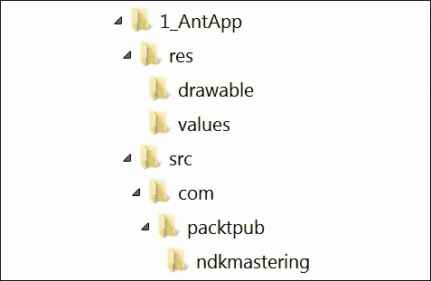
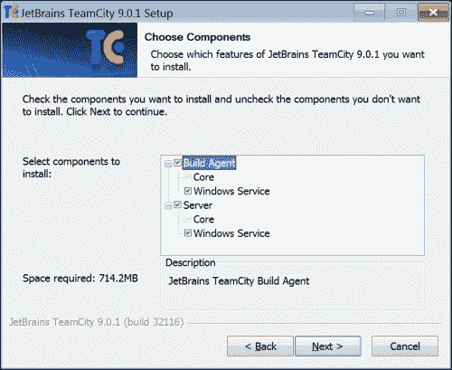

# 一、使用命令行工具

在本章中，我们将浏览主要的命令行工具，特别是与安卓应用程序的创建和打包相关的工具。我们将学习如何在微软视窗、苹果 OS X 和 Ubuntu/Debian Linux 上安装和配置安卓 NDK，以及如何在基于安卓的设备上构建和运行您的第一个本地应用程序。使用命令行工具来构建您的项目对于使用 C++ 进行跨平台移动开发是至关重要的。

### 注

这本书基于安卓软件开发工具包修订版 24.3.3 和安卓 NDK r10e。源代码是用安卓 API 级(棉花糖)测试的。

我们的主要焦点将是以命令行为中心和独立于平台的开发过程。

### 注

Android Studio是一个非常好的新的便携式开发集成开发环境，最近已经到了 1.4 版本。然而，它仍然只有非常有限的 NDK 支持，不会在本书中讨论。

# 在 Windows 上使用安卓命令行工具

要开始在微软视窗环境中为安卓开发本机 C++ 应用程序，您需要在系统上安装一些必要的工具。

使用以下列出的你需要的所有先决条件，开始安卓系统的 NDK 开发:

*   安卓软件开发工具包:你可以在 http://developer.android.com/sdk/index.html T2 找到这个。我们使用修订版 24。
*   安卓 NDK:你可以在 http://developer.android.com/tools/sdk/ndk/index.html 找到这个。我们使用 r10e 版本。
*   **Java 开发工具包** ( **JDK** ):可以在[http://www . Oracle . com/tech network/Java/javase/downloads/index . html](http://www.oracle.com/technetwork/java/javase/downloads/index.html)找到这个。我们使用甲骨文 JDK 第 8 版。
*   阿帕奇蚂蚁:你可以在 http://ant.apache.org T2 找到这个。这是一个用于构建 Java 应用程序的工具。
*   格雷德:你可以在 https://www.gradle.org T2 找到这个。与 Ant 相比，这是一个更现代的 Java 构建自动化工具，能够管理外部依赖关系。

这些工具的当前版本将在 Windows 上运行，不使用任何中间兼容层；他们不再需要 Cygwin 了。

尽管写这篇文章让我们很痛苦，但安卓软件开发工具包和 NDK 仍然应该安装在名称中不包含任何空格的文件夹中。这是安卓软件开发工具包中构建脚本的一个限制；未加引号的环境变量内容根据制表符、空格和换行符拆分成单词。

我们会将安卓软件开发工具包安装到`D:\android-sdk-windows`，将安卓 NDK 安装到`D:\ndk`，并将其他软件安装到它们的默认位置。

为了编译我们的 Windows 可移植 C++ 代码，我们需要一个像样的工具链。我们建议使用 http://www.equation.com提供的方程式赛车套装中最新版本的 MinGW 赛车。您可以选择 32 位或 64 位版本。

一旦所有工具都在它们的文件夹中，您需要设置环境变量来指向这些安装位置。`JAVA_HOME`变量应该指向 Java 开发工具包文件夹:

```cpp
JAVA_HOME="D:\Program Files\Java\jdk1.8.0_25"

```

`NDK_HOME`变量应该指向安卓 NDK 安装文件夹:

```cpp
NDK_HOME=D:\NDK

```

`ANDROID_HOME`应该指向安卓 SDK 文件夹:

```cpp
ANDROID_HOME=D:\\android-sdk-windows

```

### 注

注意最后一行的双反斜杠。

NDK 和 SDK 都会不时地有新版本，所以在文件夹名称上有版本号并在必要时管理每个项目的 NDK 文件夹可能会有所帮助。

# 在 OS X 使用安卓命令行工具

安卓开发工具在 OS X 的安装很简单。首先，您需要从[http://developer.android.com/sdk/index.html](http://developer.android.com/sdk/index.html)下载所需的官方 SDK 和 NDK 软件包。当我们使用命令行工具时，我们可以使用在[http://dl.google.com/android/android-sdk_r24.0.2-macosx.zip](http://dl.google.com/android/android-sdk_r24.0.2-macosx.zip)提供的软件开发工具包工具包。至于 NDK，OS X 优胜美地与 64 位安卓 NDK 协同工作，可以从[http://developer.android.com/tools/sdk/ndk/index.html](http://developer.android.com/tools/sdk/ndk/index.html)下载。

我们会将所有这些工具安装到用户的个人文件夹中；在我们的情况下，是`/Users/sk`。

要获得 Apache Ant 和 Gradle，最好的方法是从 [http://brew.sh](http://brew.sh) 安装软件包管理器 Homebrew，并使用以下命令引入所需的工具:

```cpp
$ brew install ant
$ brew install gradle

```

这样，您就不会被安装路径和其他低级配置所困扰。以下是安装软件包并为其设置路径的步骤:

### 注

因为这本书的概念是从命令行做事情，所以我们确实会以艰难的方式来做。但是，我们鼓励您在浏览器中实际访问下载页面[http://developer.android.com/sdk/index.html](http://developer.android.com/sdk/index.html)，并查看安卓软件开发工具包和 NDK 的更新版本。

1.  从官方页面下载 OS X 安卓软件开发工具包，放入你的主目录:

    ```cpp
    >curl -o android-sdk-macosx.zip http://dl.google.com/android/android-sdk_r24.0.2-macosx.zip

    ```

2.  拆开包装:

    ```cpp
    >unzip android-sdk-macosx.zip

    ```

3.  然后，下载安卓 NDK。它以自解压二进制形式出现:

    ```cpp
    >curl -o android-ndk-r10e.bin http://dl.google.com/android/ndk/android-ndk-r10e-darwin-x86_64.bin

    ```

4.  所以，只要让它可执行并运行它:

    ```cpp
    >chmod +x android-ndk-r10e.bin
    >./android-ndk-r10e.bin

    ```

5.  包裹已经就位。现在，将工具的路径和所有必要的环境变量添加到主目录中的`.profile`文件中:

    ```cpp
    export PATH=/Users/sk/android-ndk-r10e:/Users/sk/android-ndk-r10e/prebuilt/darwin-x86_64/bin:/Users/sk/android-sdk-macosx/platform-tools:$PATH

    ```

6.  在安卓脚本和工具中使用这些变量:

    ```cpp
    export NDK_ROOT="/Users/sk/android-ndk-r10e"
    export ANDROID_SDK_ROOT="/Users/sk/android-sdk-macosx"

    ```

7.  编辑`local.properties`文件，根据每个项目设置路径。

# 在 Linux 上使用安卓命令行工具

安装在 Linux 上和安装在 OS X 一样容易。

### 注

事实上，Linux 开发环境确实是各种安卓开发的原生环境，因为所有的工具链和安卓开源项目都是基于 Linux 工具的。

在这里，我们将指出一些不同之处。首先，我们不需要安装家酿。只需使用可用的包管理器。在 Ubuntu 上，我们更喜欢使用`apt`。以下是在 Linux 上安装软件包以及设置路径的步骤:

1.  让我们从更新所有`apt`包和安装默认的 Java 开发工具包开始:

    ```cpp
    $ sudo apt-get update
    $ sudo apt-get install default-jdk

    ```

2.  安装 Apache Ant 构建自动化工具:

    ```cpp
    $ sudo apt-get install ant

    ```

3.  安装等级:

    ```cpp
    $ sudo apt-get install gradle

    ```

4.  从[http://developer.android.com/sdk/index.html](http://developer.android.com/sdk/index.html)下载适合你的 Linux 版本的官方安卓 SDK，解压到你主目录的一个文件夹中:

    ```cpp
    $ wget http://dl.google.com/android/android-sdk_r24.0.2-linux.tgz
    $ tar –xvf android-sdk_r24.0.2-linux.tgz

    ```

5.  Download the official NDK package suitable for your Linux, 32- or 64-bit, and run it:

    ```cpp
    $ wget http://dl.google.com/android/ndk/android-ndk-r10e-linux-x86_64.bin
    $ chmod +x android-ndk-r10e-linux-x86_64.bin
    $ ./android-ndk-r10e-linux-x86_64.bin

    ```

    可执行文件将把 NDK 包的内容解压到当前目录中。

6.  Now you can set up the environment variables to point to the actual folders:

    ```cpp
    NDK_ROOT=/path/to/ndk
    ANDROID_HOME=/path/to/sdk

    ```

    ### 注

    将环境变量定义添加到`/etc/profile`或`/etc/environment`很有用。这样，这些设置将适用于系统的所有用户。

# 手动创建基于蚂蚁的应用程序模板

让我们从最底层的开始，为我们可以用 Apache Ant 构建的应用程序创建一个模板。每个使用 Apache Ant 构建的安卓应用程序都应该包含一个预定义的目录结构和配置`.xml`文件。这通常是使用 Android SDK 工具和 IDEs 来完成的。我们将解释如何手工操作，让你了解窗帘后面的机械。

### 类型

**下载示例代码**

您可以从您在[http://www.packtpub.com](http://www.packtpub.com)的账户下载您购买的所有 Packt Publishing 书籍的示例代码文件。如果您在其他地方购买了这本书，您可以访问[http://www.packtpub.com/support](http://www.packtpub.com/support)并注册，以便将文件直接通过电子邮件发送给您。

对于这本书，源代码文件也可以从以下 GitHub 存储库中下载或分叉:[https://github.com/corporateshark/Mastering-Android-NDK](https://github.com/corporateshark/Mastering-Android-NDK)

我们的极简项目的目录结构看起来像下面的截图(完整的源代码见源代码包):



我们需要在这个目录结构中创建以下文件:

*   `res/drawable/icon.png`
*   `res/values/strings.xml`
*   `src/com/packtpub/ndkmastering/App1Activity.java`
*   `AndroidManifest.xml`
*   `build.xml`
*   `project.properties`

图标`icon.png`应该在那里，当前包含一个安卓应用的虚拟图像:


文件`strings.xml`需要使用安卓本地化系统。在清单`AndroidManifest.xml`中，我们使用字符串参数`app_name`代替实际的应用程序名称。文件`strings.xml`将该参数解析为人类可读的字符串:

```cpp
<?xml version="1.0" encoding="utf-8"?>
<resources>
  <string name="app_name">AntApp1</string>
</resources>
```

最小可构建应用程序的 Java 源代码在`App1Activity.java`文件中:

```cpp
package com.packtpub.ndkmastering;
import android.app.Activity;
public class App1Activity extends Activity
{
};
```

剩下的三个文件，`AndroidManifest.xml`、`build.xml`和`project.properties`包含了 Ant 构建它所必需的项目描述。

清单`AndroidManifest.xml`如下:

```cpp
<?xml version="1.0" encoding="utf-8"?>
<manifest xmlns:android="http://schemas.android.com/apk/res/android"
package="com.packtpub.ndkmastering"
android:versionCode="1"
android:versionName="1.0.0">
```

我们的应用程序将需要安卓 4.4(应用编程接口级别 19)，并使用安卓 6.0(应用编程接口级别 23)进行测试:

```cpp
<uses-sdk android:minSdkVersion="19" android:targetSdkVersion="23" />
```

本书中的大多数例子都需要 OpenGL ES 3。这里提一下:

```cpp
<uses-feature android:glEsVersion="0x00030000"/>
<application android:label="@string/app_name"
android:icon="@drawable/icon"
android:installLocation="preferExternal"
android:largeHeap="true"
android:allowBackup="true">
```

以下是主要活动的名称:

```cpp
<activity android:name="com.packtpub.ndkmastering.App1Activity"
android:launchMode="singleTask"
```

我们想要一个横向的全屏应用程序:

```cpp
android:theme="@android:style/Theme.NoTitleBar.Fullscreen"
android:screenOrientation="landscape"
```

我们的应用程序可以从系统启动器启动。应用程序的可显示名称存储在`app_name`参数中:

```cpp
android:configChanges="orientation|keyboardHidden"
android:label="@string/app_name">
<intent-filter>
  <action android:name="android.intent.action.MAIN" />
  <category android:name="android.intent.category.LAUNCHER" />
</intent-filter>
</activity>
</application>
</manifest>
```

### 注

您可以在[http://developer . Android . com/guide/topics/manifest/manifest-intro . html](http://developer.android.com/guide/topics/manifest/manifest-intro.html)上阅读应用程序清单上的谷歌官方文档。

文件`build.xml`要简单得多，并且将主要类似于安卓工具生成的文件:

```cpp
<?xml version="1.0" encoding="UTF-8"?>
<project name="App1" default="help">
  <loadproperties srcFile="project.properties" />
  <fail message="sdk.dir is missing. Make sure to generate local.properties using 'android update project' or to inject it through an env var"
    unless="sdk.dir"/>
  <import file="${sdk.dir}/tools/ant/build.xml" />
</project>
```

安卓 SDK Tools 是有区别的，因为我们这里不使用`ant.properties`。这样做只是为了简单，只是为了教育目的。

包含平台特定声明的文件`project.properties`也存在同样的情况:

```cpp
target=android-19
sdk.dir=d:/android-sdk-windows

```

现在，我们的第一个应用程序(甚至还不包含任何本机代码)已经准备好构建了。使用以下一行代码来构建它:

```cpp
$ ant debug

```

如果一切都做得正确，您应该会看到输出的尾部，如下所示:


要从命令行安装一个`.apk`文件，运行`adb install -r bin/App1-debug.apk`在你的设备上安装全新的`.apk`。从你的启动器(**安踏 1** )启动应用程序，享受黑屏。您可以使用**后退**键退出应用程序。

# 手动创建基于梯度的应用程序模板

Gradle 是相比 Ant 更通用的 Java 构建工具，可以让你轻松处理外部依赖和存储库。

### 注

我们建议您在继续使用 Gradle 之前，先观看谷歌在[https://www.youtube.com/watch?v=LCJAgPkpmR0](https://www.youtube.com/watch?v=LCJAgPkpmR0)提供的视频，并阅读官方命令行构建手册，该手册可在[获得。](http://developer.android.com/tools/building/building-cmdline.html)

Android SDK 的最新版本与 Gradle 紧密集成，Android Studio 就是用它作为构建系统来构建的。让我们扩展我们之前的`1_AntApp`应用程序，使其可以用 Gradle 构建。

首先，转到项目的根文件夹，创建`build.gradle`文件，内容如下:

```cpp
buildscript {
  repositories {
    mavenCentral()
  }
  dependencies {
    classpath 'com.android.tools.build:gradle:1.0.0'
  }
}
apply plugin: 'com.android.application'
android {
  buildToolsVersion "19.1.0"
  compileSdkVersion 19
  sourceSets {
    main {
      manifest.srcFile 'AndroidManifest.xml'
      java.srcDirs = ['src']
      resources.srcDirs = ['src']
      aidl.srcDirs = ['src']
      renderscript.srcDirs = ['src']
      res.srcDirs = ['res']
      assets.srcDirs = ['assets']
    }
  }
  lintOptions {
    abortOnError false
  }
}
```

之后，运行命令`gradle init`。输出应该类似于以下内容:

```cpp
>gradle init
:init
The build file 'build.gradle' already exists. Skipping build initialization.
:init SKIPPED
BUILD SUCCESSFUL
Total time: 5.271 secs

```

子文件夹`.gradle`将在当前文件夹中创建。现在，运行以下命令:

```cpp
>gradle build

```

输出的尾部应该如下所示:

```cpp
:packageRelease
:assembleRelease
:assemble
:compileLint
:lint
Ran lint on variant release: 1 issues found
Ran lint on variant debug: 1 issues found
Wrote HTML report to file:/F:/Book_MasteringNDK/Sources/Chapter1/2_GradleApp/build/outputs/lint-results.html
Wrote XML report to F:\Book_MasteringNDK\Sources\Chapter1\2_GradleApp\build\outputs\lint-results.xml
:check
:build
BUILD SUCCESSFUL
Total time: 9.993 secs

```

产生的包可以在`build\outputs\apk`文件夹中找到。尝试在您的设备上安装并运行`2_GradleApp-debug.apk`。

# 嵌入本机代码

让我们紧扣本书主题，为我们的模板应用程序编写一些原生 C++ 代码。我们将从`jni/Wrappers.cpp`文件开始，该文件将包含单个函数定义:

```cpp
#include <stdlib.h>
#include <jni.h>
#include <android/log.h>
#define LOGI(...) ((void)__android_log_print(ANDROID_LOG_INFO, "NDKApp", __VA_ARGS__))
extern "C"
{
  JNIEXPORT void JNICALL Java_com_packtpub_ndkmastering_AppActivity_onCreateNative( JNIEnv* env, jobject obj )
  {
    LOGI( "Hello Android NDK!" );
  }
}
```

这个函数将使用 JNI 机制从 Java 中调用。更新`AppActivity.java`如下:

```cpp
package com.packtpub.ndkmastering;
import android.app.Activity;
import android.os.Bundle;
public class AppActivity extends Activity
{
  static
  {
    System.loadLibrary( "NativeLib" );
  }
  @Override protected void onCreate( Bundle icicle )
  {
    super.onCreate( icicle );
    onCreateNative();
  }
  public static native void onCreateNative();
};
```

现在，我们有将这段代码构建到一个可安装的`.apk`包中。我们需要一些配置文件。第一个，`jni/Application.mk`，包含平台和工具链信息:

```cpp
APP_OPTIM := release
APP_PLATFORM := android-19
APP_STL := gnustl_static
APP_CPPFLAGS += -frtti
APP_CPPFLAGS += -fexceptions
APP_CPPFLAGS += -DANDROID
APP_ABI := armeabi-v7a-hard
APP_MODULES := NativeLib
NDK_TOOLCHAIN_VERSION := clang
```

我们使用最新版本的 Clang 编译器——也就是 3.6，当我们写这些行的时候，还有`armeabi-v7a-hard`目标，它支持硬件浮点计算和通过硬件浮点寄存器传递的函数参数，导致更快的代码。

第二个配置文件是`jni/Android.mk`，它指定了我们要编译哪些`.cpp`文件，应该有哪些编译器选项:

```cpp
TARGET_PLATFORM := android-19
LOCAL_PATH := $(call my-dir)
include $(CLEAR_VARS)
LOCAL_MODULE := NativeLib
LOCAL_SRC_FILES += Wrappers.cpp
LOCAL_ARM_MODE := arm
COMMON_CFLAGS := -Werror -DANDROID -DDISABLE_IMPORTGL
ifeq ($(TARGET_ARCH),x86)
  LOCAL_CFLAGS := $(COMMON_CFLAGS)
else
  LOCAL_CFLAGS := -mfpu=vfp -mfloat-abi=hard -mhard-float -fno-short-enums -D_NDK_MATH_NO_SOFTFP=1 $(COMMON_CFLAGS)
endif
LOCAL_LDLIBS := -llog -lGLESv2 -Wl,-s
LOCAL_CPPFLAGS += -std=gnu++ 11
include $(BUILD_SHARED_LIBRARY)
```

这里，我们针对 OpenGL ES 2 进行链接，指定编译器开关为非 x86 目标启用硬件浮点，并列出所需的`.cpp`源文件。

使用项目根文件夹中的以下命令构建本机代码:

```cpp
>ndk-build

```

输出应如下所示:

```cpp
>ndk-build
[armeabi-v7a-hard] Compile++ arm  : NativeLib <= Wrappers.cpp
[armeabi-v7a-hard] SharedLibrary  : libNativeLib.so
[armeabi-v7a-hard] Install        : libNativeLib.so => libs/armeabi-v7a/libNativeLib.so

```

最后一件事是告诉格拉德勒，我们想把生成的原生库打包到`.apk`中。编辑`build.gradle`文件，并在`sourceSets`的`main`部分添加以下行:

```cpp
jniLibs.srcDirs = ['libs']

```

现在，如果我们运行命令`gradle build`，得到的包`build\outputs\apk\3_NDK-debug.apk`将包含所需的`libNativeLib.so`文件。您可以像往常一样安装和运行它。查看线路**你好安卓 NDK！**用`adb logcat`打印到安卓系统日志中。

### 注

那些不想在这样一个没有依赖关系的小项目中处理 Gradle 的人将能够使用优秀的老 Apache Ant。只需运行命令`ant debug`即可实现。通过这种方式将共享的 C++ 库放入`.apk`不需要额外的配置文件。

# 搭建并签署发布安卓应用

我们学习了如何使用命令行用原生代码创建安卓应用。让我们把最后一笔放在命令行工具的主题上，并学习如何准备和签署应用程序的发布版本。

关于安卓系统上的签名程序的详细说明见[开发者手册](http://developer.android.com/tools/publishing/app-signing.html)。让我们使用 Ant 和 Gradle 来完成它。

首先，我们需要重建项目，创建`.apk`包的发布版本。让我们用我们的`3_NDK`项目来做吧。我们使用以下命令调用`ndk-build`和 Apache Ant:

```cpp
>ndk-build
>ant release

```

Ant 输出的尾部如下所示:

```cpp
-release-nosign:
[echo] No key.store and key.alias properties found in build.properties.
[echo] Please sign F:\Book_MasteringNDK\Sources\Chapter1\3_NDK\bin\App1-release-unsigned.apk manually
[echo] and run zipalign from the Android SDK tools.
[propertyfile] Updating property file: F:\Book_MasteringNDK\Sources\Chapter1\3_NDK\bin\build.prop
[propertyfile] Updating property file: F:\Book_MasteringNDK\Sources\Chapter1\3_NDK\bin\build.prop
[propertyfile] Updating property file: F:\Book_MasteringNDK\Sources\Chapter1\3_NDK\bin\build.prop
[propertyfile] Updating property file: F:\Book_MasteringNDK\Sources\Chapter1\3_NDK\bin\build.prop
-release-sign:
-post-build:
release:
BUILD SUCCESSFUL
Total time: 2 seconds

```

让我们对格雷德做同样的事情。也许你已经注意到当我们运行 gradle build 时，在`build/outputs/apk`文件夹中有一个`3_NDK-release-unsigned.apk`文件。这正是我们所需要的。这将是我们签署程序的原材质。

现在，我们需要一个有效的释放密钥。我们可以使用以下命令从 Java 开发工具包中使用`keytool`创建自签名的发行密钥:

```cpp
$ keytool -genkey -v -keystore my-release-key.keystore -alias alias_name -keyalg RSA -keysize 2048 -validity 10000

```

这将要求我们填写密钥所需的所有字段:

```cpp
Enter keystore password:
Re-enter new password:
What is your first and last name?
 [Unknown]:  Sergey Kosarevsky
What is the name of your organizational unit?
 [Unknown]:  SD
What is the name of your organization?
 [Unknown]:  Linderdaum
What is the name of your City or Locality?
 [Unknown]:  St.Petersburg
What is the name of your State or Province?
 [Unknown]:  Kolpino
What is the two-letter country code for this unit?
 [Unknown]:  RU
Is CN=Sergey Kosarevsky, OU=SD, O=Linderdaum, L=St.Petersburg, ST=Kolpino, C=RU correct?
 [no]:  yes
Generating 2048 bit RSA key pair and self-signed certificate (SHA1withRSA) with a validity of 10000 days
for: CN=Sergey Kosarevsky, OU=SD, O=Linderdaum, L=St.Petersburg, ST=Kolpino, C=RU
Enter key password for <alias_name>
 (RETURN if same as keystore password):
[Storing my-release-key.keystore]

```

现在，我们准备进行实际的`.apk`套餐签约。使用 Java 开发工具包中的`jarsigner`工具来完成此操作:

```cpp
>jarsigner -verbose -sigalg MD5withRSA -digestalg SHA1 -keystore my-release-key.keystore 3_NDK-release-unsigned.apk alias_name

```

该命令为交互，要求用户输入`keystore`和`key passwords`。但是，我们可以通过以下方式为该命令提供两个密码作为参数:

```cpp
>jarsigner -verbose -sigalg MD5withRSA -digestalg SHA1 -keystore my-release-key.keystore -storepass 123456 –keypass 123456 3_NDK-release-unsigned.apk alias_name

```

当然，密码应该与您在创建`release key`和`keystore`时输入的内容相匹配。

在我们可以安全地在谷歌游戏上发布我们的`.apk`包之前，还有一件重要的事情要做。安卓应用程序可以使用内存映射文件和 T2 系统调用来访问 T1 内的未压缩内容，但是 T3 可能意味着对底层数据的一些对齐限制。我们需要在 4 字节的边界上对齐`.apk`内的所有未压缩数据。安卓软件开发工具包有`zipalign`工具可以做到这一点，如以下命令所示:

```cpp
>zipalign -v 4 3_NDK-release-unsigned.apk 3_NDK-release.apk

```

现在，我们的`.apk`准备在谷歌 Play 上发布。

# 组织跨平台代码

本书延续了我们上一本书*安卓 NDK 游戏开发食谱**Packt Publishing*的思路:利用*原理进行跨平台开发的可能性【你在台式 PC 上看到的就是你在移动设备上得到的】*。大多数应用程序逻辑都可以在熟悉的桌面环境中开发和测试，比如 Windows，手边有所有必要的工具，这可以在必要时使用 NDK 为 Android 构建。

为了组织和维护跨平台的 C++ 源代码，我们需要将所有东西分成特定于平台和独立于平台的部分。我们的安卓专用原生代码将存储在项目的`jni`子文件夹中，就像我们在前面的极简示例中所做的那样。共享的独立于平台的 C++ 代码将进入`src-native`子文件夹。

# 使用 TeamCity 持续整合服务器与安卓应用

TeamCity 是一个强大的持续集成和部署服务器，可以用来自动化你的 Android 应用构建。这可以在[https://www.jetbrains.com/teamcity](https://www.jetbrains.com/teamcity)找到。

### 注

TeamCity 对不需要超过 20 个构建配置和 3 个构建代理的小项目是免费的，对开源项目绝对免费。在[https://www.jetbrains.com/teamcity/buy](https://www.jetbrains.com/teamcity/buy)申请开源许可。

服务器的安装程序很简单。Windows、OS X 或 Linux 机器可以用作服务器或构建代理。在这里，我们将展示如何在 Windows 上安装团队城市。

从[https://www.jetbrains.com/teamcity/download](https://www.jetbrains.com/teamcity/download)下载最新版本的安装程序，并使用以下命令运行:

```cpp
>TeamCity-9.0.1.exe

```

安装所有组件并作为**窗口服务**运行。为简单起见，我们将在一台机器上运行服务器和代理，如下图所示:



选择所需的团队城市服务器端口。我们将使用默认的 HTTP 端口 80。在`SYSTEM`账户下运行**团队城市服务器**和**代理**服务。

服务器上线后，打开浏览器，使用地址`http://localhost`连接。创建新项目和生成配置。

### 注

要使用团队城市，您应该将项目的源代码放入版本控制系统。Git 和 GitHub 将是一个不错的选择。

如果你的项目已经在 GitHub 上，你可以创建一个 Git VCS 根目录，指向你的 GitHub 存储库的 URL，就像这样`https://github.com/<your login>/<your project>.git`。

添加新的命令行构建步骤，并键入脚本的内容:

```cpp
ndk-build
ant release

```

您也可以在此使用`jarsigner`添加签名，并使用`zipalign`工具创建最终作品`.apk`。

现在，转到**常规设置**步骤，添加一个神器路径到`bin/3_NDK-release.apk`。该项目已准备好持续集成。

# 总结

在这一章中，我们学习了如何使用命令行安装和配置 Android 原生开发的必备工具，以及如何手动编写 Android 应用程序基本配置文件而不退回到图形化的 IDEs。在接下来的章节中，我们将练习这些技巧并构建一些项目。