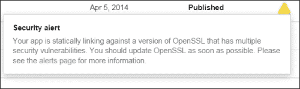
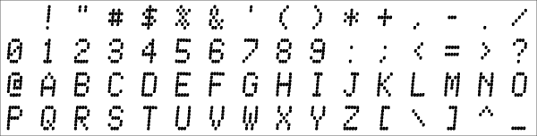
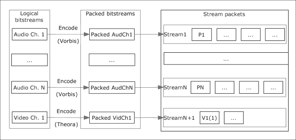

# 第二章。本地库

在本章中，您将学习如何构建流行的 C/C++库，并使用 Android NDK 将它们与您的应用程序链接起来。这些库是实现功能丰富的应用程序的构建块，这些应用程序完全用 C++实现图像、视频、声音、物理模拟和网络。我们将提供最少的示例来演示每个库的功能。音频和网络库将在后续章节中详细讨论。我们将向您展示如何编译库，当然，给出一些简短的示例和如何开始使用它们的提示。

跨不同处理器和操作系统移植库的典型警告是内存访问(结构对齐和填充)、字节顺序(字符顺序)、调用约定和浮点问题。前面几节中描述的所有库都很好地解决了这些问题，即使其中一些库没有正式支持安卓 NDK，修复这个问题也只是几个编译器开关的问题。

为了构建上述库，我们需要为 Windows、Linux 和 OS X 创建 makefiles，并为 NDK 创建一对`Android.mk/Application.mk`文件。库的源文件被编译成目标文件。目标文件的集合被组合成一个归档文件，也称为静态库。稍后，这个静态库可以作为输入传递给链接器。我们从桌面版本开始，首先是 Windows。

为了构建特定于 Windows 的库版本，我们需要一个 C++编译器。我们将使用来自 MinGW 的命令行编译器和在[第 1 章](01.html#aid-DB7S1 "Chapter 1. Using Command-line Tools")、*使用命令行工具*中描述的 GCC 工具链。对于每个库，我们都有一个源代码文件的集合，我们需要得到静态库，一个扩展名为`.a`的文件。

# 处理预编译静态库

让我们将需要为不同平台构建的库的源代码放入`src`目录。Makefile 脚本应该如下启动:

```cpp
CFLAGS = -O2 -I src
```

这一行定义了一个带有编译器命令行参数列表的变量`CFLAGS`。在我们的例子中，我们指示编译器在`src`目录中搜索头文件。如果库源代码跨越多个目录，我们需要为每个目录添加`–I`开关。`-O2`开关告诉编译器启用 2 级优化。接下来，我们为每个源文件添加以下行:

```cpp
<SourceFileName>.o:
gcc $(CFLAGS) –c <SourceFile>.cpp –o <SourceFile>.o
```

字符串`<SourceFileName>`应该用`.cpp`源文件的实际名称替换，并且应该为每个源文件写这几行。

现在，我们添加目标文件列表:

```cpp
ObjectFiles = <SourceFile1>.o <SourceFile2>.o
```

最后，我们将为我们的库编写目标:

```cpp
<LibraryName>:
ar –rvs <LibraryName>.a $(ObjectList)
```

Makefile 脚本中除空行和目标名称之外的每一行都应该以列表字符开头。要构建库，请调用以下命令:

```cpp
>make <LibraryName>.a

```

在我们的程序中使用库时，我们将`LibraryName.a`文件作为参数传递给`gcc`。

Makefiles 由类似于编程语言中子程序的目标组成，通常每个目标都会生成一个目标文件。例如，我们已经看到库的每个源文件被编译成相应的目标文件。

目标名称可能包含文件名模式，以避免复制和粘贴，但在最简单的情况下，我们只是列出所有源文件，并复制这些行，用适当的文件名替换`SourceFileName`字符串。`gcc`命令后的`–c`开关是编译源文件的选项，`–o`指定输出对象文件的名称。`$(CFLAGS)`符号表示将`CFLAGS`变量的值替换到命令行中。

视窗的 GCC 工具链包括`ar`工具，这是归档器的缩写。我们的库的 Makefiles 调用这个工具来创建库的静态版本。这是在 Makefile 脚本的最后几行完成的。

当包含目标文件列表的一行变得太长时，可以使用反斜杠符号将其拆分为多行，如下所示:

```cpp
ObjectFileList = FileName1.o \
                 ... \
                 FileNameN.o
```

反斜杠后面不应该有空格，因为这是`make`工具的限制。 `make`工具是可移植的，因此相同的规则完全适用于我们使用的所有桌面操作系统:视窗、Linux 和操作系统 x。

现在，我们能够使用 Makefiles 和命令行构建大多数库。让我们为安卓构建它们。首先，创建一个名为`jni`的文件夹，并使用适当的编译器开关创建`jni/Application.mk`文件，并相应地设置库的名称。例如，Theora 库应该如下所示:

```cpp
APP_OPTIM := release
APP_PLATFORM := android-19
APP_STL := gnustl_static
APP_CPPFLAGS += -frtti
APP_CPPFLAGS += -fexceptions
APP_CPPFLAGS += -DANDROID
APP_ABI := armeabi-v7a-hard
APP_MODULES := Theora
NDK_TOOLCHAIN_VERSION := clang
```

### 注

在这里，我们将使用`armeabi-v7a-hard`作为最广泛支持的现代 ABI 之一。安卓 NDK 支持许多其他架构和处理器。请参考《NDK 程序员指南》，了解完整的最新列表。

它将使用安装在 NDK 的最新版本的铿锵编译器。`jni/Android.mk`文件类似于我们在上一章中为`3_NDK`示例应用程序编写的文件，但有一些例外。在文件的顶部，必须定义一些必需的变量。让我们看看 OpenAL-Soft 库的`Android.mk`文件是什么样子的:

```cpp
TARGET_PLATFORM := android-19
LOCAL_PATH := $(call my-dir)
include $(CLEAR_VARS)
LOCAL_ARM_MODE := arm
LOCAL_MODULE := OpenAL
LOCAL_C_INCLUDES += src
LOCAL_SRC_FILES += <ListOfSourceFiles>
```

定义一些常见的编译器选项:将所有警告视为错误(`-Werror`)，定义`ANDROID`预处理符号:

```cpp
COMMON_CFLAGS := -Werror -DANDROID
```

编译标志是根据所选的 CPU 架构定义的:

```cpp
ifeq ($(TARGET_ARCH),x86)
  LOCAL_CFLAGS := $(COMMON_CFLAGS)
else
  LOCAL_CFLAGS := -mfpu=vfp -mfloat-abi=hard -mhard-float -fno-short-enums -D_NDK_MATH_NO_SOFTFP=1 $(COMMON_CFLAGS)
endif
```

在我们所有的例子中，我们将使用硬件浮点 ABI `armeabi-v7a-hard`，所以让我们相应地构建库。

### 注

armeabi-v7a-hard 和 armeabi-v7a 的主要区别在于硬件浮点 abi 在 FPU 寄存器中传递浮点函数参数。在浮点运算量大的应用程序中，这可以显著提高浮点值在不同函数之间传递的代码性能。

因为我们正在构建一个静态库，所以我们需要在`Android.mk`的末尾有以下一行:

```cpp
include $(BUILD_STATIC_LIBRARY)
```

构建静态库现在只需要对`ndk-build`脚本进行一次调用。在对动态链接和 Windows 平台做了一点评论之后，让我们继续编译实际的库。

# Windows 平台上的动态链接

本章考虑的库可以作为动态链接库为 Windows 构建。我们不提供这样做的食谱，因为每个项目都已经包含了所有必要的说明，Windows 开发不是本书的重点。唯一的例外是 libcurl 和 OpenSSL 库。我们建议您从官方库网站下载预构建的 DLL 文件。

在 FreeImage、FreeType 和 Theora 的示例代码中，我们使用函数指针，这些指针是使用 WinAPI 中的`GetProcAddress()`和`LoadLibrary()`函数初始化的。安卓上也使用相同的函数指针，但在这种情况下，它们指向静态库中的适当函数。

例如，函数`FreeImage_OpenMemory()`声明如下:

```cpp
typedef FIMEMORY* ( DLL_CALLCONV* PFNFreeImage_OpenMemory )
  ( void*, unsigned int );
PFNFreeImage_OpenMemory  FI_OpenMemory = nullptr;
```

在 Windows 上，我们用`GetProcAddress()`调用初始化指针:

```cpp
FI_OpenMemory = (PFNFreeImage_OpenMemory)
  GetProcAddress (hFreeImageDLL,"FreeImage_OpenMemory");
```

在安卓、OSX 和 Linux 上，这是一种重定向:

```cpp
FI_OpenMemory = &FreeImage_OpenMemory;
```

示例代码仅引用`FI_OpenMemory()`，因此，安卓和视窗都是一样的。

# 卷曲

libcurl 库[http://curl.haxx.se/libcurl](http://curl.haxx.se/libcurl)是一个免费且易于使用的客户端 url 传输库。它是本地应用程序的事实标准，处理大量网络协议。Linux 和 OS X 的用户喜欢在他们的系统上有这个库，并且有可能使用`-lcurl`开关来链接它。在 Windows 主机上为 Android 编译 libcurl 需要一些额外的步骤。我们在这里解释。

libcurl 库构建过程基于`autoconf`；在实际构建库之前，我们需要生成`curl_config.h`文件。从包含未打包的 libcurl 分发包的文件夹中运行配置脚本。交叉编译命令行标志应设置为:

```cpp
--host=arm-linux CC=arm-eabi-gcc

```

`CPPFLAGS`变量的`-I`参数应该指向您的 NDK 文件夹的`/system/core/include`子文件夹，在我们的例子中:

```cpp
CPPFLAGS="-I D:/NDK/system/core/include"

```

libcurl 库可以通过多种方式进行定制。我们使用这组参数(禁用除 HTTP 和 HTTPS 之外的所有协议):

```cpp
>configure CC=arm-eabi-gcc --host=arm-linux --disable-tftp --disable-sspi --disable-ipv6 --disable-ldaps --disable-ldap --disable-telnet --disable-pop3 --disable-ftp --without-ssl --disable-imap --disable-smtp --disable-pop3 --disable-rtsp --disable-ares --without-ca-bundle --disable-warnings --disable-manual --without-nss --enable-shared --without-zlib --without-random --enable-threaded-resolver --with-ssl

```

`--with-ssl`参数允许使用 OpenSSL 库来提供安全的 HTTPS 传输。本章将进一步讨论这个库。然而，为了使用 SSL 加密的连接，我们需要告诉 libcurl 我们的系统证书位于何处。这可以通过`curl_config.h`文件开头定义的`CURL_CA_BUNDLE`来完成:

```cpp
#define CURL_CA_BUNDLE "/etc/ssl/certs/ca-certificates.crt"

```

配置脚本将生成一个有效的`curl_config.h`头文件。你可以在这本书的源代码包中找到它。安卓静态库的编译需要一组常用的`Android.mk`和`Application.mk`文件，这也在`1_Curl`示例中。在下一章中，我们将学习如何使用 libcurl 库通过 HTTPS 从互联网下载实际内容。但是，这里有一个检索 HTTP 页面的简单用法示例:

```cpp
CURL* Curl = curl_easy_init();
curl_easy_setopt( Curl, CURLOPT_URL, "http://www.google.com" );
curl_easy_setopt( Curl, CURLOPT_FOLLOWLOCATION, 1 );
curl_easy_setopt( Curl, CURLOPT_FAILONERROR, true );
curl_easy_setopt( Curl, CURLOPT_WRITEFUNCTION, &MemoryCallback );
curl_easy_setopt( Curl, CURLOPT_WRITEDATA, 0 );
curl_easy_perform( Curl );
curl_easy_cleanup( Curl );
```

这里`MemoryCallback()`是处理接收数据的功能。它可以像下面的代码片段一样小:

```cpp
size_t MemoryCallback( void* P, size_t Size, size_t Num, void* )
{
  if ( !P ) return 0;
  printf( "%s\n", P );
}
```

检索到的数据将打印在桌面应用程序的屏幕上。同样的代码在安卓中会像假人一样工作，不会产生任何可见的副作用，因为`printf()`功能在那里只是一个假人。

# 开放

OpenSSL 是一个实现安全套接字层(SSL v2/v3)和传输层安全(TLS)协议的开源库，也是一个全强度的通用加密库。可以在[https://www.openssl.org](https://www.openssl.org)找到。

在这里，我们将构建 OpenSSL 版本 1.0.1j，其中包含对心脏出血 Bug([http://heartbleed.com](http://heartbleed.com))的修复。

Heartbleed Bug 是流行的 OpenSSL 加密软件库中的一个严重漏洞。该弱点允许窃取在正常情况下受用于保护互联网的 SSL/TLS 加密保护的信息。

如果您尝试将应用程序静态链接到旧版本的 OpenSSL，然后在 Google Play 上发布它，您可能会看到以下安全警报:



有可能到这本书出版的时候，连 OpenSSL 的 1.0.0j 版本都会过时。因此，下载最新的源代码并相应地更新 NDK Makefiles 将是一个很好的练习。这里简单介绍一下你是如何做到的。

OpenSSL 被编译为两个互操作的静态库:`libssl`和`libcrypto`。查看源代码包，查看文件夹`2_OpenSSL/lib/crypto/jni`和`2_OpenSSL/ssl/jni`。这两个库都应该链接到您的应用程序，该应用程序使用支持 SSL 的 libcurl 版本。

典型的`Android.mk`可以从下面的列表开始:

```cpp
include $(CLEAR_VARS)
LOCAL_MODULE := libCurl
LOCAL_SRC_FILES := ../../../Libs.Android/libcurl.$(TARGET_ARCH_ABI).a
include $(PREBUILT_STATIC_LIBRARY)
include $(CLEAR_VARS)
LOCAL_MODULE := libCrypto
LOCAL_SRC_FILES := ../../../Libs.Android/libCrypto.$(TARGET_ARCH_ABI).a
include $(PREBUILT_STATIC_LIBRARY)
include $(CLEAR_VARS)
LOCAL_MODULE := libSSL
LOCAL_SRC_FILES := ../../../Libs.Android/libSSL.$(TARGET_ARCH_ABI).a
include $(PREBUILT_STATIC_LIBRARY)
```

在此文件的末尾，只需链接所有库:

```cpp
LOCAL_STATIC_LIBRARIES += libCurl
LOCAL_STATIC_LIBRARIES += libSSL
LOCAL_STATIC_LIBRARIES += libCrypto
```

就是这样，你现在可以处理 SSL 连接了。

# 自由形象

FreeImage 是一个用于位图操作的流行库，Unity 游戏引擎是这个库([http://freeimage.sourceforge.net/users.html](http://freeimage.sourceforge.net/users.html))的用户之一。该库是位于`libpng`、`libjpeg`、`libtiff,`和许多其他库之上的一体化包装器，提供快速的图像加载例程，而不会退回到 Java 代码。

FreeImage 包括一套完整的不同平台的 Makefiles。安卓库的编译很简单，只需要*处理预编译静态库*部分的说明。`Application.mk`文件与 Curl 的同一文件有一行不同:

```cpp
APP_MODULES := FreeImage
```

在`Android.mk`文件中，我们将更改 C 编译标志:

```cpp
GLOBAL_CFLAGS   := -O3 -DHAVE_CONFIG_H=1 -DFREEIMAGE_LIB -DDISABLE_PERF_MEASUREMENT
```

在下面的示例中，我们将实现两个简单的例程，以各种文件格式在内存块之间加载和保存图像。

我们从`FreeImage_LoadFromMemory()`例程开始，该例程将`Data`数组及其`Size`作为输入参数，并将该数组解码为包含位图像素的`std::vector<char>`。尺寸信息，宽度和高度，存储在`W`和`H`参数中。色深信息放入`BitsPerPixel`参数。可选的`DoFlipV`参数指示代码垂直翻转加载的图像，当处理不同图形 API 中的图像存储约定时，这可能是必需的，自顶向下或自底向上:

```cpp
bool FreeImage_LoadFromStream( void* Data,unsigned int Size,
  std::vector<ubyte>& OutData,int& W,
  int& H,int& BitsPerPixel,bool DoFlipV )
{
```

我们创建内部存储块，它可以由 FreeImage 例程读取:

```cpp
  FIMEMORY* Mem = FI_OpenMemory(( unsigned char* )Data,
    static_cast<unsigned int>( Size ) 
  );
```

在读取位图之前，我们将通过以下方式检测其格式(例如，`.jpg`、`.bmp`、`.png`等):

```cpp
  FREE_IMAGE_FORMAT FIF = FI_GetFileTypeFromMemory( Mem, 0 );
```

然后，解码后的位图被读入临时`FIBITMAP`结构:

```cpp
  FIBITMAP* Bitmap = FI_LoadFromMemory( FIF, Mem, 0 );
  FI_CloseMemory( Mem );
  FIBITMAP* ConvBitmap;
```

例如，如果总位数超过 32 位，每个颜色通道占用 8 位以上，我们很可能会得到浮点图像，这将需要一些额外的处理:

```cpp
  bool FloatFormat = FI_GetBPP( Bitmap ) > 32;
  if ( FloatFormat )
  {
```

浮动点图像在本书中并未通篇使用，但了解 FreeImage 支持 OpenEXR 格式的高动态范围图像非常有用。

### 注

OpenEXR 格式以支持每通道 16 位浮点值而闻名，可用于游戏中存储不同 HDR 效果的纹理。

```cpp
    ConvBitmap = FI_ConvertToRGBF( Bitmap );
  }
  else
  {
```

透明度信息用于转换图像。如果图像不透明，alpha 通道将被忽略:

```cpp
    ConvBitmap = FI_IsTransparent( Bitmap ) ? FI_ConvertTo32Bits( Bitmap ) : FI_ConvertTo24Bits( Bitmap );
  }
  FI_Unload( Bitmap );
  Bitmap = ConvBitmap;
```

如有必要，我们会垂直翻转图像，如下所示:

```cpp
  if ( DoFlipV ) FI_FlipVertical( Bitmap );
```

提取图像尺寸和颜色信息:

```cpp
  W = FI_GetWidth( Bitmap );
  H = FI_GetHeight( Bitmap );
  BitsPP = FI_GetBPP( Bitmap );
```

知道尺寸后，我们可以调整输出缓冲区的大小，如下所示:

```cpp
  OutData.resize( W * H * ( BitsPerPixel / 8 ) );
```

最后，我们可以获取原始的未对齐位图数据到我们的`OutData`向量。单个密集扫描线的大小为`W*BitsPP/8`字节:

```cpp
  FI_ConvertToRawBits( &OutData[0],Bitmap, W * BitsPP / 8, BitsPP, 0, 1, 2, false );
```

临时位图对象被删除，函数正常返回:

```cpp
  FI_Unload( Bitmap );
  return true;
}
```

位图保存例程也可以类似的方式实现。首先，我们分配 FIBITMAP 结构来表示自由图像库中的图像:

```cpp
bool FreeImage_SaveToMemory( const std::string& Ext,ubyte* RawBGRImage,int Width,int Height,int BitsPP,std::vector<ubyte>& OutData )
{
  FIBITMAP* Bitmap = FI_Allocate(Width, Height, BitsPP, 0, 0, 0);
```

原始位图数据被复制到 FIBITMAP 结构中:

```cpp
  memcpy( FI_GetBits( Bitmap ), RawBGRImage, Width * Height * BitsPP / 8 );
```

FreeImage 使用反转的垂直扫描线顺序，因此我们应该在保存之前垂直翻转图像:

```cpp
  FI_FlipVertical( Bitmap );
```

然后，我们将使用用户指定的文件扩展名来检测输出图像的格式:

```cpp
  int OutSubFormat;
  FREE_IMAGE_FORMAT OutFormat;
  FileExtToFreeImageFormats( Ext, OutSubFormat, OutFormat );
```

为了保存图像，我们将分配一个动态内存块:

```cpp
  FIMEMORY* Mem = FI_OpenMemory( nullptr, 0);
```

`FI_SaveToMemory()`调用根据选择的格式将原始位图编码为压缩表示:

```cpp
  if ( !FI_SaveToMemory( OutFormat,Bitmap, Mem, OutSubFormat ) )
  {
    return false;
  }
```

编码后，我们将直接访问 FreeImage 内存块:

```cpp
  ubyte* Data = NULL;
  uint32_t Size = 0;
  FI_AcquireMemory( Mem, &Data, &Size );
```

然后，我们将字节复制到我们的`OutData`向量:

```cpp
  OutData.resize( Size );
  memcpy( &OutData[0], Data, Size );
```

需要进行一些清理。我们删除了内存块和 FIBITMAP 结构:

```cpp
  FI_CloseMemory( Mem );
  FI_Unload( Bitmap );
  return true;
}
```

辅助`FileExtToFreeImageFormats()`功能将文件扩展名转换为内部 FreeImage 格式说明符，并提供多个选项。代码很简单。我们将把提供的文件扩展名与一些预定义的值进行比较，并填充`FIF_FORMAT`和`SAVE_OPTIONS`结构:

```cpp
static void FileExtToFreeImageFormats( std::string Ext,int& OutSubFormat, FREE_IMAGE_FORMAT& OutFormat )
{
  OutSubFormat = TIFF_LZW;
  OutFormat = FIF_TIFF; std::for_each( Ext.begin(), Ext.end(),[]( char& in )
  { 
    in = ::toupper( in );
  } 
  );
  if ( Ext == ".PNG" )
  {
    OutFormat = FIF_PNG;
    OutSubFormat = PNG_DEFAULT;
  }
  else if ( Ext == ".BMP" )
  {
    OutFormat = FIF_BMP;
    OutSubFormat = BMP_DEFAULT;
  }
  else if ( Ext == ".JPG" )
  {
    OutFormat = FIF_JPEG;
    OutSubFormat = JPEG_QUALITYSUPERB | JPEG_BASELINE |JPEG_PROGRESSIVE | JPEG_OPTIMIZE;
  }
  else if ( Ext == ".EXR" )
  {
    OutFormat = FIF_EXR;
    OutSubFormat = EXR_FLOAT;
  }
}
```

这可以用您自己的方式进一步扩展和定制。

# 加载和保存图像

为了使前面的代码可用，我们增加了两个从磁盘文件保存和加载图像的例程。第一个，`FreeImage_LoadBitmapFromFile()`，加载位图:

```cpp
bool FreeImage_LoadBitmapFromFile( const std::string& FileName, std::vector<ubyte>& OutData, int& W, int& H, int& BitsPP )
{
  std::ifstream InFile( FileName.c_str(),
  std::ios::in | std::ifstream::binary );
  std::vector<char> Data(
    ( std::istreambuf_iterator<char>( InFile ) ), std::istreambuf_iterator<char>() );
  return FreeImage_LoadFromStream(
    ( ubyte* )&Data[0], ( int )data.size(),
    OutData, W, H, BitsPP, true );
}
```

我们使用一个简单的函数来提取文件扩展名，它用作文件类型标记:

```cpp
std::string ExtractExtension( const std::string& FileName )
{
  size_t pos = FileName.find_last_of( '.' );
  return ( pos == std::string::npos ) ?
    FileName : FileName.substr( pos );
}
```

`FreeImage_SaveBitmapToFile()`功能使用标准的`std::ofstream`流保存文件:

```cpp
bool FreeImage_SaveBitmapToFile( const std::string& FileName, ubyte* ImageData, int W, int H, int BitsPP )
{
  std::string Ext = ExtractExtension( FileName );
  std::vector<ubyte> OutData;
  if ( !FreeImage_SaveToMemory( Ext, ImageData, W, H, BitsPP, OutData ) )
  {
    return false;
  }
  std::ofstream OutFile( FileName.c_str(),
  std::ios::out | std::ofstream::binary );
  std::copy( OutData.begin(), OutData.end(), std::ostreambuf_iterator<char>( OutFile ) );
  return true;
}
```

这段代码足以涵盖图像加载库的所有基本用例。

# FreeType

FreeType 库是使用 TrueType 字体渲染高质量文本的事实标准。由于文本输出在任何图形程序中几乎是不可避免的，所以我们举一个例子，说明如何使用从 monospace TrueType 文件生成的固定大小字体来呈现文本字符串。

我们将固定大小的字体存储在`16x16`网格中。这个演示应用程序的源字体名为`Receptional Receipt`，是从[http://1001freefonts.com](http://1001freefonts.com)下载的。生成的`16x16`网格的四条线如下图所示:



单个字符占据一个矩形区域，我们称之为*槽*。使用字符的 ASCII 码计算字符矩形的坐标。网格中的每个槽都占据`SlotW x SlotH`像素，字符本身居中，大小为`CharW x CharH`像素。出于演示目的，我们简单假设`SlotW`是`CharW`的两倍大小:


我们把自己限制在最简单的可能使用场景:8 位 ASCII 字符，固定大小的字符字形。为了呈现字符串，我们将迭代它的字符，并调用尚未编写的函数`RenderChar()`:

```cpp
void RenderStr( const std::string& Str, int x, int y )
{
  for ( auto c: Str )
  {
    RenderChar( c, x, y );
    x += CharW;
  }
}
```

字符渲染例程是一个简单的双循环，将字形像素复制到输出图像:

```cpp
void RenderChar( char c, int x, int y )
{
  int u = ( c % 16 ) * SlotW;
  int v = ( c / 16 ) * SlotH;
  for ( int y1 = 0 ; y1 < CharH ; y1++ )
    for ( int x1 = 0 ; x1 <= CharW ; x1++ )
      PutPixel( g_OutBitmap, W, H,
        x + x1, y + y1,
        GetPixel( Font, FontW, FontH,
          x1 + u + CharW, y1 + v)
      );
}
```

`PutPixel()`和`GetPixel()`例程分别设置和获取位图中的像素。每个像素都是 24 位 RGB 格式:

```cpp
int GetPixel( const std::vector<unsigned char>& Bitmap, int W, int H, int x, int y )
{
  if ( y >= H || x >= W || y < 0 || x < 0 ) { return 0; }
```

这里，假设扫描线宽度等于图像宽度，并且 RGB 三元组中的颜色分量的数量是 3:

```cpp
  int Ofs = ( y * W + x ) * 3;
```

使用按位移位来构造结果 RGB 值:

```cpp
  return (Bitmap[Ofs+0] << 16) +
    (Bitmap[Ofs+1] <<  8) +
    (Bitmap[Ofs+2]);
}
```

```cpp
void PutPixel( std::vector<unsigned char>& Bitmap,int W, int H, int x, int y, int Color )
{
  if ( y < 0 || x < 0 || y > H - 1 || x > W - 1 ) { return; }
  int Ofs = ( y * W + x ) * 3;
```

逐位移位和掩码完成提取工作:

```cpp
  buffer[Ofs + 0] = ( Color ) & 0xFF;
  buffer[Ofs + 1] = ( Color >> 8 ) & 0xFF;
  buffer[Ofs + 2] = ( Color >> 16 ) & 0xFF;
}
```

还有另一个辅助功能`Greyscale()`，使用按位移位计算给定强度的 RGB 灰色:

```cpp
inline int Greyscale( unsigned char c )
{
  return ( (255-c) << 16 ) + ( (255-c) << 8 ) + (255-c);
}
```

对于前面的代码，我们不需要 FreeType。我们真正需要的只是生成字体的库。我们将加载字体数据文件，渲染前 256 个字符的字形，然后使用生成的字体位图渲染文本字符串。代码的第一部分生成一种字体。我们将使用一些变量来存储字体的尺寸:

```cpp
/// Horizontal size of the character
const int CharW = 32;
const int CharH = 64;
/// Horizontal size of the character slot
const int SlotW = CharW * 2;
const int SlotH = CharH;
const int FontW = 16 * SlotW;
const int FontH = 16 * SlotH;
std::vector<unsigned char> g_FontBitmap;
```

我们将字体存储在标准向量中，我们可以将其传递给`TestFontRendering()`例程:

```cpp
void TestFontRendering( const std::vector<char>& Data )
{
  LoadFreeImage();
  LoadFreeType();
  FT_Library Library;
  FT_Init_FreeTypePTR( &Library );
  FT_Face Face;
  FT_New_Memory_FacePTR( Library,
    (const FT_Byte*)Data.data(),
    (int)Data.size(), 0, &face );
```

将字符大小固定为 100 dpi:

```cpp
  FT_Set_Char_SizePTR( Face, CharW * 64, 0, 100, 0 );
  g_FontBitmap.resize( FontW * FontH * 3 );
  std::fill( std::begin(g_FontBitmap), std::end(g_FontBitmap), 0xFF );
```

我们将在一个循环中逐个呈现 256 个 ASCII 字符:

```cpp
  for ( int n = 0; n < 256; n++ )
  {
```

将字形图像加载到插槽中:

```cpp
    if ( FT_Load_CharPTR( Face, n , FT_LOAD_RENDER ) )
      continue;
    FT_GlyphSlot Slot = Face->glyph;
    FT_Bitmap Bitmap = Slot->bitmap;
```

计算每个字符的矩形左上角的坐标:

```cpp
    int x = (n % 16) * SlotW + CharW + Slot->bitmap_left;
    int y = (n / 16) * SlotH - Slot->bitmap_top + 3*CharH/4;
```

字符的字形被复制到`g_FontBitmap`位图:

```cpp
    for ( int i = 0 ; i < ( int )Bitmap.width; i++ )
    for ( int j = 0 ; j < ( int )Bitmap.rows; j++ )
    PutPixel( g_FontBitmap, FontW, FontH,i + x, j + y,
      Greyscale( Bitmap.buffer[j * Bitmap.width + i])
    );
  }
```

我们将生成的位图保存到一个文件中:

```cpp
  FreeImage_SaveBitmapToFile( "test_font.png",
    g_FontBitmap.data(), FontW, FontH, 24 );
```

在字体位图生成结束时，我们将清除与 FreeType 库相关的所有内容:

```cpp
  FT_Done_FacePTR    ( Face );
  FT_Done_FreeTypePTR( Library );
```

为了利用我们的等间距字体，我们将声明字符串，以屏幕像素为单位计算其宽度，并分配输出位图:

```cpp
  std::string Str = "Test string";
  W = Str.length() * CharW;
  H = CharH;
  g_OutBitmap.resize( W * H * 3 );
  std::fill( std::begin(g_OutBitmap), std::end(g_OutBitmap), 0xFF );
```

`TestFontRendering()`例程的结束只是调用`RenderStr()`:

```cpp
  RenderStr( Str, 0, 0 );
```

然后，它将生成的图像保存到一个文件中:

```cpp
  FreeImage_SaveBitmapToFile( "test_str.png",
    g_OutBitmap.data(), W, H, 24 );
}
```

结果应该如下图所示:


通常当涉及到位图字体渲染时，你不想自己编写位图生成的代码。建议您使用第三方工具来完成。这样的免费工具之一是 AngelCode，可以在[http://www.angelcode.com/products/bmfont](http://www.angelcode.com/products/bmfont)找到。它可以以最佳方式将字形打包到位图中，并生成正确处理生成的位图所需的数据。

# 理论

Theora 是一种来自 Xiph.Org 基金会的免费开放视频压缩格式。像我们所有的多媒体技术一样，它可以用来在网上和光盘上分发电影和视频，而不需要许可费和版税，也不需要与许多其他视频格式相关的任何其他供应商锁定。在[http://www.theora.org](http://www.theora.org)有。

为了避免混淆，我们将介绍一些术语。通过 **比特流**，我们假设了一些字节序列。逻辑比特流是视频或音频数据的某种表示。 **Codec** ，或 COder-DECoder，是一组将逻辑比特流编码和解码成一组紧凑表示的函数，称为压缩比特流。因为通常的多媒体数据由多个逻辑比特流组成，所以紧凑的表示必须被分成小块，这些小块被称为包。每个**数据包** 都有特定的大小、时间戳和校验和，以保证数据包的完整性。比特流和数据包的方案如下图所示:



用于逻辑比特流和打包比特流的分组被混合，以形成保持每个单独比特流的分组顺序的线性序列。这叫做多路复用。Ogg 库读取`.ogg`文件，并将其分割成打包的比特流。每个比特流都可以使用 Theora、Vorbis 或其他解码器进行解码。

### 注

在我们之前的书*安卓 NDK 游戏开发食谱*、*Packt Publishing*([https://www . packtpub . com/Game-Development/Android-ndk-Game-Development-食谱](https://www.packtpub.com/game-development/android-ndk-game-development-cookbook))中，我们通过例子教了如何解码 Ogg Vorbis 音频流。

在本章中，我们只讨论从文件中提取媒体信息这一最简单的问题。甚至这个简单操作的代码可能看起来又长又复杂。然而，它可以用不到十个步骤来描述:

1.  初始化 OGG 流读取器。
2.  开始一个包构建循环:从源文件中读取一堆字节。
3.  检查是否有足够的数据发出另一个逻辑数据包。
4.  如果形成新包，检查是否是`BoS`(流的开始)包。
5.  尝试用`BoS`包初始化 Theora 或 Vorbis 解码器。
6.  如果我们没有足够的音频和视频流进行解码，请转到步骤 2。
7.  如果我们没有足够的流信息，请继续读取二级流包。
8.  初始化 Theora 解码器并提取视频帧信息。

### 注

Ogg 流还有另一层复杂性，因为数据包被分组形成逻辑页面。在前面的伪代码中，我们指的是实际上是页面的数据包。然而，该方案保持不变:读取字节，直到有足够的数据供解码器发出另一个视频帧，或者在我们的情况下，读取视频信息。

我们使用标准的 C++ I/O 流，实现三个简单的函数:`Stream_Read()`、`Stream_Seek()`和`Stream_Size()`。稍后在[第 4 章](04.html#aid-190861 "Chapter 4. Organizing a Virtual Filesystem")、*组织虚拟文件系统*中，我们将使用我们自己的输入/输出抽象层来重新实现这些方法。让我们打开文件流:

```cpp
std::ifstream Input( "test.ogv", std::ios::binary );
```

下面是一个从输入流中读取指定字节数的函数:

```cpp
int Stream_Read( char* OutBuffer, int Size )
{
  Input.read( OutBuffer, Size );
  return Input.gcount();
}
```

使用以下代码查找所需位置:

```cpp
int Stream_Seek( int Offset )
{
  Input.seekg( Offset );
  return (int)Input.tellg();
}
```

要确定文件大小，请使用以下代码:

```cpp
int Stream_Size()
{
  Input.seekg (0, input.end);
  int Length = Input.tellg();
  Input.seekg( 0, Input.beg );
  return Length;
}
```

开始时，应该声明一些变量来存储解码过程的状态、同步对象、当前页面以及音频和视频流:

```cpp
ogg_sync_state   OggSyncState;
ogg_page         OggPage;
ogg_stream_state VorbisStreamState;
ogg_stream_state TheoraStreamState;
```

Theora 解码器状态:

```cpp
th_info          TheoraInfo;
th_comment       TheoraComment;
th_setup_info*   TheoraSetup;
th_dec_ctx*      TheoraDecoder;
```

沃尔比斯解码器状态:

```cpp
vorbis_info      VorbisInfo;
vorbis_dsp_state VorbisDSPState;
vorbis_comment   VorbisComment;
vorbis_block     VorbisBlock;
```

功能`Theora_Load()`读取文件头并从中提取视频帧信息:

```cpp
bool Theora_Load()
{
  Stream_Seek( 0 );
```

当前 Ogg 数据包将被读入结构`TempOggPacket`:

```cpp
  ogg_packet TempOggPacket;
```

必须对状态变量进行一些简单而必要的初始化:

```cpp
  memset( &VorbisStreamState, 0, sizeof( ogg_stream_state ) );
  memset( &TheoraStreamState, 0, sizeof( ogg_stream_state ) );
  memset( &OggSyncState,   0, sizeof( ogg_sync_state ) );
  memset( &OggPage,        0, sizeof( ogg_page ) );
  memset( &TheoraInfo,     0, sizeof( th_info ) );
  memset( &TheoraComment,  0, sizeof( th_comment ) );
  memset( &VorbisInfo,     0, sizeof( vorbis_info ) );
  memset( &VorbisDSPState, 0, sizeof( vorbis_dsp_state ) );
  memset( &VorbisBlock,    0, sizeof( vorbis_block ) );
  memset( &VorbisComment,  0, sizeof( vorbis_comment ) );
  OGG_sync_init   ( &OggSyncState );
  TH_comment_init ( &TheoraComment );
  TH_info_init    ( &TheoraInfo );
  VORBIS_info_init( &VorbisInfo );
  VORBIS_comment_init( &VorbisComment );
```

我们开始读取文件，如果文件已经结束或者我们有足够的数据获取信息，我们使用`Done`标志终止:

```cpp
  bool Done = false;
  while ( !Done )
  {
    char* Buffer = OGG_sync_buffer( &OggSyncState, 4096 );
    int BytesRead = ( int )Stream_Read( Buffer, 4096 );
    OGG_sync_wrote( &OggSyncState, BytesRead );
    if ( BytesRead == 0 )
    {
      break;
    }
    while (OGG_sync_pageout( &OggSyncState, &OggPage ) > 0)
    {
```

当我们最终遇到一个完整的包时，我们会检查它是否是一个`BOS`标记，并将数据输出到其中一个解码器:

```cpp
      ogg_stream_state OggStateTest;
      if ( !OGG_page_bos( &OggPage ) )
      {
        if ( NumTheoraStreams > 0 )
        {
          OGG_stream_pagein( &TheoraStreamState, &OggPage );
        }
        if ( NumVorbisStreams > 0 )
          {
            OGG_stream_pagein( VorbisStreamState, &OggPage );
          }
          Done = true;
          break;
        }
        OGG_stream_init( &OggStateTest,
        OGG_page_serialno( &OggPage ) );
        OGG_stream_pagein( &OggStateTest, &OggPage );
        OGG_stream_packetout( &OggStateTest, &TempOggPacket );
```

我们将使用两个变量`NumTheoraStreams`和`NumVorbisStreams`，分别统计视频和音频流。在下面几行中，我们将把 Ogg 包馈送给两个解码器，看看解码器是否没有抱怨它:

```cpp
        if ( NumTheoraStreams == 0 )
        {
          int Ret = TH_decode_headerin( &TheoraInfo, &TheoraComment, &TheoraSetup, &TempOggPacket );
          if ( Ret > 0 )
          {
```

Theora 标题如下:

```cpp
            memcpy( &TheoraStreamState, &OggStateTest, sizeof( OggStateTest ) );
            NumTheoraStreams = 1;
            continue;
          }
        }
        if ( NumVorbisStreams == 0 )
        {
          int Ret = VORBIS_synthesis_headerin( &VorbisInfo, &VorbisComment, &TempOggPacket );
          if ( Ret >= 0 )
          {
```

这是沃尔比斯标题:

```cpp
            memcpy( &VorbisStreamState, &OggStateTest, sizeof( OggStateTest ) );
            NumVorbisStreams = 1;
            continue;
          }
        }
```

因为我们只需要 Theora 流信息，所以忽略其他编解码器并丢弃报头:

```cpp
        OGG_stream_clear( &OggStateTest );
      }
    }
```

前面的代码基本上只是计算了流的数量，我们现在应该已经完成了。如果仍然没有足够的流，我们将继续读取和检查辅助流头:

```cpp
    while((( NumTheoraStreams > 0 ) && ( NumTheoraStreams < 3 )) || (( NumVorbisStreams > 0 ) && ( NumVorbisStreams < 3 )))
    {
      int Success = 0;
```

我们将读取所有可用的数据包，并检查它是否是新的 Theora 流的开始:

```cpp
      while (( NumTheoraStreams > 0 ) &&
        ( NumTheoraStreams < 3 ) &&
        ( Success = OGG_stream_packetout( &TheoraStreamState, &TempOggPacket ) ) )
      {
        if ( Success < 0 ) return false;
        if ( !TH_decode_headerin( &TheoraInfo, &TheoraComment, &TheoraSetup, &TempOggPacket ) ) return false;
        ++NumTheoraStreams;
      }
```

同样，我们将寻找下一个 Vorbis 流的开始:

```cpp
      while ( NumVorbisStreams < 3 && ( Success = OGG_stream_packetout( &VorbisStreamState, &TempOggPacket ) ) )
      {
        if ( Success < 0 ) return false;
        if ( VORBIS_synthesis_headerin( &VorbisInfo, &VorbisComment, &TempOggPacket ) )
        return false;
        ++NumVorbisStreams;
      }
```

长`while (!Done)`循环的最后一部分是检查具有实际帧数据的数据包，或者如果下一个数据包不可用，则从流中读取更多字节:

```cpp
      if ( OGG_sync_pageout( &OggSyncState, &OggPage ) > 0 )
      {
        if ( NumTheoraStreams > 0 )
        {
          OGG_stream_pagein( &TheoraStreamState, &OggPage );
        }
        if ( NumVorbisStreams > 0 )
        {
          OGG_stream_pagein( &VorbisStreamState, &OggPage );
        }
      }
      else
      {
        char* Buffer = OGG_sync_buffer( &OggSyncState, 4096 );
        int BytesRead = (int)Stream_Read( Buffer, 4096 );
        OGG_sync_wrote( &OggSyncState, BytesRead );
        if ( BytesRead == 0 ) return false;
      }
    }
```

到目前为止，我们已经找到了所有的流头，我们准备初始化 Theora 解码器。这样做之后，我们获取帧的宽度和高度:

```cpp
    TheoraDecoder = TH_decode_alloc( &TheoraInfo, TheoraSetup );
    Width  = TheoraInfo.frame_width;
    Height = TheoraInfo.frame_height;
    return true;
  }
```

最后，我们清除编解码器的内部结构，以避免内存泄漏:

```cpp
  void Theora_Cleanup()
  {
    if ( TheoraDecoder )
    {
      TH_decode_free( TheoraDecoder );
      TH_setup_free( TheoraSetup );
      VORBIS_dsp_clear( &VorbisDSPState );
      VORBIS_block_clear( &VorbisBlock );
      OGG_stream_clear( &TheoraStreamState );
      TH_comment_clear( &TheoraComment );
      TH_info_clear( &TheoraInfo );
      OGG_stream_clear( &VorbisStreamState );
      VORBIS_comment_clear( &VorbisComment );
      VORBIS_info_clear( &VorbisInfo );
      OGG_sync_clear( &OggSyncState );
    }
  }
```

就是这样，我们已经读取了视频参数。一旦我们有了一些基本的图形和音频渲染能力，我们将在下面的章节中回到音频和视频解码和回放。

更复杂但与我们的例子相似的代码在[http://libtheoraplayer.cateia.com](http://libtheoraplayer.cateia.com)的`LibTheoraPlayer`库源代码中大量使用。

在本章的示例中，我们将使用大写的函数名来区分动态库使用和静态链接。如果要静态链接`ogg`、`vorbis`和`theora`库，可以将每个`OGG`函数前缀重命名为`ogg`。就是这样；只需用小写字母替换大写字母。

关于 Theora 视频内容示例，我们将参考官方网站[http://www.theora.org/content](http://www.theora.org/content)，您可以在这里下载`.ogv`文件。

# 开

OpenAL 是一个跨平台音频 API。它专为高效渲染多通道三维位置音频而设计，广泛用于桌面平台的众多游戏引擎和应用中。很多移动平台都提供了不同的音频 API，比如 OpenSL ES 就是一个很强的播放器。然而，当可移植性受到威胁时，我们应该选择一个能够在所有需要的平台上运行的应用编程接口。OpenAL 在 Windows、Linux、OS X、安卓、iOS、黑莓 10 等众多平台上实现。在所有这些操作系统上，除了 Windows 和 Android 之外，OpenAL 都是第一人称公民，拥有系统中所有可用的库。在 Windows 上，有一个来自 Creative 的实现。在安卓系统上，我们需要自己构建这个库。我们将使用马丁斯墨子港[http://pielot.org/2010/12/14/openal-on-android/](http://pielot.org/2010/12/14/openal-on-android/)。只要对`Android.mk`和`Application.mk`文件稍加调整，就可以为安卓编译这个库。以下是`Android.mk`的文件:

```cpp
TARGET_PLATFORM := android-19
LOCAL_PATH := $(call my-dir)
include $(CLEAR_VARS)
LOCAL_ARM_MODE := arm
LOCAL_MODULE := OpenAL
LOCAL_C_INCLUDES := $(LOCAL_PATH) $(LOCAL_PATH)/../include $(LOCAL_PATH)/../OpenAL32/Include
LOCAL_SRC_FILES  := ../OpenAL32/alAuxEffectSlot.c \
                    ../OpenAL32/alBuffer.c \
                    ../OpenAL32/alDatabuffer.c \
                    ../OpenAL32/alEffect.c \
                    ../OpenAL32/alError.c \
                    ../OpenAL32/alExtension.c \
                    ../OpenAL32/alFilter.c \
                    ../OpenAL32/alListener.c \
                    ../OpenAL32/alSource.c \
                    ../OpenAL32/alState.c \
                    ../OpenAL32/alThunk.c \
                    ../Alc/ALc.c \
                    ../Alc/alcConfig.c \
                    ../Alc/alcEcho.c \
                    ../Alc/alcModulator.c \
                    ../Alc/alcReverb.c \
                    ../Alc/alcRing.c \
                    ../Alc/alcThread.c \
                    ../Alc/ALu.c \
                    ../Alc/android.c \
                    ../Alc/bs2b.c \
                    ../Alc/null.c
```

正确编译需要`-D`定义:

```cpp
GLOBAL_CFLAGS := -O3 -DAL_BUILD_LIBRARY -DAL_ALEXT_PROTOTYPES -DHAVE_ANDROID=1
```

而这个`if` -block 是当你想要为安卓构建 x86 版本的库时，将 ARM 和 x86 编译器开关分开的一种方式:

```cpp
ifeq ($(TARGET_ARCH),x86)
  LOCAL_CFLAGS := $(GLOBAL_CFLAGS)
else
  LOCAL_CFLAGS := -mfpu=vfp -mfloat-abi=hard -mhard-float -fno-short-enums -D_NDK_MATH_NO_SOFTFP=1 $(GLOBAL_CFLAGS)
endif
include $(BUILD_STATIC_LIBRARY)
```

`Application.mk`文件是标准的，如下所示:

```cpp
APP_OPTIM := release
APP_PLATFORM := android-19
APP_STL := gnustl_static
APP_CPPFLAGS += -frtti
APP_CPPFLAGS += -fexceptions
APP_CPPFLAGS += -DANDROID
APP_MODULES := OpenAL
APP_ABI := armeabi-v7a-hard x86
NDK_TOOLCHAIN_VERSION := clang
```

为了方便大家，我们有`6_OpenAL`示例中的所有源代码和配置文件。此外，我们在本书中使用的所有库都是为安卓预编译的，您可以在本书源代码包中的`Libs.Android`文件夹中找到它们。

# 将库链接到您的应用程序

在我们继续下一个话题之前，本章还有一件事要讨论。事实上，我们学会了如何构建库，但没有学会如何将你的安卓应用程序与它们联系起来。为此，我们需要修改您申请的`Android.mk`文件。让我们看看`3_FreeImage_Example`样品和它的`Application.mk`。它从指向二进制文件的预构建静态库的声明开始:

```cpp
include $(CLEAR_VARS)
LOCAL_MODULE := libFreeImage
LOCAL_SRC_FILES :=../../../Libs.Android/libFreeImage.$(TARGET_ARCH_ABI).a
include $(PREBUILT_STATIC_LIBRARY)
```

这里，我们使用路径中的`$(TARGET_ARCH_ABI)`变量透明地处理库的`armeabi-v7a-hard`和`x86`版本。您可以轻松地添加更多的体系结构。

一旦声明了库，让我们将应用程序与它链接起来。看看`Application.mk`的底部:

```cpp
LOCAL_STATIC_LIBRARIES += FreeImage
include $(BUILD_SHARED_LIBRARY)
```

`LOCAL_STATIC_LIBRARIES`变量包含所有需要的库。为了您的方便，前缀`lib`可以省略。

# 总结

在这一章中，我们学习了如何在安卓系统上处理预编译的静态库，这同样适用于 OS X 和 Linux，以及如何在不破坏我们代码的多平台功能的情况下在 Windows 上进行动态链接。我们学习了如何构建`libcurl`和`OpenSSL`，这样你就可以从你的 C++代码中访问 SSL 连接。FreeImage 和 FreeType 的几个例子展示了如何用光栅字体加载和保存图像。libtheora 的例子相当全面；然而，结果是适度的，我们只是从一个视频文件中读取元信息。OpenAL 将作为我们音频子系统的主干。