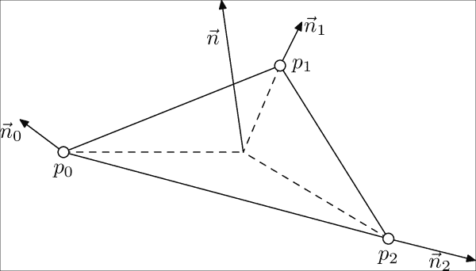
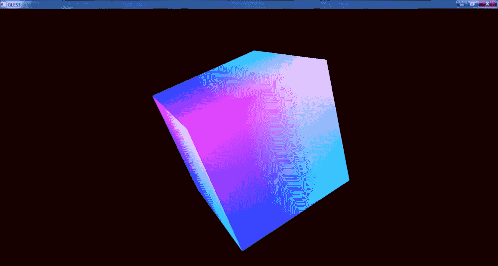

# 六、OpenGL ES 3.1 与跨平台渲染

在本章中，我们将学习如何在 OpenGL 4 和 OpenGL ES 3 之上实现一个抽象层，以便使我们的图形应用程序能够在 Android 和桌面机器上运行。让我们从一些基本的向量和线性代数类开始。

# 线性代数与变换

在`Core/VecMath.h`文件中，有一堆向量和矩阵特定的类和助手。我们使用的主要类是`LVector2`、`LVector3`、`LVector4`、`LMatrix3`、`LMatrix4`和`LQuaternion`，为它们定义了基本的代数运算。对他们来说，写任何数学重磅代码都有捷径:

```cpp
using vec2 = LVector2;
using vec3 = LVector3;
using vec4 = LVector4;
using mat3 = LMatrix3;
using mat4 = LMatrix4;
using quat = LQuaternion;
```

这个小小的数学库基本上是来自林道引擎([http://www.linderdaum.com](http://www.linderdaum.com))的一些代数代码的压缩。

除此之外，在名称空间`Math`中还有一组有用的函数，用于处理不同的投影变换计算。它们将在后面的章节中大量使用。

# 使用 SDL2 进行图形初始化

在我们的上一本书，*安卓 NDK 游戏开发食谱*，*packkt Publishing*中，我们非常详细地学习了如何使用我们自己的手工代码在安卓上初始化 OpenGL ES 2，在桌面上初始化 OpenGL 3 Core Profile。现在，我们将使用 SDL2 库来完成，该库在[https://www.libsdl.org](https://www.libsdl.org)提供。让我们来看看的例子。这个例子的 Java 代码，当然除了 SDL2 内部之外，是简短的:

```cpp
package com.packtpub.ndkmastering;
import android.app.Activity;
import android.os.Bundle;
public class AppActivity extends org.libsdl.app.SDLActivity
{
  static
  {
    System.loadLibrary( "NativeLib" );
  }
  public static AppActivity m_Activity;
  @Override protected void onCreate( Bundle icicle )
  {
    super.onCreate( icicle );
    m_Activity = this;
  }
};
```

其他一切都是用 C++ 代码完成的。有`main()`功能，它是由 SDL2 使用宏重新定义的，以使我们的应用程序看起来像桌面应用程序:

```cpp
int main(int argc, char* argv[])
{
  clSDL SDLLibrary;
```

首先，使用`clSDLWindow`类创建窗口和 OpenGL 渲染上下文:

```cpp
  g_Window = clSDLWindow::CreateSDLWindow( "GLES3", 1024, 768 );
```

然后，我们可以检索指向 OpenGL 函数的指针。这种抽象优于针对 OpenGL 库的静态链接，因为它使我们的代码更具可移植性。例如，如果不使用第三方库，就无法静态链接到 Windows 上的核心 OpenGL 函数:

```cpp
  LGL3 = std::unique_ptr<sLGLAPI>( new sLGLAPI() );
  LGL::GetAPI( LGL3.get() );
```

这是我们在[第 4 章](04.html#aid-190861 "Chapter 4. Organizing a Virtual Filesystem")、*中组织虚拟文件系统*处理虚拟文件系统时已经使用的回调。在这个例子中，我们不需要任何路径，所以我们只使用一个空字符串:

```cpp
  OnStart( "" );
```

事件循环显式完成，并包含对`OnDrawFrame()`函数的调用:

```cpp
  while( g_Window && g_Window->HandleInput() )
  {
    OnDrawFrame();
    g_Window->Swap();
  }
  g_Window = nullptr;
  return 0;
}
```

这些包装器类(`clSDL`和`clSDLWindow`)分别在文件`SDLLibrary.h`和`SDLWindow.h`中声明。`clSDL`类是 SDL 之上的 RAII 包装器，在其构造函数和析构函数中进行库的初始化和去初始化:

```cpp
clSDL()
{
  SDL_Init( SDL_INIT_VIDEO );
}
virtual ~clSDL()
{
  SDL_Quit();
}
```

`clSDLWindow`类代表一个带有 OpenGL 上下文和系统消息泵的窗口抽象:

```cpp
class clSDLWindow: public iIntrusiveCounr
{
private:
  SDL_Window* m_Window;
  SDL_GLContext m_Context;
  float m_Width;
  float m_Height;
  std::atomic<bool> m_Pendingit;
public:
  clSDLWindow( const std::string& Title, int Width, int Height );
  virtual ~clSDLWindow();
  void RequestExit()
  {
    m_PendingExit = true;
  }
  void Swap();
```

此成员函数执行消息循环的一次迭代:

```cpp
  bool HandleInput()
  {
    SDL_Event Event;
    while ( SDL_PollEvent(&Event) && !m_PendingExit )
    {
      if ( (Event.type == SDL_QUIT) || !this->HandleEvent( Event ) )
      m_PendingExit = true;
    }
    return !m_PendingExit;
  }
```

将整数坐标转换为浮点归一化坐标 0..1 为了更容易使用不同分辨率的屏幕:

```cpp
  vec2 GetNormalizedPoint( int x, int y ) const
  {
    return vec2(
      static_cast<float>(x) / m_Width,
      static_cast<float>(y) / m_Height
    );
  }
```

以下方法对于构建当前窗口的投影矩阵很有用:

```cpp
  float GetAspect() const
  {
    return m_Width / m_Height;
  }
```

创建`clSDLWindow`实例的公共静态助手方法如下:

```cpp
public:
  static clPtr<clSDLWindow> CreateSDLWindow(
    const std::string& Title, int Width, int Height )
  {
    return make_intrusive<clSDLWindow>( Title, Width, Height );
  }
```

`HandleEvent()`成员函数的工作是向我们的 callcks 发送一个 SDL2 事件:

```cpp
private:
  bool HandleEvent( const SDL_Event& Event );};
```

`HandleEvent()`的实现如下:

```cpp
  bool clSDLWindow::HandleEvent( const SDL_Event& Event )
  {
    switch ( Event.type )
    {
      case SDL_WINDOWEVENT:
        if ( Event.window.event == SDL_WINDOWEVENT_SIZE_CHANGED)
        {
          m_Width  = static_cast<float>( Event.window.data1 );
          m_Height = static_cast<float>( Event.window.data2 );
        }
        return true;
        case SDL_KEYDOWN:
        case SDL_KEYUP:         OnKey( Event.key.keysym.sym, Event.type == SDL_KEYDOWN );         break;
        case SDL_MOUSEBUTTONDOWN:
        case SDL_MOUSEBUTTONUP:         break;
        case SDL_MOUSEMOTION          break;
        case SDL_MOUSEWHEEL          break;
    }
    return true;
  }
```

并非所有情况标签都被实现，也并非所有 SDL2 事件都被使用。在后续章节中，我们将根据需要使用这种路由。

在我们的例子中，我们使用一些有用的 OpenGL 包装器渲染了一个旋转框，这可以隐藏 OpenGL 的移动版本和桌面版本之间的差异。下面是`OnStart()`将 OpenGL 版本打印到系统日志中，初始化顶点缓冲区对象和着色器程序的代码:

```cpp
  clPtr<clVertexAttribs> g_Box;
  clPtr<clGLVertexArray> g_BoxVA;
  clPtr<clGLSLShaderProgram> g_ShaderProgram;
  void OnStart( const std::string& RootPath )
  {
    LOGI( "Hello Android NDK!" );
    const char* GLVersion  = (const char*)LGL3->glGetString( GL_VERSION  );
    const char* GLVendor   = (const char*)LGL3->glGetString( GL_VENDOR   );
    const char* GLRenderer = (const char*)LGL3->glGetString( GL_RENDERER );
    LOGI( "GLVersion : %s\n", GLVersion );
    LOGI( "GLVendor  : %s\n", GLVendor  );
    LOGI( "GLRenderer: %s\n", GLRenderer );
```

首先，我们创建一个与应用编程接口无关的长方体网格表示:

```cpp
    g_Box = clGeomServ::CreateAxisAlignedBox( LVector3(-1), LVector3(+1) );
```

然后，我们将其输入到 OpenGL 中，使用顶点缓冲对象创建一个顶点数组:

```cpp
    g_BoxVA = make_intrusive<clGLVertexArray>();
    g_BoxVA->SetVertexAttribs( g_Box );
```

着色器程序由包含顶点着色器和片段着色器源代码的两个字符串变量构成:

```cpp
    g_ShaderProgram = make_intrusive<clGLSLShaderProgram>( g_vShaderStr, g_fShaderStr );
    LGL3->glClearColor( 0.1f, 0.0f, 0.0f, 1.0f );
    LGL3->glEnable( GL_DEPTH_TEST );
  }
```

以下是在 GLSL 3.3 核心配置文件中编写的着色器。使用模型-视图-投影矩阵变换顶点:

```cpp
  static const char g_vShaderStr[] = R"(
    uniform mat4 in_ModelViewProjectionMatrix;
    in vec4 in_Vertex;
    in vec2 in_TexCoord;
    out vec2 Coords;
    void main()
    {
      Coords = in_TexCoord.xy;
      gl_Position = in_ModelViewProjectionMatrix * in_Vertex;
    }
  )";
```

使用纹理坐标作为 RG 颜色组件绘制方框:

```cpp
  static const char g_fShaderStr[] = R"(
    in vec2 Coords;
    out vec4 out_FragColor;
    void main()
    {
      out_FragColor = vec4( Coords, 1.0, 1.0 );
    }
  )";
```

您可能已经注意到着色器的源代码不包含`#version`和`precision`行。这是因为`clGLSLShaderProgram`类对源代码进行了一些操作，以抽象出不同版本 GLSL 之间的差异。我们将在后面的段落中熟悉这门课。在此之前，我们先来看看`OnDrawFrame()`:

```cpp
  void OnDrawFrame()
  {
    static float Angle = 0;
    Angle += 0.02f;
    LGL3->glClear( GL_COLOR_BUFFER_BIT | GL_DEPTH_BUFFER_BIT );
    mat4 Proj = Math::Perspective(
      45.0f, g_Window->GetAspect(), 0.4f, 2000.0f );
```

围绕`(1, 1, 1)`轴旋转立方体:

```cpp
    LMatrix4 MV = LMatrix4::GetRotateMatrixAxis( Angle,
      vec3( 1, 1, 1 ) ) *
      mat4::GetTranslateMatrix( vec3( 0, 0, -5 ) );
    g_ShaderProgram->Bind();
    g_ShaderProgram->SetUniformNameMat4Array(
      "in_ModelViewProjectionMatrix", 1, MV * Proj );
    g_BoxVA->Draw( false );
  }
```

# OpenGL API 绑定

如您所见，前面提到的代码中的所有 OpenGL 调用都是通过`LGL3`前缀完成的。这是一个在`LGLAPI.h`中声明的名为`sLGLAPI`的结构，包含指向实际 OpenGL API 函数的指针:

```cpp
  struct sLGLAPI
  {
    sLGLAPI()
    {
      memset( this, 0, sizeof( *this ) );
    };
    PFNGLACTIVETEXTUREPROC        glActiveTexture;
    PFNGLATTACHSHADERPROC         glAttachShader;
    PFNGLBINDATTRIBLOCATIONPROC   glBindAttribLocation;
    PFNGLBINDBUFFERPROC           glBindBuffer;
    PFNGLBINDBUFFERBASEPROC       glBindBufferBase;
    PFNGLBINDFRAGDATALOCATIONPROC glBindFragDataLocation;
    ...
  }
```

`sLGLAPI`结构的字段在`LGL::GetAPI()`功能中设置。该功能有两种不同的实现方式，一种是在`LGL_Windows.h`中针对 Windows 的，另一种是在`LGL_Android.h`中针对其他一切的。不同之处在于 Windows 上的动态链接，如以下代码所示:

```cpp
  void LGL::GetAPI( sLGLAPI* API )
  {
    API->glBlendFunc = ( PFNGLBLENDFUNCPROC )GetGLProc( API, "glBlendFunc" );
    API->glBufferData = ( PFNGLBUFFERDATAPROC )GetGLProc( API, "glBufferData" );
    API->glBufferSubData = ( PFNGLBUFFERSUBDATAPROC )GetGLProc( API, "glBufferSubData");
    ...
  }
```

所有其他平台都使用针对系统提供的 OpenGL 库的静态链接:

```cpp
  void LGL::GetAPI( sLGLAPI* API )
  {
    API->glActiveTexture = &glActiveTexture;
    API->glAttachShader = &glAttachShader;
    API->glBindAttribLocation = &glBindAttribLocation;
    API->glBindBuffer = &glBindBuffer;
    ...
  }
```

当然，如果使用供应商特定的 OpenGL 扩展，您可以在任何平台上使用动态链接和`glGetProcAddresss()`来访问它们，这就是`sLGLAPI`结构派上用场的地方:

这是我们在 OpenGL 之上的最低抽象级别。有人可能会说，这个所谓的层没有任何作用。这不是真的。看看安卓上是如何检索到`glClearDepth()`指针的。由于某种原因，这里没有直接的函数调用，而是有一个存根:

```cpp
  API->glClearDepth = &Emulate_glClearDepth;
```

存根的定义如下:

```cpp
  LGL_CALL void Emulate_glClearDepth( double Depth )
  {
    glClearDepthf( static_cast<float>( Depth ) );
  }
```

原因是 OpenGL ES 中没有`glClearDepth()`函数，接受一个`float`参数，但是 OpenGL 3 有一个。通过这种方式，移动和桌面 OpenGL 之间的 API 差异可以隐藏在瘦抽象层后面的客户端代码中。使用这种技术，您可以透明地用另一个替换一个 OpenGL 枚举。可以透明地实现跟踪机制，该机制可以将 OpenGL 函数参数的值打印到日志中。当将现有应用程序移植到没有图形调试器的平台上时，这项技术至关重要(是的，我们正在关注你，黑莓)。我们会把它留给你作为练习。

现在让我们更深入地研究一下，看看更高级别的抽象是如何实现的。

# 跨平台 OpenGL 抽象

几何对象可以用它们的表面来表示。在本章中，我们只讨论多边形图形，因此最重要的数据结构是*三角形网格*。

就像数字音频一样，我们方便的与应用编程接口无关的数据结构应该在图形应用编程接口呈现之前转换成某种本地的东西。让我们从三维空间中三角几何的表示开始。

一个三角形可以由三个顶点指定。每个顶点至少存储其在三维空间中的位置，如下图所示:



实现可移植渲染器的第一件事，我们需要将几何存储从任何特定于 API 的函数和数据类型中分离出来，在最简单的情况下，几何存储只是顶点及其属性的集合，以及迭代这些顶点以构建图形基元的顺序。这种数据结构在`clVertexAttribs`类中实现:

```cpp
class clVertexAttribs: public iIntrusiveCounter
{
public:
  clVertexAttribs();
  explicit clVertexAttribs( size_t Vertices );
  void SetActiveVertexCount( size_t Count )
  {FActiveVertexCount = Count; }
  size_t GetActiveVertexCount() const
  { return FActiveVertexCount; }
```

这个方法返回一个指向实际顶点属性、位置、纹理坐标、法线和颜色的指针容器，它可以被输入到一个 OpenGL 顶点缓冲区对象中:

```cpp
  const std::vector<const void*>& EnumerateVertexStreams() const;
  {
    FStreams[ L_VS_VERTEX   ] = &FVertices[0];
    FStreams[ L_VS_TEXCOORD ] = &FTexCoords[0];
    FStreams[ L_VS_NORMAL   ] = &FNormals[0];
    FStreams[ L_VS_COLORS   ] = &FColors[0];
    return FStreams;
  }
```

我们声明一组辅助方法来生成几何数据:

```cpp
  void Restart( size_t ReserveVertices );
  void EmitVertexV( const vec3& Vec );
  void SetTexCoordV( const vec2& V );
  void SetNormalV( const vec3& Vec );
  void SetColorV( const vec4& Vec );
```

我们声明一组公共字段来存储我们的数据。顶点三维位置 *x* 、 *y* 、 *z* 声明如下:

```cpp
public:
  std::vector<vec3> FVertices;
```

纹理坐标`u`和`v`。这是我们顶点格式的一个限制，因为有时候纹理坐标可以包含两个以上的通道。然而，对于我们的应用来说，这种限制是适当且可行的:

```cpp
  std::vector<vec2> FTexCoords;
```

顶点法线通常在对象空间中:

```cpp
  std::vector<vec3> FNormals;
```

顶点的 RGBA 颜色。当然，如果您编写了正确的着色器，该容器可以用于您想要的任何自定义数据:

```cpp
  std::vector<vec4> FColors;
};
```

实现简单；但是，我们建议您在继续之前先查看一下`Geometry.cpp`和`Geometry.h`文件。

为了用有用的数据填充`clVertexAttribs`的实例，在`clGeomServ`类中声明了一组静态方法:

```cpp
classlGeomServ
{
public:
  static clPtr<clVertexAttribs> CreateTriangle2D( float vX, float vY, float dX, float dY, float Z );
  static clPtr<clVertexAttribs> CreateRect2D( float X1, float Y1, float X2, float Y2, float Z,
    bool FlipTexCoordsVertical, int Subdivide );
  static void AddAxisAlignedBox( const clPtr<clVertexAttribs>& VA, const LVector3& Min, const LVector3& Max );
  static clPtr<clVertexAttribs> CreateAxisAlignedBox( const LVector3& Min, const LVector3& Max );
  static void AddPlane( const clPtr<clVertexAttribs>& VA, float SizeX, float SizeY, int SegmentsX, int SegmentsY, float Z );
  static clPtr<clVertexAttribs> CreatePlane( float SizeX, float SizeY, int SegmentsX, int SegmentsY, float Z );
};
```

所有`Create*()`方法创建一个新的几何图元，并返回一个包含它的`clVertexAttribs`实例。方法从`Add`开始，向`clVertexAttribs`类的现有实例添加一个原语，假设它有足够的容量来存储新的原语。实现起来很简单，可以在`Geometry.cpp`找到。更复杂的几何图形生成程序将在后续章节中添加。

# 将几何数据输入 OpenGL

要渲染`clVertexAttribs`的内容，我们需要将其数据转换成一组特定于应用编程接口的缓冲区和应用编程接口函数调用。这个是在`clGLVertexArray`类中通过创建**顶点数组对象** ( **VOA** )和**顶点缓冲对象** ( **VBO** ) OpenGL 对象并从`clVertexAttribs`中获取内容来完成的:

```cpp
class clGLVertexArray: public iInusiveCounter
{
public:
  clGLVertexArray();
  virtual ~clGLVertexArray();
```

`Draw()`方法进行实际渲染，它是我们的抽象层实际渲染任何东西的最低级别:

```cpp
  void Draw( bool Wireframe ) const;
  void SetVertexAttribs(
    const clPtr<clVertexAttrs>& Attribs );
private:
  void Bind() const;
private:
  Luint FVBOID;
  Luint FVAOID;
```

这些指针实际上是顶点缓冲区内顶点数据的偏移量:

```cpp
  std::vector<const void*> FAttribVBOOffset;
```

这些指针指向`clVertexAttribs`的实际数据:

```cpp
  std::vector<const void*> FEnumeratedStreams;
  clPtr<clVertexAttribs> FAttribs;
};
```

这个类的实现包括一些记账和调用 OpenGL 函数。构造函数和析构函数初始化和销毁 VOA 和 VBO 的句柄:

```cpp
clGLVertexArray::clGLVertexArray()
: FVBOID( 0 ),
  FVAOID( 0 ),
  FAttribVBOOffset( L_VS_TOTAL_ATTRIBS ),
  FEnumeratedStreams( L_VS_TOTAL_ATTRIBS ),
  FAttribs( nullptr )
{
```

在 Windows 上，我们使用 OpenGL 4，其中顶点数组对象的使用是强制性的:

```cpp
  #if dined( _WIN32 )
    LGL3->glGenVertexArrays( 1, &FVAOID );
  #endif
}
```

销毁以类似的特定于平台的方式进行:

```cpp
clGLVertexArray::~clGLVertexArray()
{
  LGL3->glDeleteBuffers( 1, &FVBOID );
  #if defined( _WIN32 )
    LGL3->glDeleteVertexArrays( 1, &FVAOID );
  #endif
}
```

私有方法`Bind()`将此顶点数组对象设置为 OpenGL 渲染管道的源顶点流:

```cpp
void clGLVertexArray::Bind() const
{
  LGL3->glBindBuffer( GL_ARRAY_BUFFER, FVBOID );
  LGL3->glVertexAttribPointer( L_VS_VERTEX, L_VS_VEC_COMPONENTS[ 0 ], GL_FLOAT, GL_FALSE, 0, FAttribVBOOffset[ 0 ] );
  LGL3->glEnableVertexAttribArray( L_VS_VERTEX );
```

在绑定并启用顶点位置后，我们启用每个附加的非空属性:

```cpp
  for ( int i = 1; i < L_VS_TOTAL_ATTRIBS; i++ )
  {
    LGL3->glVertexAttribPointer( i,
      L_VS_VEC_COMPONENTS[ i ],
      GL_FLOAT, GL_FALSE, 0, FAttribVBOOffset[ i ] );
    FAttribVBOOffset[ i ] ?
      LGL3->glEnableVertexAttribArray( i ) :
      LGL3->glDisableVertexAttribArray( i );
  }
}
```

`Draw()`方法绑定VOA 并调用`glDrawArrays()`来渲染几何体:

```cpp
void clGLVertexArray::Draw( bool Wireframe ) const
{
  #if defined( _WIN32 )
    LGL3->glBindVertexArray( FVAOID );
  #else
    Bind();
  #endif
```

第一个参数是原语的类型。如果`Wireframe`参数是`true`，我们告诉 OpenGL 将数据视为线的集合，每对连续的点对应一条线。如果参数为`false`，则每个连续的三点用作三角形的三个顶点:

```cpp
  LGL3->glDrawArrays(
    Wireframe ? GL_LINE_LOOP : GL_TRIANGLES, 0,
    static_cast<GLsizei>( FAttribs->GetActiveVertexCount() ) );
}
```

`SetVertexAttribs()`成员函数将几何图形附加到`GLVertexArray`并重新创建所有需要的 OpenGL 对象:

```cpp
void clGLVertexArray::SetVertexAttribs(  const clPtr<clVertexAttribs>& Attribs )
{
  FAttribs = Attribs;
```

分配指针后，我们获取指向单个顶点属性流的指针数组:

```cpp
  FEnumeratedStreams = FAttribs->EnumerateVertexStreams();
  LGL3->glDeleteBuffers( 1, &FVBOID );
  size_t VertexCount = FAttribs->FVertices.size();
  size_t DataSize = 0;
```

检查每个流是否包含任何数据，并相应地更新顶点缓冲区的大小:

```cpp
  for ( int i = 0; i != L_VS_TOTAL_ATTRIBS; i++ )
  {
    FAttribVBOOffset[ i ] = ( void* )DataSize;
    DataSize += FEnumeratedStreams[i] ?
      sizeof( float ) * L_VS_VEC_COMPONENTS[ i ] * VertexCount : 0;
  }
```

之后，我们创建一个新的顶点缓冲对象，它将包含几何数据:

```cpp
  LGL3->glGenBuffers( 1, &FVBOID );
  LGL3->glBindBuffer( GL_ARRAY_BUFFER, FVBOID );
```

这里最重要的是将`clVertexAttribs`对象的数据复制到 GPU 内存中。这是通过使用`nullptr`值作为缓冲指针调用`glBufferData()`来分配存储来实现的:

```cpp
  LGL3->glBufferData( GL_ARRAY_BUFFER, DataSize, nullptr, GL_STREAM_DRAW );
```

您可以在[https://www . khronos . org/opengles/SDK/docs/man 3/html/glbufferdata . XHTML](https://www.khronos.org/opengles/sdk/docs/man3/html/glBufferData.xhtml)上找到更多关于`glBufferData()`的信息。

以下是对每个非空属性数组`glBufferSubData()`的后续调用，它们是顶点位置、纹理坐标、法线和颜色:

```cpp
  for ( int i = 0; i != L_VS_TOTAL_ATTRIBS; i++ )
  {
    if ( FEnumeratedStreams[i] )
    {
      LGL3->glBufferSubData( GL_ARRAY_BUFFER, ( GLintptr )FAttribVBOOffset[ i ], FAttribs->GetActiveVertexCount() * sizeof( float ) * L_VS_VEC_COMPONENTS[ i ], FEnumeratedStreams[ i ] );
    }
  }
```

VAO 和非 VAO 版本的绑定有些特殊:

```cpp
  #if defined( _WIN32 )
    LGL3->glBindVertexArray( FVAOID );
    Bind();
    LGL3->glBindVertexArray( 0 );
  #endif
}
```

VAO 版可以在 OpenGL ES 3 上使用。但是，未修改的代码也在 OpenGL ES 2 上运行。

# 着色器程序

桌面和移动 OpenGL 版本都使用着色器程序作为渲染管道的一部分。仅仅给几何图形喂食是不够的。然而，GLSL 3.00 ES 和 GLSL 3.30 Core 之间有几个重要的区别，我们应该处理它们来创建一个可移植的渲染子系统。

让我们从一个`uniform`值的声明开始:

```cpp
struct sUniform
{
public:
  explicit sUniform( const std::string& e)
  : FName( e )
  , FLocation( -1 )
  {};
  sUniform( int Location, const std::string& e)  : FName( e )
  , FLocation( Location )
  {};
  std::string FName;
  Lint FLocation;
};
```

这个类在链接着色器程序中存储制服的名称和位置。着色器程序类如下所示:

```cpp
class clGLSLShaderProgram: public iIntrusiveCounr
{
public:
```

构造函数将顶点着色器和片段着色器的源代码作为参数:

```cpp
  clGLSLShaderProgram( const std::string& VShader, const std::string& FShader );
  virtual ~clGLSLShaderProgram();
```

`Bind()`方法在使用前绑定着色器程序:

```cpp
  void Bind();
```

一组处理制服的方法:

```cpp
  Lint CreateUniform( const std::string& Name );
  void SetUniformNameFloat( const std::string& Name, const float Float );
  void SetUniformNameFloatArray( const std::string& Name, int Count, const float& Float );
  void SetUniformNameVec3Array( const std::string& Name, int Count, const LVector3& Vector );
  void SetUniformNameVec4Array( const std::string& Name, int Count, const LVector4& Vector );
  void SetUniformNameMat4Array( const std::string& Name, int Count, const LMatrix4& Matr );
private:
```

使用附加的着色器链接程序:

```cpp
  bool RelinkShaderProgram();
```

我们需要绑定属性和片段数据的默认位置。这是通过以下方法完成的:

```cpp
  void BindDefaultLocations( Luint ProgramID )
  {
    LGL3->glBindAttribLocation( ProgramID, L_VS_VERTEX, "in_Vertex" );
    LGL3->glBindAttribLocation( ProgramID, L_VS_TEXCOORD, "in_TexCoord" );
    LGL3->glBindAttribLocation( ProgramID, L_VS_NORMAL, "in_Normal" );
    LGL3->glBindAttribLocation( ProgramID, L_VS_COLORS, "in_Color" );
    LGL3->glBindFragDataLocation( ProgramID, 0, "out_FragColor" );
  }
```

它将着色器变量`in_Vertex`、`in_Normal`、`in_TexCoord`和`in_Color`绑定到适当的顶点流。您可以在您的 GLSL 代码中声明和使用这些`in`变量。`out_FragColor`输出变量与片段着色器的单个输出相关联。

编译着色器并将其附加到该着色器程序:

```cpp
  Luint AttachShaderID( Luint Target, const std::string& ShaderCode, Luint OldShaderID );
```

检查并记录编译和链接时出现的任何错误:

```cpp
  bool CheckStatus( Luint ObjectID, Lenum Target, const std::string& Message ) const;
```

此方法从链接着色器程序中检索所有制服，并将它们作为`sUniform`结构存储在`FUniforms`容器中:

```cpp
  void RebindAllUniforms();
private:
  std::string FVertexShader;
  std::string FFragmentShader;
  Luint FVertexShaderID;
  Luint FFragmentShaderID;
```

该着色器程序中活动制服的集合存储如下:

```cpp
  std::vector<sUniform> FUniforms;
```

OpenGL 着色器程序和着色器标识符存储在以下字段中:

```cpp
  Luint FProgramID;
  std::vector<Luint> FShaderID;
};
clGLSLShaderProgram::clGLSLShaderProgram(
  const std::string& VShader, const std::string& FShader )
: FVertexShader( VShader )
, FFragmentShader( FShader )
, FUniforms()
, FProgramID( 0 )
, FVertexShaderID( 0 )
, FFragmentShaderID( 0 )
{
  RelinkShaderProgram();
}
```

我们可以销毁所有创建的 OpenGL 对象，如下所示:

```cpp
clGLSLShaderProgram::~clGLSLShaderProgram()
{
  LGL3->glDeleteProgram( FProgramID );
  LGL3->glDeleteShader( FVertexShaderID );
  LGL3->glDeleteShader( FFragmentShaderID );
}
```

让我们看看着色器对象是如何创建并附加到着色器程序的:

```cpp
Luint clGLSLShaderProgram::AttachShaderID( Luint Target,
  const std::string& ShaderCode, Luint OldShaderID )
{
```

由于我们使用的是 OpenGL ES 3 和 OpenGL 4，因此应该相应地指定着色器的版本:

```cpp
  #if defined( USE_OPENGL_4 )
    std::string ShaderStr = "#version 330 core\n";
  #else
    std::string ShaderStr = "#version 300 es\n";
    ShaderStr += "precision highp float;\n";
    ShaderStr += "#define USE_OPENGL_ES_3\n";
  #endif
    ShaderStr += ShaderCode;
```

生成的着色器提交给 OpenGL API 函数:

```cpp
    Luint Shader = LGL3->glCreateShader( Target );
    const char* Code = ShaderStr.c_str();
    LGL3->glShaderSource( Shader, 1, &Code, nullptr );
    LGL3->glCompileShader( Shader );
```

检查编译状态并记录编译代码时检测到的任何错误。如果新着色器编译失败，此代码将返回到以前编译的着色器。您可以通过使用前几章中的文件系统类来实现动态着色器程序重载:

```cpp
    if ( !CheckStatus( Shader, GL_COMPILE_STATUS, "Shader wasn''t compiled:" ) )
    {
      LGL3->glDeleteShader( Shader );
      return OldShaderID;
    }
    if ( OldShaderID )
    {
      LGL3->glDeleteShader( OldShaderID );
    }
    return Shader;
  }
```

错误检查和日志记录实现起来并不复杂，而且是必备的:

```cpp
  bool clGLSLShaderProgram::CheckStatus( Luint ObjectID, Lenum Target, const std::string& Message ) const
  {
    Lint   SuccessFlag = 0;
    Lsizei Length      = 0;
    Lsizei MaxLength   = 0;
    if ( LGL3->glIsProgram( ObjectID ) )
    {
      LGL3->glGetProgramiv( ObjectID, Target, &SuccessFlag );
      LGL3->glGetProgramiv( ObjectID, GL_INFO_LOG_LENGTH, &MaxLength );
```

着色器程序错误消息的缓冲区在堆栈上动态分配:

```cpp
      char* Log = ( char* )alloca( MaxLength );
      LGL3->glGetProgramInfoLog( ObjectID, MaxLength, &Length, Log );
      if ( *Log ) { LOGI( "Program info:\n%s\n", Log ); }
    }
    else if ( LGL3->glIsShader( ObjectID ) )
    {
      LGL3->glGetShaderiv( ObjectID, Target, &SuccessFlag );
      LGL3->glGetShaderiv( ObjectID, GL_INFO_LOG_LENGTH, &MaxLength );
```

以类似的方式处理着色器对象，如下所示:

```cpp
      char* Log = ( char* )alloca( MaxLength );
      LGL3->glGetShaderInfoLog( ObjectID, MaxLength, &Length, Log );
      if ( *Log ) { LOGI( "Shader info:\n%s\n", Log ); }
    }
    return SuccessFlag != 0;
  }
```

当顶点和片段着色器对象都已成功编译时，着色器程序的重新链接完成:

```cpp
  bool clGLSLShaderProgram::RelinkShaderProgram()
  {
    Luint ProgramID = LGL3->glCreateProgram();
    FVertexShaderID = AttachSaderID( GL_VERTEX_SHADER, FVertexShader, FVertexShaderID );
    if ( FVertexShaderID )
    { LGL3->glAttachShader( ProgramID, FVertexShaderID ); }
    FFragmentShaderID = AttachShaderID( GL_FRAGMENT_SHADER, FFragmentShader, FFragmentShaderID );
    if ( FFragmentShaderID )
    { LGL3->glAttachShader( ProgramID, FFragmentShaderID ); }
```

绑定所有默认顶点属性的位置:

```cpp
    BindDefaultLocations( ProgramID );
    LGL3->glLinkProgram( ProgramID );
    if ( !CheckStatus( ProgramID, GL_LINK_STATUS, "Program wasn''t linked" ) )
    {
      LOGI( "INTERNAL ERROR: Error while shader relinking" );
      return false;
    }
```

此时，我们知道着色器程序已成功链接，我们可以将其用作渲染管道的一部分。用以下代码替换旧程序:

```cpp
    LGL3->glDeleteProgram( FProgramID );
    FProgramID = ProgramID;
```

从链接的程序中检索活动制服列表并存储:

```cpp
    RebindAllUniforms();
```

将纹理采样器绑定到它们的默认位置。您可以随时添加更多纹理单位:

```cpp
    LGL3->glUniform1i( LGL3->glGetUniformLocation(FProgramID, "Texture0"), 0);
    LGL3->glUniform1i( LGL3->glGetUniformLocation(FProgramID, "Texture1"), 1);
    LGL3->glUniform1i( LGL3->glGetUniformLocation(FProgramID, "Texture2"), 2);
    LGL3->glUniform1i( LGL3->glGetUniformLocation(FProgramID, "Texture3"), 3);
    return true;
  }
```

制服排队采用`RebindAllUniforms()`方法:

```cpp
  void clGLSLShaderProgram::RebindAllUniforms()
  {
    Bind();
    FUniforms.clear();
    Lint ActiveUniforms;
    char Buff[256];
    LGL3->glGetProgramiv( FProgramID,
      GL_ACTIVE_UNIFORMS, &ActiveUniforms );
    for ( int i = 0; i != ActiveUniforms; ++ i )
    {
      Lsizei Length;
      Lint Size;
      Lenum Type;
      LGL3->glGetActiveUniform( FProgramID, i,
        sizeof( Buff ), &Length, &Size, &Type, Buff );
      std::string Name( Buff, Length );
```

`sUniform`对象被构建并推入容器中以备将来访问。作为一种改进，向量可以排序或用`std::map`替换，以允许更快的访问:

```cpp
      sUniform Uniform( Name );
      Uniform.FLocation = LGL3->glGetUniformLocation( FProgramID, Name.c_str() );
      FUniforms.push_back( Uniform );
    }
  }
```

`SetUniform*()`方法组在 GLSL 着色器程序中设置命名制服的值。这些方法通过调用`CreateUniform()`来检索制服的句柄，然后使用`glUniform*()` OpenGL 函数之一来设置新值。字符串名称可以用于着色器的快速原型制作。如果您想进行表演，请使用`CreateUniform()`成员函数预先检索制服的位置，并将该值与对`SetUniform*()`的相应调用一起使用:

```cpp
  void clGLSLShaderProgram::SetUniformNameFloat( const std::string& Name, const float Float )
  {
    Lint Loc = CreateUniform( Name );
    LGL3->glUniform1f( Loc, Float );
  }
  void clGLSLShaderProgram::SetUniformNamoatArray( const std::string& Name, int Count, const float& Float )
  {
    Lint Loc = CreateUniform( Name );
    LGL3->glUniform1fv( Loc, Count, &Float );
  }
```

向量被转换成指针。注意下面的技巧，`ToFloatPtr()`方法返回一个指向向量的`x`分量的指针。在这个向量被打包成向量数组的情况下，我们也有指向数组开头的指针。因此，`Count`参数非常有意义，我们可以将向量数组传递给该方法:

```cpp
  void void clGLSLShaderProgram::SetUniformNameec3Array(     const std::string& Name, int Count, const LVector3& Vector )
  {
    Lint Loc = CreateUniform( Name );
    LGL3->glUniform3fv( Loc, Count, Vector.ToFloatPtr() );
  }
  void clGLSLShaderProgram::SetUniformNameVec4Array( const std::string& Name, int Count, const LVector4& Vector )
  {
    Lint Loc = CreateUniform( Name );
    LGL3->glUniform4fv( Loc, Count, Vector.ToFloatPtr() );
  }
```

矩阵方法与以前的方法的区别仅在于参数类型:

```cpp
  void clGLSLShaderProgram::SetUniformNameMat4Array( const std::string& Name, int Count, const LMatrix4& Matrix )
  {
    Lint Loc = CreateUniform( Name );
    LGL3->glUniformMatrix4fv( Loc, Count, false,
    Matrix.ToFloatPtr() );
  }
```

在`SetUniform*()`中使用的`CreateUniform()`方法在`FUniforms`容器中执行搜索，并返回制服的 OpenGL 标识符:

```cpp
  Lint clGLSLShaderProgram::CreateUniform( const std::string& Name )
  {
    for ( size_t i = 0; i != FUniforms.size(); ++ i )
    if ( FUniforms[i].FName == Name )
    return FUniforms[i].FLocation;
    return -1;
  }
```

该方法对于任何名称都是安全的，因为在着色器程序中找不到的制服返回的`-1`值被 OpenGL 接受并忽略。

`Bind()`方法将着色器程序绑定到当前的 OpenGL 渲染上下文:

```cpp
  void clGLSLShaderProgram::Bind()
  {
    LGL3->glUseProgram( FProgramID );
  }
```

在更复杂的应用程序中，缓存当前绑定的着色器程序的值并仅在该值发生更改时调用底层 API 是有意义的。

# 纹理

我们需要包装的最后一个组件是纹理。纹理被表示为`clGLTexture`类的实例:

```cpp
  class clGLTexture: public iIntrusivounter
  {
  public:
    clGLTexture();
    virtual ~clGLTexture();
```

将纹理绑定到指定的 OpenGL 纹理单元:

```cpp
    void Bind( int TextureUnit ) const;
```

从独立于应用编程接口的位图中加载纹理像素:

```cpp
    void LoadFromBitmap( const clPtr<clBitmap>& Bitmap );
```

设置纹理坐标夹紧模式:

```cpp
    void SetClamping( Lenum Clamping );

```

处理 t 纹理的数据格式和维度:

```cpp
  private:
    void SetFormat( Lenum Target, Lenum InternalFormat, Lenum Format, int Width, int Height );
    Luint FTexID;
    Lenum FInternalFormat;
    Lenum FFormat;
  };
```

实现相当紧凑。这是:

```cpp
  clGLTexturelGLTexture()
  : FTexID( 0 )
  , FIntelFormat( 0 )
  , FFormat( 0 )
  {
  }
  clGLTexture::~clGLTexture()
  {
    if ( FTexID ) { LGL3->glDeleteTextures( 1, &FTexID ); }
  }
  void clGLTexture::Bind( int TextureUnit ) const
  {
    LGL3->glActiveTexture( GL_TEXTURE0 + TextureUnit );
    LGL3->glBindTexture( GL_TEXTURE_2D, FTexID );
  }
```

我们可以在不上传任何像素的情况下设置纹理的格式。如果要将纹理附加到帧缓冲区对象，这很有用。我们将在[第 8 章](08.html#aid-21PMQ2 "Chapter 8. Writing a Rendering Engine")*中使用这个功能来编写渲染引擎*，以实现渲染到纹理的功能:

```cpp
  void clGLTexture::SetFormat( Lenum Target, Lenum InternalFormat, Lenum Format, int Width, int Height )
  {
    if ( FTexID )
    {
      LGL3->glDeleteTextures( 1, &FTexID );
    }
    LGL3->glGenTextures( 1, &FTexID );
    LGL3->glBindTexture( GL_TEXTURE_2D, FTexID );
    LGL3->glTexParameterf( GL_TEXTURE_2D, GL_TEXTURE_MIN_FILTER, GL_LINEAR );
    LGL3->glTexParameterf( GL_TEXTURE_2D, GL_TEXTURE_MAG_FILTER, GL_LINEAR );
    LGL3->glTexParameteri( GL_TEXTURE_2D, GL_TEXTURE_WRAP_S, GL_CLAMP_TO_EDGE );
    LGL3->glTexParameteri( GL_TEXTURE_2D, GL_TEXTURE_WRAP_T, GL_CLAMP_TO_EDGE );
    LGL3->glTexImage2D( GL_TEXTURE_2D, 0, InternalFormat, Width, Height, 0, Format, GL_UNSIGNED_BYTE, nullptr );
    LGL3->glBindTexture( GL_TEXTURE_2D, 0 );
  }
  void clGLTexture::SetClamping( Lenum Clamping )
  {
    Bind( 0 );
```

如下更新`S`和`T`夹紧模式:

```cpp
    LGL3->glTexParameteri( GL_TEXTURE_2D,
      GL_TEXTURE_WRAP_S, Clamping );
    LGL3->glTexParameteri( GL_TEXTURE_2D,
      GL_TEXTURE_WRAP_T, Clamping );
  }
  void clGLTexture::LoadFromBitmap( const clPtr<clBitmap>& Bitmap )
  {
    if ( !Bitmap ) { return; }
    if ( !FTexID )
    {
      LGL3->glGenTextures( 1, &FTexID );
    }
```

根据位图参数选择合适的 OpenGL 纹理格式:

```cpp
    ChooseInternalFormat( Bitmap->FBitmapParams, &FFormat, &FInternalFormat );
    Bind( 0 );
```

将默认过滤模式设置为`GL_LINEAR`以避免构建 mipmap 链:

```cpp
    LGL3->glTexParameteri( GL_TEXTURE_2D, GL_TEXTURE_MIN_FILTER, GL_LINEAR );
    LGL3->glTexParameteri( GL_TEXTURE_2D, GL_TEXTURE_MAG_FILTER, GL_LINEAR );
    int Width = Bitmap->GetWidth();
    int Height = Bitmap->GetHeight();
```

一些 OpenGL ES 实现不允许零尺寸纹理(是的，我们正在看着你，维万特):

```cpp
    if ( !Width || !Height ) { return; }
```

将原始位图数据加载到 OpenGL:

```cpp
    LGL3->glTexImage2D( GL_TEXTURE_2D, 0, FInternalFormat, Width, Height, 0, FFormat, GL_UNSIGNED_BYTE, Bitmap->FBitmapData );
  }
```

到目前为止，我们有足够的工具可以使用 OpenGL 构建便携式移动应用程序。本章的示例应用程序`1_GLES`在 Windows 和 Android 上渲染彩色旋转立方体:



Windows 版可以用`>make all -j16 -B`编译。安卓的`.apk`包可以通过调用以下命令来构建:

```cpp
>ndk-build -j16 -B
>ant debug

```

# 总结

我们学习了如何将原始的 OpenGL 调用包装到一个薄的抽象层中，以隐藏 OpenGL ES 3 和 OpenGL 4 之间的许多差异。现在，让我们进入下一章，学习如何使用 OpenGL 和本章所示的类来实现基本的图形用户界面渲染。