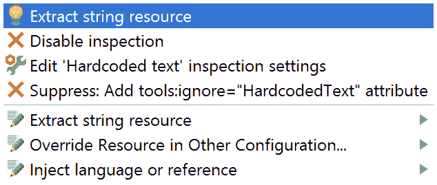
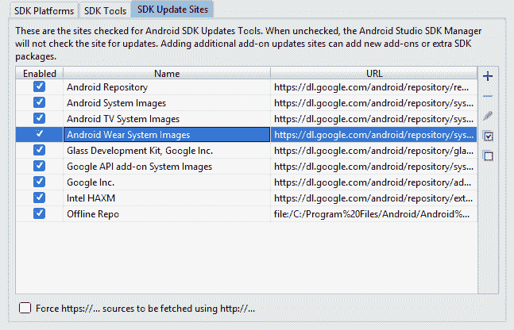
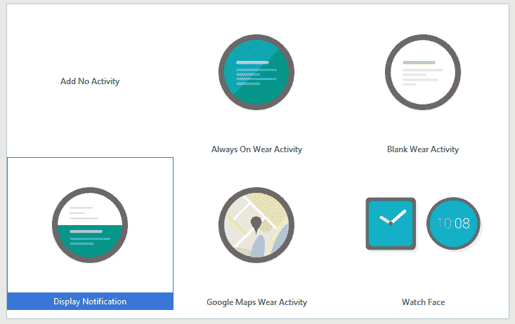
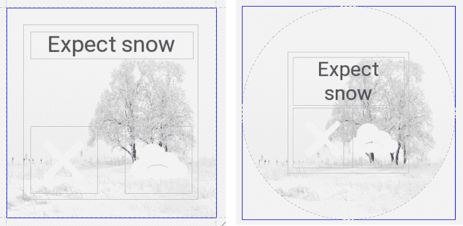
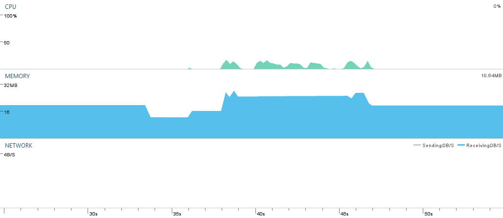
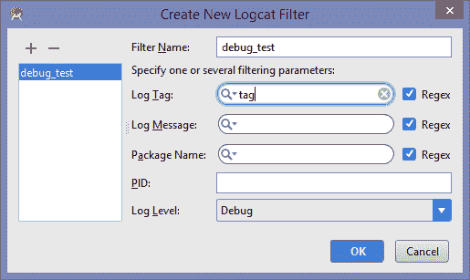

# 四、设备开发

Android Studio提供了一些非常强大的布局工具，使我们能够快速轻松地实验和开发用户界面。然而，也许任何安卓开发者面临的最大挑战是他们的应用可以运行的令人困惑的外形。

我们在前面的章节中看到了类，例如约束布局和库，例如百分比库，是如何帮助我们设计统一和一致的布局的。然而，这些技术只提供了一般的解决方案，我们都会偶然发现似乎并没有真正考虑到我们的设备而设计的应用。只要稍加了解和努力，这些设计错误就很容易避免。

在本章中，您将学会:

*   创建替代布局文件
*   提取字符串资源
*   管理屏幕旋转
*   配置资源
*   创建可穿戴用户界面
*   构建形状感知布局
*   读取传感器数据
*   使用虚拟传感器
*   应用工作室的模板
*   创建调试过滤器
*   监控设备

在研究如何开发我们的用户界面，使其在所有用户的设备上看起来都很棒之前，我们需要探索我们将遇到的最重要的布局情况:屏幕在纵向和横向模式之间的旋转。

# 屏幕方向

很大一部分为手机和平板电脑设计的安卓应用被设计成在横向和纵向模式下工作，并且通常会在这两种模式之间自动切换。许多活动，如视频，最好在横向模式下查看，而列表通常更容易在纵向扫描；然而，有一些活动，甚至整个应用，方向是固定的。

有一些布局看起来同样好，无论从哪种角度看，但这种情况并不常见；大多数时候，我们会希望为每个方向设计一个。Android Studio简化并加快了这一过程，为我们省去了从头开始开发替代布局的任务。

采取像这里这样的简单布局:


A portrait layout

通过单击设计编辑器顶部的布局变体工具，可以创建横向变体，如下所示:


The Layout Variant tool.

如果您重新创建此练习或创建一个自己的等效布局，您将很快看到像这样的布局在刚刚旋转时看起来不太好，您将不得不重新定位视图以最适合此纵横比。如果你尝试约束布局，你会发现它的一个缺点，最终的布局可能会很混乱。

如何重新创建这些布局取决于您自己的艺术和设计技能，但值得注意的是Android Studio存储和呈现这些文件的方式，因为这可能会有点令人困惑，尤其是如果您从 Eclipse 迁移，Eclipse 以不同的方式管理这些文件。

如果你在项目浏览器中打开你刚刚创建的项目，在安卓系统下，你会发现风景变量为`activity_main.xml (land)`，显然在`activity_main.xml`目录内。Studio 之所以这样呈现，是因为将我们所有的布局放在一个地方很方便，但这不是它们的存储方式。将项目资源管理器切换到项目视图将显示实际的文件结构，如下所示:


Project structure.

这个结构也可以从 IDE 顶部的导航栏中确定。

If you create layout variants like this, moving views into a more pleasing configuration, and give both versions the same ID, these will automatically animate between their two states when a user rotates their device. We will later see how to construct our own custom animations, but more often than not, the default animations are the best choice as they help promote a uniform user experience.

如果您重新创建了上面的例子，您可能已经注意到 IDE 执行了一个相当巧妙的技巧来加快提供文本资源的过程。

您已经知道硬编码字符串的使用被强烈反对。像许多编程范例一样，安卓开发是这样设计的，数据和代码是分开创建和处理的。硬编码字符串也使得翻译几乎不可能。

我们之前看到了快速修复功能如何允许我们自动实现方法。在这里，我们可以使用它来创建字符串资源，甚至不必打开`strings.xml`文件。

只需在布局文件中输入硬编码字符串，并按照快速修复提示将其提取为字符串资源。



String resource extraction.

布局编辑器提供了两种现成的变体，横向和超大，但我们可以创建自己的变体来适应我们选择的任何形状因素。

现在我们已经开始添加一些动态元素，如屏幕旋转，布局编辑器是不够的，我们需要在设备或模拟器上运行我们的应用。

# 虚拟设备

很长一段时间以来，**安卓虚拟设备** ( **AVDs** )都有漏洞百出、慢得吓人的名声。硬件加速的引入带来了很大的不同，但仍然建议使用功能强大的计算机，尤其是如果您想一次运行多个，这是非常常见的情况。

安卓仿真最大的变化不是硬件加速，而是替代仿真器的出现。正如我们将很快看到的，其中一些提供了明显优于原生仿真器的优势，但是 avd 不应该被忽略。尽管有这些缺点，安卓模拟器是唯一运行在所有安卓版本上的模拟器，包括最新的、只供开发人员使用的版本。不仅如此，安卓模拟器是最可定制的，任何可能的硬件或软件配置都可以通过一点努力重新创建。

在开发过程的早期，能够快速测试我们的想法是很重要的，使用一两个真实世界的设备可能是这种级别测试的最佳选择；然而，迟早我们需要确保我们的布局在所有可能的设备上看起来都很棒。

# 布局和图像质量

这里需要考虑两个问题:屏幕密度和长宽比。如果你以前做过安卓开发，你会知道 DPI 和屏幕大小分组。这些指定的文件夹提供了方便的快捷方式，以适应各种各样的可用外形，但我们都将体验过布局在我们的设备上不太好用的应用。这是完全可以避免的事情，虽然反击需要我们付出一些努力，但这将导致避免那些糟糕的评级，从而损害收入来源。

创建一个可以在尽可能多的外形上工作的应用是非常诱人的，Android Studio偶尔会鼓励你这样想。实际上，我们必须考虑设备的使用时间和地点。如果我们在等公共汽车，那么我们可能想要一个容易打开和关闭并且任务可以快速完成的游戏。虽然也有例外，但这些并不是人们选择长时间在大屏幕上玩的游戏。选择合适的平台至关重要，尽管这听起来可能与直觉相反，但排除一个平台通常比仅仅假设它可能赚取更多一点的收入更明智。

考虑到这一点，我们将考虑一款只为手机和平板电脑设计的应用；然而，除了查看熟悉的功能，如屏幕尺寸和密度，我们还将了解如何为许多其他配置问题提供定制资源。

两个最常用的资源名称是屏幕尺寸和密度。安卓提供以下四种尺寸指定。

*   `layout-small`:从 2 英寸到 4 英寸，320 x 420dp 或更大
*   `layout-normal`:3 到 5 英寸，320 x 480dp 或更大
*   `layout-large`:从 4 英寸到 7 英寸，480 x 640dp 或更大
*   `layout-xlarge`:7 到 10 英寸，720 x 960dp 或更大

If you are developing for Android 3.0 (API level 11) or below, devices at the lower end of this scale will often be categorized incorrectly. The only solution to this is to configure for individual devices or avoid developing for such devices at all.

一般来说，我们需要为以上每个尺寸制作一个布局。

使用**密度无关像素** ( **dp** 或 **dip** )意味着我们不需要为每个密度设置设计新的布局，但我们必须为每个密度类别提供单独的绘图，如下所示。

*   `drawable-ldpi`约 120dpi
*   `drawable-mdpi`约 160dpi
*   `drawable-hdpi` ~240dpi
*   `drawable-xhdpi`约 320dpi
*   `drawable-xxhdpi`约 480dpi
*   `drawable-xxxhdpi` ~640dpi

前面列表中的 dpi 值告知我们资源需要的相对像素大小。例如`drawable-xhdpi`目录中的位图需要是`drawable-mdpi`文件夹中的位图大小的两倍。

不可能在每台设备上创建完全相同的输出，这甚至是不可取的。人们购买高端设备是因为他们想要惊人的图像和精细的细节，我们应该努力提供这种水平的质量。另一方面，许多人出于方便和预算的原因购买小而便宜的设备，我们应该在设计中反映这些选择。与其试图在所有设备上再现完全相同的体验，我们应该思考人们选择他们的设备的原因以及他们想要从设备中获得什么。

下面的简短练习演示了这些差异如何在不同的屏幕配置中表现出来。这将使读者有机会看到如何最好地利用用户选择的设备，利用他们自己的艺术和设计智慧。

1.  选择任何高分辨率图像，最好是照片。
2.  使用您选择的任何工具，创建一个宽度和高度为原件一半的副本。
3.  打开一个新的Android Studio项目。
4.  从项目资源管理器中，在 res 目录内创建两个新的文件夹，称为`drawable-mdpi`和`drawable-hdpi`。
5.  将准备好的图像放在这些文件夹中。
6.  用图像视图和一些文本构建一个简单的布局。
7.  创建两个虚拟设备，一个具有`mdpi`密度，一个具有`hdpi`。
8.  最后，在每台设备上运行该应用，观察差异。


Devices with mdpi and hdpi densities.

这些实际上不是我们唯一可以使用的密度限定符。为电视设计的应用通常使用`tvdpi`限定词。该值介于`mdpi`和`hdpi`之间。还有`nodpi`限定符，当我们想要精确的像素映射时使用，还有`anydpi`，当所有的艺术品都是矢量可绘制的时候使用。

还有许多其他限定词，完整列表可在以下网址找到:

[developer . Android . com/guide/topics/resources/provider-resources . html](http://developer.android.com/guide/topics/resources/providing-resources.html)

现在值得看看一些更有用的。

# 规模和平台

前面讨论的广义限定词非常有用，适合大多数目的，并为我们节省了大量时间。然而，有时我们希望获得更多关于应用运行设备的确切信息。

我们想要了解的最重要的功能之一是屏幕尺寸。我们已经遇到了限定符，例如小、普通和大，但是我们还可以配置更精确的尺寸。其中最简单的是可用宽度和可用高度。例如`res/layout/w720dp`中的布局只有在最小可用 720dp 和高度时才会膨胀，当屏幕高度等于或大于 1024dp 时`res/layout/h1024dp`才会膨胀。

配置资源的另一个非常方便的特性是平台版本号。这是在应用编程接口级别运行的。因此，在安卓果冻豆设备上运行时，可以使用限定符`v16`作为要使用的资源。

能够为如此广泛的硬件选择和准备资源意味着我们可以为那些能够显示它们的设备提供大量资源，并为容量减少的设备提供更简单的资源。无论我们是为廉价手机还是高端平板电脑开发，我们仍然需要一些方法来测试我们的应用。我们已经看到了反车辆地雷有多灵活，但很值得快速了解一些替代方案。

# 替代仿真器

最好的替代仿真器之一可能是 Genymotion。不幸的是，这不是免费的，也不像原生 AVDs 那样是最新的，但它很快，支持拖放文件安装和移动网络功能。可在以下网址找到:

[www.genymotion.com](http://www.genymotion.com)

另一个快速且易于使用的仿真器是 Manymo。这是一个基于浏览器的模拟器，它的主要目的是测试网络应用，但它非常适合移动应用。它也不是免费的，但是它有许多现成的外形可供选择。可在以下网址找到:

[www.manymo.com](http://www.manymo.com)

在一个非常相似的静脉有开胃，它位于:

[开胃小菜](http://appetize.io)

这样的模拟器越来越多，但是从开发的角度来看，上面提到的模拟器可能是功能最强的。下面的列表将读者引向其他一些:

*   [www.andyroid.net](http://www.andyroid.net)
*   [www.bluestacks.com/app-player.html](http://www.bluestacks.com/app-player.html)
*   [www.droid4x.com](http://www.droid4x.com)
*   [drive . Google . com/file/d/0b 728 ypx KCl 8 wlh 5 dgdivxdis 0k/edit](http://drive.google.com/file/d/0B728YkPxkCL8Wlh5dGdiVXdIS0k/edit)

有一种情况是，这些替代产品都不适合，我们被迫使用 AVD 管理器，这就是我们想为智能手表等可穿戴设备开发的时候，这是我们接下来要考虑的。

# 安卓穿戴

可穿戴设备最近变得非常流行，安卓穿戴已经完全融入安卓软件开发工具包。Wear 项目的建立比其他项目稍微复杂一点，因为可穿戴设备实际上是一个伴随设备，应用本身从移动设备上运行。

尽管复杂程度很小，但为可穿戴设备开发可能很有趣，尤其是因为它们经常让我们接触到一些很酷的传感器，比如心率监视器。

# 连接到可佩戴的自动增值设备

很可能你可以使用可穿戴设备，但是在下面的练习中，我们将使用仿真器。这是因为这些设备有两种风格:方形和圆形。

当需要将这些仿真器中的一个与手机或平板电脑配对时，可以使用真实设备或另一个仿真器来完成，最好使用真实设备，因为这样对计算机的压力较小。这两种方法略有不同。下面的练习假设您正在将可穿戴仿真器与真实设备配对，并在最后解释了如何与仿真移动设备配对。

1.  在做任何其他事情之前，打开软件开发工具包管理器，检查您是否下载了安卓穿戴系统映像:



2.  打开 AVD 管理器，创建两个 AVD，一个圆形，一个方形。
3.  在手机上安装 Play 商店的 Android Wear 应用，并将其连接到电脑。
4.  找到并打开包含`adb.exe`文件的目录。这可以在`\AppData\Local\Android\Sdk\platform-tools\`中找到。
5.  发出以下命令:

```java
adb -d forward tcp:5601 tcp:5601
```

6.  在手机上启动配套应用，并按照屏幕上的说明配对设备。

You will need to execute the port forwarding command each time you reconnect the handset.

如果你打算将可穿戴设备与虚拟手机配对，过程非常相似，唯一的区别是配套应用的安装方式。按照以下步骤实现:

1.  启动或创建一个以谷歌应用接口为目标的 AVD。
2.  下载`com.google.android.wearable.app-2.apk`。网上有很多地方可以找到这个文件，比如 www.file-upload.net/download.
3.  将文件放在平台工具文件夹中，并使用以下工具安装:

```java
adb install com.google.android.wearable.app-2.apk 
```

4.  启动可穿戴式 AVD，在命令提示符下输入`adb devices`(如果在 Mac 上，则输入终端)，检查两个设备是否可见。
5.  进入`adb telnet localhost 5554`，其中`5554`为手机仿真器。
6.  最后进入`adb redir add tcp:5601:5601`。现在，您可以使用仿真手机上的 wear 应用，方式与上一练习中配对设备的方式相同。

虽然它是自动为我们添加的，但了解安卓穿戴应用需要支持库仍然很重要。这可以通过检查`build.gradle`文件中的模块级别来看到。

```java
 compile 'com.google.android.gms:play-services-wearable:10.2.0' 
```

随着我们的设备配对，我们可以开始实际开发和设计我们的可穿戴应用。

# 可穿戴布局

说到 Android Wear UI 开发，最有趣的挑战之一，就是这些智能手表进来的两种不同的造型。有两种方法可以解决这个问题。

一种类似于我们以前管理事物的方式，包括为每个形状因子设计布局，而另一种技术使用一种方法来产生适用于任一形状的布局。

除了这些技术之外，可穿戴支持库还配备了一些非常方便的小部件，适合弯曲和圆形的布局和列表。

Android Studio最有用和最有启发性的功能之一是项目模板，它是在项目第一次设置时提供的。这些有很好的选择，它们为大多数项目提供了很好的起点，尤其是 Wear 应用。



Wear templates

以这种方式开始一个项目可能会有所帮助和启示，甚至空白的活动模板也会建立 XML 和 Java 文件，从而创建一个非常可信的起点。

如果你从 Blank Wear Activity 开始一个项目，你会注意到的第一件事是，在我们之前只有一个模块(默认情况下称为 app)的地方，我们现在有两个模块，一个称为 mobile，用于替换 app，另一个称为 Wear。这两个模块都具有与我们之前遇到的相同的结构，包含清单、资源目录和 Java 活动。

# WatchViewStub 类

空白的磨损活动模板应用了我们前面讨论的第一种技术来管理不同的设备形状。这采取了`WatchViewStub`类的形式，可以在`wear/src/main/res/layout`文件夹中找到。

```java
<?xml version="1.0" encoding="utf-8"?> 
<android.support.wearable.view.WatchViewStub xmlns:android="http://schemas.android.com/apk/res/android" 
    xmlns:app="http://schemas.android.com/apk/res-auto" 
    xmlns:tools="http://schemas.android.com/tools" 
    android:id="@+id/watch_view_stub" 
    android:layout_width="match_parent" 
    android:layout_height="match_parent" 
    app:rectLayout="@layout/rect_activity_main" 
    app:roundLayout="@layout/round_activity_main" 
    tools:context="com.mew.kyle.wearable.MainActivity" 
    tools:deviceIds="wear" /> 
```

从前面的示例中可以看出，主活动将系统导向两种形状布局中的一种，模板也提供了这两种布局。

如您所见，这不是我们之前选择正确布局的方式，这是因为`WatchViewStub`操作不同，需要一个专门的监听器，一旦`WatchViewStub`检测到手表表面类型，就会放大我们的布局。这段代码也是由主活动 Java 文件中的模板提供的:

```java
@Override 
protected void onCreate(Bundle savedInstanceState) { 
    super.onCreate(savedInstanceState); 
    setContentView(R.layout.activity_main); 

    final WatchViewStub stub = (WatchViewStub) 
            findViewById(R.id.watch_view_stub); 

    stub.setOnLayoutInflatedListener(new WatchViewStub.OnLayoutInflatedListener() { 

        @Override 
        public void onLayoutInflated(WatchViewStub stub) { 
            mTextView = (TextView) stub.findViewById(R.id.text); 
        } 

    }); 
} 
```

很容易让人认为`WatchViewStub`是我们设计可穿戴布局所需要的一切。它允许我们独立地为两面进行设计，这正是我们想要做的。然而，磨损布局通常非常简单，实际上非常不鼓励复杂的设计。因此，只需一个图像和一个按钮的简单设计，拥有一个`shape-aware`类就可以方便地根据它发现自己被充气的设备的形状来分发它的内容。这就是`BoxInsetLayout`班的运作方式。

# 形状感知布局

`BoxInsetLayout`类是磨损用户界面库的一部分，允许我们只设计一个布局来优化方形和圆形手表表面。它通过在任何圆形框架内膨胀最大可能的正方形来做到这一点。这是一个简单的解决方案，但是 BoxInsetLayout 也能很好地确保我们选择的任何背景图像总是填满所有可用的空间。正如我们稍后将看到的，如果您在屏幕上水平放置组件，`BoxInsetLayout`类会自动分配它们，以获得最佳匹配。

当在Android Studio中为这些不同寻常的外形进行开发时，您首先要做的事情之一是利用布局编辑器提供的强大预览系统。这提供了每种类型的可穿戴设备的预览，以及您可能已经创建的任何 avd。这在测试布局时节省了大量时间，因为我们可以直接从集成开发环境中查看布局，而不必启动 AVD。

The preview tool can be accessed from the `View | Tool Windows` menu; or, if the layout Text editor is open; it can be found, by default, in the right hand margin.

与`WatchViewStubs`不同，`BoxInsetLayout`类不是由任何模板提供的，必须手动编码。按照下面的简单步骤，使用`BoxInsetLayout`类构建动态穿戴用户界面。

1.  在 wear 模块中创建以下`BoxInsetLayout`作为主 XML 活动的根容器:

```java
<android.support.wearable.view.BoxInsetLayout xmlns:android="http://schemas.android.com/apk/res/android" 
    xmlns:app="http://schemas.android.com/apk/res-auto" 
    xmlns:tools="http://schemas.android.com/tools" 
    android:layout_width="match_parent" 
    android:layout_height="match_parent" 
    android:background="@drawable/snow" 
    android:padding="15dp"> 

</android.support.wearable.view.BoxInsetLayout> 
```

2.  将此`FrameLayout`放入`BoxInsetLayout`类:

```java
<FrameLayout 
    android:id="@+id/wearable_layout" 
    android:layout_width="match_parent" 
    android:layout_height="match_parent" 
    android:padding="5dp" 
    app:layout_box="all"> 

</FrameLayout> 
```

3.  在`FrameLayout`中包括这些小部件(或您自己选择的小部件):

```java
<TextView 
    android:layout_width="match_parent" 
    android:layout_height="wrap_content" 
    android:gravity="center" 
    android:text="@string/weather_warning" 
    android:textAppearance= 
        "@style/TextAppearance.WearDiag.Title" 
    tools:textColor="@color/primary_text_light" /> 

<ImageView 
    android:layout_width="60dp" 
    android:layout_height="60dp" 
    android:layout_gravity="bottom|start" 
    android:contentDescription= 
        "@string/generic_cancel" 
    android:src="@drawable/ic_full_cancel" /> 

<ImageView 
    android:layout_width="60dp" 
    android:layout_height="60dp" 
    android:layout_gravity="bottom|end" 
    android:contentDescription= 
        "@string/buttons_rect_right_bottom" 
    android:src="@drawable/ic_full_sad" />
```

4.  最后，在圆形和方形模拟器上运行演示:



The BoxInsetLayout

`BoxInsetLayout`类非常容易使用。它不仅节省了我们的时间，还减少了我们应用的内存占用，因为即使是最简单的布局也有一些成本。在圆形视图中似乎有些浪费空间，但是穿戴式用户界面应该是裸露和剥离的，空白空间不是可以避免的；一个设计良好的可穿戴 UI 应该被用户快速掌握。

安卓穿戴设备最常用的功能之一是心率监视器，由于我们正在使用可穿戴设备，现在是时候看看我们如何访问传感器数据了。

# 访问传感器

戴在手腕上的设备是健身应用的理想选择，许多型号中包含心率监视器使它们非常适合此类任务。软件开发工具包管理所有传感器的方式几乎是相同的，所以看看一个如何工作也适用于其他传感器。

以下练习演示了如何在可穿戴设备上读取心率传感器:

1.  用手机和穿戴模块打开一个安卓穿戴项目。
2.  创建一个你选择的布局，确保你包括一个`TextView`来显示输出。

3.  打开穿戴模块中的`Manifest`文件，添加以下权限:

```java
<uses-permission 
    android:name="android.permission.BODY_SENSORS" /> 
```

4.  打开磨损模块中的`MainActivity.java`文件，添加以下字段:

```java
private TextView textView; 
private SensorManager sensorManager; 
private Sensor sensor; 
```

5.  让`Activity`实现一个传感器事件监听器，比如:

```java
public class MainActivity extends Activity implements SensorEventListener { 
```

6.  实现此所需的方法。
7.  编辑`onCreate()`方法如下:

```java
@Override 
protected void onCreate(Bundle savedInstanceState) { 
    super.onCreate(savedInstanceState); 
    setContentView(R.layout.activity_main); 

    textView = (TextView) findViewById(R.id.text_view); 

    sensorManager = ((SensorManager) getSystemService(SENSOR_SERVICE)); 
    sensor = sensorManager 
        .getDefaultSensor(Sensor 
        .TYPE_HEART_RATE); 
} 
```

8.  当活动开始或重新开始时，添加`onResume()`方法来注册监听器:

```java
@Override 
protected void onResume() { 
    super.onResume(); 

sensorManager.registerListener(this, this.sensor, 3); 
}
```

9.  然后添加`onPause()`方法，确保监听器在不需要时关闭:

```java
@Override 
protected void onPause() { 
    super.onPause() 

sensorManager.unregisterListener(this); 
} 
```

10.  最后，编辑`onSensorChanged()`回调，如下:

```java
@Override 
public void onSensorChanged(SensorEvent event) { 
   textView.setText("" + (int) event.values[0] + "bpm"); 
} 
```


如前所述，所有传感器都可以以相同的方式访问，当然，它们输出的值会因用途而异。这方面的完整文件可在以下网址找到:

[developer . Android . com/reference/Android/hardware/sensor . html](http://developer.android.com/reference/android/hardware/Sensor.html)

当然，现在读者会认为，如果没有实际的设备和传感器，这个练习毫无意义。幸运的是，有不止一种方法可以弥补仿真器中硬件的不足。

# 传感器仿真

如果你已经有一段时间没有使用安卓模拟器了，或者对它们还不熟悉，你很可能已经错过了每个 AVD 都有的扩展控件。这些可以从模拟器工具栏的底部访问。

这些扩展控件提供了一系列有用的功能，例如轻松设置模拟位置和替代输入方法的能力。我们感兴趣的是虚拟传感器。这些允许我们直接模拟各种传感器和输入值:


Virtual sensors

在仿真设备上运行传感器还有其他几种途径。其中大部分依赖于连接真实设备和使用它们的硬件。这些 SDK 控制器传感器可以从 Play 商店下载。GitHub 上还有一些很棒的传感器模拟器，我个人最喜欢的是:

[github . com/open attempts/传感器模拟器](http://github.com/openintents/sensorsimulator)

现在我们开始开发不仅仅是静态布局，我们可以开始利用 Studio 的一些更强大的监控工具。

# 设备监控

很多时候，简单地在设备或模拟器上运行一个应用就足以告诉我们我们设计的东西是否有效，以及我们需要改变什么。然而，看到幕后发生的事情总是很棒的，Android Studio有一些神奇的工具来实时监控应用的行为。

我们将在下一个模块中详细介绍调试，但是玩**安卓调试桥** ( **亚行**)永远不会太早，Android Studio的设备监视器工具是选择 IDE 而不是替代品的最大好处之一。

这一部分还提供了一个很好的机会来仔细看看项目模板，这是Android Studio的另一个神奇的功能。

# 项目模板

Android Studio附带了许多有用的项目模板。这些是为一系列典型的项目类型设计的，例如全屏应用或谷歌地图项目。模板是部分完成的项目，有代码、布局和资源，可以作为我们自己创作的起点。越来越多的材质设计使`Navigation Drawer Activity`模板成为最常用的模板之一，也是我们将用来检查设备监视器工具的模板。

`Navigation Drawer Activity`模板在几个方面都很有趣和有用。首先，注意有四个布局文件，包括我们熟悉的`activity_main.xml`文件。检查这段代码，您会注意到以下节点:

```java
<include 
    layout="@layout/app_bar_main" 
    android:layout_width="match_parent" 
    android:layout_height="match_parent" /> 
```

这个节点的目的很容易理解，它所引用的`app_bar_main.xml`文件包含协调器布局和我们在本书前面介绍的其他视图。`<include>`标签的使用并不是必须的，但是如果我们想要在另一个活动中重用该代码，它是非常有用的，当然它会产生看起来干净得多的代码。

对这个模板感兴趣的另一点是在可绘制目录中使用矢量图形。我们将在下一章中详细讨论这些内容，但现在只需知道它们提供了一种极好的方法来管理必须为每个屏幕密度分组提供单独图像的问题，因为它们将扩展到任何屏幕。

在我们了解如何监控应用的行为之前，先快速了解一下主要的活动 Java 代码。这很好地展示了各种特性是如何编码的，以及应该如何编码。示例功能不太可能与我们想要的相匹配，但是它们可以很容易地被替换和编辑，以适合我们的目的，并且可以从这个起点构建整个应用。

# 监测和分析

所有开发人员都想要的一个工具是在运行时监控应用的能力。观看用户行为对内存和处理器等硬件组件的实时影响是识别可能的瓶颈和其他问题的绝佳方式。Android Studio有一套复杂的分析工具，这将在下一个模块中得到彻底的检查。然而，Android Profiler 对于 UI 开发和编码都很有用，当然值得在这里简单看一下。

安卓轮廓仪可以从视图|工具窗口菜单、工具槽或按下 *Alt* + *6* 打开。默认情况下，它显示在集成开发环境的底部，但这可以使用设置图标进行自定义，以适应个人的偏好:



The Android Profiler

高级分析选项可通过“运行配置”对话框获得；这将在下一个模块中介绍。目前，还有另一个简单的调试/监控工具，可以非常方便地进行用户界面设计和开发。

剖析器提供的视觉反馈提供了许多有用的信息，但这些信息转瞬即逝，尽管高级剖析允许我们记录非常详细的检查，但我们通常只需要确认某个特定事件发生了，或者某些事件发生的顺序。

为此，我们可以使用另一个工具窗口 logcat，当我们只需要获得一些关于我们的应用如何以及做什么的基本文本反馈时，我们可以为此目的创建一个 logcat 过滤器。

为此，请执行以下步骤:

1.  通过“视图|工具窗口”菜单或从空白处打开日志文件工具窗口。
2.  从右侧的过滤器下拉列表中选择编辑过滤器配置。
3.  完成对话框，如下所示:



创建日志过滤器

4.  将以下字段添加到您的`main`活动中:

```java
private static final String DEBUG_TAG = "tag"; 
```

5.  包括以下导入:

```java
import android.util.Log;
```

6.  最后，在下面的代码中添加高亮显示的行:

```java
FloatingActionButton fab = (FloatingActionButton) findViewById(R.id.fab); 
fab.setOnClickListener(new View.OnClickListener() { 

    @Override 
    public void onClick(View view) { 
        Snackbar.make(view, "Replace with your own action", 
            Snackbar.LENGTH_LONG) 
                .setAction("Action", null) 
                .show(); 
        Log.d(DEBUG_TAG, "FAB clicked"); 
    } 

}); 
```

7.  在 logcat 打开的情况下运行应用，点击 FAB，将产生以下输出。

```java
...com.mew.kyle.devicemonitoringdemo D/tag: FAB clicked 
```

虽然这个例子很简单，但是这种技术的威力是显而易见的，这种形式的调试是检查简单 UI 行为、程序流和活动生命周期状态的最快和最简单的方法。

# 摘要

这一章涵盖了很多内容；我们已经在前面的章节中对 Android 布局进行了研究，并开始探索如何将这些布局从静态图形转变为更动态的结构。我们已经看到了 Android 如何提供类和库，使得针对不同屏幕的开发比使用其他 ides 更容易，以及仿真器如何用于产生所有可能的外形，包括最新的平台。

在我们进入编码之前，本模块中只有一章是关于布局和设计的；在其中，我们将介绍如何管理我们可用的众多资源，以及Android Studio如何在这方面帮助我们。